# 五、安装 Linux 发行版

在前一章中，我们看了准备硬盘使用。我们使用了`fdisk`和`parted`工具。我们看到了创建和删除分区的步骤。我们还看到了如何调整分区的大小。然后，我们将重点转向格式化分区以供使用。我们查看了当今 Linux 发行版上可用的各种文件系统。之后，我们看一下如何挂载分区来开始存储数据。然后，我们查看了卸载分区。最后，我们在`/etc/fstab`文件中创建了条目，以便在系统启动时加载我们的挂载点。在本章中，我们现在的重点是 Linux 发行版的实际安装，即从头开始安装 Linux 时引导到 LiveCD 所涉及的过程。然后，我们将重点关注与 Windows 操作系统并排安装 Linux。最后，我们将看看与另一个 Linux 发行版并排安装 Linux。

我们将在本章中学习以下主题:

*   了解 LiveCD 的使用
*   以全新安装方式安装 Linux 发行版
*   将 Linux 发行版与 Windows 操作系统并排安装
*   将 Linux 发行版与另一种风格的 Linux 并行安装

# 了解 LiveCD 的使用

当我们启动系统时，在安装 Linux 发行版时，我们有许多选项可以选择。我们可以使用所谓的 LiveCD 安装 Linux，而不是擦拭硬盘。请记住，这种体验可能看起来像是我们在安装一个 Linux 发行版，但实际上我们实际上是在临时将文件加载到内存中，而 LiveCD 就像是安装在实际的硬盘上一样。这是 LiveCD 的主要概念。

我们将在这个演示中使用 Ubuntu 发行版。首先，我们将系统设置为从光盘启动。然后我们启动系统:

在这里，我们有许多选项可供选择。第一个选项将把 Linux 发行版加载到内存中。其他选项，如安装 Ubuntu，将用于正常安装。我们还可以检查光盘是否有缺陷等等。

现在，使用光标，高亮显示不安装试试 Ubuntu，然后按*进入*。之后，系统将引导至 Linux 发行版:

从这里，我们可以像在已安装的操作系统上一样执行各种任务。当您的硬件不足，或者您的硬件非常旧，无法支持最新的操作系统时，这种优势就会出现。好吧，请放心，有许多 Linux 发行版可以满足这种环境。

Also, note that we can remove the CD/DVD from the drive and the system will continue to work without any error(s). Mostly, we will use a LiveCD to perform administrative task(s).

# 以全新安装方式安装 Linux 发行版

当我们只想做一些管理任务时，在 LiveCD 中工作是很好的。为此，我们可以安装一个 Linux 发行版作为完整安装；因为我们在硬盘上安装了 Linux。要继续 LiveCD 演示，我们将使用安装 Ubuntu...选项来执行全新安装。这将呈现以下设置:

1.  从这里，我们必须选择安装程序将继续使用的语言。有各种各样的语言可供选择。在我们的案例中，我们将接受默认的英语，并选择继续:

2.  现在，我们可以选择在安装过程中下载更新和/或安装第三方图形软件等。对于此部分，您将需要一个活动的互联网连接；原因是，系统会出去下载最新的更新，已经发布了。此外，当我们添加不属于系统的附加硬件时，它们需要默认情况下不会安装的模块(比如驱动程序)。因此，有第二种选择下载第三方软件。在我们的案例中，因为我们处于实验室环境中，所以我们将取消选中这些选项，并选择继续:

You will need an active internet connection to download updates.

3.  在这里，我们可以选择在整个硬盘上安装 Linux 发行版。如果出于某种原因，我们想在硬盘上添加一个或多个分区，那么我们将选择“其他”。此外，如果我们尝试使用 Windows 进行双引导，或者使用另一个 Linux 发行版进行并行安装，我们会选择此选项:

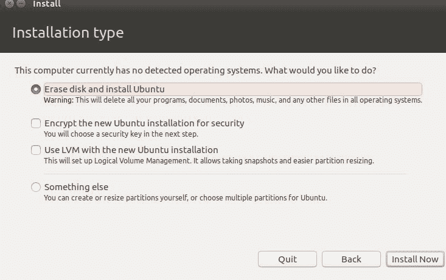

4.  对于全新的安装，让我们选择“其他”并创建我们自己的分区，并指定我们想要装载的内容:

5.  太好了。我们的环境中只有一个硬盘。我们将选择新建分区表。我们先创建一个 200 MB 的分区，挂载`/boot`；这是引导文件的存储位置:

It's always a good idea to create a partition for `/boot` so as to safeguard the boot files.

6.  接下来，让我们创建一个 13 GB 的分区，并指定它应该装载到`/`目录中。此外，我们还将分区类型指定为主分区，并将分区格式化为`ext3`文件系统:

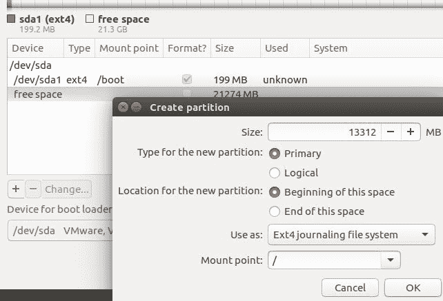

7.  接下来，让我们创建一个 5 GB 的分区，并指定它应该安装在`/home`上。这是用户文件的存储位置:

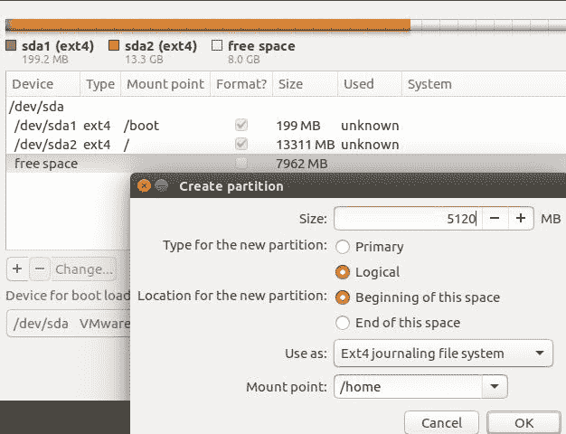

8.  太棒了。最后，让我们利用剩余的可用空间，并允许 Linux 发行版将其分配给交换内存:

从前面的截图中，您会注意到没有可用的装载点选项。这是因为我们指定将剩余的可用空间用作交换区。系统将根据需要使用交换(我们在前面的章节中看到了这一点；即[第 1 章](01.html#I3QM0-43f6e611c18f4c7abc8a9e3790317ae8)、*配置硬件设置*，在*查看中央处理器、内存、交换信息*部分。

9.  完成分区后，我们可以选择继续。这将显示一条警告消息:

接下来，我们将看到地区设置，您可以搜索您的国家并填写。就我而言，我在圭亚那；这是位于南美洲，所以我选择圭亚那，然后继续。

10.  之后，将显示键盘选择，您可以选择适当的设置。这将我们带到设置的关键部分:用户创建屏幕。我们为计算机指定一个名称，并使用超级机密密码创建一个用户帐户:

太好了。现在，我们正在走向新安装的 Linux 发行版。

11.  您始终可以通过选择安装系统旁边的下拉箭头来检查正在下载或安装的文件:

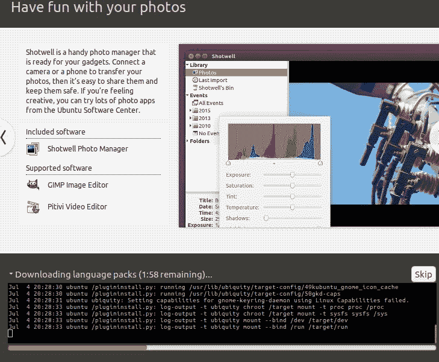

现在安装程序将下载各种语言包(需要互联网连接)。之后，安装程序将继续在硬盘上安装必要的文件。

最后，系统将要求我们使用新安装的 Linux 发行版重新启动系统。

Remove the CD, DVD, or USB drive after installation and before the system boots up.

# 将 Linux 发行版与 Windows 操作系统并排安装

在大多数环境中，您可能会遇到已经安装了另一个操作系统的系统，例如 Windows。理想情况下，您不会完全删除 Windows 安装，因为您可能需要一些仅在 Windows 安装上运行的软件，或者在系统上安装 Windows 是公司的政策。在这种情况下，您可以在 Windows 旁边安装 Linux 发行版，而无需擦除 Windows 分区。这之所以成为可能，是因为 Linux 能够识别 Windows 分区类型，例如 NTFS。Linux 不会以任何方式改变 Windows 分区。

让我们启动一个现有的 Windows 系统，并将系统配置为从 Ubuntu ISO 映像开始，看看我们如何实现双启动安装:

1.  从这里，Ubuntu 安装可以识别 Windows 10 操作系统。我们将选择最后一个选项，其他:

2.  接下来，我们将创建`/boot`分区:

3.  之后，我们将创建`/`分区:

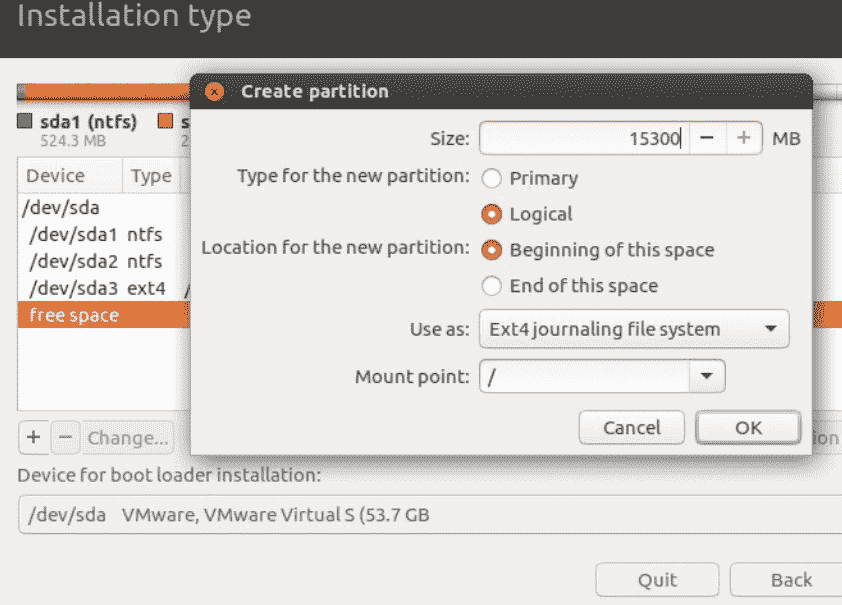

从前面的截图中，我们可以看到我们刚刚成功创建了`/`分区。您可能已经注意到了我们创建分区的模式。将系统文件与用户文件分开总是一个好主意。

4.  接下来，我们将创建`/home`分区:

5.  最后，我们将创建交换空间并使用剩余的可用空间:

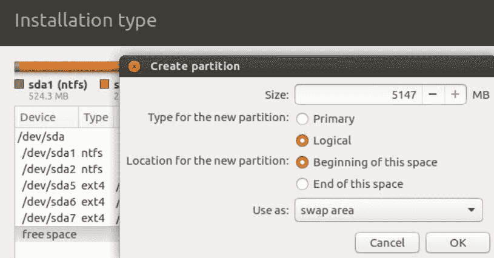

6.  最后一步是选择立即安装:

从前面的截图中，我们必须确认我们想要将更改写入磁盘。我们将选择继续。

We can always go back and make changes to the partition table by selecting Go Back.

现在，我们必须填写位置设置，类似于重新安装。我将再次选择圭亚那。

接下来，我们必须像以前一样创建一个用户帐户。必要的 Linux 文件将被安装到我们的双引导系统上。

7.  之后，系统会提示我们重新启动系统，并使用 GRUB2 显示我们的双启动菜单，如下图所示:

In some cases, if we have Linux as the first OS and then install Windows, sometimes Windows will remove the Linux boot entry. The best tool to remedy this is to run `grub-install`.

# 将 Linux 与另一种风格的 Linux 并行安装

在某些环境中，您可能需要适应不同的 Linux 发行版。您可以安装另一个发行版，而不会丢失您当前的 Linux 发行版，而不是删除您当前的 Linux 发行版。

让我们使用现有的 Ubuntu 系统，并在旁边安装 CentOS 7，以演示我们如何进行双引导:

1.  首先，我们将系统设置为从 CentOS 7 ISO 映像引导:

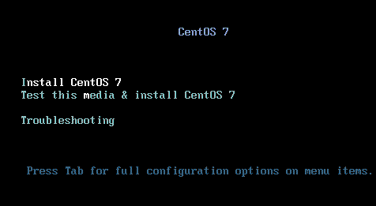

2.  从这里，我们选择第一个选项，按*进入*。这将启动 CentOS 7 的设置:

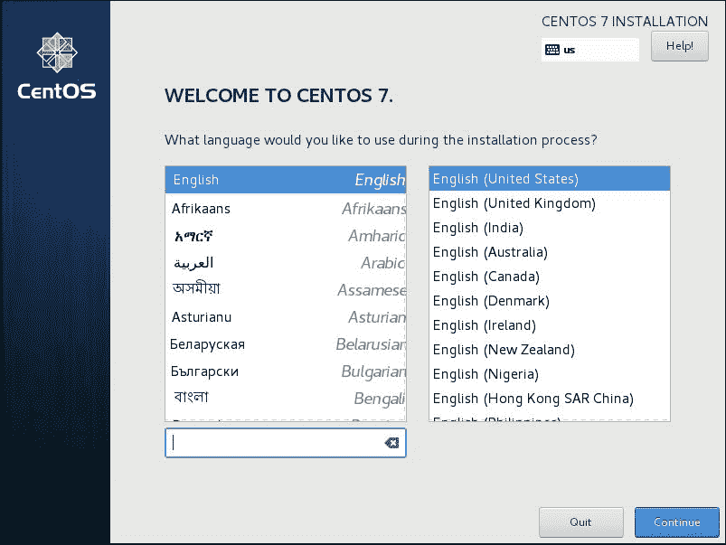

然后我们选择我们的语言并选择继续。

3.  在“安装摘要”页面上，关键的重要部分是软件选择和系统:

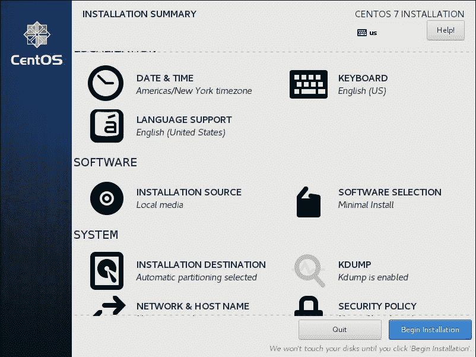

4.  默认情况下，CentOS 7 将执行最小安装。我们希望进行完整安装，因此选择软件选择:

从前面的截图中，默认情况下，选择了最小安装。我选择了基础环境下的 GNOME 桌面，并且选择了选中的插件。完成选择后，我将单击完成。

You can choose to add some or all the add-ons for a particular base environment.

5.  下一个重要部分，特别是在双引导环境中，在系统部分:安装目的地下。
6.  下面是我们要对硬盘进行分区的地方:

7.  默认情况下，系统会选择自动对硬盘进行分区。如果我们保留这个选项，并允许系统为我们创建分区，那么系统将根据它创建的每个分区的建议大小来创建分区。在本演示中，我们将选择“我将配置分区”。这将说明在 CentOS 7 环境中创建分区所涉及的各个步骤。接下来，我们将选择完成。这将带来分区屏幕:

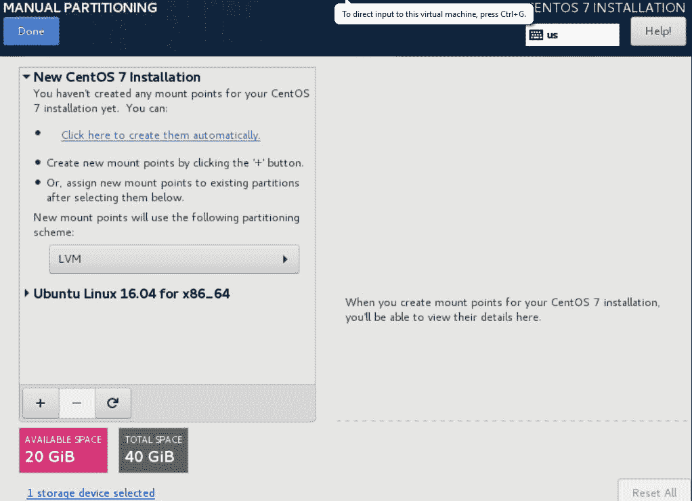

从前面的截图中，我们可以看到 CentOS 7 的安装已经检测到了 Ubuntu 的安装。

对于此次 CentOS 7 安装，我们将`/boot`安装到 CentOS 7 的`/boot`安装点。

Be careful whenever removing partitions as this can have some adverse effects on the operational status of your system. In other words, you may accidentally remove some critical configuration files that were stored on a partition(s), or, even worse, your system may be unable to boot.

8.  接下来，我们为 CentOS 7 创建`/`分区:

9.  然后我们创建`/home`分区:

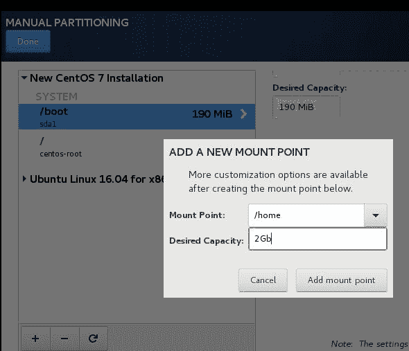

10.  最后，我们创建交换空间，用完剩余的可用空间:

11.  完成后，我们选择完成:

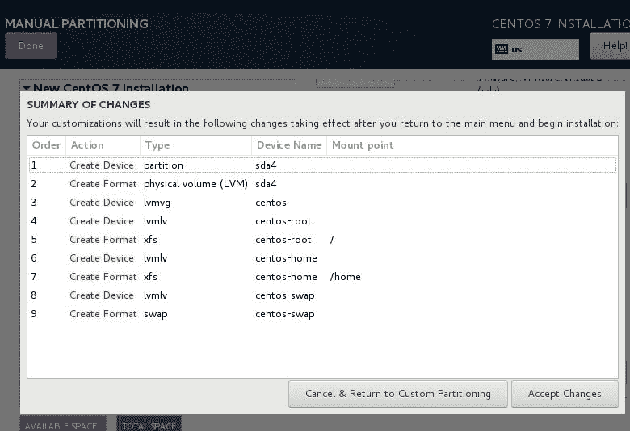

12.  现在，我们必须通过选择接受更改来确认我们的更改:

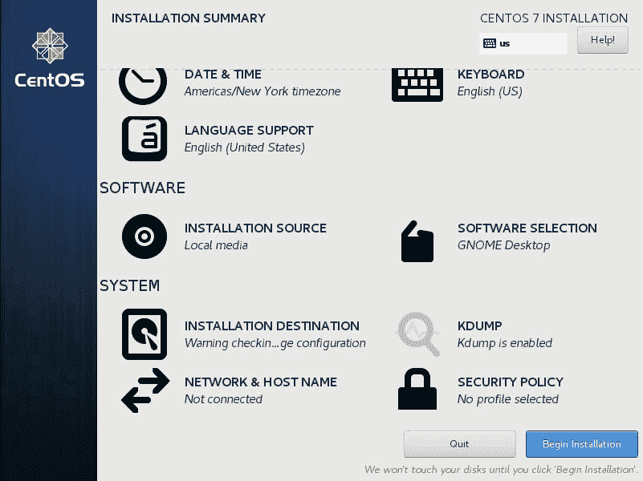

13.  当我们选择开始安装时，实际安装将开始。我们必须创建一个用户帐户:

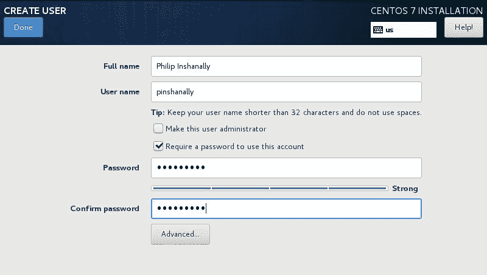

14.  然后我们需要看到一个根密码:

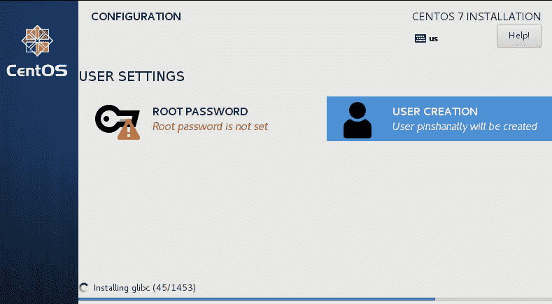

15.  我们应该设置一个没有人能猜到的困难密码:

16.  现在，我们将允许 CentOS 7 执行安装—给它一些时间。最后，系统会提示我们重新启动，因此我们将选择重新启动。

17.  最后，我们会看到我们的双启动菜单，显示 CentOS 7 和 Ubuntu，如下图所示:

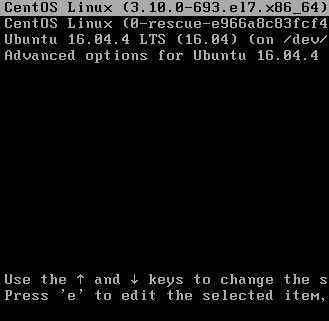

如您所见，我们现在可以选择加载哪个 Linux 发行版。

# 摘要

在这一章中，我们当然深入探讨了 Linux 发行版的安装。我们讨论了 LiveCD 的概念。我们讨论了使用 LiveCD 的场景；也就是说，当我们想要测试时，当我们有硬件资源时，或者在执行一些管理任务时。然后我们做了一个使用 LiveCD 的演示。请记住，实际的 Linux 发行版是从硬盘以外的介质运行的。它通过将一些文件加载到内存中来实现这一点。LiveCD 提供的一个明显优势是，它不会干扰您的底层操作系统。然后，我们将注意力转移到重新安装 Linux 发行版上。执行全新安装的步骤因发行版而异。之后，我们重点做了 Windows 和 Linux 的双引导，特别是 Windows 10 和 Ubuntu。最后，我们通过在 Linux 发行版之间进行双引导来结束这一章，特别是 CentOS 和 Ubuntu。

接下来，我们将讨论红帽世界的另一面:Debian 环境。也就是说，我们将主要关注 Ubuntu 环境中的包管理，涵盖所使用的各种技术，例如`dpkg`、`apt`和`aptitude`，仅举几例。我希望你能和我一起进入另一个激动人心的篇章，带你离实现认证目标更近一步。

# 问题

1.  使用 LiveCD 时，临时文件存储在哪里？

A.硬盘
B. LiveCD
C. RAM
D .以上都不是

2.  哪个选项启动 Ubuntu LiveCD？

A.从第一个硬盘启动
B .测试完整性
C .现在安装
D .不安装尝试 Ubuntu

3.  在 Ubuntu LiveCD 的桌面上，你会选择哪个选项进行全新安装？

A.安装 Ubuntu…
B .尝试 Ubuntu 并安装
C .重启并从硬盘启动
D .全新安装

4.  在进行全新安装时下载更新时，需要什么？

A.复杂编码
B .活跃的互联网连接
C .将文件从安装介质复制到硬盘
D .不需要任何要求

5.  什么选项允许我们在安装类型下创建自己的分区？

A.其他东西
B .擦除整个硬盘
C .复制整个硬盘
D .加密整个硬盘

6.  系统需要哪种类型的分区才能启动？

A.逻辑
B .扩展
C .初级
D .次级

7.  为什么要把`/boot`分区和其他分区分开？

A.能够在`/boot` B 下载我们的视频，防止不小心删除`/boot` C 的文件导致系统无法开机，证明我们知道如何分区
D，证明所有的系统文件都安装在`/boot`

8.  在 CentOS 7 安装中，选择哪个命令来创建自定义分区？

A.自动配置分区
B .我将配置分区
C .加密我的数据
D .创建逻辑卷

9.  如果 Windows 安装在尝试进行**双**引导时删除了 GRUB，使用哪个命令来安装 GRUB？

A.`grub-install`T4【b .】`grub`T5【c .】`grub-update`T6【d .`grub-configure`

10.  CentOS 7 的默认软件选择是什么？

A.GNOME 桌面
B. KDE 桌面
C. XFCE 桌面
D .最小安装

# 进一步阅读

*   您可以在:[https://www.centos.org](https://www.centos.org)获得关于 CentOS 发行版的更多信息，如安装、配置最佳实践等。
*   这个网站从 Linux 社区的用户那里给了你很多有用的提示和最佳实践，特别是对于 Debian 发行版，比如 Ubuntu:[https://askubuntu.com](https://askubuntu.com)。
*   最后一个链接为您提供了与在 CentOS 和 Ubuntu 上工作的各种命令相关的一般信息。你可以在那里发布你的问题，其他社区成员会回复:[https://www.linuxquestions.org](https://www.linuxquestions.org)。