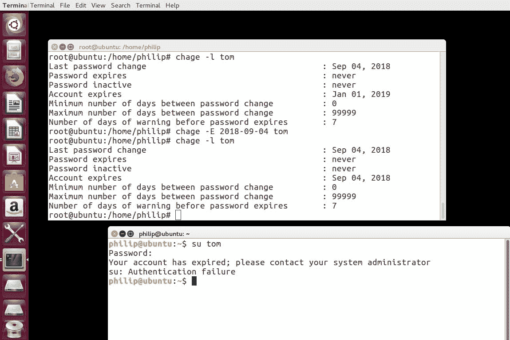
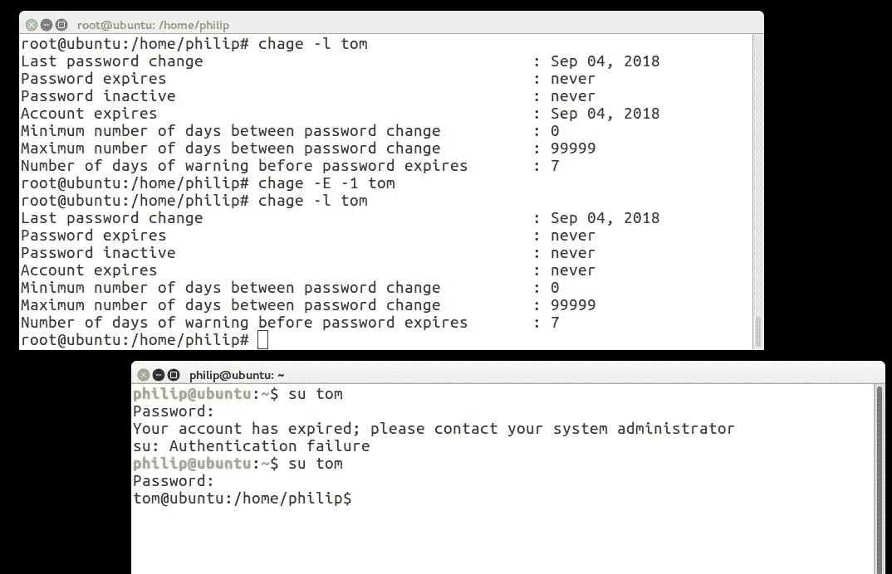
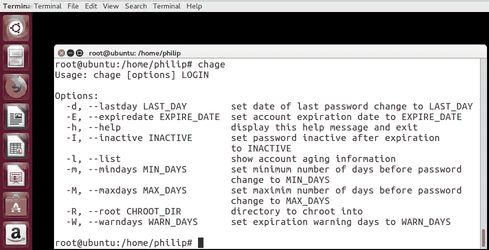
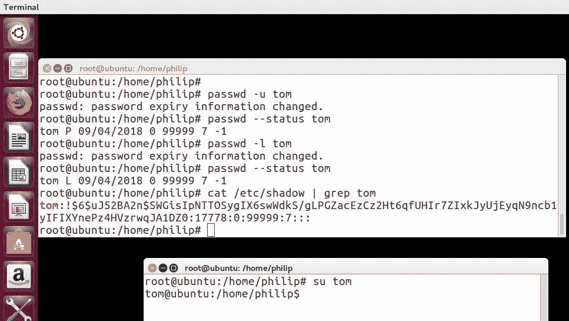

# 十二、管理用户和组帐户

在前一章中，介绍了显示管理器。我们谈到了 XDM、KDM、GDM 和莱特姆。显示管理器和桌面之间的差异被识别。我们从在 CentOS 系统中与 XDM 合作开始。接下来，我们将注意力转向了 KDM。接下来，GDM 是我们的下一个议程。此外，我们还介绍了在混合环境中安装一些台式机。最后，介绍了 Lightdm。使用 Fedora 28 发行版强调了启动和运行 Lightdm 的技术。安装各种显示管理器和在显示管理器之间切换的过程是上一章的重点。

在本章中，主题将是用户和组帐户。到目前为止，我们已经讨论了 Linux 环境中的一些关键领域。我们的重点从管理用户账户的过程开始；诸如用户创建和删除、目录修改、设置密码、权限和所有权之类的事情将是重点。此后，将对范围进行分组；我们将深入研究用于管理团队的技术。将介绍创建和删除组、将用户分配到组、权限等过程。我鼓励大家在接下来的章节中再次加入我，以便更好地管理用户和群组。

我们将在本章中讨论以下主题:

*   创建新用户时使用的目录
*   管理用户帐户
*   管理组

# 创建新用户时使用的目录

每次我们在系统中使用`useradd`命令创建一个新用户时，都会发生许多事件。首先，就将为新用户生成的目录而言，有一个适当的结构。该结构存储在骨架目录中；这位于`/etc/skel`目录中。`/etc/skel`目录包含文件和文件夹，它们被复制到新用户的主目录中。我们可以使用我们的 Ubuntu 系统来看一下框架目录:

```sh
root@ubuntu:/home/philip# ls -a /etc/skel/
.  ..  .bash_logout  .bashrc  examples.desktop  .profile
root@ubuntu:/home/philip#
```

每个新用户都从这里获取自己的结构。点(`.`)表示隐藏文件。文件如`/etc/skel/.logout`、`/etc/.skel/.bashrc`、`/etc/skel/.profile`。

# 那个。bash_logout

请注意`.bash_history`是注销期间执行的命令的存储位置。它只是清除屏幕，以确保注销时的隐私。这可以在以下命令中看到:

```sh
root@ubuntu:/home/philip# cat /home/philip/.bash_logout
# ~/.bash_logout: executed by bash(1) when login shell exits.
# when leaving the console clear the screen to increase privacy
if [ "$SHLVL" = 1 ]; then
 [ -x /usr/bin/clear_console ] && /usr/bin/clear_console -q
fi
root@ubuntu:/home/philip#
```

# 那个。bashrc

`/etc/skel/.bashrc`通常用于存储各种别名。这可以通过查看`/etc/skel/.bashrc`看到:

```sh
root@ubuntu:/home/philip# cat /etc/skel/.bashrc
# colored GCC warnings and errors
#export GCC_COLORS='error=01;31:warning=01;35:note=01;36:caret=01;32:locus=01:quote=01'
# some more ls aliases
alias ll='ls -alF'
alias la='ls -A'
alias l='ls -CF'
root@ubuntu:/home/philip#
```

为了简洁起见，省略了一些输出。基于前面的输出，已经为我们定义了一些别名；一个这样的例子是`alias ll='ls -af'`。

# 那个。轮廓

让我们考虑一下`/etc/skel/.profile`，因为它执行许多任务；其中之一就是检查`$Home/.bashrc`的存在。这一点通过观察`/etc/skel/.profile`可以明显看出:

```sh
root@ubuntu:/home/philip# cat /etc/skel/.profile
#umask 022
# if running bash
if [ -n "$BASH_VERSION" ]; then
 # include .bashrc if it exists
 if [ -f "$HOME/.bashrc" ]; then
 . "$HOME/.bashrc"
 fi
fi
# set PATH so it includes user's private bin directories
PATH="$HOME/bin:$HOME/.local/bin:$PATH"
root@ubuntu:/home/philip#
```

为了简洁起见，省略了一些输出。基于前面的输出，我们可以看到`#if running bash`部分。查看这些目录是否确实被复制的另一种方法是查看现有用户。我们将结合使用`ls`命令和`egrep`命令:

```sh
root@ubuntu:/home/philip# ls -a ~ | egrep '.bash|.profile'
.bash_history
.bashrc
.profile
root@ubuntu:/home/philip#
```

干得好！基于前面的输出，我们可以看到`.bash_history`、`.bashrc`和`.profile`。

# 那个。bash_history

在命令提示符下执行的每个命令都存储在`.bash_history`中。此外，`.bash_history`仅在我们开始在命令提示符下运行命令后创建。`/home/philip/.bash_history`下面简单介绍一下:

```sh
root@ubuntu:/home/philip# cat /home/philip/.bash_history
ls /etc/grub.d/
cat /var/log/Xorg.0.log | less
startx
sudo su
Xorg -configure
rm /tmp/.X0-lock
sudo su
su
sudo su
root@ubuntu:/home/philip#
```

为了简洁起见，省略了一些输出。

此外，我们可以检查其他用户是否存在各种`.bash`文件:

```sh
root@ubuntu:/home/philip# ls -a /home/philip | egrep '.bash|.profile'
.bash_history
.bash_logout
.bashrc
.profile
root@ubuntu:/home/philip#
```

干得好！我们可以看到`.bash_history`、`.bash_logout`、`.bashrc`和`.profile`。

使用`useradd`命令创建新用户时，识别`/etc/skel`目录正在使用的另一种方法是调用`useradd`命令并传递`-D`选项:

```sh
root@ubuntu:/home/philip# useradd -D
GROUP=100
HOME=/home
INACTIVE=-1
EXPIRE=
SHELL=/bin/sh
SKEL=/etc/skel
CREATE_MAIL_SPOOL=no
root@ubuntu:/home/philip#
```

基于前面的输出，我们获得了丰富的信息。特别地，`SKEL=/etc/skel`表示创建新用户时使用哪个目录。

# 管理用户帐户

到目前为止，在前面的章节中，我们已经使用了两个用户帐户；标准用户和根用户。在 Linux 中，我们可以通过图形用户界面工具或命令行创建用户帐户。在 shell 中，我们使用`useradd`命令来创建一个新的用户帐户。在较新的发行版中，也有`adduser`命令。在某些发行版中，例如 CentOS，`adduser`是一个符号链接。这可以从这里看出:

```sh
[root@localhost philip]# ll /usr/sbin/adduser
lrwxrwxrwx. 1 root root 7 Jun 20 09:19 /usr/sbin/adduser -> useradd
[root@localhost philip]#
```

在 Ubuntu 上，`adduser`命令与`useradd`命令是分开的:

```sh
root@ubuntu:/home/philip# ll /usr/sbin/adduser
-rwxr-xr-x 1 root root 37276 Jul  2  2015 /usr/sbin/adduser*
root@ubuntu:/home/philip#
```

使用`useradd`命令时的基本语法是`useradd <option> username`。默认情况下，标准用户无法创建用户帐户。这可以从这里看出:

```sh
philip@ubuntu:~$ useradd tom
useradd: Permission denied.
useradd: cannot lock /etc/passwd; try again later.
philip@ubuntu:~$
```

基于前面的输出，我们会收到一条`Permission denied`消息。

By default, standard users cannot create user accounts.

要创建新用户，我们将继续作为根用户。我们将用[第 17 章](17.html#688M40-43f6e611c18f4c7abc8a9e3790317ae8)*执行安全管理任务*中的`sudoers`文件来涵盖管理权限。这里使用的是根用户:

```sh
root@ubuntu:/home/philip# useradd tom
root@ubuntu:/home/philip#
```

根据前面的输出，我们没有得到任何指示来验证新用户是否已经创建。放心，我们可以通过查看`/home`目录确认:

```sh
root@ubuntu:/home/philip# cat /etc/passwd
rtkit:x:118:126:RealtimeKit,,,:/proc:/bin/false
saned:x:119:127::/var/lib/saned:/bin/false
usbmux:x:120:46:usbmux daemon,,,:/var/lib/usbmux:/bin/false
philip:x:1000:1000:philip,,,:/home/philip:/bin/bash
gdm:x:121:129:Gnome Display Manager:/var/lib/gdm3:/bin/false
geoclue:x:122:130::/var/lib/geoclue:/bin/false
tom:x:1001:1001::/home/tom:
root@ubuntu:/home/philip#
```

为了简洁起见，省略了一些输出。最后一个条目显示新的用户信息。我们对此的理解如下:

```sh
tom=user
x=password placeholder
1001=UID
1001=GID
/home/tome=home directory for Tom
```

但是，如果我们比较另一个用户的条目，我们会得到以下结果:

```sh
 philip:x:1000:1000:philip,,,:/home/philip:/bin/bash
```

基于前面的输出，最后的`:/bin/bash`部分为用户定义了 Shell。我们创建的用户没有分配 Shell。此外，我们需要看到用户的密码。为了设置密码，我们将使用`passwd`命令:

```sh
root@ubuntu:/home/philip# passwd tom
Enter new UNIX password:
Retype new UNIX password:
passwd: password updated successfully
root@ubuntu:/home/philip#
```

干得好！现在，让我们注销并尝试使用`tom`帐户登录:


干得好！我们可以看到新用户出现，但是当我们尝试登录时，系统会不断弹出我们，因为我们已经为用户定义了一个 Shell。让我们通过移除用户并再次添加用户来解决这个问题。我们将使用`userdel`命令删除用户:

```sh
root@ubuntu:/home/philip# userdel -r tom
userdel: tom mail spool (/var/mail/tom) not found
userdel: tom home directory (/home/tom) not found
root@ubuntu:/home/philip#
root@ubuntu:/home/philip# cat /etc/passwd
philip:x:1000:1000:philip,,,:/home/philip:/bin/bash
gdm:x:121:129:Gnome Display Manager:/var/lib/gdm3:/bin/false
geoclue:x:122:130::/var/lib/geoclue:/bin/false
root@ubuntu:/home/philip#
```

太好了。现在，让我们创建用户并通过`-s`选项。这将为用户定义用于`useradd`命令的 Shell:

```sh
root@ubuntu:/home/philip# useradd -s /bin/bash tom
root@ubuntu:/home/philip# cat /etc/passwd:
philip:x:1000:1000:philip,,,:/home/philip:/bin/bash
gdm:x:121:129:Gnome Display Manager:/var/lib/gdm3:/bin/false
geoclue:x:122:130::/var/lib/geoclue:/bin/false
tom:x:1001:1001::/home/tom:/bin/bash
root@ubuntu:/home/philip#
```

干得好！现在我们可以看到在最后一个条目中，用户`tom`被分配了一个`/bin/bash`Shell。`/etc/passwd`另一个有趣的部分是列出的每个账户中的`x`。

我们说它代表密码，但是没有设置`x`为密码，那么`x`有什么关系呢？嗯，`x`简单来说就是密码，是加密的；它实际上存储在一个单独的位置。`/etc/shadow`目录存储密码。我们可以看一下`/etc/shadow`目录以供参考:

```sh
root@ubuntu:/home/philip# passwd tom
Enter new UNIX password:
Retype new UNIX password:
passwd: password updated successfully
root@ubuntu:/home/philip#
root@ubuntu:/home/philip# cat /etc/shadow
messagebus:*:16911:0:99999:7:::
uuidd:*:16911:0:99999:7:::
lightdm:*:16911:0:99999:7:::
whoopsie:*:16911:0:99999:7:::
avahi-autoipd:*:16911:0:99999:7:::
avahi:*:16911:0:99999:7:::
dnsmasq:*:16911:0:99999:7:::
colord:*:16911:0:99999:7:::
gdm:*:17770:0:99999:7:::
geoclue:*:17770:0:99999:7:::
tom:!:17778:0:99999:7:::
root@ubuntu:/home/philip#
```

为了简洁起见，省略了一些输出。根据前面的输出，我们可以看到每个帐户的实际加密密码。

# 更改命令

关于用户帐户的另一个有趣的方面涉及密码的老化时间；密码的有效期。我们可以使用`chage`命令查看给定用户的到期时间。让我们为用户`tom`创建一个密码，然后检查新用户的密码时效设置:

You must have root privileges to change the password aging parameters.

```sh
root@ubuntu:/home/philip# passwd tom
Enter new UNIX password:
Retype new UNIX password:
passwd: password updated successfully
root@ubuntu:/home/philip#
```


太棒了！基于前面的输出，我们使用`-l`选项来显示到期设置；我们可以看到一些有价值的信息，特别是，`Last password change`、`Password expires`、`Account expires`。我们可以通过传递各种选项来改变这些值。例如，让我们改变`Account expires`。我们使用`-E`选项:

```sh
root@ubuntu:/home/philip# chage -E 2018-09-04 tom
root@ubuntu:/home/philip# chage -l tom
Last password change                                                                : Sep 04, 2018
Password expires                                                                    : never
Password inactive                                                                   : never
Account expires                                                                     : Sep 04, 2018
Minimum number of days between password change                                       : 0
Maximum number of days between password change                                      : 99999
Number of days of warning before password expires                                   : 7
root@ubuntu:/home/philip#
```

干得好！根据前面的输出，我们已经将帐户设置为在本演示的当前时间到期。现在，为了查看这一更改的效果，我们将打开另一个终端，并尝试以用户`tom`身份登录:



干得好！基于前面的输出，我们看到了试图以用户`tom`身份登录时返回的消息。要删除用户`tom`的此过期时间，我们将使用`-1`作为值:

```sh
root@ubuntu:/home/philip# chage -E -1 tom
root@ubuntu:/home/philip# chage -l tom
Last password change                                                                : Sep 04, 2018
Password expires                                                                    : never
Password inactive                                                                   : never
Account  expires                                                                    : never
Minimum number of days between password change                                      : 0
Maximum number of days between password change                                      : 99999
Number of days of warning before password expires                                   : 7
root@ubuntu:/home/philip#
```

现在，我们将能够以用户`tom`身份登录:



太棒了！基于前面的内容，我们可以看到使用`chage`命令的有效性。要查看可用`chage`命令传递的选项，我们可以执行以下操作:

```sh
root@ubuntu:/home/philip# chage
```



# usermod 命令

前面我们看到，要进行任何更改，我们必须使用`useradd`命令删除用户。每次我们决定改变时，这可能会很麻烦；相反，我们可以利用另一个强大的命令:`usermod`命令。`usermod`命令的基本语法如下:

```sh
usermod <option> username
```

使用我们的测试用户`tom`，我们可以使用`usermod`命令更改许多参数。比如我们可以为用户`tom`锁定账号，这样会阻止用户`tom`登录系统。要锁定帐户，我们可以使用`-L`选项:

```sh
root@ubuntu:/home/philip# cat /etc/passwd
philip:x:1000:1000:philip,,,:/home/philip:/bin/bash
gdm:x:121:129:Gnome Display Manager:/var/lib/gdm3:/bin/false
geoclue:x:122:130::/var/lib/geoclue:/bin/false
tom:x:1001:1001::/home/tom:
root@ubuntu:/home/philip# usermod -L tom
root@ubuntu:/home/philip#
```


干得好！根据前面的输出，用户`tom`无法登录。一个有趣的注意点是`/etc/shadow`内的用户条目`tom`在第二个字段的密码前显示`!`，代表密码:

```sh
root@ubuntu:/home/philip# cat /etc/shadow | grep tom
tom:!$6$uJ52BA2n$SWGisIpNTTOSygIX6swWdkS/gLPGZacEzCz2Ht6qfUHIr7ZIxkJyUjEyqN9ncb1yIFIXYnePz4HVzrwqJA1DZ0:17778:0:99999:7:::
root@ubuntu:
 root@ubuntu:/home/philip# cat /etc/shadow | grep philip
philip:$1$8gQrKziP$v6Uv6
root@ubuntu:/home/philip#
```

基于前述，用户`philip`的密码前面没有`!`。验证帐户是否被锁定的另一种方法是使用`passwd`命令。我们通过`--status`选项:

```sh
root@ubuntu:/home/philip# passwd --status tom
tom L 09/04/2018 0 99999 7 -1
root@ubuntu:/home/philip#
```

干得好！注意`L`表示用户账号当前被锁定。我们可以通过使用`usermod`命令并传递`-U`选项来解锁用户帐户:

```sh
root@ubuntu:/home/philip# usermod -U tom
root@ubuntu:/home/philip# passwd --status tom
tom P 09/04/2018 0 99999 7 -1
root@ubuntu:/home/philip#
```

干得好！基于前面的输出，`P`表示用户`tom`有可用密码；这意味着帐户已解锁:


太棒了！现在，当我们再次查看`etc/shadow`时，我们将不再看到哈希密码前面的`!`:

```sh
root@ubuntu:/home/philip# cat /etc/shadow | grep tom
tom:$6$uJ52BA2n$SWGisIpNTTOSygIX6swWdkS/gLPGZacEzCz2Ht6qfUHIr7ZIxkJyUjEyqN9ncb1yIFIXYnePz4HVzrwqJA1DZ0:17778:0:99999:7:::
root@ubuntu:/home/philip#
```

太棒了。如果我们添加了一个用户而没有指定 Shell，我们也可以为用户定义一个 Shell；我们通过`usermod`命令传递`-s`选项:

```sh
root@ubuntu:/home/philip# cat /etc/passwd
gdm:x:121:129:Gnome Display Manager:/var/lib/gdm3:/bin/false
geoclue:x:122:130::/var/lib/geoclue:/bin/false
tom:x:1001:1001::/home/tom:
root@ubuntu:/home/philip# usermod -s /bin/bash tom
root@ubuntu:/home/philip# cat /etc/passwd
gdm:x:121:129:Gnome Display Manager:/var/lib/gdm3:/bin/false
geoclue:x:122:130::/var/lib/geoclue:/bin/false
tom:x:1001:1001::/home/tom:/bin/bash
root@ubuntu:/home/philip#
```

干得好！锁定账户的另一种方法是使用`passwd`命令；我们通过`-l`选项。让我们锁定用户`tom`:

```sh
root@ubuntu:/home/philip# passwd -l tom
passwd: password expiry information changed.
root@ubuntu:/home/philip# passwd --status tom
tom L 09/04/2018 0 99999 7 -1
root@ubuntu:/home/philip#
```

再一次，当我们尝试以用户`tom`身份登录时，我们会看到这样的情况:


干得好！另外，我们可以使用`passwd`命令解锁账户；我们将通过`-u`选项:

```sh
root@ubuntu:/home/philip# passwd -u tom
passwd: password expiry information changed.
```

```sh
root@ubuntu:/home/philip# passwd --status tom
tom P 09/04/2018 0 99999 7 -1
root@ubuntu:/home/philip#
```

太棒了。注意根用户仍然可以使用`tom`用户登录，是！我们可以通过再次锁定用户`tom`来说明这一点:

```sh
root@ubuntu:/home/philip# passwd -l tom
passwd: password expiry information changed.
root@ubuntu:/home/philip# passwd --status tom
tom L 09/04/2018 0 99999 7 -1
root@ubuntu:/home/philip# cat /etc/shadow | grep tom
tom:!$6$uJ52BA2n$SWGisIpNTTOSygIX6swWdkS/gLPGZacEzCz2Ht6qfUHIr7ZIxkJyUjEyqN9ncb1yIFIXYnePz4HVzrwqJA1DZ0:17778:0:99999:7:::
root@ubuntu:/home/philip#
```

根据前面的输出，从所有迹象来看，用户`tom`帐户似乎已被禁用，但请检查以下内容:



太棒了。事情是这样的，当有人试图以用户`tom`身份登录时，他们将被阻止，除非他们首先成为根用户，因为锁**不会**阻止根用户访问锁定的帐户。

The root user can access any account.

当我们管理用户账户时；他们的一些基本信息来自一个特殊的配置文件:`/etc/login.def`文件。我们可以看看`/etc/login.def`:

```sh
root@ubuntu:/home/philip# cat /etc/login.defs
# /etc/login.defs - Configuration control definitions for the login package.
# Three items must be defined:  MAIL_DIR, ENV_SUPATH, and ENV_PATH.
# If unspecified, some arbitrary (and possibly incorrect) value will
SU_NAME                           su
PASS_MAX_DAYS            99999
PASS_MIN_DAYS             0
PASS_WARN_AGE          7
root@ubuntu:/home/philip#
```

为了简洁起见，省略了一些输出。基于前面的输出，我们可以看到`su`和`chage`命令的设置。

# w 命令

`w`命令显示系统中当前登录的用户。我们可以看一下`w`命令:

```sh
root@ubuntu:/home/philip# w
 08:00:03 up 22:14,  4 users,  load average: 0.04, 0.01, 0.00
USER     TTY      FROM             LOGIN@   IDLE   JCPU   PCPU WHAT
philip   tty2     :1               Mon13    7days  1:35   0.29s /sbin/upstart --user
root@ubuntu:/home/philip#
```

基于前面的输出，我们得到了从用户开始从左向右移动的字段。一些有趣的字段是`FROM`字段，因为它显示用户从哪里登录(如果是通过网络，它将显示一个 IP 地址)和`LOGIN@`字段，因为它显示用户登录的日期。我们可以通过传递`--help`选项来查看可用选项:

```sh
root@ubuntu:/home/philip# w --help
Usage:
 w [options]
Options:
 -h, --no-header     do not print header
 -u, --no-current    ignore current process username
 -s, --short         short format
 -f, --from          show remote hostname field
 -o, --old-style     old style output
 -i, --ip-addr       display IP address instead of hostname (if possible)
 --help     display this help and exit
 -V, --version  output version information and exit
For more details see w(1).
root@ubuntu:/home/philip#
```

# 世卫组织指挥部

`who`命令是另一个用于显示当前登录用户的常用命令。我们只是做`who`没有任何选择:

```sh
root@ubuntu:/home/philip# who
philip   tty2         2018-09-03 13:29 (:1)
root@ubuntu:/home/philip#
```

干得好！但是等等，我们实际上可以识别系统启动的日期和时间，是的！我们通过`-a`选项:

```sh
root@ubuntu:/home/philip# who -a
 system boot  2018-08-27 12:33
LOGIN      tty1         2018-09-03 13:29             13792 id=tty1
 run-level 5  2018-08-27 12:33           tty2         2018-08-30 06:34              1434 id=      term=0 exit=0
 tty2         2018-08-30 06:35              9661 id=      term=0 exit=0
 tty2         2018-09-03 13:17             10231 id=      term=0 exit=0
philip   + tty2         2018-09-03 13:29  old        13815 (:1)
root@ubuntu:/home/philip#
Excellent! The first entry “system boot”, displays the date and time the system booted up. We can see the available options by passing the “--help” option:
root@ubuntu:/home/philip# who --help
Usage: who [OPTION]... [ FILE | ARG1 ARG2 ]
Print information about users who are currently logged in.
 -a, --all         same as -b -d --login -p -r -t -T -u  -b, --boot        time of last system boot
 -d, --dead        print dead processes
 -H, --heading     print line of column headings
 --ips         print ips instead of hostnames. with --lookup,
 canonicalizes based on stored IP, if available,                    rather than stored hostname
 -l, --login       print system login processes
 --lookup      attempt to canonicalize hostnames via DNS  -m                only hostname and user associated with stdin
 -p, --process     print active processes spawned by init
 -q, --count       all login names and number of users logged on  -r, --runlevel    print current runlevel
 -s, --short       print only name, line, and time (default)  -t, --time        print last system clock change
 -T, -w, --mesg    add user's message status as +, - or ?
 -u, --users       list users logged in
 --message     same as -T
 --writable    same as -T
 --help     display this help and exit
 --version  output version information and exit
root@ubuntu:/home/philip#
```

# 最后一个命令

另一个显示最近登录用户的常用命令是`last`命令。我们简单的说`last`:

```sh
root@ubuntu:/home/philip# last
tom   pts/18   172.16.175.129   Tue Sep  4 08:31   still logged in
wtmp begins Tue Sep  4 08:31:36 2018
root@ubuntu:/home/philip#
```

根据前面的输出，用户`tom`已经通过网络登录。通过传递`--help`选项，我们可以看到可用的选项:

```sh
root@ubuntu:/home/philip# last --help
Usage:
 last [options] [<username>...] [<tty>...]
Show a listing of last logged in users.
Options:
 -<number>            how many lines to show
 -a, --hostlast       display hostnames in the last column
 -d, --dns            translate the IP number back into a hostname
 -f, --file <file>    use a specific file instead of /var/log/wtmp
 -F, --fulltimes      print full login and logout times and dates
 -i, --ip             display IP numbers in numbers-and-dots notation
 -n, --limit <number> how many lines to show
 -R, --nohostname     don't display the hostname field
 -s, --since <time>   display the lines since the specified time
 -t, --until <time>   display the lines until the specified time
 -p, --present <time> display who were present at the specified time
 -w, --fullnames      display full user and domain names
 -x, --system         display system shutdown entries and run level changes
 --time-format <format>  show timestamps in the specified <format>:
 notime|short|full|iso
 -h, --help     display this help and exit
 -V, --version  output version information and exit
root@ubuntu:/home/philip#
```

干得好！

# whoami 司令部

我们可以使用`whoami`命令快速查看当前用户的信息。`whoami`命令显示当前登录会话的所有者:

```sh
root@ubuntu:/home/philip# whoami
root
root@ubuntu:/home/philip#
```

干得好！我们可以通过传递`--help`选项来查看`whoami`命令的可用选项:

```sh
root@ubuntu:/home/philip# whoami --help
Usage: whoami [OPTION]...
Print the user name associated with the current effective user ID.
Same as id -un.
 --help     display this help and exit
 --version  output version information and exit
GNU coreutils online help: <http://www.gnu.org/software/coreutils/>
Full documentation at: <http://www.gnu.org/software/coreutils/whoami>
or available locally via: info '(coreutils) whoami invocation'
root@ubuntu:/home/philip#
```

# 管理组

到目前为止，我们一直在我们的系统内创建用户账户；团体账户呢？嗯，事情是这样的，当我们使用`useradd`命令创建一个帐户时，我们也在使用与用户相同的名称间接创建一个组帐户。为了证明这一点，我们来看看`/etc/login.def`文件:

```sh
root@ubuntu:/home/philip# cat /etc/login.defs | grep GRO
#             TTYGROUP          Login tty will be assigned this group ownership.
# which owns the terminals, define TTYGROUP to the group number and
# TTYPERM to 0620\.  Otherwise leave TTYGROUP commented out and assign
TTYGROUP          tty
# If USERGROUPS_ENAB is set to "yes", that will modify this UMASK default value
USERGROUPS_ENAB yes
#CONSOLE_GROUPS                      floppy:audio:cdrom
root@ubuntu:/home/philip#
```

基于前面的输出，`USERGROUPS_ENAB yes`变量允许使用为用户名指定的相同名称创建组。我们也可以通过查看`/etc/group`来查看可用的组:

```sh
root@ubuntu:/home/philip# cat /etc/group
pulse-access:x:125:
rtkit:x:126:
saned:x:127:
philip:x:1000:
sambashare:x:128:philip
gdm:x:129:
geoclue:x:130:
tom:x:1001:
root@ubuntu:/home/philip#
```

为了简洁起见，省略了一些输出。基于前面的输出，当我们创建用户名`tom`时，创建了一个组`tom`。但是，我们也可以使用另一个强大的命令创建一个组，即`groupadd`命令:

```sh
root@ubuntu:/home/philip# groupadd Hacki
root@ubuntu:/home/philip# cat /etc/group
philip:x:1000:
sambashare:x:128:philip
gdm:x:129:
geoclue:x:130:
tom:x:1001:
Hacki:x:1002:
root@ubuntu:/home/philip#
```

太棒了。现在我们看到我们新创建的`Hacki`组正在显示。同样，我们可以使用`groupdel`命令删除一个组:

```sh
root@ubuntu:/home/philip# groupdel Hacki
root@ubuntu:/home/philip# cat /etc/group
philip:x:1000:
sambashare:x:128:philip
gdm:x:129:
geoclue:x:130:
tom:x:1001:
root@ubuntu:/home/philip#
```

太好了。现在，让我们创建并重新创建一个`Hacki`组:

```sh
root@ubuntu:/home/philip# groupadd Hacki
root@ubuntu:/home/philip# cat /etc/group
tom:x:1001:
Hacki:x:1002:
root@ubuntu:/home/philip#
```

可以使用`usermod`命令将用户添加到另一个组。让我们使用`tom`用户:

```sh
root@ubuntu:/home/philip# usermod -G Hacki,tom tom
root@ubuntu:/home/philip# cat /etc/group
tom:x:1001:tom
Hacki:x:1002:tom
root@ubuntu:/home/philip#
```

现在，我们可以看到用户`tom`是`tom`和`Hacki`组的一部分。为用户分组的另一种方法是使用`id`命令:

```sh
root@ubuntu:/home/philip# id tom
uid=1001(tom) gid=1001(tom) groups=1001(tom),1002(Hacki)
root@ubuntu:/home/philip#
```

干得好！另外，我们可以通过使用`usermod`命令传递`-g`来将一个组作为用户的主要组:

```sh
root@ubuntu:/home/philip# usermod -g Hacki tom
root@ubuntu:/home/philip# id tom
uid=1001(tom) gid=1002(Hacki) groups=1002(Hacki) ,1001(tom)
root@ubuntu:/home/philip# cat /etc/group | grep tom
tom:x:1001:
Hacki:x:1002:tom
root@ubuntu:/home/philip#
```

太棒了！基于前面的输出，用户`tom`唯一属于的组是`Hacki`组。也可以向组中添加密码；我们使用`gpasswd`命令。注意`/etc/gshadow`存储每个组密码。我们可以看看它:

```sh
root@ubuntu:/home/philip# cat /etc/gshadow
philip:!::
sambashare:!::philip
gdm:!::
geoclue:!::
tom:!::tom
Hacki:!::
root@ubuntu:/home/philip#
```

为了简洁起见，省略了一些输出。`!`感叹号表示没有为各个组设置密码。让我们为`Hacki`组设置一个密码:

```sh
root@ubuntu:/home/philip# gpasswd Hacki
Changing the password for group Hacki
New Password:
Re-enter new password:
root@ubuntu:/home/philip# cat /etc/gshadow
geoclue:!::
tom:!::tom
Hacki:$6$eOvgO//4tAi/0C$v/FxkZyQLE0BLJ9jfrQ3sElm3kyNbhThl8DFXokZmAWzK1AKQFztSLOBpNsvOESOsWIz6DXKt4Erg.J7ElZut1::tom
root@ubuntu:/home/philip#
```

太棒了。现在我们可以看到密码的散列版本已经取代了`!`感叹号。

还有另一个可以用来创建或更改组密码的命令:`groupmod`命令。让我们使用`groupmod`命令为`tom`组分配一个密码:

```sh
root@ubuntu:/home/philip# groupmod -p password tom
root@ubuntu:/home/philip# cat /etc/gshadow
gdm:!::
geoclue:!::
tom:password::tom
Hacki:$6$eOvgO//4tAi/0C$v/FxkZyQLE0BLJ9jfrQ3sElm3kyNbhThl8DFXokZmAWzK1AKQFztSLOBpNsvOESOsWIz6DXKt4Erg.J7ElZut1::tom
root@ubuntu:/home/philip#
```

干得好！基于前面的输出，与`gpasswd`命令相反，当我们使用`groupmod`命令时，它需要一个加密的密码。我们指定了一个普通密码；因此，我们看到密码被暴露。

# 摘要

在本章中，我们介绍了一系列管理用户和组帐户的技术。首先，我们调查了填充新用户主目录的各种目录。接下来，我们处理用户帐户创建。我们看到了如何添加或删除用户帐户。此外，我们还看到了如何为用户帐户设置密码。此外，我们还查看了保存用户密码的各种配置文件，特别是`/etc/passwd`和`/etc/shadow`文件。接下来，我们处理了修改用户帐户的属性。

我们谈到了锁定和解锁用户帐户。此外，我们使用`chage`命令处理密码到期设置。最后，我们的重点是群体。我们介绍了创建组以及添加和删除组的步骤。此外，我们看到了如何将一个组分配给一个用户；同样，我们看到了如何分配主要组。最后，我们看了为组设置密码的方法。

在下一章中，我们的重点将是自动化任务。我们将介绍通常用于执行任务的实用程序。此外，我们将介绍在 Linux 系统中执行任务的权限。我希望你和我一起进入下一章，因为它包含了关于任务自动化的重要信息。

# 问题

1.  哪个配置文件通常在`/etc/skel`目录内存储别名？

A.`/etc/skel/bash`T4【b .】`/etc/skel/bash_rc`T5【c .】`/etc/skel/.bash_rc`T6【d .`/etc/skel/.bashrc`

2.  每当用户注销系统时，哪个配置文件会清除屏幕？

A.`/etc.skel/.bash_logout`T4【b .】`/etc/skel/bash_logout`T5【c .】`/etc/skel/.logout`T6【d .`/etc/skel/.bashlogout`

3.  哪个配置文件存储执行的命令？

A.`/etc/skel/.bash_history`T4【b .】`~/.bash_history`T5【c .】`/etc/skel/bash_history`T6【d .`~/.history`

4.  哪个选项用`useradd`命令打印新用户的默认值？

A.`-d`T4【b .】`-b`T5【c .】`-D`T6【d .`--defaults`

5.  使用`useradd`时，哪个选项允许指定 Shell？

A.`-c`T4【b .】`-d`T5【c .】`-S`T6【d .`-s`

6.  `adduser`命令是 Fedora 28 中哪个命令的符号链接？

A.`adduser`T4【b .】`add-user`T5【c .】`user-mod`T6【d .`user-add`

7.  哪个带有`chage`命令的选项会打印出账户到期设置？

A.`-a`T4【b .】`-l`T5【c .】`-c`T6【d .`-d`

8.  哪个带有`passwd --status`命令的代码表示账户被锁定？

A.`P`T4【b .】`A`T5【c .】`L`T6【d .`N`

9.  使用`groupmod`命令的哪个选项为用户指定了主要组？

A.`-g`T4【b .】`-G`T5【c .】`-A`T6【d .`-b`

10.  哪个命令用于更改组的密码？

A.`adduser`T4【b .】`groupedit`T5【c .】`groupmod`T6【d .`grouppasswd`

# 进一步阅读

*   本网站提供有用信息:`/etc/skel`:[https://unix.stackexchange.com](https://unix.stackexchange.com)
*   该网站提供了关于用户帐户创建的有用信息:[http://www.linfo.org](http://www.linfo.org)
*   本网站提供各种团体的有用信息