# 第一章：配置硬件设置

本章涵盖了查看中断。它专注于`/proc/interrupts`，CPU 信息查看（`/proc/cpuinfo`），查看已安装的物理内存。它还查看了`/proc/meminfo`，`free`命令，查看交换内存，以及使用`dd`，`mkswap`，`swapon`和`swapoff`命令添加和删除额外的交换内存。RAID 状态（`查看/proc/mdstat`）也有概述，还有设备目录`/dev`，`/proc`虚拟目录，`lsmod`命令和用法，`modprobe`命令及其用法，以及`lspci`命令和用法。`/proc`目录是一个虚拟文件系统，在启动时创建，用于存储有关系统的各种硬件信息。

首先，让我们把所有的干扰因素排除在外。浏览各个目录并使用这些命令非常有益，可以让您在 Linux 环境中获取硬件信息。

本章将涵盖以下主题：

+   查看 CPU，RAM 和交换信息

+   中断和设备

+   模块

# 查看 CPU，RAM 和交换信息

让我们看看如何在 Linux 系统上查看 CPU，RAM 和交换信息。

首先，我们将专注于获取有关 CPU 的信息，因此我们将查看`/proc/cpuinfo`文件。我们可以从中获取有关 CPU 的详细信息，包括供应商 ID，CPU 系列，型号名称，CPU 速率（以 MHZ 为单位），其缓存大小以及核心数量等。以下是运行`cat`命令并与`/proc/cpuinfo`一起的摘录：

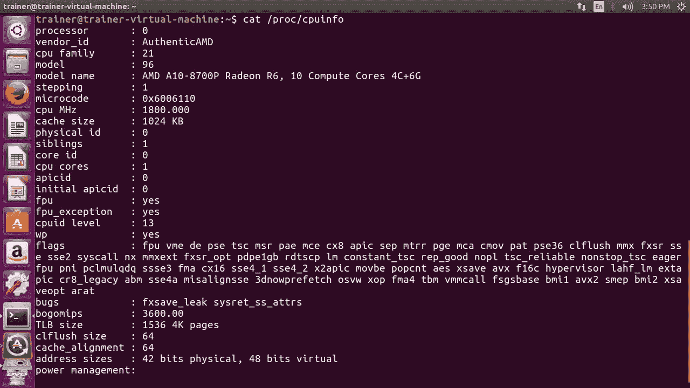

关于 CPU 还提供了更多信息：

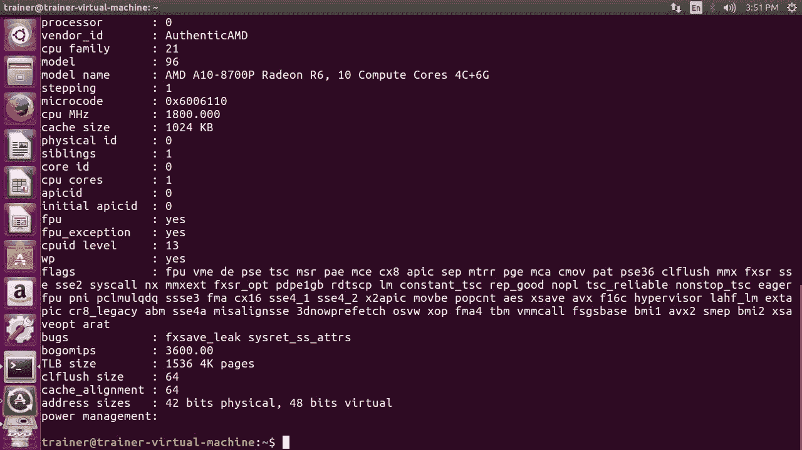

从前面的输出中，我们可以看到有关我们运行`cat /proc/cpuinfo`命令的 CPU 的详细信息。

接下来，让我们看看如何收集有关系统中安装的**随机存取内存**（**RAM**）的物理内存量的信息。我们将专注于两个命令，即`cat /proc/meminfo`和`free`命令。

再次使用 Linux 系统进行演示，我们将查看`/cat /proc/meminfo`命令的输出：

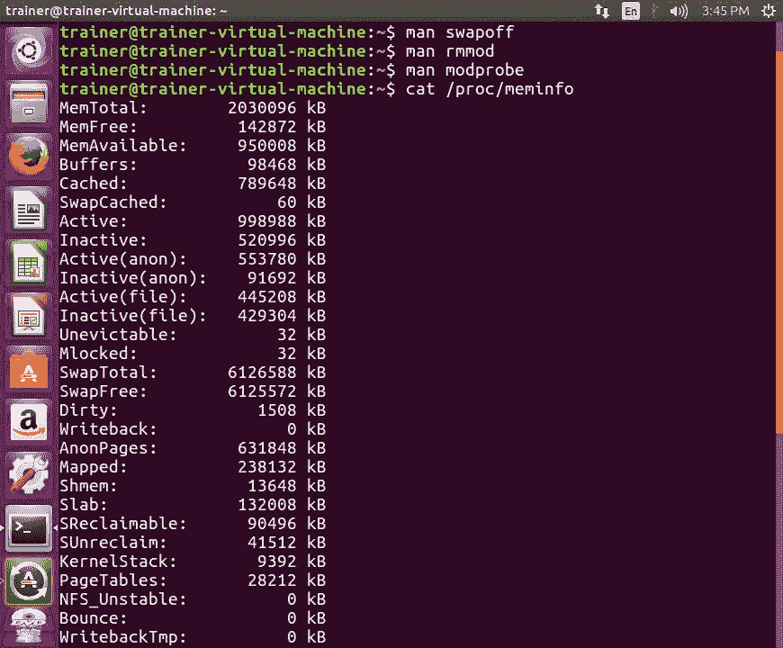

以下截图显示了更多的内存使用信息：

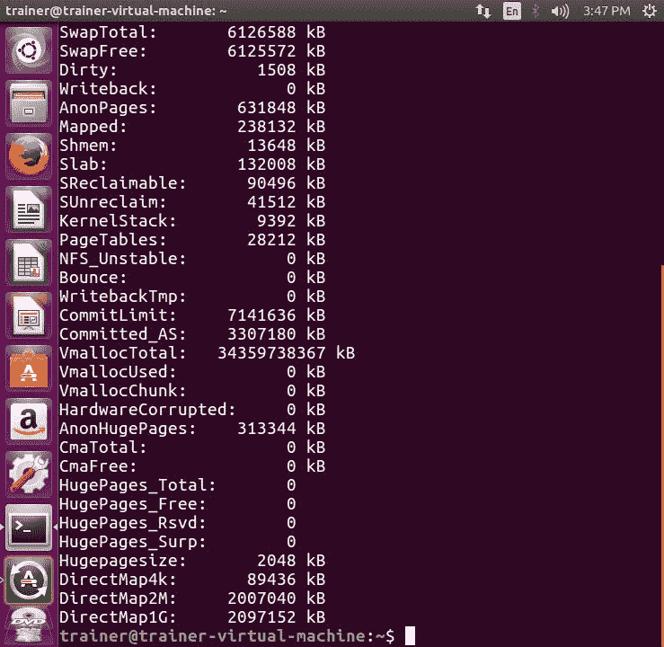

从前面的输出中，我们可以看到一些重要的字段，即前三个字段（`MemTotal`，`MemFree`和`MemAvailable`），它们反映了我们物理内存（RAM）的当前状态。

现在让我们再看另一个命令，即`free`命令。这个命令将以更易读的格式给出内存信息。使用我们的测试 Linux 系统，我们将运行`free`命令：

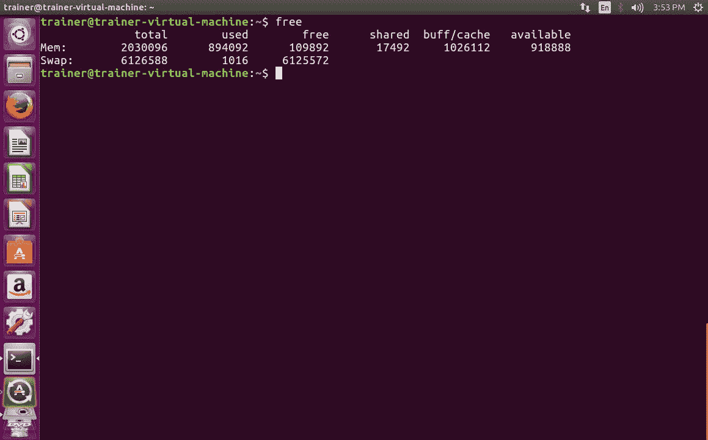

仅运行`free`命令将以 KB 为单位给出前面的结果。我们可以在`free`命令上添加一些选项以使其更加明确。以下是我们可以在 Ubuntu 发行版上使用的`free`命令的选项列表：

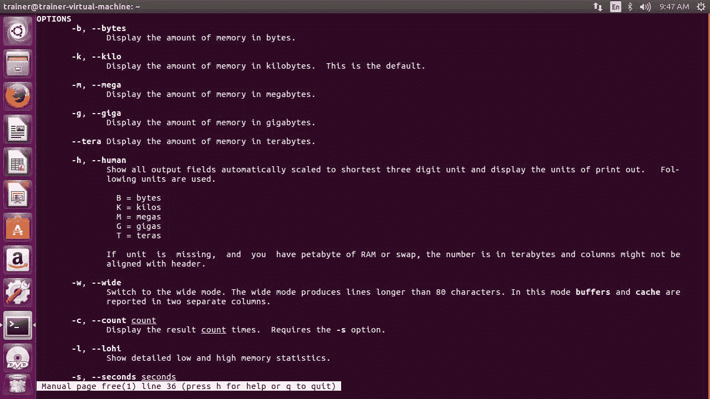

这些是我们可以在 Ubuntu 发行版上使用`free`命令的一些选项：

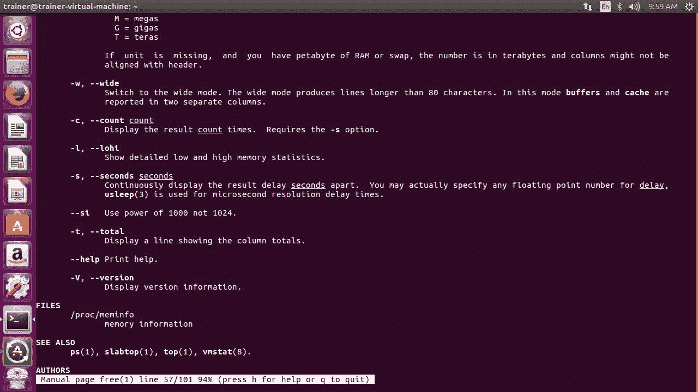

同样，如果我们在 CentOS 7 发行版上查看`free`命令的主页面，我们可以看到类似的选项：

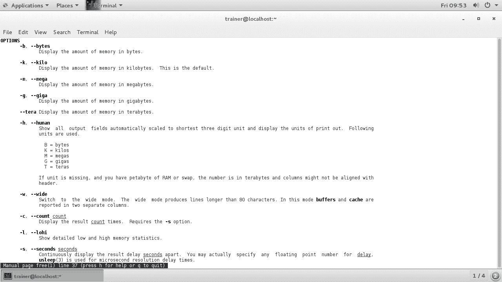

在 CentOS 7 发行版上，我们可以使用`free`命令传递的一些其他选项如下所示：

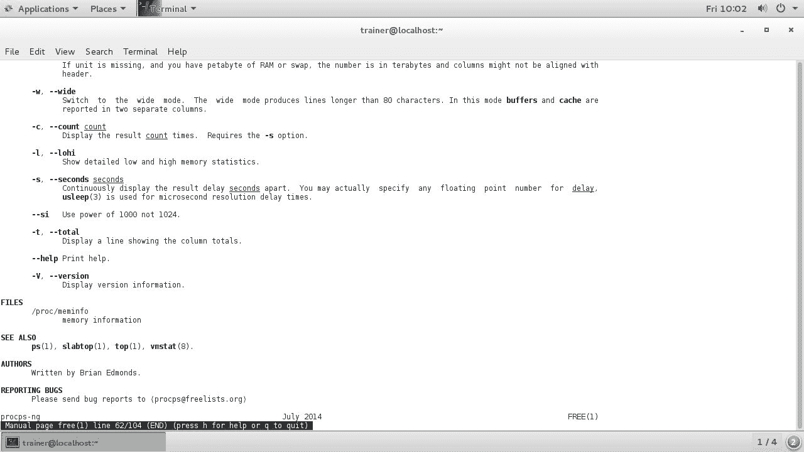

让我们尝试一些`free`命令的选项：

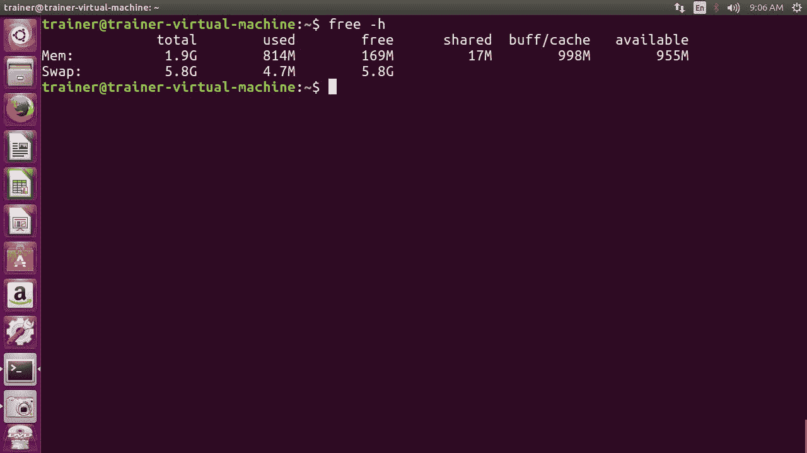

前面的输出是`free`命令中最常用的选项之一（`-h`）。我们甚至可以进一步使用（`-g`）选项来显示以 GB 为单位的物理内存总量：

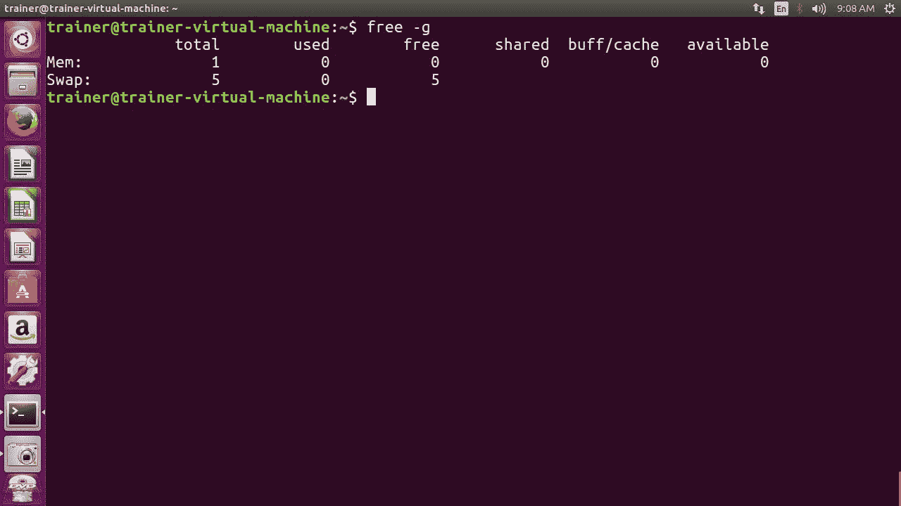

我们甚至可以使用另一个很棒的选项（`-l`）来查看低内存和高内存的统计信息：

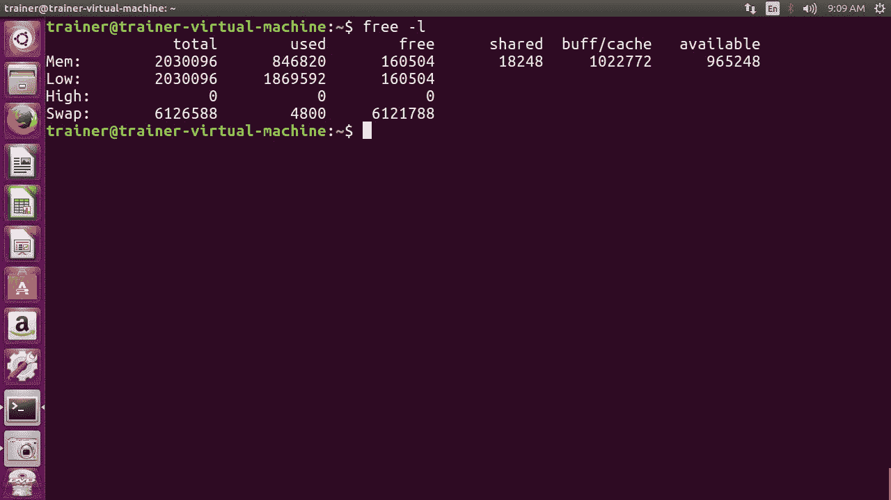

在前面的截图中，我们不仅显示了 RAM 信息，还显示了我们的交换内存。它显示在最后一行。如果我们只想看到交换内存，我们可以使用另一个命令`swapon`：

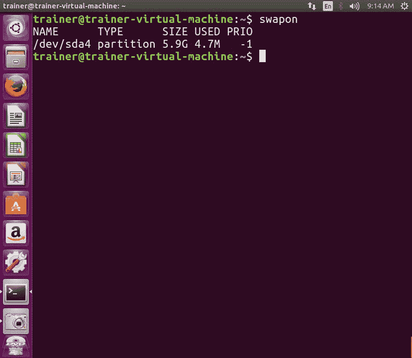

以下是在 Ubuntu 发行版上`swapon`主页上可以使用的一些选项：

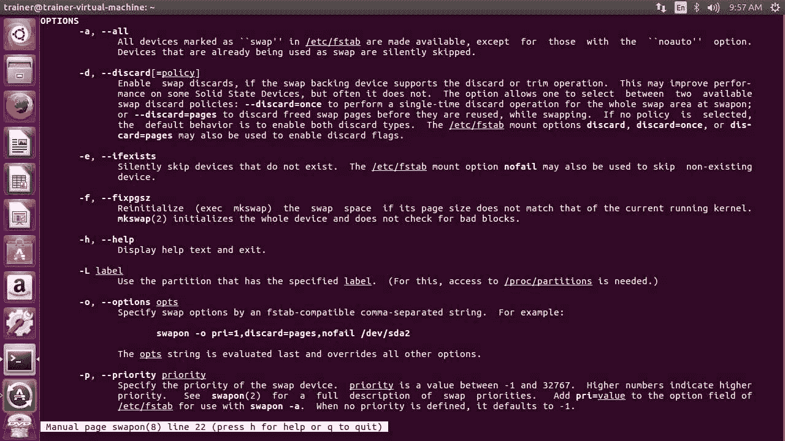

在 Ubuntu 发行版上，`swapon`命令可以传递更多选项，如下截图所示：

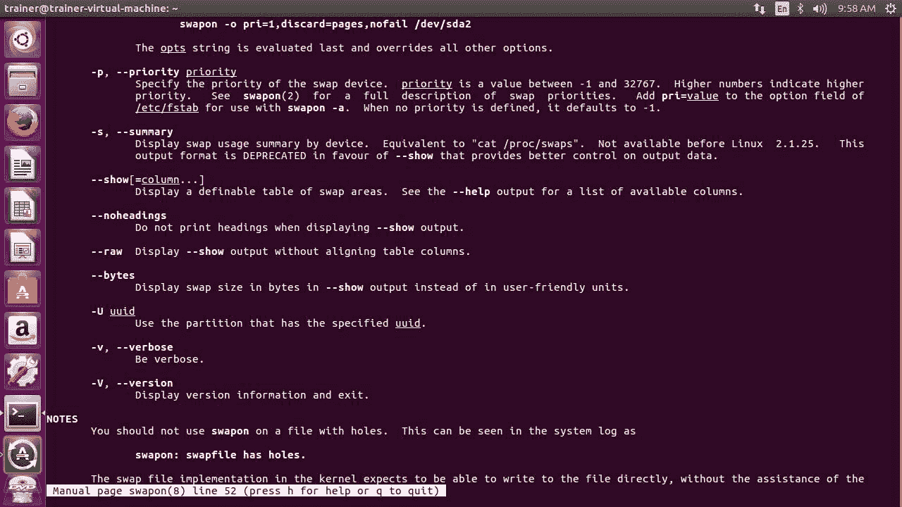

以下是在 CentOS 7 发行版上`swapon`主页上可以使用的一些选项：

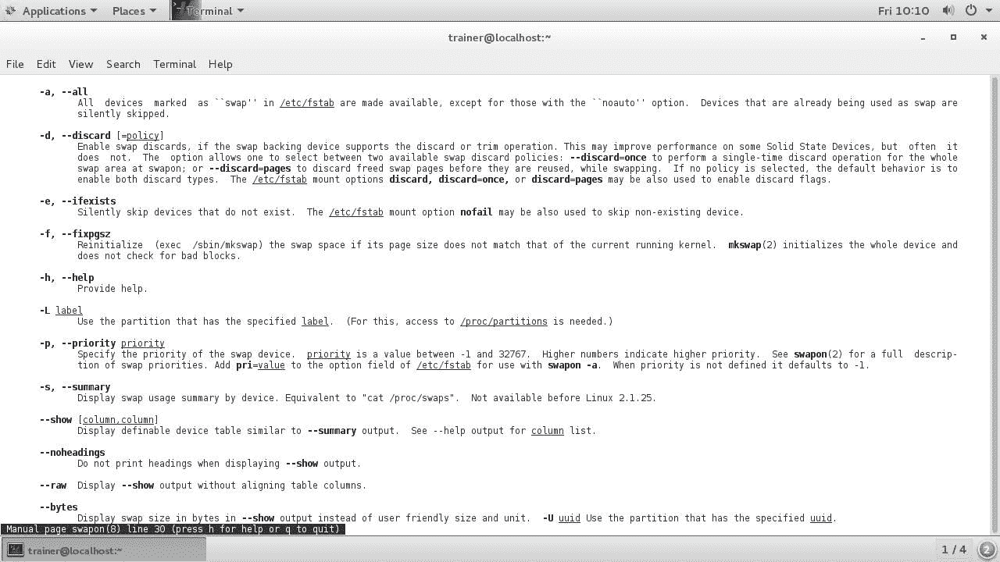

在 CentOS 7 发行版上，`swapon`命令可以传递更多选项，如下截图所示：

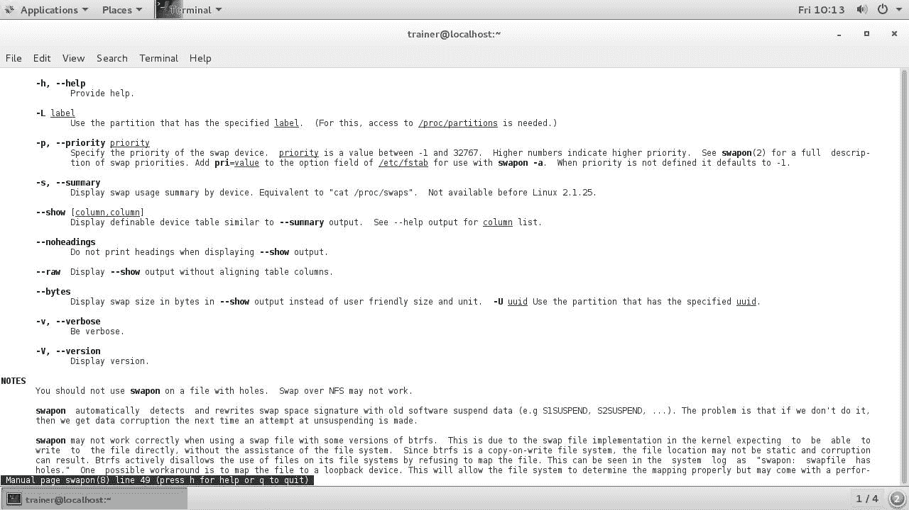

我们还可以从`/proc`目录中查看交换信息，具体在`/proc/swaps`中：

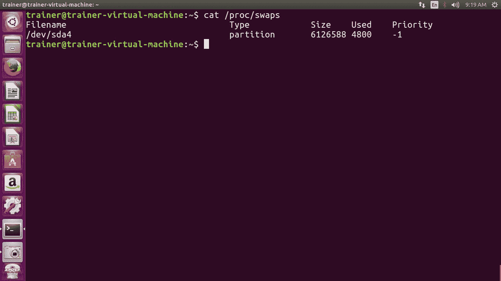

从前面的输出中，我们可以看到交换空间正在使用`/dev/sda4`分区。现在，如果由于某种原因我们的物理内存用完了，并且我们已经用完了交换空间，那么我们可以添加更多物理内存或添加更多交换空间。因此，让我们专注于添加更多交换空间的步骤。

我们需要使用`dd`命令创建一个空白文件。请注意，您需要 root 访问权限才能在 shell 中运行此命令：

```
trainer@trainer-virtual-machine:~$ dd if=/dev/zero of=/root/myswapfile bs=1M count=1024
dd: failed to open '/root/myswapfile': Permission denied
trainer@trainer-virtual-machine:~$
```

从前面的输出中，我们可以看到收到了`Permission denied`的消息，所以让我们切换到 root 并尝试重新运行该命令：

```
root@trainer-virtual-machine:/home/trainer# dd if=/dev/zero of=/root/myswapfile bs=1M count=1024
1024+0 records in
1024+0 records out
1073741824 bytes (1.1 GB, 1.0 GiB) copied, 17.0137 s, 63.1 MB/s
root@trainer-virtual-machine:/home/trainer#
```

我们刚刚使用名称`myswapfile`创建了一个`swap`文件。现在我们需要运行`mkswap`命令，并在 shell 中调用我们刚刚创建的`swap`文件：

```
root@trainer-virtual-machine:~# mkswap myswapfile
Setting up swapspace version 1, size = 1024 MiB (1073737728 bytes)
no label, UUID=e3b8cc8f-ad94-4df9-8608-c9679e6946bb
root@trainer-virtual-machine:~#
```

现在，最后一步是打开`swap`文件，以便系统根据需要使用它：

```
root@trainer-virtual-machine:~# swapon myswapfile
swapon: /root/myswapfile: insecure permissions 0644, 0600 suggested.
root@trainer-virtual-machine:~#
```

我们收到了一个关于不安全权限的警告消息。我们将在后面的章节中讨论权限。现在，我们将继续使用现有的权限。最后一步是验证`swap`文件确实可供我们的系统使用：

```
root@trainer-virtual-machine:~# swapon
NAME                TYPE       SIZE   USED    PRIO
/dev/sda4           partition  5.9G   960K    -1
/root/myswapfile    file       1024M   0B     -2
root@trainer-virtual-machine:~#
```

现在，我们的系统已经可以使用新创建的`swap`文件。我们还可以运行`free`命令，现在会发现交换内存增加了 1GB：

```
root@trainer-virtual-machine:~# free -h
 total   used   free  shared  buff/cache   available
Mem:  1.9G    848M    72M   13M    1.0G        924M
Swap: 6.8G    960K    6.8G
root@trainer-virtual-machine:~#
```

为了使更改在重新启动时安全，您需要在`/etc/fstab`中添加一个条目。

如果我们不再想使用`swap`文件，我们可以使用`swapoff`命令将`myswapfile`从交换内存中删除。以下是我们在 shell 中如何完成这个任务：

```
root@trainer-virtual-machine:~# swapoff myswapfile
root@trainer-virtual-machine:~#
```

现在让我们重新运行`swapon`命令，然后运行`free`命令来验证`myswapfile`确实已从交换使用中移除：

```
root@trainer-virtual-machine:~# swapon
NAME       TYPE      SIZE   USED   PRIO
/dev/sda4 partition  5.9G   1.6M   -1 root@trainer-virtual-machine:~# free -h
 total   used    free   shared  buff/cache available
Mem:   1.9G    931M    133M   17M     917M        845M
Swap:  5.8G    1.6M    5.8G
root@trainer-virtual-machine:~#
```

正如我们所看到的，`myswapfile`不再可用于作为交换内存使用。以下是在 Ubuntu 发行版上可以与`swapoff`命令一起使用的选项：

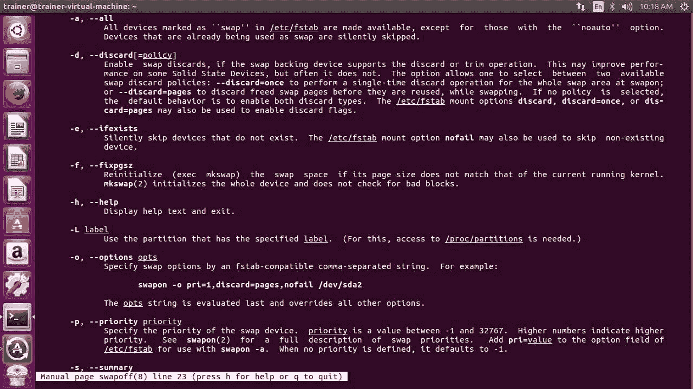

`swapoff`命令可以传递更多选项，如下截图所示：

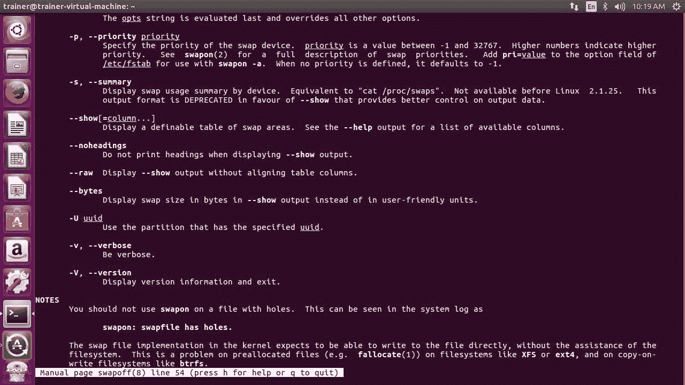

以下是在 CentOS 7 发行版上`swapoff`命令可以使用的选项：

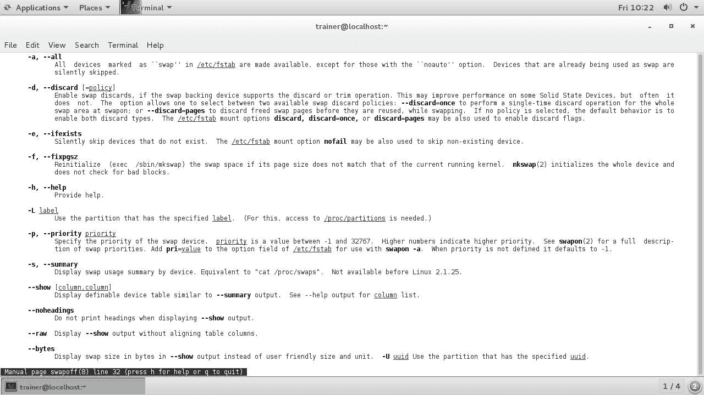

`swapoff`命令可以传递更多选项，如下截图所示：

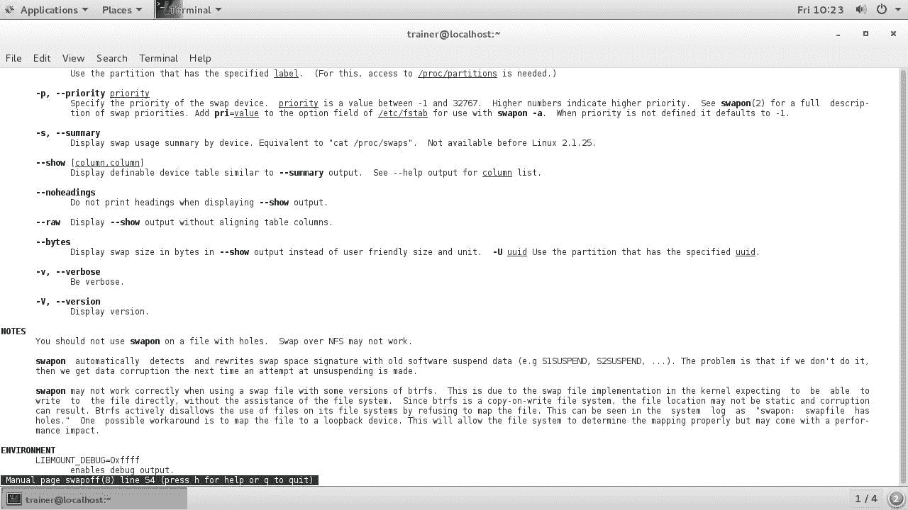

# 中断和设备

现在让我们转换方向，看看我们的 Linux 系统中可用的**中断请求**（**IRQs**）和设备。您可以将中断视为我们在需要特定物品时使用的服务热线。我们会打电话给服务热线。对于 Linux 系统中的设备，理论仍然是一样的；每当它需要 CPU 的注意时，它会通过中断发送信号。传统的 32 位架构支持多达 16 个中断：0-15。更新的架构支持的中断远远超过 16 个。

让我们再次查看`/proc`目录，重点关注`/proc/interrupts`：

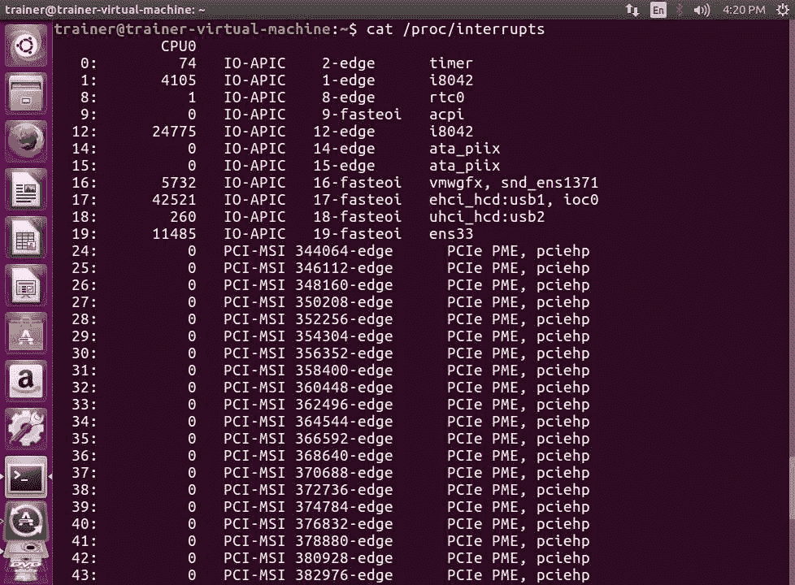

以下截图显示了更多的中断：

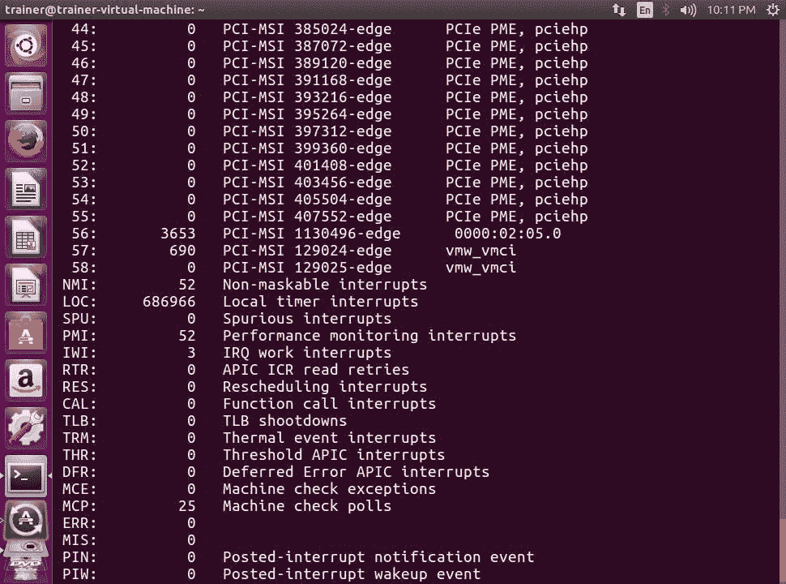

下面的截图显示了更多的中断：

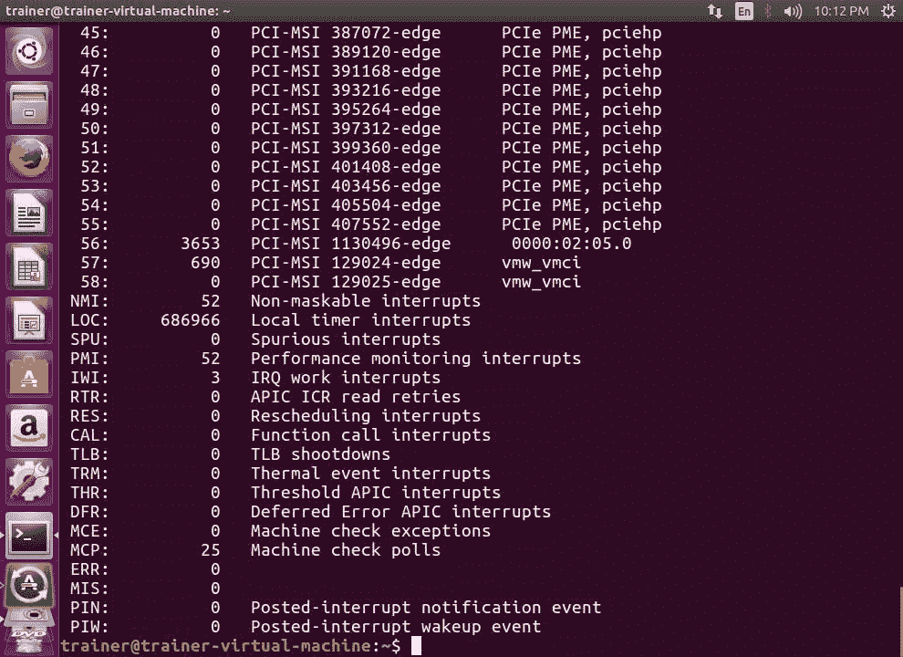

从前面的输出中，我们可以看到有更多的中断可用。输出从左到右读取，左边表示中断号，向右移动表示正在使用中断的设备或服务。我们可以看到定时器正在使用中断`0`。

现在，让我们把注意力转向设备。在 Linux 系统中使用设备时，设备被表示为文件。这使我们能够与系统中的实际硬件进行通信。有一些常用的设备，比如硬盘、DVD 和 USB 等。硬盘被表示为`sd(n)`；例如：`/dev/sda`、`/dev/sdb`、`/dev/sdc`等。硬盘分区以`sd(n)`的形式表示；例如：`/dev/sda1`、`/dev/sda2`、`/dev/sdb1`等。同样，软盘被表示为`fd.`。还有一些特殊用途的文件，比如`/dev/null`、`/dev/zero`和`/dev/tty*`。当你想要从另一个命令发送输出并且不需要输出时，你会使用`/dev/null`。这被称为重定向。`/dev/zero`与我们之前介绍的`dd`命令一起使用，用于创建空文件。`/dev/tty*`用于远程登录。让我们看看 Linux 环境中如何显示设备。

我们将使用我们的测试 Linux 系统查看`/proc/devices`：

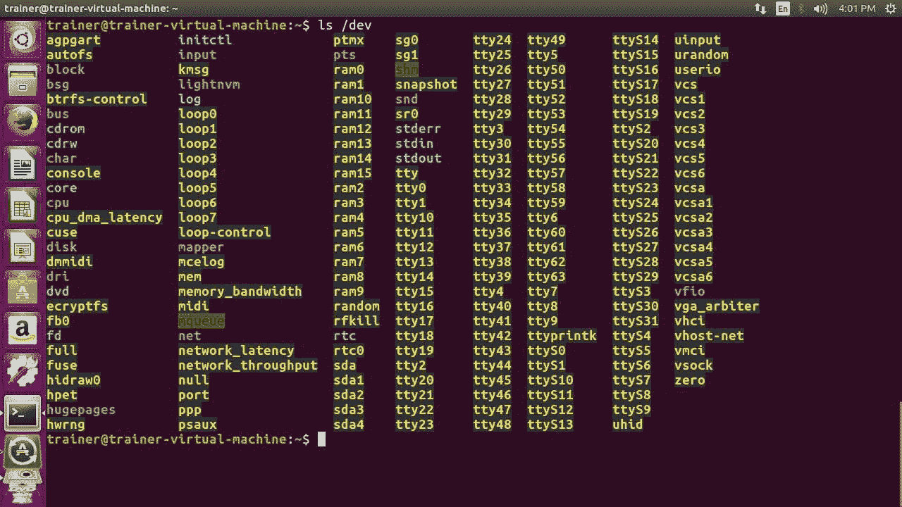

从前面的输出中，硬盘和分区以`/dev/sdXY`的格式表示，其中`X`表示硬盘，`Y`表示分区。我们可以告诉`ls`命令将输出过滤为仅包含硬盘和分区信息：

```
root@trainer-virtual-machine:~# ls /dev/sd*
/dev/sda  /dev/sda1  /dev/sda2  /dev/sda3  /dev/sda4
root@trainer-virtual-machine:~#
```

# 模块

你是否曾经想过在 Linux 环境中*驱动程序*发生了什么？好吧，不用再想了。大多数来自 Microsoft Windows 背景的人习惯于通过驱动程序与硬件进行交互。在 Linux 中，我们将驱动程序称为模块。这并不像听起来那么可怕。每当我们使用一块硬件时，我们都会加载和卸载模块。例如，当我们插入 USB 驱动器时，模块会被加载到后台，并在我们移除 USB 驱动器时自动卸载。就是这么灵活。

让我们来看看如何使用`lsmod`命令查看安装在 Linux 系统中的模块：

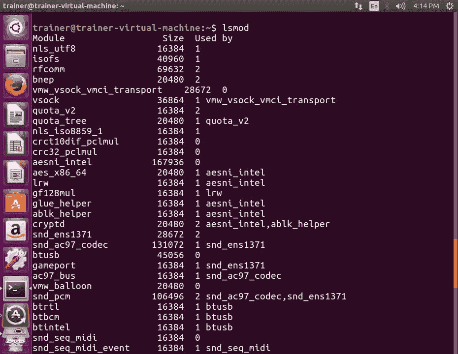

以下截图显示了更多可用的模块：

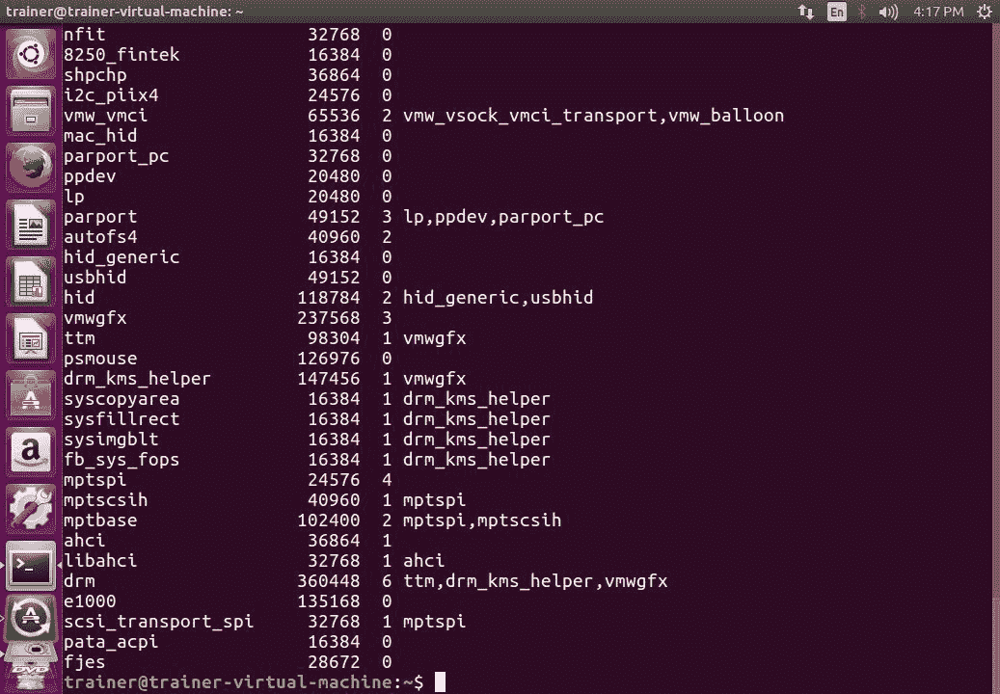

根据前面的输出，我们可以看到在这个 Linux 系统中有许多模块可供使用。我们从左到右读取输出，在`Used by`列下看到一个`0`值。这意味着该模块目前未被使用。

现在让我们看看使用`rmmod`命令删除模块的过程。我们将删除`usbhid`模块，因为它目前没有在使用。我们可以通过使用`lsmod | grep usbhid`快速验证这一点：

```
root@trainer-virtual-machine:~# lsmod | grep usbhid
usbhid                 49152  0
```

太好了！让我们继续使用`rmmod`命令删除该模块：

```
root@trainer-virtual-machine:~# rmmod usbhid
root@trainer-virtual-machine:~#
root@trainer-virtual-machine:~# lsmod | grep usbhid
root@trainer-virtual-machine:~#
```

好了，`usbhid`模块现在已经不再加载在 Linux 系统中。但是，它仍然驻留在那里，因为它已经编译进内核了。在 Ubuntu 发行版上，`rmmod`只有几个选项：

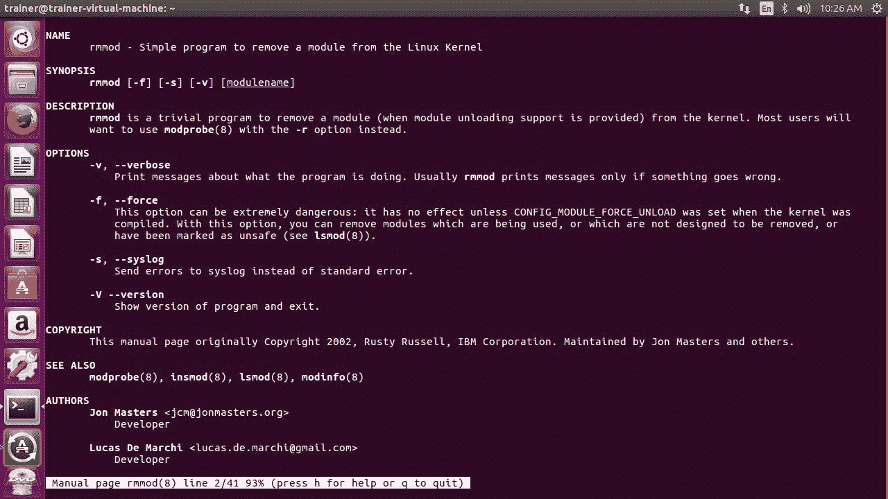

同样，在 CentOS 7 发行版上使用`rmmod`的选项如下：

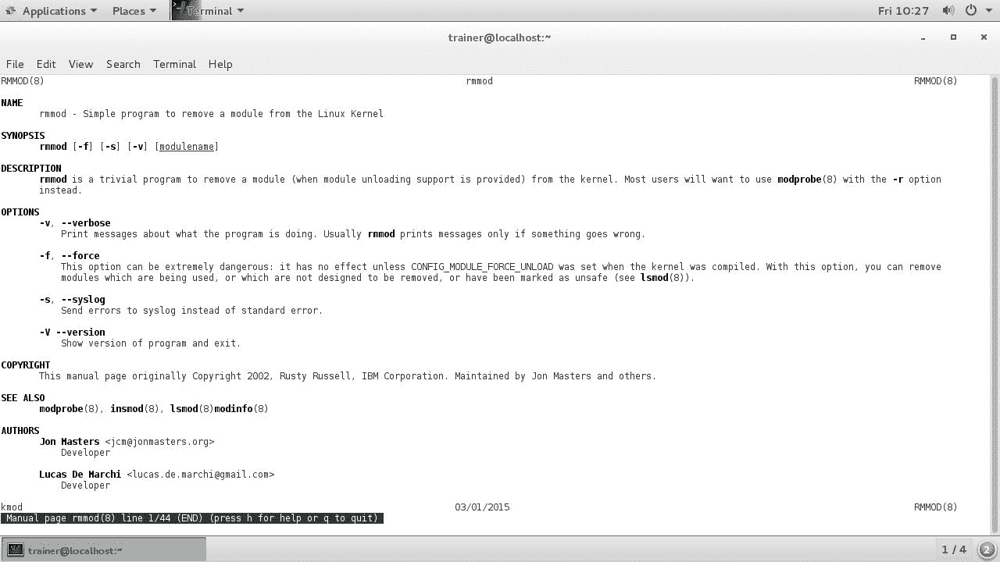

为了重新安装`usbhid`模块，我们将使用另一个常用命令`insmod`。让我们看看`insmod`在 shell 中是如何工作的：

```
root@trainer-virtual-machine:~# insmod usbhid
insmod: ERROR: could not load module usbhid: No such file or directory
root@trainer-virtual-machine:~#
```

现在，根据前面的输出，似乎有些矛盾，`insmod`命令无法找到`usbhid`模块。别担心，这个模块已经编译进内核了。也就是说，我们可以使用另一个有用的命令`modprobe`。这个命令比`insmod`更受欢迎，因为`modprobe`在我们使用`modprobe`添加模块时实际上在后台调用`insmod`。有趣的是，`modprobe`也可以用来移除模块。它通过在后台调用`rmmod`来实现这一点。

我们可以使用`insmod`本身来安装`usbhid`模块。唯一的问题是，您必须指定模块的绝对路径。另一方面，`mobprobe`使用模块目录，即`/lib/modules/$(KERNEL_RELEASE)/`，用于模块，并根据`/etc/modprobe.d/`目录中定义的规则加载模块。

因此，让我们使用`modprobe`在 shell 中安装`usbhid`模块。

```
root@trainer-virtual-machine:~# modprobe -v usbhid
insmod /lib/modules/4.4.0-24-generic/kernel/drivers/hid/usbhid/usbhid.ko
root@trainer-virtual-machine:~#
```

我们在`modprobe`命令中使用了`-v`选项，因为默认情况下它不会显示后台发生的情况。正如您所看到的，`modprobe`确实在后台调用`insmod`。现在我们可以使用`modprobe`删除这个`usbhid`模块，我们会看到它确实在后台调用`rmmod`：

```
root@trainer-virtual-machine:~# modprobe -r -v usbhid
rmmod usbhid
root@trainer-virtual-machine:~#
```

从前面的输出可以明显看出，`modprobe`确实在后台调用`rmmod`来移除模块。

以下是在 Ubuntu 发行版上可以与`modprobe`命令一起使用的一些选项：

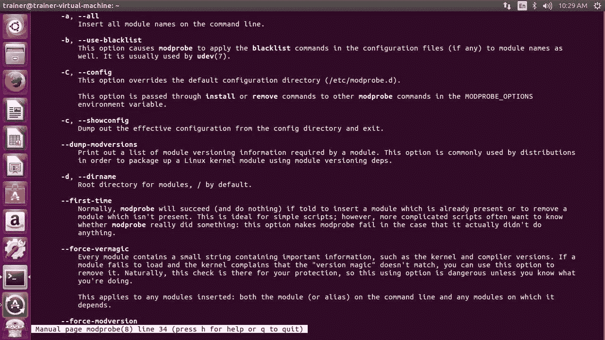

`modprobe`命令可以传递的一些其他选项如下截图所示：

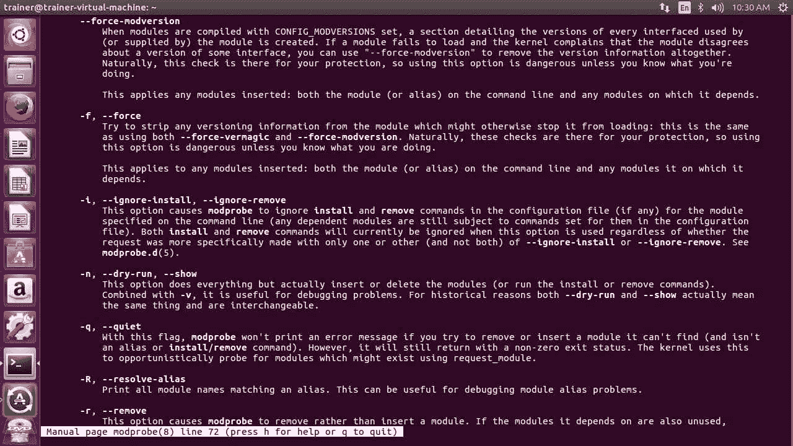

`modprobe`命令可以传递的一些其他选项如下截图所示：

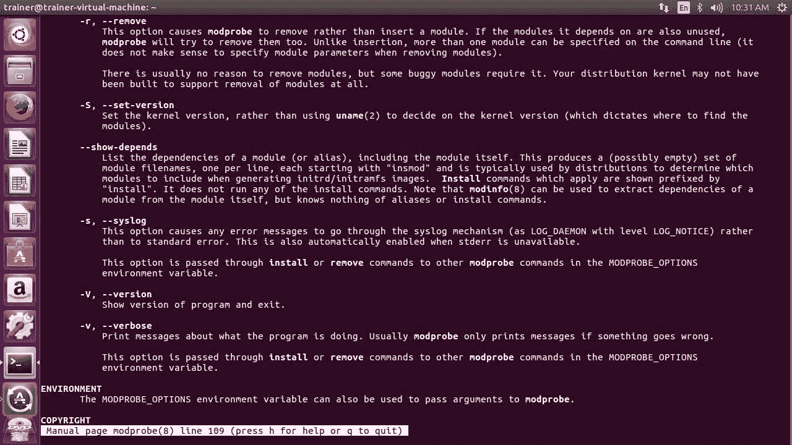

以下是在 CentOS 7 发行版上可以与`modprobe`命令一起使用的一些选项：

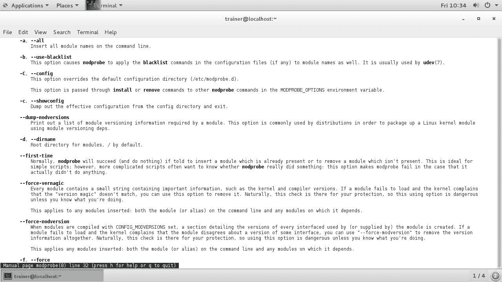

`modprobe`命令可以传递的一些其他选项如下截图所示：

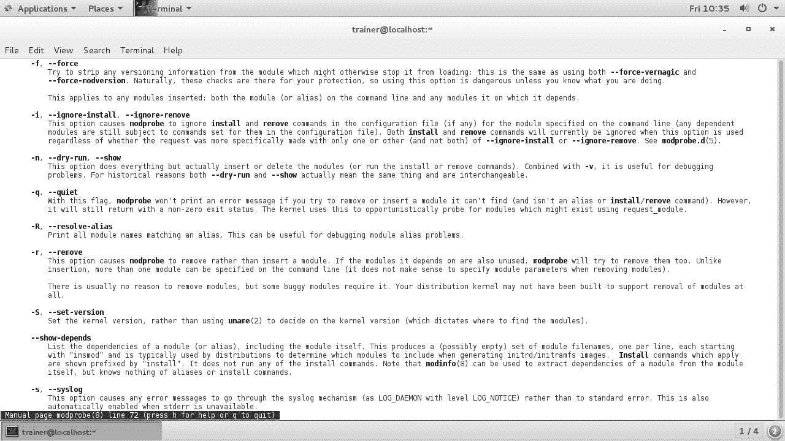

`modprobe`命令可以传递的更多选项如下截图所示：

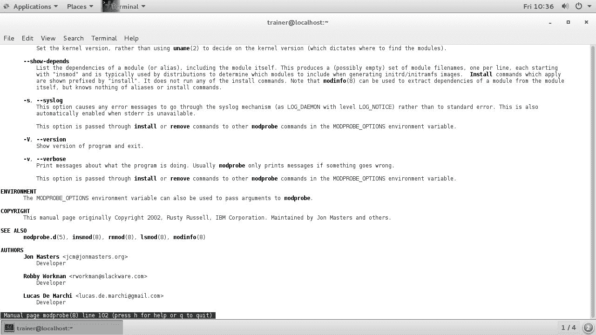

# 总结

在本章中，我们关注硬件设置，查看了各个目录中的 CPU、RAM 和交换信息。我们使用了各种命令。此外，我们还涉及了 Linux 系统中可用的各种中断和中断。然后，我们查看了设备，以文件的形式。最后，我们使用了模块。我们看到了 Linux 系统中当前可用的各种模块，并学习了安装和移除模块的步骤。

在下一章中，我们将专注于系统引导过程。此外，将介绍各种引导管理器。这对于每个 Linux 工程师来说都是另一个关键方面。简而言之，没有引导管理器，系统将无法引导，除非我们从某种媒体引导。掌握这些知识将使您作为 Linux 工程师处于领先地位。完成下一章后，您将在认证方面具有更大的优势。希望很快能见到您。

# 问题

1.  哪个目录被创建为虚拟文件系统？

A. `/dev`

B. `/lib`

C. `/proc`

D. 以上都不是

1.  查看 CPU 信息的命令是什么？

A. `less /proc`

B. `more /proc`

C. `cat /proc`

D. `cat /proc/cpuinfo`

1.  查看`/proc`目录中的 RAM 的命令是什么？

A. `tail /proc/free`

B. `less /proc/free`

C. `cat /proc/meminfo`

D. `cat /proc/RAM`

1.  `free`命令的哪个选项以友好的格式显示内存信息？

A. `free -F`

B. `free -L`

C. `free -h`

D. `free –free`

1.  用于告诉系统文件是`swap`文件的命令是什么？

A. `doswap`

B. `format swap`

C. `mkswap`

D. `swap`

1.  使用哪个命令来激活`swap`文件？

A. `Swap`

B. `onSwap`

C. `swap`

D. `swapon`

1.  显示交换分区信息的命令是什么？

A. `mkswap`

B. `swapon`

C. `swap`

D. `swapoff`

1.  哪个设备文件可以重定向消息以发送到丢弃？

A. `/dev/discard`

B. `/dev/null`

C. `/dev/redirect`

D. `以上都不是`

1.  用于显示 Linux 系统中当前可用模块的命令是什么？

A. `insmod`

B. `depmod`

C. `rmmod`

D. `lsmod`

1.  使用哪个命令来安装模块，而不必指定绝对路径？

A. `rmmod`

B. `modules`

C. `modrm`

D. `modprobe`

# 进一步阅读

+   该网站将为您提供有关当前 CompTIA Linux+认证的所有必要信息：[`www.comptia.org/`](https://www.comptia.org/)

+   这个网站将为您提供与 LPI 考试相关的详细信息，特别是通过通过 CompTIA Linux+考试获得的 LPIC - Level 1：[`www.lpi.org/`](http://www.lpi.org/)

+   这个网站提供了各种可用的 Linux 内核的详细信息：[`www.kernel.org/`](https://www.kernel.org/)
