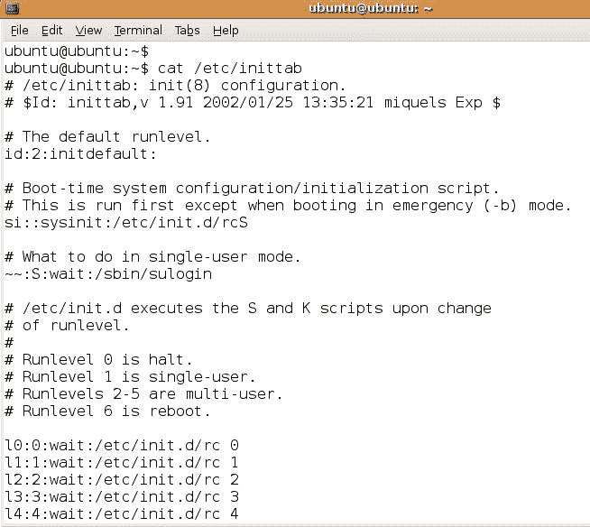
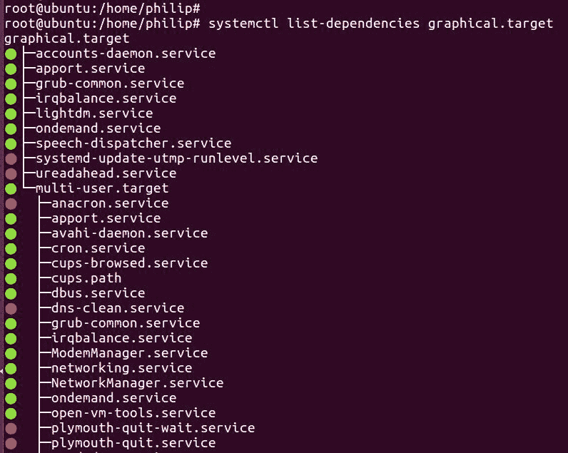
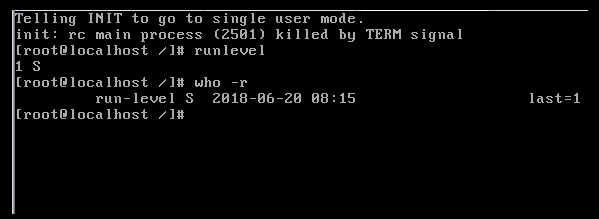
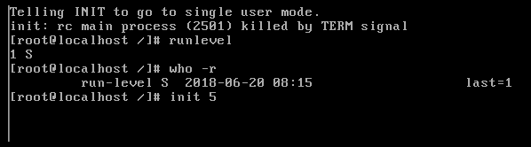
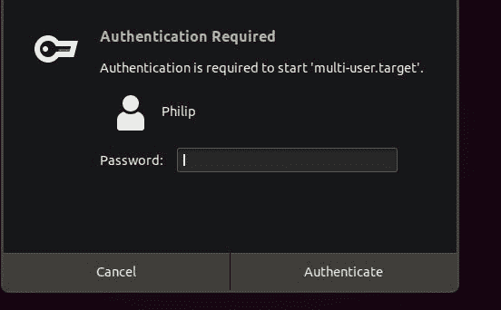
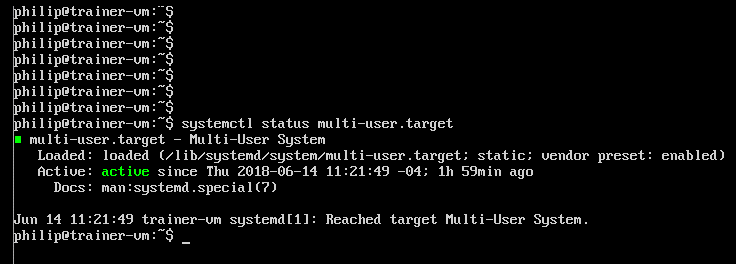
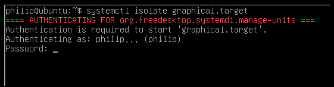

# 第三章：更改运行级别和引导目标

在上一章中，我们关注了引导过程。之后，重点转移到了 Linux 发行版中可用的各种引导管理器。特别是，我们使用了迄今为止最流行的引导管理器 GRUB 和 GRUB2。我们查看了它们各自的配置文件，重点关注了计时器、默认引导条目以及在 GRUB/GRUB2 引导菜单中传递参数。最后，我们创建了单独的示例，以便为 GRUB 和 GRUB2 的引导菜单添加一个自定义引导条目。本章重点介绍了运行级别和引导目标的概念，以及 Linux 发行版中可用的运行级别和引导目标的类型，以及运行级别和引导目标之间的区别。我们还将看看如何在 CLI 中使用运行级别和引导目标。

在本章中，我们将涵盖以下主题：

+   运行级别简介

+   引导目标简介

+   使用运行级别

+   使用引导目标

# 运行级别简介

运行级别的概念可以追溯到 SysV 时代，每个运行级别都有一个目的。不同的任务需要在系统引导时运行各种守护进程。这在服务器环境中特别有用，我们试图尽量减少服务器的开销。通常我们会为服务器分配一个角色。这样做可以减少在给定服务器上需要安装的应用程序数量。例如，Web 服务器通常会有一个用于向用户提供内容的应用程序和一个用于查找的数据库。

另一个典型的用例是打印服务器。这通常只用于管理打印作业。也就是说，从运行级别的角度来看，我们通常会减少在给定服务器内运行的服务数量。对于那些来自 Windows 背景的人来说，想想安全模式。通常，我们会进入安全模式以最小化加载的程序和驱动程序。运行级别进一步扩展了这个想法，我们可以告诉 Linux 发行版我们想要在给定的运行级别中启动/停止什么。有趣的是，我们在 Linux 发行版中可以使用多个运行级别。您会在使用 SysV init 的 Linux 发行版中找到运行级别。

看一下下表：

| **运行级别 ** | **0  ** | ** 1   ** | **2** | **3** | **4** | **5** | **6** |
| --- | --- | --- | --- | --- | --- | --- | --- |
| **守护进程** | **关闭** | **开启** | **开启** | **开启** | **开启** | **开启** | **关闭** |

根据上表，每当一个守护进程处于“关闭”状态时，这意味着该守护进程在该运行级别中不会运行。同样，每当一个守护进程处于“开启”状态时，它被配置为在特定的运行级别中运行。

守护进程和服务通常可以互换使用。

运行级别通常具有各种启动/停止脚本，每当在支持`init`的 Linux 发行版中选择运行级别时都会运行这些脚本。我们可以查看 CentOS 6.5 系统，看看使用了哪个运行级别。我们将查看`/etc/inittab`配置文件：

```
[philip@localhost Desktop]$ cat /etc/inittab
 # inittab is only used by upstart for the default runlevel.
 #
 # ADDING OTHER CONFIGURATION HERE WILL HAVE NO EFFECT ON YOUR SYSTEM.
 #
 # System initialization is started by /etc/init/rcS.conf
 #
 # Individual runlevels are started by /etc/init/rc.conf
 #
```

```
 # Ctrl-Alt-Delete is handled by /etc/init/control-alt-delete.conf
 #
 # Terminal gettys are handled by /etc/init/tty.conf and /etc/init/serial.conf,
 # with configuration in /etc/sysconfig/init.
 #
 # For information on how to write upstart event handlers, or how
 # upstart works, see init(5), init(8), and initctl(8).
 #
 # Default runlevel. The runlevels used are:
 # 0 - halt (Do NOT set initdefault to this)
 # 1 - Single user mode
 # 2 - Multiuser, without NFS (The same as 3, if you do not have networking)
 # 3 - Full multiuser mode
 # 4 - unused
 # 5 - X11
 # 6 - reboot (Do NOT set initdefault to this)
 #
 id:5:initdefault:
 [philip@localhost Desktop]$
```

从前面的输出中，CentOS 发行版支持七个运行级别。特别是，运行级别 5 是向用户呈现图形用户界面的运行级别。

其他流行的运行级别是`0`用于停止或关闭系统，`1`用于单用户模式（通常用于恢复）和`6`用于重新启动系统。上面写着`id:5:initdefault:`的那一行告诉 CentOS 在系统引导时使用哪个运行级别。

现在让我们看看支持`init`的 Ubuntu 6.06 发行版上的`/etc/inittab`：



从前面的输出中，我们可以关注一下这一行，上面写着`id:2:initdefault:`。`2`告诉 Linux 内核在系统引导时使用运行级别 2。默认情况下，Ubuntu 6.06 使用运行级别 2。实际上，在 Ubuntu 中，运行级别 2-5 被认为是多用户的；在运行级别 2-5 之间没有区别。

在 CentOS 6.5 中，我们可以使用`chkconfig`命令来检查各种运行级别中运行的守护进程；这将给出各种服务的简要摘要：

```
[philip@localhost Desktop]$ chkconfig
 NetworkManager 0:off 1:off 2:on 3:on 4:on 5:on 6:off
 abrt-ccpp 0:off 1:off 2:off 3:on 4:off 5:on 6:off
 abrtd 0:off 1:off 2:off 3:on 4:off 5:on 6:off
 acpid 0:off 1:off 2:on 3:on 4:on 5:on 6:off
 atd 0:off 1:off 2:off 3:on 4:on 5:on 6:off
 auditd 0:off 1:off 2:on 3:on 4:on 5:on 6:off
 blk-availability 0:off 1:on 2:on 3:on 4:on 5:on 6:off
 bluetooth 0:off 1:off 2:off 3:on 4:on 5:on 6:off
 cpuspeed 0:off 1:on 2:on 3:on 4:on 5:on 6:off
 crond 0:off 1:off 2:on 3:on 4:on 5:on 6:off
 cups 0:off 1:off 2:on 3:on 4:on 5:on 6:off
 dnsmasq 0:off 1:off 2:off 3:off 4:off 5:off 6:off
 firstboot 0:off 1:off 2:off 3:on 4:off 5:on 6:off
 haldaemon 0:off 1:off 2:off 3:on 4:on 5:on 6:off
 htcacheclean 0:off 1:off 2:off 3:off 4:off 5:off 6:off
 httpd 0:off 1:off 2:off 3:off 4:off 5:off 6:off
 ip6tables 0:off 1:off 2:on 3:on 4:on 5:on 6:off
 iptables 0:off 1:off 2:on 3:on 4:on 5:on 6:off
 irqbalance 0:off 1:off 2:off 3:on 4:on 5:on 6:off
 kdump 0:off 1:off 2:off 3:on 4:on 5:on 6:off
 lvm2-monitor 0:off 1:on 2:on 3:on 4:on 5:on 6:off
 mdmonitor 0:off 1:off 2:on 3:on 4:on 5:on 6:off
 messagebus 0:off 1:off 2:on 3:on 4:on 5:on 6:off
 netconsole 0:off 1:off 2:off 3:off 4:off 5:off 6:off
 netfs 0:off 1:off 2:off 3:on 4:on 5:on 6:off
 network 0:off 1:off 2:on 3:on 4:on 5:on 6:off
 ntpd 0:off 1:off 2:off 3:off 4:off 5:off 6:off
 ntpdate 0:off 1:off 2:off 3:off 4:off 5:off 6:off
 portreserve 0:off 1:off 2:on 3:on 4:on 5:on 6:off
 postfix 0:off 1:off 2:on 3:on 4:on 5:on 6:off
 psacct 0:off 1:off 2:off 3:off 4:off 5:off 6:off
 quota_nld 0:off 1:off 2:off 3:off 4:off 5:off 6:off
 rdisc 0:off 1:off 2:off 3:off 4:off 5:off 6:off
 restorecond 0:off 1:off 2:off 3:off 4:off 5:off 6:off
 rngd 0:off 1:off 2:off 3:off 4:off 5:off 6:off
 rsyslog 0:off 1:off 2:on 3:on 4:on 5:on 6:off
 saslauthd 0:off 1:off 2:off 3:off 4:off 5:off 6:off
 smartd 0:off 1:off 2:off 3:off 4:off 5:off 6:off
 snmpd 0:off 1:off 2:off 3:off 4:off 5:off 6:off
 snmptrapd 0:off 1:off 2:off 3:off 4:off 5:off 6:off
 spice-vdagentd 0:off 1:off 2:off 3:off 4:off 5:on 6:off
 sshd 0:off 1:off 2:on 3:on 4:on 5:on 6:off
 sysstat 0:off 1:on 2:on 3:on 4:on 5:on 6:off
 udev-post 0:off 1:on 2:on 3:on 4:on 5:on 6:off
 vmware-tools 0:off 1:off 2:on 3:on 4:on 5:on 6:off
 vmware-tools-thinprint 0:off 1:off 2:on 3:on 4:on 5:on 6:off
 wdaemon 0:off 1:off 2:off 3:off 4:off 5:off 6:off
 winbind 0:off 1:off 2:off 3:off 4:off 5:off 6:off
 wpa_supplicant 0:off 1:off 2:off 3:off 4:off 5:off 6:off
 [philip@localhost Desktop]$
```

从前面的输出中，我们可以看到各种服务。有些在多个运行级别中运行，而有些完全关闭。例如，网络服务；它设置为`0：关闭 1：关闭 2：开启 3：开启 4：开启 5：开启 6：关闭`。这告诉系统在运行级别 2-5 中启动网络服务，在运行级别 0-1 和 6 中关闭网络服务。大多数服务仅在运行级别 2-5 中运行。

我们可以查看`/etc/rc.d/`，看看各种脚本是如何设置的，以便启动/停止：

```
[philip@localhost Desktop]$ ls -l /etc/rc.d
 total 60
 drwxr-xr-x. 2 root root 4096 Jun 20 01:49 init.d
 -rwxr-xr-x. 1 root root 2617 Nov 22 2013 rc
 drwxr-xr-x. 2 root root 4096 Jun 20 01:49 rc0.d
 drwxr-xr-x. 2 root root 4096 Jun 20 01:49 rc1.d
 drwxr-xr-x. 2 root root 4096 Jun 20 01:49 rc2.d
 drwxr-xr-x. 2 root root 4096 Jun 20 01:49 rc3.d
 drwxr-xr-x. 2 root root 4096 Jun 20 01:49 rc4.d
 drwxr-xr-x. 2 root root 4096 Jun 20 01:49 rc5.d
 drwxr-xr-x. 2 root root 4096 Jun 20 01:49 rc6.d
 -rwxr-xr-x. 1 root root 220 Jun 20 01:48 rc.local
 -rwxr-xr-x. 1 root root 19688 Nov 22 2013 rc.sysinit
 [philip@localhost Desktop]$ 
```

根据前面的输出，每个相应运行级别（0-6）都有各自的目录。此外，我们甚至可以进一步深入文件系统层次结构并暴露子目录。让我们选择`/etc/rc.d/rc5.d`并暴露其内容：

```
[philip@localhost Desktop]$ ls -l /etc/rc.d/rc5.d/
 total 0
 lrwxrwxrwx. 1 root root 16 Jun 20 01:44 K01smartd -> ../init.d/smartd
 lrwxrwxrwx. 1 root root 17 Jun 20 01:44 K05wdaemon -> ../init.d/wdaemon
 lrwxrwxrwx. 1 root root 16 Jun 20 01:44 K10psacct -> ../init.d/psacct
 lrwxrwxrwx. 1 root root 19 Jun 20 01:41 K10saslauthd -> ../init.d/saslauthd
 lrwxrwxrwx. 1 root root 22 Jun 20 01:41 K15htcacheclean -> ../init.d/htcacheclean
 lrwxrwxrwx. 1 root root 15 Jun 20 01:41 K15httpd -> ../init.d/httpd
 lrwxrwxrwx. 1 root root 17 Jun 20 01:41 K50dnsmasq -> ../init.d/dnsmasq
 lrwxrwxrwx. 1 root root 20 Jun 20 01:40 K50netconsole -> ../init.d/netconsole
 lrwxrwxrwx. 1 root root 15 Jun 20 01:41 K50snmpd -> ../init.d/snmpd
 lrwxrwxrwx. 1 root root 19 Jun 20 01:41 K50snmptrapd -> ../init.d/snmptrapd
 lrwxrwxrwx. 1 root root 17 Jun 20 01:47 K73winbind -> ../init.d/winbind
 lrwxrwxrwx. 1 root root 14 Jun 20 01:41 K74ntpd -> ../init.d/ntpd
 lrwxrwxrwx. 1 root root 17 Jun 20 01:41 K75ntpdate -> ../init.d/ntpdate
 lrwxrwxrwx. 1 root root 19 Jun 20 01:44 K75quota_nld -> ../init.d/quota_nld
 lrwxrwxrwx. 1 root root 24 Jun 20 01:44 K84wpa_supplicant -> ../init.d/wpa_supplicant
 lrwxrwxrwx. 1 root root 21 Jun 20 01:40 K87restorecond -> ../init.d/restorecond
 lrwxrwxrwx. 1 root root 15 Jun 20 01:40 K89rdisc -> ../init.d/rdisc
 lrwxrwxrwx. 1 root root 14 Jun 20 01:44 K99rngd -> ../init.d/rngd
 lrwxrwxrwx. 1 root root 17 Jun 20 01:43 S01sysstat -> ../init.d/sysstat
 lrwxrwxrwx. 1 root root 22 Jun 20 01:43 S02lvm2-monitor -> ../init.d/lvm2-monitor
 lrwxrwxrwx. 1 root root 22 Jun 20 01:49 S03vmware-tools -> ../init.d/vmware-tools
 lrwxrwxrwx. 1 root root 19 Jun 20 01:41 S08ip6tables -> ../init.d/ip6tables
 lrwxrwxrwx. 1 root root 18 Jun 20 01:40 S08iptables -> ../init.d/iptables
 lrwxrwxrwx. 1 root root 17 Jun 20 01:40 S10network -> ../init.d/network
 lrwxrwxrwx. 1 root root 16 Jun 20 01:44 S11auditd -> ../init.d/auditd
 lrwxrwxrwx. 1 root root 21 Jun 20 01:38 S11portreserve -> ../init.d/portreserve
 lrwxrwxrwx. 1 root root 17 Jun 20 01:41 S12rsyslog -> ../init.d/rsyslog
 lrwxrwxrwx. 1 root root 18 Jun 20 01:44 S13cpuspeed -> ../init.d/cpuspeed
```

在整个章节中，出于简洁起见，一些输出被省略了。

从前面的输出中，运行级别 5 有许多守护进程。我们通过使用命名约定来识别守护进程。以`K`开头的文件用于终止/停止进程，以`S`开头的文件用于启动进程。此外，大多数脚本都是符号链接，指向`/etc/rc.d/init.d/`目录。

同样地，我们可以在较新的 CentOS 发行版中暴露各种启动/停止脚本。例如，让我们选择 CentOS 6.5 并解剖其中一个目录。在 CentOS 6.5 系统上，这是其中一个停止脚本的显示：

```
[philip@localhost Desktop]$ cat /etc/rc.d/rc5.d/S13irqbalance
 #! /bin/sh
 ### BEGIN INIT INFO
 # Provides: irqbalance
 # Default-Start: 3 4 5
 # Default-Stop: 0 1 6
 # Short-Description: start and stop irqbalance daemon
 # Description: The irqbalance daemon will distribute interrupts across
 # the cpus on a multiprocessor system with the purpose of
 # spreading the load
 ### END INIT INFO
 # chkconfig: 2345 13 87 # This is an interactive program, we need the current locale # Source function library.
 . /etc/init.d/functions
```

正如我们所看到的，这些脚本涉及的内容更多。继续向下移动，我们可以看到以下代码：

```
# Check that we're a priviledged user
 [ `id -u` = 0 ] || exit 0
prog="irqbalance"
[ -f /usr/sbin/irqbalance ] || exit 0
# fetch configuration if it exists
 # ONESHOT=yes says to wait for a minute, then look at the interrupt
 # load and balance it once; after balancing exit and do not change
 # it again.
 # The default is to keep rebalancing once every 10 seconds.
 ONESHOT=
 [ -f /etc/sysconfig/irqbalance ] && . /etc/sysconfig/irqbalance
 case "$IRQBALANCE_ONESHOT" in
 y*|Y*|on) ONESHOT=--oneshot ;;
 *) ONESHOT= ;;
 esac
RETVAL=0
start() {
 if [ -n "$ONESHOT" -a -f /var/run/irqbalance.pid ]; then
 exit 0
 fi
 echo -n $"Starting $prog: "
 if [ -n "$IRQBALANCE_BANNED_CPUS" ];
 then
 export IRQBALANCE_BANNED_CPUS=$IRQBALANCE_BANNED_CPUS
 fi
 daemon irqbalance --pid=/var/run/irqbalance.pid $IRQBALANCE_ARGS $ONESHOT
 RETVAL=$?
 echo
 return $RETVAL
 }
stop() {
 echo -n $"Stopping $prog: "
 killproc irqbalance
 RETVAL=$?
 echo
 [ $RETVAL -eq 0 ] && rm -f /var/lock/subsys/irqbalance
 return $RETVAL
 }
restart() {
 stop
 start
 }
# See how we were called.
 case "$1" in
 start)
 start
 ;;
 stop)
 stop
 ;;
 status)
 status irqbalance
 ;;
 restart|reload|force-reload)
 restart
 ;;
 condrestart)
 [ -f /var/lock/subsys/irqbalance ] && restart || :
 ;;
 *)
 echo $"Usage: $0 {start|stop|status|restart|reload|condrestart|force-reload}"
 exit 1
 ;;
 esac
exit $?
 [philip@localhost Desktop]$
```

最后，从前面的输出中，我们可以清楚地看到这些脚本是以程序方式编写的。

# 引导目标简介

引导目标的概念是一个全新的游戏规则。引导目标在使用`systemd`时使用。我们可以看到性能提高了，因为只有对特定套接字的请求在需要时才会启动。此外，`systemd`模拟了`init`以实现兼容性，而在后台`systemd`正在进行工作。当我们使用引导目标时，我们使用单元。对于给定的引导目标，存在许多守护进程。让我们看看 Ubuntu 发行版中可用的引导目标：

```
root@ubuntu:/home/philip# systemctl list-units --type target
 UNIT           LOAD    ACTIVE   SUB  DESCRIPTION
 basic.target      loaded active active Basic System
 cryptsetup.target loaded active active Encrypted Volumes
 getty.target      loaded active active Login Prompts
 graphical.target  loaded active active Graphical Interface
 local-fs-pre.target loaded active active Local File Systems (Pre)
 local-fs.target   loaded active active Local File Systems
 multi-user.target loaded active active Multi-User System
 network.target    loaded active active Network
 nss-user-lookup.target loaded active active User and Group Name Lookups
 paths.target     loaded active active Paths
 remote-fs-pre.target loaded active active Remote File Systems (Pre)
 remote-fs.target loaded active active Remote File Systems
 slices.target   loaded active active Slices
 sockets.target  loaded active active Sockets
 sound.target    loaded active active Sound Card
 swap.target     loaded active active Swap
 sysinit.target  loaded active active System Initialization
 time-sync.target loaded active active System Time Synchronized
 timers.target   loaded active active Timers
LOAD = Reflects whether the unit definition was properly loaded.
 ACTIVE = The high-level unit activation state, i.e. generalization of SUB.
 SUB = The low-level unit activation state, values depend on unit type.
19 loaded units listed. Pass --all to see loaded but inactive units, too.
 To show all installed unit files use 'systemctl list-unit-files'.
 root@ubuntu:/home/philip#
```

从前面的输出中，只会显示当前加载的目标。`graphical.target`类似于`init`中的运行级别 5。要查看所有引导目标，我们可以这样做：

```
root@ubuntu:/home/philip# systemctl list-units --type target --all
 UNIT             LOAD ACTIVE SUB DESCRIPTION
 basic.target       loaded active active Basic System
 cryptsetup.target  loaded active active Encrypted Volumes
 emergency.target   loaded inactive dead Emergency Mode
 failsafe-graphical.target loaded inactive dead Graphical failsafe fallback
 final.target       loaded inactive dead Final Step
 getty.target       loaded active active Login Prompts
 graphical.target   loaded active active Graphical Interface
 halt.target        loaded inactive dead Halt
 local-fs-pre.target loaded active active Local File Systems (Pre)
 local-fs.target    loaded active active Local File Systems
 multi-user.target    loaded active active Multi-User System
 network-online.target loaded inactive dead Network is Online
 network-pre.target    loaded inactive dead Network (Pre)
 network.target            loaded active active Network
 nss-user-lookup.target    loaded active active User and Group Name Lookups
 paths.target                loaded active active Paths
 reboot.target               loaded inactive dead Reboot
 remote-fs-pre.target        loaded active active
```

从前面的输出中，我们可以看到活动的引导目标，以及不活动的引导目标。

现在，假设我们想要查看与特定目标相关的实际守护进程。我们将运行以下命令：

```
root@ubuntu:/home/philip# systemctl list-dependencies graphical.target
```



从前面的输出中，我们可以看到`graphical.target`中有许多守护进程。其中一个守护进程是`NetworkManager.service`，用于系统内的网络。阅读这个的方式是：

+   **绿色圆圈**：表示服务当前正在运行

+   **红色圆圈**：表示服务目前未运行

# 使用运行级别

我们可以像在本章中看到的那样，为各种任务使用各种运行级别。让我们使用 CentOS 6.5 发行版。要实时在 shell 中查看运行级别，我们可以使用`runlevel`命令：

```
[philip@localhost Desktop]$ runlevel
N 5
[philip@localhost Desktop]$
```

从前面的输出中，`N`表示先前的运行级别。在我们的情况下，我们没有改变运行级别。`5`表示我们当前处于运行级别 5。我们还可以运行另一个命令来显示运行级别。我们可以使用带有`-r`选项的`who`命令，如下所示：

```
[philip@localhost Desktop]$ who -r
 run-level 5 2018-06-20 08:09
 [philip@localhost Desktop]$
```

从前面的输出中，我们可以看到更详细的描述，即使用`who –r`命令的`run-level 5`。

现在，我们可以通过利用`init`或`telinit`命令来改变我们的 CentOS 6.5 发行版的运行级别。让我们看看如何从运行级别 5 更改到运行级别 1：

```
[philip@localhost Desktop]$ who -r
 run-level 5 2018-06-20 08:09
 [philip@localhost Desktop]$ init 1
```

当我们按下*Enter*时，我们会收到一个错误；原因是，在 CentOS 6.5 发行版中，我们需要 root 权限将运行级别 5 更改为运行级别 1：

```
[philip@localhost Desktop]$ init 1
 init: Need to be root
 [philip@localhost Desktop]$
```

现在，让我们以 root 用户的身份进行身份验证并重试`init 1`命令：

```
[philip@localhost Desktop]$ su -
 Password:
 [root@localhost ~]# init 1
```

现在，我们将被放置到运行级别 1，这将删除 GUI 并直接进入 shell。这个运行级别 1 通常被称为**单用户**，我们将用于恢复：



从前面的输出中，我们运行了`runlevel`和`who -r`命令，并验证了我们确实在运行级别 1 中。

现在，让我们将系统恢复到 GUI 状态，即运行级别 5：



现在，当我们在 GUI 中运行`runlevel`命令时，我们将看到之前的运行级别 1 替换`runlevel`命令中的`N`为`S`：

```
[philip@localhost Desktop]$ runlevel
 S 5
 [philip@localhost Desktop]$
```

同样，我们可以使用`who -r`选项运行`who`命令以查看更多信息：

```
[philip@localhost Desktop]$ who -r
run-level 5 2018-06-20 08:20 last=S
[philip@localhost Desktop]$ 
```

现在，假设我们想在某个运行级别打开一个守护程序。我们将使用`dnsmasq`进行演示。首先，让我们验证`dnsmasq`服务当前是否关闭：

```
[philip@localhost Desktop]$ chkconfig | grep dnsmasq
dnsmasq 0:off 1:off 2:off 3:off 4:off 5:off 6:off
[philip@localhost Desktop]$ 
```

太好了！现在让我们只在运行级别 3-5 中打开`dnsmasq`守护程序：

```
[philip@localhost Desktop]$ chkconfig --levels 345 dnsmasq on
You do not have enough privileges to perform this operation.
[philip@localhost Desktop]$ 
```

从前面的输出中，我们得到了一个错误，因为我们需要 root 权限才能在相应的运行级别中打开/关闭守护程序。让我们以 root 用户身份重试：

```
[philip@localhost Desktop]$ su -
Password:
[root@localhost ~]# chkconfig --levels 345 dnsmasq on
[root@localhost ~]#
```

太好了！现在让我们重新运行`chkconfig`命令，并只查找`dnsmasq`守护程序：

```
[root@localhost ~]# chkconfig | grep dnsmasq
dnsmasq 0:off 1:off 2:off 3:on 4:on 5:on 6:off
[root@localhost ~]# 
```

从前面的输出中，我们可以看到`dnsmasq`守护程序现在在运行级别 3-5 中设置为`on`。

# 使用引导目标

我们可以使用`systemctl`命令来处理引导目标。我们在本章前面提到了`systemctl`。让我们使用 Ubuntu 发行版。我们可以通过以下方式实时查看在 shell 中当前默认运行的`target`：

```
philip@ubuntu:~$ systemctl get-default
graphical.target
philip@ubuntu:~$
```

从前面的输出中，我们可以看到`graphical.target`是默认运行的目标。现在，如果我们想在不同的目标之间切换，我们可以使用`systemctl`命令。让我们切换到`multi-user.target`：

```
philip@ubuntu:~$ systemctl isolate multi-user.target
```

一旦我们按下*Enter*键，系统将要求我们进行身份验证：



我们也可以运行`systemctl`来验证`multi-user.target`的状态：



我们可以使用`systemctl`命令将系统返回到 GUI 环境：



此外，我们可以使用`systemctl`命令查看一个目标的结构：

```
philip@ubuntu:~$ systemctl show network.target
 Id=network.target
 Names=network.target
 WantedBy=networking.service systemd-networkd.service NetworkManager.service
 Conflicts=shutdown.target
 Before=network-online.target rc-local.service
 After=NetworkManager.service network-pre.target systemd-networkd.service network
 Documentation=man:systemd.special(7) http://www.freedesktop.org/wiki/Software/sy
 Description=Network
```

```
 LoadState=loaded
 ActiveState=active
 SubState=active
 FragmentPath=/lib/systemd/system/network.target
 UnitFileState=static
 UnitFilePreset=enabled
 StateChangeTimestamp=Wed 2018-06-20 10:50:52 PDT
 StateChangeTimestampMonotonic=18205063
 InactiveExitTimestamp=Wed 2018-06-20 10:50:52 PDT
 InactiveExitTimestampMonotonic=18205063
 ActiveEnterTimestamp=Wed 2018-06-20 10:50:52 PDT
 ActiveEnterTimestampMonotonic=18205063
 ActiveExitTimestampMonotonic=0
 InactiveEnterTimestampMonotonic=0
 CanStart=no
```

从前面的输出中，一个关键值是`WantedBy`。这告诉我们谁依赖于`network.target`。我们可以看到`NetworkManager.service`依赖于`network.target`。还有关于`StateChangeTimestamp`、`Documentation`、`LoadState`和`Description`等的详细信息。

# 总结

在本章中，我们与运行级别进行了交互。我们看到了各种可用的运行级别，并在运行级别之间进行了切换。我们看到了默认的运行级别（运行级别 5），并使用了`runlevel`、`who`和`init`命令进行交互。然后，我们专注于引导目标。我们查看了默认的引导目标，并看到了每个引导目标下的各种单元。然后我们在引导目标之间进行了更改，并看到需要进行身份验证。我们使用了带有各种选项的`systemctl`命令，以及`runlevel`和`who`命令。我们验证了我们确实在另一个引导目标中。我们得出结论，`graphical.target`类似于运行级别 5，而`mutli-user.target`类似于运行级别 3。最后，我们简要地看了一下引导目标的结构。

在下一章中，我们将专注于硬盘布局的设计。在进行任何部署之前，硬盘布局至关重要。因此，下一章在这方面承载了很大的重要性，需要对我们如何管理硬盘进行深思熟虑。我们将涵盖`fdisk`和`parted`等技术。您将从下一章中掌握的技术将有助于您作为 Linux 工程师在未来的部署中。从下一章中获得的这种赋权是建立信心的关键因素，有助于您未来在认证方面取得成功。

# 问题

1.  在 CentOS 发行版中，GUI 显示在哪个运行级别？

1.  1

1.  5

1.  2

1.  3

1.  在 Ubuntu 发行版中打印当前运行级别的命令是什么？

1.  `run-level`

1.  `systemdctl`

1.  `runlevel`

1.  `who –b`

1.  哪个备用命令显示运行级别信息？

1.  `who -v`

1.  `who -l`

1.  `who -b`

1.  `who –r`

1.  在阅读运行级别输出时，*N*代表什么？

1.  当前运行级别

1.  在更改为当前运行级别之前的先前运行级别

1.  在更改为先前运行级别之前的先前当前运行级别

1.  当前正在使用的运行级别

1.  阅读运行级别输出时，*S*代表什么？

1.  单一登录用户

1.  超级用户

1.  单入口超级用户

1.  单用户

1.  用于更改运行级别的命令是什么？

1.  `int`

1.  `init`

1.  `runlevel`

1.  `change-run-level`

1.  还可以使用哪个命令来更改运行级别？

1.  `runlevel`

1.  `shutdown`

1.  `telinit`

1.  `telnit`

1.  用于查看默认引导目标的命令是什么？

1.  `systemctl get-default`

1.  `systemctl set-default`

1.  `systemctl-default`

1.  `systemctl-get-default`

1.  哪个命令可以用于列出给定目标的守护进程？

1.  `systemctl list-dependencies`

1.  `systemctl list-dependencies –type list`

1.  `systemctl list-dependencies –type target`

1.  `systemctl list-dependencies target`

1.  哪个命令在不同目标之间切换？

1.  `systemctl isolate target`

1.  `systemctl isolate multi-user.target`

1.  `systemctl isolate-target-multi-user`

1.  `systemctl isolate-multiuser.target`

1.  哪个命令显示目标的状态？

1.  `systemctl status multi-user.target`

1.  `systemctl status-multi-user.target`

1.  `systemctl-status multi-user.target`

1.  `systemctl-status-multiuser.target`

# 进一步阅读

+   您可以在[`www.centos.org.`](https://www.centos.org)获取有关 CentOS 发行版的更多信息，例如安装、配置最佳实践等。

+   以下网站为您提供了许多有用的提示和 Linux 社区用户的最佳实践，特别是针对 Debian 发行版，如 Ubuntu：[`askubuntu.com.`](https://askubuntu.com)

+   以下链接提供了一般信息，涉及适用于 CentOS 和 Ubuntu 的各种命令。您可以在以下链接发布问题，其他社区成员将会回答：[`www.linuxquestions.org`](https://www.linuxquestions.org).
