# 第五章：安装 Linux 发行版

在上一章中，我们看了准备好用的硬盘。我们使用了`fdisk`和`parted`实用程序。我们看到了创建和删除分区的步骤。我们还看到了如何调整分区的大小。然后，我们将注意力转向格式化分区以供使用。我们看了今天 Linux 发行版上可用的各种文件系统。之后，我们看了如何挂载分区以开始存储数据。然后我们看了如何卸载分区。最后，我们在`/etc/fstab`文件中创建条目，以便在系统启动时加载我们的挂载点。在本章中，我们现在的重点是实际安装 Linux 发行版，以及从头开始安装 Linux 时涉及的过程。然后，我们将专注于在 Windows 操作系统旁边安装 Linux。最后，我们将看看如何在另一个 Linux 发行版旁边安装 Linux。

在本章中，我们将学习以下主题：

+   了解 LiveCD 的用途

+   作为全新安装安装 Linux 发行版

+   在 Windows 操作系统旁边安装 Linux 发行版

+   与另一种 Linux 发行版并存安装 Linux 发行版

# 了解 LiveCD 的用途

当我们启动系统时，在安装 Linux 发行版时，我们有许多选项可供选择。我们可以使用 LiveCD 来安装 Linux，而不是擦除我们的硬盘。请记住，体验可能看起来好像我们正在安装 Linux 发行版，但实际上我们实际上是将文件临时加载到 RAM 中，而 LiveCD 则表现得好像它安装在实际硬盘上一样。这就是 LiveCD 的主要概念。

我们将在此演示中使用 Ubuntu 发行版。首先，我们将设置系统从 CD/DVD 启动。然后我们启动系统：

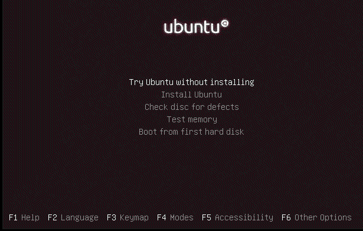

在这里，我们有许多选项可供选择。第一个选项将把 Linux 发行版加载到内存中。其他选项，如“安装 Ubuntu”，将用于正常安装。我们还可以检查光盘是否有缺陷等。

现在，使用光标，突出显示“尝试 Ubuntu 而不安装”，然后按*Enter*。之后，系统将启动到 Linux 发行版：

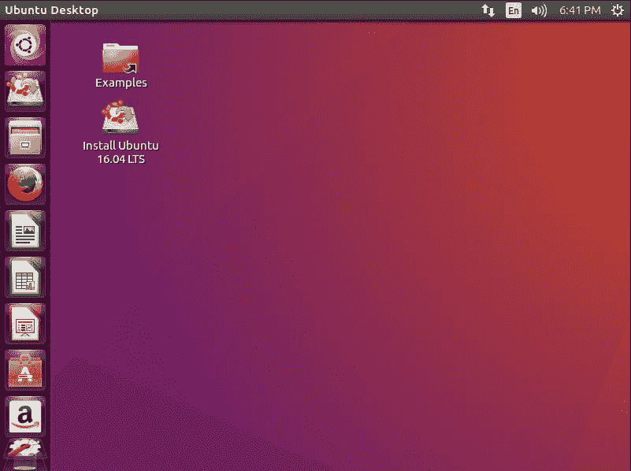

从这里，我们可以执行各种任务，就像在已安装的操作系统上一样。当您的硬件资源不足或您有非常老旧的硬件无法支持最新的操作系统时，这就有了好处。放心，有许多适用于这种环境的 Linux 发行版可供选择。

另外，请注意我们可以从驱动器中取出 CD/DVD，系统将继续工作而不会出现任何错误。大多数情况下，我们将使用 LiveCD 执行管理任务。

# 作为全新安装安装 Linux 发行版

当我们只想执行一些管理任务时，在 LiveCD 中工作是可以的。为此，我们可以将 Linux 发行版作为完整安装进行安装；在硬盘上安装 Linux。为了继续 LiveCD 演示，我们将使用桌面上的“安装 Ubuntu...”选项来执行全新安装。这将呈现以下设置：

1.  从这里开始，我们必须选择继续安装的语言。有很多语言可供选择。在我们的情况下，我们将接受默认的英语，并选择继续：

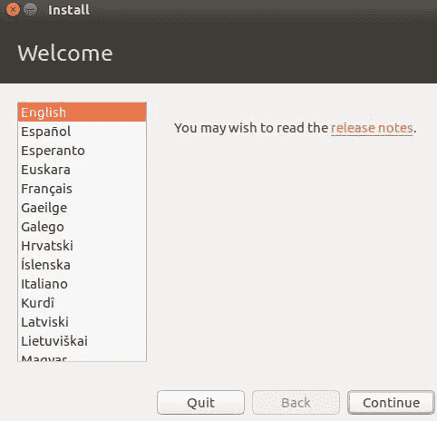

1.  现在，我们有选项在安装过程中下载更新和/或安装用于图形等的第三方软件。对于这一部分，您需要一个活动的互联网连接；原因是系统将去下载最近发布的更新。此外，当我们添加不属于系统的其他硬件时，它们需要模块（类似驱动程序），这些模块不会默认安装。因此，有第二个选项来下载第三方软件。在我们的情况下，因为我们在实验室环境中，我们将取消这些选项并选择继续：

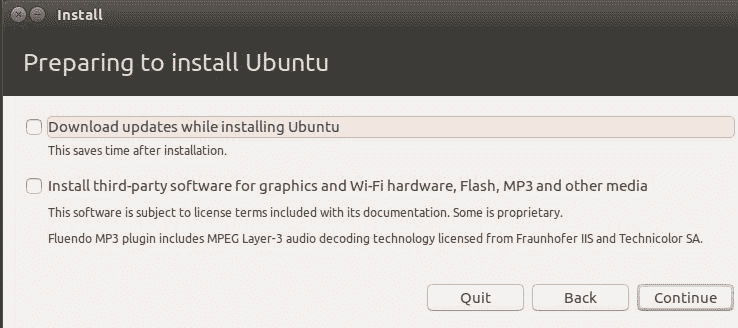

您需要一个活动的互联网连接来下载更新。

1.  在这里，我们有选项在整个硬盘上安装 Linux 发行版。如果出于某种原因，我们想要向硬盘添加一个或多个分区，那么我们将选择“其他”。此外，如果我们试图在 Windows 上进行双引导或在另一个 Linux 发行版上进行并排安装，我们将选择此选项：

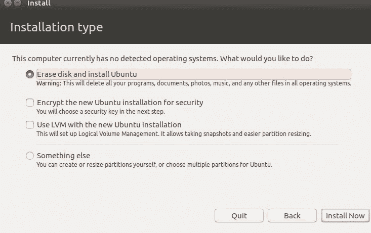

1.  对于新安装，让我们选择“其他”并创建自己的分区，并指定我们要挂载的内容：

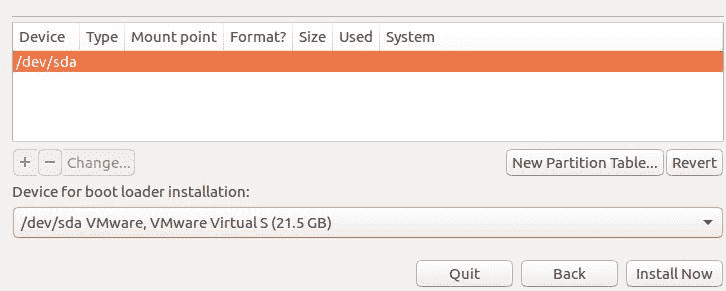

1.  太棒了！我们的环境中只有一个硬盘。我们将选择新分区表。让我们首先创建一个 200MB 的分区并挂载`/boot`；这是存储引导文件的地方：

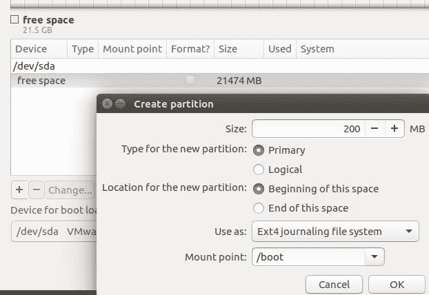

为`/boot`创建一个分区总是一个好主意，以保护引导文件。

1.  接下来，让我们创建一个 13GB 的分区，并指定它应该挂载到`/`目录上。此外，我们还指定分区类型为主分区，并将分区格式化为`ext3`文件系统：

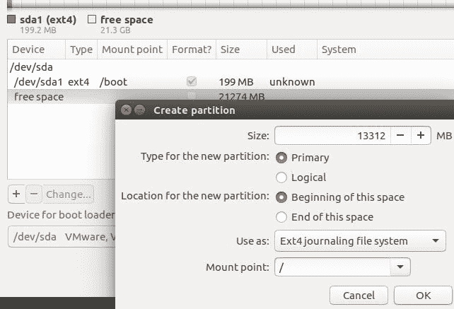

1.  接下来，让我们创建一个 5GB 的分区，并指定它应该挂载到`/home`。这是用户文件的存储位置：

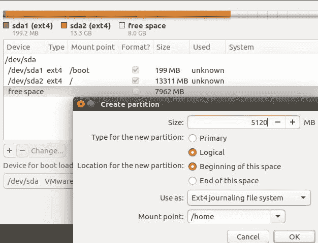

1.  太棒了！最后，让我们利用剩余的空间，让 Linux 发行版分配给交换内存：

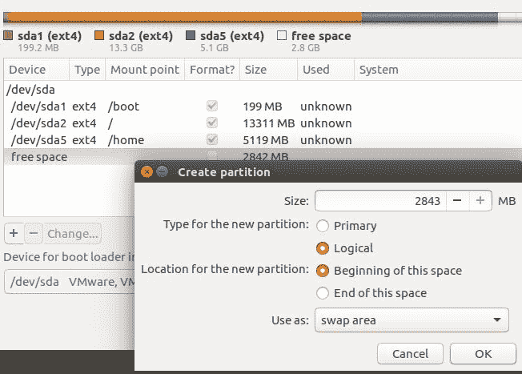

从前面的截图中，您会注意到没有挂载点选项可用。这是因为我们指定剩余的空间应该用作交换区。系统将根据需要使用交换区（我们在前面的章节中看到过；即第一章，*配置硬件设置*，在*查看 CPU、RAM、交换信息*部分）。

1.  分区完成后，我们可以选择继续。这将显示一个警告消息：

接下来，我们将看到区域设置，并搜索您的国家并填写。在我的情况下，我在圭亚那；这个国家位于南美洲，所以我选择圭亚那然后继续。

1.  之后，会出现键盘选择，您需要选择适当的设置。这将带我们来到设置的关键部分：用户创建屏幕。我们为计算机指定一个名称，并创建一个带有超级秘密密码的用户帐户：

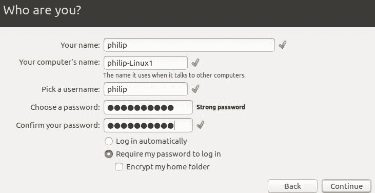

太棒了！现在我们正要安装一个新的 Linux 发行版。

1.  您可以通过选择位于“正在安装系统”旁边的下拉箭头来随时检查正在下载或安装的文件：

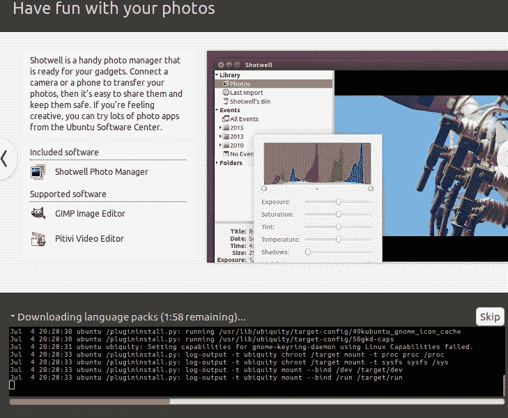

现在安装将下载各种语言包（需要互联网连接）。之后，设置将继续将必要的文件安装到硬盘上。

最后，系统会要求我们重新启动以启动系统，使用新安装的 Linux 发行版。

安装完成后，拔掉 CD、DVD 或 USB 驱动器，然后再系统启动之前。

# 在 Windows 操作系统旁边安装 Linux 发行版

在大多数环境中，您可能会遇到已经安装了其他操作系统（如 Windows）的系统。理想情况下，您不会完全删除 Windows 安装，因为您可能需要一些仅在 Windows 安装上运行的软件，或者可能是公司政策要求在系统上安装 Windows。在这种情况下，您可以在 Windows 旁边安装 Linux 发行版，而不会擦除 Windows 分区。这是可能的，因为 Linux 有能力识别 Windows 分区类型，如 NTFS。Linux 不会以任何方式改变 Windows 分区。

让我们启动现有的 Windows 系统，并配置系统从 Ubuntu ISO 映像启动，看看我们如何实现双启动安装：

1.  从这里开始，Ubuntu 安装将识别 Windows 10 操作系统。我们将选择最后一个选项“其他”：

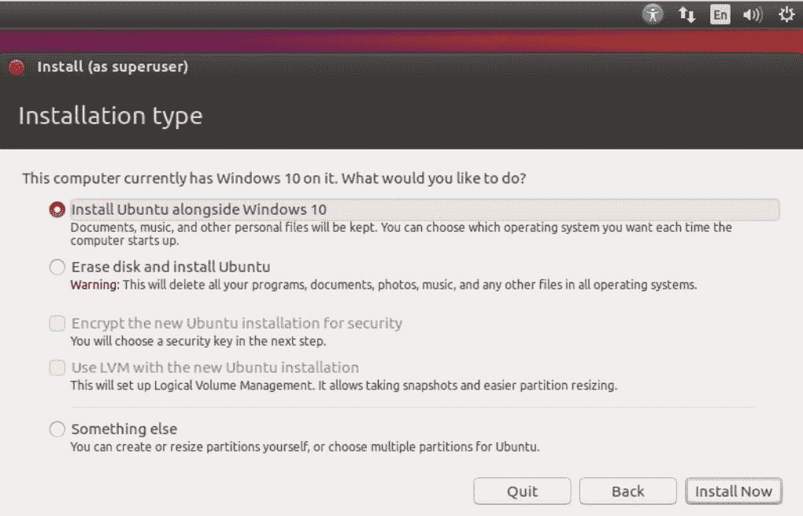

1.  接下来，我们将创建`/boot`分区：

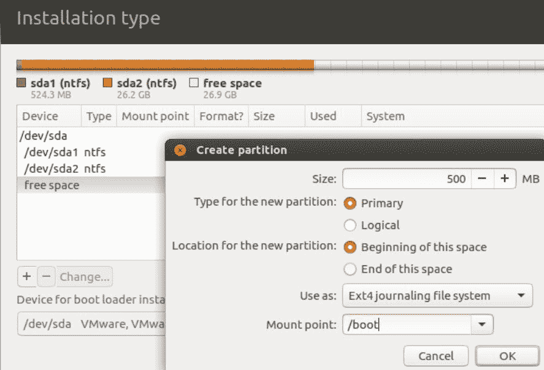

1.  之后，我们将创建`/`分区：

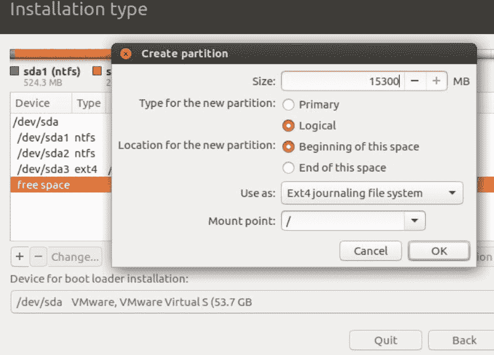

从上面的屏幕截图中，我们可以看到我们刚刚成功创建了`/`分区。您可能已经注意到我们创建分区的模式。将系统文件与用户文件分开始终是一个好主意。

1.  接下来，我们将创建`/home`分区：

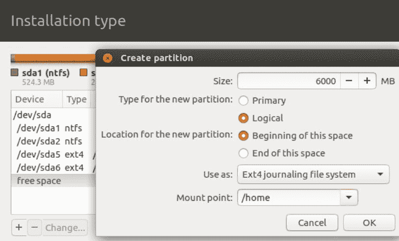

1.  最后，我们将创建交换空间并使用剩余的空间：

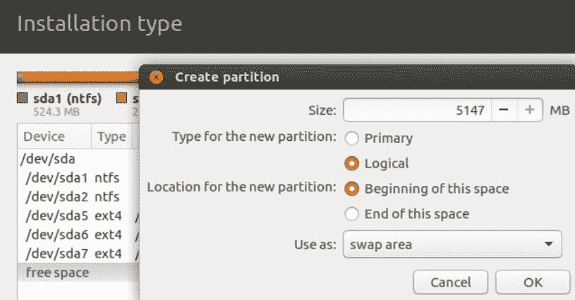

1.  最后一步是选择立即安装：

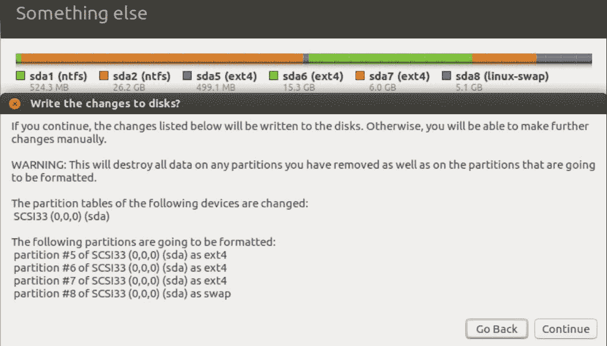

从上面的屏幕截图中，我们将不得不确认我们是否要将更改写入磁盘。我们将选择“继续”。

我们可以随时返回并通过选择返回进行更改分区表。

现在，我们必须填写位置设置，类似于进行全新安装。我会再次选择圭亚那。

接下来，我们必须像之前一样创建一个用户帐户。必要的 Linux 文件将被安装到我们的双启动系统上。

1.  之后，我们将被提示重新启动系统，并将在 GRUB2 的双启动菜单中受到欢迎，如下面的屏幕截图所示：

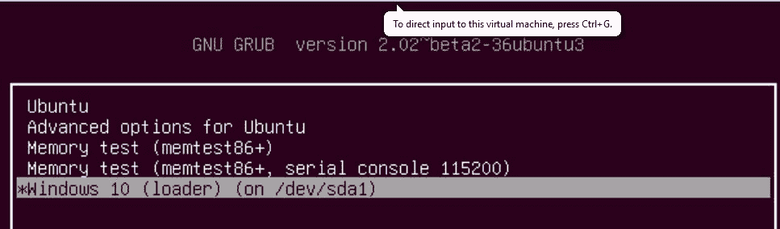

在某些情况下，如果我们将 Linux 作为第一个操作系统，然后安装 Windows，有时 Windows 会删除 Linux 的启动项。解决此问题的最佳工具是运行`grub-install`。

# 在另一种 Linux 旁边安装 Linux

在某些环境中，您可能需要适应不同的 Linux 发行版。您可以在不丢失当前的 Linux 发行版的情况下安装另一个发行版。

让我们使用现有的 Ubuntu 系统并安装 CentOS 7 以演示如何进行双启动：

1.  首先，我们设置系统从 CentOS 7 ISO 映像启动：

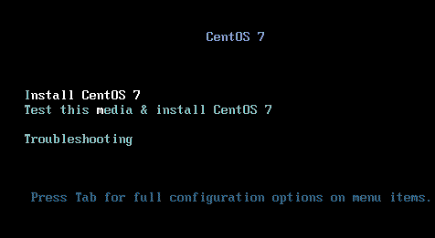

1.  从这里，我们选择第一个选项并按*Enter*。这将启动 CentOS 7 的设置：

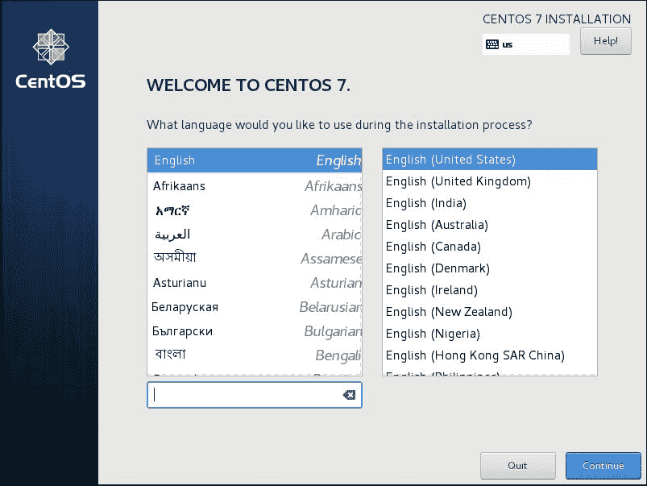

然后选择我们的语言并选择继续。

1.  在“安装摘要”页面上，关键重要的部分是“软件选择”和“系统”：

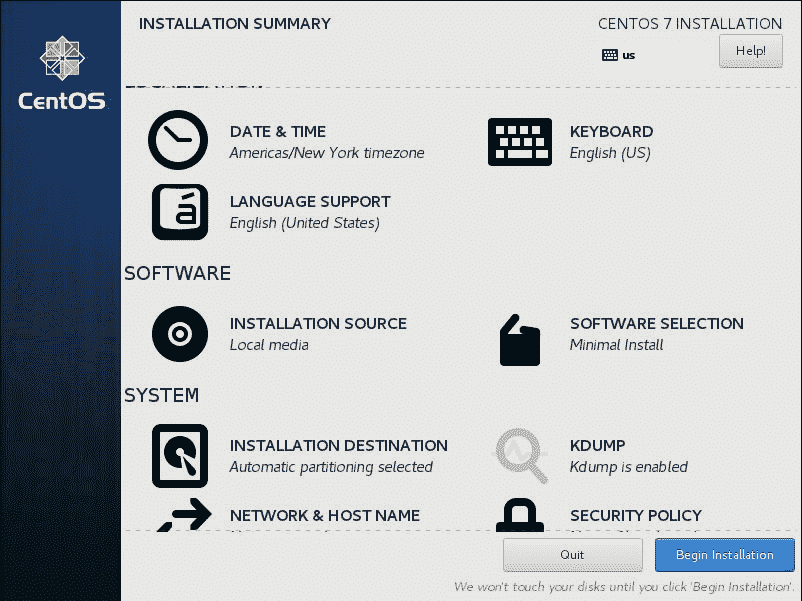

1.  默认情况下，CentOS 7 将进行最小安装。我们想要进行完整安装，因此选择“软件选择”：

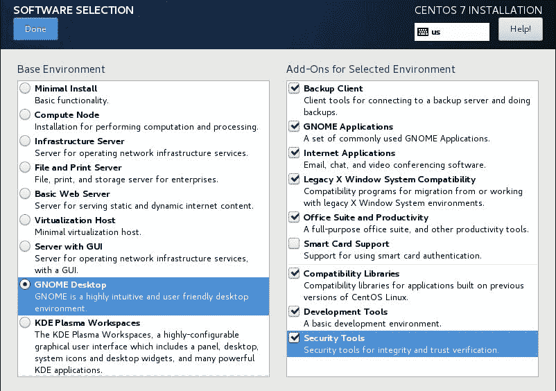

从上面的屏幕截图中，默认情况下选择了最小安装。我在“基本环境”下选择了 GNOME 桌面，并选择了选中的附加组件。完成选择后，我将点击“完成”。

您可以选择为特定基本环境添加一些或所有附加组件。

1.  在双启动环境中特别重要的下一部分在“系统”部分下：安装目的地。

1.  这里是我们将对硬盘进行分区的地方：

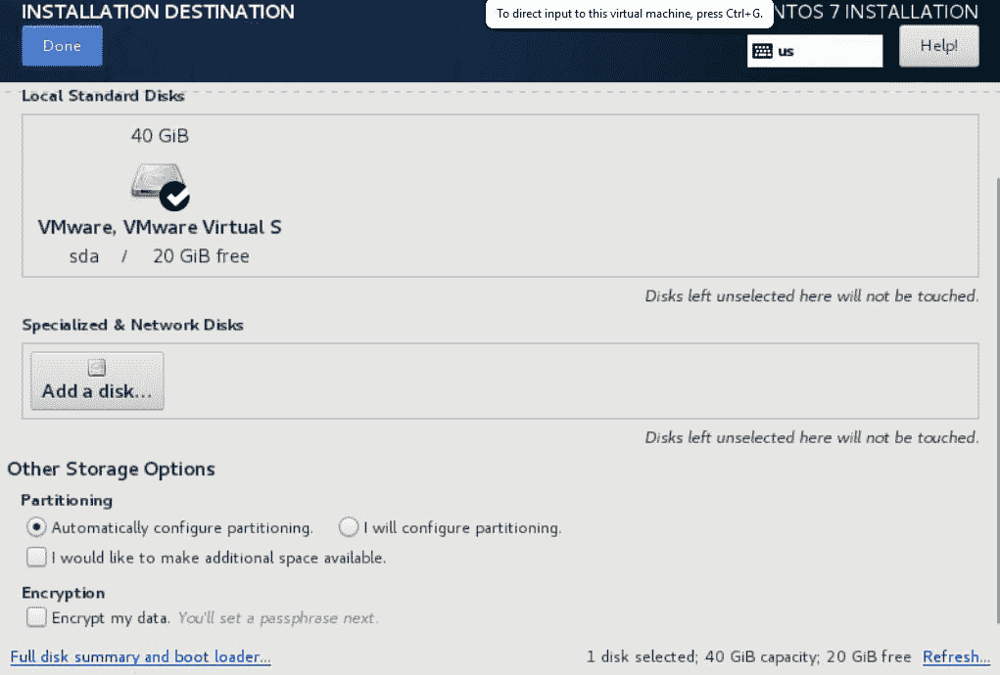

1.  默认情况下，系统将选择自动对硬盘进行分区。如果我们保留这个选项，允许系统为我们创建分区，那么系统将根据每个分区的推荐大小创建分区。为了演示的目的，我们将选择“我将配置分区”。这将说明在 CentOS 7 环境中创建分区涉及的各个步骤。接下来，我们将选择“完成”。这将带来分区屏幕：

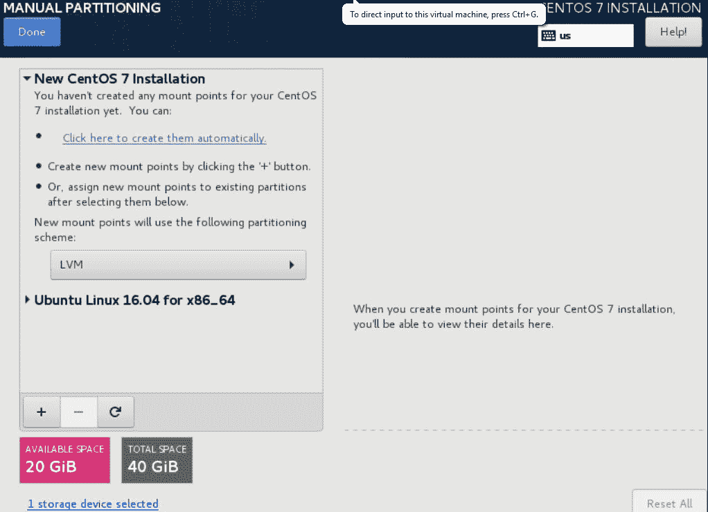

从前面的屏幕截图中，我们可以看到 CentOS 7 安装已经检测到了 Ubuntu 安装。

对于这个 CentOS 7 安装，我们将`/boot`挂载到 CentOS 7 的`/boot`挂载点。

在删除分区时要小心，因为这可能会对系统的运行状态产生一些不利影响。换句话说，您可能会意外删除一些存储在分区上的关键配置文件，或者更糟糕的是，您的系统可能无法启动。

1.  接下来，我们为 CentOS 7 创建`/`分区：

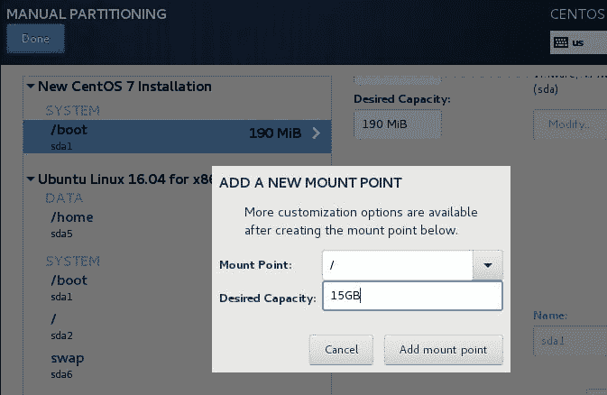

1.  然后我们创建`/home`分区：

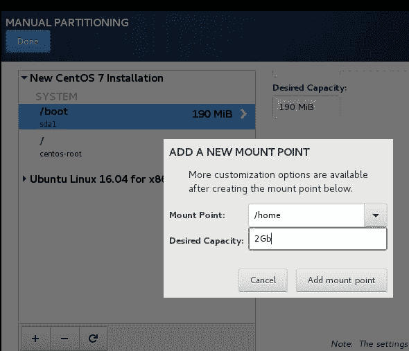

1.  最后，我们使用剩余的空间创建交换空间：

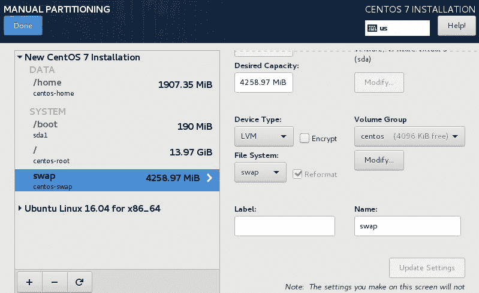

1.  完成后，我们选择“完成”：

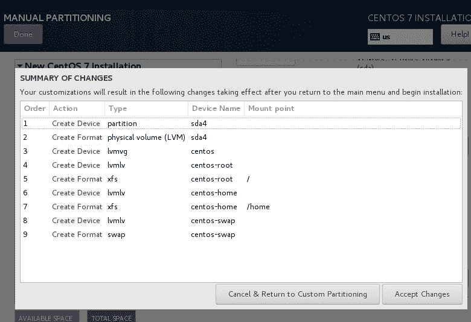

1.  现在，我们必须通过选择“接受更改”来确认我们的更改：

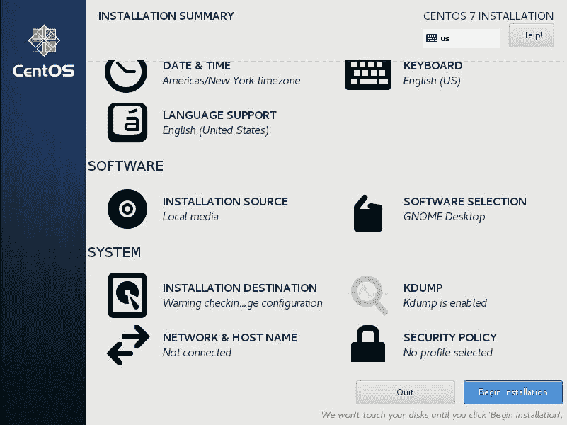

1.  当我们选择开始安装时，实际的安装将开始。我们将不得不创建一个用户帐户：

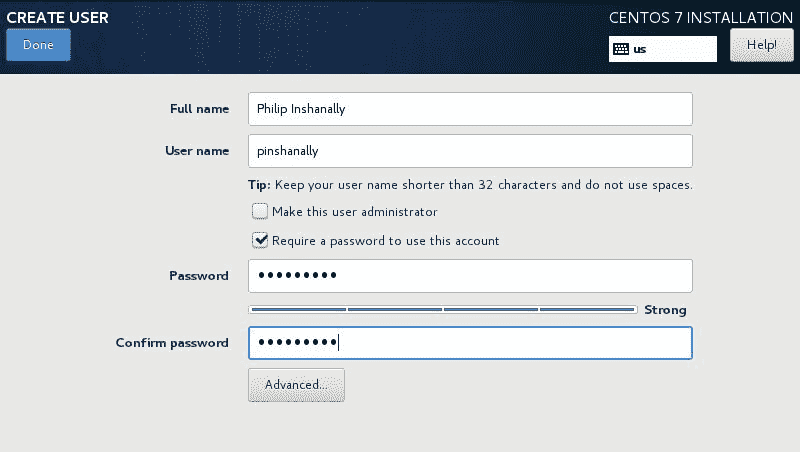

1.  然后我们需要设置一个 root 密码：

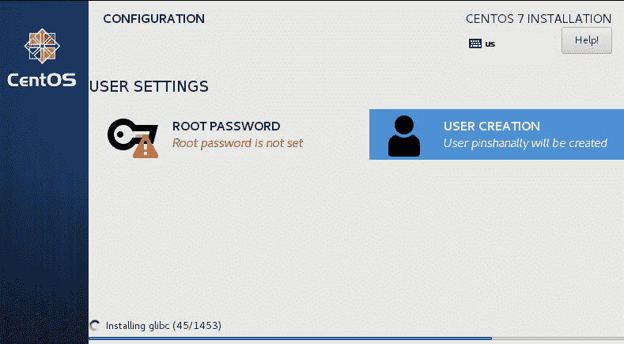

1.  我们应该设置一个没有人能猜到的复杂密码：

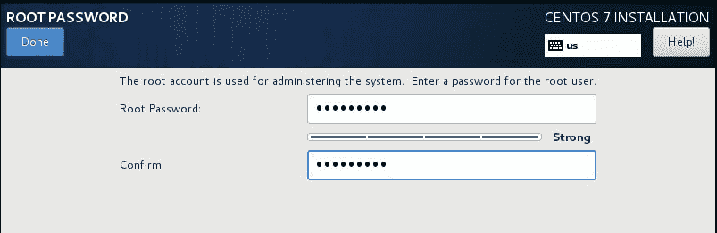

1.  现在，我们要允许 CentOS 7 执行安装——给它一些时间。最后，我们被提示重新启动，所以我们会选择重新启动。

1.  最后，我们迎来了双引导菜单，显示了 CentOS 7 和 Ubuntu，如下面的屏幕截图所示：

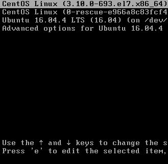

如您所见，我们现在可以选择加载哪个 Linux 发行版。

# 总结

在本章中，我们深入探讨了 Linux 发行版的安装。我们讨论了 LiveCD 的概念。我们讨论了使用 LiveCD 的场景；也就是说，当我们想要测试、当我们有硬件资源或正在执行一些管理任务时。然后我们演示了使用 LiveCD。请记住，实际的 Linux 发行版是从硬盘以外的介质运行的。它通过将一些文件加载到 RAM 中来实现这一点。LiveCD 提供的一个明显优势是它不会干扰您的基础操作系统。然后我们将注意力转向进行 Linux 发行版的全新安装。执行全新安装的步骤在不同的发行版之间有所不同。之后，我们专注于在 Windows 和 Linux 之间进行双引导，特别是 Windows 10 和 Ubuntu。最后，我们结束了本章，通过在 Linux 发行版之间进行双引导，特别是 CentOS 和 Ubuntu，来结束本章。

接下来，我们将要涵盖红帽世界的另一面：Debian 环境。换句话说，我们将主要关注 Ubuntu 环境下的软件包管理，涵盖诸如`dpkg`、`apt`和`aptitude`等使用的各种技术。我希望您能加入我，一起迈向实现认证目标的激动人心的新篇章。

# 问题

1.  在使用 LiveCD 时，临时文件存储在哪里？

A. 硬盘

B. LiveCD

C. RAM

D. 以上都不是

1.  哪个选项可以启动 Ubuntu LiveCD？

A. 从第一个硬盘启动

B. 测试完整性

C. 立即安装

D. 试用 Ubuntu 而不安装

1.  在 Ubuntu LiveCD 的桌面上，您会选择哪个选项进行全新安装？

A. 安装 Ubuntu…

B. 试用 Ubuntu 并安装

C. 重新启动并从硬盘启动

D. 全新安装

1.  在进行全新安装时下载更新时，需要什么？

A. 复杂编码

B. 一个活动的互联网连接

C. 从安装媒体复制文件到硬盘

D. 不需要任何要求

1.  哪个选项允许我们在安装类型下创建自己的分区？

A. 其他

B. 擦除整个硬盘

C. 复制整个硬盘

D. 加密整个硬盘

1.  系统要能够启动，需要哪种类型的分区？

A. 逻辑

B. 扩展

C. 主要

D. 次要

1.  为什么我们应该将`/boot`分区与其他分区分开？

A. 能够在`/boot`中下载我们的视频 B. 防止系统因意外删除`/boot`中的文件而无法启动 C. 证明我们知道如何分区

D. 证明所有系统文件都安装在`/boot`中

1.  哪个命令被选择来在 CentOS 7 安装中创建自定义分区？

A. 自动配置分区

B. 我会配置分区

C. 加密我的数据

D. 创建逻辑卷

1.  如果 Windows 安装在尝试进行**双重**启动时删除了 GRUB，那么使用哪个命令来安装 GRUB？

A. `grub-install`

B. `grub`

C. `grub-update`

D. `grub-configure`

1.  对于 CentOS 7，默认的软件选择是什么？

A. GNOME 桌面

B. KDE 桌面

C. XFCE 桌面

D. 最小安装

# 进一步阅读

+   您可以在以下网址获取有关 CentOS 发行版的更多信息，例如安装、配置最佳实践等：[`www.centos.org`](https://www.centos.org)。

+   这个网站为您提供了许多有用的技巧和 Linux 社区用户的最佳实践，特别是针对 Debian 发行版，如 Ubuntu：[`askubuntu.com`](https://askubuntu.com)。

+   这个最后的链接为您提供了一般信息，涉及适用于 CentOS 和 Ubuntu 的各种命令。您可以在那里发布您的问题，其他社区成员会回答：[`www.linuxquestions.org`](https://www.linuxquestions.org)。
