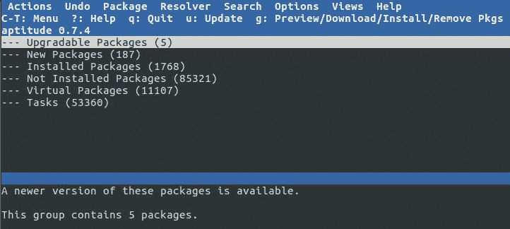
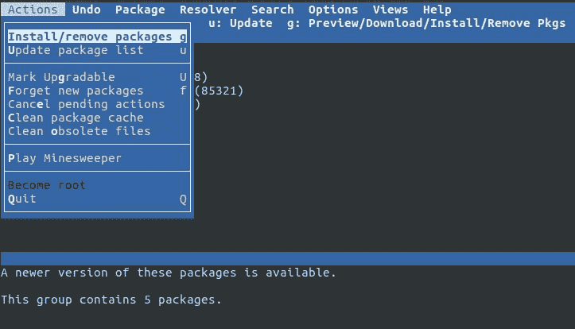
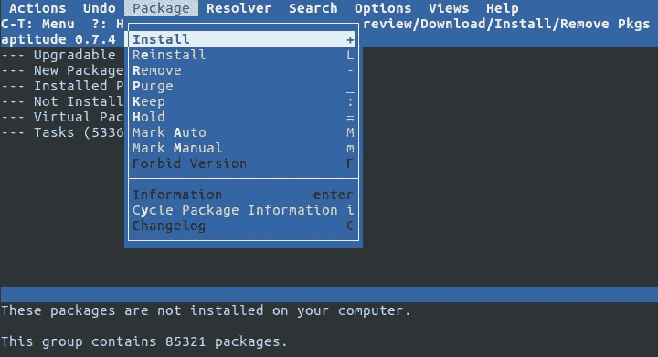
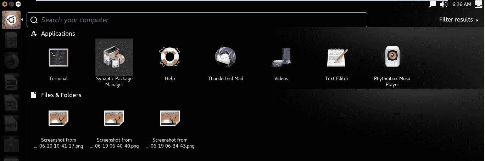
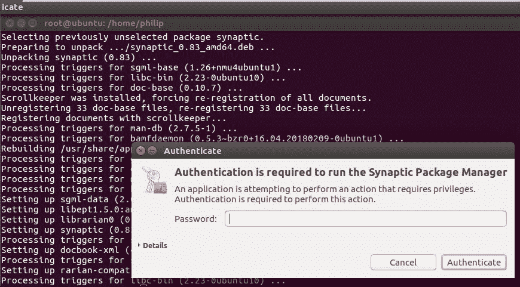
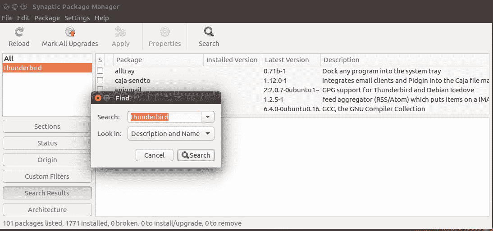
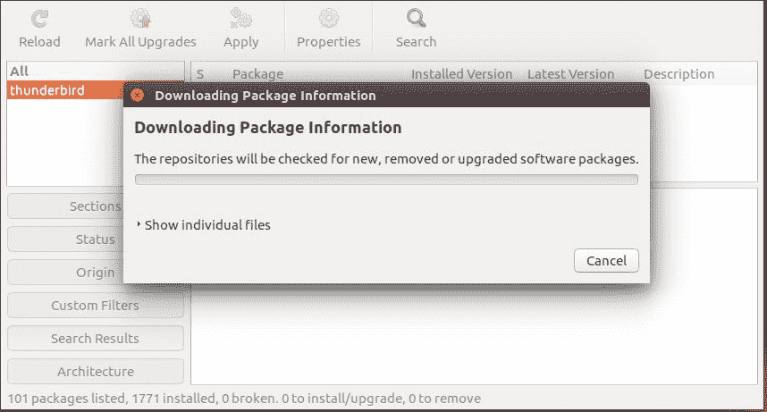

# 第六章：使用 Debian 软件包管理

在上一章中，我们重点介绍了安装 Linux 发行版的步骤。我们首先使用了 LiveCD 的概念，而不是常规安装。我们看到了系统如何在没有硬盘的情况下启动。然后我们讨论了为什么要使用 LiveCD。之后，我们将注意力转移到演示如何执行 Linux 发行版的全新安装。重点放在了分区上，特别是常见的挂载点。接下来，我们看到了如何在 Windows 操作系统旁边进行安装。在此之后，我们进行了 Linux 发行版之间的并排安装。

在本章中，我们将继续我们的课程，重点关注软件安装周围的要点。我们将首先看一下 Debian 风格的软件包管理。首先，我们将从`dpkg`命令开始，并查看使用`dpkg`命令的各种方法。此外，我们将查看可以与`dpkg`命令一起使用的各种选项。接下来，我们将把注意力转向`apt-get`实用程序。这是另一个在 Debian 环境中安装应用程序的流行命令。我们将密切关注可以与`apt-get`命令一起使用的选项。之后，重点将转向`aptitude`实用程序。最后，我们将通过查看`synaptic`实用程序来结束。与前面的命令类似，我们将重点关注在 Debian 环境中部署软件的语法。本章讨论的所有实用程序都是在 Debian 环境中管理软件常用的。

在本章中，我们将涵盖以下主题：

+   `dpkg`命令

+   `apt-get`命令

+   `aptitude`命令

+   `synaptic`实用程序

# `dpkg`命令

首先，`dpkg`实用程序是一个低级系统工具，用于提取、分析、解压缩、安装和删除扩展名为`.deb`的软件包。在每个`.deb`文件中由`dpkg`读取的脚本非常重要，因为它们向程序提供有关软件包安装、删除和配置的信息。`dpkg`实用程序位于基于 Debian 的发行版中的软件包管理系统的基础。Debian 软件包`dpkg`提供了`dpkg`实用程序，以及运行时包装系统所必需的其他几个程序；即：`dpkg-deb`、`dpkg-split`、`dpkg-query`、`dpkg-statoverride`、`dpkg-divert`和`dpkg-trigger`。我们可以瞥一眼`/var/log/dpkg.log`文件。其中有大量关于触发器和软件包经过各种解压缩和配置阶段的详细信息。

让我们看看`/var/log/dpkg.log`：

```
philip@ubuntu:~$ cat /var/log/dpkg.log
2018-07-02 06:43:57 startup archives unpack
2018-07-02 06:44:01 install linux-image-4.4.0-130-generic:amd64 <none> 4.4.0-130.156
2018-07-02 06:44:01 status half-installed linux-image-4.4.0-130-generic:amd64 4.4.0-130.156
2018-07-02 06:44:09 status unpacked linux-image-4.4.0-130-generic:amd64 4.4.0-130.156
2018-07-02 06:44:09 status unpacked linux-image-4.4.0-130-generic:amd64 4.4.0-130.156
2018-07-02 06:44:09 install linux-image-extra-4.4.0-130-generic:amd64 <none> 4.4.0-130.156
2018-07-02 06:44:09 status half-installed linux-image-extra-4.4.0-130-generic:amd64 4.4.0-130.156
2018-07-02 06:44:20 status unpacked linux-image-extra-4.4.0-130-generic:amd64 4.4.0-130.156
2018-07-02 06:44:20 status unpacked linux-image-extra-4.4.0-130-generic:amd64 4.4.0-130.156
2018-07-02 06:44:21 upgrade linux-generic:amd64 4.4.0.128.134 4.4.0.130.136
2018-07-02 06:44:21 status half-configured linux-generic:amd64 4.4.0.128.134
2018-07-02 06:44:21 status unpacked linux-generic:amd64 4.4.0.128.134
2018-07-02 06:44:21 status half-installed linux-generic:amd64 4.4.0.128.134
2018-07-02 06:44:21 status half-installed linux-generic:amd64 4.4.0.128.134
2018-07-02 06:44:21 status unpacked linux-generic:amd64 4.4.0.130.136
2018-07-02 06:44:21 status unpacked linux-generic:amd64 4.4.0.130.136
2018-07-02 06:44:21 upgrade linux-image-generic:amd64 4.4.0.128.134 4.4.0.130.136
2018-07-02 06:44:21 status half-configured linux-image-generic:amd64 4.4.0.128.134
2018-07-02 06:44:21 status unpacked linux-image-generic:amd64 4.4.0.128.134
2018-07-02 06:44:21 status half-installed linux-image-generic:amd64 4.4.0.128.134
```

从前面的输出中，我们了解了`dpkg`实用程序正在管理的各种软件包。如果我们想要查看系统上的软件包列表，我们可以使用`l`选项：

```
philip@ubuntu:~$ dpkg -l
Desired=Unknown/Install/Remove/Purge/Hold
| Status=Not/Inst/Conf-files/Unpacked/halF-conf/Half-inst/trig-aWait/Trig-pend
|/ Err?=(none)/Reinst-required (Status,Err: uppercase=bad)
||/ Name                          Version             Architecture        Description
+++-=============================-===================-===================-================================================================
ii  a11y-profile-manager-indicato 0.1.10-0ubuntu3      amd64               Accessibility Profile Manager - Unity desktop indicator
ii  account-plugin-facebook       0.12+16.04.20160126 all                 GNOME Control Center account plugin for single signon - facebook
ii  account-plugin-flickr         0.12+16.04.20160126 all                 GNOME Control Center account plugin for single signon - flickr
ii  account-plugin-google         0.12+16.04.20160126 all                 GNOME Control Center account plugin for single signon
ii  accountsservice               0.6.40-2ubuntu11.3  amd64               query and manipulate user account information
ii  activity-log-manager          0.9.7-0ubuntu23.16\. amd64               blacklist configuration user interface for Zeitgeist
ii  adduser                       3.113+nmu3ubuntu4   all                 add and remove users and groups
ii  adium-theme-ubuntu            0.3.4-0ubuntu1.1    all                 Adium message style for Ubuntu
ii  app-install-data              15.10               all                 Ubuntu applications (data files)
ii  app-install-data-partner      16.04               all                 Application Installer (data files for partner applications/repos
ii  apparmor                      2.10.95-0ubuntu2.9  amd64               user-space parser utility for AppArmor
ii  appmenu-qt:amd64              0.2.7+14.04.2014030 amd64               application menu for Qt
ii  appmenu-qt5                   0.3.0+16.04.2017021 amd64               application menu for Qt5
ii  apport                        2.20.1-0ubuntu2.18  all                 automatically generate crash reports for debugging
ii  apport-gtk                    2.20.1-0ubuntu2.18  all                 GTK+ frontend for the apport crash report system
```

在前面的输出中，我们从左到右阅读输出。现在我们应该把注意力集中在输出的最右边。这是描述部分；软件包以人类可读的摘要形式呈现，说明了当前安装在该系统上的每个软件包。

我们还可以通过过滤`dpkg`命令来缩小输出范围；让我们只查找`xterm`程序：

```
philip@ubuntu:~$ dpkg -l xterm
Desired=Unknown/Install/Remove/Purge/Hold
| Status=Not/Inst/Conf-files/Unpacked/halF-conf/Half-inst/trig-aWait/Trig-pend
|/ Err?=(none)/Reinst-required (Status,Err: uppercase=bad)
||/ Name                          Version             Architecture        Description
+++-=============================-===================-===================-================================================================
ii  xterm                         322-1ubuntu1        amd64               X terminal emulator
philip@ubuntu:~$        
```

我们可以使用`--get-selections`验证软件包是否已安装：

```
philip@ubuntu:~$ dpkg --get-selections
a11y-profile-manager-indicator    install
account-plugin-facebook           install
account-plugin-flickr             install
account-plugin-google             install
accountsservice                   install
acl                               install
acpi-support                      install
acpid                             install
activity-log-manager              install
adduser                           install
adium-theme-ubuntu                install
adwaita-icon-theme                install
aisleriot                         install
alsa-base                         install
alsa-utils                        install
amd64-microcode                   install
anacron                           install
apg                               install
app-install-data                  install
app-install-data-partner          install
apparmor                          install
appmenu-qt:amd64                  install
appmenu-qt5                       install
apport                            install
```

我们可以使用`L`选项查看软件包拥有的文件。让我们继续我们的示例：

```
philip@ubuntu:~$ dpkg -L xterm
/.
/etc
/etc/X11
/etc/X11/app-defaults
/etc/X11/app-defaults/UXTerm-color
/etc/X11/app-defaults/UXTerm
/etc/X11/app-defaults/KOI8RXTerm-color
/etc/X11/app-defaults/KOI8RXTerm
/etc/X11/app-defaults/XTerm-color
/usr/share/man/man1/koi8rxterm.1.gz
/usr/share/man/man1/resize.1.gz
/usr/share/man/man1/xterm.1.gz
/usr/share/man/man1/lxterm.1.gz
philip@ubuntu:~$
```

我们可以使用`s`选项在系统中搜索特定的软件包：

```
philip@ubuntu:~$ dpkg -s apache
dpkg-query: package 'apache' is not installed and no information is available
Use dpkg --info (= dpkg-deb --info) to examine archive files,
and dpkg --contents (= dpkg-deb --contents) to list their contents.
philip@ubuntu:~$ dpkg --info apache
dpkg-deb: error: failed to read archive 'apache': No such file or directory
philip@ubuntu:~$
```

在这种情况下，Apache 在这个系统上默认没有安装。

我已经为这个演示下载了一个`tftp`客户端。让我们验证一下`tftp`客户端是否已安装在这个系统上：

```
philip@ubuntu:~/Downloads$ dpkg -l tftp
dpkg-query: no packages found matching tftp
philip@ubuntu:~/Downloads$
```

现在我们将使用`dpkg`命令安装一个软件包。让我们尝试使用`i`选项安装`tftp`客户端软件包：

```
philip@ubuntu:~/Downloads$ dpkg -i tftp_0.17-18_i386.deb
dpkg: error: requested operation requires superuser privilege
philip@ubuntu:~/Downloads$
```

从前面的输出中，您可以看到我们需要 root 权限来安装或删除软件包。让我们以 root 身份重试：

```
root@ubuntu:/home/philip/Downloads# ls -l | grep tftp
-rw-rw-r-- 1 philip philip  17208 Jul 18 08:15 tftp_0.17-18_i386.deb
root@ubuntu:/home/philip/Downloads# 
root@ubuntu:/home/philip/Downloads# dpkg -i tftp_0.17-18_i386.deb
Selecting previously unselected package tftp:i386.
(Reading database ... 241431 files and directories currently installed.)
Preparing to unpack tftp_0.17-18_i386.deb ...
Unpacking tftp:i386 (0.17-18) ...
Setting up tftp:i386 (0.17-18) ...
Processing triggers for man-db (2.7.5-1) ...
root@ubuntu:/home/philip/Downloads#
```

太棒了！现在，让我们使用`dpkg`命令和`l`选项重试一下：

```
root@ubuntu:/home/philip/Downloads# dpkg -l tftp
Desired=Unknown/Install/Remove/Purge/Hold
| Status=Not/Inst/Conf-files/Unpacked/halF-conf/Half-inst/trig-aWait/Trig-pend
|/ Err?=(none)/Reinst-required (Status,Err: uppercase=bad)
||/ Name                          Version             Architecture        Description
+++-=============================-===================-===================-================================================================
ii  tftp:i386                     0.17-18             i386                Trivial file transfer protocol client
root@ubuntu:/home/philip/Downloads#
```

太棒了！我们现在可以看到我们的`tftp`客户端已列出。我们还可以运行带有`--get-selections`的`dpkg`来验证：

```
root@ubuntu:/home/philip/Downloads# dpkg --get-selections | grep tftp
tftp:i386                                                            install
root@ubuntu:/home/philip/Downloads#
```

当您使用`dpkg`安装软件包时，有时可能会遇到依赖性问题。为了解决这个问题，您需要在使用`dpkg`安装软件包之前下载并安装每个依赖项。

我们还可以使用`dpkg`命令删除软件包。让我们删除在上一个示例中安装的`tftp`软件包。我们将使用`-r`选项：

```
root@ubuntu:/home/philip/Downloads# dpkg -r tftp
(Reading database ... 241438 files and directories currently installed.)
Removing tftp:i386 (0.17-18) ...
Processing triggers for man-db (2.7.5-1) ...
root@ubuntu:/home/philip/Downloads#
```

现在，让我们验证一下`tftp`包确实已被卸载：

```
root@ubuntu:/home/philip/Downloads# dpkg -l tftp
dpkg-query: no packages found matching tftp
root@ubuntu:/home/philip/Downloads#
```

太棒了！但是，当我们使用`-r`选项时，它不会删除配置文件。为了删除软件包以及配置文件，我们应该使用`-P`（清除）选项。下面是它的工作原理：

```
root@ubuntu:/home/philip/Downloads# dpkg -P tftp
(Reading database ... 241438 files and directories currently installed.)
Removing tftp:i386 (0.17-18) ...
Processing triggers for man-db (2.7.5-1) ...
root@ubuntu:/home/philip/Downloads#
```

我们还可以提取软件包的内容而不安装它。我们应该使用`-x`选项：

```
root@ubuntu:/home/philip/Downloads# dpkg -x tftp_0.17-18_i386.deb ./tftp_0.17-18_i386
root@ubuntu:/home/philip/Downloads# ls
root@ubuntu:/home/philip/Downloads# ls tftp_0.17-18_i386
usr
root@ubuntu:/home/philip/Downloads# ls tftp_0.17-18_i386/usr/
bin  share
root@ubuntu:/home/philip/Downloads#
root@ubuntu:/home/philip/Downloads# ls tftp_0.17-18_i386/usr/bin/
tftp
root@ubuntu:/home/philip/Downloads# ls tftp_0.17-18_i386/usr/share/
doc/ man/
root@ubuntu:/home/philip/Downloads# ls tftp_0.17-18_i386/usr/share/
doc  man
root@ubuntu:/home/philip/Downloads#
```

在使用`dpkg`实用程序下载任何软件包并安装之前，我们需要知道系统的正确硬件架构。幸运的是，我们可以使用`dpkg-architecture`命令：

```
root@ubuntu:/home/philip/Downloads# dpkg-architecture
DEB_BUILD_ARCH=amd64
DEB_BUILD_ARCH_BITS=64
DEB_BUILD_ARCH_CPU=amd64
DEB_BUILD_ARCH_ENDIAN=little
DEB_BUILD_ARCH_OS=linux
DEB_BUILD_GNU_CPU=x86_64
DEB_BUILD_GNU_SYSTEM=linux-gnu
DEB_BUILD_GNU_TYPE=x86_64-linux-gnu
DEB_TARGET_ARCH_CPU=amd64
DEB_TARGET_ARCH_ENDIAN=little
DEB_TARGET_ARCH_OS=linux
DEB_TARGET_GNU_CPU=x86_64
DEB_TARGET_GNU_SYSTEM=linux-gnu
DEB_TARGET_GNU_TYPE=x86_64-linux-gnu
DEB_TARGET_MULTIARCH=x86_64-linux-gnu
root@ubuntu:/home/philip/Downloads#
```

根据前面的输出，我们可以看到这个系统支持 32 位或 64 位软件包。我们还可以获取有关软件包用途的有用信息。我们需要使用带有`-s`选项的`dpkg-query`命令：

```
root@ubuntu:/home/philip/Downloads# dpkg-query -s tftp
Package: tftp
Status: install ok unpacked
Priority: optional
Section: net
Installed-Size: 80
Maintainer: Alberto Gonzalez Iniesta <agi@inittab.org>
Architecture: i386
Source: netkit-tftp
Version: 0.17-18
Config-Version: 0.17-18
Replaces: netstd
Depends: netbase, libc6 (>= 2.3)
Description: Trivial file transfer protocol client
Tftp is the user interface to the Internet TFTP (Trivial File Transfer
Protocol), which allows users to transfer files to and from a remote machine.
The remote host may be specified on the command line, in which case tftp uses
host as the default host for future transfers.
root@ubuntu:/home/philip/Downloads#
```

从前面的输出中，我们在底部得到了有关`tftp`软件包用途的描述。

# apt-get 命令

**高级软件包工具**（**APT**）是一个命令行工具，用于与`dpkg`软件包系统进行简单交互。 APT 是管理基于 Debian 的 Linux 发行版（如 Ubuntu）中软件的理想方法。它有效地管理依赖关系，维护大型配置文件，并正确处理升级和降级以确保系统稳定性。`dpkg`本身无法正确处理依赖关系。`apt-get`执行安装、软件包搜索、更新和许多其他操作，以使系统可用的软件包保持最新。保持软件包最新非常重要，因为使用过时的软件包可能会导致系统安全问题。`apt-get`实用程序需要 root 权限，类似于`dpkg`实用程序。

首先，在进行任何软件安装之前，最好的做法是更新软件包数据库。我们应该运行`apt-get` update：

```
root@ubuntu:/home/philip/Downloads# apt-get update
Get:1 http://security.ubuntu.com/ubuntu xenial-security InRelease [107 kB]
Hit:2 http://us.archive.ubuntu.com/ubuntu xenial InRelease 
Get:3 http://security.debian.org/debian-security wheezy/updates InRelease [54.0 kB]
Get:4 http://us.archive.ubuntu.com/ubuntu xenial-updates InRelease [109 kB] 
Ign:3 http://security.debian.org/debian-security wheezy/updates InRelease 
Get:5 http://us.archive.ubuntu.com/ubuntu xenial-backports InRelease [107 kB]
Get:6 http://security.debian.org/debian-security wheezy/updates/main amd64 Packages [589 kB]
Get:21 http://us.archive.ubuntu.com/ubuntu xenial-updates/multiverse amd64 DEP-11 Metadata [5,964 B]
Get:22 http://us.archive.ubuntu.com/ubuntu xenial-backports/main amd64 DEP-11 Metadata [3,328 B]
Get:23 http://us.archive.ubuntu.com/ubuntu xenial-backports/universe amd64 DEP-11 Metadata [5,096 B]
Fetched 6,189 kB in 6s (1,031 kB/s) 
Reading package lists... Done 
root@ubuntu:/home/philip/Downloads#
```

根据前面的输出，第一部分将是`Hit`，`Get`，`Ign`。现在，`Hit`表示软件包版本没有变化，`Get`表示有新版本可用。然后`Ign`表示软件包被忽略。出现`Ign`的原因有很多，从软件包太新到检索文件时出现错误。通常，这些错误是无害的。

现在，在安装应用程序之前，我们可以使用`apt-cache`命令搜索它。假设我们想安装一个即时通讯应用程序。我们可以这样做：

```
root@ubuntu:/home/philip/Downloads# apt-cache search messenger
adium-theme-ubuntu - Adium message style for Ubuntu
totem-plugins - Plugins for the Totem media player
ayttm - Universal instant messaging client
banshee-extension-telepathy - Telepathy extension for Banshee
droopy - mini web server to let others upload files to your computer
dsniff - Various tools to sniff network traffic for cleartext insecurities
ekg2 - instant messenger and IRC client for UNIX systems
ekg2-api-docs - instant messenger and IRC client for UNIX systems - API documentation
ekg2-core - instant messenger and IRC client for UNIX systems - main program
yate-qt4 - YATE-based universal telephony client
yowsup-cli - command line tool that acts as WhatsApp client
empathy-skype - Skype plugin for libpurple messengers (Empathy-specific files)
pidgin-skype - Skype plugin for libpurple messengers (Pidgin-specific files)
pidgin-skype-common - Skype plugin for libpurple messengers (common files)
pidgin-skype-dbg - Skype plugin for libpurple messengers (debug symbols)
root@ubuntu:/home/philip/Downloads#                                                        
```

根据前面的输出，我们可以看到有各种即时通讯软件包可供安装。如果出于某种原因，我们想查看所有可用的软件包，我们可以使用`pkgnames`选项：

```
root@ubuntu:/home/philip/Downloads# apt-cache pkgnames | less
libdatrie-doc
libfstrcmp0-dbg
librime-data-sampheng
xxdiff-scripts
globus-xioperf
edenmath.app
libghc-ansi-wl-pprint-doc
libjson0
zathura-cb
root@ubuntu:/home/philip/Downloads# 
```

我们可以看到各种可以安装到这个系统上的包。通过指定正确的包名称，我们可以看到每个包的简要描述：

```
root@ubuntu:/home/philip/Downloads# apt-cache search zathura-cb
zathura-cb - comic book archive support for zathura
root@ubuntu:/home/philip/Downloads# apt-cache search virtaal
virtaal - graphical localisation editor
root@ubuntu:/home/philip/Downloads# apt-cache search python-logbook
python-logbook - logging system for Python that replaces the standard library's module
python-logbook-doc - logging system for Python that replaces the standard library's module (doc)
root@ubuntu:/home/philip/Downloads#
```

根据前面的输出，我们可以看到我们使用`search`选项传递的各种包的描述。我们还可以使用`show`选项检查包的详细信息：

```
root@ubuntu:/home/philip/Downloads# apt-cache show python-logbook
Package: python-logbook
Priority: optional
Section: universe/python
Source: logbook
Version: 0.12.3-1
Depends: python:any (<< 2.8), python:any (>= 2.7.5-5~)
Suggests: python-logbook-doc
Filename: pool/universe/l/logbook/python-logbook_0.12.3-1_all.deb
Size: 47896
MD5sum: 865ee97095b97f74e362ce3d93a26a9e
SHA1: 812b08f4e4e4dbcd40264a99fa4cd4dff4f62961
SHA256: 3091d5c491e54007da8b510a6f2e463b63f62364938c4f371406cb4511b6232c
Origin: Ubuntu
root@ubuntu:/home/philip/Downloads#
```

我们甚至可以将这些信息过滤，只查找依赖关系。我们应该使用`showpkg`选项：

```
root@ubuntu:/home/philip/Downloads# apt-cache showpkg python-logbook
Package: python-logbook
Versions:
0.12.3-1 (/var/lib/apt/lists/us.archive.ubuntu.com_ubuntu_dists_xenial_universe_binary-amd64_Packages) (/var/lib/apt/lists/us.archive.ubuntu.com_ubuntu_dists_xenial_universe_binary-i386_Packages)
Dependencies:
0.12.3-1 - python:any (3 2.8) python:any (2 2.7.5-5~) python-logbook-doc (0 (null))
Provides:
0.12.3-1 -
Reverse Provides:
root@ubuntu:/home/philip/Downloads#
```

我们还可以使用`stats`选项查看此系统上缓存的统计信息：

```
root@ubuntu:/home/philip/Downloads# apt-cache stats
Total package names: 73419 (1,468 k)
Total package structures: 113356 (4,988 k)
 Normal packages: 84328
 Total buckets in PkgHashTable: 50503
 Unused: 11792
 Used: 38711
 Utilization: 76.6509%
 Average entries: 2.92826
 Longest: 15
 Shortest: 1
Total buckets in GrpHashTable: 50503
 Unused: 11792
 Used: 38711
 Utilization: 76.6509%
 Average entries: 1.89659
 Longest: 8
 Shortest: 1
root@ubuntu:/home/philip/Downloads#
```

现在，我们可以下载一个包而不安装它。我们可以使用`apt-get`的`download`选项：

```
root@ubuntu:/tmp# apt-get download zathura-cb
Get:1 http://us.archive.ubuntu.com/ubuntu xenial/universe amd64 zathura-cb amd64 0.1.5-1 [8,812 B]
Fetched 8,812 B in 0s (40.0 kB/s)
root@ubuntu:/tmp# ls | grep zathura
zathura-cb_0.1.5-1_amd64.deb
root@ubuntu:/tmp#
```

我们还可以安装已下载的软件包。我们需要使用`apt-get`命令指定路径：

```
root@ubuntu:/tmp# apt-get install ./zathura-cb_0.1.5-1_amd64.deb
Reading package lists... Done
Building dependency tree 
Reading state information... Done
You might want to run 'apt-get -f install' to correct these.
The following packages have unmet dependencies:
openssh-server:i386 : Depends: openssh-client:i386 (= 1:6.0p1-4+deb7u7)
 Recommends: ncurses-term:i386
 Recommends: openssh-blacklist:i386 but it is not installable
 Recommends: openssh-blacklist-extra:i386 but it is not installable
openssh-sftp-server:i386 : Breaks: openssh-server (< 1:6.5p1-5)
Breaks: openssh-server:i386 (< 1:6.5p1-5)
E: Unmet dependencies. Try using -f.
root@ubuntu:/tmp#
```

有时候，您可能会遇到前面示例中所见的问题。修复这个问题的最简单方法是使用`-f`选项重新运行`apt-get`命令，不包括软件包名称：

```
root@ubuntu:/tmp# apt-get -f install
Reading package lists... Done
Building dependency tree 
Reading state information... Done
Correcting dependencies... Done
The following packages were automatically installed and are no longer required:
Do you want to continue? [Y/n] y
Preconfiguring packages ...
(Reading database ... 241439 files and directories currently installed.)
Preparing to unpack .../openssh-server_1%3a7.2p2-4ubuntu2.4_i386.deb ...
Unpacking openssh-server:i386 (1:7.2p2-4ubuntu2.4) over (1:6.0p1-4+deb7u7) ...
Processing triggers for ufw (0.35-0ubuntu2) ...
Processing triggers for systemd (229-4ubuntu21.2) ...
Processing triggers for ureadahead (0.100.0-19) ...
Processing triggers for man-db (2.7.5-1) ...
Setting up openssh-server:i386 (1:7.2p2-4ubuntu2.4) ...
Setting up tftp:i386 (0.17-18) ...
root@ubuntu:/tmp#
```

看吧！正如我们所看到的，安装成功了。这就是`apt-get`实用程序的伟大之处。它找到了需要的依赖项，并提供安装它们以解决报告的问题。我们还可以同时安装多个应用程序。我们只需将每个软件包名称放在同一行上，用空格分隔：

```
root@ubuntu:/tmp# apt-get install virtaal vsftpd
Reading package lists... Done
Building dependency tree 
Reading state information... Done
The following packages were automatically installed and are no longer required:
 libllvm3.8 libpango1.0-0 libpangox-1.0-0 libqmi-glib1 linux-headers-4.4.0-21 linux-headers-4.4.0-21-generic linux-image-4.4.0-21-generic
 linux-image-extra-4.4.0-21-generic
Use 'sudo apt autoremove' to remove them.
The following additional packages will be installed: 
 javascript-common libglade2-0 libjs-jquery libjs-sph
Do you want to continue? [Y/n] y
Get:1 http://us.archive.ubuntu.com/ubuntu xenial/main amd64 libglade2-0 amd64 1:2.6.4-2 [44.6 kB]
Get:2 http://us.archive.ubuntu.com/ubuntu xenial/main amd64 javascript-common all 11 [6,066 B]
Get:3 http://us.archive.ubuntu.com/ubuntu xenial/main amd64 libjs-jquery all 1.11.3+dfsg-4 [161 kB]
Get:4 http://us.archive.ubuntu.com/ubuntu xenial/main amd64 libjs-underscore all 1.7.0~dfsg-1ubuntu1 [46.7 kB]
Get:5 http://us.archive.ubuntu.com/ubuntu xenial-updates/main amd64 libjs-sphinxdoc all 1.3.6-2ubuntu1.1 [57.6 kB]
Get:6 http://us.archive.ubuntu.com/ubuntu xenial-updates/main amd64 libpq5 amd64 9.5.13-0ubuntu0.16.04 [78.7 kB]
Setting up virtaal (0.7.1-1) ...
Setting up python-iniparse (0.4-2.2) ...
Setting up vsftpd (3.0.3-3ubuntu2) ...
Processing triggers for libc-bin (2.23-0ubuntu10) ...
Processing triggers for systemd (229-4ubuntu21.2) ...
Processing triggers for ureadahead (0.100.0-19) ...
root@ubuntu:/tmp#
```

太棒了！现在您可以看到`apt-get`实用程序的强大之处。我们还可以通过使用`upgrade`选项升级当前安装的所有软件包：

```
root@ubuntu:/tmp# apt-get upgrade
Reading package lists... Done
Building dependency tree 
Reading state information... Done
Calculating upgrade... Done
The following packages were automatically installed and are no longer required:
The following packages were automatically installed and are no longer required:
 libllvm3.8 libpango1.0-0 libpangox-1.0-0 libqmi-glib1 linux-headers-4.4.0-21 linux-headers-4.4.0-21-generic linux-image-4.4.0-21-generic
 linux-image-extra-4.4.0-21-generic
Use 'sudo apt autoremove' to remove them.
The following packages have been kept back: 
 libegl1-mesa libgbm1 libgl1-mesa-dri libwayland-egl1-mesa libxatracker2
The following packages will be upgraded:
 apt apt-transport-https apt-utils base-files cups cups-bsd cups-client cups-common cups-core-drivers cups-daemon cups-ppdc
63 upgraded, 0 newly installed, 0 to remove and 5 not upgraded.
Need to get 67.1 MB/160 MB of archives.
After this operation, 1,333 kB disk space will be freed.
Do you want to continue? [Y/n] y
root@ubuntu:/tmp#
```

我们还可以删除先前使用过的一些软件包，以确保特定软件包已正确安装。在我们的情况下，如果我们重新运行`upgrade`选项，我们应该会看到这个：

```
root@ubuntu:/tmp# apt-get upgrade
Reading package lists... Done
Building dependency tree 
Reading state information... Done
Calculating upgrade... Done
The following packages were automatically installed and are no longer required:
libllvm3.8 libpango1.0-0 libpangox-1.0-0 libqmi-glib1 linux-headers-4.4.0-21 linux-headers-4.4.0-21-generic linux-image-4.4.0-21-generic
linux-image-extra-4.4.0-21-generic
Use 'sudo apt autoremove' to remove them.
The following packages have been kept back:
libegl1-mesa libgbm1 libgl1-mesa-dri libwayland-egl1-mesa libxatracker2
0 upgraded, 0 newly installed, 0 to remove and 5 not upgraded.
root@ubuntu:/tmp#
```

我们应该按建议使用`autoremove`选项释放一些磁盘空间：

```
root@ubuntu:/tmp# apt-get autoremove
Reading package lists... Done
Building dependency tree 
Reading state information... Done
The following packages will be REMOVED:
libllvm3.8 libpango1.0-0 libpangox-1.0-0 libqmi-glib1 linux-headers-4.4.0-21 linux-headers-4.4.0-21-generic linux-image-4.4.0-21-generic
linux-image-extra-4.4.0-21-generic
0 upgraded, 0 newly installed, 8 to remove and 5 not upgraded.
After this operation, 339 MB disk space will be freed.
Do you want to continue? [Y/n] y
(Reading database ... 244059 files and directories currently installed.)
Removing libllvm3.8:amd64 (1:3.8-2ubuntu4) ...
Removing libpango1.0-0:amd64 (1.38.1-1) ...
Removing libpangox-1.0-0:amd64 (0.0.2-5) ...
done
Processing triggers for libc-bin (2.23-0ubuntu10) ...
root@ubuntu:/tmp#
```

我们还可以使用`clean`选项释放磁盘空间：

```
root@ubuntu:/tmp# apt-get clean
root@ubuntu:/tmp#
```

我们可以看到，命令运行得非常快。

定期清理磁盘空间是最佳实践。

我们还可以使用`remove`选项删除一个应用程序。这将删除应用程序，但不会删除配置：

```
root@ubuntu:/tmp# apt-get remove virtaal
Reading package lists... Done
Building dependency tree 
Reading state information... Done
The following packages were automatically installed and are no longer required:
javascript-common libglade2-0 libjs-jquery libjs-sphinxdoc libjs-underscore libpq5 libtidy-0.99-0 python-babel python-babel-localedata
python-bs4 python-cairo python-chardet python-dateutil python-diff-match-patch python-egenix-mxdatetime python-egenix-mxtools
python-enchant python-gi python-glade2 python-gobject python-gobject-2 python-gtk2 python-html5lib python-iniparse python-levenshtein
python-lxml python-pkg-resources python-psycopg2 python-pycurl python-simplejson python-six python-tz python-utidylib python-vobject
python-xapian translate-toolkit
Use 'sudo apt autoremove' to remove them.
The following packages will be REMOVED:
virtaal
0 upgraded, 0 newly installed, 1 to remove and 5 not upgraded.
After this operation, 3,496 kB disk space will be freed.
Do you want to continue? [Y/n] y
root@ubuntu:/tmp#
```

然后我们会运行`autoremove`选项来清理不必要的软件包。

# 自动删除选项

通常，当我们卸载一个软件包时，会有一些不必要的软件包最初安装，以便特定软件包能够正常运行。这些不需要的软件包占用了硬盘空间；我们可以使用`autoremove`选项来回收空间：

```
root@ubuntu:/tmp# apt-get autoremove virtaal
Reading package lists... Done
Building dependency tree 
Reading state information... Done
Package 'virtaal' is not installed, so not removed
The following packages will be REMOVED:
javascript-common libglade2-0 libjs-jquery libjs-sphinxdoc libjs-underscore libpq5 libtidy-0.99-0 python-babel python-babel-localedata
python-bs4 python-cairo python-chardet python-dateutil python-diff-match-patch python-egenix-mxdatetime python-egenix-mxtools
python-enchant python-gi python-glade2 python-gobject python-gobject-2 python-gtk2 python-html5lib python-iniparse python-levenshtein
python-lxml python-pkg-resources python-psycopg2 python-pycurl python-simplejson python-six python-tz python-utidylib python-vobject
python-xapian translate-toolkit
0 upgraded, 0 newly installed, 36 to remove and 5 not upgraded.
After this operation, 34.6 MB disk space will be freed.
Do you want to continue? [Y/n] y
Processing triggers for libc-bin (2.23-0ubuntu10) ...
Processing triggers for man-db (2.7.5-1) ...
Processing triggers for doc-base (0.10.7) ...
Processing 4 removed doc-base files...
root@ubuntu:/tmp#
```

太棒了！我们可以使用`purge`选项删除软件包及其配置。

# 清除选项

当使用`purge`选项时，不仅会删除软件包，还会删除软件包配置文件。这是理想的，因为大多数情况下，当我们使用`uninstall`卸载软件包时，它会在系统中留下不需要的配置文件。以下是我们如何使用`purge`选项：

```
root@ubuntu:/tmp# apt-get purge virtaal
Reading package lists... Done
Building dependency tree 
Reading state information... Done
The following packages will be REMOVED:
 virtaal*
0 upgraded, 0 newly installed, 1 to remove and 5 not upgraded.
After this operation, 0 B of additional disk space will be used.
Do you want to continue? [Y/n] y
Removing virtaal (0.7.1-1) ...
Purging configuration files for virtaal (0.7.1-1) ...
root@ubuntu:/tmp#
```

太棒了！

定期使用`clean`选项运行`apt-get`命令总是一个好主意。

每当我们使用`apt`实用程序安装软件包时，它会使用存储库将软件包下载到缓存中。默认情况下，当我们安装 Debian 发行版时，安装会附带官方存储库。这些存储在`/etc/apt/sources.list`文件中。让我们来看看那个文件：

```
root@ubuntu:/tmp# cat /etc/apt/sources.list
#deb cdrom:[Ubuntu 16.04 LTS _Xenial Xerus_ - Release amd64 (20160420.1)]/ xenial main restricted
 # See http://help.ubuntu.com/community/UpgradeNotes for how to upgrade to
# newer versions of the distribution.
deb http://us.archive.ubuntu.com/ubuntu/ xenial main restricted
# deb-src http://us.archive.ubuntu.com/ubuntu/ xenial main restricted
 ## Major bug fix updates produced after the final release of the
## distribution.
deb http://us.archive.ubuntu.com/ubuntu/ xenial-updates main restricted
# deb-src http://us.archive.ubuntu.com/ubuntu/ xenial-updates main restricted
## N.B. software from this repository is ENTIRELY UNSUPPORTED by the Ubuntu
## team, and may not be under a free licence. Please satisfy yourself as to
## your rights to use the software. Also, please note that software in
## universe WILL NOT receive any review or updates from the Ubuntu security
## team.
deb http://us.archive.ubuntu.com/ubuntu/ xenial universe
# deb-src http://us.archive.ubuntu.com/ubuntu/ xenial universe
# deb-src http://security.ubuntu.com/ubuntu xenial-security universe
deb http://security.ubuntu.com/ubuntu xenial-security multiverse
# deb-src http://security.ubuntu.com/ubuntu xenial-security multiverse
root@ubuntu:/tmp#
```

以`deb`开头的条目指的是搜索软件包的位置。以`deb-src`开头的条目指的是源软件包。

# aptitude 命令

Aptitude 是 APT 的前端，它是 Debian 软件包管理器。它最适合在没有图形界面的 shell 环境中使用。`aptitude`命令允许用户查看软件包列表，并执行安装、删除或升级软件包等软件包管理任务。还有交互模式；此外，它可以用作类似于`apt-get`的命令行工具。

我们可以通过简单输入`aptitude`命令而不传递任何选项来看到这一点：



在前面的截图中显示的屏幕上，我们可以使用键盘或鼠标进行交互导航。顶部有一个菜单。我们可以从菜单中选择操作并查看可用选项：



我们还可以直接从菜单中转到软件包，并查看类似于从命令行进行软件包管理的选项：



正如我们所看到的，当我们使用这种方法进行软件包管理时，`aptitude`非常直观。

我们还可以使用命令行来管理软件包。如果我们更喜欢在菜单类型的环境中输入命令，那么我们需要使用`aptitude`命令传递选项。`aptitude`命令支持大多数我们会使用`apt-get`命令传递的选项。让我们从`search`选项开始：

# 搜索选项

当我们执行`search`选项时，`aptitude`命令会根据`search`选项后指定的标准搜索可能的匹配项：

```
root@ubuntu:/home/philip# aptitude search vlc
p   browser-plugin-vlc                                 - multimedia plugin for web browsers based on VLC 
p   browser-plugin-vlc:i386                            - multimedia plugin for web browsers based on VLC 
p   libvlc-dev                                         - development files for libvlc 
p   libvlc-dev:i386                                    - development files for libvlc 
p   libvlc5                                            - multimedia player and streamer library 
p   vlc                                                - multimedia player and streamer 
p   vlc:i386                                           - multimedia player and streamer 
root@ubuntu:/home/philip#     
```

根据前面的输出，我们可以看到`aptitude`命令与 APT 的模式相似。我们还可以通过传递`update`选项来安装和更新软件包列表：

```
root@ubuntu:/home/philip# aptitude update
Hit http://us.archive.ubuntu.com/ubuntu xenial InRelease 
Get: 1 http://security.ubuntu.com/ubuntu xenial-security InRelease [107 kB]
Get: 2 http://us.archive.ubuntu.com/ubuntu xenial-updates InRelease [109 kB] 
Get: 3 http://us.archive.ubuntu.com/ubuntu xenial-backports InRelease [107 kB] 
Get: 4 http://us.archive.ubuntu.com/ubuntu xenial-updates/main amd64 Packages [809 kB]
Get: 5 http://security.ubuntu.com/ubuntu xenial-security/main amd64 Packages [524 kB]
Get: 6 http://us.archive.ubuntu.com/ubuntu xenial-updates/main i386 Packages [738 kB]
Get: 7 http://security.ubuntu.com/ubuntu xenial-security/main i386 Packages [461 kB]
root@ubuntu:/home/philip#
```

在更新软件包列表后，我们可以通过传递`safe-upgrade`选项来升级软件包：

```
root@ubuntu:/home/philip# aptitude safe-upgrade
Resolving dependencies... 
The following NEW packages will be installed:
 libllvm6.0{a}
The following packages will be REMOVED:
 libllvm5.0{u}
The following packages will be upgraded:
 libegl1-mesa libgbm1 libgl1-mesa-dri libwayland-egl1-mesa libxatracker2
5 packages upgraded, 1 newly installed, 1 to remove and 0 not upgraded.
Need to get 21.6 MB of archives. After unpacking 14.1 MB will be used.
Do you want to continue? [Y/n/?] y
Installing new version of config file /etc/drirc ...
Setting up libegl1-mesa:amd64 (18.0.5-0ubuntu0~16.04.1) ...
Setting up libwayland-egl1-mesa:amd64 (18.0.5-0ubuntu0~16.04.1) ...
Processing triggers for libc-bin (2.23-0ubuntu10) ... 
Current status: 0 (-5) upgradable.
root@ubuntu:/home/philip#
```

我们还可以通过传递`install`选项来安装软件包：

```
root@ubuntu:/home/philip# aptitude install vlc
The following NEW packages will be installed:
i965-va-driver{a} liba52-0.7.4{a} libaacs0{a} libass5{a} libavcodec-ffmpeg56{a} libavformat-ffmpeg56{a}
libavutil-ffmpeg54{a} libbasicusageenvironment1{a} libbdplus0{a} libbluray1{a} libcddb2{a} libchromaprint0{a}
libcrystalhd3{a} libdc1394-22{a} libdca0{a} libdirectfb-1.2-9{a} libdvbpsi10{a} libdvdnav4{a} libdvdread4{a}
vlc-plugin-notify{a} vlc-plugin-samba{a}
0 packages upgraded, 73 newly installed, 0 to remove and 0 not upgraded.
Need to get 23.7 MB of archives. After unpacking 119 MB will be used.
Do you want to continue? [Y/n/?] y
Setting up va-driver-all:amd64 (1.7.0-1ubuntu0.1) ...
Processing triggers for libc-bin (2.23-0ubuntu10) ...
Processing triggers for vlc-nox (2.2.2-5ubuntu0.16.04.4) ... 
root@ubuntu:/home/philip#
```

太棒了！我们还可以删除软件包。我们只需传递`remove`选项：

```
root@ubuntu:/home/philip# aptitude remove vlc
The following packages will be removed: 
 i965-va-driver{u} liba52-0.7.4{u} libaacs0{u} libass5{u} libavcodec-ffmpeg56{u} libavformat-ffmpeg56{u}
 libzvbi-common{u} libzvbi0{u} mesa-va-drivers{u} va-driver-all{u} vlc vlc-data{u} vlc-nox{u} vlc-plugin-notify{u} vlc-plugin-samba{u}
Do you want to continue? [Y/n/?] y
Processing triggers for desktop-file-utils (0.22-1ubuntu5.2) ...
Processing triggers for libc-bin (2.23-0ubuntu10) ...
Processing triggers for hicolor-icon-theme (0.15-0ubuntu1) ... 
root@ubuntu:/home/philip#
```

太棒了！正如你所看到的，`aptitude`命令对于任何 Linux 管理员都非常有用。

# synaptic 实用程序

这是一种基于 APT 的图形化软件包管理形式。这个强大的图形界面实用程序使我们能够在易于使用的环境中安装、更新或删除软件包。使用`synaptic`实用程序使我们能够管理软件包，而无需在命令提示符下工作。让我们来看看 Ubuntu 18 系统中的`synaptic`实用程序。`synaptic`实用程序在 Ubuntu 18 中默认未安装。我们可以使用`apt-cache`命令在安装之前查看有关`synaptic`实用程序的信息：

```
root@ubuntu:/home/philip# apt-cache showpkg synaptic
 Package: synaptic
 Versions:
 0.83 (/var/lib/apt/lists/us.archive.ubuntu.com_ubuntu_dists_xenial_universe_binary-amd64_Packages)
 Description Language:
 File: /var/lib/apt/lists/us.archive.ubuntu.com_ubuntu_dists_xenial_universe_binary-amd64_Packages
 MD5: d4fb8e90c9684f1113e56123c017d85f
 Reverse Depends:
 aptoncd,synaptic 0.57.7
 apt,synaptic
 mate-menu,synaptic
 lubuntu-desktop,synaptic
 cinnamon-desktop-environment,synaptic
 update-notifier,synaptic 0.75.12
 apt,synaptic
 update-manager,synaptic
 Dependencies:
 0.83 - libapt-inst2.0 (2 0.8.16~exp12) libapt-pkg5.0 (2 1.1~exp9) libc6 (2 2.14) libept1.5.0 (0 (null)) libgcc1 (2 1:3.0) libgdk-pixbuf2.0-0 (2 2.22.0) libglib2.0-0 (2 2.14.0) libgtk-3-0 (2 3.3.16) libpango-1.0-0 (2 1.14.0) libstdc++6 (2 5.2) libvte-2.91-
 root@ubuntu:/home/philip#
```

根据前面的屏幕截图，我们可以看到`synaptic`实用程序依赖于许多依赖项。让我们使用`apt-get`命令安装`synaptic`实用程序：

```
root@ubuntu:/home/philip# apt-get install synaptic
 Reading package lists... Done
 Building dependency tree
 Reading state information... Done
 The following NEW packages will be installed:
 docbook-xml libept1.5.0 librarian0 rarian-compat sgml-data synaptic
 0 upgraded, 6 newly installed, 0 to remove and 81 not upgraded.
 Need to get 1,785 kB of archives.
 After this operation, 11.6 MB of additional disk space will be used.
 Do you want to continue? [Y/n] y
Setting up docbook-xml (4.5-7.3) ...
 Processing triggers for sgml-base (1.26+nmu4ubuntu1) ...
 root@ubuntu:/home/philip#
```

我们刚刚安装了`synaptic`实用程序。我们可以从 Ubuntu 18 系统左上角的**搜索您的计算机**按钮启动`synaptic`实用程序，以探索其功能，如下面的屏幕截图所示：



一旦我们选择`synaptic`软件包管理器，它将提示我们进行身份验证，如下面的屏幕截图所示：



认证后，我们将看到`synaptic`实用程序。我们可以使用搜索按钮来查找特定的软件包。以下屏幕截图描述了搜索功能对话框：



干得漂亮！如前面的屏幕截图所示，我们可以通过简单输入所需的软件包名称来进行搜索。与命令行对应物相比，使用图形界面要容易得多。要进行搜索，我们只需选择搜索按钮。此外，我们可以通过简单选择重新加载按钮来从`synaptic`实用程序内更新软件包数据库：



太棒了！正如你所看到的，`synaptic`实用程序非常直观。它可以以类似于其他图形界面程序的方式进行导航。

# 摘要

在本章中，我们专注于软件包管理的各种方法。首先，我们深入研究了软件包管理的传统方式；也就是使用`dpkg`实用程序。我们探讨了查看系统上当前软件包的方法。我们还涉及查询特定软件包的方法。然后我们看了软件包安装文件的各种位置。除此之外，我们还进行了一个实际的软件包安装。然后我们验证了软件包确实已安装。接着是删除软件包。接下来，我们将注意力转向更常见的软件包管理方法；即 APT。我们使用最佳实践，即始终将`update`选项与`apt`一起传递。然后我们专注于搜索软件包的方法。除此之外，我们还查看了当前的软件包。此外，我们还专注于获取有关特定软件包的一些有用信息。

接着是安装软件包。然后我们发现可以在单个`apt-get`命令中安装多个软件包。接着是演示如何更新软件包。此外，我们还看到了如何使用`apt-get`命令删除软件包。最后，我们使用了`aptitude`。`aptitude`命令本身提供了一个用户交互式、菜单驱动的环境。我们还研究了如何在`aptitude`命令中传递选项。最初，我们更新了软件包列表。然后升级了软件包。除此之外，我们还了解了搜索软件包的技巧。然后使用命令行执行了软件包安装。在此之后，我们进行了一个命令行上删除软件包的演示。最后，我们以命令行的替代方式结束，即`synaptic`实用程序。基于 APT 的`synaptic`实用程序是用于软件包管理的 GUI。

在下一章中，我们将深入探讨 Red-Hat 软件包管理的世界；特别是 Fedora。我们将介绍各种技术，如`rpm`、`yum`、`dnf`和`yumex`，用于管理软件包。我希望您能加入，因为我相信在阅读下一章后，您将更好地掌握 Red Hat 世界中的软件包管理。这将最终让您更接近认证。

# 问题

1.  `dpkg`命令的哪个选项用于显示`dpkg`在系统上管理的软件包？

A. `dpkg -a`

B. `dpkg -l`

C. `dpkg -i`

D. `dpkg –d`

1.  `dpkg-query`的哪个选项用于显示软件包的可读描述？

A. `dpkg-query -a`

B. `dpkg-query-c`

C. `dpkg-query -s`

D. `dpkg-query-r`

1.  哪个日志文件用于显示`dpkg`软件包相关的消息？

A. `cat /var/log/dpkg.log`

B. `cat /var/dpkg/dpkg.log`

C. `cat /var/dpkg-query/dpkg.log`

D. `cat /var/log/dpkg.dpkg`

1.  哪个选项用于显示使用`dpkg`命令安装的软件包？

A. `dpkg --get-selections`

B. `dpkg –set-selections`

C. `dpkg –get-selection`

D. `dpkg-query –get-selection`

1.  哪个选项用于使用`dpkg`命令添加软件包？

A. `dpkg -e`

B. `dpkg –r`

C. `dpkg -Add`

D. `dpkg -i`

1.  哪个选项用于使用`dpkg`命令删除软件包及其配置文件？

A. `dpkg -p`

B. `dpkg-e`

C. `dpkg -P`

D. `dpkg-a`

1.  哪个选项用于更新`apt`缓存？

A. `apt-get -c`

B. `apt-get update`

C. `apt-get upgrade`

D. `apt-get -u`

1.  哪个命令用于在缓存中搜索软件包？

A. `apt-get search`

B. `apt-cache search`

C. `apt-get -update`

D. `apt-get clean`

1.  哪个选项用于使用`apt`命令删除软件包及其配置？

A. `apt-get remove`

B. `apt-get purge`

C. `apt-get --remove`

D. `apt-get --update`

1.  哪个选项用于使用`aptitude`命令更新软件包列表？

A. `aptitude purge`

B. `aptitude clean`

C. `aptitude update`

D. `aptitude --clean`

# 进一步阅读

+   这个网站为您提供了关于 Debian 发行版的有用信息：[`wiki.debian.org`](https://wiki.debian.org)。

+   这个网站为您提供了 Debian 发行版的技巧和最佳实践：[`www.debian.org`](https://www.debian.org)。

+   下一个网站为您提供了 Linux 社区用户的许多有用的技巧和最佳实践，特别是针对 Debian 发行版，如 Ubuntu：[`askubuntu.com`](https://askubuntu.com)。

+   这个网站为您提供了许多有用的资源，涉及其他 Linux 用户在各种任务中遇到的各种问题：[`unix.stackexchange.com`](https://unix.stackexchange.com)。
