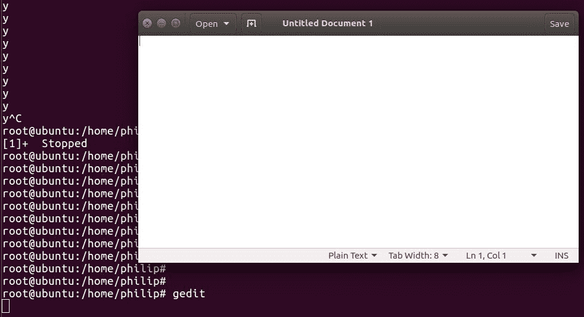
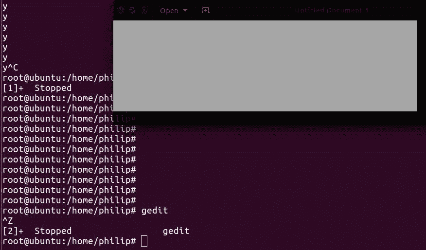
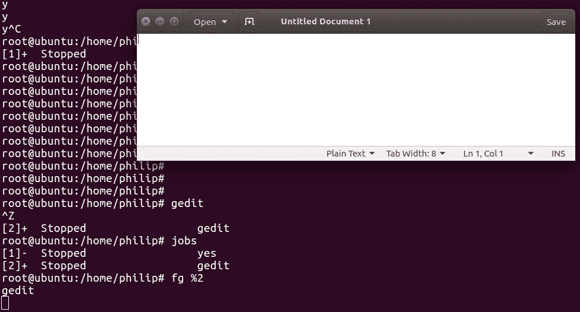
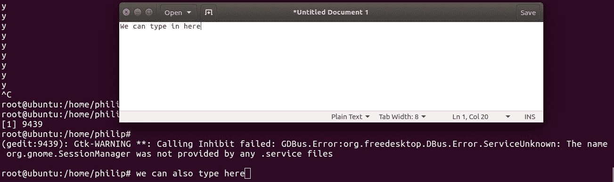
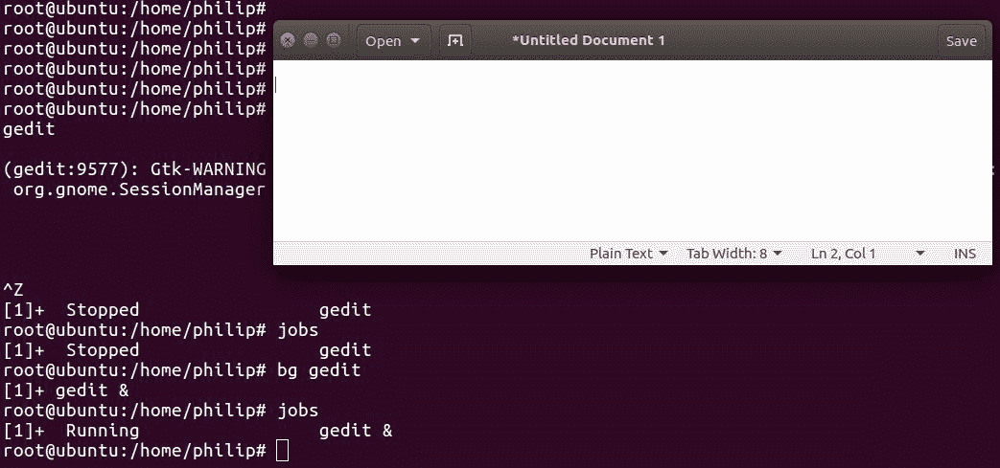
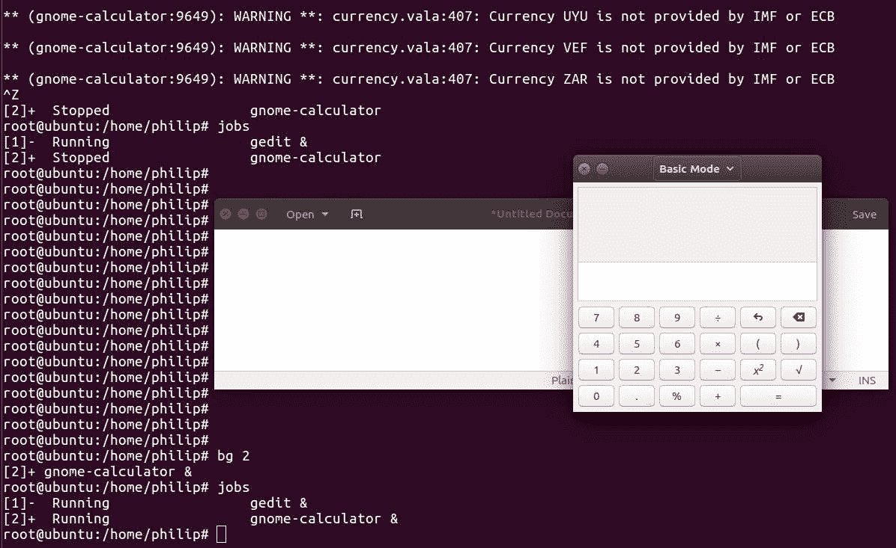

# 第十章：修改进程执行

在上一章中，我们揭示了暴露当前在 shell 中运行的进程的各种方法。此外，我们还看到了如何获取内存和 CPU 信息，以及如何使用`ps`命令结合`kill`命令终止进程。接下来，我们接触了`pstree`命令。接着，我们接触了`pgrep`命令；也称为进程 Grep。之后，我们接触了`pkill`命令；顾名思义，它用于终止进程。之后，我们使用了`top`命令。接下来，我们使用了`service`命令。最后，我们使用了`systemctl`命令。

与前几章相比，本章内容较少，但在资源管理方面具有重要意义。首先，进一步讨论了进程管理，这次重点是进程在进程调度器中的重要性（有时您可能会听到内核调度器这个术语；它们是指同一件事）。通常，我们面临着与资源限制相关的挑战。这将以多种方式加以解决。考虑到这一点，我们将探讨在 Linux 发行版的范围内尝试更改进程优先级时应遵循的各种准则。第一部分关注`nice`命令。接下来是`renice`命令。最后，重点将放在前台进程与后台进程上。

我们将在本章中涵盖以下主题：

+   `nice`命令

+   `renice`命令

+   前台进程与后台进程

# nice 命令

简而言之，`nice`命令用于调整进程的 niceness，以便与 CPU 资源的可用性相关。当我们说“niceness”时，这是指对特定进程在 CPU 资源方面给予的关注或优先级。我们可以增加或减少给定进程的优先级。每当 CPU 被一系列进程拖垮时，这就变得相关起来，每个进程都在争夺自己的关注。通过改变特定进程的 niceness，我们影响了进程的调度。

我们可以使用`ps`命令查看进程的当前`nice`值；我们会传递`al`选项：

```
root@ubuntu:/home/philip# ps -al
F S UID PID  PPID C PRI  NI ADDR SZ WCHAN TTY  TIME CMD
4 S  0  2423 2271 0 80   0 - 13698 poll_s pts/17   00:00:00 sudo
4 S  0   2437 2423 0 80  0 - 13594 wait   pts/17   00:00:00 su
4 S  0   2438 2437 0 80  0 - 5304 wait   pts/17   00:00:00 bash
0 R  0   3063 2438 0 80  0 - 7229 -      pts/17   00:00:00 ps
root@ubuntu:/home/philip#
```

出于简洁起见，某些输出已被省略。根据前面的输出，`NI`列代表进程的当前 niceness。您会注意到大多数进程的 niceness 值都设置为`0`。我们还可以过滤`ps`命令的输出；我们可以使用`grep`命令：

```
root@ubuntu:/home/philip# ps -eo pid,ppid,ni,comm | grep update
 2402   1841   0 update-notifier
 2421   1611  10 update-manager
root@ubuntu:/home/philip#
```

干得漂亮！基于此，我们可以看到有一些进程的 niceness 值默认不是`0`。有趣的是，我们还可以利用另一个命令来查看进程的当前 niceness；我们可以使用`top`命令：

```
root@ubuntu:/home/philip# top
PID USER   PR  NI    VIRT   RES  SHR S %CPU %MEM   TIME+   COMMAND                                           3020 root  20   0   41800  3880  3176 R  6.7  0.4   0:00.01 top 
1 root     20   0  185164  4532  3100 S  0.0  0.5   0:01.92 systemd 
2 root     20   0     0   0     0 S  0.0  0.0   0:00.00   kthreadd                                         3 root    20    0     0   0     0 S  0.0  0.0   0:00.16  ksoftirqd/0 
9 root    rt   0     0    0     0 S  0.0  0.0   0:00.00  migration/0 
10 root   rt   0     0    0     0 S  0.0  0.0   0:00.00  watchdog/0 
15 root   0   -20    0    0     0 S  0.0  0.0   0:00.00  writeback 
16 root   25   5     0    0     0 S  0.0  0.0   0:00.00  ksmd 
17 root   39  19     0    0     0 S  0.0  0.0   0:00.00  khugepaged 
```

第四列`NI`代表每个进程的 niceness。另一个关键列是第三列`PR`；这代表 Linux 内核所看到的实际优先级。`PRI`列不可由用户配置。此外，`PRI`列下的`rt`表示这些进程的优先级是由实时调度处理的。

我们不能改变`PRI`列下的值。

我们可以通过传递`--help`选项来查看`nice`命令的语法：

```
root@ubuntu:/home/philip# nice --help
Usage: nice [OPTION] [COMMAND [ARG]...]
Run COMMAND with an adjusted niceness, which affects process scheduling.
With no COMMAND, print the current niceness.  Niceness values range from
-20 (most favorable to the process) to 19 (least favorable to the process).
Mandatory arguments to long options are mandatory for short options too.
 -n, --adjustment=N   add integer N to the niceness (default 10)
 --help     display this help and exit
 --version  output version information and exit
```

您的 shell 可能有自己的`nice`版本，通常会取代此处描述的版本。有关其支持的选项的详细信息，请参阅您的 shell 文档。

GNU coreutils 在线帮助可以在以下网址找到：[`www.gnu.org/software/coreutils`](http://www.gnu.org/software/coreutils)

完整的文档可以在以下网址找到：[`www.gnu.org/software/coreutils/nice`](http://www.gnu.org/software/coreutils/nice)

或者在本地通过以下方式查看：info '(coreutils) nice invocation'

`root@ubuntu:/home/philip#`

根据前述语法，我们可以设置的范围是从`-19（最高优先级）到 20（最低优先级）`。让我们运行不带任何选项的`nice`命令：

```
root@ubuntu:/home/philip# nice
0
root@ubuntu:/home/philip#
```

很好！值`0`表示启动 shell 的优先级。请记住，普通用户无法更改其他用户的进程的优先级；只有 root 用户才能更改任何用户的优先级。默认情况下，如果我们运行`nice`命令而没有指定优先级值，那么优先级将设置为`10`。让我们验证一下：

```
root@ubuntu:/home/philip# ps -alx | grep cron
1  0  3419  1611  30 10  29008  2540 hrtime SNs  ?   0:00 cron
0  0  3435 2438 20 0 14224 952 pipe_w S+ pts/17 0:00 grep --color=auto cron
root@ubuntu:/home/philip# nice cron
cron: can't lock /var/run/crond.pid, otherpid may be 3419: Resource temporarily unavailable
root@ubuntu:/home/philip#
```

根据前面的输出，`NI`值没有改变。这是因为进程已经启动。`nice`命令无法改变当前正在运行的进程的优先级。我们可以通过停止进程来解决这个问题：

```
root@ubuntu:/home/philip# systemctl stop cron
root@ubuntu:/home/philip#
```

现在，让我们尝试使用`nice`命令启动`cron`进程：

```
root@ubuntu:/home/philip# ps -alx | grep cron
0     0   3463   2438  20   0  14224   900 pipe_w S+   pts/17     0:00 grep --color=auto cron
root@ubuntu:/home/philip# nice cron
root@ubuntu:/home/philip# ps -alx | grep cron
1 0 3467 1611 30 10 29008  2732 hrtime SNs  ? 0:00 cron
0 0 3469 2438 20 0 14224 940 pipe_w S+ pts/17 0:00 grep --color=auto cron
root@ubuntu:/home/philip#
```

太棒了！我们可以清楚地看到`NI`值已更改为`10`，即使我们没有指定优先级值。如果我们想指定一个值，那么我们通过在数字前面放置一个`-`来传递它。让我们再次使用`cron`进程：

```
root@ubuntu:/home/philip# systemctl stop cron
root@ubuntu:/home/philip# systemctl status cron
cron.service - Regular background program processing daemon
 Loaded: loaded (/lib/systemd/system/cron.service; enabled; vendor preset: enabled)
 Active: failed (Result: exit-code) since Thu 2018-08-16 11:30:00 PDT; 8min ago
 Docs: man:cron(8)
 Process: 3430 ExecStart=/usr/sbin/cron -f $EXTRA_OPTS (code=exited, status=1/FAILURE)
 Main PID: 3430 (code=exited, status=1/FAILURE)
root@ubuntu:/home/philip# pgrep cron
3467
root@ubuntu:/home/philip#
```

有时，停止进程时可能会遇到类似的错误。您可以使用`systemctl`命令或`service`命令，但进程仍将继续运行。我们可以通过使用前一章学到的知识轻松解决这个问题；我们可以调用`kill`命令：

```
root@ubuntu:/home/philip# kill -9 3467
root@ubuntu:/home/philip# pgrep cron
root@ubuntu:/home/philip#
```

干得好！现在让我们尝试使用一个优先级值启动`cron`进程：

```
root@ubuntu:/home/philip# nice -15 cron
root@ubuntu:/home/philip# pgrep cron
3636
root@ubuntu:/home/philip# ps -alx | grep cron
1 0 3636 1611  35 15 29008 2616 hrtime SNs  ?  0:00 cron
0 0 3658 2438  20 0 14224 920 pipe_w S+ pts/17 0:00 grep --color=auto cron
root@ubuntu:/home/philip#
```

但是有一个问题。如果我们运行`system1`命令来检查状态，我们将看到以下内容：

```
root@ubuntu:/home/philip# systemctl status cron
cron.service - Regular background program processing daemon
 Loaded: loaded (/lib/systemd/system/cron.service; enabled; vendor preset: enabled)
 Active: failed (Result: exit-code) since Thu 2018-08-16 11:30:00 PDT; 21min ago
 Docs: man:cron(8)
 Process: 3430 ExecStart=/usr/sbin/cron -f $EXTRA_OPTS (code=exited, status=1/FAILURE)
 Main PID: 3430 (code=exited, status=1/FAILURE)
Aug 16 11:30:00 ubuntu systemd[1]: cron.service: Unit entered failed state.
Aug 16 11:30:00 ubuntu systemd[1]: cron.service: Failed with result 'exit-code'.
root@ubuntu:/home/philip#
```

我们收到此错误的原因是，当我们使用使用`systemd`的 Linux 发行版时，我们需要编辑`/lib/systemd/system/`中的服务文件。在我们的情况下，它将是`/lib/systemd/system/cron.service`。这是`/lib/systemd/system/cron.service`配置文件：

```
root@ubuntu:/home/philip# cat /lib/systemd/system/cron.service
[Unit]
Description=Regular background program processing daemon
Documentation=man:cron(8)
[Service]
EnvironmentFile=-/etc/default/cron
ExecStart=/usr/sbin/cron -f $EXTRA_OPTS
IgnoreSIGPIPE=false
KillMode=process
[Install]
WantedBy=multi-user.target
root@ubuntu:/home/philip#
```

`[Service]`部分是我们放置`Nice=value`的地方。这是我们将存储`cron`进程的优先级并消除`systemctl`正在生成的错误的方法：

```
root@ubuntu:/home/philip# cat /lib/systemd/system/cron.service
[Unit]
Description=Regular background program processing daemon
Documentation=man:cron(8)
[Service]
Nice=15
EnvironmentFile=-/etc/default/cron
ExecStart=/usr/sbin/cron -f $EXTRA_OPTS
IgnoreSIGPIPE=false
KillMode=process
[Install]
WantedBy=multi-user.target
root@ubuntu:/home/philip#
```

现在，一旦我们对`systemd`服务进行了任何更改，我们需要运行这个命令：

```
root@ubuntu:/home/philip# systemctl daemon-reload
root@ubuntu:/home/philip#
```

太棒了！此外，您希望在`ExecStart`之前放置`Nice=`，因为如果您将其放在之后，它将不会对进程产生影响。我们现在将停止现有的`cron`进程并使用`systemctl`启动`cron`；错误将消失，`systemctl`将很高兴：

```
root@ubuntu:/home/philip# systemctl stop cron
root@ubuntu:/home/philip# ps -alx | grep cro
0   0 3904  2438 20  0  14224  1016 pipe_w S+ pts/17  0:00 grep --color=auto cro
root@ubuntu:/home/philip# systemctl start cron
root@ubuntu:/home/philip# ps -alx | grep cro
4  0 3907  1  35  15  29008  2988 hrtime SNs  ?  0:00 /usr/sbin/cron -f
0  0 3911  2438  20  0 14224  1024 pipe_w S+   pts/17     0:00 grep --color=auto cro
root@ubuntu:/home/philip#
```

干得好！现在我们可以看到`cron`进程的`NI`设置为`15`。这仅适用于`cron`等系统服务。另一种方法是传递`--adjustment=`选项；我们将在等号（`=`）后指定一个优先级值：

```
root@ubuntu:/home/philip# systemctl stop cron
root@ubuntu:/home/philip# nice --adjustment=13 cron
root@ubuntu:/home/philip# ps -alx | grep cro
1  0 3941   1611  33  13  29008  2576 hrtime SNs  ?   0:00 cron
0  0 3943   2438  20   0  14224  1008 pipe_w S+  pts/17 0:00 grep --color=auto cro
root@ubuntu:/home/philip#
```

当然，`systemctl`会抱怨：

```
root@ubuntu:/home/philip# systemctl status cron
cron.service - Regular background program processing daemon
 Loaded: loaded (/lib/systemd/system/cron.service; enabled; vendor preset: enabled)
 Active: inactive (dead) since Thu 2018-08-16 12:13:32 PDT; 1min 3s ago
 Docs: man:cron(8)
 Process: 3907 ExecStart=/usr/sbin/cron -f $EXTRA_OPTS (code=killed, signal=TERM)
 Main PID: 3907 (code=killed, signal=TERM)
root@ubuntu:/home/philip#
```

但是我们可以很容易地通过使用我们刚学到的技术来解决这个问题；通过在`/lib/systemd/system/cron.service`中指定声明：

```
root@ubuntu:/home/philip# cat /lib/systemd/system/cron.service
[Unit]
Description=Regular background program processing daemon
Documentation=man:cron(8)
[Service]
Nice=13
EnvironmentFile=-/etc/default/cron
ExecStart=/usr/sbin/cron -f $EXTRA_OPTS
IgnoreSIGPIPE=false
KillMode=process
[Install]
WantedBy=multi-user.target
root@ubuntu:/home/philip#
root@ubuntu:/home/philip# systemctl daemon-reload
root@ubuntu:/home/philip# systemctl start cron
root@ubuntu:/home/philip# ps -alx | grep cro
4  0  4084   1  33  13  29008  2956 hrtime SNs ? 0:00 /usr/sbin/cron -f
0  0  4088   2438  20   0  14224  1076 pipe_w S+   pts/17  0:00 grep --color=auto cro
root@ubuntu:/home/philip#
```

太棒了！

在修改系统进程时要非常谨慎，就像在这些演示中看到的那样。

# renice 命令

当我们使用`nice`命令时，很明显它无法更改正在运行的进程的调度优先级；正如我们刚才看到的，我们需要停止然后启动进程。这就是`renice`命令的优势所在。我们可以利用`renice`命令在进程运行时更改优先级。要查看语法，我们将传递`--help`选项：

```
root@ubuntu:/home/philip# renice --help
Usage:
 renice [-n] <priority> [-p|--pid] <pid>...
renice [-n] <priority>  -g|--pgrp <pgid>...
 renice [-n] <priority>  -u|--user <user>...
Alter the priority of running processes.
Options:
 -n, --priority <num>   specify the nice increment value
 -p, --pid <id>         interpret argument as process ID (default)
 -g, --pgrp <id>        interpret argument as process group ID
 -u, --user <name>|<id> interpret argument as username or user ID
 -h, --help     display this help and exit
 -V, --version  output version information and exit
For more details see renice(1).
root@ubuntu:/home/philip#
```

首先，让我们使用`ps`命令查看进程的优先级，然后更改其优先级：

```
root@ubuntu:/home/philip# ps -alx | grep ssh
4     0   3375      1  20   0   9996  4900 poll_s Ss   ?          0:00 /usr/sbin/sshd -D
0    0   4196   2438  20   0  14224   936 pipe_w S+   pts/17     0:00 grep --color=auto ssh
root@ubuntu:/home/philip#
root@ubuntu:/home/philip# renice -2 3375
3375 (process ID) old priority 0, new priority -2
```

```
root@ubuntu:/home/philip# ps -alx | grep ssh
4  0  3375  1  18  -2   9996  4900 poll_s S<s  ? 0:00 /usr/sbin/sshd -D
0  0   4209   2438  20  0  14224  1080 pipe_w S+ pts/17 0:00 grep --color=auto ssh
root@ubuntu:/home/philip#
```

根据前面的输出，`renice`命令期望进程的 PID。此外，当我们指定一个`-`后跟一个数字时，它会将其解释为负`-`号并分配一个负值。此外，`systemctl`命令不会抱怨，因为使用`renice`命令时不需要停止和启动进程以应用更改：

```
root@ubuntu:/home/philip# systemctl status sshd
ssh.service - OpenBSD Secure Shell server
Loaded: loaded (/lib/systemd/system/ssh.service; enabled; vendor preset: enabled)
Active: active (running) since Thu 2018-08-16 11:25:39 PDT; 1h 20min ago
 Main PID: 3375 (sshd)
CGroup: /system.slice/ssh.service
└─3375 /usr/sbin/sshd -D
root@ubuntu:/home/philip#
```

干得好！我们还可以为特定用户更改优先级；我们将传递`-u`选项。让我们为所有属于某个用户的进程更改优先级：

```
root@ubuntu:/home/philip# ps -alu philip
F S UID  PID PPID C  PRI  NI ADDR SZ WCHAN  TTY  TIME CMD
4 S  1000 1507 1  0  80  0 - 11319 ep_pol   ?  00:00:00 systemd
5 S  1000  1508 1507 0 80 0 - 36293 sigtim  ?   00:00:00 (sd-pam)
1 S  1000  1599  1  0  80  0 - 51303 poll_s ? 00:00:00 gnome-keyring-d
4 S  1000  1611 1349  0  80 0 - 11621 poll_s ?  00:00:00 upstart
1 S  1000  1696 1611  0  80  0 - 10932 ep_pol ? 00:00:00 dbus-daemon
0 S  1000   1708  1611 0 80 0 - 21586 poll_s ? 00:00:00 window-stack-br
1 S  1000   1721 1611  0  80 0 - 8215 poll_s ? 00:00:00 upstart-udev-br
1 S  1000   1735   1611 0 80 0 - 8198 poll_s ? 00:00:00 upstart-dbus-br
1 S  1000 1737 1611  0 80  0 -  8198 poll_s ? 00:00:00 upstart-dbus-br
1 S  1000 1743 1611  0 80 0 - 10321 poll_s ? 00:00:00 upstart-file-br
root@ubuntu:/home/philip# renice 3 -u philip
root@ubuntu:/home/philip # ps -alu philip
F S UID PID   PPID  C PRI  NI ADDR SZ WCHAN TTY TIME CMD
4 S  1000 1507  1   0  83 3 - 11319 ep_pol ? 00:00:00 systemd
5 S  1000 1508  1507 0 83  3 - 36293 sigtim ? 00:00:00 (sd-pam)
1 S  1000 1599  1   0  83  3 - 51303 poll_s ? 00:00:00 gnome-keyring-d
4 S  1000 1611  1349 0  83 3 - 11621 poll_s ? 00:00:00 upstart
1 S  1000 1696  1611 0  83 3 - 10932 ep_pol ? 00:00:00 dbus-daemon
0 S  1000 1708  1611 0 83  3 - 21586 poll_s ? 00:00:00 window-stack-br
1 S  1000 1721  1611 0 83  3 - 8215 poll_s ? 00:00:00 upstart-udev-br
1 S  1000 1735  1611 0 83  3 - 8198 poll_s ? 00:00:00 upstart-dbus-br
1 S  1000 1737  1611 0 83  3 - 8198 poll_s ? 00:00:00 upstart-dbus-br
1 S  1000 1743  1611 0  83 3 - 10321 poll_s ? 00:00:00 upstart-file-br
```

干得好！已经为指定用户拥有的每个进程更改了优先级。

# 前台进程与后台进程

在 shell 中工作时，实际上是在所谓的前台工作；除非我们停止当前进程，否则我们无法执行任何其他任务。有时候，您会想要将一些进程发送到后台进行处理；这将允许您在 shell 中继续工作，同时后台中的进程也在运行。要验证是否有任何后台运行的进程，我们可以使用`jobs`命令。让我们试一试：

```
root@ubuntu:/home/philip# jobs
root@ubuntu:/home/philip#
```

从前面的输出中，我们可以看到当前没有作业在后台运行。要了解进程如何影响您在 shell 中的工作，让我们看看`yes`实用程序；这可以在大多数 Linux 发行版中找到。`yes`实用程序将一直运行，直到我们暂停或停止它；当我们执行`yes`实用程序时，它将阻止我们执行任何命令：

```
root@ubuntu:/home/philip# yes
y
y
y
```

要停止此实用程序，我们将使用*Ctrl* + *C*的组合：

```
y
^C
root@ubuntu:/home/philip#
```

这将无意中停止`yes`实用程序。`yes`实用程序的语法如下：

+   `yes <STRING>`：如果我们省略字符串，它将像前面的代码中显示的那样输出一个`y`

+   `yes <OPTIONS>`：可用选项为 version 和 help

如果我们重新运行`yes`实用程序，并且决定不停止它，而是决定暂停它，我们将使用*Ctrl* + *Z*的组合。这将实际上将`yes`实用程序放在后台：

```
root@ubuntu:/home/philip# yes
y
y
y
^Z
[1]+  Stopped                 yes
root@ubuntu:/home/philip#
```

这次，当我们运行`jobs`命令时，我们会看到有一个作业被列出：

```
root@ubuntu:/home/philip# jobs
[1]+  Stopped                 yes
root@ubuntu:/home/philip#
```

这已经暂停了`yes`实用程序并将其放在后台，使我们能够继续在命令提示符下工作。另一个例子来说明前台进程阻止 shell，从而阻止我们执行任何其他命令的概念，是我们启动了一个实用程序，例如`vim`或任何 GUI 程序。

让我们选择一个 GUI 来演示；这将更加突出这一点。我们将从 shell 启动`gedit`实用程序：



根据前面的输出，shell 正在阻止我们输入任何其他命令，直到我们暂停或关闭`gedit`实用程序。让我们暂停`gedit`实用程序：



从前面的输出中，您会注意到`gedit`实用程序已经冻结，这意味着我们无法从`gedit`实用程序内执行任何操作。现在让我们再次运行`jobs`命令：

```
root@ubuntu:/home/philip# jobs
[1]-  Stopped                 yes
[2]+  Stopped                 gedit
root@ubuntu:/home/philip#
```

干得好！现在有两个作业被列出。如果我们决定要恢复其中一个作业，我们可以使用另一个强大的命令：`fg`命令。`fg`命令的语法如下：

```
fg %<job id>
```

要看到这一点，让我们从其停止状态恢复`gedit`实用程序：



太棒了！现在我们可以在从命令提示符启动的`gedit`实用程序中工作。但是，有一个问题。当我们按下*Ctrl* + *Z*时，程序会停止。在实际环境中，我们希望将发送到后台的进程继续运行。这将加快我们的生产力，使我们能够执行同时进行的工作。请放心，事实上，通过另一种技术是可能的，我们可以在 shell 中执行命令时使用。`&`用于启动进程并将其发送到后台。让我们关闭`gedit`和`yes`实用程序：

```
root@ubuntu:/home/philip# fg
y
y
^C
root@ubuntu:/home/philip# jobs
root@ubuntu:/home/philip#
```

现在，我们将使用`&`启动`gedit`实用程序并将其直接发送到后台：



干得好！现在我们可以在`gedit`实用程序中工作，或者我们可以继续在命令提示符下工作。此外，当我们运行`jobs`命令时，我们将看到`gedit`实用程序的状态为`running`：

```
root@ubuntu:/home/philip# jobs
[1]+  Running                 gedit &
root@ubuntu:/home/philip#
```

太棒了！还有另一种方法可以恢复在后台停止的作业并指示它们在后台运行。这是通过利用另一个强大的命令实现的：`bg`命令。这是我们如果已经停止了`gedit`程序，我们将如何恢复`gedit`程序并指示它在后台运行：



干得好！`bg`命令做了两件事。首先，它恢复了`gedit`实用程序。然后在命令的末尾放置了`&`。正如我们之前看到的，`&`指示进程在后台运行。如果有多个作业，我们将指定作业 ID 或作业名称：

```
root@ubuntu:/home/philip# gnome-calculator
** (gnome-calculator:9649): WARNING **: currency.vala:407: Currency ZAR is not provided by IMF or ECB
^Z
[2]+  Stopped                 gnome-calculator
root@ubuntu:/home/philip# jobs
[1]-  Running                 gedit &
[2]+  Stopped                 gnome-calculator
root@ubuntu:/home/philip#
root@ubuntu:/home/philip# bg 2
[2]+ gnome-calculator &
root@ubuntu:/home/philip# jobs
[1]-  Running                 gedit &
[2]+  Running                 gnome-calculator &
root@ubuntu:/home/philip#
```



太棒了！我们可以看到这两个实用程序都是打开的，并且可以与命令提示符同时使用。

# 摘要

在本章中，我们已经介绍了处理进程的各种方法。首先，我们专注于使用`nice`命令调度进程。每当 CPU 上的工作负载上升时，各种进程都在争夺 CPU 的资源。使用各种命令暴露了每个进程的 niceness，例如：`ps`和`top`。接下来，我们进行了一些演示，演示了如何设置进程的 niceness。这使我们进入了运行`systemd`的系统；我们看到了在`systemd`系统上更改进程的 niceness 的问题。这导致我们修改了进程的配置文件，以便在启动进程时`systemd`能够识别 niceness。之后，我们转向了`renice`命令，特别是处理当前正在运行的进程以及更改正在运行的进程的 niceness 的方法。这通过更改 niceness 来说明，不仅适用于给定的进程，而且我们还能够更改由用户拥有的所有进程的 niceness。`systemd`识别了正在运行的进程的更改，而无需我们修改任何特定的配置。但是，如果进程停止并启动或重新启动，那么我们设置的 niceness 将被删除。要解决这个问题并使 niceness 持续存在，意味着编辑给定进程的配置文件。最后，我们在前台和后台的背景下处理了进程。前台进程的概念影响我们在命令提示符上工作，直到前台进程被挂起或关闭。当我们被要求执行多个操作时，这大大降低了生产力。解决方法是让进程在后台运行，从而使您能够有效地在命令提示符下执行功能。

在下一章中，我们将把注意力转向显示管理器的世界。通常，大多数用户都习惯于在 GUI 环境中工作。因此，重点将涵盖今天 Linux 发行版中普遍存在的常见显示管理器，以及当前 Linux+考试目标中的显示管理器。首先，我们将涉及**X 显示管理器**（**XDM**）。接下来，将讨论 KDE 显示管理器。然后将讨论**Gnome 显示管理器**（**GDM**）。最后，本章将涵盖**Light 显示管理器**（**LDM**）。这一章对于您的考试准备至关重要，就像以前的所有章节一样。这将使您能够使用今天 Linux 环境中常见的各种显示管理器。

# 问题

1.  使用`ps`命令的哪个选项打印每个进程的 niceness？

A. *n*

B. *l*

C. *a*

D. *x*

1.  使用`ps`命令表示每个进程的 niceness 的哪一列？

A. `NI`

B. `ni`

C. `N1`

D. `nice`

1.  使用`top`命令表示每个进程的 niceness 的哪一列？

A. `ni`

B. `PNI`

C. `pnic`

D. `NI`

1.  在使用`nice`命令时，哪个值不是有效值？

A. `-20`

B. `-19`

C. `20`

D. `19`

1.  哪个 niceness 值具有最高优先级？

A. `-21`

B. `-32`

C. `-19`

D. `-20`

1.  使用`systemd`存储进程配置文件的目录是哪个？

A. `/usr/lib/systemd/system`

B. `/lib/systemd/system`

C. `/lib/systemd/system/service`

D. `/lib/systemd/service`

1.  在使用`systemd`编辑服务文件后需要运行哪个命令？

A. `systemctl daemon-reload`

B. `systemctl --daemon-reload`

C. `systemctl daemon --reload`

D. `systemctl daemonreload`

1.  在使用`renice`命令时，指定 niceness 值后会发生什么？

A. `进程名称`

B. `PID`

C. `进程名称 + PID`

D. 以上都不是

1.  哪个命令可以从后台恢复一个进程，并阻止你执行其他命令，直到当前进程结束为止？

A. fg

B. bg

C. jobs

D. job

1.  哪个命令可以从后台恢复一个进程，但将其放在后台，允许你在命令提示符下执行其他命令？

A. `fg`

B. `jobs`

C. `bg`

D. `CTRL+C`

# 进一步阅读

+   你可以通过查看[`www.tecmint.com`](https://www.tecmint.com)来获取有关管理进程的更多信息。

+   这个网站提供了很多有用的关于处理进程的技巧和最佳实践：[`www.digitalocean.com`](https://www.digitalocean.com)。

+   这个链接提供了一般性的信息，涉及适用于 CentOS 和 Ubuntu 的各种命令。你可以在那里发布你的问题，其他社区成员将能够回答：[`www.linuxquestions.org`](https://www.linuxquestions.org)。
