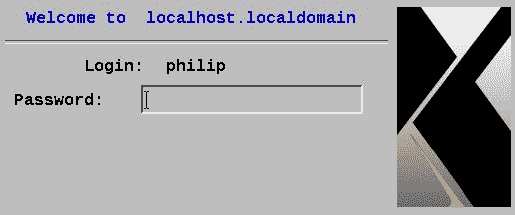
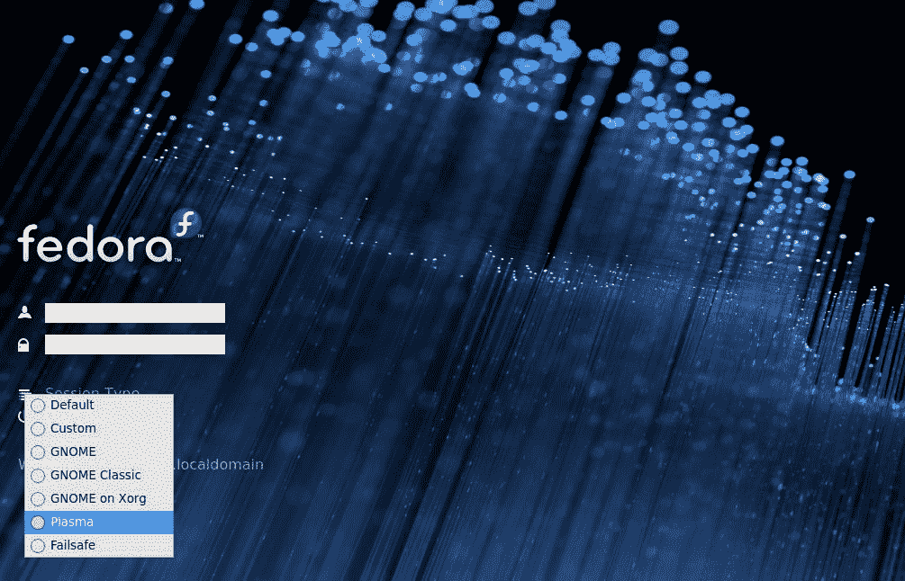
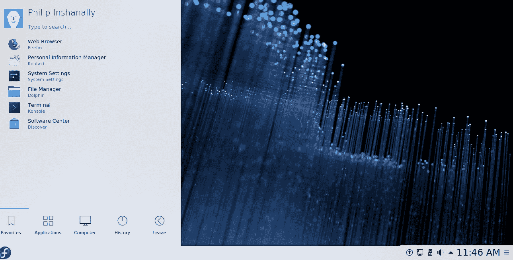
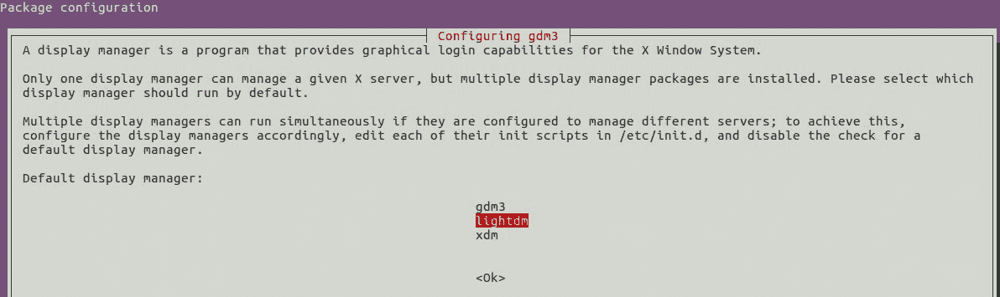
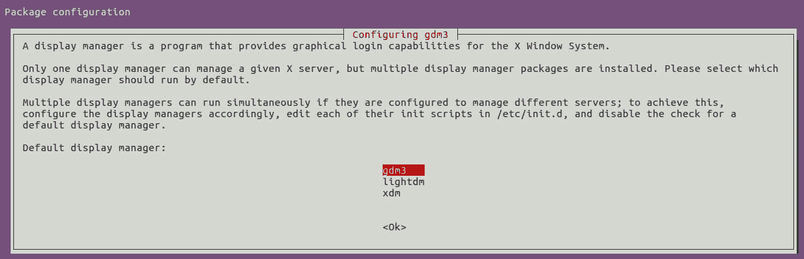
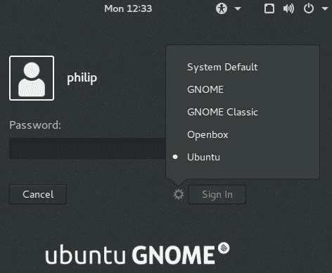
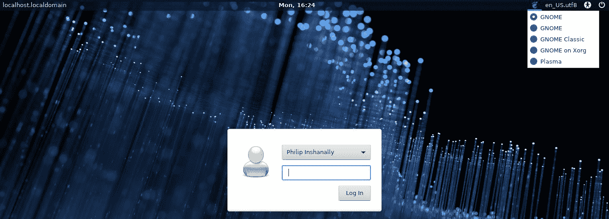

# 第十一章：显示管理器

在上一章中，我们介绍了处理进程的各种方法。首先，我们专注于使用`nice`命令调度进程。每当 CPU 的工作负载增加时，各种进程都在争夺 CPU 的资源；使用各种命令（如`ps`和`top`）暴露了每个进程的 niceness。之后，我们转向`renice`命令，特别是处理当前正在运行的进程，以及更改正在运行的进程的 niceness 的方法。最后，我们在前台与后台的进程上工作。

在本章中，将介绍显示管理器。通常，大多数用户习惯在 GUI 环境中工作。我们将看看当今 Linux 发行版中普遍存在的显示管理器。显示管理器有时会与桌面混淆；显示管理器管理 GUI 登录提示，该提示在用户启动时呈现。桌面是用户用来执行各种任务的 X Windows 集合。一些桌面的例子包括 XFCE KDE，GNOME 和 Unity 等。此外，还将介绍当前 Linux+考试目标中的显示管理器。首先，我们将介绍**X 显示管理器**（**XDM**）。接下来，将讨论**KDE 显示管理器**（**KDM**）。然后是**GNOME 显示管理器**（**GDM**）。最后，本章将介绍**轻量级显示管理器**（**Lightdm**）。

本章将涵盖以下主题：

+   使用 XDM

+   使用 KDM

+   使用 GDM

+   使用 Lightdm

# 使用 XDM

XDM 管理一组 X 服务器。这可以是系统上的本地 X 服务器，也可以是网络上另一个 X 服务器上的远程 X 服务器。XDM 实用程序在某种程度上类似于较旧的 SysVinit，因此您可能会对 X 服务器的概念感到困惑。X 服务器是 X Window 系统中的一个程序；它在本地机器上运行。它通常管理对图形卡、显示器以及本地机器上的键盘和鼠标的访问。那么 X Window 系统是什么？嗯，X Window 系统，通常称为 X，是一个由跨平台、免费的客户端-服务器基础设施组成的整套系统，用于管理单个或一系列计算机上的**图形用户界面**（**GUI**），就像在网络环境中一样。在 X 的上下文中，客户端/服务器的工作方式有点奇怪；每台本地机器上都运行一个 X 服务器。然后，X 服务器访问 X 客户端；X 客户端是 GUI 应用程序。另一个有趣的地方是 X 客户端可以在本地运行，也可以在网络上远程运行。X 服务器充当中间人，实际的 X 客户端与 X 服务器进行交互；然后 X 服务器与实际的显示设备进行交互。X 服务器使用**X 显示管理器控制协议**（**XDMCP**）。XDM 旨在成为命令行登录提示的图形替代品。用户提供其登录凭据后，XDM 启动其 X 会话。

使用 XDM 的第一步是安装它。我们将使用 CentOS 6.5 系统。我们将搜索`xdm`：

```
[root@localhost Desktop]# yum search xdm
Loaded plugins: fastestmirror, refresh-packagekit, security
=========================================== N/S Matched: xdm ===========================================
libXdmcp-devel.i686 : Development files for libXdmcp
libXdmcp-devel.x86_64 : Development files for libXdmcp
xorg-x11-xdm.x86_64 : X.Org X11 xdm - X Display Manager
libXdmcp.i686 : X Display Manager Control Protocol library
libXdmcp.x86_64 : X Display Manager Control Protocol library
xorg-x11-server-Xdmx.x86_64 : Distributed Multihead X Server and utilities
 Name and summary matches only, use "search all" for everything.
[root@localhost Desktop]#
```

太棒了！默认情况下，CentOS 6.5 使用 GDM；我们将安装 XDM 进行演示：

```
[root@localhost Desktop]# yum install xorg-x11-xdm.x86_64
Loaded plugins: fastestmirror, refresh-packagekit, security
Loading mirror speeds from cached hostfile
 * updates: centos.mirror.iweb.ca
Setting up Install Process
Resolving Dependencies
--> Processing Dependency: libXaw.so.7()(64bit) for package: 1:xorg-x11-xdm-1.1.6-14.1.el6.x86_64
Installed:
 xorg-x11-xdm.x86_64 1:1.1.6-14.1.el6 
Dependency Installed:
 libXaw.x86_64 0:1.0.11-2.el6                       libXpm.x86_64 0:3.5.10-2.el6 
Complete!
[root@localhost Desktop]#
```

出于简洁起见，某些输出已被省略。接下来，我们将看看配置目录；这在`/etc/X11`内：

```
[root@localhost Desktop]# ls /etc/X11
applnk  fontpath.d  prefdm  xdm  xinit  Xmodmap  xorg.conf.d  Xresources
[root@localhost Desktop]#
[root@localhost xdm]# ll
total 40
-rwxr-xr-x. 1 root root  510 Aug 19  2010 GiveConsole
-rwxr-xr-x. 1 root root  244 Aug 19  2010 TakeConsole
-rw-r--r--. 1 root root 3597 Aug 19  2010 Xaccess
-rw-r--r--. 1 root root 1394 Aug 19  2010 xdm-config
-rwxr-xr-x. 1 root root  183 Aug 19  2010 Xreset
-rw-r--r--. 1 root root 2381 Aug 19  2010 Xresources
-rw-r--r--. 1 root root  484 Aug 19  2010 Xservers
lrwxrwxrwx. 1 root root   17 Aug 24 07:55 Xsession -> ../xinit/Xsession
-rwxr-xr-x. 1 root root  938 Aug 19  2010 Xsetup_0
-rwxr-xr-x. 1 root root  181 Aug 19  2010 Xstartup
-rwxr-xr-x. 1 root root  303 Aug 19  2010 Xwilling
[root@localhost xdm]#
```

这些是使 XDM 发光的必要文件。默认情况下，CentOS 6.5 不会使用 XDM；这可以通过编辑`/etc/X11/preferdm`轻松解决：

```
[root@localhost xdm]# cat /etc/X11/prefdm
#!/bin/sh
PATH=/sbin:/usr/sbin:/bin:/usr/bin
# We need to source this so that the login screens get translated
[ -f /etc/sysconfig/i18n ] && . /etc/sysconfig/i18n
# Run preferred X Display Manager
quit_arg=
preferred=
exit 1
[root@localhost xdm]#
```

出于简洁起见，某些输出已被省略。我们应该在`preferred=`行中指定显示管理器。我们还可以编辑`/etc/sysconfig/desktop`来采取另一种方法：

```
[root@localhost xdm]# ls /etc/sysconfig | grep desktop
[root@localhost xdm]#
```

根据前面的输出，我们需要创建`/etc/sysconfig/`桌面文件。让我们试试看：

```
[root@localhost xdm]# which xdm
/usr/bin/xdm
[root@localhost xdm]# vim /etc/sysconfig/desktop
[root@localhost philip]# cat /etc/sysconfig/desktop
preferred=/usr/bin/xdm
[root@localhost philip]#
```

根据前面的示例，我们已经创建了一个文件并存储了 XDM 的位置，这是使用`which`命令得出的。`which`命令可用于查找可执行文件的位置。

现在，让我们重新启动系统以使这些更改生效：



干得漂亮！现在我们看到了 XDM 登录界面。XDM 的配置文件存储在`/etc/X11/xdm`中：

```
[root@localhost philip]# ll /etc/X11/xdm
total 40
-rwxr-xr-x. 1 root root 510 Aug 19 2010 GiveConsole
-rwxr-xr-x. 1 root root 244 Aug 19 2010 TakeConsole
-rw-r--r--. 1 root root 3597 Aug 19 2010 Xaccess
-rw-r--r--. 1 root root 1394 Aug 19 2010 xdm-config
-rwxr-xr-x. 1 root root 183 Aug 19 2010 Xreset
-rw-r--r--. 1 root root 2381 Aug 19 2010 Xresources
-rw-r--r--. 1 root root 484 Aug 19 2010 Xservers
lrwxrwxrwx. 1 root root 17 Aug 24 07:55 Xsession -> ../xinit/Xsession
-rwxr-xr-x. 1 root root 938 Aug 19 2010 Xsetup_0
-rwxr-xr-x. 1 root root 181 Aug 19 2010 Xstartup
-rwxr-xr-x. 1 root root 303 Aug 19 2010 Xwilling
[root@localhost philip]#
```

现在我们可以专注于`/etc/X11/xdm/Xaccess`：

```
# To control which addresses xdm listens for requests on:
#  LISTEN     address [list of multicast groups ... ]
# The first form tells xdm which displays to respond to itself.
#  LISTEN     * ff02:0:0:0:0:0:0:12b
# This example shows listening for multicast on all scopes up
# to site-local
# LISTEN      * ff01:0:0:0:0:0:0:12b ff02:0:0:0:0:0:0:12b ff03:0:0:0:0:0:0:12b ff04:0:0:0:0:0:0:12b ff05:0:0:0:0:0:0:12b
[root@localhost philip]#
```

出于简洁起见，某些输出已被省略。前面的文件控制 XDM 将监听哪些地址以进行传入请求。另一个重要文件，在远程使用 XDM 时，是`/etc/X11/xdm/xdm-config`：

```
[root@localhost philip]# cat /etc/X11/xdm/xdm-config
! The following three resources set up display :0 as the console.
DisplayManager._0.setup:            /etc/X11/xdm/Xsetup_0
DisplayManager._0.startup:          /etc/X11/xdm/GiveConsole
DisplayManager._0.reset:            /etc/X11/xdm/TakeConsole
DisplayManager*loginmoveInterval:      10
! SECURITY: do not listen for XDMCP or Chooser requests
! Comment out this line if you want to manage X terminals with xdm
DisplayManager.requestPort:    0
[root@localhost philip]#
```

出于简洁起见，某些输出已被省略。最后一行`DisplayManager.requestPort: 0`需要被注释掉，以便我们可以使用 XDM 管理远程会话。

# 使用 KDM

KDM 是当今 Linux 发行版中更受欢迎的显示管理器之一。KDM 基于 X 显示管理器的源代码开发，由 KDE 开发。多年来，它一直是 KDE 框架的显示管理器，但最近发生了变化。为了看到 KDM，我们将使用`dnf`命令在我们的 Fedora 28 系统上。Fedora 28 使用 GDM。

我们将使用`groupinstall`选项为演示安装 KDE 桌面；这将安装 KDE 桌面所需的所有必要软件包：

```
[root@localhost philip]# dnf groupinstall KDE
Install  412 Packages
Upgrade    3 Packages
Total download size: 425 M
Is this ok [y/N]: y
 xorg-x11-apps.x86_64 7.7-20.fc28 
 xorg-x11-fonts-misc.noarch 7.5-19.fc28 
 xorg-x11-xbitmaps.noarch 1.1.1-13.fc28 
Upgraded:
 firewalld.noarch 0.5.3-2.fc28        firewalld-filesystem.noarch 0.5.3-2.fc28
 python3-firewall.noarch 0.5.3-2.fc28
Complete!
[root@localhost philip]#
```

接下来，我们将使用`dnf`命令安装`kdm`实用程序和其他组件：

```
[root@localhost philip]# dnf install kdm kde-settings-kdm
Last metadata expiration check: 0:12:52 ago on Mon 27 Aug 2018 11:16:03 AM EDT.
Dependencies resolved.
====================================================================
Package           Arch         Version        Repository  Size
====================================================================
Installing:
 kdm              x86_64  1:4.11.22-22.fc28    fedora     740 k
 kdm-settings     noarch  1:4.11.22-22.fc28    fedora     186 k
====================================================================
Install  5 Packages
Total download size: 1.2 M
Installed size: 2.3 M
Is this ok [y/N]: y
Installed:
 kdm.x86_64 1:4.11.22-22.fc28 
 kdm-settings.noarch 1:4.11.22-22.fc28 
 kgreeter-plugins.x86_64 1:4.11.22-22.fc28 
 libkworkspace.x86_64 1:4.11.22-22.fc28 
 qimageblitz.x86_64 0.0.6-15.fc28 
Complete!
[root@localhost philip]#
```

太棒了！出于简洁起见，某些输出已被省略。`kdm`实用程序已被安装。最后，我们将安装系统切换器；这将允许我们从 GDM 切换到 KDM：

```
[root@localhost philip]# dnf install system-switch-displaymanager.noarch
Last metadata expiration check: 0:16:52 ago on Mon 27 Aug 2018 11:16:03 AM EDT.
Dependencies resolved.
====================================================================
Package                       Arch   Version     Repository  Size
Installing:
system-switch-displaymanager noarch 1.5.1-3.fc28 fedora 17 k
Transaction Summary
Installed:
 system-switch-displaymanager.noarch 1.5.1-3.fc28 
Complete!
[root@localhost philip]#
```

干得漂亮！现在我们可以调用`system-switch`实用程序来从 GDM3 切换到 KDM：

```
[root@localhost philip]# system-switch-displaymanager KDM
Created symlink /etc/systemd/system/display-manager.service → /usr/lib/systemd/system/kdm.service.
Your default graphical display manager has successfully been switched.
[root@localhost philip]#
```

太棒了！现在，让我们重新启动我们的 Fedora 28 系统以使更改生效：



根据前面的输出，我们现在可以看到 Fedora 28 系统正在使用`kdm`实用程序作为显示管理器，而不是`gdm`。我们还可以在会话类型下看到各种桌面。Plasma 是我们安装的 KDE 风格桌面。让我们登录到 Plasma 桌面并确认我们确实正在使用`kdm`实用程序：



太棒了！所以我们成功地将我们的桌面更改为了 KDE 风格的 Plasma，现在我们可以查看`/etc/systemd/system/display-manager.service`以验证正在使用哪个显示管理器：

```
[root@localhost philip]# ls -l /etc/systemd/system/display-manager.service
lrwxrwxrwx. 1 root root 35 Aug 27 11:34 /etc/systemd/system/display-manager.service -> /usr/lib/systemd/system/kdm.service
[root@localhost philip]#
```

干得漂亮！我们清楚地看到我们确实已经将我们的显示管理器更改为了 KDM。我们还可以使用`systemctl`命令检查 KDM 的状态：

```
[root@localhost philip]# systemctl status kdm.service
kdm.service - The KDE login manager
 Loaded: loaded (/usr/lib/systemd/system/kdm.service; enabled; vendor preset: disabled)
 Active: active (running) since Mon 2018-08-27 11:36:40 EDT; 14min ago
 Main PID: 821 (kdm)
 Tasks: 3 (limit: 2331)
 Memory: 121.6M
 CGroup: /system.slice/kdm.service
 ├─821 /usr/bin/kdm vt1
 └─894 /usr/libexec/Xorg -br -novtswitch -quiet :0 vt1 -background none -nolisten tcp -auth /var/run/kdm/A:0-fPUysb
Aug 27 11:36:40 localhost.localdomain systemd[1]: Started The KDE login manager.
Aug 27 11:36:40 localhost.localdomain kdm[821]: plymouth is running
[root@localhost philip]#
```

根据前面的输出，我们可以看到`kdm.service`确实是活动的并正在运行。为了进一步验证，我们还可以检查 GDM 的状态：

```
[root@localhost philip]# systemctl status gdm.service
gdm.service - GNOME Display Manager
 Loaded: loaded (/usr/lib/systemd/system/gdm.service; disabled; vendor preset: disabled)
 Active: inactive (dead)
[root@localhost philip]#
```

干得漂亮！根据前面的输出，我们可以看到`gdm`实用程序目前处于非活动状态。KDM 的各种配置文件可以在`/etc/kde/kdm`中找到：

```
[root@localhost philip]# ls -l /etc/kde/kdm
-rw-r--r--. 1 root root 22985 Jun 12  2016 kdmrc
-rw-r--r--. 1 root root  3607 Apr 26  2010 Xaccess
-rw-r--r--. 1 root root  2381 Apr 26  2010 Xresources
-rwxr-xr-x. 1 root root   207 Jul  8  2008 Xsession
-rwxr-xr-x. 1 root root   938 Apr 26  2010 Xsetup
-rwxr-xr-x. 1 root root   303 Apr 26  2010 Xwilling
[root@localhost philip]#
```

根据前面的示例，我们可以看到这些文件的名称与本章前面介绍的 XDM 文件类似。

# 使用 GDM

GDM 是当今 Linux 环境中另一个流行的显示管理器。特别是在 CentOS 和 Fedora 等 Red Hat 发行版中，您会发现 GDM。它提供了一个 GUI 登录提示，用户有机会提供他们的登录凭据。此外，如果我们安装了多个桌面，我们还可以选择登录后加载哪个桌面。正如我们之前看到的，我们可以确定我们更喜欢使用哪个显示管理器。让我们为这个演示选择我们的 Ubuntu 系统。首先，让我们检查我们的 Ubuntu 16 系统上是否安装了 GDM（Ubuntu 中的 GDM3）：

```
root@ubuntu:/etc# ls /etc/ | grep gdm3
root@ubuntu:/etc# ls /etc/X11/
app-defaults  default-display-manager  openbox  xdm    xkb                 Xreset    Xresources  Xsession.d        xsm
cursors       fonts                    rgb.txt  xinit  xorg.conf.failsafe  Xreset.d  Xsession    Xsession.options
root@ubuntu:/etc#
```

根据前面的输出，GDM3 目前尚未安装。让我们也添加一个桌面，以便我们可以看到选择桌面的选项在哪里。我们将在我们的 Ubuntu 系统中安装 GNOME 桌面。我们将使用`apt-get`命令，特别是`ubuntu-gnome-desktop`软件包：

```
root@ubuntu:/etc# apt-get install ubuntu-gnome-desktop
Reading package lists... Done
Building dependency tree 
Reading state information... Done
The following additional packages will be installed:
python-boto python-cffi-backend python-chardet python-cloudfiles python-cryptography python-enum34 python-idna python-ipaddress
 python-libxml2 python-lockfile python-ndg-httpsclient python-openssl python-pkg-resources python-pyasn1 python-requests python-six
 python-urllib3 rhythmbox-plugin-magnatune seahorse-daemon ssh-askpass-gnome telepathy-gabble telepathy-haze telepathy-idle
 telepathy-logger telepathy-salut tracker tracker-extract tracker-miner-fs ubuntu-gnome-default-settings ubuntu-gnome-wallpapers
 ubuntu-gnome-wallpapers-xenial unoconv wodim xserver-xorg-legacy xsltproc yelp-tools zsync
Suggested packages:
 argyll-doc gir1.2-colordgtk-1.0 db5.3-util vcdimager libdvdcss2 dvdauthor readom python-paramiko python-oauthlib ncftp lftp
After this operation, 447 MB of additional disk space will be used.
Do you want to continue? [Y/n] y
Processing triggers for initramfs-tools (0.122ubuntu8.11) ...
update-initramfs: Generating /boot/initrd.img-4.4.0-134-generic
root@ubuntu:/etc#
```

出于简洁起见，某些输出已被省略。接下来，让我们安装`gdm`实用程序。请注意，在 Ubuntu 中它的名称是`gdm3`，而在 Fedora 中它的名称是`gdm`，两者是相同的，只是命名约定不同。

在处理 Debian 发行版时，请考虑`gdm3`，在处理 Red Hat 发行版时，请考虑`gdm`。

当我们安装`ubuntu-gnome-desktop`时，实际上为我们安装了`gdm3`，为我们节省了一些时间。我们可以通过查看`/etc`来验证这一点：

```
root@ubuntu:/etc# ls -l /etc | grep gdm
drwxr-xr-x  8 root root    4096 Aug 27 11:43 gdm3
root@ubuntu:/etc#
```

太棒了！根据之前的代码，我们可以看到`gdm3`实际上已经安装。目前，这不会更改显示管理器，因为我们尚未指定要使用`gdm3`。要解决这个问题，我们只需运行`dpkg-reconfigure`命令并传递`gdm3`：

```
root@ubuntu:/etc# dpkg-reconfigure gdm3
```



根据前面的输出，Lightdm 被设置为默认的显示管理器。我们可以使用键盘上下滚动并选择要设置为默认的显示管理器。我们将选择 gdm3：



```
root@ubuntu:/etc# dpkg-reconfigure gdm3
root@ubuntu:/etc#
```

干得好！现在，我们可以检查`/etc/X11/`来验证当前设置的显示管理器：

```
root@ubuntu:/etc# cat /etc/X11/default-display-manager
/usr/sbin/gdm3
root@ubuntu:/etc#
```

根据以前的代码，我们可以看到`gdm3`已经设置。我们可以使用`systemctl`命令来采用另一种技术：

```
root@ubuntu:/etc# systemctl status lightdm
lightdm.service - Light Display Manager
 Loaded: loaded (/lib/systemd/system/lightdm.service; static; vendor preset: enabled)
 Drop-In: /lib/systemd/system/display-manager.service.d
 └─xdiagnose.conf
 Active: active (running) since Fri 2018-08-24 12:46:32 PDT; 2 days ago
 Docs: man:lightdm(1)
 Main PID: 1011 (lightdm)
 CGroup: /system.slice/lightdm.service
 ├─1011 /usr/sbin/lightdm
 └─1038 /usr/lib/xorg/Xorg -core :0 -seat seat0 -auth /var/run/lightdm/root/:0 -nolisten tcp vt7 -novtswitch
Warning: Journal has been rotated since unit was started. Log output is incomplete or unavailable.
root@ubuntu:/etc#
```

根据前面的代码，我们可以看到当前的 Lightdm 仍然处于活动状态。现在，让我们检查`gdm3`：

```
root@ubuntu:/etc# systemctl status gdm3
gdm.service - GNOME Display Manager
 Loaded: loaded (/lib/systemd/system/gdm.service; static; vendor preset: enabled)
 Active: inactive (dead)
root@ubuntu:/etc#
```

根据那个输出，我们可能会认为我们有问题，但事实是只有当我们重新启动系统时，更改才会生效：



太棒了！根据之前的截图，我们可以看到系统已经启动了 GDM3。此外，我们可以选择要加载的桌面。让我们选择 GNOME。现在，让我们重新运行`systemctl`命令来验证我们确实正在运行 GDM3：

```
root@ubuntu:/home/philip# systemctl status lightdm
lightdm.service - Light Display Manager
 Loaded: loaded (/lib/systemd/system/lightdm.service; static; vendor preset: e
 Active: inactive (dead)
 Docs: man:lightdm(1)
root@ubuntu:/home/philip#
```

看起来不错！现在让我们检查一下 GDM3：

```
root@ubuntu:/home/philip# systemctl status gdm
gdm.service - GNOME Display Manager
 Loaded: loaded (/lib/systemd/system/gdm.service; static; vendor preset: enabl
 Drop-In: /lib/systemd/system/display-manager.service.d
 └─xdiagnose.conf
 Active: active (running) since Mon 2018-08-27 12:33:26 PDT; 3min 22s ago
 Process: 990 ExecStartPre=/usr/share/gdm/generate-config (code=exited, status=
 Process: 983 ExecStartPre=/bin/sh -c [ "$(cat /etc/X11/default-display-manager
 Main PID: 1006 (gdm3)
 CGroup: /system.slice/gdm.service
 └─1006 /usr/sbin/gdm3
root@ubuntu:/home/philip#
```

太棒了！根据我们在前面的输出中看到的，毫无疑问，我们正在运行 GDM3。

# 使用 Lightdm

**轻型显示管理器**，即**Lightdm**或`lightdm`（在命令行上），一直在 Linux 世界中引起轰动。Lightdm 曾取代 KDM，并且是 Ubuntu 16 之前的首选显示管理器。在后来的 Ubuntu 版本中，它被 GDM 取代。它提供了一个 GUI 来管理用户登录。Lightdm 是跨平台的，这意味着它支持各种桌面。让我们在我们的 Fedora 28 系统中安装 Lightdm。以前我们有 KDM。让我们使用`dnf`命令：

```
[root@localhost philip]# dnf install lightdm lightdm-gtk
ast metadata expiration check: 4:55:54 ago on Mon 27 Aug 2018 11:16:03 AM EDT.
Dependencies resolved.
==============================================================
Package           Arch      Version       Repository     Size
==============================================================
Installing:
lightdm          x86_64   1.26.0-1.fc28     updates      222 k
lightdm-gtk      x86_64   2.0.5-1.fc28      fedora       139 k
Installing dependencies:
lightdm-gobject  x86_64   1.26.0-1.fc28     updates       72 k
Transaction Summary
==============================================================
Install  3 Packages
Total download size: 433 k
Installed size: 1.2 M
Is this ok [y/N]: y
Installed:
 lightdm.x86_64 1.26.0-1.fc28   lightdm-gtk.x86_64 2.0.5-1.fc28           lightdm-gobject.x86_64 1.26.0-1.fc28 
Complete!
[root@localhost philip]#
```

太棒了！现在我们将使用`system-switch-displaymanger`命令切换到`lightdm`：

```
[root@localhost philip]# system-switch-displaymanager lightdm
Created symlink /etc/systemd/system/display-manager.service → /usr/lib/systemd/system/lightdm.service.
Your default graphical display manager has successfully been switched.
[root@localhost philip]#
```

为了验证，我们可以使用`ls`命令查看`systemd`中的服务：

```
[root@localhost philip]# ls -l /etc/systemd/system/display-manager.service
lrwxrwxrwx. 1 root root 39 Aug 27 16:17 /etc/systemd/system/display-manager.service -> /usr/lib/systemd/system/lightdm.service
[root@localhost philip]#
```

太棒了！我们还可以使用`systemctl`命令来检查显示管理器的状态：

```
[root@localhost philip]# systemctl status kdm
kdm.service - The KDE login manager
 Loaded: loaded (/usr/lib/systemd/system/kdm.service; disabled; vendor preset: disabled)
 Active: active (running) since Mon 2018-08-27 11:36:40 EDT; 4h 42min ago
 Main PID: 821 (kdm)
 Tasks: 3 (limit: 2331)
 Memory: 101.0M
[root@localhost philip]#
```

根据以前的代码，我们可以看到 KDM 仍然处于活动状态。让我们检查一下`lightdm`：

```
[root@localhost philip]# systemctl status lightdm
lightdm.service - Light Display Manager
 Loaded: loaded (/usr/lib/systemd/system/lightdm.service; enabled; vendor preset: disabled)
 Active: inactive (dead)
 Docs: man:lightdm(1)
[root@localhost philip]#
```

要使更改生效，请重新启动系统：



太棒了！根据前面的代码，我们现在在我们的 Fedora 28 系统中运行 Lightdm。此外，我们可以选择在屏幕右上角加载哪个桌面。登录后，我们可以进行验证。我们将使用`systemctl`命令：

```
[root@localhost philip]# systemctl status kdm
kdm.service - The KDE login manager
 Loaded: loaded (/usr/lib/systemd/system/kdm.service; disabled; vendor preset: disabled)
 Active: inactive (dead)
[root@localhost philip]#
```

这就是我们希望看到的。同样，当我们检查`lightdm`时，我们看到以下内容：

```
[root@localhost philip]# systemctl status lightdm
lightdm.service - Light Display Manager
 Loaded: loaded (/usr/lib/systemd/system/lightdm.service; enabled; vendor preset: disabled)
 Active: active (running) since Mon 2018-08-27 16:23:18 EDT; 4min 0s ago
 Docs: man:lightdm(1)
 Main PID: 840 (lightdm)
 Tasks: 8 (limit: 2331)
 Memory: 84.3M
[root@localhost philip]#
```

干得好！根据那个，我们可以确认我们在我们的 Fedora 28 系统中运行 Lightdm。

# 总结

在本章中，我们的重点是显示管理器，特别是 XDM、KDM、GDM 和 Lightdm。还确定了显示管理器和桌面之间的区别。我们首先在 CentOS 系统中使用 XDM 进行工作。我们关注了 XDM 存储的目录。除此之外，我们还关注了 XDM 的访问控制。接下来，我们将注意力转移到 KDM；KDM 在 Ubuntu 发行版中占主导地位，直到后来被替换。我们概述了安装和配置系统以使用 KDM 的方法。接下来，我们转向了 GDM。我们看到 GDM 在大多数 Linux 发行版中实际上是如何使用的。在 Ubuntu 和 Fedora 发行版中工作时，突出了名称的不同。我们演示了安装 GDM 的步骤。此外，我们还涵盖了在混合环境中安装一些桌面；这被证明是相当简单的。然后，还演示了选择桌面的过程。最后，我们介绍了 Lightdm。Lightdm 也很受欢迎，因为它在 Ubuntu 中取代了 KDM，并最终被 GDM 取代。我们使用 Fedora 28 发行版重点介绍了运行 Lightdm 的技术。本章的重点是安装显示管理器和在显示管理器之间切换的过程。

在下一章中，重点将放在用户和组帐户上。到目前为止，我们一直在处理 Linux 环境中的各个方面。首先，将重点放在管理用户帐户的过程上（例如用户创建和删除，目录修改，设置密码，权限和所有权）。接下来，将关注组。我们将深入探讨用于管理组的技术，创建和删除组的过程，将用户分配到组和权限等。我鼓励您再次加入我，以便在即将到来的章节中更好地为管理用户和组做好准备。

# 问题

1.  XDM 代表什么？

A. X 显示管理器

B. XD 管理器

C. X 桌面管理器

D. 以上都不是

1.  XDM 配置文件存储在哪个目录中？

A. `/etc/XDM/xdm`

B. `/etc/X11/xdm`

C. `/etc/X1/xdm`

D. `/etc/XM/xdm`

1.  哪个配置文件控制 XDM 的资源？

A. `Xaccess`

B. `Xresources`

C. `Xsession`

D. `Xdisplay`

1.  CentOS 6.5 中哪个配置文件指定要使用哪个显示管理器？

A. `/etc/desktop`

B. `/etc/X11/xdm`

C. `/etc/sysconfig/desktop`

D. `/etc/desktop`

1.  `dnf`命令中的哪个选项可以用来安装 KDE 桌面作为一个完整的包？

A. `--install`

B. `groupinstall`

C. `--group`

D. `--install-group`

1.  在 Fedora 28 中用于更改显示管理器的软件包是什么？

A. `displaymanager-switcher`

B. `system-displaymanager`

C. `system-switch-displaymanager`

D. `switch-displaymanager`

1.  KDM 登录提示中的哪个选项允许用户指定要加载哪个桌面？

A. 会话类型

B. 桌面类型

C. 登录桌面类型

D. 会话桌面

1.  哪个命令用于在 Ubuntu 16 中在显示管理器之间切换？

A. `chage`

B. `apt-cache`

C. `system-switcher`

D. `dpkg-reconfigure`

1.  Ubuntu 16 中的哪个配置文件显示默认的显示管理器？

A. `/etc/desktop`

B. `/etc/preferdm`

C. `/etc/X11/default-display-manager`

D. `/default-display-manager`

1.  哪个命令可以将 Fedora 28 中当前的显示管理器识别为一个服务？

A. `ls -l /etc/systemd/system/display.manager.service`

B. `ls -l /etc/systemd/system/display-manager.service`

C. `ls -l /etc/systemd/system/dm.service`

D. `ls -l /etc/systemd/system/display.service`

# 进一步阅读

+   这个网站提供了关于 GDM 的有用信息：[`wiki.gnome.org`](https://wiki.gnome.org)

+   这个网站提供了关于 KDM 的有用信息：[`forum.kde.org`](https://forum.kde.org)

+   这个网站提供了关于各种显示管理器的有用信息：[`superuser.com`](https://superuser.com)
