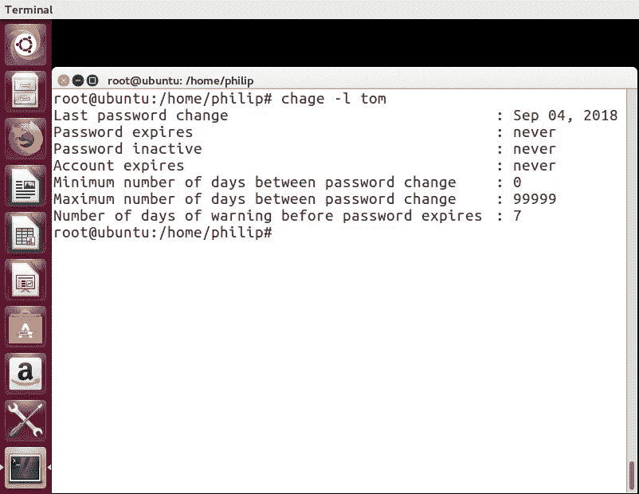
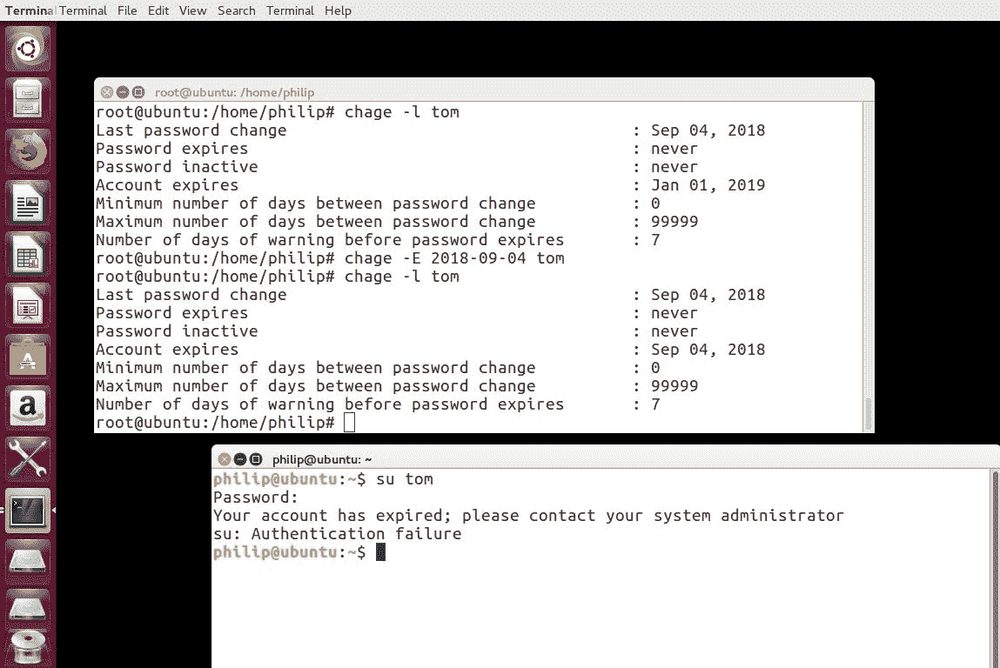
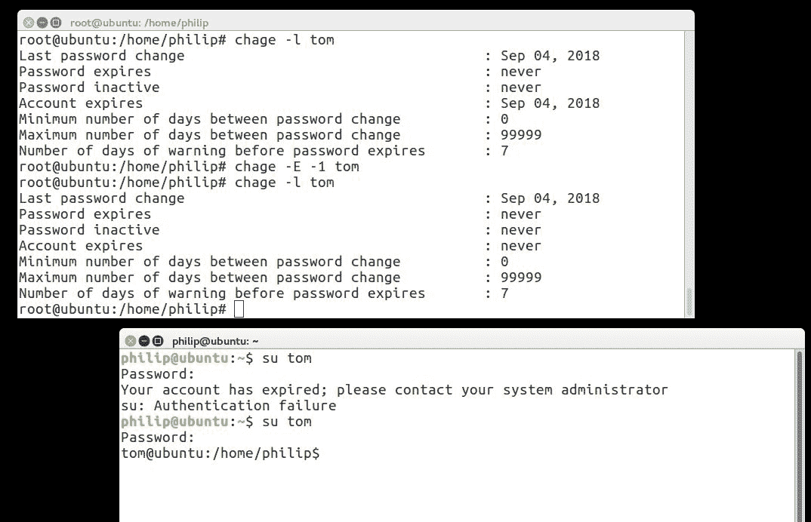
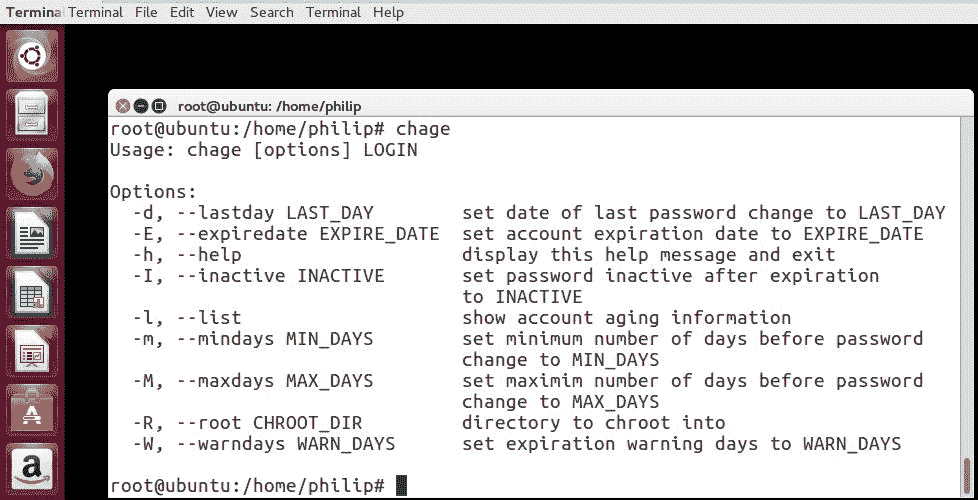
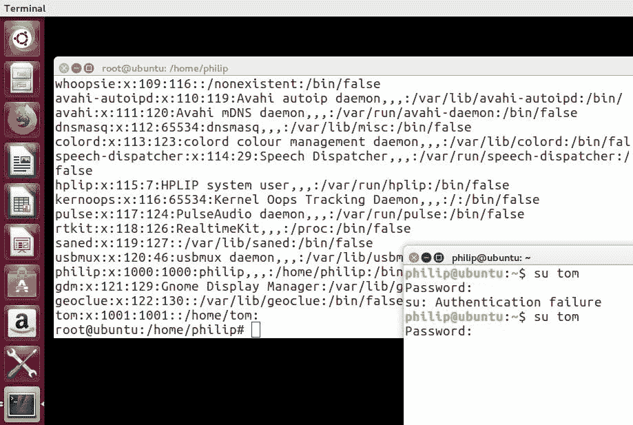
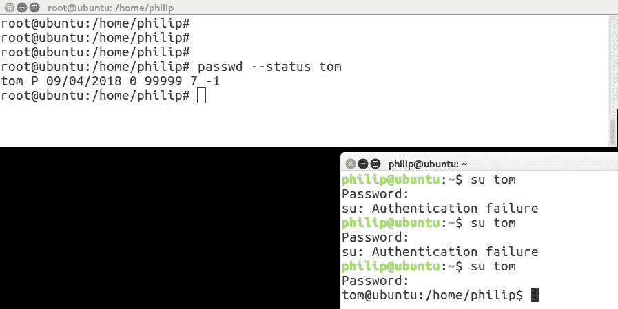
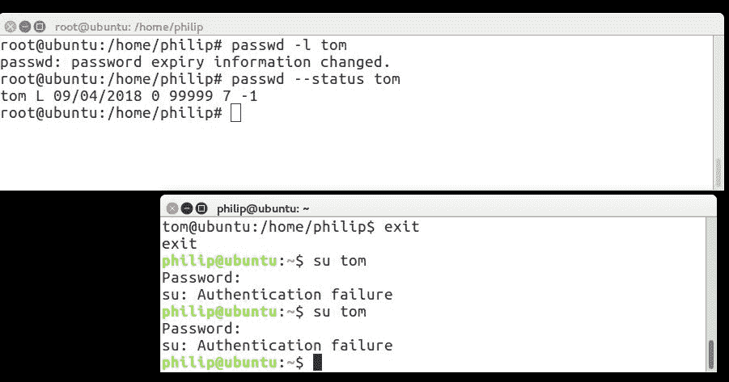
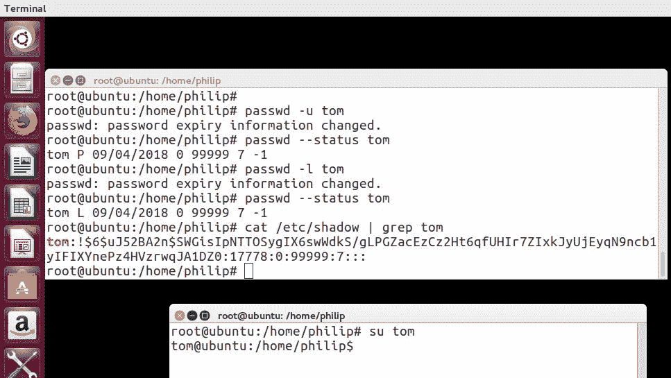

# 第十二章：管理用户和组帐户

在上一章中，我们介绍了显示管理器。我们涉及了 XDM、KDM、GDM 和 Lightdm。我们确定了显示管理器和桌面之间的区别。我们首先在 CentOS 系统中使用 XDM。接下来，我们将注意力转移到 KDM。在此之后，GDM 成为我们议程的下一个内容。此外，我们还介绍了在其中安装一些桌面。最后，我们介绍了 Lightdm。使用 Fedora 28 发行版，重点介绍了使 Lightdm 运行起来的技术。上一章的重点是安装各种显示管理器和在它们之间切换的过程。

在本章中，主题将是用户和组帐户。到目前为止，我们已经涵盖了 Linux 环境中的许多关键领域。我们的重点从管理用户帐户的过程开始；诸如用户创建和删除、目录修改、设置密码、权限和所有权等内容将是重点。在此之后，我们将进入分组的范围；我们将深入探讨用于管理组的技术。将涵盖创建和删除组、将用户分配给组、权限等内容。我鼓励您再次加入我，以便更好地管理用户和组。

我们将在本章中涵盖以下主题：

+   创建新用户时使用的目录

+   管理用户帐户

+   管理组

# 创建新用户时使用的目录

每次我们在系统中使用`useradd`命令创建新用户时，都会发生一系列事件。首先，存在一种结构，用于生成新用户的目录。该结构存储在骨架目录中；这位于`/etc/skel`目录中。`/etc/skel`目录包含文件和文件夹，这些文件和文件夹将被复制到新用户的主目录中。我们可以使用我们的 Ubuntu 系统查看骨架目录：

```
root@ubuntu:/home/philip# ls -a /etc/skel/
.  ..  .bash_logout  .bashrc  examples.desktop  .profile
root@ubuntu:/home/philip#
```

每个新用户都从这里拉取其结构。点（`.`）表示隐藏文件。文件如`/etc/skel/.logout`、`/etc/.skel/.bashrc`和`/etc/skel/.profile`。

# The .bash_logout

请注意，`.bash_history`是存储注销期间执行的命令的地方。它只是清除屏幕以确保注销时的隐私。这可以在以下命令中看到：

```
root@ubuntu:/home/philip# cat /home/philip/.bash_logout
# ~/.bash_logout: executed by bash(1) when login shell exits.
# when leaving the console clear the screen to increase privacy
if [ "$SHLVL" = 1 ]; then
 [ -x /usr/bin/clear_console ] && /usr/bin/clear_console -q
fi
root@ubuntu:/home/philip#
```

# The .bashrc

`/etc/skel/.bashrc`通常用于存储各种别名。通过查看`/etc/skel/.bashrc`可以看到这一点：

```
root@ubuntu:/home/philip# cat /etc/skel/.bashrc
# colored GCC warnings and errors
#export GCC_COLORS='error=01;31:warning=01;35:note=01;36:caret=01;32:locus=01:quote=01'
# some more ls aliases
alias ll='ls -alF'
alias la='ls -A'
alias l='ls -CF'
root@ubuntu:/home/philip#
```

为了简洁起见，一些输出已被省略。根据前面的输出，我们已经为我们定义了一些别名；其中一个例子是`alias ll='ls -af'`。

# The .profile

让我们将`/etc/skel/.profile`视为它执行了许多任务的文件；其中之一是检查`$Home/.bashrc`的存在。通过查看`/etc/skel/.profile`可以看到这一点：

```
root@ubuntu:/home/philip# cat /etc/skel/.profile
#umask 022
# if running bash
if [ -n "$BASH_VERSION" ]; then
 # include .bashrc if it exists
 if [ -f "$HOME/.bashrc" ]; then
 . "$HOME/.bashrc"
 fi
fi
# set PATH so it includes user's private bin directories
PATH="$HOME/bin:$HOME/.local/bin:$PATH"
root@ubuntu:/home/philip#
```

为了简洁起见，一些输出已被省略。根据前面的输出，我们可以看到`#if running bash`部分。另一种看到这些目录确实被复制过来的方法是查看现有用户。我们将使用`ls`命令结合`egrep`命令：

```
root@ubuntu:/home/philip# ls -a ~ | egrep '.bash|.profile'
.bash_history
.bashrc
.profile
root@ubuntu:/home/philip#
```

干得好！根据前面的输出，我们可以看到`.bash_history`、`.bashrc`和`.profile`。

# The .bash_history

在命令提示符下执行的每个命令都存储在`.bash_history`中。此外，`.bash_history`只有在我们开始在命令提示符下运行命令后才会创建。以下是对`/home/philip/.bash_history`的简要查看：

```
root@ubuntu:/home/philip# cat /home/philip/.bash_history
ls /etc/grub.d/
cat /var/log/Xorg.0.log | less
startx
sudo su
Xorg -configure
rm /tmp/.X0-lock
sudo su
su
sudo su
root@ubuntu:/home/philip#
```

为了简洁起见，一些输出已被省略。

此外，我们可以检查另一个用户是否存在各种`.bash`文件：

```
root@ubuntu:/home/philip# ls -a /home/philip | egrep '.bash|.profile'
.bash_history
.bash_logout
.bashrc
.profile
root@ubuntu:/home/philip#
```

干得好！我们可以看到`.bash_history`、`.bash_logout`、`.bashrc`和`.profile`。

另一种识别在使用`useradd`命令创建新用户时是否使用`/etc/skel`目录的方法是调用`useradd`命令并传递`-D`选项：

```
root@ubuntu:/home/philip# useradd -D
GROUP=100
HOME=/home
INACTIVE=-1
EXPIRE=
SHELL=/bin/sh
SKEL=/etc/skel
CREATE_MAIL_SPOOL=no
root@ubuntu:/home/philip#
```

根据前面的输出，我们得到了大量信息。特别是，`SKEL=/etc/skel`指示创建新用户时要使用的目录。

# 管理用户帐户

到目前为止，在前面的章节中，我们使用了两个用户帐户；一个是标准用户，另一个是 root 用户。在 Linux 中，我们可以通过 GUI 实用程序或命令行创建用户帐户。在 shell 中，我们使用`useradd`命令来创建新用户帐户。在较新的发行版中，还有`adduser`命令。在某些发行版中，如 CentOS，`adduser`是一个符号链接。可以在这里看到：

```
[root@localhost philip]# ll /usr/sbin/adduser
lrwxrwxrwx. 1 root root 7 Jun 20 09:19 /usr/sbin/adduser -> useradd
[root@localhost philip]#
```

在 Ubuntu 上，`adduser`命令与`useradd`命令是分开的：

```
root@ubuntu:/home/philip# ll /usr/sbin/adduser
-rwxr-xr-x 1 root root 37276 Jul  2  2015 /usr/sbin/adduser*
root@ubuntu:/home/philip#
```

使用`useradd`命令的基本语法是`useradd <option> username`。默认情况下，标准用户无法创建用户帐户。可以在这里看到：

```
philip@ubuntu:~$ useradd tom
useradd: Permission denied.
useradd: cannot lock /etc/passwd; try again later.
philip@ubuntu:~$
```

根据前面的输出，我们收到了`Permission denied`的消息。

默认情况下，标准用户无法创建用户帐户。

创建新用户时，我们将继续使用 root 用户。我们将在第十七章 *执行安全管理任务*中介绍使用`sudoers`文件管理权限。这里是使用 root 用户：

```
root@ubuntu:/home/philip# useradd tom
root@ubuntu:/home/philip#
```

根据前面的输出，我们没有得到任何指示来验证新用户是否已创建。请放心，我们可以通过查看`/home`目录来确认：

```
root@ubuntu:/home/philip# cat /etc/passwd
rtkit:x:118:126:RealtimeKit,,,:/proc:/bin/false
saned:x:119:127::/var/lib/saned:/bin/false
usbmux:x:120:46:usbmux daemon,,,:/var/lib/usbmux:/bin/false
philip:x:1000:1000:philip,,,:/home/philip:/bin/bash
gdm:x:121:129:Gnome Display Manager:/var/lib/gdm3:/bin/false
geoclue:x:122:130::/var/lib/geoclue:/bin/false
tom:x:1001:1001::/home/tom:
root@ubuntu:/home/philip#
```

为了简洁起见，已省略了一些输出。最后一个条目显示了新用户的信息。我们读取这些信息的方式如下：

```
tom=user
x=password placeholder
1001=UID
1001=GID
/home/tome=home directory for Tom
```

但是，如果我们比较另一个用户的条目，我们会得到这个：

```
 philip:x:1000:1000:philip,,,:/home/philip:/bin/bash
```

根据前面的输出，最后的`:/bin/bash`部分定义了用户的 shell。我们创建的用户没有分配 shell。此外，我们需要为用户设置密码。为了设置密码，我们将使用`passwd`命令：

```
root@ubuntu:/home/philip# passwd tom
Enter new UNIX password:
Retype new UNIX password:
passwd: password updated successfully
root@ubuntu:/home/philip#
```

干得漂亮！现在，让我们注销并尝试使用`tom`账户登录：


干得漂亮！我们可以看到新用户出现了，但当我们尝试登录时，系统会将我们弹出，因为我们已为用户定义了一个 shell。让我们通过删除用户并再次添加用户来解决这个问题。我们将使用`userdel`命令删除用户：

```
root@ubuntu:/home/philip# userdel -r tom
userdel: tom mail spool (/var/mail/tom) not found
userdel: tom home directory (/home/tom) not found
root@ubuntu:/home/philip#
root@ubuntu:/home/philip# cat /etc/passwd
philip:x:1000:1000:philip,,,:/home/philip:/bin/bash
gdm:x:121:129:Gnome Display Manager:/var/lib/gdm3:/bin/false
geoclue:x:122:130::/var/lib/geoclue:/bin/false
root@ubuntu:/home/philip#
```

太棒了！现在，让我们创建用户并传递`-s`选项。这将为用户定义一个 shell，以便与`useradd`命令一起使用：

```
root@ubuntu:/home/philip# useradd -s /bin/bash tom
root@ubuntu:/home/philip# cat /etc/passwd:
philip:x:1000:1000:philip,,,:/home/philip:/bin/bash
gdm:x:121:129:Gnome Display Manager:/var/lib/gdm3:/bin/false
geoclue:x:122:130::/var/lib/geoclue:/bin/false
tom:x:1001:1001::/home/tom:/bin/bash
root@ubuntu:/home/philip#
```

干得漂亮！现在我们可以看到在最后一个条目中，用户`tom`已被分配了`/bin/bash` shell。`/etc/passwd`的另一个有趣部分是每个帐户中的`x`。

我们说它代表密码，但我们并没有将`x`设置为密码，那么`x`是什么意思呢？嗯，`x`只是表示密码已加密；它实际上存储在一个单独的位置。`/etc/shadow`目录存储密码。我们可以查看`/etc/shadow`目录以供参考：

```
root@ubuntu:/home/philip# passwd tom
Enter new UNIX password:
Retype new UNIX password:
passwd: password updated successfully
root@ubuntu:/home/philip#
root@ubuntu:/home/philip# cat /etc/shadow
messagebus:*:16911:0:99999:7:::
uuidd:*:16911:0:99999:7:::
lightdm:*:16911:0:99999:7:::
whoopsie:*:16911:0:99999:7:::
avahi-autoipd:*:16911:0:99999:7:::
avahi:*:16911:0:99999:7:::
dnsmasq:*:16911:0:99999:7:::
colord:*:16911:0:99999:7:::
gdm:*:17770:0:99999:7:::
geoclue:*:17770:0:99999:7:::
tom:!:17778:0:99999:7:::
root@ubuntu:/home/philip#
```

为了简洁起见，已省略了一些输出。根据前面的输出，我们可以看到每个帐户的实际加密密码。

# chage 命令

关于用户帐户的另一个有趣方面涉及密码的过期时间；密码的过期时间。我们可以使用`chage`命令查看给定用户的过期时间。让我们为用户`tom`创建一个密码，然后检查新用户的密码过期设置：

更改密码过期参数需要 root 权限。

```
root@ubuntu:/home/philip# passwd tom
Enter new UNIX password:
Retype new UNIX password:
passwd: password updated successfully
root@ubuntu:/home/philip#
```



太棒了！根据前面的输出，我们使用了`-l`选项来显示过期设置；我们可以看到一些有价值的信息，特别是`上次密码更改`、`密码过期`和`帐户过期`。我们可以通过传递各种选项来更改这些值。例如，让我们更改`帐户过期`。我们使用`-E`选项：

```
root@ubuntu:/home/philip# chage -E 2018-09-04 tom
root@ubuntu:/home/philip# chage -l tom
Last password change                                                                : Sep 04, 2018
Password expires                                                                    : never
Password inactive                                                                   : never
Account expires                                                                     : Sep 04, 2018
Minimum number of days between password change                                       : 0
Maximum number of days between password change                                      : 99999
Number of days of warning before password expires                                   : 7
root@ubuntu:/home/philip#
```

干得漂亮！根据前面的输出，我们已将帐户设置为在此演示的当前时间到期。现在，为了查看此更改的效果，我们将打开另一个终端并尝试以用户`tom`的身份登录：



干得好！根据前面的输出，我们看到了尝试以用户`tom`的身份登录时返回的消息。要删除用户`tom`的此过期时间，我们将使用`-1`作为值：

```
root@ubuntu:/home/philip# chage -E -1 tom
root@ubuntu:/home/philip# chage -l tom
Last password change                                                                : Sep 04, 2018
Password expires                                                                    : never
Password inactive                                                                   : never
Account  expires                                                                    : never
Minimum number of days between password change                                      : 0
Maximum number of days between password change                                      : 99999
Number of days of warning before password expires                                   : 7
root@ubuntu:/home/philip#
```

现在，我们将能够以用户`tom`的身份登录：



太棒了！根据前面的内容，我们可以看到使用`chage`命令的有效性。要查看可以与`chage`命令一起传递的可用选项，我们可以执行：

```
root@ubuntu:/home/philip# chage
```



# usermod 命令

我们之前看到，要进行任何更改，我们必须使用`useradd`命令删除用户。每次我们决定更改时，这可能会很麻烦；相反，我们可以利用另一个强大的命令：`usermod`命令。`usermod`命令的基本语法如下：

```
usermod <option> username
```

使用我们的测试用户`tom`，我们可以使用`usermod`命令更改许多参数。例如，我们可以锁定用户`tom`的帐户，这将阻止用户`tom`登录系统。要锁定帐户，我们将使用`-L`选项：

```
root@ubuntu:/home/philip# cat /etc/passwd
philip:x:1000:1000:philip,,,:/home/philip:/bin/bash
gdm:x:121:129:Gnome Display Manager:/var/lib/gdm3:/bin/false
geoclue:x:122:130::/var/lib/geoclue:/bin/false
tom:x:1001:1001::/home/tom:
root@ubuntu:/home/philip# usermod -L tom
root@ubuntu:/home/philip#
```



干得好！根据前面的输出，用户`tom`无法登录。值得注意的是，在`/etc/shadow`中用户`tom`的条目显示在第二个字段的密码前面有`!`，这表示密码：

```
root@ubuntu:/home/philip# cat /etc/shadow | grep tom
tom:!$6$uJ52BA2n$SWGisIpNTTOSygIX6swWdkS/gLPGZacEzCz2Ht6qfUHIr7ZIxkJyUjEyqN9ncb1yIFIXYnePz4HVzrwqJA1DZ0:17778:0:99999:7:::
root@ubuntu:
 root@ubuntu:/home/philip# cat /etc/shadow | grep philip
philip:$1$8gQrKziP$v6Uv6
root@ubuntu:/home/philip#
```

根据前面的内容，用户`philip`的密码前面没有`!`。验证帐户是否已锁定的另一种方法是使用`passwd`命令。我们传递`--status`选项：

```
root@ubuntu:/home/philip# passwd --status tom
tom L 09/04/2018 0 99999 7 -1
root@ubuntu:/home/philip#
```

干得好！请注意，`L`表示用户帐户当前已锁定。我们可以使用`usermod`命令并传递`-U`选项来解锁用户帐户：

```
root@ubuntu:/home/philip# usermod -U tom
root@ubuntu:/home/philip# passwd --status tom
tom P 09/04/2018 0 99999 7 -1
root@ubuntu:/home/philip#
```

干得好！根据前面的输出，`P`表示用户`tom`有一个可用的密码；这意味着帐户是解锁的：



太棒了！现在，当我们再次查看`etc/shadow`时，我们将不再看到哈希密码前面的`!`：

```
root@ubuntu:/home/philip# cat /etc/shadow | grep tom
tom:$6$uJ52BA2n$SWGisIpNTTOSygIX6swWdkS/gLPGZacEzCz2Ht6qfUHIr7ZIxkJyUjEyqN9ncb1yIFIXYnePz4HVzrwqJA1DZ0:17778:0:99999:7:::
root@ubuntu:/home/philip#
```

太棒了！如果我们添加用户而没有指定 shell，我们还可以为用户定义一个 shell；我们使用`usermod`命令传递`-s`选项：

```
root@ubuntu:/home/philip# cat /etc/passwd
gdm:x:121:129:Gnome Display Manager:/var/lib/gdm3:/bin/false
geoclue:x:122:130::/var/lib/geoclue:/bin/false
tom:x:1001:1001::/home/tom:
root@ubuntu:/home/philip# usermod -s /bin/bash tom
root@ubuntu:/home/philip# cat /etc/passwd
gdm:x:121:129:Gnome Display Manager:/var/lib/gdm3:/bin/false
geoclue:x:122:130::/var/lib/geoclue:/bin/false
tom:x:1001:1001::/home/tom:/bin/bash
root@ubuntu:/home/philip#
```

干得好！锁定帐户的另一种方法是使用`passwd`命令；我们传递`-l`选项。让我们锁定用户`tom`：

```
root@ubuntu:/home/philip# passwd -l tom
passwd: password expiry information changed.
root@ubuntu:/home/philip# passwd --status tom
tom L 09/04/2018 0 99999 7 -1
root@ubuntu:/home/philip#
```

再次，当我们尝试以用户`tom`的身份登录时，我们将看到这个：



干得好！此外，我们还可以使用`passwd`命令解锁帐户；我们将传递`-u`选项：

```
root@ubuntu:/home/philip# passwd -u tom
passwd: password expiry information changed.
```

```
root@ubuntu:/home/philip# passwd --status tom
tom P 09/04/2018 0 99999 7 -1
root@ubuntu:/home/philip#
```

太棒了！请注意，root 用户仍然可以使用`tom`用户登录，是的！我们可以通过再次锁定用户`tom`来说明这一点：

```
root@ubuntu:/home/philip# passwd -l tom
passwd: password expiry information changed.
root@ubuntu:/home/philip# passwd --status tom
tom L 09/04/2018 0 99999 7 -1
root@ubuntu:/home/philip# cat /etc/shadow | grep tom
tom:!$6$uJ52BA2n$SWGisIpNTTOSygIX6swWdkS/gLPGZacEzCz2Ht6qfUHIr7ZIxkJyUjEyqN9ncb1yIFIXYnePz4HVzrwqJA1DZ0:17778:0:99999:7:::
root@ubuntu:/home/philip#
```

根据前面的输出，从所有迹象来看，用户`tom`的帐户似乎已被禁用，但是看看这个：



太棒了！当有人尝试以用户`tom`的身份登录时，他们将被阻止，除非他们首先成为 root 用户，因为锁定**不会**阻止 root 用户访问已锁定的帐户。

root 用户可以访问任何帐户。

当我们管理用户帐户时，其中一些基本信息来自一个特殊的配置文件：`/etc/login.def`文件。我们可以查看`/etc/login.def`：

```
root@ubuntu:/home/philip# cat /etc/login.defs
# /etc/login.defs - Configuration control definitions for the login package.
# Three items must be defined:  MAIL_DIR, ENV_SUPATH, and ENV_PATH.
# If unspecified, some arbitrary (and possibly incorrect) value will
SU_NAME                           su
PASS_MAX_DAYS            99999
PASS_MIN_DAYS             0
PASS_WARN_AGE          7
root@ubuntu:/home/philip#
```

出于简洁起见，某些输出已被省略。根据前面的输出，我们可以看到`su`和`chage`命令的设置。

# w 命令

`w`命令显示系统中当前登录的用户。我们可以查看`w`命令：

```
root@ubuntu:/home/philip# w
 08:00:03 up 22:14,  4 users,  load average: 0.04, 0.01, 0.00
USER     TTY      FROM             LOGIN@   IDLE   JCPU   PCPU WHAT
philip   tty2     :1               Mon13    7days  1:35   0.29s /sbin/upstart --user
root@ubuntu:/home/philip#
```

根据前面的输出，我们从左到右有从用户开始的字段。一些有趣的字段是`FROM`字段，因为它显示用户登录的位置（如果是通过网络，它将显示 IP 地址），以及`LOGIN@`字段，因为它显示用户登录的日期。我们可以通过传递`--help`选项来查看可用的选项：

```
root@ubuntu:/home/philip# w --help
Usage:
 w [options]
Options:
 -h, --no-header     do not print header
 -u, --no-current    ignore current process username
 -s, --short         short format
 -f, --from          show remote hostname field
 -o, --old-style     old style output
 -i, --ip-addr       display IP address instead of hostname (if possible)
 --help     display this help and exit
 -V, --version  output version information and exit
For more details see w(1).
root@ubuntu:/home/philip#
```

# who 命令

`who`命令是另一个用于显示当前登录用户的流行命令。我们只需使用`who`而不带任何选项：

```
root@ubuntu:/home/philip# who
philip   tty2         2018-09-03 13:29 (:1)
root@ubuntu:/home/philip#
```

太棒了！但等等，我们实际上可以确定系统启动的日期和时间，是的！我们传递`-a`选项：

```
root@ubuntu:/home/philip# who -a
 system boot  2018-08-27 12:33
LOGIN      tty1         2018-09-03 13:29             13792 id=tty1
 run-level 5  2018-08-27 12:33           tty2         2018-08-30 06:34              1434 id=      term=0 exit=0
 tty2         2018-08-30 06:35              9661 id=      term=0 exit=0
 tty2         2018-09-03 13:17             10231 id=      term=0 exit=0
philip   + tty2         2018-09-03 13:29  old        13815 (:1)
root@ubuntu:/home/philip#
Excellent! The first entry “system boot”, displays the date and time the system booted up. We can see the available options by passing the “--help” option:
root@ubuntu:/home/philip# who --help
Usage: who [OPTION]... [ FILE | ARG1 ARG2 ]
Print information about users who are currently logged in.
 -a, --all         same as -b -d --login -p -r -t -T -u  -b, --boot        time of last system boot
 -d, --dead        print dead processes
 -H, --heading     print line of column headings
 --ips         print ips instead of hostnames. with --lookup,
 canonicalizes based on stored IP, if available,                    rather than stored hostname
 -l, --login       print system login processes
 --lookup      attempt to canonicalize hostnames via DNS  -m                only hostname and user associated with stdin
 -p, --process     print active processes spawned by init
 -q, --count       all login names and number of users logged on  -r, --runlevel    print current runlevel
 -s, --short       print only name, line, and time (default)  -t, --time        print last system clock change
 -T, -w, --mesg    add user's message status as +, - or ?
 -u, --users       list users logged in
 --message     same as -T
 --writable    same as -T
 --help     display this help and exit
 --version  output version information and exit
root@ubuntu:/home/philip#
```

# last 命令

另一个用于显示最近登录用户的流行命令是`last`命令。我们只需输入`last`：

```
root@ubuntu:/home/philip# last
tom   pts/18   172.16.175.129   Tue Sep  4 08:31   still logged in
wtmp begins Tue Sep  4 08:31:36 2018
root@ubuntu:/home/philip#
```

根据前面的输出，用户`tom`已经通过网络登录。我们可以通过传递`--help`选项来查看可用的选项：

```
root@ubuntu:/home/philip# last --help
Usage:
 last [options] [<username>...] [<tty>...]
Show a listing of last logged in users.
Options:
 -<number>            how many lines to show
 -a, --hostlast       display hostnames in the last column
 -d, --dns            translate the IP number back into a hostname
 -f, --file <file>    use a specific file instead of /var/log/wtmp
 -F, --fulltimes      print full login and logout times and dates
 -i, --ip             display IP numbers in numbers-and-dots notation
 -n, --limit <number> how many lines to show
 -R, --nohostname     don't display the hostname field
 -s, --since <time>   display the lines since the specified time
 -t, --until <time>   display the lines until the specified time
 -p, --present <time> display who were present at the specified time
 -w, --fullnames      display full user and domain names
 -x, --system         display system shutdown entries and run level changes
 --time-format <format>  show timestamps in the specified <format>:
 notime|short|full|iso
 -h, --help     display this help and exit
 -V, --version  output version information and exit
root@ubuntu:/home/philip#
```

干得好！

# whoami 命令

我们可以使用`whoami`命令快速查看当前用户的信息。`whoami`命令显示当前登录会话的所有者：

```
root@ubuntu:/home/philip# whoami
root
root@ubuntu:/home/philip#
```

干得好！我们可以通过传递`--help`选项来查看`whoami`命令的可用选项：

```
root@ubuntu:/home/philip# whoami --help
Usage: whoami [OPTION]...
Print the user name associated with the current effective user ID.
Same as id -un.
 --help     display this help and exit
 --version  output version information and exit
GNU coreutils online help: <http://www.gnu.org/software/coreutils/>
Full documentation at: <http://www.gnu.org/software/coreutils/whoami>
or available locally via: info '(coreutils) whoami invocation'
root@ubuntu:/home/philip#
```

# 管理组

到目前为止，我们一直在系统中创建用户帐户；那么组帐户呢？当我们使用`useradd`命令创建帐户时，事实上我们也间接地创建了一个与用户同名的组帐户。为了证明这一点，让我们看一下`/etc/login.def`文件：

```
root@ubuntu:/home/philip# cat /etc/login.defs | grep GRO
#             TTYGROUP          Login tty will be assigned this group ownership.
# which owns the terminals, define TTYGROUP to the group number and
# TTYPERM to 0620\.  Otherwise leave TTYGROUP commented out and assign
TTYGROUP          tty
# If USERGROUPS_ENAB is set to "yes", that will modify this UMASK default value
USERGROUPS_ENAB yes
#CONSOLE_GROUPS                      floppy:audio:cdrom
root@ubuntu:/home/philip#
```

根据前面的输出，`USERGROUPS_ENAB yes`变量允许使用与用户名相同的名称创建一个组。我们还可以通过查看`/etc/group`来查看可用的组：

```
root@ubuntu:/home/philip# cat /etc/group
pulse-access:x:125:
rtkit:x:126:
saned:x:127:
philip:x:1000:
sambashare:x:128:philip
gdm:x:129:
geoclue:x:130:
tom:x:1001:
root@ubuntu:/home/philip#
```

为了简洁起见，已省略了一些输出。根据前面的输出，当我们创建用户名`tom`时，也创建了一个名为`tom`的组。但是，我们也可以使用另一个强大的命令`groupadd`来创建一个组：

```
root@ubuntu:/home/philip# groupadd Hacki
root@ubuntu:/home/philip# cat /etc/group
philip:x:1000:
sambashare:x:128:philip
gdm:x:129:
geoclue:x:130:
tom:x:1001:
Hacki:x:1002:
root@ubuntu:/home/philip#
```

太棒了！现在我们看到我们新创建的`Hacki`组正在显示。同样，我们可以使用`groupdel`命令删除一个组：

```
root@ubuntu:/home/philip# groupdel Hacki
root@ubuntu:/home/philip# cat /etc/group
philip:x:1000:
sambashare:x:128:philip
gdm:x:129:
geoclue:x:130:
tom:x:1001:
root@ubuntu:/home/philip#
```

太棒了！现在，让我们重新创建一个`Hacki`组：

```
root@ubuntu:/home/philip# groupadd Hacki
root@ubuntu:/home/philip# cat /etc/group
tom:x:1001:
Hacki:x:1002:
root@ubuntu:/home/philip#
```

可以使用`usermod`命令将用户添加到另一个组。让我们使用`tom`用户：

```
root@ubuntu:/home/philip# usermod -G Hacki,tom tom
root@ubuntu:/home/philip# cat /etc/group
tom:x:1001:tom
Hacki:x:1002:tom
root@ubuntu:/home/philip#
```

现在，我们可以看到用户`tom`是`tom`和`Hacki`组的一部分。另一种为用户分组的方法是使用`id`命令：

```
root@ubuntu:/home/philip# id tom
uid=1001(tom) gid=1001(tom) groups=1001(tom),1002(Hacki)
root@ubuntu:/home/philip#
```

干得好！此外，我们可以通过在`usermod`命令中使用`-g`来将组作为用户的主组：

```
root@ubuntu:/home/philip# usermod -g Hacki tom
root@ubuntu:/home/philip# id tom
uid=1001(tom) gid=1002(Hacki) groups=1002(Hacki) ,1001(tom)
root@ubuntu:/home/philip# cat /etc/group | grep tom
tom:x:1001:
Hacki:x:1002:tom
root@ubuntu:/home/philip#
```

太棒了！根据前面的输出，用户`tom`属于的唯一组是`Hacki`组。也可以给组添加密码；我们使用`gpasswd`命令。请注意，`/etc/gshadow`存储每个组的密码。我们可以看一下：

```
root@ubuntu:/home/philip# cat /etc/gshadow
philip:!::
sambashare:!::philip
gdm:!::
geoclue:!::
tom:!::tom
Hacki:!::
root@ubuntu:/home/philip#
```

为了简洁起见，已省略了一些输出。`！`感叹号表示相应组没有设置密码。让我们为`Hacki`组设置密码：

```
root@ubuntu:/home/philip# gpasswd Hacki
Changing the password for group Hacki
New Password:
Re-enter new password:
root@ubuntu:/home/philip# cat /etc/gshadow
geoclue:!::
tom:!::tom
Hacki:$6$eOvgO//4tAi/0C$v/FxkZyQLE0BLJ9jfrQ3sElm3kyNbhThl8DFXokZmAWzK1AKQFztSLOBpNsvOESOsWIz6DXKt4Erg.J7ElZut1::tom
root@ubuntu:/home/philip#
```

太棒了！现在我们可以看到密码的哈希版本已经取代了`！`感叹号。

还有另一个命令可以用来创建或更改组的密码：`groupmod`命令。让我们使用`groupmod`命令为`tom`组分配一个密码：

```
root@ubuntu:/home/philip# groupmod -p password tom
root@ubuntu:/home/philip# cat /etc/gshadow
gdm:!::
geoclue:!::
tom:password::tom
Hacki:$6$eOvgO//4tAi/0C$v/FxkZyQLE0BLJ9jfrQ3sElm3kyNbhThl8DFXokZmAWzK1AKQFztSLOBpNsvOESOsWIz6DXKt4Erg.J7ElZut1::tom
root@ubuntu:/home/philip#
```

干得好！根据前面的输出，与`gpasswd`命令相反，当我们使用`groupmod`命令时，它期望一个加密密码。我们指定了一个明文密码；因此，我们看到密码被暴露了。

# 总结

在本章中，我们涵盖了一系列管理用户和组帐户的技术。首先，我们调查了新用户的主目录所在的各个目录。接下来，我们处理了用户帐户的创建。我们看到了如何添加或删除用户帐户。此外，我们还看到了如何为用户帐户设置密码。此外，我们还研究了保存用户密码的各种配置文件，特别是关注了`/etc/passwd`和`/etc/shadow`文件。在此之后，我们处理了修改用户帐户的属性。

我们提到了锁定和解锁用户帐户。此外，我们使用`chage`命令处理了密码过期设置。最后，我们关注了组。我们涵盖了创建组以及添加和删除组的步骤。此外，我们还看到了如何将组分配给用户；同样，我们还看到了如何分配主组。最后，我们看了一下为组设置密码的方法。

在下一章中，我们的重点将是自动化任务。我们将介绍常用于执行任务的实用程序。此外，我们将介绍在 Linux 系统中执行任务的权限。我希望您加入我下一章，因为它包含了有关任务自动化的重要信息。

# 问题

1.  哪个配置文件通常在 `/etc/skel` 目录中存储别名？

A. `/etc/skel/bash`

B. `/etc/skel/bash_rc`

C. `/etc/skel/.bash_rc`

D. `/etc/skel/.bashrc`

1.  哪个配置文件在用户退出系统时清除屏幕？

A. `/etc.skel/.bash_logout`

B. `/etc/skel/bash_logout`

C. `/etc/skel/.logout`

D. `/etc/skel/.bashlogout`

1.  哪个配置文件存储执行的命令？

A. `/etc/skel/.bash_history`

B. `~/.bash_history`

C. `/etc/skel/bash_history`

D. `~/.history`

1.  哪个选项打印 `useradd` 命令的默认值？

A. `-d`

B. `-b`

C. `-D`

D. `--defaults`

1.  哪个选项允许在使用 `useradd` 时指定 shell？

A. `-c`

B. `-d`

C. `-S`

D. `-s`

1.  `adduser` 命令在 Fedora 28 中是指向哪个命令的符号链接？

A. `adduser`

B. `add-user`

C. `user-mod`

D. `user-add`

1.  哪个选项与 `chage` 命令一起将打印出帐户到期设置？

A. `-a`

B. `-l`

C. `-c`

D. `-d`

1.  `passwd --status` 命令中的哪个代码表示帐户已锁定？

A. `P`

B. `A`

C. `L`

D. `N`

1.  哪个选项与 `groupmod` 命令一起指定用户的主要组？

A. `-g`

B. `-G`

C. `-A`

D. `-b`

1.  用于更改组密码的命令是哪个？

A. `adduser`

B. `groupedit`

C. `groupmod`

D. `grouppasswd`

# 进一步阅读

+   该网站提供了有用信息：`/etc/skel`：[`unix.stackexchange.com`](https://unix.stackexchange.com)

+   该网站提供了有关用户帐户创建的有用信息：[`www.linfo.org`](http://www.linfo.org)

+   该网站提供了有关各种组的有用信息：[`www.linuxguide.it`](http://www.linuxguide.it)
