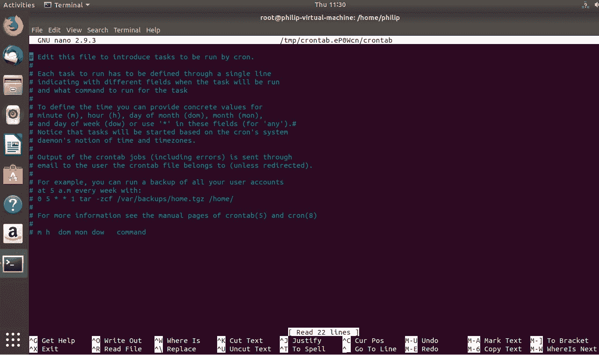
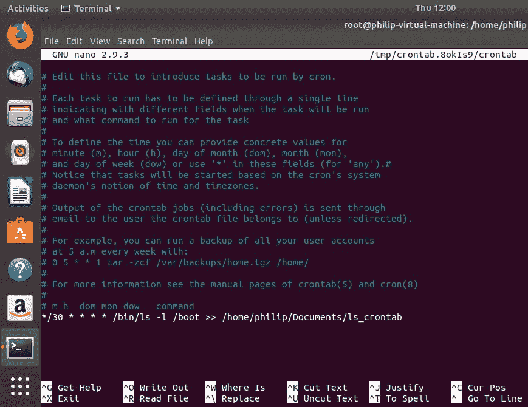
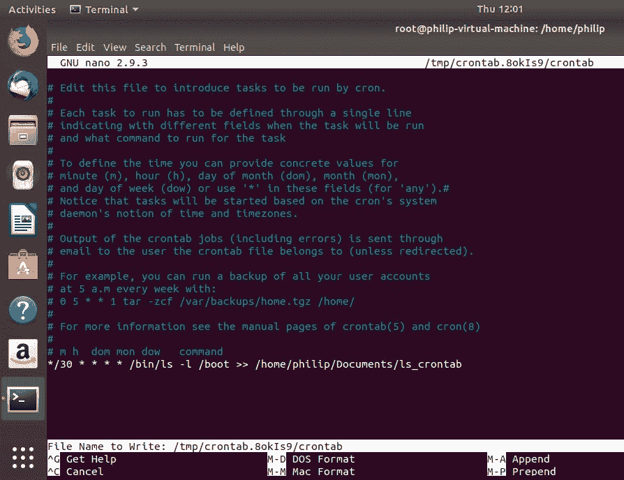

# 第十三章：自动化任务

在上一章中，我们涵盖了管理用户和组帐户的各种技术。首先，我们调查了新用户的主目录来自哪些目录。接下来，我们处理了用户帐户的创建。此外，我们查看了用户密码保存的各种配置文件。最后，我们关注了组。我们介绍了创建组的步骤，以及添加、删除和为组分配密码。

在本章中，我们的重点转向自动化，特别是自动化任务。我们将涵盖使用各种方法进行任务调度。我们经常在日常工作中处理各种任务，而不是手动和重复地在一段时间内运行任务；实施某种额外的自动化是一个好的实践，我们将关注任务执行权限。

在本章中，我们将涵盖以下主题：

+   `at`，`atq`和`arm`命令

+   `crontab`文件和`anacron`命令

+   使用配置文件进行任务权限

# 使用`at`，`atq`和`atrm`命令管理自动化

在本节中，我们将介绍在 Linux 系统中自动化各种类型任务的常见方法。首先，我们将介绍`at`命令。接下来，我们将使用`atq`命令处理队列。最后，我们将以使用`atrm`命令删除作业的技术结束本节。

# at 命令

`at`命令安排一个任务在固定时间运行；它只运行一次。您可以安排一个简单的任务，比如将一些输出附加到文件，或者像备份数据库这样复杂的任务。启动`at`实用程序的基本语法如下：

```
at <time>
```

我们可以看到`at`命令在我们的 Fedora 28 系统上的运行情况；我们只需输入`at`而不指定任何选项：

```
[root@localhost philip]# at
Garbled time
[root@localhost philip]#
```

根据前面的命令，如果不指定时间，`at`实用程序将返回`Garbled time`。这是我们如何指定时间的方法：

```
[root@localhost philip]# at 18:10
warning: commands will be executed using /bin/sh
at>
```

根据前面的输出，一旦输入日期（在这种情况下，我们输入了格式为 HH:MM 的时间），它就会启动`at`实用程序，并出现`warning: commands will be executed using /bin/sh`的警告；这告诉我们`at`实用程序在执行时将使用哪个 shell。从这里，我们可以输入任何我们想在指定时间运行的命令。例如：

```
[root@localhost philip]# at 18:10
warning: commands will be executed using /bin/sh
at> ls -l > /home/philip/Documents/schedule
at>
```

看起来似乎没有什么改变；要保存更改，我们必须告诉`at`实用程序我们已经完成输入命令。这是使用*Ctrl* + *D*组合完成的：

```
[root@localhost philip]# at 18:10
warning: commands will be executed using /bin/sh
at> ls -l > /home/philip/Documents/schedule
at> <EOT>
job 1 at Tue Sep  4 18:10:00 2018
[root@localhost philip]#
```

根据前面的输出，`at`实用程序已经安排了一个任务在当前时间的`18:10`运行。使用`at`实用程序安排任务的另一种方法是以 12 小时制指定时间。这是我们如何做到的：

```
[root@localhost philip]# at 9:00 PM
warning: commands will be executed using /bin/sh
at> date > /home/philip/Documents/date_schedule
at> <EOT>
job 2 at Tue Sep  4 21:00:00 2018
[root@localhost philip]#
```

太棒了！根据前面的输出，我们已经使用 12 小时制指定了时间，通过添加`PM`。这告诉`at`实用程序在当前时间从`9:00 PM`执行作业。此外，我们还可以使用关键词指定时间。例如，我们可以说`tomorrow`，`noon tomorrow`，`next week`，`next Monday`，`fri`等等。这是它的样子：

```
[root@localhost philip]# at next monday
warning: commands will be executed using /bin/sh
at> ls -l /etc > /home/philip/Documents/ls_schedule
at> <EOT>
job 4 at Mon Sep 10 09:11:00 2018
[root@localhost philip]#
```

很棒！根据前面的输出，`at`实用程序已经使用当前日期来计算何时执行。此外，`<EOT>`是按下*Ctrl* + *D*的结果。指定运行`at`实用程序的另一种方法是使用关键词的组合。例如，我们可以指定`now + 4 weeks`，`now + 6 years`，`now + 25 minutes`等等。这是它的样子：

```
[root@localhost philip]# at now + 15 minutes
warning: commands will be executed using /bin/sh
at> ls -a /var/log > /home/philip/Documents/lsa_schedule
at> <EOT>
job 5 at Thu Sep  6 09:32:00 2018
[root@localhost philip]# date
Thu Sep  6 09:19:25 EDT 2018
[root@localhost philip]#
```

太棒了！根据前面的输出，我们可以看到`at`实用程序使用当前日期和时间进行计算。此外，我们还可以指定年份来查看其计算：

```
[root@localhost philip]# at now + 25 years
warning: commands will be executed using /bin/sh
at> systemctl status sshd.service > /home/philip/Documents/ssh_25yrs_schedule
at> <EOT>
job 7 at Sun Sep  6 09:25:00 2043
[root@localhost philip]#
```

很棒！根据前面的输出，`at`实用程序将在当前时间的 25 年后运行此任务。我们可以看到一些可以与`at`实用程序一起传递的常见选项列表，我们传递`-help`选项：

```
[root@localhost philip]# at -help
Usage: at [-V] [-q x] [-f file] [-mMlbv] timespec ...
 at [-V] [-q x] [-f file] [-mMlbv] -t time
 at -c job ...
 atq [-V] [-q x]
 at [ -rd ] job ...
 atrm [-V] job ...
 batch
[root@localhost philip]#
Awesome job!
```

# atq 命令

到目前为止，我们一直在使用`at`实用程序创建一些要执行的任务。跟踪使用`at`命令安排运行的任务将是很好的；`atq`命令正是这样做的。要了解其工作原理，我们可以运行`atq`命令：

```
[root@localhost philip]# atq
4              Mon Sep 10 09:11:00 2018 a root
7              Sun Sep  6 09:25:00 2043 a root
[root@localhost philip]#
```

根据前面的输出，我们列出了两个要由`at`实用程序运行的作业。当我们以 root 用户身份运行`atq`命令时，所有作业都将由`at`命令列出；当我们以标准用户身份运行`at`命令时，只有用户作业将被列出。这是它的外观：

```
[root@localhost philip]# exit
exit
[philip@localhost ~]$ atq
[philip@localhost ~]$
```

根据前面的输出，用户不知道根用户使用`at`命令安排的作业。此外，我们可以使用`at`命令查看队列；我们传递`-l`选项：

```
[root@localhost philip]# at -l
4              Mon Sep 10 09:11:00 2018 a root
7              Sun Sep  6 09:25:00 2043 a root
[root@localhost philip]#
```

很棒！根据前面的命令，我们可以看到输出与`atq`命令的输出相同。这是因为`at`命令与`atq`命令一起使用的`-l`选项只是`atq`命令的别名。

# atrm 命令

使用`at`实用程序安排运行作业是很好的。但是，我们需要对安排的作业有一定的控制。如果我们决定取消作业，可以使用`atrm`命令。`atrm`命令用于取消`at`实用程序执行之前的作业。例如，我们使用`at`实用程序安排了一次重启：

```
[root@localhost philip]# at now + 5 minutes
warning: commands will be executed using /bin/sh
at> reboot
at> <EOT>
job 8 at Thu Sep  6 10:06:00 2018
[root@localhost philip]# date
Thu Sep  6 10:01:21 EDT 2018
[root@localhost philip]#
```

根据前面的命令，我们已经指定使用`at`命令在五分钟内重新启动系统。现在，如果出于某种原因我们想要取消此作业，我们可以使用`atrm`命令。我们会这样做：

```
 [root@localhost philip]# atq
4              Mon Sep 10 09:11:00 2018 a root
8              Thu Sep  6 10:06:00 2018 a root
7              Sun Sep  6 09:25:00 2043 a root
[root@localhost philip]# atrm 8
[root@localhost philip]# atq
4              Mon Sep 10 09:11:00 2018 a root
7              Sun Sep  6 09:25:00 2043 a root
[root@localhost philip]#
```

很好！根据前面的命令，我们使用`atq`命令列出了计划的作业；然后我们使用`atrm`命令并指定作业 ID 来删除它。此外，我们可以使用`at`实用程序删除作业；为此，我们传递`-r`或`-d`选项：

```
[root@localhost philip]# atq
4              Mon Sep 10 09:11:00 2018 a root
7              Sun Sep  6 09:25:00 2043 a root
[root@localhost philip]# at -r 4
[root@localhost philip]# atq
7              Sun Sep  6 09:25:00 2043 a root
[root@localhost philip]#
```

很好！根据前面的输出，我们可以看到使用`at`命令的`-r`选项删除了 ID 为`4`的作业。`at`命令的`-d`选项的工作方式相同：

```
[root@localhost philip]# atq
7              Sun Sep  6 09:25:00 2043 a root
[root@localhost philip]#
[root@localhost philip]# at -d 7
[root@localhost philip]# atq
[root@localhost philip]#
Excellent!
```

# 使用 cron、crontab 和 anacron 进行自动化管理

在本节中，我们将介绍一些管理任务的技术，这些任务通常需要运行多次。首先，我们将从各种`cron`目录开始。接下来，我们将使用`crontab`。最后，我们将介绍`anacron`。重点是它们不是彼此的替代品，而是在 Linux 系统中管理任务中扮演关键角色。

# Cron

正如我们之前看到的，`at`实用程序只运行一次任务。有时我们需要多次运行任务。每次要执行给定的作业时，必须亲自输入`at`实用程序的任务，这很麻烦。例如，备份，这是大多数 Linux 管理员负责执行的最常见任务之一。

鉴于这些情况，我们可以使用`cron`实用程序，更具体地说是`/etc/cron.*`目录；我们放置我们想要运行的任务。作业可以每小时，每天或每月运行。Cron 使用`crond`守护程序。在 Ubuntu 中，`cron`守护程序称为`cron`或`cron.service`，而在 Fedora 28 中，`cron`守护程序称为`crond`或`crond.service`。我们可以按以下方式在 Ubuntu 上检查`cron`守护程序的状态：

```
root@philip-virtual-machine:/home/philip# systemctl status crond
Unit crond.service could not be found.
root@philip-virtual-machine:/home/philip# systemctl status cron
cron.service - Regular background program processing daemon
 Loaded: loaded (/lib/systemd/system/cron.service; enabled; vendor preset: enabled)
 Active: active (running) since Thu 2018-09-06 10:58:35 EDT; 10min ago
 Docs: man:cron(8)
 Main PID: 608 (cron)
 Tasks: 1 (limit: 4636)
 CGroup: /system.slice/cron.service
 └─608 /usr/sbin/cron -f
root@philip-virtual-machine:/home/philip#
```

根据前面的输出，`cron`守护程序称为`cron.service`。让我们在 Fedora 28 中检查`cron`守护程序：

```
[root@localhost philip]# systemctl status cron
Unit cron.service could not be found.
[root@localhost philip]# systemctl status crond
crond.service - Command Scheduler
 Loaded: loaded (/usr/lib/systemd/system/crond.service; enabled; vendor preset: enabled)
 Active: active (running) since Tue 2018-09-04 08:56:09 EDT; 2 days ago
 Main PID: 867 (crond)
 Tasks: 1 (limit: 2331)
 Memory: 3.3M
 CGroup: /system.slice/crond.service
 └─867 /usr/sbin/crond -n
 [root@localhost philip]#
```

很好！如在 Fedora 28 中所示，cron 服务称为`crond.service`。接下来，让我们看看`cron`目录：

```
root@philip-virtual-machine:/home/philip# ls -l /etc/cron.hourly/
total 0
root@philip-virtual-machine:/home/philip#
```

根据前面的输出，没有计划每小时运行的任务。但是，我们将在`/etc/cron.daily`目录中放置一些任务：

```
root@philip-virtual-machine:/home/philip# ls -l /etc/cron.daily/
total 52
-rwxr-xr-x 1 root root  311 May 29  2017 0anacron
-rwxr-xr-x 1 root root  376 Nov 20  2017 apport
-rwxr-xr-x 1 root root 1478 Apr 20 06:08 apt-compat
-rwxr-xr-x 1 root root  355 Dec 29  2017 bsdmainutils
-rwxr-xr-x 1 root root  384 Dec 12  2012 cracklib-runtime
-rwxr-xr-x 1 root root 1176 Nov  2  2017 dpkg
-rwxr-xr-x 1 root root  372 Aug 21  2017 logrotate
-rwxr-xr-x 1 root root 1065 Apr  7 06:39 man-db
-rwxr-xr-x 1 root root  538 Mar  1  2018 mlocate
-rwxr-xr-x 1 root root  249 Jan 25  2018 passwd
-rwxr-xr-x 1 root root 3477 Feb 20  2018 popularity-contest
-rwxr-xr-x 1 root root  246 Mar 21 13:20 ubuntu-advantage-tools
-rwxr-xr-x 1 root root  214 Jul 12  2013 update-notifier-common
root@philip-virtual-machine:/home/philip#
```

根据前面的输出，有许多任务，如`passwd`、`dpkg`、`mlocate`等，每天都有安排运行。同样，我们可以查看`/etc/cron.monthly`内部：

```
root@philip-virtual-machine:/home/philip# ls -al /etc/cron.monthly/
total 24
drwxr-xr-x   2 root root  4096 Apr 26 14:23 .
drwxr-xr-x 124 root root 12288 Sep  6 10:58 ..
-rwxr-xr-x   1 root root   313 May 29  2017 0anacron
-rw-r--r--   1 root root   102 Nov 16  2017 .placeholder
root@philip-virtual-machine:/home/philip#
```

太棒了！我们可以更深入地查看一个已安排的任务。让我们看看`/etc/cron.daily/passwd`任务：

```
root@philip-virtual-machine:/home/philip# cat /etc/cron.daily/passwd
#!/bin/sh
cd /var/backups || exit 0
for FILE in passwd group shadow gshadow; do
 test -f /etc/$FILE              || continue
 cmp -s $FILE.bak /etc/$FILE     && continue
 cp -p /etc/$FILE $FILE.bak && chmod 600 $FILE.bak
done
root@philip-virtual-machine:/home/philip#
```

根据前面的输出，我们可以看到任务被写成脚本。

# Crontab

正如我们刚才看到的，我们可以将任务放在各自的`/etc/cron.*`目录中。然后每小时、每天或每月执行一次。但是，我们可以获得更灵活性；我们可以将脚本放在`/etc/cron.*`目录中，而不是将脚本放在`crontab`本身中。我们可以查看`/etc/crontab`文件：

```
root@philip-virtual-machine:/home/philip# cat /etc/crontab
# /etc/crontab: system-wide crontab
# Unlike any other crontab you don't have to run the `crontab'
# command to install the new version when you edit this file
# and files in /etc/cron.d. These files also have username fields,
# that none of the other crontabs do.
SHELL=/bin/sh
PATH=/usr/local/sbin:/usr/local/bin:/sbin:/bin:/usr/sbin:/usr/bin
# m h dom mon dow user            command
17 *        * * *      root    cd / && run-parts --report /etc/cron.hourly
25 6        * * *      root       test -x /usr/sbin/anacron || ( cd / && run-parts --report /etc/cron.daily )
47 6        * * 7      root       test -x /usr/sbin/anacron || ( cd / && run-parts --report /etc/cron.weekly )
52 6        1 * *      root       test -x /usr/sbin/anacron || ( cd / && run-parts --report /etc/cron.monthly )
root@philip-virtual-machine:/home/philip#
```

太棒了！我们可以看到前面的输出中，我们涵盖的脚本在最后部分；它们由`crontab`执行。我们可以在`crontab`中添加我们自己的条目。我们使用`-e`选项与`crontab`一起，这意味着进入编辑模式：

```
root@philip-virtual-machine:/home/philip# crontab -e
Select an editor.  To change later, run 'select-editor'.
/bin/nano    <---- easiest
/usr/bin/vim.tiny
/bin/ed
Choose 1-3 [1]:
```

现在，我们需要指定使用哪个编辑器；我们将接受默认值：



太棒了！根据前面的截图，我们有一些关于如何定义条目的指导方针。让我们定义自己的条目：



根据前面的截图，我们已经定义了我们的条目，每半分钟运行一次，每天运行一次；`ls`命令将针对`/boot`目录运行，并将其输出追加保存到`/home/philip/Documents/ls_crontab`。定义时间的语法如下：

```
0/30         minute
*             hour
*             day of month
*             month
*             hour
```

完成条目创建后，我们需要写入更改；我们使用 nano 编辑器，所以按下*Ctrl* + *O*来写入更改：



现在，`crontab`文件将为用户生成，如下所示：

```
crontab: installing new crontab
root@philip-virtual-machine:/home/philip#
Awesome! Now, we can pass the “-l” option with the crontab command :
root@philip-virtual-machine:/home/philip# crontab -l
# Output of the crontab jobs (including errors) is sent through
# email to the user the crontab file belongs to (unless redirected).
# For example, you can run a backup of all your user accounts
# at 5 a.m every week with:
# 0 5 * * 1 tar -zcf /var/backups/home.tgz /home/
# For more information see the manual pages of crontab(5) and cron(8)
# m h  dom mon dow   command
*/30 * * * * ls -l /boot >> /home/philip/Documents/ls_crontab
root@philip-virtual-machine:/home/philip#
```

根据前面的输出，我们可以看到我们的条目在底部。30 分钟后，我们的文件将生成，我们可以看到输出：

```
root@philip-virtual-machine:/home/philip# cat Documents/ls_crontab
total 66752
-rw-r--r-- 1 root root  1536934 Apr 24 00:56 abi-4.15.0-20-generic
-rw-r--r-- 1 root root   216807 Apr 24 00:56 config-4.15.0-20-generic
drwxr-xr-x 5 root root     4096 Sep  6 10:30 grub
-rw-r--r-- 1 root root 53739884 Sep  6 10:45 initrd.img-4.15.0-20-generic
-rw-r--r-- 1 root root   182704 Jan 28  2016 memtest86+.bin
-rw-r--r-- 1 root root   184380 Jan 28  2016 memtest86+.elf
-rw-r--r-- 1 root root   184840 Jan 28  2016 memtest86+_multiboot.bin
-rw-r--r-- 1 root root        0 Apr 24 00:56 retpoline-4.15.0-20-generic
-rw------- 1 root root  4038188 Apr 24 00:56 System.map-4.15.0-20-generic
-rw-r--r-- 1 root root  8249080 Apr 26 14:40 vmlinuz-4.15.0-20-generic
root@philip-virtual-machine:/home/philip#
root@philip-virtual-machine:/home/philip# date
Thu Sep  6 12:00:05 EDT 2018
root@philip-virtual-machine:/home/philip#
```

太棒了，我们将再等待 30 分钟，然后查看追加的输出：

```
root@philip-virtual-machine:/home/philip# date
Thu Sep  6 12:30:18 EDT 2018
root@philip-virtual-machine:/home/philip# cat Documents/ls_crontab
total 66752
-rw-r--r-- 1 root root  1536934 Apr 24 00:56 abi-4.15.0-20-generic
-rw-r--r-- 1 root root   216807 Apr 24 00:56 config-4.15.0-20-generic
drwxr-xr-x 5 root root     4096 Sep  6 10:30 grub
-rw-r--r-- 1 root root 53739884 Sep  6 10:45 initrd.img-4.15.0-20-generic
-rw-r--r-- 1 root root   182704 Jan 28  2016 memtest86+.bin
-rw-r--r-- 1 root root   184380 Jan 28  2016 memtest86+.elf
-rw-r--r-- 1 root root   184840 Jan 28  2016 memtest86+_multiboot.bin
-rw-r--r-- 1 root root        0 Apr 24 00:56 retpoline-4.15.0-20-generic
-rw------- 1 root root  4038188 Apr 24 00:56 System.map-4.15.0-20-generic
-rw-r--r-- 1 root root  8249080 Apr 26 14:40 vmlinuz-4.15.0-20-generic
total 66752
-rw-r--r-- 1 root root  1536934 Apr 24 00:56 abi-4.15.0-20-generic
-rw-r--r-- 1 root root   216807 Apr 24 00:56 config-4.15.0-20-generic
drwxr-xr-x 5 root root     4096 Sep  6 10:30 grub
-rw-r--r-- 1 root root 53739884 Sep  6 10:45 initrd.img-4.15.0-20-generic
-rw-r--r-- 1 root root   182704 Jan 28  2016 memtest86+.bin
-rw-r--r-- 1 root root   184380 Jan 28  2016 memtest86+.elf
-rw-r--r-- 1 root root   184840 Jan 28  2016 memtest86+_multiboot.bin
-rw-r--r-- 1 root root        0 Apr 24 00:56 retpoline-4.15.0-20-generic
-rw------- 1 root root  4038188 Apr 24 00:56 System.map-4.15.0-20-generic
-rw-r--r-- 1 root root  8249080 Apr 26 14:40 vmlinuz-4.15.0-20-generic
root@philip-virtual-machine:/home/philip#
```

太棒了！请注意，标准用户看不到 root 用户的`crontab`作业：

```
philip@philip-virtual-machine:~$ crontab -l
no crontab for philip
philip@philip-virtual-machine:~$
```

但是，root 用户可以通过使用`-u`选项查看任何用户的条目：

```
root@philip-virtual-machine:/home/philip# crontab -u philip -l
no crontab for philip
root@philip-virtual-machine:/home/philip#
```

太棒了！

# Anacron

有趣的是，Anacron 并不是作为`cron`的替代品，而是用于系统有时关闭的情况。此外，Anacron 并不期望系统一直开启。例如，笔记本电脑会不时关闭。Anacron 的另一个显著特点是持续时间以天或月为单位，而不是以小时或分钟为单位。如果有一个工作需要在特定时间执行，而系统关闭了，放心，当系统启动时，Anacron 会执行该工作。我们可以查看`anacrontab`文件：

```
root@philip-virtual-machine:/home/philip# cat /etc/anacrontab
# /etc/anacrontab: configuration file for anacron
# See anacron(8) and anacrontab(5) for details.
SHELL=/bin/sh
PATH=/usr/local/sbin:/usr/local/bin:/sbin:/bin:/usr/sbin:/usr/bin
HOME=/root
LOGNAME=root
# These replace cron's entries
1              5              cron.daily            run-parts --report /etc/cron.daily
7              10           cron.weekly       run-parts --report /etc/cron.weekly
@monthly           15           cron.monthly     run-parts --report /etc/cron.monthly
root@philip-virtual-machine:/home/philip# 
```

根据前面的输出，我们可以看到`anacrontab`文件中有一些`cron`条目。我们可以看到`anacron`是`cron`的补充，而不是替代`cron`。我们读取`anacrontab`文件中的条目的方式如下：

```
1                                                                            =Daily, other                                                                                      possible values are                                                                              7 = weekly,
                                                                             @daily, @monthly
5         
=Delay in minutes
cron.daily                                                                   = Job ID
run-parts --report /etc/cron.daily                                           = Command
```

我们可以在`/var/spool/anacron`目录中获取有关作业的信息：

```
root@philip-virtual-machine:/home/philip# ls -l /var/spool/anacron/
total 12
-rw------- 1 root root 9 Sep  6 10:44 cron.daily
-rw------- 1 root root 9 Sep  6 10:53 cron.monthly
-rw------- 1 root root 9 Sep  6 10:48 cron.weekly
root@philip-virtual-machine:/home/philip#
```

太棒了！我们可以查看其中一个文件，看到作业上次运行的时间：

```
root@philip-virtual-machine:/home/philip# cat /var/spool/anacron/cron.daily
20180906
root@philip-virtual-machine:/home/philip#
```

太好了！根据前面的输出，我们可以看到作业执行的时间戳。要查看`anacron`在前台处理的作业，我们可以使用`anacron`的`-d`选项：

```
root@philip-virtual-machine:/home/philip# anacron -d
Anacron 2.3 started on 2018-09-06
Normal exit (0 jobs run)
root@philip-virtual-machine:/home/philip#
```

根据前面的输出，当前没有正在执行的作业。我们可以通过编辑`/etc/anacrontab`文件创建一个条目：

```
root@philip-virtual-machine:/home/philip# cat /etc/anacrontab
# /etc/anacrontab: configuration file for anacron
# See anacron(8) and anacrontab(5) for details.
SHELL=/bin/sh
PATH=/usr/local/sbin:/usr/local/bin:/sbin:/bin:/usr/sbin:/usr/bin
HOME=/root
LOGNAME=root
# These replace cron's entries
1              5              cron.daily            run-parts --report /etc/cron.daily
7              10           cron.weekly       run-parts --report /etc/cron.weekly
@monthly           15           cron.monthly     run-parts --report /etc/cron.monthly
1              10           test                        /bin/ls -l /boot > /home/philip/Documents/ls_anacron
root@philip-virtual-machine:/home/philip#
Excellent! Now, can check the /var/spool/anacrontab:
root@philip-virtual-machine:/home/philip# ls -l /var/spool/anacron/
total 12
-rw------- 1 root root 9 Sep  6 10:44 cron.daily
-rw------- 1 root root 9 Sep  6 10:53 cron.monthly
-rw------- 1 root root 9 Sep  6 10:48 cron.weekly
-rw------- 1 root root 0 Sep  6 13:47 test
root@philip-virtual-machine:/home/philip#
```

根据前面的输出，我们现在看到了我们自定义条目的新条目。我们可以查看文件内部：

```
root@philip-virtual-machine:/home/philip# cat /var/spool/anacron/test
root@philip-virtual-machine:/home/philip#
```

根据前面的输出，文件是空的，因为作业尚未运行。我们可以通过使用`anacron`的`-T`选项在`anacrontab`文件中检查语法错误：

```
root@philip-virtual-machine:/home/philip# anacron -T
root@philip-virtual-machine:/home/philip#
```

根据前面的输出，没有发现语法错误。我们可以使用`-u`选项更新作业的时间戳，而不运行作业：

```
root@philip-virtual-machine:/home/philip# anacron -u
root@philip-virtual-machine:/home/philip#
```

我们没有看到任何输出，因为时间戳是在后台更新的。我们可以添加`-d`选项，然后我们将看到前台发生的情况：

```
root@philip-virtual-machine:/home/philip# anacron -d -u
Updated timestamp for job `cron.daily' to 2018-09-06
Updated timestamp for job `cron.weekly' to 2018-09-06
Updated timestamp for job `test' to 2018-09-06
Updated timestamp for job `cron.monthly' to 2018-09-06
root@philip-virtual-machine:/home/philip#
```

太棒了！我们可以通过使用`anacron`的`-f`选项立即执行作业：

```
root@philip-virtual-machine:/home/philip# anacron -d -f
Anacron 2.3 started on 2018-09-06
Will run job `cron.daily' in 5 min.
Will run job `cron.weekly' in 10 min.
Will run job `test' in 10 min.
Will run job `cron.monthly' in 15 min.
^C
root@philip-virtual-machine:/home/philip#
```

根据前面的输出，anacron 正在尝试执行作业；但是它必须等待每个作业的延迟时间。这就是`-n`的威力所在；它会忽略设置的延迟：

```
root@philip-virtual-machine:/home/philip# anacron -d -f -n
Anacron 2.3 started on 2018-09-06
Will run job `cron.daily'
Will run job `cron.weekly'
Will run job `test'
Will run job `cron.monthly'
Jobs will be executed sequentially
Job `cron.daily' started
Job `cron.daily' terminated
Job `cron.weekly' started
Job `cron.weekly' terminated (mailing output)
anacron: Can't find sendmail at /usr/sbin/sendmail, not mailing output
Job `test' started
Job `test' terminated (exit status: 1) (mailing output)
anacron: Can't find sendmail at /usr/sbin/sendmail, not mailing output
Job `cron.monthly' started
Job `cron.monthly' terminated
Normal exit (4 jobs run)
root@philip-virtual-machine:/home/philip#
```

太好了！现在，我们可以检查`/home/philip/Documents`中的`ls_anacron`文件：

```
root@philip-virtual-machine:/home/philip# ls -l /home/philip/Documents/
total 4
-rw-r--r-- 1 root root    0 Sep  6 14:11 ls_anacron
-rw-r--r-- 1 root root 3405 Sep  6 14:00 ls_crontab
root@philip-virtual-machine:/home/philip#
```

太好了！我们可以查看`ls_anacron`文件的内容：

```
root@philip-virtual-machine:/home/philip# cat /home/philip/Documents/ls_anacron
abi-4.15.0-20-generic
config-4.15.0-20-generic
grub
initrd.img-4.15.0-20-generic
memtest86+.bin
memtest86+.elf
memtest86+_multiboot.bin
retpoline-4.15.0-20-generic
System.map-4.15.0-20-generic
vmlinuz-4.15.0-20-generic
root@philip-virtual-machine:/home/philip#
```

完美！

# 使用配置文件的任务权限

我们可以使用`/etc/at.allow`、`/etc/at.deny`、`/etc/cron.allow`和`/etc/cron.deny`来限制对`at`和`cron`实用程序的访问。如果这些文件不存在，我们可以创建它们；`/etc/at.allow`和`/etc/cron.allow`文件就足够了。对于`/etc/at.allow`文件，我们执行以下操作：

```
root@philip-virtual-machine:/home/philip# cat /etc/at.allow
cat: /etc/at.alow: No such file or directory
root@philip-virtual-machine:/home/philip# cat /etc/cron.allow
cat: /etc/cron.allow: No such file or directory
We can use an editor and create the file and store the usernames, one username per line:
root@philip-virtual-machine:/home/philip# cat /etc/at.allow
philip
harry
teddy
root@philip-virtual-machine:/home/philip#
root@philip-virtual-machine:/home/philip# cat /etc/cron.allow
philip
harry
teddy
root@philip-virtual-machine:/home/philip#
```

太棒了！现在，只有这些用户可以使用`at`或`cron`来执行作业。

# 总结

在本章中，我们讨论了命令行上的自动化。我们涉及了`at`实用程序，重点是创建一个只运行一次的作业。接下来，我们关注了`atq`实用程序以及它如何显示`at`实用程序将运行的所有预定作业。此外，我们还看到了如何利用`at`实用程序的一个选项来使我们能够查看作业队列。接着，我们看了`atrm`实用程序，主要关注了删除预定作业的能力。除此之外，我们还看到了使用`at`命令和传递选项来停止作业的可能性。然后我们讨论了`cron`，重点是各种`cron`目录；每个目录在自动化任务方面都发挥着重要作用。接下来，我们使用了`crontab`；我们看到了语法的细节，然后在`crontab`中创建了一个自定义条目。在此之后，我们使用了`anacron`。我们看到了`anacron`的用例以及它如何补充`cron`。然后我们创建了我们自己的自定义条目，并执行了作业，以便更好地理解`anacron`。最后，我们看了自动化方面的限制；主要是限制对`at`和`cron`实用程序的访问。

在下一章中，我们的重点将放在时间管理上，特别是维护系统时间和执行日志记录，包括本地和远程。下一章对于任何在网络环境中工作并且每天都需要进行监视的人来说都是非常重要的。我邀请你来加入我，一起来体验另一个激动人心的章节。

# 问题

1.  如果在`at`命令中没有传递选项，将会输出什么？

A. 无效的语法

B. 混乱的时间

C. 没有输出

D. 以上都不是

1.  哪个是有效的`at`命令？

A. 在下下个早上 9:00

B. 在今晚 9:00

C. 在下周一的早上 9:00

D. 以上都不是

1.  在`at`实用程序中，`<EOT>`是什么意思？

A. 时间结束

B. 按下了*CTRL*+ *D*

C. 按下了*CTRL* + *X*

D. 以上都不是

1.  哪个选项使用`at`命令打印队列？

A. `-a`

B. `-c`

C. `-d`

D. `-l`

1.  哪个选项使用`at`命令删除作业？

A. `-a`

B. `-c`

C. `-a`

D. `-r`

1.  使用`at`命令可以打印创建的作业队列的哪个其他命令？

A. `atrm`

B. `atc`

C. `atq`

D. `atr`

1.  哪个选项可以使用`crontab`每分钟运行一个作业？

A. `1/30 * * * *`

B. `*/20 * * * *`

C. `*****`

D. `****1`

1.  哪个选项用于打开`crontab`并开始进行更改？

A. `-a`

B. `-e`

C. `-b`

D. `-c`

1.  哪个单词可以代表 anacron 中的 7？

A. `@daily`

B. `@monthly`

C. `@weekly`

D. `@sunday`

1.  哪个选项强制`anacron`在其计划之前运行作业？

A. `-f`

B. `-e`

C. `-c`

D. `-a`

# 进一步阅读

+   这个网站提供了关于`at`实用程序的有用信息：[`linuxconfig.org`](https://linuxconfig.org)

+   这个网站提供了关于`cron`的有用信息：[`code.tutsplus.com`](https://code.tutsplus.com)

+   该网站提供关于`anacron`的有用信息：[`linux.101hacks.com`](https://linux.101hacks.com)
