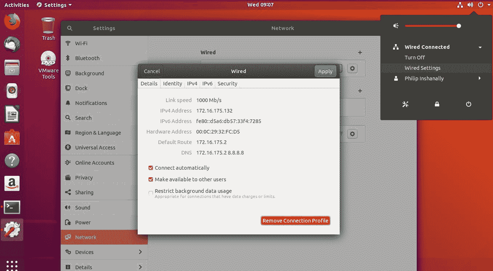
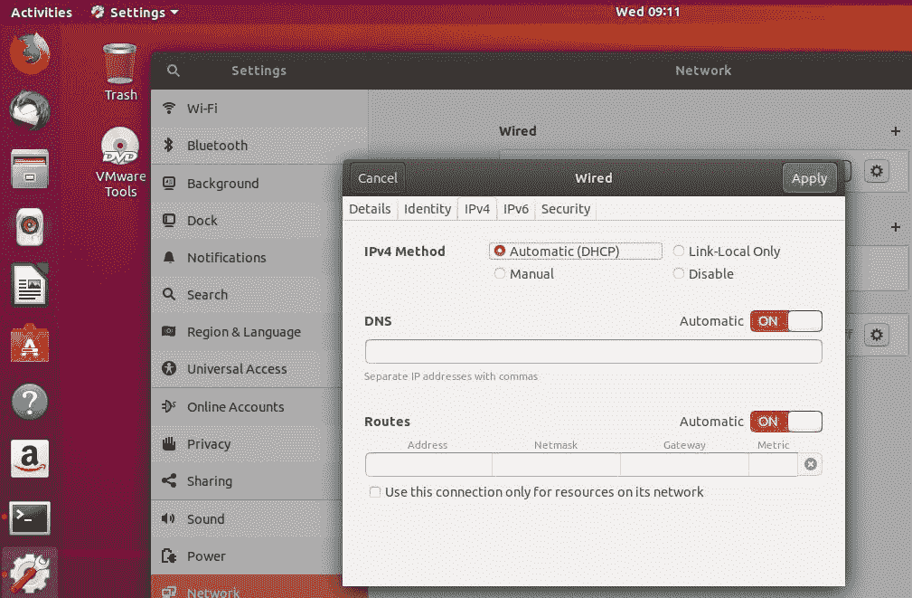
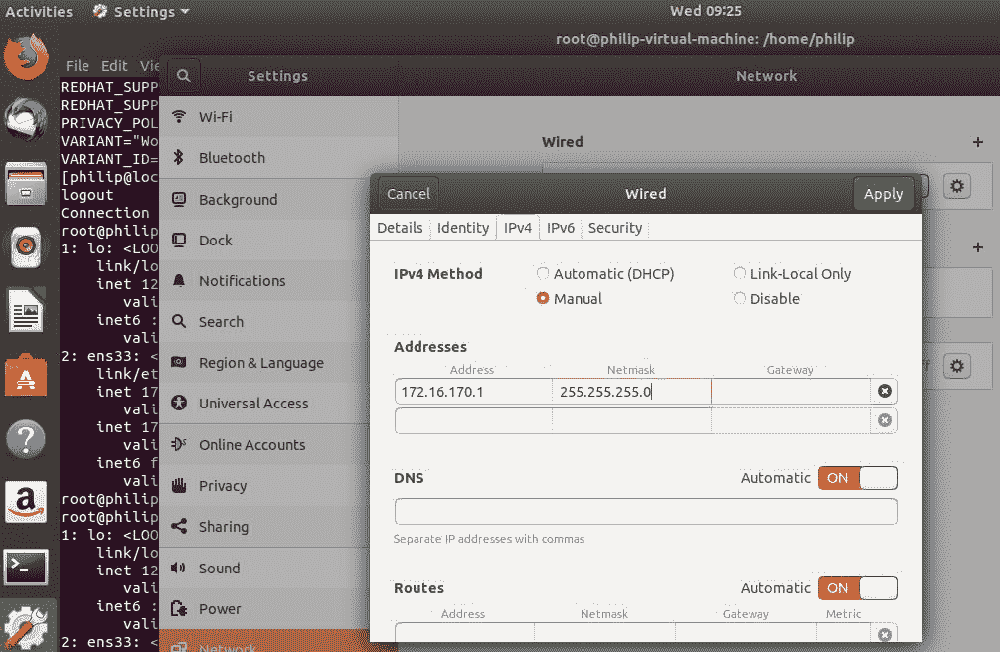
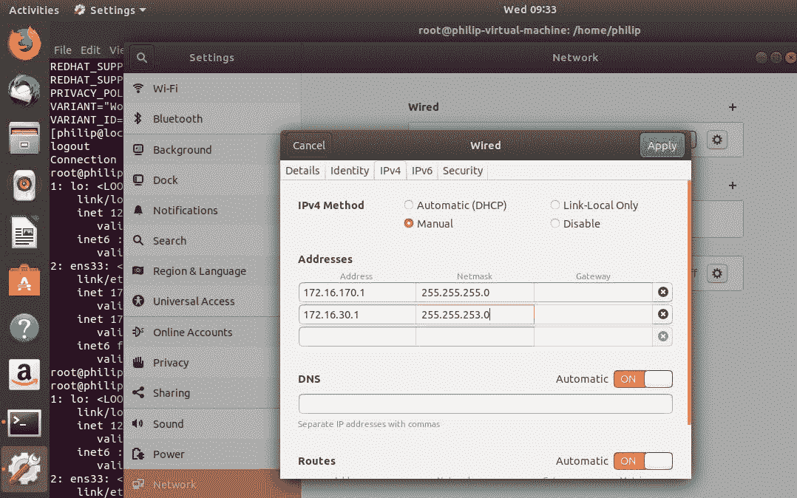
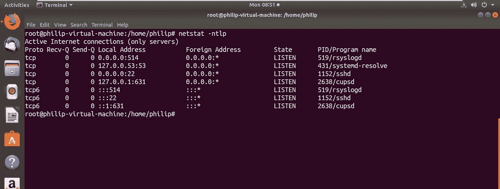
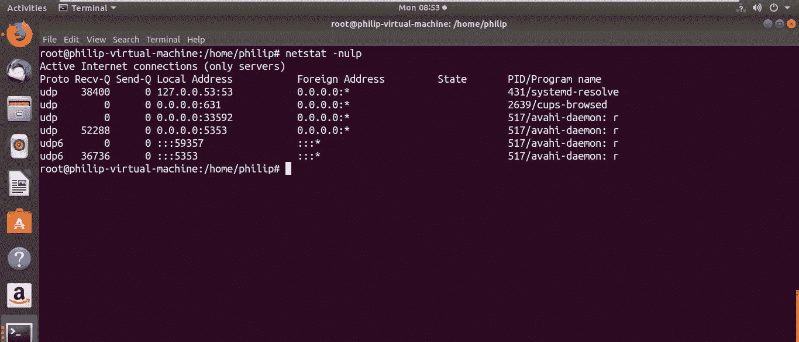

# 第十六章：网络配置和故障排除

在上一章中，我们深入研究了 IPv4 或 IPv4 和 IPv6 或（IPv6）的世界。除此之外，我们还涵盖了子网掩码。之后，我们涵盖了子网划分。最后，我们使用了一些知名协议。我们涵盖了一些最常用的协议及其端口号。

在本章中，我们的重点转向了 IPv4 和 IPv6 的配置。首先，我们将研究配置 IPv4 地址及其子网掩码的方法。接下来，我们将查看 Linux 系统中的路由表；特别是配置静态路由，最后是默认路由配置。然后是在 Linux 系统中配置 IPv6 地址；然后是 IPv6 的路由表。然后是配置 IPv6 路由；最后是配置 IPv6 的默认路由。之后，我们的重点转向 DNS 的配置；特别是在 Linux 环境中配置指向 DNS 服务器的 DNS IP 地址。最后，本章结束于网络故障排除；我们将研究各种命令行工具，以帮助我们解决潜在的连接问题。

在本章中，我们将涵盖以下主题：

+   IPv4 配置

+   IPv6 配置

+   客户端 DNS

+   网络故障排除

# IPv4 配置

在 Linux 系统中，有各种配置 IPv4 地址的方法。首先，我们可以使用 GUI 实用程序执行 IPv4 配置。让我们看看我们的 Ubuntu 18 系统。

我们可以选择网络图标，然后选择下拉箭头，选择有线设置，如下截图所示：



太棒了！根据我们在上一个例子中所看到的，当我们选择有线设置时，它会打开设置对话框；之后，我们应该选择齿轮图标。然后会打开网络设置。为了配置 IPv4 设置，我们会选择 IPv4 选项卡，如下截图所示：



根据前面的例子，我们可以看到 IPv4 寻址的默认方法是自动（DHCP）；这意味着系统将通过网络上配置为动态分配 IPv4 寻址信息的服务器获取其 IPv4 寻址信息。为了演示目的，我们希望使用手动方法分配 IPv4 地址。在我们选择手动后，将出现一个地址字段，允许我们输入 IPv4 寻址信息，如下截图所示：



很棒！根据之前的截图，我们可以看到我们有机会输入 IPv4 信息。我们已经输入了一个 IPv4 地址；此外，我们会看到一个名为 Netmask 的文本框，这是子网掩码的另一个名称。一旦我们完成了输入 IPv4 地址信息，我们就会选择应用按钮。需要记住的一件重要事情是，我们可以在接口上配置多个 IPv4 地址。是的！我们可以简单地点击第二行的文本框并输入我们选择的 IPv4 地址，如下截图所示：



根据我们在上一个例子中所看到的，当我们输入第二个 IPv4 地址时，第三行会出现另一个文本框；如果我们在第三行输入 IPv4 地址，这种情况会再次发生。一旦我们对配置满意，我们应该选择应用按钮以保存更改。管理 IPv4 寻址的另一种方法是通过 shell；我们可以使用命令提示符处的各种命令添加和删除 IPv4 地址。

# ifconfig 命令

`ifconfig`命令可以用于在命令行管理 IPv4 地址信息。我们可以运行`ifconfig`命令而不带任何选项，它将只显示活动接口，如下面的命令所示：

```
root@philip-virtual-machine:/home/philip# ifconfig
Command 'ifconfig' not found, but can be installed with:
apt install net-tools
root@philip-virtual-machine:/home/philip#
```

根据我们在前面的命令中找到的信息，我们看到`ifconfig`实用程序在 Ubuntu 18 中默认没有安装；这可以通过运行`apt`或`apt-get`命令轻松解决，如下面的示例所示：

```
root@philip-virtual-machine:/home/philip# apt install net-tools
Reading package lists... Done
Building dependency tree 
Reading state information... Done
The following NEW packages will be installed:
 net-tools
Setting up net-tools (1.60+git20161116.90da8a0-1ubuntu1) ...
root@philip-virtual-machine:/home/philip#
```

为了简洁起见，一些输出已被省略。现在我们可以再次运行`ifconfig`命令，如下所示：

```
root@philip-virtual-machine:/home/philip# ifconfig
ens33: flags=4163<UP,BROADCAST,RUNNING,MULTICAST>  mtu 1500
 inet 172.16.175.132  netmask 255.255.255.0  broadcast 172.16.175.255
 inet6 fe80::d5a6:db57:33f4:7285  prefixlen 64  scopeid 0x20<link>
 ether 00:0c:29:32:fc:d5  txqueuelen 1000  (Ethernet)
 RX packets 75738  bytes 57194615 (57.1 MB)
 RX errors 0  dropped 0  overruns 0  frame 0
 TX packets 35446  bytes 3084763 (3.0 MB)
 TX errors 0  dropped 0 overruns 0  carrier 0  collisions 0
lo: flags=73<UP,LOOPBACK,RUNNING>  mtu 65536
 inet 127.0.0.1  netmask 255.0.0.0
 inet6 ::1  prefixlen 128  scopeid 0x10<host>
 loop  txqueuelen 1000  (Local Loopback)
 RX packets 17102  bytes 1274792 (1.2 MB)
 RX errors 0  dropped 0  overruns 0  frame 0
 TX packets 17102  bytes 1274792 (1.2 MB)
 TX errors 0  dropped 0 overruns 0  carrier 0  collisions 0
root@philip-virtual-machine:/home/philip#
```

太棒了！根据我们在前面的代码中找到的信息，我们可以看到我们获得了大量信息；特别是 IPv4 地址位于`inet`部分。我们可以通过筛选来显示只有 IPv4 地址信息，如下所示的代码：

```
root@philip-virtual-machine:/home/philip# ifconfig | grep inet
 inet 172.16.175.132  netmask 255.255.255.0  broadcast 172.16.175.255
 inet6 fe80::d5a6:db57:33f4:7285  prefixlen 64  scopeid 0x20<link>
 inet 127.0.0.1  netmask 255.0.0.0
 inet6 ::1  prefixlen 128  scopeid 0x10<host>
root@philip-virtual-machine:/home/philip#
```

根据前面的代码，我们可以看到 IPv4 地址信息以及一些 IPv6。我们之前配置了另外两个 IPv4 地址；然而，它们没有显示出来，因为默认情况下只会显示主要的 IPv4 地址。我们将在下一个命令中看到如何轻松查看这些额外的 IPv4 地址。除了查看活动接口，我们还可以查看非活动接口；我们将传递`-a`选项，如下面的代码所示：

```
root@philip-virtual-machine:/home/philip# ifconfig -a
ens33: flags=4163<UP,BROADCAST,RUNNING,MULTICAST>  mtu 1500
 inet 172.16.175.132  netmask 255.255.255.0  broadcast 172.16.175.255
 inet6 fe80::d5a6:db57:33f4:7285  prefixlen 64  scopeid 0x20<link>
 ether 00:0c:29:32:fc:d5  txqueuelen 1000  (Ethernet)
 RX packets 75817  bytes 57204880 (57.2 MB)
 RX errors 0  dropped 0  overruns 0  frame 0
 TX packets 35485  bytes 3087793 (3.0 MB)
 TX errors 0  dropped 0 overruns 0  carrier 0  collisions 0
lo: flags=73<UP,LOOPBACK,RUNNING>  mtu 65536
 inet 127.0.0.1  netmask 255.0.0.0
 inet6 ::1  prefixlen 128  scopeid 0x10<host>
 loop  txqueuelen 1000  (Local Loopback)
 RX packets 17110  bytes 1275456 (1.2 MB)
 RX errors 0  dropped 0  overruns 0  frame 0
 TX packets 17110  bytes 1275456 (1.2 MB)
 TX errors 0  dropped 0 overruns 0  carrier 0  collisions 0
root@philip-virtual-machine:/home/philip#
```

根据我们在前面的示例中所看到的，这个系统上只有一个物理接口，所以输出与运行不带任何选项的`ifconfig`命令的输出相同。此外，我们可以选择要显示的接口，使用`ifconfig`命令；我们将指定接口，如下面的代码所示：

```
root@philip-virtual-machine:/home/philip# ifconfig ens33
ens33: flags=4163<UP,BROADCAST,RUNNING,MULTICAST>  mtu 1500
 inet 172.16.175.132  netmask 255.255.255.0  broadcast 172.16.175.255
 inet6 fe80::d5a6:db57:33f4:7285  prefixlen 64  scopeid 0x20<link>
 ether 00:0c:29:32:fc:d5  txqueuelen 1000  (Ethernet)
 RX packets 75825  bytes 57205574 (57.2 MB)
 RX errors 0  dropped 0  overruns 0  frame 0
 TX packets 35493  bytes 3088408 (3.0 MB)
 TX errors 0 dropped 0 overruns 0 carrier 0 collisions 0
root@philip-virtual-machine:/home/philip#
```

太棒了！这在系统可能有很多接口并且你只对特定接口感兴趣的情况下非常有用。我们可以使用`ifconfig`命令分配 IPv4 地址；我们只需传递接口和 IPv4 地址，如下面的代码所示：

```
root@philip-virtual-machine:/home/philip# ifconfig ens33 172.10.1.1
root@philip-virtual-machine:/home/philip# ifconfig ens33
ens33: flags=4163<UP,BROADCAST,RUNNING,MULTICAST>  mtu 1500
 inet 172.10.1.1  netmask 255.255.0.0  broadcast 172.10.255.255
 inet6 fe80::d5a6:db57:33f4:7285  prefixlen 64  scopeid 0x20<link>
 ether 00:0c:29:32:fc:d5  txqueuelen 1000  (Ethernet)
 RX packets 76407  bytes 57564515 (57.5 MB)
 RX errors 0  dropped 0  overruns 0  frame 0
 TX packets 35550  bytes 3099266 (3.0 MB)
 TX errors 0  dropped 0 overruns 0  carrier 0  collisions 0
root@philip-virtual-machine:/home/philip#
```

根据我们在前面的代码中找到的信息，我们可以看到主要的 IPv4 地址已经更改为我们指定的 IPv4 地址。那么如果我们不想删除先前的 IPv4 地址呢？我们可以通过创建一个别名接口来满足这个要求；它只是一个逻辑接口。然后我们将第二个 IPv4 地址分配到别名接口上。这是我们将如何完成这个任务的方式：

```
root@philip-virtual-machine:/home/philip# ifconfig ens33 172.16.175.132/24
root@philip-virtual-machine:/home/philip# ifconfig ens33:0 172.10.1.1
root@philip-virtual-machine:/home/philip# ifconfig ens33
ens33: flags=4163<UP,BROADCAST,RUNNING,MULTICAST>  mtu 1500
 inet 172.16.175.132  netmask 255.255.255.0  broadcast 172.16.175.255
 inet6 fe80::d5a6:db57:33f4:7285  prefixlen 64  scopeid 0x20<link>
 ether 00:0c:29:32:fc:d5  txqueuelen 1000  (Ethernet)
 RX packets 76902  bytes 57781395 (57.7 MB)
 RX errors 0  dropped 0  overruns 0  frame 0
 TX packets 35579  bytes 3104505 (3.1 MB)
 TX errors 0  dropped 0 overruns 0  carrier 0  collisions 0
root@philip-virtual-machine:/home/philip# ifconfig ens33:0
ens33:0: flags=4163<UP,BROADCAST,RUNNING,MULTICAST>  mtu 1500
 inet 172.10.1.1  netmask 255.255.0.0  broadcast 172.10.255.255
 ether 00:0c:29:32:fc:d5  txqueuelen 1000  (Ethernet)
root@philip-virtual-machine:/home/philip#
```

太棒了！基于此，我们现在可以看到我们在物理接口上有原始的 IPv4 地址，另外还创建了一个具有次要 IPv4 地址的别名接口。需要注意的是，当我们为别名接口指定 IPv4 地址时，我们没有指定任何子网掩码。系统根据第一个八位自动检测了子网掩码；子网掩码设置为`255.255.0.0`或`/16`的 B 类子网掩码。我们可以通过删除 IPv4 地址然后以 CIDR 表示法添加带有子网掩码的 IPv4 地址来解决这个问题，如下面的代码所示：

```
root@philip-virtual-machine:/home/philip# ifconfig ens33:0 down
root@philip-virtual-machine:/home/philip# ifconfig ens33:0
ens33:0: flags=4163<UP,BROADCAST,RUNNING,MULTICAST>  mtu 1500
 ether 00:0c:29:32:fc:d5  txqueuelen 1000  (Ethernet)
root@philip-virtual-machine:/home/philip# ifconfig ens33:0 172.10.1.1/23
root@philip-virtual-machine:/home/philip# ifconfig ens33:0
ens33:0: flags=4163<UP,BROADCAST,RUNNING,MULTICAST>  mtu 1500
 inet 172.10.1.1  netmask 255.255.254.0  broadcast 172.10.1.255
 ether 00:0c:29:32:fc:d5  txqueuelen 1000  (Ethernet)
root@philip-virtual-machine:/home/philip#
```

干得好！根据我们在前面的代码中找到的信息，为了删除 IPv4 地址，我们可以通过输入`down`来禁用接口。然后我们应该以 CIDR 表示法添加带有子网掩码的 IPv4 地址。除此之外，广播地址已经为我们设置好了，系统根据子网掩码计算了广播地址。然而，我们可以使用`ifconfig`命令设置广播，因此我们将传递`broadcast`选项，如下面的示例所示：

```
root@philip-virtual-machine:/home/philip# ifconfig ens33:0 broadcast 172.10.20.255
root@philip-virtual-machine:/home/philip# ifconfig ens33:0
ens33:0: flags=4163<UP,BROADCAST,RUNNING,MULTICAST>  mtu 1500
 inet 172.10.0.1  netmask 255.255.254.0  broadcast 172.10.20.255
 ether 00:0c:29:32:fc:d5  txqueuelen 1000  (Ethernet)
root@philip-virtual-machine:/home/philip#
```

根据我们在前面的代码中找到的信息，我们可以看到广播地址已经被我们提供的地址改变了。让我们通过将其改回正确的广播地址来修复这个问题，如下面的示例所示：

```
root@philip-virtual-machine:/home/philip# ifconfig ens33:0 broadcast 172.10.1.255
root@philip-virtual-machine:/home/philip# ifconfig ens33:0
ens33:0: flags=4163<UP,BROADCAST,RUNNING,MULTICAST>  mtu 1500
 inet 172.10.0.1  netmask 255.255.254.0  broadcast 172.10.1.255
 ether 00:0c:29:32:fc:d5  txqueuelen 1000  (Ethernet)
root@philip-virtual-machine:/home/philip#
```

删除 IPv4 地址的另一种方法是使用`ifconfig`命令传递`del`选项，如下面的示例所示：

```
root@philip-virtual-machine:/home/philip# ifconfig ens33:0 del 172.10.0.1
root@philip-virtual-machine:/home/philip# ifconfig ens33:0
ens33:0: flags=4163<UP,BROADCAST,RUNNING,MULTICAST>  mtu 1500
 ether 00:0c:29:32:fc:d5  txqueuelen 1000  (Ethernet)
root@philip-virtual-machine:/home/philip#
```

太棒了！在前面的例子中，我们看到 IPv4 地址已成功删除。当我们完成与别名的工作时，可以通过传递`down`选项来删除其配置，如下面的代码所示：

```
root@philip-virtual-machine:/home/philip# ifconfig ens33:0 down
root@philip-virtual-machine:/home/philip# ifconfig -a
ens33: flags=4163<UP,BROADCAST,RUNNING,MULTICAST>  mtu 1500
 inet 172.16.175.132  netmask 255.255.255.0  broadcast 172.16.175.255
 inet6 fe80::d5a6:db57:33f4:7285  prefixlen 64  scopeid 0x20<link>
 ether 00:0c:29:32:fc:d5  txqueuelen 1000  (Ethernet)
 RX packets 77475  bytes 57962754 (57.9 MB)
 RX errors 0  dropped 0  overruns 0  frame 0
 TX packets 35781  bytes 3140240 (3.1 MB)
 TX errors 0  dropped 0 overruns 0  carrier 0  collisions 0
lo: flags=73<UP,LOOPBACK,RUNNING>  mtu 65536
 inet 127.0.0.1  netmask 255.0.0.0
 inet6 ::1  prefixlen 128  scopeid 0x10<host>
 loop  txqueuelen 1000  (Local Loopback)
 RX packets 17311  bytes 1289908 (1.2 MB)
 RX errors 0  dropped 0  overruns 0  frame 0
 TX packets 17311  bytes 1289908 (1.2 MB)
 TX errors 0  dropped 0 overruns 0  carrier 0  collisions 0
root@philip-virtual-machine:/home/philip#
```

太棒了！从前面的例子中可以看出，接口在`ifconfig`命令中不再被识别。

# ifup 命令

`ifup`命令用于启动或启用接口。然后，接口就能够发送和接收数据包。

然而，只有列在`/etc/network/interfaces`中的接口才会被`ifup`命令识别。让我们关闭`ens33`接口，并使用`ifup`命令重新启动`ens33`接口。这是我们将如何做到这一点：

```
root@philip-virtual-machine:/home/philip# ifconfig ens33 down
root@philip-virtual-machine:/home/philip# ifup ens33
Unknown interface ens33
root@philip-virtual-machine:/home/philip# cat /etc/network/interfaces
# interfaces(5) file used by ifup(8) and ifdown(8)
auto lo
iface lo inet loopback
root@philip-virtual-machine:/home/philip#
```

根据我们在前面的例子中看到的，`ifup`不会识别`ens33`接口。这是因为`ens33`接口没有列在`/etc/network/interfaces`中。我们可以添加这个条目，然后它将与`ifup`命令一起工作。这可以在下面的例子中看到：

```
root@philip-virtual-machine:/home/philip# cat /etc/network/interfaces
# interfaces(5) file used by ifup(8) and ifdown(8)
auto lo
iface lo inet loopback
auto ens33
iface ens33 inet manual
root@philip-virtual-machine:/home/philip# ifup ens33
root@philip-virtual-machine:/home/philip# ifconfig
ens33: flags=4163<UP,BROADCAST,RUNNING,MULTICAST>  mtu 1500
 inet 172.16.170.1  netmask 255.255.255.0  broadcast 172.16.170.255
 inet6 fe80::d5a6:db57:33f4:7285  prefixlen 64  scopeid 0x20<link>
 ether 00:0c:29:32:fc:d5  txqueuelen 1000  (Ethernet)
 RX packets 77776  bytes 58152478 (58.1 MB)
 RX errors 0  dropped 0  overruns 0  frame 0
 TX packets 35893  bytes 3155908 (3.1 MB)
 TX errors 0  dropped 0 overruns 0  carrier 0  collisions 0
lo: flags=73<UP,LOOPBACK,RUNNING>  mtu 65536
 inet 127.0.0.1  netmask 255.0.0.0
 inet6 ::1  prefixlen 128  scopeid 0x10<host>
 loop  txqueuelen 1000  (Local Loopback)
 RX packets 17323  bytes 1290784 (1.2 MB)
 RX errors 0  dropped 0  overruns 0  frame 0
 TX packets 17323  bytes 1290784 (1.2 MB)
 TX errors 0  dropped 0 overruns 0  carrier 0  collisions 0
root@philip-virtual-machine:/home/philip# 
```

太棒了！根据我们在前面的例子中看到的，`ifup`命令成功地启动了`ens33`接口。此外，分配的 IPv4 地址是我们通过 GUI 网络设置配置的 IPv4 地址。在 Ubuntu 18 中，默认情况下所有的网络设置都由 network-manager 服务处理；每当我们通过命令提示符进行更改，如果系统重新启动或者 network-manager 服务重新启动，那么通过命令提示符进行的所有更改都会丢失，只有`network-manager.service`中的更改才会被使用。为了解决这个问题，我们需要停止`network-manger.service`，然后禁用 network-manager 服务。请注意，如果您没有在 Ubuntu 18 系统的`/etc/network/interfaces`中保存网络设置的更改（包括 IP、子网掩码默认网关、DNS 和 IP），这样做可能会导致系统失去连接。

除非您确定已经将网络配置保存在`/etc/network/interfaces`文件中，否则不要停止`network-manager.service`。

# ifdown 命令

`ifdown`命令可用于关闭或禁用接口；同样，只有列在`/etc/network/interfaces`中的接口才会被识别。让我们使用`ifdown`命令关闭`ens33`接口，如下面的代码中所示：

```
root@philip-virtual-machine:/home/philip# ifdown ens33
root@philip-virtual-machine:/home/philip# ifconfig
lo: flags=73<UP,LOOPBACK,RUNNING>  mtu 65536
 inet 127.0.0.1  netmask 255.0.0.0
 inet6 ::1  prefixlen 128  scopeid 0x10<host>
 loop  txqueuelen 1000  (Local Loopback)
 RX packets 17323  bytes 1290784 (1.2 MB)
 RX errors 0  dropped 0  overruns 0  frame 0
 TX packets 17323  bytes 1290784 (1.2 MB)
 TX errors 0  dropped 0 overruns 0  carrier 0  collisions 0
root@philip-virtual-machine:/home/philip#  
```

太棒了！在前面的例子中，`ifdown`命令成功地关闭了`ens33`接口，因为我们将`ens33`接口添加到了`/etc/network/interfaces`文件中。

# ip 命令

`ip`命令比`ifconfig`命令更具可扩展性。例如，我们可以使用 ip 命令查看在每个接口上配置的所有次要 IPv4 地址。没有任何选项，`ip`命令将显示可以使用的选项；这可以在下面的例子中看到：

```
root@philip-virtual-machine:/home/philip# ip
Usage: ip [ OPTIONS ] OBJECT { COMMAND | help }
 ip [ -force ] -batch filename
where  OBJECT := { link | address | addrlabel | route | rule | neigh | ntable |
tunnel | tuntap | maddress | mroute | mrule | monitor | xfrm |
netns | l2tp | fou | macsec | tcp_metrics | token | netconf | ila |
vrf | sr }
OPTIONS := { -V[ersion] | -s[tatistics] | -d[etails] | -r[esolve] |
-h[uman-readable] | -iec |
-f[amily] { inet | inet6 | ipx | dnet | mpls | bridge | link } |
-4 | -6 | -I | -D | -B | -0 |
-l[oops] { maximum-addr-flush-attempts } | -br[ief] |
-o[neline] | -t[imestamp] | -ts[hort] | -b[atch] [filename] |
-rc[vbuf] [size] | -n[etns] name | -a[ll] | -c[olor]}
root@philip-virtual-machine:/home/philip#
```

根据前面的例子，我们可以看到可以传递一些选项；其中一个选项是`a`选项。这会显示所有的寻址信息，就像下面的代码中所示：

```
root@philip-virtual-machine:/home/philip# ip a
1: lo: <LOOPBACK,UP,LOWER_UP> mtu 65536 qdisc noqueue state UNKNOWN group default qlen 1000
 link/loopback 00:00:00:00:00:00 brd 00:00:00:00:00:00
 inet 127.0.0.1/8 scope host lo
 valid_lft forever preferred_lft forever
 inet6 ::1/128 scope host
 valid_lft forever preferred_lft forever
2: ens33: <BROADCAST,MULTICAST,UP,LOWER_UP> mtu 1500 qdisc fq_codel state UP group default qlen 1000
 link/ether 00:0c:29:32:fc:d5 brd ff:ff:ff:ff:ff:ff
 inet 172.16.170.1/24 brd 172.16.170.255 scope global noprefixroute ens33
 valid_lft forever preferred_lft forever
 inet 172.16.30.1/24 brd 172.16.30.255 scope global noprefixroute ens33
 valid_lft forever preferred_lft forever
root@philip-virtual-machine:/home/philip#
```

太棒了！从前面的例子中可以立即看到`ens33`接口有多个 IPv4 地址。我们可以使用`ip`命令添加 IPv4 地址；我们将传递`add`选项，如下面的代码中所示：

```
root@philip-virtual-machine:/home/philip# ip a add 172.16.20.2/24 dev ens33
root@philip-virtual-machine:/home/philip# ip a | grep ens33
2: ens33: <BROADCAST,MULTICAST,UP,LOWER_UP> mtu 1500 qdisc fq_codel state UP group default qlen 1000
 inet 172.16.170.1/24 brd 172.16.170.255 scope global noprefixroute ens33
 inet 172.16.30.1/24 brd 172.16.30.255 scope global noprefixroute ens33
 inet 172.16.20.2/24 scope global ens33
root@philip-virtual-machine:/home/philip#
```

太棒了！现在我们可以看到 IPv4 地址已经添加了。同样，我们也可以删除 IPv4 地址；我们会传递`del`选项，就像下面的代码中所示：

```
root@philip-virtual-machine:/home/philip# ip a del 172.16.20.2/24 dev ens33
root@philip-virtual-machine:/home/philip# ip a show ens33
2: ens33: <BROADCAST,MULTICAST,UP,LOWER_UP> mtu 1500 qdisc fq_codel state UP group default qlen 1000
 link/ether 00:0c:29:32:fc:d5 brd ff:ff:ff:ff:ff:ff
 inet 172.16.170.1/24 brd 172.16.170.255 scope global noprefixroute ens33
 valid_lft forever preferred_lft forever
 inet 172.16.30.1/24 brd 172.16.30.255 scope global noprefixroute ens33
 valid_lft forever preferred_lft forever
root@philip-virtual-machine:/home/philip#
```

基于此，我们可以看到我们使用`del`选项指定的 IPv4 地址已被删除。此外，我们使用了`show`选项，这使我们能够指定我们感兴趣的接口。类似于`ifconfig`命令，也可以指定广播地址。为此，我们将传递`brd`或`broadcast`选项，如下例所示：

```
root@philip-virtual-machine:/home/philip# ip a add 172.16.20.2/22 brd 255.255.252.0 dev ens33
root@philip-virtual-machine:/home/philip# ip a show ens33
2: ens33: <BROADCAST,MULTICAST,UP,LOWER_UP> mtu 1500 qdisc fq_codel state UP group default qlen 1000
 link/ether 00:0c:29:32:fc:d5 brd ff:ff:ff:ff:ff:ff
 inet 172.16.170.1/24 brd 172.16.170.255 scope global noprefixroute ens33
 valid_lft forever preferred_lft forever
 inet 172.16.30.1/24 brd 172.16.30.255 scope global noprefixroute ens33
```

```
 valid_lft forever preferred_lft forever
 inet 172.16.20.2/22 brd 255.255.252.0 scope global ens33
 valid_lft forever preferred_lft forever
root@philip-virtual-machine:/home/philip#
```

太棒了！根据先前的例子，我们可以看到为 IPv4 地址分配了广播地址。此外，可以使用`ip`命令关闭或启用接口。为此，我们将使用`ip`命令的`link`选项，如下代码所示：

```
root@philip-virtual-machine:/home/philip# ip link set dev ens33 down
root@philip-virtual-machine:/home/philip# ip a show ens33 | grep DOWN
2: ens33: <BROADCAST,MULTICAST> mtu 1500 qdisc fq_codel state DOWN group default qlen 1000
root@philip-virtual-machine:/home/philip#
```

通过查看先前的例子，我们可以看到链接已经断开。同样，我们可以通过传递`up`选项来启动接口，如下代码所示：

```
root@philip-virtual-machine:/home/philip# ip link set dev ens33 up
root@philip-virtual-machine:/home/philip# ip a show ens33 | grep UP
2: ens33: <BROADCAST,MULTICAST,UP,LOWER_UP> mtu 1500 qdisc fq_codel state UP group default qlen 1000
root@philip-virtual-machine:/home/philip#
```

太棒了！根据先前的例子，我们可以看到接口已经重新启动。我们也可以使用 IP 命令来处理别名；我们将通过`ip`命令传递`a`或`add`选项。这可以在下面的代码中看到：

```
root@philip-virtual-machine:/home/philip# ip a a 172.50.5.1/24 brd + dev ens33 label ens33:1
root@philip-virtual-machine:/home/philip# ip a show ens33
2: ens33: <BROADCAST,MULTICAST,UP,LOWER_UP> mtu 1500 qdisc fq_codel state UP group default qlen 1000
 link/ether 00:0c:29:32:fc:d5 brd ff:ff:ff:ff:ff:ff
 inet 172.16.170.1/24 brd 172.16.170.255 scope global noprefixroute ens33
 valid_lft forever preferred_lft forever
 inet 172.16.30.1/24 brd 172.16.30.255 scope global noprefixroute ens33
 valid_lft forever preferred_lft forever
 inet 172.50.5.1/24 brd 172.50.5.255 scope global ens33:1
 valid_lft forever preferred_lft forever
 inet6 fe80::d5a6:db57:33f4:7285/64 scope link noprefixroute
 valid_lft forever preferred_lft forever
root@philip-virtual-machine:/home/philip#
root@philip-virtual-machine:/home/philip# ifconfig
ens33: flags=4163<UP,BROADCAST,RUNNING,MULTICAST>  mtu 1500
 inet 172.16.170.1  netmask 255.255.255.0  broadcast 172.16.170.255
 inet6 fe80::d5a6:db57:33f4:7285  prefixlen 64  scopeid 0x20<link>
 ether 00:0c:29:32:fc:d5  txqueuelen 1000  (Ethernet)
 RX packets 79421  bytes 58846078 (58.8 MB)
 RX errors 0  dropped 1  overruns 0  frame 0
 TX packets 36124  bytes 3191485 (3.1 MB)
 TX errors 0  dropped 0 overruns 0  carrier 0  collisions 0
ens33:1: flags=4163<UP,BROADCAST,RUNNING,MULTICAST>  mtu 1500
 inet 172.50.5.1  netmask 255.255.255.0  broadcast 172.50.5.255
 ether 00:0c:29:32:fc:d5  txqueuelen 1000  (Ethernet)
 TX errors 0  dropped 0 overruns 0  carrier 0  collisions 0
root@philip-virtual-machine:/home/philip#
```

太棒了！根据先前的例子，我们可以看到别名在`ens33`下使用`ip`命令列出。然而，当我们使用`ifconfig`命令时，我们会看到`ens33:1`被列为一个单独的逻辑接口。一旦我们完成使用别名，可以通过在`ip`命令中传递`del`选项来删除别名，如下例所示：

```
root@philip-virtual-machine:/home/philip# ip a del 172.50.5.1/24 brd + dev ens33 label ens33:1
root@philip-virtual-machine:/home/philip# ip a show ens33
2: ens33: <BROADCAST,MULTICAST,UP,LOWER_UP> mtu 1500 qdisc fq_codel state UP group default qlen 1000
 link/ether 00:0c:29:32:fc:d5 brd ff:ff:ff:ff:ff:ff
 inet 172.16.170.1/24 brd 172.16.170.255 scope global noprefixroute ens33
 valid_lft forever preferred_lft forever
 inet 172.16.30.1/24 brd 172.16.30.255 scope global noprefixroute ens33
 valid_lft forever preferred_lft forever
 inet6 fe80::d5a6:db57:33f4:7285/64 scope link noprefixroute
 valid_lft forever preferred_lft forever
root@philip-virtual-machine:/home/philip# ifconfig
ens33: flags=4163<UP,BROADCAST,RUNNING,MULTICAST>  mtu 1500
 inet 172.16.170.1  netmask 255.255.255.0  broadcast 172.16.170.255
 inet6 fe80::d5a6:db57:33f4:7285  prefixlen 64  scopeid 0x20<link>
 ether 00:0c:29:32:fc:d5  txqueuelen 1000  (Ethernet)
root@philip-virtual-machine:/home/philip#
```

出于简洁起见，一些输出已被省略。根据先前的例子，我们可以看到别名接口已被删除。在网络使用 VLAN 或虚拟局域网的环境中，可以创建映射到 VLAN 的子接口，从而使 Linux 系统能够处理标记的 VLAN 流量。您需要配置网络交换机以标记流量，然后将流量发送到 Linux 系统中的 VLAN。Linux 系统和交换机之间的链接被视为`trunk`端口，因为它可以通过其物理链接发送多个 VLAN，并且 Linux 系统可以处理流量，因为它知道我们创建的 VLAN。我们将使用`ip link`和`add`选项。以下是我们如何创建一个子接口并将其映射到 VLAN：

```
root@philip-virtual-machine:/home/philip# ip link add link ens33 name ens33.100 type vlan id 100
root@philip-virtual-machine:/home/philip# ip a | grep ens
2: ens33: <BROADCAST,MULTICAST,UP,LOWER_UP> mtu 1500 qdisc fq_codel state UP group default qlen 1000
 inet 172.16.170.1/24 brd 172.16.170.255 scope global noprefixroute ens33
 inet 172.16.30.1/24 brd 172.16.30.255 scope global noprefixroute ens33
3: ens33.100@ens33: <BROADCAST,MULTICAST> mtu 1500 qdisc noop state DOWN group default qlen 1000
root@philip-virtual-machine:/home/philip#
```

太棒了！根据我们在先前的例子中看到的，接口已经创建，并且被视为一个独立的接口。为了检查这一点，我们可以像为物理接口一样分配 IPv4 地址，如下例所示：

```
root@philip-virtual-machine:/home/philip# ip a a 172.16.5.5/24 dev ens33.100
root@philip-virtual-machine:/home/philip# ip a | grep ens
2: ens33: <BROADCAST,MULTICAST,UP,LOWER_UP> mtu 1500 qdisc fq_codel state UP group default qlen 1000
 inet 172.16.170.1/24 brd 172.16.170.255 scope global noprefixroute ens33
 inet 172.16.30.1/24 brd 172.16.30.255 scope global noprefixroute ens33
3: ens33.100@ens33: <BROADCAST,MULTICAST> mtu 1500 qdisc noop state DOWN group default qlen 1000
 inet 172.16.5.5/24 scope global ens33.100
root@philip-virtual-machine:/home/philip#
```

太棒了！最后一步是启动接口。为此，我们将通过`ip link`命令传递`up`选项，如下代码所示：

```
root@philip-virtual-machine:/home/philip# ip link set dev ens33.100 up
root@philip-virtual-machine:/home/philip# ip a | grep ens
2: ens33: <BROADCAST,MULTICAST,UP,LOWER_UP> mtu 1500 qdisc fq_codel state UP group default qlen 1000
 inet 172.16.170.1/24 brd 172.16.170.255 scope global noprefixroute ens33
 inet 172.16.30.1/24 brd 172.16.30.255 scope global noprefixroute ens33
3: ens33.100@ens33: <BROADCAST,MULTICAST,UP,LOWER_UP> mtu 1500 qdisc noqueue state UP group default qlen 1000
 inet 172.16.5.5/24 scope global ens33.100
root@philip-virtual-machine:/home/philip#
```

基于先前的例子，我们可以看到映射到 VLAN 100 的子接口现在已经启动。我们可以添加和删除 IP 地址信息，类似于物理接口。当我们完成对子接口的操作后，可以通过在`ip link`命令中传递`del`选项来删除它，如下例所示：

```
root@philip-virtual-machine:/home/philip# ip link del ens33.100
root@philip-virtual-machine:/home/philip# ip a | grep ens
2: ens33: <BROADCAST,MULTICAST,UP,LOWER_UP> mtu 1500 qdisc fq_codel state UP group default qlen 1000
 inet 172.16.170.1/24 brd 172.16.170.255 scope global noprefixroute ens33
 inet 172.16.30.1/24 brd 172.16.30.255 scope global noprefixroute ens33
root@philip-virtual-machine:/home/philip#
```

太棒了！通过查看该示例，我们可以看到子接口不再存在。`ip`命令的另一个有用用途是查看接口的统计信息。我们将通过`ip link`命令传递`-s`和`ls`选项，如下代码所示：

```
root@philip-virtual-machine:/home/philip# ip -s link ls ens33
2: ens33: <BROADCAST,MULTICAST,UP,LOWER_UP> mtu 1500 qdisc fq_codel state UP mode DEFAULT group default qlen 1000
 link/ether 00:0c:29:32:fc:d5 brd ff:ff:ff:ff:ff:ff
 RX: bytes  packets  errors  dropped overrun mcast 
 58851742   79482    0       1       0       0 
 TX: bytes  packets  errors  dropped carrier collsns
 3199078    36174    0       0       0       0 
root@philip-virtual-machine:/home/philip#
```

根据先前的例子，我们可以看到关于接收和发送的数据包统计；通过向当前命令添加另一个`-s`选项，我们甚至可以看到帧、丢失和 CRC 错误，如下代码所示：

```
root@philip-virtual-machine:/home/philip# ip -s -s link ls ens33
2: ens33: <BROADCAST,MULTICAST,UP,LOWER_UP> mtu 1500 qdisc fq_codel state UP mode DEFAULT group default qlen 1000
 link/ether 00:0c:29:32:fc:d5 brd ff:ff:ff:ff:ff:ff
 RX: bytes  packets  errors  dropped overrun mcast 
 58852018   79485    0       1       0       0 
 RX errors: length   crc     frame   fifo    missed
 0        0       0       0       0 
 TX: bytes  packets  errors  dropped carrier collsns
 3199078    36174    0       0       0       0 
 TX errors: aborted  fifo   window heartbeat transns
 0        0       0       0       20 
root@philip-virtual-machine:/home/philip#
```

太棒了！根据先前的例子，我们可以看到与 CRC、帧等相关的计数器。

# 配置 IPv4 路由

到目前为止，我们一直在分配 IPv4 地址信息，但没有指定任何类型的路由信息。我们可以使用多个命令查看当前的路由表。例如，我们可以使用`route`命令显示路由表，如下例所示：

```
root@philip-virtual-machine:/home/philip# route
Kernel IP routing table
Destination     Gateway         Genmask         Flags Metric Ref    Use Iface
link-local      0.0.0.0         255.255.0.0     U     1000   0        0 ens33
172.16.30.0     0.0.0.0         255.255.255.0   U     100    0        0 ens33
172.16.170.0    0.0.0.0         255.255.255.0   U     100    0        0 ens33
root@philip-virtual-machine:/home/philip#
```

根据我们在先前的例子中看到的，只显示与配置的 IPv4 地址相对应的连接路由。还可以使用`ip`命令显示路由表；我们将传递`route`选项，如下命令所示：

```
root@philip-virtual-machine:/home/philip# ip route
169.254.0.0/16 dev ens33 scope link metric 1000
172.16.30.0/24 dev ens33 proto kernel scope link src 172.16.30.1 metric 100
172.16.170.0/24 dev ens33 proto kernel scope link src 172.16.170.1 metric 100
root@philip-virtual-machine:/home/philip#
```

根据前面的例子，我们可以看到与 route 命令类似的信息。另一个可以用来打印路由表的命令是`netstat`命令；为了做到这一点，我们会传递`-r`选项，就像下面的例子中所示的那样。

```
root@philip-virtual-machine:/home/philip# netstat -r
Kernel IP routing table
Destination     Gateway         Genmask         Flags   MSS Window  irtt Iface
link-local      0.0.0.0         255.255.0.0     U         0 0          0 ens33
172.16.30.0     0.0.0.0         255.255.255.0   U         0 0          0 ens33
172.16.170.0    0.0.0.0         255.255.255.0   U         0 0          0 ens33
root@philip-virtual-machine:/home/philip#
```

干得好！在前面的例子中，路由表再次被打印出来。我们还没有配置默认路由；默认路由用于到达不在同一子网上的主机，或者在 LAN 外部的主机。我们将使用`ip route`命令并传递`add`和`default`选项来定义一个默认路由。下面的例子展示了这是什么样子：

```
root@philip-virtual-machine:/home/philip# ip route add default via 172.16.175.1
root@philip-virtual-machine:/home/philip# ip route | grep def
default via 172.16.175.1 dev ens33
root@philip-virtual-machine:/home/philip#
root@philip-virtual-machine:/home/philip# route  | grep UG
default         _gateway        0.0.0.0         UG    0      0        0 ens33
root@philip-virtual-machine:/home/philip#
```

太棒了！根据前面的例子，我们可以看到已经添加了一个默认路由。当我们运行`route`命令时，我们看到了`_gateway`这个词，而不是 IPv4 地址；我们可以传递`-n`选项来查看默认网关的数值。下面的例子演示了这一点：

```
root@philip-virtual-machine:/home/philip# route -n | grep UG
0.0.0.0         172.16.175.1    0.0.0.0         UG    0      0        0 ens33
root@philip-virtual-machine:/home/philip#
```

太棒了！我们还可以通过指定我们要到达的子网来创建一个静态路由。下面是我们如何做到这一点的：

```
root@philip-virtual-machine:/home/philip# ip route add 10.20.0.0/24 via 172.16.30.1
root@philip-virtual-machine:/home/philip# ip route | grep via
default via 172.16.175.1 dev ens33
10.20.0.0/24 via 172.16.30.1 dev ens33
root@philip-virtual-machine:/home/philip#
root@philip-virtual-machine:/home/philip# route -n | grep UG
0.0.0.0         172.16.175.1    0.0.0.0         UG    0      0        0 ens33
10.20.0.0       172.16.30.1     255.255.255.0   UG    0      0        0 ens33
root@philip-virtual-machine:/home/philip#
```

太棒了！根据前面的例子，我们现在可以看到为`10.20.0.0/24`子网添加的静态路由，通过`172.16.30.1`。当我们不再需要一个路由时，我们可以使用`ip route`命令并传递`del`选项来删除它，就像下面的命令中所示的那样。

```
root@philip-virtual-machine:/home/philip# ip route del 10.20.0.0/24 via 172.16.30.1
root@philip-virtual-machine:/home/philip# ip route | grep via
default via 172.16.175.1 dev ens33
root@philip-virtual-machine:/home/philip# route -n | grep UG
0.0.0.0         172.16.175.1    0.0.0.0         UG    0      0        0 ens33
root@philip-virtual-machine:/home/philip#
```

正如我们在前面的例子中所看到的，`10.20.0.0/24`的静态路由不再存在于我们的路由表中。

# IPv6 配置

我们可以以与 IPv4 相似的方式配置 IPv6 寻址信息。为了只查看 IPv6 地址，我们可以使用`ip`命令并传递`-6`选项，就像下面的命令中所示的那样。

```
root@philip-virtual-machine:/home/philip# ip -6 a
1: lo: <LOOPBACK,UP,LOWER_UP> mtu 65536 state UNKNOWN qlen 1000
 inet6 ::1/128 scope host
 valid_lft forever preferred_lft forever
2: ens33: <BROADCAST,MULTICAST,UP,LOWER_UP> mtu 1500 state UP qlen 1000
```

```
 inet6 fe80::d5a6:db57:33f4:7285/64 scope link noprefixroute
 valid_lft forever preferred_lft forever
root@philip-virtual-machine:/home/philip#
```

根据前面的例子，我们只能看到 IPv6 信息，特别是以`fe80`开头的链路本地地址。我们可以使用`ip`命令添加一个 IPv6 地址。我们将以以下方式添加 IPv6 地址：

```
root@philip-virtual-machine:/home/philip# ip -6 a a 2001:0db8:0:f101::1/64 dev ens33
root@philip-virtual-machine:/home/philip# ip -6 a show ens33
2: ens33: <BROADCAST,MULTICAST,UP,LOWER_UP> mtu 1500 state UP qlen 1000
 inet6 2001:db8:0:f101::1/64 scope global
 valid_lft forever preferred_lft forever
 inet6 fe80::d5a6:db57:33f4:7285/64 scope link noprefixroute
 valid_lft forever preferred_lft forever
root@philip-virtual-machine:/home/philip#
```

太棒了！在前面的例子中，我们可以看到 IPv6 地址被分配给了`ens33`接口。此外，我们可以使用`ifconfig`命令来显示 IPv6 寻址信息，就像下面的例子中所示的那样：

```
root@philip-virtual-machine:/home/philip# ifconfig | egrep 'ens|inet6'
ens33: flags=4163<UP,BROADCAST,RUNNING,MULTICAST>  mtu 1500
 inet6 2001:db8:0:f101::1  prefixlen 64  scopeid 0x0<global>
 inet6 fe80::d5a6:db57:33f4:7285  prefixlen 64  scopeid 0x20<link>
 inet6 ::1  prefixlen 128  scopeid 0x10<host>
root@philip-virtual-machine:/home/philip#
```

从前面的例子中可以看到，在`inet6`部分中有 IPv6 信息。也可以配置多个 IPv6 地址；我们只需使用带有`-6`的`ip`命令，就像下面的命令中所示的那样。

```
root@philip-virtual-machine:/home/philip# ip -6 a a 2001:0db8:0:f102::2/64 dev ens33
root@philip-virtual-machine:/home/philip# ip -6 a show ens33
2: ens33: <BROADCAST,MULTICAST,UP,LOWER_UP> mtu 1500 state UP qlen 1000
 inet6 2001:db8:0:f102::2/64 scope global
 valid_lft forever preferred_lft forever
 inet6 2001:db8:0:f101::1/64 scope global
 valid_lft forever preferred_lft forever
 inet6 fe80::d5a6:db57:33f4:7285/64 scope link noprefixroute
 valid_lft forever preferred_lft forever
root@philip-virtual-machine:/home/philip#
```

根据那个例子，我们可以看到第二个 IPv6 地址已经被添加。当我们不再需要一个 IPv6 地址时，我们可以使用`ip`命令并传递`del`选项，就像下面的例子中所示的那样。

```
root@philip-virtual-machine:/home/philip# ip -6 a del 2001:0db8:0:f102::2/64 dev ens33
root@philip-virtual-machine:/home/philip# ip -6 a show ens33
2: ens33: <BROADCAST,MULTICAST,UP,LOWER_UP> mtu 1500 state UP qlen 1000
 inet6 2001:db8:0:f101::1/64 scope global
 valid_lft forever preferred_lft forever
 inet6 fe80::d5a6:db57:33f4:7285/64 scope link noprefixroute
 valid_lft forever preferred_lft forever
root@philip-virtual-machine:/home/philip#
```

太棒了！在前面的例子中，我们删除了 IPv6 地址，这是我们用`del`选项指定的。

# 配置 IPv6 路由

我们已经查看了 IPv4 路由表，但也有一个 IPv6 路由表。我们可以使用相同的`ip route`命令和`-6`选项，就像下面的例子中所示的那样。

```
root@philip-virtual-machine:/home/philip# ip -6 route
2001:db8:0:f101::/64 dev ens33 proto kernel metric 256 pref medium
fe80::/64 dev ens33 proto kernel metric 100 pref medium
fe80::/64 dev ens33 proto kernel metric 256 pref medium
root@philip-virtual-machine:/home/philip#
```

在前面的例子中，我们只显示了 IPv6 路由信息。目前在这个系统中没有配置 IPv6 的默认网关。我们可以使用`ip route`命令并传递`-6`和`add`选项来修复这个问题，就像下面的例子中所示的那样。

```
root@philip-virtual-machine:/home/philip# ip -6 route add ::/0 via 2001:db8:0:f101::2
root@philip-virtual-machine:/home/philip# ip -6 route
2001:db8:0:f101::/64 dev ens33 proto kernel metric 256 pref medium
fe80::/64 dev ens33 proto kernel metric 100 pref medium
fe80::/64 dev ens33 proto kernel metric 256 pref medium
default via 2001:db8:0:f101::2 dev ens33 metric 1024 pref medium
root@philip-virtual-machine:/home/philip#
```

太棒了！在前面的例子中，我们可以看到为 IPv6 添加了一个默认路由。我们还可以使用 route 命令查看 IPv6 路由信息；我们会传递`-6`选项，就像下一个例子中所示的那样。

```
root@philip-virtual-machine:/home/philip# route -6 | grep UG
[::]/0                         _gateway                   UG   1024 1     0 ens33
root@philip-virtual-machine:/home/philip#
root@philip-virtual-machine:/home/philip# route -6 -n | grep UG
::/0                           2001:db8:0:f101::2         UG   1024 1     0 ens33
root@philip-virtual-machine:/home/philip#
```

太棒了！根据前面的例子，我们可以看到默认网关的 IPv6 地址。我们也可以为一个不同的 IPv6 子网或 LAN 外的 IPv6 子网配置静态路由。下面是我们如何为一个 IPv6 子网添加静态路由的：

```
root@philip-virtual-machine:/home/philip# ip -6 route add 2001:db8:2222:1::/64 via 2001:db8:0:f101::2
root@philip-virtual-machine:/home/philip# ip -6 route | grep via
2001:db8:2222:1::/64 via 2001:db8:0:f101::2 dev ens33 metric 1024 pref medium
default via 2001:db8:0:f101::2 dev ens33 metric 1024 pref medium
root@philip-virtual-machine:/home/philip# route -6 | grep UG
2001:db8:2222:1::/64           _gateway                   UG   1024 1     0 ens33
[::]/0                         _gateway                   UG   1024 1     0 ens33
root@philip-virtual-machine:/home/philip# route -6 -n | grep UG
2001:db8:2222:1::/64           2001:db8:0:f101::2         UG   1024 1     0 ens33
::/0                           2001:db8:0:f101::2         UG   1024 1     0 ens33
root@philip-virtual-machine:/home/philip#
```

干得好！在前面的例子中，你可以看到我们为一个 IPv6 子网添加了一个静态路由。同样，我们可以通过在`ip route`命令中传递`del`选项来删除一个 IPv6 子网的静态路由，就像下面的例子中所示的那样。

```
root@philip-virtual-machine:/home/philip# ip -6 route del 2001:db8:2222:1::/64 via 2001:db8:0:f101::2
root@philip-virtual-machine:/home/philip# route -6 -n | grep UG
::/0                           2001:db8:0:f101::2         UG   1024 1     0 ens33
root@philip-virtual-machine:/home/philip#
```

太棒了！

# 客户端 DNS

到目前为止，我们已经在系统中为网络连接分配了寻址信息（IPv4 和 IPv6）。然而，为了能够浏览互联网，我们需要在系统中配置 DNS；特别是，我们需要告诉 Linux 系统在尝试连接到互联网时使用哪个 DNS 服务器。正如我们在本章前面看到的，我们可以使用各种文本框来填写 IPv4、IPv6、网关和 DNS 信息，使用 GUI 实用程序。在这里，我们将看看如何在命令提示符下配置 DNS 信息；特别是`/etc/resolv.conf`文件。以下是`/etc/resolv.conf`文件的内容：

```
root@philip-virtual-machine:/home/philip# cat /etc/resolv.conf
# This file is managed by man:systemd-resolved(8). Do not edit.
nameserver 127.0.0.53
root@philip-virtual-machine:/home/philip#
```

出于简洁起见，一些输出已被省略。正如在前面的示例中所看到的，Ubuntu 18 中定义 DNS 服务器的格式如下：

```
nameserver <DNS IP>
```

根据这段代码，我们可以在此文件中指定我们的 DNS 服务器 IP。让我们看看是否可以浏览互联网，如下面的屏幕截图所示：


根据我们在前面的示例中看到的，我们无法连接到互联网。让我们使用 vi 或 nano 等编辑器在`/etc/resolv.conf`中放入 DNS 服务器的 IP 地址；以下条目是我们要放入的：

```
root@philip-virtual-machine:/home/philip# cat /etc/resolv.conf | grep name
nameserver 8.8.8.8
root@philip-virtual-machine:/home/philip#
```

正如我们在前面的示例中看到的，我们已经添加了一个 DNS 条目。现在，当我们刷新页面时，我们将看到内容开始填充页面，如下面的屏幕截图所示：


太棒了！我们还可以在`/etc/hosts`文件中为本地名称解析创建本地 DNS 条目。以下是`/etc/hosts`文件的内容：

```
root@philip-virtual-machine:/home/philip# cat /etc/hosts
127.0.0.1              localhost
127.0.1.1              philip-virtual-machine
# The following lines are desirable for IPv6 capable hosts
::1     ip6-localhost ip6-loopback
fe00::0 ip6-localnet
ff00::0 ip6-mcastprefix
ff02::1 ip6-allnodes
ff02::2 ip6-allrouters
root@philip-virtual-machine:/home/philip#
```

我们可以编辑此文件，并使用 vi 或 nano 等文本编辑器为 Fedora 28 系统添加条目。以下是我们添加的示例条目：

```
root@philip-virtual-machine:/home/philip# cat /etc/hosts | grep Fed
172.16.175.129  Fedora28
root@philip-virtual-machine:/home/philip#
```

太棒了！现在我们可以通过 IP 地址或名称访问 Fedora 28 系统，如下例所示：

```
root@philip-virtual-machine:/home/philip# ssh philip@Fedora28
The authenticity of host 'fedora28 (172.16.175.129)' can't be established.
ECDSA key fingerprint is SHA256:DqRh+J43GfuMKC0i+QHkMU+V2MpephHZqSYANA362hg.
Are you sure you want to continue connecting (yes/no)? yes
Warning: Permanently added 'fedora28' (ECDSA) to the list of known hosts.
philip@fedora28's password:
root@philip-virtual-machine:/home/philip#
```

太棒了！

# 网络故障排除

我们可以使用多种工具来帮助我们解决网络连接问题，从 GUI 实用程序到命令行工具。我们的重点将是使用可用的命令行工具进行故障排除。

# ping 命令

`ping`实用程序使用 ICMP 协议发送请求并接收回复。我们可以使用`ping`实用程序测试系统之间的基本可达性，无论是本地还是互联网上。`ping`实用程序的基本语法如下：

```
ping  <DNS name or IPv4>
```

根据我们在前面的示例中看到的，现在我们可以尝试使用`ping`实用程序，如下例所示：

```
root@philip-virtual-machine:/home/philip# ping Fedora28
PING Fedora28 (172.16.175.129) 56(84) bytes of data.
64 bytes from Fedora28 (172.16.175.129): icmp_seq=1 ttl=64 time=0.299 ms
64 bytes from Fedora28 (172.16.175.129): icmp_seq=2 ttl=64 time=0.341 ms
64 bytes from Fedora28 (172.16.175.129): icmp_seq=3 ttl=64 time=0.733 ms
64 bytes from Fedora28 (172.16.175.129): icmp_seq=4 ttl=64 time=0.957 ms
64 bytes from Fedora28 (172.16.175.129): icmp_seq=5 ttl=64 time=0.224 ms
^C
--- Fedora28 ping statistics ---
6 packets transmitted, 6 received, 0% packet loss, time 5064ms
rtt min/avg/max/mdev = 0.224/0.564/0.957/0.287 ms
root@philip-virtual-machine:/home/philip#
```

正如我们在前面的示例中看到的，`ping`实用程序将一直运行，直到用户使用*CTRL* + *C*停止；这在 Windows 环境中是不同的，那里只能看到四个 ICMP 回显请求/回复。

# ping6 命令

也可以测试 IPv6 的潜在连接问题。我们将使用`ping6`命令；`ping6`命令的语法如下：

```
ping6  <DNS name or IPv6>
```

根据我们在前面的示例中看到的，我们只需要指定目标系统的 DNS 名称或 IPv6 地址。以下是如何使用`ping6`命令：

```
root@philip-virtual-machine:/home/philip# ping6 2001:db8:0:f101::3
PING 2001:db8:0:f101::3(2001:db8:0:f101::3) 56 data bytes
64 bytes from 2001:db8:0:f101::3: icmp_seq=1 ttl=64 time=0.355 ms
64 bytes from 2001:db8:0:f101::3: icmp_seq=2 ttl=64 time=0.289 ms
64 bytes from 2001:db8:0:f101::3: icmp_seq=3 ttl=64 time=0.222 ms
64 bytes from 2001:db8:0:f101::3: icmp_seq=4 ttl=64 time=0.596 ms
^C
--- 2001:db8:0:f101::3 ping statistics ---
4 packets transmitted, 4 received, 0% packet loss, time 3052ms
rtt min/avg/max/mdev = 0.222/0.365/0.596/0.142 ms
root@philip-virtual-machine:/home/philip#
```

太棒了！

# traceroute 命令

我们可以使用`traceroute`命令来测试潜在的连接问题。`traceroute`命令显示了通往目标系统的每个设备；每个设备被视为一个“跳跃”。`traceroute`的基本语法如下：

```
traceroute <DNS name or IPv4>
```

您可以看到，我们只需要指定目标系统的 DNS 名称或 IPv4 地址。如下例所示：

```
root@philip-virtual-machine:/home/philip# traceroute Fedora28
Command 'traceroute' not found, but can be installed with:
apt install inetutils-traceroute
apt install traceroute 
root@philip-virtual-machine:/home/philip# apt install inetutils-traceroute
update-alternatives: using /usr/bin/inetutils-traceroute to provide /usr/bin/traceroute (traceroute) in auto mode
Processing triggers for man-db (2.8.3-2) ...
root@philip-virtual-machine:/home/philip#
```

正如我们在前面的示例中看到的，`traceroute`实用程序在 Ubuntu 18 中默认未安装；我们通过安装`inetutils-traceroute`软件包迅速解决了这个问题。现在让我们再次尝试运行`traceroute`命令，如下例所示：

```
root@philip-virtual-machine:/home/philip# traceroute Fedora28
traceroute to Fedora28 (172.16.175.129), 64 hops max
 1 172.16.175.129 0.199ms 0.199ms 0.251ms
root@philip-virtual-machine:/home/philip#
```

太棒了！根据前面的示例，我们可以看到设备距离 Ubuntu 系统只有一跳。

# traceroute6 命令

也可以使用`traceroute6`命令来测试 IPv6 系统之间的潜在瓶颈。`traceroute6`命令的基本语法如下：

```
traceroute6  <DNS name or IPv6>
```

根据我们在前面的示例中看到的，我们只需指定目标系统的 DNS 名称或 IPv6 地址。以下示例显示了如何使用`traceroute6`命令：

```
root@philip-virtual-machine:/home/philip# traceroute6 2001:db8:0:f101::2
traceroute to 2001:db8:0:f101::2 (2001:db8:0:f101::2) from 2001:db8:0:f101::1, 30 hops max, 24 byte packets
sendto: Invalid argument
 1 traceroute: wrote 2001:db8:0:f101::2 24 chars, ret=-1
^C
root@philip-virtual-machine:/home/philip#
```

因此，我们可以看到`traceroute6`命令的工作方式与`traceroute`命令类似。

# netstat 命令

我们可以使用`netstat`命令来排除许多不同的问题。在本章的前面部分，当我们讨论路由时，我们需要传递`-r`选项来查看路由表。我们还可以使用`netstat`命令来查看活动连接。这在服务器环境中特别有用，当我们运行利用各种端口的各种程序时；这些端口可以是 TCP 端口或 UDP 端口。我们可以传递`-n`选项，显示数字地址；`-t`选项，显示 TCP 连接；`-l`选项，显示正在监听的套接字；`-p`选项，显示程序 ID 和程序名称。在尝试缩小 TCP 端口范围时，这些选项可以很好地配合使用。以下是 TCP 的示例：



太棒了！从前面的示例中可以看出，有许多程序在运行，包括`dns`、`sshd`、`ryslogd`等。同样，我们可以查看 UDP 连接；我们将传递`nulp`选项。`-u`表示 UDP，如以下示例所示：



太棒了！从前面的示例中可以看出，有很多服务在等待连接，其中`systemd-resolve`（端口`53`）就是其中之一。

# tracepath 命令

`tracepath`命令是测试系统之间潜在瓶颈的另一种方法。它的工作方式类似于`traceroute`命令。`tracepath`命令的基本语法如下：

```
tracepath <DNS name or IPv4>
```

根据我们在前面的示例中看到的，我们只需指定目标系统的 DNS 名称或 IPv4 地址，即可使用`tracepath`命令。以下命令显示了这一点：

```
root@philip-virtual-machine:/home/philip# tracepath Fedora28
 1?: [LOCALHOST]          pmtu 1500
 1:  Fedora28             0.309ms reached
 1:  Fedora28             0.201ms reached
 Resume: pmtu 1500 hops 1 back 1
root@philip-virtual-machine:/home/philip#
```

在前面的示例中，除了到目标设备的跳数之外，还显示了`pmtu`或`Path MTU`。

# tracepath -6 命令

与`tracepath`命令类似，带有`-6`选项的`tracepath`是使用 IPv6 地址测试系统之间潜在瓶颈的另一种方法。`tracepath`带有`-6`选项的基本语法如下：

```
tracepath -6 <DNS name or IPv6>
```

根据我们在前面的示例中看到的，我们只需指定目标系统的 DNS 名称或 IPv6 地址，即可使用带有`-6`选项的`tracepath`。以下示例显示了这一点：

```
root@philip-virtual-machine:/home/philip# tracepath -6 2001:db8:0:f101::3
 1?: [LOCALHOST]                        0.012ms pmtu 1500
 1:  2001:db8:0:f101::3                                    0.384ms reached
 1:  2001:db8:0:f101::3                                    0.352ms reached
 Resume: pmtu 1500 hops 1 back 1
root@philip-virtual-machine:/home/philip#
```

太棒了！根据我们在前面的示例中看到的，我们可以看到带有`-6`选项的`tracepath`命令与 IPv4 的`tracepath`命令的工作方式类似。

# nmap 命令

网络映射器（nmap）也可以使用`nmap`命令来排除潜在的连接问题；此命令扫描给定系统并显示为`nmap`命令指定的系统开放的服务及其相应的端口号。

`nmap`命令的基本语法如下：

```
nmap <option>  <IP of destination>
```

根据我们在前面的示例中看到的，我们会在以下示例中指定选项和目标系统的 IP，这是我们正在进行故障排除的目标系统：

```
root@Linuxplus:/home/philip# nmap -A -T4 172.16.175.129
Nmap scan report for Fedora28 (172.16.175.129)
Host is up (0.00066s latency).
Not shown: 845 closed ports, 154 filtered ports
PORT   STATE SERVICE VERSION
22/tcp open  ssh     OpenSSH 7.7 (protocol 2.0)
| ssh-hostkey:
|   2048 b8:02:f8:79:f4:d8:77:b4:26:de:70:93:e8:66:94:69 (RSA)
|   256 9b:e0:d1:33:3b:08:02:bf:fd:c6:48:c1:47:7d:9c:9e (ECDSA)
|_  256 cd:f8:47:d1:75:95:e3:59:f3:b6:c0:12:a0:8b:d1:0e (EdDSA)
MAC Address: 00:0C:29:04:35:BD (VMware)
Device type: general purpose
Running: Linux 3.X|4.X
OS CPE: cpe:/o:linux:linux_kernel:3 cpe:/o:linux:linux_kernel:4
OS details: Linux 3.10 - 4.8
Network Distance: 1 hop
TRACEROUTE
HOP RTT     ADDRESS
1   0.66 ms Fedora28 (172.16.175.129)
OS and Service detection performed. Please report any incorrect results at https://nmap.org/submit/ .
Nmap done: 1 IP address (1 host up) scanned in 49.30 seconds
root@Linuxplus:/home/philip#
```

太棒了！根据前面的示例，我们可以看到目标系统上正在运行的服务及其相应的端口号。`-A`选项用于显示 OS 和版本检测；`-T4`选项用于加快执行速度。在运行`nmap`命令之前，您应该征得目标系统或网络的所有者或管理员的许可；尤其是在有规定使用给定网络的公司环境中。

在网络中执行任何类型的端口扫描之前，始终寻求许可。

# dig 命令

到目前为止，我们已经看过了解决连接问题的方法，但 DNS 问题也可能带来风险。我们可以使用`dig`实用程序来执行给定域的 DNS 查找。`dig`命令的基本语法如下：

```
dig <domain>
```

如您所见，我们只需指定要执行查找的域。

以下是我们执行简单查找的方法：

```
root@philip-virtual-machine:/home/philip# dig www.packtpub.com
; <<>> DiG 9.11.3-1ubuntu1-Ubuntu <<>> www.packtpub.com
;; global options: +cmd
;; Got answer:
;; ->>HEADER<<- opcode: QUERY, status: NOERROR, id: 39472
;; flags: qr rd ra; QUERY: 1, ANSWER: 2, AUTHORITY: 0, ADDITIONAL: 1
;; OPT PSEUDOSECTION:
; EDNS: version: 0, flags:; udp: 512
;; QUESTION SECTION:
;www.packtpub.com.                    IN           A
;; ANSWER SECTION:
www.packtpub.com.     14037    IN           CNAME                varnish.packtpub.com.
varnish.packtpub.com.  14049    IN           A             83.166.169.231
;; Query time: 77 msec
;; SERVER: 8.8.8.8#53(8.8.8.8)
;; WHEN: Wed Mar 06 16:21:23 -04 2019
;; MSG SIZE  rcvd: 83
root@philip-virtual-machine:/home/philip#
```

太棒了！根据前面的示例，我们可以看到给定域的 DNS 记录；特别是我们可以看到`A`记录。回答我们查询的服务器是`8.8.8.8`，我们在`/etc/resolv.conf`中配置了该服务器。但是，我们可以通过在`dig`命令中传递`@`来使用不同的 DNS 服务器，如下例所示：

```
root@philip-virtual-machine:/home/philip# dig @8.8.4.4 packtpub.com
; <<>> DiG 9.11.3-1ubuntu1-Ubuntu <<>> @8.8.4.4 packtpub.com
; (1 server found)
;; global options: +cmd
;; Got answer:
;; ->>HEADER<<- opcode: QUERY, status: NOERROR, id: 16754
;; flags: qr rd ra; QUERY: 1, ANSWER: 1, AUTHORITY: 0, ADDITIONAL: 1
;; OPT PSEUDOSECTION:
; EDNS: version: 0, flags:; udp: 512
;; QUESTION SECTION:
;packtpub.com.                                                IN          A
;; ANSWER SECTION:
packtpub.com.                  21599    IN           A             83.166.169.231
;; Query time: 116 msec
;; SERVER: 8.8.4.4#53(8.8.4.4)
;; WHEN: Wed Mar 06 16:25:29 -04 2019
;; MSG SIZE  rcvd: 57
root@philip-virtual-machine:/home/philip#
```

正如我们从前面的示例中看到的，我们已经指定了不同的 DNS 服务器来回答我们的查询。除此之外，我们还可以通过在`dig`命令中传递`NS`来查找特定的 DNS 信息，例如名称服务器或 NS，如下例所示：

```
root@philip-virtual-machine:/home/philip# dig @8.8.4.4 packtpub.com NS
; <<>> DiG 9.11.3-1ubuntu1-Ubuntu <<>> @8.8.4.4 packtpub.com NS
; (1 server found)
;; global options: +cmd
;; Got answer:
;; ->>HEADER<<- opcode: QUERY, status: NOERROR, id: 40936
;; flags: qr rd ra; QUERY: 1, ANSWER: 4, AUTHORITY: 0, ADDITIONAL: 1
;; OPT PSEUDOSECTION:
; EDNS: version: 0, flags:; udp: 512
;; QUESTION SECTION:
;packtpub.com.                                                IN           NS
;; ANSWER SECTION:
packtpub.com.                  21599    IN           NS          dns2.easydns.net.
packtpub.com.                  21599    IN           NS          dns3.easydns.org.
packtpub.com.                  21599    IN           NS          dns4.easydns.info.
packtpub.com.                  21599    IN           NS          dns1.easydns.com.
;; Query time: 105 msec
;; SERVER: 8.8.4.4#53(8.8.4.4)
;; WHEN: Wed Mar 06 16:26:06 -04 2019
;; MSG SIZE  rcvd: 159
root@philip-virtual-machine:/home/philip#
```

太棒了！在前面的示例中，我们可以看到给定域的名称服务器。

# whois 命令

还可以使用`whois`命令获取域的信息。`whois`命令的基本语法如下：

```
whois <domain>
```

因此，我们可以简单地通过`whois`命令传递一个域名，并获取给定域的有价值信息，如下例所示：

```
root@Linuxplus:/home/philip# whois packtpub.com
 Domain Name: PACKTPUB.COM
 Registry Domain ID: 97706392_DOMAIN_COM-VRSN
 Registrar WHOIS Server: whois.easydns.com
 Registrar URL: http://www.easydns.com
 Updated Date: 2015-08-10T20:01:35Z
 Creation Date: 2003-05-09T14:34:02Z
 Registry Expiry Date: 2024-05-09T14:34:02Z
 Registrar: easyDNS Technologies, Inc.
 Registrar IANA ID: 469
 Registrar Abuse Contact Email:
 Registrar Abuse Contact Phone:
 Domain Status: clientTransferProhibited https://icann.org/epp#clientTransferProhibited
 Domain Status: clientUpdateProhibited https://icann.org/epp#clientUpdateProhibited
 Name Server: DNS1.EASYDNS.COM
 Name Server: DNS2.EASYDNS.NET
 Name Server: DNS3.EASYDNS.ORG
 Name Server: DNS4.EASYDNS.INFO
You have 20 lookups left today
root@Linuxplus:/home/philip#
```

太棒了！为了简洁起见，某些输出已被省略。前面的示例显示了我们为给定域提供了丰富的信息。

# hostname 命令

此命令仅用于设置或返回系统的 DNS 名称和系统的 IP 地址。基本语法如下：

```
hostname <options> <new hostname>
```

该示例显示，如果我们只输入`hostname`命令，将产生以下代码：

```
root@philip-virtual-machine:/home/philip# hostname
philip-virtual-machine
root@philip-virtual-machine:/home/philip#
```

因此，我们可以看到系统的 DNS 名称。我们还可以传递`-i`选项来查看与`hostname`关联的 IP，如下例所示：

```
root@philip-virtual-machine:/home/philip# hostname -i
127.0.1.1
root@philip-virtual-machine:/home/philip#
```

太棒了！根据前面的示例，我们可以看到来自`127.0.0.0/8`回环范围的 IP。我们可以通过传递新的`hostname`值来更改`hostname`，如下面的代码所示：

```
root@philip-virtual-machine:/home/philip# hostname Linuxplus
root@philip-virtual-machine:/home/philip# hostname
Linuxplus
root@philip-virtual-machine:/home/philip#
```

使用前面的示例，我们可以看到`hostname`命令指示`hostname`已更改，但未更新提示符。我们可以退出 root 并重新登录，然后我们将看到以下更改：

```
root@philip-virtual-machine:/home/philip# exit
exit
philip@philip-virtual-machine:~$ sudo su
[sudo] password for philip:
root@Linuxplus:/home/philip#
```

太棒了！现在我们可以看到主机名已更改以反映我们指定的名称。但是，当我们重新启动系统时，主机名将被设置回`/etc/hostname`文件中指定的值，如下例所示：

```
root@Linuxplus:/home/philip# cat /etc/hostname
philip-virtual-machine
root@Linuxplus:/home/philip#reboot
root@philip-virtual-machine:/home/philip# cat /etc/hostname
philip-virtual-machine
root@philip-virtual-machine:/home/philip# hostname Linuxplus
```

我们可以通过使用文本编辑器（如 vi 或 nano）编辑`/etc/hostname`文件并将值放置如下代码所示来解决这个问题：

```
root@philip-virtual-machine:/home/philip#cat /etc/hostname
Linuxplus
root@philip-virtual-machine:/home/philip# reboot
root@Linuxplus:/home/philip#
```

太棒了！

# 总结

在本章中，我们配置了 IPv4、IPv6 配置、客户端 DNS 和网络故障排除。首先，我们使用 IPv4，并且我们看了各种管理 IPv4 地址的方法。接下来，我们涵盖了 IPv4 路由；我们看到了如何添加默认路由以及添加静态路由以连接的子网。然后我们进行了 IPv6 配置；我们看到了如何使用命令行中可用的各种工具来管理我们的 IPv6 基础设施。接着，我们看了如何配置 IPv6 的路由，特别是关注默认路由和静态路由以连接的子网。接下来，我们涵盖了客户端 DNS。我们看了配置 DNS 服务器 IP 地址的方法。然后我们通过浏览互联网来测试我们的 DNS 配置。最后，我们涵盖了网络故障排除；我们涵盖了一些可用于命令行的工具，以帮助我们解决潜在的网络连接问题。

在下一章中，我们将专注于安全性；特别是主机安全性，SSH 和加密。下一章非常关键，因为当今环境中存在许多安全风险。希望在下一章中见到您。

# 问题

1.  `ifconfig`命令的哪个选项显示所有活动和非活动的接口？

A. `-s`

B. `-d`

C. `-A`

D. `-a`

1.  在创建默认网关时，`ip`路由命令使用哪个关键字？

A. `default`

B. `0.0.0.0`

C. 网关

D. 以上都不是

1.  `ping`使用哪种协议在源和目的地之间发送和接收消息？

A. FTP

B. TFTP

C. ICMP

D. SSH.1.1

1.  哪个文件保存系统的`hostname`值？

A. `/etc/hosts`

B. `/etc/hostname`

C. `/etc/hostname/hosts`

D. `/var/log/hosts`

1.  哪个命令执行跟踪并输出跳数以及`pmtu`值？

A. `traceroute`

B. `trace`

C. `tracepath`

D. `tracert`

1.  哪个命令执行给定域的 DNS 查询？

A. `ping`

B. `traceroute`

C. `dnsq`

D. `dig`

1.  哪个命令为 IPv6 添加默认路由？

A. `ip -6 route add default via 2001:db8:0:f101::2`

B. `iproute add default via 2001:db8:0:f101::2`

C. `ip-6 route add default via 2001:db8:0:f101::2`

D. `ip -6 add default via 2001:db8:0:f101::2`

1.  哪个选项与 netstat 命令一起显示打开的 UDP 连接的 IP 地址和端口号，程序 ID 和程序名称？

A. `-t`

B. `-u`

C. `-udp`

D. `-ulp`

1.  哪个命令用于扫描系统以公开正在使用的服务及其相应的端口号？

A. `traceroute`

B. `dig`

C. `nmap`

D. `ip`

1.  哪个命令显示给定域的注册表信息？

A. `who`

B. `whois`

C. `whoami`

D. `w`

# 进一步阅读

+   该网站提供有关配置 IPv4 和 IPv6 的有用信息：[`superuser.com`](https://superuser.com)

+   该网站提供有关配置客户端 DNS 的有用信息：[`unix.stackexchange.com`](https://unix.stackexchange.com)

+   该网站提供有关故障排除的有用信息：[`www.computernetworkingnotes.com`](https://www.computernetworkingnotes.com)
