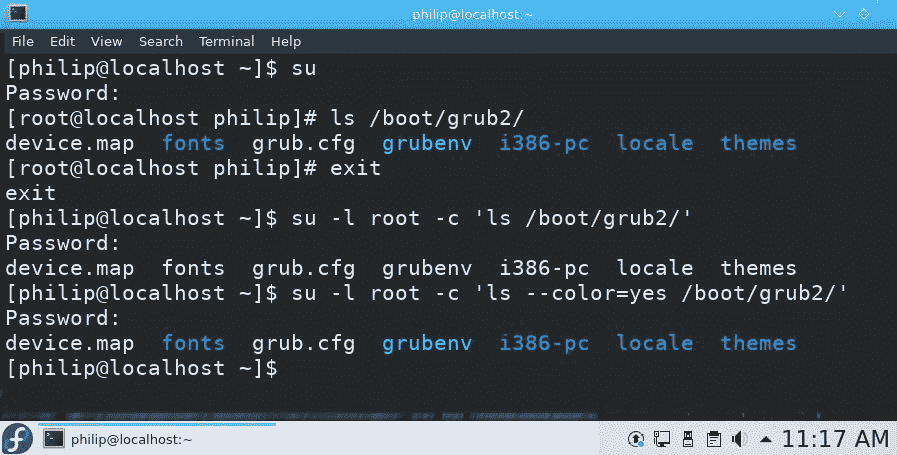
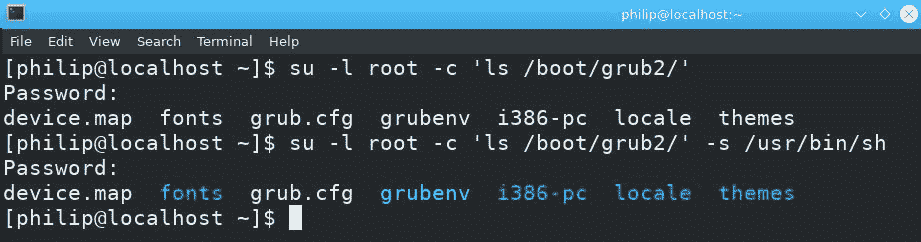
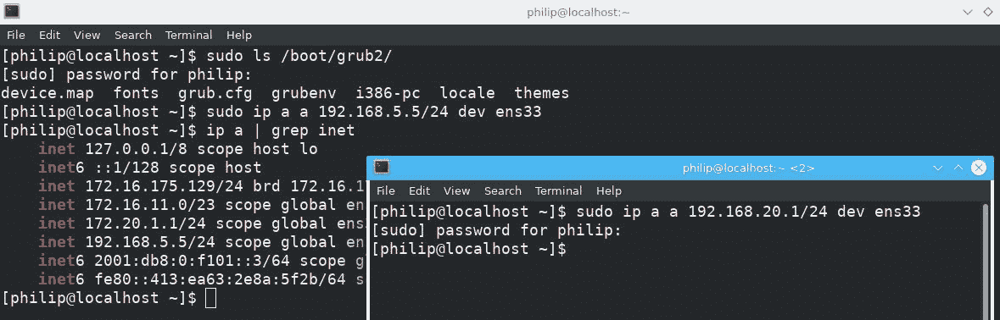
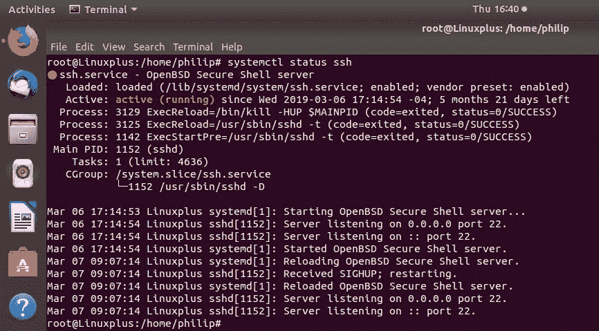
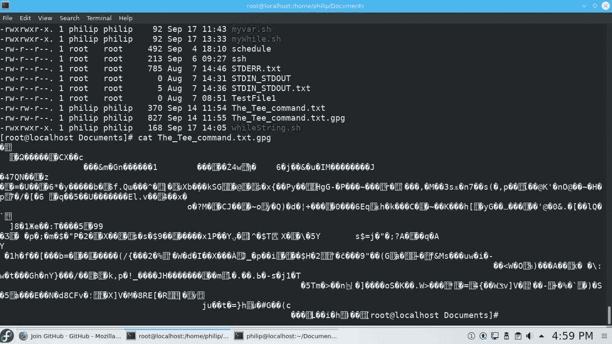

# 第十七章：执行管理安全任务

在上一章中，我们涵盖了 IPv4、IPv6、客户端 DNS 和网络故障排除。我们使用 IPv4 并讨论了 IPv4 路由，然后我们对 IPv6 做了同样的事情。这导致了客户端 DNS 和网络故障排除；我们涵盖了一些命令行工具，这些工具有助于排除潜在的网络连接问题。

在本章中，我们将专注于安全：主机安全、SSH 和加密。首先，我们将介绍主机安全；`/etc/sudoers`、`/etc/hosts.allow`和`/etc/.hosts.deny`文件将是我们的主要关注点。接下来，我们将使用 SSH。我们将专注于设置 SSH 所涉及的步骤，以及生成密钥的步骤。我们还将研究使用 SSH 登录到远程系统的步骤。此外，我们将使用各种可用的 SSH 文件。加密将是我们接下来的重点；我们将探讨加密和解密文件的方法。这将是一个重要的章节，涉及到保护 Linux 系统的安全。

本章我们将涵盖以下主题：

+   主机安全

+   SSH

+   加密

# 主机安全

在 Linux 中，我们可以执行一系列安全任务来保护我们的系统。到目前为止，我们一直以 root 用户的身份执行大部分管理任务。我们能否以普通用户的身份执行其中一些任务呢？我们可以使用普通用户帐户并赋予其某些 root 权限，而无需实际以 root 用户身份登录。这是通过`/etc/sudoers`文件实现的。在本演示中，我们将使用 Fedora 28 系统。如果我们尝试查看`/boot/grub2/`中的引导文件，将会看到以下内容：

```
[philip@localhost ~]$ ls /boot/grub2/
ls: cannot open directory '/boot/grub2/': Permission denied
[philip@localhost ~]$
```

根据前面的信息，用户没有足够的权限查看`/boot/grub2`的内容；我们收到了`Permission denied`的消息。此外，如果我们尝试进行更改（例如添加 IP 地址），将会看到以下内容：

```
[philip@localhost ~]$ ip a s ens33
2: ens33: <BROADCAST,MULTICAST,UP,LOWER_UP> mtu 1500 qdisc fq_codel state UP group default qlen 1000
 link/ether 00:0c:29:04:35:bd brd ff:ff:ff:ff:ff:ff
 inet 172.16.175.129/24 brd 172.16.175.255 scope global dynamic noprefixroute ens33
 valid_lft 1700sec preferred_lft 1700sec
 inet 172.16.11.0/23 scope global ens33
 valid_lft forever preferred_lft forever
 inet6 2001:db8:0:f101::3/64 scope global
 valid_lft forever preferred_lft forever
 inet6 fe80::413:ea63:2e8a:5f2b/64 scope link noprefixroute
 valid_lft forever preferred_lft forever
[philip@localhost ~]$ ip a a 10.20.1.1/24 dev ens33
RTNETLINK answers: Operation not permitted
[philip@localhost ~]$
```

根据前面的信息，我们将执行第一个命令——`IP`命令，使用`a`和`s`选项（`a`表示地址，`s`表示显示），但是当我们尝试添加 IP 地址时，会收到`Operation not permitted`的消息。消息会有所不同，具体取决于您尝试查看的内容，就像`ls`命令的情况一样，而不是在后面的演示中进行更改。

# su 命令

解决标准用户权限问题的一种技术是使用`su`命令；`su`表示**substitute user**。`su`命令的基本语法如下：

```
su <option>
```

根据前面的命令，我们还可以使用`su`命令而不使用任何选项，如下所示：

```
[philip@localhost ~]$ su
Password:
[root@localhost philip]#
```

太棒了！当我们使用`su`命令而不使用任何选项时，它会提示我们输入 root 密码，然后以 root 用户身份登录。但是，由于安全问题，这可能不是理想的做法。更好的方法是执行命令，但不要以 root 用户身份登录；这可以通过传递`-l`选项来实现，该选项需要用户帐户的名称，以及`-c`选项，该选项需要命令。以下命令显示了我们如何使用`su`命令有效地显示`/boot/grub2/`目录的内容，并同时以标准用户身份登录：

```
[philip@localhost ~]$ su -l root -c 'ls /boot/grub2/'
Password:
device.map  fonts  grub.cfg  grubenv  i386-pc  locale  themes
[philip@localhost ~]$
```

太棒了！`/boot/grub2/`目录的内容现在将被显示。但是，内容将以白色（除了白色）显示；我们可以传递`--color`选项来指示`ls`命令显示颜色，就像我们以 root 用户身份登录一样。如下所示：



太棒了！我们可以看到当省略`--color`选项时，与在 ls 命令中包括它相比的区别。此外，当命令之间有空格时，我们必须用单引号（'）括起整个命令。另一个有用的选项是`-s`选项；这告诉 su 命令使用用户提供的指定 shell，如下面的截图所示：



太棒了！当我们使用`-s`选项并指定了 shell（在我们的案例中是`/usr/sbin/sh`）时，我们不需要在 ls 命令中指定`--color`选项。

使用 su 命令的另一种方法是传递`-`选项，这意味着 root 用户，如下所示：

```
[philip@localhost ~]$ su - -c 'ls /boot/grub2/' -s /usr/bin/sh
Password:
device.map  fonts  grub.cfg  grubenv  i386-pc  locale  themes
[philip@localhost ~]$
```

完美！内容被显示出来，我们没有指定登录`root`。我们可以通过查看/etc/shells 文件来看到可用的 shell 列表，如下所示：

```
[philip@localhost ~]$ cat /etc/shells
/bin/sh
/bin/bash
/sbin/nologin
/usr/bin/sh
/usr/bin/bash
/usr/sbin/nologin
/usr/bin/tmux
/bin/tmux
[philip@localhost ~]$
```

太棒了！我们可以看到可以与 su 命令的`-s`选项一起使用的各种 shell。到目前为止，我们只查看了 su 命令的内容，但我们也可以对其进行更改。以下命令显示了我们如何使用 su 命令进行更改：

```
[philip@localhost ~]$ su - -c 'ip a a 172.20.1.1/24 dev ens33'
Password:
[philip@localhost ~]$ ip a s ens33 | grep inet
 inet 172.16.175.129/24 brd 172.16.175.255 scope global dynamic noprefixroute ens33
 inet 172.16.11.0/23 scope global ens33
 inet 172.20.1.1/24 scope global ens33
 inet6 2001:db8:0:f101::3/64 scope global
 inet6 fe80::413:ea63:2e8a:5f2b/64 scope link noprefixroute
[philip@localhost ~]$
```

太棒了！IP 地址已成功添加。

使用 su 命令的一个主要缺点是，每个用户都必须知道 root 密码才能执行它。

# sudo 命令

sudo 命令解决了普通用户需要 root 密码的困境，只要用户帐户位于/etc/sudoers 配置文件中。sudo 命令的基本语法如下：

```
sudo <command>
```

除了前面的命令，我们只需指定要执行的命令，这通常需要 root 权限。让我们尝试 sudo 命令，如下所示：

```
[philip@localhost ~]$ sudo ls /boot/grub2/
[sudo] password for philip:
device.map  fonts  grub.cfg  grubenv  i386-pc  locale  themes
[philip@localhost ~]$
```

太棒了！当我们执行 sudo 命令并传递需要 root 权限的命令时，我们会提示输入标准用户的密码，而不是 root 用户的密码。之后，我们可以传递另一个带有 sudo 命令的命令，我们不会被提示输入密码，如下面的代码片段所示：

```
[philip@localhost ~]$ sudo ip a a 192.168.5.5/24 dev ens33
[philip@localhost ~]$ ip a | grep inet
 inet 127.0.0.1/8 scope host lo
 inet6 ::1/128 scope host
 inet 172.16.175.129/24 brd 172.16.175.255 scope global dynamic noprefixroute ens33
 inet 172.16.11.0/23 scope global ens33
 inet 172.20.1.1/24 scope global ens33
 inet 192.168.5.5/24 scope global ens33
 inet6 2001:db8:0:f101::3/64 scope global
 inet6 fe80::413:ea63:2e8a:5f2b/64 scope link noprefixroute
[philip@localhost ~]$
```

太棒了！命令成功执行，而不需要用户的密码。这是可能的，因为有一个超时设置，保存了用户的密码；超时后，我们将被提示再次输入用户的密码。然而，在用户打开另一个终端的情况下，情况并非如此，如下面的截图所示：



太棒了！我们可以看到超时值不会影响新的终端，因为用户被提示输入他们的密码。

有时我们可能希望增加超时值，特别是当我们要长时间工作时。放心，我们可以通过在/etc/sudoers 文件中搜索 env_reset 并在其旁边附加 timestamp_timeout 选项来增加超时值。/etc/sudoers 文件的内容如下：

```
## Sudoers allows particular users to run various commands as
## the root user, without needing the root password.
## This file must be edited with the 'visudo' command.
## Host Aliases
## Groups of machines. You may prefer to use hostnames (perhaps using
## wildcards for entire domains) or IP addresses instead.
# Host_Alias     FILESERVERS = fs1, fs2
# Host_Alias     MAILSERVERS = smtp, smtp2
## User Aliases
## These aren't often necessary, as you can use regular groups
## (ie, from files, LDAP, NIS, etc) in this file - just use %groupname
## rather than USERALIAS
# User_Alias ADMINS = jsmith, mikem
## Command Aliases
## These are groups of related commands...
## Networking
# Cmnd_Alias NETWORKING = /sbin/route, /sbin/ifconfig, /bin/ping, /sbin/dhclient, /usr/bin/net, /sbin/iptables, /usr/bin/rfcomm, /usr/bin/wvdial, /sbin/iwconfig, /sbin/mii-tool
## Installation and management of software
Defaults    env_reset
Defaults    env_keep =  "COLORS DISPLAY HOSTNAME HISTSIZE KDEDIR LS_COLORS"
## Allow root to run any commands anywhere
root       ALL=(ALL)            ALL
## Allows people in group wheel to run all commands
%wheel                ALL=(ALL)            ALL
## Same thing without a password
# %wheel            ALL=(ALL)            NOPASSWD: ALL
#includedir /etc/sudoers.d
[philip@localhost ~]$
```

在前面的代码中，为了简洁起见，省略了一些输出。我们可以更改许多选项。例如，要增加超时值，我们可以使用 visudo 编辑/etc/sudoers；强烈建议不要使用 visudo 之外的任何编辑器，如下所示：

```
[philip@localhost ~]$ sudo cat /etc/sudoers | grep env_reset
Defaults    env_reset,timestamp_timeout=60
[philip@localhost ~]$
```

太棒了！我们添加了`timestamp_timeout=60`；这告诉 sudo 保存用户的密码 60 分钟。另一个有用的选项是在用户输入密码时显示输出；可以显示用户输入的每个按键的星号（*）。这是通过在 env_reset 选项旁边附加 pwfeedback 选项来实现的，如下所示：

```
[philip@localhost ~]$ sudo cat /etc/sudoers | grep env_reset
Defaults    env_reset,timestamp_timeout=60,pwfeedback
[philip@localhost ~]$
```

根据前面的命令，当用户首次尝试使用 sudo 命令时，密码将用星号表示，如下所示：

```
[philip@localhost ~]$ sudo ls /boot/grub2/
[sudo] password for philip: *******
device.map  fonts  grub.cfg  grubenv  i386-pc  locale  themes
[philip@localhost ~]$
```

太棒了！我们现在可以看到代表输入密码的星号。

当我们添加新用户时，新用户不会自动添加到/etc/sudoers 文件中。我们必须手动添加用户，如下所示：

```
[philip@localhost ~]$ sudo useradd teddy
[philip@localhost ~]$ sudo passwd teddy
Changing password for user teddy.
New password:
BAD PASSWORD: The password fails the dictionary check - it is based on a dictionary word
Retype new password:
passwd: all authentication tokens updated successfully.
[philip@localhost ~]$
```

现在，我们可以切换用户，要么通过在计算机上注销并重新登录，要么使用`su`命令，如下所示：

```
[philip@localhost ~]$ su teddy
Password:
[teddy@localhost philip]$
```

我们已经成功以新用户登录；现在，当我们尝试发出`sudo`命令时，结果将如下所示：

```
[teddy@localhost philip]$ sudo ls /boot/grub2/
We trust you have received the usual lecture from the local System
Administrator. It usually boils down to these three things:
 #1) Respect the privacy of others.
 #2) Think before you type.
 #3) With great power comes great responsibility.
[sudo] password for teddy:
teddy is not in the sudoers file.  This incident will be reported.
[teddy@localhost philip]$
```

我们收到了一条通知消息，但当我们输入新用户的密码时，我们收到了可怕的`teddy 不在 sudoers 文件中`消息，以及`此事件将被报告`。这基本上告诉我们，我们必须将新用户添加到`/etc/sudoer`文件中。有多种方法可以做到这一点；其中一种可能是最简单的方法是将新用户添加到`wheel`组。`wheel`组可以执行所有命令，如在`/etc/sudoer`文件中所示：

```
[philip@localhost ~]$ sudo cat /etc/sudoers | grep wheel
## Allows people in group wheel to run all commands
%wheel                ALL=(ALL)            ALL
# %wheel            ALL=(ALL)            NOPASSWD: ALL
[philip@localhost ~]$
```

如您所见，`wheel`组存在，并具有完全访问权限；我们可以使用`usermod`命令并传递`-a`和`-G`选项（`a`表示追加，`G`表示组），如下所示：

```
[philip@localhost ~]$ usermod -aG wheel teddy
usermod: Permission denied.
usermod: cannot lock /etc/passwd; try again later.
[philip@localhost ~]$
```

我们需要 root 权限来修改另一个用户的属性；我们可以使用`sudo`命令，如下所示：

```
[philip@localhost ~]$ sudo usermod -aG wheel teddy
[philip@localhost ~]$ su teddy
Password:
 [teddy@localhost philip]$ sudo ls /boot/grub2/
[sudo] password for teddy: 
device.map  fonts  grub.cfg  grubenv  i386-pc  locale  themes
[teddy@localhost philip]$
```

太棒了！新用户现在可以使用`sudo`命令。让我们来看看在`/etc/sudoer`中添加条目的语法，如下所示：

```
[teddy@localhost philip]$ sudo cat /etc/sudoers | grep %
%wheel                ALL=(ALL)           ALL
[teddy@localhost philip]$
Based on the above, the syntax for an entry is as follows:
<user/group> <system/ALL> = <effective user/ALL> <command(s)>
```

我们可以为特定用户或组定义一个条目（在组名前面必须加上`%`）；然后我们可以指定要为哪个系统添加条目，要允许哪个用户执行命令，最后是实际的命令。让我们试试；我们将从新用户中删除`wheel`组，并为新用户创建一个条目，如下所示：

```
[philip@localhost ~]$ sudo usermod -G "" teddy
[philip@localhost ~]$ groups teddy
teddy : teddy
[philip@localhost ~]$ sudo cat /etc/sudoers | grep teddy
teddy ALL=(ALL) /usr/sbin/ls
[philip@localhost ~]$
```

太棒了！我们已经限制了新用户只能执行`ls`和`cat`命令；可以通过以下方式证明：

```
[philip@localhost ~]$ su teddy
Password:
[teddy@localhost philip]$ sudo ls /boot/grub2/
device.map  fonts  grub.cfg  grubenv  i386-pc  locale  themes
[teddy@localhost philip]$ sudo cat /etc/resolv.conf
Sorry, user teddy is not allowed to execute '/usr/bin/cat /etc/resolv.conf' as root on localhost.localdomain.
[teddy@localhost philip]$
```

太棒了！新用户只能以 root 权限使用`ls`命令，并且无法使用`sudo`命令进行任何其他更改。此外，我们可以授予新用户执行我们指定的尽可能多的命令的能力，如下所示：

```
[philip@localhost ~]$ sudo cat /etc/sudoers | grep teddy
teddy    ALL=(ALL)            /usr/bin/ls,         /usr/bin/cat
[philip@localhost ~]$
[teddy@localhost philip]$ sudo ls /boot/grub2/
device.map  fonts  grub.cfg  grubenv  i386-pc  locale  themes
[teddy@localhost philip]$ sudo cat /etc/resolv.conf
# Generated by NetworkManager
nameserver 8.8.8.8
[teddy@localhost philip]$
[teddy@localhost philip]$ sudo ip a a 172.16.20.1/24 dev ens33
Sorry, user teddy is not allowed to execute '/usr/sbin/ip a a 172.16.20.1/24 dev ens33' as root on localhost.localdomain.
[teddy@localhost philip]$
```

太棒了！我们为新用户添加了`cat`命令，使新用户能够以 root 权限执行`cat`命令。要记住的一件事是，当将多个命令放在一起时，必须在命令之间按*Tab*键放置制表符。我们可以与`sudo`命令一起使用的另一个选项是`-l`选项；这将列出当前用户的权限，如下所示：

```
[philip@localhost ~]$ sudo -l
Matching Defaults entries for philip on localhost:
 !visiblepw, env_reset, timestamp_timeout=60, pwfeedback, env_keep="COLORS DISPLAY HOSTNAME HISTSIZE KDEDIR LS_COLORS", env_keep+="MAIL PS1 PS2
 QTDIR USERNAME LANG LC_ADDRESS LC_CTYPE", env_keep+="LC_COLLATE LC_IDENTIFICATION LC_MEASUREMENT LC_MESSAGES", env_keep+="LC_MONETARY LC_NAME
 LC_NUMERIC LC_PAPER LC_TELEPHONE", env_keep+="LC_TIME LC_ALL LANGUAGE LINGUAS _XKB_CHARSET XAUTHORITY",
secure_path=/usr/local/sbin\:/usr/local/bin\:/usr/sbin\:/usr/bin\:/sbin\:/bin
User philip may run the following commands on localhost:
 (ALL) ALL
[philip@localhost ~]$
```

如您所见，用户`philip`可以使用`sudo`命令运行所有命令。但是，如果我们对其他用户`teddy`运行带有`-l`的`sudo`命令，我们将看到用户的访问权限，如下所示：

```
[teddy@localhost philip]$ sudo -l
[sudo] password for teddy: 
Matching Defaults entries for teddy on localhost:
 !visiblepw, env_reset, timestamp_timeout=60, pwfeedback, env_keep="COLORS DISPLAY HOSTNAME HISTSIZE KDEDIR LS_COLORS", env_keep+="MAIL PS1 PS2
 QTDIR USERNAME LANG LC_ADDRESS LC_CTYPE", env_keep+="LC_COLLATE LC_IDENTIFICATION LC_MEASUREMENT LC_MESSAGES", env_keep+="LC_MONETARY LC_NAME
 LC_NUMERIC LC_PAPER LC_TELEPHONE", env_keep+="LC_TIME LC_ALL LANGUAGE LINGUAS _XKB_CHARSET XAUTHORITY",
secure_path=/usr/local/sbin\:/usr/local/bin\:/usr/sbin\:/usr/bin\:/sbin\:/bin
User teddy may run the following commands on localhost:
 (ALL) /usr/bin/ls, /usr/bin/cat
[teddy@localhost philip]$
```

太棒了！我们只能看到`teddy`可以以 root 权限执行两个命令。还可以使用`-u`选项传递用户名，并指定要使用`sudo`执行的命令，如下所示：

```
[philip@localhost ~]$ sudo -u teddy cat /etc/resolv.conf
# Generated by NetworkManager
nameserver 8.8.8.8
[philip@localhost ~]$ sudo -u teddy ip a a 10.10.10.10/24 dev ens33
RTNETLINK answers: Operation not permitted
[philip@localhost ~]$
```

太棒了！另一个有用的选项是`-v`，它将重置用户的身份验证超时，如下所示：

```
[philip@localhost ~]$ sudo -v
[philip@localhost ~]$
```

类似地，可以通过使用`sudo`传递`-k`选项立即终止身份验证会话，如下所示：

```
[philip@localhost ~]$ sudo -k
[philip@localhost ~]$ sudo ls /boot/grub2/
[sudo] password for philip: 
device.map  fonts  grub.cfg  grubenv  i386-pc  locale  themes
[philip@localhost ~]$
```

太棒了！在前面的代码中，用户在尝试使用`-k`选项执行`sudo`命令时必须提供他们的密码。

到目前为止，我们在第一次执行`sudo`时一直提供用户的密码；可以在不输入密码的情况下运行`sudo`。我们在为新用户添加的条目中添加`NOPASSWD`选项，如下所示：

```
[philip@localhost ~]$ sudo cat /etc/sudoers | grep teddy
teddy    ALL=(ALL)            NOPASSWD:/usr/bin/ls,               /usr/bin/cat
[philip@localhost ~]$
[philip@localhost ~]$ su teddy
Password:
[teddy@localhost philip]$ sudo cat /etc/resolv.conf
# Generated by NetworkManager
nameserver 8.8.8.8
[teddy@localhost philip]$ sudo ls /boot/grub2/
device.map  fonts  grub.cfg  grubenv  i386-pc  locale  themes
[teddy@localhost philip]$
```

太棒了！每当用户`teddy`尝试执行`sudo`命令时，他们将不再被提示输入密码。

# TCP 包装

我们可以通过使用 TCP 包装在 Linux 系统中添加另一层安全性。**TCP 包装**在流入系统时过滤流量。 TCP 包装检查流量与两个文件：`/etc/hosts.allow`和`/etc/hosts.deny`。规则采用自上而下的方式应用，这意味着始终先应用第一条规则。我们可以查看`/etc/hosts.allow`的内容，如下所示：

```
[philip@localhost ~]$ cat /etc/hosts.allow
#
# hosts.allow  This file contains access rules which are used to
# allow or deny connections to network services that
# either use the tcp_wrappers library or that have been
# started through a tcp_wrappers-enabled xinetd.
# See 'man 5 hosts_options' and 'man 5 hosts_access'
# for information on rule syntax.
# See 'man tcpd' for information on tcp_wrappers
#
[philip@localhost ~]$
```

该文件只包含以`#`开头的注释。创建规则的基本语法如下：

```
<daemon>:        <client list> [:<option>: <option>:…]      
```

我们可以使用文本编辑器（如 vi 或 nano）添加规则，如下所示：

```
[philip@localhost ~]$ sudo cat /etc/hosts.allow
#
vsftpd:                  172.16.175.
[philip@localhost ~]$
```

在上述命令中，我们为`vsftpd`添加了一个规则；这是 FTP 的安全版本。然后我们指定了客户端列表——子网`172.16.175.`。`.`表示该子网中的任何 IP 地址都可以访问`vsftpd`。定义规则的另一种方法是指定域，如下所示：

```
[philip@localhost ~]$ sudo cat /etc/hosts.allow
#
vsftpd:                  .packtpub.com
[philip@localhost ~]$
```

太棒了！`.packtpub.com`内的任何人都可以访问本地系统上的`vsftpd`。此外，我们可以在规则中使用关键字`ALL`；这匹配一切，并且可以放在守护程序或客户端列表部分，如下所示：

```
[philip@localhost ~]$ sudo cat /etc/hosts.allow
vsftpd:                  .packtpub.com
in.telnetd:           ALL
[philip@localhost ~]$
```

太棒了！每个人都可以访问本地系统上的 Telnet 服务。还可以通过传递`spawn`选项来执行另一个命令。当我们想要记录谁正在尝试访问本地系统上的特定服务时，这是有用的。我们使用`spawn`选项如下：

```
[philip@localhost ~]$ sudo cat /etc/hosts.allow
vsftpd:                  .packtpub.com: spawn /bin/echo `/bin/date` from %h>>/var/log/vsftp.log : allow
in.telnetd:           ALL
[philip@localhost ~]$
```

太棒了！`spawn`选项创建一个包含当前日期（`/bin/date`）的消息，然后将其附加到尝试访问`vsftpd`的系统的主机名（`%h`）中；然后将其附加到`/var/log/vsftp.log`中。然后我们可以查看`/etc/hosts.deny`文件，如下所示：

```
[philip@localhost ~]$ sudo cat /etc/hosts.deny
# hosts.deny   This file contains access rules which are used to
#              deny connections to network services that either use
#              the tcp_wrappers library or that have been
#              The rules in this file can also be set up in
#              /etc/hosts.allow with a 'deny' option instead.
#              See 'man 5 hosts_options' and 'man 5 hosts_access'
#              for information on rule syntax.
#              See 'man tcpd' for information on tcp_wrappers
 [philip@localhost ~]$
```

在上述命令中，`/etc/hosts.deny`只包含注释（`#`）。建议在此文件中拒绝一切，如下所示：

```
[philip@localhost ~]$ sudo cat /etc/hosts.deny
ALL:ALL
[philip@localhost ~]$
```

太棒了！我们指定了`ALL:ALL:`，以拒绝除`/etc/hosts.allow`中列出的规则之外的所有内容。

# SSH

我们主要使用 SSH 来安全登录到远程系统。大多数 Linux 发行版默认安装了 SSH 软件包。为了验证 SSH 是否正在运行，我们使用`systemctl`命令；我们传递`status`选项，如下所示：



SSH 守护程序`ssh.service`目前正在运行（特别是安全外壳服务器）。我们可以使用的另一种验证 SSH 服务是否正在运行的方法是`netstat`命令；我们传递`ntlp`选项（`n`用于显示端口号，`t`用于 TCP 协议，`l`用于当前监听，`p`用于程序 ID/程序名称），如下所示：

```
root@Linuxplus:/home/philip# netstat -ntlp
Active Internet connections (only servers)
Proto Recv-Q Send-Q Local Address Foreign Address State       PID/Program name 
tcp  0   0  0.0.0.0:514     0.0.0.0:*  LISTEN  519/rsyslogd 
tcp  0   0  127.0.0.53:53   0.0.0.0:*  LISTEN  431/systemd-resolve
tcp  0   0  0.0.0.0:22      0.0.0.0:*  LISTEN  1152/sshd 
tcp  0   0  127.0.0.1:631   0.0.0.0:*  LISTEN  2638/cupsd 
tcp6 0   0  :::514          :::*       LISTEN  519/rsyslogd 
tcp6 0   0  :::22           :::*       LISTEN  1152/sshd 
tcp6 0   0  ::1:631         :::*       LISTEN  2638/cupsd 
root@Linuxplus:/home/philip#
```

正如您所看到的，SSH 服务器守护程序目前正在 TCP 端口`22`上运行。建立与远程系统的连接的基本语法如下：

```
ssh <remote system>
```

我们只需运行`ssh`命令并仅传递远程系统；我们将从 Fedora 28 系统使用`ssh`命令并尝试连接到 Ubuntu 18 系统，如下所示：

```
 [philip@localhost ~]$ ssh 172.16.175.130
The authenticity of host '172.16.175.130 (172.16.175.130)' can't be established.
ECDSA key fingerprint is SHA256:SfI3vfS3yRRWSGN2jgAG7K5aQc65c/zVt/lz+D8mQBQ.
ECDSA key fingerprint is MD5:a2:03:c5:38:b3:83:88:fa:85:b5:5f:e6:91:eb:87:c1.
Are you sure you want to continue connecting (yes/no)?yes
Warning: Permanently added '172.16.175.130' (ECDSA) to the list of known hosts.
philip@172.16.175.130's password:
Welcome to Ubuntu 18.04 LTS (GNU/Linux 4.15.0-20-generic x86_64)
 * Documentation:  https://help.ubuntu.com
 * Management:     https://landscape.canonical.com
 * Support:        https://ubuntu.com/advantage
Ubuntu comes with ABSOLUTELY NO WARRANTY, to the extent permitted by
applicable law.
philip@Linuxplus:~$
```

在上述命令中，为简洁起见省略了一些输出。如果您指定不带任何选项的命令，SSH 程序将使用当前用户`philip`，并显示服务器的指纹。这将在 Fedora 28 系统中的`~/.ssh/known_hosts`中添加用户`philip`。我们可以查看文件，如下所示：

```
[philip@localhost ~]$ cat .ssh/known_hosts
172.16.175.130 ecdsa-sha2-nistp256 AAAAE2VjZHNhLXNoYTItbmlzdHAyNTYAAAAIbmlzdHAyNTYAAABBBPhEHNo6YSOE+ZZ9vHVmQqBPFQd8WtAUFoGYAJe3VPQJlhjhc9bxy+vwsetQiEIKTyMgnfrOC7LNbhxxmJ4IX8w=
[philip@localhost ~]$
```

太棒了！我们在 Fedora 28 系统上的用户`philip`的`~/.ssh/known_hosts`中有 Ubuntu 系统的信息。还可以使用`ssh`命令使用不同的用户名；我们指定`-l`选项，如下所示：

```
[philip@localhost ~]$ ssh -l hacker 172.16.175.130
hacker@172.16.175.130's password:
Welcome to Ubuntu 18.04 LTS (GNU/Linux 4.15.0-20-generic x86_64)
$ exit
Connection to 172.16.175.130 closed.
[philip@localhost ~]$
```

我们能够使用不同的用户通过 SSH 登录。还要注意，我们收到了之前识别服务器指纹的消息。这是因为信息先前存储在`~/.ssh/known_hosts`中。如果我们使用文本编辑器（如 vi 或 nano）删除内容，我们将再次收到身份验证消息，如下所示：

```
[philip@localhost ~]$ cat .ssh/known_hosts
[philip@localhost ~]$
[philip@localhost ~]$ ssh -l hacker 172.16.175.130
The authenticity of host '172.16.175.130 (172.16.175.130)' can't be established.
ECDSA key fingerprint is SHA256:SfI3vfS3yRRWSGN2jgAG7K5aQc65c/zVt/lz+D8mQBQ.
ECDSA key fingerprint is MD5:a2:03:c5:38:b3:83:88:fa:85:b5:5f:e6:91:eb:87:c1.
Are you sure you want to continue connecting (yes/no)? yes
Warning: Permanently added '172.16.175.130' (ECDSA) to the list of known hosts.
hacker@172.16.175.130's password:
Welcome to Ubuntu 18.04 LTS (GNU/Linux 4.15.0-20-generic x86_64)
[philip@localhost ~]$
```

太棒了！我们删除了内容，然后再次收到了身份验证消息。

到目前为止，每次我们尝试启动 SSH 会话时都会提示输入密码。但是，可以绕过密码提示并无阻碍地登录到系统。我们使用 SSH 密钥进行身份验证；这被称为**基于密钥的身份验证**。基于密钥的身份验证涉及创建一对密钥：私钥和公钥。私钥存储在客户端系统上，公钥存储在目标系统上。特别是，我们使用`ssh-keygen`命令在目标系统上生成 SSH 密钥。接下来，我们将客户端系统上的密钥复制过去；我们使用`ssh-copy-id`命令复制密钥。当您首次使用基于密钥的身份验证连接时，服务器会使用公钥向客户端系统传输一条消息，然后可以使用客户端系统上的私钥来解释这条消息。

让我们使用`ssh-keygen`命令在我们需要登录的客户端系统上生成 SSH 密钥；这将是 Fedora 28 系统，如下所示：

```
[philip@localhost ~]$ ssh-keygen
Generating public/private rsa key pair.
Enter file in which to save the key (/home/philip/.ssh/id_rsa):
```

默认情况下，算法是`rsa`，存储密钥对的位置在当前用户的主目录中（`~/.ssh/id_rsa`）。我们接受默认值并按*Enter*，如下所示：

```
[philip@localhost ~]$ ssh-keygen
Generating public/private rsa key pair.
Enter file in which to save the key (/home/philip/.ssh/id_rsa):
Enter passphrase (empty for no passphrase):
Enter same passphrase again:
```

我们必须指定一个`passphrase`；我们将使用一个超级秘密的`passphrase`，然后按*Enter*，如下所示：

```
[philip@localhost ~]$ ssh-keygen
Generating public/private rsa key pair.
Enter file in which to save the key (/home/philip/.ssh/id_rsa):
Enter passphrase (empty for no passphrase):
Enter same passphrase again:
Your identification has been saved in /home/philip/.ssh/id_rsa.
Your public key has been saved in /home/philip/.ssh/id_rsa.pub.
The key fingerprint is:
SHA256:BwdFiHu2iEyvnnXhnY+1tNpZmlaZZdL1Zugwda9PJ7g philip@localhost.localdomain
The key's randomart image is:
+---[RSA 2048]----+
|       ..+o      |
|      . ..    . o|
|       .. .  . ++|
|    . . oo  o o O|
|   o o +S..  = X |
|    o o..+ .. B o|
|     .. o o oo.+.|
|    .o .   *EB  .|
|   .o     ooO    |
+----[SHA256]-----+
[philip@localhost ~]$
```

太棒了！密钥是使用 2,048 位密钥大小生成的。现在，我们可以在用户的主目录上运行`ls`命令，并查看`~/.ssh`目录中的内容，如下所示：

```
[philip@localhost ~]$ ls -a .ssh
.  ..  id_rsa  id_rsa.pub  known_hosts
[philip@localhost ~]$
```

太棒了！除了我们之前介绍的`known_hosts`文件之外，我们现在有两个额外的文件：`id_rsa`（这是私钥）和`id_rsa.pub`（这是公钥）。我们可以使用`cat`命令查看内容：

```
[philip@localhost ~]$ cat ~/.ssh/id_rsa.pub
ssh-rsa AAAAB3NzaC1yc2EAAAADAQABAAABAQDNvsCDZaUs6mralW+c1QnQ9cMeUqW0c/4IF8DThVK0Bi4CPnQApafJZrOyeQeJbLxORCJf+YLkE+DWREwJw0EU21PkiZeij0DEIlspqToo6BkKDPfXXCl35OQxSUXERlAhGQQpVSbEJLy0WZsbs6iAy4ohmKcCWeEdHLz/3p0VUyd3NHvXaLsyno/Qa2ZOBOOZgwUeHUA/p0zykUff7M4kIyGYatt1/vYKDH+UOC5fyB/nLtvrq7P1MrlfMGyEjtc7nFDEHz4VeAP1iUItKEzsyrqEH/KbAa3/ZeSoSfaFxoKvEtSKF5tnICyVp6uiUTNfi/cN74dmiDfG+vtcF0nt philip@localhost.localdomain
[philip@localhost ~]$
```

太棒了！下一步是使用`ssh-copy-id`命令将客户端系统的公钥复制到目标服务器，我们的情况下，服务器是 Ubuntu 系统。在运行`ssh-copy-id`命令之前，让我们检查一下 Ubuntu 系统上的`~/.ssh`目录，如下所示：

```
philip@Linuxplus:~$ ls -a ~/.ssh
.  ..
philip@Linuxplus:~$
```

如您所见，`~/.ssh`目前是空的。现在，让我们在客户端系统上执行`ssh-copy-id`命令，如下所示：

```
[philip@localhost ~]$ ssh-copy-id philip@172.16.175.130
/usr/bin/ssh-copy-id: INFO: Source of key(s) to be installed: "/home/philip/.ssh/id_rsa.pub"
/usr/bin/ssh-copy-id: INFO: attempting to log in with the new key(s), to filter out any that are already installed
/usr/bin/ssh-copy-id: INFO: 1 key(s) remain to be installed -- if you are prompted now it is to install the new keys
philip@172.16.175.130's password:
Number of key(s) added: 1
Now try logging into the machine, with:   "ssh 'philip@172.16.175.130'"
and check to make sure that only the key(s) you wanted were added.
[philip@localhost ~]$
```

太棒了！公钥`~/.ssh/id_rsa.pub`已安全传输到服务器系统。现在，让我们再次检查 Ubuntu 系统上的`~/.ssh`目录，如下所示：

```
philip@Linuxplus:~$ ls -a ~/.ssh
.  ..  authorized_keys
philip@Linuxplus:~$
```

太棒了！我们现在有一个`authorized_keys`文件，位于`~/.ssh`目录中。我们可以使用`cat`命令验证公钥是否与客户端系统上的公钥相同，如下所示：

```
philip@Linuxplus:~$ cat ~/.ssh/authorized_keys
ssh-rsa AAAAB3NzaC1yc2EAAAADAQABAAABAQDNvsCDZaUs6mralW+c1QnQ9cMeUqW0c/4IF8DThVK0Bi4CPnQApafJZrOyeQeJbLxORCJf+YLkE+DWREwJw0EU21PkiZeij0DEIlspqToo6BkKDPfXXCl35OQxSUXERlAhGQQpVSbEJLy0WZsbs6iAy4ohmKcCWeEdHLz/3p0VUyd3NHvXaLsyno/Qa2ZOBOOZgwUeHUA/p0zykUff7M4kIyGYatt1/vYKDH+UOC5fyB/nLtvrq7P1MrlfMGyEjtc7nFDEHz4VeAP1iUItKEzsyrqEH/KbAa3/ZeSoSfaFxoKvEtSKF5tnICyVp6uiUTNfi/cN74dmiDfG+vtcF0nt philip@localhost.localdomain
philip@Linuxplus:~$
```

太棒了！最后一步是在客户端系统（Fedora 28）上运行`ssh`命令，并验证我们能够登录到服务器（Ubuntu 18）而不使用密码，如下所示：

```
[philip@localhost ~]$ ssh 172.16.175.130
Enter passphrase for key '/home/philip/.ssh/id_rsa':
Welcome to Ubuntu 18.04 LTS (GNU/Linux 4.15.0-20-generic x86_64)
Last login: Thu Sep 13 16:47:50 2018 from 172.16.175.129
philip@Linuxplus:~$
```

```
ssh-add command:
```

```
[philip@localhost ~]$ ssh-agent
SSH_AUTH_SOCK=/tmp/ssh-qLovqqH69q1D/agent.79449; export SSH_AUTH_SOCK;
SSH_AGENT_PID=79450; export SSH_AGENT_PID;
echo Agent pid 79450;
 [philip@localhost ~]$
```

太棒了！我们启动了`ssh agent`，它创建了必要的变量并启动了进程。接下来，我们将使用`ssh-add`命令和`-l`选项运行；这将列出`ssh agent`知道的所有身份，如下所示：

```
[philip@localhost ~]$ ssh-add -l
The agent has no identities.
[philip@localhost ~]$
```

如您在上述命令中所见，代理没有已知的身份；我们现在将使用`ssh-add`命令添加我们之前创建的身份，不带任何选项，如下所示：

```
[philip@localhost ~]$ ssh-add
Enter passphrase for /home/philip/.ssh/id_rsa:
Identity added: /home/philip/.ssh/id_rsa (/home/philip/.ssh/id_rsa)
[philip@localhost ~]$ ssh-add -l
2048 SHA256:BwdFiHu2iEyvnnXhnY+1tNpZmlaZZdL1Zugwda9PJ7g /home/philip/.ssh/id_rsa (RSA)
[philip@localhost ~]$
```

太棒了！您现在可以看到我们之前生成的私钥的身份。现在，我们将尝试启动 SSH 会话，如下所示：

```
[philip@localhost ~]$ ssh 172.16.175.130
Welcome to Ubuntu 18.04 LTS (GNU/Linux 4.15.0-20-generic x86_64)
Last login: Fri Sep 14 10:06:44 2018 from 172.16.175.129
philip@Linuxplus:~$ exit
[philip@localhost ~]$
```

太棒了！我们成功登录，而无需输入用户密码或`passphrase`。SSH 配置存储在`/etc/ssh/ssh_config`中：

```
philip@localhost ~]$ cat /etc/ssh/ssh_config
# $OpenBSD: ssh_config,v 1.33 2017/05/07 23:12:57 djm Exp $
# IdentityFile ~/.ssh/id_dsa
# IdentityFile ~/.ssh/id_ecdsa
# IdentityFile ~/.ssh/id_ed25519
# Port 22
# Protocol 2
#   Ciphers aes128-ctr,aes192-ctr,aes256-ctr,aes128-cbc,3des-cbc
#   MACs hmac-md5,hmac-sha1,umac-64@openssh.com
#   EscapeChar ~
#   Tunnel no
#   TunnelDevice any:any
# To modify the system-wide ssh configuration, create a  *.conf  file under
#  /etc/ssh/ssh_config.d/  which will be automatically included below
Include /etc/ssh/ssh_config.d/*.conf
[philip@localhost ~]$
```

在上述代码中，为了简洁起见，一些输出已被省略。所有设置都使用它们的默认值。

另一个保存`known_hosts`的位置是`/etc/ssh/known_hosts`；这允许管理员添加局域网内所有服务器的身份。这种方法可以防止每次新用户尝试启动 SSH 会话到服务器时出现身份验证消息。我们可以复制`~./ssh/known_hosts`的内容到`/etc/ssh/known_hosts`，如果我们尝试以另一个用户登录，我们将不会看到身份验证消息：

```
[philip@localhost ~]$ cat ~/.ssh/known_hosts
172.16.175.130 ecdsa-sha2-nistp256 AAAAE2VjZHNhLXNoYTItbmlzdHAyNTYAAAAIbmlzdHAyNTYAAABBBPhEHNo6YSOE+ZZ9vHVmQqBPFQd8WtAUFoGYAJe3VPQJlhjhc9bxy+vwsetQiEIKTyMgnfrOC7LNbhxxmJ4IX8w=
[philip@localhost ~]$ cat /etc/ssh/ssh_known_hosts
172.16.175.130 ecdsa-sha2-nistp256 AAAAE2VjZHNhLXNoYTItbmlzdHAyNTYAAAAIbmlzdHAyNTYAAABBBPhEHNo6YSOE+ZZ9vHVmQqBPFQd8WtAUFoGYAJe3VPQJlhjhc9bxy+vwsetQiEIKTyMgnfrOC7LNbhxxmJ4IX8w=
[philip@localhost ~]$
 [philip@localhost ~]$ ssh hacker@172.16.175.130
hacker@172.16.175.130's password:
Welcome to Ubuntu 18.04 LTS (GNU/Linux 4.15.0-20-generic x86_64)
$ exit
Connection to 172.16.175.130 closed.
[philip@localhost ~]$ ssh teddy@172.16.175.130
teddy@172.16.175.130's password:
[philip@localhost ~]$
```

很好。没有一个用户收到了身份验证消息。请注意，他们被提示输入各自的密码，因为我们只为`philip`用户设置了基于密钥的身份验证；我们必须为每个用户生成密钥。

# 加密

在当今的环境中，保护我们的数据至关重要。我们可以使用各种加密方法；在我们的环境中，我们将使用 GNU 隐私保护（GnuPG 或 GPG）来加密和解密我们的文件和文件夹。在进行加密和解密时，我们将使用 gpg 命令。

首先，我们将使用最基本的形式加密文件，即对称加密；这需要密码。以下命令显示了我们如何使用 gpg 命令执行对称加密，使用-c 或--symmetric 选项：

```
[philip@localhost ~]$ cd Documents/
[philip@localhost Documents]$ ls
date_schedule  lsa_schedule  ls.txt  schedule  ssh  STDERR.txt  STDIN_STDOUT  STDIN_STDOUT.txt  TestFile1  The_Tee_command.txt
[philip@localhost Documents]$ gpg -c The_Tee_command.txt
Enter passphrase:
```

我们必须输入密码/密码短语，然后重新输入，如下所示：

```
[philip@localhost Documents]$ gpg -c The_Tee_command.txt
Repeat passphrase:
[philip@localhost Documents]$
[philip@localhost Documents]$ ls -l | grep The
-rw-r--r--. 1 root   root   370 Aug  7 14:53 The_Tee_command.txt
-rw-rw-r--. 1 philip philip 307 Sep 14 11:01 The_Tee_command.txt.gpg
[philip@localhost Documents]$
```

太棒了！创建了一个带有.gpg 扩展名的新文件；这是加密文件。我们可以尝试使用 cat 命令查看内容：

```
[philip@localhost Documents]$ cat The_Tee_command.txt.gpg
```



内容已加密，我们现在可以删除原始内容，只留下加密内容，如下所示：

```
[philip@localhost Documents]$ rm The_Tee_command.txt
rm: remove write-protected regular file 'The_Tee_command.txt'? yes
[philip@localhost Documents]$ ls -l | grep The
-rw-rw-r--. 1 philip philip 307 Sep 14 11:01 The_Tee_command.txt.gpg
[philip@localhost Documents]$
```

现在，只剩下加密文件。我们可以通过传递-d 选项来解密此文件，如下所示：

```
[philip@localhost Documents]$ gpg -d The_Tee_command.txt.gpg
gpg: AES encrypted data
Enter passphrase:
```

我们必须提供密码来解密文件，如下所示：

```
[philip@localhost Documents]$ gpg -d The_Tee_command.txt.gpg
gpg: AES encrypted data
Enter passphrase:
gpg: AES encrypted data
gpg: encrypted with 1 passphrase
#
# hosts.allow This file contains access rules which are used to
#             allow or deny connections to network services that
#             either use the tcp_wrappers library or that have been
#             started through a tcp_wrappers-enabled xinetd.
#
#              See 'man 5 hosts_options' and 'man 5 hosts_access'
#              for information on rule syntax.
#              See 'man tcpd' for information on tcp_wrappers
#
[philip@localhost Documents]$ ls -l | grep The
-rw-rw-r--. 1 philip philip 307 Sep 14 11:01 The_Tee_command.txt.gpg
[philip@localhost Documents]$
```

太棒了！文件的内容被显示出来，但是，正如我们所看到的，当我们运行 ls 命令时，我们仍然只有加密文件，没有生成新文件。请放心；我们可以传递-o 选项将输出保存到文件中，如下所示：

```
[philip@localhost Documents]$ gpg -o The_Tee_command.txt -d The_Tee_command.txt.gpg
gpg: AES encrypted data
gpg: encrypted with 1 passphrase
[philip@localhost Documents]$ ls -l | grep The
-rw-rw-r--. 1 philip philip 370 Sep 14 11:10 The_Tee_command.txt
-rw-rw-r--. 1 philip philip 307 Sep 14 11:01 The_Tee_command.txt.gpg
[philip@localhost Documents]$
```

太棒了！现在，我们既有加密文件，也有未加密文件。

我们还可以使用私钥/公钥对进行加密和解密。首先，我们必须使用 gpg 命令和--gen-key 选项生成密钥对，如下所示：

```
[philip@localhost Documents]$ gpg --gen-key
gpg (GnuPG) 1.4.22; Copyright (C) 2015 Free Software Foundation, Inc.
This is free software: you are free to change and redistribute it.
There is NO WARRANTY, to the extent permitted by law.
Please select what kind of key you want:
 (1) RSA and RSA (default)
 (2) DSA and Elgamal
 (3) DSA (sign only)
 (4) RSA (sign only)
Your selection?
```

我们必须选择密钥类型，“RSA 和 RSA”是默认值；我们将接受默认值，如下所示：

```
RSA keys may be between 1024 and 4096 bits long.
```

我们还必须指定密钥的大小，默认值为 2048；我们将选择 4096，因为更长的密钥更安全：

```
What keysize do you want? (2048) 4096
Requested keysize is 4096 bits
Please specify how long the key should be valid.
 0 = key does not expire
 <n>  = key expires in n days
 <n>w = key expires in n weeks
 <n>m = key expires in n months
 <n>y = key expires in n years
Key is valid for? (0) 1y
```

我们还必须指定密钥何时过期，默认值为`0`，表示永不过期。我们将选择`1y`，表示一年后过期：

```
Key expires at Sat 14 Sep 2019 11:15:50 AM EDT
Is this correct? (y/N) y
You need a user ID to identify your key; the software constructs the user ID
from the Real Name, Comment and Email Address in this form:
 "Heinrich Heine (Der Dichter) <heinrichh@duesseldorf.de>"
Real name: Philip Inshanally
```

然后，我们必须确认过期日期并指定“真实姓名”；我们将按以下信息填写信息：

```
Email address: pinshanally@gmail.com
Comment: It's always good to help others
You selected this USER-ID:
 "Philip Inshanally (It's always good to help others) <pinshanally@gmail.com>"
Change (N)ame, (C)omment, (E)mail or (O)kay/(Q)uit?
```

现在我们必须通过输入`O`来确认，如下所示：

```
Change (N)ame, (C)omment, (E)mail or (O)kay/(Q)uit? O
You need a Passphrase to protect your secret key.
Repeat passphrase:
```

我们还必须保护我们的秘密密钥，如下所示：

```
We need to generate a lot of random bytes. It is a good idea to perform
some other action (type on the keyboard, move the mouse, utilize the
disks) during the prime generation; this gives the random number
generator a better chance to gain enough entropy.
.+++++
...+++++
We need to generate a lot of random bytes. It is a good idea to perform
some other action (type on the keyboard, move the mouse, utilize the
disks) during the prime generation; this gives the random number
generator a better chance to gain enough entropy.
...............+++++
...+++++
gpg: key 73941CF4 marked as ultimately trusted
public and secret key created and signed.
gpg: checking the trustdb
gpg: 3 marginal(s) needed, 1 complete(s) needed, PGP trust model
gpg: depth: 0  valid:   1  signed:   0  trust: 0-, 0q, 0n, 0m, 0f, 1u
gpg: next trustdb check due at 2019-09-14
pub   4096R/73941CF4 2018-09-14 [expires: 2019-09-14]
 Key fingerprint = 3C24 9577 0081 C03B 4D88  2D34 60E4 B83C 7394 1CF4
uid                  Philip Inshanally (It's always good to help others) <pinshanally@gmail.com>
sub   4096R/B29CE2BA 2018-09-14 [expires: 2019-09-14]
[philip@localhost Documents]$
```

太棒了！我们已成功生成了密钥对；我们可以通过使用 gpg 命令传递--list-keys 选项来验证这一点，如下所示：

```
[philip@localhost Documents]$ gpg --list-keys
/home/philip/.gnupg/pubring.gpg
-------------------------------
pub   4096R/73941CF4 2018-09-14 [expires: 2019-09-14]
uid                  Philip Inshanally (It's always good to help others) <pinshanally@gmail.com>
sub   4096R/B29CE2BA 2018-09-14 [expires: 2019-09-14]
[philip@localhost Documents]$
```

太棒了！正如您所看到的，我们的公钥信息在`/home/philip/.gnupg/pubring.gpg`中：

```
[philip@localhost Documents]$ ls -a ~/.gnupg/
.  ..  gpg.conf  pubring.gpg  pubring.gpg~  random_seed  secring.gpg  trustdb.gpg
[philip@localhost Documents]$
```

我们现在可以看到我们的公钥信息。接下来，我们将检查我们的私钥信息；我们将使用 gpg 命令传递--list-secret-keys 选项，如下所示：

```
[philip@localhost Documents]$ gpg --list-secret-keys
/home/philip/.gnupg/secring.gpg
-------------------------------
sec   4096R/73941CF4 2018-09-14 [expires: 2019-09-14]
uid                  Philip Inshanally (It's always good to help others) <pinshanally@gmail.com>
ssb   4096R/B29CE2BA 2018-09-14
[philip@localhost Documents]$
```

太棒了！我们可以看到有关私钥的信息；即私钥位于`/home/philip/.gnupg/secring.gpg`，如下所示：

```
[philip@localhost Documents]$ ls -a ~/.gnupg/
.  ..  gpg.conf  pubring.gpg  pubring.gpg~  random_seed  secring.gpg  trustdb.gpg
[philip@localhost Documents]$
```

太棒了！我们现在可以使用刚刚创建的公钥进行加密，通过 gpg 命令传递-r 选项，如下所示：

```
[philip@localhost Documents]$ gpg -e The_Tee_command.txt
You did not specify a user ID. (you may use "-r")
Current recipients:
Enter the user ID.  End with an empty line: pinshanally@gmail.com
Current recipients:
4096R/B29CE2BA 2018-09-14 "Philip Inshanally (It's always good to help others) <pinshanally@gmail.com>"
Enter the user ID.  End with an empty line:
File `The_Tee_command.txt.gpg' exists. Overwrite? (y/N) y
[philip@localhost Documents]$ ls
date_schedule  ls.txt    ssh         STDIN_STDOUT      TestFile1            The_Tee_command.txt.gpg
lsa_schedule   schedule  STDERR.txt  STDIN_STDOUT.txt  The_Tee_command.txt
[philip@localhost Documents]$
```

我们没有使用命令指定用户 ID，因此我们被提示指定用户 ID；然后我们按*Enter*移动到第二行，`输入用户 ID`。以空行结束：`""`，我们只需按*Enter*生成一个空行。之后，我们必须确认是否要覆盖之前加密的文件，当我们执行对称加密时。我们还可以使用`-r`选项指定`用户 ID`。让我们试一试：

```
[philip@localhost Documents]$ rm The_Tee_command.txt.gpg
[philip@localhost Documents]$ gpg -e -r pinshanally@gmail.com The_Tee_command.txt
[philip@localhost Documents]$ ls -l | grep The
-rw-rw-r--. 1 philip philip 370 Sep 14 11:10 The_Tee_command.txt
-rw-rw-r--. 1 philip philip 827 Sep 14 11:34 The_Tee_command.txt.gpg
[philip@localhost Documents]$
```

太棒了！我们没有被提示输入`用户 ID`，因为我们使用了`-r`选项来指定它。为了解密文件，我们需要传递`-d`选项，如下所示：

```
[philip@localhost Documents]$ gpg -d The_Tee_command.txt.gpg
You need a passphrase to unlock the secret key for
user: "Philip Inshanally (It's always good to help others) <pinshanally@gmail.com>"
4096-bit RSA key, ID B29CE2BA, created 2018-09-14 (main key ID 73941CF4)
Enter passphrase:
user: "Philip Inshanally (It's always good to help others) <pinshanally@gmail.com>"
4096-bit RSA key, ID B29CE2BA, created 2018-09-14 (main key ID 73941CF4)
gpg: encrypted with 4096-bit RSA key, ID B29CE2BA, created 2018-09-14
 "Philip Inshanally (It's always good to help others)<pinshanally@gmail.com>"
# hosts.allow     This file contains access rules which are used to
#                 allow or deny connections to network services that
#                either use the tcp_wrappers library or that have been
#               started through a tcp_wrappers-enabled xinetd.
#
#            See 'man 5 hosts_options' and 'man 5 hosts_access'
#             for information on rule syntax.
#              See 'man tcpd' for information on tcp_wrappers
[philip@localhost Documents]$
```

在上述代码中，我们遇到了与对称解密时相同的问题；显示的内容没有被保存。我们可以通过传递`-o`选项来快速解决这个问题：

```
[philip@localhost Documents]$ ls -l | grep The
-rw-rw-r--. 1 philip philip 370 Sep 14 11:10 The_Tee_command.txt
-rw-rw-r--. 1 philip philip 827 Sep 14 11:34 The_Tee_command.txt.gpg
[philip@localhost Documents]$ rm The_Tee_command.txt
[philip@localhost Documents]$ gpg -o The_Tee_command.txt -d The_Tee_command.txt.gpg
You need a passphrase to unlock the secret key for
user: "Philip Inshanally (It's always good to help others) <pinshanally@gmail.com>"
4096-bit RSA key, ID B29CE2BA, created 2018-09-14 (main key ID 73941CF4)
Enter passphrase:
gpg: encrypted with 4096-bit RSA key, ID B29CE2BA, created 2018-09-14
 "Philip Inshanally (It's always good to help others) <pinshanally@gmail.com>"
[philip@localhost Documents]$ ls -l | grep The
-rw-rw-r--. 1 philip philip 370 Sep 14 11:39 The_Tee_command.txt
-rw-rw-r--. 1 philip philip 827 Sep 14 11:34 The_Tee_command.txt.gpg
[philip@localhost Documents]$
```

太棒了！文件成功解密了。

我们还可以编辑密钥；我们可以使用`gpg`命令传递`--edit-key`选项，如下所示：

```
[philip@localhost Documents]$ gpg --edit-key pinshanally@gmail.com
gpg (GnuPG) 1.4.22; Copyright (C) 2015 Free Software Foundation, Inc.
This is free software: you are free to change and redistribute it.
There is NO WARRANTY, to the extent permitted by law.
Secret key is available.
pub  4096R/73941CF4  created: 2018-09-14  expires: 2019-09-14  usage: SC 
 trust: ultimate      validity: ultimate
sub  4096R/B29CE2BA  created: 2018-09-14  expires: 2019-09-14  usage: E 
[ultimate] (1). Philip Inshanally (It's always good to help others)<pinshanally@gmail.com>
gpg>
```

在上述命令中，我们可以进行多项更改。例如，如果我们想禁用密钥，我们可以输入`disable`，如下所示：

```
gpg> disable
gpg> list
pub  4096R/73941CF4  created: 2018-09-14  expires: 2019-09-14  usage: SC 
 trust: ultimate      validity: ultimate
*** This key has been disabled
sub  4096R/B29CE2BA  created: 2018-09-14  expires: 2019-09-14  usage: E 
[ultimate] (1). Philip Inshanally (It's always good to help others) <pinshanally@gmail.com>
Please note that the shown key validity is not necessarily correct
unless you restart the program.
gpg>
```

在上述命令中，我们改变了密钥的状态为`***此密钥已被禁用***`；让我们保存并退出，看看这样做的效果：

```
gpg> save
Key not changed so no update needed.
[philip@localhost Documents]$ rm The_Tee_command.txt.gpg
[philip@localhost Documents]$
[philip@localhost Documents]$ gpg -e -r pinshanally@gmail.com The_Tee_command.txt
gpg: pinshanally@gmail.com: skipped: public key not found
gpg: The_Tee_command.txt: encryption failed: public key not found
[philip@localhost Documents]$
```

当我们尝试使用密钥加密文件时，出现了错误。我们可以通过在`gpg`控制台内将`disable`更改为`enable`来快速解决这个问题，如下所示：

```
philip@localhost Documents]$ gpg --edit-key pinshanally@gmail.com
gpg (GnuPG) 1.4.22; Copyright (C) 2015 Free Software Foundation, Inc.
This is free software: you are free to change and redistribute it.
There is NO WARRANTY, to the extent permitted by law.
Secret key is available.
pub  4096R/73941CF4  created: 2018-09-14  expires: 2019-09-14  usage: SC 
 trust: ultimate      validity: ultimate
*** This key has been disabled
sub  4096R/B29CE2BA  created: 2018-09-14  expires: 2019-09-14  usage: E 
[ultimate] (1). Philip Inshanally (It's always good to help others) <pinshanally@gmail.com>
gpg> enable
gpg> list
pub  4096R/73941CF4  created: 2018-09-14  expires: 2019-09-14  usage: SC 
 trust: ultimate      validity: ultimate
sub  4096R/B29CE2BA  created: 2018-09-14  expires: 2019-09-14  usage: E 
[ultimate] (1). Philip Inshanally (It's always good to help others) <pinshanally@gmail.com>
Please note that the shown key validity is not necessarily correct
unless you restart the program.
gpg> save
Key not changed so no update needed.
[philip@localhost Documents]$
[philip@localhost Documents]$ gpg -e -r pinshanally@gmail.com The_Tee_command.txt
gpg: checking the trustdb
gpg: 3 marginal(s) needed, 1 complete(s) needed, PGP trust model
gpg: depth: 0  valid:   1  signed:   0  trust: 0-, 0q, 0n, 0m, 0f, 1u
gpg: next trustdb check due at 2019-09-14
[philip@localhost Documents]$ ls -l | grep The
-rw-rw-r--. 1 philip philip 370 Sep 14 11:54 The_Tee_command.txt
-rw-rw-r--. 1 philip philip 827 Sep 14 11:55 The_Tee_command.txt.gpg
[philip@localhost Documents]$
```

太棒了！

# 总结

在本章中，我们介绍了 Linux 环境中可用的各种安全功能。首先，我们介绍了以 root 权限访问命令；特别是，我们看了`su`和`sudo`命令。然后我们转向 TCP 包装器，重点介绍了`/etc/hosts.allow`和`/etc/hosts.deny`文件。我们看了这两个文件如何通过允许`/etc/hosts.allow`文件中的访问和在`/etc/hosts.deny`文件中拒绝所有内容来互补。

接下来，我们介绍了 SSH；我们看了如何在客户端和服务器之间设置 SSH 访问，允许无需输入密码即可无缝登录，并介绍了如何使用密码短语。然后我们缓存了密码短语，这样用户在登录服务器时就不必输入密码短语了。最后，我们深入讨论了加密。我们专注于对称加密，其中涉及密码短语；然后我们通过使用密钥对来进一步加强了加密。最后，我们看了如何编辑密钥的属性。

在下一章（也是最后一章）中，我们将通过专注于 shell 脚本和 SQL 数据管理来完成本书。在 Linux 环境中工作时，理解一些 shell 脚本和 SQL 管理技能是至关重要的。

# 问题

1.  在`/etc/hosts.allow`中每次激活规则时，以下哪个命令可以启动另一个命令？

A. 所有

B. 拒绝

C. 生成

D. 记录

1.  `su`代表什么？

A. 超级用户

B. 切换用户

C. 切换用户

D. 以上都不是

1.  当我们在没有任何选项的情况下使用`su`命令时，会要求哪个用户的密码？

A. 根用户

B. 当前用户

C. SSH 密码短语

D. 以上都不是

1.  以下哪个选项允许使用`su`命令在不登录的情况下执行命令？

A. `-a`

B. `-c`

C. `-d`

D. `-l`

1.  在`/etc/sudoers`中声明组时，以下哪个符号必须在组前面？

A. `-`

B. `^`

C. `-$`

D. ％

1.  以下哪个命令用于创建 SSH 密钥对？

A. `ssh-keygen`

B. `ssh-key-gen`

C. `ssh-create-key`

D. `ssh-key`

1.  以下哪个命令用于向 SSH 代理添加身份？

A. `ssh-add`

B. `ssh-agent`

C. `ssh.service`

D. `ssh-daemon`

1.  以下哪个命令可以安全地复制 SSH 公钥？

A. `ssh-copy`

B. `ssh-copy-id`

C. `ssh-cp`

D. `ssh-id-copy`

1.  以下哪个选项用于使用`gpg`命令加密文件？

A. `-d`

B. `-e`

C. `-r`

D. `-a`

1.  以下哪个选项用于在`gpg`命令中提供身份？

A. `-f`

B. `-e`

C. `-r`

D. `-a`

# 进一步阅读

+   以下网站提供了有关`sudo`的有用信息：[`www.computerhope.com/unix/sudo.htm`](https://www.computerhope.com/unix/sudo.htm)

+   以下网站提供了有关 SSH 的有用信息：[`www.ssh.com`](https://www.ssh.com)

+   以下网站提供了有关加密的有用信息：[`linuxaria.com`](http://linuxaria.com)
