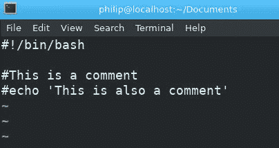
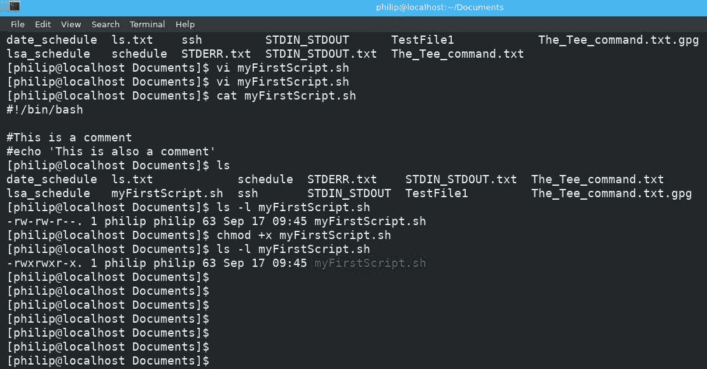
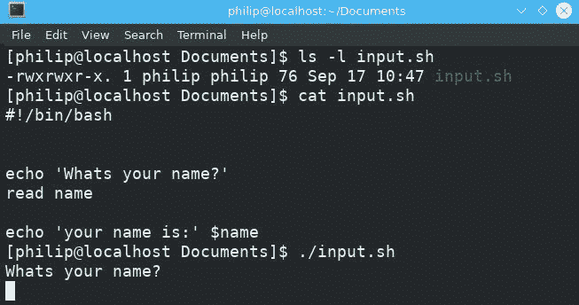
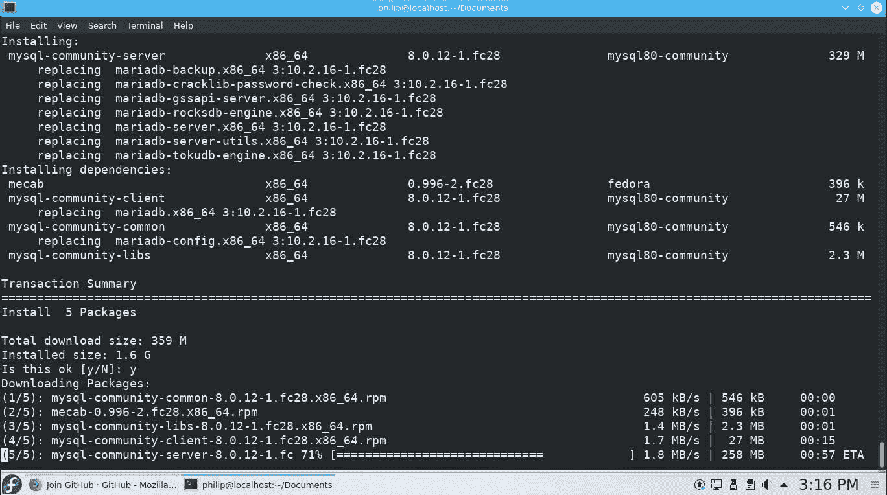
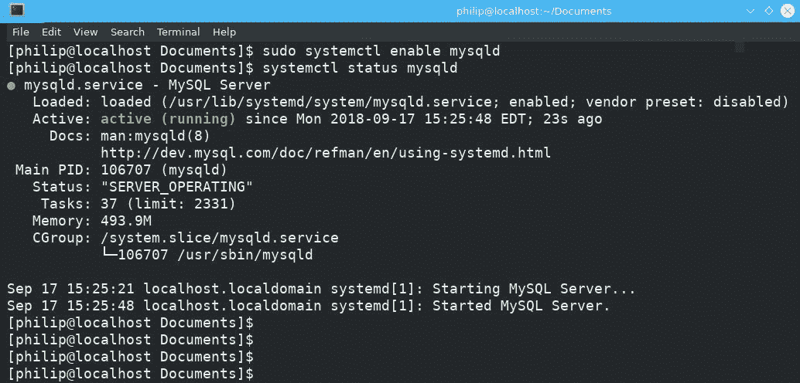

# 第十八章：Shell 脚本和 SQL 数据管理

在上一章中，我们涵盖了 Linux 环境中可用的各种安全功能。首先，我们讨论了以 root 权限执行命令。然后，我们转向 TCP 包装，重点放在`/etc/hosts.allow`和`/etc/hosts.deny`文件上。接下来，我们涵盖了 SSH；我们看了如何在客户端和服务器之间设置 SSH 访问。最后，我们深入讨论了加密。

在本章中，也是本书的最后一章，我们将涵盖 Shell 脚本和 SQL 管理的基础知识。首先，我们将看一下编写 shell 脚本的语法；然后是使用各种循环编写脚本，比如`for`和`while`循环。接下来，我们将涵盖使用`if`语句编写 shell 脚本。最后，我们将通过涵盖 SQL 管理的基础知识来结束本章（和本书）。

我们将在本章中涵盖以下主题：

+   Shell 脚本

+   SQL 数据管理

# Shell 脚本

在本节中，我们将涵盖 shell 脚本，从基础知识开始，然后转向使用循环和`if`语句编写脚本。

以下主题将在本节中涵盖：

+   Shell 脚本的基础知识

+   使用`for`循环编写脚本

+   使用`while`循环编写脚本

+   使用`if`语句编写脚本

# Shell 脚本的基础知识

在命令行上，我们经常需要定期执行一系列相同的命令。将这些命令捆绑在一起并简化这个过程，执行单个命令或脚本来完成一个需要重复输入单个命令的整体目标将是理想的。这就是 shell 脚本的优势所在。我们可以将我们的命令，无论有多长，放入一个单独的文件中；给它一个合适的名称；并根据需要执行脚本。以下代码显示了创建 shell 脚本的基本语法：

```
#! /bin/sh
```

上述命令是脚本中的第一行；它用于定义 shell 解释器。前面的字符`#!`通常被称为 shebang、sha-bang、hashbang、pound-bang 或 hash-pling。`/bin/sh`对象定义了应该使用哪个解释器来运行这个脚本；在这种情况下，它是 Shell 命令语言（`sh`）。另一个常见的解释器是：

```
#!/bin/bash
```

这与先前的声明类似，我们有`#!`，这表明我们将定义要使用的 shell 解释器；在这种情况下，我们使用的是 Bourne Again Shell，或者说是 Bash。这个 shell 提供了比常规的`sh` shell 更多的扩展；事实上，大多数较新的 Linux 发行版都默认使用 Bash 作为 shell。我们可以通过在终端中输入以下命令来轻松识别正在使用的 shell：

```
[philip@localhost Documents]$ echo $SHELL
/bin/bash
[philip@localhost Documents]$
```

太棒了！环境变量`SHELL`存储当前的 shell；返回的值表明我们正在运行 bash shell。另一种识别 shell 的方法如下：

```
[philip@localhost Documents]$ echo $0
bash
[philip@localhost Documents]$
```

太棒了！正在使用 bash shell。此外，我们可以使用`ps`命令来显示当前的 shell，如下所示：

```
[philip@localhost Documents]$ ps
 PID TTY          TIME CMD
 74972 pts/1    00:00:03 bash
 75678 pts/1    00:00:39 dnf
 92796 pts/1    00:00:00 ps
[philip@localhost Documents]$
```

太棒了！对于我们的目的，我们将使用`#!/bin/bash`来编写脚本。要开始编写你的第一个脚本，打开一个文本编辑器，比如 vi 或 nano，然后输入以下内容：

```
philip@localhost Documents]$ vi myFirstScript.sh
```



太棒了！我们在第一行中有我们的声明；我们定义了`/bin/bash` shell。接下来，我们有两行以`#`符号开头。除了顶部的第一行之外的任何行都被称为注释。也就是说，最后两行是注释。我们可以通过保存我们的脚本来证明这一点；我们可以使用`:wq`，这将保存并退出我们的脚本，如下所示：

```
[philip@localhost Documents]$ cat myFirstScript.sh
#!/bin/bash
#This is a comment
#echo 'This is also a comment'
[philip@localhost Documents]$
```

```
chmod command, as follows:
```



太棒了！我们使用了`+x`，它为用户、组和其他人打开了执行位；此外，脚本的名称已更改为绿色，表示该文件现在可执行。要运行此脚本，我们使用以下命令：

```
[philip@localhost Documents]$ ./myFirstScript.sh
[philip@localhost Documents]$
```

太棒了！脚本被执行了；但是内容没有显示。这是因为到目前为止我们只定义了注释；在脚本内部还没有定义其他内容。让我们让我们的脚本显示一条简短的消息。使用 vi 或 nano 打开脚本，输入以下内容：

```
[philip@localhost Documents]$ cat myFirstScript.sh
#!/bin/bash
#This is a comment
#echo 'This is also a comment'
echo 'Hello world'
[philip@localhost Documents]$
```

太棒了！我们已经添加了要执行的第一个命令：`echo`命令。这将简单地回复传递的内容，如下所示：

```
[philip@localhost Documents]$ ./myFirstScript.sh
Hello world
[philip@localhost Documents]$
```

太棒了！我们成功地编写了我们的第一个脚本。让我们添加另一个命令，以说明脚本的有效性；我们将添加`date`命令，每次执行脚本时都会提供日期，如下所示：

```
[philip@localhost Documents]$ cat myFirstScript.sh
#!/bin/bash
#This is a comment
#echo 'This is also a comment'
echo 'Hello world'
date
[philip@localhost Documents]$ ./myFirstScript.sh
Hello world
Mon Sep 17 10:04:48 EDT 2018
[philip@localhost Documents]$
```

太棒了！我们现在有两个命令，每次运行脚本时都会执行。除了将输出发送到显示器，我们还可以执行其他任务。例如，我们可以创建一个归档文件；让我们以创建`/home/philip/Downloads`目录的`.tar`文件为例，如下所示：

```
[philip@localhost Documents]$ cat myFirstScript.sh
#!/bin/bash
#This is a comment
#echo 'This is also a comment'
echo 'Hello world'
date
tar -cvf mytar.tar /home/philip/Downloads
[philip@localhost Documents]$
```

在上述代码中，我们使用`tar`命令创建了`/home/philip/Downloads`目录的归档。现在，我们可以运行脚本来查看结果，如下所示：

```
[philip@localhost Documents]$ ./myFirstScript.sh
Hello world
Mon Sep 17 10:35:37 EDT 2018
tar: Removing leading `/' from member names
/home/philip/Downloads/
/home/philip/Downloads/home/
/home/philip/Downloads/home/philip/
/home/philip/Downloads/home/philip/Downloads/
/home/philip/Downloads/home/philip/Downloads/song.mp3
[philip@localhost Documents]$ ls  | grep tar
mytar.tar
[philip@localhost Documents]$
```

太棒了！我们的脚本成功了，并且创建了一个扩展名为`.tar`的归档文件。此外，我们可以创建一个从用户那里获取输入的脚本，使用`read`命令。让我们创建另一个脚本，命名为`input.sh`，使用 vi 或 nano，如下所示：

```
[philip@localhost Documents]$ ls -l input.sh
-rw-rw-r--. 1 philip philip 75 Sep 17 10:42 input.sh
[philip@localhost Documents]$ cat input.sh
#!/bin/bash

echo 'Whats your name?'
read name
echo 'your name is $name'
[philip@localhost Documents]$ chmod +x input.sh
[philip@localhost Documents]$
```

太棒了！我们创建了一个`input.sh`脚本；我们使用`read`命令来存储用户的输入。存储在`name`中的值称为变量。通过在变量名前面加上`$`来显示它在最后一行中。脚本的结果如下所示：



提示会暂停，直到我们输入内容；我们将输入一个名字并查看结果，如下所示：

```
[philip@localhost Documents]$ ./input.sh
Whats your name?
Philip
your name is: Philip
[philip@localhost Documents]$
```

太棒了！我们输入的名字被添加到了最后一行。我们还可以通过以下语法来定义变量：

```
<variable name> = <value>
```

在上述代码中，我们给变量命名，然后指定一个值。

让我们创建一个名为`myvar.sh`的新脚本，使用 vi 或 nano。以下代码显示了如何使用新脚本定义变量：

```
[philip@localhost Documents]$ vi myvar.sh
[philip@localhost Documents]$ cat myvar.sh
#!/bin/bash

OUR_VAR="Philip Inshanally"

echo "The variable which we defined is $OUR_VAR"
[philip@localhost Documents]$ chmod +x myvar.sh
[philip@localhost Documents]$ ./myvar.sh
The variable which we defined is Philip Inshanally
[philip@localhost Documents]$
```

太棒了！我们定义了一个变量`OUR_VAR`，并给它赋值`Philip Inshanally`；然后在`echo`命令中调用它，通过在变量名前面放置`$`符号。正如你所看到的，有多种定义变量的方式。当单词之间有空格时，变量值需要用括号括起来。如果只有一个单词或数字，就不需要用括号括起来。

不要用括号括住单词或数字。

# 使用 for 循环编写脚本

有时，逐行在脚本中写出每个命令可能会很麻烦。我们可以通过使用循环来实现相同的目标，根据满足的表达式执行命令。`for`循环的基本语法如下：

```
for          <condition>
do
                <command1>
                <command2>
                …
                <commandN>
done
```

第一行定义了一个条件，一旦条件满足，我们就有一系列命令。为了看到这个过程，让我们创建一个脚本，名为`myForLoop.sh`，使用 vi 或 nano：

```
[philip@localhost Documents]$ vi myForLoop.sh
[philip@localhost Documents]$ chmod +x myForLoop.sh
[philip@localhost Documents]$ cat myForLoop.sh
#!/bin/bash
echo 'This script displays how a for loop works'
for o in {1..10}
do
 echo "The loop is running for the: $o time"
done
[philip@localhost Documents]$
```

太棒了！以`for o in {1..10}`开头的行定义了我们想要执行`for`循环的次数；它将被执行 10 次。`do`部分下的命令是将要执行的命令；`$o`是在`for`部分中定义的变量。结果如下：

```
[philip@localhost Documents]$ ./myForLoop.sh
This script displays how a for loop works
The loop is running for the: 1 time
The loop is running for the: 2 time
The loop is running for the: 3 time
The loop is running for the: 4 time
The loop is running for the: 5 time
The loop is running for the: 6 time
The loop is running for the: 7 time
The loop is running for the: 8 time
The loop is running for the: 9 time
The loop is running for the: 10 time
[philip@localhost Documents]$
```

太棒了！这个条件也可以用以下格式来写：

```
[philip@localhost Documents]$ cat myForLoop.sh
#!/bin/bash
echo 'This script displays how a for loop works'
#for o in {1..10}
for p in 1 2 3 4 5 6 7 8 9 10 11 12
do
 echo "The loop is running for the: $p time"
done
[philip@localhost Documents]$
 [philip@localhost Documents]$ ./myForLoop.sh
This script displays how a for loop works
The loop is running for the: 1 time
The loop is running for the: 2 time
The loop is running for the: 3 time
The loop is running for the: 4 time
The loop is running for the: 5 time
The loop is running for the: 6 time
The loop is running for the: 7 time
The loop is running for the: 8 time
The loop is running for the: 9 time
The loop is running for the: 10 time
The loop is running for the: 11 time
The loop is running for the: 12 time
[philip@localhost Documents]$
```

太棒了！我们写下了用空格分隔的值，脚本成功了。我们还可以像 C 编程语言一样，用三个部分指定条件，如下所示：

```
[philip@localhost Documents]$ cat myForLoop.sh
#!/bin/bash

echo 'This script displays how a for loop works'

#for o in {1..10}
#for p in 1 2 3 4 5 6 7 8 9 10 11 12
for ((p=1; p<=6; p++))
do
 echo "The loop is running for the: $p time"
done
[philip@localhost Documents]$
 [philip@localhost Documents]$ ./myForLoop.sh
This script displays how a for loop works
The loop is running for the: 1 time
The loop is running for the: 2 time
The loop is running for the: 3 time
The loop is running for the: 4 time
The loop is running for the: 5 time
The loop is running for the: 6 time
[philip@localhost Documents]$
```

太棒了！在上述代码中，`for ((p=1; p<=6; p++))`行定义了一个变量并为其赋值`p=1;`，`p<=6`检查条件，`p++`表示只要条件满足就递增变量的值。

# 使用 while 循环编写脚本

另一个在脚本中可以使用的流行循环是`while`循环。`while`循环的基本语法如下：

```
while <condition>
do
                <command1>
                <command2>
                …
                <commandN>
done
```

在上述代码中，我们指定一个条件，只要条件满足，循环就会被执行。

使用 vi 或 nano 创建一个名为`myWhile.sh`的脚本，如下所示：

```
[philip@localhost Documents]$ vi myWhile.sh
[philip@localhost Documents]$ chmod +x myWhile.sh
[philip@localhost Documents]$ cat myWhile.sh
#!/bin/bash

d=1

while (( $d <= 8 ))
do
 echo "The number is $d times"
 d=$(( d+1 ))
done
[philip@localhost Documents]$
```

太棒了！首先，我们定义了一个变量，`d=1`，然后我们指定了一个条件，`(( $d <= 8 ))`，它检查变量`d`是否小于或等于`8`；随后，我们使用`echo`命令根据条件提供文本。最后一部分，`d=$(( d+1 ))`，将在满足每个条件后递增变量，如下所示：

```
[philip@localhost Documents]$ ./myWhile.sh
The number is 1 times
The number is 2 times
The number is 3 times
The number is 4 times
The number is 5 times
The number is 6 times
The number is 7 times
The number is 8 times
[philip@localhost Documents]$
```

太棒了！用于条件的另一种技术是在`while`语句之后使用`:`。`:`将始终为`True`；这意味着循环直到我们使用*Ctrl* + *C*结束脚本才会结束。让我们使用 vi 或 nano 创建另一个名为`infinite.sh`的脚本，如下所示：

```
[philip@localhost Documents]$ vi infinite.sh
[philip@localhost Documents]$ chmod +x infinite.sh
[philip@localhost Documents]$ cat infinite.sh
#!/bin/bash
while :
do
 echo "You can enter text and press Enter as many times (exit using CTRL+c)"
 read someText
 echo "You typed $someText"
done
[philip@localhost Documents]$
```

会出现提示，允许我们输入任何内容；一旦我们按下*Enter*键，将显示另一条消息，包括我们输入的任何内容。这将无限继续，直到我们使用*Ctrl* + *C*退出脚本，如下所示：

```
[philip@localhost Documents]$ ./infinite.sh
You can enter text and press Enter as many times (exit using CTRL+c)
Hi 
You typed Hi
You can enter text and press Enter as many times (exit using CTRL+c)
How are you?
You typed How are you?
You can enter text and press Enter as many times (exit using CTRL+c)
I can keep typing
You typed I can keep typing
You can enter text and press Enter as many times (exit using CTRL+c)
and typing 
You typed and typing
You can enter text and press Enter as many times (exit using CTRL+c)
I can exit by using the keystroke as shown in the message above
You typed I can exit by using the keystroke as shown in the message above
You can enter text and press Enter as many times (exit using CTRL+c)
^C
[philip@localhost Documents]$
```

太棒了！脚本直到我们使用*Ctrl* + *C*组合键才退出。展示`while`循环有效性的另一种方法是在脚本退出前查找一个字符串。使用 vi 或 nano 创建另一个名为`whileString.sh`的脚本，如下所示：

```
[philip@localhost Documents]$ vi whileString.sh
[philip@localhost Documents]$ chmod +x whileString.sh
[philip@localhost Documents]$ cat whileString.sh
#!/bin/bash
someString=begin
while [ "$someString" != "quit" ]
do
 echo "Enter some text (type quit to exit)"
 read someString
 echo "You entered: $someString"
done
[philip@localhost Documents]$
```

太棒了！我们声明了一个变量，`someString=begin`；这可以是您选择的任何值。接下来，我们检查了一个条件，`[ "$someString" != "quit" ]`，它寻找`quit`字符串。只要字符串不是`quit`，脚本将无限运行，直到我们输入`quit`或按下*Ctrl* + *C*退出脚本，如下所示：

```
[philip@localhost Documents]$ ./whileString.sh
Enter some text (type quit to exit)
Hi
You entered: Hi
Enter some text (type quit to exit)
my name is Philip
You entered: my name is Philip
Enter some text (type quit to exit)
How are you
You entered: How are you
Enter some text (type quit to exit)
quit
You entered: quit
[philip@localhost Documents]$
```

太棒了！我们可以继续输入文本，脚本将继续运行，除非我们输入 quit 或按下*Ctrl* + *C*，这将退出脚本。

请注意，我们使用方括号([])括住文本；当测试字符串值时，脚本将无法使用常规括号(())。

# 使用 if 语句编写脚本

我们可以在脚本中使用`if`语句来测试条件。`if`语句的基本语法如下：

```
if [some condition]; then
                execute something
fi
or
if [[some condition]]; then
                execute something
fi
```

我们可以创建一个简单的`if`脚本，使用上述代码作为指导。有时，我们可能需要使用双方括号，它们比旧的单方括号样式提供了增强功能。让我们使用 vi 或 nano 创建一个名为`myif.sh`的脚本，如下所示：

```
[philip@localhost Documents]$ vi myif.sh
[philip@localhost Documents]$ cat myif.sh
#!/bin/bash

echo "Welcome to our if statement script"
if [[ $1 == 4 ]]; then
 echo "You're very smart"
fi
echo "See you soon!"
[philip@localhost Documents]$ chmod +x myif.sh
[philip@localhost Documents]$ ./myif.sh
Welcome to our if statement script
See you soon!
[philip@localhost Documents]$
```

我们使用`echo`命令显示欢迎消息；然后我们使用`if [[ $1 == 4 ]]; then`；此语句正在检查`4`。脚本被执行；但是我们没有看到`if`语句内的`echo`命令被执行。为了看到`if`语句内的消息，我们必须在运行脚本时输入一个值，如下所示：

```
[philip@localhost Documents]$ ./myif.sh 4
Welcome to our if statement script
You're very smart
See you soon!
[philip@localhost Documents]$
```

太棒了；`if`结构内的语句被执行，但是，如果我们传递的值不是`4`，我们将看到以下内容：

```
[philip@localhost Documents]$ ./myif.sh 3
Welcome to our if statement script
See you soon!
[philip@localhost Documents]$
```

由于我们传递的值不等于被检查的值，`if`语句内的命令没有被执行。我们可以在`if`语句中添加另一个部分来处理另一个响应；我们可以使用`else`子句。以下是注入到`if`语句中的`else`子句的语法：

```
if [[some condition]]; then
                execute something
else
                execute something else
fi
```

我们可以使用 vi 或 nano 编辑我们的`my.sh`脚本，并添加一个`else`子句来处理任何其他响应，如下所示：

```
[philip@localhost Documents]$ vi myif.sh
[philip@localhost Documents]$ cat myif.sh
#!/bin/bash
echo "Welcome to our if statement script"
if [[ $1 == 4 ]]; then
 echo "You're very smart"
else
 echo " Better luck next time"
fi
echo "See you soon!"
[philip@localhost Documents]$
```

太棒了！我们可以运行注入了`else`子句的脚本，结果如下：

```
[philip@localhost Documents]$ ./myif.sh 3
Welcome to our if statement script
Better luck next time
See you soon!
[philip@localhost Documents]$ ./myif.sh 2
Welcome to our if statement script
Better luck next time
See you soon!
[philip@localhost Documents]$ ./myif.sh 4
Welcome to our if statement script
You're very smart
See you soon!
[philip@localhost Documents]$
```

太棒了！当用户输入除`4`以外的值时，我们会看到不同的消息。此外，我们可以在另一个`if`语句中嵌套一个`if`语句。嵌套`if`语句的基本语法如下：

```
if [[first condition]]; then
execute something
elif [[second condition]]; then
                execute something else
 elif [[third condition]]; then
                execute something else
else
                execute_a_last_resort_command
fi
```

我们可以编辑我们的`myif.sh`脚本，使用 vi 或 nano，并添加第二个`elif`语句，如下所示：

```
[philip@localhost Documents]$ cat myif.sh
#!/bin/bash
echo "Welcome to our if statement script"
if [[ $1 == 4 ]]; then
 echo "You're very smart"
elif [[ $1 == 2 ]]; then
 echo "You've got your elseif value correct!"
else
 echo "Reach for the sky"
fi
echo "See you soon!"
[philip@localhost Documents]$
```

我们已经添加了`elif [[ $1 == 2 ]]; then`，它检查值`2`。一旦满足此条件，将显示一条消息，如下所示：

```
[philip@localhost Documents]$ ./myif.sh 2
Welcome to our if statement script
You've got your elseif value correct!
See you soon!
[philip@localhost Documents]$ ./myif.sh 3
Welcome to our if statement script
Reach for the sky
See you soon!
[philip@localhost Documents]$ ./myif.sh 4
Welcome to our if statement script
You're very smart
See you soon!
[philip@localhost Documents]$
```

太棒了！我们可以看到当我们输入与`elif`条件匹配的值时，`elif`条件下的命令将被执行。此外，当我们输入与`if`或`elif`条件都不匹配的值时，将显示一个全捕获消息。

还可以在单个`if`语句或`elif`语句上测试多个条件。让我们使用 vi 或 nano 编辑我们的`myif.sh`，如下所示：

```
[philip@localhost Documents]$ cat myif.sh
#!/bin/bash
echo "Welcome to our if statement script"
if [[ $1 == 4 ]] || [[ $1 == 3 ]] ; then
 echo "You're very smart"
elif [[ $1 == 2 ]]; then
 echo "You've got your elseif value correct!"
else
 echo "Reach for the sky"
fi
echo "See you soon!"
[philip@localhost Documents]$
```

在上述代码中，我们在`if`语句中添加了第二个条件；即`if [[ $1 == 4 ]] || [[ $1 == 3 ]] ; then`。`||`表示*或*。这是检查是否满足任一条件，并且命令将在`if`语句下执行，如下所示：

```
[philip@localhost Documents]$ ./myif.sh 4
Welcome to our if statement script
You're very smart
See you soon!
[philip@localhost Documents]$ ./myif.sh 3
Welcome to our if statement script
You're very smart
See you soon!
 [philip@localhost Documents]$
```

太棒了！一旦`if`子句中满足任一条件，命令就会在`if`子句下执行。此外，还有`&&`命令，用于比较条件；这意味着必须满足两个条件。我们可以快速编辑我们的`myif.sh`脚本，并添加`&&`，如下所示：

```
[philip@localhost Documents]$ cat myif.sh
#!/bin/bash
echo "Welcome to our if statement script"
if [[ $1 == 4 ]] || [[ $1 == 3 ]] ; then
 echo "You're very smart"
elif [[ $1 == 2 ]] && [[ $1 != 1 ]] ; then
 echo "You've got your elseif value correct!"
else
 echo "Reach for the sky"
fi
echo "See you soon!"
[philip@localhost Documents]$
```

当用户输入`2`时，将满足`elif`条件；这是因为两个条件都需要为真。如果用户输入除`2`以外的任何值，将执行全捕获`else`子句，如下所示：

```
[philip@localhost Documents]$ ./myif.sh 1
Welcome to our if statement script
Reach for the sky
See you soon!
[philip@localhost Documents]$ ./myif.sh 2
Welcome to our if statement script
You've got your elseif value correct!
See you soon!
[philip@localhost Documents]$
```

太棒了！`elif`子句中满足了两个条件，导致命令在`elif`子句下执行。

# SQL 数据管理

**结构化查询语言**（**SQL**）是用于数据库操作的一种广为人知的语言。有各种版本的 SQL。我们将使用 MySQL 的开放标准：`mysql-community-server`软件包。首先，我们需要在我们的 Fedora 28 系统中安装 MySQL `YUM`存储库；我们将使用`dnf`命令，如下所示：

```
[philip@localhost Documents]$ sudo dnf install https://dev.mysql.com/get/mysql80-community-release-fc28-1.noarch.rpm
==========================================================================================================================
 Package       Arch  Version    Repository                   Size
==========================================================================================================================
Installing:
mysql80-community-release    noarch  fc28-1       @commandline                 30 k

Transaction Summary
==========================================================================================================================
Install  1 Package
Total size: 30 k
Installed size: 29 k
Is this ok [y/N]: y
Installed:
mysql80-community-release.noarch fc28-1                                                                                
Complete!
[philip@localhost Documents]$
```

太棒了！存储库已成功安装。现在，我们将安装服务器，如下所示：

```
[philip@localhost Documents]$ sudo dnf install mysql-community-server
MySQL 8.0 Community Server                                                                302 kB/s | 215 kB     00:00 
MySQL Connectors Community                                                                 32 kB/s |  15 kB     00:00 
MySQL Tools Community                                                                      75 kB/s |  28 kB     00:00 

Total download size: 359 M
Installed size: 1.6 G
Is this ok [y/N]: y
```

在上述代码中，为了简洁起见，省略了一些输出。该软件包将占用超过 1GB 的空间；下载所需的时间将根据您的互联网连接而有所不同。进度将如下所示：



过一段时间，我们将看到以下内容：

```
Installed:
 mysql-community-server.x86_64 8.0.12-1.fc28                 mecab.x86_64 0.996-2.fc28 
 mysql-community-client.x86_64 8.0.12-1.fc28                 mysql-community-common.x86_64 8.0.12-1.fc28 
 mysql-community-libs.x86_64 8.0.12-1.fc28 
Complete!
[philip@localhost Documents]$
```

太棒了！下一步是启用`mysqld`服务；我们将使用`systemctl`命令，如下所示：

```
[philip@localhost Documents]$ sudo systemctl start mysqld
[philip@localhost Documents]$ sudo systemctl enable mysqld
[philip@localhost Documents]$ systemctl status mysqld
```



太棒了！`mysqld.service`已成功启动。在安装过程中，为`mysql`服务器生成了一个随机的`root`密码；我们必须查看`/var/log/mysqld.log`文件中的内容，如下所示：

```
[philip@localhost Documents]$ grep 'A temporary password is generated for root@localhost' /var/log/mysqld.log |tail -1
2018-09-17T19:25:35.229434Z 5 [Note] [MY-010454] [Server] A temporary password is generated for root@localhost: #a7RCyoyzwOF
[philip@localhost Documents]$
```

`mysql`的`root`的随机密码是`#a7RCyoyzwOF`。最后，我们应该保护我们的`mysql`数据库；我们将使用`mysql_secure_installation`命令，如下所示：

```
[philip@localhost Documents]$ mysql_secure_installation
Securing the MySQL server deployment.
Enter password for user root:
The existing password for the user account root has expired. Please set a new password.
New password:
```

首先，我们必须输入随机密码；然后，我们必须设置一个新密码，如下所示：

```
New password:
Re-enter new password:
The 'validate_password' component is installed on the server.
The subsequent steps will run with the existing configuration
of the component.
Using existing password for root.
Estimated strength of the password: 100
Change the password for root ? ((Press y|Y for Yes, any other key for No) :
```

默认情况下，安装了`validate_password`插件；这设置了密码规范。我们必须输入一个密码，该密码由至少一个大写字符、一个小写字符、一个数字和一个特殊字符组成。总密码长度必须至少为八个字符，如下所示：

```
Do you wish to continue with the password provided?(Press y|Y for Yes, any other key for No) : y
By default, a MySQL installation has an anonymous user,
allowing anyone to log into MySQL without having to have
a user account created for them. This is intended only for
testing, and to make the installation go a bit smoother.
You should remove them before moving into a production
environment.
Remove anonymous users? (Press y|Y for Yes, any other key for No) : y
```

默认情况下，会生成一个匿名用户帐户；我们将选择`y`来删除它并继续：

```
Normally, root should only be allowed to connect from
'localhost'. This ensures that someone cannot guess at
the root password from the network.
Disallow root login remotely? (Press y|Y for Yes, any other key for No) :
```

我们将允许`root`用户远程登录，因此我们将按下一个键，这一步将被跳过，如下所示：

```
 ... skipping.
By default, MySQL comes with a database named 'test' that
anyone can access. This is also intended only for testing,
and should be removed before moving into a production
environment.
Remove test database and access to it? (Press y|Y for Yes, any other key for No) : y
 - Dropping test database...
Success.
 - Removing privileges on test database...
Success.
Reloading the privilege tables will ensure that all changes
made so far will take effect immediately.
Reload privilege tables now? (Press y|Y for Yes, any other key for No) : y
Success.
All done!
[philip@localhost Documents]$
```

与默认安装相比，`mysql`现在更安全了。我们现在可以使用`mysql`命令登录`mysql`数据库，如下所示：

```
[philip@localhost Documents]$ mysql -u root -p
Enter password:
Welcome to the MySQL monitor.  Commands end with ; or \g.
Your MySQL connection id is 21
Server version: 8.0.12 MySQL Community Server - GPL
Copyright (c) 2000, 2018, Oracle and/or its affiliates. All rights reserved.
Oracle is a registered trademark of Oracle Corporation and/or its
affiliates. Other names may be trademarks of their respective
owners.
Type 'help;' or '\h' for help. Type '\c' to clear the current input statement.
mysql>
```

太棒了！我们现在将创建我们的第一个数据库；我们将使用`create database`命令：

```
mysql> create database netaccess;
Query OK, 1 row affected (0.10 sec)
mysql>
```

太棒了！我们现在将创建一个可以访问我们数据库的用户；我们将使用`create user`命令：

```
mysql> create user 'philip'@'172.16.175.130' identified by 'password123';
ERROR 1819 (HY000): Your password does not satisfy the current policy requirements
mysql>
```

在上述代码中，密码要求再次未被满足；我们可以通过降低设置或删除`validate_password`组件来解决这个问题。我们将删除`validate_password`组件，如下所示：

```
mysql> uninstall plugin validate_password;
ERROR 1305 (42000): PLUGIN validate_password does not exist
mysql> exit
Bye
[philip@localhost Documents]$ mysql -h localhost -u root -p
Enter password:
Welcome to the MySQL monitor.  Commands end with ; or \g.
Your MySQL connection id is 22
Server version: 8.0.12 MySQL Community Server - GPL
mysql> UNINSTALL COMPONENT 'file://component_validate_password';
Query OK, 0 rows affected (0.10 sec)
mysql> exit
Bye
[philip@localhost Documents]$
```

太棒了！我们使用`UNINSTALL COMPONENT`命令删除了`component_validate_password`。现在，我们可以像之前一样登录并继续：

```
mysql> grant all on netaccess.* to 'philip'@'172.16.175.130';
Query OK, 0 rows affected (0.06 sec)
mysql>
```

太棒了！最后一步是重新加载授权表；我们将使用`flush`命令，如下所示：

```
mysql> flush privileges
 -> ;
Query OK, 0 rows affected (0.00 sec)
mysql>
```

太棒了！当我们离开`;`时，命令没有被执行。我们总是需要以分号（;）结束。现在，我们可以从我们的 Ubuntu 系统通过网络进行测试。我们将不得不在 Ubuntu 18 系统上安装`mysql-client`，如下所示：

```
philip@Linuxplus:~$ mysql
Command 'mysql' not found, but can be installed with:
sudo apt install mysql-client-core-5.7 
sudo apt install mariadb-client-core-10.1
philip@Linuxplus:~$ sudo apt install mysql-client-core-5.7 
[sudo] password for philip:
Reading package lists... Done
Building dependency tree 
Setting up mysql-client-core-5.7 (5.7.23-0ubuntu0.18.04.1) ...
Processing triggers for libc-bin (2.27-3ubuntu1) ...
philip@Linuxplus:~$ mysql -h 172.16.175.129 -u philip -p
Enter password:
Welcome to the MySQL monitor.  Commands end with ; or \g.
Your MySQL connection id is 25
Server version: 8.0.12 MySQL Community Server - GPL
Copyright (c) 2000, 2018, Oracle and/or its affiliates. All rights reserved.
Oracle is a registered trademark of Oracle Corporation and/or its
affiliates. Other names may be trademarks of their respective
owners.
Type 'help;' or '\h' for help. Type '\c' to clear the current input statement.
mysql>
```

太棒了！我们成功连接了托管在我们的 Fedora 28 系统上的`mysql`服务器，使用 Ubuntu 18 客户端通过网络。我们现在可以使用各种命令，比如`show databases`命令：

```
mysql> show databases;
+--------------------+
| Database |
+--------------------+
| information_schema |
| netaccess |
+--------------------+
2 rows in set (0.06 sec)
mysql>
```

太棒了！我们可以看到两个数据库：我们之前创建的一个和一个内部数据库。但是，如果我们以 root 用户身份运行此命令，我们将看到所有可用的数据库，如下所示：

```
mysql> show databases;
+--------------------+
| Database           |
+--------------------+
| information_schema |
| mysql              |
| netaccess          |
| performance_schema |
| sys                |
+--------------------+
5 rows in set (0.00 sec)
mysql>
```

太棒了！查看数据库的另一种方法是使用带有`-e`选项的`mysql`命令；这允许我们从 shell 执行命令。以下代码片段显示了我们如何列出数据库：

```
philip@Linuxplus:~$ mysql -h 172.16.175.129 -u philip -p -e "show databases"
Enter password:
+--------------------+
| Database           |
+--------------------+
| information_schema |
| netaccess          |
+--------------------+
philip@Linuxplus:~$
```

太棒了！接下来，我们可以使用`use`命令切换到指定的数据库。以下代码显示了我们如何指定要使用的数据库：

```
mysql> use netaccess;
Database changed
mysql>
```

我们现在在`netaccess`数据库中。要开始使用数据库，我们必须首先创建一个表；在创建表之前，我们需要知道要创建什么类型的表。例如，假设我们想创建一个关于公共场所的表；我们将希望有一个用于场所名称的字段。如果我们只创建一个带有场所名称的表，那将不太吸引人；我们将希望添加其他方面，比如提供的服务和位置等。正如您所看到的，表可以包含各种选项。首先，我们将使用我们示例中提到的字段；我们将使用`create table`命令，如下所示：

```
mysql> create table Public_Places (name VARCHAR(20), location VARCHAR(30), service_provided VARCHAR(30));
Query OK, 0 rows affected (9.44 sec)
mysql>
```

太棒了！我们成功创建了我们的第一个表。我们可以使用`show tables`命令查看表：

```
mysql> show tables;
+---------------------+
| Tables_in_netaccess |
+---------------------+
| Public_Places       |
+---------------------+
1 row in set (0.11 sec)
mysql>
```

我们可以看到我们的表已列出。我们可以使用`describe`命令查看我们创建的字段。以下代码显示了我们如何使用`describe`命令：

```
mysql> describe Public_Places;
+------------------+-------------+------+-----+---------+-------+
| Field            | Type        | Null | Key | Default | Extra |
+------------------+-------------+------+-----+---------+-------+
| name             | varchar(20) | YES  |     | NULL    |       |
| location         | varchar(30) | YES  |     | NULL    |       |
| service_provided | varchar(30) | YES  |     | NULL    |       |
+------------------+-------------+------+-----+---------+-------+
3 rows in set (0.23 sec)
mysql>
```

太棒了！我们可以看到字段及其类型；`varchar`类型的长度可以是 0 到 65,535 之间的值。目前，表是空的，所以我们必须填充它。

# 插入命令

我们可以使用`insert`命令填充表。基本语法如下：

```
insert into <table> <field(s)><value(s)>
```

我们可以向我们之前创建的表中添加一些信息，如下所示：

```
mysql> insert into Public_Places values('Police Station', 'Capital City', 'serve and protect');
Query OK, 1 row affected (0.17 sec)
mysql>
```

太棒了！我们指定了值并使用`insert`命令传递了这些值，将数据存储在表中。插入数据的另一种方法是只插入部分字段的数据；我们必须指定字段名称以进行选择性插入。以下代码显示了如何将数据插入到表的某些部分：

```
mysql> insert into Public_Places (name, location) values('Telephone Company', 'Georgetown');
Query OK, 1 row affected (0.16 sec)
mysql>
```

太棒了！我们只为两个字段（`name`和`location`）插入了值。插入数据的另一种方法是使用带有`-e`选项的`mysql`命令，如下所示：

```
philip@Linuxplus:~$ mysql -h 172.16.175.129 -u philip -p -e "USE netaccess; INSERT INTO Public_Places values ('Hospital' , 'Georgetown', 'healthcare');"
Enter password:
philip@Linuxplus:~$
```

太棒了！数据已成功输入到表中。

# 选择命令

到目前为止，我们一直在向我们的表中添加内容。但是，我们还没有看到我们添加的值。我们可以使用`select`命令查看表的内容，如下所示：

```
mysql> select * from Public_Places;
+-------------------+--------------+-------------------+
| name              | location     | service_provided  |
+-------------------+--------------+-------------------+
| Police Station    | Capital City | serve and protect |
| Telephone Company | Georgetown   | NULL              |
| Hospital          | Georgetown   | healthcare        |
+-------------------+--------------+-------------------+
3 rows in set (0.00 sec)
mysql>
```

太棒了！我们可以看到我们迄今为止在我们的表中输入的所有值。此外，我们可以通过指定`where`子句执行选择性搜索，如下所示：

```
mysql> select * from Public_Places where name='Telephone Company';
+-------------------+------------+------------------+
| name              | location   | service_provided |
+-------------------+------------+------------------+
| Telephone Company | Georgetown | NULL             |
+-------------------+------------+------------------+
1 row in set (0.00 sec)
mysql>
```

太棒了！我们还可以使用以下方法进行搜索：

```
mysql> select name, service_provided from Public_Places;
+-------------------+-------------------+
| name              | service_provided  |
+-------------------+-------------------+
| Police Station    | serve and protect |
| Telephone Company | NULL              |
| Hospital          | healthcare        |
+-------------------+-------------------+
3 rows in set (0.00 sec)
mysql> select service_provided from Public_Places;
+-------------------+
| service_provided  |
+-------------------+
| serve and protect |
| NULL              |
| healthcare        |
+-------------------+
3 rows in set (0.00 sec)
mysql>
```

太棒了！

# 更新命令

我们可以使用`update`命令对表进行更改，如下所示：

```
mysql> update Public_Places set service_provided='Telephones' where name='Telephone Company';
Query OK, 1 row affected (0.05 sec)
Rows matched: 1  Changed: 1  Warnings: 0
mysql>
```

太棒了！我们已经填写了`Telephone Company`的`service_provided`字段的数据；可以使用`select`命令进行验证，如下所示：

```
mysql> select * from Public_Places;
+-------------------+--------------+-------------------+
| name              | location     | service_provided  |
+-------------------+--------------+-------------------+
| Police Station    | Capital City | serve and protect |
| Telephone Company | Georgetown   | Telephones        |
| Hospital          | Georgetown   | healthcare        |
+-------------------+--------------+-------------------+
3 rows in set (0.00 sec)
mysql>
```

太棒了！我们可以看到`service_provided`字段已经填充。此外，我们可以使用`update`命令更改数据，如下所示：

```
mysql> update Public_Places set location='Kaieteur Falls' where name='Hospital';
Query OK, 1 row affected (0.15 sec)
Rows matched: 1  Changed: 1  Warnings: 0
mysql> select * from Public_Places;
+-------------------+----------------+-------------------+
| name              | location       | service_provided  |
+-------------------+----------------+-------------------+
| Police Station    | Capital City   | serve and protect |
| Telephone Company | Georgetown     | Telephones        |
| Hospital          | Kaieteur Falls | healthcare        |
+-------------------+----------------+-------------------+
3 rows in set (0.00 sec)
mysql> update Public_Places set name='GPF' where name='Police Station';
Query OK, 1 row affected (0.16 sec)The dele
Rows matched: 1  Changed: 1  Warnings: 0
mysql> select * from Public_Places;
+-------------------+----------------+-------------------+
| name              | location       | service_provided  |
+-------------------+----------------+-------------------+
| GPF               | Capital City   | serve and protect |
| Telephone Company | Georgetown     | Telephones        |
| Hospital          | Kaieteur Falls | healthcare        |
+-------------------+----------------+-------------------+
3 rows in set (0.00 sec)
mysql>
```

太棒了！

# 删除命令

我们可以使用`delete`命令从表的字段中删除值，如下所示：

```
mysql> delete from Public_Places where name='Hospital';
Query OK, 1 row affected (0.18 sec)
mysql> select * from Public_Places;
+-------------------+--------------+-------------------+
| name              | location     | service_provided  |
+-------------------+--------------+-------------------+
| GPF               | Capital City | serve and protect |
| Telephone Company | Georgetown   | Telephones        |
+-------------------+--------------+-------------------+
2 rows in set (0.01 sec)
mysql>
```

太棒了！使用`delete`命令指定的字段已被删除。

# from 选项

我们可以使用`from`选项来指定要使用的表；例如，如果我们指定一个不存在的表，我们将看到以下消息：

```
mysql> select * from myTable;
ERROR 1146 (42S02): Table 'netaccess.myTable' doesn't exist
mysql>
```

表不存在，因此在执行查询时，我们必须使用`from`选项输入正确的表。

# where 条件

当我们想要执行一些选择性操作时，我们可以使用`where`条件。我们之前使用过`select`，`update`和`delete`命令的`where`条件。作为提醒，我们可以如下使用`where`条件：

```
mysql> select * from Public_Places where name='GPF';
+------+--------------+-------------------+
| name | location     | service_provided  |
+------+--------------+-------------------+
| GPF  | Capital City | serve and protect |
+------+--------------+-------------------+
1 row in set (0.00 sec)
mysql>
```

太棒了！只显示符合条件的结果。

# group by 选项

我们可以使用`group by`选项根据我们指定的条件提供结果，如下所示：

```
mysql> select name from Public_Places group by name;
+-------------------+
| name              |
+-------------------+
| GPF               |
| Telephone Company |
+-------------------+
2 rows in set (0.02 sec)
mysql>
```

太棒了！结果根据指定的条件进行分组。当我们有包含数字的表时，这是非常有用的，例如客户 ID，员工 ID 和订单等。

# order by 选项

我们可以使用`order by`选项按升序或降序对表中的数据进行排序。以下代码显示了如何使用`order by`选项：

```
mysql> select * from Public_Places order by service_provided;
+-------------------+--------------+-------------------+
| name              | location     | service_provided  |
+-------------------+--------------+-------------------+
| GPF               | Capital City | serve and protect |
| Telephone Company | Georgetown   | Telephones        |
+-------------------+--------------+-------------------+
2 rows in set (0.02 sec)
mysql>
```

根据默认设置，数据按升序排序；但是，我们可以通过传递`DESC`关键字以降序显示结果，如下所示：

```
mysql> select * from Public_Places order by service_provided DESC;
+-------------------+--------------+-------------------+
| name              | location     | service_provided  |
+-------------------+--------------+-------------------+
| Telephone Company | Georgetown   | Telephones        |
| GPF               | Capital City | serve and protect |
+-------------------+--------------+-------------------+
2 rows in set (0.00 sec)
mysql>
```

太棒了！结果以降序显示。

# 连接选项

我们可以通过传递`join`选项来使用简单的连接；这可以用于合并来自不同表的行，以查看表之间的共同因素。我创建了两个表，如下所示：

```
mysql> select * from Cust;
+--------+-------------------------+--------------------+
| custID | custName                | location           |
+--------+-------------------------+--------------------+
|      1 | Philip Inshanally       | Georgetown, Guyana |
|      2 | Matthew Zach Inshanally | Georgetown, Guyana |
+--------+-------------------------+--------------------+
2 rows in set (0.03 sec)
mysql> select * from Purchase;
+---------+------------+-----------+
| orderID | purchaseID | orderDate |
+---------+------------+-----------+
|       2 |   20150202 | 201800902 |
|       1 |   10031984 |  20180310 |
+---------+------------+-----------+
2 rows in set (0.00 sec)
mysql>
```

相同的列是每个表的第一列；`Cust`表将其称为`custID`，而`Purchase`表将其称为 ordered。基于此，我们可以创建一个选择查询，将两个表合并，如下所示：

```
mysql> SELECT Purchase.orderID, Cust.custName, Purchase.orderDate FROM Purchase INNER JOIN Cust ON Purchase.orderID=Cust.custID;
+---------+-------------------------+-----------+
| orderID | custName                | orderDate |
+---------+-------------------------+-----------+
|       1 | Philip Inshanally       |  20180310 |
|       2 | Matthew Zach Inshanally | 201800902 |
+---------+-------------------------+-----------+
2 rows in set (0.01 sec)
mysql>
```

太棒了！我们通过在`Purchase.orderID`，`Cust.custName`，`Purchase.orderDate`前放置表的名称来引用字段；这定义了表的呈现方式。

接下来的部分，`FROM Purchase INNER JOIN Cust ON Purchase.orderID=Cust.custID;`，定义了内容将来自`Purchase`表，并且将使用`Purchase.orderID=Cust.custID`的共同列进行连接，从而产生包含来自两个表的数据的结果。

这被称为内部连接；它返回在两个表中具有匹配值的数据。

# 总结

在本章中，我们学习了 shell 脚本和 SQL 管理。首先，我们介绍了 shell 脚本的基础知识。接下来，我们通过使用`for`循环编写脚本。然后，我们使用了`while`循环。最后，我们在脚本中使用了`if`语句。

接下来，我们使用了 SQL 管理。首先，我们安装了 MySQL 存储库，然后安装了 MySQL 的社区服务器版本。然后，我们对我们的`mysql`服务器进行了安全设置。然后，我们开始创建数据库，然后创建表。然后，我们开始使用各种技术管理表中的数据；最后，我们创建了额外的表，以演示内部连接。

我很高兴编写了这本书中的每一章。我相信您在职业生涯中会从这本书中学到很多。感谢您选择这本书并将其收入您的收藏。下次再见，我是 Philip Inshanally，提醒您要时刻心存感激。很快再见！

# 问题

1.  哪些字符标识了定义解释器的行的开头？

A. `＃$`

B. `＃@`

C. `＃！`

D. `＃^`

1.  以下哪个环境变量存储当前的 shell？

A. `SHELL`

B. `BASH`

C. `SH`

D. `TCSH`

1.  以下哪个关键字结束了`for`循环？

A. `do`

B. `do 循环`

C. `完成`

D. `fi`

1.  如果脚本位于当前目录中，需要在`/`前面放置哪个字符才能运行脚本？

A. `.`

B. `：`

C. `;`

D. `“`

1.  以下哪个命令可以创建一个变量来存储用户的输入？

A. `执行`

B. `暂停`

C. `写入`

D. `读取`

1.  以下哪个字符可以用来测试两个条件，并在任一条件为真时返回`TRUE`？

A. `&&`

B. `||`

C. `//`

D. `==`

1.  在使用`select`命令执行`mysql`查询时，以下哪个字符用作通配符？

A. `+`

B. `/`

C. `*`

D. `-`

1.  在使用`select`命令时，以下哪个选项用于检查条件？

A. `来自`

B. `if`

C. `where`

D. `连接`

1.  以下哪个命令将使用 mysql 创建一个表？

A. `创建表`

B. `创建表`

C. `创建表`

D. `创建表`

1.  以下哪个命令可以用于使用`mysql`更改值？

A. `插入`

B. `删除`

C. `更新`

D. `连接`

# 进一步阅读

+   以下网站提供有关 shell 脚本的有用信息：[`www.shellscript.sh`](https://www.shellscript.sh)

+   以下网站提供有关循环的有用信息：[`www.tutorialspoint.com`](https://www.tutorialspoint.com)

+   以下网站提供有关 mysql 的有用信息：[`www.w3schools.com`](https://www.w3schools.com)
