# 第一章：介绍和环境设置

在本章中，我们将涵盖以下内容：

+   理解和选择发行版

+   安装 VirtualBox

+   手动安装我们选择的发行版

+   连接到我们的**虚拟机**（**VM**）

+   访问和更新我们的虚拟机

+   了解 VM 的不同之处

+   快速的`sudo`解释

+   使用 Vagrant 自动配置 VM

+   轶事（尝试，尝试，再尝试）

# 介绍

在我们深入讨论我们将使用哪种发行版（有时缩写为“distro”）之前，我们必须首先迈出一大步，以一种略带哲学色彩的方式考虑**Linux**的概念。

对“Linux 是什么”进行一个良好的描述可能很难确定，这在很大程度上是由 IT 专业人员故意传播的混乱造成的，因为当他们来解释时，这让他们听起来比实际上更聪明。

因为你正在阅读这本书，我会假设你对 Linux 有一个较高层次的了解；你知道它是一个**操作系统**（**OS**），就像 Windows 或 macOS 一样，它并没有受到太多关注，并且通常不在桌面上使用。

这个评估是对也是错的，这取决于你和谁在说话。

悠闲的**系统管理员**（**sysadmins**）会更加放松，点点他们 80 年代的摩西头，同意 Linux 是一个操作系统，而且是一个不错的操作系统。然后他们会回去玩他们这周正在学习的时髦软件，以便下周可以尝试将其塞入基础设施中。

自称为灰发老者的人会停下手头的工作，大声叹息，拿起他们的第四杯咖啡，然后转身给你讲解 GNU/Linux（或 GNU+Linux）和 Linux 内核之间的区别。

内核是任何完整操作系统的重要组成部分。它是软件的一部分，位于硬件和软件之间，执行在两者之间进行翻译的繁重工作。所有操作系统都会有某种类型的内核，例如，macOS 的内核被称为**XNU**。

你将收到的讲座将会很乏味，会涉及到 Richard Stallman、Linus Torvalds，甚至可能还有 Andrew Tanenbaum 等人的名字，甚至可能会持续一个多小时，但主要的收获是 Linux 是你正在学习的操作系统的公认名称，同时也在技术上是不正确的。他们会说 Linux 实际上只是内核，所有其他东西都是包裹在 GNU 工具套件之上的发行版。

被认为是明智的避免这场辩论

在本书中，当我提到 Linux 时，我指的是整个操作系统，当我提到**内核**时，我实际上是在谈论 Linux 内核，其开发由 Linus Torvalds 领导。

# 理解和选择发行版

如前一节所示，Linux 是分散的。由于可以从众多不同供应商那里下载不同的**发行版**，这是描述这一点的最好方式。其中一些供应商是营利性的，提供支持合同和购买他们的操作系统时的服务级别协议（SLA），而另一些则完全是自愿的，由一个人在他们的车库里管理。

有成百上千种发行版可供选择，每种发行版都有自己的拥护者军团，告诉你为什么他们的发行版是“唯一真正的发行版”，“真的没有理由去寻找其他的”。

也有为特定目的创建的 Linux 发行版，例如据称是朝鲜 Linux 发行版的 Red Star OS。

事实上，大多数企业使用他们使用的 Linux 发行版是因为它：

+   当所有者谷歌搜索**免费操作系统**时，第一个弹出来的

+   第一个 IT 管理员喜欢的

+   提供可以在出现故障时调用的合同

逐个介绍当前存在的每个发行版是徒劳的，因为它们几乎每周都在被创建或被放弃。相反，我将介绍一些受欢迎的选择（在服务器空间而不是桌面上），解释一些关键区别，然后谈论我将在本书的其余部分中使用的发行版。

如果你的企业使用的发行版不是我们在这里讨论的，不要灰心 - 大多数工具在各种发行版上都是一致的，而在有差异的地方，都有文档可以帮助你。

如果你想了解更多关于可用发行版的信息，一个名为 DistroWatch 的网站（[`distrowatch.com/`](https://distrowatch.com/)）已经存在多年，提供一个定期更新的 Linux 发行版列表，按页面点击排名组织。

# Ubuntu

Ubuntu 是我安装的第一个 Linux 发行版，我敢打赌，对于很多在 2000 年代中期开始使用 Linux 的人来说也是如此。这也是我用来写这本书的发行版。

由于其良好的营销尝试（包括在搜索`Linux`时在谷歌排名中的位置）、被视为“人类的 Linux”以及用户友好性，它在桌面上一直享有一致的关注。

在 Debian 的下游，Ubuntu 的开发由 Canonical 负责，虽然他们最初强调制作坚固的桌面操作系统，但他们后来进入了试图主导服务器空间的高尚领域，并且也进入了物联网设备市场。

当我们在这方面说“下游”时，我们的意思是 Ubuntu 与 Debian 共享许多基础，只是它添加了一些额外的部分并去掉了一些部分。在 Linux 世界中，很少有从头开始的发行版，大多数使用其他发行版作为基础。

Ubuntu 以其可爱的命名惯例（18.04 被称为 Bionic Beaver）而闻名，事实上 Ubuntu 在桌面上如此受欢迎，这意味着它是系统管理员在服务器上安装的明显选择，因为他们已经熟悉它。

最近，处理继承系统时越来越常见的是找到 Ubuntu 安装，通常是一个长期支持（LTS）版本（这样可以避免在合理的时间内升级操作系统时的混乱和头痛）。

Ubuntu 每六个月发布一次版本，每两年发布一个 LTS 版本（最近的是 14.04、16.04 和 18.04）。它们的编号惯例是发布年份，后跟月份（所以 2018 年 4 月是 18.04）。可以从一个版本升级到另一个版本的 Ubuntu。

Canonical 在 Ubuntu 中引入新技术和软件时也毫不犹豫，即使它与他们的 Debian 基础有所偏离。最近的例子包括以下内容：

+   Snaps：一种分发与发行无关的软件的方式

+   Upstart：一种替代初始化系统，后来也被`systemd`替换

+   Mir：一种显示服务器，最初构想为取代老化的 X Window 系统

Ubuntu 可以从[`ubuntu.com`](https://ubuntu.com)下载。

# Debian

如前所述，Debian（通用操作系统）是许多后来的其他发行版的基础，但它一直是最受欢迎的发行版之一，无论是在桌面上还是在服务器上。很可能你会选择自己安装 Debian，或者继承一个运行这个发行版的系统，因为它以稳定性而闻名。

传统上，服务器空间的争夺是在两个阵营之间进行的，即 Debian Druids 和 CentOS Cardinals。近年来，新手已经加入了这场争夺（比如 Ubuntu），但这两个仍然控制着相当多的硬件。

每两三年发布一次，Debian 版本以《玩具总动员》角色命名（7—Wheezy，8—Jessie，9—Stretch）。它以稳定性而闻名，具有经过试验和测试的软件版本，以及合理的回溯修复。

回溯是指从最近的软件版本（例如内核本身）中获取修复，并将这些修复合并到您正在运行的版本中，将其重新编译为新的软件。由于功能可能会引入更多破坏性变化到长期支持的发行版中，功能很少会被回溯。

有时会对 Debian 提出一些批评，因为它通常在发布版本中提供较旧版本的软件包，这可能不包括系统管理员想要的所有时髦和酷功能，或者开发人员想要的。鉴于人们通常在服务器世界中寻求稳定性和安全性，而不是最新和最伟大的 Node.js 版本，这是不公平的。

Debian 有坚定的捍卫者，并且在许多人心中占有特殊地位，尽管在一些企业环境中看到它是不寻常的，因为它是由 Debian 项目开发的，而不是传统公司可以提供支持合同。根据我的个人经验，我更经常在需要快速解决方案的小公司和仍在运行一些传统系统的稍大公司中看到 Debian。

Debian 可以从[`www.debian.org`](https://www.debian.org)下载。

# CentOS - 我们将主要使用的一个

在传统的服务器领域战争的另一部分，CentOS 拥有自己的士兵和烈士。它仍然被广泛使用，并以稳定和无聊的声誉与 Debian 相媲美。

**社区企业操作系统**（**CentOS**）是红帽企业 Linux 发行版的免费可用和编译版本，旨在提供功能兼容性，通常用 CentOS 标志取代红帽标志，以避免侵犯商标。 （2014 年 1 月宣布红帽将与 CentOS 合作，以帮助推动和投资于 CentOS 的发展。）

因为它的性质，许多系统管理员安装了 CentOS 来更好地了解红帽世界，因为（如前所述）红帽在企业公司中有很好的声誉，所以安装一些如此相似的东西是有道理的。

这种安装趋势是双向的。我见过一些公司最初安装 CentOS，因为它很容易获得，并允许他们轻松设计基础架构，利用公开可用的免费仓库，然后转移到 RHEL 部署成品。

**仓库**是指软件安装在 Linux 系统上的常见位置的简称。Windows 通常从网站下载，macOS 有应用商店，Linux 在大部分时间里使用软件仓库，并且在命令行上很容易搜索。

我还见过一些公司在所有地方部署了 RHEL，只是意识到他们花了很多钱，却从未使用他们购买的支持，因为他们的运营团队实在太优秀了！然后他们逐渐淘汰了他们的红帽部署，并转移到了 CentOS，在这个过程中几乎没有改变。

每隔几年发布一次版本，版本 7 于 2014 年发布，并自那时起持续更新。然而，应该注意的是，2011 年发布的版本 6 将在 2020 年之前获得维护更新。

CentOS 可以从[`centos.org`](https://centos.org)下载。我们将在安装部分进行介绍。

# 红帽企业 Linux

红帽企业 Linux，或者更常见的 RHEL（因为它的名字很长），在企业中有着非常牢固的基础。它非常适合商业领域，因此很常见的情况是你发现自己在一个 RHEL 的系统上，而你最初以为它是一个 CentOS 的安装。

RHEL 的不同之处在于红帽公司提供的支持，以及如果你购买了官方软件包，你可以利用的各种服务。

尽管红帽仍然毫不犹豫地提供他们发行版的源代码（因此有了 CentOS），但他们为从桌面到数据中心安装的各种版本和软件包销售。

有一句谚语说“没有人因为购买 IBM 而被解雇”，这在今天有点过时，但我听说人们在多次场合上引用这个哲学来描述红帽。没有人会因为购买红帽而被解雇（但你可能会被问到为什么要为另一个名字下免费提供的东西付费的好处是什么）。

美妙的是，在我编辑这本书的过程中，IBM 宣布收购了红帽，这使我上面的评论变得完整。宇宙有时候真是伟大。

除了支持外，其他企业喜欢的商业态度，以及对整个社区的贡献，红帽还提供了一些被描述为“浪费时间”和“对这个角色至关重要”的东西。

考试在 Linux 社区中备受喜爱和嘲笑，这取决于你和 Linux 社区中的谁说话（就像许多事情一样，关于它们有一些圣战）。红帽提供了两个最受欢迎的考试，还有更多。你可以学习并成为红帽认证系统管理员，然后是红帽认证工程师，这被广泛认为是非常可接受的资格。

作为一名大学辍学生，我很高兴拥有 RHCE 资格。

有些人认为这些考试是为了通过那些招聘者的第一道关卡（就像那些扫描你的简历并寻找他们认识的徽章的人）。其他人认为这些考试证明了你对 Linux 系统的了解，因为这些考试是实际的（意味着他们让你坐在电脑前，给你一组完成的步骤）。有些人完全不理会考试，尽管他们通常是那些从未尝试过考试的人。

查看[`www.redhat.com`](https://www.redhat.com)，特别注意提供的各种软件包。他们也有开发者账户，可以让你访问你本来需要付费的服务（只要你不试图将它们悄悄地引入生产环境！）。

# 安装 VirtualBox

正如我在前一节中所说，我选择在这本书中大多数情况下使用 CentOS。希望这为你提供了一个很好的基础来学习 Linux 管理，同时也为你提供了一些优势，如果你打算参加任何红帽的考试。

我不会要求你有一台备用的笔记本电脑，或者在某个地方租用服务器，我会主张使用虚拟机来测试和运行给出的示例。

虚拟机正如它们的名字所示 - 是一种在一个或一组物理机上虚拟化计算机硬件的方式，因此允许你进行测试、破坏和尽情玩耍，而不会冒着使自己的计算机无法启动的风险。

创建虚拟机有很多种方式：macOS 有 xhyve，Windows 有 Hyper-V，Linux 有一个称为 Kernel Virtual Machine（KVM）的本地实现。

KVM（连同 libvirt）是你在 Linux 虚拟化领域经常遇到的技术。它构成了流行技术的基础，比如 Proxmox 和 OpenStack，同时提供接近本机速度。

另一种创建和管理虚拟机的方法是一个名为 VirtualBox 的程序，现在由 Oracle 开发。这个软件的好处，也是我在这里使用它的原因，是它是跨平台的，适用于 macOS、Windows 和 Linux。

# 在 Ubuntu 上安装 VirtualBox

我正在使用 Ubuntu 来撰写这本书，所以我将介绍在 Ubuntu 桌面上安装 VirtualBox 的基本方法。

这与在其他发行版上安装有些不同，但其中有很多都为其提供了安装包，并应该提供安装指南。

# 命令行安装

打开您的终端并运行以下命令：

```
$ sudo apt install virtualbox 
```

使用 sudo 通常会提示您输入密码，当您输入时，屏幕上不会显示任何内容。

您可能会被提示确认安装 VirtualBox 及其依赖项（可能有很多-这是一个复杂的程序，如果您有一段时间没有更新，您可能也会得到一些依赖项更新）。

按*Y*和*Enter*继续。以下屏幕截图显示了从命令行启动安装的示例：

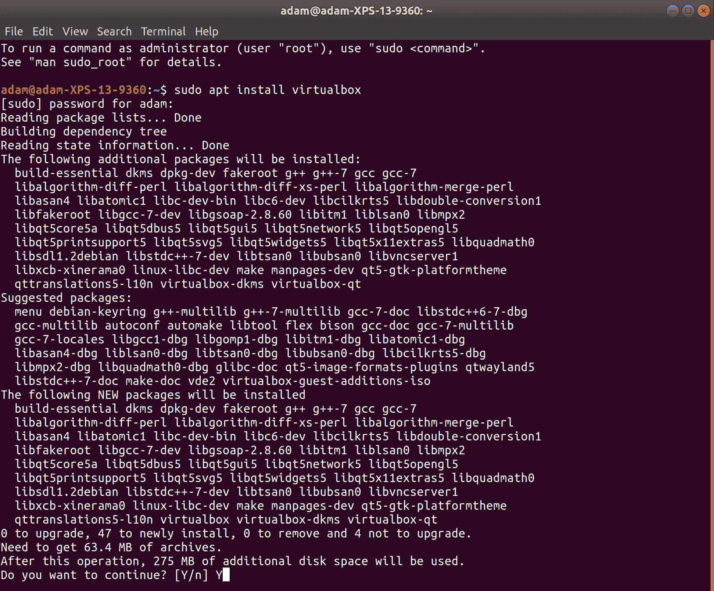

完成后，您应该已经安装了一个可用的 VirtualBox。

# 图形安装

如果愿意，您也可以通过 Ubuntu 软件安装 VirtualBox。

只需搜索您想要的软件，在本例中是 VirtualBox，并转到其商店页面。

然后，点击安装，软件包将被安装，无需终端！

安装后，您的屏幕将更改以显示启动和删除选项。

# 在 macOS 上安装 VirtualBox

虽然我正在使用 Ubuntu，但如果您不是，也不是世界末日。macOS 也是一个很好的操作系统，并且方便的是它支持 VirtualBox。

在本教程中，我们将介绍在 macOS 中安装 VirtualBox 的几种方法。您会发现，无论您使用的操作系统是什么，布局都非常相似。

# 命令行安装

如果您已经安装了命令行程序`brew`，那么获取 VirtualBox 就像运行以下命令一样简单：

```
$ brew cask install virtualbox
```

您可能会被提示输入超级用户密码以完成安装。

Homebrew 可以从[`brew.sh/`](https://brew.sh/)获得，并且实际上是 macOS 需要但默认没有的软件包管理器。我不建议盲目地从神秘的网站运行脚本，所以在您决定冒险安装 brew 之前，请确保您了解正在执行的操作（阅读代码）。

# 图形安装

Oracle 还为 macOS 提供了安装镜像，如果您愿意以更传统的方式安装。

只需转到[`www.virtualbox.org/wiki/Downloads`](https://www.virtualbox.org/wiki/Downloads)并选择 OS X hosts 选项。

这将提示您将安装程序下载到本地系统，然后您可以解压并安装。

在安装过程中，您可能会被提示输入超级用户密码。

# 在 Windows 上安装 VirtualBox

如果您的计算机上没有使用 Linux 版本，也没有使用 macOS，那么您很可能在运行 Windows（除非您已经在桌面上深入研究了 FreeBSD 或类似的操作系统，在这种情况下我无法帮助您-我们需要整整一个下午）。

如果使用 Windows，我可以再次建议 VirtualBox，因为它具有跨操作系统的特性，并且可以再次从 Oracle 的网站上安装。

# 图形安装

像 macOS 安装一样，转到[`www.virtualbox.org/wiki/Downloads`](https://www.virtualbox.org/wiki/Downloads)并选择 Windows hosts 选项：

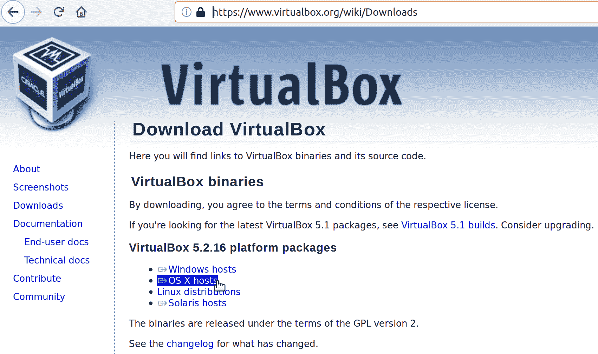

这将下载一个可执行文件。

值得注意的是，如果您尝试同时运行多个虚拟化解决方案，Windows 可能会抱怨。如果您之前运行过 Hyper-V 或 Docker，并且在尝试启动 VirtualBox 虚拟机时遇到问题，请先尝试禁用其他解决方案。

# 手动安装我们选择的发行版

哦，这是一次旅程，我们甚至还没有正式开始！

接下来，我们将手动设置一个虚拟机。但不要担心！我们还将研究使用 Vagrant 自动化此过程，以避免在本书的其余部分中执行重复的步骤。

如果您已经熟悉安装 CentOS，可以完全跳过本节。我已经在本书的其余部分提供了 Vagrantfiles，用于自动化我们将要使用的虚拟机。

# 获取我们的 CentOS 安装媒体

Linux 发行版的主要分发方式是 ISO 镜像。然后可以将这些镜像刻录到 DVD 上，或者挂载到虚拟机以引导。

前往[`centos.org/download/`](https://centos.org/download/)，看看提供的选项。

我将下载最小 ISO，原因很快就会变得清楚。

点击后应该会带您到一个镜像页面：

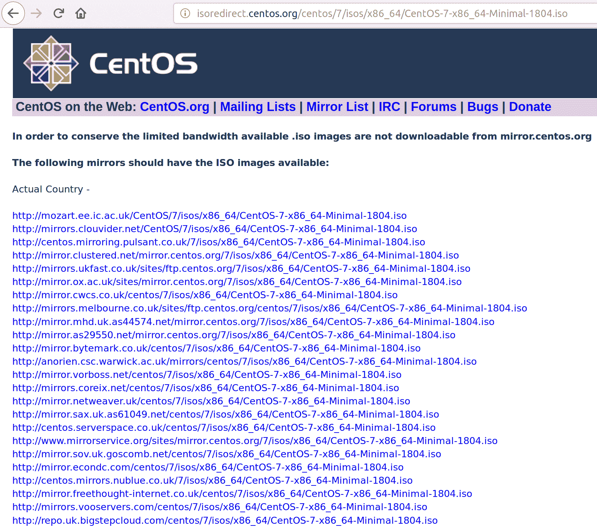

这是 CentOS 项目为节省带宽而采取的措施，通过提示最终用户从任意数量的不同主机下载。他们可以将带宽成本分摊给志愿者。

你会发现这些提供者通常分为两类，但也有例外。通常，这些镜像是由大学或托管提供商提供的。我内心的怀疑者认为，托管提供商提供镜像服务是一种易于营销的方式，而不是一种慈善举动。

选择一个靠近您的下载位置，并等待下载完成。

您可能会注意到其中一个下载选项是通过 Torrent。通过 Torrent 下载是一种将带宽成本分摊给多个人的好方法，并且允许从多个位置下载软件的小部分大大减少了任何一个来源的负载。但应该注意，一些工作场所会注意他们的网络上是否有这种类型的流量，因为 Torrent 下载的声誉。

# 检查校验和

一旦下载完成（可能需要一段时间，因为即使是最小的也很大），您将面对一个 ISO 镜像。

在我的 Ubuntu 安装中，我可以在我的`Downloads`文件夹中看到它：

```
$ ls ~/Downloads/
CentOS-7-x86_64-Minimal-1804.iso
```

确认我们的安装媒体并确保我们已经下载了我们期望的内容的一种方法是比较已下载文件的`Sha256`总和与已知良好值。这既证明了它是我们期望的下载，也检查了文件下载过程中是否发生了损坏。

CentOS 提供了一个发布说明页面，我们可以访问以找到我们要比较的`Sha256`总和：[`wiki.centos.org/Manuals/ReleaseNotes`](https://wiki.centos.org/Manuals/ReleaseNotes)。

点击进入 CentOS 7 的发布说明，这应该会带您到最新版本的发布说明。

在这个页面上，我们可以滚动到验证已下载安装镜像，其中将列出下载镜像的当前`Sha256`总和。

始终确保您获取已知良好的`Sha256`值的网站本身是合法的。

在我的情况下，我可以看到我刚下载的文件的`Sha256`值如下：

```
714acc0aefb32b7d51b515e25546835e55a90da9fb00417fbee2d03a62801efd  CentOS-7-x86_64-Minimal-1804.iso
```

有了这个，我可以回到终端中列出文件的地方，并运行一个基本命令来检查已下载镜像的`Sha256`值：

```
$ sha256sum CentOS-7-x86_64-Minimal-1804.iso 
714acc0aefb32b7d51b515e25546835e55a90da9fb00417fbee2d03a62801efd  CentOS-7-x86_64-Minimal-1804.iso
```

将 CentOS 网站上的值与我下载的镜像的值进行比较，确认它们是相同的。

媒体与我们预期的一样！

`Sha256`检查也可以在 Windows 和 macOS 上进行。在 macOS 上，可以使用内置工具来完成，但 Windows 可能需要其他软件。

# 设置我们的虚拟机

现在我们有了媒体并且 VirtualBox 已安装，是时候手动进行机器配置（技术术语）并安装 CentOS 了。

在这一部分，我们将配置一个小型虚拟机，但即使这样也会消耗处理能力、内存和磁盘空间。始终确保您有适当的资源可用于您要创建的机器。在这种情况下，至少需要 50GB 的可用磁盘空间和至少 8GB 的内存。

# VirtualBox 主窗口

启动后，您将看到 VirtualBox 主窗口。目前，我们只对左上角的“新建”按钮感兴趣。您需要点击“新建”按钮。

接下来，您将被提示为您的虚拟机命名。

将您的第一台机器命名为`CentOS-1`。

注意当您为机器命名时，类型和版本会自动检测您输入的内容，并根据需要重新配置选择。

在这种情况下，它给我们提供了 Linux 类型和 Red Hat 版本（64 位）。这没问题，因为我们之前说过 CentOS 和 Red Hat Enterprise Linux 非常接近。

点击下一步。

64 位是操作系统的架构，尽管您安装的操作系统必须受到您的 CPU 支持（大多数 CPU 现在都是 x86_64）。常见的架构一直是 x86（32 位）和 x86_64（64 位），但最近 x86 变种已经逐渐消失。如今最常见的安装是 x86_64，尽管 ARM 和 aarch64 机器变得越来越普遍。在本书中，我们只会使用 x86_64 机器。

现在，我们必须配置要为我们的机器提供的内存量。如果受到限制，您可以将其设置为低于默认值`1024`MB（1GB），但 1,024MB 是一个合理的起点，如果需要，我们随时可以调整它。

现在，我们将被提示为我们的虚拟系统配置硬盘。

保留默认选项“现在创建虚拟硬盘”，并点击创建。

您将被提示选择类型。保留默认选择，即 VDI（VirtualBox 磁盘映像）。

您将有选择随时间分配磁盘空间（动态分配）或一次性分配所有空间（固定大小）的选项。我倾向于将其保留为动态分配。

接下来，您将被提示选择磁盘的位置和大小。我建议将磁盘保留在默认位置，并且暂时默认大小的`8`GB 应该足够开始使用。

点击创建。

如果一切顺利，您将返回主窗口，并且新的虚拟机应该会显示在左侧处于“已关闭”状态。

# CentOS 安装

现在我们有了虚拟机，是时候在上面安装我们的操作系统了。

在主 VirtualBox 窗口顶部点击“启动”，选择您的虚拟机，应该会提示您首先选择启动盘。

我已经导航到我的“下载”文件夹，并选择了之前下载的镜像。

按下“启动”将从我们的媒体引导机器。

您将在虚拟机中看到选项屏幕，默认选择了“测试此媒体并安装 CentOS 7”。

我通常按下箭头键（在虚拟机窗口内）只选择安装 CentOS 7 并跳过媒体检查，尽管您可能希望进行测试。

如果您使用物理媒体来安装机器（DVD 或 CD），在安装之前进行媒体测试可能是个好主意。

按下*Enter*将继续安装。

您将被提示选择您的语言。我选择英语，因为我只会一种语言。

完成后，您将会发现自己在最新的 CentOS 安装程序的起始页面上：

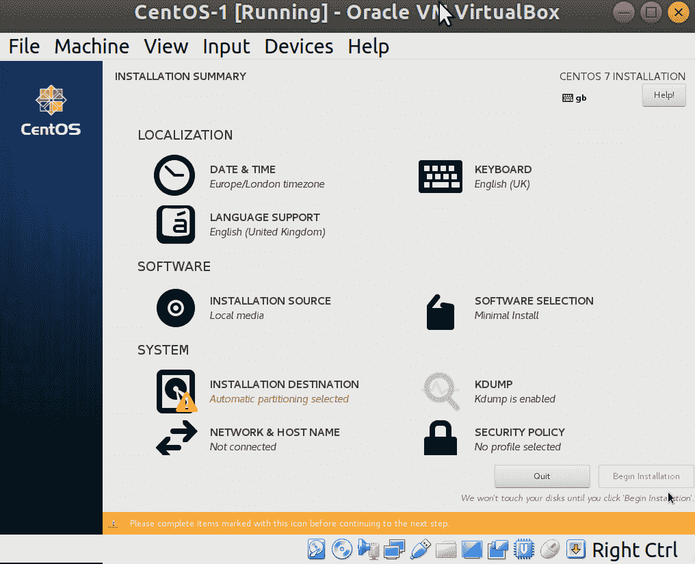

注意底部的消息，建议需要完成标有黄色图标的项目。

因为我们的日期/时间、键盘和语言都是正确的，我们将继续进行下一步，但如果对您来说有错，可以随时更正。

注意，在“安装源”下我们选择了“本地媒体”，在“软件选择”下我们选择了“最小安装”。这是我们之前选择最小镜像的结果，并给了我们一个很好的机会来谈论通过互联网进行安装。

首先，我们需要配置我们的网络。点击“网络和主机名”来做这个。

你应该有一个以太网设备，作为制作 VM 时默认配置的一部分。

切换设备名称右侧的开/关切换，并检查网络值是否与我的类似：

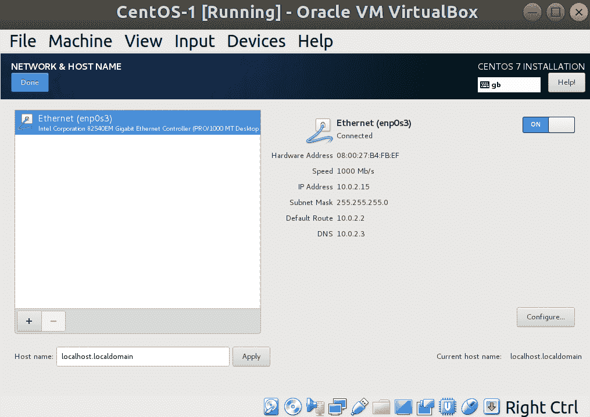

VirtualBox 默认创建一个 NAT 网络，这意味着你的 VM 不在与主机计算机完全相同的网络上。相反，VM 存在于一个独立的网络中，但通过主机机器有通往外部世界的路径。

在左上角按“完成”来完成我们的网络设置（暂时）！

回到主屏幕，点击“安装源”：

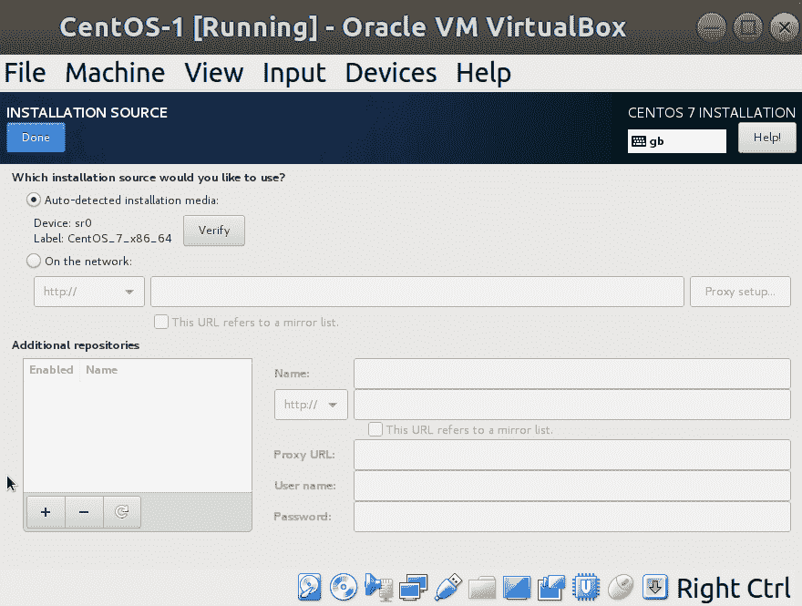

在这个屏幕上，你可以看到自动检测到的媒体实际上是我们的磁盘映像（`sr0`是 Linux 对光驱的表示）。

将选中的单选按钮更改为“在网络上”。

在 URL 栏中填入以下内容：

```
mirror.centos.org/centos/7/os/x86_64/
```

你最终会看到以下截图：

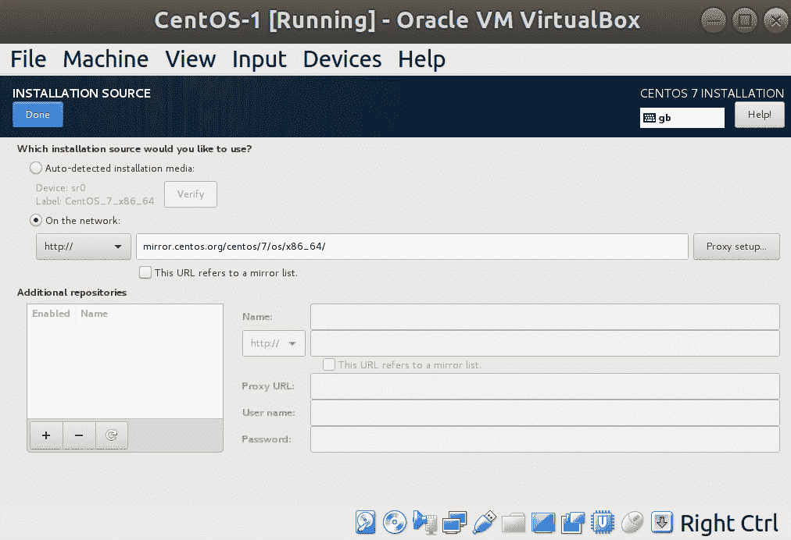

在左上角按“完成”。

一旦你回到主屏幕，会显示你的软件源已经改变，你需要通过进入“软件选择”窗口来验证这一点。继续进行。

浏览不同的选项，但现在保留“最小安装”选中并点击“完成”：

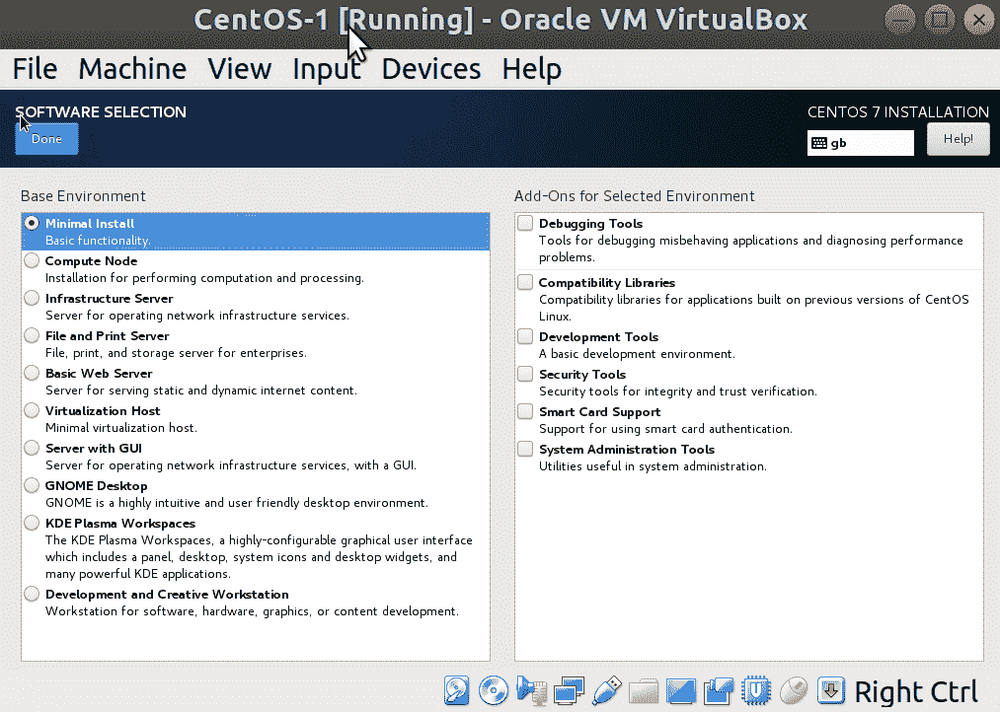

从主屏幕上做的最后一件事是设置我们的“安装目的地”。点击进入这个屏幕。

看看选项，但现在我们不打算改变默认的分区布局，或者加密我们的磁盘。你还应该看到默认选择的磁盘是我们的 8GB VirtualBox 磁盘。

点击“完成”（你不需要做任何更改，但安装程序至少让你进入这个屏幕）：

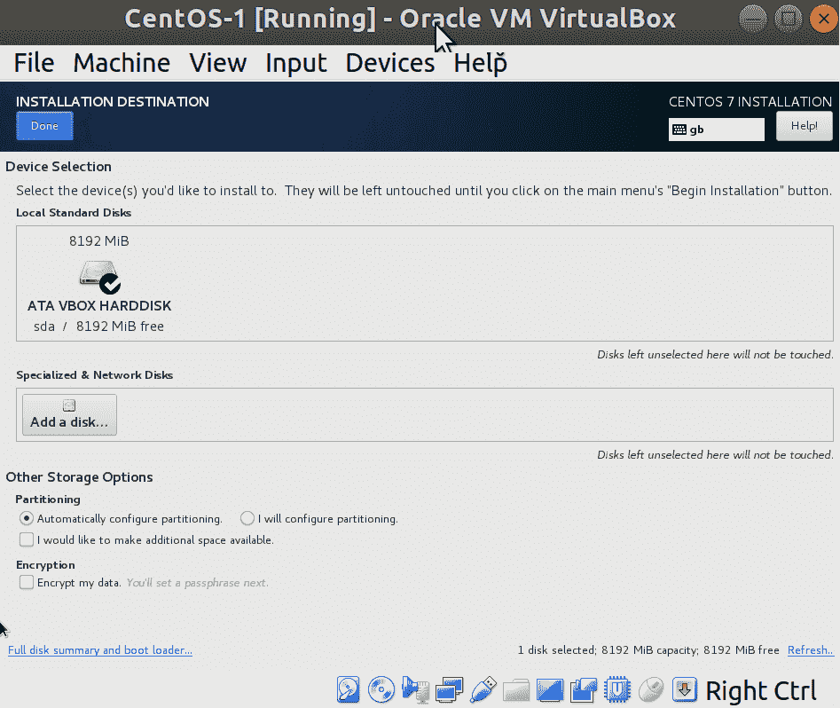

我们终于完成了我们（相当基本的）配置。在主屏幕底部点击“开始安装”按钮。

你会看到安装开始，并在等待时会看到以下屏幕：

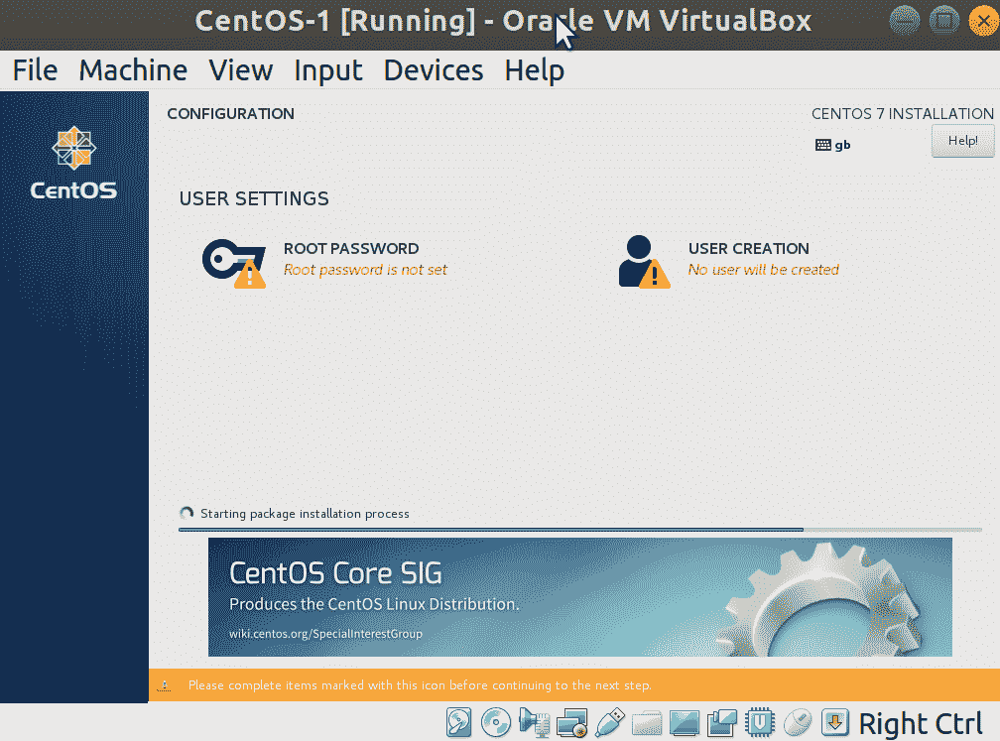

依次点击顶部的选项，设置`root`密码并创建一个用户。

`root`用户类似于 Windows 系统上的管理员；它是全能的，在错误的手中可能会很危险。有些发行版甚至在安装时都不提示你设置 root 密码，而是让你使用自己的用户和`su`或`sudo`。

在创建用户时，也将其标记为管理员：

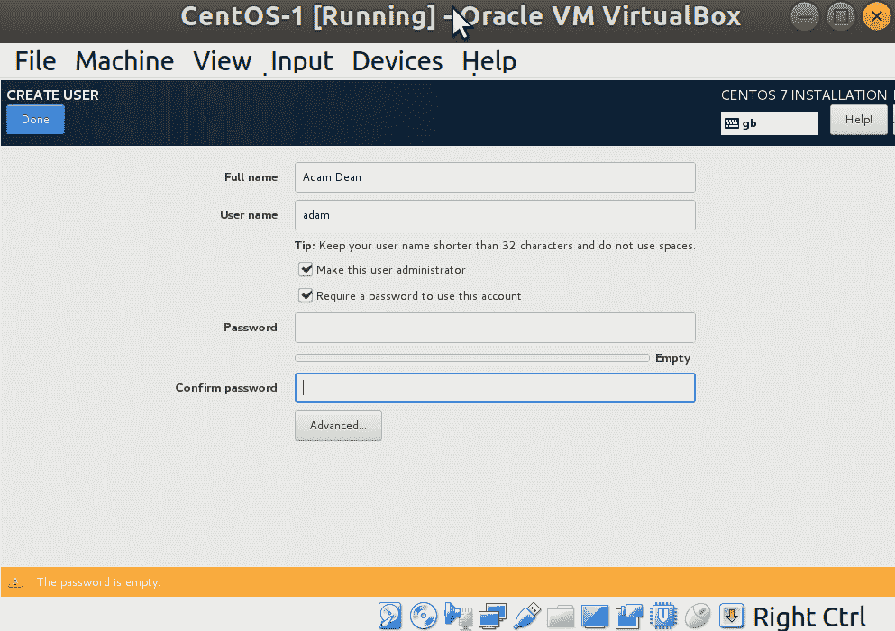

点击“完成”将带你回到安装进度屏幕，你可能会被提示完成安装的其余部分，并最终被要求重新启动到你新安装的系统中。

没有理智的人应该产生那么多的截图。

# 访问和更新我们的 VM

现在我们已经安装了 VM，我们将登录并快速查看一下。

# 从 VirtualBox 窗口登录

点击进入我们的 VM，就像我们在安装时所做的那样，允许我们在登录提示符处输入：

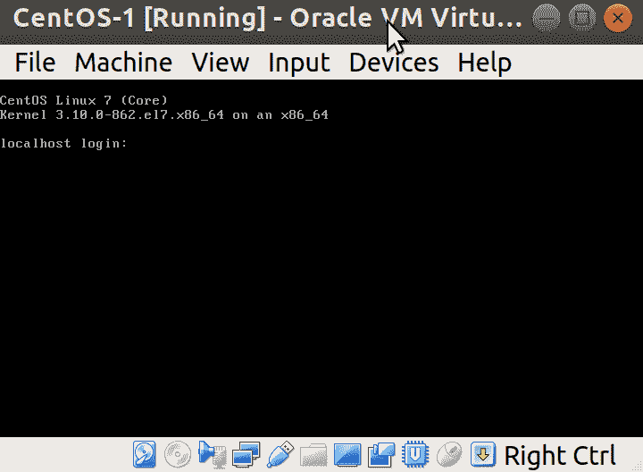

我们将使用安装时创建的用户，而不是 root。

注意，你还会得到有关自上次登录以来的登录尝试的一些信息。在这种情况下，我第一次尝试登录失败了，它告诉我这一点：

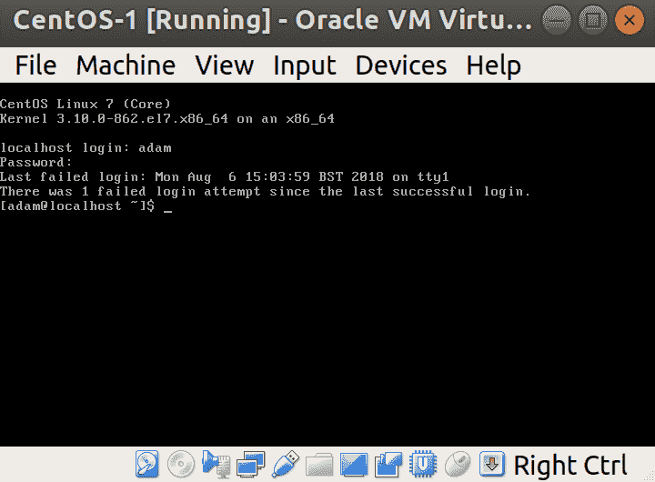

恭喜-你已经安装了 CentOS！

很少见到安装了**图形用户界面**（**GUI**）的 Linux 服务器，尽管确实会发生。在我使用过的成千上万台服务器中，我只能用一只手数出安装了 GUI 的次数。通常会导致短暂的困惑和苦恼，然后得出结论，即肯定是有人不小心安装了 GUI - 没有其他解释。

在我们继续之前，我们将运行一个快速命令来查找我们机器的 IP 地址：

```
$ ip a
```

`ip a`是输入`ip address`的一种简写方式，我们稍后会更详细地介绍。

这给了我们很多网络信息，但至关重要的是它给了我们网络接口的`inet`地址，即`10.0.2.15`：

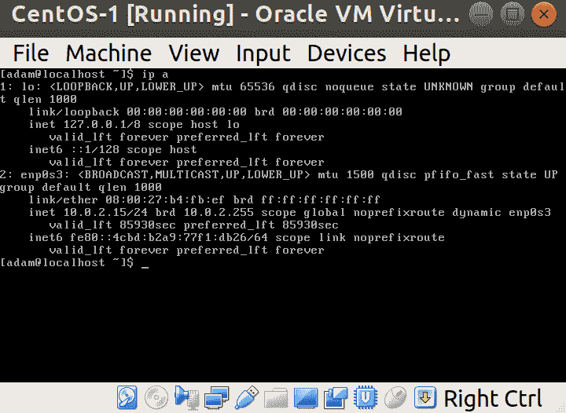

# 从主机终端登录

因为使用 VirtualBox 界面有点麻烦（使得复制和粘贴之类的事情变得棘手），所以有一个更优雅的连接和与我们的机器交互的方法是有意义的。

**安全外壳**（**SSH**）是我们将要使用的工具，因为它提供了一种快速和安全的连接远程机器的方式。

原生 SSH 客户端适用于 macOS 和所有 Linux 发行版。Windows 在这方面也取得了一些进展，尽管我知道在 Windows 上使用 SSH 的最简单方法仍然是下载一个名为 PuTTY 的程序。

把 SSH 想象成 Windows 远程桌面协议。如果你是这个领域的新手，它通常更快，因为它不需要向你传输图形连接。SSH 完全是基于文本的。

使用我们刚才的 IP 地址，我们将尝试从主机（你在 VirtualBox 上运行的机器）SSH 到我们的虚拟机：

```
$ ssh adam@10.0.2.15
ssh: connect to host 10.0.2.15 port 22: Connection refused
```

哦，不！有些不对劲！

我们还没有连接，连接显然被拒绝了！

# 确保 sshd 正在运行

首先，我们要确保`sshd`的服务器组件正在运行，方法是登录到 VirtualBox 中的虚拟机并运行以下命令：

```
$ sudo systemctl enable sshd
$ sudo systemctl start sshd
```

你应该被提示（至少一次）输入之前设置的用户密码。

我们正在启用`sshd`服务，使其在服务器启动时启动第一个命令，并立即启动它（这样我们就不必重新启动虚拟机）。

# 确保 VirtualBox 让我们通过

仅仅启动`sshd`还不足以让我们从主机连接到虚拟机，我们还必须为 VirtualBox NAT 网络设置一些端口转发。

端口转发是手动指定流量如何穿越 NAT 网络的方法。如果你在 2000 年代中期玩 Diablo 2 或魔兽争霸 III，你可能会很有趣地尝试让端口转发与你家里的路由器一起工作。

从主 VirtualBox 窗口，突出显示你的虚拟机并点击顶部的设置。转到网络部分并点击高级旁边的箭头以展开更大的部分。点击端口转发：

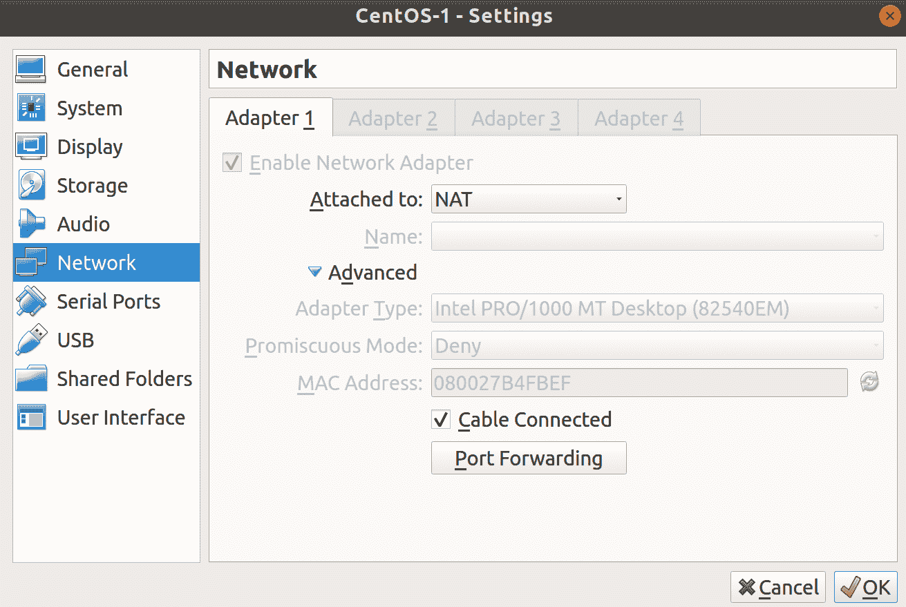

在弹出的新窗口中，点击右侧添加新规则，并使用以下截图中的设置填充它，如果你的 Guest IP 不同，就替换它：

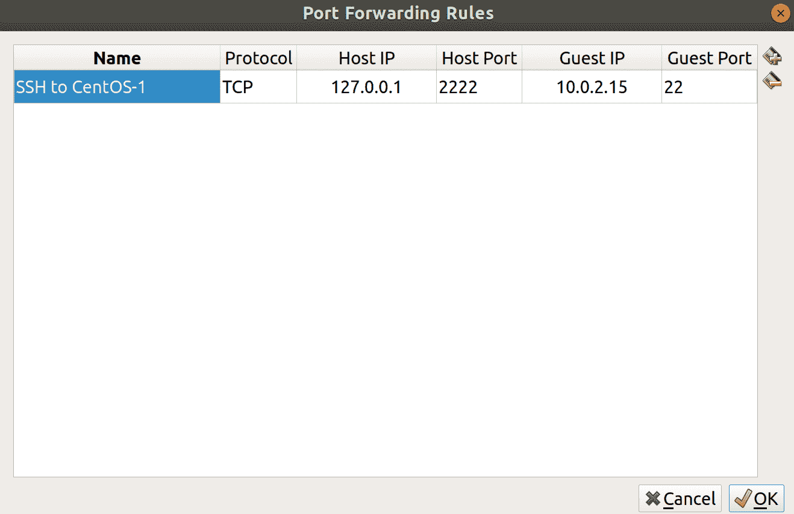

请注意，我们实际上是将我们主机上的`127.0.0.1:2222`映射到我们虚拟机上的`10.0.2.15:22`。我们设置了这样的连接尝试，使得任何连接尝试都会被转发到端口`22`的虚拟机，从而连接到我们主机机器的`localhost`地址上的端口`2222`。

在给出的示例中，`2222`是完全随机的 - 它可以是`8222`，`5123`，`2020`等等。我选择`2222`是为了方便。你不应该尝试使用低于`1024`的端口进行这种操作，因为这些端口只允许 root 访问。

我们现在可以尝试我们刚刚设置的 SSH 命令：

```
$ ssh adam@127.0.0.1 -p2222
The authenticity of host '[127.0.0.1]:2222 ([127.0.0.1]:2222)' can't be established.
ECDSA key fingerprint is SHA256:M2mQKN54oJg3B1lsjJGmbfF/G69MN/Jz/koKHSaWAuU.
Are you sure you want to continue connecting (yes/no)? yes
Warning: Permanently added '[127.0.0.1]:2222' (ECDSA) to the list of known hosts.
adam@127.0.0.1's password: 
```

关于这个命令有一些要解释的事情。

我通过使用`adam@`指定了用户名，并告诉 SSH 尝试连接到本地地址`127.0.0.1`，以及我们选择的端口，即`2222`。

我们会看到主机的指纹，稍后我们会更详细地讨论，并且我们会接受它。

然后，我们将使用在 VM 中设置的密码登录我们的用户：

```
Last login: Mon Aug  6 15:04:26 2018
[adam@localhost ~]$ 
```

成功！

现在我们可以像处理真实服务器一样处理我们的 VM - 只需确保在运行任何命令时您在 VM 上。

# 更新我们的 VM

现在我们已经可以访问我们的机器，我们将运行一个命令，以确保我们拥有所有安装软件的最新版本：

```
$ sudo yum update
```

运行时，您可能会看到一个需要更新的软件的长列表。输入*Y*进行确认并按*Enter*将处理此软件的升级，以及任何需要的依赖软件。您可能还会被提示接受新的或更新的 GPG 密钥。

GPG 是一本书的内容 - 不是一本令人兴奋的书，但肯定是一本书。

如果您升级了不断运行的软件，比如 Apache web 服务器，最好安排重新启动该服务，以确保使用新版本。

一般来说，只有内核和 init（初始化）系统在更新后才需要完全系统重启。这与 Windows 有着明显的不同，Windows 似乎设计用于重启，而实际工作只是副产品。

在我的情况下，我的内核得到了更新。我可以通过以下方式确认这一点。

首先，我们列出已安装的`kernel`包的版本：

```
$ yum info kernel
Loaded plugins: fastestmirror
Loading mirror speeds from cached hostfile
 * base: repo.uk.bigstepcloud.com
 * extras: mirror.sov.uk.goscomb.net
 * updates: mirrors.melbourne.co.uk
Installed Packages
Name        : kernel
Arch        : x86_64
Version     : 3.10.0
Release     : 862.el7
Size        : 62 M
Repo        : installed
From repo   : anaconda
Summary     : The Linux kernel
URL         : http://www.kernel.org/
Licence     : GPLv2
Description : The kernel package contains the Linux kernel (vmlinuz), the core of any
 : Linux operating system.  The kernel handles the basic functions
 : of the operating system: memory allocation, process allocation, device
 : input and output, etc.

Name        : kernel
Arch        : x86_64
Version     : 3.10.0
Release     : 862.9.1.el7
Size        : 62 M
Repo        : installed
From repo   : updates
Summary     : The Linux kernel
URL         : http://www.kernel.org/
Licence     : GPLv2
Description : The kernel package contains the Linux kernel (vmlinuz), the core of any
 : Linux operating system.  The kernel handles the basic functions
 : of the operating system: memory allocation, process allocation, device
 : input and output, etc.
```

然后，我们使用`uname`检查当前正在使用的内核的版本：

```
$ uname -a
Linux localhost.localdomain 3.10.0-862.el7.x86_64 #1 SMP Fri Apr 20 16:44:24 UTC 2018 x86_64 x86_64 x86_64 GNU/Linux
```

从中我们可以看到我们正在运行版本`3.10.0-862.el7`，但我们也有`3.10.0-862.9.1.el7`。

重新启动系统会导致在启动时选择新的内核，再次运行`uname`会显示不同的结果：

```
$ uname -a
Linux localhost.localdomain 3.10.0-862.9.1.el7.x86_64 #1 SMP Mon Jul 16 16:29:36 UTC 2018 x86_64 x86_64 x86_64 GNU/Linux
```

万岁 - 我们正在运行更新的内核！

# 了解 VM 的不同之处

早些时候，我们开始谈论 VM 和它们是什么。现在我们将从机器内部看一下几种确定我们是否在 VM 中的方法。

如果我从托管提供商那里获得了一个新的**虚拟专用服务器**（**VPS**），并想知道用于虚拟化我的新机器的软件是什么，我通常会这样做。

# dmidecode

我最喜欢的工具之一，dmidecode，可以用来转储计算机的**桌面管理接口**（**DMI**）表。在实践中，这意味着它可以用来查找在机器中运行的硬件类型。

此命令需要 root 访问权限，因此在这些示例中我们将一直使用`sudo`。

首先，我们将列出可以传递给 dmidecode 的有效`types`：

```
$ dmidecode --type
dmidecode: option '--type' requires an argument
Type number or keyword expected
Valid type keywords are:
 bios
 system
 baseboard
 chassis
 processor
 memory
 cache
 connector
 slot
```

从顶部开始，我们将使用`bios`，看看它是否给我们一些有用的东西：

```
$ sudo dmidecode --type bios
# dmidecode 3.0
Getting SMBIOS data from sysfs.
SMBIOS 2.5 present.

Handle 0x0000, DMI type 0, 20 bytes
BIOS Information
 Vendor: innotek `GmbH`
 Version: VirtualBox
 Release Date: 12/01/2006
 Address: 0xE0000
 Runtime Size: 128 kB
 ROM Size: 128 kB
 Characteristics:
 ISA is supported
 PCI is supported
 Boot from CD is supported
 Selectable boot is supported
 8042 keyboard services are supported (int 9h)
 CGA/mono video services are supported (int 10h)
 ACPI is supported
```

立即，我们可以在`Version`旁边看到`VirtualBox`，这是一个相当明显的暗示，表明我们正在处理一个 VM。

接下来，我们将选择其他内容，`system`：

```
$ sudo dmidecode --type system
# dmidecode 3.0
Getting SMBIOS data from sysfs.
SMBIOS 2.5 present.

Handle 0x0001, DMI type 1, 27 bytes
System Information
 Manufacturer: innotek GmbH
 Product Name: VirtualBox
 Version: 1.2
 Serial Number: 0
 UUID: BDC643B8-8D4D-4288-BDA4-A72F606CD0EA
 Wake-up Type: Power Switch
 SKU Number: Not Specified
 Family: Virtual Machine
```

再次看到这里的`Product Name`是`VirtualBox`，`Family`是`Virtual Machine`，这两者都是相当有力的证据。

最后，我们将查看`Chassis Information`：

```
$ sudo dmidecode --type chassis
# dmidecode 3.0
Getting SMBIOS data from sysfs.
SMBIOS 2.5 present.

Handle 0x0003, DMI type 3, 13 bytes
Chassis Information
 Manufacturer: Oracle Corporation
 Type: Other
 Lock: Not Present
 Version: Not Specified
 Serial Number: Not Specified
 Asset Tag: Not Specified
 Boot-up State: Safe
 Power Supply State: Safe
 Thermal State: Safe
 Security Status: None
```

甲骨文公司再次是一个重要的信息，让我们相信我们处于一个虚拟化的环境中。

如果我们不想要很多其他信息，我们可以使用 dmidecode 的`-s`选项来微调我们的搜索。

运行此选项而不带参数会输出一个我们可以使用的潜在参数列表：

```
$ sudo dmidecode -s
dmidecode: option requires an argument -- 's'
String keyword expected
Valid string keywords are:
 bios-vendor
 bios-version
 bios-release-date
 system-manufacturer
 system-product-name
 system-version
 system-serial-number
 system-uuid
 baseboard-manufacturer
 baseboard-product-name
 baseboard-version
 baseboard-serial-number
 baseboard-asset-tag
 chassis-manufacturer
 chassis-type
 chassis-version
 chassis-serial-number
 chassis-asset-tag
 processor-family
 processor-manufacturer
 processor-version
 processor-frequency
```

在这里，我们可以立即看到`bios-version`，正如我们之前所知道的，它应该是`VirtualBox`：

```
$ sudo dmidecode -s bios-version
VirtualBox
```

这些类型的短输出命令对于脚本编写非常有用，有时简洁是可取的。

dmidecode 通常默认安装，至少在 Ubuntu 和 CentOS 安装中是这样。

# lshw

如果 dmidecode 不可用，您也可以使用`lshw`，这是一个列出硬件的命令。同样，它利用设备上的 DMI 表。

我们可以很快地使用`lshw`的格式选项来显示系统的总线信息：

```
$ sudo lshw -businfo
Bus info Device Class Description
=====================================================
 system VirtualBox
 bus VirtualBox
 memory 128KiB BIOS
 memory 1GiB System memory
cpu@0 processor Intel(R) Core(TM) i7-7500U CPU @ 2.70GHz
pci@0000:00:00.0 bridge 440FX - 82441FX PMC [Natoma]
pci@0000:00:01.0 bridge 82371SB PIIX3 ISA [Natoma/Triton II]
pci@0000:00:01.1 scsi1 storage 82371AB/EB/MB PIIX4 IDE
scsi@1:0.0.0 /dev/cdrom disk CD-ROM
pci@0000:00:02.0 display VirtualBox Graphics Adapter
pci@0000:00:03.0 enp0s3 network 82540EM Gigabit Ethernet Controller
pci@0000:00:04.0 generic VirtualBox Guest Service
pci@0000:00:05.0 multimedia 82801AA AC'97 Audio Controller
pci@0000:00:06.0 bus KeyLargo/Intrepid USB
usb@1 usb1 bus OHCI PCI host controller
pci@0000:00:07.0 bridge 82371AB/EB/MB PIIX4 ACPI
pci@0000:00:0d.0 scsi2 storage 82801HM/HEM (ICH8M/ICH8M-E) SATA Controller [AHCI mode]
scsi@2:0.0.0 /dev/sda disk 8589MB VBOX HARDDISK
scsi@2:0.0.0,1 /dev/sda1 volume 1GiB Linux filesystem partition
scsi@2:0.0.0,2 /dev/sda2 volume 7167MiB Linux LVM Physical Volume partition
 input PnP device PNP0303
 input PnP device PNP0f03
```

这给了我们一些关于虚拟机的信息，比如系统、总线和显示条目。

我们还有一个易于阅读的类别可用的详细信息，这意味着我们可以直接查询这些信息，从这个例子开始，首先是`disk`：

```
$ sudo lshw -c disk
 *-cdrom 
 description: DVD reader
 product: CD-ROM
 vendor: VBOX
 physical id: 0.0.0
 bus info: scsi@1:0.0.0
 logical name: /dev/cdrom
 logical name: /dev/sr0
 version: 1.0
 capabilities: removable audio dvd
 configuration: ansiversion=5 status=nodisc
 *-disk
 description: ATA Disk
 product: VBOX HARDDISK
 vendor: VirtualBox
 physical id: 0.0.0
 bus info: scsi@2:0.0.0
 logical name: /dev/sda
 version: 1.0
 serial: VB5cbf266c-3015878d
 size: 8GiB (8589MB)
 capabilities: partitioned partitioned:dos
 configuration: ansiversion=5 logicalsectorsize=512 sectorsize=512 signature=000b6a88
```

或者，如果我们认为这是太多的信息，我们可以查询系统类：

```
$ sudo lshw -c system
localhost.localdomain 
 description: Computer
 product: VirtualBox
 vendor: innotek GmbH
 version: 1.2
 serial: 0
 width: 64 bits
 capabilities: smbios-2.5 dmi-2.5 vsyscall32
 configuration: family=Virtual Machine uuid=BDC643B8-8D4D-4288-BDA4-A72F606CD0EA
```

# 快速 sudo 解释

在前面的配方中给出的各种命令中，我们反复使用了`sudo`。这是为了我们不必以`root`用户登录来执行各种受限制的操作。

`sudo`是'superuser do'的缩写，因为`sudo`过去只用于以"超级用户"身份运行命令，现在你可以用它以各种用户的身份运行命令。

通常，如果你尝试运行一个你没有权限成功完成的命令，你会收到一个错误提示：

```
$ less /etc/sudoers 
/etc/sudoers: Permission denied
```

在这里，我试图查看`/etc/sudoers`文件，这也恰好是决定用户`sudo`权限的文件。

用`sudo`运行这个命令就是另一回事了。它会为我打开文件，将我放入`less`分页器。

在这个文件的底部，我们找到以下的代码块：

```
## Allows people in group wheel to run all commands
%wheel  ALL=(ALL)       ALL
```

这个代码块中的`wheel`部分是没有被注释的，上面的文本告诉我们这意味着什么。

因此，显而易见的下一个问题是，我是否在`wheel`组中？

术语`wheel`在古老的 UNIX 安装中有着悠久的历史。这些天，它可能被称为`admin`或其他。CentOS 通过使用`wheel`保持了经典。

幸运的是，这很容易检查 - 问题文件总是在同一个地方：`/etc/group`。

在这里，我们将`group`文件的内容打印到屏幕上，并特别查找`wheel`。

我们看到以下的布局：

```
group_name:password:GID:user_list
```

我们可以看到`group_name`是`wheel`，`password`是一个小写的`x`，这意味着正在使用影子密码，组 ID 是`10`，而这个组中唯一的用户就是我自己：

```
$ sudo cat /etc/group | grep wheel
wheel:x:10:adam
```

我们甚至可以用一个单词来做到这一点，那就是`groups`命令，它会打印出你当前用户所属的组：

```
$ groups
adam wheel
```

被授予使用`sudo`运行超级用户命令的能力并不是每个系统上的每个人的直接权利，这取决于个别公司和管理团队决定如何分配这种权力。

有些地方的运维人员都有`sudo`的权限，而有些地方只有一个人有这个权限。

# 使用 Vagrant 自动配置虚拟机

每次想要测试新东西或创建一个沙盒来工作时，都要重复安装新的虚拟机会很快变得乏味。

因此，各种管理员和开发人员想出了解决方案，使得配置虚拟机（或多个虚拟机）变得轻而易举。

如果我们花点时间考虑一下这种方法的优势，很容易就能突出自动化虚拟机配置的一些好处：

+   它消除了手动输入答案到虚拟机窗口中所需的时间。

+   它允许在开发环境中自动运行软件测试。

+   它允许共享文本文件，作为构建虚拟机的配方，而不是在各个站点之间传输大型虚拟机镜像。这是一种**基础设施即代码**（**IaC**）的形式。

# Kickstart

自动部署盒子的一种方法是 kickstart 文件，它经常用于大型部署中自动回答安装程序向用户提出的问题。

如果你在 CentOS 虚拟机的`/root/`文件夹中查看，很有可能会找到一个名为`anaconda-ks.cfg`的文件，这实际上是你在安装机器时执行手动步骤的 kickstart 文件（anaconda 是安装程序的名称）。

这些文件被调整或从头开始编写，然后托管在 Web 服务器上，放在一个未配置的机器上，准备好被拾取。

# Vagrant

在本地，kickstart 文件并不是很实用，而且使用起来也不太快。我们需要一些可以快速轻松设置的东西，但又非常强大。

输入`Vagrant`。

Vagrant 由 Hashicorp 开发为开源软件，可用于自动配置 VM 甚至整个开发环境。

通常，您可能会在某个内部应用程序的存储库中找到一个`Vagrantfile`（核心 Vagrant...文件...）的名称。

开发人员将应用程序的存储库下载到他们的本地计算机，并使用 Vagrant 配置文件启动本地开发环境，然后他们可以使用该环境测试代码更改或功能添加，而不需要使用昂贵的开发环境。

Vagrant 适用于 macOS、Linux 和 Windows。

在我的 Ubuntu 主机上，我安装 Vagrant 如下：

```
$ sudo apt install vagrant
```

之后会有相当多的依赖项，总共使用了大约 200MB 的磁盘空间。

Ubuntu 的软件包相当新，所以我们得到了一个最新版本：

```
$ vagrant --version
Vagrant 2.0.2
```

我对文件存放的位置非常挑剔，所以我将在我的主目录中创建一个名为`Vagrant`的专用文件夹，用于处理我的 Vagrant VM：

```
$ ls
 Desktop     Downloads   Pictures   snap        Videos
 Documents   Music       Public     Templates  'VirtualBox VMs'
$ mkdir Vagrant
$ cd Vagrant/
```

接下来，我们将初始化一个新的`Vagrantfile`。以下命令将自动执行此操作：

```
$ vagrant init
$ ls
Vagrantfile
```

查看`Vagrantfile`，但暂时不要进行任何更改。您会看到许多选项都已列出，但默认情况下都已注释掉。这是一个很好的介绍，让您了解 Vagrant 的功能。

请注意，默认情况下，Vagrant 将尝试使用一个名为`base`的盒子，但也会提示您查看[`vagrantcloud.com/search`](https://vagrantcloud.com/search)以获取其他盒子：

```
 # Every Vagrant development environment requires a box. You can search for
 # boxes at https://vagrantcloud.com/search.
 config.vm.box = "base"
```

在`vagrantcloud`上搜索 CentOS 会发现一个很好的默认盒子可供使用：[`app.vagrantup.com/centos/boxes/7`](https://app.vagrantup.com/centos/boxes/7)。

它还列出了可以在其下进行配置的提供者。VirtualBox 是其中之一，这意味着它将在我们的安装中工作。

我们需要修改我们的`Vagrantfile`指向这个盒子。从包含您的`Vagrantfile`的文件夹中运行以下命令：

```
$ sed -i 's#config.vm.box = "base"#config.vm.box = "centos/7"#g' Vagrantfile
```

我们刚刚使用了`sed`（一个常用的命令行文本编辑工具，可以在文件中或标准输出中编辑文本）和`-i`选项，以原地修改我们的`Vagrantfile`。现在打开文件将会显示`base`行已更改为指向`centos/7`。

现在，我们可以使用另一个简单的命令配置我们的 VM：

```
$ vagrant up
Bringing machine 'default' up with 'virtualbox' provider...
==> default: Box 'centos/7' could not be found. Attempting to find and install...
 default: Box Provider: virtualbox
 default: Box Version: >= 0
==> default: Loading metadata for box 'centos/7'
 default: URL: https://vagrantcloud.com/centos/7
==> default: Adding box 'centos/7' (v1804.02) for provider: virtualbox
 default: Downloading: https://vagrantcloud.com/centos/boxes/7/versions/1804.02/providers/virtualbox.box
==> default: Successfully added box 'centos/7' (v1804.02) for 'virtualbox'!
<SNIP>
 default: No guest additions were detected on the base box for this VM! Guest
 default: additions are required for forwarded ports, shared folders, host only
 default: networking, and more. If SSH fails on this machine, please install
 default: the guest additions and repackage the box to continue.
 default: 
 default: This is not an error message; everything may continue to work properly,
 default: in which case you may ignore this message.
==> default: Rsyncing folder: /home/adam/Vagrant/ => /vagrant
```

一切顺利的话，您的 VM 镜像将开始从`vagrantcloud`下载，并且您的虚拟机将在 VirtualBox 中启动。

我们甚至可以在 VirtualBox 的主窗口中看到我们的 VM：

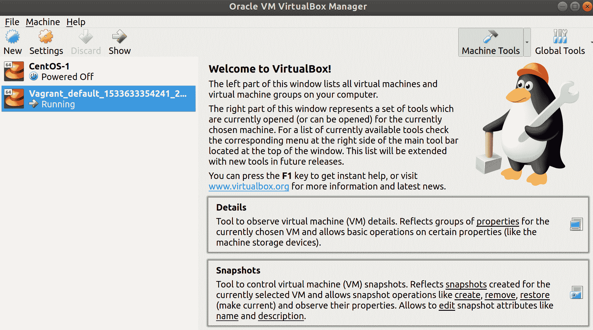

在设置|网络和端口转发下查看，Vagrant 还自动设置了对 NAT 网络的访问，这与我们手动设置的方式非常相似。

我们还可以使用内置的 Vagrant 快捷方式连接到我们的新 VM：

```
$ vagrant ssh
Last login: Tue Aug  7 09:16:42 2018 from 10.0.2.2
[vagrant@localhost ~]$
```

这意味着我们已经通过四个命令配置和连接到了一个 VM，总结如下：

```
$ vagrant init
$ sed -i 's#config.vm.box = "base"#config.vm.box = "centos/7"#g' Vagrantfile
$ vagrant up
$ vagrant ssh
[vagrant@localhost ~]$
```

我们还可以销毁我们在同一个文件夹中创建的任何 VM，只需使用一个命令运行到我们的`Vagrantfile`：

```
$ vagrant destroy
```

我首先写了关于使用 VirtualBox 手动设置 VM（并且拍摄了所有这些截图），因为习惯于在自动化繁琐的部分之前学习如何手动操作是很好的。这个规则也适用于大多数软件，因为即使花费更长的时间，了解底层工作原理会使以后的故障排除更容易。

# 轶事 - 尝试，尝试，再尝试

在你的职业生涯中，你会发现圣战的概念占主导地位，每一代新技术都有其辩护者和反对者。这在发行版之争中尤为明显，部落派系坚定地捍卫他们选择的操作系统。如果你发现自己需要为公司或项目选择要安装的发行版，考虑一下你在这里读到的一切，并在盲目接受一个人的意见之前自己做些调查。

这并不是说你应该成为一个部落人——我曾经安装过所有前面提到的发行版，其中第一个是 Ubuntu。

回到 2005 年，我了解到了一个叫做 Linux 的东西。

在那之前，我一直都在用 Mac，因为那是我爸爸决定的品牌。我还拼凑了一台 Windows 机器，专门用来玩暗黑破坏神，尽管我不能说我喜欢使用这个操作系统本身。

一切都改变了，当我在度假时看到一本计算机杂志，翻阅各种页面，直到我看到一篇关于 Linux 的文章，这立刻吸引了我的想象力。不同和古怪的东西吸引了我叛逆的态度，结果我最终刻录了一个叫做 Ubuntu 的东西到一张 CD 上（或者说是几张）。

当时，Canonical 会免费向你发送 Ubuntu 的 CD，但我很不耐烦，刻录光盘更快。

我在电脑上备份了我关心的一切，然后开始逐步完成我的第一次安装，一旦我弄清楚了如何从 CD 启动。据说一切都进行得很顺利，尽管我不得不偶尔跑到另一台电脑上（记住没有智能手机）查找某些选项的含义，但最终我安装了一个全新的桌面操作系统。

麻烦是从那时开始的。

我的无线网卡不工作，图形看起来很卡，我只运行了一个更新，然后重启，结果我不是进入了桌面，而是进入了一个命令行界面。

我以前从未见过命令行界面。

直到今天，我仍然不知道我是如何设法在那台电脑上安装了一个功能正常的操作系统的，我一直在与一个叫做`NdisWrapper`的程序作斗争，以使我的无线网卡工作，或者安装专有（尽管当时我不知道这个词）的图形驱动程序，但只要你升级了内核，它们就会崩溃（尽管当时我不知道发生了什么）。

我以某种方式艰难前行，很快对 Ubuntu 感到厌倦，当我发现了不同的发行版，并在接下来的几个月里每周尝试不同的桌面。我清楚地记得在 Ubuntu、Debian、Fedora、OpenSUSE 以及一个非常早期的尝试安装 Gentoo 之间切换，大约五分钟后我放弃了。

我经常上论坛，费力地将错误复制到谷歌上，试图找到其他遇到我所经历问题的人，经常发现一个帖子，帖子的作者不情愿地宣布他们已经**解决了！**，却没有提供他们使用的解决方案。

尽管当时对我来说很烦人，但这一切都是一次学习经历，我认为我对 Linux 和计算机的热爱可以追溯到我第一次安装 Ubuntu 的时候。在那之前，计算机只是游戏机而已。

很快，我开始使用 Linux Mint 绕过学校的防火墙，启动一个 Live USB 驱动器，并无视学校 IT 部门启用的所有微弱尝试阻止（出于某种原因，他们认为 Windows 是唯一存在的操作系统）。我仍然不太明白这是如何运作的，但重点是它确实运作了。

在玩魔兽世界的空隙中，Linux 是我多年来摆弄的东西，我一直关注最新的发行版并安装其他发行版进行尝试（经常“跳槽”）。我破坏了东西，修复了它们，对 Linux 感到愤怒，对计算机感到愤怒，但总的来说，我慢慢地进步了。

再往前走一小段时间，由于学校成绩普遍不好，我没有完成大学，也没有上大学。我几乎没有什么资格，但在计算机方面还是有一些天赋。我找到了一个持续几个月的课程，获得了一些微软的认证，但最终意味着我有了一个简陋的简历，可以开始向公司提交申请。

我接到了曼彻斯特一家托管提供商的电话，去参加了一次面试，见到了现在的首席技术官。面试很奇怪，我们讨论了拆解计算机、一点 Linux，还有很多《反恐精英》，结果他过去玩过很多。我离开时感到紧张，但对面试的进展感到相当好笑。

回来后，被召回参加面试，我非常惊讶地被提供了数据中心工程师的工作，虽然不是一个以 Linux 为重点的职位，但考虑到我的教育水平，这已经超出了我的期望。能够就业让我感到非常幸福，我永远感激那家公司和面试官给了我一个机会。

我想要传达的观点是，Linux 相当不错 - 即使我们中最没有学术素养的人也可以在这个领域有一个体面的职业，而且它是如此充满活力和不断发展，总是有新东西可以学习。在我的旅程中，我遇到了一些很棒的人，学到了一些很有趣的东西，其中很多我希望在这些页面中传递下去。

希望你会发现这本书的其余部分有益，无论你是 Linux 管理的新手，还是有经验的人只是在寻找你可能不知道的技巧和窍门。
