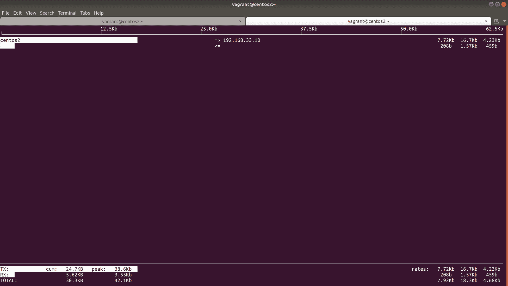
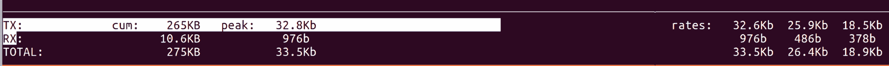
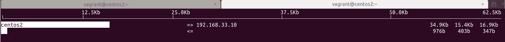
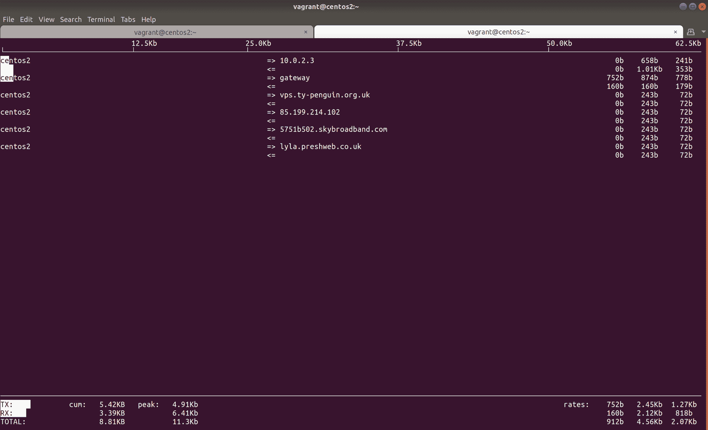

# 第三章：网络和防火墙

本章将涵盖以下配方：

+   确定我们的网络配置

+   使用 IP 套件的更多示例

+   添加和配置网络接口

+   在 Linux 上进行现代域名解析

+   配置 NTP 以及我们面临的问题

+   在命令行上列出防火墙规则

+   在命令行上添加防火墙规则

+   确定正在运行的服务和使用的端口

+   使用`iftop`进行调试

+   总结-防火墙和网络

# 介绍

现在我们已经了解了 SSH 和连接到我们的机器的方方面面，无论是本地虚拟机还是远程服务器，我们将着眼于安全洋葱（防火墙）和 Linux 网络堆栈的最显而易见的部分。

传统上，防火墙管理是通过`iptables`和相关命令处理的，事实上，您很难找到不立即在每台服务器上安装`iptables`工具套件的系统管理员（如果尚未安装）。

在现代的安装中，`firewall-cmd`（CentOS）和`ufw`（Ubuntu）可以替代或补充传统工具。这些都是为了使防火墙过程更加轻松，尽管纯粹主义者会誓死捍卫`iptables`。

无论使用的用户空间工具（在内核之外，在用户级别运行的程序的名称）是什么，我们所做的所有更改都是使用 Netfilter 内核框架进行的。事实上，内核中已经有一段时间可用的`nft`是`iptables`和 Netfilter 的替代品，尽管目前并不广泛使用。

`iptables`在某种程度上是一个笼统的名称，至少在非正式场合是如此。从技术上讲，`iptables`用于 IPv4，ip6tables 用于 IPv6，ebtables 用于以太网帧，arptables 用于 ARP。

在我们踏上令人困惑的防火墙世界的旅程时，我们将创建一个网络接口，并使用静态和动态 IP 分配进行配置。

# 技术要求

我们将再次使用 Vagrant 和 VirtualBox 进行工作。我们将配置三台虚拟机。

我已经为本章准备了以下`Vagrantfile`：

```
# -*- mode: ruby -*-
# vi: set ft=ruby :

$provisionScript = <<-SCRIPT
sed -i 's#PasswordAuthentication no#PasswordAuthentication yes#g' /etc/ssh/sshd_config
systemctl restart sshd
SCRIPT

Vagrant.configure("2") do |config|

 config.vm.provision "shell",
 inline: $provisionScript

 config.vm.define "centos1" do |centos1|
   centos1.vm.box = "centos/7"
   centos1.vm.network "private_network", ip: "192.168.33.10"
   centos1.vm.network "private_network", ip: "192.168.44.10", auto_config: false
   centos1.vm.hostname = "centos1"
   centos1.vm.box_version = "1804.02"
 end

 config.vm.define "centos2" do |centos2|
   centos2.vm.box = "centos/7"
   centos2.vm.network "private_network", ip: "192.168.33.11"
   centos2.vm.network "private_network", ip: "192.168.44.11", auto_config: false
   centos2.vm.hostname = "centos2"
   centos2.vm.box_version = "1804.02"
 end

 config.vm.define "ubuntu1" do |ubuntu1|
   ubuntu1.vm.box = "ubuntu/bionic64"
   ubuntu1.vm.hostname = "ubuntu1"
   ubuntu1.vm.box_version = "20180927.0.0"
 end

end
```

建议创建一个名为“第三章”的文件夹，并将此代码复制到名为`Vagrantfile`的文件中。从包含您的`Vagrantfile`的文件夹内运行`vagrant up`应该可以配置两个用于测试的虚拟机。一旦配置完成，请确保可以通过运行以下命令连接到第一个虚拟机：

```
$ vagrant ssh centos1
```

对于本节，请确保您的`centos1`虚拟机正在运行，并连接到它。本节假定您在基本水平上了解网络，即您了解静态和动态 IP 地址之间的区别，并且大致了解公共和私有 IP 地址之间的区别。

# 确定我们的网络配置

如果您发现自己在数据中心使用物理设备，可能会在某个时候坐在一个箱子前，只有用户名和密码。您将不得不使用这些凭据来发现箱子的 IP 信息，以便遥远的象牙塔中的另一个人可以远程连接到它。

象牙塔中的人有时会因为整天坐在椅子上按键盘而得到比您更好的报酬。我的建议是不要纠结于此，否则您会变得愤世嫉俗。

# 准备工作

如果您尚未连接到`centos1`，请连接。

```
$ vagrant ssh centos1
```

为了演示目的，确保也安装了`ifconfig`：

```
$ sudo yum install net-tools
```

# 如何做到...

在这个简短的部分中，我们将发现我们的箱子有什么 IP 地址，它所在的网络是什么，以及我们将学习它的配置方式。

# 辨别 IP

在现代的系统上，这是通过`ip`完成的，我们稍后会更深入地讨论：

```
$ ip address show
```

您可以缩短`ip`命令以使其更快地输入（就像我们在前一章中所做的那样），但在前面的代码中，我使用了完整的表达，因为它更好地表达了我们正在做的事情。

这个命令将为您提供有关系统上所有接口的信息。在我们的虚拟机的情况下，它看起来像这样：

```
1: lo: <LOOPBACK,UP,LOWER_UP> mtu 65536 qdisc noqueue state UNKNOWN group default qlen 1000
 link/loopback 00:00:00:00:00:00 brd 00:00:00:00:00:00
 inet 127.0.0.1/8 scope host lo
 valid_lft forever preferred_lft forever
 inet6 ::1/128 scope host 
 valid_lft forever preferred_lft forever
2: eth0: <BROADCAST,MULTICAST,UP,LOWER_UP> mtu 1500 qdisc pfifo_fast state UP group default qlen 1000
 link/ether 52:54:00:c9:c7:04 brd ff:ff:ff:ff:ff:ff
 inet 10.0.2.15/24 brd 10.0.2.255 scope global noprefixroute dynamic eth0
 valid_lft 85733sec preferred_lft 85733sec
 inet6 fe80::5054:ff:fec9:c704/64 scope link 
 valid_lft forever preferred_lft forever
3: eth1: <BROADCAST,MULTICAST,UP,LOWER_UP> mtu 1500 qdisc pfifo_fast state UP group default qlen 1000
 link/ether 08:00:27:4b:03:de brd ff:ff:ff:ff:ff:ff
 inet 192.168.33.10/24 brd 192.168.33.255 scope global noprefixroute eth1
 valid_lft forever preferred_lft forever
 inet6 fe80::a00:27ff:fe4b:3de/64 scope link 
 valid_lft forever preferred_lft forever
4: eth2: <BROADCAST,MULTICAST,UP,LOWER_UP> mtu 1500 qdisc pfifo_fast state UP group default qlen 1000
 link/ether 08:00:27:50:a5:cb brd ff:ff:ff:ff:ff:ff
```

我们知道`lo`是环回地址，它将始终具有`127.0.0.1/8`设置，或者在该范围内的其他地址。

如果您明确知道要使用的设备，也可以指定它。在下面的代码中，我们已经使用了`eth1`：

```
$ ip address show dev eth1
```

在打印的块中，我们正在寻找 IPv4 地址，该地址被列为`inet`系列：

```
3: eth1: <BROADCAST,MULTICAST,UP,LOWER_UP> mtu 1500 qdisc pfifo_fast state UP group default qlen 1000
    link/ether 08:00:27:0d:d9:0c brd ff:ff:ff:ff:ff:ff
    inet 192.168.33.10/24 brd 192.168.33.255 scope global noprefixroute eth1
       valid_lft forever preferred_lft forever
    inet6 fe80::a00:27ff:fe0d:d90c/64 scope link 
       valid_lft forever preferred_lft forever
```

我们有 IP`192.168.33.10`，并且我们知道它所在的子网是`/24（255.255.255.0）`。

如果您有点懒惰并且想节省眼睛移动，您可以在脚本中使用类似以下内容来获取这些信息：

```
$ ip address show dev eth1 | grep "inet " | awk '{ print $2 }'
192.168.33.10/24
```

前面的代码是许多许多种编写一行代码以生成所需输出的方式之一。Linux 是灵活的，您可能选择以完全不同的方式达到相同的输出。您如何做并不是很重要，但如果您打算分享，以简洁和可读的风格进行通常是最好的。

# 辨别 IP（已弃用的方法）

在旧系统或那些由守旧管理员管理的系统中，您可能还会使用`ifconfig`来查找 IP 和子网。

简单运行`ifconfig`将打印所有相关信息：

```
$ ifconfig
eth0: flags=4163<UP,BROADCAST,RUNNING,MULTICAST> mtu 1500
 inet 10.0.2.15 netmask 255.255.255.0 broadcast 10.0.2.255
 inet6 fe80::5054:ff:fec9:c704 prefixlen 64 scopeid 0x20<link>
 ether 52:54:00:c9:c7:04 txqueuelen 1000 (Ethernet)
 RX packets 14404 bytes 12885029 (12.2 MiB)
 RX errors 0 dropped 0 overruns 0 frame 0
 TX packets 5672 bytes 409079 (399.4 KiB)
 TX errors 0 dropped 0 overruns 0 carrier 0 collisions 0

eth1: flags=4163<UP,BROADCAST,RUNNING,MULTICAST> mtu 1500
 inet 192.168.33.10 netmask 255.255.255.0 broadcast 192.168.33.255
 inet6 fe80::a00:27ff:fe4b:3de prefixlen 64 scopeid 0x20<link>
 ether 08:00:27:4b:03:de txqueuelen 1000 (Ethernet)
 RX packets 8 bytes 3164 (3.0 KiB)
 RX errors 0 dropped 0 overruns 0 frame 0
 TX packets 17 bytes 1906 (1.8 KiB)
 TX errors 0 dropped 0 overruns 0 carrier 0 collisions 0

eth2: flags=4163<UP,BROADCAST,RUNNING,MULTICAST> mtu 1500
 ether 08:00:27:50:a5:cb txqueuelen 1000 (Ethernet)
 RX packets 43 bytes 14706 (14.3 KiB)
 RX errors 0 dropped 0 overruns 0 frame 0
 TX packets 112 bytes 19336 (18.8 KiB)
 TX errors 0 dropped 0 overruns 0 carrier 0 collisions 0

lo: flags=73<UP,LOOPBACK,RUNNING> mtu 65536
 inet 127.0.0.1 netmask 255.0.0.0
 inet6 ::1 prefixlen 128 scopeid 0x10<host>
 loop txqueuelen 1000 (Local Loopback)
 RX packets 0 bytes 0 (0.0 B)
 RX errors 0 dropped 0 overruns 0 frame 0
 TX packets 0 bytes 0 (0.0 B)
 TX errors 0 dropped 0 overruns 0 carrier 0 collisions 0

```

与 IP 一样，轻松地转储有关特定接口的信息。

正如我们在下面的代码中所看到的，我们再次查看了`eth1`的具体情况：

```
$ ifconfig eth1
eth1: flags=4163<UP,BROADCAST,RUNNING,MULTICAST>  mtu 1500
 inet 192.168.33.10  netmask 255.255.255.0  broadcast 192.168.33.255
 inet6 fe80::a00:27ff:fe0d:d90c  prefixlen 64  scopeid 0x20<link>
 ether 08:00:27:0d:d9:0c  txqueuelen 1000  (Ethernet)
 RX packets 24  bytes 4268 (4.1 KiB)
 RX errors 0  dropped 0  overruns 0  frame 0
 TX packets 20  bytes 2116 (2.0 KiB)
 TX errors 0  dropped 0 overruns 0  carrier 0  collisions 0
```

我用“deprecated”这个词，但这通常只适用于 Linux 世界。在 BSD 和 macOS 中，`ifconfig`仍然是唯一的选择，并且仍在积极改进和维护。

# 辨别网关地址

一旦我们有了设备的 IP 地址和子网，我们可能想知道我们的设备是使用哪个设备与外部世界进行通信的。

这是流量离开您的设备的“默认”路由。

使用`ip`命令，这很容易发现：

```
$ ip route 
default via 10.0.2.2 dev eth0 proto dhcp metric 102 
10.0.2.0/24 dev eth0 proto kernel scope link src 10.0.2.15 metric 102 
192.168.33.0/24 dev eth1 proto kernel scope link src 192.168.33.10 metric 100 
```

注意`default via`部分。

# 辨别网关地址（已弃用的方法）

安装了 net-tools 后，我们还可以使用`route`命令来找到我们的默认路由。

```
$ route
Kernel IP routing table
Destination     Gateway         Genmask         Flags Metric Ref    Use Iface
default         gateway         0.0.0.0         UG    102    0        0 eth0
10.0.2.0        0.0.0.0         255.255.255.0   U     102    0        0 eth0
192.168.33.0    0.0.0.0         255.255.255.0   U     100    0        0 eth1
```

# 工作原理...

当您使用`ip`或`ifconfig`时，您正在查询内核所知道的网络设备，以及它当前正在管理的流量。

如果您在任何常见命令的输出列表中都看不到您的网络设备，则可能是您的内核对该设备没有驱动程序。这在今天很少见，但对于定制的网络设备可能会发生，此时供应商应提供用于其的内核模块。

`ip`本身不仅仅是一个命令：它是一个套件，这意味着当我们在这里使用`ip address`命令时，我们只是使用了我们可以使用的工具的一个子集。

当您使用`ip route`或`route`命令时，实际上是在查询分发的路由表。

# 还有更多...

了解网络配置的基础知识是很好的，但通常只是第一步。

在这里，我将介绍一些基本的网络故障排除。

# 检查连接

知道我们的设备正在使用的网关是一回事，但实际上能够到达它是另一回事。

如果您站在一个设备前面，很可能您已被召唤来尝试弄清楚哪里出了问题。尝试 ping 网关是一个很好的第一步：

```
$ ping 10.0.2.2
PING 10.0.2.2 (10.0.2.2) 56(84) bytes of data.
64 bytes from 10.0.2.2: icmp_seq=1 ttl=64 time=0.768 ms
64 bytes from 10.0.2.2: icmp_seq=2 ttl=64 time=0.333 ms
64 bytes from 10.0.2.2: icmp_seq=3 ttl=64 time=0.637 ms
```

在这里，我们的网关设备做出了响应，但如果您的设备没有响应，或者出现“目标主机不可达”的情况，那么很可能出现了问题（或者您的同事在象牙塔中给出了错误的信息-始终首先检查这一点）。

在下面的代码中，我们再次使用`ip`命令来检查接口本身的状态：

```
$ ip address show dev eth0
2: eth0: <BROADCAST,MULTICAST,UP,LOWER_UP> mtu 1500 qdisc pfifo_fast state UP group default qlen 1000
```

您可能会对我们这里有三个`UP`值感兴趣。

尖括号内的初始`UP`值表示接口是否物理上启动。尖括号内的`LOWER_UP`值也表示如果电缆物理连接并启动。尖括号外的`state UP`值表示接口是否在管理上启动，可以通过软件更改为`DOWN`。

# 检查我们的设备将采取哪条路线

也有可能连接失败是因为您的设备尝试通过错误的接口进行通信。我们可以再次使用`ip`来检查这一点。

首先，让我们看看当与更广泛的世界通信时，我们将采取哪条路线。

在下面的代码中，我们正在检查我们的设备如何尝试与 IP`1.1.1.1`进行通信。它向我们显示，我们将通过网关地址`10.0.2.2`和我们的`eth0`接口去到这个 IP：

```
$ ip route get 1.1.1.1
1.1.1.1 via 10.0.2.2 dev eth0 src 10.0.2.15 
 cache 
```

现在，让我们看看如果我们与网关通信会走哪条路线。在这里，我们可以看到一个直接连接（没有`via`）也从`eth0`出去：

```
$ ip route get 10.0.2.2
10.0.2.2 dev eth0 src 10.0.2.15 
 cache 
```

到目前为止，一切都很顺利，但是如果我们想与我们私有网络中的其他 VM 进行通信怎么办？

```
$ ip route get 192.168.33.11
192.168.33.11 dev eth1 src 192.168.33.10 
 cache 
```

`eth1`将被使用，这是非常合理的，因为它在同一个网络上。

等一下——我们自己的 IP 也在这个子网中，那么如果我们尝试与自己通信会发生什么？

```
$ ip route get 192.168.33.10
local 192.168.33.10 dev lo src 192.168.33.10 
 cache <local> 
```

啊！聪明！我们仍然使用回环地址（`dev lo`）与我们的本地 IP 地址进行通信，因为 Linux 知道这个 IP 是我们自己的。

与前面的例子一样，Linux 有时会做一些让您感到惊讶的事情，特别是如果您来自 Windows 或 BSD 管理世界。以`lo`接口为例——它不仅仅是`127.0.0.1`，而是整个`/8`范围。在典型的 Linux 系统上，您可以从`127.0.0.1` ping 到`127.255.255.254`，并从本地机器得到响应。

您甚至可以 ping`127.1`并获得合法的响应，但我会把它留给读者来确定为什么可能会这样。

# 另请参阅

查看`ip`和`ip-address`手册页面。

就个人而言，我会专注于学习`ip`套件，而不是旧的 net-tools，因为如果您尝试解决网络问题，很可能无法在紧要关头安装 net-tools。

# 更多使用`ip 套件`的示例

我们将从现在开始使用`ip`，因为它更现代化。

本节假定您在基本水平上了解网络，即您了解静态和动态 IP 地址之间的区别，并且大致了解公共和私有 IP 地址之间的区别。

# 准备工作

在本节中，我们将对我们的网络进行一些更改。如果您在任何时候发现自己被踢出 VM，请记住《银河系漫游指南》，不要惊慌——只需销毁您的 VM 并重新开始。

从`centos1`命令行开始。

```
$ vagrant ssh centos1
```

# 如何做...

在本节中，我们将使用`ip 套件`来更改我们网络堆栈的一些基本元素，例如添加另一个 IP 地址，或者完全关闭一个接口。

# 添加和删除 IP

这可以通过`ip address`命令来实现，但需要 root 权限。

在这个例子中，我选择了`192.168.33.0/24`子网中的另一个 IP，我知道这个 IP 没有被使用：

在现实世界中，最好先 ping 一下 IP，即使您认为它是空闲的。

```
$ sudo ip address add 192.168.33.22/24 dev eth1
```

检查我们的`eth1`接口，我们现在可以看到第二个 IP：

```
3: eth1: <BROADCAST,MULTICAST,UP,LOWER_UP> mtu 1500 qdisc pfifo_fast state UP group default qlen 1000
    link/ether 08:00:27:0d:d9:0c brd ff:ff:ff:ff:ff:ff
    inet 192.168.33.10/24 brd 192.168.33.255 scope global noprefixroute eth1
       valid_lft forever preferred_lft forever
 inet 192.168.33.22/24 scope global secondary eth1
       valid_lft forever preferred_lft forever
    inet6 fe80::a00:27ff:fe0d:d90c/64 scope link 
       valid_lft forever preferred_lft forever
```

重新启动后，这些更改将丢失。我们将在标题为“添加和配置网络接口”的部分中讨论如何永久添加 IP 信息。

如果我们想删除一个 IP，我们再次使用`ip`，这次用`del`指令替换`add`指令：

```
$ sudo ip address del 192.168.33.22/24 dev eth1
```

# 关闭和启动接口

要处理接口本身，我们需要使用`ip`套件的另一个元素，即`ip link`。再次注意使用`sudo`：

```
$ sudo ip link set eth1 down
```

检查我们的接口，我们可以看到接口处于`DOWN`状态：

```
3: eth1: <BROADCAST,MULTICAST> mtu 1500 qdisc pfifo_fast state DOWN group default qlen 1000
 link/ether 08:00:27:0d:d9:0c brd ff:ff:ff:ff:ff:ff
 inet 192.168.33.10/24 brd 192.168.33.255 scope global noprefixroute eth1
 valid_lft forever preferred_lft forever
```

您会发现自己无法从`centos2` ping 通这个主机。

要重新启动接口，只需运行以下命令：

```
$ sudo ip link set eth1 up
```

请注意，如果在关闭和打开接口之前临时向接口添加另一个 IP，您的临时附加 IP 将不会被记住。

# 向我们的路由表添加新路由

如果我们在一个目的地不明显的网络中工作，我们可能需要向我们的设置中添加一个特定的路由。

这通常出现在集群场景和设置中，其中一个路由可以通过另一个通道访问，但可能不会由同一通道广告。

在接下来的代码中，我们将告诉我们的虚拟机，如果它想要与`172.16.0.0/12`网络上的任何地址通信，必须通过`eth1`和网关`192.168.33.11`（这是我们的`centos2`虚拟机）发送流量：

```
$ sudo ip route add 172.16.0.0/12 via 192.168.33.11 dev eth1
```

检查我们的路由表，我们可以看到我们的路由是否已经设置好：

```
$ ip route
default via 10.0.2.2 dev eth0 proto dhcp metric 100 
10.0.2.0/24 dev eth0 proto kernel scope link src 10.0.2.15 metric 100 
172.16.0.0/12 via 192.168.33.11 dev eth1 
192.168.33.0/24 dev eth1 proto kernel scope link src 192.168.33.10 metric 101
```

# 工作原理...

同样，我们使用`ip suite`与我们机器的各种网络元素进行交互。通常，这些命令可用于故障排除和测试环境更改，以便在您永久进行这些更改之前进行测试。

在添加或删除接口的 IP 地址时，您可以创建一个接口具有多个 IP 地址的情况，用于不同的应用程序。

在 SNI 出现之前，看到在 Web 服务器上使用多个 IP 地址以便每个 HTTPS 站点都可以有自己的 IP 分配是很常见的。

在关闭或启动网络接口时，我们首先告诉系统在管理上关闭一个接口，而不是物理上拔掉以太网电缆。如果你关闭一个接口，然后检查你的`/var/log/messages`文件，你应该会看到类似以下的内容：

```
Aug 12 12:38:09 centos1 NetworkManager[566]: <info>  [1534077489.1507] device (eth1): state change: activated -> unavailable (reason 'carrier-changed', sys-iface-state: 'managed')
Aug 12 12:38:09 centos1 dbus[545]: [system] Activating via systemd: service name='org.freedesktop.nm_dispatcher' unit='dbus-org.freedesktop.nm-dispatcher.service'
Aug 12 12:38:09 centos1 systemd: Starting Network Manager Script Dispatcher Service...
Aug 12 12:38:09 centos1 dbus[545]: [system] Successfully activated service 'org.freedesktop.nm_dispatcher'
Aug 12 12:38:09 centos1 systemd: Started Network Manager Script Dispatcher Service.
Aug 12 12:38:09 centos1 nm-dispatcher: req:1 'down' [eth1]: new request (3 scripts)
Aug 12 12:38:09 centos1 nm-dispatcher: req:1 'down' [eth1]: start running ordered scripts...
```

在这里，我们可以看到网络管理器通过一系列步骤运行，意识到设备的状态已经改变。

网络管理器分发器是控制接口关闭或启动时发生的事情的服务。如果你有兴趣了解更多，请查看`/etc/NetworkManager/dispatcher.d/`。

最后，当我们向我们的路由表添加路由时，我们告诉内核的底层路由子系统通过我们的`eth1`接口，使用网关地址`192.168.33.11`发送网络`172.16.0.0/12`的数据包。

我经常发现自己修改设备的路由表，尽管大部分是为电话 PBX 环境中的集群设置。这可能不是你每天都做的事情，但值得知道！

# 还有更多...

如果你想查看到达`centos2`的路由流量，请登录到你的第二个虚拟机，确保安装了`tcpdump`：

```
$ sudo yum install -y tcpdump
```

接下来，确保你之前的额外路由在`centos1`上已经设置好，并开始对范围内的任何地址进行`ping`：

```
$ ping 172.16.0.3
PING 172.16.0.3 (172.16.0.3) 56(84) bytes of data.
```

回到`centos2`，对我们的`eth1`接口启动`tcpdump`：

```
$ sudo tcpdump -i eth1
```

你应该开始看到来自`centos1`的`ICMP echo requests`，但没有响应：

```
12:48:26.735055 IP 192.168.33.10 > 172.16.0.3: ICMP echo request, id 1696, seq 1, length 64
12:48:27.736195 IP 192.168.33.10 > 172.16.0.3: ICMP echo request, id 1696, seq 2, length 64
12:48:28.738030 IP 192.168.33.10 > 172.16.0.3: ICMP echo request, id 1696, seq 3, length 64
12:48:29.743270 IP 192.168.33.10 > 172.16.0.3: ICMP echo request, id 1696, seq 4, length 64
12:48:30.747098 IP 192.168.33.10 > 172.16.0.3: ICMP echo request, id 1696, seq 5, length 64
12:48:31.750916 IP 192.168.33.10 > 172.16.0.3: ICMP echo request, id 1696, seq 6, length 64
12:48:32.752634 IP 192.168.33.10 > 172.16.0.3: ICMP echo request, id 1696, seq 7, length 64
```

回到`centos1`，停止你的`ping`（*Ctrl *+ *C*），注意传输的数据包和丢失的数据包：

```
--- 172.16.0.3 ping statistics ---
8 packets transmitted, 0 received, 100% packet loss, time 7019ms
```

因为`centos2`没有路由我们的数据包的地方，而且`centos2`实际上并没有设置为路由器，数据包只是无人回应，`centos1`仍然是孤独的-可怜的`centos1`。

# 另请参阅

如果你有兴趣将 Linux 用作路由器，这是完全可能的，只需通过 sysctl 更改和可能在防火墙上进行一些**伪装**。虽然超出了本书的范围，但这是你可能在未来需要的东西。

# 添加和配置网络接口

在本节中，我们将看看如何在系统中配置多个网络接口，并讨论这在现实世界中可能如何被利用（比如用于备份流量）。

# 准备工作

我们将使用我们本章新引入的第二个网络。如果你使用的是之前的`Vagrantfile`，你已经设置好了这个网络。如果你在自己的系统上运行，请在每个虚拟机上添加另一个 NIC 到同一网络。

使用 Vagrant 连接到`centos1`。

```
$ vagrant ssh centos1
```

检查`eth2`接口是否对您可用。 它应该看起来类似于以下内容：

```
$ ip link show eth2
4: eth2: <BROADCAST,MULTICAST,UP,LOWER_UP> mtu 1500 qdisc pfifo_fast state UP mode DEFAULT group default qlen 1000
 link/ether 08:00:27:7d:f3:6b brd ff:ff:ff:ff:ff:ff
```

# 如何做...

我们将看看如何使用配置文件永久添加网络信息，以便我们的配置在重新启动后不会丢失（如果我们使用`ip suite`和临时分配，情况将是这样）。

# 配置新接口

首先，为`eth2`创建一个配置文件：

```
$ sudo touch /etc/sysconfig/network-scripts/ifcfg-eth2
```

接下来，使用以下内容填充它：

```
$ sudo tee /etc/sysconfig/network-scripts/ifcfg-eth2 << HERE 
BOOTPROTO=none
ONBOOT=yes
IPADDR=192.168.44.10
NETMASK=255.255.255.0
DEVICE=eth2
PEERDNS=no
HERE
```

这里使用了`tee`命令。 它使从标准输入读取并输出到我们选择的目的地，即文件。

现在，将您的接口作为个体重新启动：

```
$ sudo ifdown eth2
$ sudo ifup eth2
```

或者，重新启动网络：

```
$ sudo systemctl restart network
```

通常，一个很好的经验法则是在处理组成更大整体的组件时尽量减少干扰。 即使在`dev`环境中，养成这样的习惯也是一个好习惯。

# 它的工作原理...

我们在这里所做的一切就是创建一个接口脚本，您的系统可以使用它在启动时正确配置接口。

让我们看看我们添加到文件中的选项。

```
BOOTPROTO=none
```

此设置代表`启动时协议`，我们将其设置为`none`，而不是`dhcp`或`bootp`。

在 DHCP 环境中，您希望地址由 DHCP 服务器自动分配。 在这里，我们正在设置一个静态地址，因此我们陈述如下。

```
ONBOOT=yes
```

这个可能看起来很明显，但接口的默认行为是在启动时不初始化。 通过此设置，我们确保网络接口随系统一起启动。

```
IPADDR=192.168.44.10
NETMASK=255.255.255.0
```

有点不言自明，但这些选项是我们正在配置的网络的 IP 地址和子网掩码。 在这里，我选择了另一个`/24`网络，比我们的`eth1`配置高了几个八位。

```
DEVICE=eth2
```

此选项用于指定我们的配置将应用于哪个硬件接口。 值得注意的是，这些接口名称既可以是通用的（`eth0`，`eth1`等），也可以是网络卡名称特定的（它们可能不总是`eth<something>`）。

```
PEERDNS=no
```

在 DHCP 环境中默认为`yes`，此选项确保我们的系统在接口启动时不会尝试修改`/etc/resolv.conf`。

# 还有更多...

以太网接口配置文件（`ifcfg-eth2`）还有一些其他选项，可以在设置网络时考虑。 在将网络包装在任何脚本之前，检查是否可能对所需的结果进行配置更改。

接口绑定也可以在接口配置文件中创建和配置，用于当一台机器有两个物理连接到同一目的地时，以保护接口或电缆的任一故障。

在我整个职业生涯中，我只见过一根坏的`Cat-5e`电缆——电缆是物理的，不会自发断裂。

我们没有做的一件事是指定所讨论的接口不是由网络管理器（网络管理守护程序）管理的。

您可以使用简单的`nmcli device`命令查看由网络管理器管理和不管理的接口：

```
$ nmcli device 
DEVICE  TYPE      STATE      CONNECTION 
eth0    ethernet  connected  System eth0 
eth1    ethernet  connected  System eth1 
eth2    ethernet  connected  System eth2 
lo      loopback  unmanaged  --  
```

我们可以更改这一点，如果我们宁愿网络管理器不干涉，可以通过向我们的`ifcfg-eth2`文件添加配置选项来实现：

```
BOOTPROTO=none
ONBOOT=yes
IPADDR=192.168.44.10
NETMASK=255.255.255.0
DEVICE=eth2
PEERDNS=no
NM_CONTROLLED=no
```

现在，再次启动和关闭您的接口：

```
$ sudo ifdown eth2
$ sudo ifup eth2
```

然后，再次检查`nmcli`，这次注意`unmanaged`状态：

```
$ nmcli device 
DEVICE  TYPE      STATE      CONNECTION 
eth0    ethernet  connected  System eth0 
eth1    ethernet  connected  System eth1 
eth2    ethernet  unmanaged  -- 
lo      loopback  unmanaged  --
```

如果您感兴趣，可以查看`nmtui`命令，以交互方式配置网络接口，网络管理器知道这些接口。

# 另请参阅

考虑一下在哪里可能需要额外的网络。 一个很好且常见的例子是备份网络，公司将设置一个专门用于备份流量的专用网络。

备份的大小不等，但有时可能会达到几千兆字节甚至几千兆字节，因此最好为它们提供一个完全独立的网络。

您还可以使用诸如**服务质量**（**QoS**）设置之类的东西来管理流量优先级，这在更大型和企业网络上可能是一个有效的解决方案。如果您宁愿处理这些情况的软件管理开销，这可能是一个有效的解决方案。一般来说，我更喜欢简单，尽管拥有物理设备的成本肯定更高，但从长远来看，管理起来更少。

# Linux 上的现代域名解析

在本节中，我们将查看域名解析，特别是在典型的 CentOS 盒子上安装的软件，该软件在提供域时启用地址查找。

我们将在当前一代 Linux 系统（如网络管理器）上查看`/etc/resolv.conf`和域名解析方法。我们将测试与我们的 DNS 服务器的连接，并运行 DNS 查询以查看它是否工作。

本节假定对域名和 IP 地址有基本的理解。

# 做好准备

连接到`centos1`，并通过 ping 地址检查您的域解析是否已经工作。

我在英国，所以我默认使用 BBC 进行测试：

```
$ ping bbc.co.uk
PING bbc.co.uk (151.101.0.81) 56(84) bytes of data.
64 bytes from 151.101.0.81 (151.101.0.81): icmp_seq=1 ttl=63 time=30.4 ms
```

如果由于任何原因您的 DNS 服务器不起作用，请销毁并重新创建您的虚拟机。

一旦您确定可以 ping 通一个域，安装 dig（以及与此软件包一起安装的其他工具）：

```
$ sudo yum install -y bind-utils
```

# 如何做...

在这里，我们将运行一些基本的故障排除步骤，旨在帮助您确定问题可能出在哪里。

# 查询域

在 Linux 上查询域名，可以使用`dig`：

```
$ dig bbc.co.uk

; <<>> DiG 9.9.4-RedHat-9.9.4-61.el7 <<>> bbc.co.uk
;; global options: +cmd
;; Got answer:
;; ->>HEADER<<- opcode: QUERY, status: NOERROR, id: 6288
;; flags: qr rd ra; QUERY: 1, ANSWER: 4, AUTHORITY: 0, ADDITIONAL: 1

;; OPT PSEUDOSECTION:
; EDNS: version: 0, flags:; udp: 65494
;; QUESTION SECTION:
;bbc.co.uk.            IN    A

;; ANSWER SECTION:
bbc.co.uk.        227    IN    A    151.101.0.81
bbc.co.uk.        227    IN    A    151.101.64.81
bbc.co.uk.        227    IN    A    151.101.128.81
bbc.co.uk.        227    IN    A    151.101.192.81

;; Query time: 24 msec
;; SERVER: 10.0.2.3#53(10.0.2.3)
;; WHEN: Sun Aug 12 14:20:28 UTC 2018
;; MSG SIZE  rcvd: 102
```

在这里，我们可以看到用于域解析的服务器（加粗）是`10.0.2.3`，这恰好是 VirtualBox 提供的解析服务。

我们还看到了`ANSWER SECTION`，正如名称可能暗示的那样，这是我们查询的答案。我们可以在这些地址中的任何一个（目前）到达`bbc.co.uk`。

# 检查域解析设置

在系统上，关于 DNS 配置的真相通常是解析器文件`/etc/resolv.conf`，尽管这个文件越来越不直接使用，而是由外部程序管理。

在 CentOS 的情况下，`resolv.conf`文件由我们的朋友网络管理器管理，在其他系统上，可能是`systemd-resolved`。

查看您的`resolv.conf`文件：

```
$ cat /etc/resolv.conf 
# Generated by NetworkManager
search discworld
nameserver 10.0.2.3
```

上面的代码中的`search`是主机名查找的搜索列表。它是通过查看盒子所在的域来生成的。

`nameserver`是我们的 DNS 解析器的值，在这种情况下是 VirtualBox 默认值。

这告诉我们，网络管理器是填充我们文件的程序。

然后我们可以使用`nmcli`列出它知道的 DNS 服务器：

```
$ nmcli -f ipv4.dns,ipv4.ignore-auto-dns connection show System\ eth0
ipv4.dns:                               --
ipv4.ignore-auto-dns:                   no
```

通过上述代码，我们使用了`nmcli`和两个过滤器`ipv4.dns`和`ipv4.ignore-auto-dns`来检查我们的默认接口（在这种情况下是`eth0`系统）。

`ipv4.dns`的值未设置，这意味着它不太可能从接口上的配置指令中读取值。

`ipv4.ignore-auto-dns`的值已设置，我们可以从`no`值看出，我们没有忽略来自 DHCP 服务器的自动 DNS 分配。

# 更改域解析设置

要使用我们选择的 DNS 服务器，我们应该使用`nmcli`。

在下面的代码中，我们设置了我们自己的 DNS 服务器值（`1.1.1.1`），并且我们将`ipv4.ignore-auto-dns`的真值从`no`更改为`yes`：

```
$ sudo nmcli connection modify System\ eth0 ipv4.dns "1.1.1.1" ipv4.ignore-auto-dns "yes"
```

请注意，这两个字段都可以在一行上进行修改。

使用以下命令重新加载接口配置：

```
$ sudo nmcli connection up System\ eth0
```

为了保险起见，再看看`/etc/resolv.conf`：

```
$ cat /etc/resolv.conf 
# Generated by NetworkManager
nameserver 1.1.1.1
```

然后运行`dig`：

```
$ dig bbc.co.uk

; <<>> DiG 9.9.4-RedHat-9.9.4-61.el7 <<>> bbc.co.uk
;; global options: +cmd
;; Got answer:
;; ->>HEADER<<- opcode: QUERY, status: NOERROR, id: 10132
;; flags: qr rd ra; QUERY: 1, ANSWER: 4, AUTHORITY: 0, ADDITIONAL: 1

;; OPT PSEUDOSECTION:
; EDNS: version: 0, flags:; udp: 1452
;; QUESTION SECTION:
;bbc.co.uk.            IN    A

;; ANSWER SECTION:
bbc.co.uk.        210    IN    A    151.101.0.81
bbc.co.uk.        210    IN    A    151.101.64.81
bbc.co.uk.        210    IN    A    151.101.128.81
bbc.co.uk.        210    IN    A    151.101.192.81

;; Query time: 23 msec
;; SERVER: 1.1.1.1#53(1.1.1.1)
;; WHEN: Sun Aug 12 14:46:05 UTC 2018
;; MSG SIZE  rcvd: 102
```

`1.1.1.1`是 Cloudflare 和 APNIC 提供的新潮的 DNS 服务。这并不是一种认可，只是非常容易记住。

# 它是如何工作的...

当您在系统上请求域的目的地时，实际上您正在向配置的解析器发送请求，该解析器返回它（或更上游的系统）知道的地址。

在我们的情况下，我们可以通过连接两个终端到`centos1`来看到这个请求发生。

在我们的第一个终端上，我们将在`eth1`上安装并启动`tcpdump`：

```
$ sudo yum install tcpdump -y
$ sudo tcpdump -i eth0 -n port 53
```

设置好后，切换到第二个连接，并对 BBC（或你选择的任何英国广播公司）运行你的`dig`命令：

```
$ dig bbc.co.uk
```

切换回你的第一个窗口，你应该看到你请求的结果：

```
14:58:50.303421 IP 10.0.2.15.51686 > 1.1.1.1.domain: 19866+ [1au] A? bbc.co.uk. (38)
14:58:50.331999 IP 1.1.1.1.domain > 10.0.2.15.51686: 19866 4/0/1 A 151.101.0.81, A 151.101.64.81, A 151.101.128.81, A 151.101.192.81 (102)
```

我们询问了我们的域名服务器`bbc.co.uk`的地址，并在响应中得到了一些 IP 地址以连接。很整洁，对吧？

# 还有更多...

这一节显然是使用网络管理器进行了更改，但这并不意味着这是唯一的方法。可以阻止网络管理器劫持并尝试控制你的 DNS。

可以在`NetworkManager.conf`文件的`main`部分中设置`dns=none`，详细信息请参阅其手册页：

"`none: NetworkManager`将不会修改`resolv.conf`。这意味着

rc-manager 未受管理”

在`/etc/NetworkManager/NetworkManager.conf`配置文件中，它看起来像这样：

```
[main]
#plugins=ifcfg-rh,ibft
dns=none
```

此时重新启动`NetworkManager`将阻止它在将来尝试修改`/etc/resolv.conf`。

如果你希望有其他东西来管理你系统的 DNS，即使只是你编写的一个脚本来将你的 DNS 服务器放在`/etc/resolv.conf`中，这可能会很有用。

完全不使用`NetworkManager`也是可能的，将其禁用为守护进程，并以旧的脚本方式完成所有操作。事实上，这真的很容易，但在我看来，值得掌握如今默认的操作方式。

DNS 通常是成对进行的，最好有一个备用 DNS 服务器，以防第一个出问题。当你的 DNS 失败时，奇怪的事情可能开始发生。

# 另请参阅

我们实际上在这里使用了`nmcli`来对配置文件进行更改。我们可以通过查看在我们的 DNS 更改命令之前和之后的`eth0`配置文件来实际看到这些更改。

之前看起来是这样的：

```
$ cat /etc/sysconfig/network-scripts/ifcfg-eth0
DEVICE="eth0"
BOOTPROTO="dhcp"
ONBOOT="yes"
TYPE="Ethernet"
PERSISTENT_DHCLIENT="yes"
```

而在之后会更加冗长：

```
$ cat /etc/sysconfig/network-scripts/ifcfg-eth0
DEVICE=eth0
BOOTPROTO=dhcp
ONBOOT=yes
TYPE=Ethernet
PERSISTENT_DHCLIENT="yes"
PROXY_METHOD=none
BROWSER_ONLY=no
DNS1=1.1.1.1
DEFROUTE=yes
PEERDNS=no
IPV4_FAILURE_FATAL=no
IPV6INIT=no
NAME="System eth0"
UUID=5fb06bd0-0bb0-7ffb-45f1-d6edd65f3e03
```

我们没有涉及的一件事是 IPv6，但原则与 IPv4 相同。

看一下 IPv6 服务器是如何配置的，以及它们最终出现在`/etc/resolv.conf`中。

# 配置 NTP 和我们面临的问题

在本节中，我们将看一下**网络时间协议**（**NTP**），以及典型安装的默认设置。

本节假设你对时间有基本的了解。

根据你读了多少普拉切特，你对时间的理解可能是线性的，也可能不是。

我们将看一些东西。首先，我们将看一下 NTP 是什么，我们使用什么软件来设置它，以及如何测试你的系统是否在使用它。

从头开始，NTP 在端口`123`上运行，它是用于使计算机系统中的时间保持同步的协议。这通常很重要，因为我们希望诸如日志时间戳在机器之间保持一致，盒子之间的交易在双方都有正确的时间，以及诸如身份验证之类的东西实际上能够工作。

但是，系统上配置错误或不正确的时间可能会带来一系列问题，其中并非所有问题都是显而易见的。如果你发现自己在使用短语“这毫无意义”时，请检查一下你的盒子上的日期信息，因为大部分时间它都是错误的。有趣的是，很多系统都依赖时间的准确性来工作。

# 准备就绪

我们将使用`centos1`和`centos2`。`centos1`将充当我们的客户端，`centos2`将充当我们的服务器。在本节中，请确保你已经连接到这两台机器。

同样，如果尚未安装，请在两个盒子上安装`tcpdump`：

```
$ sudo yum install -y tcpdump
$ sudo yum install -y tcpdump
```

# 如何做...

如今，CentOS 和其他系统上的`NTP 客户端/服务器`是`chrony`，取代了更传统的 NTP 实现。

有两个主要组件，`chronyc`（命令行工具）和`chronyd`（守护进程，它本身可以充当客户端或服务器）。

# 检查 NTP 是否正在运行

首先，一个基本的检查是确认日期是否符合你的预期，使用`date`命令：

```
$ date
Mon 13 Aug 10:05:31 UTC 2018
```

请注意，前面的日期信息设置为**协调世界时**（**UTC**）。随着分布式计算的普及，这种方式越来越受到重视。服务器不必锁定在一个地理区域，如果您在多个地理位置有一千台服务器，您可能选择统一它们的时间，并在其他软件中管理特定的差异（例如，Web 应用程序负责为其用户所在地区编写时间戳）。

要检查`chronyd`本身是否正在运行，请使用`systemctl`：

```
$ systemctl status chronyd
● chronyd.service - NTP client/server
   Loaded: loaded (/usr/lib/systemd/system/chronyd.service; enabled; vendor preset: enabled)
 Active: active (running) since Mon 2018-08-13 07:20:48 UTC; 2h 43min ago
     Docs: man:chronyd(8)
           man:chrony.conf(5)
  Process: 576 ExecStartPost=/usr/libexec/chrony-helper update-daemon (code=exited, status=0/SUCCESS)
  Process: 556 ExecStart=/usr/sbin/chronyd $OPTIONS (code=exited, status=0/SUCCESS)
 Main PID: 570 (chronyd)
   CGroup: /system.slice/chronyd.service
           └─570 /usr/sbin/chronyd
```

# 检查 NTP 流量是否正在流动

要确认 NTP 流量是否实际正在流动，通用方法是使用`tcpdump`检查端口。NTP 使用`端口 123`，这非常容易记住（可能会有一个关于此的测验）。

我们知道默认流量应该使用`eth0`进行通信，因此我们将指定它：

```
$ sudo tcpdump port 123 -i eth0
```

很快，您应该会看到您的客户端尝试与上游服务器通信，请求时间信息：

```
10:07:33.229507 IP centos1.37284 > ntp3.wirehive.net.ntp: NTPv4, Client, length 48
10:07:33.266188 IP ntp3.wirehive.net.ntp > centos1.37284: NTPv4, Server, length 48
10:07:39.411433 IP centos1.49376 > 5751b502.skybroadband.com.ntp: NTPv4, Client, length 48
10:07:39.453834 IP 5751b502.skybroadband.com.ntp > centos1.49376: NTPv4, Server, length 48
```

如果您没有安装`tcpdump`，也可以使用`chronyc`。

通过使用`chronyc sources`命令，让我们看看我们正在与哪些服务器通信：

```
$ chronyc sources
210 Number of sources = 4
MS Name/IP address         Stratum Poll Reach LastRx Last sample 
===============================================================================
^* 85.199.214.100                1   6   377    18   +266us[ +309us] +/- 7548us
^- clocka.ntpjs.org              2   6   377    17   -126us[ -126us] +/-   37ms
^- linnaeus.inf.ed.ac.uk         3   6   377    17    -80us[  -80us] +/-   74ms
^+ 85.199.214.101                1   6   377    17   +166us[ +166us] +/- 7583us
```

我们还可以通过查看上一次同步时了解到的详细信息，来获取有关客户端状态的更详细信息。在下面的示例中，我们可以看到我们的时间与预期时间相差很远：

```
$ chronyc tracking
Reference ID    : 5751B502 (5751b502.skybroadband.com)
Stratum         : 3
Ref time (UTC)  : Mon Aug 13 17:39:17 2018
System time     : 26450.427734375 seconds slow of NTP time
Last offset     : -0.000067056 seconds
RMS offset      : 777.442565918 seconds
Frequency       : 1.700 ppm slow
Residual freq   : -0.120 ppm
Skew            : 3.203 ppm
Root delay      : 0.052811030 seconds
Root dispersion : 0.006966238 seconds
Update interval : 60.0 seconds
Leap status     : Normal
```

假设您的时间差异不是非常大，输出可能如下所示。在这里，我们与上游之间的时间差异微不足道：

```
$ chronyc tracking
Reference ID    : 55C7D666 (85.199.214.102)
Stratum         : 2
Ref time (UTC)  : Sun Aug 19 10:55:55 2018
System time     : 0.000031875 seconds slow of NTP time
Last offset     : -0.000032510 seconds
RMS offset      : 0.003755528 seconds
Frequency       : 6.102 ppm slow
Residual freq   : -0.009 ppm
Skew            : 3.659 ppm
Root delay      : 0.014116751 seconds
Root dispersion : 0.000280226 seconds
Update interval : 64.4 seconds
Leap status     : Normal
```

# 启用 NTP 客户端

假设您的系统没有使用`chronyd`，并且其日期不断滑动，您可以手动启用它。

`chronyd`的配置文件位于`/etc/chrony.conf`。以下是默认配置文件，已删除注释部分：

```
server 0.centos.pool.ntp.org iburst
server 1.centos.pool.ntp.org iburst
server 2.centos.pool.ntp.org iburst
server 3.centos.pool.ntp.org iburst

driftfile /var/lib/chrony/drift

makestep 1.0 3

rtcsync

logdir /var/log/chrony
```

一旦安装好，如果尚未安装并运行，`systemd`将用于维护服务：

```
$ sudo systemctl enable chronyd
$ sudo systemctl start chronyd
```

确保没有流氓管理员自行安装了`openntpd`或其他不同的守护程序来尝试管理 NTP。您可以通过使用前面的`tcpdump`命令来检查这一点，或者查看`端口 123`上是否有任何运行的内容。

# 启用 NTP 服务器

也许您管理的网络非常受限，需要很长时间才能完成网络更改。在这种情况下，您可能有一组服务器，被指定为其余资产的 NTP 提供者。

在这种情况下，您需要配置`chronyd`以允许来自其他客户端的连接。我们将使用`centos2`作为服务器。

在`centos2`上，在我们的`chrony.conf`文件底部添加一行，以允许从我们的`eth1`网络（`192.168.33.0`）访问：

```
$ sudo tee --append /etc/chrony.conf << HERE
allow 192.168.33.0/24
HERE
```

使用新更改重新启动`chronyd`：

```
$ sudo systemctl restart chronyd
```

现在，在要成为客户端的系统`centos1`上，执行以下步骤。

首先，通过注释掉现有的服务器行修改我们的`chrony.conf`文件：

```
$ sudo sed -i 's/server/#server/g' /etc/chrony.conf 
```

接下来，添加指向`centos2`的所需配置指令：

```
$ sudo tee --append /etc/chrony.conf << HERE
server 192.168.33.11 iburst
allow 192.168.33.11
HERE
```

在`centos1`上重新启动`chronyd`：

```
$ sudo systemctl restart chronyd
```

现在您已经配置了一个服务器，并且连接到它的客户端。

# 工作原理...

NTP 以客户端-服务器方式工作，其中客户端设备（在我们的情况下是`centos1`）向服务器设备（`centos2`）请求准确的时间读数，然后将其应用于本地机器。

当我们想要创建自己的服务器时，这相对较为琐碎。在服务器端，我们只需要一行指定哪些客户端可以与`centos2`同步：

```
allow 192.168.33.0/24
```

在客户端端，我们需要首先删除它正在通信的服务器（使用`sed`注释掉默认池行），然后通过以下配置行将我们的新时间源添加为我们配置的服务器：

```
server 192.168.33.11 iburst
allow 192.168.33.11
```

服务器选项是我们真相源的地址（或者如果配置了 DNS 名称）。`iburst`选项只是使前几个请求更快，以便在启动后更快地进行同步。

如果我们在`centos2`上配置为服务器后启动`tcpdump`，然后在`centos1`上重新启动`chronyd`，我们应该会看到流量正在传输：

```
$ sudo tcpdump port 123 -i eth1
tcpdump: verbose output suppressed, use -v or -vv for full protocol decode
listening on eth1, link-type EN10MB (Ethernet), capture size 262144 bytes
11:35:51.370634 IP 192.168.33.10.44912 > centos2.ntp: NTPv4, Client, length 48
11:35:51.370965 IP centos2.ntp > 192.168.33.10.44912: NTPv4, Server, length 48
11:35:53.394843 IP 192.168.33.10.52976 > centos2.ntp: NTPv4, Client, length 48
11:35:53.395162 IP centos2.ntp > 192.168.33.10.52976: NTPv4, Server, length 48
11:35:55.414496 IP 192.168.33.10.42977 > centos2.ntp: NTPv4, Client, length 48
11:35:55.414659 IP centos2.ntp > 192.168.33.10.42977: NTPv4, Server, length 48
11:35:57.437187 IP 192.168.33.10.45651 > centos2.ntp: NTPv4, Client, length 48
11:35:57.437539 IP centos2.ntp > 192.168.33.10.45651: NTPv4, Server, length 48
```

我们可以看到我们的客户机（`.10`）正在从`centos2`请求时间，然后`centos2`在下一行回复。

这也可以用来突出`iburst`选项的作用。注意数据包通信之间的两秒差异。

如果我们现在在客户端上再次查看`chronyc tracking`，我们应该看到正常的细节：

```
$ chronyc tracking
Reference ID    : C0A8210B (192.168.33.11)
Stratum         : 3
Ref time (UTC)  : Sun Aug 19 11:37:01 2018
System time     : 0.000000264 seconds fast of NTP time
Last offset     : -0.000468330 seconds
RMS offset      : 0.000468330 seconds
Frequency       : 6.604 ppm slow
Residual freq   : -5.715 ppm
Skew            : 7.044 ppm
Root delay      : 0.016203152 seconds
Root dispersion : 0.000595987 seconds
Update interval : 64.2 seconds
Leap status     : Normal
```

上述代码可能需要一秒钟才能填充。如果你特别快，几秒钟后再试一次。

您还可以使用`chronyc sources`命令检查客户端是否与正确的服务器通信：

```
$ sudo chronyc sources
210 Number of sources = 1
MS Name/IP address         Stratum Poll Reach LastRx Last sample 
===============================================================================
^* 192.168.33.11                 2   6   377    48    +53us[ +106us] +/- 7783us
```

# 还有更多...

有时，您的时间不同步，并且无法自动修复。如果您的时间与应该的时间相差太远，大多数系统会拒绝突然和突然的动作。

这可以通过使用另一个`chrony`命令来解决：

```
$ sudo chronyc makestep
200 OK
```

但要小心，这个命令可能会产生意想不到的副作用。有时，程序会检测到突然的动作，并会强制自行关闭以避免问题。

如果您想知道服务器有多忙，也可以在命令行上使用`serverstats`：

```
$ sudo chronyc serverstats
NTP packets received       : 8
NTP packets dropped        : 0
Command packets received   : 1
Command packets dropped    : 0
Client log records dropped : 0
```

# 另请参阅

Chrony 实际上比我们在这里讨论的要深入得多，我们几乎没有提到它的命令行实用程序（`chronyc`），它可以用于在运行时进行各种更改。

查看 Chrony 的文档页面：

[`chrony.tuxfamily.org/documentation.html`](https://chrony.tuxfamily.org/documentation.html)

如果您发现自己处于需要 NTP 池的环境中，最好考虑如何设置 NTP 池。通常，您应该配置多个潜在服务器，而不是只有一个（可能会偏离或中断）。三个比一个或两个更好（两个是相当糟糕的，因为您无法达成关于正确时间的协议）。

# 在命令行上列出防火墙规则

在这里，我们将同时使用较新的方法`firewall-cmd`和`ufw`来列出防火墙规则，以及较旧（但仍然流行）的方法`iptables`。我们将介绍防火墙中其他表的基础知识，以及规则的存储位置。

# 准备工作

连接到您的`centos1` VM（如果需要，还有`ubuntu1`）。

启用并启动`firewalld`以供后续示例使用：

```
$ sudo systemctl enable --now firewalld
```

# 如何做...

尽管本书的大部分内容都可以概括到多个发行版，但防火墙是一个可能有所不同的领域。

在 CentOS 系列发行版中，`firewall-cmd`是与防火墙交互的常用方式。

在 Ubuntu 系列中，使用的是`ufw`。

通常，`iptables`至少在可预见的未来应该适用于各种发行版。

# iptables

通常，您希望检查盒子上防火墙的运行配置。为此，您可以使用`iptables -L`：

```
$ sudo iptables -L
Chain INPUT (policy ACCEPT)
target prot opt source destination 
ACCEPT all -- anywhere anywhere ctstate RELATED,ESTABLISHED
ACCEPT all -- anywhere anywhere 
INPUT_direct all -- anywhere anywhere 
INPUT_ZONES_SOURCE all -- anywhere anywhere 
INPUT_ZONES all -- anywhere anywhere 
DROP all -- anywhere anywhere ctstate INVALID
REJECT all -- anywhere anywhere reject-with icmp-host-prohibited

Chain FORWARD (policy ACCEPT)
target prot opt source destination 
ACCEPT all -- anywhere anywhere ctstate RELATED,ESTABLISHED
ACCEPT all -- anywhere anywhere 
FORWARD_direct all -- anywhere anywhere 
FORWARD_IN_ZONES_SOURCE all -- anywhere anywhere 
FORWARD_IN_ZONES all -- anywhere anywhere 
FORWARD_OUT_ZONES_SOURCE all -- anywhere anywhere 
FORWARD_OUT_ZONES all -- anywhere anywhere 
DROP all -- anywhere anywhere ctstate INVALID
REJECT all -- anywhere anywhere reject-with icmp-host-prohibited
<SNIP>
Chain FWDO_public (3 references)
target prot opt source destination 
FWDO_public_log all -- anywhere anywhere 
FWDO_public_deny all -- anywhere anywhere 
FWDO_public_allow all -- anywhere anywhere 

Chain FWDO_public_allow (1 references)
target prot opt source destination <SNIP>
```

默认情况下，`-L`选项列出默认表（`filter`为默认表）中的所有链。默认情况下有五个表：

+   `raw`

+   `filter`

+   `搞乱`

+   `security`

+   `nat`

我们可能希望列出`nat`表中的规则，可以使用`-t`选项指定：

```
$ sudo iptables -t nat -L
Chain PREROUTING (policy ACCEPT)
target prot opt source destination 
PREROUTING_direct all -- anywhere anywhere 
PREROUTING_ZONES_SOURCE all -- anywhere anywhere 
PREROUTING_ZONES all -- anywhere anywhere 

Chain INPUT (policy ACCEPT)
target prot opt source destination 

Chain OUTPUT (policy ACCEPT)
target prot opt source destination 
OUTPUT_direct all -- anywhere anywhere 

Chain POSTROUTING (policy ACCEPT)
target prot opt source destination 
POSTROUTING_direct all -- anywhere anywhere 
POSTROUTING_ZONES_SOURCE all -- anywhere anywhere 
POSTROUTING_ZONES all -- anywhere anywhere 

Chain OUTPUT_direct (1 references)
target prot opt source destination 

Chain POSTROUTING_ZONES (1 references)
target prot opt source destination 
POST_public all -- anywhere anywhere [goto] 
POST_public all -- anywhere anywhere [goto] 
POST_public all -- anywhere anywhere [goto] 
POST_public all -- anywhere anywhere [goto] 

Chain POSTROUTING_ZONES_SOURCE (1 references)
target prot opt source destination 

Chain POSTROUTING_direct (1 references)
target prot opt source destination 
<SNIP>
Chain PRE_public_log (1 references)
target prot opt source destination 
```

另一种方法，我倾向于首先使用的是在命令行上打印规则，而不是列出它们（这是一个细微的区别）。这可以通过`-S`选项完成：

```
$ sudo iptables -S
-P INPUT ACCEPT
-P FORWARD ACCEPT
-P OUTPUT ACCEPT
-N FORWARD_IN_ZONES
-N FORWARD_IN_ZONES_SOURCE
-N FORWARD_OUT_ZONES
-N FORWARD_OUT_ZONES_SOURCE
-N FORWARD_direct
-N FWDI_public
-N FWDI_public_allow
-N FWDI_public_deny
-N FWDI_public_log
-N FWDO_public
-N FWDO_public_allow
-N FWDO_public_deny
-N FWDO_public_log
-N INPUT_ZONES
-N INPUT_ZONES_SOURCE
-N INPUT_direct
-N IN_public
-N IN_public_allow
-N IN_public_deny
-N IN_public_log
-N OUTPUT_direct
-A INPUT -m conntrack --ctstate RELATED,ESTABLISHED -j ACCEPT
-A INPUT -i lo -j ACCEPT
-A INPUT -j INPUT_direct
-A INPUT -j INPUT_ZONES_SOURCE
-A INPUT -j INPUT_ZONES
-A INPUT -m conntrack --ctstate INVALID -j DROP
-A INPUT -j REJECT --reject-with icmp-host-prohibited
-A FORWARD -m conntrack --ctstate RELATED,ESTABLISHED -j ACCEPT
-A FORWARD -i lo -j ACCEPT
-A FORWARD -j FORWARD_direct
-A FORWARD -j FORWARD_IN_ZONES_SOURCE
-A FORWARD -j FORWARD_IN_ZONES
-A FORWARD -j FORWARD_OUT_ZONES_SOURCE
-A FORWARD -j FORWARD_OUT_ZONES
-A FORWARD -m conntrack --ctstate INVALID -j DROP
-A FORWARD -j REJECT --reject-with icmp-host-prohibited
-A OUTPUT -j OUTPUT_direct
-A FORWARD_IN_ZONES -i eth2 -g FWDI_public
-A FORWARD_IN_ZONES -i eth1 -g FWDI_public
-A FORWARD_IN_ZONES -i eth0 -g FWDI_public
-A FORWARD_IN_ZONES -g FWDI_public
-A FORWARD_OUT_ZONES -o eth2 -g FWDO_public
-A FORWARD_OUT_ZONES -o eth1 -g FWDO_public
-A FORWARD_OUT_ZONES -o eth0 -g FWDO_public
-A FORWARD_OUT_ZONES -g FWDO_public
-A FWDI_public -j FWDI_public_log
-A FWDI_public -j FWDI_public_deny
-A FWDI_public -j FWDI_public_allow
-A FWDI_public -p icmp -j ACCEPT
-A FWDO_public -j FWDO_public_log
-A FWDO_public -j FWDO_public_deny
-A FWDO_public -j FWDO_public_allow
-A INPUT_ZONES -i eth2 -g IN_public
-A INPUT_ZONES -i eth1 -g IN_public
-A INPUT_ZONES -i eth0 -g IN_public
-A INPUT_ZONES -g IN_public
-A IN_public -j IN_public_log
-A IN_public -j IN_public_deny
-A IN_public -j IN_public_allow
-A IN_public -p icmp -j ACCEPT
-A IN_public_allow -p tcp -m tcp --dport 22 -m conntrack --ctstate NEW -j ACCEPT
```

这种方法更好的原因在于它显示了用于生成相关规则的语法。在紧张的情况下，这种知识可以节省时间和压力。

# firewall-cmd

Firewalld（由`firewall-cmd`控制的守护程序）引入了 Linux 防火墙的区域概念。

区域分配给特定接口，并为每个区域配置特定规则。

您也可以使用`firewall-cmd`列出当前配置的区域：

```
$ sudo firewall-cmd --get-zones
block dmz drop external home internal public trusted work
```

要检查我们当前使用的区域以及使用的接口，我们使用`--get-active-zones`。

在下面的代码中，我们可以看到`eth0`和`eth1`正在使用`public`区域：

```
$ firewall-cmd --get-active-zones
public
 interfaces: eth0 eth1
```

`eth2`也在`public`区域下，但是接口未配置，因此处于非活动状态。

因为`eth0`在`public`下是活动的，让我们列出`public`区域的详细信息：

```
$ sudo firewall-cmd --list-all --zone public
public (active)
 target: default
 icmp-block-inversion: no
 interfaces: eth0 eth1 eth2
 sources: 
 services: ssh dhcpv6-client
 ports: 
 protocols: 
 masquerade: no
 forward-ports: 
 source-ports: 
 icmp-blocks: 
 rich rules: 
```

在这里，我们可以看到这个区域知道的服务是`ssh`和`dhcpv6-client`。

我们可以使用`--list-services`来具体列出区域的服务：

```
$ sudo firewall-cmd --zone public --list-services 
ssh dhcpv6-client
```

如果我们想要关于该服务允许的确切信息，我们可以使用`--info-service`。

在下面的代码中，我们正在查看`ssh`，发现它允许端口`22/tcp`通过：

```
$ sudo firewall-cmd --info-service ssh
ssh
 ports: 22/tcp
 protocols: 
 source-ports: 
 modules: 
 destination:
```

# ufw

在你的 Ubuntu VM 中，`ufw`可能不会默认启用。我们将启用它，但首先我们将添加一个规则，以确保一旦防火墙启动我们可以重新进入：

```
vagrant@ubuntu1:~$ sudo ufw allow ssh/tcp
Rule added
Rule added (v6)
```

你可以使用以下命令启用它：

```
vagrant@ubuntu1:~$ sudo ufw enable
Command may disrupt existing ssh connections. Proceed with operation (y|n)? y
Firewall is active and enabled on system startup
```

现在我们可以使用`status verbose`选项来查看我们防火墙的状态：

```
vagrant@ubuntu1:~$ sudo ufw status verbose
Status: active
Logging: on (low)
Default: deny (incoming), allow (outgoing), disabled (routed)
New profiles: skip

To                         Action      From
--                         ------      ----
22/tcp                     ALLOW IN    Anywhere                  
22/tcp (v6)                ALLOW IN    Anywhere (v6) 
```

防火墙是激活的，并且有一个`22/tcp`允许规则让我们进入。

# 它是如何工作的...

所有前面的示例都与内核的 Netfilter 框架交互——它们只是使用不同的工具做同样的事情。

当你在命令行上列出规则时，你正在查询内核知道的关于盒子安全规则。

你可以使用`iptables`和`firewall-cmd`命令列出规则（在 CentOS 的情况下），因为它们只是作为用户空间前端。

UFW 是一样的，只是在 Ubuntu 世界中。

这就是为什么你会发现很多设置脚本会删除额外的防火墙工具，比如`firewalld`，而只是使用`iptables`套件来管理防火墙。

# 还有更多...

如果你发现自己在一个安装了`firewall-cmd`但没有`iptables`用户空间工具的盒子上，你可以用`yum`找到它所在的包：

```
$ yum whatprovides iptables
```

在这种情况下，如果你是一位纯粹主义者，你应该安装`iptables`包。

# 另请参阅

虽然还没有默认安装，但你可能想了解`nft`和`nftables`系统。

`nftables`是现有内核框架的替代品，`nft`是相应的命令行工具。

# 在命令行上添加和删除防火墙规则

在本节中，我们将看看如何添加和删除防火墙设置的示例规则。

# 准备工作

确保`firewalld`已安装并在`centos1`上启动：

```
$ sudo systemctl enable --now firewalld
```

完成后，在后台启动一个 Python Web 服务器：

```
$ python -m SimpleHTTPServer &> /dev/null &
[1] 2732
```

这应该在端口`8000`上启动一个 Web 服务器。

连接到`centos2`，尝试在端口`8000`上的`curl`你的`centos1`盒子。它应该失败：

```
$ curl 192.168.33.10:8000
curl: (7) Failed connect to 192.168.33.10:8000; No route to host
```

如果你想同时在 Ubuntu 示例中工作，请登录到你的 Ubuntu 框。

# 如何做...

我们将使用`firewall-cmd`，`iptables`和`ufw`来调整我们的防火墙。

# firewall-cmd

我们的 Web 服务器正在监听所有接口（默认），我们将允许通过`eth1`连接到它。

由于前一节的原因，我们知道`eth1`在默认（`public`）区域中：

```
$ sudo firewall-cmd --zone public --list-all
public (active)
 target: default
 icmp-block-inversion: no
 interfaces: eth0 eth1
 sources: 
 services: ssh dhcpv6-client
 ports: 
 protocols: 
 masquerade: no
 forward-ports: 
 source-ports: 
 icmp-blocks: 
 rich rules: 
```

这意味着我们必须向我们的区域添加另一个端口允许，使连接到`8000/tcp`。

在下面的代码中，我们正在添加到我们的防火墙配置，但我们没有修改运行配置——我们添加了`permanent`选项，以便在重新加载防火墙时加载规则：

```
$ sudo firewall-cmd --permanent --zone=public --add-port 8000/tcp
```

现在，我们需要再次运行命令，不带`permanent`选项。这样我们的运行配置就被修改了：

```
$ sudo firewall-cmd --zone=public --add-port 8000/tcp
```

现在运行`--list-all`选项将显示你添加的端口：

```
$ sudo firewall-cmd --zone public --list-all 
public (active)
 target: default
 icmp-block-inversion: no
 interfaces: eth0 eth1 eth2
 sources: 
 services: ssh dhcpv6-client
 ports: 8000/tcp
 protocols: 
 masquerade: no
 forward-ports: 
 source-ports: 
 icmp-blocks: 
 rich rules:
```

你应该能够从`centos2`上的`8000/tcp`上的`curl centos1`：

```
$ curl 192.168.33.10:8000
<!DOCTYPE html PUBLIC "-//W3C//DTD HTML 3.2 Final//EN"><html>
<title>Directory listing for /</title>
<body>
<h2>Directory listing for /</h2>
<hr>
<ul>
<li><a href=".bash_history">.bash_history</a>
<li><a href=".bash_logout">.bash_logout</a>
<li><a href=".bash_profile">.bash_profile</a>
<li><a href=".bashrc">.bashrc</a>
<li><a href=".ssh/">.ssh/</a>
</ul>
<hr>
</body>
</html>
```

如果你觉得更容易，你也可以主要修改运行配置，然后当你满意时，使用`--runtime-to-permanent`选项应用规则。选择权在你手中。

要撤消这个添加，你可以将`add-port`换成`remove-port`，就像这样：

```
$ sudo firewall-cmd --zone=public --remove-port 8000/tcp
success
```

# iptables

要在`iptables`中执行相同的操作，我们必须首先确保`firewalld`不会干扰。

首先禁用和停止`firewalld`：

```
$ sudo systemctl disable --now firewalld
```

现在你应该有一个空的`iptables`配置，可以用`iptables -S`来查看：

```
$ sudo iptables -S
-P INPUT ACCEPT
-P FORWARD ACCEPT
-P OUTPUT ACCEPT
```

因为我们有一个空的规则列表，我们将从添加一些基本规则开始。

首先，我们将阻止`centos2`和我们`eth1`网络上的任何其他东西从 SSH 到`centos1`：

```
$ sudo iptables -A INPUT -i eth1 -p tcp -m tcp --dport 22 -j DROP
```

接下来，我们将只允许来自`10.0.2.0/24`源的传入`SSH`连接：

```
$ sudo iptables -A INPUT -s 10.0.2.0/24 -p tcp -m tcp --dport 22 -j ACCEPT
```

最后，我们将默认的传入策略从`ACCEPT`更改为`DROP`：

```
$ sudo iptables -P INPUT DROP
```

因为我们已更改了默认策略，我们还需要确保允许`RELATED`和`ESTABLISHED`连接（我们从我们的框发起的连接）。这使我们的防火墙成为“有状态”的或者知道状态的：

```
$ sudo iptables -A INPUT -m conntrack --ctstate RELATED,ESTABLISHED -j ACCEPT
```

运行`iptables -S`将显示您的规则：

```
$ sudo iptables -S
-P INPUT DROP
-P FORWARD ACCEPT
-P OUTPUT ACCEPT
-A INPUT -i eth1 -p tcp -m tcp --dport 22 -j DROP
-A INPUT -s 10.0.2.0/24 -p tcp -m tcp --dport 22 -j ACCEPT
-A INPUT -m conntrack --ctstate RELATED,ESTABLISHED -j ACCEPT
```

我们这里的配置有些多余，因为虽然它展示了`iptables`规则的灵活性，但默认的流量规则是`-P INPUT DROP`，这意味着如果流量不被我们的其他规则接受，它将不会被允许进入。因此，我们的`eth1 DROP`行是没有意义的。

# ufw

在上一节使用`ufw`之前，我们必须添加此允许规则以允许 SSH 流量进入，一旦启用防火墙：

```
vagrant@ubuntu1:~$ sudo ufw allow ssh/tcp
Rule added
Rule added (v6)
```

默认的`ufw`配置文件拒绝了传入连接，如下面的代码所示：

```
vagrant@ubuntu1:~$ sudo ufw status verbose
Status: active
Logging: on (low)
Default: deny (incoming), allow (outgoing), disabled (routed)
New profiles: skip
```

因此，如果我们想要访问托管在我们的 Ubuntu 框上的 Web 服务器，我们需要一个新的规则。

以前，我们使用了服务名称（`ssh`），所以这次我们要特别允许从我们的 VirtualBox 网络中的端口（`80`，默认的 HTTP 端口）：

```
vagrant@ubuntu1:~$ sudo ufw allow from 10.0.2.0/24 to any port 80 proto tcp
Rule added
```

我们可以使用`status`选项来查看此规则的运行情况：

```
vagrant@ubuntu1:~$ sudo ufw status
Status: active

To                         Action      From
--                         ------      ----
22/tcp                     ALLOW       Anywhere 
80/tcp                     ALLOW       10.0.2.0/24 
22/tcp (v6)                ALLOW       Anywhere (v6)  
```

使用`ufw`删除很简单-只需在您的原始规则（无论是`allow`还是`deny`）前面加上`delete`一词：

```
vagrant@ubuntu1:~$ sudo ufw delete allow from 10.0.2.0/24 to any port 80 proto tcp
Rule deleted
```

# 工作原理...

这些示例中的每一个都用于操纵您的框上运行的防火墙配置。当您使用用户空间工具时，就像在上一节中的查询示例中一样，您实际上是在修改内核的 Netfilter 框架。

就个人而言，我发现使用`iptables`命令最容易理解正在发生的事情，尽管您可能会发现自己更喜欢使用其他方法。

正如我们在上一节中看到的，如果您启用了`firewalld`或`ufw`，您还会发现您的默认`iptables`规则发生了变化。如果没有启用`firewalld`或`ufw`，那么开箱即用的`iptables`配置将会更简单，如下面的行所示：

```
$ sudo iptables -S
-P INPUT ACCEPT
-P FORWARD ACCEPT
-P OUTPUT ACCEPT
```

每当我们修改防火墙时，我们的更改都会立即生效。

分解一下，如果我们回到我们的`iptables`示例，我们可以逐步了解我们做了什么：

```
$ sudo iptables -A INPUT -s 10.0.2.0/24 -p tcp -m tcp --dport 22 -j ACCEPT
```

在这里，我们使用`iptables`用户空间工具来修改`iptables`：

```
$ sudo iptables
```

然后，我们向我们的`INPUT`链（一个链位于一个表中）添加规则：

```
-A INPUT
```

我们将流量源设置为我们的 VirtualBox 子网：

```
-s 10.0.2.0/24
```

我们指定协议并使用扩展匹配功能：

```
-p tcp -m tcp
```

我们说目标端口应该是`22`（SSH 端口）：

```
--dport 22
```

最后，我们说我们应该`ACCEPT`这个流量：

```
-j ACCEPT
```

# 还有更多...

如果您使用`firewall-cmd`或`ufw`进行更改，通常可以同时将运行配置保存到持久配置中。

使用`iptables`，我们希望使用`iptables-save`来修改我们保存的配置，并确保它在启动时启动：

```
$ sudo iptables-save
# Generated by iptables-save v1.4.21 on Sun Aug 19 15:04:14 2018
*filter
:INPUT DROP [0:0]
:FORWARD ACCEPT [0:0]
:OUTPUT ACCEPT [3:236]
-A INPUT -i eth1 -p tcp -m tcp --dport 22 -j DROP
-A INPUT -s 10.0.2.0/24 -p tcp -m tcp --dport 22 -j ACCEPT
-A INPUT -m conntrack --ctstate RELATED,ESTABLISHED -j ACCEPT
COMMIT
# Completed on Sun Aug 19 15:04:14 2018
```

这一切都很好，只是它将配置打印到标准输出而不是保存在某个地方。让我们通过将其重定向到默认的`iptables`配置位置来解决这个问题：

```
$ sudo iptables-save | sudo tee /etc/sysconfig/iptables
```

现在，为了正确地在启动时启动它，我们需要`iptables-services`包，其中包括`systemd`单元文件等内容：

```
$ sudo yum install -y iptables-services
```

现在我们可以启用`iptables`以在启动时启动：

```
$ sudo systemctl enable iptables
```

运行`systemctl restart`命令以启动`iptables`，并确保您的配置是正确的：

```
$ sudo service iptables restart
Redirecting to /bin/systemctl restart iptables.service
$ sudo iptables -S
-P INPUT DROP
-P FORWARD ACCEPT
-P OUTPUT ACCEPT
-A INPUT -i eth1 -p tcp -m tcp --dport 22 -j DROP
-A INPUT -s 10.0.2.0/24 -p tcp -m tcp --dport 22 -j ACCEPT
-A INPUT -m conntrack --ctstate RELATED,ESTABLISHED -j ACCEPT
```

防火墙可以像您需要的那样复杂或简单。最好从简单开始，随着您的学习逐渐增加复杂性。

还有`iptables -F`选项，我们在本节中没有涵盖。

`-F`表示刷新，在某些情况下，将防火墙刷新回其默认配置可能非常方便。

但是，值得注意的是，如果您将默认的`INPUT`策略设置为`DROP`传入流量，那么刷新任何允许您访问的规则将使您的会话无法使用。

我的默认策略是`DROP`：

```
$ sudo iptables -S
-P INPUT DROP
-P FORWARD ACCEPT
-P OUTPUT ACCEPT
-A INPUT -i eth1 -p tcp -m tcp --dport 22 -j DROP
-A INPUT -s 10.0.2.0/24 -p tcp -m tcp --dport 22 -j ACCEPT
-A INPUT -m conntrack --ctstate RELATED,ESTABLISHED -j ACCEPT
```

如果我现在刷新我的规则，我的会话就会锁定：

```
$ sudo iptables -F
$
```

现在，我们需要进入框的控制台并恢复允许我们访问的规则。大多数情况下，这只是运行防火墙的`start`命令。

# 确定正在运行的服务和正在使用的端口

在本节中，我们将仅使用我们的`centos1` VM，因为我们确定我们的框上正在使用的端口和背后的服务。

# 准备就绪

连接到您的`centos1` VM。

您还应该安装`lsof`软件包，以便查看我们将要查看的一些示例：

```
$ sudo yum install -y lsof
```

# 如何做...

在确定服务器上运行的内容时，通常要知道是否有任何内容正在监听连接以及使用哪些端口。

开箱即用，**套接字统计**（**ss**）通常是可用的。旧的程序`netstat`有时也会安装，尽管这里不会涉及。

一个很好的第一步是运行`ss -tua`，它将列出所有 TCP 和 UDP 套接字：

```
$ ss -tua
Netid  State      Recv-Q Send-Q                                      Local Address:Port                                                       Peer Address:Port 
udp    UNCONN     0      0                                               127.0.0.1:323                                                                   *:* 
udp    UNCONN     0      0                                                       *:bootpc                                                                *:* 
udp    UNCONN     0      0                                                       *:bootpc                                                                *:* 
udp    UNCONN     0      0                                                       *:sunrpc                                                                *:* 
udp    UNCONN     0      0                                                       *:ntp                                                                   *:* 
udp    UNCONN     0      0                                                       *:728                                                                   *:* 
udp    UNCONN     0      0                                                     ::1:323                                                                  :::* 
udp    UNCONN     0      0                                                      :::sunrpc                                                               :::* 
udp    UNCONN     0      0                                                      :::728                                                                  :::* 
tcp    LISTEN     0      5                                                       *:irdmi                                                                 *:* 
tcp    LISTEN     0      128                                                     *:sunrpc                                                                *:* 
tcp    LISTEN     0      128                                                     *:ssh                                                                   *:* 
tcp    LISTEN     0      100                                             127.0.0.1:smtp                                                                  *:* 
tcp    ESTAB      0      0                                               10.0.2.15:ssh                                                            10.0.2.2:36116 
tcp    LISTEN     0      128                                                    :::sunrpc                                                               :::* 
tcp    LISTEN     0      128                                                    :::ssh                                                                  :::* 
tcp    LISTEN     0      100                                                   ::1:smtp                                                                 :::* 
```

如果我们只想列出`ESTAB`（`established`）连接，我们可以使用`state`指令进行过滤：

```
$ ss -tua state established
Netid  Recv-Q Send-Q                                           Local Address:Port                                                            Peer Address:Port 
tcp    0      0                                                    10.0.2.15:ssh                                                                 10.0.2.2:36116       
```

在这里，我们可以看到我的主机机器上的 SSH 会话。

假设我们现在想要列出所有正在监听 TCP 连接的套接字：

```
$ ss -tl 
State      Recv-Q Send-Q                                         Local Address:Port                                                          Peer Address:Port 
LISTEN     0      5                                                          *:irdmi                                                                    *:* 
LISTEN     0      128                                                        *:sunrpc                                                                   *:* 
LISTEN     0      128                                                        *:ssh                                                                      *:* 
LISTEN     0      100                                                127.0.0.1:smtp                                                                     *:* 
LISTEN     0      128                                                       :::sunrpc                                                                  :::* 
LISTEN     0      128                                                       :::ssh                                                                     :::* 
LISTEN     0      100                                                      ::1:smtp                                                                    :::*             
```

或者，我们可以为 UDP 执行此操作：

```
$ ss -ul 
State      Recv-Q Send-Q                                         Local Address:Port                                                          Peer Address:Port 
UNCONN     0      0                                                  127.0.0.1:323                                                                      *:* 
UNCONN     0      0                                                          *:bootpc                                                                   *:* 
UNCONN     0      0                                                          *:sunrpc                                                                   *:* 
UNCONN     0      0                                                          *:ntp                                                                      *:* 
UNCONN     0      0                                                          *:728                                                                      *:* 
UNCONN     0      0                                                        ::1:323                                                                     :::* 
UNCONN     0      0                                                         :::sunrpc                                                                  :::* 
UNCONN     0      0                                                         :::728                                                                     :::*          
```

这足以让我们对正在运行的服务有一个很好的概述，但它并不让我们知道端口。

`ss`将根据已知的服务列表检查以确定要显示的名称。在这个例子中，我们故意选择列出监听端口，过滤除了端口`22`之外的所有内容，我们可以看到`ssh`已被选择：

```
$ ss -l sport = :22
Netid  State      Recv-Q Send-Q                                      Local Address:Port                                                       Peer Address:Port 
tcp    LISTEN     0      128                                                     *:ssh                                                                   *:* 
tcp    LISTEN     0      128                                                    :::ssh                                                                  :::*       
```

`::`是 IPv6 环回表示，这就是为什么它在 SSH 条目旁边显示在这里。

我们可以检查系统的`services`列表，看看它认为`ssh`应该使用什么：

```
$ grep "^ssh " /etc/services
ssh             22/tcp                          # The Secure Shell (SSH) Protocol
ssh             22/udp                          # The Secure Shell (SSH) Protocol
ssh             22/sctp                 # SSH
```

# 它是如何工作的...

`ss`是确定系统当前正在使用的套接字的快速方法，它不仅限于 TCP 或 UDP，因为它还能够显示 Unix 域套接字（`-x`）。

在这个例子中，我们已经查询了系统，找出了哪些端口正在使用，`ss`已经执行了一些解析工作，以确定这些端口可能被哪些服务使用。

然而，这并不是保证。例如，如果您在`2222`上启动 Python Web 服务器，它将列出以下内容：

```
$ ss -l sport = :2222
Netid  State      Recv-Q Send-Q                                      Local Address:Port                                                       Peer Address:Port 
tcp    LISTEN     0      5                                                       *:EtherNet/IP-1                                                         *:*     
```

这仅仅是因为就`/etc/services`而言，此端口被`EtherNet/IP-1`使用：

```
$ grep "^EtherNet" /etc/services
EtherNet/IP-1   2222/tcp  EtherNet-IP-1 # EtherNet/IP I/O
EtherNet/IP-1   2222/udp  EtherNet-IP-1 # EtherNet/IP I/O
EtherNet/IP-2   44818/tcp EtherNet-IP-2  # EtherNet/IP messaging
EtherNet/IP-2   44818/udp EtherNet-IP-2  # EtherNet/IP messaging
```

# 还有更多...

确定哪个进程使用哪个端口的一个可以说是更好的方法是使用`lsof`命令。我说可以说是因为它通常不是默认安装的，尽管它非常方便和强大。

如果我们使用`lsof`并检查使用端口`22`的命令，我们会得到以下列表：

```
$ sudo lsof -i :22
COMMAND  PID    USER   FD   TYPE DEVICE SIZE/OFF NODE NAME
sshd     877    root    3u  IPv4  17409      0t0  TCP *:ssh (LISTEN)
sshd     877    root    4u  IPv6  17479      0t0  TCP *:ssh (LISTEN)
sshd    4262    root    3u  IPv4  43232      0t0  TCP centos1:ssh->gateway:36116 (ESTABLISHED)
sshd    4265 vagrant    3u  IPv4  43232      0t0  TCP centos1:ssh->gateway:36116 (ESTABLISHED) 
```

如果您不想打印主机名（上面的示例中的 centos1）和端口名（上面的 ssh），您可以使用以下额外的标志（`P`和`n`：）

```
$ sudo lsof -Pni :22
COMMAND PID USER FD TYPE DEVICE SIZE/OFF NODE NAME
sshd 3454 root 3u IPv4 26892 0t0 TCP *:22 (LISTEN)
sshd 3454 root 4u IPv6 26894 0t0 TCP *:22 (LISTEN)
sshd 3457 root 3u IPv4 26951 0t0 TCP 10.0.2.15:22->10.0.2.2:33066 (ESTABLISHED)
sshd 3460 vagrant 3u IPv4 26951 0t0 TCP 10.0.2.15:22->10.0.2.2:33066 (ESTABLISHED)
```

如果我们在`2222`上启用我们的 Python Web 服务器，我们会得到这个：

```
$ sudo lsof -i :2222
COMMAND  PID    USER   FD   TYPE DEVICE SIZE/OFF NODE NAME
python  4542 vagrant    3u  IPv4  45493      0t0  TCP *:EtherNet/IP-1 (LISTEN)
```

请注意，虽然`NAME`仍然列为`EtherNet`，但我们知道它是 Python，因为`COMMAND`也是如此。

因为我们还有 PID（`4542`），我们可以轻松地获得完整的命令：

```
$ ps aux | grep 4542
vagrant   4542  0.0  2.0  97820 10136 pts/2    S    15:39   0:00 python -m SimpleHTTPServer 2222
```

# 使用 iftop 进行调试

在本节中，我们将查看`top`系列的一个成员（它非常广泛，包括`atop`，`iotop`，`htop`等），它专门用于网络流量统计和调试。

`iftop`既方便又易读。

# 准备就绪

在本节中，我们将使用`centos1`和`centos2`，在不同的窗口中连接到两者。

确保在开始之前在`centos2`上安装`iftop`。这来自**企业 Linux 的额外软件包**（**EPEL**）存储库，因此我们必须首先安装它：

```
$ sudo yum install -y epel-release
$ sudo yum install -y iftop
```

在`centos2`上启动`iftop`：

```
$ sudo iftop -i eth1
```

# 如何做...

一旦您在`centos2`上启动了`iftop`，切换到`centos1`并运行一个`ssh`命令，以生成一些流向`centos2`的网络流量：

```
$ ssh 192.168.33.11
The authenticity of host '192.168.33.11 (192.168.33.11)' can't be established.
ECDSA key fingerprint is SHA256:GwCeJ/ObTsyKxMxzazTaYvvyY3SFgxPl6ucjPDGwmao.
ECDSA key fingerprint is MD5:0d:41:ad:71:67:07:35:d4:59:07:de:41:bf:a4:b4:93.
Are you sure you want to continue connecting (yes/no)? yes
Warning: Permanently added '192.168.33.11' (ECDSA) to the list of known hosts.
vagrant@192.168.33.11's password: 
Last login: Sun Aug 19 15:04:49 2018 from 10.0.2.2
$ 
```

回到`centos2`，您应该在网络屏幕中看到一个简短的条目显示活动：



在我连接到`centos2`的`ssh`会话中（现在连接到`centos2`），我已经启动了`top`来生成一系列流量。

在您的窗口底部，您将看到以下值：

+   `TX`

+   `RX`

+   `总计`：



这些值是总流量传输，接收和总计。

在右侧，我们有在`2`、`10`和`40`秒内平均的速率。

点击回到`centos1`，停止，然后启动`top`，将导致`RX`值上升，因为您已经通过连接发送了按键。

在窗口顶部，您可以看到流量的可视表示：



这显示了发送到`192.168.33.10`（`centos1`）的流量和以相对可读的格式接收到的流量。

传输速率的刻度在顶部，并根据数量而变化。

在现实世界的情况下，这种类型的信息可能是非常宝贵的，因为它提供了一种一目了然的方式来看到谁可能在攻击您的服务器。

如果我们切换到观察`eth0`流量，然后重新启动`chronyd`，我们可以看到更多的服务器连接到：



# 它是如何工作的...

与`tcpdump`一样，`iftop`会监听您指定的接口上的流量，或者如果您没有指定接口，则使用默认接口。

然后它打印主机的带宽使用情况，为您的设备提供了网络的良好视觉表示。

# 还有更多...

`iftop`提供了很多选项，值得考虑查看手册页面。像使用`-n`来禁用主机名查找之类的简单事情可能会很方便，或者更改带宽速率的显示方式。

您甚至可以使用`-t`标志将纯文本版本打印到`stdout`：

```
$ sudo iftop -i eth1 -t
interface: eth1
IP address is: 192.168.33.11
MAC address is: 08:00:27:f1:e9:56
Listening on eth1
 # Host name (port/service if enabled)            last 2s   last 10s   last 40s cumulative
--------------------------------------------------------------------------------------------
 1 centos2                                  =>     35.7Kb     35.7Kb     35.7Kb     8.91KB
 192.168.33.10                            <=       416b       416b       416b       104B
--------------------------------------------------------------------------------------------
Total send rate:                                     35.7Kb     35.7Kb     35.7Kb
Total receive rate:                                    416b       416b       416b
Total send and receive rate:                         36.1Kb     36.1Kb     36.1Kb
--------------------------------------------------------------------------------------------
Peak rate (sent/received/total):                     35.7Kb       416b     36.1Kb
Cumulative (sent/received/total):                    8.91KB       104B     9.02KB
=============================================================================================
```

# 总结

在本章中，我们看了一下 Linux 世界中的网络和防火墙。我希望这不会让您头痛太多，因为它确实让我感到一些痛苦。

正如我之前提到的，网络和防火墙配置可以像你想要的那样复杂或简单，并且在不断增长的单一服务器世界中，我们看到了越来越简单的配置。

您可能会在多个网络和多宿主服务器的概念周围找到问题，因为扁平网络结构对于普通人来说更容易理解（包括我自己）。

您也不必完全使用 Linux 来完成所有操作。

是的，Linux 可以作为边界防火墙用于企业，但您也可以使用*F5*设备或 Check Point 盒。

是的，Linux 可以充当路由器，但您更有可能在网络机柜中看到思科或 Juniper 设备。

这些解决方案既有积极的一面，也有消极的一面。

一个简单的积极因素是，专门设计的设备通常非常擅长其专门设计的功能，并且管理这些设备的工具在其方法上几乎是统一的（而不是我们在 Linux 世界中有时会遇到的混乱）。

一个明显的负面因素是，这意味着您要么必须学习您要纳入网络的设备的技术堆栈，要么必须雇佣一个专门的人来为您管理解决方案，这将花费时间和金钱。

网络似乎是您喜欢或不喜欢的东西，而我坚定地属于后者。理论上，一旦设置好，网络和防火墙就可以“自动运行”，但实际上，这意味着边缘情况问题在发生时更难以追踪和纠正。

最后要提到的一件事是，因为我保证您在职业生涯中的某个时候会遇到这个问题，那就是锁定自己的问题。

这种情况会发生。

当这种事情发生时，不要自责。我曾经和每一个工程师一起工作过，他们都曾经把自己锁在盒子外面，要么是通过错误配置的防火墙规则，要么是像改变 SSH 端口而没有先更新 SELinux 配置这样的愚蠢错误。

如果你把自己锁在外面，而你可以访问控制台，无论是远程键盘视频鼠标系统还是类似云服务提供商的基于网络的终端，通常都没问题——这意味着只需要登录并纠正你的错误。

如果你把自己锁在外面，而系统在城市或国家的另一边，你有两个选择：

1.  跳进你的车里，准备好长途驾驶去那里和回来。

1.  联系远程工程师，向他们下跪，承认你的错误，并请求他们找一个救援车来解决你的错误。

如果你选择第二个选项，下次见面时给他们买一杯他们喜欢的饮料是完全可以接受的。

我既是远程工程师，负责修复别人的错误，也是犯错误的人。就像我说的，这种事情每个人都会遇到。
