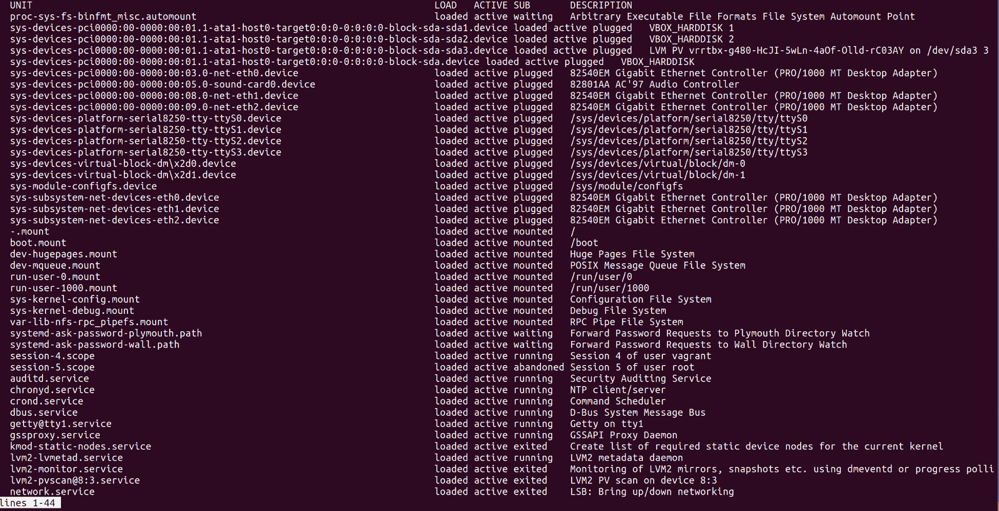
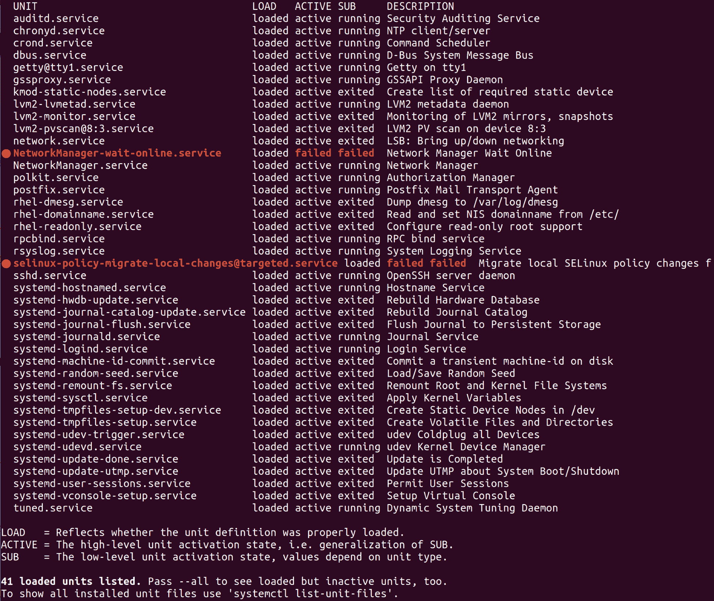

# 第四章：服务和守护进程

本章将涵盖以下主题：

+   确定运行的服务

+   列出已安装的服务

+   启动和停止服务

+   更改启动和停止的服务

+   您可能期望看到的常见服务

+   理解服务单元文件

+   自定义 systemd 单元文件

+   测试运行服务

+   编写基本单元文件

+   使用 systemd 定时器（和 cron）

+   其他`init`系统

# 介绍

systemd（小写）是一个九头蛇。

在旧世界中，我们为系统上想要做的每件小事都有一个软件。时间由 NTP 处理，设备由`udev`处理，而 init 通常由`SysV Init`处理。

在新世界中，我们有 systemd：

+   系统时钟管理可以由`systemd-timesyncd`处理。

+   `udev`已合并到 systemd 代码库中，形成`systemd-udevd`。

+   进程初始化由 systemd 核心本身处理。

列表还在继续。

一般来说，systemd 一直在采用其他项目，或者将相同的功能写入自己的实现中（例如 systemd-timesyncd，它是一个 NTP 替代品）。然而，systemd 套件也是模块化的，这意味着发行版可以广泛选择要采用和使用的部分。

对我们来说，systemd 的重要工作是替换发行版上的传统 init 系统（CentOS，Debian 和 Ubuntu 现在都使用 systemd）。这意味着首先，systemd 管理着您的计算机上的服务和守护进程。

systemd 是第一个进程，这意味着它经常被分配为第一个**进程 ID**（**PID**）。所有其他进程都将 systemd 作为父进程。

在本章中，我们将使用 systemd 的 init 组件，了解单元文件，并确定系统的运行状态。

在 systemd 主导每个主流发行版之前，这一章可能会更长。Canonical 为 Ubuntu 编写了一个称为 Upstart 的东西（它曾暂时被 Red Hat 采用），而更传统的发行版则很难放弃`SysV`初始化风格的守护程序管理。即使在今天，您仍会发现在野外使用旧实现的系统：

+   CentOS 在 7 版本中采用了 systemd

+   Ubuntu 在 15.04 中采用了 systemd

+   Debian 在 Jessie（8）中采用了 systemd

如果 Canonical 编写了 Upstart，您可能会想知道他们最终为什么选择了 systemd。这主要是因为 Debian 采用了 systemd，经过内部的一场内战，Ubuntu 承认如果他们继续与上游发行版保持一致，他们将更容易些。这场战争并不是没有双方激烈的战斗，一些涟漪仍然可以感受到。

# 技术要求

对于本章，需要一个不同的`Vagrantfile`。

如有需要，可以使用以下示例-确保`destroy`之前的任何箱子以释放资源：

```
# -*- mode: ruby -*-
# vi: set ft=ruby :

Vagrant.configure("2") do |config|

 config.vm.define "centos1" do |centos1|
   centos1.vm.box = "centos/7"
   centos1.vm.network "private_network", ip: "192.168.33.10"
   centos1.vm.hostname = "centos1"
   centos1.vm.box_version = "1804.02"
 end

 config.vm.define "centos6" do |centos6|
   centos6.vm.box = "centos/6"
 end

 config.vm.define "debian7" do |debian7|
   debian7.vm.box = "debian/wheezy64"
 end

end
```

# 确定运行的服务

每当您到达一个箱子，特别是您不确定的箱子（被放在柜子后面自言自语的箱子），弄清楚上面运行的软件是个好主意。

在现代系统（2013 年以后），可以使用`systemctl`命令来实现这一点。

`systemctl`是任何 systemd 系统的主要控制机制-字面上是“系统控制”。将其视为初始化软件的人类前端（在您的计算机上运行的第一个软件，管理所有其他软件），允许您修改和调查计算机的运行状态。

不仅如此，在 Unix/Linux 世界中，一切都是文件；您的网络连接是一个文件，您的程序是一个文件，您的设备是一个文件，因此您可以通过修改文件来控制一切。

但这很快就变得乏味了。

`systemctl`通过简单的命令包装功能并以人类可读的方式打印结果，为您节省了手动在系统中移动文件的麻烦。

# 如何做...

在命令行上，键入以下内容：

```
$ systemctl
```

您应该会看到一个 systemd 单元的列表；这是 systemd 知道的每个单元的一个很好的初始概述，但它非常嘈杂（如下面的屏幕截图所示），我们特别想要看到的是守护进程（因为我们有一种哥特风格）：



在 Linux 领域，服务和守护进程有些可以互换；例如，systemd 将守护进程称为`service`文件。这并不能阻止一些人对“正确使用”感到愤怒。

尝试以下命令：

```
$ systemctl list-units --type service
```

您应该会得到一个服务及其状态的列表。

这个视图更好，但它也显示了失败和退出的服务，例如，在我们的 Vagrant 实例上，我们应该看到以下内容：



如果我想排除这些，我可以使用以下命令：

```
$ systemctl list-units --type service --state running
```

现在我们得到了一个更加简洁的列表，总共有 17 项：

```
UNIT                     LOAD   ACTIVE SUB     DESCRIPTION
auditd.service           loaded active running Security Auditing Service
chronyd.service          loaded active running NTP client/server
crond.service            loaded active running Command Scheduler
dbus.service             loaded active running D-Bus System Message Bus
getty@tty1.service       loaded active running Getty on tty1
gssproxy.service         loaded active running GSSAPI Proxy Daemon
lvm2-lvmetad.service     loaded active running LVM2 metadata daemon
NetworkManager.service   loaded active running Network Manager
polkit.service           loaded active running Authorization Manager
postfix.service          loaded active running Postfix Mail Transport Agent
rpcbind.service          loaded active running RPC bind service
rsyslog.service          loaded active running System Logging Service
sshd.service             loaded active running OpenSSH server daemon
systemd-journald.service loaded active running Journal Service
systemd-logind.service   loaded active running Login Service
systemd-udevd.service    loaded active running udev Kernel Device Manager
tuned.service            loaded active running Dynamic System Tuning Daemon

LOAD   = Reflects whether the unit definition was properly loaded.
ACTIVE = The high-level unit activation state, i.e. generalization of SUB.
SUB    = The low-level unit activation state, values depend on unit type.

17 loaded units listed. Pass --all to see loaded but inactive units, too.
To show all installed unit files use 'systemctl list-unit-files'.
```

您可以使用`--no-legend`选项来消除`systemctl`的有用但嘈杂的页眉和页脚注释。

# 工作原理...

在本节中，我们使用`systemctl`命令来查询 systemd。

我们将逐渐更加细化我们的请求，直到最终构建出一个查询，只显示我们想要看到的内容，即正在运行的服务。

有人认为使用`pipes`和`grep`来实现你想要的结果是有道理的，根据你的偏好，你可能会发现这两个命令中的一个比另一个更整洁，尽管它们实现的功能大致相同：

```
$ systemctl --no-pager | grep service | grep running | column -t
```

在前面，我们首先从`systemctl`打印默认的“all”列表，然后我们通过`grep`几次来过滤我们想要的内容，最后我们以列的形式显示出来，这样基本上是可读的。

```
$ systemctl list-units --type service --state running --no-legend
```

在这里，我们使用一个命令来获得比以前更漂亮的输出，并且我们只使用一个命令来完成它。

# 还有更多...

与已加载和运行的服务一样，您可能对已加载、完成其预期工作然后退出的服务感兴趣：

```
$ systemctl list-units --type service --state exited
```

或者你可能对失败的服务感兴趣？尝试以下命令：

```
$ systemctl list-units --type service --state failed
```

最后，systemd 默认会使用分页器显示结果，虽然对人类友好，但对脚本来说并不理想。要简单地将命令的输出打印到`stdout`，请在您的命令中添加`--no-pager`。

# 另请参阅

通常，查询 init 系统是确定系统上运行哪些服务的最佳方法，尽管如果你在 init 之外运行某些东西，比如由`cron`启动的后台任务，你可能会用`ps`或`top`更好，我们稍后会介绍。

# 列出已安装的服务

在本节中，我们将看看如何列出已安装但永远不会在主机上运行的服务，通常是因为它们没有被启用。

# 准备工作

连接到您的`centos1` VM。

```
$ vagrant ssh centos1
```

# 如何做...

以您的用户身份运行以下命令：

```
$ systemctl list-unit-files --type service
```

默认情况下，您将会看到一个通常很长的服务列表。其中很多将被列为`static`，一些将被列为`enabled`，其他将被列为`disabled`。

就 systemd 而言，这是系统上所有它知道的服务的列表。

# 工作原理...

我们再次使用`systemctl`查询 systemd，只是这一次不是打印运行中的服务，而是获取 init 系统知道的所有内容。

服务文件，实际上所有其他类型的单元文件，通常存在于`/usr/lib/systemd/system`。从这个位置，文件被符号链接到`/etc/systemd/system`中的`runlevel`目录中。

如下所示，我们将`ls`这个目录：

```
$ ls -la /etc/systemd/system
total 8
drwxr-xr-x. 13 root root 4096 May 12 2018 .
drwxr-xr-x. 4 root root 151 May 12 2018 ..
drwxr-xr-x. 2 root root 32 May 12 2018 basic.target.wants
lrwxrwxrwx. 1 root root 46 May 12 2018 dbus-org.freedesktop.NetworkManager.service -> /usr/lib/systemd/system/NetworkManager.service
lrwxrwxrwx. 1 root root 57 May 12 2018 dbus-org.freedesktop.nm-dispatcher.service -> /usr/lib/systemd/system/NetworkManager-dispatcher.service
lrwxrwxrwx. 1 root root 37 May 12 2018 default.target -> /lib/systemd/system/multi-user.target
drwxr-xr-x. 2 root root 87 May 12 2018 default.target.wants
drwxr-xr-x. 2 root root 38 May 12 2018 dev-virtio\x2dports-org.qemu.guest_agent.0.device.wants
drwxr-xr-x. 2 root root 32 May 12 2018 getty.target.wants
drwxr-xr-x. 2 root root 35 May 12 2018 local-fs.target.wants
drwxr-xr-x. 2 root root 4096 May 12 2018 multi-user.target.wants
drwxr-xr-x. 2 root root 48 May 12 2018 network-online.target.wants
drwxr-xr-x. 2 root root 31 May 12 2018 remote-fs.target.wants
drwxr-xr-x. 2 root root 51 May 12 2018 sockets.target.wants
drwxr-xr-x. 2 root root 217 May 12 2018 sysinit.target.wants
drwxr-xr-x. 2 root root 44 May 12 2018 system-update.target.wants
```

请注意，我们有一些`targets`，它们基本上是系统的不同运行级别；您将与之交互的大多数日常服务都位于`multi-user.target.wants`中，这基本上是多用户会话所需的服务（典型的操作模式）。

在这个子目录中再次运行`ls`，可以看到之前提到的符号链接及其在磁盘上的位置：

```
$ ls -la /etc/systemd/system/multi-user.target.wants/
total 8
drwxr-xr-x. 2 root root 4096 May 12 2018 .
drwxr-xr-x. 13 root root 4096 May 12 2018 ..
lrwxrwxrwx. 1 root root 38 May 12 2018 auditd.service -> /usr/lib/systemd/system/auditd.service
lrwxrwxrwx. 1 root root 39 May 12 2018 chronyd.service -> /usr/lib/systemd/system/chronyd.service
lrwxrwxrwx. 1 root root 37 May 12 2018 crond.service -> /usr/lib/systemd/system/crond.service
lrwxrwxrwx. 1 root root 42 May 12 2018 irqbalance.service -> /usr/lib/systemd/system/irqbalance.service
lrwxrwxrwx. 1 root root 46 May 12 2018 NetworkManager.service -> /usr/lib/systemd/system/NetworkManager.service
lrwxrwxrwx. 1 root root 41 May 12 2018 nfs-client.target -> /usr/lib/systemd/system/nfs-client.target
lrwxrwxrwx. 1 root root 39 May 12 2018 postfix.service -> /usr/lib/systemd/system/postfix.service
lrwxrwxrwx. 1 root root 40 May 12 2018 remote-fs.target -> /usr/lib/systemd/system/remote-fs.target
lrwxrwxrwx. 1 root root 46 May 12 2018 rhel-configure.service ->
... 
```

这些服务都是在多用户会话中`启用`启动的。

# 还有更多...

“启用”和“禁用”的概念相对容易理解，这些状态是服务要么尝试运行要么不尝试运行。

`静态`是另一回事；当一个单元文件存在但未启用时，这是一个使用术语，由于其单元文件的缺少`[Install]`部分，它没有能力变得启用。

我们可以使用以下行列出这些服务：

```
$ systemctl --no-pager list-unit-files --type service --state static
```

随机选择一个服务（`sshd-keygen`），我们可以查看其服务文件如下：

```
$ systemctl cat sshd-keygen.service
```

使用 systemctl 的`cat`选项很好，因为它还会显示您所询问的单元文件的位置。

我们得到以下内容：

```
# /usr/lib/systemd/system/sshd-keygen.service
[Unit]
Description=OpenSSH Server Key Generation
ConditionFileNotEmpty=|!/etc/ssh/ssh_host_rsa_key
ConditionFileNotEmpty=|!/etc/ssh/ssh_host_ecdsa_key
ConditionFileNotEmpty=|!/etc/ssh/ssh_host_ed25519_key
PartOf=sshd.service sshd.socket

[Service]
ExecStart=/usr/sbin/sshd-keygen
Type=oneshot
RemainAfterExit=yes
```

从这个文件中，我们可以看到它有一个`PartOf`定义，表明它作为`sshd`服务的一部分运行。

再次查看该服务（再次使用 systemctl `cat`）会发现以下内容：

```
# /usr/lib/systemd/system/sshd.service
[Unit]
Description=OpenSSH server daemon
Documentation=man:sshd(8) man:sshd_config(5)
After=network.target sshd-keygen.service
Wants=sshd-keygen.service

[Service]
Type=notify
EnvironmentFile=/etc/sysconfig/sshd
ExecStart=/usr/sbin/sshd -D $OPTIONS
ExecReload=/bin/kill -HUP $MAINPID
KillMode=process
Restart=on-failure
RestartSec=42s

[Install]
WantedBy=multi-user.target
```

在这里我们可以看到`Wants`部分，表明`sshd-keygen`在`sshd`启动时运行。

这就解释了为什么它不必自行启用。

# 另请参阅

与 Linux 系统上的大多数组件一样，`systemctl`命令有一个 man 页面。

在这个 man 页面中，您会找到一个名为`is-enabled output`的表，您可以在其中了解有关您的状态命令打印的不同术语的更多信息。

我们有一个处于`间接`状态的服务，表中列出了以下含义：

“单元文件本身没有启用，但在[Install]单元文件部分中有一个非空的 Also=设置，列出了可能已启用的其他单元文件，或者它在不在 Also=中指定的符号链接下有一个不同名称的别名。对于模板单元文件，除了在 DefaultInstance=中指定的实例之外的实例是启用的。”

# 启动和停止服务

在本节中，我们将看一下启动和停止服务的微不足道但重要的方面。

想象一下一个没有自动启动守护进程的能力的世界；您将不得不手动进入并在每次重新启动时启动您的服务，确保每次以适当的方式启动您的服务。

像受星际之门复制体主导的世界一样，那不是我想要生活的世界。

# 如何做...

在这个例子中，我们将使用`postfix`，因为它是一个在我们的 VM 上不会做太多事情的服务。

`postfix`是一个通常安装在 CentOS 盒子上的**邮件传输代理**（**MTA**）。即使您的盒子不处理电子邮件，进程也可能使用它向您发送有关故障的警告等信息。

# 停止我们的服务

运行以下命令（使用`sudo`）：

```
$ sudo systemctl stop postfix
$ 
```

请注意，没有输出来确认或否认您输入的内容是否有效。

# 启动我们的服务

与停止我们的服务一样，再次启动它是微不足道的：

```
$ sudo systemctl start postfix 
$
```

再次注意到令人困惑的沉默。

命令完成后的沉默并不是 systemd 独有的，实际上这是 Unix 和类 Unix 世界的一种哲学。如果一个命令已经完成了它应该做的事情，用户就不需要被告知。

# 它是如何工作的...

当您指示 systemd 启动或停止一个单元时，实际上是运行其单元文件的`ExecStart`或`ExecStop`部分。

以`postfix`为例，其单元文件如下：

```
# /usr/lib/systemd/system/postfix.service
[Unit]
Description=Postfix Mail Transport Agent
After=syslog.target network.target
Conflicts=sendmail.service exim.service

[Service]
Type=forking
PIDFile=/var/spool/postfix/pid/master.pid
EnvironmentFile=-/etc/sysconfig/network
ExecStartPre=-/usr/libexec/postfix/aliasesdb
ExecStartPre=-/usr/libexec/postfix/chroot-update
ExecStart=/usr/sbin/postfix start
ExecReload=/usr/sbin/postfix reload
ExecStop=/usr/sbin/postfix stop

[Install]
WantedBy=multi-user.target
```

在这里，我们可以看到，当我们发出`systemctl start postfix`命令时，它实际上是使用`start`选项运行`postfix`二进制文件。相反的是`stop`。

我们还有一些`ExecStartPre`行，这些是在主`ExecStart`命令运行之前执行的命令。

# 还有更多...

没有`sudo`，您可能会被提示以`root`身份进行身份验证；为了以`root`身份运行命令，当我忘记先使用`sudo`时，我通常会看到这种对话框：

```
==== AUTHENTICATING FOR org.freedesktop.systemd1.manage-units ===
Authentication is required to manage system services or units.
Authenticating as: root
Password:
```

您还可以使用`status`参数快速确认服务是否已启动或停止：

```
$ systemctl status postfix
● postfix.service - Postfix Mail Transport Agent
 Loaded: loaded (/usr/lib/systemd/system/postfix.service; enabled; vendor preset: disabled)
 Active: inactive (dead) since Sun 2018-08-26 13:43:46 UTC; 2min 56s ago
```

# 另请参阅

有关您正在阅读的单元文件的`ExecStart`和`ExecStop`选项的更多信息，请查看有关此主题的特定`systemd.service` man 页面。

还有其他一些选项不是`start`和`stop`，包括`reload-or-try-restart`，这可能会让事情变得更加混乱。请参阅`systemctl`命令以获取这些选项。

# 更改启动和停止的服务

在 CentOS 世界中，安装新服务并不会立即启动和启用它，尽管在 Debian 世界中会（这是一个默认设置，再次引起了一些人的支持和反对）。

在这个例子中，我们将启用一个新的服务并重新启动我们的虚拟机，看看它启动时会发生什么。

# 做好准备

连接到您的`centos1`虚拟机。为这些示例安装`httpd`（Apache）：

```
$ sudo yum install -y httpd
```

# 如何做...

首先，让我们看看我们是否实际上有一个`httpd`的单元文件：

```
$ systemctl cat httpd
# /usr/lib/systemd/system/httpd.service
[Unit]
Description=The Apache HTTP Server
After=network.target remote-fs.target nss-lookup.target
Documentation=man:httpd(8)
Documentation=man:apachectl(8)

[Service]
Type=notify
EnvironmentFile=/etc/sysconfig/httpd
ExecStart=/usr/sbin/httpd $OPTIONS -DFOREGROUND
ExecReload=/usr/sbin/httpd $OPTIONS -k graceful
ExecStop=/bin/kill -WINCH ${MAINPID}
# We want systemd to give httpd some time to finish gracefully, but still want
# it to kill httpd after TimeoutStopSec if something went wrong during the
# graceful stop. Normally, Systemd sends SIGTERM signal right after the
# ExecStop, which would kill httpd. We are sending useless SIGCONT here to give
# httpd time to finish.
KillSignal=SIGCONT
PrivateTmp=true

[Install]
WantedBy=multi-user.target
```

我们有一个，现在我们需要看看它当前处于什么状态：

```
$ systemctl status httpd
```

我们的输出将服务列为`inactive`和`disabled`。

# 启用我们的服务

如果我们只想启动我们的服务，我们可以运行前一节中列出的命令，但这不会使服务在启动时启用。

要启用我们的服务，我们运行`enable`，令人惊讶：

```
$ sudo systemctl enable httpd
Created symlink from /etc/systemd/system/multi-user.target.wants/httpd.service to /usr/lib/systemd/system/httpd.service.
```

请注意，由于某种原因，我们在启用服务时确实会得到输出。

重新启动您的服务器，使用`systemctl status`命令查看`httpd`是否在启动时启动。

# 禁用我们的服务

现在我们已经启用了`httpd`，我们将再次禁用它，因为这就是我们的风格：

```
$ sudo systemctl disable httpd
Removed symlink /etc/systemd/system/multi-user.target.wants/httpd.service.
```

# 它是如何工作的...

当我们禁用和启用服务时，在输出中看到的实际上是在我们的`httpd`单元文件的默认位置和`multi-user.target.wants`目录之间创建一个`symlink`，如前所述。

在启动时，systemd 将在适当的时间检查此目录并启动它发现的服务。

# 还有更多...

同时启动和启用服务是完全可能的，绝对比重新启动服务器更可取来改变服务的状态。

通过在我们的`enable`命令中插入`--now`可以轻松实现这一点：

```
$ systemctl enable --now httpd
```

实际上，我们在一行上运行了以下操作：

```
$ systemctl enable httpd
$ systemctl start httpd
```

# 另请参阅

systemd 对`targets`的概念与您可能熟悉或不熟悉的老式`runlevel`类似。这不是直接的比较，因为 systemd 可以同时激活多个 targets，而 runlevels 是单数的。`multi-user.target`大致相当于 runlevels 2、3 和 4。

请参阅`systemd.target`手册以获取更多信息。

# 您可能期望看到的常见服务

在本节中，我们将列出您可能期望在给定服务器上看到的常见服务。这个列表不会是全面的，因为默认情况下会有哪些服务可能会发生变化，甚至在发行版之间也会有所不同。

# 如何做...

列出系统上的服务，甚至包括那些静态和禁用的服务：

```
$ systemctl list-unit-files --type service
```

通过使用默认分页器（less）并使用`/`进行搜索，浏览列表。

# auditd.service

从头开始，我们有`auditd.service`，"Linux 审计守护程序"。用于编写系统的审计记录，您将在`/var/log/audit/`目录中找到其工作的成果。

# chronyd.service

如我们在讨论系统时间时所讨论的，`chronyd`负责保持系统时钟的准确性。我期望在大多数服务器上都能看到这个或`ntpd`在运行。

# crond.service

不要与`chronyd`混淆，`crond`是负责确保按计划运行命令的守护程序。

# lvm2-*.service

`lvm2`服务文件的集合用于维护和监视**逻辑卷管理器**（**LVM**）设置。您可能会发现大多数服务器都在使用 LVM 来管理文件系统和卷。

# NetworkManager.service

我们已经详细介绍了网络，但了解`NetworkManager.service`文件是其中几个带有大写字母的让人讨厌的服务之一是很有用的。

这个事实已经在不止一个场合让我措手不及。

# nfs.service

通常安装的`nfs`服务套件用于管理**网络文件系统**（**NFS**）设备。

NFS 仍然被广泛使用，并且由发行版生产商进行了很好的维护，这意味着即使你不使用它，它可能仍然存在。

# postfix.service

作为典型的 MTA，`postfix`是您在 Red Hat、CentOS 和 Fedora 系统上看到的默认选项。在其他系统上，可能是 Exim 邮件服务器。稍后我们将简要介绍这些内容。

# rsyslog.service

在您的服务器上可能已经安装了`rsyslog`或`syslog-ng`，至少在可预见的未来是这样。这些是系统日志守护程序，负责将日志写入`/var/log`（通常）。它们在`喜欢二进制日志的 journald`中有竞争对手，我们稍后会谈到。

# sshd.service

我希望在我连接的任何系统上都能看到`sshd.service`运行，否则我就不知道我用了什么令人困惑的方法来连接。

# systemd-journald.service

`syslog`的竞争对手`journald`是由 systemd 管理的日志守护程序，可以使用命令行上的一系列句法汤进行查询。

# systemd-logind.service

`systemd`的另一个来自 Borg 的服务，`logind`管理您是管理员的系统的用户登录。

# 它是如何工作的...

这些服务以及您可能在计算机上运行的其他服务，实际上构成了您正在运行的操作系统。

如果你像我一样，可能会在业余时间玩弄这个列表，试图弄清楚哪些部分可以禁用，而最终仍然有一个正常运行的系统。

通常建议保持默认设置不变，因为你永远不知道哪个随机的作业正在清理临时目录，而你甚至没有意识到。

默认服务经常被禁用作为**加固**任务的一部分；如果你发现自己不得不加固一个系统，通常的规则仍然适用。了解当前的最佳实践是什么，并查看您的供应商是否有现成的指南。

# 还有更多...

我们可以使用`systemd-analyze`等方便的工具来查看系统启动所需的时间：

```
$ systemd-analyze 
Startup finished in 253ms (kernel) + 933ms (initrd) + 6.873s (userspace) = 8.060s
```

8 秒并不算糟糕，不包括 VirtualBox 初始化我们的虚拟机所需的时间和内核启动所需的时间（在 Grub 引导菜单上为 5 秒）。

你甚至可以在命令的末尾加上`blame`来运行这个命令，以查看哪个进程占用了你宝贵的时间：

```
$ systemd-analyze blame
 3.811s NetworkManager-wait-online.service
 806ms tuned.service
 680ms postfix.service
 490ms lvm2-monitor.service
 ...
```

# 另请参阅

查看其他系统默认启动的服务。例如，Ubuntu 桌面版可能不会启动`auditd`，但在启动计算机时可能会有`gdm`来确保 Gnome 登录窗口。

# 理解服务单元文件

现在我们已经很清楚在哪里找到服务单元文件，以及如何启用和禁用服务。

之前，我们提到了单元文件中的一些条目，尽管我们并没有深入探讨这些选项或者在哪里找到更多信息和您可能想要使用的替代条目。

# 如何做...

我们将以`sshd.service`为例，不仅因为它是您可能经常看到的服务文件，而且因为它具有很好的默认条目混合。

`cat`我们选择的服务：

```
$ systemctl cat sshd.service
# /usr/lib/systemd/system/sshd.service
[Unit]
Description=OpenSSH server daemon
Documentation=man:sshd(8) man:sshd_config(5)
After=network.target sshd-keygen.service
Wants=sshd-keygen.service

[Service]
Type=notify
EnvironmentFile=/etc/sysconfig/sshd
ExecStart=/usr/sbin/sshd -D $OPTIONS
ExecReload=/bin/kill -HUP $MAINPID
KillMode=process
Restart=on-failure
RestartSec=42s

[Install]
WantedBy=multi-user.target
```

要理解这个文件，我们必须将其分解为其组成部分。

`Unit`文件的`Main`部分，`[Unit]`是通用条目的区域，不是`Service`类型的特定条目：

```
[Unit]
```

对于描述，我们有一个简短而简洁的条目，一目了然：

```
Description=OpenSSH server daemon
```

我们还有一行方便的信息，详细说明了如果遇到困难应该查看的适当 URI 位置。这里我们有`man:`作为 URI，但它也可以是`https://`甚至是`info::`：

```
Documentation=man:sshd(8) man:sshd_config(5)
```

`info:`指的是信息页面，类似于 man 页面，但更广泛地受到嘲笑。`After=`（和`Before=`）是一个以空格分隔的单元名称列表，指定需要在此之后（或之前）启动的服务。这里需要启动网络，并且在`sshd`启动之前需要运行`ssh-keygen`：

```
After=network.target sshd-keygen.service
```

我们之前解析了`Wants=`，但为了更详细地解释一下，你通常会在单元文件中看到`Wants=`，列出了在启动此服务之前可能触发的服务：

```
Wants=sshd-keygen.service
```

`Wants=`是`Requires=`的一个不那么强制的版本。如果`Wants=`服务启动失败，父服务仍然会尝试，如果`Requires=`服务失败，父服务也不会启动。

特定于`service`类型的单元文件，`[Service]`块是特定于服务选项的，可能很明显：

```
[Service]
```

进程启动类型，`notify`在这里表示 systemd 期望守护进程在启动完成后发送通知消息。只有在收到此通知后，systemd 才会继续启动依赖于此服务的服务：

```
Type=notify
```

用于指向包含其环境变量的文件的服务，对于`sshd`，这在我们的盒子上包含一个选项，`OPTIONS="-u0"`：

```
EnvironmentFile=/etc/sysconfig/sshd
```

当服务启动时运行的关键是`ExecStart`，它给出了要运行的命令。还要注意从`EnvironmentFile`行指定的文件中读取的`$OPTIONS`值：

```
ExecStart=/usr/sbin/sshd -D $OPTIONS
```

这一部分告诉 systemd 如果运行`systemctl reload sshd`命令时应该运行什么。具体来说，我们向`sshd`PID 发送`HUP`（挂起）信号：

```
ExecReload=/bin/kill -HUP $MAINPID
```

这个指令指定了如何杀死该单元自己创建的进程。这里的`process`意味着只有主进程本身被 systemd 杀死：

```
KillMode=process
```

这里使用了`KillMode`，但没有使用`ExecStop`。这是因为`ExecStop`是可选的，通常只有在 init 守护程序有特定的清理工作要做时才会使用。

我们的`Restart`选项告诉 systemd 如何重新启动进程。这里使用的`on-failure`表示`sshd`将在退出代码不干净、不干净的信号、超时或服务的看门狗超时被触发时重新启动：

```
Restart=on-failure
```

`RestartSec`是在满足`Restart=`标准后重新启动`sshd`服务之前需要的时间。我想这里是 42 秒，因为单元文件的作者是道格拉斯·亚当斯的粉丝：

```
RestartSec=42s
```

安装是另一个通用部分，例如`[Unit]`。该部分保存了单元文件的安装信息，这意味着在运行时被 enable 和 disable 指令读取：

```
[Install]
```

这里唯一的指令是这个服务是`WantedBy`多用户目标，这意味着在多用户模式下，`sshd`将被启动：

```
WantedBy=multi-user.target
```

# 工作原理...

当 systemd 与服务文件交互时，它读取的文件部分决定了它的操作。

如果启动服务，将读取`ExecStart`；如果停止，将读取`ExecStop`。

# 还有更多...

单元文件的作者可以使用多种选项，并且每个 systemd 版本都会添加更多选项。你有很大的机会可以通过单元文件条目实现你想要的操作。

尽管单元文件作者可以使用多种选项，但仍然有人坚持编写一个 bash 脚本来完成所有操作，并在四行单元文件中简单地引用它。这是可能的，但不够整洁。

# 另请参阅

如果你有一个空闲的下午，可以阅读`systemd.service`和`systemd.unit`手册页；它们都很长，是睡眠药片的良好替代品。

# 自定义 systemd 单元文件

在本节中，我们将看看如何修改 systemd 单元文件的方法。

这里有一个重要的说明，即虽然你绝对可以修改配置文件，但不能保证你的更改会在系统更新后持久存在。软件包管理器可能会对你篡改他们的服务文件感到不满，并在没有警告的情况下替换它们。

修改 systemd 单元文件操作的正确方法是编写另一个包含你的更改的文件。

systemd 执行此操作的方法称为片段。

# 操作步骤...

systemd 有一种内置的方法来生成我们需要的覆盖文件。

使用以下命令创建`sshd.service`单元的目录和文件：

```
$ sudo systemctl edit sshd.service
```

您将被放置在一个空文件中，但这个文件存在于一个新的目录中，即`/etc/systemd/system/sshd.service.d/override.conf`。

将以下内容复制到我们的空文件中：

```
[Unit]
Description=OpenSSH server daemon slightly modified
Documentation=man:ssh-additional
Requires=sshd-keygen.service

[Service]
Environment=OPTIONS="-u0"
ExecStart=
ExecStart=/usr/sbin/sshd -4 -D $OPTIONS
RestartSec=10s
```

当我们保存并退出文件时，会隐式运行`systemctl daemon-reload`，这意味着当我们运行`systemctl restart sshd`时，我们的新设置将生效。

# 工作原理...

我们说我们的`edit`命令创建了一个新的目录和文件，可以在其中放置覆盖命令；您现在可以通过更改到它来访问这个目录：

```
$ cd /etc/systemd/system/sshd.service.d/
$ ls 
override.conf
```

在我们的覆盖文件中，我们存储了新的条目。这些条目通常是主配置文件中的补充。

分解我们的新配置，我们有以下内容：

```
[Unit]
Description=OpenSSH server daemon slightly modified
Documentation=man:ssh-additional
Requires=sshd-keygen.service
```

在这里，我们添加了文件的简短描述，显示它稍微修改了。有一个虚假的手册页面条目，我们建议在编写文档时可能是一个不错的地方。我们还更改了服务，使其现在需要`sshd-keygen`，而不仅仅是想要它。

现在，我们更改服务部分：

```
[Service]
EnvironmentFile=
Environment=OPTIONS="-u0"
ExecStart=
ExecStart=/usr/sbin/sshd -4 -D $OPTIONS
RestartSec=10s
```

在这里，我们添加了我们的`Environment`指令，而不是使用`EnvironmentFile`（我们已经清空了）。

我们也清空了`ExecStart`，并传入我们自己的（我们已经添加了`-4`）。

因为我们觉得无聊，所以我们决定希望`sshd`在 10 秒内重新启动，而不是`42`。

# 还有更多...

并不总是明显哪些值可以堆叠在一起，哪些必须首先清空。

要测试您的配置是否被正确加载，请使用`systemctl show sshd`来读取服务的运行配置。

在输出中，我找到了以下行（`Documentation`可以堆叠，所以我们的新条目只是添加到末尾）：

```
Documentation=man:sshd(8) man:sshd_config(5) man:ssh-additional
```

`Description`被覆盖了，因为您只能有一个条目，所以我们的优先级较高：

```
Description=OpenSSH server daemon slightly modified
```

没有`EnvironmentFile`选项，唯一的条目是我们的`Environment`行：

```
Environment=OPTIONS="-u0"
```

只有一行`ExecStart`，而且是我们的，因为我们清空了原始的：

```
ExecStart={ path=/usr/sbin/sshd ; argv[]=/usr/sbin/sshd -4 -D $OPTIONS ...
```

# 另请参阅

还有另一种方法可以对自己的单元文件进行更改，但这种方法比较混乱。实际上，您需要编写一个完整的单元文件，更改您想要的选项，然后将新文件放在`/etc/systemd/system/`中，然后重新启用服务。这种方法有效的原因是因为`/etc/systemd/system/`的优先级高于`/usr/lib/systemd/system/`，尽管现在您已经自己承担了整个服务定义的管理，而不仅仅是您想要更改的部分。

# 测试运行的服务

在本节中，我们将看看三种方法，一旦我们发出`start`命令，就可以看到服务是否真的在运行。

我们将从内置的 systemd 方式（`systemctl`）开始，然后转向通用方式（`ps`），最后是简单方式（`telnet`）。

# 准备工作

连接到您的`centos1`虚拟机。如果尚未启动，请安装并启动`httpd`。

我们还将安装`telnet`进行一些基本的端口检查：

```
$ sudo yum install -y httpd telnet
$ sudo systemctl enable --now httpd
```

# 如何做...

使用 systemd 的内置工具，我们可以使用`status`选项来检查状态：

```
[vagrant@centos1 ~]$ systemctl status httpd
● httpd.service - The Apache HTTP Server
 Loaded: loaded (/usr/lib/systemd/system/httpd.service; enabled; vendor preset: disabled)
 Active: active (running) since Sun 2018-08-26 16:15:50 UTC; 5min ago
 Docs: man:httpd(8)
 man:apachectl(8)
 Main PID: 3578 (httpd)
 Status: "Total requests: 0; Current requests/sec: 0; Current traffic:   0 B/sec"
 CGroup: /system.slice/httpd.service
 ├─3578 /usr/sbin/httpd -DFOREGROUND
 ├─3579 /usr/sbin/httpd -DFOREGROUND
 ├─3580 /usr/sbin/httpd -DFOREGROUND
 ├─3581 /usr/sbin/httpd -DFOREGROUND
 ├─3582 /usr/sbin/httpd -DFOREGROUND
 └─3583 /usr/sbin/httpd -DFOREGROUND
```

这是一个很好的迹象，因为 systemd 认为它们是正常的。我们还可以使用`ps`工具来尝试确定我们的进程是否已启动：

```
[vagrant@centos1 ~]$ ps aux | grep httpd
root      3578  0.0  1.0 224020  4996 ?        Ss   16:15   0:00 /usr/sbin/httpd -DFOREGROUND
apache    3579  0.0  0.5 224020  2948 ?        S    16:15   0:00 /usr/sbin/httpd -DFOREGROUND
apache    3580  0.0  0.5 224020  2948 ?        S    16:15   0:00 /usr/sbin/httpd -DFOREGROUND
apache    3581  0.0  0.5 224020  2948 ?        S    16:15   0:00 /usr/sbin/httpd -DFOREGROUND
apache    3582  0.0  0.5 224020  2948 ?        S    16:15   0:00 /usr/sbin/httpd -DFOREGROUND
apache    3583  0.0  0.5 224020  2948 ?        S    16:15   0:00 /usr/sbin/httpd -DFOREGROUND
```

在这里，我使用`aux`选项，部分原因是因为我可以在我的 BSD 系统上可靠地执行相同的操作，另一部分原因是因为我最初观看`ps`使用这些标志的人，所以这些标志一直留在我心中。

我们可以看到`httpd`正在运行几个进程。

或者，我们可以尝试使用`telnet`在本地连接端口：

```
[vagrant@centos1 ~]$ telnet 127.0.0.1 80
Trying 127.0.0.1...
Connected to 127.0.0.1.
Escape character is '^]'.
```

尽管如果您的 Web 服务器不在 localhost 上运行，或者不在`80`端口上运行，这个测试就有点无意义，并且会失败。

# 工作原理...

我们已经介绍了三种检查服务是否正在运行的方法。第一种，也可以说是最可靠的，是查看 init 系统是否认为服务正在运行。

我们的`systemctl`命令报告了一个活动的、运行中的状态，并给出了服务启动的时间。

接下来，我们查询系统的进程列表，看看是否能找到我们的服务器；这很有效，因为可能出现这样的情况，即配置错误的服务文件启动了您的服务，但随后不知道它的状态，因此认为它已经停止。

最后，我们使用`telnet`尝试连接到我们认为服务可能正在运行的端口；这是检查服务是否在本地运行的最不智能的方法，因为它需要您知道具体细节，而且`telnet`通常不会默认安装。

# 还有更多...

要获取有关系统上打开套接字的信息，您将使用`ss`；有关可能用于确定已使用端口的命令的详细信息，请参阅`ss`的早期部分。

# 编写一个基本的 unit 文件

在本节中，我们将组合一个我们自己的 unit 文件。我们还将选择一个位置保存它，并重新启动我们的系统以检查它是否有效。

# 如何做...

我们将再次使用 Python 的内置 Web 服务器，使用一个小的 unit 文件启动一个实例。

首先，创建我们将存储 unit 文件的目录：

```
$ sudo mkdir -p /usr/local/lib/systemd/system
```

接下来，我们将把以下内容回显到一个名为`pythonWebServer.service`的文件中：

```
$ sudo tee /usr/local/lib/systemd/system/pythonWebServer.service << HERE
[Unit]
Description=Python Web Server Example

[Service]
ExecStart=/usr/bin/python2.7 -m SimpleHTTPServer

[Install]
WantedBy=multi-user.target
HERE
```

此 unit 文件仅用于演示目的，**绝对不**应在生产中使用。

现在我们可以启用并启动它：

```
$ sudo systemctl enable --now pythonWebServer
Created symlink from /etc/systemd/system/multi-user.target.wants/pythonWebServer.service to /usr/local/lib/systemd/system/pythonWebServer.service.
```

使用`status`命令检查它是否正在运行：

```
$ systemctl status pythonWebServer.service 
● pythonWebServer.service - Python Web Server Example
 Loaded: loaded (/usr/local/lib/systemd/system/pythonWebServer.service; enabled; vendor preset: disabled)
 Active: active (running) since Sun 2018-08-26 16:43:55 UTC; 1s ago
 Main PID: 3746 (python2.7)
 CGroup: /system.slice/pythonWebServer.service
 └─3746 /usr/bin/python2.7 -m SimpleHTTPServer
```

# 它是如何工作的...

我们在这里所做的一切只是创建了一个本地 unit 文件，以便 systemd 读取和加载。

为了理解我们的路径选择，请尝试在您的系统上运行以下命令，并查看返回的内容：

```
$ systemctl --no-pager show --property=UnitPath
```

其中一个选项应该是`/usr/local/lib/systemd/system`，一开始不存在，但在我们创建它后就存在了。

使用这样的路径是个好主意，因为不仅有很大的可能性它是空的，这意味着您可以逻辑上将您的 unit 文件与其他文件分开，而且它也是整洁的（不像`/etc/systemd/system/`目录）。

然后，我们将一个小的示例 unit 文件放在这个目录中，其中包含使服务文件正常运行所需的最低限度。

一旦编写完成，只需启用并启动我们的服务。

# 还有更多...

我们在这里所做的有一些问题。

第一点是，我们创建了一个非常静态的服务文件，只能通过直接操作来更改。第二个问题是，我们创建了一个默认情况下将列出服务器根目录内容的 Web 服务器，我非常怀疑你想要这样：

```
$ curl localhost:8000
<!DOCTYPE html PUBLIC "-//W3C//DTD HTML 3.2 Final//EN"><html>
<title>Directory listing for /</title>
<body>
<h2>Directory listing for /</h2>
<hr>
<ul>
<li><a href="bin/">bin@</a>
<li><a href="boot/">boot/</a>
<li><a href="dev/">dev/</a>
<li><a href="etc/">etc/</a>
<li><a href="home/">home/</a>
<li><a href="lib/">lib@</a>
<li><a href="lib64/">lib64@</a>
<li><a href="media/">media/</a>
<li><a href="mnt/">mnt/</a>
<li><a href="opt/">opt/</a>
<li><a href="proc/">proc/</a>
<li><a href="root/">root/</a>
<li><a href="run/">run/</a>
<li><a href="sbin/">sbin@</a>
<li><a href="srv/">srv/</a>
<li><a href="sys/">sys/</a>
<li><a href="tmp/">tmp/</a>
<li><a href="usr/">usr/</a>
<li><a href="vagrant/">vagrant/</a>
<li><a href="var/">var/</a>
</ul>
<hr>
</body>
</html>
```

让我们使用到目前为止学到的知识来解决这两个问题。

打开您的新 systemd unit 文件进行编辑，使用您选择的编辑器，并填充它的一些其他选项：

```
[Unit]
Description=Python Web Server Example
Documentation=man:python(1)
ConditionFileNotEmpty=/var/www/html/index.html
After=network.target

[Service]
Type=simple
EnvironmentFile=/etc/sysconfig/pythonWebServer
ExecStart=/usr/bin/python2.7 -m SimpleHTTPServer $PORT
Restart=always
WorkingDirectory=/var/www/html/

[Install]
WantedBy=multi-user.target
```

注意我们之前使用过的一些内容，以及一些新的内容，比如`WorkingDIrectory=`。

接下来，填充`/var/www/html/index.html`：

```
$ sudo tee /var/www/html/index.html << HERE
This is a python web server.
Running at the behest of systemd.
Isn't that neat?
HERE
```

并向我们的环境文件添加一个条目：

```
$ sudo tee /etc/sysconfig/pythonWebServer <<HERE
PORT="8000"
HERE
```

重新加载 systemd 的配置：

```
$ sudo systemctl daemon-reload
```

并使用`curl`进行测试：

```
$ curl localhost:8000
This is a python web server.
Running at the behest of systemd.
Isn't that neat?
```

# 另请参阅

systemd unit 文件有很多不同的配置选项；我们在这里并没有真正深入探讨，这绝对可以构成一本书。

阅读相关的 man 页面，尝试编写自己的 unit 文件，并用您的发现回报，你勇敢的探险者。

# 使用 systemd 定时器（和 cron）

新来的孩子，以及 systemd 引入其庞大自身的另一个组件，是 systemd 定时器。定时器是另一种类型的 unit，只是作为另一个 unit 触发的指令。

在旧世界中，您可以使用`cron`来控制系统上的周期性事件，这仍然被广泛使用，但是越来越多的 systemd 定时器正在夺走这个位置。

我说*新*，但新是相对的。基本上，某些东西可能在 Debian 或 CentOS 中滞留多年，然后最终才进入 systemd。如果您想要最新和最好的东西，可以在笔记本电脑上运行 Fedora 之类的系统。

在本节中，我们将查看系统上现有的`cron`和定时器条目，然后将我们的 Python 服务器转换为定时器触发的服务。

# 如何做...

首先，我们将列出系统上现有的周期性作业。

# systemd 定时器

从 systemd 定时器开始，我们将列出默认情况下我们的盒子上存在的内容：

```
$ systemctl --no-pager list-timers --all
NEXT                         LEFT     LAST                         PASSED    UNIT                         ACTIVATES
Mon 2018-08-27 17:39:37 UTC  23h left Sun 2018-08-26 17:39:37 UTC  52min ago systemd-tmpfiles-clean.timer systemd-tmpfiles-clean.service
n/a                          n/a      n/a                          n/a       systemd-readahead-done.timer systemd-readahead-done.service

2 timers listed.
```

在这个输出中，我们可以看到两个定时器。第一个是`systemd-tmpfiles-clean.timer`，它的动作是触发`systemd-tmpfiles-clean.service`。

对这个文件运行`systemctl cat`会显示它的定时器配置：

```
# /usr/lib/systemd/system/systemd-tmpfiles-clean.timer
#  This file is part of systemd.
#
#  systemd is free software; you can redistribute it and/or modify it
#  under the terms of the GNU Lesser General Public License as published by
#  the Free Software Foundation; either version 2.1 of the License, or
#  (at your option) any later version.

[Unit]
Description=Daily Cleanup of Temporary Directories
Documentation=man:tmpfiles.d(5) man:systemd-tmpfiles(8)

[Timer]
OnBootSec=15min
OnUnitActiveSec=1d
```

查看服务文件会揭示实际运行的内容：

```
# /usr/lib/systemd/system/systemd-tmpfiles-clean.service
#  This file is part of systemd.
#
#  systemd is free software; you can redistribute it and/or modify it
#  under the terms of the GNU Lesser General Public License as published by
#  the Free Software Foundation; either version 2.1 of the License, or
#  (at your option) any later version.

[Unit]
Description=Cleanup of Temporary Directories
Documentation=man:tmpfiles.d(5) man:systemd-tmpfiles(8)
DefaultDependencies=no
Conflicts=shutdown.target
After=systemd-readahead-collect.service systemd-readahead-replay.service local-fs.target time-sync.target
Before=shutdown.target

[Service]
Type=oneshot
ExecStart=/usr/bin/systemd-tmpfiles --clean
IOSchedulingClass=idle
```

请注意，这是一个`oneshot`服务，意味着它在运行后预期会退出。

根据之前的信息，我们可以知道我们的定时器上次运行的时间和下次运行的时间。

我们可以看到的第二个定时器，`systemd-readahead-done.timer`及其伴随的服务文件，没有激活。这是通过各种时间字段中的`n/a`细节表示的。这个服务用于非虚拟化系统记录磁盘引导模式，试图加快随后的引导速度。

这使得定时器比`cron`更容易阅读和计算上次运行的时间。

# cron

我不知道有没有一种简单的方法来列出`cron`的信息；如果你知道，请写信给我，让我大吃一惊。

正如我们之前所说，`cron`是一个按计划执行命令的守护进程。它仍然被广泛使用，有许多系统在其中使用了混合的 systemd 定时器/`cron`设置。

默认情况下，`cron`在`/etc/`中包含以下目录：

```
cron.d/       cron.daily/   cron.hourly/  cron.monthly/ cron.weekly/
```

在`cron.d`中，我们可以看到一个名为`0hourly`的文件，其内容如下所示：

```
cat 0hourly 
# Run the hourly jobs
SHELL=/bin/bash
PATH=/sbin:/bin:/usr/sbin:/usr/bin
MAILTO=root
01 * * * * root run-parts /etc/cron.hourly
```

而在`/etc/cron.hourly`目录中，我们只有`0anacron`：

```
#!/bin/sh
# Check whether 0anacron was run today already
if test -r /var/spool/anacron/cron.daily; then
 day=`cat /var/spool/anacron/cron.daily`
fi
if [ `date +%Y%m%d` = "$day" ]; then
 exit 0;
fi

# Do not run jobs when on battery power
if test -x /usr/bin/on_ac_power; then
 /usr/bin/on_ac_power >/dev/null 2>&1
 if test $? -eq 1; then
 exit 0
 fi
fi
/usr/sbin/anacron -s
```

可读性不强。

乍一看，要弄清楚通过`cron`定期运行的作业是很尴尬和麻烦的，你总会遇到那种没有任何日志记录的临时作业，而且他们自己都忘了。

很有可能在你的生活中某个时候`cron`会让你失望，至少直到它永远消失，所以如果你的系统出现意外行为，停下来快速浏览一下`cron`目录，看看有没有什么不对劲。

你可以很容易地从`journalctl`中获取具体的`cron`日志：

```
$ sudo journalctl -u crond
-- Logs begin at Sun 2018-08-26 17:24:36 UTC, end at Sun 2018-08-26 19:18:33 UTC
Aug 26 17:24:39 centos1 systemd[1]: Started Command Scheduler.
Aug 26 17:24:39 centos1 systemd[1]: Starting Command Scheduler...
Aug 26 17:24:39 centos1 crond[579]: (CRON) INFO (RANDOM_DELAY will be scaled wit
Aug 26 17:24:40 centos1 crond[579]: (CRON) INFO (running with inotify support)
```

# 它是如何工作的...

systemd 定时器很棒；它们也工作得很好，主要是因为它们与它们管理的时间触发的 init 和 unit 系统紧密相连。

在一个完美的世界中，我希望看到在它们的下一个版本中完全删除 CentOS 和 Debian 中的所有`cron`条目。事实是`cron`可能会在很长一段时间内存在，而像 FreeBSD 这样的系统将在宇宙热死之后很长时间内使用它。

当我们列出定时器时，我们正在检查 systemd 在单位触发方面的意识。

当我们在`cron`日志和子目录中查找时，我们正在试图找到那个不断触及我们试图删除的文件的模糊一行的隐喻性努力。

# 还有更多...

我们将编写我们自己的定时器单元，使用上一个示例中的 Python 单元文件。

如果你仍在运行它，我建议首先禁用服务，或者销毁虚拟机并重新编写，必要时参考最后一节。

让我们首先调整我们的`pythonWebServer.service`文件，使其看起来像下面这样：

```
[Unit]
Description=Python Web Server Example
Documentation=man:python(1)
ConditionFileNotEmpty=/var/www/html/index.html

[Service]
Type=simple
EnvironmentFile=/etc/sysconfig/pythonWebServer
ExecStart=/usr/bin/python2.7 -m SimpleHTTPServer $PORT
WorkingDirectory=/var/www/html/
```

具体来说，我们删除了一些行。请注意，完全删除了`[Install]`部分，因为当定时器控制启动时，它是不需要的。

在现实世界中，这不会是像网页服务器这样的永久性东西，通常会是一些小东西，比如一个在某个墙板上打开网页的脚本，或者发送请求给咖啡机给你做拿铁。

接下来，我们将编写一个`timer`文件，将其放在与我们的`service`文件完全相同的位置：

```
$ sudo tee /usr/local/lib/systemd/system/pythonWebServer.timer << HERE
[Unit]
Description=Start python web server after a pause

[Timer]
OnBootSec=20s

[Install]
WantedBy=timers.target
HERE
```

之后，我们将重新加载 systemd 并启用定时器，但不启用服务：

```
$ sudo systemctl daemon-reload 
$ sudo systemctl enable pythonWebServer.timer
Created symlink from /etc/systemd/system/timers.target.wants/pythonWebServer.timer to /usr/local/lib/systemd/system/pythonWebServer.timer.

```

注意`symlink`的创建。

让我们重新启动我们的服务器，看看会发生什么。如果你很快，而且你设法在十秒钟内运行`systemctl list-timers`，你可能会看到类似以下的东西：

```
$ systemctl --no-pager list-timers
NEXT                         LEFT       LAST PASSED UNIT                         ACTIVATES
Sun 2018-08-26 19:43:48 UTC  9s left    n/a  n/a    pythonWebServer.timer        pythonWebServer.service
Sun 2018-08-26 19:58:28 UTC  14min left n/a  n/a    systemd-tmpfiles-clean.timer systemd-tmpfiles-clean.service

2 timers listed.
Pass --all to see loaded but inactive timers, too.
```

再次运行将显示作业已经通过了：

```
$ systemctl --no-pager list-timers
NEXT                         LEFT       LAST                         PASSED UNIT                         ACTIVATES
Sun 2018-08-26 19:43:48 UTC  10s ago    Sun 2018-08-26 19:43:56 UTC  3s ago pythonWebServer.timer        pythonWebServer.service
Sun 2018-08-26 19:58:28 UTC  14min left n/a                          n/a    systemd-tmpfiles-clean.timer systemd-tmpfiles-clean.service

2 timers listed.
Pass --all to see loaded but inactive timers, too.
```

一个快速的`curl`将确认我们的服务已经启动：

```
$ curl localhost:8000
This is a python web server.
Running at the behest of systemd.
Isn't that neat?
```

# 另请参阅

你可以以与任何其他单元相同的方式检查 systemd 定时器的状态。

以下是用于检查我们的`pythonWebServer.timer`状态的输出和命令：

```
$ systemctl status pythonWebServer.timer
● pythonWebServer.timer - Start python web server after a pause
 Loaded: loaded (/usr/local/lib/systemd/system/pythonWebServer.timer; enabled; vendor preset: disabled)
 Active: active (running) since Sun 2018-08-26 19:43:30 UTC; 56s ago
```

# 其他 init 系统

systemd 可能是 Linux 世界中占主导地位的 init 系统，但你仍然会遇到其他系统。在撰写本文时，CentOS 6 仍然非常活跃，具有其 upstart 核心。

这还没有涉及到 BSD 和 macOS 启动时使用的细节（我实际上相当喜欢）。

我曾经见过一些非常古老的 Debian 安装，其中一些在半个多世纪前就已经停止支持了。我曾经计算过，我通过 SSH 连接的一台服务器，现在已经可以合法驾驶了。

# 准备工作

连接到你的其他两个虚拟机：

```
$ vagrant ssh centos6
$ vagrant ssh debian7
```

# 如何做到...

我们有两个系统在运行；CentOS 6 使用 Upstart，而 Debian 7 使用 SysV init。

# CentOS 6 和 Upstart

在旧世界中，`systemctl`不起作用：

```
$ systemctl
-bash: systemctl: command not found
```

还有一点令人略感恼火的是，没有`upstart`命令。

相反，`Upstart`被设计成看起来像一个典型的`init`系统。主页甚至将其列为这样：

“init：Upstart 进程管理守护程序”

我们使用`service --status-all`而不是`systemctl`：

```
$ service --status-all
```

这将给你类似于以下的输出：

```
smartd is stopped
openssh-daemon (pid  1526) is running...
tuned (pid  1705) is running...
```

令人困惑的是，服务名称可能与你看到的不同。以`sshd`为例。前面的命令可能会让你相信这个系统上的守护进程被称为`openssh-daemon`，但这是不正确的；它实际上还是`sshd`：

```
$ sudo service openssh-daemon
openssh-daemon: unrecognized service
$ sudo service sshd status
openssh-daemon (pid  1526) is running...
```

感到困惑吗？我第一次看到这个时也是。

与服务交互的另一种方式是直接调用它们（因为它们实际上只是一个脚本）：

```
$ sudo /etc/init.d/sshd status
openssh-daemon (pid  4725) is running...
```

启动和停止非常相似，但会让你困惑的一件事是，传统的`init`系统将控制命令放在行的末尾（与 systemd 不同）：

```
$ sudo service sshd stop
Stopping sshd:                                             [  OK  ]
$ sudo service sshd start
Starting sshd:                                             [  OK  ]
```

注意在末尾添加了`stop`和`start`。

禁用和启用服务也是不同的；在旧的 CentOS 系统上，`chkconfig`是你最好的朋友：

```
$ chkconfig --list sshd
sshd               0:off    1:off    2:on    3:on    4:on    5:on    6:off
```

注意运行级别的概念仍然存在，并且`sshd`在`2`、`3`和`4`中启动。

我们可以使用另一个`chkconfig`命令禁用此服务：

```
$ sudo chkconfig sshd off
$  chkconfig --list sshd
sshd               0:off    1:off    2:off    3:off    4:off    5:off    6:off
```

然后我们使用`on`来启用它：

```
$ sudo chkconfig sshd on
$ chkconfig --list sshd
sshd               0:off    1:off    2:on    3:on    4:on    5:on    6:off
```

因为我们正在处理运行级别，你可以前往`rc*.d`目录。具体来说，我们将进入`rc3.d`来查看运行级别`3`：

```
$ pwd
/etc/rc3.d
$ runlevel
N 3
```

在这个目录中，我们再次处理符号链接。你会发现在进入运行级别`3`时运行的所有作业的列表。

其中一个将是`sshd`（假设你在上一步没有禁用它）：

```
$ ls -l | grep ssh
lrwxrwxrwx. 1 root root 14 Aug 26 20:13 S55sshd -> ../init.d/sshd
```

# Debian 7 和 SysV init

与 CentOS 6 不同，Debian 7 使用了一个更旧的`init`系统，其手动页将其列为如下：

“init，telinit：进程控制初始化”

再次，我们正在处理系统上的 PID 1——这一点没有改变，只是现在进程主要由`/etc/inittab`文件控制。

运行级别再次是一个主要因素，尽管我们使用不同的命令来发现我们所处的位置（作为普通用户，`root`仍然可以访问`runlevel`命令，如果你想使用它的话）：

```
$ who -r
 run-level 2  2018-08-26 19:54                   last=S
```

与`upstart`一样，我们服务文件的实际目的地是`/etc/init.d/`目录：

```
$ ls | grep ssh
ssh
```

这意味着，与`Upstart`一样，我们可以手动与我们的服务脚本交互：

```
$ /etc/init.d/ssh status
[ ok ] sshd is running.
```

我们之前使用的工具（`chkconfig`）可以安装在 Debian 7 上，但默认情况下我们使用一个叫做`update-rc.d`的工具来控制启动和停止服务：

```
$ sudo update-rc.d ssh disable 
update-rc.d: using dependency based boot sequencing
```

如果你真的想使用`chkconfig`，我不会责怪你：

```
vagrant@wheezy:~$ sudo chkconfig ssh off
vagrant@wheezy:~$ sudo chkconfig ssh 
ssh  off
vagrant@wheezy:~$ sudo chkconfig ssh on
vagrant@wheezy:~$ sudo chkconfig ssh 
ssh  on
```

# 工作原理...

`Upstart`和传统的`init`系统都依赖于`/etc/init.d/`目录，然后是各种`rc`目录，以指示它们在哪个运行级别启动：

```
rc0.d/ rc1.d/ rc2.d/ rc3.d/ rc4.d/ rc5.d/ rc6.d/ rcS.d/ 
```

查看 Debian 的`inittab`，我们可以看到默认的`runlevel`配置为：

```
# The default runlevel.
id:2:initdefault:
```

因此，我们知道我们很可能最终会到达运行级别 2，这意味着我们可以检查在该运行级别启动的服务。

对于`Upstart`也是如此，在我们的 CentOS 系统上，我们可以看到默认设置为 3：

```
id:3:initdefault:
```

尽管必须说，这实际上是`inittab`在 Upstart 系统上的唯一功能。

# 还有更多...

老实说，`Upstart`还有很多内容，传统的`init`系统也是如此，但我建议如果你要在 Linux 和现代系统上工作，你应该把学习 systemd 作为首要任务。

如果你在 BSD 系统上工作，了解一下它们自己的`init`系统以及它们的区别。

如果你正在使用老服务器，而且不太可能被允许随时关闭，我很抱歉。

# 另请参阅

在[`upstart.ubuntu.com/cookbook/`](http://upstart.ubuntu.com/cookbook/)上有关于`Upstart`的很好的文档。

如果你能从互联网的角落找到它们，还有关于 Debian 技术委员会对他们的新`init`系统投票事件的很好的记录。

# 总结 - 服务和守护进程

这一部分的内容比我预期的要长得多，但与此同时，我很高兴 Ubuntu、CentOS、Red Hat 和 Debian 现在共享一个`init`系统。

如果我四年前写这本书，我可能早就放弃了这一部分的开头，去爬山了。

话虽如此，这已经结束了，我希望你在最后几页学到了一些关于 systemd 如何工作的东西。

最后要注意的是，尽管 systemd 现在已经在所有主要系统中，但它仍然有批评者，你肯定会遇到一些无法放弃他的基于 bash 脚本的系统的抱怨的系统管理员。在这种情况下，我的建议是微笑点头；不值得太过介入——或者建议他们是否愿意尝试一下 FreeBSD？

我对 SysV 和 Upstart 系统有着混合的回忆，其中大部分围绕着修改默认的 bash 脚本以使依赖项正确地与彼此配合。当我登录到一个系统，发现它正在运行 Fedora Core 3 时，我确实有些怀旧，被迫记起我以为已经忘记了的 SysV init 的一切。

systemd 已经到来，我个人迫不及待地想看看它接下来会吸收什么。

人们可能会对`systemd-kerneld`画上界限。
