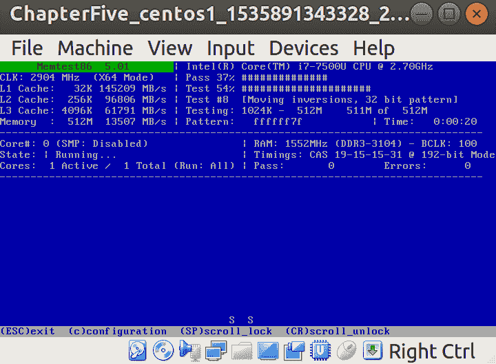
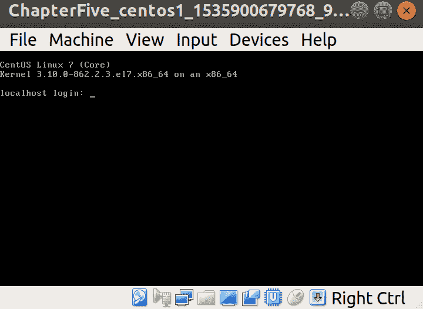
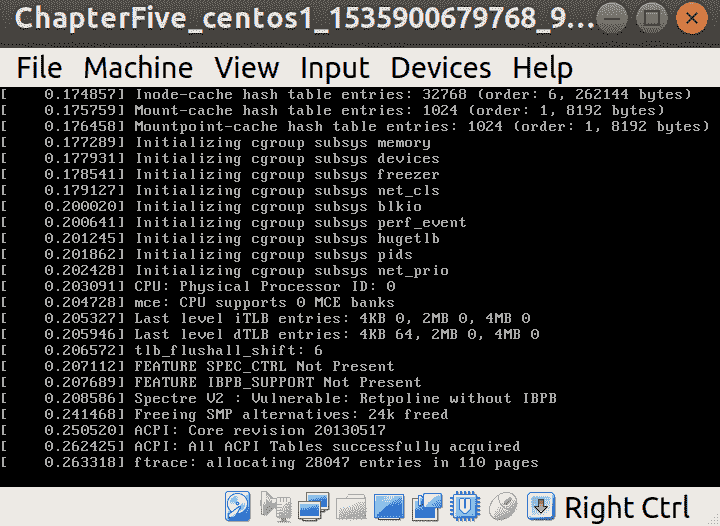
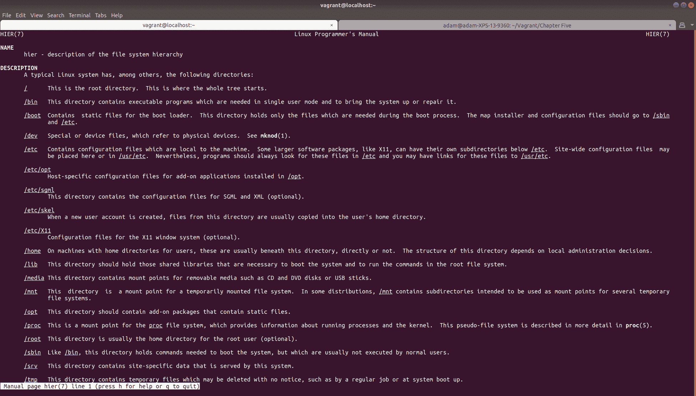
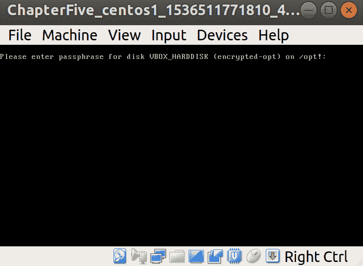

# 第五章：硬件和磁盘

本章将涵盖以下主题：

+   确定硬件

+   测试硬件

+   内核的作用

+   Linux 上的磁盘配置

+   文件系统层次结构

+   配置空白磁盘并挂载它

+   使用 LVM 重新配置磁盘

+   使用`systemd-mount`和`fstab`

+   磁盘加密和处理静态加密

+   当前的文件系统格式

+   即将推出的文件系统格式

# 介绍

您的硬件并不像您可能对它的关心那样对您关心。

硬件是善变的、喜怒无常的、不可预测的，磁盘，硬件家族中叛逆的青少年，将这一切推向了一个新的境界。

在您的职业生涯中，您会发现自己在某个时刻感到困惑，对看似无关的错误在系统不同部分的发生感到困惑。您的 SSH 守护程序可能会在传输的奇怪时刻随机死机，NTP 可能会漂移，您的数据库可能会锁死，而与此同时，您正在拼命寻找原因。

通常，硬件是这些随机问题的答案（当不是时间时，正如我们之前讨论的）。一根坏内存条可能会以奇怪而奇妙的方式失败，而偶尔只读的磁盘可能意味着零星和夜间干扰的事件，这些事件可能会诱使您用特别沉重的锤子来解决。

如果您不想在老板面前使用短语“用锤子敲一下”，则被接受的命名法是“冲击性维护”。

当硬件出现问题时，除了更换它之外别无选择。过去我们会自己焊接和修理组件的日子已经一去不复返，因为这不是一个可行的解决方案，也不具有成本效益。

在某个时候，您会发现自己蹲在数据中心的一台开放服务器前，对着一排`DIMM`和一个`RAID10`磁盘阵列，摸不着头脑，试图确定哪一个是有故障的，以便您可以将其更换并将旧的放入研磨机，以安心。

我们用 k 来拼写硬盘等存储磁盘，用 c 来拼写光盘类型的光盘。

在本章中，我们将探讨确定特定硬件的方法，以及一些用于查找坏内存的简单故障排除步骤。除此之外，我们还将介绍如何向系统添加新磁盘以及安装后如何配置它们。

# 技术要求

对于本章，我们将使用以下`Vagrantfile`，其中包含两个额外的磁盘：

```
# -*- mode: ruby -*-
# vi: set ft=ruby :

Vagrant.configure("2") do |config|

  config.vm.define "centos1" do |centos1|
    centos1.vm.box = "centos/7"
    centos1.vm.box_version = "1804.02"
    centos1.vm.provider "virtualbox" do |vbcustom|

      unless File.exist?('centos1.additional.vdi')
        vbcustom.customize ['createhd', '--filename', 'centos1.additional.vdi', '--size', 2 * 1024]
      end
      vbcustom.customize ['storageattach', :id, '--storagectl', 'IDE', '--port', 0, '--device', 1, '--type', 'hdd', '--medium', 'centos1.additional.vdi']

      unless File.exist?('centos1.additional2.vdi')
        vbcustom.customize ['createhd', '--filename', 'centos1.additional2.vdi', '--size', 2 * 1024]
      end
      vbcustom.customize ['storageattach', :id, '--storagectl', 'IDE', '--port', 1, '--device', 1, '--type', 'hdd', '--medium', 'centos1.additional2.vdi']

    end
  end

end
```

这里定义的额外磁盘将在您从 Vagrant 运行的本地目录中创建，确保您有足够的空间。

# 确定硬件

在第一章中，我们使用`dmidecode`和其他工具来确定我们是否在虚拟机中；在这里，我们将进一步尝试确定系统中可能运行的硬件，从磁盘 ID 到正在使用的图形卡类型。

# 准备工作

连接到您的 Vagrant VM 并安装一些我们将要使用的额外工具：

```
$ vagrant ssh
$ sudo yum install -y pciutils usbutils
```

# 如何做到...

我们将通过几种不同的方法来确定系统正在运行的硬件；即使您无法访问互联网，您也应该能够使用默认工具确定一些基本信息。

# lspci

我们从`pciutils`套件安装的工具`lspci`是列出您的集体 PCI 设备的好方法，而不会有太多额外的噪音。

如果我们只运行`lspci`，我们会得到一个设备列表及其 ID：

```
00:00.0 Host bridge: Intel Corporation 440FX - 82441FX PMC [Natoma] (rev 02)
00:01.0 ISA bridge: Intel Corporation 82371SB PIIX3 ISA [Natoma/Triton II]
00:01.1 IDE interface: Intel Corporation 82371AB/EB/MB PIIX4 IDE (rev 01)
00:02.0 VGA compatible controller: InnoTek Systemberatung GmbH VirtualBox Graphics Adapter
00:03.0 Ethernet controller: Intel Corporation 82540EM Gigabit Ethernet Controller (rev 02)
00:04.0 System peripheral: InnoTek Systemberatung GmbH VirtualBox Guest Service
00:05.0 Multimedia audio controller: Intel Corporation 82801AA AC'97 Audio Controller (rev 01)
00:07.0 Bridge: Intel Corporation 82371AB/EB/MB PIIX4 ACPI (rev 08)
```

在上面的列表中，我们可以看到系统中的设备。它们的数字 ID 实际上已经被翻译成了人类可读的格式。

如果您只想列出 ID，可以使用`-n`标志：

```
$ lspci -n
00:00.0 0600: 8086:1237 (rev 02)
00:01.0 0601: 8086:7000
00:01.1 0101: 8086:7111 (rev 01)
00:02.0 0300: 80ee:beef
00:03.0 0200: 8086:100e (rev 02)
00:04.0 0880: 80ee:cafe
00:05.0 0401: 8086:2415 (rev 01)
00:07.0 0680: 8086:7113 (rev 08)
```

或者如果您两者都想要，可以使用`-nn`：

```
$ lspci -nn
00:00.0 Host bridge [0600]: Intel Corporation 440FX - 82441FX PMC [Natoma] [8086:1237] (rev 02)
00:01.0 ISA bridge [0601]: Intel Corporation 82371SB PIIX3 ISA [Natoma/Triton II] [8086:7000]
00:01.1 IDE interface [0101]: Intel Corporation 82371AB/EB/MB PIIX4 IDE [8086:7111] (rev 01)
00:02.0 VGA compatible controller [0300]: InnoTek Systemberatung GmbH VirtualBox Graphics Adapter [80ee:beef]
00:03.0 Ethernet controller [0200]: Intel Corporation 82540EM Gigabit Ethernet Controller [8086:100e] (rev 02)
00:04.0 System peripheral [0880]: InnoTek Systemberatung GmbH VirtualBox Guest Service [80ee:cafe]
00:05.0 Multimedia audio controller [0401]: Intel Corporation 82801AA AC'97 Audio Controller [8086:2415] (rev 01)
00:07.0 Bridge [0680]: Intel Corporation 82371AB/EB/MB PIIX4 ACPI [8086:7113] (rev 08)
```

在这个列表中，我们可以看到一些友好的描述，以帮助我们——例如`以太网控制器`、`VGA 兼容控制器`和`IDE 接口`等。

乍一看，由于那些不断更新`PCI ID`存储库的人们的辛勤工作，您应该对每个设备的功能有一个很好的理解：[`pci-ids.ucw.cz/`](http://pci-ids.ucw.cz/)。

比起列出系统中的设备，我们还可以使用-k 列出处理设备的内核驱动程序。

在下面的片段中，我们可以看到以太网控制器由内核驱动程序`e1000`管理：

```
$ lspci -k
00:00.0 Host bridge: Intel Corporation 440FX - 82441FX PMC [Natoma] (rev 02)
00:01.0 ISA bridge: Intel Corporation 82371SB PIIX3 ISA [Natoma/Triton II]
00:01.1 IDE interface: Intel Corporation 82371AB/EB/MB PIIX4 IDE (rev 01)
 Kernel driver in use: ata_piix
 Kernel modules: ata_piix, pata_acpi, ata_generic
00:02.0 VGA compatible controller: InnoTek Systemberatung GmbH VirtualBox Graphics Adapter
00:03.0 Ethernet controller: Intel Corporation 82540EM Gigabit Ethernet Controller (rev 02)
 Subsystem: Intel Corporation PRO/1000 MT Desktop Adapter
 Kernel driver in use: e1000
 Kernel modules: e1000
00:04.0 System peripheral: InnoTek Systemberatung GmbH VirtualBox Guest Service
00:05.0 Multimedia audio controller: Intel Corporation 82801AA AC'97 Audio Controller (rev 01)
 Subsystem: Intel Corporation Device 0000
 Kernel driver in use: snd_intel8x0
 Kernel modules: snd_intel8x0
00:07.0 Bridge: Intel Corporation 82371AB/EB/MB PIIX4 ACPI (rev 08)
 Kernel driver in use: piix4_smbus
 Kernel modules: i2c_piix4
```

内核驱动程序的名称和实际硬件并不总是显而易见，这就是像 lspci 这样的工具如此方便的原因。

在现代机器上，您可能会看到多个 PCI 总线，设备连接到它；碰巧我们的虚拟机只利用一个总线来连接所有设备。

这意味着树视图非常扁平：

```
$ lspci -t
-[0000:00]-+-00.0
 +-01.0
 +-01.1
 +-02.0
 +-03.0
 +-04.0
 +-05.0
 \-07.0
```

然而，当我们对物理机器运行 lspci（在这种情况下是我的笔记本电脑）时，树视图可能会有更多的分支：

```
$ lspci -t
-[0000:00]-+-00.0
 +-02.0
 +-04.0
 +-14.0
 +-14.2
 +-15.0
 +-15.1
 +-16.0
 +-1c.0-[01-39]----00.0-[02-39]--+-00.0-[03]--
 |                               +-01.0-[04-38]--
 |                               \-02.0-[39]----00.0
 +-1c.4-[3a]----00.0
 +-1c.5-[3b]----00.0
 +-1d.0-[3c]----00.0
 +-1f.0
 +-1f.2
 +-1f.3
 \-1f.4
```

如果您看不到您知道存在的设备（比如显卡），可能有几种情况：也许设备在 BIOS 中被禁用，或者卡本身已经损坏。尝试一些基本的故障排除，比如检查 BIOS/UEFI 配置或将卡插入不同的插槽。

还有 lsusb 用于 USB 设备。如果您使用类似 USB 以太网设备的东西，这可能很方便。在下面的示例中，您可以看到我连接的盒子（树莓派）的网络端口位于 USB 总线上：

```
$ lsusb
Bus 001 Device 003: ID 0424:ec00 Standard Microsystems Corp. SMSC9512/9514 Fast Ethernet Adapter
```

# lshw

一个特别有用的程序 lshw 具有内置的能力，可以将您的硬件树输出为 JSON、XML、HTML，可能还有更多，因为它们正在开发中。

默认情况下，lshw 的输出非常冗长，但应该看起来像下面这样：

```
$ sudo lshw 
localhost.localdomain 
 description: Computer
 product: VirtualBox
 vendor: innotek GmbH
 version: 1.2
 serial: 0
 width: 64 bits
 capabilities: smbios-2.5 dmi-2.5 vsyscall32
<SNIP>
 *-pnp00:00
 product: PnP device PNP0303
 physical id: 3
 capabilities: pnp
 configuration: driver=i8042 kbd
 *-pnp00:01
 product: PnP device PNP0f03
 physical id: 4
 capabilities: pnp
 configuration: driver=i8042 aux

```

我倾向于发现一目了然的解决方案在很多时候更有效。因此，考虑到这一点，让我们来看看-short 选项的输出：

```
$ sudo lshw -short
H/W path            Device     Class       Description
======================================================
 system      VirtualBox
/0                             bus         VirtualBox
/0/0                           memory      128KiB BIOS
/0/1                           memory      512MiB System memory
/0/2                           processor   Intel(R) Core(TM) i7-7500U CPU @ 2.70GHz
/0/100                         bridge      440FX - 82441FX PMC [Natoma]
/0/100/1                       bridge      82371SB PIIX3 ISA [Natoma/Triton II]
/0/100/1.1          scsi0      storage     82371AB/EB/MB PIIX4 IDE
/0/100/1.1/0.0.0    /dev/sda   disk        42GB VBOX HARDDISK
/0/100/1.1/0.0.0/1  /dev/sda1  volume      1MiB Linux filesystem partition
/0/100/1.1/0.0.0/2             volume      1GiB Linux filesystem partition
/0/100/1.1/0.0.0/3  /dev/sda3  volume      38GiB Linux LVM Physical Volume partition
/0/100/1.1/0        /dev/sdb   disk        2147MB VBOX HARDDISK
/0/100/1.1/1        /dev/sdc   disk        2147MB VBOX HARDDISK
/0/100/2                       display     VirtualBox Graphics Adapter
/0/100/3            eth0       network     82540EM Gigabit Ethernet Controller
/0/100/4                       generic     VirtualBox Guest Service
/0/100/5                       multimedia  82801AA AC'97 Audio Controller
/0/100/7                       bridge      82371AB/EB/MB PIIX4 ACPI
/0/3                           input       PnP device PNP0303
/0/4                           input       PnP device PNP0f03
```

这样更容易阅读，一目了然，您可以看到系统有三个磁盘、一个网络设备和 512MiB 的系统内存。

正如我们在第一章*中看到的，介绍和环境设置*，您还可以使用-c 选择`class`输出，再次显示我们的网络设备：

```
$ sudo lshw -c network
 *-network 
 description: Ethernet interface
 product: 82540EM Gigabit Ethernet Controller
 vendor: Intel Corporation
 physical id: 3
 bus info: pci@0000:00:03.0
 logical name: eth0
 version: 02
 serial: 52:54:00:c9:c7:04
 size: 1Gbit/s
 capacity: 1Gbit/s
 width: 32 bits
 clock: 66MHz
 capabilities: pm pcix bus_master cap_list ethernet physical tp 10bt 10bt-fd 100bt 100bt-fd 1000bt-fd autonegotiation
 configuration: autonegotiation=on broadcast=yes driver=e1000 driverversion=7.3.21-k8-NAPI duplex=full ip=10.0.2.15 latency=64 link=yes mingnt=255 multicast=yes port=twisted pair speed=1Gbit/s
 resources: irq:19 memory:f0000000-f001ffff ioport:d010(size=8)
```

从这个输出中，我们可以看到很多相关信息，比如网络设备的容量（1Gbit/s），以及设备的功能。

我们甚至可以看到它的具体配置，这对您可能想要进行的潜在更改很有用。

如果要查看实际的数字 ID，可以在命令中添加-numeric：

```
$ sudo lshw -c network -numeric
  *-network                 
       description: Ethernet interface
       product: 82540EM Gigabit Ethernet Controller [8086:100E]
       vendor: Intel Corporation [8086]
       physical id: 3
       bus info: pci@0000:00:03.0
       logical name: eth0
       version: 02
       serial: 52:54:00:c9:c7:04
       size: 1Gbit/s
       capacity: 1Gbit/s
       width: 32 bits
       clock: 66MHz
       capabilities: pm pcix bus_master cap_list ethernet physical tp 10bt 10bt-fd 100bt 100bt-fd 1000bt-fd autonegotiation
       configuration: autonegotiation=on broadcast=yes driver=e1000 driverversion=7.3.21-k8-NAPI duplex=full ip=10.0.2.15 latency=64 link=yes mingnt=255 multicast=yes port=twisted pair speed=1Gbit/s
       resources: irq:19 memory:f0000000-f001ffff ioport:d010(size=8)
```

# /proc

/proc 是大多数 Linux 系统上找到的**进程信息伪文件系统**（但不适用于 BSD）。

它是可读的接口到内核数据结构，其中一些文件是可写的，允许对正在运行的内核进行即时更改。

此目录中的一些有用文件包括/proc/cpuinfo 等，当查询时，它会提供内核了解的有关 CPU 的所有信息：

```
$ cat /proc/cpuinfo 
processor    : 0
vendor_id    : GenuineIntel
cpu family    : 6
model        : 142
model name    : Intel(R) Core(TM) i7-7500U CPU @ 2.70GHz
stepping    : 9
cpu MHz        : 2904.000
cache size    : 4096 KB
physical id    : 0
siblings    : 1
core id        : 0
cpu cores    : 1
apicid        : 0
initial apicid    : 0
fpu        : yes
fpu_exception    : yes
cpuid level    : 22
wp        : yes
flags        : fpu vme de pse tsc msr pae mce cx8 apic sep mtrr pge mca cmov pat pse36 clflush mmx fxsr sse sse2 syscall nx rdtscp lm constant_tsc rep_good nopl xtopology nonstop_tsc pni pclmulqdq monitor ssse3 cx16 pcid sse4_1 sse4_2 x2apic movbe popcnt aes xsave avx rdrand hypervisor lahf_lm abm 3dnowprefetch fsgsbase avx2 invpcid rdseed clflushopt
bogomips    : 5808.00
clflush size    : 64
cache_alignment    : 64
address sizes    : 39 bits physical, 48 bits virtual
power management:
```

它还会给出处理器编号，这意味着如果您想快速计算系统中（正在使用的）处理器的数量，可以用简短的命令和一些管道列出它们。

在这里，我们正在转储文件，寻找单词`processor`，然后计算行数。这不是最可靠的系统，但在紧要关头很方便：

```
$ grep -c "processor" /proc/cpuinfo 
1
```

另一个要注意的有用文件是/proc/meminfo，它可以完全转储系统了解的有关内存的所有信息：

```
$ cat /proc/meminfo
MemTotal:         499428 kB
MemFree:           66164 kB
MemAvailable:     397320 kB
Buffers:            2140 kB
Cached:           324952 kB
SwapCached:            0 kB
Active:           222104 kB
Inactive:         142044 kB
Active(anon):      12764 kB
Inactive(anon):    28916 kB
Active(file):     209340 kB
Inactive(file):   113128 kB
Unevictable:           0 kB
Mlocked:               0 kB
SwapTotal:       1572860 kB
SwapFree:        1572860 kB
Dirty:                 0 kB
Writeback:             0 kB
AnonPages:         37100 kB
Mapped:            22844 kB
Shmem:              4624 kB
Slab:              44216 kB
SReclaimable:      21800 kB
SUnreclaim:        22416 kB
KernelStack:        1728 kB
PageTables:         4200 kB
NFS_Unstable:          0 kB
Bounce:                0 kB
WritebackTmp:          0 kB
CommitLimit:     1822572 kB
Committed_AS:     302040 kB
VmallocTotal:   34359738367 kB
VmallocUsed:        4744 kB
VmallocChunk:   34359730812 kB
HardwareCorrupted:     0 kB
AnonHugePages:         0 kB
CmaTotal:              0 kB
CmaFree:               0 kB
HugePages_Total:       0
HugePages_Free:        0
HugePages_Rsvd:        0
HugePages_Surp:        0
Hugepagesize:       2048 kB
DirectMap4k:       49088 kB
DirectMap2M:      475136 kB
```

/proc 文件系统非常庞大和广泛；如果您有空闲时间，请查看 proc 的手册页面——您不会立刻后悔（但以后可能会后悔）。

# /sys

/sys 或 sysfs 是用于导出内核对象的文件系统（根据其手册页面），这意味着它是用于访问内核信息的另一个文件系统（如/proc）。

在脚本中非常有用，可以列出发现的块设备等：

```
$ ls -l /sys/block
total 0
lrwxrwxrwx. 1 root root 0 Sep  2 12:29 dm-0 -> ../devices/virtual/block/dm-0
lrwxrwxrwx. 1 root root 0 Sep  2 12:29 dm-1 -> ../devices/virtual/block/dm-1
lrwxrwxrwx. 1 root root 0 Sep  2 12:29 sda -> ../devices/pci0000:00/0000:00:01.1/ata1/host0/target0:0:0/0:0:0:0/block/sda
lrwxrwxrwx. 1 root root 0 Sep  2 12:29 sdb -> ../devices/pci0000:00/0000:00:01.1/ata1/host0/target0:0:1/0:0:1:0/block/sdb
lrwxrwxrwx. 1 root root 0 Sep  2 12:29 sdc -> ../devices/pci0000:00/0000:00:01.1/ata2/host1/target1:0:1/1:0:1:0/block/sdc
```

如果您想要查找单个组件的设备 ID（例如，如果您没有 lshw 或 lspci 方便的话），这也可能很有用。

在下面的示例中，我列出了 eth0 设备的供应商和设备 ID：

```
$ cat /sys/class/net/eth0/device/vendor 
0x8086
$ cat /sys/class/net/eth0/device/device
0x100e
```

有了这些信息，我可以将详细信息与设备列表进行对比。我选择查看`PCI ID`存储库，在那里我了解到供应商 ID 属于英特尔公司，设备 ID 转换为 82540EM 千兆以太网控制器。

`/sys`在硬件领域之外还有很多内容，深入研究文件系统可能是个好主意。`sysfs`的手册页（`5`）是一个有争议的必备品。

# dmesg（和内核日志）

`dmesg`是一种根据其手册打印或控制内核环形缓冲区的方法，但对你和我来说，它是一个快速查看内核是否检测到硬件的好方法，因为它在初始化时被检测到。

运行`dmesg`将打印到`stdout`，所以将其导入`less`很方便：

```
$ dmesg | less
```

完成后，你应该能够搜索特定的字符串。继续我们的主题，我们将搜索`Intel`并查看加载了什么：

```
[    2.221242] e1000: Intel(R) PRO/1000 Network Driver - version 7.3.21-k8-NAPI
```

如果我们搜索`ATA`，我们还可以看到我们的磁盘被检测到：

```
[ 0.940242] ata2.01: ATA-6: VBOX HARDDISK, 1.0, max UDMA/133
[ 0.940248] ata2.01: 4194304 sectors, multi 128: LBA 
[ 0.940807] ata1.00: ATA-6: VBOX HARDDISK, 1.0, max UDMA/133
[ 0.940810] ata1.00: 83886080 sectors, multi 128: LBA 
[ 0.940815] ata1.01: ATA-6: VBOX HARDDISK, 1.0, max UDMA/133
[ 0.940817] ata1.01: 4194304 sectors, multi 128: LBA 
```

甚至还有一个`-T`选项，可以给你人类可读的时间戳，这可能特别有用，如下所示，与我们的 IDE（`PATA`）控制器相比：

```
[Sun Sep 2 12:29:08 2018] ata1: PATA max UDMA/33 cmd 0x1f0 ctl 0x3f6 bmdma 0xd000 irq 14
[Sun Sep 2 12:29:08 2018] ata2: PATA max UDMA/33 cmd 0x170 ctl 0x376 bmdma 0xd008 irq 15
```

# dmidecode

另一个喧闹但最喜欢的工具来自第一章，*介绍和环境设置*，`dmidecode`解码 DMI 表。

我们最初用它来检查虚拟硬件，但在非虚拟机上，它可能更有用。

比较以下`-t processor`转储：

```
$ sudo dmidecode -t processor
# dmidecode 3.0
Getting SMBIOS data from sysfs.
SMBIOS 2.5 present.
```

注意我们的虚拟机上的明显空旷，与我笔记本电脑上的示例相比：

```
$ sudo dmidecode -t processor
# dmidecode 3.1
Getting SMBIOS data from sysfs.
SMBIOS 3.0.0 present.

Handle 0x003F, DMI type 4, 48 bytes
Processor Information
    Socket Designation: U3E1
    Type: Central Processor
    Family: Core i7
    Manufacturer: Intel(R) Corporation
    ID: E9 06 08 00 FF FB EB BF
    Signature: Type 0, Family 6, Model 142, Stepping 9
    Flags:
<SNIP>
    Core Count: 2
    Core Enabled: 2
    Thread Count: 4
    Characteristics:
        64-bit capable
        Multi-Core
        Hardware Thread
        Execute Protection
        Enhanced Virtualization
        Power/Performance Control
```

这表明，在某些情况下，从物理机器中可能获得的信息比从虚拟机器中获得的信息更多。

反过来也可以这样说：如果有人竭尽全力地掩盖你的硬件信息，首先你应该怀疑自己是否在虚拟机上运行，然后你应该想知道他们为什么要如此努力地隐藏这个事实。

# /dev

如果非要我选择一个最喜欢的`伪文件系统`，我可能会成为一个奇怪的人，但如果你逼我选择，那可能会是`/dev`。

这不是因为对`dev`这个词的喜爱或者对它的过度使用的偏爱，而是因为我经常发现自己在其中。

与所有的`伪文件系统`一样，它们都是瞬态和临时的（`tmpfs`）。不要像我曾经看到的一位同事那样，在其中存储东西，因为一旦重新启动你的机器：噗，你的文件就没了。

在表面上，`/dev`看起来很混乱：

```
$ ls /dev/
autofs           hugepages           port    shm       tty18  tty33  tty49  tty7     vcs6
block            hwrng               ppp     snapshot  tty19  tty34  tty5   tty8     vcsa
bsg              initctl             ptmx    snd       tty2   tty35  tty50  tty9     vcsa1
btrfs-control    input               pts     stderr    tty20  tty36  tty51  ttyS0    vcsa2
char             kmsg                random  stdin     tty21  tty37  tty52  ttyS1    vcsa3
console          log                 raw     stdout    tty22  tty38  tty53  ttyS2    vcsa4
core             loop-control        rtc     tty       tty23  tty39  tty54  ttyS3    vcsa5
cpu              mapper              rtc0    tty0      tty24  tty4   tty55  uhid     vcsa6
cpu_dma_latency  mcelog              sda     tty1      tty25  tty40  tty56  uinput   vfio
crash            mem                 sda1    tty10     tty26  tty41  tty57  urandom  vga_arbiter
disk             mqueue              sda2    tty11     tty27  tty42  tty58  usbmon0  vhci
dm-0             net                 sda3    tty12     tty28  tty43  tty59  vcs      vhost-net
dm-1             network_latency     sdb     tty13     tty29  tty44  tty6   vcs1     VolGroup00
fd               network_throughput  sdc     tty14     tty3   tty45  tty60  vcs2     zero
full             null                sg0     tty15     tty30  tty46  tty61  vcs3
fuse             nvram               sg1     tty16     tty31  tty47  tty62  vcs4
hpet             oldmem              sg2     tty17     tty32  tty48  tty63  vcs5
```

然而，当你知道这些知识时，你会发现它是无价的。

让我们`ls`一下`/dev/disk/`目录：

```
$ ls /dev/disk/
by-id  by-path  by-uuid
```

有趣的选项——我喜欢那些！

选择`by-id`选项会显示所有我们的磁盘设备，`by-id`：

```
$ ls /dev/disk/by-id/
ata-VBOX_HARDDISK_VB4eceb5be-efcdfb56
ata-VBOX_HARDDISK_VB804908ad-25f1585c
ata-VBOX_HARDDISK_VBcf466104-c1479f0d
ata-VBOX_HARDDISK_VBcf466104-c1479f0d-part1
ata-VBOX_HARDDISK_VBcf466104-c1479f0d-part2
ata-VBOX_HARDDISK_VBcf466104-c1479f0d-part3
dm-name-VolGroup00-LogVol00
dm-name-VolGroup00-LogVol01
dm-uuid-LVM-SA8LTUF2yzFEV1RdgThw0ZiRxhyHFKuUIAjIC6ScnMtvH67BTyTN31hd82bgDSzd
dm-uuid-LVM-SA8LTUF2yzFEV1RdgThw0ZiRxhyHFKuUj6b8IVKEw37bTwOqy81Ud3juFCSJBg12
lvm-pv-uuid-vrrtbx-g480-HcJI-5wLn-4aOf-Olld-rC03AY
$ ls /dev/disk/by-path/
pci-0000:00:01.1-ata-1.0        pci-0000:00:01.1-ata-1.0-part2  pci-0000:00:01.1-ata-1.1
pci-0000:00:01.1-ata-1.0-part1  pci-0000:00:01.1-ata-1.0-part3  pci-0000:00:01.1-ata-2.1
```

以下是我绝对最喜欢的`by-uuid`：

```
$ ls /dev/disk/by-uuid/
570897ca-e759-4c81-90cf-389da6eee4cc  c39c5bed-f37c-4263-bee8-aeb6a6659d7b
b60e9498-0baa-4d9f-90aa-069048217fee
```

我喜欢这些的主要原因是因为这些条目实际上是指向以它们命名的设备的符号链接：

```
$ ls -l /dev/disk/by-uuid/
total 0
lrwxrwxrwx. 1 root root 10 Sep  2 12:29 570897ca-e759-4c81-90cf-389da6eee4cc -> ../../sda2
lrwxrwxrwx. 1 root root 10 Sep  2 12:29 b60e9498-0baa-4d9f-90aa-069048217fee -> ../../dm-0
lrwxrwxrwx. 1 root root 10 Sep  2 12:29 c39c5bed-f37c-4263-bee8-aeb6a6659d7b -> ../../dm-1
```

因此，我现在知道我的`sda2`分区具有`570897ca-e759-4c81-90cf-389da6eee4cc`的 UUID，可以用于各种任务。

UUID 最明显的用途是在大多数系统的`fstab`文件中：

```
$ cat /etc/fstab 

#
# /etc/fstab
# Created by anaconda on Sat May 12 18:50:26 2018
#
# Accessible filesystems, by reference, are maintained under '/dev/disk'
# See man pages fstab(5), findfs(8), mount(8) and/or blkid(8) for more info
#
/dev/mapper/VolGroup00-LogVol00 /                       xfs     defaults        0 0
UUID=570897ca-e759-4c81-90cf-389da6eee4cc /boot                   xfs     defaults        0 0
/dev/mapper/VolGroup00-LogVol01 swap                    swap    defaults        0 0
```

因此，将这两个信息配对起来，我们现在有了我们`fstab` UUID 条目的实际设备标识（`sda2`）！

使用 UUID 的原因是因为设备标识可能会发生变化，历史上更是如此。在一次启动中，你的`/boot`文件系统可能被标识为`sda2`，然后在另一次启动中可能首先找到不同的设备，突然之间`/boot`就变成了`sdb2`，破坏了`fstab`。

# 它是如何工作的...

我们在这里主要做的是检查内核对连接到系统的设备的了解。

PCI 设备以及 USB 设备在所有操作系统中都具有相同的标识（在 Windows、Mac 和 BSD 上都会看到相同的十六进制值）。这使得内核可以选择并加载适当的代码，以与相同的设备进行交互。

很少见，但可能会发生一个模块取代旧模块或两个驱动程序都可以与相同的硬件一起使用；在这种情况下，了解您的硬件设备 ID 以及针对它们运行的内核代码的位是很有用的。

如果您在桌面上使用 Linux，并且使用 Nvidia 或 AMD GPU，那么您与驱动程序和内核加载进行交互的可能性很高，因为有闭源和开源版本可供选择。

# 测试硬件

在本节中，我们将讨论通过查看 SMART 和磁盘测试软件以及物理故障排除 RAM 问题的方法来测试潜在故障的硬件。

处理磁盘可能会非常危险，您应该始终确保在开始可能对数据有危险的任何操作之前备份数据。

# 准备工作

在这里，我们主要将使用我们创建的 Vagrant box，但您可能还想查看来自[`www.memtest.org/`](http://www.memtest.org/)的 Memtest86+，我提到这个是用于内存测试的。

连接到您的 VM 并安装`smartmontools`：

```
$ vagrant ssh
$ sudo yum install -y smartmontools hdparm
```

您可能还想下载最新的 Memtest86+ ISO。

# 如何做…

我们将从磁盘健康开始。

# 自我监控、分析和报告技术（SMART）

首先，确保`smartd`正在运行在您想要查询的系统上是个好主意：

```
$ sudo systemctl enable smartd
```

`smartd`是 SMART 的监控守护程序；守护程序在启动时尝试在兼容的`ATA`设备上启用监控，并默认每 30 分钟轮询`ATA`设备。

默认情况下，`smartd`作为其定期工作的一部分检测到的错误使用`SYSLOG`接口进行记录。如果配置为这样做，它还可以通过电子邮件发送给管理员。

启用后，可以使用`smartctl`工具查询磁盘：

```
$ sudo smartctl -a /dev/sda
```

注意使用`sudo`和标记磁盘设备。

很遗憾，因为我们在 VirtualBox VM 中，这不会给我们带来任何有用的东西：

```
smartctl 6.5 2016-05-07 r4318 [x86_64-linux-3.10.0-862.2.3.el7.x86_64] (local build)
Copyright (C) 2002-16, Bruce Allen, Christian Franke, www.smartmontools.org

=== START OF INFORMATION SECTION ===
Device Model: VBOX HARDDISK
Serial Number: VBcf466104-c1479f0d
Firmware Version: 1.0
User Capacity: 42,949,672,960 bytes [42.9 GB]
Sector Size: 512 bytes logical/physical
Device is: Not in smartctl database [for details use: -P showall]
ATA Version is: ATA/ATAPI-6 published, ANSI INCITS 361-2002
Local Time is: Sun Sep 2 14:18:30 2018 UTC
SMART support is: Unavailable - device lacks SMART capability.

A mandatory SMART command failed: exiting. To continue, add one or more '-T permissive' options.
```

但是，如果您在物理机上尝试这样做，结果会有所不同，并且可以获得更多信息。

# hdparm

可能您的磁盘向您的 SMART 命令报告良好，但您仍然看到某种形式的减速或其他问题。

您可以使用`hdparm`工具（默认存储库中提供）对磁盘的读取速度进行基准测试。

我们可以使用以下方法测试磁盘的速度：

```
$ sudo hdparm -tT /dev/sda
```

`hdparm`的手册页面建议进行这些测试两到三次以获得平均结果，并在其他情况下的非活动系统上运行它们。

您的情况可能有所不同，但我的系统的结果如下：

```
/dev/sda:
 Timing cached reads:   13158 MB in  1.99 seconds = 6597.20 MB/sec
 Timing buffered disk reads: 2714 MB in  3.00 seconds = 903.83 MB/sec
```

部分原因是我们在做的实际上是从内核的页面缓存中读取。我们可以使用`--direct`选项来绕过这一点，该选项直接从驱动器中读取到`hdparm`的缓冲区中：

```
$ sudo hdparm -tT --direct /dev/sda
```

这些结果更多地是原始磁盘读取性能：

```
/dev/sda:
 Timing O_DIRECT cached reads:   2416 MB in  2.00 seconds = 1208.08 MB/sec
 Timing O_DIRECT disk reads: 3648 MB in  3.00 seconds = 1215.78 MB/sec
```

# 内存测试

内存测试起来要容易一些，尽管检查每个 DIMM 的最彻底方法是将箱子脱机几个小时，同时运行 Memtest86+。

也存在诸如**memtester**之类的程序，可以在运行中的系统上执行。这些类型的测试的问题在于它们不会测试系统已使用的内存，并且可能会与**内存不足**（**OOM**）杀手等进程发生冲突。

如果您从 Memtest86+网站获得 ISO 映像，可以将其附加到 VM 并启动该程序（完全独立于 CentOS）。

结果看起来会像这样：



任何错误都将显示在屏幕的下半部分，您将知道您的内存有问题。

在我每晚在数据中心使用 Memtest86+时，我会让 Memtest86+对我正在测试的内存进行五次测试。

如果您发现您的系统根本无法启动，但怀疑是内存问题，那么以二进制方式进行测试可能是个好主意。我的意思是，如果您的服务器有 128 根内存条（这并不罕见），您应该移除 64 根并测试剩下的一批。如果您的服务器启动了，那么您就知道有问题的内存条在您移除的 64 根中的某一根。如果您的服务器无法启动，那么有问题的内存条就在您留在内部的一批内存条中。

重复这种技术，每次检查的内存减半，直到您只剩下两个 DIMM，其中一个您知道是有问题的，然后依次测试每个内存条。

以前的测试可能听起来很明显，但在凌晨两点，当您无法清晰地思考时，阅读这些文字可能会挽救您的理智。

# 它是如何工作的...

SMART 通过查询您选择的`/dev/`设备来读取信息，并显示它对兼容 SMART 设备所学到的内容。

当我们使用`hdparm`时，实际上是在运行测试，而不管我们的文件系统，因为该程序直接从磁盘读取数据——因此，实际速度可能会有所不同。

# 还有更多...

我没有在本节中包括测试显卡等内容，因为通常很容易判断显卡是否出问题（图形故障、随机出现的线条和偶尔的蜂鸣声）。

我也没有提到物理 RAID 卡，因为种类繁多，不可能为所有 RAID 卡列出一个连贯的测试方法。对于物理 RAID 卡，我能给出的最好建议就是查看制造商关于测试的详细信息。

我们没有涵盖磁盘的写入测试，部分原因是通常很容易通过读取测试来判断磁盘问题，另一部分原因是如果错误进行写入测试，很多测试方法可能会具有破坏性。

# 内核的作用

我们将观察内核在启动过程中的运行情况，以及在我们到达操作系统时加载了哪些模块。

# 做好准备

在本节中，请确保您的 VM 正在运行，因为我们将讨论硬件初始化：

```
$ vagrant ssh
```

连接到您的 VM。如果您刚刚完成上一节，您可能希望销毁并重新创建您的 VM，以确保获得原始体验。

# 如何做到的...

首先，我们要观察我们的系统启动。

首先，在我们的引导配置中禁用`quiet`选项，这样我们就可以在 VM 显示器上实际看到信息：

```
$ sudo sed -i 's/ quiet//g' /etc/sysconfig/grub
```

现在，我们需要生成一个新的`grub`配置文件，因为我们已经做出了更改：

```
$ sudo grub2-mkconfig | sudo tee /boot/grub2/grub.cfg
```

上面的代码是一个很好的例子，如果有人要求您进行`grub`配置更改，这是一个令人惊讶地常见的操作。

现在，打开 VirtualBox 主窗口，双击您的 VM，这样您就可以看到黑色控制台：



打开您的终端连接，这样您就可以同时看到并使用`reboot`命令重新启动您的 VM：

```
$ sudo reboot
```

保持眼睛盯着 VirtualBox 窗口；您应该会看到类似以下截图的内容：



您有注意到滚动信息吗？它可能飞得太快了，以至于您无法阅读，但这是您的系统在初始化自身。

您现在可以关闭 VirtualBox 窗口，并在终端中继续操作。

如果您有兴趣回顾刚才看到的内容，您可能会记得我们之前使用过的`dmesg`命令；您刚刚看到的所有内容都可以查看。

现在，我们需要在运行的系统中查看内核加载了哪些模块来处理我们的硬件：

```
$ lsmod
Module                  Size  Used by
sunrpc                353310  1 
intel_powerclamp       14419  0 
iosf_mbi               14990  0 
crc32_pclmul           13133  0 
ghash_clmulni_intel    13273  0 
snd_intel8x0           38199  0 
ppdev                  17671  0 
snd_ac97_codec        130556  1 snd_intel8x0
ac97_bus               12730  1 snd_ac97_codec
aesni_intel           189415  0 
snd_pcm               101643  2 snd_ac97_codec,snd_intel8x0
snd_timer              29810  1 snd_pcm
lrw                    13286  1 aesni_intel
pcspkr                 12718  0 
sg                     40721  0 
gf128mul               15139  1 lrw
e1000                 137574  0 
glue_helper            13990  1 aesni_intel
ablk_helper            13597  1 aesni_intel
snd                    79215  4 snd_ac97_codec,snd_intel8x0,snd_timer,snd_pcm
cryptd                 20511  3 ghash_clmulni_intel,aesni_intel,ablk_helper
i2c_piix4              22401  0 
soundcore              15047  1 snd
i2c_core               63151  1 i2c_piix4
parport_pc             28205  0 
parport                46395  2 ppdev,parport_pc
video                  24538  0 
ip_tables              27126  0 
xfs                  1003971  2 
libcrc32c              12644  1 xfs
sd_mod                 46322  3 
crc_t10dif             12912  1 sd_mod
crct10dif_generic      12647  0 
ata_generic            12923  0 
pata_acpi              13053  0 
ata_piix               35052  2 
libata                242992  3 pata_acpi,ata_generic,ata_piix
crct10dif_pclmul       14307  1 
crct10dif_common       12595  3 crct10dif_pclmul,crct10dif_generic,crc_t10dif
crc32c_intel           22094  1 
serio_raw              13434  0 
dm_mirror              22289  0 
dm_region_hash         20813  1 dm_mirror
dm_log                 18411  2 dm_region_hash,dm_mirror
dm_mod                123941  8 dm_log,dm_mirror
```

这是很多模块！

正如我之前提到的，其中一些模块是显而易见的，还有更多的则不是。

在列表中，一个很明显的是`e1000`，因为我们已经知道这是我们在前面一节中讨论过的网络模块。

我们可以使用`modinfo`获取有关模块的具体信息：

```
$ modinfo e1000
filename:       /lib/modules/3.10.0-862.2.3.el7.x86_64/kernel/drivers/net/ethernet/intel/e1000/e1000.ko.xz
version:        7.3.21-k8-NAPI
license:        GPL
description:    Intel(R) PRO/1000 Network Driver
author:         Intel Corporation, <linux.nics@intel.com>
retpoline:      Y
rhelversion:    7.5
srcversion:     04454A212DD89712602561D
alias:          pci:v00008086d00002E6Esv*sd*bc*sc*i*
alias:          pci:v00008086d000010B5sv*sd*bc*sc*i*
alias:          pci:v00008086d00001099sv*sd*bc*sc*i*
<SNIP>
alias:          pci:v00008086d00001000sv*sd*bc*sc*i*
depends: 
intree:         Y
vermagic:       3.10.0-862.2.3.el7.x86_64 SMP mod_unload modversions 
signer:         CentOS Linux kernel signing key
sig_key:        66:6E:F0:31:93:3F:51:27:06:23:72:83:2C:E9:BA:8A:49:00:5C:8F
sig_hashalgo:   sha256
parm:           TxDescriptors:Number of transmit descriptors (array of int)
parm:           RxDescriptors:Number of receive descriptors (array of int)
parm:           Speed:Speed setting (array of int)
parm:           Duplex:Duplex setting (array of int)
parm:           AutoNeg:Advertised auto-negotiation setting (array of int)
parm:           FlowControl:Flow Control setting (array of int)
parm:           XsumRX:Disable or enable Receive Checksum offload (array of int)
parm:           TxIntDelay:Transmit Interrupt Delay (array of int)
parm:           TxAbsIntDelay:Transmit Absolute Interrupt Delay (array of int)
parm:           RxIntDelay:Receive Interrupt Delay (array of int)
parm:           RxAbsIntDelay:Receive Absolute Interrupt Delay (array of int)
parm:           InterruptThrottleRate:Interrupt Throttling Rate (array of int)
parm:           SmartPowerDownEnable:Enable PHY smart power down (array of int)
parm:           copybreak:Maximum size of packet that is copied to a new buffer on receive (uint)
parm:           debug:Debug level (0=none,...,16=all) (int)
```

上面的代码不仅给出了模块的版本和许可证，还给出了作者和他们的联系信息（通常是 bug 报告）。

如果你试图移除一个正在使用的模块，你将不被允许，就像下面的`modprobe`示例中所示的那样：

```
$ sudo modprobe -r libata
modprobe: FATAL: Module libata is in use.
```

同样，如果你想加载一个新的模块（也许是因为你想测试它），你可以再次使用`modprobe`：

```
$ sudo modprobe nf_tables
```

然后我们可以看到我们加载的模块：

```
$ lsmod | grep nf_
nf_tables              74179  0 
nfnetlink              14490  1 nf_tables
```

在启动时加载模块是另一回事，因为如果没有内置到内核中（并且内核选项通常是通用的，以便供应商可以尽可能涵盖多种情况而不会引起问题），它需要一个配置文件。

为了确保`nf_tables`与我们的内核一起启动，请运行以下命令：

```
$ echo "nf_tables" | sudo tee /etc/modules-load.d/nftables.conf
```

重新启动并使用`lsmod`来查看你的模块是否已加载。

# 它是如何工作的...

当系统启动时，会按顺序发生几件事情，这些事情会略有不同（比如你使用的引导加载程序是哪个，尽管现在大多数情况下都是 Grub）。

其中一件事是内核会自行提取并加载，然后将控制权交给`init`系统（`systemd`）。

当内核加载时，它还会检测系统中的硬件，并将适当的模块添加到其运行状态，以便可以正确地与硬件进行交互和管理。

当我们使用`lsmod`列出模块时，实际上只是以更易读的格式打印`/proc/modules`。

# 还有更多...

你可以动态加载和卸载模块，也可以手动将某些模块列入黑名单，以防止加载。

如果你有一个特定的硬件故障，和/或导致内核崩溃（内核完全停止运行并崩溃），这可能会有所帮助。

要列入黑名单一个模块，只需将其添加到`/etc/modprobe.d/`中的黑名单中：

```
$ echo "blacklist e1000" | sudo tee -a /etc/modprobe.d/blacklist.conf
```

在上一个示例中，我将`e1000`列入黑名单。显然，这会给我带来问题，因为这意味着我的网络卡在启动时将没有适当的驱动程序，但这样可以使系统更安全！

# Linux 上的磁盘配置

在本节中，我们将查看我们的虚拟机中磁盘的开箱即用配置，并讨论`vda`、`sda`、`hda`和`nvme`之间的区别。我们还将调查磁盘、虚拟磁盘、分区和文件系统之间的区别。

# 准备工作

在这里，我们将使用我们在本章开头创建的 Vagrant box。

确保你的`centos1`虚拟机已经启动并连接到它：

```
$ vagrant ssh centos1
```

检查你的虚拟机是否安装了本节所需的适当软件包。

```
$ sudo yum install lvm2 -y
```

# 如何做...

我们将首先查看系统中的物理磁盘，并弄清它们与我们可以通过`df`命令看到的内容之间的关系。

# 使用 lsblk 列出磁盘

作为基本系统的一部分，应该安装一个名为`lsblk`的程序。

运行此程序会为您提供一个人类可读的树状视图，显示我们系统的块设备、它们的逻辑分离和它们的挂载点：

```
$ lsblk
NAME              MAJ:MIN RM  SIZE RO TYPE MOUNTPOINT
sda                 8:0    0   40G  0 disk 
├─sda1              8:1    0    1M  0 part 
├─sda2              8:2    0    1G  0 part /boot
└─sda3              8:3    0   39G  0 part 
 ├─VolGroup00-LogVol00
 253:0    0 37.5G  0 lvm  /
 └─VolGroup00-LogVol01
 253:1    0  1.5G  0 lvm  [SWAP]
sdb                 8:16   0    2G  0 disk 
sdc                 8:32   0    2G  0 disk 
```

块设备基本上是在存储介质之上的一层抽象；字符（原始）设备允许直接访问存储介质，但可能会施加一些抽象掉的限制，而使用块设备可以解除这些限制。

在上一个示例中，我们有我们的物理磁盘：

+   `sda`

+   `sdb`

+   `sdc`

然后我们有我们的分区：

+   `sda1`

+   `sda2`

+   `sda3`

我们有我们的卷组：

+   `VolGroup00`

我们在我们的单一卷组上有逻辑卷：

+   `LogVol00`

+   `LogVol01`

最后，我们有我们的挂载点：

+   `/boot`

+   `/`

+   `[SWAP]`

# 使用 df 列出挂载点

现在我们知道了系统的大致磁盘布局，我们可能也想知道所有其他的挂载点。这可以很容易地通过一个名为`df`的程序来实现：

```
$ df 
Filesystem 1K-blocks Used Available Use% Mounted on
/dev/mapper/VolGroup00-LogVol00 39269648 849960 38419688 3% /
devtmpfs 239968 0 239968 0% /dev
tmpfs 249712 0 249712 0% /dev/shm
tmpfs 249712 4572 245140 2% /run
tmpfs 249712 0 249712 0% /sys/fs/cgroup
/dev/sda2 1038336 64076 974260 7% /boot
tmpfs 49944 0 49944 0% /run/user/1000
```

为了更好地阅读输出，我们可以使用`-h`：

```
$ df -h
Filesystem                       Size  Used Avail Use% Mounted on
/dev/mapper/VolGroup00-LogVol00   38G  831M   37G   3% /
devtmpfs                         235M     0  235M   0% /dev
tmpfs                            244M     0  244M   0% /dev/shm
tmpfs                            244M  4.5M  240M   2% /run
tmpfs                            244M     0  244M   0% /sys/fs/cgroup
/dev/sda2                       1014M   63M  952M   7% /boot
tmpfs                             49M     0   49M   0% /run/user/1000
```

在这里，我们可以看到我们已经从上一节知道的挂载点，即`/`和`/boot`。

我们还可以看到其他挂载点，特别是那些标记有`devtmpfs`和`tmpfs`文件系统的挂载点。

这些挂载点被挂载在 RAM 磁盘上——这个概念已经存在多年了，但我们仍在使用，因为 RAM 速度非常快（目前比 SSD 快得多）。

临时目录是那些包含我们不在乎在重启后保留的文件的目录（大部分情况下）。

大多数情况下，您每天关心的挂载点是那些包含非瞬态文件的挂载点。

# 使用 df 列出文件系统

除了知道哪个磁盘挂载在哪里，您可能还想知道在空间块上使用的是哪个文件系统；这可以通过`-T`标志来完成：

```
$ df -T
Filesystem                      Type     1K-blocks   Used Available Use% Mounted on
/dev/mapper/VolGroup00-LogVol00 xfs       39269648 849924  38419724   3% /
devtmpfs                        devtmpfs    239968      0    239968   0% /dev
tmpfs                           tmpfs       249712      0    249712   0% /dev/shm
tmpfs                           tmpfs       249712   4572    245140   2% /run
tmpfs                           tmpfs       249712      0    249712   0% /sys/fs/cgroup
/dev/sda2                       xfs        1038336  64076    974260   7% /boot
tmpfs                           tmpfs        49944      0     49944   0% /run/user/1000
```

在这里，我们可以轻松地看到我们的根目录（`/`）和引导目录被格式化为 XFS。

目前，CentOS 和 Red Hat 更喜欢使用 XFS，但不少系统使用`ext4`、`ext3`、`ext2`、`btrfs`和`zfs`也并不少见。在功能上有区别，但在日常活动中，它们都能处理写入和读取文件，这是重要的部分。

# 列出逻辑卷管理器磁盘、卷组和逻辑卷

如果您正在使用 LVM（默认情况下我们正在使用，许多系统也是如此），您可能想知道由 LVM 处理的磁盘的布局。

# 物理磁盘

首先，我们需要知道 LVM 知道的物理卷是哪些；这可以通过`pvs`或`pvdisplay`来完成：

```
$ sudo pvs
 PV VG Fmt Attr PSize PFree
 /dev/sda3 VolGroup00 lvm2 a-- <38.97g 0 $ sudo pvdisplay
 --- Physical volume ---
 PV Name /dev/sda3
 VG Name VolGroup00
 PV Size <39.00 GiB / not usable 30.00 MiB
 Allocatable yes (but full)
 PE Size 32.00 MiB
 Total PE 1247
 Free PE 0
 Allocated PE 1247
 PV UUID vrrtbx-g480-HcJI-5wLn-4aOf-Olld-rC03AY
```

请注意`sudo pvs`是更传统的`unix-y`输出，而第二个更适合人类解析。

在这里，我们可以看到 LVM 知道的唯一物理设备是`sda`设备上的`sda3`分区。

在 LVM 领域，物理卷可以是整个设备（`sda`）或该设备上的分区（`sda3`）。通常，使用哪种取决于系统管理员的个人偏好，因为这两种方法都有利弊。就我个人而言，我更喜欢将整个设备交给 LVM，并让它完成所有工作，消除了一层抽象，但我知道有人发誓在 LVM 甚至发言之前将磁盘划分为分区。

# 卷组

您可以将多个物理卷组合在一起形成一个卷组；稍后，这将为逻辑卷的灵活性提供便利。

使用`pvs`和`pvdisplay`时，您将得到一个打印输出，告诉您磁盘所属的卷组，但如果您只想列出卷组信息，可以使用`vgs`和`vgdisplay`：

```
$ sudo vgs
 VG         #PV #LV #SN Attr   VSize   VFree
 VolGroup00   1   2   0 wz--n- <38.97g    0 $ sudo vgdisplay
 --- Volume group ---
 VG Name               VolGroup00
 System ID 
 Format                lvm2
 Metadata Areas        1
 Metadata Sequence No  3
 VG Access             read/write
 VG Status             resizable
 MAX LV                0
 Cur LV                2
 Open LV               2
 Max PV                0
 Cur PV                1
 Act PV                1
 VG Size               <38.97 GiB
 PE Size               32.00 MiB
 Total PE              1247
 Alloc PE / Size       1247 / <38.97 GiB
 Free  PE / Size       0 / 0 
 VG UUID               SA8LTU-F2yz-FEV1-RdgT-hw0Z-iRxh-yHFKuU
```

在这里，我们可以看到有两个逻辑卷位于这个卷组之上。

# 逻辑卷

最后，在 LVM 堆栈中，我们有逻辑卷。这些是文件系统应用的逻辑设备，然后可以挂载到系统上的某个点。

您是否已经弄清楚了命令命名背后的逻辑？

对于这一部分，我们将使用`lvs`和`lvdisplay`：

```
$ sudo lvs
 LV       VG         Attr       LSize   Pool Origin Data%  Meta%  Move Log Cpy%Sync Convert
 LogVol00 VolGroup00 -wi-ao---- <37.47g 
 LogVol01 VolGroup00 -wi-ao----   1.50g 
$ sudo lvdisplay
 --- Logical volume ---
 LV Path                /dev/VolGroup00/LogVol00
 LV Name                LogVol00
 VG Name                VolGroup00
 LV UUID                j6b8IV-KEw3-7bTw-Oqy8-1Ud3-juFC-SJBg12
 LV Write Access        read/write
 LV Creation host, time localhost.localdomain, 2018-05-12 18:50:24 +0000
 LV Status              available
 # open                 1
 LV Size                <37.47 GiB
 Current LE             1199
 Segments               1
 Allocation             inherit
 Read ahead sectors     auto
 - currently set to     8192
 Block device           253:0

 --- Logical volume ---
 LV Path                /dev/VolGroup00/LogVol01
 LV Name                LogVol01
 VG Name                VolGroup00
 LV UUID                IAjIC6-ScnM-tvH6-7BTy-TN31-hd82-bgDSzd
 LV Write Access        read/write
 LV Creation host, time localhost.localdomain, 2018-05-12 18:50:25 +0000
 LV Status              available
 # open                 2
 LV Size                1.50 GiB
 Current LE             48
 Segments               1
 Allocation             inherit
 Read ahead sectors     auto
 - currently set to     8192
 Block device           253:1
```

有两个逻辑卷！

我们知道其中一个位于我们的根目录下，而且由于之前的`lsblk`，我们知道第二个提供了我们的交换空间。

# 列出交换

交换是特殊的，更像是扩展的、缓慢的、有些烦人的内存，而不是磁盘空间。

当您的系统 RAM 已满，并且内核开始将不经常访问的内存转移到磁盘上时，交换被使用，可以以更慢的速度读取回来。

是时候再次进行一场圣战了吗？我认为是的！一些系统管理员信奉交换，并始终确保他们的系统至少有几兆字节的交换空间，即使他们有 256GB 的 RAM；其他系统管理员说，如果您使用了那么多 RAM 并且仍在交换，您需要更多的 RAM。如果您不是做出是否甚至有交换的决定的人，请微笑并点头，这不值得。

我们可以使用`swapon`列出系统正在使用的交换，如下所示：

```
$ swapon --show
NAME      TYPE      SIZE USED PRIO
/dev/dm-1 partition 1.5G   0B   -1
```

在这里，我们可以看到我们的一个交换设备是`/dev/dm-1`，但我们认为它是一个 LVM 设备？这肯定不对。

但是它可以！

逻辑卷实际上是映射的；`dm-1`是我们逻辑卷的低级表示。在我们的逻辑卷设备上运行`ls -l`可以证明以下事实：

```
$ ls -l /dev/mapper/VolGroup00-LogVol01 
lrwxrwxrwx. 1 root root 7 Sep  9 09:13 /dev/mapper/VolGroup00-LogVol01 -> ../dm-1
```

我们的设备实际上是链接和映射到`dm-1`，这就是为什么它在我们的`swapon`命令中列出的方式。

# 它是如何工作的...

物理上，你有一个磁盘。

这个磁盘可以是硬盘驱动器（老式的旋转式碟片类型）或某种固态硬盘，比如 M.2 连接器上的`NVMe`或通用的 SATA。

无论磁盘的类型如何，你都想要用它来存储。

要在磁盘上存储数据，它需要一些东西。首先，它需要被操作系统读取；这一部分由内核处理。如果内核确定磁盘是 IDE 驱动器（不常见），它可能会显示为`hda`设备。

如果磁盘是 SATA 或 SCSI，它可能显示为一个`sda`设备。如果它是一个 virtio 虚拟磁盘，并且在虚拟机中显示为这样，它将被列为`vda`。

磁盘的标识是顺序的，这就是为什么我们的三个磁盘显示为`sda`、`sdb`和`sdc`。

这种标识不一定要一致；磁盘在启动时被分配它们的标识，这意味着你的计算机可能一天以`sdb`的方式启动，另一天以`sda`的方式启动，这是由于各种因素。解决这个问题的方法是使用磁盘 UUID（在之前的`fstab`中看到）或标签。

其次，在操作系统识别到磁盘存在后，它必须检查分区和文件系统。分区是磁盘的一个部分，文件系统是文件如何读取和写入到驱动器的配方。

在这一部分，我们首先使用了`lsblk`，用它来查询`sysfs`文件系统和`udev`数据库，然后以人类可读的方式显示出来。通常，这是我在尝试确定系统外观时的第一站。

之后，我们看了挂载点和文件系统。

挂载点是 Linux 层次结构中分配磁盘的区域。与 Windows 不同，Windows 的结构从磁盘开始，而 Linux 的结构是固定的，磁盘适应其中。

Linux 层次结构的挂载点和文件系统有点难以想象，但重要的是要记住的是一切都从根目录开始（即斜杠根目录或`/`），然后从那里构建。你可以有一个磁盘，有一个分区，并将斜杠根目录放在该分区上，从而使得最简单的系统成为可能。或者，你可以将你的主目录（`/home`）放在一个独立的物理磁盘上，但它仍然存在于斜杠根目录的上一级。

想象一下 Linux 层次结构的逻辑布局是绝对的，而磁盘几乎是谜题中不重要的一部分。如果你真的想这样做，你可以将文件系统的一部分挂载到`/home/me/favourite_things/pokemon/absol`，完全在一个磁盘上。

文件系统有点更明显，通常是静态的（除非你是一个真的想要冒险的系统管理员）。一旦你划分出你想要使用的磁盘部分（比如挂载`/home`），你就要决定文件系统。

最好选择在工作环境中使用的典型文件系统，比如 XFS 或`ext4`，而不是像`btrfs`这样的实验性文件系统。

在你的存储创建冒险结束时，你有一个磁盘，上面有一个`分区`，上面有一个`ext4`文件系统，你已经挂载到`/home`。

# 还有更多...

...还有更多！

文件系统的世界是一个不断发展和变化的世界。你可能会认为，到现在为止，我们已经解决了数据存储的问题，但你会错。

有一些文件系统更适合于成千上万的小文件（例如数据库），有一些更适合于大块的文件（比如虚拟机磁盘）。你选择使用哪种取决于你。

有去重、快照，甚至自愈（显然）的文件系统。

FreeBSD 信奉 ZFS，在 Linux 世界的 Ubuntu 中也有。OpenSUSE 偏爱`btrfs`用于许多新安装，并且一些发行版保持经典，出于熟悉原因使用`ext`系列。

无论您决定使用哪一个，一定要保持备份-备份很重要。

# 文件系统层次结构

在本节中，我们将讨论`hier`和`man hier`，作为确定您的文件系统不同名称含义的一种方式。

当您查看系统时，您可能会质疑为什么某些文件夹以这种方式命名：

```
$ ls
bin   dev  home  lib64  mnt  proc  run   srv  tmp  vagrant
boot  etc  lib   media  opt  root  sbin  sys  usr  var
```

什么是`sbin`或`opt`？

您可能还想知道为什么有一个名为`root`的文件夹，当我们应该在系统的根目录`/`中时：

```
[vagrant@localhost /]$ pwd
/
```

文件系统层次结构有您想要的答案！

# 准备工作

本节将使用我们的孤立 VM。

如果尚未连接，请连接到您的 VM。

我们还将直接引用 man 页面，因此请确保已安装以下 man 页面：

```
$ sudo yum reinstall -y man-db man-pages
```

# 如何做...

要了解发行版维护者如何看待发行版文件系统应该是什么样子，请运行`man hier`：

```
$ man hier
```

手册页应该在您的默认分页器（通常是`less`）中打开，并且可以进行导航。

您应该看到类似于以下内容的东西-路径列表，并在每个路径旁边有描述：



Linux 手册层次页面

# 它是如何工作的...

这个手册页很重要，不能保证在您管理的系统上一致（即 Debian 和 CentOS 可能看起来完全陌生）。

它应该是发行版维护者对该发行版上特定文件放置位置的理解。因此，根据本手册页，如下所示：

"/bin 这个目录包含在单用户模式下需要的可执行程序，以及用于启动系统或修复系统的程序。"

这个很明显，但是如果我们想要一个附加包的目录呢？CentOS 的`hier`可以满足您的需求：

"/opt 这个目录应该包含包含静态文件的附加包。"

如果您看到一个路径，不确定它是用来做什么的，比如`/usr/games`？请参阅以下内容：

"/usr/games 游戏和教育程序的二进制文件（可选）。"

有趣的是，CentOS 提供的`hier`手册中省略了一个目录，即`/srv`，而我经常使用它。

从 Ubuntu 的`hier`手册中，我们可以看到它的定义：

"/srv 这个目录包含由该系统提供的特定站点数据。"

这是不同系统可能会将文件放在不同位置的很好的例子，也是消除困惑的好地方：

“/ 这是根目录。整个树的起点。

<SNIP>

/root 这个目录通常是 root 用户的主目录（可选）。

# 还有更多...

在您的系统的`hier`手册的底部，您可能会看到对文件系统层次结构标准的引用，网址为[`www.pathname.com/fhs/`](http://www.pathname.com/fhs/)。根据手册，这个标准如下：

“文件系统标准已经被设计用于 Unix 发行版开发人员、软件包开发人员和系统实施者使用。但是，它主要是作为参考，而不是 Unix 文件系统或目录层次结构管理的教程。”

这本身并不是很有帮助，因为它实际上说的是“这些更多是指南而不是规则”，就像《加勒比海盗》中的一样。

基本上，使用`man hier`作为了解系统布局的良好准则，但不要假设某些自恋的系统管理员会来到`/usr/local/sbin`中放置 Terraform。

# 配置空白磁盘并挂载它

在本节中，我们将使用 CLI 工具对我们的一个磁盘进行分区和格式化（不使用 LVM），并在此过程中讨论 GPT 和 MBR。然后我们将在系统上将我们的磁盘挂载到`/home`。

# 准备工作

如果您在本章使用提供的`Vagrantfile`，您将拥有连接的两个空白磁盘的系统。如果您使用自己的解决方案，现在是添加几个空白磁盘的时候了。

连接到您的 VM 并确保您可以看到`/dev/sdb`；如果看不到，请仔细检查您的 Vagrant 设置：

```
$ ls -l /dev/sd*
brw-rw----. 1 root disk 8,  0 Sep  9 15:27 /dev/sda
brw-rw----. 1 root disk 8,  1 Sep  9 15:27 /dev/sda1
brw-rw----. 1 root disk 8,  2 Sep  9 15:27 /dev/sda2
brw-rw----. 1 root disk 8,  3 Sep  9 15:27 /dev/sda3
brw-rw----. 1 root disk 8, 16 Sep  9 15:27 /dev/sdb
brw-rw----. 1 root disk 8, 32 Sep  9 15:27 /dev/sdc
```

# 如何做...

首先，我们需要对磁盘进行分区。在这里，我们将创建两个各占一半磁盘的分区。

首先使用`fdisk`对`/dev/sdb`进行操作：

```
$ fdisk /dev/sdb 
```

您将进入不同的 shell，即`fdisk`的 shell。

首先，我们将通过输入`g`创建`GPT disklabel`：

```
Command (m for help): g
Building a new GPT disklabel (GUID: DE706D04-7069-456C-B8C4-C3E405D18A06)
```

接下来，我们将创建一个新分区，分区号为`1`，第一个扇区为`2048`，大小为 1 GB。

我们通过按下`n`和*Enter*，接受前两个提示的默认值（通过在没有输入的情况下按*Enter*）并在提示`Last sector`时输入`+1G`来完成这一步：

```
Command (m for help): n
Partition number (1-128, default 1): 
First sector (2048-4194270, default 2048):
Last sector, +sectors or +size{K,M,G,T,P} (2048-4194270, default 4194270): +1G
Created partition 1
```

接下来，我们再次使用`n`创建第二个分区，尽管这次我们将每次接受默认值（按*Enter*三次），因为我们想使用磁盘的剩余空间：

```
Command (m for help): n
Partition number (2-128, default 2): 
First sector (2099200-4194270, default 2099200): 
Last sector, +sectors or +size{K,M,G,T,P} (2099200-4194270, default 4194270): 
Created partition 2
```

现在，我们已经按照我们的意愿布置了分区，我们需要将表写入磁盘并退出`fdisk`。使用`w`来完成这一步：

```
Command (m for help): w
The partition table has been altered!

Calling ioctl() to re-read partition table.
Syncing disks.
```

如今，系统在设备的分区表更改方面自动重新读取得很好，尽管偶尔您可能仍然需要运行`partprobe`手动通知内核有任何更改。

现在运行`lsblk`应该显示我们的新分区：

```
$ lsblk
<SNIP>
sdb                       8:16   0    2G  0 disk 
├─sdb1                    8:17   0    1G  0 part 
└─sdb2                    8:18   0 1023M  0 part 
<SNIP>
```

现在我们有了两个分区，我们将使用文件系统对它们进行格式化。

出于本教程的目的，我们将一个格式化为`ext4`，另一个格式化为 XFS：

```
$ sudo mkfs.ext4 /dev/sdb1 
mke2fs 1.42.9 (28-Dec-2013)
Filesystem label=
OS type: Linux
<SNIP>
```

您将看到各种信息，但希望格式化应该很快完成。

对于第二个分区，我们将只使用`mkfs`命令，它缺少使用`mkfs.ext4`的隐含类型：

```
$ sudo mkfs -t xfs /dev/sdb2
meta-data=/dev/sdb2              isize=512    agcount=4, agsize=65471 blks
 =                       sectsz=512   attr=2, projid32bit=1
<SNIP>
```

我们可以在这里使用一个新工具（`blkid`）来打印这些分区的 UUID 和`TYPE`：

```
$ sudo blkid /dev/sdb1
/dev/sdb1: UUID="4fba66a8-4be9-4835-b393-72db4bb74c0a" TYPE="ext4" PARTUUID="c517d14f-0c9d-42cc-863c-8a6985a272c1" 
$ sudo blkid /dev/sdb2
/dev/sdb2: UUID="44a4b4e1-bf8b-4ec0-8485-d544a0333b00" TYPE="xfs" PARTUUID="671f397a-3e33-46b8-831d-2d87ca3d170d" 
```

看起来不错！

最后，最好在用新文件系统替换之前，从您希望挂载的位置复制文件。

如果我们此刻查看`/home`，它看起来像这样：

```
$ ls /home
vagrant
```

如果我们将我们的文件系统之一挂载到`/home`并再次`ls`，它看起来像这样：

```
$ ls /home
lost+found
```

我们的 Vagrant 用户的主文件夹消失了！

`lost+found`文件夹是`fsck`（文件系统修复实用程序）的一个功能，是它无法理解的文件片段的倾倒地。

这是因为我们在旧位置的顶部挂载了一个系统；如果我们卸载这个新文件系统并再次`ls`目录，它看起来像这样：

```
$ ls /home
vagrant
```

所以，我们真正需要做的是在写入数据之前复制所有现有数据（保留所有权和权利）。

首先，在`/mnt`中创建一个文件夹（这是这样做的标准位置），挂载我们的新文件系统，并复制数据：

```
$ sudo mkdir /mnt/home2
$ sudo mount /dev/sdb1 /mnt/home2
$ sudo cp -rp --preserve=all /home/* /mnt/home2/ 
```

在以前，我们使用了`-r`进行递归复制和`--preserve=all`来保留诸如文件的 SELinux 上下文以及所有权和时间戳等内容。

通过确认 Vagrant 用户的 SSH`authorized_keys`文件仍然具有权限`-rw-------`来检查您的结果：

```
$ ls -lha /mnt/home2/vagrant/.ssh/authorized_keys 
-rw-------. 1 vagrant vagrant 389 Sep  9 15:28 /mnt/home2/vagrant/.ssh/authorized_keys
```

现在，从我们的临时位置`umount`文件系统，并将其挂载到以前的`/home`上，确保我们首先不在`/home`中（通过移动到不同的目录）：

```
$ cd /
$ sudo umount /mnt/home2/
$ sudo mount /dev/sdb1 /home
```

我们故意移动到文件系统的根目录（`/`），以避免设备忙碌并引起复杂性，尽管当尝试卸载您仍在其中的文件系统时，这更多是一个问题。

现在运行`df`应该显示您新挂载的分区：

```
$ df
<SNIP>
/dev/sdb1                          999320   2576    927932   1% /home
```

重新启动后，此更改将不会被保留。稍后，我们将研究如何使用`fstab`和`systemd-mountd`使此更改永久。

# 工作原理...

当我们将物理设备（`sdb`）划分为两个分区时，我们使用`fdisk`创建了它们。

不过，首先，我们需要给磁盘分区表，以便它可以存储我们正在创建的分区的信息。

经典的分区表称为**主引导记录**（**MBR**），新学校的分区表称为**GUID 分区表**（**GPT**）。

您可能仍然会看到 MBR 系统在周围漂浮，但 GPT 在这些天明显更好，允许诸如多于四个主分区之类的功能（MBR 受限于此）。

您可以通过再次加载`fdisk`并在命令行上传递`p`来查看磁盘上的分区：

```
Command (m for help): p

Disk /dev/sdb: 2147 MB, 2147483648 bytes, 4194304 sectors
Units = sectors of 1 * 512 = 512 bytes
Sector size (logical/physical): 512 bytes / 512 bytes
I/O size (minimum/optimal): 512 bytes / 512 bytes
Disk label type: gpt
Disk identifier: DE706D04-7069-456C-B8C4-C3E405D18A06

#         Start          End    Size  Type            Name
 1         2048      2099199      1G  Linux filesyste 
 2      2099200      4194270   1023M  Linux filesyste
```

然后，这些逻辑空间可以在其上应用文件系统，这样当您的操作系统尝试将文件写入磁盘时，磁盘知道如何存储数据。

完成后，磁盘可以在 Linux 文件系统层次结构中的任何位置挂载，替换您关心的任何路径。

这是因为 Linux 不在乎您的系统连接了多少个磁盘，或者它们是什么类型的磁盘；它只关心挂载点。

# 还有更多...

需要注意的一件事是，不同的分区类型有不同的分区系统 ID 可用。

在 CentOS 上可用的 Linux 列表如下：

```
 19 Linux swap                     0657FD6D-A4AB-43C4-84E5-0933C84B4F4F
 20 Linux filesystem               0FC63DAF-8483-4772-8E79-3D69D8477DE4
 21 Linux server data              3B8F8425-20E0-4F3B-907F-1A25A76F98E8
 22 Linux root (x86)               44479540-F297-41B2-9AF7-D131D5F0458A
 23 Linux root (ARM)               69DAD710-2CE4-4E3C-B16C-21A1D49ABED3
 24 Linux root (x86-64)            4F68BCE3-E8CD-4DB1-96E7-FBCAF984B709
 25 Linux root (ARM-64)            B921B045-1DF0-41C3-AF44-4C6F280D3FAE
 26 Linux root    (IA-64)             993D8D3D-F80E-4225-855A-9DAF8ED7EA97
 27 Linux reserved                 8DA63339-0007-60C0-C436-083AC8230908
 28 Linux home                     933AC7E1-2EB4-4F13-B844-0E14E2AEF915
 29 Linux RAID                     A19D880F-05FC-4D3B-A006-743F0F84911E
 30 Linux extended boot            BC13C2FF-59E6-4262-A352-B275FD6F7172
 31 Linux LVM                      E6D6D379-F507-44C2-A23C-238F2A3DF928
```

这些 ID 如今比任何其他东西都更具信息量，尽管从历史上看，它们可能被用于通知系统所需的特定方法来读写数据。

例如，如果在 OpenBSD 系统上正确标记了分区，然后将其所在的驱动器插入 Linux 系统，Linux 系统应该读取 ID 并意识到它是什么，最好不要触及其中的数据。

# 重新配置使用 LVM 的磁盘

我们将在系统中格式化第二个磁盘，这次我们将使用 LVM 来完成。在为新创建的逻辑卷创建文件系统并将其挂载到系统的某个位置之前，我们将使用各种 LVM 工具（`lvs`，`pvs`和`vgs`）来完成这一点。

# 做好准备

在本节中，我们将使用系统中的第二个磁盘（在您的系统上可能是`sdc`）。

连接到您的`centos1`虚拟机，并检查是否有另一个可用于工作的磁盘。

如果您直接从上一节过来，您的`lsblk`可能看起来像下面这样：

```
$ lsblk
NAME                    MAJ:MIN RM  SIZE RO TYPE MOUNTPOINT
sda                       8:0    0   40G  0 disk 
├─sda1                    8:1    0    1M  0 part 
├─sda2                    8:2    0    1G  0 part /boot
└─sda3                    8:3    0   39G  0 part 
 ├─VolGroup00-LogVol00 253:0    0 37.5G  0 lvm  /
 └─VolGroup00-LogVol01 253:1    0  1.5G  0 lvm  [SWAP]
sdb                       8:16   0    2G  0 disk 
├─sdb1                    8:17   0    1G  0 part /mnt/home2
└─sdb2                    8:18   0 1023M  0 part 
sdc                       8:32   0    2G  0 disk 
```

我们将在这里使用`sdc`。

# 如何做到这一点...

正如我之前提到的，有些人喜欢在引入 LVM 生活方式之前在他们的驱动器上创建一个分区。

我们将在这里这样做，但只是因为如果我不这样做，我最终会与我的一位技术作者发生争执。

为了增加新奇感，我们将使用`fdisk`而不是进入命令的 shell，以强调 Linux 中有多种执行相同操作的方法：

```
$ printf "g\nn\n\n\n\nt\n31\nw\n" | sudo fdisk /dev/sdc
```

我们还将设置我们的分区系统 ID 为 31，即 Linux LVM。

为了更进一步，我们将为我们的分区应用一个分区标签，为其提供一个友好的名称：

```
$ sudo parted /dev/sdc name 1 "MostlyHarmless"
```

PartLabels 非常有用，尽管几乎没有人使用它们！它们也仅适用于 GPT 磁盘。它们基本上意味着您可以按名称引用分区，而不是按编号或分区 UUID。如果您发现自己在 USB 硬盘上使用 ZFS，我可能刚刚帮您避免了一次动脉瘤。

现在我们有了一个分区，让我们将其呈现给 LVM。首先，我们必须让 LVM 意识到它，使用`pvcreate`：

```
$ sudo pvcreate /dev/disk/by-partlabel/MostlyHarmless
 Physical volume "/dev/disk/by-partlabel/MostlyHarmless" successfully created.
```

完成后，`pvs`命令将列出我们的新物理设备：

```
$ sudo pvs
 PV         VG         Fmt  Attr PSize   PFree 
 /dev/sda3  VolGroup00 lvm2 a--  <38.97g     0 
 /dev/sdc1             lvm2 ---   <2.00g <2.00g
```

将其添加到卷组是第二步，这涉及创建卷组（或者我们可以将其添加到`VolGroup00`，但现在我们将创建一个新的）：

```
$ sudo vgcreate VolGroup01 /dev/disk/by-partlabel/MostlyHarmless
 Volume group "VolGroup01" successfully created
```

最后，我们将在此组中创建一个逻辑卷，尽管出于新奇，我们不会使用卷组中的所有可用空间：

```
$ sudo lvcreate -l 50%FREE -n Home3 VolGroup01
 Logical volume "Home3" created.
```

请注意，现在使用`lvs`列出我们的逻辑卷将显示我们的新逻辑卷，它使用`VolGroup01`空间的 50%：

```
$ sudo lvs
 LV       VG         Attr       LSize    Pool Origin Data%  Meta%  Move Log Cpy%Sync Convert
 LogVol00 VolGroup00 -wi-ao----  <37.47g 
 LogVol01 VolGroup00 -wi-ao----    1.50g 
 Home3    VolGroup01 -wi-a----- 1020.00m 
```

逻辑卷可以是许多东西，并且具有各种用途。我们在这里创建的是一个简单的线性卷，适用于日常任务，但缺少冗余等功能。

现在我们有一个可以在其上放置文件系统的磁盘，然后将其挂载到我们的 VM 上的某个位置。

为了创建文件系统，我们再次使用`mkfs`：

```
$ sudo mkfs.btrfs /dev/mapper/VolGroup01-Home3 
btrfs-progs v4.9.1
See http://btrfs.wiki.kernel.org for more information.

Label:              (null)
UUID:               7bf4939e-196a-47cf-9326-1408cdf920ac
Node size:          16384
Sector size:        4096
Filesystem size:    1020.00MiB
Block group profiles:
 Data:             single            8.00MiB
 Metadata:         DUP              51.00MiB
 System:           DUP               8.00MiB
SSD detected:       no
Incompat features:  extref, skinny-metadata
Number of devices:  1
Devices:
 ID        SIZE  PATH
 1  1020.00MiB  /dev/mapper/VolGroup01-Home3
```

而且，我们可以挂载它（首先创建一个挂载点）：

```
$ sudo mkdir /mnt/home3
$ sudo mount /dev/mapper/VolGroup01-Home3 /mnt/home3
```

`lsblk`可以确认我们的新设置：

```
sdc                       8:32   0    2G  0 disk 
└─sdc1                    8:33   0    2G  0 part 
 └─VolGroup01-Home3    253:2    0 1020M  0 lvm  /mnt/home3
```

# 它是如何工作的...

我们创建的是层：

+   我们有我们的物理磁盘（`sdc`）

+   我们在我们的物理磁盘（`sdc1`）之上有一个分区

+   我们有我们的卷组，里面有我们的物理卷（`VolGroup01`）

+   我们有我们的逻辑卷，位于我们的卷组之上（`Home3`）

+   我们有我们的文件系统，位于我们的逻辑卷之上，然后我们将其挂载到`/mnt/home3`

这意味着我们有复杂性，但我们也有灵活性。

我们所做的是创建一个虚拟块设备，以我们的逻辑卷的形式。这个逻辑卷将有数据写入它，然后根据内核的决定将这些数据应用到卷组中的物理卷上。

# 还有更多...

当我们创建逻辑卷时，我们只需指定新设备应使用可用空间的 50%，但我们也可以建议使用绝对值的特定大小（例如 1G）。

您可能会问为什么要使用 LVM，如果我们实际上达到了我们在简单地在磁盘分区之上放置文件系统时所处的相同位置。答案是：灵活性。

在 LVM 领域，您可以通过向卷组添加更多物理磁盘来扩展卷组，您可以在运行中的系统中将数据从一个物理磁盘移动到另一个物理磁盘，并且甚至可以在热插拔（或热拔插）模式下将所有数据从驱动器移出，然后移除该驱动器。这取决于您的文件系统是否支持这样的更改，但现代的文件系统会支持（允许您在运行时扩展和收缩它们）。

作为先前的示例，让我们将我们的逻辑卷扩展到使用卷组的所有可用空间：

```
$ sudo lvextend -l +100%FREE VolGroup01/Home3
 Size of logical volume VolGroup01/Home3 changed from 1.00 GiB (256 extents) to <2.00 GiB (511 extents).
 Logical volume VolGroup01/Home3 successfully resized.
```

请注意`100%`部分前面的`+`符号。这表明`lvextend`要求您将新大小添加到旧大小上；必须使用整个 2G 磁盘来这样做。

扩展后，我们仍然必须扩展我们的文件系统以适应可用空间：

```
$ df -h /dev/mapper/VolGroup01-Home3 
Filesystem                    Size  Used Avail Use% Mounted on
/dev/mapper/VolGroup01-Home3 1020M   17M  901M   2% /mnt/home3
```

为了做到这一点，我们需要使用一个`btrfs`命令：

```
$ sudo btrfs filesystem resize max /mnt/home3
Resize '/mnt/home3' of 'max'
```

现在，我们应该有了我们的空间：

```
$ df -h /dev/mapper/VolGroup01-Home3 
Filesystem                    Size  Used Avail Use% Mounted on
/dev/mapper/VolGroup01-Home3  2.0G   17M  1.9G   1% /mnt/home3
```

这只是 LVM 灵活性的一个例子，它还提供了更多功能。它甚至可以更轻松地迁移数据，因为您可以轻松地将池导入其他系统。

但它确实有其权衡之处。例如，我最近试图尽快让虚拟机启动（用于测试目的），最终忽略了 LVM，因为直接在启动时访问磁盘更快（在操作系统中没有区别，但对于我的环境来说，启动速度很重要）。

# 使用 systemd-mount 和 fstab

在本节中，我们将学习如何确保我们新配置的磁盘在启动时出现，并如何运行测试以查看它是否会在启动时出现。

为此，我们将使用向`fstab`文件添加磁盘的传统方法，我们还将使用`systemd-mount`。

您可以使用以下内容直接将`/dev/sdb`重新配置为单个分区，格式为`ext4`：

```
$ printf "g\nn\n\n\n\nw\n" | sudo fdisk /dev/sdb && sudo mkfs.ext4 /dev/sdb1
```

# 准备好了

在本节中，我们将同时使用我们的`sdb`和`sdc`驱动器。

如果您重建了您的虚拟机，请尝试前面的部分，最终得到一个在分区上有一个简单的文件系统和一个在 LVM 逻辑卷上的驱动器。

重新启动虚拟机，这样你就可以分区驱动器，但它们没有挂载。

它应该看起来像下面这样：

```
$ lsblk
NAME                    MAJ:MIN RM  SIZE RO TYPE MOUNTPOINT
sda                       8:0    0   40G  0 disk 
├─sda1                    8:1    0    1M  0 part 
├─sda2                    8:2    0    1G  0 part /boot
└─sda3                    8:3    0   39G  0 part 
 ├─VolGroup00-LogVol00 253:0    0 37.5G  0 lvm  /
 └─VolGroup00-LogVol01 253:1    0  1.5G  0 lvm  [SWAP]
sdb                       8:16   0    2G  0 disk 
└─sdb1                    8:17   0    2G  0 part 
sdc                       8:32   0    2G  0 disk 
└─sdc1                    8:33   0    2G  0 part 
 └─VolGroup01-Home3    253:2    0    2G  0 lvm 
```

（请注意，`sdb1`和`VolGroup01-Home3`没有挂载点）。

# 如何做到这一点...

我们将从传统的`fstab`方法开始。

# fstab

我们的`fstab`目前看起来是这样的：

```
$ cat /etc/fstab 

#
# /etc/fstab
# Created by anaconda on Sat May 12 18:50:26 2018
#
# Accessible filesystems, by reference, are maintained under '/dev/disk'
# See man pages fstab(5), findfs(8), mount(8) and/or blkid(8) for more info
#
/dev/mapper/VolGroup00-LogVol00 /                       xfs     defaults        0 0
UUID=570897ca-e759-4c81-90cf-389da6eee4cc /boot                   xfs     defaults        0 0
/dev/mapper/VolGroup00-LogVol01 swap                    swap    defaults        0 0
```

我们将在底部添加另一行，提示我们的`/dev/sdb1`分区挂载为`/home`。首先，我们将获取分区的 UUID，因为我们不希望我们的`sdb`设备突然变成`sdc`并破坏我们的引导：

```
$ ls -l /dev/disk/by-uuid/ | grep sdb
lrwxrwxrwx. 1 root root 10 Sep 15 06:45 10572fe4-5f65-4df0-9e69-dcd885e9f01e -> ../../sdb1
```

很好 - 现在我们有了（`10572fe4-5f65-4df0-9e69-dcd885e9f01e`），我们可以添加它：

```
$ echo "UUID=10572fe4-5f65-4df0-9e69-dcd885e9f01e /opt ext4 defaults 0 0" | sudo tee -a /etc/fstab
```

我们在这里做的是告诉`fstab`我们的分区在哪里（`UUID`），告诉它在哪里挂载分区（`/opt`），并且给它文件系统格式，以便它知道如何挂载它（`ext4`）。然后，我们告诉它使用默认的挂载选项（`defaults`），这对大多数用例来说已经足够好了；我们指定文件系统不需要被转储（`0`），并且我们不希望在启动时对其进行任何检查（`0`），尽管在现实世界中，你可能想要启用这个选项。

请注意，我们可以立即用`mount`挂载`fstab`：

```
$ sudo mount -a
$ df -h /opt
Filesystem      Size  Used Avail Use% Mounted on
/dev/sdb1       2.0G  6.0M  1.9G   1% /opt
```

任何错误都会立即显而易见，因为`mount`会拒绝工作。

在重新启动之前运行`mount -a`比让系统停滞并且无法启动更可取——从经验中得出。

# systemd-mount

如果你想要新潮一点，你可能想使用`systemd-mount`而不是老旧的（重点是我的）`fstab`。

首先，如果我们之前的章节中还没有创建我们的`local`单元目录，我们需要创建它：

```
$ sudo mkdir -p /usr/local/lib/systemd/system
```

然后，用以下内容填充一个新文件：

```
$ sudo tee /usr/local/lib/systemd/system/srv.mount << HERE
[Unit]
Description=Mounting our logical volume as srv

[Mount]
What=/dev/mapper/VolGroup01-Home3
Where=/srv
Type=btrfs
Options=defaults

[Install]
WantedBy=multi-user.target
HERE
```

现在，我们可以启动和`enable`我们的`mount`：

```
$ sudo systemctl enable --now srv.mount
Created symlink from /etc/systemd/system/multi-user.target.wants/srv.mount to /usr/local/lib/systemd/system/srv.mount.
```

在这一部分结束后，重新启动后，你的`lsblk`输出应该如下所示：

```
sdb                       8:16   0    2G  0 disk 
└─sdb1                    8:17   0    2G  0 part /opt
sdc                       8:32   0    2G  0 disk 
└─sdc1                    8:33   0    2G  0 part 
 └─VolGroup01-Home3    253:2    0    2G  0 lvm  /srv
```

# 工作原理...

在`systemd`系统上，通常情况下`fstab`都是由`systemd`管理的。

当系统启动时，实际上发生的是`systemd-fstab-generator`读取`/etc/fstab`文件，并将其找到的内容转换为`systemd`单元。这就是你可以用`systemctl`列出挂载点的原因：

```
$ systemctl list-units *.mount --no-legend
-.mount                      loaded active mounted /
boot.mount                   loaded active mounted /boot
dev-hugepages.mount          loaded active mounted Huge Pages File System
dev-mqueue.mount             loaded active mounted POSIX Message Queue File System
opt.mount                    loaded active mounted /opt
run-user-1000.mount          loaded active mounted /run/user/1000
srv.mount                    loaded active mounted Mounting our logical volume asrv
sys-kernel-config.mount      loaded active mounted Configuration File System
sys-kernel-debug.mount       loaded active mounted Debug File System
var-lib-nfs-rpc_pipefs.mount loaded active mounted RPC Pipe File System
```

这就是为什么我们可以用`systemctl cat`看到分区的详细信息：

```
$ systemctl cat boot.mount
# /run/systemd/generator/boot.mount
# Automatically generated by systemd-fstab-generator

[Unit]
SourcePath=/etc/fstab
Documentation=man:fstab(5) man:systemd-fstab-generator(8)
Before=local-fs.target

[Mount]
What=/dev/disk/by-uuid/570897ca-e759-4c81-90cf-389da6eee4cc
Where=/boot
Type=xfs
```

这确实引出了一个问题，如果你有使用`systemd`的选项，为什么你还要使用`fstab`，简单的答案是：传统。目前，人们期望在`fstab`中找到`mount`信息，但在未来，这可能会改变。

# 还有更多...

如果你的系统在对`fstab`进行更改或对`systemd-mount`文件进行更改后无法启动，那么下一步（除了恐慌）就是登录到服务器的控制台。在这种情况下，我们通过连接到 VirtualBox 窗口并连接到我们控制台会话的图形表示，然后进入单用户模式来实现。

然后，你需要从配置中删除有问题的行，并再次重新启动系统。

我导致系统在启动时卡住的次数比我能数清的还要多，历史上这并不是一个问题，因为我之前提到的原因。然而，在现代云环境中，你可能并不总是能够获得控制台（在撰写本文时，Azure 刚刚实现了这个功能），因此在重新启动之前确保你的`fstab`条目是正确的是一个好主意！

`systemd.mount`的手册是查找`systemd`理解的挂载选项的好地方。

# 另请参阅

`fstab`自 1980 年发布的 4.0 BSD 以来一直存在，或多或少地以某种形式存在。显然，当时它并没有使用`systemd`，但是，4.0 BSD 并没有做太多事情。

如果你对`fstab`文件的历史感兴趣，我会看一下，如果电视上没有好节目的话。

`_netdev`是另一个需要注意的东西，我在这里提一下，因为它经常帮了我大忙。这是一个可以添加到挂载点（就像默认值）的选项，它告诉`systemd`文件系统依赖于你的网络是否正常。对于 NFS 和 iSCSI 环境，这可能是必须的。

# 磁盘加密和处理静态加密

在这里，我们将看看如何使用`dm-crypt`来加密我们的磁盘，以便在从机器上移除时设备上的数据是安全的。我们也会简要介绍本地文件加密。

# 准备工作

在这一部分，我们将使用我们的`sdb`驱动器。

如果你已经重建了你的虚拟机，尝试一下前面的部分，最终得到一个在分区上有一个简单文件系统的驱动器。

在您的虚拟机上，首先确保您已经删除了任何添加的`fstab`条目；对我来说，这是运行以下`sed`命令的情况：

```
$ sudo sed -i 's#UUID=10572fe4-5f65-4df0-9e69-dcd885e9f01e /opt ext4 defaults 0 0##g' /etc/fstab
```

然后，我重新启动了系统，以确保`/opt`在启动时没有被挂载，最后我重新生成了我的磁盘上的第一个分区：

```
$ printf "g\nn\n\n\n\nw\n" | sudo fdisk /dev/sdb
```

再次说明，您的情况可能有所不同，但您最终想要的是一个只有一个分区的磁盘，现在还没有格式化。

我们还需要安装适当的工具来完成这一部分：

```
$ sudo yum install -y cryptsetup
```

# 如何做...

首先，建议您在创建加密分区之前用随机数据填充驱动器；这样以后无法恢复未加密的数据。

我将使用`shred`来完成这个任务：

```
$ sudo shred -v -n1 /dev/sdb1 
shred: /dev/sdb1: pass 1/1 (random)...
shred: /dev/sdb1: pass 1/1 (random)...1.6GiB/2.0GiB 82%
shred: /dev/sdb1: pass 1/1 (random)...2.0GiB/2.0GiB 100%
```

现在，我们已经用随机数据填满了驱动器，我们必须将我们的分区格式化为**Linux 统一密钥设置**（**LUKS**），这是一种加密规范：

```
$ sudo cryptsetup luksFormat /dev/sdb1 

WARNING!
========
This will overwrite data on /dev/sdb1 irrevocably.

Are you sure? (Type uppercase yes): YES
Enter passphrase: 
Verify passphrase: 
```

如您所见，有一些检查要素，例如在提示输入密码之前，要求您输入所有大写的`YES`。密码有一些要求，例如至少为 12 个字符，不能基于字典单词。

我们已经创建了一个`encrypted`分区，现在我们需要在可以使用它之前打开它：

```
$ sudo cryptsetup luksOpen /dev/sdb1 encrypted-opt
Enter passphrase for /dev/sdb1:
```

使用`lsblk`，您现在应该看到加密设备：

```
sdb                       8:16   0    2G  0 disk 
└─sdb1                    8:17   0    2G  0 part 
 └─encrypted-opt       253:3    0    2G  0 crypt 
```

那么，我们该怎么做呢？我们用以下方式格式化它：

```
$ sudo mkfs.btrfs /dev/mapper/encrypted-opt
```

你可能已经注意到我在这里经常使用`btrfs`；这不是因为对一个甚至无法正确执行 RAID 的文件系统格式的错误忠诚，而是因为当我打字时，我会在脑海中阅读我所打的字，而且用“*butter fs*”比“*ext*”更容易想到。现在你知道了；不用谢。

是时候挂载它了：

```
$ sudo mount /dev/mapper/encrypted-opt /opt
```

恭喜！您的加密磁盘现在将像其他磁盘一样运行，并且您可以放心，如果有人偷走了您的硬盘，其内容将被加密和密码锁定。我们可以用`lsblk`看到我们的设置：

```
sdb                       8:16   0    2G  0 disk 
└─sdb1                    8:17   0    2G  0 part 
 └─encrypted-opt       253:3    0    2G  0 crypt /opt
```

要关闭加密卷，首先必须卸载文件系统：

```
$ sudo umount /opt
```

现在，您再次运行`cryptsetup`，只是这次使用`luksClose`：

```
$ sudo cryptsetup luksClose encrypted-opt
```

但是，如果我们想在启动时挂载我们的磁盘呢？

好吧，首先，您应该质疑这样做并考虑后果。加密的目的是保护数据，如果您设置一个磁盘自动启动，您将使您的安全性无效（假设整个盒子被拿走，而不仅仅是唯一的硬盘）。

然而，有人可能会认为加密驱动器但自动解锁和挂载它的“解锁密钥”仍然有用，如果您的驱动器损坏并且您想将其送回给驱动器制造商进行更换。没有密钥，即使他们可以读取盘片上的数据，他们得到的只是杂乱的噪音。

考虑到这一点，让我们在启动时挂载`/dev/sdb1`。

我们需要加密磁盘的 UUID；为此，我们使用`luksUUID`来简化生活：

```
$ sudo cryptsetup luksUUID /dev/sdb1
8d58f0ec-98f1-4cf8-a78d-3cb6a4643350
```

首先，在`/etc/crypttab`中添加一个条目：

```
$ echo "encrypted-opt UUID=8d58f0ec-98f1-4cf8-a78d-3cb6a4643350 /cryptfile" | sudo tee -a /etc/crypttab
```

其次，我们需要为我们的磁盘添加`fstab`条目：

```
$ echo "/dev/mapper/encrypted-opt /opt btrfs defaults 0 0" | sudo tee -a /etc/fstab
```

正如我们之前所看到的，如果你愿意的话，这也可以是自己的`systemd`单元文件。

第三，创建一个适当复杂的密钥来使用：

```
$ echo "SuperSecretKeyPhrase" | sudo tee -a /cryptfile
```

现在，将此密钥添加到我们的加密分区。在提示输入任何现有密码时，输入您第一次创建驱动器时给出的密码：

```
$ sudo cryptsetup luksAddKey /dev/sdb1 /cryptfile 
Enter any existing passphrase: 
```

在这一点上，您可以重新启动您的虚拟机，希望（在 VirtualBox 的控制台上保持关注）它会顺利启动。

值得注意的是，现在可以使用您的密码或密钥文件（如下所示）打开加密卷：

```
$ sudo cryptsetup luksOpen /dev/sdb1 encrypted-opt -d /cryptfile 
```

# 它是如何工作的...

我们在这里所做的只是简单地创建了一个加密卷；它是另一个逻辑磁盘，一旦解锁，系统就可以像对待其他存储介质一样对待它。

`cryptsetup`是在这里使用的关键组件，最好的描述方式莫过于它自己的手册页面。

cryptsetup 用于方便地设置 dm-crypt 管理的设备映射。这些包括普通的 dm-crypt 卷和 LUKS 卷。区别在于 LUKS 使用元数据头，因此可以提供比普通 dm-crypt 更多的功能。另一方面，头部是可见的并且容易受到损坏。

使用`cryptsetup`，我们首先格式化了我们设置的分区并设置了初始密码。这是`luksFormat`元素。完成后，我们的 LUKS 分区就可以打开了，这是将我们分配的密码传递给设备的过程，然后设备会自动设置设备映射。然后，我们可以使用有用的文件系统（再次是`btrfs`）格式化我们的映射设备并挂载它。

您在 LUKS 设备上执行的大部分工作将使用`cryptsetup`完成（至少在服务器上）。

# 还有更多...

默认情况下，如果您尝试在加密驱动器上挂载文件系统，而不知道或不关心它是 LUKS 加密的，您将收到一个描述性消息，这应该给您一个提示：

```
$ sudo mount /dev/sdb1 /opt
mount: unknown filesystem type 'crypto_LUKS'
```

此时，您知道您需要首先在驱动器上运行`luksOpen`，您可能会发现您早已忘记了密码，磁盘上的数据实际上已经消失了（或者消失了）。

在本节中，我们使用根分区上的密钥文件挂载了我们的驱动器；如果您在`crypttab`中添加一行带有`none`，然后将条目添加到`fstab`，您将在启动时被提示输入密码：

```
$ echo "encrypted-opt /dev/sdb1 none" | sudo tee -a /etc/crypttab 
$ echo "/dev/mapper/encrypted-opt /opt btrfs defaults 0 0" | sudo tee -a /etc/fstab
$ sudo reboot
```

现在，您需要转到控制台并输入您的 LUKS 密码，如下面的屏幕截图所示：



这必须从控制台完成，因为 SSH 尚未启动。显然，在云环境或物理服务器构建中，这可能会有些棘手。

# 另请参阅

如果您一直在跟进，您可能会问`systemd`如何处理`crypttab`，如果它将`fstab`转换为`systemd`单元。

答案是它实际上做了非常相似的事情，事实上，在启动时使用了一个类似命名的程序：`systemd-cryptsetup-generator`。

我们实际上可以通过查看自动生成的文件来看看我们的加密设备在启动时发生了什么：

```
$ systemctl cat systemd-cryptsetup@encrypted\\x2dopt.service 
# /run/systemd/generator/systemd-cryptsetup@encrypted\x2dopt.service
# Automatically generated by systemd-cryptsetup-generator

[Unit]
Description=Cryptography Setup for %I
Documentation=man:crypttab(5) man:systemd-cryptsetup-generator(8) man:systemd-cryptsetup@.service(8)
SourcePath=/etc/crypttab
DefaultDependencies=no
Conflicts=umount.target
IgnoreOnIsolate=true
After=systemd-readahead-collect.service systemd-readahead-replay.service
After=cryptsetup-pre.target
Before=cryptsetup.target
RequiresMountsFor=/cryptfile
BindsTo=dev-disk-by\x2duuid-8d58f0ec\x2d98f1\x2d4cf8\x2da78d\x2d3cb6a4643350.device
After=dev-disk-by\x2duuid-8d58f0ec\x2d98f1\x2d4cf8\x2da78d\x2d3cb6a4643350.device
Before=umount.target

[Service]
Type=oneshot
RemainAfterExit=yes
TimeoutSec=0
ExecStart=/usr/lib/systemd/systemd-cryptsetup attach 'encrypted-opt' '/dev/disk/by-uuid/8d58f0ec-98f1-4cf8-a78d-3cb6a4643350' '/cryptfile' ''
ExecStop=/usr/lib/systemd/systemd-cryptsetup detach 'encrypted-opt'
```

您可以看到底部运行了`attach`命令。

# 当前文件系统格式

有很多文件系统格式——有些比其他更受欢迎；有些用于非常特定的任务；有些是某些操作系统的宠儿；而其他一些应该在多年前就消失了。

在 Windows 世界中，我们通常看到 NTFS，但 FAT32，exFAT，甚至在某些情况下还有 FAT16 是可选项。

最近，苹果已经放弃了老化的 HFS+，全力向 APFS 作为未来的文件系统迈进。

FreeBSD 默认为 ZFS（如果您有足够的 RAM）或 UFS（如果您没有）。

OpenBSD——嗯，OpenBSD 使用 FFS，听起来就像它的名字一样好。

**快速文件系统**（**FFS**）基本上就是 UFS。

Linux 是另一个完全不同的东西，因为它不仅可以处理以前列出的所有文件系统，而且还可以从数百个其他文件系统中进行选择。

现在，我们将看看在我们的 VM 上有什么可用的。

# 准备工作

对于本节，您只需要访问您的 VM，可能还需要整个互联网。

连接到您的 Vagrant box；本节纯粹是信息性的，所以现在不用担心它的状态。

# 如何做...

列出您可以创建的系统相对容易，因为您可以多次使用`mkfs`来获取已建立的别名列表：

```
$ mkfs
mkfs         mkfs.cramfs  mkfs.ext3    mkfs.minix 
mkfs.btrfs   mkfs.ext2    mkfs.ext4    mkfs.xfs
```

您的发行版可能还有其他可用的文件系统格式，尽管默认情况下未安装。

例如，如果我想管理 DOS 文件系统，我可以安装`dosfstools`：

```
$ sudo yum install dosfstools -y
```

我突然有了`msdos`，`vfat`和`fat`选项：

```
$ mkfs
mkfs         mkfs.cramfs  mkfs.ext3    mkfs.fat     mkfs.msdos   mkfs.xfs
mkfs.btrfs   mkfs.ext2    mkfs.ext4    mkfs.minix   mkfs.vfat  
```

您还可以通过使用当前内核的模块目录列出内核能够与之交互的文件系统：

```
$ ls /lib/modules/3.10.0-862.2.3.el7.x86_64/kernel/fs
binfmt_misc.ko.xz  cifs    ext4     gfs2   mbcache.ko.xz  nls        udf
btrfs              cramfs  fat      isofs  nfs            overlayfs  xfs
cachefiles         dlm     fscache  jbd2   nfs_common     pstore
ceph               exofs   fuse     lockd  nfsd           squashfs
```

请注意，像`ext3`可能由你的`ext4`模块管理，所以仅因为`ext3`没有列出来并不意味着你不能挂载、读取和写入`ext3`驱动器。

# 它的工作原理...

实际上，它不起作用。

在完美的世界里，我们会有一个文件系统可以跨越每个操作系统，并适用于每项任务，但事实是总会有一些文件系统在某些任务上比其他文件系统更擅长。

在撰写本文时，Red Hat 默认使用 XFS 作为其首选文件系统，这是一个于 1993 年创建的日志文件系统。在那之前，默认使用的是`ext`系列的文件系统，一些发行版（如 Debian）仍在使用。

目前 OpenSUSE 喜欢`btrfs`，尽管这可能会改变，尤其是像 Red Hat 这样的公司刚刚决定不包括它在未来的版本中。

这还没有涉及到**用户空间文件系统**（**FUSE**），它可以将一系列其他（用户空间）文件系统引入其中。

目前，只要你的需求不是太特别，XFS 和`ext4`可能会持续一段时间，并且它们对于任何系统来说都是一个可靠的选择。如果你打算进行一些调查，找出哪种文件系统最适合你的新的、特别的数据库，你可能需要找一个存储工程师。

我的建议是使用默认的文件系统。

# 即将推出的文件系统格式

我们已经讨论了像 XFS 和`ext4`这样的老牌文件系统，但我们只是涉及了像 ZFS 和`btrfs`这样的新颖文件系统。

除了常规的“我需要一个文件系统来管理我的磁盘”文件系统之外，还有其他一些值得一提的文件系统，比如 LizardFS 和 SSHFS。

# 准备工作

在这一部分，你需要再次访问你的虚拟机和整个互联网。

连接到你的虚拟机，同时准备一个网络浏览器。

# 如何做到...

从简单的开始，让我们谈谈 ZFS。

ZFS 不像其他传统的文件系统，最近被捆绑到 Ubuntu 中，这引起了很多争论，甚至有人声称 Canonical 故意违反了 GPL 合规性，这引起了一些骚动。

多年来，ZFS 是人们安装 FreeBSD 的主要原因（不要给我发邮件），它是基于 Solaris 或 OpenSolaris 的系统的骨干文件系统。它的工作方式与 XFS 或 ext4 不同，可以说更接近 LVM 世界。

磁盘被放置到 VDEVs 中，这是处理驱动器镜像或 RAID 的部分。然后这些 VDEVs 形成了 zpools 的基础，这些是数据集的存储池（数据集更像是传统的分区）。

ZFS on Linux 是将 ZFS 放在 Linux 上的项目，我建议你去了解一下。

在 ZFS 之后，你还有诸如分布式文件系统之类的东西，你可以使用 FUSE 在本地系统上挂载它们。LizardFS 就是这样的文件系统。

如果你想要分布式和冗余存储，可以使用 LizardFS，它可以通过网络访问并在本地挂载。你可以做一些聪明的事情，比如存储多个数据副本，甚至在控制节点上设置多主机设置，以便在硬件故障时具有一定的冗余性（因为硬件确实会出现故障）。

如果这一切让你感到困惑，不要惊慌：我也很长时间以来都感到困惑，但这是非常棒的软件，值得花一个周末来掌握。

SSHFS 是另一个 FUSE 文件系统，只是这次它是一个软件，用于将远程系统目录挂载到本地，这样你就可以随心所欲地操纵和处理它们，而不必在远程主机的命令行上操作。

# 它的工作原理...

再次强调，它通常不起作用。

文件系统是一个深奥而有趣的话题，适合非常专注和特定类型的人。我曾经遇到过存储工程师，他们可以讨论各种不同的文件系统以及为什么你现在不应该再使用`ext2`作为`/boot`分区，因为没有相应的权衡，或者他们会滔滔不绝地谈论使用**JBOD**部署与传统 SAN 之间的选择优势。

我再次指出，每种文件系统都有其用例，甚至包括 WikipediaFS，这都没问题！只要确保你知道有这些选择，如果你需要的话。

# 总结 - 硬件和磁盘

这一章大部分是无意中变成了对磁盘和文件系统的分析。这是因为传统上，磁盘是你系统中最容易出问题的东西。最近，磁盘不再像以前那样频繁损坏，因为廉价和商业可用的固态硬盘的出现已经从许多系统中移除了“旋转锈”。

也就是说，数据可能会随机地从你的生活中消失。

备份！备份！备份！

不管我说了多少次，你们中的一些人仍然会读到这些话，然后想：“是的，我应该这样做”，却没有打算去设置任何东西。对于你自己的系统，这是你的选择，但至少你可以考虑一下你管理的那些盒子，因为当你在灾难性故障之后拿出备份时，这将使你的生活更轻松（并让你成为英雄），这可能会给你的雇主造成数百万的损失。

不用说，但你应该经常测试你的备份，否则你将进入基于信仰的备份情况，那不是你想要的地方。

文件系统也变得越来越复杂和功能丰富。如果你比较`ext2`和`btrfs`，你会发现许多设计旨在长期使你的生活更轻松的技巧和聪明的东西，但在短期内可能会让你面对一系列令人困惑的选择。

在这个世界上，人们也会做一些愚蠢的事情，比如在实时环境中部署 RAID5 `btrfs`解决方案，而没有进行基本的写孔检查，以确保如果一个磁盘坏掉，他们不会丢失任何数据（要了解这背后的完整故事，请在互联网上搜索“`btrfs` raid lol”，你可能会得到一些有意义的结果）。

总的来说，记住硬件会对你造成影响，当你在凌晨四点坐在数据中心时，拿着一个硬盘听点击声，因为机械头试图并且未能正确读取那个重要的工资数据库时，你可能会对这种知识感到一些黑暗的幽默。
