# 第六章：安全、更新和软件包管理

本章将涵盖以下主题：

+   检查软件包版本

+   检查操作系统版本

+   检查更新

+   自动更新

+   检查邮件列表和勘误页面

+   使用 Snaps

+   使用 Flatpak

+   使用 Pip、RubyGems 和其他软件包管理器

+   依赖地狱（简短说明）

+   从源代码编译

+   添加额外的软件源

# 介绍

您的系统在其生命周期中会有一次（也许两次）处于完美状态。

第一次完美、纯洁和未被玷污的时候是在安装时（假设您已经在安装过程中勾选了更新软件包的选项）。您的系统再也不会处于如此原始的状态，因为它没有被肮脏的人类手干预过。

第二次完美的时候是当它最后一次关闭时，工作完成得很好，并且值得去报废厂参观（或者在云计算的情况下，快速地去硅天堂）。

在本节中，您将了解软件包的不同来源，如何查找和安装新软件，以及保持系统安全和最新的重要性（以免最终成为 The Register 的头条新闻）。

这不是工作中最有趣的部分，你可能会发现自己多次撞头在最近的墙上，但如果你做对了，你会发现你需要处理的基础架构中由软件不匹配引起的问题会大大减少。

我遇到的最好的安装会定期重新构建它们的镜像，然后以一致且可测试的方式在基础架构中推出它们。这需要时间来完成，在这里，我们将看看开始的基本组件。

# 技术要求

本章将涉及不同的软件包管理器和执行相同操作的多种方法（这基本上概括了 Linux）。

因此，我们将在我们的`Vagrantfile`中使用三个不同的盒子，如下所示：

```
# -*- mode: ruby -*-
# vi: set ft=ruby :

Vagrant.configure("2") do |config|

 config.vm.define "centos7" do |centos7|
   centos7.vm.box = "centos/7"
   centos7.vm.box_version = "1804.02"
 end

 config.vm.define "debian9" do |debian9|
   debian9.vm.box = "debian/stretch64"
   debian9.vm.box_version = "9.5.0"
 end

 config.vm.define "ubuntu1804" do |ubuntu1804|
   ubuntu1804.vm.box = "ubuntu/bionic64"
   ubuntu1804.vm.box_version = "20180927.0.0"
 end

end
```

启动这些盒子（使用`vagrant up`）将为您提供一个 CentOS 安装、一个 Debian 安装和一个 Ubuntu 安装：

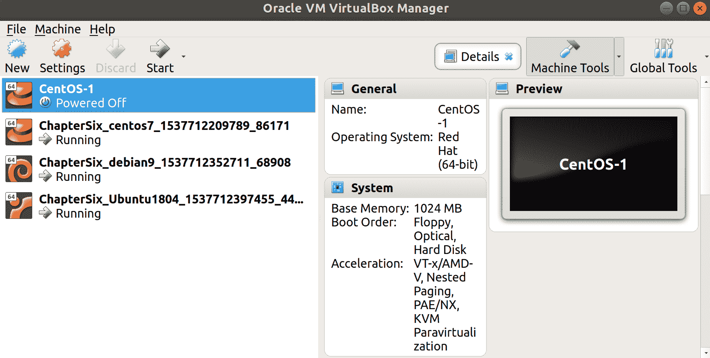

我们将在某个时候使用每一个。

# 检查软件包版本

在本节中，我们将查看已安装在我们系统上的软件包，并获取这些软件包的版本号。

这通常是有用的，如果你听说了最新的漏洞，它预示着世界末日，你的老板大喊让你去修复它，修复它，修复它。

存在大量的漏洞；偶尔会有一些更大的漏洞渗透到主流媒体。这些可以说是最危险的，因为它们会让人们恐慌，如果有比处于糟糕境地更糟糕的事情，那就是当你周围的人都在失去理智时处于糟糕境地。

通常也应该保持系统最新，因为跨越多个版本的升级（当您最终需要升级时）比逐步改变事物更加麻烦。

# 准备工作

确保所有盒子都已启动，并尝试连接前两个（CentOS 和 Debian）：

```
$ vagrant ssh centos7
$ vagrant ssh debian9
```

在您的 Debian 盒子中，确保安装`aptitude`，因为这是我们稍后在本节中将要使用的前端之一；虽然它在某些发行版上是默认安装的，但这个 Debian 安装不是其中之一：

```
$ sudo apt install aptitude
```

# 如何做...

每个操作系统的方法都类似，但我们将依次进行。

# CentOS

CentOS（和 Red Hat）有两个软件包管理器，另一个即将加入到等式中。

从头开始，我们有**RPM 软件包管理器**（**RPM**是一个递归缩写），它是 Red Hat 系统中软件包管理的基础。从某种意义上说，它是原始的软件包管理器，因为它是原始的，你可能不会每天直接使用它。

RPM 执行以下四个操作：

+   选择

+   查询

+   验证

+   安装

这些选项有参数，我经常使用的是查询。

要列出系统上所有已安装的软件包，请使用`-qa`，如下所示：

```
$ rpm -qa
kernel-tools-libs-3.10.0-862.2.3.el7.x86_64
grub2-common-2.02-0.65.el7.centos.2.noarch
dmidecode-3.0-5.el7.x86_64
grub2-pc-modules-2.02-0.65.el7.centos.2.noarch
firewalld-filesystem-0.4.4.4-14.el7.noarch
<SNIP>
gssproxy-0.7.0-17.el7.x86_64
dbus-glib-0.100-7.el7.x86_64
python-slip-dbus-0.4.0-4.el7.noarch
python-pyudev-0.15-9.el7.noarch
plymouth-scripts-0.8.9-0.31.20140113.el7.centos.x86_64
```

要列出特定软件包，可以按名称（不包括完整版本信息），如下所示：

```
$ rpm -q dmidecode
dmidecode-3.0-5.el7.x86_64
```

要获取有关软件包的信息，可以使用`-i`：

```
$ rpm -qi dmidecode
Name        : dmidecode
Epoch       : 1
Version     : 3.0
Release     : 5.el7
Architecture: x86_64
Install Date: Sat 12 May 2018 18:52:07 UTC
Group       : System Environment/Base
Size        : 247119
License     : GPLv2+
Signature   : RSA/SHA256, Thu 10 Aug 2017 15:38:00 UTC, Key ID 24c6a8a7f4a80eb5
Source RPM  : dmidecode-3.0-5.el7.src.rpm
Build Date  : Thu 03 Aug 2017 23:53:58 UTC
Build Host  : c1bm.rdu2.centos.org
Relocations : (not relocatable)
Packager    : CentOS BuildSystem <http://bugs.centos.org>
Vendor      : CentOS
URL         : http://www.nongnu.org/dmidecode/
Summary     : Tool to analyse BIOS DMI data
Description :
dmidecode reports information about x86 & ia64 hardware as described in the
system BIOS according to the SMBIOS/DMI standard. This information
typically includes system manufacturer, model name, serial number,
BIOS version, asset tag as well as a lot of other details of varying
level of interest and reliability depending on the manufacturer.

This will often include usage status for the CPU sockets, expansion
slots (e.g. AGP, PCI, ISA) and memory module slots, and the list of
I/O ports (e.g. serial, parallel, USB).
```

我发现有用的一个技巧是以伪 YAML 格式输出特定信息。这对于记录软件包的版本非常方便，可以通过`--queryformat`选项实现：

```
$ rpm -q --queryformat "---\nName: %{NAME}\n  Version: %{VERSION}\n  Release: %{RELEASE}\n" dmidecode
---
Name: dmidecode
 Version: 3.0
 Release: 5.el7
```

我开玩笑说 RPM 已经过时了，但它在许多方面都表现出色，而且在许多情况下，使用`rpm`命令运行软件包查询要比任何可用的前端快得多，这意味着它非常适合脚本。只是要注意，同时使用 RPM 和 YUM（安装东西）可能会导致问题。

如果你想使用一些更近期的东西，那么对 RPM 的良好前端的当前版本称为**Yellowdog Updater Modified**（**YUM**），最初是为 Yellow Dog Linux 开发的。

YUM 通常被使用，因为它处理依赖关系解析（自动下载和安装依赖软件包）以及从配置的远程存储库安装。

那些在 2000 年代中期拥有 Playstation 3 的人可能会感兴趣知道，Yellow Dog 是针对这些游戏机开发的，当时索尼允许在自己的 Orbis OS（基于 FreeBSD）旁边安装第三方操作系统的时间很短。

要列出所有已安装的软件包，请使用`list installed`：

```
$ yum list installed
Loaded plugins: fastestmirror
Loading mirror speeds from cached hostfile
 * base: mirror.vorboss.net
 * extras: mirror.econdc.com
 * updates: mirror.cwcs.co.uk
Installed Packages
GeoIP.x86_64                                                                      1.5.0-11.el7                                                                  @anaconda 
NetworkManager.x86_64                                                             1:1.10.2-13.el7                                                               @anaconda 
NetworkManager-libnm.x86_64                                                       1:1.10.2-13.el7                                                               @anaconda 
NetworkManager-team.x86_64                                                        1:1.10.2-13.el7                                                               @anaconda 
NetworkManager-tui.x86_64                                                         1:1.10.2-13.el7                                                               @anaconda 
<SNIP> 
yum-plugin-fastestmirror.noarch                                                   1.1.31-45.el7                                                                 @anaconda 
yum-utils.noarch                                                                  1.1.31-45.el7                                                                 @anaconda 
zlib.x86_64                                                                       1.2.7-17.el7                                                                  @anaconda 
```

您还可以像我们使用 RPM 一样使用`yum`来查询单个信息，如下所示：

```
$ yum info zlib
Loaded plugins: fastestmirror
Loading mirror speeds from cached hostfile
 * base: mirror.vorboss.net
 * extras: mirror.econdc.com
 * updates: mirror.cwcs.co.uk
Installed Packages
Name        : zlib
Arch        : x86_64
Version     : 1.2.7
Release     : 17.el7
Size        : 181 k
Repo        : installed
From repo   : anaconda
Summary     : The compression and decompression library
URL         : http://www.zlib.net/
Licence     : zlib and Boost
Description : Zlib is a general-purpose, patent-free, lossless data compression
 : library which is used by many different programs.

Available Packages
Name        : zlib
Arch        : i686
Version     : 1.2.7
Release     : 17.el7
Size        : 91 k
Repo        : base/7/x86_64
Summary     : The compression and decompression library
URL         : http://www.zlib.net/
Licence     : zlib and Boost
Description : Zlib is a general-purpose, patent-free, lossless data compression
 : library which is used by many different programs.
```

请注意，默认情况下我们还会得到可用的软件包，你们中眼尖的人会注意到这两个软件包之间唯一的区别是可用的版本是 32 位的。

DNF（这并不代表未完成）是最新的前端软件包管理器，负责统一 Red Hat 安装。它已经成为 Fedora（一个很好的发行版，也是 Red Hat 的测试场）的默认选项一段时间了，这意味着它很可能会进入下一个版本的 CentOS 和 Red Hat 本身。在大多数情况下，它是一个可替换的工具，还有一些新功能来证明它的存在。

# Debian

在底层，Debian 使用`dpkg`软件包管理器来安装和管理软件包。还有各种可用的前端，比如`apt`和`aptitude`，使管理更加用户友好。

从基础开始，您可以使用`dpkg-query`来查询系统上安装的软件包：

```
$ dpkg-query -W
adduser    3.115
apt    1.4.8
apt-listchanges    3.10
apt-utils    1.4.8
base-files    9.9+deb9u5
base-passwd    3.5.43
bash    4.4-5
<SNIP>
xauth    1:1.0.9-1+b2
xdg-user-dirs    0.15-2+b1
xkb-data    2.19-1+deb9u1
xml-core    0.17
xxd    2:8.0.0197-4+deb9u1
xz-utils    5.2.2-1.2+b1
zlib1g:amd64    1:1.2.8.dfsg-5
```

你肯定会注意到，默认情况下，软件包和版本之间用制表符分隔。我个人认为这很丑陋（因为两个空格是更好的选择），但幸运的是，我们可以使用`showformat`来自定义输出：

```
$ dpkg-query -W --showformat='${Package} - ${Version}\n'
adduser - 3.115
apt - 1.4.8
apt-listchanges - 3.10
apt-utils - 1.4.8
base-files - 9.9+deb9u5
base-passwd - 3.5.43
<SNIP>
xml-core - 0.17
xxd - 2:8.0.0197-4+deb9u1
xz-utils - 5.2.2-1.2+b1
zlib1g - 1:1.2.8.dfsg-5
```

这对于脚本来说特别方便！

除了`dpkg-query`，我们还有`apt`：

```
$ apt list --installed
Listing... Done
adduser/stable,now 3.115 all [installed]
apt/stable,now 1.4.8 amd64 [installed]
apt-listchanges/stable,now 3.10 all [installed]
apt-utils/stable,now 1.4.8 amd64 [installed]
<SNIP>
xdg-user-dirs/stable,now 0.15-2+b1 amd64 [installed,automatic]
xkb-data/stable,now 2.19-1+deb9u1 all [installed,automatic]
xml-core/stable,now 0.17 all [installed,automatic]
xxd/stable,now 2:8.0.0197-4+deb9u1 amd64 [installed]
xz-utils/stable,now 5.2.2-1.2+b1 amd64 [installed]
zlib1g/stable,now 1:1.2.8.dfsg-5 amd64 [installed]
```

这个默认输出可能更适合你。

`apt`是与系统上的软件包交互的新方法，尽管你们中的传统主义者（或者从传统主义者那里学到的人）可能更熟悉`apt-get`和`apt-cache`工具套件。

最后，在本节中，还有`aptitude`。

Aptitude 是我记得使用的第一个软件包管理器，我还记得它很难用，因为有时它会让我进入 TUI（文本或基于文本的用户界面），我不知道发生了什么。

可以在命令行上使用`aptitude`，如下所示：

```
$ aptitude search  ~i --display-format '%p%v'
adduser                                                                  3.115 
apt                                                                      1.4.8 
apt-listchanges                                                          3.10 
apt-utils                                                                1.4.8 
aptitude                                                                 0.8.7-1 
aptitude-common                                                          0.8.7-1 
base-files                                                               9.9+deb9u5 
base-passwd                                                              3.5.43 
<SNIP>
xdg-user-dirs                                                            0.15-2+b1 
xkb-data                                                                 2.19-1+deb9u1 
xml-core                                                                 0.17 
xxd                                                                      2:8.0.0197-4+d
xz-utils                                                                 5.2.2-1.2+b1 
zlib1g                                                                   1:1.2.8.dfsg-5
```

也可以单独输入`aptitude`，然后进入 TUI：

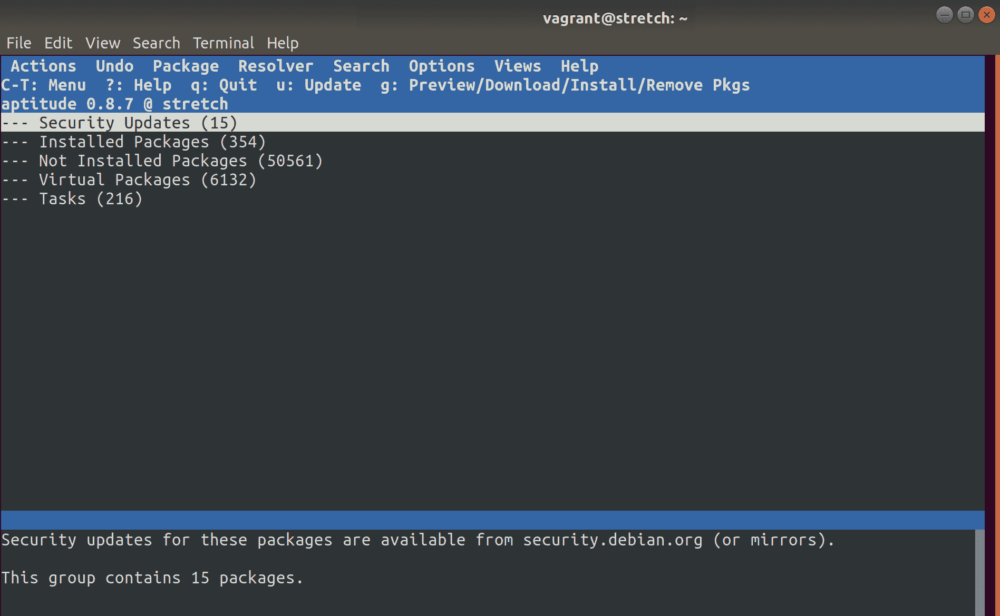

可以使用键盘上的箭头键或鼠标来导航此界面。

然而，我们可以立即看到列出的`安全更新`和`已安装的软件包`，这构成了我们在命令行上得到的`369`个软件包。

```
$ aptitude search  ~i --display-format '%p%v'  | wc -l
369
```

我们可以双击并深入到`aptitude`界面。

在下面的屏幕截图中，我展示了我们的 VM 中安装的两个内核（`4.9.0-6`和`4.9.0-7`）：

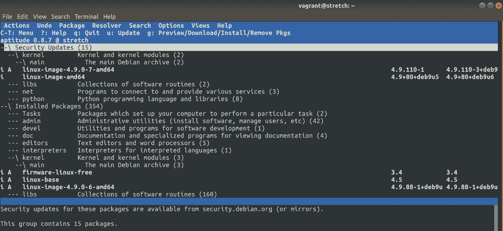

您可能还注意到`linux-image-amd64`，这是一个元包，而不是一个独立的包。

我们也可以在命令行上查找这些内核：

```
$ aptitude search  '~i linux-image' --display-format '%p%v' 
linux-image-4.9.0-6-amd64                                                                                                                                         4.9.88-1+deb9u
linux-image-4.9.0-7-amd64                                                                                                                                         4.9.110-1 
linux-image-amd64                                                                                                                                                 4.9+80+deb9u5 
```

# 它是如何工作的...

您实际上正在做的事情（在这两种情况下）是查询系统上的软件包数据库。

在您的 CentOS 系统上，RPM 和 YUM 都在`/var/lib/rpm`中查看，以确定系统的状态。

同样，在您的 Debian 系统上，您的软件包状态保存在`/var/lib/dpkg`中。

最好不要在用于管理它们的应用程序之外搞乱这些文件夹，因为修改系统上安装的软件包的性质（在软件包管理器之外）可能会导致奇怪的，有时是破坏性的行为。

# 还有更多...

请记住，您不必使用系统的软件包管理器来列出版本；如果您更愿意相信应用程序本身的输出，大多数应用程序都有某种形式的`-v`、`--version`标准。

例如，`bash`如下所示：

```
$ bash --version
GNU bash, version 4.2.46(2)-release (x86_64-redhat-linux-gnu)
Copyright (C) 2011 Free Software Foundation, Inc.
License GPLv3+: GNU GPL version 3 or later <http://gnu.org/licenses/gpl.html>

This is free software; you are free to change and redistribute it.
There is NO WARRANTY, to the extent permitted by law.
```

以下显示了`ssh`的代码，其中使用了`-V`（大写）：

```
$ ssh -V
OpenSSH_7.4p1, OpenSSL 1.0.2k-fips  26 Jan 2017
```

而且，为了使人感到困扰，Vagrant 使用了`-v`（小写）：

```
$ vagrant -v
Vagrant 2.0.2
```

您可能已经注意到在前面的示例中缺少 Ubuntu；这是因为在 Debian 系统上运行的任何东西极有可能在 Ubuntu 系统上运行。

# 检查操作系统版本

我们将使用在上一节中使用的相同的`Vagrantfile`。

在本节中，我们将列出我们操作系统的规范版本，以及内核版本。

我们还将研究 LSB 兼容性的概念。

# 如何做...

我们将把这一部分分成不同的操作系统。

# CentOS

我们可以通过打印`centos-release`文件的内容来确定我们的`CentOS`安装版本，如下所示：

```
$ cat /etc/centos-release
CentOS Linux release 7.5.1804 (Core)
```

有趣的是（在某种类型的人中间）：如果您在您的盒子上`cat` `redhat-release`的内容，您将获得相同的信息，因为`CentOS`和 Red Hat 系统是如此紧密地对齐：

```
$ cat /etc/redhat-release 
CentOS Linux release 7.5.1804 (Core)
```

`cat`（源自 concatenate）是一个历史上用于将多个文件的内容打印到标准输出的程序。

同样，`system-release`是指向`centos-release`的符号链接：

```
$ cat /etc/system-release
CentOS Linux release 7.5.1804 (Core)
```

如果您想要更详细的信息，甚至可以打印`os-release`文件的内容：

```
$ cat /etc/os-release 
NAME="CentOS Linux"
VERSION="7 (Core)"
ID="centos"
ID_LIKE="rhel fedora"
VERSION_ID="7"
PRETTY_NAME="CentOS Linux 7 (Core)"
ANSI_COLOR="0;31"
CPE_NAME="cpe:/o:centos:centos:7"
HOME_URL="https://www.centos.org/"
BUG_REPORT_URL="https://bugs.centos.org/"

CENTOS_MANTISBT_PROJECT="CentOS-7"
CENTOS_MANTISBT_PROJECT_VERSION="7"
REDHAT_SUPPORT_PRODUCT="centos"
REDHAT_SUPPORT_PRODUCT_VERSION="7"
```

这些命令告诉您操作系统的版本；它们没有提供给您的是内核版本，这是分开的（回想一下第一章，*介绍和环境设置*）。

要确定内核版本，可以查询`dmesg`，如下所示：

```
$ dmesg | grep "Linux version"
[    0.000000] Linux version 3.10.0-862.2.3.el7.x86_64 (builder@kbuilder.dev.centos.org) (gcc version 4.8.5 20150623 (Red Hat 4.8.5-28) (GCC) ) #1 SMP Wed May 9 18:05:47 UTC 2018
```

或者，对于不依赖日志文件的命令，您可以运行带有`-a`的`uname`，以打印有关系统的所有信息：

```
$ uname -a
Linux localhost.localdomain 3.10.0-862.2.3.el7.x86_64 #1 SMP Wed May 9 18:05:47 UTC 2018 x86_64 x86_64 x86_64 GNU/Linux
```

仅获取内核版本信息，请使用`-r`，如下所示：

```
$ uname -r
3.10.0-862.2.3.el7.x86_64
```

`uname`绝对不是一个特定于 Linux 的命令；它将在大多数 Unix 和类 Unix 的衍生产品上运行。看看它在您的 FreeBSD 或 OpenBSD 系统上（或者如果您不那么悲伤的话，在您的 macOS 盒子上）打印出什么。

您还可以使用 YUM，如前所述：

```
$ yum -q info installed kernel 
Installed Packages
Name        : kernel
Arch        : x86_64
Version     : 3.10.0
Release     : 862.2.3.el7
Size        : 62 M
Repo        : installed
From repo   : koji-override-1
Summary     : The Linux kernel
URL         : http://www.kernel.org/
Licence     : GPLv2
Description : The kernel package contains the Linux kernel (vmlinuz), the core of any
 : Linux operating system.  The kernel handles the basic functions
 : of the operating system: memory allocation, process allocation, device
 : input and output, etc.
```

如果您是一个真正的叛逆者，您甚至可以查看您在`/boot`中安装了哪些内核：

```
$ ls -l /boot
total 25980
-rw-r--r--. 1 root root   147823 May  9 18:19 config-3.10.0-862.2.3.el7.x86_64
drwxr-xr-x. 3 root root       17 May 12 18:50 efi
drwxr-xr-x. 2 root root       27 May 12 18:51 grub
drwx------. 5 root root       97 May 12 18:54 grub2
-rw-------. 1 root root 16506787 May 12 18:55 initramfs-3.10.0-862.2.3.el7.x86_64.img
-rw-r--r--. 1 root root   304926 May  9 18:21 symvers-3.10.0-862.2.3.el7.x86_64.gz
-rw-------. 1 root root  3409102 May  9 18:19 System.map-3.10.0-862.2.3.el7.x86_64
-rwxr-xr-x. 1 root root 6225056 May 9 18:19 vmlinuz-3.10.0-862.2.3.el7.x86_64
```

最新版本（在前面的代码中加粗）很有可能是您正在运行的版本，尽管这并不总是正确的。

# Debian

在 Debian 世界中情况大致相同，尽管要担心的 OS 版本文件较少。

在 Debian 中，我们可以查看`/etc/debian_version`的内容，以获取我们正在运行的版本：

```
$ cat /etc/debian_version 
9.5
```

或者，我们可以像在`CentOS`中一样查看`/etc/os-release`：

```
$ cat /etc/os-release 
PRETTY_NAME="Debian GNU/Linux 9 (stretch)"
NAME="Debian GNU/Linux"
VERSION_ID="9"
VERSION="9 (stretch)"
ID=debian
HOME_URL="https://www.debian.org/"
SUPPORT_URL="https://www.debian.org/support"
BUG_REPORT_URL="https://bugs.debian.org/"
```

就像在`CentOS`中一样，我们可以通过`grep` `dmesg`日志来获取我们内核的版本：

```
$ sudo dmesg | grep "Linux version"
[    0.000000] Linux version 4.9.0-7-amd64 (debian-kernel@lists.debian.org) (gcc version 6.3.0 20170516 (Debian 6.3.0-18+deb9u1) ) #1 SMP Debian 4.9.110-1 (2018-07-05)
```

或者，我们可以使用`uname`，如下所示：

```
$ uname -r
4.9.0-7-amd64
```

是的，Debian 在撰写本书时有一个更加最新的内核版本；这是`CentOS`将修复和功能后移植到他们的旧内核中（从上游获取改进并将其应用到旧版本中），以及 Debian 发行版的发布周期要短得多的混合体。

您可以使用之前列出的任何方法列出已安装的版本；以下是`dpkg-query`的示例：

```
$ dpkg-query -W  linux-image*
linux-image-4.9.0-6-amd64    4.9.88-1+deb9u1
linux-image-4.9.0-7-amd64    4.9.110-1
linux-image-amd64    4.9+80+deb9u5
```

还有老式的`/boot`，如下所示：

```
$ ls -l /boot
total 50264
-rw-r--r-- 1 root root   186567 May  7 22:38 config-4.9.0-6-amd64
-rw-r--r-- 1 root root   186568 Jul  5 01:29 config-4.9.0-7-amd64
drwxr-xr-x 5 root root     4096 Jul 17 01:50 grub
-rw-r--r-- 1 root root 18117609 Jul 17 01:48 initrd.img-4.9.0-6-amd64
-rw-r--r-- 1 root root 18125878 Jul 17 01:50 initrd.img-4.9.0-7-amd64
-rw-r--r-- 1 root root  3190138 May  7 22:38 System.map-4.9.0-6-amd64
-rw-r--r-- 1 root root  3192069 Jul  5 01:29 System.map-4.9.0-7-amd64
-rw-r--r-- 1 root root  4224800 May  7 22:38 vmlinuz-4.9.0-6-amd64
-rw-r--r-- 1 root root  4224800 Jul  5 01:29 vmlinuz-4.9.0-7-amd64
```

# Ubuntu

像所有好的发行版一样，Ubuntu 也允许您`cat`一个文件以获取信息；但是，与其他一些发行版不同的是，它还会在您登录时告诉您（默认情况下）。

通过 SSH 连接到我们的 Ubuntu 主机应该打印出类似以下的内容：

```
$ vagrant ssh ubuntu1804
Welcome to Ubuntu 18.04.1 LTS (GNU/Linux 4.15.0-34-generic x86_64)

 * Documentation:  https://help.ubuntu.com
 * Management:     https://landscape.canonical.com
 * Support:        https://ubuntu.com/advantage

  System information as of Sun Sep 30 14:55:26 UTC 2018

  System load:  0.0              Processes:             95
  Usage of /:   9.8% of 9.63GB   Users logged in:       0
  Memory usage: 12%              IP address for enp0s3: 10.0.2.15
  Swap usage:   0%

 * Read about Ubuntu updates for L1 Terminal Fault Vulnerabilities (L1TF).
   - https://ubu.one/L1TF

 * Having fun with some surprising Linux desktop apps... Alan keeps
   the family entertained over the summer/winter holidays.
   - https://bit.ly/top_10_entertainment_apps

 * Want to make a highly secure kiosk, smart display or touchscreen?
   Here's a step-by-step tutorial for a rainy weekend, or a startup.
   - https://bit.ly/secure-kiosk

  Get cloud support with Ubuntu Advantage Cloud Guest:
    http://www.ubuntu.com/business/services/cloud

0 packages can be updated.
0 updates are security updates.

Last login: Sun Sep 30 14:15:35 2018 from 10.0.2.2
```

注意加粗的行，它告诉您在登录时正在运行的 Ubuntu 版本。

这个**每日消息**（**MOTD**）实际上是由几个文件构建的；头部是`00-header`：

```
$ cat /etc/update-motd.d/00-header
```

在这个文件中有一些行，如下所示：

```
[ -r /etc/lsb-release ] && . /etc/lsb-release

if [ -z "$DISTRIB_DESCRIPTION" ] && [ -x /usr/bin/lsb_release ]; then
    # Fall back to using the very slow lsb_release utility
    DISTRIB_DESCRIPTION=$(lsb_release -s -d)
fi

printf "Welcome to %s (%s %s %s)\n" "$DISTRIB_DESCRIPTION" "$(uname -o)" "$(uname -r)" "$(uname -m)"
```

在这里，我们可以检查`lsb-release`文件是否存在（并且可读），然后再使用该文件（`. /etc/lsb-release`）来确定版本。

然后，我们有一个`if`语句，它说如果`DISTRIB_DESCRIPTION`变量为空，并且`lsb_release`二进制文件可执行，我们将回退到使用该实用程序来确定发行版本（`lsb_release -s -d`）。

然后我们打印输出，这就是我们在登录消息顶部看到的内容。

如果 MOTD 失败，我们可以自己`cat /etc/lsb-release`，使用以下命令：

```
$ cat /etc/lsb-release 
DISTRIB_ID=Ubuntu
DISTRIB_RELEASE=18.04
DISTRIB_CODENAME=bionic
DISTRIB_DESCRIPTION="Ubuntu 18.04.1 LTS"
```

或者，我们可以再次使用`os-release`，如下所示：

```
$ cat /etc/os-release 
NAME="Ubuntu"
VERSION="18.04.1 LTS (Bionic Beaver)"
ID=ubuntu
ID_LIKE=debian
PRETTY_NAME="Ubuntu 18.04.1 LTS"
VERSION_ID="18.04"
HOME_URL="https://www.ubuntu.com/"
SUPPORT_URL="https://help.ubuntu.com/"
BUG_REPORT_URL="https://bugs.launchpad.net/ubuntu/"
PRIVACY_POLICY_URL="https://www.ubuntu.com/legal/terms-and-policies/privacy-policy"
VERSION_CODENAME=bionic
UBUNTU_CODENAME=bionic
```

对于内核，与之前的操作基本相同；检查`uname`，如下所示：

```
$ uname -r
4.15.0-34-generic
```

检查已安装的版本，如下所示：

```
$ dpkg-query -W  linux-image*
linux-image 
linux-image-4.15.0-34-generic    4.15.0-34.37
linux-image-unsigned-4.15.0-34-generic 
linux-image-virtual    4.15.0.34.36
```

或者，看看`/boot`，如下所示：

```
$ ls -l /boot
total 32720
-rw------- 1 root root  4044038 Aug 27 14:45 System.map-4.15.0-34-generic
-rw-r--r-- 1 root root  1537610 Aug 27 14:45 abi-4.15.0-34-generic
-rw-r--r-- 1 root root   216905 Aug 27 14:45 config-4.15.0-34-generic
drwxr-xr-x 5 root root     4096 Sep 21 12:13 grub
-rw-r--r-- 1 root root 19423451 Sep 21 12:00 initrd.img-4.15.0-34-generic
-rw-r--r-- 1 root root        0 Aug 27 14:45 retpoline-4.15.0-34-generic
-rw------- 1 root root  8269560 Aug 27 15:06 vmlinuz-4.15.0-34-generic
```

`vmlinuz`对象，如前所述，是 Linux 内核的压缩可执行文件。

# 它是如何工作的...

当你查询这些文件时，你在询问操作系统它认为自己是什么版本。

这对于从安全到编写脚本都很有用。您不仅想知道您正在运行的操作系统版本是否不安全，还可能想在任何脚本的顶部添加一个健全性检查，以确保它们只在为其设计的系统上运行，也就是说，您可以为 CentOS 系统编写一个脚本，第一步可以是“检查我们实际上是在 CentOS 系统上执行”。

`uname`（Unix 名称）更有趣，因为我们实际上不是在查询操作系统版本的文件，而是在查询正在运行的内核的信息。

`uname`使用`uname`系统调用（搞糊涂了吗？），它不仅符合 POSIX 标准，而且根源可以追溯到上世纪 70 年代和 PWB/Unix。

# 还有更多...

您可能已经注意到 Ubuntu 使用`lsb_release`来获取其操作系统版本；在`CentOS`上也可以这样做，但首先需要安装`lsb_release`：

```
$ sudo yum install redhat-lsb-core
```

现在，我们可以运行 Ubuntu 使用的相同命令以获取操作系统信息：

```
$ lsb_release -s -d
"CentOS Linux release 7.5.1804 (Core) "
```

在`Debian`上也可以这样做，而无需默认安装任何内容：

```
$ lsb_release -s -d
Debian GNU/Linux 9.5 (stretch)
```

**Linux 标准基础**（**LSB**）基本上是多个发行版签署的标准。它指定了**文件系统层次结构标准**（**FHS**），以及 Linux 系统的各种其他组件。

LSB 还建议使用 RPM 的软件包格式，尽管 Debian 和 Ubuntu 显然不会默认使用这个格式，而是选择`.deb`。为了解决这个问题，Debian 提供了`alien`软件包，用于在安装之前将`.rpm`文件转换为`.deb`文件。这有点像一个肮脏的黑客，它并不能保证合规性；它更像是一种礼貌的表示。

# 另请参阅...

看看旧的 Unix 程序和约定，您会惊讶地发现其中有多少已经存活到现代。

GNU 不是 Unix，那么为什么 Linux 系统也有`uname`？答案是，因为它类似于 Unix，并且 Unix 开创的许多命令和约定被 GNU 操作系统和自由软件运动重新编写，以方便熟悉。

# 检查更新

在本节中，我们将使用第一节的一部分中使用的`Vagrantfile`。现在我们知道与我们的系统相关的软件版本（软件包、操作系统和内核），我们将查看我们可以使用的更新以及如何安装它们。

我们将检查特定软件包的更新以及所有软件包的更新。

# 如何做到...

在本节中，我们将进入我们的`CentOS`和`Debian`框，跳过 Ubuntu，因为 Debian 的相同规则也适用。

我们将在这些示例中使用内核，尽管您的系统上的任何软件包都可以替换。

# CentOS

在`CentOS`中，检查软件包更新的最简单方法是使用 YUM，如下所示：

```
$ yum -q info kernel
Installed Packages
Name : kernel
Arch : x86_64
Version : 3.10.0
Release : 862.2.3.el7
Size : 62 M
Repo : installed
From repo : koji-override-1
Summary : The Linux kernel
URL : http://www.kernel.org/
Licence : GPLv2
Description : The kernel package contains the Linux kernel (vmlinuz), the core of any
 : Linux operating system. The kernel handles the basic functions
 : of the operating system: memory allocation, process allocation, device
 : input and output, etc.

Available Packages
Name : kernel
Arch : x86_64
Version : 3.10.0
Release : 862.14.4.el7
Size : 46 M
Repo : updates/7/x86_64
Summary : The Linux kernel
URL : http://www.kernel.org/
Licence : GPLv2
Description : The kernel package contains the Linux kernel (vmlinuz), the core of any
 : Linux operating system. The kernel handles the basic functions
 : of the operating system: memory allocation, process allocation, device
 : input and output, etc.
```

请注意，我们不限制输出到已安装的软件包；相反，我们正在检查我们安装了什么以及可用的软件包。

输出告诉我们，虽然版本号没有更改，但内核的发布已经更新，并且可以从`updates/7/x86_64`仓库中获取。

要更新我们的内核，我们只需运行`yum upgrade`命令，如下所示：

```
$ sudo yum upgrade -y kernel
```

我们之前提到运行 YUM 命令时会列出将更改的软件包列表。使用“-y”我们会自动接受这些更改，但如果您不确定，最好省略“-y”标志，并通过阅读呈现的列表手动进行健全性检查。

因此，特定软件包非常简单，但是如何检查系统上安装的所有软件包呢？

当然是用 YUM！

我们可以使用`update`或`upgrade`，在现代安装中基本上是相同的：

```
$ sudo yum upgrade 
```

使用`upgrade`（而不是`update`）在技术上应该是不同的，因为它还使用逻辑来使过时的程序过时并替换，但因为这是大多数人所期望的行为，`obsoletes=1`也设置在`yum.conf`中，使`update`和`upgrade`在默认情况下具有相同的功能。

我们之前的命令应该会显示如下屏幕：

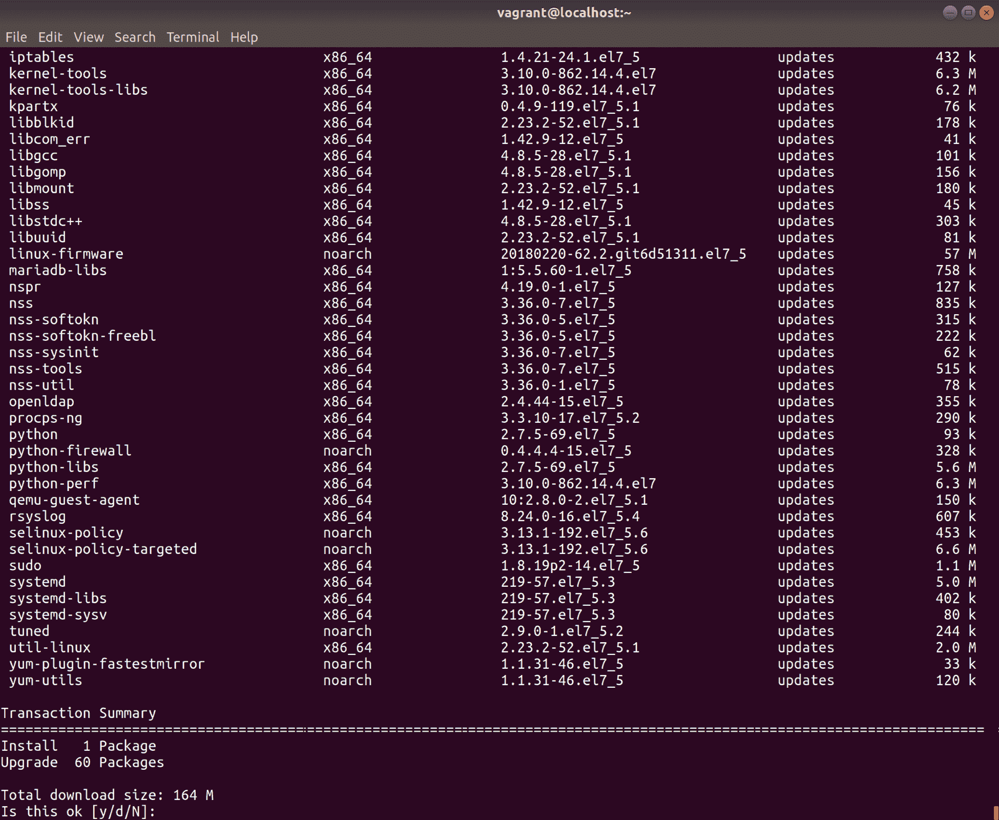

请注意，如果没有在命令中添加标志，更新将在此处停止，并提示您选择`y/d/N`（其中`N`是默认值）。

如果您准备好升级，通过此命令传递`y`将更新并安装前面的软件包。

如果您还没有准备好升级，传递`d`将只下载软件包。

正如我们之前所说，通常，需要重新启动以更新的唯一程序是内核和`systemd`（`init`系统），因为它们是您安装的灵魂，您基本上是在杀死旧程序以为新程序腾出空间（在大多数系统上，升级后会默认选择新程序）。

运行我们的`yum info`命令现在将显示两个已安装的内核，没有可用的内核，如下所示：

```
$ yum -q info kernel
Installed Packages
Name        : kernel
Arch        : x86_64
Version     : 3.10.0
Release     : 862.2.3.el7
Size        : 62 M
Repo        : installed
From repo   : koji-override-1
Summary     : The Linux kernel
URL         : http://www.kernel.org/
Licence     : GPLv2
Description : The kernel package contains the Linux kernel (vmlinuz), the core of any
 : Linux operating system.  The kernel handles the basic functions
 : of the operating system: memory allocation, process allocation, device
 : input and output, etc.

Name        : kernel
Arch        : x86_64
Version     : 3.10.0
Release     : 862.14.4.el7
Size        : 62 M
Repo        : installed
From repo   : updates
Summary     : The Linux kernel
URL         : http://www.kernel.org/
Licence     : GPLv2
Description : The kernel package contains the Linux kernel (vmlinuz), the core of any
 : Linux operating system.  The kernel handles the basic functions
 : of the operating system: memory allocation, process allocation, device
 : input and output, etc.
```

# Debian

在 Debian 上，我们将使用`apt`，这是最新的，也是我认为最友好的工具。

与 YUM 不同，我们可以轻松独立地更新可用软件包的列表：

```
$ sudo apt update
Ign:1 http://deb.debian.org/debian stretch InRelease
Hit:2 http://deb.debian.org/debian stretch Release
Hit:4 http://security.debian.org/debian-security stretch/updates InRelease
Reading package lists... Done
Building dependency tree 
Reading state information... Done
15 packages can be upgraded. Run 'apt list --upgradable' to see them.
```

请注意，它只更新其列表，而不是程序本身。

现在，我们可以使用建议的命令查找特定信息：

```
$ apt list --upgradable linux-image*
Listing... Done
linux-image-4.9.0-7-amd64/stable 4.9.110-3+deb9u2 amd64 [upgradable from: 4.9.110-1]
linux-image-amd64/stable 4.9+80+deb9u6 amd64 [upgradable from: 4.9+80+deb9u5]
```

在末尾不添加`regex-matched`软件包的情况下，此命令将列出所有可升级的软件包：

```
$ apt list --upgradable 
Listing... Done
libcurl3-gnutls/stable 7.52.1-5+deb9u7 amd64 [upgradable from: 7.52.1-5+deb9u6]
libfuse2/stable 2.9.7-1+deb9u1 amd64 [upgradable from: 2.9.7-1]
libpython2.7-minimal/stable 2.7.13-2+deb9u3 amd64 [upgradable from: 2.7.13-2+deb9u2]
libpython2.7-stdlib/stable 2.7.13-2+deb9u3 amd64 [upgradable from: 2.7.13-2+deb9u2]
libpython3.5-minimal/stable 3.5.3-1+deb9u1 amd64 [upgradable from: 3.5.3-1]
libpython3.5-stdlib/stable 3.5.3-1+deb9u1 amd64 [upgradable from: 3.5.3-1]
linux-image-4.9.0-7-amd64/stable 4.9.110-3+deb9u2 amd64 [upgradable from: 4.9.110-1]
linux-image-amd64/stable 4.9+80+deb9u6 amd64 [upgradable from: 4.9+80+deb9u5]
openssh-client/stable 1:7.4p1-10+deb9u4 amd64 [upgradable from: 1:7.4p1-10+deb9u3]
openssh-server/stable 1:7.4p1-10+deb9u4 amd64 [upgradable from: 1:7.4p1-10+deb9u3]
openssh-sftp-server/stable 1:7.4p1-10+deb9u4 amd64 [upgradable from: 1:7.4p1-10+deb9u3]
python2.7/stable 2.7.13-2+deb9u3 amd64 [upgradable from: 2.7.13-2+deb9u2]
python2.7-minimal/stable 2.7.13-2+deb9u3 amd64 [upgradable from: 2.7.13-2+deb9u2]
python3.5/stable 3.5.3-1+deb9u1 amd64 [upgradable from: 3.5.3-1]
python3.5-minimal/stable 3.5.3-1+deb9u1 amd64 [upgradable from: 3.5.3-1]
```

与 YUM 一样，我们可以使用`apt`来升级单个软件包：

```
$ sudo apt install linux-image-amd64
Reading package lists... Done
Building dependency tree 
Reading state information... Done
The following additional packages will be installed:
 linux-image-4.9.0-8-amd64
Suggested packages:
 linux-doc-4.9 debian-kernel-handbook
The following NEW packages will be installed:
 linux-image-4.9.0-8-amd64
The following packages will be upgraded:
 linux-image-amd64
1 upgraded, 1 newly installed, 0 to remove and 14 not upgraded.
Need to get 39.1 MB of archives.
After this operation, 193 MB of additional disk space will be used.
Do you want to continue? [Y/n] 
```

请注意，我们特别使用`install`选项而不是`upgrade`，因为`upgrade`会尝试执行所有软件包，而不仅仅是`linux-image-amd64`。

如果我们想要升级所有内容，我们将使用`upgrade`或`full-upgrade`：

```
$ sudo apt full-upgrade
Reading package lists... Done
Building dependency tree 
Reading state information... Done
Calculating upgrade... Done
The following NEW packages will be installed:
 linux-image-4.9.0-8-amd64
The following packages will be upgraded:
 libcurl3-gnutls libfuse2 libpython2.7-minimal libpython2.7-stdlib libpython3.5-minimal libpython3.5-stdlib linux-image-4.9.0-7-amd64 linux-image-amd64 openssh-client
 openssh-server openssh-sftp-server python2.7 python2.7-minimal python3.5 python3.5-minimal
15 upgraded, 1 newly installed, 0 to remove and 0 not upgraded.
Need to get 88.3 MB of archives.
After this operation, 193 MB of additional disk space will be used.
Do you want to continue? [Y/n] 
```

我使用`full-upgrade`的原因是，仅使用`upgrade`可能导致软件包不会被升级（如果该升级需要删除另一个软件包）。

可能会有时候`upgrade`比`full-upgrade`更可取，因此我建议在确认是否要执行`upgrade`命令之前检查其输出。

# 工作原理...

当您运行前面的软件包管理器命令时，您所做的是查询它们配置为连接的上游服务器，并询问是否有安装软件的更新版本可用。

配置的存储库位于`CentOS`的`/etc/yum.repos.d/`和`/etc/apt/sources.list.d`（或`sources.list.conf`）中。

如果您的软件有更新版本可用，您可以选择安装或下载以备后用。通常，确保所有软件保持最新是个好主意，但对于公共服务（如 Web 服务器和 SSH 守护程序）来说尤其如此。

# 还有更多...

一些受欢迎且棘手的软件存在于感知范围之外（就这位有主见的作者而言）。

特别值得注意的是 Hashicorp 工具套件，当调用时会检查自身是否有新版本可用。这意味着当您运行`Terraform`时，有可能会通知您它已过时，并建议您下载新版本：

```
$ terraform --version
Terraform v0.11.7

Your version of Terraform is out of date! The latest version
is 0.11.8\. You can update by downloading from www.terraform.io/downloads.html
```

发行版的软件包维护者通常不会及时跟进，这并非他们的错，而且很多人甚至都不会费心打包此类软件。这意味着经常人们会添加 Terraform、Packer 和其他酷炫软件到他们的软件包管理器之外，使您需要跟踪的软件包管理系统数量翻倍（一个是您系统的，另一个是您自己的）。

# 自动更新

在本节中，我们将使用第一节的一部分中使用的`Vagrantfile`。

“自动更新”是一个棘手的话题，对于许多系统管理员来说，因为在历史上，更新通常会使系统变砖。

这在如今越来越不太可能发生，而且您可以在不担心的情况下自动更新您的框（尽管我个人在生产环境中不会这样做）。

我们还将讨论以编程方式重建系统。

# 如何做...

在本节中依次进入每个框中。

重要的是要注意，您可能根本不想自动安装更新，特别是如果您处于定期销毁和重建机器的环境中。

可能还有内部程序会限制您的操作，这意味着无论您在技术上能够做什么，官僚主义总是会成为阻碍。

# CentOS

在`CentOS`系统上，我们有一个方便的工具叫做`yum-cron`：

```
$ sudo yum install yum-cron -y
```

它带有两个配置文件，位于`/etc/yum/`中。

默认情况下，将使用`/etc/yum/yum-cron.conf`文件，并且其中有一个我们将要禁用的随机休眠：

```
$ sudo sed -i "s/random_sleep = 360/random_sleep = 0/g" /etc/yum/yum-cron.conf
```

现在，这意味着当调用`yum-cron`时，它将自动运行，应用`yum-cron.conf`的默认设置：

```
$ sudo yum-cron 
$ 
```

如果没有更新，`yum-cron`将不显示任何输出（如之前所见）。

如果有更新，默认情况下，您将收到已成功下载的通知：

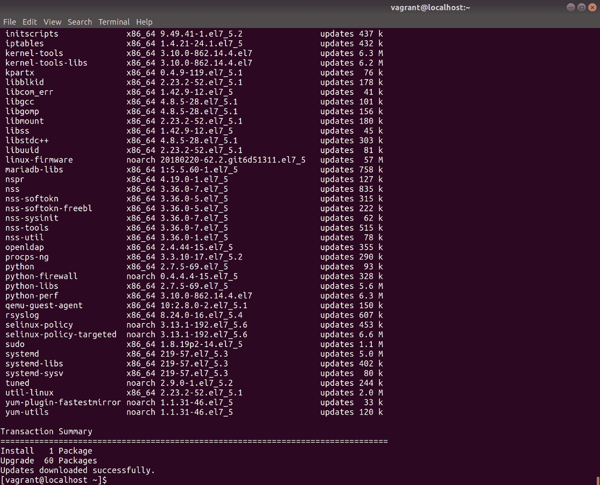

如果要自动应用更新，那将涉及另一个配置文件更改，如下所示：

```
$ sudo sed -i "s/apply_updates = no/apply_updates = yes/g" /etc/yum/yum-cron.conf
```

再次运行`yum-cron`将应用已下载的更新：

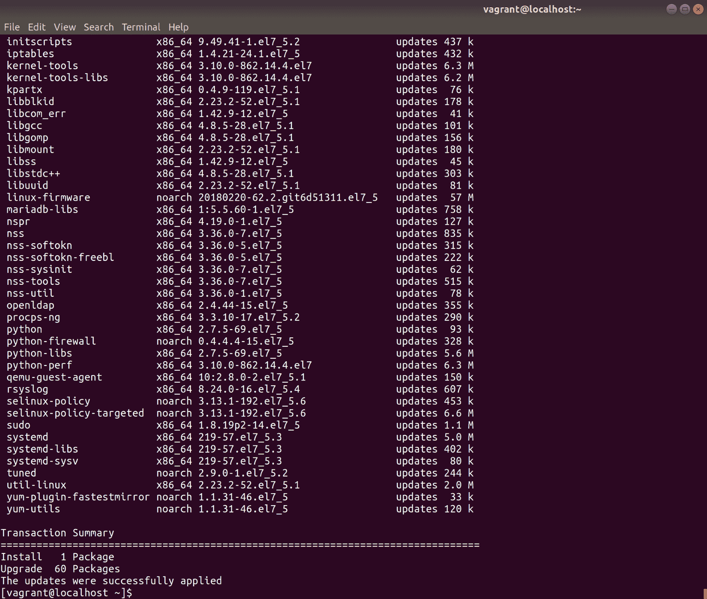

我们之前已经提到过（但值得再次提到）这并不一定意味着服务将立即修复或将具有新功能。

这就是`needs-restarting`命令发挥作用的地方。

您还可以使用定时器（或`cron`，如果必须）运行此命令，以列出在更新后需要重新启动的进程，或者它们使用的组件：

```
$ sudo needs-restarting 
2617 : /usr/lib/systemd/systemd-udevd 
1082 : qmgr -l -t unix -u 
603 : /usr/sbin/crond -n 
609 : /sbin/agetty --noclear tty1 linux 
574 : /usr/sbin/chronyd 
397 : /usr/lib/systemd/systemd-journald 
851 : /usr/sbin/sshd -D -u0 
1070 : /usr/libexec/postfix/master -w 
1 : /usr/lib/systemd/systemd --system --deserialize 21 
2155 : sshd: vagrant [priv] 
<SNIP>
```

如果您希望获得更好的输出，可以指定服务，如下所示：

```
$ sudo needs-restarting -s
rpcbind.service
chronyd.service
systemd-logind.service
NetworkManager.service
postfix.service
dbus.service
getty@tty1.service
crond.service
lvm2-lvmetad.service
sshd.service
gssproxy.service
systemd-udevd.service
systemd-journald.service
polkit.service
```

或者只有在需要重新启动时，使用以下命令：

```
$ sudo needs-restarting -r
Core libraries or services have been updated:
 kernel -> 3.10.0-862.14.4.el7
 systemd -> 219-57.el7_5.3
 linux-firmware -> 20180220-62.2.git6d51311.el7_5

Reboot is required to ensure that your system benefits from these updates.

More information:
https://access.redhat.com/solutions/27943
```

启动`yum-cron`的一个非常简单的方法如下：

```
$ sudo systemctl enable --now yum-cron
```

# Debian

在 Debian（和 Ubuntu）世界中，我们使用一个名为`unattended-upgrades`的软件包。它已经存在了相当长的时间，通常是人们自动更新他们基于 Debian 的发行版的选择。

跳转到您的 stretch 框并运行以下包的快速`install`：

```
$ sudo apt install unattended-upgrades
```

如果现在`ls` `/etc/apt/apt.conf.d/`目录，您会看到几个新文件：

```
$ ls -l /etc/apt/apt.conf.d/
total 44
-rw-r--r-- 1 root root   49 Jul 17 01:48 00aptitude
-rw-r--r-- 1 root root   82 Jul 17 01:46 00CDMountPoint
-rw-r--r-- 1 root root   40 Jul 17 01:46 00trustcdrom
-rw-r--r-- 1 root root  769 Sep 13  2017 01autoremove
-r--r--r-- 1 root root 1768 Jul 17 01:49 01autoremove-kernels
-rw-r--r-- 1 root root   80 Dec 11  2016 20auto-upgrades
-rw-r--r-- 1 root root  202 Apr 10  2017 20listchanges
-rw-r--r-- 1 root root 4259 Oct  1 16:49 50unattended-upgrades
-rw-r--r-- 1 root root  182 May 21  2017 70debconf
-rw-r--r-- 1 root root   27 Jul 17 01:49 99translations
```

这些是`unattended-upgrades`软件包的关键。

如果我们看一下`50unattended-upgrades`配置文件中处理要拉取哪些更新的块，我们会看到以下内容：

```
Unattended-Upgrade::Origins-Pattern {
 // Codename based matching:
 // This will follow the migration of a release through different
 // archives (e.g. from testing to stable and later oldstable).
// "o=Debian,n=jessie";
// "o=Debian,n=jessie-updates";
// "o=Debian,n=jessie-proposed-updates";
// "o=Debian,n=jessie,l=Debian-Security";

 // Archive or Suite based matching:
 // Note that this will silently match a different release after
 // migration to the specified archive (e.g. testing becomes the
 // new stable).
// "o=Debian,a=stable";
// "o=Debian,a=stable-updates";
// "o=Debian,a=proposed-updates";
 "origin=Debian,codename=${distro_codename},label=Debian-Security";
};
```

请注意，只有最后一行是未注释的行（在右括号之前）。

我们将取消注释它之前的行，如下所示：

```
$ sudo sed -i 's/\/\/      "o=Debian,a=stable";/      "o=Debian,a=stable";/g' /etc/apt/apt.conf.d/50unattended-upgrades
$ sudo sed -i 's/\/\/      "o=Debian,a=stable-updates";/      "o=Debian,a=stable-updates";/g' /etc/apt/apt.conf.d/50unattended-upgrades
$ sudo sed -i 's/\/\/      "o=Debian,a=proposed-updates";/      "o=Debian,a=proposed-updates";/g' /etc/apt/apt.conf.d/50unattended-upgrades
```

您可以通过在调试模式下启动命令来运行和测试您的配置：

```
$ sudo unattended-upgrade -d
```

它可能看起来像以下内容：

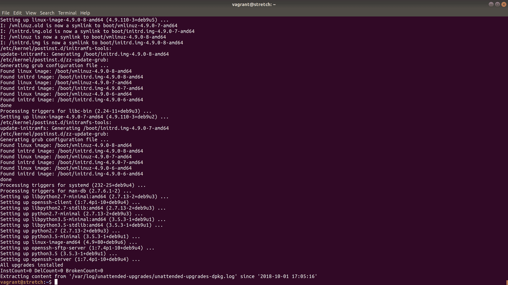

注意到升级实际上已经安装，并且创建了一个日志文件。

# 工作原理...

`yum-cron`实际上只是在 cron 作业中使用 YUM 的一种简单方式（我们之前在讨论`systemd`定时器时曾轻蔑地提到）。因此，您会发现很容易将其纳入自定义定时器（请参阅前几章）或可能每晚运行的 cron 作业中。

一般来说，您可以每晚将所有更新应用到开发环境，然后可能在一周内将更新分散到其他（更高级）环境，将生产环境升级到下一个星期二。这完全取决于您作为全能的系统管理员。

如果您已经采纳了将`yum-cron`作为服务启用的建议，现在应该会发现以下文件存在：

```
$ ls /var/lock/subsys/yum-cron 
/var/lock/subsys/yum-cron
```

这将启用两个`cron`作业，如下所示：

```
$ ls /etc/cron.daily/0yum-daily.cron 
/etc/cron.daily/0yum-daily.cron
$ ls /etc/cron.hourly/0yum-hourly.cron 
/etc/cron.hourly/0yum-hourly.cron
```

这将使用我们提到的配置文件。

在 Debian 的`unattended-upgrades`的情况下，与大多数现代系统一样，`systemd`用于每天运行此作业。

列出您的`systemd`定时器，如下所示：

```
$ sudo systemctl list-timers
NEXT                         LEFT          LAST                         PASSED    UNIT                         ACTIVATES
Mon 2018-10-01 20:34:32 GMT  3h 16min left Mon 2018-10-01 16:48:00 GMT  30min ago apt-daily.timer              apt-daily.service
Tue 2018-10-02 06:56:19 GMT  13h left      Mon 2018-10-01 16:48:00 GMT  30min ago apt-daily-upgrade.timer      apt-daily-upgrade.service
Tue 2018-10-02 17:03:03 GMT  23h left      Mon 2018-10-01 17:03:03 GMT  15min ago systemd-tmpfiles-clean.timer systemd-tmpfiles-clean.service

3 timers listed.
Pass --all to see loaded but inactive timers, too.
```

请注意两个`apt`作业，第一个运行以下内容：

```
[Service]
Type=oneshot
ExecStart=/usr/lib/apt/apt.systemd.daily update
```

第二个运行以下内容：

```
[Service]
Type=oneshot
ExecStart=/usr/lib/apt/apt.systemd.daily install
KillMode=process
TimeoutStopSec=900
```

# 还有更多...

与 Debian 上的无人值守升级一样，`yum-cron`有能力仅处理特定类型的升级。默认情况下，这设置为`default`，如以下片段所示，这就是为什么我们之前没有修改它的原因：

```
$ cat /etc/yum/yum-cron.conf 
[commands]
#  What kind of update to use:
# default                            = yum upgrade
# security                           = yum --security upgrade
# security-severity:Critical         = yum --sec-severity=Critical upgrade
# minimal                            = yum --bugfix update-minimal
# minimal-security                   = yum --security update-minimal
# minimal-security-severity:Critical =  --sec-severity=Critical update-minimal
update_cmd = default
```

没有什么能阻止你改变这一点，也许可以指定只有安全升级应该自动应用？

# 自动配置

在序言中，我建议我们会涉及到这一点，这绝对值得讨论。

曾经，物理机器在地球上漫游，捕食那些敢于进入它们的沼泽和服务器笼子的无辜系统管理员。

如今，服务器仍然存在，但它们已经被赋予了一个更加不友好和媒体熟悉的名称，变得通俗地被称为**云**，并且变得足够透明，以至于系统管理员不再知道他们最喜欢的时髦发行版是在戴尔、HPE 还是 IBM 机器上运行。

这导致了瞬态服务器的出现，或者服务器在晚上定期停止存在，只在第二天早上重新诞生。

除了让您对于晚上睡觉时是否存在产生存在危机之外，这可能开始让您想到从不更新您的机器，而只是确保它们在所有更新已经应用的情况下重新启动。

按计划自动配置您的基础设施的概念正在获得认可，其核心是通过程序（如 Packer）以编程方式创建一个镜像，然后将其上传和/或移动到虚拟基础设施的不同部分，另一个程序（Terraform）可以使用新镜像来启动许多闪亮的新盒子。

显然，这在生产网络上完全没有问题，因为在您的`dev`实例上没有客户在周围（我希望-我真的，真的希望）。但在生产中会出现问题，然后您开始考虑一些疯狂的事情，比如蓝/绿部署。

# 检查邮件列表和勘误页面

在我们的系统之外，我们将看看您在哪里获取有关操作系统整体表现的新闻。它们健康吗？它们需要一些空间吗？它们会很快崩溃吗？

养成这种习惯是很好的做法，因为偶尔，系统和行为变化可能需要系统管理员进行手动干预，即使您已经自动解决了所有其他问题。

服务器-谁需要它们？

# 准备工作

在本节中，我们将稍微使用我们的虚拟机和强大的互联网。

# 如何做...

我们将稍微查看一下我们的虚拟机，但我们主要将专注于在线新闻来源。

有各种各样的方法和地方可以获取信息，所以让我们逐步了解一些更受欢迎的方法。

# 软件包更改日志

如果您想获取有关软件包的信息，您可能会喜欢的一件事是`changelog`，可以通过简单的 RPM 命令从系统中访问。

首先，找到您想要检查的软件包；我们将获取最近安装的`kernel`：

```
$ rpm -q kernel --last
kernel-3.10.0-862.14.4.el7.x86_64             Sun 30 Sep 2018 16:40:08 UTC
kernel-3.10.0-862.2.3.el7.x86_64              Sat 12 May 2018 18:51:56 UTC
```

现在，打开那个`kernel`的`changelog`（很长）：

```
$ rpm -q --changelog kernel-3.10.0-862.14.4.el7.x86_64 | less
```

您将得到类似以下的内容：

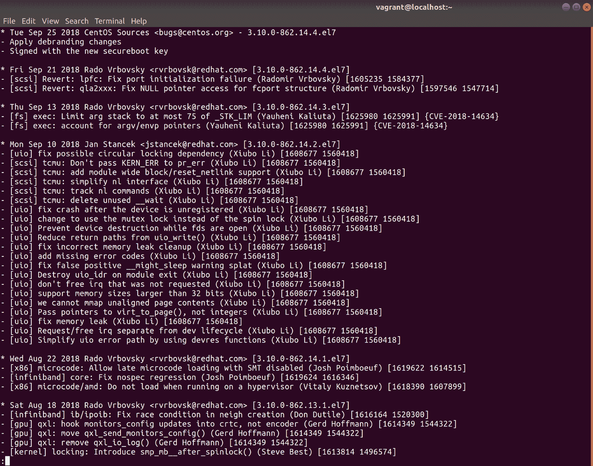

这可以是检查特定更改的好方法，但有时可能有点棘手（取决于日志的性质）。

为了证明它也适用于其他软件包，这里是`lsof`，它要少得多：

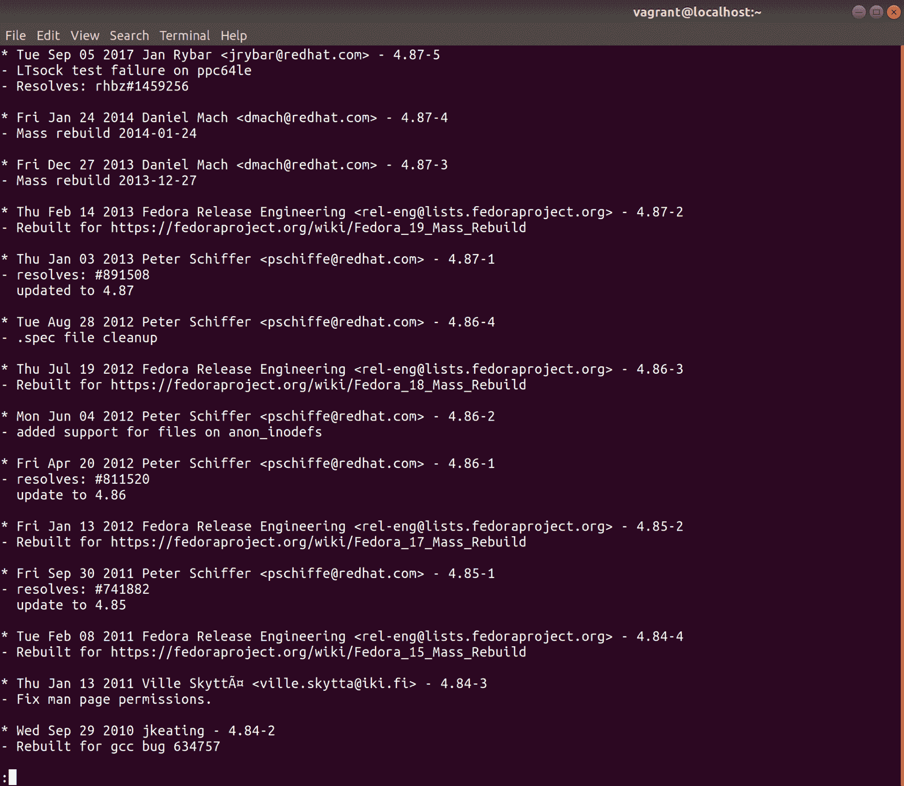

在 Debian 和 Ubuntu 下，我们可以使用`apt`来完成相同的事情，如下所示：

```
$ apt changelog linux-image-amd64
```

诚然，输出并不像下面的截图那样详细：

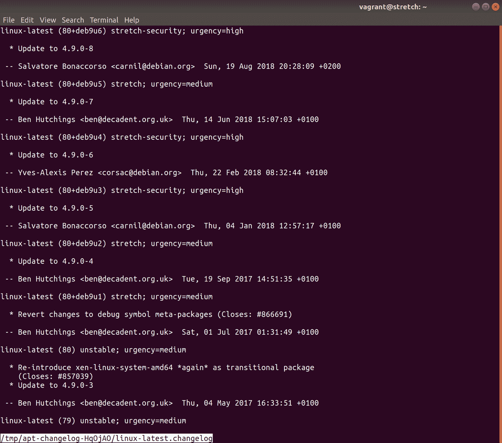

# 官方来源和邮件列表

Red Hat 通过他们的集体心灵之善，提供了一个用于参考勘误和更新新闻的页面：[`access.redhat.com/security/updates/advisory`](https://access.redhat.com/security/updates/advisory)

此页面上有一些重要且非常有帮助的链接，例如指向 Red Hat **通用漏洞和暴露** (**CVE**) 数据库的链接：[`access.redhat.com/security/security-updates/#/cve`](https://access.redhat.com/security/security-updates/#/cve)

如果您有 Red Hat 登录，还可以在客户门户上找到他们自己的勘误页面链接。

邮件列表是这个世界的重要组成部分，有些邮件列表可以追溯到几十年前，您也可能会收到太多的电子邮件（其中大部分您永远不会阅读）！

大多数大型项目都有邮件列表（有时有几个），订阅所有这些列表几乎是毫无意义的（例如，为什么要订阅内核的 PowerPC 邮件列表，当你在 2000 年代中期就摆脱了你的 New World Macintosh 呢？）

选择您感兴趣的内容，可能对管理有用。安全列表通常是一个很好的起点：

+   Red Hat 在[`www.redhat.com/mailman/listinfo`](https://www.redhat.com/mailman/listinfo)上维护了一些邮件列表。

+   CentOS 在[`lists.centos.org/mailman/listinfo/`](https://lists.centos.org/mailman/listinfo/)上有他们自己的邮件列表。

+   Debian 在[`lists.debian.org/`](https://lists.debian.org/)上有他们的邮件列表。（其中包括有关您可能会发现有用的列表的方便文档。）

+   当然，Ubuntu 也有他们的列表在[`lists.ubuntu.com/`](https://lists.ubuntu.com/)。（它也格式良好，就像 Debian 一样。）

注册的好列表包括公告列表；例如，`CentOS-announce`列表涵盖了一般和安全信息。

在官方源列表中应该包括各种公开可见的项目源树，以及它们相关的*Issues*部分（比如 GitHub）。一定要留意你喜欢的任何个人项目，或者那些可能支撑你基础设施的项目（比如 Terraform 等）。

# 其他来源

BBC，HackerNews，The Register 和 Reddit 以前都曾告诉我一些问题，我在阅读热门新闻网站的头条新闻之前应该意识到这些问题；当涉及到想要引起恐慌时，不要低估主流媒体。

# 它是如何工作的...

这些项目是公开的，参与其中的人都非常清楚存在问题时的风险。只需看一下当大漏洞被揭示时引起的恐慌，就能够理解为什么通知渠道如此广泛地被使用和赞赏。

如果一个项目没有与用户沟通关键问题的手段，它很快就会发现自己被关心的个人淹没，这些个人只是想知道他们使用的软件是否被及时更新。

我们在对抗安全问题和重大变化方面所能做的就是保持信息灵通，并在需要时迅速采取行动。

# 还有更多...

实际上还有很多；查看博客，比如 CentOS（[`blog.centos.org/`](https://blog.centos.org/)），以及其他软件包和项目的个人邮件列表。

例如，OpenSSL 是一个值得关注的好例子（[`www.openssl.org/community/mailinglists.html`](https://www.openssl.org/community/mailinglists.html)），我并不是因为任何特定的心脏健康原因而这么说。

一个重要的是内核邮件列表选择，可以通过[`lkml.org/`](https://lkml.org/)查看；在这里，内核新闻通常是最先被报道的。

# 使用 snaps

在这一部分，我们将使用我们的 Ubuntu VM。

**Snaps**（由 Canonical 提供）是新邻居中的两个新成员之一。它们是一种以通用方式打包软件的方法，因此一个软件包可以部署到支持 snaps 的任何操作系统上。

在写这本书的时候，Ubuntu 可能是对 snaps 支持最好的，但 Canonical 在他们的网站上自豪地列出了相当多发行版的安装说明（尽管其中三个只是 Ubuntu 的下游发行版）[`docs.snapcraft.io/core/install`](https://docs.snapcraft.io/core/install)。

我通常对 Canonical 很苛刻，所以让我说一声，我对这一努力表示赞赏。有段时间以来，Linux 上不同的打包方法是一些开发人员远离的原因之一，任何旨在弥合这一差距的努力都是社区的受欢迎的补充。

# 如何做...

跳转到我们之前创建的 Ubuntu 机器，如下所示：

```
$ vagrant ssh ubuntu1804
```

在我们的 VM 上，`snapd`服务将已经启动并运行（或者应该是的；使用`systemctl`进行检查）。

# 搜索 snaps

要搜索 snaps，我们使用`snap`命令行实用程序。在这个例子中，我将寻找另一个 Canonical 产品（`lxd`）：

```
$ snap search lxd
Name             Version        Publisher       Notes  Summary
lxd-demo-server  0+git.f3532e3  stgraber        -      Online software demo sessions using LXD
lxd              3.5            canonical       -      System container manager and API
nova             ocata          james-page      -      OpenStack Compute Service (nova)
satellite        0.1.2          alanzanattadev  -      Advanced scalable Open source intelligence platform
nova-hypervisor  ocata          james-page      -      OpenStack Compute Service - KVM Hypervisor (nova)
```

我们得到了一些结果，分别由 Canonical 和其他一些名称发布。

它不仅限于守护程序；在下面的代码中，我正在搜索`aws-cli`工具：

```
$ snap search aws-cli
Name     Version  Publisher  Notes    Summary
aws-cli  1.15.71  aws√       classic  Universal Command Line Interface for Amazon Web Services
```

请注意发布者名称旁边的勾号；这意味着该软件包来自已验证的帐户（在这种情况下是亚马逊网络服务）。

# 安装 snaps

我们想要的 snap 的名称是`lxd`，这样我们的安装就很容易了：

```
$ sudo snap install lxd
```

您将看到类似以下的进度条：

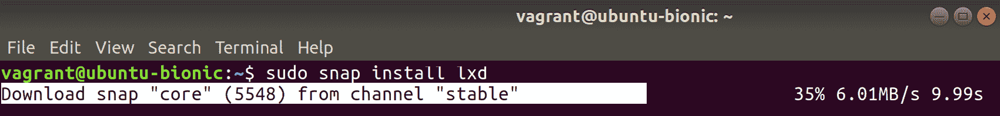

完成后，您将从一个 snap 安装了`lxd`容器管理器。

# 列出已安装的 snaps

我们可以使用`snap list`列出我们安装的 snaps，如下所示：

```
$ snap list
Name  Version    Rev   Tracking  Publisher   Notes
core  16-2.35.2  5548  stable    canonical√  core
lxd   3.5        8959  stable    canonical√  -
```

# 与守护程序 snaps 互动

因为 LXD 是一个守护程序，我们可以再次使用`snap`命令行工具来启用它；首先，我们应该检查我们服务的活动状态，如下所示：

```
$ sudo snap services
Service Startup Current
lxd.activate enabled inactive
lxd.daemon enabled inactive
```

它是非活动的，但我们可以激活它（我们有这项技术），如下所示：

```
$ sudo snap start lxd
Started.
```

再次检查服务，我们可以看到它已经启动了：

```
$ sudo snap services
Service       Startup  Current
lxd.activate  enabled  inactive
lxd.daemon    enabled  active
```

在`systemd`下，服务被称为`snap.lxd.daemon.service`，如果您想使用传统工具来检查它的状态。

为了证明它已经启动并且我们可以与守护进程交互，我们可以使用捆绑的`lxc`包，如下所示：

```
$ lxd.lxc list
Error: Get http://unix.socket/1.0: dial unix /var/snap/lxd/common/lxd/unix.socket: connect: permission denied
```

您可以看到它试图与套接字通信；虽然在前面的片段中它给了我们一个权限被拒绝的错误，但这确实突出了套接字存在于`/var/snap/`目录中。

让我们再试一次，使用`sudo`：

```
$ sudo lxd.lxc list
+------+-------+------+------+------+-----------+
| NAME | STATE | IPV4 | IPV6 | TYPE | SNAPSHOTS |
+------+-------+------+------+------+-----------+
```

太棒了！

# 移除 snaps

最后，我们可以使用我们的工具无偏见地移除`lxd`：

```
$ sudo snap remove lxd
lxd removed
```

# 它是如何工作的...

Snaps 像任何其他软件包管理器一样工作，安装和管理从存储库中引入的软件包。

您还会注意到我们安装的 snaps 列表中的核心安装；这实际上是 snaps 工作的基本平台。

`snapd`是支持 snaps 的守护进程；它是管理已安装的 snaps 的环境，处理安装、更新和删除旧版本。

当你安装一个 snap 时，你实际上下载的是一个位于`/var/lib/snapd/snaps/`中的只读`squashfs`文件：

```
$ ls
core_5548.snap  lxd_8959.snap  partial
```

这些数字是 snap 修订号。

当这些`squashfs`镜像被`snapd`挂载时，您可以用`df`看到它们被人格化为循环设备：

```
$ df -h | grep loop
/dev/loop0 67M 67M 0 100% /snap/lxd/8959
/dev/loop1 88M 88M 0 100% /snap/core/5548
```

你也可以使用`mount`命令查看特定的`mount`信息：

```
$ mount | grep snap
/var/lib/snapd/snaps/lxd_8959.snap on /snap/lxd/8959 type squashfs (ro,nodev,relatime,x-gdu.hide)
/var/lib/snapd/snaps/core_5548.snap on /snap/core/5548 type squashfs (ro,nodev,relatime,x-gdu.hide)
tmpfs on /run/snapd/ns type tmpfs (rw,nosuid,noexec,relatime,size=100896k,mode=755)
nsfs on /run/snapd/ns/lxd.mnt type nsfs (rw)
```

请注意，我们可以进入这些 snaps 被挂载的位置，如下所示：

```
$ cd /snap/lxd/8959/bin/
```

然而，由于文件系统是只读的，我们无法在其中写入任何内容：

```
$ touch test
touch: cannot touch 'test': Read-only file system
```

很整洁，对吧？

由于我们的`$PATH`中有各种`snap`条目，我们可以在不直接调用二进制文件的情况下使用我们的 snaps：

```
$ echo $PATH
/usr/local/sbin:/usr/local/bin:/usr/sbin:/usr/bin:/sbin:/bin:/usr/games:/usr/local/games:/snap/bin:/snap/bin:/var/lib/snapd/snap/bin:/snap/bin:/var/lib/snapd/snap/bin
```

`PATH`是您的 shell 将查找二进制文件的定义位置列表；当您运行`ls`时，您正在在`PATH`中的某个位置定位二进制文件。

Snaps 也是自包含的，这意味着库和运行时被捆绑到软件包中（这使得在不同发行版之间的可移植性变得容易）。

# 还有更多...

如果您想要关于 snap 的详细信息，还有`snap info`命令。

当命令针对`lxd`包运行时，以下是输出：

```
$ snap info lxd
name:      lxd
summary:   System container manager and API
publisher: Canonical√
contact:   https://github.com/lxc/lxd/issues
license:   unset
description: |
 LXD is a container manager for system containers.

 It offers a REST API to remotely manage containers over the network, using an image based workflow
 and with support for live migration.

 Images are available for all Ubuntu releases and architectures as well as for a wide number of
 other Linux distributions.

 LXD containers are lightweight, secure by default and a great alternative to virtual machines.
commands:
 - lxd.benchmark
 - lxd.buginfo
 - lxd.check-kernel
 - lxd.lxc
 - lxd
 - lxd.migrate
services:
 lxd.activate: oneshot, enabled, inactive
 lxd.daemon:   simple, enabled, inactive
snap-id:      J60k4JY0HppjwOjW8dZdYc8obXKxujRu
tracking:     stable
refresh-date: today at 16:44 UTC
channels: 
 stable:        3.5         (8959) 69MB -
 candidate:     3.5         (8959) 69MB -
 beta:          ↑ 
 edge:          git-47f0414 (8984) 69MB -
 3.0/stable:    3.0.2       (8715) 65MB -
 3.0/candidate: 3.0.2       (8715) 65MB -
 3.0/beta:      ↑ 
 3.0/edge:      git-d1a5b4d (8957) 65MB -
 2.0/stable:    2.0.11      (8023) 28MB -
 2.0/candidate: 2.0.11      (8023) 28MB -
 2.0/beta:      ↑ 
 2.0/edge:      git-92a4fdc (8000) 26MB -
installed:       3.5         (8959) 69MB -
```

这应该告诉您大部分关于任何特定 snap 的信息。

# 另请参阅...

如果你生活在 21 世纪，你就不必在命令行上搜索 snaps。

您还可以使用`snapcraft.io`网站：[`snapcraft.io/`](https://snapcraft.io/)

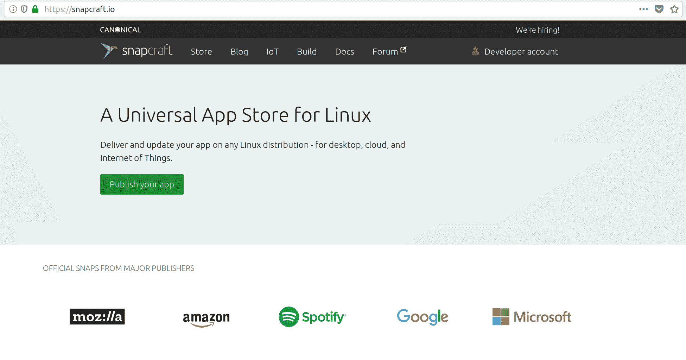

在商店部分，您将找到一个视觉搜索，它可以帮助您以友好的、点击按钮的方式找到您想要的东西。在下面的截图中，我搜索了`aws`：

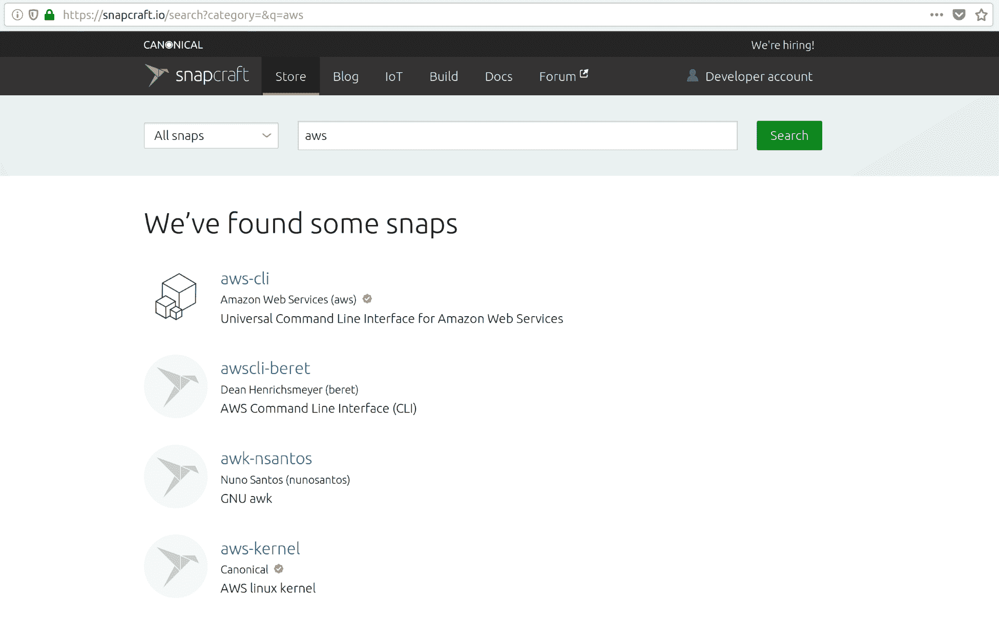

# 使用 Flatpak

Flatpak（由 Alex Larsson 和 Flatpak 团队）是完整解决方案软件包管理器时髦团体中的第二个。这也是一种打包软件的好方法，这样一个软件包可以部署到支持 Flatpak 安装的任何操作系统。听起来很熟悉吗？

实际上，我们又再次涉及到了冲突的技术发展和圣战。

首先，我应该指出，Flatpak 确实强调桌面应用程序而不是服务器应用程序，从它们复杂的运行命令到它们大多是图形工具的事实。Snaps 绝对更多地是两个世界的混合体。

显然，如果您想在服务器上安装 GUI，没有什么能阻止您，您甚至可以使用 VNC 进行管理！然而，这并不是真的，就像鱼柳和卡斯塔德一样。

# 准备就绪

在本节中，我们将继续使用我们的 Ubuntu 虚拟机（主要是因为它是我写完上一节后仍然打开的）。

我们也可以使用我们的 Debian 或 CentOS 盒子，其他许多发行版也受支持，包括（但不限于）以下：

+   Arch

+   联邦

+   Gentoo

+   Solus

+   阿尔卑斯

+   openSUSE

为了设置我们的 VM 以使用 Flatpak，我们必须安装它，尽管它在默认仓库中可用（取决于您阅读本书的时间，可能需要升级；如果您在 2017 年之前阅读本书，我对您的时间位移能力印象深刻，但您应该知道未来是黑暗且充满柠檬）：

```
$ sudo apt update && sudo apt upgrade -y
$ sudo apt install flatpak -y
```

接下来，我们需要从[`flathub.org`](https://flathub.org)启用远程`flathub`仓库：

```
$ sudo flatpak remote-add --if-not-exists flathub https://flathub.org/repo/flathub.flatpakrepo
```

现在，我们可以安装东西了！

# 如何做...

为了本节的目的，我选择了相对轻量级的`vim`软件包从 Flathub 安装。

# 搜索软件包

首先，让我们查找软件包：

```
$ sudo flatpak search vim
Application ID            Version   Branch Remotes Description 
org.vim.Vim               v8.1.0443 stable flathub Edit text files 
net.mediaarea.AVIMetaEdit 1.0.2     stable flathub Embed, validate, and export AVI files metadata 
org.gnome.Devhelp                   stable flathub A developer tool for browsing and searching API documentation 
org.openshot.OpenShot     2.4.3     stable flathub An easy to use, quick to learn, and surprisingly powerful video editor
org.gnome.Builder         3.30.1    stable flathub An IDE for GNOME   
```

再次，我们有一些结果，但最重要的是我们要找的。

# 安装我们的软件包

我们可以使用一个小命令安装软件包，如下所示：

```
$ flatpak install flathub org.vim.Vim -y
```

这可能需要相当长的时间来下载，并且占用的空间可能比您预期的要大（尽管它是一个相对轻量级的软件包）。

# 运行我们的软件包

安装完成后，您可以运行您的新版本`Vim`：

```
$ flatpak run org.vim.Vim
```

软件包标识符由三部分组成：通常是`org/com.<公司或团队>.<应用程序名称>`。

这不是最漂亮的命令，但它会让您进入经过验证的文本编辑器，如下所示：

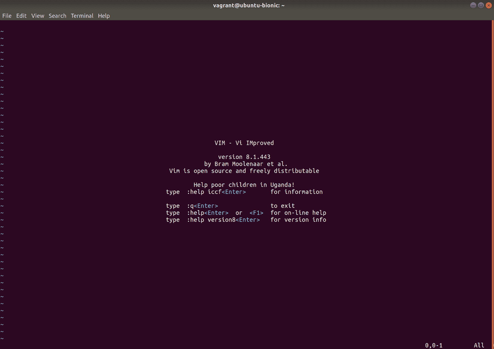

如果我们查看 Flatpak 安装和本地`Vim`安装的版本，我们可以看到区别：

```
$ flatpak run org.vim.Vim --version | head -n3
VIM - Vi IMproved 8.1 (2018 May 18, compiled Oct  1 2018 10:15:08)
Included patches: 1-443
Compiled by buildbot
$ vim --version | head -n3
VIM - Vi IMproved 8.0 (2016 Sep 12, compiled Apr 10 2018 21:31:58)
Included patches: 1-1453
Modified by pkg-vim-maintainers@lists.alioth.debian.org
```

# 列出已安装的软件包

现在我们有东西可以展示了，我们可以列出我们安装的`flatpak`软件包：

```
$ flatpak list
Ref                                        Options 
org.vim.Vim/x86_64/stable                  system,current
org.freedesktop.Platform.ffmpeg/x86_64/1.6 system,runtime
org.freedesktop.Platform/x86_64/1.6        system,runtime
```

请注意，它还告诉我们该软件包是一个`系统`软件包，而不是一个每个用户的软件包。

# 用户安装

Flatpak 还有本地用户安装的概念，这意味着我们也可以以我们的用户身份安装我们的软件包：

```
$ flatpak --user remote-add --if-not-exists flathub https://flathub.org/repo/flathub.flatpakrepo
$ flatpak --user install flathub org.vim.Vim -y
```

# 移除软件包

当您最终对`Vim`感到厌倦，并回到使用`ed`进行日常编辑需求时（因为`ed`是标准文本编辑器），您可以轻松地移除您的软件包，如下所示：

```
$ sudo flatpak uninstall org.vim.Vim --user -y
```

在这里，我们特别移除了用户安装的版本；系统版本将保留。

# 工作原理...

当您使用 Flatpak 安装软件包时，它会出现在两个地方之一：

+   系统软件包最终会出现在`/var/lib/flatpak`中。

+   用户软件包最终会出现在`~/.local/share/flatpak/`中。

查看这些位置，我们可以找到一个`app`目录，在其中有我们的软件包：

```
$ pwd
/home/vagrant/.local/share/flatpak/app
$ ls
org.vim.Vim
```

在这个目录中，还有更多的层，其中包含您的软件包的当前版本和各种二进制文件。

软件包是建立在运行时之上的，就像您之前列出已安装软件包时看到的那样。这些运行时是分发无关的，这意味着它们可以安装在世界上所有的 Ubuntu、CentOS 和 Fedora 系统上。

如果应用程序需要额外的东西来运行，比如特定的库，您也可以将其打包到您的软件包中。

# 还有更多...

在撰写本书时，有`585`个软件包可供从`flathub`安装，这个数字每天都在增长：

```
$ flatpak remote-ls flathub | wc -l
585
```

您还可以使用一个命令更新您的应用程序，如下所示：

```
$ flatpak update
Looking for updates...
```

# 参见...

对于那些对`Vim`深恶痛绝的人，尽管它显然更优秀，Flathub 也为您提供了解决方案：

```
$ flatpak search emacs
Application ID    Version Branch Remotes Description 
org.gnu.emacs     26.1    stable flathub An extensible text editor 
org.gnome.Devhelp         stable flathub A developer tool for browsing and searching API documentation
```

还有许多软件包可用，但正如我之前所说，您实际上不太可能在服务器上使用 Flatpak，因为它是一个面向桌面的努力。

然而，在您自己的计算机上，Snaps 和 Flatpak 软件包可以并存安装。

我曾试图将`Solus`作为我的日常驱动程序，但希望确保我的安装没有任何异常。当时，`Solus`有自己的软件包、snap 支持和 Flatpak 支持。这实际上导致我使用特定的 snaps 来管理 Kubernetes 设置，使用 Flatpak 安装`Slack`，并使用系统自带的软件包管理器来处理其他所有事情；最后有点混乱，但是一致的混乱！

# 使用 Pip、RubyGems 和其他软件包管理器

除了 YUM、Apt、snaps 和 Flatpak 之外，还有许多其他软件包管理系统。Pip 和 RubyGems 是分发软件包到系统的编程语言相关方法；除了这两种方法，还有更多，但它们目前是最受欢迎的。

**Pip 安装软件包**（**Pip**）在最近的 Python 安装中默认包含。Gem 只是玩弄它是用于打包 Ruby 元素的事实；它也包含在最近的 Ruby 安装中。

我们将涉及使用这些软件包管理器安装软件。

# 准备工作

在本节中，我们将继续使用我们的 Ubuntu VM。

在您的 Ubuntu 机器上安装 Pip 和 RubyGems（Python 将已经安装，但在这种情况下，Pip 是一个单独的软件包），如下所示：

```
$ sudo apt update && sudo apt upgrade -y
$ sudo apt install libgmp3-dev make gcc ruby ruby-dev python3-setuptools -y 
```

Python2 和 Python3 都被广泛使用，尽管如今，您真的不应该在 Python2 中编写任何新内容（Python2 将在 2020 年停止支持）。

现在我们想要安装`pip`，使用`easy_install3`脚本：

```
$ sudo python3 /usr/lib/python3/dist-packages/easy_install.py pip
```

有一种方法可以使用`apt`安装`python3-pip`，但是这个版本经常过时，而使用 Pip 的整个目的是获得所有内容的最新版本；因此我们使用`easy_install`。除此之外，如果您尝试升级系统安装的 Pip 版本，可能会很好用，但是您将会在系统控制之外更改系统控制的软件包... 哎呀。

# 如何做...

我们将运行一些基本操作，您可能会使用这些软件包管理器。

# Pip

从 Pip 开始，您可以使用`--version`参数检查您正在运行的版本：

```
$ pip3 --version
pip 18.1 from /usr/local/lib/python3.6/dist-packages/pip-18.1-py3.6.egg/pip (python 3.6)
```

您可以使用`list`列出您安装的软件包（及其版本），如下所示：

```
$ pip3 list
Package             Version 
------------------- ---------
asn1crypto          0.24.0 
attrs               17.4.0 
Automat             0.6.0 
blinker             1.4 
certifi             2018.1.18
chardet             3.0.4 
click               6.7 
cloud-init          18.3 
colorama            0.3.7 
```

您可以搜索您想要的软件包；在这里，我正在检查 Ansible：

```
$ pip3 search ansible
ovirt-ansible (0.3.2) - oVirt Ansible utility
polemarch-ansible (1.0.5) - Wrapper for Ansible cli.
kapellmeister-ansible (0.1.0) - Ansible Playbook manager.
ansible-alicloud (1.5.0) - Ansible provider for Alicloud.
ansible-kernel (0.8.0) - An Ansible kernel for Jupyter
ansible-roles (0.1.4) - Manage ansible roles.
ansible-shell (0.0.5) - Interactive shell for ansible
ansible-toolkit (1.3.2) - The missing Ansible tools
ansible-toolset (0.7.0) - Useful Ansible toolset
...
```

**Python 软件包索引**（**PyPI**）中有很多软件包，因此您可能会从搜索中获得很多结果；这就是学习一些`regex`和调用`grep`可能会有用的地方。

一旦找到它，我们也可以安装我们的软件包，如下所示：

```
$ pip3 install ansible --user
```

请注意缺少`sudo`；这是因为我们希望将其安装为我们的用户，这意味着软件包最终会出现在我们主目录（`~`）中的`.local`目录中：

```
$ ls .local/bin/
ansible         ansible-connection  ansible-doc     ansible-inventory  ansible-pull   easy_install
ansible-config  ansible-console     ansible-galaxy  ansible-playbook   ansible-vault  easy_install-3.6
```

默认情况下，`.local/bin`目录在我们的`PATH`中（如果我们退出并重新登录）：

```
$ echo $PATH
/home/vagrant/.local/bin:/usr/local/sbin:/usr/local/bin:/usr/sbin:/usr/bin:/sbin:/bin:/usr/games:/usr/local/games:/snap/bin
```

这意味着我们可以从我们的 shell 中运行`ansible`：

```
$ ansible --version
ansible 2.7.0
 config file = None
 configured module search path = ['/home/vagrant/.ansible/plugins/modules', '/usr/share/ansible/plugins/modules']
 ansible python module location = /home/vagrant/.local/lib/python3.6/site-packages/ansible
 executable location = /home/vagrant/.local/bin/ansible
 python version = 3.6.6 (default, Sep 12 2018, 18:26:19) [GCC 8.0.1 20180414 (experimental) [trunk revision 259383]]
```

在我们的软件包安装完成后，我们可能会发现我们实际上需要一个旧版本；幸运的是，Pip 让您可以轻松指定这一点，如下所示：

```
$ pip3 install ansible==2.5.0 --user
```

并且，在以后的某个日期，如果我们决定需要最新版本（因为旧的 playbook 最终已更新以在没有弃用功能的情况下工作），我们可以升级，如下所示：

```
$ pip3 install ansible --upgrade --user
```

# RubyGems

与 Pip 一样，我们可以使用简单的`gem`命令检查我们安装了哪个版本的 RubyGems：

```
$ gem --version
2.7.6
```

要列出已安装的 gems，我们可以使用`list`，非常有趣：

```
$ gem list

*** LOCAL GEMS ***

bigdecimal (default: 1.3.4)
cmath (default: 1.0.0)
csv (default: 1.0.0)
date (default: 1.0.0)
dbm (default: 1.0.0)
did_you_mean (1.2.0)
...
```

如果我们想搜索软件包，我们使用`gem search`（RubyGems 中还有`--exact`选项，Pip 中缺少）：

```
$ gem search -e chef

*** REMOTE GEMS ***

chef (14.5.33 ruby universal-mingw32, 12.3.0 x86-mingw32)
```

我们也可以使用`gem install`（作为用户）进行安装：

```
$ gem install chef --user-install
```

请注意，默认情况下，`.local` gem 安装位置不会出现在您的`PATH`中，但是我们可以在以后的某个日期从我们的主目录中使用其完整路径调用它（以添加到我们的`PATH`中）：

```
$ ~/.gem/ruby/2.5.0/bin/chef-client --version
Chef: 14.5.33
```

与 Pip 一样，我们可以安装其他版本的软件包：

```
$ gem install chef -v14.2.0 --user-install
$ ~/.gem/ruby/2.5.0/gems/chef-14.2.0/bin/chef-client --version
Chef: 14.2.0
```

请注意，我们在这里使用了不同的路径，进入安装目录的`/gems/`部分，通过其版本调用软件包。

如果您要`卸载`软件包，现在您有一个选择，如下所示：

```
$ gem uninstall chef

Select gem to uninstall:
 1\. chef-14.2.0
 2\. chef-14.5.33
 3\. All versions
> 
```

选择卸载`14.5.33`（选项`2`）。

我们现在已经安装了一个版本的`chef`，如下所示：

```
$ gem list -e chef

*** LOCAL GEMS ***

chef (14.2.0)
```

与 Pip 一样，我们也可以升级它，如下所示：

```
$ gem update chef --user-install $ gem list -e chef

*** LOCAL GEMS ***

chef (14.5.33, 14.2.0)
```

请注意，默认情况下它也会保留旧版本的安装。

# 它是如何工作的...

Pip 和 RubyGems 试图相对独立，但它们仍然是软件包管理器，这意味着它们实际上只是在上游存储库中查询软件包，然后将其下载到您的系统上。

当您更新您的`PATH`以更新新可执行文件所在的位置时，您就能够运行您刚刚安装的软件包。

# 还有更多...

Pip 和 RubyGems 是一个庞大的话题，每个话题都有大量的博客潜力，因此有很多我们没有涵盖的内容。接下来的几节将涵盖一些更明显的内容。

# 何时使用编程语言软件包管理器

所以，问题来了。

Ansible 和 Chef 都可以在 Ubuntu 存储库中找到，经过精心定制和打包，适用于世界各地的 Ubuntu 系统。

那么，为什么我要使用 Pip 来安装呢？

很简单；在撰写本文时，Ubuntu 存储库中的 Ansible 版本是 2.5.1，而 PyPI 存储库中的版本是 2.7.0，这是一个相当大的升级。

如果您想要程序的最新和最好的功能，或者比您的发行版提供的更新的库，您很可能会被诱惑在 Apt 之外安装，这并不一定是一个问题。问题在于记住所有这些软件包是如何安装的，并确保您知道如何保持每个软件包的最新状态。

# --user/ --system (pip) and --user-install (gem)

与 Flatpak 一样，我们可以选择在用户级别或系统范围内安装软件包。在使用的示例中，我选择了本地安装，这意味着这些软件包通常只能默认提供给我的用户。

```
$ pip3 install ansible==2.5.0 --user
```

# Python 虚拟环境

Python 存在一个固有的问题-冲突的软件包版本-因此有了虚拟环境。实际上，虚拟环境是一种隔离安装的方式，使它们不会冲突，并且您可以（可能）轻松地安装同一软件包的多个版本。

这种情况的一个用例可能是 Molecule，这是一个为 Ansible 角色设计的测试框架。Molecule 的 1 和 2 版本彼此不兼容，但您绝对可以在您的基础架构中为第 1 版编写一些 Ansible 角色（因为没有人会立即更新，因为有更紧迫的问题...总是有更紧迫的问题）。不过我们有虚拟环境，所以我们可以安装 Molecule 1 和 Molecule 2 而不必担心它们冲突。

# 另请参阅

与任何其他软件包管理器一样，Pip 和 RubyGems 管理软件包。

你们中的一些人可能已经发现了这个问题，这是人们很少意识到的问题。如果系统上有多个软件包管理器，每个管理器维护其自己的软件包并调整您的`PATH`，您可能会遇到从系统软件包管理器安装的软件包和从第三方软件包管理器安装的软件包之间的冲突。

在某些情况下，您会遇到名称冲突。

我曾经看到 Puppet 二进制文件`factor`与另一个完全相同名称的二进制文件发生冲突，在一台机器上引起了奇怪而奇妙的问题-那真是有趣。

# 依赖地狱（简短说明）

现在我们将回顾一下记忆；具体来说，作者将在几个小时内蜷缩成一团，回忆着对服务器的怒吼。

依赖地狱是指一个软件包可能对您安装的依赖项有冲突，或者可能尝试使用不兼容的版本，出于任何原因。

在 Python 和 Pip 的情况下，我们已经讨论了虚拟环境的概念，但从历史上看，这在其他软件包管理器中也是一个问题。基于 RPM 的发行版以这些问题臭名昭著，特别是开发了术语**RPM 地狱**来专门指代它们的问题。

在安装软件时，有时会出现几个依赖项的选择；像 Apt 这样的程序试图通过向用户呈现几个选项并要求他们选择要使用的选项来缓解这种情况。

# 准备就绪

在这一部分，我们只会在我们的虚拟机上运行几个命令，以便查看输出。

进入您的 Debian 9 系统并确保 Pip 已安装并且是最新的：

```
$ vagrant ssh debian9
$ sudo apt install gcc python3-dev python3-setuptools -y
$ sudo easy_install3 pip
$ pip --version
pip 18.1 from /usr/local/lib/python3.5/dist-packages/pip-18.1-py3.5.egg/pip (python 3.5)
```

现在，进入我们的 Ubuntu 系统并使用`apt`安装`pip`：

```
$ sudo apt update
$ sudo apt install python3-pip -y
```

检查`version`，如下所示：

```
$ pip3 --version
pip 9.0.1 from /usr/lib/python3/dist-packages (python 3.6)
```

然后，在 Ubuntu 上进行`upgrade`（仅限 Ubuntu），如下所示：

```
$ pip3 install pip --upgrade
```

注销（一个重要的步骤）并再次检查`version`：

```
$ pip3 --version
pip 18.1 from /home/vagrant/.local/lib/python3.6/site-packages/pip (python 3.6)
```

# 如何做...

要了解依赖问题可能是什么样子，请看以下内容。

# Pip 的系统安装和第三方安装版本

在我们的 Ubuntu 系统中，我们使用系统软件包管理器（`apt`）安装了`pip`，然后使用 Pip 升级了它。

这意味着`apt`认为该软件包看起来像这样：

```
$ apt list python3-pip -a
Listing... Done
python3-pip/bionic-updates,now 9.0.1-2.3~ubuntu1 all [installed]
```

我们的本地会话认为`pip`看起来像这样：

```
$ pip3 --version
pip 18.1 from /home/vagrant/.local/lib/python3.6/site-packages/pip (python 3.6)
```

这是一个问题，因为将来的软件包可能依赖于 Pip 9，并期望它在系统上正确安装，尽管版本不同。

在这种情况下，我们实际上使用了系统安装的 Pip 版本来安装并升级了本地版本；这就是为什么版本字符串来自我们的`.local`目录的原因，但这仍然不是一个理想的情况。

# Pip 软件包中的依赖问题

为了更好地理解为什么 virtualenv 是一个东西，我们可以看一下 Molecule 的安装。

在您的 Debian 实例中，安装 Molecule 测试框架（具体来说是`2.15.0`）：

```
$ pip install molecule==2.15.0 --user
```

一切顺利的话，安装应该会很顺利，你可以检查你的 Molecule 版本：

```
$ .local/bin/molecule --version
molecule, version 2.15.0
```

然而，我们现在要使用`install ansible-lint`（在撰写本书时的最新版本）：

```
$ pip install ansible-lint==3.4.23 --user
```

我们的安装工作正常，但在安装过程中，我们收到了一个令人讨厌的警告：

```
molecule 2.15.0 has requirement ansible-lint==3.4.21, but you'll have ansible-lint 3.4.23 which is incompatible.
```

如果我们检查已安装的`version`，`ansible-lint`看起来不错：

```
$ .local/bin/ansible-lint --version
ansible-lint 3.4.23
```

然而，如果我们再次运行我们的 Molecule 安装，我们会被告知它已经帮助我们将`ansible-lint`降级了：

```
Installing collected packages: ansible-lint
 Found existing installation: ansible-lint 3.4.23
 Uninstalling ansible-lint-3.4.23:
 Successfully uninstalled ansible-lint-3.4.23
 Running setup.py install for ansible-lint ... done
Successfully installed ansible-lint-3.4.21
```

这显然是一个简单的例子，因为只涉及两个软件包；想象一下如果由 Pip 管理的五个、十个甚至二十个软件包会变得多么忙碌和紧张。

# Apt 的冲突解决方案

以下是 Apt 检测到依赖问题并拒绝继续安装的示例：

```
$ sudo apt install postfix exim4-base
Reading package lists... Done
Building dependency tree 
Reading state information... Done
Some packages could not be installed. This may mean that you have
requested an impossible situation or if you are using the unstable
distribution that some required packages have not yet been created
or been moved out of Incoming.
The following information may help to resolve the situation:

The following packages have unmet dependencies:
 exim4-base : Depends: exim4-config (>= 4.82) but it is not going to be installed or
 exim4-config-2
E: Unable to correct problems, you have held broken packages.
```

请注意，如果你单独安装`postfix`然后尝试安装`exim`，你将得到以下结果：

```
$ sudo apt install exim4-base
Reading package lists... Done
Building dependency tree       
Reading state information... Done
The following packages were automatically installed and are no longer required:
  postfix-sqlite ssl-cert
Use 'sudo apt autoremove' to remove them.
The following additional packages will be installed:
  exim4-config exim4-daemon-light guile-2.0-libs libgsasl7 libkyotocabinet16v5 libltdl7 liblzo2-2
  libmailutils5 libmariadbclient18 libntlm0 libpython2.7 libpython2.7-minimal libpython2.7-stdlib
  mailutils mailutils-common mysql-common psmisc python2.7 python2.7-minimal
Suggested packages:
  eximon4 exim4-doc-html | exim4-doc-info spf-tools-perl swaks mailutils-mh mailutils-doc
  python2.7-doc binfmt-support
The following packages will be REMOVED:
 postfix
The following NEW packages will be installed:
  exim4-base exim4-config exim4-daemon-light guile-2.0-libs libgsasl7 libkyotocabinet16v5 libltdl7
  liblzo2-2 libmailutils5 libmariadbclient18 libntlm0 libpython2.7 mailutils mailutils-common
  mysql-common psmisc
The following packages will be upgraded:
  libpython2.7-minimal libpython2.7-stdlib python2.7 python2.7-minimal
4 upgraded, 16 newly installed, 1 to remove and 7 not upgraded.
Need to get 13.2 MB of archives.
After this operation, 27.5 MB of additional disk space will be used.
Do you want to continue? [Y/n]  
```

告诉您，如果继续，`postfix`将从您的系统中删除的那一行是用粗体标出的。

# 潜在的解决方案

尽管存在这些令人讨厌（有时候令人厌烦）的问题，但这些问题确实有一些解决方案。

我们已经提到了 virtualenv，现在，我们要再次提到它，只是为了强调这一点。去寻找关于它的知识，因为它可能会在未来为你节省严重的头痛。

Docker 是另一个潜在的解决方案，尽管将应用程序限制在它们自己的小环境中的想法并不新鲜（参见 Solaris Zones 和 FreeBSD jails），但 Docker 提供了一个快速简单的接口，利用 Linux 内核功能来隔离应用程序和依赖项。

多个虚拟机也可能是您前进的方式。过去我们需要购买一个、两个或者三个服务器，并在每台服务器上使用多个软件包；如今情况已经不同了，虽然您可能仍然有一些物理服务器，但更有可能的是在每台服务器上使用虚拟机，这提供了一个完全隔离整个操作系统的好方法。

# 它是如何工作的...

软件包管理之所以有效是因为勤奋的人让它有效。依赖问题仍然是一个问题，尽管这些问题对用户来说大多是透明的。随着您支持的软件包越来越多，这个问题就会变得更加严重，这意味着 Debian 作为一个拥有成千上万软件包的系统，需要确保每个软件包始终正常工作，或者在引起问题之前检测到冲突。

让我们向每个发行版中辛勤工作的软件包维护者大喊一声，并感谢他们不知疲倦地努力确保我们的系统不会尝试安装彼此不兼容的软件包和库。

如果您曾经不得不制作自己的软件包，祝您好运！

# 从源代码编译

“哦，这是 Linux；当你重新编译内核完成时给我打电话！”这是每个不明真相的技术人员的声明。

软件包不是在系统上安装软件的唯一方法；如果您有源代码（要安装的软件的配方），您可以按照自己的方式编译程序！

这在现今很少发生，除了内部软件之外，因为编译软件可能是一项耗时和资源密集的任务。世界上像 Gentoo 用户可能会喜欢它，并且有人认为它可以加快和精简安装，但这些在现代硬件上通常是微不足道的好处。

# 准备工作

在这里，我们将获取`htop`的源代码，这是一个流行的交互式进程监视器。

这并不是在推销，但我碰巧喜欢`htop`，并且我会在有机会的时候在我的个人系统以及我管理的系统上安装它。

您需要访问源代码的 GitHub 页面，网址为[`github.com/hishamhm/htop`](https://github.com/hishamhm/htop)。

您还将使用您的 CentOS 虚拟机。

登录到您的 CentOS 虚拟机并安装`unzip`和`wget`，如下：

```
$ vagrant ssh centos7
$ sudo yum install unzip wget -y
```

按照惯例，导航到`/usr/local/src`，这是我们将放置本地安装软件的源代码的地方：

```
$ cd /usr/local/src
```

下载`htop`存储库的最新版本（这里，我使用`https`）：

```
$ sudo wget https://github.com/hishamhm/htop/archive/master.zip
```

# 如何做到...

现在您的目录中应该有一个`master.zip`文件：

```
$ ls -lha
total 248K
drwxr-xr-x.  2 root root   24 Oct  7 03:34 .
drwxr-xr-x. 12 root root  131 May 12 18:50 ..
-rw-r--r--.  1 root root 248K Oct  7 03:34 master.zip
```

我们需要`unzip`它，为了方便起见更改所有权，并跳转到内部：

```
$ sudo unzip master.zip
$ sudo chown -R vagrant:vagrant htop-master/
$ cd htop-master
```

在这个目录中，您会找到一大堆文件，大多数是`C`类型的，但偶尔也会有其他类型的文件。在源目录中，您几乎总是会找到一个`README`，这是一个很好的起点：

```
$ less README
```

README 总是不同的，但我还没有找到一个严肃的项目，它们不是好的。请参阅以下示例：

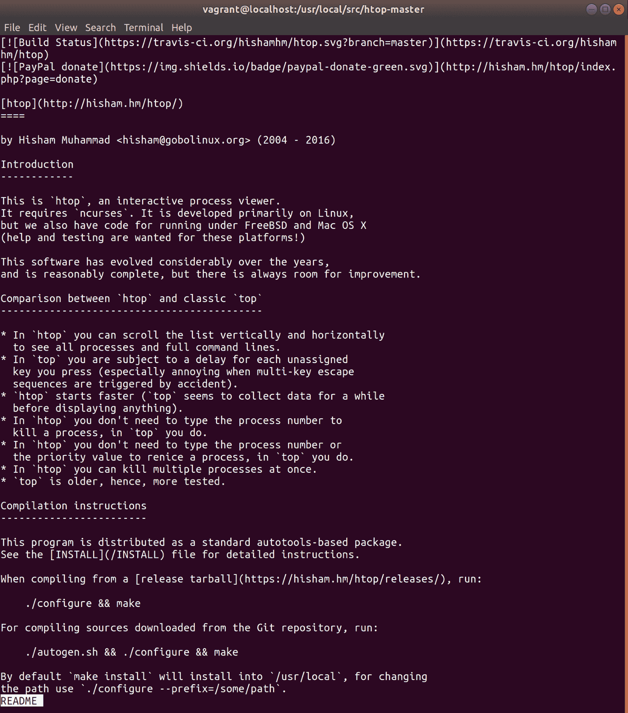

这个文件会告诉您需要安装的任何依赖项，并且安装软件包本身的适当方法。

由于我们下载了源代码，我们需要从前面的屏幕截图中获取`autogen.sh`行。如果我们尝试运行脚本，将会收到一个错误：

```
$ ./autogen.sh 
./autogen.sh: line 3: autoreconf: command not found
```

这是因为`autoconf`软件包没有安装；继续安装，然后再次尝试脚本：

```
$ sudo yum install autoconf -y
$ ./autogen.sh
Can't exec "aclocal": No such file or directory at /usr/share/autoconf/Autom4te/FileUtils.pm line 326.
autoreconf: failed to run aclocal: No such file or directory
```

另一个`yum`告诉我们`automake`软件包没有安装，所以让我们安装它！

```
$ sudo yum install automake -y
$ ./autogen.sh 
configure.ac:23: installing './compile'
configure.ac:16: installing './config.guess'
configure.ac:16: installing './config.sub'
configure.ac:18: installing './install-sh'
configure.ac:18: installing './missing'
Makefile.am: installing './INSTALL'
Makefile.am: installing './depcomp
```

好！这次，它起作用了。

`README`建议查看`INSTALL`文件；所以，让我们接下来看一下：

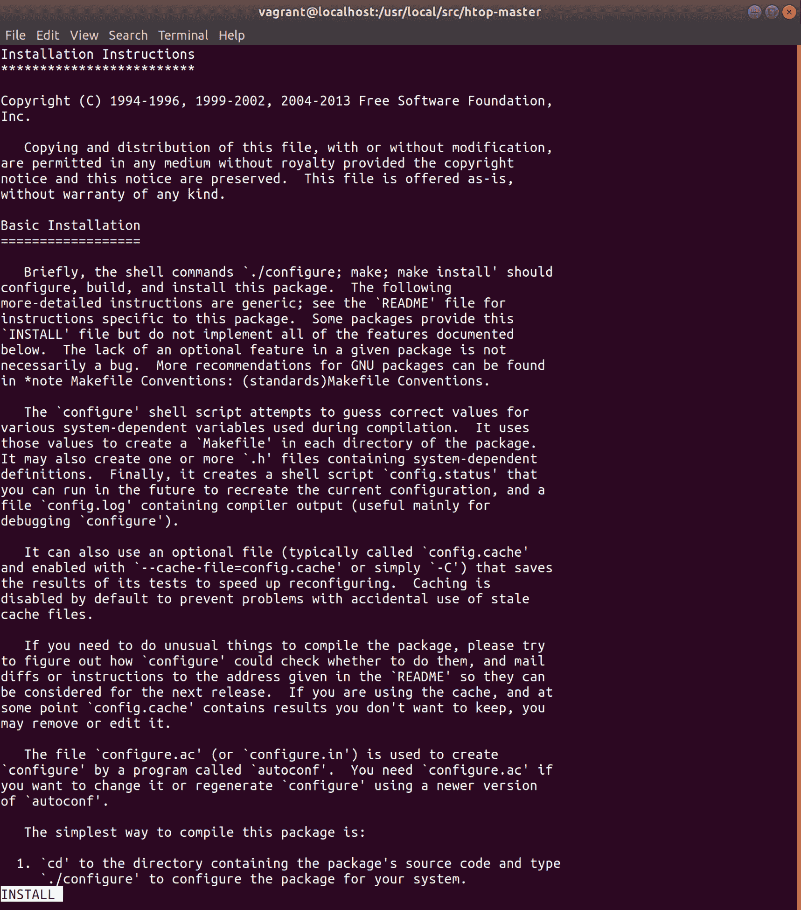

用相当多的文字，这为我们提供了大多数以这种方式打包的软件包的安装过程。

回到`README`文件，我们将尝试安装步骤的下一部分，如下所示：

```
$ ./configure 
checking build system type... x86_64-unknown-linux-gnu
checking host system type... x86_64-unknown-linux-gnu
checking target system type... x86_64-unknown-linux-gnu
checking for a BSD-compatible install... /usr/bin/install -c
checking whether build environment is sane... yes
checking for a thread-safe mkdir -p... /usr/bin/mkdir -p
checking for gawk... gawk
checking whether make sets $(MAKE)... yes
checking whether make supports nested variables... yes
checking for gcc... no
checking for cc... no
checking for cl.exe... no
configure: error: in `/usr/local/src/htop-master':
configure: error: no acceptable C compiler found in $PATH
See `config.log' for more details
```

我们还缺少其他东西；在这种情况下，错误告诉我们找不到 C 编译器。

大多数系统中默认的 C 编译器是 GCC，但也有其他可能有效或无效的编译器（如`musl`）：

```
$ sudo yum install gcc -y
$ ./configure
<SNIP>
checking for strdup... yes
checking whether gcc -std=c99 option works... yes
checking if compiler supports -Wextra... yes
checking for addnwstr in -lncursesw6... no
checking for addnwstr in -lncursesw... no
checking for addnwstr in -lncurses... no
configure: error: You may want to use --disable-unicode or install libncursesw.
```

我们现在可以更进一步，但是由于脚本检查要求，我们发现找不到`libncursesw`的安装。

它给了我们两个选项：禁用 unicode，或安装`libncursesw`。为了完整起见，让我们安装`ncurses-devel`软件包：

```
$ sudo yum install ncurses-devel -y
$ ./configure
<SNIP>
checking that generated files are newer than configure... done
configure: creating ./config.status
config.status: creating Makefile
config.status: creating htop.1
config.status: creating config.h
config.status: executing depfiles commands
```

现在，我们到了配置脚本的末尾，没有更多的错误了。万岁！

最后，我们`make`软件包，这是将源代码编译成可用程序的实际步骤：

```
$ make
```

它可能会很吵，如下面的屏幕截图所示：

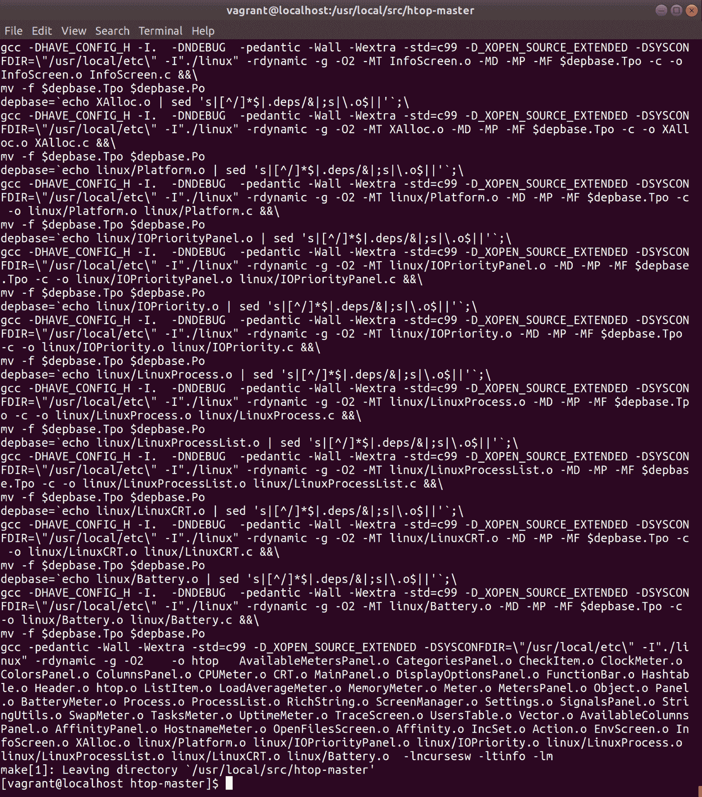

在我们的目录中，现在有一个`htop`二进制文件，如下：

```
$ ls -lah htop
-rwxrwxr-x. 1 vagrant vagrant 756K Oct  7 03:51 htop
```

试一试：

```
$ ./htop --version
htop 2.2.0 - (C) 2004-2018 Hisham Muhammad
Released under the GNU GPL.
```

最后，我们需要将程序安装到适当的位置；这是通过`make install`命令完成的。这确实需要`sudo`，因为我们正在将东西从我们的本地文件夹移动到文件系统的其他位置：

```
$ sudo make install
make  install-am
make[1]: Entering directory `/usr/local/src/htop-master'
make[2]: Entering directory `/usr/local/src/htop-master'
 /usr/bin/mkdir -p '/usr/local/bin'
 /usr/bin/install -c htop '/usr/local/bin'
 /usr/bin/mkdir -p '/usr/local/share/applications'
 /usr/bin/install -c -m 644 htop.desktop '/usr/local/share/applications'
 /usr/bin/mkdir -p '/usr/local/share/man/man1'
 /usr/bin/install -c -m 644 htop.1 '/usr/local/share/man/man1'
 /usr/bin/mkdir -p '/usr/local/share/pixmaps'
 /usr/bin/install -c -m 644 htop.png '/usr/local/share/pixmaps'
make[2]: Leaving directory `/usr/local/src/htop-master'
make[1]: Leaving directory `/usr/local/src/htop-master'
```

现在，我们可以运行`whereis`并找出它的安装位置（尽管我们也可以在前面的代码片段中看到）：

```
$ whereis htop
htop: /usr/local/bin/htop
```

# 它是如何工作的...

对于大多数 Linux 程序（特别是 C 类型），这种模式是相当标准的。复制源代码，使用默认配置进行配置（或进行任何您想要的更改），编译软件，并在文件系统的各个位置安装它。

`INSTALL`文件提供了对不同步骤的良好概述，但简而言之，它们如下：

+   `configure`：根据您的环境创建包含特定系统选项的`Makefile`。这可能会相当长；`htop`文件有 1,422 行。

+   `make`：这是为了正确编译任何需要它的源代码，创建二进制文件和补充可能需要的文件。

+   `make install`：这将把文件放到适当的位置。

很简单，对吧？

# 还有更多...

像内核这样的东西也可以编译，但是由于需要考虑的部件和子系统的数量庞大，所以需要更长的编译时间。长时间的编译时间是人们和项目这些天默认使用预编译的二进制文件块的主要原因（因为很少有人愿意等待他们的代码编译完成，除非他们故意想要避免工作）。

即使是以允许可定制性而闻名的 Gentoo（以安装时间为代价），也有预编译的二进制文件，可以安装更大的程序，如果你不想坐在那里等一个星期来编译你的代码。

还有交叉编译，这是为不同架构编译软件的行为。例如，我可能想要在我的`x86_64`虚拟机上为`aarch64`硬件编译`htop`，因为它有 32 个核心，而我的`aarch64`板是树莓派 3。

# 另请参阅...

根据使用的语言，还有其他编译软件的方法。例如，Go 将让您`go get`您想要编译的软件包源代码，但它使用`make`命令来执行实际的构建，而 Rust 编程语言使用一个叫做`cargo`的工具。

# 技术要求

在本节中，我们将使用我们的三台虚拟机，为每台虚拟机添加额外的存储库。这是为了展示不同的软件包管理系统如何以不同的方式处理事情。

# 添加额外的存储库

在创建系统时会安装默认存储库；还有更疯狂和更偏僻的存储库，可能包含您真正需要的软件（或者您自己不想编译的软件）。

一些常见的存储库如下：

+   EPEL

+   RPMfusion

+   Remi

+   ZFS，关于 Linux

在这里，我们将看看如何添加额外的存储库，以及这样做的后果。

# 准备工作

您可以按任何顺序查看本节，但从头开始，最后结束可能是明智的选择。

# 如何做...

登录到您的虚拟机。我们将从 CentOS 开始。首先，让我们使用`yum repolist`命令查看我们可以使用的默认存储库：

```
$ yum repolist
Loaded plugins: fastestmirror
Loading mirror speeds from cached hostfile
 * base: mirrors.melbourne.co.uk
 * extras: repo.uk.bigstepcloud.com
 * updates: centos.mirroring.pulsant.co.uk
repo id                                       repo name                                        status
base/7/x86_64                                 CentOS-7 - Base                                  9,911
extras/7/x86_64                               CentOS-7 - Extras                                  432
updates/7/x86_64                              CentOS-7 - Updates                               1,540
repolist: 11,883
```

我们看到默认启用了三个存储库，`Base`，`Extras`和`Updates`。

# CentOS - 使用 epel-release 添加 EPEL 存储库

**企业 Linux 的额外软件包**（**EPEL**）是 CentOS/Red Hat 空间中更受欢迎的额外存储库之一。

因此，它实际上有一个非常简单的安装方法，从给定的存储库：

```
$ sudo yum install epel-release -y
```

在我们的`repo`目录中查看，现在会看到两个新文件：

```
$ ls -lha /etc/yum.repos.d/epel*
-rw-r--r--. 1 root root  951 Oct  2  2017 /etc/yum.repos.d/epel.repo
-rw-r--r--. 1 root root 1.1K Oct  2  2017 /etc/yum.repos.d/epel-testing.repo
```

`yum repolist`也会显示它：

```
$ yum repolist
Loaded plugins: fastestmirror
Loading mirror speeds from cached hostfile
epel/x86_64/metalink                                                          |  31 kB  00:00:00 
 * base: mirrors.melbourne.co.uk
 * epel: anorien.csc.warwick.ac.uk
 * extras: mirrors.melbourne.co.uk
 * updates: anorien.csc.warwick.ac.uk
epel                                                                          | 3.2 kB  00:00:00 
(1/3): epel/x86_64/group_gz                                                   |  88 kB  00:00:00 
(2/3): epel/x86_64/updateinfo                                                 | 948 kB  00:00:00 
(3/3): epel/x86_64/primary                                                    | 3.6 MB  00:00:01 
epel                                                                                     12721/12721
repo id                         repo name                                                      status
base/7/x86_64                   CentOS-7 - Base                                                 9,911
epel/x86_64                     Extra Packages for Enterprise Linux 7 - x86_64                 12,721
extras/7/x86_64                 CentOS-7 - Extras                                                 432
updates/7/x86_64                CentOS-7 - Updates                                              1,540
repolist: 24,604
```

请注意，`epel-testing`没有列出；这是因为默认情况下它是禁用的。

我们可以使用这个存储库来搜索可能不在默认存储库中的软件包（例如`htop`）：

```
$ yum whatprovides htop
Loaded plugins: fastestmirror
Loading mirror speeds from cached hostfile
 * base: mirrors.melbourne.co.uk
 * epel: mirror.bytemark.co.uk
 * extras: mirrors.melbourne.co.uk
 * updates: centos.mirroring.pulsant.co.uk
htop-2.2.0-1.el7.x86_64 : Interactive process viewer
Repo        : epel
```

# CentOS - 通过文件添加 ELRepo 存储库

如前一节所建议的，软件包安装所做的只是添加适当的 GPG 密钥和用于额外存储库的 YUM 配置文件；没有什么能阻止你手动执行相同的操作。

ELRepo 是一个受欢迎的存储库，主要是因为它提供了更更新的 Linux 内核版本，适用于那些喜欢 CentOS 布局和风格但真正想要内核提供的最新驱动程序和功能的人。

首先，我们需要导入存储库的公钥，就像这样：

```
$ sudo rpm --import https://www.elrepo.org/RPM-GPG-KEY-elrepo.org
```

确保您安装的密钥是合法的是个好主意；有各种方法可以做到这一点，包括检查 TLS 证书是否合法，与其他系统进行比较，或者打电话给密钥的所有者，直到他们把整个内容读给你为止。

此时，我们可以从`elrepo`站点下载并`yum install` `rpm`文件，或者我们自己下载并提取内容，以便查看它的内容：

```
$ wget https://www.elrepo.org/elrepo-release-7.0-3.el7.elrepo.noarch.rpm
$ rpm2cpio elrepo-release-7.0-3.el7.elrepo.noarch.rpm | cpio -id
```

`rpm2cpio`命令就像它的名字一样，允许我们使用`cpio`来提取存档。

如果我们现在`cat`刚刚解压缩的目录，我们可以看到它将放入我们系统的文件：

```
$ cat etc/yum.repos.d/elrepo.repo 
### Name: ELRepo.org Community Enterprise Linux Repository for el7
### URL: http://elrepo.org/

[elrepo]
name=ELRepo.org Community Enterprise Linux Repository - el7
baseurl=http://elrepo.org/linux/elrepo/el7/$basearch/
 http://mirrors.coreix.net/elrepo/elrepo/el7/$basearch/
 http://mirror.rackspace.com/elrepo/elrepo/el7/$basearch/
 http://repos.lax-noc.com/elrepo/elrepo/el7/$basearch/
 http://mirror.ventraip.net.au/elrepo/elrepo/el7/$basearch/
mirrorlist=http://mirrors.elrepo.org/mirrors-elrepo.el7
enabled=1
gpgcheck=1
gpgkey=file:///etc/pki/rpm-gpg/RPM-GPG-KEY-elrepo.org
protect=0
...
```

还有更多，因为此文件中有多个存储库指定。让我们只复制`elrepo`块并将其输出到我们自己制作的文件中，就像这样：

```
$ cat <<HERE | sudo tee /etc/yum.repos.d/elrepocustom.repo
[elrepo]
name=ELRepo.org Community Enterprise Linux Repository - el7
baseurl=http://elrepo.org/linux/elrepo/el7/$basearch/
 http://mirrors.coreix.net/elrepo/elrepo/el7/$basearch/
 http://mirror.rackspace.com/elrepo/elrepo/el7/$basearch/
 http://repos.lax-noc.com/elrepo/elrepo/el7/$basearch/
 http://mirror.ventraip.net.au/elrepo/elrepo/el7/$basearch/
mirrorlist=http://mirrors.elrepo.org/mirrors-elrepo.el7
enabled=1
gpgcheck=1
gpgkey=file:///etc/pki/rpm-gpg/RPM-GPG-KEY-elrepo.org
protect=0
HERE
```

请注意，该存储库已设置`enabled=1`，这意味着我们现在只需运行`yum update`来确保我们的系统与上游存储库同步并意识到它（尽管如果我们想永久禁用此存储库，我们可以将其更改为`0`，`yum`将忽略它）：

```
$ sudo yum update
```

现在，如果我们愿意，我们还可以列出我们刚刚添加的存储库中的所有软件包：

```
$ yum list available --disablerepo=* --enablerepo=elrepo 
Loaded plugins: fastestmirror
Loading mirror speeds from cached hostfile
 * elrepo: www.jules.fm
Available Packages
CAENVMELib.x86_64                              2.50-2.el7.elrepo                               elrepo
VirtualGL.x86_64                               2.3.3-4.el7.elrepo                              elrepo
VirtualGL-devel.x86_64                         2.3.3-4.el7.elrepo                              elrepo
VirtualGL-libs.i686                            2.3.3-4.el7.elrepo                              elrepo
bumblebee.x86_64                               3.2.1-10.el7.elrepo                             elrepo
bumblebee-selinux.x86_64                       1.0-1.el7.elrepo                                elrepo
drbd84-utils.x86_64                            9.3.1-1.el7.elrepo                              elrepo
...
```

# Debian-添加额外的存储库

Debian 以其大量可供最终用户使用的软件包而闻名。如果你能想到一个软件包，很有可能它可以直接安装，或者某个地方的人正在努力维护这个软件包。

FreeBSD 可能是唯一一个在其基本安装中可能有更多软件包可用的操作系统。

由于这个著名的事实，你可能永远不需要安装额外的存储库，但是永远不要说永远（尽管我刚刚这样做了）。

一个寻找一些非官方存储库的好地方是维护的非官方页面[`wiki.debian.org/DebianRepository/Unofficial`](https://wiki.debian.org/DebianRepository/Unofficial)。

在这里，我们可以找到各种存储库，包括一个用于谷歌浏览器的存储库，我们将添加它。

首先，我们将查看随图像一起提供的默认`sources.list`文件：

```
$ cat /etc/apt/sources.list
# 

# deb cdrom:[Debian GNU/Linux 9.4.0 _Stretch_ - Official amd64 NETINST 20180310-11:21]/ stretch main

#deb cdrom:[Debian GNU/Linux 9.4.0 _Stretch_ - Official amd64 NETINST 20180310-11:21]/ stretch main

deb http://deb.debian.org/debian stretch main
deb-src http://deb.debian.org/debian stretch main

deb http://security.debian.org/debian-security stretch/updates main
deb-src http://security.debian.org/debian-security stretch/updates main
```

看起来相当稀疏，只启用了`stretch main`和`stretch/updates main`存储库。

与 YUM 一样，我们需要确保我们有一个合法的 GPG 密钥；谷歌的安装方式如下：

```
$ wget https://dl.google.com/linux/linux_signing_key.pub
$ sudo apt-key add linux_signing_key.pub 
OK
```

现在，我们需要添加存储库-在这种情况下是谷歌浏览器：

```
$ cat <<HERE | sudo tee -a /etc/apt/sources.list
deb http://dl.google.com/linux/chrome/deb/ stable main
HERE
```

运行`sudo apt update`以确保您的可用软件包列表是最新的：

```
$ sudo apt update
Ign:1 http://deb.debian.org/debian stretch InRelease
Hit:2 http://deb.debian.org/debian stretch Release
Hit:4 http://security.debian.org/debian-security stretch/updates InRelease                          
Ign:5 http://dl.google.com/linux/chrome/deb stable InRelease
Get:6 http://dl.google.com/linux/chrome/deb stable Release [1,189 B]
Get:7 http://dl.google.com/linux/chrome/deb stable Release.gpg [819 B]
Get:8 http://dl.google.com/linux/chrome/deb stable/main amd64 Packages [1,381 B]
Fetched 3,389 B in 1s (2,285 B/s) 
Reading package lists... Done
Building dependency tree       
Reading state information... Done
11 packages can be upgraded. Run 'apt list --upgradable' to see them.
```

然后，搜索 Chrome：

```
$ sudo apt search google-chrome
Sorting... Done
Full Text Search... Done
google-chrome-beta/stable 70.0.3538.45-1 amd64
 The web browser from Google

google-chrome-stable/stable 69.0.3497.100-1 amd64
 The web browser from Google

google-chrome-unstable/stable 71.0.3569.0-1 amd64
 The web browser from Google
```

就这样！

这不是 Chrome 的广告，实际上，Chrome 的开源版本（Chromium）已经在默认存储库中可用。我可能会建议安装它。

大多数情况下，您可能会添加`contrib`存储库，其中包含非自由软件：

```
deb http://ftp.debian.org/debian stable main contrib non-free
```

# Ubuntu-添加 PPA

有趣的是，这是 Ubuntu 和 Debian 世界之间的一个重要区别。在 Ubuntu 领域，有**个人软件包存档**（**PPA**）的概念，可以用来安装第三方软件。

您也可以安装常规存储库，但是 PPA 可能更有针对性。请记住，几乎没有什么能阻止任何人创建 PPA，因此在添加任何内容之前，请务必进行尽职调查。

PPAs 可以在 Canonical 网站上搜索到，网址为[`launchpad.net/ubuntu/+ppas`](https://launchpad.net/ubuntu/+ppas)。

我们将以 LibreOffice Fresh PPA 为例添加：

```
$ sudo add-apt-repository ppa:libreoffice/ppa
```

你可能会被提示接受额外的存储库，只需按下*Enter*键即可。

你刚刚添加的存储库配置位于`apt sources.list.d`目录中：

```
$ cat /etc/apt/sources.list.d/libreoffice-ubuntu-ppa-bionic.list 
deb http://ppa.launchpad.net/libreoffice/ppa/ubuntu bionic main
# deb-src http://ppa.launchpad.net/libreoffice/ppa/ubuntu bionic main
```

这意味着你现在可以安装最新版本的 LibreOffice！你终于成为了文字处理世界的酷孩子。

# 它是如何工作的...

存储库通常只是存放你可能想要安装的软件包的地方。它们并没有什么特别之处，因为它们通常只是像任何其他网页服务器一样，当你请求时为你提供内容（软件包）。

添加额外的存储库是一种相当常见的系统管理员活动，通常是因为你正在添加你的内部代理（目前通常是 Artifactory），或者你的开发人员确实需要最新版本的 NodeJS。

无论添加存储库的原因是什么，只要记住基本的安全措施很重要（毕竟，你是在信任上游没有任何恶意内容），并且要意识到如果存储库消失，你可能会给自己制造问题（这已经发生过，也将继续发生）。

# 总结 - 安全性、更新和软件包管理

很容易忘记更新。让系统达到稳定状态是令人欣慰的，无论它受到多大的冲击，它都会继续进行下去，做你告诉它要做的事情，而不会做其他事情。令人不安的是打破这种完美和平的想法，这就是更新的作用。

软件不会停滞不前；正在开发功能，正在修补安全漏洞，正在实施更严格的加密方法，所有这些都需要你这个系统管理员来考虑。

软件包维护者可以做很多事情，他们也确实做了，但你需要确保你正在更新的内容经过了测试，不会破坏你环境中的其他任何东西，并且那些开发人员如果曾经利用漏洞让他们的代码在你的平台上运行，他们已经受到了严厉的惩罚。

一天结束时，事情很可能会出错，但这就是为什么开发和测试环境应该存在的原因。

过去进行更新是令人紧张的，这就是为什么我们在周末和深夜进行更新，如果出了问题，没有人会注意到。这种故障仍然可能发生，但现在我们已经从中吸取了教训；我们有警告和勘误，公众会理解如果你的网站必须暂时下线几个小时，以确保他们的信用卡信息不会因为恶意利用而泄露。

一天结束时，软件是愚蠢的，它是由人类组成的，人类是会犯错的。保持系统更新，确保检查你的来源（换句话说，不要从互联网的偏僻角落安装随机可执行文件），并确保让你的上级知道，是的，你可能不得不让网站暂时下线一会儿，或者关闭他们的电话系统，但这总比第二天出现在 BBC 网站的头条新闻上要好。

当然，如果你真的对发行版是如何构建的、软件包是如何组合在一起的、以及它们为什么以这种方式构建或安装感兴趣，那么有一些工具可以帮助你学习。

*Linux from Scratch*就是这样一种工具，实际上是一本关于构建你自己版本的 Linux 的书。它不适合初学者，有时可能会令人沮丧（或者稍微过时，因为软件在不断发展），但这是一个了解事物为什么是这样的好方法，我鼓励每个人在他们的职业生涯中至少进行一次 Linux from scratch 安装。
