# 第七章：监控和日志记录

本章将涵盖以下主题：

+   阅读本地日志

+   在`systemd`系统上使用`journalctl`

+   集中日志记录

+   本地资源测量工具

+   本地监控工具

+   远程监控工具

+   使用 Elastic Stack 集中日志记录

# 介绍

服务器在正常工作时都很好，但我们生活在一个不完美的世界，问题是完全可能发生的（无论是通过人类创造的糟糕代码，还是通过人类引入的管理不善）。

理论上，简单安装您想要的程序，让其运行，并忘记它会很好，但这是现实世界，不是一切都百分之百正确的幻想世界。这就是日志记录和监控发挥作用的地方。

日志记录是为了当某些事情不可避免地出错时，您不必在尝试弄清楚出了什么问题时保持程序处于破碎状态（尽管在偶尔的情况下，这可能正是您必须做的事情；稍后再说）。您可以将系统恢复在线，并开始解析日志文件，以准确找出为什么您的 Web 服务器突然开始用小狗的图片替换网站上的所有图片。

监控是保持生活简单的次要组成部分。它可以确保在使用软件时您拥有流畅的体验，并且可以在系统资源分配上保持监视，监控可以在人类早上醒来之前就发现问题（实际上这经常发生；如果你值班，不要指望有正常的睡眠模式）。

这两个系统的结合可以让你在观察你的一举一动的人面前显得像神一样；就像 Morpheus 一样，你可以感觉到你的手表在会议中震动，通知你公司网站负载过重即将崩溃，并且可以镇定地告诉那些在你身边胡说八道的人你感到了一股力量的波动，然后离开去解决问题，让客户在注意到之前解决问题。

想想看，良好的日志记录和监控可能会导致你的工作看起来毫无意义——那句 Futurama 的名言是什么来着？

“当你做对了事情，人们就不会确定你做了什么。”-有意识的气体云

# 技术要求

在本章中，我们将使用两个 CentOS 框和两个 Debian 框，但是我们讨论的原则基本上是普遍适用的。

以下的`Vagrantfile`应该足以让你开始：

```
# -*- mode: ruby -*-
# vi: set ft=ruby :

Vagrant.configure("2") do |config|

 config.vm.define "centos1" do |centos1|
 centos1.vm.box = "centos/7"
 centos1.vm.box_version = "1804.02"
 centos1.vm.network "private_network", ip: "192.168.33.10"
 centos1.vm.hostname = "centos1"
 centos1.vm.provider "virtualbox" do |centos1p|
 centos1p.memory = 2048
 centos1p.cpus = 2
 end
 end

 config.vm.define "centos2" do |centos2|
 centos2.vm.box = "centos/7"
 centos2.vm.box_version = "1804.02"
 centos2.vm.network "private_network", ip: "192.168.33.11"
 centos2.vm.hostname = "centos2"
 end

 config.vm.define "debian1" do |debian1|
 debian1.vm.box = "debian/stretch64"
 debian1.vm.box_version = "9.5.0"
 debian1.vm.network "private_network", ip: "192.168.33.12"
 debian1.vm.hostname = "debian1"
 debian1.vm.provider "virtualbox" do |debian1p|
 debian1p.cpus = 1
 end
 end

 config.vm.define "debian2" do |debian2|
 debian2.vm.box = "debian/stretch64"
 debian2.vm.box_version = "9.5.0"
 debian2.vm.network "private_network", ip: "192.168.33.13"
 debian2.vm.hostname = "debian2"
 debian2.vm.provider "virtualbox" do |debian2p|
 debian2p.cpus = 1
 end
 end

end
```

# 阅读本地日志

在本节中，我们将看一下我们机器上的默认日志位置。

日志记录很棒——它可以告诉您系统的健康状况如何，它有多忙，谁试图攻击它，以及在过去几分钟内谁成功获得了访问权限。

这些天它相当标准化了，除非您正在使用 Java 应用程序，如果您有耐心阅读日志文件，您可能会想在之后试着读一下《战争与和平》。

# 做好准备

登录到你的`centos1`虚拟机：

```
$ vagrant ssh centos1
```

# 如何做到…

层次结构手册告诉我们，如果我们想要找到杂项日志文件，我们应该从`/var/log/`开始查找：

/var/log

杂项日志文件。

导航到`/var/log`并列出其内容会显示我们的情况：

```
$ cd /var/log
$ ls -l
total 156
drwxr-xr-x. 2 root   root      219 May 12 18:55 anaconda
drwx------. 2 root   root       23 Oct  9 16:55 audit
-rw-------. 1 root   root        6 Oct  9 16:55 boot.log
-rw-------. 1 root   utmp        0 May 12 18:51 btmp
drwxr-xr-x. 2 chrony chrony      6 Apr 12 17:37 chrony
-rw-------. 1 root   root      807 Oct  9 17:01 cron
-rw-r--r--. 1 root   root    28601 Oct  9 16:55 dmesg
-rw-r--r--. 1 root   root      193 May 12 18:51 grubby_prune_debug
-rw-r--r--. 1 root   root   292292 Oct  9 17:21 lastlog
-rw-------. 1 root   root      198 Oct  9 16:55 maillog
-rw-------. 1 root   root    91769 Oct  9 17:23 messages
drwxr-xr-x. 2 root   root        6 Aug  4  2017 qemu-ga
drwxr-xr-x. 2 root   root        6 May 12 18:55 rhsm
-rw-------. 1 root   root     2925 Oct  9 17:21 secure
-rw-------. 1 root   root        0 May 12 18:52 spooler
-rw-------. 1 root   root        0 May 12 18:50 tallylog
drwxr-xr-x. 2 root   root       23 Oct  9 16:55 tuned
-rw-rw-r--. 1 root   utmp     1920 Oct  9 17:21 wtmp
```

在 CentOS 系统上，主要的日志文件是`messages`日志；在 Debian 和 Ubuntu 下，这被称为`syslog`，但实质上是一样的。

查看这个日志文件的最后几行应该会显示你系统上运行的一些程序的各种输出：

```
$ sudo tail -10 messages
Dec 28 18:37:18 localhost nm-dispatcher: req:11 'connectivity-change': start running ordered scripts...
Dec 28 18:37:22 localhost systemd-logind: New session 3 of user vagrant.
Dec 28 18:37:22 localhost systemd: Started Session 3 of user vagrant.
Dec 28 18:37:22 localhost systemd: Starting Session 3 of user vagrant.
Dec 28 18:38:13 localhost chronyd[567]: Selected source 95.215.175.2
Dec 28 18:39:18 localhost chronyd[567]: Selected source 178.79.155.116
Dec 28 18:39:35 localhost systemd-logind: Removed session 2.
Dec 28 18:39:46 localhost systemd: Started Session 4 of user vagrant.
Dec 28 18:39:46 localhost systemd-logind: New session 4 of user vagrant.
Dec 28 18:39:46 localhost systemd: Starting Session 4 of user vagrant.
```

在这里，我们可以看到`chronyd`有点抱怨，我们还可以看到我登录的时刻，`systemd`很好地为我创建了一个会话。

您还可以查看安全日志，例如`sshd`，`sudo`和`PAM`：

```
$ sudo tail -5 secure
Dec 28 18:39:46 localhost sshd[3379]: Accepted publickey for vagrant from 10.0.2.2 port 44394 ssh2: RSA SHA256:7EOuFLwMurYJNPkZ3e+rZvez1FxmGD9ZNpEq6H+wmSA
Dec 28 18:39:46 localhost sshd[3379]: pam_unix(sshd:session): session opened for user vagrant by (uid=0)
Dec 28 18:39:55 localhost sudo: vagrant : TTY=pts/0 ; PWD=/var/log ; USER=root ; COMMAND=/bin/tail -10 messages
Dec 28 18:40:19 localhost sudo: vagrant : TTY=pts/0 ; PWD=/var/log ; USER=root ; COMMAND=/bin/tail -10 secure
Dec 28 18:40:37 localhost sudo: vagrant : TTY=pts/0 ; PWD=/var/log ; USER=root ; COMMAND=/bin/tail -5 secure
```

以及像`cron`的`cron`日志这样的文件：

```
$ sudo cat cron
Dec 28 18:36:57 localhost crond[612]: (CRON) INFO (RANDOM_DELAY will be scaled with factor 89% if used.)
Dec 28 18:36:58 localhost crond[612]: (CRON) INFO (running with inotify support)
```

由于这些文件只是文本，您可以使用您手头的任何标准工具来操作它们。

我可能想要从消息日志中`grep`出`vagrant`的提及，然后只打印月份、时间戳和进行日志记录的程序：

```
$ sudo grep "vagrant." messages | cut -d" " -f 1,3,5
Dec 18:37:07 systemd:
Dec 18:37:07 systemd:
Dec 18:37:07 systemd:
Dec 18:37:07 systemd-logind:
Dec 18:37:07 systemd:
```

我不知道为什么你要这样做，但人们有奇怪的爱好。

为了避免日志文件变得太大并成为真正的痛苦，甚至打开（实际上，一百万行太多了），我们还有`logrotate`，它定期运行以交换旧文件以便写入新文件。

在这里，我强制`logrotate`运行，这样我们就可以看到输出：

```
$ sudo logrotate -f /etc/logrotate.conf
$ ls -lh
total 168K
drwxr-xr-x. 2 root root 219 May 12 18:55 anaconda
drwx------. 2 root root 23 Oct 9 16:55 audit
-rw-------. 1 root root 0 Oct 9 17:35 boot.log
-rw-------. 1 root root 6 Oct 9 17:35 boot.log-20181009
-rw-------. 1 root utmp 0 Oct 9 17:35 btmp
-rw-------. 1 root utmp 0 May 12 18:51 btmp-20181009
drwxr-xr-x. 2 chrony chrony 6 Apr 12 17:37 chrony
-rw-------. 1 root root 0 Oct 9 17:35 cron
-rw-------. 1 root root 807 Oct 9 17:01 cron-20181009
-rw-r--r--. 1 root root 28K Oct 9 16:55 dmesg
-rw-r--r--. 1 root root 193 May 12 18:51 grubby_prune_debug
-rw-r--r--. 1 root root 286K Oct 9 17:28 lastlog
-rw-------. 1 root root 0 Oct 9 17:35 maillog
-rw-------. 1 root root 198 Oct 9 16:55 maillog-20181009
-rw-------. 1 root root 145 Oct 9 17:35 messages
-rw-------. 1 root root 90K Oct 9 17:28 messages-20181009
drwxr-xr-x. 2 root root 6 Aug 4 2017 qemu-ga
drwxr-xr-x. 2 root root 6 May 12 18:55 rhsm
-rw-------. 1 root root 0 Oct 9 17:35 secure
-rw-------. 1 root root 5.3K Oct 9 17:35 secure-20181009
-rw-------. 1 root root 0 Oct 9 17:35 spooler
-rw-------. 1 root root 0 May 12 18:52 spooler-20181009
-rw-------. 1 root root 0 May 12 18:50 tallylog
drwxr-xr-x. 2 root root 23 Oct 9 16:55 tuned
-rw-rw-r--. 1 root utmp 0 Oct 9 17:35 wtmp
-rw-rw-r--. 1 root utmp 1.9K Oct 9 17:21 wtmp-20181009

```

请注意旧文件已经被移动并加上了日期戳，新文件已经被赋予了相同的名称。

现在在消息文件上使用`cat`将显示一行，告诉我们`rsyslogd`守护进程被`HUPed`：

```
$ sudo cat messages
Dec 28 18:41:38 centos1 rsyslogd: [origin software="rsyslogd" swVersion="8.24.0" x-pid="898" x-info="http://www.rsyslog.com"] rsyslogd was HUPed
```

就我个人而言，我认为它应该被 HUP'd，但我可以理解`HUPed`的论点。

# 它是如何工作的...

记录到文本文件的守护进程是`rsyslogd`（在一些较旧的系统上，可能是`syslog-ng`）。

这个可靠且扩展的 syslogd 程序会将它从两个位置之一读取的消息写入，即`imuxsock`（旧的）和`imjournal`（新的）；这直接来自于`syslog(3)`系统调用手册页：

syslog()和 vsyslog()

syslog()生成一个日志消息，该消息将由 syslogd(8)分发。

请注意，`syslogd`（在这里引用）是一个旧程序，已被`rsyslogd`取代。

如果有多个相同名称的条目，在 man 手册中，您可以使用数字指定部分。在这种情况下，它将是命令行上的`man 3 syslog`。

`rsyslogd`配置位于`/etc/rsyslog.conf`，并为我们提供了有关特定日志写入位置的第一部分信息。这是`RULES`部分：

```
#### RULES ####

# Log all kernel messages to the console.
# Logging much else clutters up the screen.
#kern.*                                                 /dev/console

# Log anything (except mail) of level info or higher.
# Don't log private authentication messages!
*.info;mail.none;authpriv.none;cron.none                /var/log/messages

# The authpriv file has restricted access.
authpriv.*                                              /var/log/secure

# Log all the mail messages in one place.
mail.*                                                  -/var/log/maillog

# Log cron stuff
cron.*                                                  /var/log/cron

# Everybody gets emergency messages
*.emerg                                                 :omusrmsg:*

# Save news errors of level crit and higher in a special file.
uucp,news.crit                                          /var/log/spooler

# Save boot messages also to boot.log
local7.*                                                /var/log/boot.log
```

这向我们展示了在特定消息到达日志位置时应用的各种规则：如果它们是邮件消息，它们将进入`/var/log/maillog`；如果它们不是邮件（高于`info`级别）的任何消息、`authpriv`或`cron`，它们将进入`/var/log/messages`。

`logger`命令可用于直接写入日志，并且对于测试目的和 shell 脚本非常有用，以展示它是如何工作的：

```
$ logger "So long, and thanks for all the fish." 
$ sudo tail -1 /var/log/messages
Oct 9 18:03:03 centos1 vagrant: So long, and thanks for all the fish.
```

`logger`命令还允许您指定设施和日志级别：

```
$ logger -p cron.err "I'M A PARADOXICAL LOG MESSAGE."
$ sudo tail -3 /var/log/cron
Oct  9 18:07:01 centos1 anacron[3373]: Job `cron.weekly' started
Oct  9 18:07:01 centos1 anacron[3373]: Job `cron.weekly' terminated
Oct  9 18:07:23 centos1 vagrant: I'M A PARADOXICAL LOG MESSAGE.
```

这似乎很吵，所以让我们为`cron`错误消息创建一个专用的日志文件。

我们需要一个规则，放在`rsyslog.d`目录中处理这样的事情：

```
$ cat <<HERE | sudo tee /etc/rsyslog.d/cronerr.conf
cron.err                                                  /var/log/cron.err
HERE
```

现在，我们重新启动`rsyslog`，并再次发送我们的`logger`消息：

```
$ sudo systemctl restart rsyslog
$ logger -p cron.err "I'M A PARADOXICAL LOG MESSAGE."
$ sudo cat /var/log/cron.err 
Oct  9 18:17:32 centos1 vagrant: I'M A PARADOXICAL LOG MESSAGE.
```

这样更清晰；我们的自定义规则看起来不错！

日志级别是以下之一，对于何时使用不同级别只有宽泛的定义指南，尽管通常认为不应将琐碎事件记录为关键问题是礼貌的：

0              emerg

1              alert

2              crit

3              err

4              warning

5              notice

6              info

7              debug

这些数字是各个级别的数字指定。

# 还有更多...

当我们旋转日志并`HUPed``syslog`守护程序时，实际上在`logrotate`中运行了这个脚本：

```
$ cat /etc/logrotate.d/syslog 
/var/log/cron
/var/log/maillog
/var/log/messages
/var/log/secure
/var/log/spooler
{
 missingok
 sharedscripts
 postrotate
 /bin/kill -HUP `cat /var/run/syslogd.pid 2> /dev/null` 2> /dev/null || true
 endscript
}
```

当然，一个应用程序没有理由使用`syslog(3)`调用来记录消息，它也可以轻松地将一系列文本写入`/tmp`，但这完全取决于相关的应用程序开发人员。

作为管理员，你需要知道的是，大多数日志可能最终以文本格式出现在`/var/log`中，你通常可以根据程序的具体情况配置日志文件位置。

愉快的记录！

# 在 systemd 系统上使用 journalctl

现代 Linux 发行版不仅仅依赖于`syslog`文件；事实上，它们根本不需要依赖于`syslog`。Debian、Ubuntu 和 CentOS 都将`systemd`作为初始化系统，并且与`systemd`捆绑在一起的是一个名为`journald`的服务（`systemd-journald.service`）。

该服务作为系统的日志记录解决方案，并利用二进制日志而不是基于文本的日志。

虽然完全可以忽略`syslog`，只使用`journald`，但现在很多系统都同时使用两者，以便更容易地从一种格式过渡到另一种格式。如果你使用的是像 Arch 或 Gentoo 这样的系统，你可能决定完全放弃`syslog`解决方案，而只使用`journald`。

# 准备工作

对于这一部分，我们可以使用第一部分的`Vagrantfile`。

我们只会使用`centos1`。

SSH 到`centos1`：

```
$ vagrant ssh centos1
```

# 如何做...

如前所述，journald 使用二进制日志格式，这意味着它不能用传统的文本解析器和编辑器打开。相反，我们使用`journalctl`命令来读取日志。

只需运行以下命令即可打开你的日志：

```
$ sudo journalctl
```

上述命令的输出如下所示：

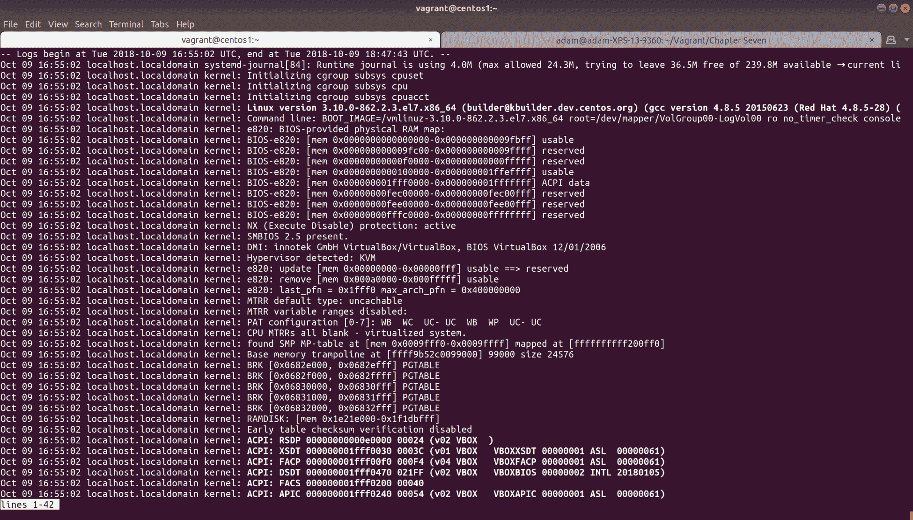

这对于任何看过普通旧`syslog`文件的人来说都是熟悉的；请注意，默认情况下格式是相同的。

尽管如此，它还是相当吵闹的，在一个繁忙的系统上，我们可能不想看到所有的历史记录。

也许我们只想在写入时观看日志？如果是这样，我们可以使用`-f`跟踪它：

```
$ sudo journalctl -f
-- Logs begin at Tue 2018-10-09 18:43:07 UTC. --
Oct 10 17:07:03 centos1 chronyd[554]: System clock was stepped by 80625.148375 seconds
Oct 10 17:07:03 centos1 systemd[1]: Time has been changed
Oct 10 17:07:25 centos1 sshd[1106]: Accepted publickey for vagrant from 10.0.2.2 port 55300 ssh2: RSA SHA256:TTGYuhFa756sxR2rbliMhNqgbggAjFNERKg9htsdvSw
Oct 10 17:07:26 centos1 systemd[1]: Created slice User Slice of vagrant.
Oct 10 17:07:26 centos1 systemd[1]: Starting User Slice of vagrant.
Oct 10 17:07:26 centos1 systemd[1]: Started Session 1 of user vagrant.
Oct 10 17:07:26 centos1 systemd-logind[545]: New session 1 of user vagrant.
Oct 10 17:07:26 centos1 sshd[1106]: pam_unix(sshd:session): session opened for user vagrant by (uid=0)
Oct 10 17:07:26 centos1 systemd[1]: Starting Session 1 of user vagrant.
Oct 10 17:07:28 centos1 sudo[1131]:  vagrant : TTY=pts/0 ; PWD=/home/vagrant ; USER=root ; COMMAND=/bin/journalctl -f
```

每当写入日志消息时，它都会出现在你面前，流式传输（使用`Ctrl` + `C`退出）。

我们可以使用`-k`标志来具体查看`kernel`日志（就像我们在运行`dmesg`一样）：

```
$ sudo journalctl -k --no-pager | head -n8
-- Logs begin at Tue 2018-10-09 18:43:07 UTC, end at Wed 2018-10-10 17:09:08 UTC. --
Oct 09 18:43:07 localhost.localdomain kernel: Initializing cgroup subsys cpuset
Oct 09 18:43:07 localhost.localdomain kernel: Initializing cgroup subsys cpu
Oct 09 18:43:07 localhost.localdomain kernel: Initializing cgroup subsys cpuacct
Oct 09 18:43:07 localhost.localdomain kernel: Linux version 3.10.0-862.2.3.el7.x86_64 (builder@kbuilder.dev.centos.org) (gcc version 4.8.5 20150623 (Red Hat 4.8.5-28) (GCC) ) #1 SMP Wed May 9 18:05:47 UTC 2018
Oct 09 18:43:07 localhost.localdomain kernel: Command line: BOOT_IMAGE=/vmlinuz-3.10.0-862.2.3.el7.x86_64 root=/dev/mapper/VolGroup00-LogVol00 ro no_timer_check console=tty0 console=ttyS0,115200n8 net.ifnames=0 biosdevname=0 elevator=noop crashkernel=auto rd.lvm.lv=VolGroup00/LogVol00 rd.lvm.lv=VolGroup00/LogVol01 rhgb quiet
Oct 09 18:43:07 localhost.localdomain kernel: e820: BIOS-provided physical RAM map:
Oct 09 18:43:07 localhost.localdomain kernel: BIOS-e820: [mem 0x0000000000000000-0x000000000009fbff] usable
```

请注意，这里我已经禁用了分页器（以与`systemctl-land`中相同的方式），并且我只转储了日志的前八行，因为`kernel`非常吵闹，特别是在启动时。

这也表明日志仍然可以在命令行上操作；你只需要先查询它们（增加一些开销）。

这并不是说你必须使用`journalctl`和其他命令的组合；你很有可能只用`journalctl`就能得到你需要的东西。在这里，我选择了一个非常具体的时间范围来查询日志：

```
$ sudo journalctl --since=17:07 --until=17:09
-- Logs begin at Tue 2018-10-09 18:43:07 UTC, end at Wed 2018-10-10 17:12:51 UTC. --
Oct 09 18:43:18 centos1 chronyd[554]: Selected source 188.114.116.1
Oct 09 18:43:18 centos1 chronyd[554]: System clock wrong by 80625.148375 seconds, adjustment started
Oct 10 17:07:03 centos1 chronyd[554]: System clock was stepped by 80625.148375 seconds
Oct 10 17:07:03 centos1 systemd[1]: Time has been changed
Oct 10 17:07:25 centos1 sshd[1106]: Accepted publickey for vagrant from 10.0.2.2 port 55300 ssh2: RSA SHA256:TTGYuhFa756sxR2rbliMhNqgbggAjFNERKg9htsdvSw
Oct 10 17:07:26 centos1 systemd[1]: Created slice User Slice of vagrant.
Oct 10 17:07:26 centos1 systemd[1]: Starting User Slice of vagrant.
Oct 10 17:07:26 centos1 systemd[1]: Started Session 1 of user vagrant.
Oct 10 17:07:26 centos1 systemd-logind[545]: New session 1 of user vagrant.
Oct 10 17:07:26 centos1 sshd[1106]: pam_unix(sshd:session): session opened for user vagrant by (uid=0)
Oct 10 17:07:26 centos1 systemd[1]: Starting Session 1 of user vagrant.
Oct 10 17:07:28 centos1 sudo[1131]:  vagrant : TTY=pts/0 ; PWD=/home/vagrant ; USER=root ; COMMAND=/bin/journalctl -f
Oct 10 17:08:08 centos1 chronyd[554]: Selected source 194.80.204.184
Oct 10 17:08:41 centos1 sudo[1145]:  vagrant : TTY=pts/0 ; PWD=/home/vagrant ; USER=root ; COMMAND=/bin/journalctl -k
Oct 10 17:08:52 centos1 sudo[1148]:  vagrant : TTY=pts/0 ; PWD=/home/vagrant ; USER=root ; COMMAND=/bin/journalctl -k
```

在 2 分钟内，我们得到了 15 行日志，但这样更容易筛选和消化（当然，假设你的盒子上的时间是正确的！）

这些时间戳只是示例；你可以使用完整的日期（`--since="2018-10-10 17:07:00"`）或者甚至是相对语句（`--since=yesterday --until=now`）。

如果你不是在寻找一个时间范围，而是特定的`systemd unit`的日志，`journalctl`也可以满足你：

```
$ sudo journalctl -u chronyd
-- Logs begin at Tue 2018-10-09 18:43:07 UTC, end at Wed 2018-10-10 17:18:58 UTC. --
Oct 09 18:43:09 centos1 systemd[1]: Starting NTP client/server...
Oct 09 18:43:09 centos1 chronyd[554]: chronyd version 3.2 starting (+CMDMON +NTP +REFCLOCK +RTC +PRIVDROP +SCFILTER +SECHASH +SIGND +ASYNCDNS +IPV6 +DEBUG)
Oct 09 18:43:09 centos1 chronyd[554]: Frequency -3.308 +/- 6.027 ppm read from /var/lib/chrony/drift
Oct 09 18:43:09 centos1 systemd[1]: Started NTP client/server.
Oct 09 18:43:18 centos1 chronyd[554]: Selected source 188.114.116.1
Oct 09 18:43:18 centos1 chronyd[554]: System clock wrong by 80625.148375 seconds, adjustment started
Oct 10 17:07:03 centos1 chronyd[554]: System clock was stepped by 80625.148375 seconds
Oct 10 17:08:08 centos1 chronyd[554]: Selected source 194.80.204.184
```

在这里，我使用了`-u`（unit）标志，只查看了来自`chronyd`的日志，最大程度地减少了我需要处理的输出量。

在上面的示例中，我们还得到了与`chronyd`单元交互的`systemd`日志。但如果我们只想要来自`chronyd`二进制的日志，我们也可以做到。

```
$ sudo journalctl /usr/sbin/chronyd
-- Logs begin at Tue 2018-10-09 18:43:07 UTC, end at Wed 2018-10-10 17:21:08 UTC. --
Oct 09 18:43:09 centos1 chronyd[554]: chronyd version 3.2 starting (+CMDMON +NTP +REFCLOCK +RTC +PRIVDROP +SCFILTER +SECHASH +SIGND +ASYNCDNS +IPV6 +DEBUG)
Oct 09 18:43:09 centos1 chronyd[554]: Frequency -3.308 +/- 6.027 ppm read from /var/lib/chrony/drift
Oct 09 18:43:18 centos1 chronyd[554]: Selected source 188.114.116.1
Oct 09 18:43:18 centos1 chronyd[554]: System clock wrong by 80625.148375 seconds, adjustment started
Oct 10 17:07:03 centos1 chronyd[554]: System clock was stepped by 80625.148375 seconds
Oct 10 17:08:08 centos1 chronyd[554]: Selected source 194.80.204.184
```

说真的，这太酷了吧？

但等等，还有更多！

`journald`命令可能更加强大，因为它有消息解释的概念，或者如果你愿意的话，消息上下文。一些日志行可以以更详细的方式输出（使用`-x`）以更好地理解发生了什么。

使用`sshd`单元的以下两个示例，一个带有`-x`标志，一个不带：

```
$ sudo journalctl -u sshd
-- Logs begin at Tue 2018-10-09 18:43:07 UTC, end at Wed 2018-10-10 17:25:46 UTC. --
Oct 09 18:43:14 centos1 systemd[1]: Starting OpenSSH server daemon...
Oct 09 18:43:14 centos1 sshd[853]: Server listening on 0.0.0.0 port 22.
Oct 09 18:43:14 centos1 sshd[853]: Server listening on :: port 22.
Oct 09 18:43:14 centos1 systemd[1]: Started OpenSSH server daemon.
Oct 10 17:07:25 centos1 sshd[1106]: Accepted publickey for vagrant from 10.0.2.2 port 55300 ssh2: RSA SHA256:TTGYuhFa756sxR2rbliMhNqgbggAjFNERKg9htsdvSw
$ sudo journalctl -u sshd -x
-- Logs begin at Tue 2018-10-09 18:43:07 UTC, end at Wed 2018-10-10 17:26:04 UTC. --
Oct 09 18:43:14 centos1 systemd[1]: Starting OpenSSH server daemon...
-- Subject: Unit sshd.service has begun start-up
-- Defined-By: systemd
-- Support: http://lists.freedesktop.org/mailman/listinfo/systemd-devel
-- 
-- Unit sshd.service has begun starting up.
Oct 09 18:43:14 centos1 sshd[853]: Server listening on 0.0.0.0 port 22.
Oct 09 18:43:14 centos1 sshd[853]: Server listening on :: port 22.
Oct 09 18:43:14 centos1 systemd[1]: Started OpenSSH server daemon.
-- Subject: Unit sshd.service has finished start-up
-- Defined-By: systemd
-- Support: http://lists.freedesktop.org/mailman/listinfo/systemd-devel
-- 
-- Unit sshd.service has finished starting up.
-- 
-- The start-up result is done.
Oct 10 17:07:25 centos1 sshd[1106]: Accepted publickey for vagrant from 10.0.2.2 port 55300 ssh2: RSA SHA256:TTGYuhFa756sxR2rbliMhNqgbggAjFNERKg9htsdvSw
```

请注意，`systemd`特定的行突然有了更多的上下文。

我们已经涵盖了一些基础知识，但`journalctl`仍然可以更加复杂。在将选项传递给输出后，我们可以在我们的语句中添加特定的匹配（格式为`FIELD=VALUE`）。

看看 SSH，我们可以看到它在起作用：

```
$ sudo journalctl --since=yesterday _SYSTEMD_UNIT=sshd.service _PID=853 
-- Logs begin at Tue 2018-10-09 18:43:07 UTC, end at Wed 2018-10-10 17:31:48 UTC. --
Oct 09 18:43:14 centos1 sshd[853]: Server listening on 0.0.0.0 port 22.
Oct 09 18:43:14 centos1 sshd[853]: Server listening on :: port 22.
```

在这里，我们说我们只想要昨天生成的`systemd` `sshd`单元的所有消息，但只有来自 PID `853`的消息（这恰好是这个盒子上的服务器守护程序 PID）。

有关匹配的更多信息，请参阅`systemd.journal-fields`手册页。

最后，与`syslog`一样，我们可以指定我们想要看到的消息的优先级。在这里，我们正在查看整个日志，但我们只对`err`级别的消息感兴趣：

```
$ sudo journalctl -p err
-- Logs begin at Tue 2018-10-09 18:43:07 UTC, end at Wed 2018-10-10 17:55:48 UTC. --
Oct 09 18:43:09 centos1 systemd[504]: Failed at step STDIN spawning /usr/libexec/selinux/selinux-policy-migrate-local-changes.sh: Inappropriate ioctl for device
Oct 09 18:43:09 centos1 systemd[1]: Failed to start Migrate local SELinux policy changes from the old store structure to the new structure.
Oct 09 18:43:14 centos1 rsyslogd[857]: imjournal: loaded invalid cursor, seeking to the head of journal  [v8.24.0 try http://www.rsyslog.com/e/2027 ]
```

# 它是如何工作的...

在`/etc/systemd/journald.conf`中配置，journald 是一个很棒的软件，但至少在 CentOS 7 上，它在某种程度上是一个二等公民，因为对于很多人来说，syslog 仍然是保持日志监视的主要方法。

日志不会在重新启动后保留（稍后会详细介绍），因此它只适用于查询系统自启动后的状态（这通常足够了，十次中有九次）。

正如我们所说，该文件是以二进制格式存在的，journald 会引入各种来源来创建其日志记录：

+   内核日志消息（`/dev/kmsg`）

+   简单的日志消息（先前提到的 `syslog` `libc` 调用）

+   从 Journal API 导入的结构化日志消息（使用 `imjournal` 模块导入到 `rsyslog` 中）

+   服务单元文件的 `stdout` 和 `stderr`

+   来自内核审计子系统的审计记录

与 `syslog` 一样，这意味着 `logger` 可以用来显示我们仍然可以手动填充日志，这里只显示从 `syslog` 传输机制接收到的消息：

```
$ logger -p cron.err "I'M ANOTHER PARADOXICAL LOG MESSAGE."
$ sudo journalctl -p err _TRANSPORT=syslog --since 18:00
-- Logs begin at Tue 2018-10-09 18:43:07 UTC, end at Wed 2018-10-10 18:11:15 UTC. --
Oct 10 18:08:18 centos1 vagrant[1736]: I'M ANOTHER PARADOXICAL LOG MESSAGE.
```

在未来，`syslog` 很有可能被淘汰，`journald` 将成为新的标准，但考虑到 `syslog` 作为一个概念存在了很长时间，这种情况在成为现实之前还需要很长时间。

`journald` 以二进制方式记录日志是许多传统主义者争论的焦点，但就像哥伦布一样，它并不是第一个出现在舞台上的，只是得到了所有的关注。那些曾经使用过 OpenBSD 及其防火墙 `pf` 的人，也许会觉得二进制日志记录是一种安慰。

# 还有更多...

需要注意的一件事是日志记录将使用的空间。大小限制由 `journald.conf` 中的选项管理。

选项 `SystemMaxUse` 和 `RuntimeMaxUse` 管理日志记录可以使用的最大磁盘空间；这些默认为文件系统大小的 10%，上限为 4GB。

`SystemKeepFree` 和 `RuntimeKeepFree` 选项管理 `journald` 为其他用途保留多少磁盘空间；这些默认为文件系统大小的 15%，上限也为 4GB。

有各种情况来管理大小，但基本上，`journald` 将尽最大努力不成为文件系统填满的原因，正是这种对细节的关注使我喜欢它。

# 另请参阅

在我们的 CentOS 系统上，日志文件是瞬时的，在重新启动时会丢失。在它存在的时候，它存在于 `/run/log/journal/` 中。

```
$ ls /run/log/journal/
4eabd6271dbf4ed0bc608378f4311df8
$ sudo ls -lh /run/log/journal/4eabd6271dbf4ed0bc608378f4311df8/
total 4.0M
-rwxr-x---+ 1 root systemd-journal 4.0M Oct  9 18:43 system.journal
```

我们实际上可以通过为日志创建一个专门的 `/var/log/` 目录，并使用一行命令更改权限来相当容易地改变这种行为：`sudo systemd-tmpfiles --create --prefix /var/log/journal`

您还可以从命令行列出 `journalctl` 知道的引导：

```
$ sudo journalctl --list-boots
 0 b4c3669c7a9841ba841c330a75125e35 Tue 2018-10-09 18:43:07 UTC—Wed 2018-10-10 18:13:27 UTC
```

# 日志集中

您不想登录到您的每个盒子来检查日志，您就是不想。在云和自动配置基础设施的时代，这比它值得的要麻烦得多，这是将日志集中在一个（冗余）位置的一个很好的理由。

作为数据，我们的日志可以相对容易地被操纵和移动。 `rsyslog` 和 `journald` 都有这样的能力，在这一部分，我们将把我们的日志流到各个地方，展示这样做有多么有用。

我们在这里涵盖的所有内容在各自的程序中都是可以实现的；这与一些由软件提供的集中式日志记录解决方案不同，例如 Elastic Stack。

为了这些示例的目的，我们没有使用 TLS，这意味着日志将以纯文本格式流式传输。我建议在生产中不要这样做，除非投资于 HTTPS 设置或隧道解决方案。

# 准备工作

对于本节，我们可以使用第一节的 `Vagrantfile`。

我们将使用 `centos1` 和 `centos2` 进行第一部分，然后使用 `debian1` 和 `debian2` 进行第二部分，从一个盒子发送日志到另一个盒子。

打开两个终端并连接到 `centos1` 和 `centos2`；在两个盒子上安装 `tcpdump`：

```
$ vagrant ssh centos1
$ sudo yum install tcpdump -y

$ vagrant ssh centos2
$ sudo yum install tcpdump -y
```

对于第二部分（`journald`），连接到 `debian1` 和 `debian2`，并在两个盒子上安装 `tcpdump` 和 `systemd-journal-remote`：

```
$ vagrant ssh debian1
$ sudo apt install tcpdump systemd-journal-remote -y

$ vagrant ssh debian2
$ sudo apt install tcpdump systemd-journal-remote -y
```

# 如何做...

我们将依次介绍两个日志守护程序，首先是`rsyslog`，然后再用`journald`做同样的基本操作。

# 使用 rsyslog 进行远程日志记录-UDP 示例

为了使`rsyslog`能够远程记录到一台机器，你需要在客户端上启用流到远程位置的接收，并在服务器上启用接收。

对于这个，`centos1`将是我们的客户端，`centos2`将是我们的服务器。

首先在`centos1`上：

```
$ sudo sed -i 's/#*.* @@remote-host:514/*.* @192.168.33.11/g' /etc/rsyslog.conf
$ sudo systemctl restart rsyslog
```

现在在`centos2`上：

```
$ sudo sed -i 's/#$ModLoad imudp/$ModLoad imudp/g' /etc/rsyslog.conf
$ sudo sed -i 's/#$UDPServerRun 514/$UDPServerRun 514/g' /etc/rsyslog.conf
$ sudo systemctl restart rsyslog
```

我们可以立即通过在我们的`centos2` VM 上使用`tcpdump`来检查这是否有效；使用以下命令启动它：

```
$ sudo tcpdump port 514 -i eth1
```

现在，在`centos1`上生成一个要发送的消息；在这里，我们伪造了一个`syslog.info`消息：

```
$ logger -p syslog.info "I'm a regular info message."
```

在`centos2`上，你应该看到类似以下的东西：

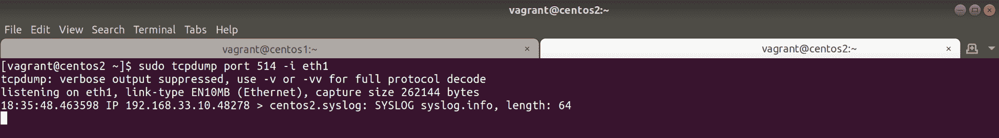

当然，在我们的日志行最终到达的`/var/log/messages`文件中，你会看到以下内容：

```
$ sudo tail -3 /var/log/messages
Oct 11 18:35:45 centos2 kernel: device eth1 entered promiscuous mode
Oct 11 18:35:48 centos1 vagrant: I'm a regular info message.
Oct 11 18:36:23 centos2 kernel: device eth1 left promiscuous mode
```

在这里，我们还可以看到`tcpdump`通过`tcpdump`将`eth1`置于混杂模式中，我们传递`syslog`消息之前和之后。

# 使用 rsyslog 进行远程日志记录-TCP 示例

前面的例子涵盖了 UDP，这只是一种没有确认服务器是否接收到噪音的信息流。通过 TCP 连接，`syslog`服务器相互通信首先建立连接。

在你的`centos1`机器上，用你的目标地址中的单个`@`符号替换为两个`@@`符号：

```
$ sudo sed -i 's/*.* @192.168.33.11/*.* @@192.168.33.11/g' /etc/rsyslog.conf
$ sudo systemctl restart rsyslog
```

我们的客户端现在已经设置好，但在建立连接之前无法发送日志。

在`centos2`上，让我们将`rsyslog`服务器设置为接收 TCP 连接和数据：

```
$ sudo sed -i 's/#$ModLoad imtcp/$ModLoad imtcp/g' /etc/rsyslog.conf
$ sudo sed -i 's/#$InputTCPServerRun 514/$InputTCPServerRun 514/g' /etc/rsyslog.conf
$ sudo systemctl restart rsyslog
```

一个`rsyslog`服务器可以同时监听 UDP 和 TCP。

让我们来测试一下！在`centos2`上，再次设置你的`tcpdump`：

```
$ sudo tcpdump port 514 -i eth1
```

并从`centos1`发送一个日志消息：

```
$ logger -p syslog.err "I'm a confusing error message."
```

你的`tcpdump`输出应该类似于以下内容：

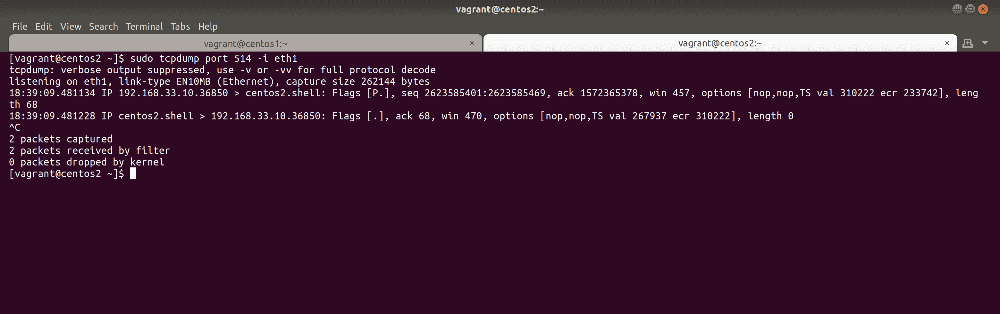

而且，你的消息文件应该有新的警报：

```
$ sudo tail -3 /var/log/messages
Oct 11 18:39:09 centos1 vagrant: I'm a confusing error message.
Oct 11 18:39:15 centos2 kernel: device eth1 left promiscuous mode
Oct 11 18:39:27 centos1 systemd-logind: Removed session 3.
```

# 使用 journald 进行远程日志记录

`systemd-journal-remote`命令允许你通过网络接收日志消息。不幸的是，这是`systemd`套件的一个相当新的添加，目前还不在 CentOS 系统上可用。

在你的第一个 Debian 系统（`debian1`）上，设置你的远程上传位置：

```
$ sudo sed -i 's/# URL=/URL=http:\/\/192.168.33.13/g' /etc/systemd/journal-upload.conf
```

在你的第二个盒子（`debian2`）上，首先通过使用`systemctl edit`编辑监听服务：

```
$ sudo systemctl edit systemd-journal-remote
```

当出现空编辑器时，添加以下三行：

```
[Service]
ExecStart=
ExecStart=/lib/systemd/systemd-journal-remote --listen-http=-3 --output=/var/log/journal/remote
```

它应该看起来像以下内容：

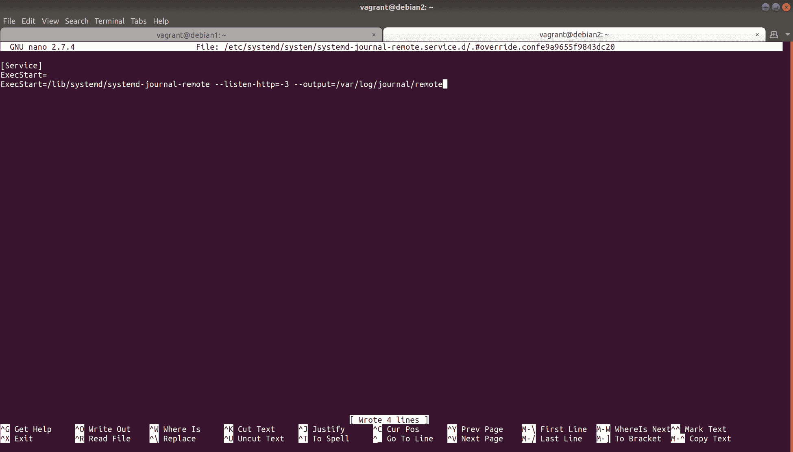

保存并退出（*Ctrl* + *O*，*Enter*，*Ctrl* + *X*）。

现在你需要创建远程文件夹位置，并确保它具有适当的权限，最后重新启动服务：

```
$ sudo mkdir -p /var/log/journal/remote
$ sudo chown systemd-journal-remote /var/log/journal/remote
$ sudo systemctl restart systemd-journal-remote
```

并不要忘记在`debian1`上启动服务：

```
$ sudo systemctl restart systemd-journal-upload
```

通过在`debian2`上跟踪你的日志来测试一下：

```
$ sudo journalctl -D /var/log/journal/remote/ -f
```

也可以通过在`debian1`上使用我们信任的`logger`命令来测试：

```
$ logger -p syslog.err "Debian1 logs, on Debian2!"
```

幸运的话，你会看到以下内容：

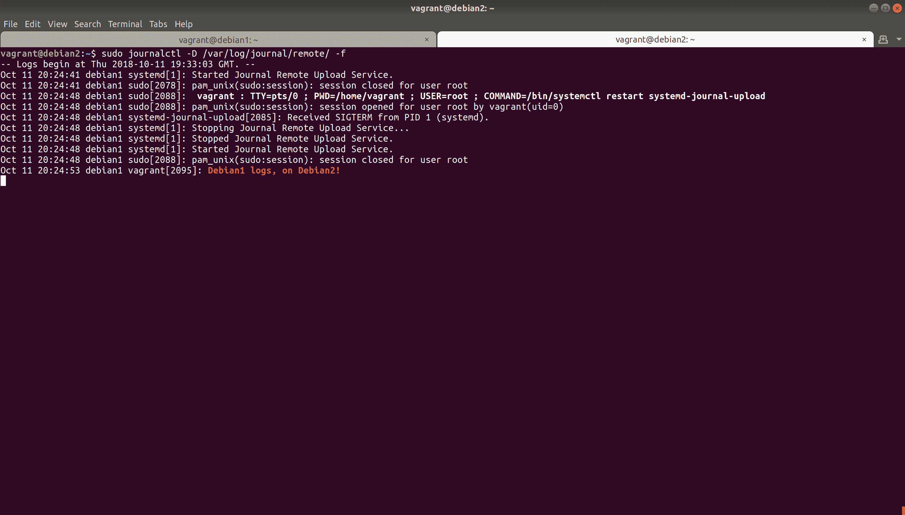

# 工作原理... 

我们实际上正在为`syslog`和`journald`解决方案中的日志打开一个监听器。我们的盒子上打开了一个网络端口，并且守护进程知道可能被迫读取数据的来源。在`syslog`的情况下，我们必须启用`rsyslog`守护进程中的特定模块才能实现这一点；`systemd`和`journald`需要特定的软件包。

显然，journald 的实现看起来有点笨重，但这主要是因为它是较新的。

基本上，我们只是在处理流式日志数据，无论`syslog`还是`journald`都不在乎数据来自哪里，只要它是它们可以理解的格式。

# 还有更多...

在集中记录日志时，时间非常重要。想想看在一个包含多个主机的日志文件中查找并发时间跳跃有多令人困惑。

它也可能使日志解析变得困难，因为我们可以使用特定的时间戳来正确排列数据，如果我们的远程盒子时间错误，我们可能会错过一些关键内容。

TLS 和安全传输也是需要考虑的内容，正如本节介绍中提到的那样。只要你正确配置证书，就可以将`systemd-journal-remote`配置为监听 HTTPS，而不是 HTTP。

对于 syslog，TLS 和加密可能会有些棘手，但有更多的解决方案需要考虑，比如通过 SSH 隧道流式传输日志数据，或者使用`spipe`这样的程序来卸载 TLS 的繁重工作。

# 本地资源测量工具

有时，了解一个盒子此刻正在做什么是非常方便的。通常情况下，这将在调试会话期间发生，当你试图弄清楚为什么网站的响应速度慢了一个数量级，或者为什么在远程会话中输入 SSH 命令要花费 5 分钟的时候。

在这里，本地资源监视器非常有用。我们已经简要提到过这些，但本节将稍微详细地介绍它们，并将涵盖一些在远程连接到服务器时可能会有用的更加隐秘的工具。

我们将先看看`free`和`top`这两个经典的程序，然后再转向更近期的添加，比如`netdata`和`htop`。

# 准备工作

对于本节，我们将使用我们的`centos1`和`debian1`虚拟机。

我们所看到的所有程序都将以某种形式普遍存在。

SSH 到你的`centos1`虚拟机，并确保启用了 EPEL 存储库：

```
$ vagrant ssh centos1 $ sudo yum install epel-release -y
$ sudo yum install htop -y
```

SSH 到你的`debian1`虚拟机，非常具体地，将端口`19999`转发到你的本地机器（稍后会详细介绍）：

```
$ vagrant ssh debian1 -- -L 127.0.0.1:19999:127.0.0.1:19999
```

# 如何做到…

和我们所看到的大多数内容一样，有一些经典的软件例子，它们的形式或多或少自上世纪 70 年代以来一直存在，那时大多数程序的名称只有两三个字符（ls，cp，mv）。其中之一是`top`，另一个是`free`，它们仍然有它们的用武之地。

然后还有更现代、时髦、漂亮的程序。单色 CRT 设计的应用程序已经过去了，取而代之的是甚至支持 256 种颜色的终端应用程序！

最后，还有 NetData，我在这里提一下，因为它在本地管理领域引起了轰动。

# top

一个老朋友，也保证会安装在任何 Unix 或类 Unix 系统上，top 是你对系统当前活动的直接窗口：

```
$ top
```

上述命令的输出如下所示：

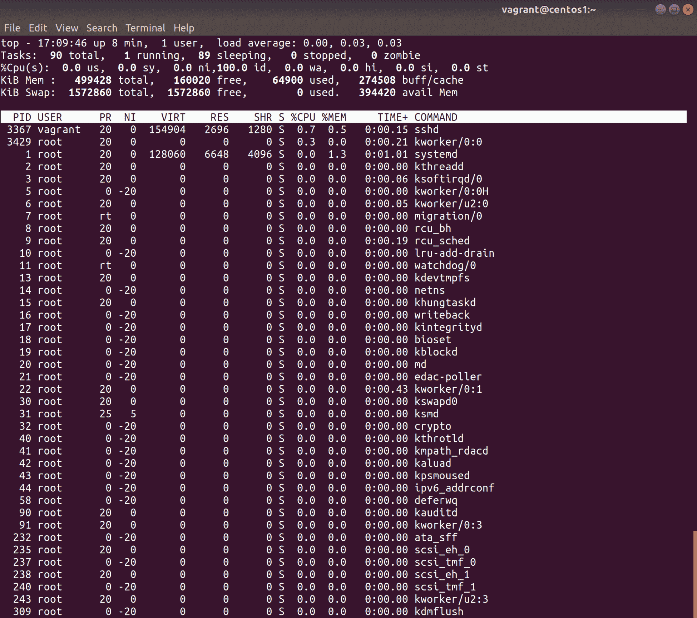

从一开始，我们就可以看到几件事情：

+   左上角的时间，以及盒子已经运行的时间- 17:09:46，已运行 8 分钟

+   登录用户的数量- 1 个用户

+   负载平均值- 0.00，0.03，0.03

+   正在运行、睡眠等任务的数量

+   CPU 使用信息

+   易失性内存信息（RAM）

+   SWAP 信息（磁盘内存）

将这些分解一下，让我们更详细地看一些：

+   **负载平均值**：详细来说，负载平均值是系统在过去 1、5 和 15 分钟内的负载。这个负载平均值显示了正在运行的进程，或者那些正在等待 CPU 时间或磁盘 I/O 等资源的进程。

磁盘 I/O 元素很重要，因为这是相当特定于 Linux 的东西，很多人会忽略。你可以有一个完全没有 CPU 负载的系统，但负载平均值却很高；这可能表明你需要将那个古老而脆弱的 HDD 升级为全新的 NVMe 驱动器。

+   **任务**：基本上，你可以将任务看作是当前正在运行的进程数量，或者是在你的系统上处于睡眠/僵尸/停止状态的进程数量。这与`ps aux`得到的数字是一样的。

+   **%CPU**：最好参考手册页：

us，user：运行非 niced 用户进程的时间

sy，system：运行内核进程的时间

ni，nice：运行 niced 用户进程的时间

id，idle：在内核空闲处理程序中花费的时间

wa，IO 等待：等待 I/O 完成的时间

hi：用于服务硬件中断的时间

si：用于服务软件中断的时间

st：被超级监视器从此虚拟机中窃取的时间

+   **KiB Mem**：以数字形式表示，这是可用于系统的 RAM 量，分为总计、空闲、已使用和缓冲区/高速缓存。

缓冲区/高速缓存是正在使用的内存，但任何希望立即使用它的程序都可以吞并它。Linux 喜欢 RAM，未使用的 RAM 是浪费的 RAM，因此它会尽其所能来使用它。

+   **KiB Swap**：同样以数字形式表示，这是可用的交换量，再次分解。

如果您想要一个更好的视图，通过多次按*M*循环浏览选项，将为您提供可视化表示：


最后，我们有不断变化的进程列表和有关系统上运行作业的信息：

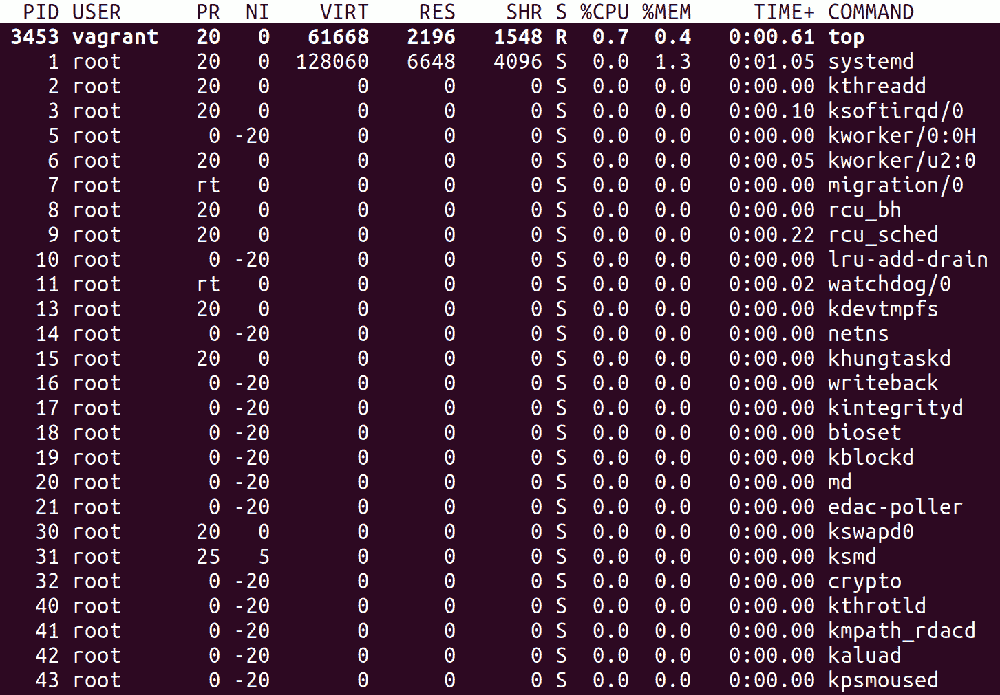

默认情况下，这是按 CPU 使用率（%CPU）组织的，但如果您愿意，可以进行调整。

顶部有以下内容：

+   问题任务的 PID

+   运行进程的用户

+   PR，任务的优先级（优先级越高，越有可能被优先处理）

+   NI，任务的优先级值；负值具有更高的优先级

+   虚拟内存被任务使用（所有内存，包括共享库等）

+   RES，任务正在使用的未交换物理内存

+   SHR，主要是 RES，没有一些对这本书来说太技术性的位

+   S，进程的状态（运行、睡眠、僵尸等）

+   %CPU，任务自上次刷新以来使用的 CPU 时间，占总 CPU 时间的百分比

+   %MEM，任务当前正在使用的可用物理内存的百分比

+   TIME+，TIME 的更新，它是任务自启动以来使用的总 CPU 时间；加号增加了粒度

+   COMMAND，任务的名称

呼~

这就是`top`，但它远不止于此，而且在不同的系统上可能看起来略有不同。它也可以显示颜色，但我只知道有一个发行版会默认打开它。

加载`top`并按*H*或*?*，以获得`top`能够做什么的有用指示，是个好主意。

# free

`free`是一种快速了解系统繁忙程度的好方法；更具体地说，它是快速了解系统上正在使用多少内存的最快方法。

谢天谢地，`free`的选项比`top`少。大多数情况下，标志只是用来改变命令的输出，使其更易读，或者更少，如果你喜欢的话。

就我个人而言，我使用`-m`，它以美比字节输出值，但如果您的系统有几 GB 的内存，您可能会发现`-g`更有用。

在接下来的内容中，您将看到我们的`centos1` VM 上的`free -ht`：`-h`用于人类可读的输出，提供了美比字节和吉比字节值的良好混合；`-t`是一个标志，用于添加`Total`行，给出`Mem`和`Swap`值的总和：

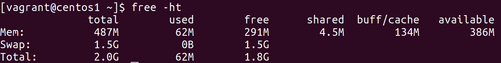

重要的字段是`available`，因为它有效地告诉您在系统开始交换之前有多少物理内存可用；如果这是`0`，您将不断地读写磁盘，这会严重减慢系统速度。

# htop

`htop`就像`top`，但更漂亮。如果一个系统在我的控制之下（并且已经得到适当的批准），您很可能会发现`htop`已安装。

在紧要关头，`top`是可以的，而且保证会在系统上预装，但如果您想要一个不像是上世纪 70 年代的东西，`htop`非常有帮助。

这是我们`centos1` VM 上的`htop`：

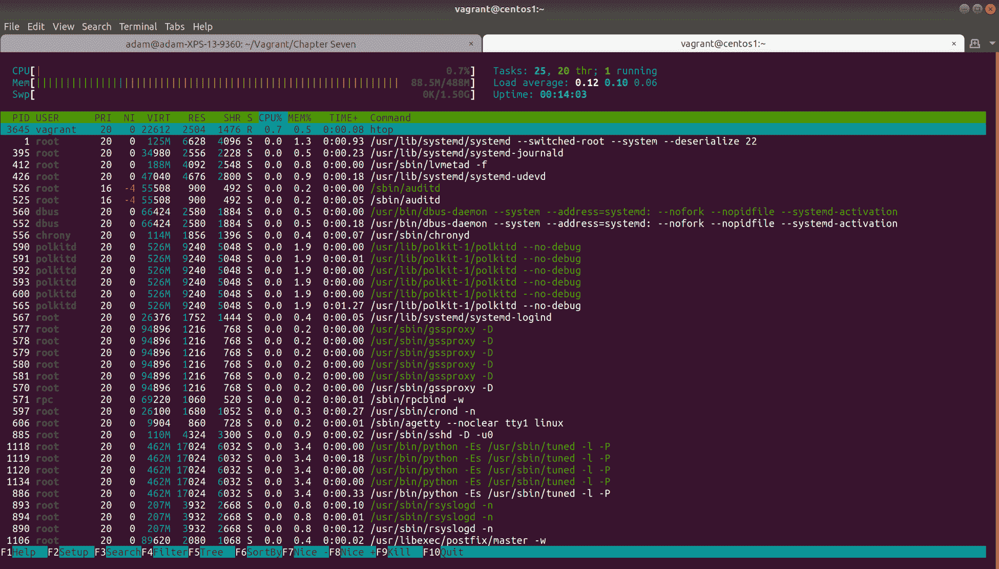

请注意，我们仍然拥有`top`给我们的所有相同信息，只是现在我们已经利用了现代终端仿真器的功能，使我们默认拥有颜色，并且将输出整齐地排列到一个窗口中，该窗口还支持鼠标输入（试试看！）。

除了`top`之外，我们还可以通过更改窗口的外观来快速轻松地格式化输出；屏幕底部的选项（*F5*）如`Tree`在按下时可以提供非常有用的树视图（请注意，它会更改为`Sorted`）：

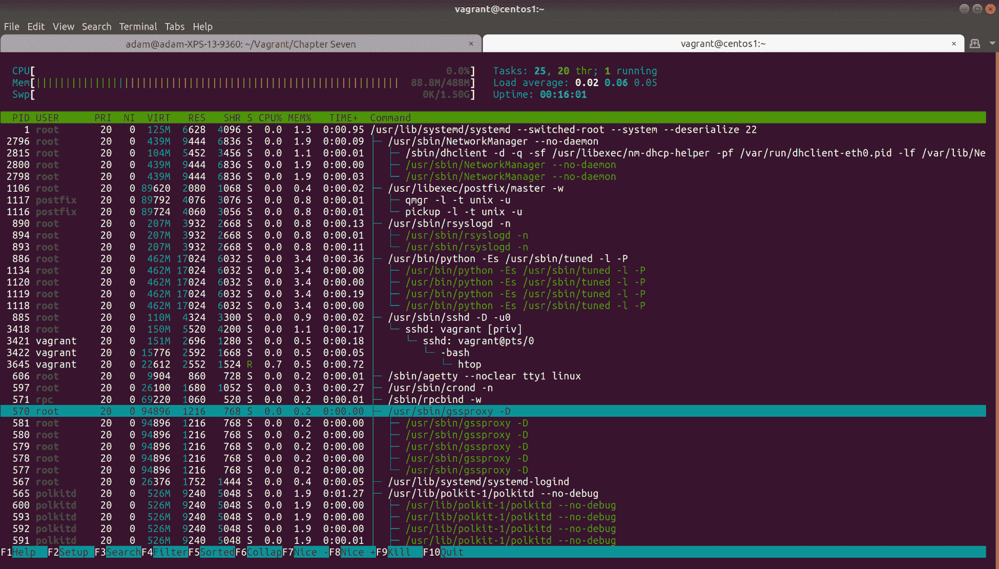

与 top 一样，还有更改所显示的列和信息的选项，尽管与`top`不同，这些选项位于设置菜单（*F3*）下，并且更改将以配置文件的形式持久保存到磁盘，位于`~/.config/htop/htoprc`。

# NetData

由于能够有效地进行市场营销，NetData 主要因此而受欢迎，它是所有系统信息的聚合器。

这不是广告，也不是认可，只是第三方软件可以做的一个例子。NetData 确实使用集中式服务器来记录一些数据，例如系统主机名，这意味着如果您打算使用此工具，应检查您的内部安全策略。有关更多信息，请参阅 NetData 安全页面：

[`docs.netdata.cloud/docs/netdata-security/`](https://docs.netdata.cloud/docs/netdata-security/)

与一切一样，在盲目点击接受之前，了解您要安装的软件的功能。

转到我们的 Debian VM，我们将在这里安装 NetData，因为它在后备存储库中可用（在事后添加到先前发布的 Debian 版本中的软件）。

首先，我们需要启用`backports`存储库，然后我们可以安装我们的软件包：

```
$ echo "deb http://ftp.debian.org/debian stretch-backports main" | sudo tee -a /etc/apt/sources.list
$ sudo apt update
$ sudo apt install netdata -y
```

由于 Debian 通常默认启动服务，因此安装后，NetData 现在已启用并启动。

但是，默认情况下，它只会在本地主机上侦听，这就是为什么我们需要在*准备就绪*部分中转发该 IP 和端口的原因。如果您还没有这样做，请从`debian1` VM 注销，并使用该部分中的命令。

现在，在本地机器的 Web 浏览器中导航到`http://127.0.0.1:19999`将会将该连接转发到您的 VM，您应该会看到 NetData GUI：

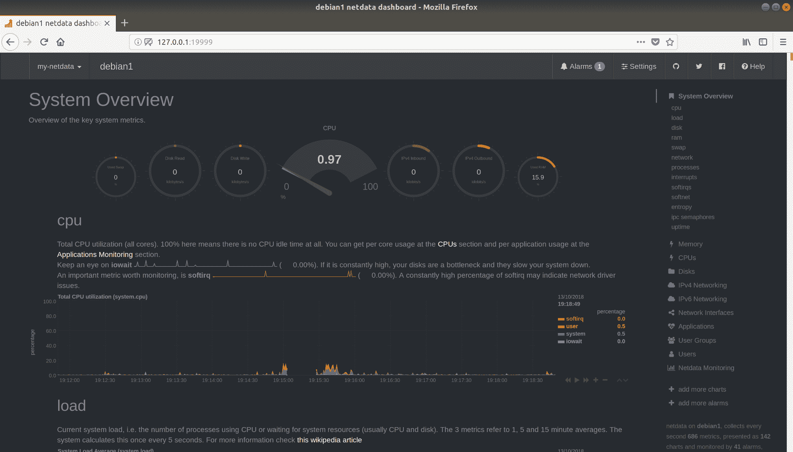

NetData 主页

即使我不得不承认，界面非常漂亮。

请注意，右侧甚至会给出有关 NetData 正在做什么以及它从哪里获取信息的信息片段：`debian1`上的 netdata 每秒收集 686 个指标，呈现为 142 个图表，并由 41 个警报监视，使用 11 MB 的内存，实时历史记录为 1 小时 6 分钟 36 秒。

# 它是如何工作的...

`top`查询内核以收集有关正在运行的系统的信息，使其非常快速地反映了其运行的计算机的性质。它也非常轻量级，这意味着除非计算机负载极重，否则`top`仍然有很大机会运行（如果负载过重，您将面临更大的问题）。它自上世纪 80 年代以来一直存在；它经过了试验。

`free`查看`/proc/meminfo`中可用的值，这意味着虽然您可以自己查询这些文件（有些人确实这样做），但`free`提供了一种更好的查看值的方式（并且可以选择定期刷新，如果您需要的话）。

`htop`以与`top`基本相同的方式查询系统（尽管这在 macOS 或 BSD 系列等操作系统中并非必然相同）。`htop`的区别在于它使用`ncurses`库来显示自己，虽然它不像`top`那样古老，但在撰写本文时已经存在大约 14 年。

NetData 使用各种来源（并可以使用自定义插件）每秒收集数据；然后将此数据显示给用户。

# 还有更多...

NetData 可能看起来很酷，并且乍一看，它可以是了解服务器正在做什么的一种巧妙方式（特别是如果您将其放在办公室的墙上之类的地方），但这并不是广告，我建议在使用此类工具时要谨慎。不是因为它们危险（尽管始终检查您的来源），而是因为它们可能有点轻浮，只是作为管理人员偶尔想在您的 PC 监视器上看到的仪表板。

哦！我又想到了 NetData 的另一个很好的用途，也许可以作为一些俗气的 DC 或 SciFi 电视节目中的某种背景装饰；那也很好。

我们在这里看到的只是提供的工具的一个样本。默认情况下，您始终可以使用（世界上的顶部和空闲），但还有数百种其他选择，其中一些可能符合您的需求，另一些可能符合办公室角落的墙板，其他人从不使用。

四处看看，搜索一下网络，然后尝试一些东西。

这是 Linux，有一百种方法可以完成同样的事情。

# 本地监控工具

就像有一些工具可以监视您的系统资源，还有一些工具可以查看系统的历史数据。根据您的使用方式，NetData 可以被认为是其中之一，但除此之外还有更多，我们将看一些其他可以帮助您调试过去问题的工具。

我们将看一下以下内容：

+   `atop`

+   `sar`

+   `vmstat`

# 准备工作

在本节中，我们将继续使用本章第一节中的`Vagrantfile`。

登录到`centos1`，这是我们将在本节中使用的虚拟机：

```
$ vagrant ssh centos1
```

安装我们将要使用的工具：

```
$ sudo yum install epel-release -y
$ sudo yum install atop sysstat -y
```

# 如何做...

安装好所有工具后，逐个完成以下各节。

# atop

atop（高级系统和进程监控）

首先，正常运行`atop`：

```
$ atop
```

您应该看到类似于这样的东西：

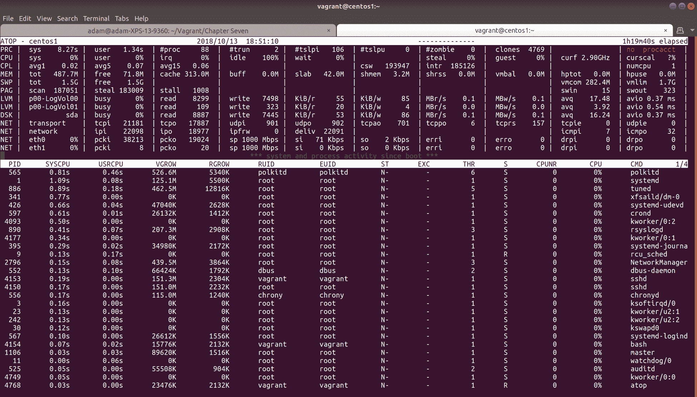

这为我们提供了一些很好的信息，特别是自启动以来的系统和进程活动，然后它会在之前的 10 秒内显示活动的滚动显示。换句话说，10 秒后，它看起来像这样：

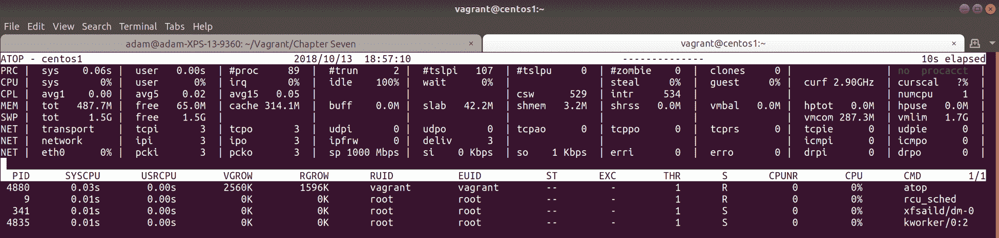

此外，`atop`不仅可以用于存储当前启动的数据，还可以定期使用。

启用`atop`服务如下：

```
$ sudo systemctl enable atop --now
```

现在您会发现历史记录的日期被记录到`/var/log/atop`中以二进制格式，并且这些文件可以在将来的某个日期进行回放，以便了解系统在半夜发生了什么导致所有这些红色警报：

```
$ sudo ls /var/log/atop/
atop_20181013  daily.log
```

要再次读取文件，可以指定完整的文件名，也可以指定您要查找的日期：

```
$ atop -r 20181013
```

因为我们在`18:56:14`启动了服务，所以当我们加载这个文件时就会看到这个时间：

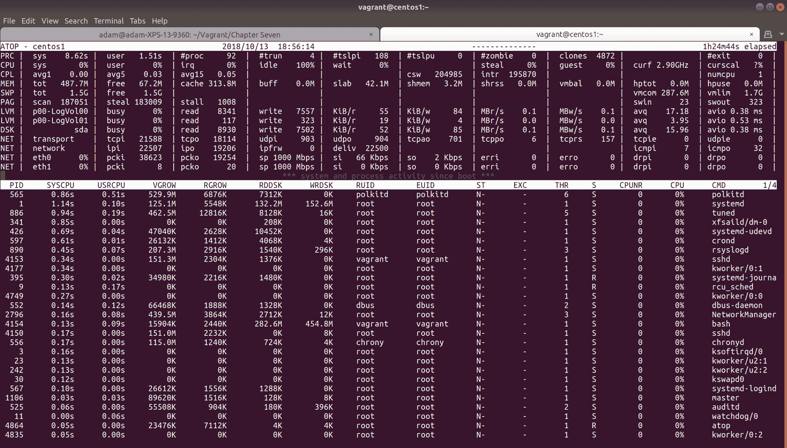

然后我们可以通过使用*t*和*T*来调整样本以前进和后退。

`atop`由`cron`作业在午夜重新启动：

```
$ sudo cat /etc/cron.d/atop
# daily restart of atop at midnight
0 0 * * * root systemctl try-restart atop
```

# sar

`sar`是一种读取系统信息的方式，但它也允许您读取历史信息。

它是通过`systemctl`命令启用的，实际上触发了一个名为`sa1`的二进制文件在启动时启动：

```
$ sudo systemctl enable --now sysstat
```

通过`cron`作业运行，`sar`每 10 分钟执行一次以获取系统信息。然后在`23:53`创建每日摘要：

```
$ sudo cat /etc/cron.d/sysstat 
# Run system activity accounting tool every 10 minutes
*/10 * * * * root /usr/lib64/sa/sa1 1 1
# 0 * * * * root /usr/lib64/sa/sa1 600 6 &
# Generate a daily summary of process accounting at 23:53
53 23 * * * root /usr/lib64/sa/sa2 -A
```

使用`-f`标志指定要打开和读取的`sar`文件：

```
$ sar -f /var/log/sa/sa13 
Linux 3.10.0-862.2.3.el7.x86_64 (centos1)     13/10/18     _x86_64_    (1 CPU)

18:50:01        CPU     %user     %nice   %system   %iowait    %steal     %idle
19:00:01        all      0.03      0.00      0.21      0.00      0.00     99.76
Average:        all      0.03      0.00      0.21      0.00      0.00     99.76

19:07:51          LINUX RESTART

19:10:01        CPU     %user     %nice   %system   %iowait    %steal     %idle
19:14:43        all      0.04      0.00      0.22      0.00      0.00     99.75
19:15:07        all      0.17      0.00      0.48      0.00      0.00     99.35
19:20:01        all      0.01      0.00      0.12      0.00      0.00     99.87
19:30:01        all      0.00      0.00      0.09      0.00      0.00     99.91
19:40:01        all      0.00      0.00      0.10      0.00      0.00     99.90
Average:        all      0.01      0.00      0.12      0.00      0.00     99.87
```

或者，如果您想更加细致，可以指定开始和结束时间：

```
$ sar -f /var/log/sa/sa13 -s 19:10:00 -e 19:15:08
Linux 3.10.0-862.2.3.el7.x86_64 (centos1) 13/10/18 _x86_64_ (1 CPU)

19:10:01 CPU %user %nice %system %iowait %steal %idle
19:14:43 all 0.04 0.00 0.22 0.00 0.00 99.75
19:15:07 all 0.17 0.00 0.48 0.
00 0.00 99.35
Average: all 0.05 0.00 0.24 0.00 0.00 99.72
```

# vmstat

`vmstat`是报告内存统计信息的好方法；默认情况下，其输出如下：

```
$ vmstat
procs -----------memory---------- ---swap-- -----io---- -system-- ------cpu-----
 r  b   swpd   free   buff  cache   si   so    bi    bo   in   cs us sy id wa st
 2  0   1544  65260      0 367336    0    0    57    78   45   47  0  0 100  0  0
```

不过，`vmstat`的优点在于它的初始报告（前面的输出）是自启动以来的信息，并且您可以在命令的末尾添加一个数字，以获得滚动摘要：

```
$ vmstat 5
procs -----------memory---------- ---swap-- -----io---- -system-- ------cpu-----
 r  b   swpd   free   buff  cache   si   so    bi    bo   in   cs us sy id wa st
 2  0   1544  65140      0 367336    0    0    57    77   45   47  0  0 100  0  0
 0  0   1544  65140      0 367336    0    0     0     0   49   48  0  0 100  0  0
 0  0   1544  64768      0 367336    0    0     0     0   51   54  0  0 100  0  0
 0  0   1544  64768      0 367336    0    0     0     0   48   48  0  0 100  0  0
 0  0   1544  64768      0 367336    0    0     0     1   46   46  0  0 100  0  0
 0  0   1544  64768      0 367336    0    0     0     0   47   46  0  0 100  0  0
 0  0   1544  64588      0 367336    0    0     0     0   49   53  0  0 100  0  0
 0  0   1544  64784      0 367336    0    0     0     0   49   51  0  0 100  0  0
 0  0   1544  64784      0 367336    0    0     0     0   48   48  0  0 100  0  0
 1  0   1544  64784      0 367336    0    0     0     0   46   48  0  0 100  0  0
```

与 NetData 一样，`vmstat`可以适用于这一部分或前一部分，因此用户需要决定如何做。例如，您可以编写一个`systemd-timer`，每小时运行`vmstat` 10 次，并将结果输出到文件中，以便以后查看。这比开箱即用的解决方案（如`sar`和`atop`）要手动一些，但对于更大的项目来说是一个很好的练习。

# 它是如何工作的...

与我们之前的部分一样，开箱即用，`atop`和`sar`的大部分设置已经为您完成，但是可以在相关进程的配置文件中进行进一步的配置更改。

在 CentOS 下，这些都存储在`/etc/sysconfig`中，这是传统的做法：

```
$ cat /etc/sysconfig/atop 
# sysconfig atop
#

# Current Day format
CURDAY=`date +%Y%m%d`
# Log files path
LOGPATH=/var/log/atop
# Binaries path
BINPATH=/usr/bin
# PID File
PIDFILE=/var/run/atop.pid
# interval (default 10 minutes)
INTERVAL=600
$ cat /etc/sysconfig/sysstat
# sysstat-10.1.5 configuration file.
# How long to keep log files (in days).
# If value is greater than 28, then log files are kept in
# multiple directories, one for each month.
HISTORY=28
# Compress (using gzip or bzip2) sa and sar files older than (in days):
COMPRESSAFTER=31
# Parameters for the system activity data collector (see sadc manual page)
# which are used for the generation of log files.
SADC_OPTIONS="-S DISK"
# Compression program to use.
ZIP="bzip2"
```

当使用`systemd`启动`atop`时，会触发`/usr/share/atop/atop.daily`脚本，使用`sysconfig`中的选项。

当`sysstat`与`systemd`一起启用时，它会明确告诉`sar`从一个虚拟记录开始，表示新的启动。这是在我们之前看到的`cron`条目之外的，由`/etc/sysconfig`中的配置文件决定的。

使用这些工具有点复杂，但是如果您擅长解释和使用它们提供的信息，您很快就会发现这些数据对您非常有价值。

# 远程监控工具

能够在本地查询服务器并了解它在做什么是很好的，但这在现实世界中很少是做事情的方式（在您可能为个人项目维护的单个框之外）。在公司场景中，更有可能的是您会有某种监控解决方案，也许在您的框上有代理，它会监视您负责的机器的健康状况。

Nagios 是全球监控安装的无可争议的王者，不是因为它是最好的，或者最引人注目的，而仅仅是因为它是最古老的之一，一旦监控解决方案就位，您会发现团队非常不愿意切换到新的解决方案。

它已经导致创建了几个克隆版本，并且有各种分支（有些使用原始源代码，有些不使用），但它们都会以类似的方式运行。

在这一部分，我们将在`centos1`上安装**Nagios**，并让它监视自己和`debian1`，同时我们将在`centos2`上安装**Icinga2**，并让它监视`debian2`。

# 准备工作

对于本节，第一节中的`Vagrantfile`就足够了。我们将使用我们的四个 VM。

我们将首先运行 Nagios 设置，然后再转到 Icinga2。

连接到您的每个框，或者从`centos1`和`debian1`开始，然后再移动到`centos2`和`debian2`。

连接到`centos1`进行`Nagios`安装时，您将希望使用以下端口转发：

```
$ vagrant ssh centos1 -- -L 127.0.0.1:8080:127.0.0.1:80
```

# 如何做...

如前所述，我们将首先运行 Nagios，然后运行 Icinga2。

# Nagios

在`centos1`上，让我们从 EPEL 安装 Nagios：

```
$ sudo yum install -y epel-release
$ sudo yum install -y httpd nagios nagios-plugins-all nagios-plugins-nrpe
```

现在已经完成了（这可能需要一些时间，因为有很多插件），我们应该启动和启用我们的服务，以及`httpd`，它应该是默认安装的：

```
$ sudo systemctl enable --now nagios
$ sudo systemctl enable --now httpd
```

开箱即用，您将获得一个不安全的 nagios-web 设置。如果您按照先前建议连接到 Vagrant VM，现在应该能够在转发端口（`http://127.0.0.1:8080/nagios`）上访问 Web 界面：

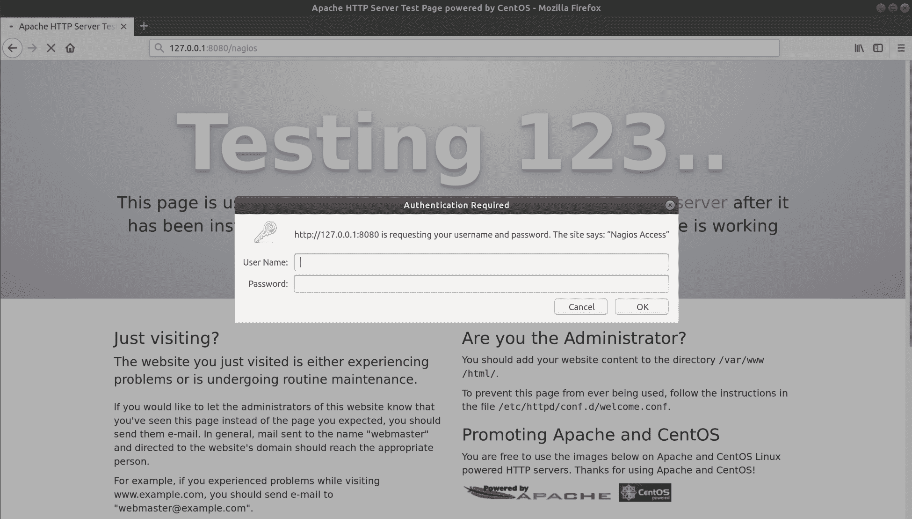

实际上，我们还没有设置我们的`nagiosadmin`密码（用于基本的`http auth`提示），所以现在让我们来做这个：

```
$ sudo htpasswd /etc/nagios/passwd nagiosadmin
New password: 
Re-type new password: 
Updating password for user nagiosadmin
```

设置密码后，尝试在提示框中输入密码：

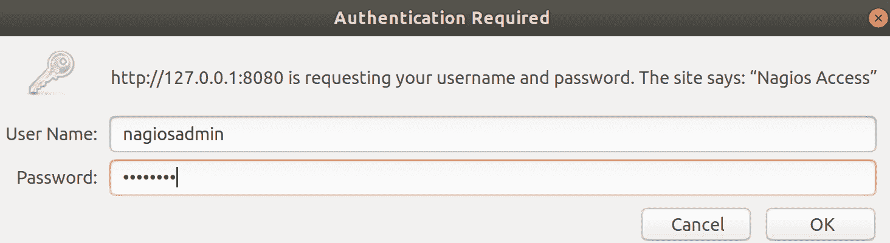

您应该看到 Nagios 的登录页面：

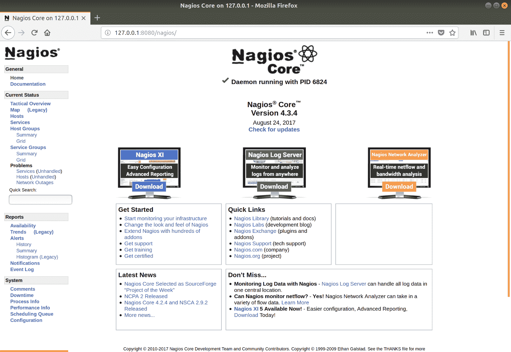

正如我在其他地方提到的，我不建议以这种方式使用基本的 HTTP 身份验证，因为它是不安全的。如果您无法使用 HTTPS/TLS 来保护网页，您应该将其阻止，以便只能在本地访问该框，并使用类似 SSH 转发的方式来加密到门户的连接。不过，理想情况下，从 LetsEncrypt 获取证书并简化您的生活。

现在点击左侧的 Services；这是您大部分时间都想要的地方，因为它显示了 Nagios 当前正在监视的主机和该主机上的服务：

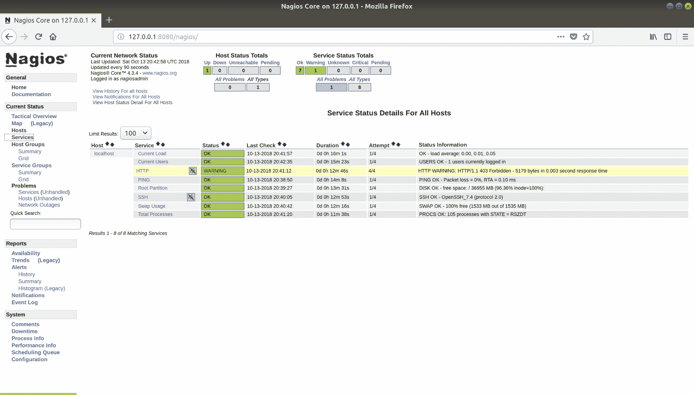

默认情况下，您只能看到我们只监视我们的 localhost，这对现在来说是可以的，但是我们想要将`debian1`加入其中。回到命令行，让我们首先指向 Nagios 配置文件中的`debian1`文件：

```
$ echo "cfg_file=/etc/nagios/objects/debian1.cfg" | sudo tee -a /etc/nagios/nagios.cfg
```

现在我们需要创建`debian1.cfg`：

```
$ sudo cp /etc/nagios/objects/localhost.cfg /etc/nagios/objects/debian1.cfg
```

我们目前与`localhost`机器具有相同的配置，因此我们将使用`debian1`特定值替换这些值。我们还将创建一个专门用于远程虚拟机的新主机组，并将本地检查更改为首先使用`check_nrpe`：

```
$ sudo sed -i 's/localhost/debian1/g' /etc/nagios/objects/debian1.cfg
$ sudo sed -i 's/127.0.0.1/192.168.33.12/g' /etc/nagios/objects/debian1.cfg
$ sudo sed -i 's/linux-servers/remote-vms/g' /etc/nagios/objects/debian1.cfg
$ sudo sed -i 's/check_local/check_nrpe!check_client/g' /etc/nagios/objects/debian1.cfg
```

有了这些，我们必须定义`check_nrpe`命令：

```
$ cat <<HERE | sudo tee -a /etc/nagios/objects/commands.cfg
define command{
 command_name    check_nrpe
 command_line    \$USER1\$/check_nrpe -H \$HOSTADDRESS\$ -c \$ARG1\$ 
 }
HERE
```

完成后，我们可以重新启动我们的 Nagios 安装：

```
$ sudo systemctl restart nagios
```

再次查看您的服务页面，您现在将看到`debian1`，很可能有很多检查失败。

这是因为`debian1`上没有设置 NRPE，所以让我们现在 SSH 到`debian1`并进行设置！

首先，我们需要安装各种部件：

```
 $ sudo apt install monitoring-plugins nagios-nrpe-server -y
```

现在，我们需要允许我们的`centos1`框与`debian1`通信（通过端口`5666`）：

```
$ sudo sed -i 's/allowed_hosts=127.0.0.1/allowed_hosts=127.0.0.1,192.168.33.10/g' /etc/nagios/nrpe.cfg
```

我们还需要定义服务器将要求在客户端上运行的客户端命令：

```
$ cat <<HERE | sudo tee /etc/nagios/nrpe_local.cfg 
command[check_client_load]=/usr/lib/nagios/plugins/check_load -w 5.0,4.0,3.0 -c 10.0,6.0,4.0
command[check_client_users]=/usr/lib/nagios/plugins/check_users -w 20 -c 50
command[check_client_disk]=/usr/lib/nagios/plugins/check_disk -w 20% -c 10% -p /
command[check_client_swap]=/usr/lib/nagios/plugins/check_swap -w 20 -c 10
command[check_client_procs]=/usr/lib/nagios/plugins/check_procs -w 250 -c 400 -s RSZDT
HERE
```

最后，我们到了可以重新启动`debian1`上的`nrpe`服务的时候：

```
$ sudo systemctl restart nagios-nrpe-server
```

现在，回顾一下 Nagios Web 界面（如果您断开连接，请不要忘记再次 SSH 到`centos1`虚拟机），我们应该看到我们的服务被正确检查：

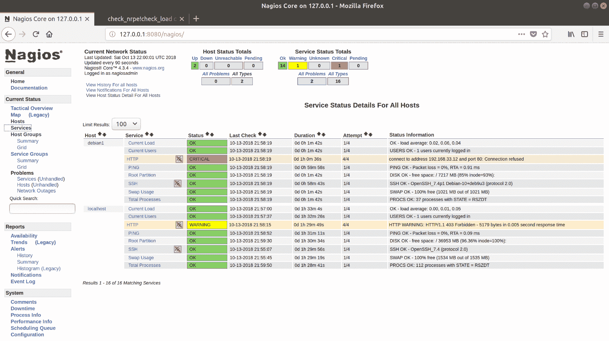

带有“debian1”的 Nagios 服务页面

请注意，我们有一个失败的检查（HTTP），因为`debian1`没有安装和运行 Web 服务器。

如果您的检查尚未循环完成，您可以通过单击主机名称，然后选择“计划检查此主机上的所有服务”命令来强制对主机上的所有服务进行检查。

# Icinga2

与 Nagios（最初源自 Nagios）一样，Icinga2 具有中央服务器的概念，以及其他主机上的代理，它可以监视。

我们将在我们的`centos2`虚拟机上安装`Icinga2`，然后从我们的第一个主机监视我们的`debian2`虚拟机。

首先，跳转到`centos2`并安装`Icinga2`：

```
$ vagrant ssh centos2 -- -L 127.0.0.1:8181:127.0.0.1:80
```

注意转发部分；这将用于稍后的 GUI 设置（端口`8181`）：

```
$ sudo yum install epel-release -y
$ sudo yum install centos-release-scl -y
$ sudo yum install https://packages.icinga.com/epel/icinga-rpm-release-7-latest.noarch.rpm -y
$ sudo yum install httpd icinga2 icinga2-ido-mysql nagios-plugins-all icinga2-selinux mariadb-server mariadb icingaweb2 icingacli icingaweb2-selinux rh-php71-php-mysqlnd -y
$ sudo systemctl enable --now icinga2
$ sudo systemctl enable --now mariadb
```

运行`mariadb`安装脚本（默认情况下，root 密码为空；将其设置为您记得的内容）：

```
$ mysql_secure_installation

NOTE: RUNNING ALL PARTS OF THIS SCRIPT IS RECOMMENDED FOR ALL MariaDB
      SERVERS IN PRODUCTION USE!  PLEASE READ EACH STEP CAREFULLY!

In order to log into MariaDB to secure it, we'll need the current
password for the root user.  If you've just installed MariaDB, and
you haven't set the root password yet, the password will be blank,
so you should just press enter here.

Enter current password for root (enter for none): 
OK, successfully used password, moving on...

Setting the root password ensures that nobody can log into the MariaDB
root user without the proper authorisation.

Set root password? [Y/n] Y
New password: 
Re-enter new password: 
Password updated successfully!
Reloading privilege tables..
 ... Success!

By default, a MariaDB installation has an anonymous user, allowing anyone
to log into MariaDB without having to have a user account created for
them.  This is intended only for testing, and to make the installation
go a bit smoother.  You should remove them before moving into a
production environment.

Remove anonymous users? [Y/n] Y
 ... Success!

Normally, root should only be allowed to connect from 'localhost'.  This
ensures that someone cannot guess at the root password from the network.

Disallow root login remotely? [Y/n] Y
 ... Success!

By default, MariaDB comes with a database named 'test' that anyone can
access.  This is also intended only for testing, and should be removed
before moving into a production environment.

Remove test database and access to it? [Y/n] Y
 - Dropping test database...
 ... Success!
 - Removing privileges on test database...
 ... Success!

Reloading the privilege tables will ensure that all changes made so far
will take effect immediately.

Reload privilege tables now? [Y/n] Y
 ... Success!

Cleaning up...

All done!  If you've completed all of the above steps, your MariaDB
installation should now be secure.

Thanks for using MariaDB!
```

现在为`icinga`设置`mariadb`。此信息可以在 Icinga2 *入门*指南中找到，[`icinga.com/docs/icinga2/latest/doc/02-getting-started/#setting-up-icinga-web-2`](https://icinga.com/docs/icinga2/latest/doc/02-getting-started/#setting-up-icinga-web-2)：

```
$ mysql -u root -p<The Password You Set Above>

MariaDB [(none)]> CREATE DATABASE icinga;
Query OK, 1 row affected (0.00 sec)

MariaDB [(none)]> GRANT SELECT, INSERT, UPDATE, DELETE, DROP, CREATE VIEW, INDEX, EXECUTE ON icinga.* TO 'icinga'@'localhost' IDENTIFIED BY 'icinga';
Query OK, 0 rows affected (0.06 sec)

MariaDB [(none)]> quit
Bye
```

最后，导入提供的`schema`数据库：

```
$ mysql -u root -p icinga < /usr/share/icinga2-ido-mysql/schema/mysql.sql
```

在`icinga2`中启用实际插件，并`重新启动`服务：

```
$ sudo icinga2 feature enable ido-mysql
$ sudo systemctl restart icinga2
```

数据库设置完成后，我们可以继续进行实际的 Web 安装。

我们在本节的安装步骤中包括`httpd`（apache），因为 Icinga2 建议使用它，尽管也可以使用 NGINX（实际上是 FreeBSD 上的默认值）。

首先启动并启用它：

```
$ sudo systemctl enable --now httpd
```

接下来，启用`icinga2`的`api`功能并`重新启动`它：

```
$ sudo icinga2 api setup
$ sudo systemctl restart icinga2
```

将在`api-users.conf`中添加一个 root 用户和随机密码：

```
$ sudo cat /etc/icinga2/conf.d/api-users.conf
/**
 * The ApiUser objects are used for authentication against the API.
 */
object ApiUser "root" {
 password = "40ebca8aaaf1eba0"
 // client_cn = ""

 permissions = [ "*" ]
}
```

Icinga2 Web 还需要启用**FastCGI Process Manager**（**FPM**），因此请执行此操作：

```
$ sudo sed -i 's/;date.timezone =/date.timezone = UTC/g' /etc/opt/rh/rh-php71/php.ini
$ sudo systemctl enable --now rh-php71-php-fpm.service
```

完成后，您应该能够在浏览器中访问已安装的 Icinga2 Web 设置（使用我们的转发连接），`http://127.0.0.1:8181/icingaweb2/setup`：

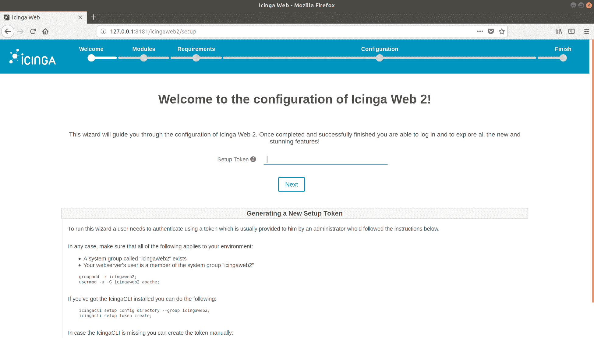

要找到您的设置代码，请返回到您的`centos2`命令行并运行以下命令：

```
$ sudo icingacli setup token create
The newly generated setup token is: 052f63696e4dc84c
```

输入您的代码并通过安装点击下一步（确保在要求页面上没有*红色*；黄色对于 Imagick PHP 模块来说是可以的）：

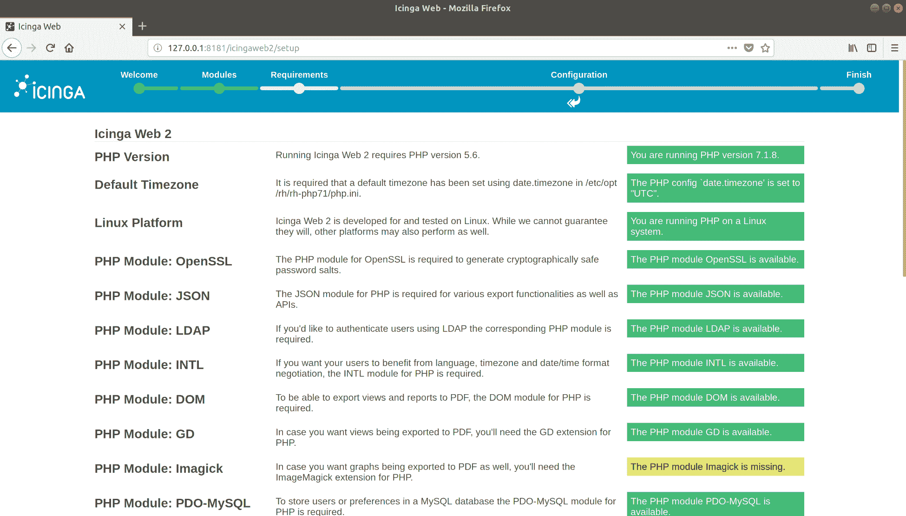

在提示要求身份验证类型时，选择数据库：

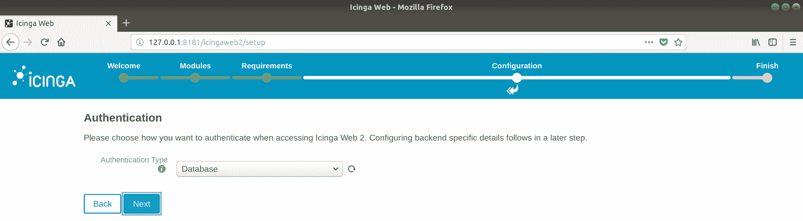

在下一页上，您将被提示提供数据库名称、数据库用户名和数据库密码。选择合适的值（如果尚未创建，不要担心，我们将在下一步中进行）：

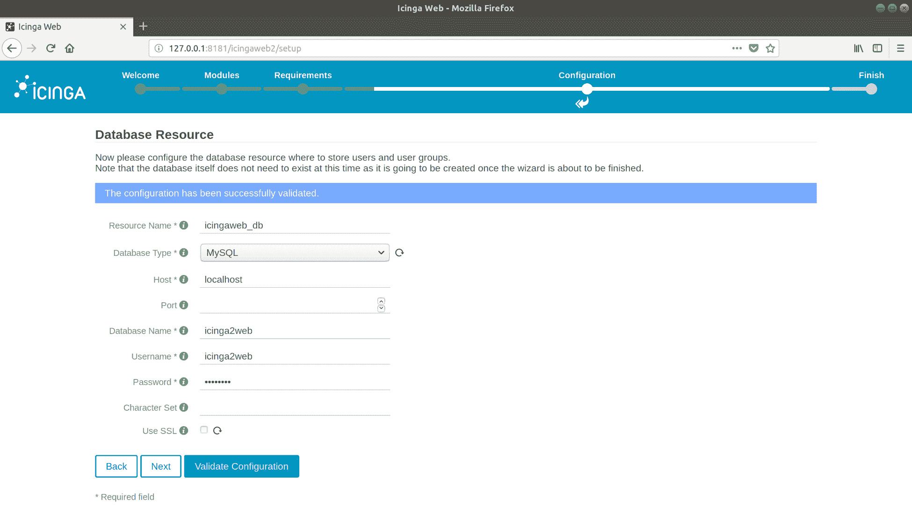

在这里，您可以看到我选择了`icinga2web`作为数据库名称和用户名。点击下一步。

在紧随其后的屏幕上，您将被要求传入一个可以访问 MariaDB 以创建新数据库的用户的凭据；我选择使用我们之前设置的 MariaDB root 用户：

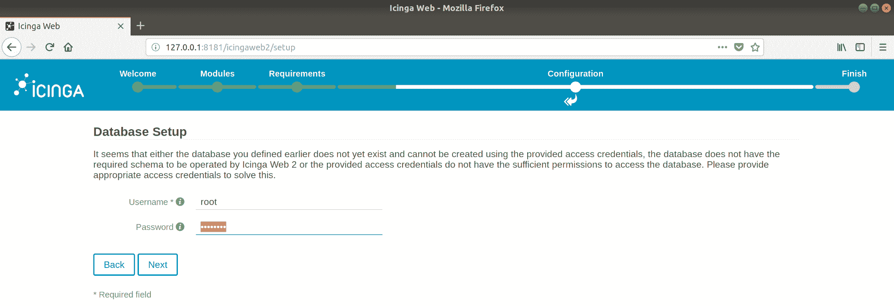

您将被提示选择后端名称，这是一个美学决定，以便您以后可以识别后端：

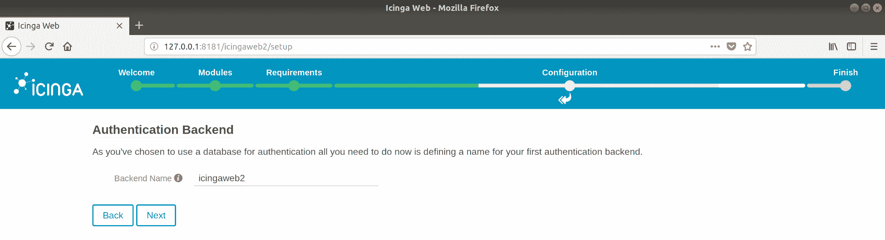

并且您将被要求创建一个 web 用户；我选择了`icingaweb`：

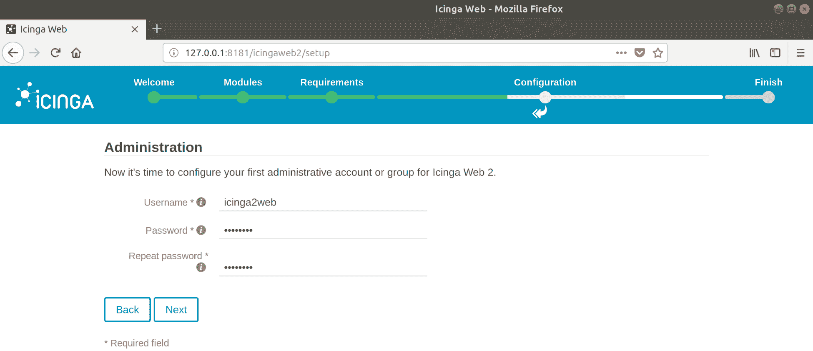

我将应用配置保留为默认值：

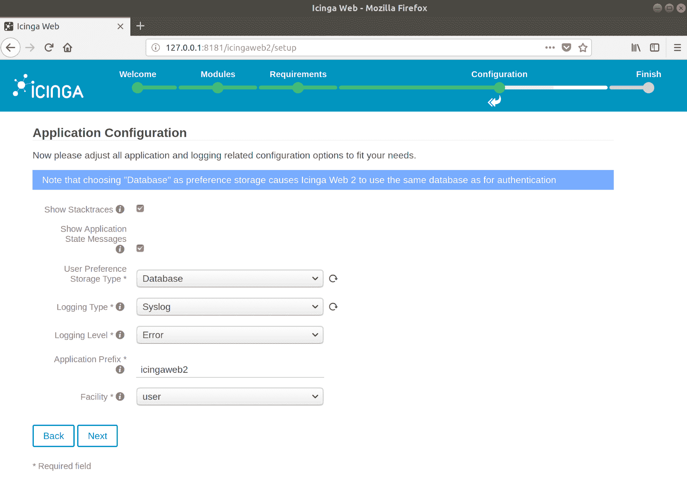

最后，您将被提示确认您输入的设置；在继续之前快速检查一遍。

点击下一步几次，直到到达监控后端设置（在那里 IcingaWeb2 查找监控数据库）：

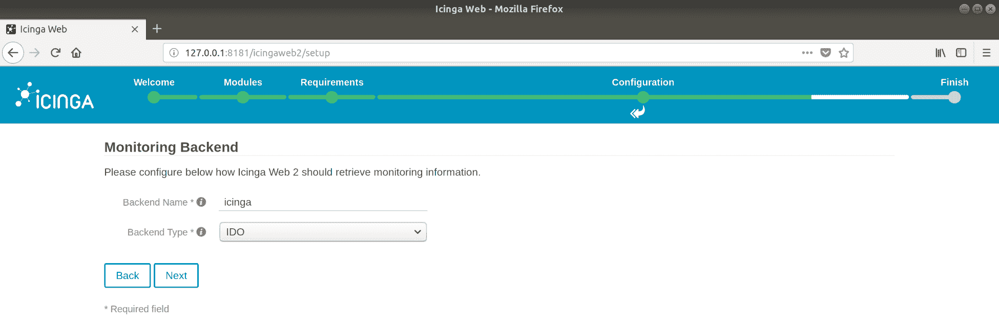

您将被提示添加可以用于查询 icinga 数据库的连接详细信息（我们在本章前面使用 MariaDB CLI 设置了）。我们设置了以下默认值：用户名`icinga`，密码`icinga`：

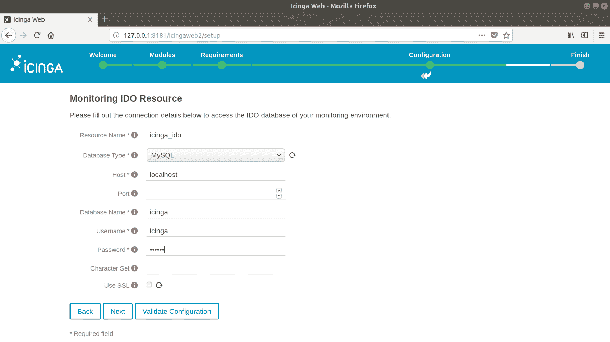

使用“验证配置”按钮验证您的配置。

在命令传输屏幕上，您将被提示输入我们创建的 API 用户的详细信息。我们只添加了 root，所以现在让我们使用它（从之前的 api-users.conf 文件）：

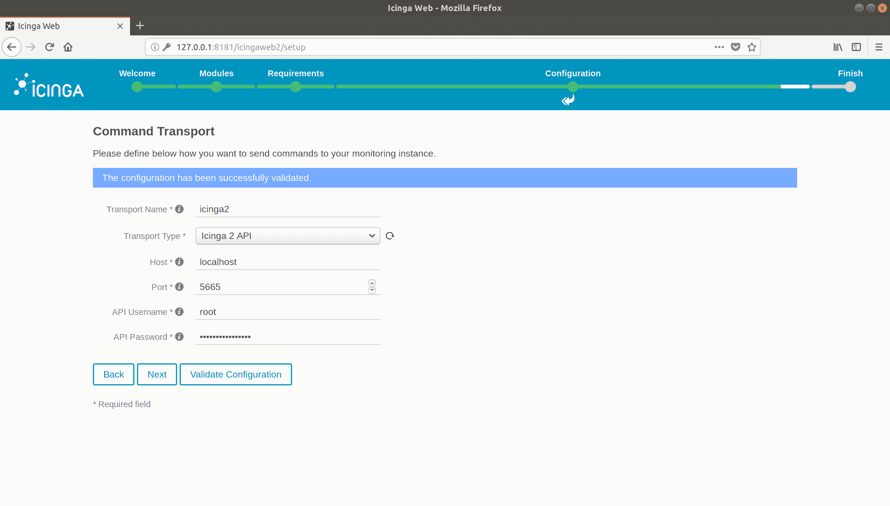

点击下一步，直到最后，您应该看到一个快乐的绿色横幅：

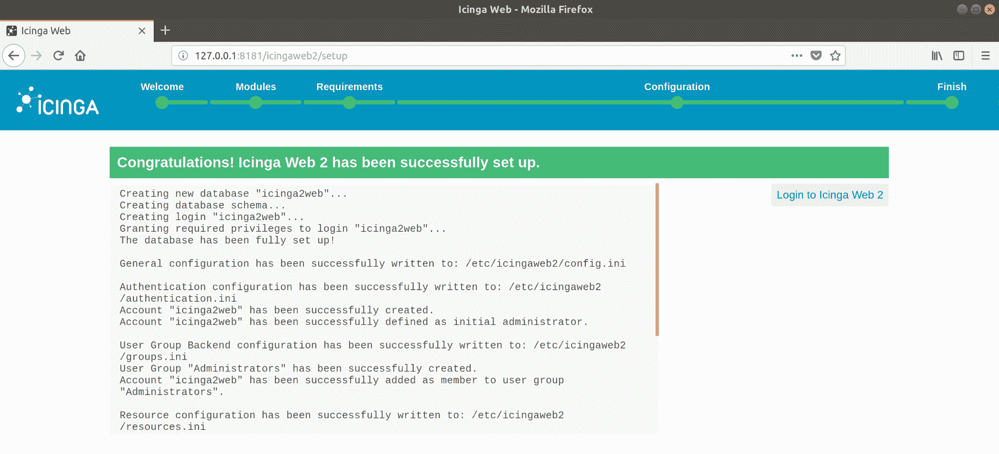

继续到提示的登录页面，并使用我们创建的 web 用户登录：

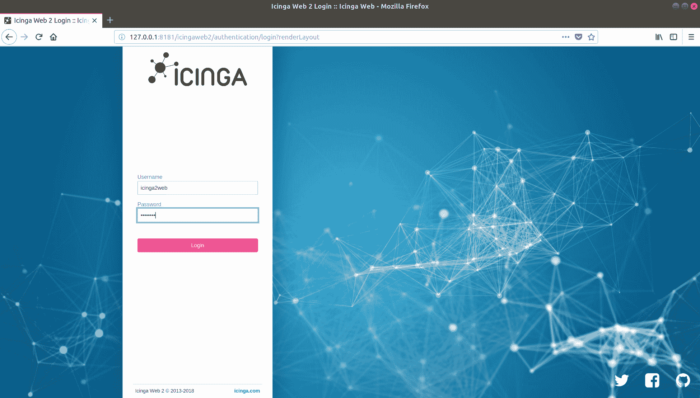

Icinga2 登录页面

设计可能在您阅读本书时已经有所改变，但希望您有一个接近以下 Icinga2 仪表板的东西：

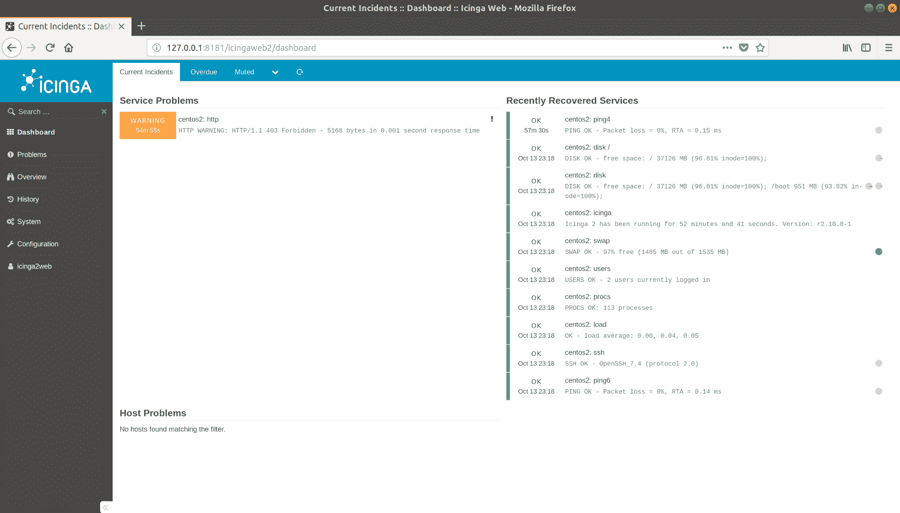

在进入下一部分之前，先四处看看，我们将添加另一个主机。

首先，我们必须在安装客户端之前将我们的第一个服务器建立为`master`。

您可以使用设置脚本来完成此操作；我已经将唯一需要的更改用粗体标出：

```
$ sudo icinga2 node wizard
Welcome to the Icinga 2 Setup Wizard!

We will guide you through all required configuration details.

Please specify if this is a satellite/client setup ('n' installs a master setup) [Y/n]: n

Starting the Master setup routine...

Please specify the common name (CN) [centos2]: 
Reconfiguring Icinga...
Checking for existing certificates for common name 'centos2'...
Certificate '/var/lib/icinga2/certs//centos2.crt' for CN 'centos2' already existing. Skipping certificate generation.
Generating master configuration for Icinga 2.
'api' feature already enabled.

Master zone name [master]: 

Default global zones: global-templates director-global
Do you want to specify additional global zones? [y/N]: 
Please specify the API bind host/port (optional):
Bind Host []: 
Bind Port []: 

Do you want to disable the inclusion of the conf.d directory [Y/n]: 
Disabling the inclusion of the conf.d directory...
Checking if the api-users.conf file exists...

Done.

Now restart your Icinga 2 daemon to finish the installation!
```

按照建议做，并重新启动`icinga2`：

```
$ sudo systemctl restart icinga2
```

为我们的客户端生成一个连接时使用的令牌：

```
$ sudo icinga2 pki ticket --cn debian2
8c7ecd2c04e6ca73bb0d1a6cc62ae4041bf2d5d2
```

现在 SSH 到您的`debian2`盒子并安装`icinga2`：

```
$ sudo apt install icinga2 -y
```

通过节点安装，这次指定我们是代理，并在提示时传入之前的令牌：

```
$ sudo icinga2 node wizard
Welcome to the Icinga 2 Setup Wizard!

We'll guide you through all required configuration details.

Please specify if this is a satellite setup ('n' installs a master setup) [Y/n]: 
Starting the Node setup routine...
Please specify the common name (CN) [debian2]: 
Please specify the master endpoint(s) this node should connect to:
Master Common Name (CN from your master setup): centos2
Do you want to establish a connection to the master from this node? [Y/n]: 
Please fill out the master connection information:
Master endpoint host (Your master's IP address or FQDN): 192.168.33.11
Master endpoint port [5665]: 
Add more master endpoints? [y/N]: 
Please specify the master connection for CSR auto-signing (defaults to master endpoint host):
Host [192.168.33.11]: 
Port [5665]: 
information/base: Writing private key to '/etc/icinga2/pki/debian2.key'.
information/base: Writing X509 certificate to '/etc/icinga2/pki/debian2.crt'.
information/cli: Fetching public certificate from master (192.168.33.11, 5665):

Certificate information:

 Subject:     CN = centos2
 Issuer:      CN = Icinga CA
 Valid From:  Oct 13 22:34:30 2018 GMT
 Valid Until: Oct  9 22:34:30 2033 GMT
 Fingerprint: B5 0B 00 5D 5F 34 14 08 D7 48 8E DA E1 83 96 35 D9 0F 54 1F 

Is this information correct? [y/N]: y
information/cli: Received trusted master certificate.

Please specify the request ticket generated on your Icinga 2 master.
 (Hint: # icinga2 pki ticket --cn 'debian2'): 8c7ecd2c04e6ca73bb0d1a6cc62ae4041bf2d5d2
information/cli: Requesting certificate with ticket '8c7ecd2c04e6ca73bb0d1a6cc62ae4041bf2d5d2'.

information/cli: Created backup file '/etc/icinga2/pki/debian2.crt.orig'.
information/cli: Writing signed certificate to file '/etc/icinga2/pki/debian2.crt'.
information/cli: Writing CA certificate to file '/etc/icinga2/pki/ca.crt'.
Please specify the API bind host/port (optional):
Bind Host []: 
Bind Port []: 
Accept config from master? [y/N]: y
Accept commands from master? [y/N]: y
information/cli: Disabling the Notification feature.
Disabling feature notification. Make sure to restart Icinga 2 for these changes to take effect.
information/cli: Enabling the Apilistener feature.
Enabling feature api. Make sure to restart Icinga 2 for these changes to take effect.
information/cli: Created backup file '/etc/icinga2/features-available/api.conf.orig'.
information/cli: Generating local zones.conf.
information/cli: Dumping config items to file '/etc/icinga2/zones.conf'.
information/cli: Created backup file '/etc/icinga2/zones.conf.orig'.
information/cli: Updating constants.conf.
information/cli: Created backup file '/etc/icinga2/constants.conf.orig'.
information/cli: Updating constants file '/etc/icinga2/constants.conf'.
information/cli: Updating constants file '/etc/icinga2/constants.conf'.
Done.

Now restart your Icinga 2 daemon to finish the installation!
```

在`debian2`上重新启动`icinga2`：

```
$ sudo systemctl restart icinga2
```

现在，我们需要配置主服务器来实际检查客户端；我们已经建立了一个连接，可以用`ss`查看：

```
$ ss -t
State      Recv-Q Send-Q                                     Local Address:Port                                                      Peer Address:Port                
ESTAB      0      0                                              10.0.2.15:ssh                                                           10.0.2.2:44828                
ESTAB 0 0 192.168.33.13:5665 192.168.33.11:49398 
```

现在，回到`centos2`，添加以下配置：

```
$ cat <<HERE | sudo tee -a /etc/icinga2/zones.conf
object Endpoint "debian2" {
 host = "192.168.33.13"
}
object Zone "debian2" {
 endpoints = [ "debian2" ]
 parent = "master"
}
HERE
```

为相关区域创建一个`hosts`目录：

```
$ sudo mkdir -p /etc/icinga2/zones.d/master
```

并添加适当的`hosts`配置：

```
$ cat <<HERE | sudo tee /etc/icinga2/zones.d/master/hosts.conf
object Host "debian2" {
 check_command = "hostalive"
 address = "192.168.33.13"
 vars.client_endpoint = name
 vars.os = "Linux"
}
HERE
```

重新启动`icinga2`：

```
$ sudo systemctl restart icinga2
```

此时，您应该在 Icinga2 web GUI 中看到您的客户端：

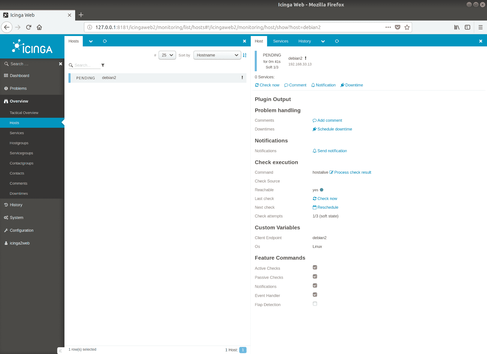

Icinga2 主机页面上有待检查的检查

仅仅让 ping 检查主机有点无用（嗯，大多数情况下；ping 警报在以前曾经救过我），所以让我们也添加一些推荐的服务检查：

```
$ cat <<HERE | sudo tee /etc/icinga2/zones.d/master/services.conf
apply Service "ping4" {
 check_command = "ping4"
 assign where host.address
}
apply Service "ssh" {
 check_command = "ssh" 
 assign where host.vars.os == "Linux"
}
apply Service "disk" {
 check_command = "disk"
 command_endpoint = host.vars.client_endpoint
 assign where host.vars.client_endpoint
}
apply Service "icinga" {
 check_command = "icinga"
 command_endpoint = host.vars.client_endpoint
 assign where host.vars.client_endpoint
}
apply Service "ntp_time" {
 check_command = "ntp_time"
 command_endpoint = host.vars.client_endpoint
 assign where host.vars.client_endpoint
}
HERE
```

再次重启服务。

```
$ sudo systemctl restart icinga2
```

回顾我们的 GUI，现在将显示我们的`debian2`盒子以及一些服务检查（其中有一个失败）：

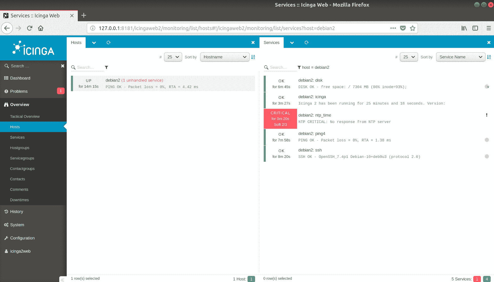

Icinga2 主机页面上的“debian2”

# 它是如何工作的...

通过拥有一个能够看到其他服务器的主服务器，您可以获得所需的可见性，以便在出现需要立即解决的问题时了解情况。

诸如 Nagios 和 Icinga2 之类的监控工具通常通过与远程计算机交互，使用盒子上的脚本或远程自定义命令查询其状态，并报告这些命令的输出。这可以通过多种方式完成，包括但不限于 NRPE 代理，远程 SSH 命令，或从 SNMP 守护程序查询的 SNMP 结果。

通过在基础设施的状态上创建一个单一的真相来源，您可以立即了解到您的基础设施出现问题，甚至可以根据多个症状的数据进行相关性分析。

Icinga2、Nagios、Zabbix 和 Sensu 的行为方式都相对类似，最终都是很好的工具，但通常取决于实施团队（或个人）的个人偏好来决定采用哪种工具。

安装 Nagios 并进行尝试不会有错，因为它是我在野外遇到最多的，而且它的子代/表亲目前统治着这个领域。

# 还有更多...

在这里，我们迅速搭建了一个 Nagios 和 Icinga2 的安装，以展示它们在几个简单命令下的功能。这些配置并不是生产就绪的，需要考虑诸如可重用的监控检查模式，以及安全性（例如 GUI 上的 TLS，以及主服务器和客户端之间使用安全通信方法）。

就像本书中的许多软件一样，您现在应该对如何入门有了很好的理解，但在为自己的系统实施解决方案时应考虑所有选项。如果您要监视的池相对较小，并且不太可能增长，您可能会认为 Nagios 基于文件的监控设置是合适的；如果您有一个更大的、跨越多个地区的基础设施，您可能会发现 Icinga2 及其区域更符合您的口味。

我们还没有涉及电子邮件和警报，只是提到了 Nagios 和 Icinga2 产生的视觉警报。可以通过多种方式将警报插入这两种解决方案（例如短信警报，或在房间角落闪烁的灯泡），但是，从出厂时开始，它们都相对良好地处理电子邮件（假设您有一个功能齐全的电子邮件服务器来传递警报）。

最后，这只是一个入门指南，设置 Icinga2 和 Nagios 还有许多其他方法。在很多方面，它们可以被视为框架而不是软件，因为它们在出厂时是一个相当空白的画布，仍然可以让您按照您希望的复杂或简单的方式构建生产系统。

我曾遇到过 Icinga2 的安装，我对自己的能力非常自信（比平时更多），只是在 5 分钟后开始摸不着头脑，因为我试图解开留给我的手工配置的混乱。

# 另请参阅

我们在这里使用的监控插件很有趣，因为几年前发生了一场激烈的争论，旧的`nagios-plugins.org`域名从一个独立维护的服务器重定向到了一个由 Nagios Enterprises 控制的服务器。

在这次重定向之后发生了一场争论和分裂，导致`monitoring-plugins`和`nagios-plugins`成为独立的实体。值得一提的是，在撰写本文时，`nagios-plugins`在 Debian 系统上是`monitoring-plugins`的别名。

更多信息可以在这篇博客文章中找到：[`www.monitoring-plugins.org/news/new-project-name.html`](https://www.monitoring-plugins.org/news/new-project-name.html)。

Debian 的错误报告可以在这里找到：[`bugs.debian.org/cgi-bin/bugreport.cgi?bug=736331`](https://bugs.debian.org/cgi-bin/bugreport.cgi?bug=736331)。

这是 Red Hat 的错误报告，增加了戏剧性（不要参与其中）：[`bugzilla.redhat.com/show_bug.cgi?id=1054340`](https://bugzilla.redhat.com/show_bug.cgi?id=1054340)。

# 使用 Elastic Stack 集中日志记录

之前，我们提到了远程日志记录的解决方案，涉及将我们的日志记录解决方案（`syslog`和`journald`）转发到运行相同或类似软件的其他主机，以便将日志聚合在一个地方。

这是一个不错的解决方案，在小型环境中运行良好，但它没有太多花里胡哨的功能，如果有什么东西我们在 IT 中喜欢的，那就是我们可以向管理层展示然后永远不会使用的闪亮东西。

Elastic Stack 就是这样一个产品；用他们自己的话说：

基于开源基础，Elastic Stack 可以可靠且安全地从任何来源以任何格式获取数据，并实时搜索、分析和可视化数据。

大胆的说法，但肯定有支持。Elastic Stack 现在是大多数中型以上企业的*事实*集中日志记录解决方案，也许在企业级别有一些竞争对手。

我们将在`centos1`上设置一个小型解决方案，并将我们的日志从`centos2`，`debian1`和`debian2`转发到它。

我花了一天的时间与 X-Pack 和 Elastic Stack 搏斗，所以如果我写的任何东西听起来讽刺或心怀恶意，那可能是有意的。

# 准备工作

在本节中，我们将使用所有的 VMs，最好先运行`vagrant destroy`和`vagrant up`。

请注意，对于本节，我们将安装某些 Elastic Stack 组件的版本 6 发布。配置在历史上已经发生了变化，可能在您阅读本书时再次发生变化；如果有任何不符合您期望的地方，请参考您版本的 Elastic 文档来填补空白。

在本节中，我们将在`centos1`上运行初始设置，然后转到其他 VM 并配置它们的日志目的地。

大多数情况下，我不建议这样做，但对于这一部分，将 VMs 重置为一个新的起点可能是个好主意：

```
$ vagrant destroy -f
$ vagrant up
$ vagrant ssh centos1 -- -L127.0.0.1:5601:127.0.0.1:5601
```

为了方便起见，也因为这不是一本关于安装和配置 Elastic Stack 的书，我们将以相当快的速度运行 Elasticsearch、Kibana 和 Logstash 的安装。

首先，我们需要 Java：

```
$ sudo yum install java-1.8.0-openjdk -y
```

# 如何做...

在`centos1`上，让我们获取 Elastic 存储库：

```
$ cat <<HERE | sudo tee /etc/yum.repos.d/elasticsearch.repo
[elasticsearch-6.x]
name=Elasticsearch repository for 6.x packages
baseurl=https://artifacts.elastic.co/packages/6.x/yum
gpgcheck=1
gpgkey=https://artifacts.elastic.co/GPG-KEY-elasticsearch
enabled=1
autorefresh=1
type=rpm-md
HERE
```

现在我们需要安装各种组件：

```
$ sudo yum install elasticsearch kibana logstash -y
```

并且我们需要启动它们，并进行一些配置调整：

```
$ sudo systemctl daemon-reload
$ sudo systemctl enable --now elasticsearch
$ sudo systemctl enable --now kibana
```

我们将使用 Elastic `syslog`示例（来自[`www.elastic.co/guide/en/logstash/6.4/config-examples.html#_processing_syslog_messages`](https://www.elastic.co/guide/en/logstash/6.4/config-examples.html#_processing_syslog_messages)）来配置我们的`Logstash`设置：

```
$ cat <<HERE | sudo tee /etc/logstash/conf.d/logstash-syslog.conf
input {
 tcp {
 port => 5000
 type => syslog
 }
 udp {
 port => 5000
 type => syslog
 }
}

filter {
 if [type] == "syslog" {
 grok {
 match => { "message" => "%{SYSLOGTIMESTAMP:syslog_timestamp} %{SYSLOGHOST:syslog_hostname} %{DATA:syslog_program}(?:\[%{POSINT:syslog_pid}\])?: %{GREEDYDATA:syslog_message}" }
 add_field => [ "received_at", "%{@timestamp}" ]
 add_field => [ "received_from", "%{host}" ]
 }
 date {
 match => [ "syslog_timestamp", "MMM  d HH:mm:ss", "MMM dd HH:mm:ss" ]
 }
 }
}

output {
 elasticsearch { hosts => ["localhost:9200"] }
 stdout { codec => rubydebug }
}
HERE
```

此配置设置了数据的输入方法，本例中为`tcp`和`udp`端口`5000`。然后为`syslog`内容设置了一个过滤器，最后设置了一个输出到 Elasticsearch（后端）。

现在我们可以启动`Logstash`：

```
$ sudo systemctl enable --now logstash
```

您应该看到您的计算机上有各种端口在监听（这可能需要一些时间，因为各种组件正在启动）：

```
$ ss -tunal '( src :5601 or src :9200 or src :5000 )'
Netid  State      Recv-Q Send-Q                                        Local Address:Port                                                       Peer Address:Port 
udp    UNCONN     0      0                                                         *:5000                                                                  *:* 
tcp    LISTEN     0      128                                               127.0.0.1:5601                                                                  *:* 
tcp    LISTEN     0      128                                                      :::5000                                                                 :::* 
tcp    LISTEN     0      128                                        ::ffff:127.0.0.1:9200                                                                 :::* 
tcp    LISTEN     0      128                                                     ::1:9200                                                                 :::*       
```

现在，我们可以配置我们的其他机器指向`centos1`上的`Logstash`。

# centos2

使用以下`rsyslog`更改开始将`centos2`日志转发到`centos1`实例的`Logstash`：

```
$ sudo sed -i 's/#*.* @@remote-host:514/*.* @192.168.33.10:5000/g' /etc/rsyslog.conf
$ sudo systemctl restart rsyslog
```

我之前建议重建 VMs，但如果你还没有，如果你遵循了关于远程`syslog`配置的早期部分，前面的命令可能需要调整。打开文件并确认行看起来是否符合你的期望。

您可以通过在`centos2`上使用以下内容来测试您的配置：

```
$ logger -p syslog.err "Digimon was better than Pokemon."
```

# debian1 和 debian2

对于 Debian 配置，请使用以下行：

```
$ echo "*.* @192.168.33.10:5000" | sudo tee -a /etc/rsyslog.conf
$ sudo systemctl restart rsyslog
$ logger -p syslog.err "Digimon was better than Pokemon."
```

# Kibana

我们在`Logstash`中有数据，但除非您有点急躁，否则您还看不到它。

如果您已将连接转发到`centos1`，如本节开头所示，您应该能够在您选择的浏览器中导航到`http://localhost:5601`，并受到 Kibana 启动页面的欢迎（假设您的安装已经顺利进行）：

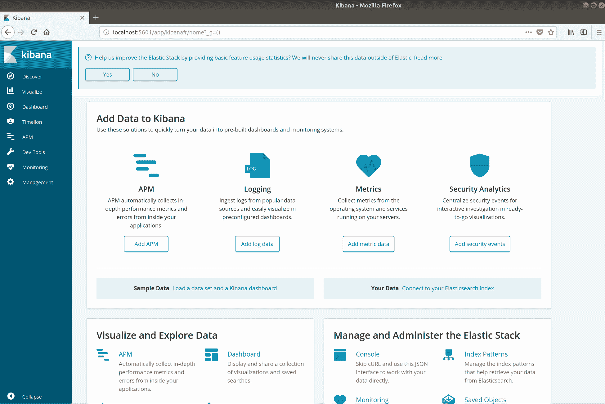

如果您以前使用过 Kibana，您可能期望点击 Discover 并查看您的日志，但实际上您会被踢到 Management：

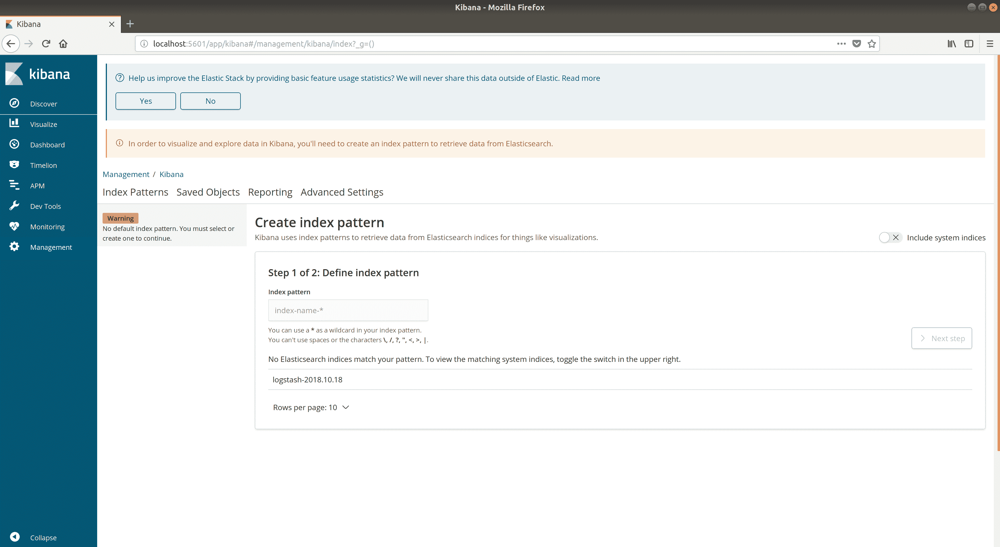

在索引模式的通配符条目中输入`*`，然后点击右侧的下一步：

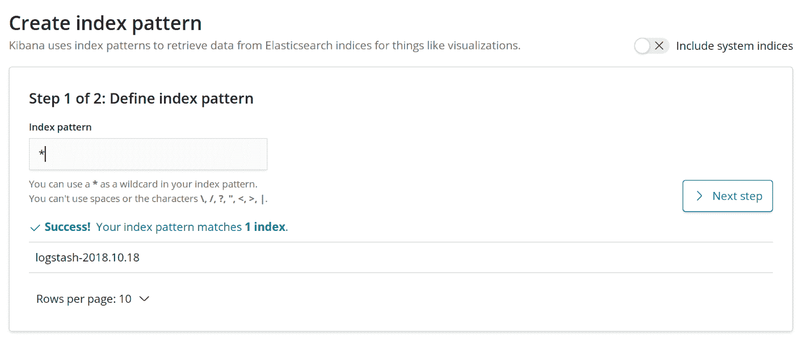

在下一部分，从提供的下拉列表中选择@timestamp，然后点击右侧的 Create index pattern：

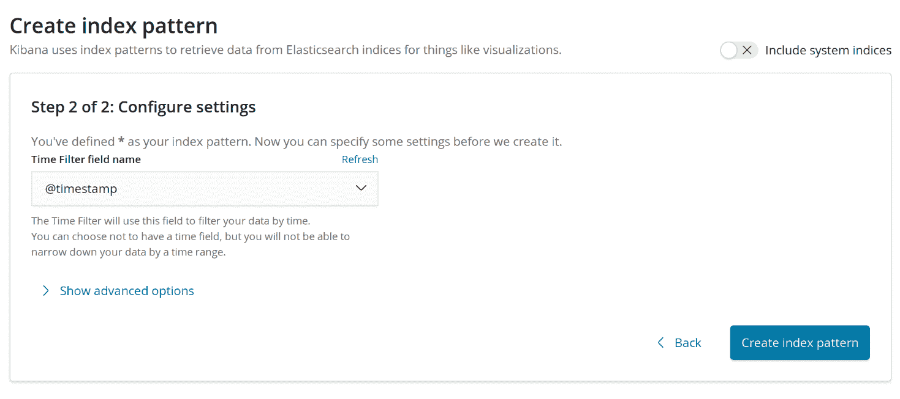

创建索引后，再次点击左侧的 Discover；这次，您应该会看到一个正确的视图：

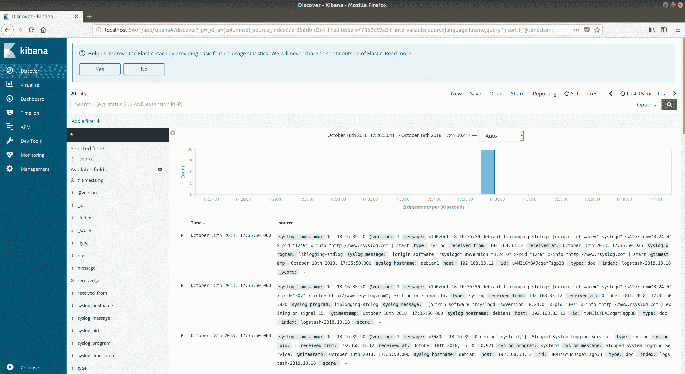

显然，我们想要筛选一下，只是为了确保我们已经得到了一切。

在顶部的搜索框中输入以下过滤查询：

```
(host:192.168.33.13 OR host:192.168.33.12 OR host:192.168.33.11) AND message:"Pokemon*"
```

你应该看到类似这样的东西：

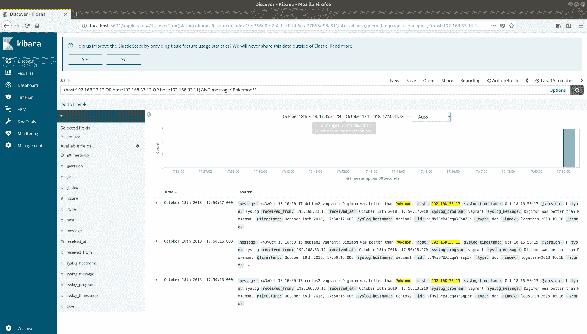

Kibana Discover 页面

如果在 Kibana 中看不到数据，可能是因为 Logstash 在您从其他主机发送日志之前没有完全启动。尝试使用上面的`logger`命令再次发送您的日志。

# 工作原理...

我们实际上正在设置三件事：

+   **Elasticsearch**：作为我们要传输到我们的盒子中的所有数据的存储点

+   **Kibana**：作为我们数据的前端和仪表板，这意味着我们可以在闲暇时查询和查看它

+   **Logstash**：创建一个监听器，就像我们在本章前面设置的`syslog`接收器一样

当这三个组件都启用时，它们可以创建一种集中任何日志（或其他数据）的方式，我们可能希望将其投入我们的解决方案。

基本上它是一个漂亮的`syslog`接收器，而且还能做更多的事情。

我们在这里没有做的一件事是将我们的日志从`centos1`转发到自己的`Logstash`监听器；这是可以做到的，但需要进行一些调整，以确保您不会意外地创建一个日志风暴，随着其自身的日志消息被反馈到自身而呈指数级增长。我可能做过，也可能没有做过。

# 还有更多...

Elastic Stack 不仅仅是 Elasticsearch、Kibana 和 Logstash，还有更多的工具和功能，它们完全是模块化的，可以根据您的需要集成到您的安装中。

它们包括但不限于以下内容：

+   Heartbeat - 用于运行时间监控

+   Filebeat - 用于从远程机器发送日志

+   机器学习能力

我们在这里也设置了一个非常简单的解决方案，我肯定不会在生产中使用。它在传输数据上缺乏安全性，将普通日志流式传输到我们的接收器，并且在 Kibana 仪表板上也没有登录提示或用于浏览器安全性的 TLS。

X-Pack 是解决这些问题的一种方式，在默认安装中作为试用版可用，或者通过许可证，这将花费您一些费用。它允许您在您的安装中设置安全性，包括节点通信和登录安全性（例如 Kibana 用户登录）。

Elastic Stack 也是一套资源消耗大的软件套件，您可能希望在直接安装在壁橱中的中等大小的盒子上之前，先正确地设计您的解决方案。

# 总结-监控和日志记录

虽然这不是任何人的最爱话题（除了我认识的一些非常奇怪的人之外，其中一位是本书的技术编辑之一），但日志记录和监控是任何安装的重要组成部分，无论大小。

您想知道您的盒子何时死掉，或者更好的是，当它们即将死掉时，您还想能够事后找出它们为什么会挂掉。

监控和日志记录可以像你想要的那样复杂或简单。一些公司会雇佣特定的人来处理这些组件，但在较小的组织中，很可能是你最终会负责管理和配置所有这些。如果是这种情况，我目前建议设置 Icinga2 和某种 Elastic Stack 实现，但你的需求和预算可能会有所不同。

我们需要谈谈一个悬而未决的问题，那就是值班，以及你很可能在职业生涯中的某个时刻要做这件事（除非你已经到了可以说“我已经尽过我的职责”并把它留给次要的凡人去承担的幸运时刻）。

总的来说，当进行值班时，监控是你的朋友。在理想的情况下，你不会因为问题而被叫出去，但至少你可以设置自动电话呼叫来唤醒你，以防某些问题在公司之外被其他人注意到之前就变成更大的问题。你不希望出现这样的情况，即公司网站整个周末都挂掉，导致你损失成千上万的销售额。

随着时间的推移，日志和长期监控数据也可以帮助发现你没有意识到的反复出现的问题，因为事件之间的时间间隔是几周甚至几个月；这是在 Kibana 的仪表板上设置历史警报和模式匹配的一个很好的理由。

如果有人每 5 周就不得不清理一次盒子上的日志，而且每次都是团队中的不同人，你可能没有意识到有一个更大的潜在问题需要解决，或者你可能会发现你因为一个可以用简单的`systemd`定时器解决的问题而浪费了数百个小时。

总的来说，我讨厌监控，我不愿意翻阅日志，但在我们的工作中是必要的，而且有很多聪明人在制作非常好用的工具，可以让你的生活变得更轻松。

当你不得不向 CEO 展示仪表板时，拥有漂亮的小部件和功能也是有好处的。
