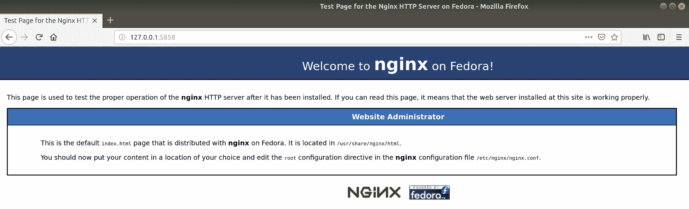
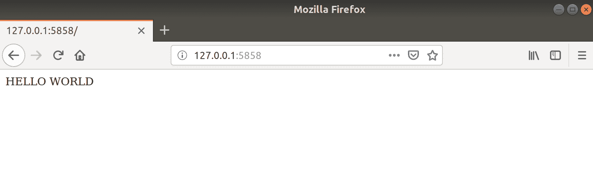

# 第八章：权限、SELinux 和 AppArmor

在本章中，我们将涵盖以下主题：

+   Linux 文件权限

+   修改文件权限

+   用户和组

+   AppArmor 和修改

+   SELinux 和修改

+   检查 SELinux 是否正在运行，以及保持其运行的重要性

+   重置 SELinux 权限

# 介绍

在早期，早在 90 年代的迷雾中，Linux 在访问控制方面并不多……然后是权限和属性。权限和属性是文件的元素，它们决定了系统和用户对该文件（或文件夹）的访问权限，以及在交互方面对文件的操作能力。在基本水平上，您可以使用`ls`查看权限信息（稍后会详细介绍），但现在先看以下示例：

```
$ ls -l .
total 0
-rw-rw-r--. 1 vagrant vagrant 0 Oct 28 10:42 examplefile
```

在本章中，我们将学习从基本的 Linux 权限到 SELinux 和 AppArmor。我们还将探讨可能由 SELinux 或 AppArmor 引起的故障排除问题。我们还将学习不要禁用扩展权限控制的重要性。

在安全方面，锁定系统显然很重要，而在极端情况下，您可以创建一个系统，其中每个程序都对其他程序一无所知（实际上使每个程序都被隔离）。

虽然安全性从来都不是坏事，但平衡至关重要。您不希望开始为 Ubuntu 安装中的每个文件的权限而感到紧张，那里有成千上万个文件，除非您在完成之前就疯了……除非这确实是您唯一的工作，或者您想要一个特别乏味的爱好，否则就放手去做吧！

# 技术要求

在本章中，我们将使用以下`Vagrantfile`；请注意，我们只使用两台机器：CentOS 突出显示 SELinux 的功能和能力，以及 Ubuntu 安装用于 AppArmor：

```
# -*- mode: ruby -*-
# vi: set ft=ruby :

$provisionScript = <<-SCRIPT
sed -i 's/console=tty0 console=ttyS0,115200n8//g' /boot/grub2/grub.cfg
systemctl restart sshd
SCRIPT

Vagrant.configure("2") do |config|

 config.vm.define "centos7" do |centos7|
 centos7.vm.box = "centos/7"
 centos7.vm.box_version = "1804.02"
 centos7.vm.provision "shell",
 inline: $provisionScript
 end

 config.vm.define "ubuntu1804" do |ubuntu1804|
 ubuntu1804.vm.box = "ubuntu/bionic64"
 ubuntu1804.vm.box_version = "20180927.0.0"
 end

end
```

在撰写本文时，此处使用的`provisionScript`是为了修复本章中一个部分的轻微问题。如果您在使用此脚本时遇到问题，请随时从配置中删除它（在相关部分中稍后会有一条注释，我们会在那里讨论`.autorelabel`）。

# Linux 文件权限

首先，我们将回到基础知识，看一下默认的 Linux 文件权限。

在本节中，我们将使用 CentOS 框上的一个文件和一个目录，以突出一些重要的基本知识，这些知识可以帮助我们继续前进。

Unix 和类 Unix 系统上的文件权限与 Windows 和其他操作系统安装中的文件权限不同。如果您将使用 Unix 文件系统（如 XFS）格式化的硬盘连接到 Windows 框，它可能无法准确读取文件的权限（除非您有软件可以为您执行此操作）。近年来，由于 Windows 10 中包含的 Windows 子系统等因素，这些界限已经有所模糊，但基本原则基本上是正确的。

# 准备工作

跳到您的 CentOS 框。在本节中，我们讨论的所有内容都适用于 Linux 发行版：

```
$ vagrant ssh centos7
```

按照以下方式创建一个文件、一个目录和该目录中的一个文件：

```
$ touch examplefile
$ mkdir exampledir
$ touch exampledir/examplefile-in-exampledir
```

# 操作步骤

在*准备工作*部分的文件就绪后，运行`ls -l`查看我们创建的内容：

```
$ ls -l
total 0
drwxrwxr-x. 2 vagrant vagrant 39 Oct 28 11:01 exampledir
-rw-rw-r--. 1 vagrant vagrant 0 Oct 28 11:00 examplefile
```

此处使用的`-l`表示使用长列表格式，并且不仅用于打印找到的文件和文件夹，还用于为我们提供更完整的图片。

# 工作原理

我们需要对此进行详细说明，因为乍一看，它可能会显得相当令人困惑：

# exampledir

从`exampledir`开始，让我们看看这个目录的权限和所有权。

```
drwxrwxr-x. 2 vagrant vagrant
```

我们有一系列字母、一个数字`2`，然后是两个名字，`vagrant`和`vagrant`。

```
drwxrwxr-x.
```

开头的`d`很容易理解；它表示列出的项目实际上是一个目录。

```
drwxrwxr-x.
```

然后，我们有三个看起来相似的元素，其中第一个是用户权限。在这里，权限是读、写和执行。

这意味着用户将能够在目录中 `touch`（创建）文件，`mv`（重命名）它们，`ls`（列出）它们，`cat`/`less`（读取）它们，甚至 `rm`（删除）它们，如果他们愿意的话。

```
drwxrwxr-x.
```

接下来，我们有组权限，这里再次是读、写和执行。

```
drwxrwxr-x.
```

第三，我们有每个人的权限，这种情况下任何人都可以读取或进入目录。

他们将无法创建、重命名或删除现有文件，因为他们没有写 (`w`) 权限。

即使是有经验的系统管理员也会忘记这一点。如果你在一个可以访问目录中文件内容的组中，但目录本身的权限不允许这样做，你将无法完成操作。我听到一些与这个小提示相关的相当显著的叹息声。

我们还有块末尾的 `.`。现在我们不用太担心这个，但它表示目录已经应用了安全上下文：

```
drwxrwxr-x. 2
```

在这种情况下，数字 `2` 指的是指向索引节点的位置的数量（实际存储数据的磁盘上的位置）。在这种情况下为什么是 `2` 是因为每次创建一个目录时都会创建两个条目，可以用 `ls -la` 查看：

```
$ ls -la exampledir/
total 0
drwxrwxr-x. 2 vagrant vagrant 39 Oct 28 11:18 .
drwx------. 4 vagrant vagrant 132 Oct 28 11:01 ..
-rw-rw-r--. 1 vagrant vagrant 0 Oct 28 11:18 examplefile-in-exampledir
```

在这里，我们可以看到两个特殊条目，`.` 和 `..`，分别指代这个目录和父目录。

因此，有两个链接指向这个目录；第一个是来自父目录 (`/home/vagrant/exampledir`)，第二个是来自目录本身 (`/home/vagrant/exampledir/.`)。搞糊涂了吗？

现在是一个更容易的部分，`vagrant vagrant` 条目：

```
vagrant vagrant
```

这些只是用户，然后是组，他们的权限反映在 `drwxrwxr-x.` 块中。没有每个人的条目，因为那样就没有意义了。

# 示例文件

继续讨论 `examplefile`，我们有以下内容：

```
-rw-rw-r--. 1 vagrant vagrant  0 Oct 28 11:00 examplefile
```

在这里，我们可以看到与 `exampledir` 几乎相同，有一些变化。

`d` 被 `a` 替换了，意味着我们正在处理一个实际文件。

```
-rw-rw-r--.
```

用户和组的权限只有读和写，这意味着文件可以被读取和修改，但用户和组还不能执行。

```
-rw-rw-r--.
```

其他所有人的权限只有读，这意味着文件可以使用 `cat`/`less`，但不能被修改或执行。

```
-rw-rw-r--. 1
```

最后，我们可以看到链接数为 `1`，这是有道理的，因为底层索引节点没有从其他地方引用。

# 还有更多...

还有一些有用的东西要提一下，即使我们在这里没有涉及。

# 对目录和文件的根访问

`god/super/almighty` 用户 (`root`) 几乎对系统上的所有东西都有完全的访问权限，这意味着你可能会看到人们采取的一个常见快捷方式是以下内容，如果他们对无法读取文件感到沮丧：

```
$ sudo cat examplefile
```

这将起作用，因为 `root` 有这个权限，但是养成使用 `sudo` 处理所有事情的坏习惯是不好的。要有选择地使用它，并在任意在命令前加上 `sudo` 之前考虑一下你在做什么。 （大多数情况下，这是对我自己的一条信息，因为我和其他人一样，也经常犯这个错误。）

# 其他执行字符

在执行列中，除了普通的 `x` 外，还可能看到其他字符，其中最常见的是 `s` 和 `t`。

看看 `wall` 程序的这些权限：

```
$ ls -l /usr/bin/wall
-r-xr-sr-x. 1 root tty 15344 Jun 9 2014 /usr/bin/wall
```

请注意组中的 `s` 替代了 `x`。

这被称为 `setuid` 和 `setgid` 位，取决于它是在用户还是组三元组中，它有效地将执行用户的权限更改为所有者或组的权限，再次取决于三元组。在这种情况下，执行 `wall` 命令的用户获得 `tty` 组的权限（允许 `wall` 输出到所有 `tty`）。

在这里，我正在使用 `wall` 作为 vagrant 用户：

```
$ wall There is no Hitchhikers Movie! 
$ 
Broadcast message from vagrant@localhost.localdomain (pts/0) (Sun Oct 28 11:52:12 2018):

There is no Hitchhikers Movie!
```

`t` 条目，或者叫做粘性位，再次非常罕见，但它最常设置在 `/tmp` 目录上：

```
$ ls -la /tmp
total 0
drwxrwxrwt. 8 root root 172 Oct 28 11:54 .
<SNIP>
```

记住`.`字符指的是这个目录。

它设置了只有`/tmp`中文件的所有者才能重命名或删除该文件，这意味着如果我以`vagrant`用户的身份在`/tmp`中创建文件，其他人就不能来删除我的文件（除了`root`）。在视觉上，它看起来像下面这样：

```
$ rm /tmp/test2 
rm: remove write-protected regular empty file '/tmp/test2'? y
rm: cannot remove '/tmp/test2': Operation not permitted
```

还有其他两个执行字符，但这些是最常见的。

# 修改文件权限

创建文件是很好的，但最终我们会遇到默认权限不可接受的情况。

一个很好的例子是 SSH，除非在你的公钥和私钥上有一些特别严格的文件权限，否则它根本不会工作。

所以，"三剑客"来了，以`chown`，`chmod`和`chattr`的形式。

如果你想要真的很烦人，并且容易失去朋友，坚持称呼这些为它们的全称：改变所有权，改变模式和改变属性。

# 准备工作

在本节中，我们将再次使用我们的`Vagrantfile`中的 CentOS VM，因为我们所做的一切都是普遍适用的。

SSH 到你的 CentOS VM：

```
$ vagrant ssh centos7
```

进入`/home`目录（上一级）并创建一个文件，一个目录，以及该目录中的一个文件：

```
$ cd /home
$ sudo touch permissionfile
$ sudo mkdir permissiondir
$ sudo touch permissiondir/permissionfile-in-permissiondir
```

我们还将创建另一个虚拟用户，我们可以用来解释本节中正在做的事情：

```
$ sudo adduser packt -s /bin/bash -p '$1$2QzaOp2Q$Ke2yWZ1N2h4rk8r8P95Sv/'

```

请注意，我们设置的密码是'correcthorsebatterystaple'。

# 如何做...

我们将按顺序运行三个命令（`chown`，`chmod`和`chattr`）。

# chown

从最简单的部分开始，我们将查看所讨论文件的所有权。

首先列出我们已经拥有的内容：

```
$ ls -lha
total 0
drwxr-xr-x. 4 root root 64 Oct 28 12:37 .
dr-xr-xr-x. 18 root root 239 Oct 28 12:35 ..
drwxr-xr-x. 2 root root 45 Oct 28 12:37 permissiondir
-rw-r--r--. 1 root root 0 Oct 28 12:37 permissionfile
drwx------. 3 vagrant vagrant 74 May 12 18:54 vagrant
```

假设我们想让我们的 vagrant 用户可以写入`permissionfile`，而不是当前只能读取它的能力。请注意以下内容：

```
$ echo "RFCs are great if boring." > permissionfile
-bash: permissionfile: Permission denied
```

我们将使用`chown`进行更改，通过传递我们想要将文件更改为的用户和组：

```
$ sudo chown vagrant:root permissionfile
```

现在，检查权限：

```
$ ls -l permissionfile
-rw-r--r--. 1 vagrant root 0 Oct 28 12:37 permissionfile
```

这意味着我们作为 vagrant 用户现在可以写入文件：

```
$ echo "RFCs are great if boring." > permissionfile
$ cat permissionfile
RFCs are great if boring.
```

但是，其他用户（不是`root`）无法写入文件：

```
$ su - packt -c "echo IMPOSSIBLE > /home/permissionfile"
Password: 
-bash: /home/permissionfile: Permission denied
```

在这里，我们使用`su`以 Packt 用户的身份执行命令，并且我们展示了尽管我们尝试向文件`echo IMPOSSIBLE`，但失败了。我们使用了`permissionfile`的完整路径，以确保我们没有在 Packt 用户的`home`目录中创建文件。

# chmod

我们在这里对旧的 Packt 用户有点不公平，所以让我们给每个人都有写入文件的能力，而不仅仅是`vagrant`：

```
$ sudo chmod 646 permissionfile $ ls -l permissionfile
-rw-r--rw-. 1 vagrant root 26 Oct 28 12:48 permissionfile
```

现在，我们应该能够像任何用户一样写入文件，而不仅仅是 vagrant：

```
$ su - packt -c "echo POSSIBLE > /home/permissionfile"
Password: 
$ cat permissionfile 
POSSIBLE
```

# chattr

我开始觉得我们在这里太宽容了，所以让我们完全锁定文件，这样没有人（甚至是全能的`root`）都不能乱动它：

```
$ sudo chattr +i permissionfile
```

我们已经使文件不可变！

```
$ echo "RFCs are great if boring." > permissionfile
-bash: permissionfile: Permission denied
```

我们可以使用`lsattr`命令来查看这一点：

```
$ lsattr permissionfile
----i----------- permissionfile
```

甚至`root`也无法修改文件：

```
$ sudo echo "RFCs are great if boring." > permissionfile
-bash: permissionfile: Permission denied
```

`chattr`可以应用各种属性到文件上，但我敢打赌不可变选项是最常用的。

要删除属性，再次使用`chattr`：

```
$ sudo chattr -i permissionfile
```

# 它是如何工作的...

再次运行每个命令，让我们简要看一下我们做了什么。

# chown

首先，我们改变了文件的所有权：

```
$ sudo chown vagrant:root permissionfile
```

在这里，我们以最基本的方式使用`chown`，指定文件应属于哪个用户和组。这些值是用冒号分隔的，尽管如果你像我一样保守，偶尔会使用已弃用和不正确的句号(`.`)。

如果你只想保留组，你可以只指定一个用户：

```
$ sudo chown vagrant permissionfile
```

# chmod

接下来，我们更改了我们的文件，以便任何人都可以写入它：

```
$ sudo chmod 646 permissionfile
```

在这里，我们传递了一些八进制值给`permissionfile`，以便依次更改用户、组和其他人的权限。

我不会详细介绍这一点，但实际上，第一个数字表示用户三元组应该是什么值，然后是组的三元组，然后是其他人。

我们的用户得到了`6`的值，这意味着读/写；我们的组只能读取`4`，其他人可以读/写`6`。

这是因为每个值都有一个数字等价物，如下所示：

+   `x` = `1`

+   `w` = `2`

+   `r` = `4`

所以，`6`值是`4`+`2`，或者`r`/`w`，而`4`值只是`r`。

你可以设置`777`，这意味着对所有事物和所有人都有`r`/`w`/`x`权限，这经常是由不理解文件权限的人所做的。这不是一个好的做法，应该在故障排除之外加以阻止。如果我发现有人在生产环境中对文件运行了`chmod 777`，那么这个人将被取消访问权限，并且会在他们的日历中快速介绍权限。

# chattr

最后，我们改变了文件的一个属性，具体是使文件对`root`甚至是不可变的，然后我们再次移除了标志。

除了不可变之外，`chattr`主页中列出了许多其他标志，其中一些在特定情况下可能会有用：

+   `a`：文件只能被追加（对日志有用）

+   `c`：透明压缩和解压

+   `s`：导致文件的块在文件删除时被清零并写回磁盘

并非所有属性都受到所有文件系统的尊重；检查你的文件系统是否也支持它们（提示：`ext4`不支持很多）。

# 还有更多...

在我们结束本节之前，还有一两件事情需要注意。

# 在 chmod 中避免八进制表示法（如果你讨厌它）

在`chmod`世界中，你并不一定非要使用八进制格式；它确实给了你其他更容易阅读的选项：

```
$ sudo chmod uo=rw,g=r permissionfile
```

前面的命令会给用户和其他人读/写权限，给组读权限。

或者，你可以向权限添加一个值：

```
$ sudo chmod g+x permissionfile 
```

这将授予组额外的执行文件的能力：

```
$ ls -l permissionfile
-rw-r-xrw-. 1 vagrant root 26 Oct 28 13:03 permissionfile
```

# 分层权限

我们创建了一个目录，并在该目录中创建了一个文件，所以让我们快速了解一下理解目录权限。

首先，我们的`permissiondir`看起来是这样的：

```
$ ls -la permissiondir
total 0
drwxr-xr-x. 2 root root 45 Oct 28 12:37 .
drwxr-xr-x. 5 root root 77 Oct 28 12:37 ..
-rw-r--r--. 1 root root 0 Oct 28 12:37 permissionfile-in-permissiondir
```

尽管我们想要，但我们目前无法重命名这个文件，因为它太长了：

```
$ mv permissiondir/permissionfile-in-permissiondir permissiondir/permissionfile2
mv: cannot move 'permissiondir/permissionfile-in-permissiondir' to 'permissiondir/permissionfile2': Permission denied
```

所以，让我们为这个文件设置所有人的写权限：

```
$ sudo chmod 646 permissiondir/permissionfile-in-permissiondir
```

现在，让我们再试一次：

```
$ mv permissiondir/permissionfile-in-permissiondir permissiondir/permissionfile2
mv: cannot move 'permissiondir/permissionfile-in-permissiondir' to 'permissiondir/permissionfile2': Permission denied
```

嗯。

好的，这是因为实际上是目录权限阻止我们移动文件，而不是文件权限。我们必须修改包含文件的目录，因为权限不允许我们重命名（`mv`）文件：

```
$ sudo chmod 667 permissiondir/
```

现在我们应该能够移动文件了，因为我们的权限现在非常宽松：

```
$ mv permissiondir/permissionfile-in-permissiondir permissiondir/permissionfile2
```

成功！

# 另请参阅

在本节中我们没有涵盖的一件事是**访问控制列表**（**ACLs**），它可以用来进一步扩展文件的权限。

首先在我们的`permissionfile`中放入一个小命令来执行某些操作：

```
$ echo "printf 'Fire indeed hot'" > permissionfile
```

假设我们想要查看文件的整个访问控制列表；我们将使用`getfacl`：

```
$ getfacl permissionfile 
# file: permissionfile
# owner: vagrant
# group: root
user::rw-
group::r-x
other::rw-
```

在这里，我们可以看到所有者是`vagrant`，用户有`rw`。

但是，如果我们希望 Packt 能够执行该文件，而不影响其他权限呢？目前，Packt 不能，因为它不在`root`组中。

一个潜在的解决方案是`setfacl`：

```
$ setfacl -m u:packt:rwx permissionfile
```

现在我们可以看到`ls`中有一个小`+`号，显示我们的文件有扩展的访问控制：

```
$ ls -l permissionfile
-rw-r-xrw-+ 1 vagrant root 26 Oct 28 13:03 permissionfile
```

而且，我们可以再次使用`getfacl`来查看这些：

```
$ getfacl permissionfile 
# file: permissionfile
# owner: vagrant
# group: root
user::rw-
user:packt:rwx
group::r-x
mask::rwx
other::rw-
```

这意味着我们的`vagrant`用户无法执行该文件：

```
$ ./permissionfile
-bash: ./permissionfile: Permission denied
```

但是，我们的 Packt 用户可以：

```
$ su - packt -c "/home/permissionfile" 
Password: 
Fire indeed hot
```

# 技术要求

在本节中，我们将跳转到我们的 CentOS 和 Ubuntu 虚拟机上，以突出用户和组处理方法上的一些重要差异。

# 用户和组

我们已经涵盖了文件权限方面的用户和组，但是简要地回顾一下我们对用户和组的了解是个好主意。

在本节中，我们将深入探讨用户和组的简要介绍，确定进程正在以哪个用户运行，它如何更改为该用户，并通过使用`/etc/passwd`和类似命令来查找系统中存在哪些用户。

# 准备工作

使用 Vagrant 连接到你的 Ubuntu 和 CentOS 虚拟机，在不同的窗口中或者依次进行：

```
$ vagrant ssh centos7 $ vagrant ssh ubuntu1804
```

# 如何做...

在几个简短的部分中，我们将看一下用户和组的不同元素。

# whoami

如果你需要知道你是谁，通过深层反思和内心沉思来问问自己。

如果你需要知道有哪些用户登录到服务器上（或者以某个用户身份运行命令），这将会更容易：

```
$ whoami
vagrant $ sudo whoami
root
```

# 系统上的用户

要显示系统上有哪些用户，请查看`/etc/passwd`。

在 CentOS 上，它看起来会像这样：

```
$ cat /etc/passwd
root:x:0:0:root:/root:/bin/bash
bin:x:1:1:bin:/bin:/sbin/nologin
daemon:x:2:2:daemon:/sbin:/sbin/nologin
adm:x:3:4:adm:/var/adm:/sbin/nologin
lp:x:4:7:lp:/var/spool/lpd:/sbin/nologin
sync:x:5:0:sync:/sbin:/bin/sync
shutdown:x:6:0:shutdown:/sbin:/sbin/shutdown
halt:x:7:0:halt:/sbin:/sbin/halt
mail:x:8:12:mail:/var/spool/mail:/sbin/nologin
operator:x:11:0:operator:/root:/sbin/nologin
games:x:12:100:games:/usr/games:/sbin/nologin
ftp:x:14:50:FTP User:/var/ftp:/sbin/nologin
nobody:x:99:99:Nobody:/:/sbin/nologin
systemd-network:x:192:192:systemd Network Management:/:/sbin/nologin
dbus:x:81:81:System message bus:/:/sbin/nologin
polkitd:x:999:998:User for polkitd:/:/sbin/nologin
rpc:x:32:32:Rpcbind Daemon:/var/lib/rpcbind:/sbin/nologin
rpcuser:x:29:29:RPC Service User:/var/lib/nfs:/sbin/nologin
nfsnobody:x:65534:65534:Anonymous NFS User:/var/lib/nfs:/sbin/nologin
sshd:x:74:74:Privilege-separated SSH:/var/empty/sshd:/sbin/nologin
postfix:x:89:89::/var/spool/postfix:/sbin/nologin
chrony:x:998:996::/var/lib/chrony:/sbin/nologin
vagrant:x:1000:1000:vagrant:/home/vagrant:/bin/bash
packt:x:1001:1001::/home/packt:/bin/bash
```

而在 Ubuntu 上，它看起来会像这样：

```
$ cat /etc/passwd
root:x:0:0:root:/root:/bin/bash
daemon:x:1:1:daemon:/usr/sbin:/usr/sbin/nologin
bin:x:2:2:bin:/bin:/usr/sbin/nologin
sys:x:3:3:sys:/dev:/usr/sbin/nologin
sync:x:4:65534:sync:/bin:/bin/sync
games:x:5:60:games:/usr/games:/usr/sbin/nologin
man:x:6:12:man:/var/cache/man:/usr/sbin/nologin
lp:x:7:7:lp:/var/spool/lpd:/usr/sbin/nologin
mail:x:8:8:mail:/var/mail:/usr/sbin/nologin
news:x:9:9:news:/var/spool/news:/usr/sbin/nologin
uucp:x:10:10:uucp:/var/spool/uucp:/usr/sbin/nologin
proxy:x:13:13:proxy:/bin:/usr/sbin/nologin
www-data:x:33:33:www-data:/var/www:/usr/sbin/nologin
backup:x:34:34:backup:/var/backups:/usr/sbin/nologin
list:x:38:38:Mailing List Manager:/var/list:/usr/sbin/nologin
irc:x:39:39:ircd:/var/run/ircd:/usr/sbin/nologin
gnats:x:41:41:Gnats Bug-Reporting System (admin):/var/lib/gnats:/usr/sbin/nologin
nobody:x:65534:65534:nobody:/nonexistent:/usr/sbin/nologin
systemd-network:x:100:102:systemd Network Management,,,:/run/systemd/netif:/usr/sbin/nologin
systemd-resolve:x:101:103:systemd Resolver,,,:/run/systemd/resolve:/usr/sbin/nologin
syslog:x:102:106::/home/syslog:/usr/sbin/nologin
messagebus:x:103:107::/nonexistent:/usr/sbin/nologin
_apt:x:104:65534::/nonexistent:/usr/sbin/nologin
lxd:x:105:65534::/var/lib/lxd/:/bin/false
uuidd:x:106:110::/run/uuidd:/usr/sbin/nologin
dnsmasq:x:107:65534:dnsmasq,,,:/var/lib/misc:/usr/sbin/nologin
landscape:x:108:112::/var/lib/landscape:/usr/sbin/nologin
sshd:x:109:65534::/run/sshd:/usr/sbin/nologin
pollinate:x:110:1::/var/cache/pollinate:/bin/false
vagrant:x:1000:1000:,,,:/home/vagrant:/bin/bash
ubuntu:x:1001:1001:Ubuntu:/home/ubuntu:/bin/bash
```

大多数这些用户你不会自己创建；它们大部分是系统用户，或者与你安装的软件捆绑在一起。

# 系统上的组

组的发现方式与用户类似，同样，你不会创建大部分组。

对于 CentOS，请注意以下内容：

```
$ cat /etc/group
root:x:0:
bin:x:1:
daemon:x:2:
sys:x:3:
adm:x:4:
tty:x:5:
disk:x:6:
lp:x:7:
mem:x:8:
kmem:x:9:
wheel:x:10:
<SNIP>
postfix:x:89:
chrony:x:996:
screen:x:84:
vagrant:x:1000:vagrant
packt:x:1001:
```

对于 Ubuntu，请注意以下内容：

```
$ cat /etc/group
root:x:0:
daemon:x:1:
bin:x:2:
sys:x:3:
adm:x:4:syslog,ubuntu
tty:x:5:
<SNIP>
landscape:x:112:
admin:x:113:
netdev:x:114:ubuntu
vboxsf:x:115:
vagrant:x:1000:
ubuntu:x:1001:
```

我已经加粗了这个 Ubuntu 和 CentOS 系统之间的第一个重大区别，即`wheel`和`admin`组。`wheel`在我们的 Ubuntu 系统上不存在，因为它已被`admin`组取代；这意味着 Ubuntu 上的`visudo`文件引用了`admin`组的成员，而不是`wheel`。记住这一点。

# 使用用户的守护进程

在我们的 Ubuntu 系统上，`syslogd`守护进程是使用`syslog`用户运行的。

我们可以通过定位我们的`rsyslogd`进程并检查最左边列中的用户来确认这一点：

```
$ pidof rsyslogd
917
$ ps -up 917
USER PID %CPU %MEM VSZ RSS TTY STAT START TIME COMMAND
syslog 917 0.0 0.4 263036 4416 ? Ssl 10:41 0:00 /usr/sbin/rsyslogd -n
```

我们可以通过查看`/etc/rsyslog.conf`配置文件来找到这个用户是如何被发现的：

```
$ grep PrivDrop /etc/rsyslog.conf
$PrivDropToUser syslog
$PrivDropToGroup syslog
```

如果你想快速排除以`root`身份运行的进程，你可以使用一个快速的一行命令，比如下面的（尽管这并不完美）。

这是我们的 CentOS 虚拟机上的情况：

```
$ ps aux | grep -v root
USER PID %CPU %MEM VSZ RSS TTY STAT START TIME COMMAND
dbus 558 0.0 0.5 66428 2568 ? Ssl 12:34 0:00 /usr/bin/dbus-daemon --system --address=systemd: --nofork --nopidfile --systemd-activation
rpc 559 0.0 0.2 69220 1060 ? Ss 12:34 0:00 /sbin/rpcbind -w
polkitd 568 0.0 1.6 538436 8020 ? Ssl 12:34 0:00 /usr/lib/polkit-1/polkitd --no-debug
chrony 581 0.0 0.3 117752 1828 ? S 12:34 0:00 /usr/sbin/chronyd
postfix 1088 0.0 0.8 89792 4080 ? S 12:35 0:00 qmgr -l -t unix -u
vagrant 3369 0.0 0.5 154904 2688 ? S 14:11 0:00 sshd: vagrant@pts/0
vagrant 3370 0.0 0.5 15776 2660 pts/0 Ss 14:11 0:00 -bash
postfix 3399 0.0 0.8 89724 4052 ? S 14:15 0:00 pickup -l -t unix -u
vagrant 3404 0.0 0.3 55140 1872 pts/0 R+ 14:32 0:00 ps aux
```

# 它是如何工作的...

通常，不同的用户和组将具有特定的用途，有意地分隔开来，以便它们在自己的权利范围内不会太强大。如果你有一个多租户系统（这在今天非常罕见），有多个人登录进行日常工作，你希望确保这个人不能通过做一些愚蠢的事情，比如覆盖盒子上的日志，让其他人的生活变得更加困难。

你可以通过将所有人类用户放在一个组中来解决这个问题，然后允许他们拥有自己的有限访问权限的用户，然后给予该组访问共享目录和他们可能需要使用的应用程序的权限。

进程有选择放弃它们的特权的选项，尽管并非所有进程都会默认这样做，如果你想再走这一步，通常需要大量工作来设置。在这里，我们看到`syslog`启动（作为`root`），然后立即降低自己的特权级别到`syslog`用户和组的级别。

`rsyslogd`必须以`root`身份启动的原因是因为它绑定到低于`1024`的端口，这些端口是只有`root`程序可以访问的受限端口。

一些发行版和操作系统对此的处理方式比其他的更加严格，但就像所有与安全相关的事情一样，这就像是安全的洋葱的另一层。

# 还有更多...

看看你的 Ubuntu 虚拟机上的这个用户：

```
$ grep apt /etc/passwd
_apt:x:104:65534::/nonexistent:/usr/sbin/nologin
```

它有一个下划线，在整个`/etc/passwd`文件中是唯一一个有下划线的；这可能是为什么呢？

一个潜在的原因是它是一个系统账户，应用程序维护者或开发者决定用下划线字符表示这一点，就像其他操作系统一样。

# AppArmor 和修改

在本节中，我们将在 Ubuntu 上使用 AppArmor，并确定它对我们的系统有什么影响。

AppArmor 默认安装在 Ubuntu 上。它最初是由 SUSE 开发的，但 Canonical 似乎已经坚定地将他们的旗帜插在了 AppArmor 星球上，在 Ubuntu 7.04 中引入了它，并在 7.10（2007 年）中默认启用了它。

像 SELinux 一样，AppArmor 是将强制访问控制（MAC）引入 Linux 的一种方式；它自 2.6.36 内核以来就已经包含在内。

# 准备工作

在本节中，我们将使用我们的 Ubuntu 虚拟机。

SSH 到你的 Ubuntu 虚拟机：

```
$ vagrant ssh ubuntu1804
```

# 如何做...

首先，让我们确保`apparmor`正在运行，使用我们的老朋友`systemctl`：

```
$ systemctl status apparmor
● apparmor.service - AppArmor initialization
 Loaded: loaded (/lib/systemd/system/apparmor.service; enabled; vendor preset: enabled)
 Active: active (exited) since Sun 2018-10-28 10:41:23 UTC; 4h 21min ago
 Docs: man:apparmor(7)
 http://wiki.apparmor.net/
 Process: 426 ExecStart=/etc/init.d/apparmor start (code=exited, status=0/SUCCESS)
 Main PID: 426 (code=exited, status=0/SUCCESS)

Warning: Journal has been rotated since unit was started. Log output is incomplete or unavailable.
```

要查看加载了哪些配置文件以及它们运行在什么模式下，使用`apparmor_status`：

```
$ sudo apparmor_status 
apparmor module is loaded.
15 profiles are loaded.
15 profiles are in enforce mode.
 /sbin/dhclient
 /usr/bin/lxc-start
 /usr/bin/man
 /usr/lib/NetworkManager/nm-dhcp-client.action
 /usr/lib/NetworkManager/nm-dhcp-helper
 /usr/lib/connman/scripts/dhclient-script
 /usr/lib/snapd/snap-confine
 /usr/lib/snapd/snap-confine//mount-namespace-capture-helper
 /usr/sbin/tcpdump
 lxc-container-default
 lxc-container-default-cgns
 lxc-container-default-with-mounting
 lxc-container-default-with-nesting
 man_filter
 man_groff
0 profiles are in complain mode.
0 processes have profiles defined.
0 processes are in enforce mode.
0 processes are in complain mode.
0 processes are unconfined but have a profile defined.
```

要了解 AppArmor 如何限制应用程序，让我们对`tcpdump`配置文件进行修改并重新启动 AppArmor：

```
$ sudo sed -i 's/capability net_raw,/#capability net_raw,/g' /etc/apparmor.d/usr.sbin.tcpdump
$ sudo systemctl restart apparmor
```

在这里我们做的是删除`tcpdump`捕获的能力，使其变得相当无用：

```
$ sudo tcpdump -i enp0s3
tcpdump: enp0s3: You don't have permission to capture on that device
(socket: Operation not permitted)
```

如果我们查看内核日志，我们可以看到我们试图运行`tcpdump`时的拒绝：

```
$ sudo journalctl -k --since 15:34 --no-pager
-- Logs begin at Sun 2018-10-28 10:41:21 UTC, end at Sun 2018-10-28 15:39:29 UTC. --
Oct 28 15:34:34 ubuntu-bionic kernel: kauditd_printk_skb: 6 callbacks suppressed
Oct 28 15:34:34 ubuntu-bionic kernel: audit: type=1400 audit(1540740874.554:97): apparmor="DENIED" operation="capable" profile="/usr/sbin/tcpdump" pid=3365 comm="tcpdump" capability=13 capname="net_raw"
```

请注意我们之前用`sed`删除的`net_raw`能力名称。

# 它是如何工作的...

AppArmor 的配置文件是使用`apparmor_parser`程序编写并加载到内核中的。大多数情况下，这些配置文件将位于`/etc/apparmor.d/`中；尽管如果一个程序没有配置文件，AppArmor 也不会阻止它运行。

当实际的 systemd 单元启动时，会运行一个`init.d`脚本（位于`/etc/init.d/apparmor`），该脚本会实际调用`apparmor_parser`。

当配置文件以强制执行模式运行时，就像前面的十五个配置文件一样，它们必须遵守策略定义，否则它们将无法在策略要求之外行事，并且违规行为将被记录。如果配置文件处于投诉模式，则策略不会被执行，但违规行为将被记录以供以后审查。

配置文件通常以用点替换可执行文件的斜杠位置来命名：

```
/sbin/dhclient -> sbin.dhclient
/usr/sbin/tcpdump -> usr.sbin.tcpdump
```

如果我们看一下`tcpdump`配置文件的前几行，我们就可以开始看到配置文件是如何构建的：

```
$ cat /etc/apparmor.d/usr.sbin.tcpdump 
# vim:syntax=apparmor
#include <tunables/global>

/usr/sbin/tcpdump {
 #include <abstractions/base>
 #include <abstractions/nameservice>
 #include <abstractions/user-tmp>

 #capability net_raw,
 capability setuid,
 capability setgid,
 capability dac_override,
 network raw,
 network packet,

 # for -D
 @{PROC}/bus/usb/ r,
 @{PROC}/bus/usb/** r,
<SNIP>
```

我们可以首先看到指定了二进制文件的名称，然后是一些包括的内容（这些规则也可以在其他程序中使用）。

接下来，我们有`capability`，包括我们注释掉的那个。有一系列的 capabilities，可以在`man (7) capabilities`页面上查看，其中列出了像`CAP_NET_RAW`和`CAP_SETGID`这样的名称，但这里它们都是小写。

当我们删除了这个`capability`时，`tcpdump`失去了使用 RAW 和 PACKET sockets 的能力，以及绑定到任何地址进行透明代理的能力。

在更下面，我们可以看到文件的作者如何使用注释和`tcpdump`的标志来描述他们允许的权限。在下面的例子中，他们特别允许使用`gzip`和`bzip2`，以便`-z`选项起作用：

```
 # for -z
 /{usr/,}bin/gzip ixr,
 /{usr/,}bin/bzip2 ixr,
```

可以使用令人惊讶的详细的`apparmor.d`手册页来比较和理解语法。

# 还有更多...

虽然 AppArmor 很好，它确实做到了它所宣传的，但也有一些注意事项：

+   它依赖于开发人员编写和提供配置文件（或其他人贡献时间）

+   在默认安装中包含配置文件之前，配置文件必须是无懈可击的，这可能是十年后仍然如此之少的原因

+   它相当不为人知，大多数人甚至在默认情况下都不会去理会它

它也会偏离路径，而不是 inode，这意味着你可以做一些事情，比如创建一个硬链接来绕过限制：

```
$ sudo ln /usr/sbin/tcpdump /usr/sbin/tcpdump-clone
```

诚然，如果你在一个盒子上并且有`sudo`，那么在那一点上游戏基本上就结束了：

```
$ sudo tcpdump -i enp0s3
tcpdump: enp0s3: You don't have permission to capture on that device
(socket: Operation not permitted)
$ sudo tcpdump-clone -i enp0s3
tcpdump-clone: verbose output suppressed, use -v or -vv for full protocol decode
listening on enp0s3, link-type EN10MB (Ethernet), capture size 262144 bytes
15:52:52.803301 IP ubuntu-bionic.ssh > _gateway.37936: Flags [P.], seq 410213354:410213518, ack 1991801602, win 36720, length 164
<SNIP>
```

你可能会问为什么你的系统需要这样的东西，如果它很容易调整和绕过，但答案相对简单。

如果你在公共互联网上有一个 web 服务器，很有可能它会在某个时候受到攻击，当这种情况发生时，你可能已经完全更新，并受到了零日漏洞的攻击（尽管可能性很小）。然后你的 web 服务器可能会被攻破，攻击你的个人可能会利用它来尝试建立一个运行在不同端口上的不同进程，甚至利用它开始读取它不应该读取的文件。

强制访问控制在很大程度上确保了这种情况不会发生，对于攻击的另一方来说，生活变得更加沮丧。他们可能攻击了你的 web 服务器，但那就是他们所能做的。

# SELinux 和修改

像 AppArmor 一样，**安全增强型 Linux**（**SELinux**）是一种在 Linux 中引入强制访问控制的方式，只是它有一些关键的不同：

+   它比 AppArmor 更广泛使用和令人讨厌

+   它主要用于基于 Red Hat 的发行版

如果你在企业世界中，或者正在考虑进入那里，SELinux 是一个很好的工具，可以添加到你的工具箱中。

你可能还记得我们之前已经提到过 SELinux，做了一些小的更改，允许诸如 SSH 在不同端口上运行；在这里，我们进一步探讨了它。

# 准备工作

在本节中，我们将使用我们的 CentOS 虚拟机。

通过 SSH 连接到你的 CentOS 虚拟机，转发`8080`：

```
$ vagrant ssh centos7 -- -L 127.0.0.1:5858:127.0.0.1:5858
```

确保为 NGINX 和一些实用程序安装了，并且为这个示例启动了 NGINX：

```
$ sudo yum install epel-release -y
$ sudo yum install policycoreutils-python setroubleshoot -y
$ sudo yum install nginx -y
$ sudo systemctl enable --now nginx
```

# 如何做...

我们要改变 NGINX 默认监听的端口，以展示 SELinux 有多么让人头疼。

首先，通过使用`curl`并打印返回码来检查 NGINX 是否在端口`80`（默认端口）上运行：

```
$ curl -I localhost:80 
HTTP/1.1 200 OK
Server: nginx/1.12.2
Date: Mon, 29 Oct 2018 17:36:35 GMT
Content-Type: text/html
Content-Length: 3700
Last-Modified: Tue, 06 Mar 2018 09:26:21 GMT
Connection: keep-alive
ETag: "5a9e5ebd-e74"
Accept-Ranges: bytes
```

在这里使用`-I`意味着我们不会拉入一屏幕的代码，而是只获取相关信息，比如返回码（`200`表示 OK）。

很好，所以一切都正常工作，SELinux 没有阻碍。

如果我们想让 NGINX 监听不同的端口呢？比如我们转发的那个？让我们试试：

```
$ sudo sed -i 's/80 default_server;/5858 default_server;/g' /etc/nginx/nginx.conf
$ sudo systemctl restart nginx
Job for nginx.service failed because the control process exited with error code. See "systemctl status nginx.service" and "journalctl -xe" for details.
```

再次运行我们的`curl`命令，使用新端口应该会报错（显然，因为服务启动失败）：

```
$ curl -I localhost:5858
curl: (7) Failed connect to localhost:5858; Connection refused
```

奇怪...但也不是真的。

这是因为 NGINX 只允许在某些端口上运行，`80`是其中一个，`8080`是另一个，等等。`5858`是奇怪和怪异的；为什么一个 Web 服务器要在上面运行？

因此，我们必须更新 SELinux 以允许 NGINX 在新端口上运行：

```
$ sudo semanage port --add --type http_port_t --proto tcp 5858
ValueError: Port tcp/5858 already defined
```

哦该死，看起来`5858`已经为其他东西定义了（在这种情况下是 Node.js - 诅咒你 Node.js！）。

幸运的是，这并不是世界末日，我们只需要修改端口而不是添加一个：

```
$ sudo semanage port --modify --type http_port_t --proto tcp 5858
```

现在，我们可以重新启动 NGINX，应该可以正常工作：

```
$ sudo systemctl restart nginx
$ curl -I localhost:5858
HTTP/1.1 200 OK
Server: nginx/1.12.2
Date: Mon, 29 Oct 2018 18:17:37 GMT
Content-Type: text/html
Content-Length: 3700
Last-Modified: Tue, 06 Mar 2018 09:26:21 GMT
Connection: keep-alive
ETag: "5a9e5ebd-e74"
Accept-Ranges: bytes
```

你也可以在浏览器中访问它：



是的，它说的是 Fedora，而且是错误的。

所以，这是第一步，但现在我们决定，不使用默认的 NGINX 欢迎页面，而是要在`/srv/webserver/arbitrary-location/`中显示我们的文件。

首先，让我们创建这个目录结构，并在其中放一个简单的文件来提供服务：

```
$ sudo mkdir -p /srv/webserver/arbitrary-location/
$ echo "HELLO WORLD" | sudo tee /srv/webserver/arbitrary-location/index.html
HELLO WORLD
```

接下来，让我们检查一下我们在现有页面位置上的权限，并确保它们是一样的：

```
$ ls -lha /usr/share/nginx/html/
total 20K
drwxr-xr-x. 2 root root 99 Oct 29 17:36 .
drwxr-xr-x. 4 root root 33 Oct 29 17:36 ..
-rw-r--r--. 1 root root 3.6K Mar 6 2018 404.html
-rw-r--r--. 1 root root 3.7K Mar 6 2018 50x.html
-rw-r--r--. 1 root root 3.7K Mar 6 2018 index.html
-rw-r--r--. 1 root root 368 Mar 6 2018 nginx-logo.png
-rw-r--r--. 1 root root 2.8K Mar 6 2018 poweredby.png
```

我们将确保我们的权限是一样的：

```
$ ls -lha /srv/webserver/arbitrary-location/
total 4.0K
drwxr-xr-x. 2 root root 24 Oct 29 18:43 .
drwxr-xr-x. 4 root root 62 Oct 29 18:40 ..
-rw-r--r--. 1 root root 12 Oct 29 18:43 index.html
```

接下来，我们将更新我们的 NGINX 配置，将日志记录到这个新位置：

```
$ sudo sed -i 's/\/usr\/share\/nginx\/html/\/srv\/webserver\/arbitrary-location/g' /etc/nginx/nginx.conf
```

现在，我们重新启动我们的服务：

```
$ sudo systemctl restart nginx
```

让我们再试一下我们的`curl`，这次省略`-I`，这样我们就可以得到我们的页面：

```
$ curl localhost:5858
<html>
<head><title>403 Forbidden</title></head>
<body bgcolor="white">
<center><h1>403 Forbidden</h1></center>
<hr><center>nginx/1.12.2</center>
</body>
</html>
```

哎呀...看起来不对。

毫不奇怪，SELinux 是罪魁祸首，但修复它是一组相当简单的命令，我们可以用来纠正文件的`fcontext`：

```
$ sudo semanage fcontext --add --type httpd_sys_content_t /srv/webserver/arbitrary-location/index.html
$ sudo restorecon /srv/webserver/arbitrary-location/index.html
```

现在再试一下我们的`curl`应该会给我们返回消息：

```
$ curl localhost:5858
HELLO WORLD
```

我们也可以在浏览器中查看它：



如果这不值得泰特现代美术馆，我不知道还有什么值得。

# 它是如何工作的...

当我们更改端口并重新启动服务时，我们遇到了一些错误：

```
$ sudo journalctl -e -u nginx --no-pager | tail -n 8
Oct 29 17:43:17 localhost.localdomain systemd[1]: Starting The nginx HTTP and reverse proxy server...
Oct 29 17:43:17 localhost.localdomain nginx[4334]: nginx: the configuration file /etc/nginx/nginx.conf syntax is ok
Oct 29 17:43:17 localhost.localdomain nginx[4334]: nginx: [emerg] bind() to 0.0.0.0:5858 failed (13: Permission denied)
Oct 29 17:43:17 localhost.localdomain nginx[4334]: nginx: configuration file /etc/nginx/nginx.conf test failed
Oct 29 17:43:17 localhost.localdomain systemd[1]: nginx.service: control process exited, code=exited status=1
Oct 29 17:43:17 localhost.localdomain systemd[1]: Failed to start The nginx HTTP and reverse proxy server.
Oct 29 17:43:17 localhost.localdomain systemd[1]: Unit nginx.service entered failed state.
Oct 29 17:43:17 localhost.localdomain systemd[1]: nginx.service failed.
```

注意`5858`端口上的具体`Permission denied`条目。

你可以使用我们之前作为实用程序安装的一部分安装的`semanage`命令来查询 SELinux 端口类型及其编号：

```
$ sudo semanage port -l | grep http
http_cache_port_t tcp 8080, 8118, 8123, 10001-10010
http_cache_port_t udp 3130
http_port_t tcp 80, 81, 443, 488, 8008, 8009, 8443, 9000
pegasus_http_port_t tcp 5988
pegasus_https_port_t tcp 5989
```

在这里，我们可以看到，虽然`80`和其他端口被允许作为 HTTP 端口，但`5858`最初并不在其中。

在我们添加了刚刚显示的额外端口之后，这个命令看起来有些不同：

```
$ sudo semanage port -l | grep http
http_cache_port_t tcp 8080, 8118, 8123, 10001-10010
http_cache_port_t udp 3130
http_port_t tcp 5858, 80, 81, 443, 488, 8008, 8009, 8443, 9000
pegasus_http_port_t tcp 5988
pegasus_https_port_t tcp 5989
```

因此，SELinux 现在允许使用这个端口。

就文件而言，我们可以使用`ls -Z`选项来检查 NGINX 需要文件具有的`fcontext`。

如图所示，我们对默认文件运行了它：

```
$ ls -lhaZ /usr/share/nginx/html/
drwxr-xr-x. root root system_u:object_r:httpd_sys_content_t:s0 .
drwxr-xr-x. root root system_u:object_r:usr_t:s0 ..
-rw-r--r--. root root system_u:object_r:httpd_sys_content_t:s0 404.html
-rw-r--r--. root root system_u:object_r:httpd_sys_content_t:s0 50x.html
-rw-r--r--. root root system_u:object_r:httpd_sys_content_t:s0 index.html
-rw-r--r--. root root system_u:object_r:httpd_sys_content_t:s0 nginx-logo.png
-rw-r--r--. root root system_u:object_r:httpd_sys_content_t:s0 poweredby.png
```

这是确定你需要给新文件的上下文的好方法。

当我们应用我们的新策略规则并将策略值恢复到系统时，我们的文件突然可以被 NGINX 使用了。

# 还有更多...

SELinux 实际上并不像每个人想象的那样糟糕，它已经走过了很长的路，不再像以前那样默默地失败。一般来说，当您需要为系统和程序找到正确的配置时，现在有大量的工具和调试程序可供选择，尽管它们可能会填满整整一本书。

如果您从本节中获得了任何信息，请了解禁用 SELinux 不是答案（即将其设置为宽松模式），并且在开发环境之外，您所做的一切只会让您的未来变得不太安全。

`semanage`并不是管理 SELinux 策略的唯一方法，但它非常易于使用，是一个很好的介绍自己进入策略文件的精彩世界的方式。

# 另请参阅

一般来说，桌面系统不使用 SELinux，除了 Fedora 之外，因此，如果您真的想开始尝试它，可以启动安装了 Fedora 的虚拟机，并查看诸如`audit2allow`和`chcon`之类的工具。

# 检查 SELinux 是否正在运行，以及保持其运行的重要性

在本节中，我们将看看如何检查 SELinux 在我们的系统上是否启用并运行，并且我们将使用 SELinux 在运行过程中写入的日志。同时，我们将使用`setroubleshoot`来帮助我们确定我们尝试做的事情可能出现的问题。

再次强调，有一段时间，当 SELinux 开始成为一个事物时，人们立即将其摒弃。大多数在线指南都会以不朽的话语“务必检查 SELinux 是否已禁用”开始。幸运的是，这种心态现在大多已经消失了，人们已经接受 SELinux 作为他们唯一真正的上帝。

当您遇到由 SELinux 引起的问题时，很容易就会有冲动直接禁用它。如果问题出现在生产服务器上，并且您面临着修复的压力，这种冲动就会变得更加强烈。不要采用禁用 SELinux 的简单解决方案，因为这样做只会在将来给您带来麻烦。

也就是说，我现在将讨论如何禁用 SELinux（以帮助故障排除！）。

# 准备工作

在本节中，我们将使用我们的 CentOS 虚拟机。

SSH 到您的 CentOS 虚拟机：

```
$ vagrant ssh centos7
```

如果在上一节中未安装，请确保已安装 NGINX 和各种工具：

```
$ sudo yum install epel-release -y
$ sudo yum install policycoreutils-python setroubleshoot -y
$ sudo yum install nginx -y
$ sudo systemctl enable --now nginx
```

# 如何做…

首先，您可以使用`sestatus`轻松检查 SELinux 的当前状态：

```
$ sestatus
SELinux status: enabled
SELinuxfs mount: /sys/fs/selinux
SELinux root directory: /etc/selinux
Loaded policy name: targeted
Current mode: enforcing
Mode from config file: enforcing
Policy MLS status: enabled
Policy deny_unknown status: allowed
Max kernel policy version: 31
```

在这里，我们看到它是“启用”的，并且它正在运行的模式是“强制”，这意味着策略的违规行为将被拒绝。

要临时禁用 SElinux（即在运行时），有一个相对简单的命令：

```
$ sudo setenforce Permissive
```

但这将在启动时再次更改。

现在，让我们将其保持启用状态：

```
$ sudo setenforce Enforcing
```

接下来，我们将再次更改我们希望 NGINX 使用的端口，重新启动 NGINX，观察它失败，并看看我们如何确定问题所在。

更改端口可以这样完成：

```
$ sudo sed -i 's/5858 default_server;/5757 default_server;/g' /etc/nginx/nginx.conf 
```

如果您没有在上一节更改端口（您是从头开始的），那么您将想要将此处显示的`5858`替换为`80`。

使用`systemctl`最容易重新启动 NGINX：

```
$ sudo systemctl restart nginx
Job for nginx.service failed because the control process exited with error code. See "systemctl status nginx.service" and "journalctl -xe" for details.
```

现在我们可以确定为什么它失败了：

```
$ sudo sealert -a /var/log/audit/audit.log
```

这可能会给您很多结果，特别是如果您已经运行该系统一段时间，但在最后附近应该会有一个类似以下内容的报告：

```
--------------------------------------------------------------------------------

SELinux is preventing /usr/sbin/nginx from name_bind access on the tcp_socket port 5757.

***** Plugin bind_ports (92.2 confidence) suggests ************************

If you want to allow /usr/sbin/nginx to bind to network port 5757
Then you need to modify the port type.
Do
# semanage port -a -t PORT_TYPE -p tcp 5757
 where PORT_TYPE is one of the following: http_cache_port_t, http_port_t, jboss_management_port_t, jboss_messaging_port_t, ntop_port_t, puppet_port_t.

***** Plugin catchall_boolean (7.83 confidence) suggests ******************

If you want to allow nis to enabled
Then you must tell SELinux about this by enabling the 'nis_enabled' boolean.

Do
setsebool -P nis_enabled 1

***** Plugin catchall (1.41 confidence) suggests **************************

If you believe that nginx should be allowed name_bind access on the port 5757 tcp_socket by default.
Then you should report this as a bug.
You can generate a local policy module to allow this access.
Do
allow this access for now by executing:
# ausearch -c 'nginx' --raw | audit2allow -M my-nginx
# semodule -i my-nginx.pp

Additional Information:
Source Context system_u:system_r:httpd_t:s0
Target Context system_u:object_r:unreserved_port_t:s0
Target Objects port 5757 [ tcp_socket ]
Source nginx
Source Path /usr/sbin/nginx
Port 5757
Host <Unknown>
Source RPM Packages nginx-1.12.2-2.el7.x86_64
Target RPM Packages 
Policy RPM selinux-policy-3.13.1-192.el7_5.3.noarch
Selinux Enabled True
Policy Type targeted
Enforcing Mode Enforcing
Host Name localhost.localdomain
Platform Linux localhost.localdomain
                              3.10.0-862.2.3.el7.x86_64 #1 SMP Wed May 9
                              18:05:47 UTC 2018 x86_64 x86_64
Alert Count 1
First Seen 2018-10-30 17:27:06 UTC
Last Seen 2018-10-30 17:27:06 UTC
Local ID 65a65b11-892c-4795-8a1f-163822aa3a0f

Raw Audit Messages
type=AVC msg=audit(1540920426.452:335): avc: denied { name_bind } for pid=4551 comm="nginx" src=5757 scontext=system_u:system_r:httpd_t:s0 tcontext=system_u:object_r:unreserved_port_t:s0 tclass=tcp_socket

type=SYSCALL msg=audit(1540920426.452:335): arch=x86_64 syscall=bind success=no exit=EACCES a0=6 a1=5580c9397668 a2=10 a3=7fff97b00870 items=0 ppid=1 pid=4551 auid=4294967295 uid=0 gid=0 euid=0 suid=0 fsuid=0 egid=0 sgid=0 fsgid=0 tty=(none) ses=4294967295 comm=nginx exe=/usr/sbin/nginx subj=system_u:system_r:httpd_t:s0 key=(null)

Hash: nginx,httpd_t,unreserved_port_t,tcp_socket,name_bind
```

在顶部加粗显示的是`sealert`认为问题的一行摘要；在这种情况下，它是正确的。

然后，它会给出一个`semanage`命令，类似于我们之前使用的命令，用于修改策略。

它还为您提供了两个命令`ausearch`和`semodule`，您可以使用这两个命令生成一个本地策略，该策略有效地与基本策略一起使用，但可以与诸如 Ansible 安装脚本之类的东西一起使用。

例如，您有一个 Ansible 角色，该角色在自定义端口上安装 NGINX，但这没关系，因为您可以将基于文本的策略与配置捆绑在一起，并在 Ansible 配置运行中加载它。

让我们运行这些命令：

```
$ sudo ausearch -c 'nginx' --raw | audit2allow -M my-nginx
******************** IMPORTANT ***********************
To make this policy package active, execute:

semodule -i my-nginx.pp$ sudo semodule -i my-nginx.pp
```

现在，尝试重新启动 NGINX，并`curl`我们的新端口：

```
$ sudo systemctl restart nginx
$ curl -I localhost:5757
HTTP/1.1 200 OK
Server: nginx/1.12.2
Date: Tue, 30 Oct 2018 17:41:42 GMT
Content-Type: text/html
Content-Length: 12
Last-Modified: Mon, 29 Oct 2018 18:43:12 GMT
Connection: keep-alive
ETag: "5bd754c0-c"
Accept-Ranges: bytes
```

哇！

# 它是如何工作的...

SELinux 的配置（就其是否正在运行以及处于什么模式）设置在`/etc/selinux/config`文件中：

```
$ cat /etc/selinux/config 

# This file controls the state of SELinux on the system.
# SELINUX= can take one of these three values:
# enforcing - SELinux security policy is enforced.
# permissive - SELinux prints warnings instead of enforcing.
# disabled - No SELinux policy is loaded.
SELINUX=enforcing
# SELINUXTYPE= can take one of three two values:
# targeted - Targeted processes are protected,
# minimum - Modification of targeted policy. Only selected processes are protected. 
# mls - Multi Level Security protection.
SELINUXTYPE=targeted
```

如果您想永久禁用 SELinux，这是您需要更改的文件，将`enforcing`翻转为`permissive`甚至`disabled`。

在加载的自定义策略方面，我们正在研究一些更复杂的东西。

这个命令生成了两个文件：

```
$ sudo ausearch -c 'nginx' --raw | audit2allow -M my-nginx
$ ls
my-nginx.pp my-nginx.te
```

`.pp`文件是一个已编译的策略，准备加载，而`.te`文件是一个可供您确认的人类可读文件。

当我们使用`semodule -i`命令加载策略时，我们激活了它。

您可以再次使用`semodule`查看您的活动策略：

```
$ sudo semodule -l | grep my-nginx
my-nginx 1.0
```

# 还有更多...

`audit2allow`尽力而为，但它并不总是完全正确地获取策略文件（或者它们具有太大的权限，从而使 SELinux 无效）。除非您真的非常有信心，否则请让某人在加载之前对您的配置进行理智检查。

# 另请参阅

我在一开始就说过，确保 SELinux 正在运行并确保您保持其运行是非常重要的。

禁用它并保持禁用所产生的问题应该是显而易见的，但为了给您一个形象的描述，请注意以下内容。

这是星期五的最后一天，就在圣诞节假期之前，大部分员工已经离开，之前他们做了一些最后的检查，以确保您的电子商务网站在圣诞节和节礼日期间保持运行。

您正要下班时，注意到网站出现了问题，导致客户认为他们可以在最新的任天堂游戏机上获得三百点，而您不能容忍任何这种胡闹。

您进去手动更改，添加额外的配置文件以正确加载价格，并重新启动服务。

服务没有重新启动。

恐慌开始蔓延。

你的胃一下子就空了。

远处有人发出了一声吼叫。

以速度和灵巧，您禁用了 SELinux，重新启动了服务，并使一切恢复在线。网站已经上线，控制台现在显示正确的价格。

呼——您回家吃了几个肉馅饼来庆祝。

然后，一整年都没有人注意到 SELinux 被禁用，直到下一次圣诞节推送软件的时候，使用您的 CI/CD 基础设施，该基础设施还确保 SELinux 已启用。当这种情况发生时，网站就会崩溃。

每个人都陷入恐慌，没有人确定发生了什么，但您并不在乎，因为您早就因为公司让您工作愚蠢的时间而辞职，并且决定搬到日本开始一个水果种植业务。

一切都着火了。

看到你做了什么吗？

保持 SELinux 启用！

# 重置 SELinux 权限

在本节中，我们将讨论重置 SELinux 权限，并简要介绍如何在您忘记密码的情况下重置`root`密码，同时考虑到会阻碍您的 SELinux。

# 准备好了

连接到您的 CentOS VM：

```
$ vagrant ssh centos7
```

# 如何做...

首先，重要的是要理解，对于 SELinux，我们实际上有一个运行中的配置和一个保存的配置。当您运行系统时，重要的是您对 SELinux 所做的任何更改都要保存下来，以便在 SELinux 重新标记的情况下加载。

要看到这一点，让我们复制一些上下文。

首先，看一下我们的`.bashrc`文件的上下文（因为它立即可用）：

```
$ ls -lhaZ .bashrc 
-rw-r--r--. vagrant vagrant unconfined_u:object_r:user_home_t:s0 .bashrc
```

这有四个部分：我们有一个用户（`unconfined_u`），一个角色（`object_r`），一个类型（`user_home_t`），以及资源的敏感性（`s0.`）类型对我们来说很重要。

假设我们想要更改类型；我们可以通过从另一个文件中复制类型来实时更改（在这种情况下，是`authorized_keys`文件，看起来像这样）：

```
$ ls -lhaZ .ssh/authorized_keys 
-rw-------. vagrant vagrant unconfined_u:object_r:ssh_home_t:s0 .ssh/authorized_keys $ chcon --reference=.ssh/authorized_keys .bashrc
```

现在请注意，当我们查看我们的`.bashrc`文件时，SELinux 上下文已经改变了：

```
$ ls -lhaZ .bashrc 
-rw-r--r--. vagrant vagrant unconfined_u:object_r:ssh_home_t:s0 .bashrc
```

但`chcon`不是永久的，我们实际上改变了 SELinux 的运行配置，这意味着我们可以用一个简单的命令来重置它：

```
$ restorecon .bashrc 
$ ls -lhaZ .bashrc 
-rw-r--r--. vagrant vagrant unconfined_u:object_r:user_home_t:s0 .bashrc
```

你可能还记得之前，我们是用`semanage`来向文件添加新的上下文，然后用`restorecon`来应用该上下文。

解决临时上下文更改的另一种方法是重新标记你的文件系统。

让我们再次进行更改，再次复制`authorized_keys`上下文：

```
$ chcon --reference=.ssh/authorized_keys .bashrc
```

现在，让我们把一个非常具体的文件放在一个非常具体的位置，然后重新启动：

```
$ sudo touch /.autorelabel
$ sudo reboot
```

一旦你的机器重新启动，再次查看文件的上下文：

```
$ ls -lhaZ .bashrc 
-rw-r--r--. vagrant vagrant unconfined_u:object_r:user_home_t:s0 .bashrc
```

而且，你还会发现我们添加的`.autorelabel`文件已经被自动删除了。

本章的`Vagrantfile`非常明确地在 CentOS VM 的引导过程中删除了一些控制台选项。这是因为如果你不这样做，`.autorelabel`函数就不会起作用。如果你在这个修复过程中遇到问题，请尝试在物理机或原始 VM 上进行（*在开发环境中*）。

# 它是如何工作的……

`restorecon`的作用是检查文件的上下文是否符合它所期望的真相，如果发现任何问题，它将使用它所知道的静态配置进行纠正。

当我们运行`.autorelabel`函数时，实际上是在我们的系统在启动时运行了`fixfiles relabel`命令，之后我们触摸的文件被删除。你会注意到这次启动可能会花更长的时间，因为它在启动时要做更多的工作。

# 还有更多……

默认情况下，`restorecon`只会恢复`type`上下文，并将其他上下文保留为它发现的样子。这可以通过`-F`标志来覆盖。

我们还提到了重置`root`用户密码，这在 SELinux 的情况下变得非常烦人。

假设你忘记了你的盒子的`root`密码；解决这个问题的方法是进入单用户模式，更改密码，然后重新启动……或者至少，过去是这样的。

现在，所涉及的步骤看起来是这样的：

1.  重新启动系统。

1.  在超时之前编辑你的安装的 GRUB 条目。

1.  确保`linux16`行是`rw`而不是`ro`，并将`init`更改为类似`/bin/bash`的东西。

1.  继续引导过程。

1.  确保你的`/`目录被挂载为`rw`，你可以编辑文件。

1.  运行`passwd`来更新`root`密码。

1.  在`/`目录中运行`touch .autorelabel`，然后重新启动。

1.  检查你是否可以登录。

如果你跳过了`touch .autorelabel`这一步，它就不会起作用，你就得重新开始。

从长远来看，这并不算什么，但在当时可能会令人恼火。

# 总结-权限、SELinux 和 AppArmor

什么时候为时已晚？

当你已经尽一切可能来解决你的问题时呢？

你有检查并确认工作的良好备份吗？

你是不是快要抓狂了？

已经三天了，你自周二以来就没有见过阳光了吗？

权限可能会很棘手和尴尬，有时最好的办法就是说：“算了，这个系统已经太糟糕了，我要重新开始。”我对这种事情的一般准则是我跳过了多少顿饭来修复问题，如果超过一顿，那就是跳过了太多的饭。

在此之前，我做过很愚蠢的事情，我认为在这本书中我已经非常清楚地表明了。我曾经递归地将整个系统的权限改为`777`（这会造成很多问题），我曾经删除目录以释放空间，结果发现那个目录实际上对系统的健康非常重要（我不会分享是哪一个，但它里面有文件和非文件）。我甚至阻止了一个意外的`rm`，比我打算的`rm`多得多，然后努力工作，试图弄清楚我实际上已经损坏了多少文件系统。

简而言之，我已经把系统搞得乱七八糟，以至于它们在技术上是可以修复的，但花费的时间超过了恢复的痛苦。

SELinux、AppArmor 和简单的 Linux 权限可能会让你在互联网上搜寻晦涩的错误信息，希望有人遇到过和你完全相同的问题，并且他们决定分享他们的解决方案（只要不是“没事了，我解决了，关闭这个帖子”）。

但是，所有这些说法，macOS 系统，甚至 POSIX 标准文件权限，都很重要。这可能会耗费时间和令人讨厌，但使用诸如`audit2allow`之类的工具可以大大降低你的血压，同时增加你的厉害程度，学习正确的`chmod`咒语可以将你的故障排除速度提高十倍。

在大多数情况下，你从官方仓库安装的软件会被合理地设置好，只要第三方值得信赖，你甚至可能会发现后来添加的其他仓库也包含他们软件的适当 SELinux 权限。情况比 SELinux 刚开始出现时好多了。

我记得以前人们在他们的指南中建议将 SELinux 禁用作为第一步，我很高兴我们已经走出了那些日子，但有时候还是很诱人。

当你快要绝望，只想让你的应用程序工作时，禁用 SELinux 可能是最诱人的时刻。坚定不移，坚定不移，告诉自己你不会被电脑打败。

这不像是你要对抗 HAL 9000 一样。
