# 第九章：容器和虚拟化

在本章中，我们将涵盖以下主题：

+   什么是容器？

+   安装 Docker

+   运行你的第一个 Docker 容器

+   调试一个容器

+   搜索容器（和安全性）

+   什么是虚拟化？

+   启动我们的 VM 的 QEMU 机器

+   使用 virsh 和 virt-install

+   比较本地安装、容器和虚拟机的优势

+   虚拟化选项的简要比较（VMware、proxmox 等）

# 介绍

坦率地说：容器和虚拟化是我在与计算机和服务器相关的事情中最喜欢谈论的之一。能够在你的计算机内安装一个完全不同的计算机的概念，对我来说就是一个充满智慧的概念。

这不是一个新概念；这个原则已经存在了相当长的时间，即使我的第一台 OS9 计算机也能在一定程度上进行虚拟化。更早的时候，这个术语的根源可以追溯到 20 世纪 60 年代，尽管它的含义与现代用语中的含义略有不同。

你可能已经使用过**虚拟机**（**VM**），尽管你可能甚至不知道你已经使用过。如今，虚拟机速度很快，与在底层硬件上运行相比，性能损失可以忽略不计，这要归功于虚拟化的优势，这意味着你不再需要模拟与虚拟机相关的一切，而是直接将虚拟机指令传递给主机计算机的 CPU。

虚拟机无疑是托管和开发的强大工具，能够快速启动和关闭机器，在你不断破坏东西或寻找一种安全且廉价的方式来分割一个庞大的服务器时，它就是一个救世主。

如今，容器在某种程度上已经取代了虚拟机的地位，尽管它们各自都有优势，它们存在于和谐中，而不是不断争斗。

与虚拟机不同，容器更像是系统的一部分，有一个共享的核心。

当你在 Linux 系统上使用容器时，你共享主机机器的内核，而不是安装你自己的内核，并且通常不需要模拟额外的硬件，比如磁盘控制器。

再次强调，容器和容器化并不是新概念，这个想法自从 FreeBSD 上的 jails 以及后来的 Solaris 上的 Zones（它们以一种形式或另一种形式仍然存在，我们稍后会看到）以来就一直存在。然而，最近几年，随着**Docker**的推出，它们已经迅速发展，使得容器的整个概念对人们来说更容易接受（而且他们的营销手段也很出色）。

在本章中，我们将研究容器和虚拟机，讨论各自的利弊，并谈论虚拟环境的管理。

# 技术要求

在本节和本章中，我们将主要使用我们的 Ubuntu 机器。

主要是因为 Ubuntu 默认包含了我们需要的更多最新元素，而 CentOS 由于其长期的使用寿命，许多东西都是向后修补的。

请随意使用以下`Vagrantfile`：

```
# -*- mode: ruby -*-
# vi: set ft=ruby :

Vagrant.configure("2") do |config|

 config.vm.define "ubuntu1804" do |ubuntu1804|
   ubuntu1804.vm.box = "ubuntu/bionic64"
   ubuntu1804.vm.box_version = "20180927.0.0"
 end

 config.vm.define "centos7" do |centos7|
   centos7.vm.box = "centos/7"
   centos7.vm.box_version = "1804.02"
 end

end
```

# 什么是容器？

在本节中，我们将深入探讨容器的实际含义，比我们在介绍中涵盖的更深入一些。

我们不会深入探讨（因为我们会迷失并不得不打电话给詹姆斯·卡梅隆来帮助我们），但我们会触及容器的核心是什么，以及它与运行一个完整的虚拟机有何不同。

# 准备工作

SSH 到你的 Ubuntu 虚拟机：

```
$ vagrant ssh ubuntu1804
```

# 如何做…

我们将创建一个容器，而不使用市场上最流行的工具。

容器利用某些内核特性（命名空间和 cgroups），这意味着它们不严格可移植到 Windows 和 Mac 等系统。

首先，我们将为我们的容器创建一个存储池：

```
$ sudo lxc storage create example-pool dir
```

不鼓励在生产中使用目录存储池。最好使用使用 LVM 或 ZFS 的定制解决方案，但是对于测试和示例，这是可以的。

接下来，我们将使用此存储池启动一个容器：

```
$ sudo lxc launch ubuntu:18.04 example-container -s example-pool
Creating example
Retrieving image: rootfs: 31% (1.63MB/s)
```

前面的检索可能需要一些时间，这将取决于您的网络连接速度。

在这个过程结束时，我们的容器应该已经创建。我们可以使用以下命令列出它：

```
$ sudo lxc list
+-------------------+---------+------+------+------------+-----------+
| NAME | STATE | IPV4 | IPV6 | TYPE | SNAPSHOTS |
+-------------------+---------+------+------+------------+-----------+
| example-container | RUNNING | | | PERSISTENT | 0 |
+-------------------+---------+------+------+------------+-----------+
```

然后，我们可以在其中执行命令：

```
$ sudo lxc exec example-container hostname
example-container
```

在这里，我们运行的命令在我们的主机 VM 上运行时，会告诉我们`ubuntu-bionic`。因此，通过与我们的`lxc`命令一起检查它，我们可以证明它正在容器中运行。

如果我们想要进入容器，我们可以简单地启动一个 shell：

```
$ sudo lxc exec example-container bash
root@example-container:~# hostname
example-container
```

就是这样 - 一个非常快速的操作系统切片，位于您的操作系统内部！

完成后，只需键入`exit`或按*Ctrl* + *D*退出容器：

```
root@example-container:~# exit
```

然后，我们可以使用以下命令销毁它：

```
$ sudo lxc stop example-container
$ sudo lxc delete example-container
```

人们在 LXC 世界和 Docker 世界经常忘记的一件事是，你不仅仅需要处理容器。我们已经删除了容器，但是如果您真的想要清理干净，您还必须删除下载的镜像和存储池。

# 它是如何工作的...

稍微详细解释一下 cgroups 和命名空间的评论，实际上容器是内核和用户空间工具的功能，使事情看起来很好。 LXC 是一个工具，它抽象了复杂性，简化了我们的半隔离机器的设置为几个易于使用的命令。

# cgroups（Linux 控制组）

以下是*Linux 程序员手册*的摘录：

“控制组，通常称为 cgroups，是 Linux 内核的一个功能，允许将进程组织成分层组，然后可以限制和监视各种类型资源的使用。内核的 cgroup 接口通过一个名为 cgroupfs 的伪文件系统提供。分组是在核心 cgroup 内核代码中实现的，而资源跟踪和限制是在一组每种资源类型子系统（内存、CPU 等）中实现的。”

实际上，这意味着内核有能力将进程组合成堆栈，然后可以控制和监视其资源使用情况。

# 命名空间

不要引起趋势，这里再次是*Linux 程序员手册*：

“命名空间将全局系统资源封装在一个抽象中，使得在命名空间内的进程看起来好像它们有自己的隔离实例的全局资源。对全局资源的更改对于属于命名空间的其他进程是可见的，但对其他进程是不可见的。命名空间的一个用途是实现容器。”

实际上，这意味着您的单个网络接口可以连接多个命名空间，使用这些命名空间的进程将认为这是该设备的唯一实例。

网络接口并不是唯一的例子，但它们是更明显的候选者，因为每个 VM 都需要一个 NIC。

# 我们创建的细节

当我们在本节开始时创建存储池时，我们实际上是在通知我们的系统（`lxd`守护程序）需要使用特定目录来存储容器，即下面的`/var/lib/lxd/storage-pools/`：

```
$ sudo ls /var/lib/lxd/storage-pools/example-pool
containers
```

当我们启动容器时，我们首先从默认的互联网位置下载了一个预打包的镜像，作为我们创建的容器的基础。

在这里，它被视为一个字母数字字符串，但实际上是 Ubuntu 18.04 的精简容器形式：

```
$ sudo ls -lhA /var/lib/lxd/images/
total 175M
-rw-r--r-- 1 root root 788 Nov 4 15:44 30b9f587eb6fb50566f4183240933496d7b787f719aafb4b58e6a341495a38ad
-rw-r--r-- 1 root root 175M Nov 4 15:47 30b9f587eb6fb50566f4183240933496d7b787f719aafb4b58e6a341495a38ad.rootfs
```

注意这个容器的大小，`175 M`，这是人们强调容器的主要优势之一（它们很小，这实际上是更大的例子之一）。

当我们的容器正在运行时，我们可以从主机上看到它作为一组进程：

```
$ ps uf -p 3908 --ppid 3908 --ppid 3919 
```

输出应该看起来像以下截图：

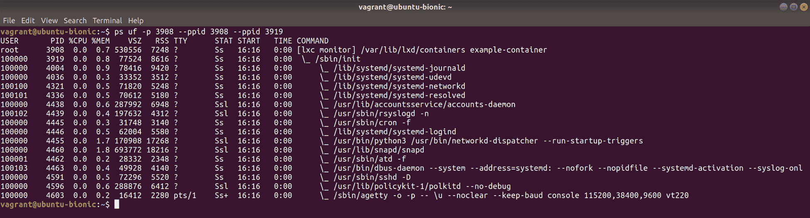

因此，这个容器在里面有大部分的操作系统，它是从我们下载的镜像继承而来的，尽管它显然不包含与主机 VM 共享的内核。

想象一个容器就像一个橙子（我也很喜欢橙子），其中每个片段都可以存在为自己的一小部分多汁的好处，但没有橙子的外皮给它结构和传递养分，它就毫无用处。这与虚拟机形成对比，后者更像是一个永远年轻的小蜘蛛（听我说完），每个都独立存在为活生生的生物，但它们仍然骑在它们母亲的背上，准备向任何接触到它们的人提供一剂神秘的恐怖。

# 还有更多...

目前，您应该在由 LXC 创建的容器中，位于由 Vagrant 管理的虚拟机（并利用 VirtualBox）之上，位于您自己的笔记本电脑、台式机或服务器上。

这可能有点难以想象，但很多聪明的人花了很多时间来确保这种设置可以无问题地工作。

# LXD 守护程序

像往常一样，我们可以使用`systemctl`来可视化我们的服务：

```
$ systemctl status lxd
● lxd.service - LXD - main daemon
 Loaded: loaded (/lib/systemd/system/lxd.service; indirect; vendor preset: enabled)
 Active: active (running) since Sun 2018-11-04 15:41:14 UTC; 33min ago
 Docs: man:lxd(1)
 Process: 2058 ExecStartPost=/usr/bin/lxd waitready --timeout=600 (code=exited, status=0/SUCCESS)
 Process: 2036 ExecStartPre=/usr/lib/x86_64-linux-gnu/lxc/lxc-apparmor-load (code=exited, status=0/SUCCESS)
 Main PID: 2057 (lxd)
 Tasks: 16
 CGroup: /system.slice/lxd.service
 └─2057 /usr/lib/lxd/lxd --group lxd --logfile=/var/log/lxd/lxd.log
```

# 另请参阅

在本节的开头，我们在容器内运行了`hostname`，但这并不能让您知道容器在做什么。我发现特别方便的一件事是能够检查运行在我的容器中的进程，而不必先挖出我的`ps`命令的进程 ID。

在这里，我使用以下命令：

```
$ sudo lxc exec example-container top
```

这给了我以下输出：

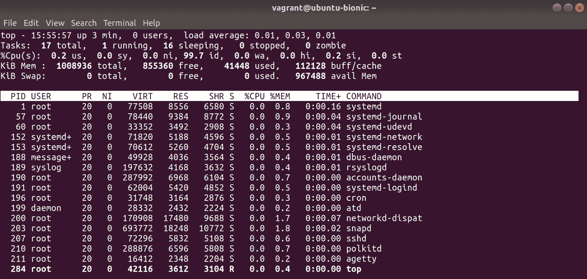

请注意，它比主机机器安静得多，实际上只有很少的守护程序在容器中运行。

# 安装 Docker

迄今为止，在 Linux 上运行容器的最流行的解决方案（至少在撰写本文时）是 Docker。

最初是 Docker Inc.（当时是 dotCloud）为了更好地利用其**PaaS**（**平台即服务**）公司中的容器而开始的，Docker 很快在开源世界中获得了广泛的认可，并很快被视为计算的未来在许多领域（愤世嫉俗的系统管理员通常是在开发人员得知之后才出现的）。

因为它实际上是一种使用已经存在的内核特性的简单方式，并且包括 Docker Hub，供人们上传和下载预构建的镜像，这使得容器变得简单。

很快，人们开始将一切都容器化，从 Firefox 到 Nginx，再到整个发行版，只是因为。

我坚信 Docker 使得上传和下载他们的镜像变得容易，这有助于其成功。正如我已经提到的，容器的概念可以追溯到九十年代，但当时没有“监狱”或“区域”供人们下载预构建的软件集合。Docker Hub 在一个已经流行的平台上提供了这一点。

# 准备工作

大多数发行版都以某种形式在传统存储库中提供 Docker。然而，这经常与上游不一致，或者只是老旧的，因此在您的环境中利用上游 Docker 存储库是一个好主意。

SSH 到您的 Ubuntu 虚拟机：

```
$ vagrant ssh ubuntu1804
```

# 如何做...

Docker 保持了一个页面，介绍了如何在您选择的发行版上安装 Docker（参见[`docs.docker.com/install`](https://docs.docker.com/install)）。以下是 Ubuntu 的简化指令。

运行更新以确保您已准备好安装 Docker：

```
$ sudo apt update
```

安装 GPG 密钥，然后添加存储库本身：

```
$ wget https://download.docker.com/linux/ubuntu/gpg
$ sudo apt-key add gpg $ sudo apt-add-repository 'deb [arch=amd64] https://download.docker.com/linux/ubuntu bionic stable'
```

像往常一样，检查 GPG 指纹是否与官方来源一致。

现在，我们终于可以安装 Docker 本身了（这可能需要一些时间）：

```
$ sudo apt install docker-ce -y
```

我们还可以使用`systemctl`来检查我们的 Docker 守护程序的状态：

```
$ systemctl status docker
● docker.service - Docker Application Container Engine
 Loaded: loaded (/lib/systemd/system/docker.service; enabled; vendor preset: enabled)
 Active: active (running) since Sun 2018-11-04 16:56:26 UTC; 52s ago
 Docs: https://docs.docker.com
 Main PID: 11257 (dockerd)
 Tasks: 23
 CGroup: /system.slice/docker.service
 ├─11257 /usr/bin/dockerd -H fd://
 └─11275 docker-containerd --config /var/run/docker/containerd/containerd.toml
```

您可能已经注意到我们还没有启动和启用此服务。这主要是因为派生自 Debian 的系统喜欢为您启动服务...我个人不喜欢这种方法的原因有很多，但它就是这样。

# 它是如何工作的...

在开始之前，你可能已经注意到我们不断使用一个名为`docker-ce`的软件包，这是有很好的原因的。

Docker 有两个基本版本，**社区版（CE）**和**企业版（EE）**。大多数情况下，你只会在野外看到 CE，它完全可以满足你的所有需求。

我们在这里所做的只是直接去软件的作者那里添加他们自己的 GPG 密钥和存储库信息，以及我们的 Ubuntu 默认设置。Docker 是一个非常动态的程序，意味着它经常发布并且发布量很大。在撰写本文时，我们安装了`18.06.1-ce`，但在你知道之前可能会发生变化。Docker 采用年-月发布格式：

```
$ docker --version
Docker version 18.06.1-ce, build e68fc7a
```

我们还安装了两个主要组件（以及许多工具和附加组件），即 Docker 命令行工具和 Docker 守护程序。

Docker 的工作方式与其他用户空间工具相同，利用内核功能。它的独特之处在于它可以是多么用户友好。

你主要通过命令行工具`docker`来使用 Docker，而这个工具又与 Docker 守护程序进行通信。这个守护程序负责管理它被指示创建的容器，并维护它从 Docker Hub 或其他注册表中拉取的图像。

Docker 注册表是图像的存储库。最受欢迎的是 Docker Hub，但没有什么能阻止你创建自己的注册表，或者使用现成的解决方案来管理一个，比如 Artifactory。

现在要注意的最后一个组件是 Docker 正在使用的运行时，即`runC`（通用容器运行时）。

运行时实际上只是 Docker 将用于运行容器的统一系统集合的名称（想象一下 cgroups 和命名空间捆绑成一个词，尽管还有其他功能）。这意味着，虽然`runC`是特定于 Linux 的，但如果 Windows 有一个容器运行时（Host Compute Service），那么 Docker 可以使用它。

这并不使容器在操作系统之间通用 - 你不能在 Linux 上创建一个容器，然后在特定于 Windows 的运行时中运行它，但这确实使得 Docker 工具通用。

# 还有更多...

获取有关 Docker 安装的所有信息的最简单方法是使用`docker info`命令：

```
$ sudo docker info
Containers: 0
 Running: 0
 Paused: 0
 Stopped: 0
Images: 1
Server Version: 18.06.1-ce
Storage Driver: overlay2
 Backing Filesystem: extfs
 Supports d_type: true
 Native Overlay Diff: true
Logging Driver: json-file
Cgroup Driver: cgroupfs
Plugins:
 Volume: local
 Network: bridge host macvlan null overlay
 Log: awslogs fluentd gcplogs gelf journald json-file logentries splunk syslog
Swarm: inactive
Runtimes: runc
Default Runtime: runc
Init Binary: docker-init
containerd version: 468a545b9edcd5932818eb9de8e72413e616e86e
runc version: 69663f0bd4b60df09991c08812a60108003fa340
init version: fec3683
Security Options:
 apparmor
 seccomp
 Profile: default
Kernel Version: 4.15.0-34-generic
Operating System: Ubuntu 18.04.1 LTS
OSType: linux
Architecture: x86_64
CPUs: 2
Total Memory: 985.3MiB
Name: ubuntu-bionic
ID: T35X:R7ZX:MYMH:3PLU:DGXP:PSBE:KQ7O:YN4O:NBTN:4BHM:XFEN:YE5W
Docker Root Dir: /var/lib/docker
Debug Mode (client): false
Debug Mode (server): false
Registry: https://index.docker.io/v1/
Labels:
Experimental: false
Insecure Registries:
 127.0.0.0/8
Live Restore Enabled: false

WARNING: No swap limit support
```

# 稍微更多

我没有涉及的一件事是`containerd`和`CRI-O`之类的东西。如果你已经了解这些术语，那么我之所以没有提到它们，是因为它们远远超出了本书试图实现的范围。

我鼓励任何对 Docker 及其各个组件感兴趣的人，去阅读专门的文献，因为如果你全面了解当今最流行的容器化工具，未来几年你将不会失业。

# 另请参阅

你有没有在使用 Docker 时注意到`pigz`？这是一个特别有趣的软件，因为它基本上是`gzip`的并行版本。当你解压文件并且有 18 个核心时，最好尽可能多地使用它们，而不是过载一个核心。

# 运行你的第一个 Docker 容器

我们已经在 LXC 部分使用了一个容器，但现在我们将使用更流行的容器运行系统。

本节将涵盖一些基本命令，而不会深入讨论。

# 准备工作

在本节中，我们将使用我们的 Ubuntu 虚拟机，但请确保先设置好上一节的 Docker。

SSH 到你的虚拟机，并确保在安装 Docker 之前使用上一节设置上游 Docker 存储库：

```
$ vagrant ssh ubuntu1804
```

# 如何做...

与 LXC 部分一样，我们将启动一个 Ubuntu 容器，然后与其进行交互。

从以下命令开始：

```
$ sudo docker run -itd --rm alpine /bin/ash
Unable to find image 'alpine:latest' locally
latest: Pulling from library/alpine
4fe2ade4980c: Pull complete 
Digest: sha256:621c2f39f8133acb8e64023a94dbdf0d5ca81896102b9e57c0dc184cadaf5528
Status: Downloaded newer image for alpine:latest
5396b707087a161338b6f74862ef949d3081b83bbdcbc3693a35504e5cfbccd4
```

现在容器已经启动运行，你可以用`docker ps`查看它：

```
$ sudo docker ps
CONTAINER ID IMAGE COMMAND CREATED STATUS PORTS NAMES
5396b707087a alpine "/bin/ash" 45 seconds ago Up 44 seconds ecstatic_lalande
```

如果你愿意，你也可以使用`docker exec`进入它：

```
$ sudo docker exec -it ecstatic_lalande /bin/ash
/ # 
```

你也可以使用`docker attach`，它在表面上完成了相同的事情（让你访问容器中的 shell）。这种方法的唯一问题是，你将附加到活动进程，这意味着当你关闭会话时，容器也会停止。

再次离开容器（`exit`）将带你回到你的 VM 提示符。

从这里，你可以停止你的容器：

```
$ sudo docker stop ecstatic_lalande
ecstatic_lalande
```

这可能需要几秒钟。

容器现在已被删除，我们可以通过另一个`docker ps`来确认：

```
$ sudo docker ps -a
CONTAINER ID IMAGE COMMAND CREATED STATUS PORTS NAMES
```

# 它是如何工作的...

让我们分解我们的命令。

# 创建一个容器

从创建新容器开始，这是我们使用的命令：

```
$ sudo docker run -itd --rm alpine /bin/ash
```

在这里，我们告诉 Docker 我们想要在一个新的容器中`run`一个命令：

```
docker run
```

然后，我们通知它我们希望它是交互式的，有一个伪 TTY，并且启动分离的（将我们带回 VM shell）：

```
-itd
```

接下来，我们告诉 Docker，当容器停止时，我们希望它自动删除自己：

```
--rm
```

这是一个相对较新的功能，只是因为人们没有意识到容器在停止后仍然存在，人们最终会得到数百个已停止的容器列表。

最后，我们说我们想使用什么镜像（来自 Docker Hub），以及要运行什么命令（这里是 Alpine Linux 的默认 shell，`ash`）：

```
alpine /bin/ash
```

# 列出我们的容器

其次，我们使用以下命令列出我们的新容器：

```
$ sudo docker ps
```

这显示了所有我们的容器（或者在这种情况下，只有一个）的`CONTAINER ID`、`IMAGE`、`COMMAND`、`CREATED`、`STATUS`、`PORTS`和`NAMES`。

`CONTAINER ID`部分是一个随机字符串分配，`NAMES`部分显示了你的容器的随机生成的友好名称（尽管这也可以在创建时定义）。

当我们后来在我们的列表命令中添加了`-a`时，是为了显示容器并没有因为停止而被从初始列表中省略，因为`-a`标志将显示所有容器，而不仅仅是正在运行的容器。

# 在我们的容器中执行命令

接下来，我们跳进容器内，启动另一个（在创建时已经启动的）shell 会话：

```
$ sudo docker exec -it ecstatic_lalande /bin/ash
```

在这里，我们通过在容器内使用交互式会话和另一个伪 TTY 来执行命令（在这里用`docker ps`中的友好名称表示）。

这将把我们放在容器内。如果我们运行`top`，我们将看到我们已经启动的`/bin/ash`命令的两个实例：

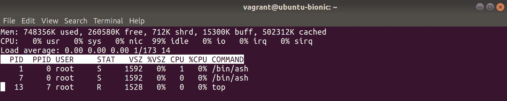

你有没有注意到`/bin/ash`实例中的一个是`PID 1`？

# 停止我们的容器

一旦我们再次跳出来，然后停止正在运行的容器：

```
$ sudo docker stop ecstatic_lalande
```

这需要几秒钟，但是一旦完成，容器将消失（正如我们所看到的），尽管它使用的镜像（alpine）将保留下来。

因为我们的镜像仍然存在，所以下次你想用它做点什么时，你就不必再下载它了！

# 调试一个容器

在这一部分，我们将再次启动我们的容器，进行一些更改，并检查我们的更改是否产生了影响。

这有助于突出容器的瞬时性质，以及你可以在运行的实例中做些什么。

# 准备工作

在这一部分，我们将继续使用我们的 Ubuntu VM。

如果还没有连接，通过 SSH 连接到你的 VM，并启动一个容器：

```
$ vagrant ssh ubuntu1804 $ sudo docker run -itd --rm -p8080:8080 alpine /bin/ash
```

# 如何做...

现在你应该有一个正在运行的 docker 容器，在这里列出为`docker ps`：

```
$ sudo docker ps
CONTAINER ID IMAGE COMMAND CREATED STATUS PORTS NAMES
0f649283dcaf alpine "/bin/ash" 41 seconds ago Up 39 seconds 0.0.0.0:8080->8080/tcp compassionate_boyd
```

请注意，我们在这个例子中还有一个端口转发，即端口`8080`。

在这种情况下，端口转发与其他情况相同-我们正在将主机的一个端口转发到容器中的一个端口。

尝试使用`curl`命令访问端口：

```
$ curl localhost:8080
curl: (56) Recv failure: Connection reset by peer
```

现在，跳到 VM，让我们在指定的端口上启动一个 Web 服务器：

```
$ sudo docker exec -it compassionate_boyd /bin/ash
```

首先，我们需要安装一些额外的 busybox 东西：

```
# apk add busybox-extras
```

现在，我们可以在端口`8080`上启动一个小型 Web 服务器，然后退出容器：

```
# touch index.html
# echo "I hated reading Shakespeare in school." > index.html
# httpd -p8080
# exit
```

现在，从你的 VM，你将能够`curl`你的容器的新 Web 服务器：

```
$ curl localhost:8080
I hated reading Shakespeare in school.
```

停止容器，然后启动一个新的：

```
$ sudo docker stop compassionate_boyd
compassionate_boyd
$ sudo docker run -itd --rm -p8080:8080 alpine /bin/ash
592eceb397e7ea059c27a46e4559c3ce7ee0976ed90297f52bcbdb369e214921
```

请注意，当你再次`curl`你的端口时，它将不起作用，因为你之前对运行的容器所做的所有更改都已丢失，并且一个新的容器已经取而代之：

```
$ curl localhost:8080
curl: (56) Recv failure: Connection reset by peer
```

# 它是如何工作的...

我们在这里所做的只是强调容器本质上是短暂的，虽然你可以停止和启动相同的容器（在`docker run`命令中去掉`--rm`），但在将容器标记并上传到某个注册表之前，你都处于一个瞬态状态。

通常不建议通过启动一个容器然后在其中安装大量软件来构建容器，然后离开并保存它以供以后使用。更好的方法是使用`Dockerfile`或其他自动化和可重复构建容器的方法。

我们还指出，虽然 Docker 容器应该是一个独立的小实体，但这并不意味着你不能进入其中查看发生了什么，甚至安装额外的软件来帮助你进行调试，如果你愿意的话。

# 还有更多...

如果你有兴趣使用`Dockerfile`来做我们在这里做的事情，这是一个相当简单的方法，尽管它在技术上超出了本书的范围。

以下内容足以让你开始：

```
FROM alpine

MAINTAINER Your Deity of Choice

RUN apk add busybox-extras
RUN touch index.html
RUN echo "I really hated reading Shakespeare in school." > index.html

EXPOSE 8080/tcp

CMD ["/usr/sbin/httpd", "-p8080", "-f"]
```

然后，你可以使用以下类似的方法构建：

```
$ sudo docker build .
<SNIP>
Successfully built d097226c4e7c
```

然后，你可以启动你的结果容器（分离，并转发端口）：

```
$ sudo docker run -itd -p8080:8080 d097226c4e7c
```

我们在`Dockerfile`中添加了`-f`，以确保进程保持在前台（容器不会立即停止）：

```
$ curl localhost:8080
I really hated reading Shakespeare in school.
```

# 搜索容器（和安全性）

在这一部分，你大部分时间都需要访问某种类型的浏览器，尽管在紧急情况下，你可能可以打电话给朋友让他们帮你做互联网搜索（如果你是一个真正好的朋友，而且他们确实没有更好的事情要做的话）。

我们还将使用我们的虚拟机来练习我们发现的东西。

我们将在 Docker Hub 上搜索容器，并提及下载和使用公共镜像的安全性问题。

这一部分并不是为了吓唬你，就像你不应该害怕运行任何你找到的自由软件一样——这是在做尽职调查。

# 准备工作

跳到你的 Ubuntu 虚拟机上（如果你还没有安装 docker，请从上一节安装）：

```
$ vagrant ssh ubuntu1804
```

# 如何做...

从你选择的浏览器（对我来说是 Firefox），前往[`hub.docker.com`](https://hub.docker.com)。

你将会看到一个类似以下的页面：

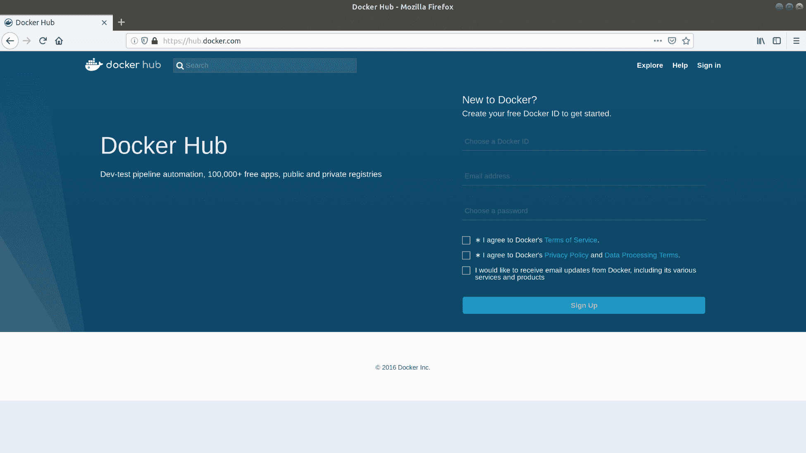

这里有一些暗示，即标题为“新手入门 Docker？”的部分。尽管第一句话可能会让人觉得需要创建 Docker ID 才能开始使用，但实际上并不需要。你可能会发现这样做很方便，甚至可能有充分的理由创建一个 ID，但最初（至少在撰写本文时）绝对没有必要这样做。

相反，使用屏幕顶部的搜索栏，输入`redis`：

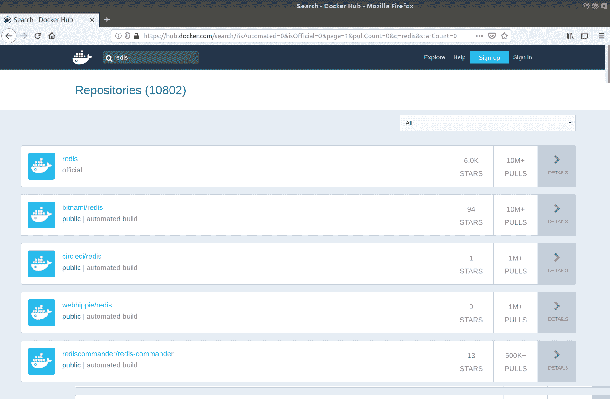

哇！那是很多存储库！

这就是关于 Docker 的第一件好事。因为创建镜像并上传到 Docker Hub（我自己有几个）是如此容易，所以你想要的东西可能会有多个版本。

在这里，我们可以看到顶部的结果只是简单地命名为 redis，而不是像其他的`<username>/redis-foo`。

当一个镜像是官方的时候，它会得到特权的荣誉，只有它的软件的明确名称，就像在这种情况下的 redis 一样。

点击它：

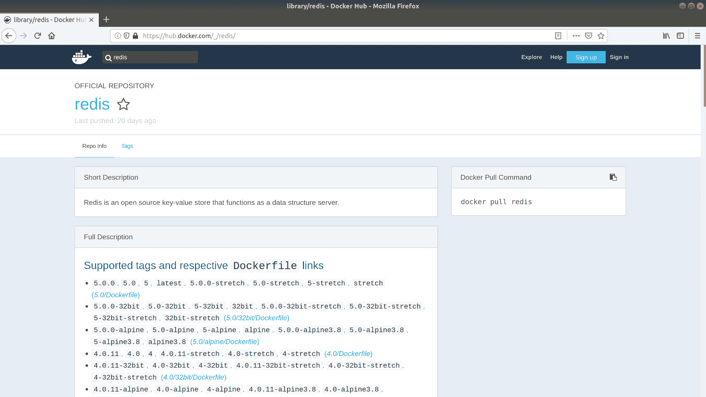

这里有几件事情需要注意。

+   幸运的是，我们得到了一个开始的命令，即右边的`docker pull redis`。

+   我们得到了存储库信息，这是默认视图，为我们提供了简短和完整的描述。在实践中，这可以是维护者想要的任何长度。

+   最后，此刻，我们在顶部得到了一个标签部分。现在点击这个：

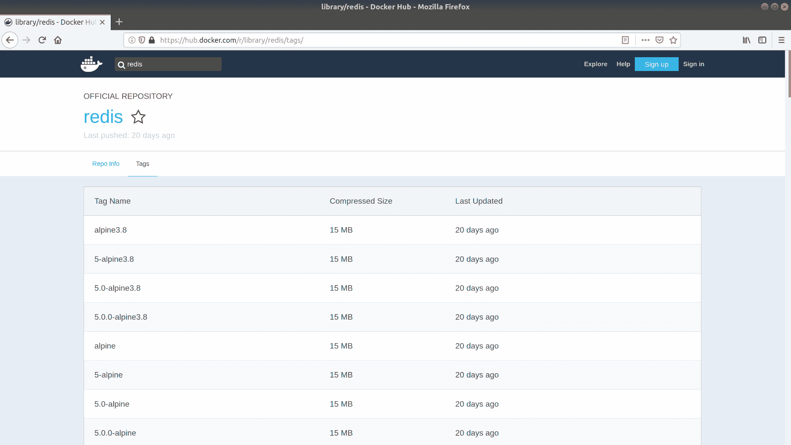

标签，就像 Git 一样，是表示您要下载的容器的特定版本的一种方式。

默认标签是最新的，如果您要运行以下命令，它就是您要下载的镜像（正如您可以在我们的命令后面立即看到的那样）：

```
$ sudo docker run -d redis
Unable to find image 'redis:latest' locally
latest: Pulling from library/redis
f17d81b4b692: Pull complete 
b32474098757: Pull complete 
<SNIP>
```

如果我们想要专门拉取 Redis 的 Alpine 版本（即在 Alpine Linux 上安装的 Redis），我们将运行以下命令：

```
$ sudo docker run -d redis:alpine
Unable to find image 'redis:alpine' locally
alpine: Pulling from library/redis
4fe2ade4980c: Already exists 
fb758dc2e038: Pull complete 
989f7b0c858b: Pull complete 
<SNIP>
```

请注意，我们拉取了除基本版本之外的每个版本，而基本版本已经存在于我们的设置中。

看这里！您使用 Docker Hub 寻找了每个人最喜欢的内存数据库的一个版本！

# 它是如何工作的...

我们在这里做的就是从全球 Docker Registry 中拉取一个功能性镜像；这是默认的，最重要的，最大的，最原始的，也是最好的（根据一些人的说法）。

Docker Hub 是一个更小的存储库，每个人都可以在他们构建（或分叉）的容器上加上自己的标记，从而增加了世界软件的种类。

显然这有缺点，正如我在前面讽刺的一行中所暗示的那样。这意味着因为将您的镜像轻松地推送到 Docker Hub，发现您想要的一个镜像可能变得越来越令人沮丧。

人们也可能是恶意的，上传的容器可能确实做了他们所说的事情，同时又利用您计算机的整个核心来挖掘比特币（尽管当这种事情发生时，通常会很快被发现）。作为系统管理员、DevOps 人员、公司的万金油，您需要弄清楚容器在做什么，以及它是否符合您的需求。

我遵循一些基本原则：

+   检查`Dockerfile`和源是否免费提供：

+   通常，Docker Hub 上的存储库是从 GitLab 或其他源代码托管站点触发的构建，这意味着您可以检查容器背后的代码

+   检查容器的下载次数：

+   虽然这并不是质量的指标，因为经常软件的第一个镜像是最受欢迎的，但它通常是千里眼原则的一个很好的例子。如果成千上万的人在使用它，那么它隐藏在容器中的恶意内容的可能性更高（尽管仍有可能）。

+   检查是否为官方项目的 Docker 容器：

+   像 Redis、Kibana 和 Swift 这样的项目都有官方的 Docker 容器，所以通常我会选择它们的产品而不是其他的。

+   该项目可能还有未标记为官方的容器，仍然带有创建者的名字。在我看来，这些容器明显优于 Jane Bloggs 的容器。

+   这并不是说非官方的容器不好，或者它们不满足稍微不同的需求，但是，十有八九，我发现情况并非如此。

+   您能自己构建吗？

+   假设`Dockerfile`是免费许可的，您可以从 GitLab 上将其复制到您的构建服务器上，以创建自己的镜像。至少这样，您知道在过程结束时您看到的就是您得到的（假设您没有从您从未听说过的一些可疑第三方存储库中下载软件作为构建的一部分）。

尽管如此 - 听起来我对自制容器非常不满 - Docker 已经赢得了容器至高无上的战争，因为它在市场上占据了主导地位，并且易于使用（无论是构建容器还是找到它们的简单性）。

Docker Hub 意味着即使我没有本地存储库配置，但我安装了 Docker，我很快就可以在 Alpine 容器上运行一个 Web 服务器，它连接到一个 MariaDB 容器，位于 Gentoo 之上。

然后，该容器可以将日志馈送到一个容器化的 Elasticsearch 实例，运行在 Slackware 上，就在同一主机上，大约十分钟内完成。

# 还有更多...

如果你愿意的话，你也可以从命令行搜索：

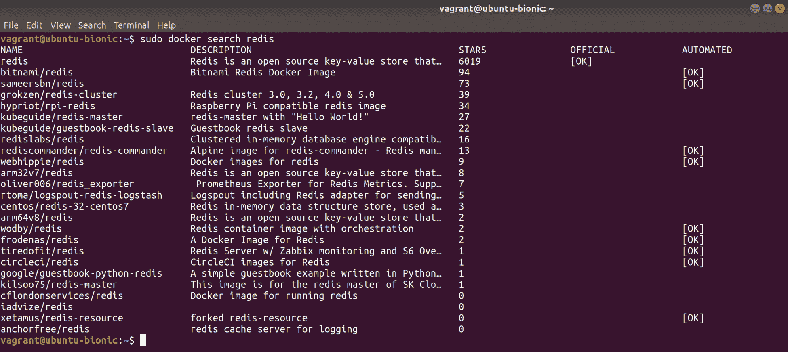

说实话，我从来不这样做，主要是因为现在每个人都随身携带一个浏览器。然而，我知道有些人是纯粹主义者。

# 什么是虚拟化？

如果你随机翻开这本书的这一页，那么你现在可能知道虚拟化实际上是什么。如果你按照正常的方式，从头开始阅读，那么你很可能已经明白你几乎在整本书中都在使用虚拟化。

虚拟化是在一个机器内部虚拟化（我知道对吧？）另一台机器的行为。不像容器，我们从 USB 控制器到软盘驱动器（说真的）都进行了可视化。

这个概念并不新鲜，但技术在不断发展。

对于我们的例子，你可能和我一样，转而使用了带有 VirtualBox 的 Vagrant。我选择这种方式是因为 VirtualBox 随处可见，适用于 macOS、Linux 和 Windows（以及其他操作系统！）。这有很大的优势，但也有劣势。

虚拟化本质上与其运行的主机的软件和硬件密切相关。考虑到这一点，你可能会理解为什么企业通常选择不在所有地方使用 VirtualBox（尽管有 Windows 和 Linux 机器），而是分别使用 HyperV 和 KVM……它们更本地化。

在 Linux 领域，虚拟化软件的选择是**KVM**（**Kernel Virtual Machine**）。

旁白：KVM 是一个糟糕的产品或软件名称。在决定使用 Kernel Virtual Machine 之前，它已经有了一个含义，全世界的数据中心工程师自从它诞生以来一直在诅咒这个特定的三个字母缩写。键盘视频鼠标是一个标准，在我脑海中，当我听到这些字母时，我仍然想象着数据中心的崩溃车。

# 准备工作

在本节中，我们将研究容器和虚拟化之间的一些基本区别。

我们将首次使用我们的 Ubuntu 虚拟机和 CentOS 虚拟机。

登录到你的 CentOS 和 Ubuntu 虚拟机：

```
$ vagrant ssh ubuntu1804
$ vagrant ssh centos7
```

# 如何做到…

在我们的容器步骤中，我们简要地看到了在主机虚拟机上运行的内核与容器内部运行的内核是相同的。

在这一步中，我们将在我们的两个虚拟机上运行相同的命令并比较输出：

```
$ uname -a
Linux ubuntu-bionic 4.15.0-36-generic #39-Ubuntu SMP Mon Sep 24 16:19:09 UTC 2018 x86_64 x86_64 x86_64 GNU/Linux $ uname -a
Linux localhost.localdomain 3.10.0-862.2.3.el7.x86_64 #1 SMP Wed May 9 18:05:47 UTC 2018 x86_64 x86_64 x86_64 GNU/Linux
```

我们的 Ubuntu 系统正在运行内核 4.15.0，而我们的 CentOS 系统正在运行版本 3.10.0。

这就是容器的第一个优势，它们能够运行完全不同版本的 Linux 内核。

在这方面的第二个优势是虚拟机不必与其主机相同的操作系统：你可以在 Linux 主机上模拟 Windows、FreeBSD，甚至 macOS 机器，以及几乎任何相同的组合。

macOS 有点特殊（它总是这样吗？）因为存在许可问题，你必须以非常特定的方式进行操作，但是可以做到。

让我们看看另一件有点酷的事情。

在我们的 CentOS 虚拟机上，我列出了磁盘：

```
$ lsblk
NAME MAJ:MIN RM SIZE RO TYPE MOUNTPOINT
sda 8:0 0 40G 0 disk 
├─sda1 8:1 0 1M 0 part 
├─sda2 8:2 0 1G 0 part /boot
└─sda3 8:3 0 39G 0 part 
 ├─VolGroup00-LogVol00 253:0 0 37.5G 0 lvm /
 └─VolGroup00-LogVol01 253:1 0 1.5G 0 lvm [SWAP]
```

这些不是物理驱动器，它们是虚拟的，因此你可以无限次地搞乱它们的配置，而不会损坏主机的引导潜力。

这是我一直在抱怨的一件事情，主要是因为我曾经在容器中运行了一堆 Ansible，完全搞砸了我在笔记本电脑上的安装。这个 Ansible，尽管当时我并不知道，强制性地改变了磁盘分区和布局，并且在容器的情况下，列在`/dev/`中的设备是你机器上的设备，这意味着我已经彻底毁掉了我的本地安装。幸运的是，我在重启之前弄清楚了发生了什么，并且能够在重新安装之前保存需要的工作，但我再也不这样做了。我还改变了测试，使用 Vagrant 和虚拟机代替……

现在，显然也有缺点——你基本上是在运行整个机器，这意味着它们必须启动（尽管你可以将它缩短到几秒钟），并且启动速度比大多数容器慢。

你可能也只需要安装一个程序（比如在 Windows 虚拟机上安装 Steam），但你会得到其他东西，意味着无论你想要还是不想要，你都会得到 Edge 浏览器、画图和那些烦人的文件夹，比如`文档`部分中的`音乐`、`视频`和`图片`，甚至在服务器安装中也是如此。

# 工作原理...

它在现代计算机上运行，主要是利用 CPU 的特性。

当你模拟你的硬件时，无论是使用 VirtualBox 还是 KVM，你真正做的是为 CPU 创建一整套独立的指令。如果我们在不原生支持 VM 的 CPU 上模拟 VM，并且无法以接近原生速度处理它们的指令，你必须甚至模拟 CPU，这可能是昂贵和缓慢的（稍后详细介绍）。

一般来说，过去十年的 CPU 将具有 AMD-V（在 AMD 的情况下）或 VT-x（在 Intel 的情况下），这意味着你的虚拟机在原始处理速度方面几乎无法与主机机器区分开来。

还有**完全虚拟化**和**半虚拟化**，前者意味着模拟一切（比如，在 x86_64 处理器上模拟 aarch64 处理器），后者意味着，虽然进程的执行是分离的，但实际使用的处理器与主机是相同的（我们之前讨论过的 CPU 虚拟化感知）。

# 还有更多...

使用虚拟机还有更多酷炫的功能，这些功能在容器中是不可能的。

假设你是一个玩家，你真的不喜欢使用 Windows，但勉强承认你真的想和你的朋友一起玩文明，他们都是狂热的 Windows 迷。你可以（在某种程度上）在 Linux 内部做到这一点。

好吧，好吧，这样说有点不诚实，暗示你是在 Linux 内部进行操作，但这里有一个方法。

你启动一个虚拟机，安装 Windows（合法），然后将你的显卡连接到你的虚拟机...

什么？

是的！

通过 PCI-passthrough，完全可以将显卡分配给虚拟机，将显示器插入背面，然后在单独的屏幕上进行所有游戏（使用相同的鼠标和键盘）。

进展！

# 启动一个带有我们的虚拟机的 QEMU 机器

在这一部分，我们将在我们的虚拟机内启动一个虚拟机，并尝试连接到它。

请注意。你可能会认为本节的元素很慢。这不是你的机器或你自己的配置的错，这是物理的错，也是我们尚未拥有消费级量子计算的事实。

# 准备好了

SSH 到你的 Ubuntu 虚拟机：

```
$ vagrant ssh ubuntu1804
```

在 Ubuntu 上安装运行虚拟机的适当组件：

```
$ sudo apt install qemu -y
```

# 如何做...

我们将下载一个 Alpine ISO 并尝试在虚拟机内进行安装（在我们的虚拟机内）：

```
$ wget http://dl-cdn.alpinelinux.org/alpine/v3.8/releases/x86_64/alpine-virt-3.8.1-x86_64.iso
```

我选择 Alpine 是因为它很小，只有 32MB。

接下来，我们需要创建一个虚拟磁盘来安装我们的操作系统：

```
$ qemu-img create example-disk 4G
Formatting 'example-disk', fmt=raw size=4294967296
```

现在，我们可以使用 QEMU 在我们的虚拟驱动器上启动我们的 ISO：

```
$ qemu-system-x86_64 -drive file=example-disk,format=raw -cdrom alpine-virt-3.8.1-x86_64.iso -boot d -nographic
```

幸运的话，你应该能看到以下内容：

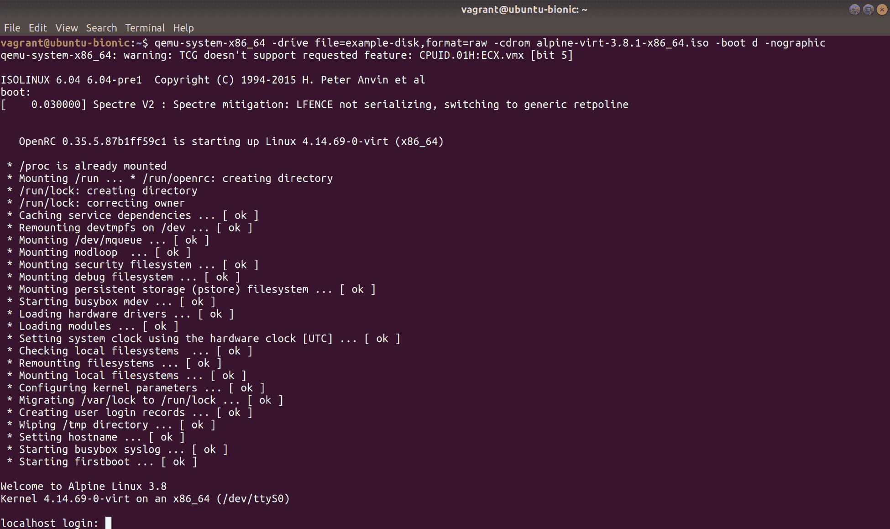

在命令行提示符下，你应该能够以 root 用户登录（默认情况下没有密码）：

```
localhost login: root
Welcome to Alpine!

The Alpine Wiki contains a large amount of how-to guides and general
information about administrating Alpine systems.
See <http://wiki.alpinelinux.org>.

You can setup the system with the command: setup-alpine

You may change this message by editing /etc/motd.

localhost:~# 
```

Alpine 的功能类似于一个接近实时 CD 的东西，所以我们现在可以继续进行快速安装到本地驱动器：

```
# setup-alpine
```

你会被问到一些标准问题。大多数情况下，你可以用默认答案，但为了完整起见，这是我做的：

+   键盘：`gb`

+   键盘变体：`gb`

+   主机名：`[默认（localhost）]`

+   接口：`[默认（eth0）]`

+   IP 地址：`[默认（dhcp）]`

+   手动网络配置：`[默认（否）]`

+   密码：随机

+   时区：`[默认（UTC）]`

+   代理：`[默认（无）]`

+   镜像：`3`（英国，你可能会找到更接近你的）

+   SSH 服务器：`[默认（openssh）]`

+   要使用的磁盘：`sda`

+   使用方法：`sys`

+   擦除并继续：`y`

完成后，你将在你的 Ubuntu 虚拟机内安装了 Alpine Linux 虚拟机。

关闭 Alpine 安装：

```
# poweroff
```

你会发现自己又回到了你的 Ubuntu 虚拟机。现在，我们将再次启动 Alpine，但这次我们将省略 ISO 文件和`-boot`参数：

```
$ qemu-system-x86_64 -drive file=example-disk,format=raw -nographic
```

正如我在开头所说的，所有这些步骤都可能需要很长时间才能完成，这取决于你的计算机的年龄。

启动后，你会发现自己又回到了 Alpine 安装界面，这次是从我们的虚拟驱动器启动的：

```
Welcome to Alpine Linux 3.8
Kernel 4.14.69-0-virt on an x86_64 (/dev/ttyS0)

localhost login: root
Password: 
Welcome to Alpine!

The Alpine Wiki contains a large amount of how-to guides and general
information about administrating Alpine systems.
See <http://wiki.alpinelinux.org>.

You can setup the system with the command: setup-alpine

You may change this message by editing /etc/motd.

localhost:~# 
```

要终止会话，要么再次关闭虚拟机，要么按下*Ctrl* + *A*，然后按下*X*。

# 工作原理...

逐步分解我们在这里所做的事情，我们首先从 Alpine 网站下载了一个 ISO 映像。这是最容易解释的事情，因为我们实际上是使用 ISO 作为我们安装的真相来源。你也可以做一些其他的事情，比如将`/dev/cdrom`传递给你的虚拟机，如果你希望使用你机器上的物理驱动器（并且你生活在 2009 年）。

一旦我们有了 ISO 映像，我们就创建了一个基于文件的块设备来安装。这样我们可以将一个安装与另一个安装分开，甚至可以将安装从一台机器移动到另一台机器。还有其他不涉及使用文件的解决方案-你可以对 LVM 设置进行分区，将一些空间分配给你的虚拟机，或者你可以连接一个物理磁盘，并将整个磁盘分配给安装。

我们使用`qemu-img`创建文件，但你也可以使用其他工具，比如`fallocate`来完成同样的工作。

接下来，我们使用以下命令启动了我们的虚拟机：

```
$ qemu-system-x86_64 -drive file=example-disk,format=raw -cdrom alpine-virt-3.8.1-x86_64.iso -boot d -nographic
```

具体来说，我们有以下内容：

```
qemu-system-x86_64
```

这是我们想要模拟的 QEMU 架构。我选择了 x86_64，因为它是最常见的架构，也是我们下载的 ISO 期望找到的架构。如果我们愿意的话，我们也可以使用`qemu-system-aarch64`，并且提供适当的磁盘映像：

```
-drive file=example-disk,format=raw
```

在这里，我们向 QEMU 传递了一个要使用的驱动器，具体是我们刚刚创建的`example-disk`文件，以及它创建的格式：

```
-cdrom alpine-virt-3.8.1-x86_64.iso
```

我们明确告诉 QEMU 我们要使用我们下载的 ISO：

```
-boot d
```

我们想要从 CD-ROM 而不是虚拟驱动器启动：

```
-nographic
```

我们在这里是一个通过 SSH 连接的服务器，所以我们不能为我们的虚拟机使用图形输出。这个选项将串行输入和输出重定向到控制台。

# 还有更多...

除了速度之外，没有什么能阻止你将 QEMU 驱动的虚拟机用作完整的机器。

你可以安装软件包，甚至运行`htop`之类的东西：

```
# apk add htop
```

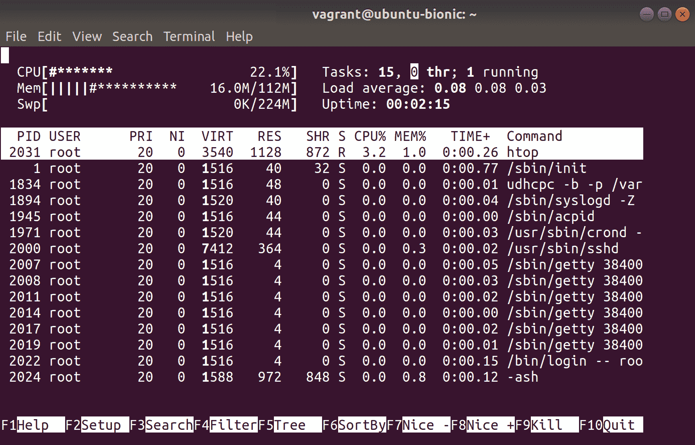

# 另请参阅

你可能注意到了很多我们没有使用的选项，QEMU 的系统工具功能非常强大。通常，人们不直接使用 QEMU 构建虚拟机，他们依赖更亮眼和更用户友好的工具来完成工作。

在服务器上，Virsh 是一个不错的选择（本章后面会介绍），在桌面机器上，**虚拟机管理器（virt-manager）**是一个非常常见的安装包，它还可以让你连接到远程（无头）服务器，使用点击按钮设置虚拟机。

# 使用 virsh 和 virt-install

`virsh`和`virt-install`对于刚开始在 Linux 上使用虚拟机的人来说是很好的工具。现在听起来有点老土，但如果你能在命令行上做得很好，你会想知道为什么你以前需要一个点击按钮的 GUI 来帮你完成工作。

当我们这样谈论客户端时，我们指的是`libvirt`库的前端，它是一个设计用来使与内核的虚拟化功能交互更容易的 C 工具包。

`virsh`和`virt-install`与`libvirt`通信，而`libvirt`又与内核通信。

# 准备工作

SSH 到您的 Ubuntu VM，然后安装`virtinst`、`libvirt-clients`、`libvirt-bin`和`libvirt-daemon`软件包：

```
$ vagrant ssh ubuntu1804 $ sudo apt update
$ sudo apt install virtinst libvirt-clients libvirt-bin libvirt-daemon -y
```

# 如何做...

首先，我们将使用我们安装的`virt-install`工具创建 VM，然后我们将使用`virsh`对其进行探测。

创建 VM 是简单的步骤；真正麻烦的是维护机器时带来的痛苦。

# virt-install

首先，让我们使用之前下载的 Alpine ISO 来启动和安装虚拟机。

如果您没有从上一节获得 ISO，这是重新下载它的命令：

```
$ wget http://dl-cdn.alpinelinux.org/alpine/v3.8/releases/x86_64/alpine-virt-3.8.1-x86_64.iso
```

这次让我们使用`fallocate`创建一个块设备：

```
$ fallocate -l 2G ex-alpine-2-disk
```

现在，让我们使用一行命令来配置我们的域（域是这里用于机器和其他部分的集体术语）：

```
$ sudo virt-install --name ex-alpine-2 --memory 512 --disk ex-alpine-2-disk --cdrom alpine-virt-3.8.1-x86_64.iso --graphics none --os-variant virtio26
```

我们在这里使用`virtio26`作为 OS 变体，因为没有明确的`alpine`选项。相反，这告诉`virt-install`我们正在安装的操作系统使用的是 2.6 之后的内核，并且支持 VirtIO 设备（用于磁盘、网络等）。这使我们拥有一个正常运行的 VM，这很好。

假设一切顺利，您应该再次看到 Alpine 的引导顺序。

使用`root`用户和空密码登录，然后按照上一节的步骤进行安装（安装到 vda 设备）。

安装完成后，使用*Ctrl* + *]*从控制台断开连接。

# virsh

完全可以像我们之前看到的传统 Unix 风格的命令行上的一系列命令一样使用 Virsh。

但是，使用 Virsh 进行交互也是完全可以接受的，它有自己的模式。

使用以下命令启动 Virsh 终端：

```
$ sudo virsh
Welcome to virsh, the virtualization interactive terminal.

Type: 'help' for help with commands
 'quit' to quit

virsh #
```

现在，我们将与我们刚刚创建的机器进行交互。首先在命令行上列出它：

```
virsh # list
 Id Name State
----------------------------------------------------
 3 ex-alpine-2 running
```

默认情况下，此命令将显示正在运行的域。

如果我们连接到我们的 VM 并连续按*Enter*几次，我们可以与我们的安装进行交互：

```
virsh # console ex-alpine-2 
Connected to domain ex-alpine-2
Escape character is ^]

localhost:~# 
localhost:~# 
localhost:~# 
```

再次使用*Ctrl* + *]*退出 VM。

让我们在我们拥有的基本域上进行构建，首先看看`virt-install`通过`dominfo`给我们的东西：

```
virsh # dominfo ex-alpine-2
Id: 5
Name: ex-alpine-2
UUID: 80361635-25a3-403b-9d15-e292df27908b
OS Type: hvm
State: running
CPU(s): 1
CPU time: 81.7s
Max memory: 524288 KiB
Used memory: 524288 KiB
Persistent: yes
Autostart: disable
Managed save: no
Security model: apparmor
Security DOI: 0
Security label: libvirt-80361635-25a3-403b-9d15-e292df27908b (enforcing)
```

现在这是有趣的部分-我们实际上还没有在安装后重新启动我们的 VM，所以让我们使用`virsh`来发出命令：

```
virsh # destroy ex-alpine-2 
Domain ex-alpine-2 destroyed
virsh # start ex-alpine-2 
Domain ex-alpine-2 started
```

是的，销毁在这里是一个令人困惑的词，但这是因为 VM 的实际状态是短暂的。数据在驱动器上是安全的。实际配置是域的一部分，所以当我们发出`destroy`和`start`命令时，我们实际上并没有删除任何东西。我不喜欢这个术语，但这只是你学会接受的东西。

现在，我们可以再次从`virsh`连接到我们的 VM 控制台（这一部分可能需要一些时间）：

```
virsh # console ex-alpine-2 
Connected to domain ex-alpine-2
Escape character is ^]

Welcome to Alpine Linux 3.8
Kernel 4.14.69-0-virt on an x86_64 (/dev/ttyS0)

localhost login: 
```

而且，随时可以使用*Ctrl* + *]*断开连接。

Virsh 充满了技巧，我最喜欢的是轻松编辑域的配置 XML 的方法。

发出以下`edit`命令：

```
virsh # edit ex-alpine-2 

Select an editor. To change later, run 'select-editor'.
 1\. /bin/nano <---- easiest
 2\. /usr/bin/vim.basic
 3\. /usr/bin/vim.tiny
 4\. /bin/ed

Choose 1-4 [1]: 2
```

您应该进入您选择的编辑器，并看到您的 VM 的配置文件：

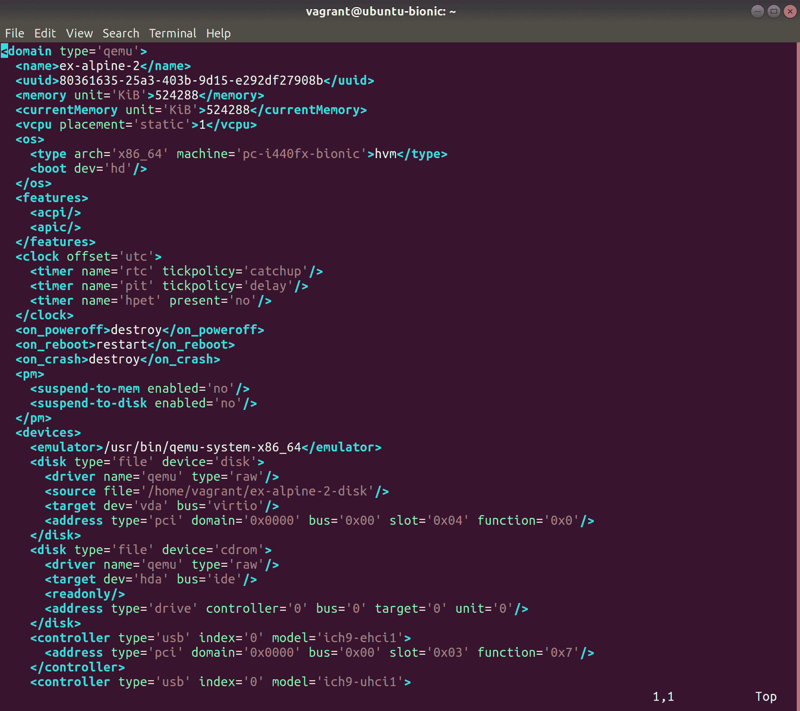

这在某种程度上是另一种做事情的方式。如果您习惯直接编辑文件，这可能比使用命令行更适合您（根据我的经验，有一些选项是不可能不深入研究这个文件就无法完成的）。

在离开`virsh`世界之前，还有一些事情，首先是`version`命令：

```
virsh # version
Compiled against library: libvirt 4.0.0
Using library: libvirt 4.0.0
Using API: QEMU 4.0.0
Running hypervisor: QEMU 2.11.1
```

这是一个很好的方法来确定您连接到的 hypervisor 版本，`libvirt`库版本和 API。

您还可以检查 vCPU 计数：

```
virsh # vcpucount ex-alpine-2 
maximum config 1
maximum live 1
current config 1
current live 1
```

然后，您可以调整数字：

```
virsh # setvcpus ex-alpine-2 2 --maximum --config --hotpluggable
```

我们还从`dominfo`中知道我们给了我们的 VM 512 MiB 的内存，所以让我们降低它以腾出其他 VM 的空间：

```
virsh # setmem ex-alpine-2 --size 400MiB
```

我们也可以提高它，但不能超过 VM 已经设置的最大内存（至少在这种状态下）。

# 它是如何工作的...

正如之前所暗示的，当你使用`virt-install`创建一个虚拟机时，实际上你正在编写一个包含虚拟机外观和行为的初始 XML 文件。

这个文件实际上存在于`/etc/libvirt/qemu/ex-alpine-2.xml`，可以像系统上的任何其他文件一样读取（`virsh`只是让它更容易，就像`systemctl cat`一样）。

当我们使用诸如`virt-install`、`virt-viewer`或任何`virt-*`套件时，我们可以省去很多打字和文件复制。你可以编写一个运行簿，只需几条命令就可以重新创建一个环境。然后，Virsh 存在于查询你的设置并获取有关你已经启动的解决方案的一些基本信息。

我们可以使用`virsh autostart`之类的东西在启动时启动一个虚拟机，如下所示：

```
virsh # autostart ex-alpine-2 
Domain ex-alpine-2 marked as autostarted
```

通过这样做，我们使位于`/usr/lib/libvirt/libvirt-guests.sh`的脚本能够在启动时启动虚拟机。

这个脚本又被一个`systemd`单元触发：

```
$ systemctl cat libvirt-guests
# /lib/systemd/system/libvirt-guests.service
[Unit]
Description=Suspend/Resume Running libvirt Guests
Wants=libvirtd.service
Requires=virt-guest-shutdown.target
After=network.target
After=time-sync.target
After=libvirtd.service
After=virt-guest-shutdown.target
Documentation=man:libvirtd(8)
Documentation=https://libvirt.org

[Service]
EnvironmentFile=-/etc/default/libvirt-guests
# Hack just call traditional service until we factor
# out the code
ExecStart=/usr/lib/libvirt/libvirt-guests.sh start
ExecStop=/usr/lib/libvirt/libvirt-guests.sh stop
Type=oneshot
RemainAfterExit=yes
StandardOutput=journal+console
TimeoutStopSec=0

[Install]
WantedBy=multi-user.target
```

# 还有更多...

看看`virt`套件的其他部分：

```
$ virt-
virt-admin virt-convert virt-install virt-pki-validate virt-viewer virt-xml-validate 
virt-clone virt-host-validate virt-login-shell virt-sanlock-cleanup virt-xml
```

每件事都有一个工具，而每个工具都有一个工具。

当你有几分钟的时候，看一下`virt-clone`和`virt-viewer` - 它们是我最喜欢的。

# 比较本地安装、容器和虚拟机的优势

我们将看一下本地安装、容器和虚拟机的一些明显的优缺点，以及在何时使用其中一种可能是理想的。

# 准备工作

如果你想在本节中跟着做，确保你已经安装并设置好了 Docker，并且启用了 QEMU 工具（都是从前面的部分）。

SSH 到你的 Ubuntu 虚拟机：

```
$ vagrant ssh ubuntu1804
```

现在，你可能想在我们的 Vagrant VM 中安装 Vagrant（用于接下来的 VM 示例）：

```
$ sudo apt install vagrant -y
```

一旦你把自己添加到适当的组中，就退出你的 VirtualBox 虚拟机，然后再进入这一部分。

# 如何做...

从命令行开始，让我们启动一个 Nginx 实例。

你可以用三种方式之一来解决这个问题。

1.  使用`apt`从默认存储库安装 Nginx

1.  使用 Docker 从 Docker Hub 拉取官方 Nginx 镜像

1.  设置一个虚拟机并在其中安装 Nginx，使用主机的端口转发

这些可以以以下方式完成：

```
$ sudo apt install nginx -y $ sudo docker run -p80 -d --rm nginx $ cat << HERE > Vagrantfile
# -*- mode: ruby -*-
# vi: set ft=ruby :

\$provisionScript = <<-SCRIPT
apt install nginx -y
SCRIPT

Vagrant.configure("2") do |config|

 config.vm.define "debian8" do |debian8|
 debian8.vm.box = "debian/jessie64"
 debian8.vm.network "forwarded_port", guest: 80, host: 8080
 debian8.vm.provision "shell",
 inline: \$provisionScript

 debian8.vm.provider "libvirt" do |lv|
 lv.driver = "qemu"
 lv.memory = 256
 lv.cpus = 1

 end

 end

end
HERE
$ sudo vagrant up
```

我在这里使用了一个`Vagrantfile`，因为这是我们在本书中一直使用的，但我们还可以以其他方式启动一个虚拟机。如果在你的虚拟机中已经运行了其他虚拟机（来自上一节），这也可能行不通，而且可能太慢而根本无法工作。

这些不同方法的优缺点是什么？

# 本地 Nginx 安装

首先是本地安装。这是最简单的方法，因为我们只是安装了默认 Ubuntu 存储库中 readily 可用的软件。

优点：

+   它以 Ubuntu 的方式进行配置（即一些 Ubuntu 默认设置，比如启动脚本），并且几乎可以保证与你的设置兼容

+   它安装非常快

+   只要存储库保持最新，它也会保持最新，从同一位置安装的其他软件应该以本地方式与它交互，避免手动指定依赖关系之类的事情

+   这显然会很快，并且能够利用你的主机提供的任何东西

+   你通常可以期待在官方论坛上或者如果你与 Ubuntu 有特定的支持合同（他们可能会假设你已经从他们的默认存储库安装了东西），在问题上得到合理的帮助。

缺点：

+   你不能轻松地安装多个版本的 Nginx；虽然这是可能的，但需要更多的工作

+   你不能轻易删除所有的配置和文件，否则可能会留下一些东西（导致重新安装很麻烦）

+   Nginx 与系统的其他部分没有那么分离

# Docker Nginx 安装

接下来，我们在一个 Nginx Docker 容器中设置一个端口转发。

这里的优点如下：

+   启动你的实例很快

+   可以启动多个实例，而不必担心交叉污染

+   这些进程与主机机器相对分离（尽管可能会发生漏洞）

+   容器可以在瞬间被拆除和重新部署，而不必担心残留的文件可能会给您带来问题

一些消极的方面如下：

+   您必须先下载容器

+   映射端口（未明确定义时）会导致随机 NAT'd 端口，而不是默认的端口`80`

+   您可能最终得到的容器中的操作系统与主机操作系统不同（这可能会导致内部安全合规性问题）

+   现在，您在系统上运行的软件实际上有了两个真实来源

+   容器内的配置不一致-如果您修改了容器，必须明确保存容器的状态

+   调试变得稍微更加麻烦

+   如果您需要进行诸如服务文件测试之类的操作，通常没有 init 系统

# 虚拟机 Nginx 安装

这里有一个小考虑因素，那就是我们在虚拟机内运行了一个虚拟机，但这突显了一些问题。

一些积极的方面是：

+   它几乎完全隔离了操作系统（除了一些像熔断这样的漏洞）

+   对于虚拟机的资源分配有很好的控制

+   随心所欲地拆除和启动

+   如果您需要根据软件要求进行硬件更改，虚拟机是唯一容易实现这一点的方法

一些消极的方面是：

+   虚拟机可能比容器慢，而且您必须考虑很多因素（例如，如果您的服务器已经是虚拟机）

+   为了一个程序（在这个例子中），您正在运行一个完全独立的操作系统和内核

+   由于需要用于其他操作系统的磁盘空间，虚拟机通常占用更多空间

+   除了主机之外，您还必须管理另一台机器的更新

+   您需要密切关注资源隔离，这可能意味着额外的监控（特别是如果您做一些诸如特定 CPU 固定的事情）

# 它的工作原理...

这并不是要劝阻您选择任何特定的软件安装方法，选择一种方法而不是另一种方法有很多原因。

我曾在主要使用虚拟机的环境中工作，不想使用虚拟机内的虚拟机，我通过使用容器而不是虚拟机来测试软件。

同样，正如之前提到的，我曾通过在 Docker 容器内进行硬件配置更改而搞砸了主机安装，导致主机系统永远无法再次启动。

根据经验，您很快就会厌倦管理不同的安装方法，并且在某些系统中，有些东西是从默认存储库安装的，有些是从 Snaps 安装的，有些是从 Flatpak 安装的，有些是利用 Docker 容器，这些都变得非常陈旧，非常快。

在这个例子中，我很难不选择在 Web 服务器上使用 Docker，特别是因为它提供的管理功能。我可以轻松安装多个 Nginx 实例，并且相对有信心它们永远不会知道另一个实例的存在，而无需以奇特而奇妙的方式隔离配置文件。

这从来都不是简单的。

另外，值得记住的是，因为我们在虚拟机中使用了 Vagrant 和`libvirt`，我们可以用 Virsh 看到我们的虚拟机：

```
virsh # list
 Id    Name                           State
----------------------------------------------------
 22    vagrant_debian8                running

virsh # 
```

我们也可以用 docker 看到我们的容器：

```
$ sudo docker ps
CONTAINER ID        IMAGE               COMMAND                  CREATED             STATUS              PORTS                   NAMES
4f610d2a6bef        nginx               "nginx -g 'daemon of..."   3 hours ago         Up 3 hours          0.0.0.0:32768->80/tcp   gallant_curie
```

# 虚拟化选项的简要比较（VMware、proxmox 等）

在虚拟化方面，每个人都有自己喜欢的解决方案。

到目前为止，您现在应该知道两个选项，即 VirtualBox（我们在本书中一直在使用）和 QEMU/KVM。但是，这并不是您可用的唯一选项，如果您想在服务器上运行虚拟机，就像容器不仅限于 Docker 一样。

在这里，我们将介绍一些其他选项，其中大部分您可能在职业生涯中的某个时候都会遇到：

+   VMware ESXi

+   Proxmox

+   OpenStack

# 准备就绪

打开您选择的网络浏览器。

# 如何做到…

我们将看一些可供我们选择的选项，每个选项都有一个专门的部分。

# VMware ESXi

VMware 的各种产品之一（现在是戴尔的子公司）ESXi 不是 Linux；它是一个专用的“操作系统”，位于硬件之上，虚拟机可以配置在 ESXi 之上。

这是一种许可产品，不是开源的，但它与 VMware 管理产品很好地配合（例如，您可以轻松地在一个集群中拥有多个由集中式服务器管理的虚拟机）。

就优点而言，VMware ESXi 为您提供以下内容：

+   专用的虚拟化程序，专门设计用于执行一项任务，并且执行得很好

+   易于设置-点击几下，您就可以安装好一个盒子

+   包括一系列服务器在内的广泛硬件支持

+   易于使用的软件和易于理解的菜单（在本作者看来）

就缺点而言，您可能会考虑以下几点：

+   VMware ESXi 不是开源的；这可能会影响您的决定

+   作为专用的虚拟机服务器，ESXi 不能做任何其他值得注意的事情。

+   作为一种产品，它可能会变得昂贵，虽然可以购买支持并签署协议，但您可能会选择完全基于预算的免费产品

VMware 可以从[`www.vmware.com/products/esxi-and-esx.html`](https://www.vmware.com/products/esxi-and-esx.html)获得：

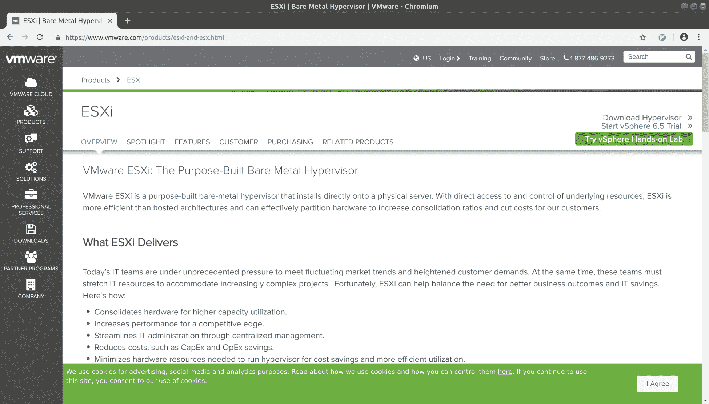

就个人而言，我承认曾多次使用 VMware 产品，用于各种工作，它确实如广告中所说的那样，没有太多华丽的东西。在适当的情况下，它可以优雅地处理诸如虚拟机故障转移之类的事情，而且它非常简单，任何人都可以放在控制台前轻松地进行导航（尽管我不是他们首次尝试基于 Web 的 GUI 的铁杆粉丝）。

# Proxmox 虚拟环境

另一个专用的虚拟化程序安装，Proxmox（VE），是一个基于 Linux（具体来说是 Debian）的操作系统，同样具有广泛的硬件支持和友好的 GUI，让您轻松上手。

这个开源解决方案非常适合家庭实验室环境，并且可以很好地扩展到大型安装，这意味着您可以为开发人员和生产部署部署相同的解决方案。

就优点而言，您可能会考虑以下几点：

+   它是开源的，这可能再次影响您的决定

+   它是免费的（就像啤酒一样），并提供付费支持和培训的选项

+   它基于已知和得到良好支持的技术，如 KVM 和 QEMU

+   它支持容器以及虚拟机

就负面方面而言，您可能会考虑以下几点：

+   安装基础和事实上它并不像 VMware ESXi 和其他产品那样出名（尽管这也可能对您产生积极的影响）

+   作为专用的虚拟化安装，您的 Proxmox 服务器不会做任何其他重要的事情（如 ESXi）

Proxmox Virtual Environment 可以在[`www.proxmox.com/en/downloads`](https://www.proxmox.com/en/downloads)获得：

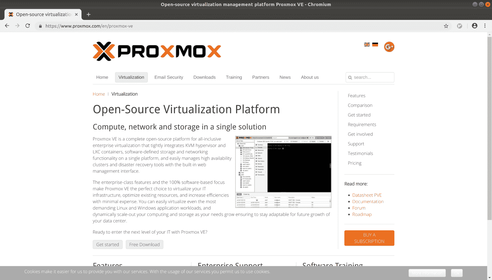

Proxmox 虚拟化主页

同样，根据个人经验，我相对轻松地设置了三个节点的 Proxmox 集群，并实现了自动故障转移，我与使用 Proxmox 的每个人交谈时似乎都很欣赏它在紧要关头是一个多么好的解决方案，同时又知道在需要时它可以进一步扩展。

# OpenStack

OpenStack 是新生力量，是一系列技术的集合，当它们组合在一起时，可以与任何更大的虚拟化环境提供者相媲美。

它可以成为虚拟机主机、容器主机、文件存储提供者、块存储提供者，并且它具有快速的开发周期，不断推出新功能。

与此列表上的其他两种解决方案不同，OpenStack 是赋予几种不同软件组件的名称。

对于优点，考虑以下几点：

+   OpenStack 有一个热情洋溢且专注的社区支持

+   这些组件是开源的，由全球各地的人共同开发

+   许多公司提供 OpenStack 解决方案并提供不同级别的支持

+   如果你对 OpenStack 很了解，你未来五十年不会失业（推测）

在缺点方面，我可能会因此收到一些恶意邮件：

+   OpenStack 有一个快速的开发周期，这意味着如果你不及时更新就会被落下

+   OpenStack 可以安装在你想要的任何 Linux 发行版上，这意味着在许多情况下你也必须管理底层操作系统

+   在我看到 OpenStack 被使用的地方，几乎需要一个专门的 OpenStack 团队来保持管理的最新状态

+   要以可用的方式设置它并不容易，尽管开发环境确实存在

+   有多种关于什么是一个好的 OpenStack 部署的观点

+   当你遇到一个被忽视的 OpenStack 解决方案时，这真是一件让人头疼的事

如果你想尝试 OpenStack（我鼓励你这样做），可以在这里找到入门指南：[`wiki.openstack.org/wiki/Getting_Started`](https://wiki.openstack.org/wiki/Getting_Started)。

还有一个起始页面，包括指向 devstack 开发环境的链接：

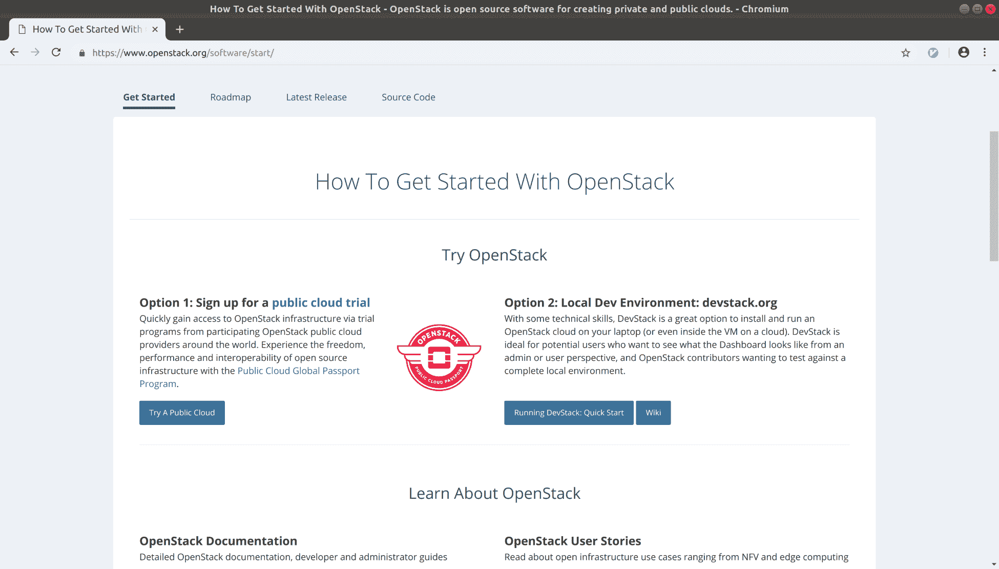

个人想法-我认识一些非常聪明的人，他们热爱 OpenStack 并对其赞不绝口，但这是一个需要大量关注和专注的领域。

# 它是如何工作的...

有多种做同样事情的方式。这对大多数经验来说都是真的，尤其是在 Unix 和类 Unix（Linux）世界中更是如此。

在这里，我们有三个很好的软件和解决方案的例子，它们允许你以大多数用户友好的方式控制虚拟机部署，尽管你可能认为所有这些解决方案都比你需要的复杂得多。

我在这里提到它们是因为知道这些选择是存在的很好，并且即使你开始时通过在 Ubuntu 安装上本地安装虚拟机（使用 VirtualBox 或 KVM 和 Libvirt），你可能希望将来扩展到更宏伟的东西。

另一个要考虑的选择是公共云服务，虽然我稍后会详细讨论这些，但值得注意的是有几家提供商可以帮你摆脱管理底层软件的麻烦，让你只需安装和创建虚拟机。

如果你没有硬件或资源，甚至没有预算，你可以按小时使用公共云服务。

看看 Scaleway，Digital Ocean 和 AWS（特别是他们的 Lightsail 产品）。

# 总结-容器和虚拟化

短短几年前，Linux 社区出现了一个运动。容器突然无处不在，并对在一个瞬息万变的世界中可能发生的事情做出了奇妙的承诺。容器将解决你在软件方面所面临的每一个问题，它们将解决你曾经遇到的每一个安全问题，并且它们将在夜晚哄你入睡并喂养你的宠物。

我们现在知道，虽然容器很棒，它们确实是许多情况下的一个很好的解决方案，但它们并不是万能的。仍然会有一些情况，软件在裸机上运行会更好，或者虚拟机比容器更合理，你知道吗？那没关系。

如果你想的话，不要让我劝阻你尝试在容器中运行你自己的项目-这绝对是一个很好的学习经验，你可能会发现这实际上是提升和转移你的安装的最佳方式，但不要得意忘形。

虚拟机始终会有它们的位置，虽然很多测试、部署和开发环境已经转向无服务器容器部署的方式，但一个良好的本地虚拟机仍然可以提供一个不错的工作方式，特别是如果你想了解某些软件如何与整个操作系统交互（无论是一个单片应用程序，还是许多组成一个程序的小应用程序）。

归根结底，这就像我们世界上的大多数事情一样。仅仅因为你可以用一种方式做某事，并不一定意味着这是最好的方式；同样，这并不意味着你提出的解决方案不好，它可能完全适合你的需求——只是了解所有选项会很方便。

我真诚地希望我能在这本书中进行更多的探索，并深入了解管理和维护虚拟机和容器的不同方式和方法，但这不是一本关于这些东西的书——它应该是对 Linux 管理世界的一个概览。

还记得圣战吗？我也遇到过一些人反对容器的概念，认为它们是各种各样的“困难”和“毫无意义”的解决方案。如果你站在这一边并为之奋斗，要做好失败的准备，因为目前容器支持者的军队比反对者大得多。
