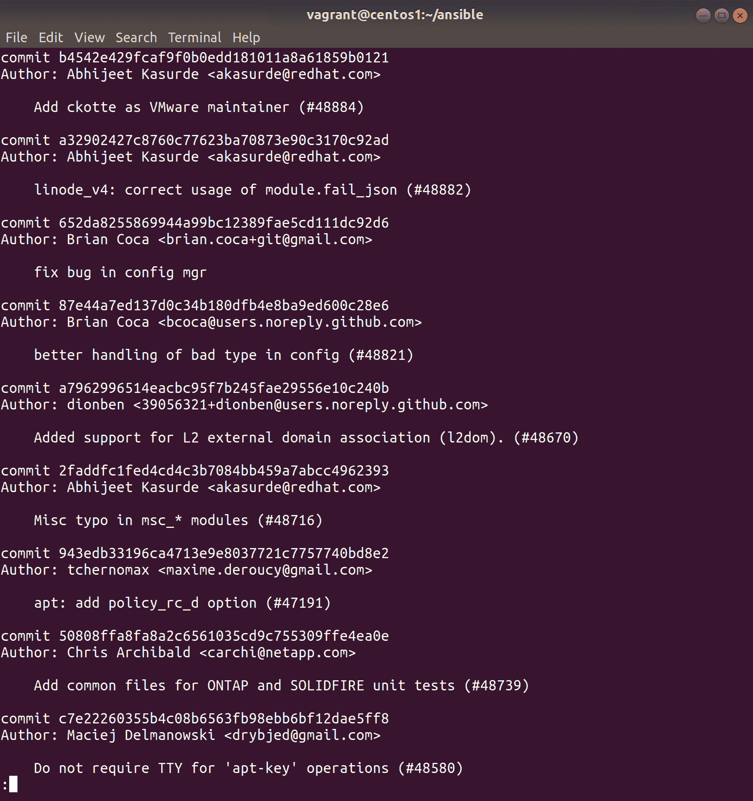
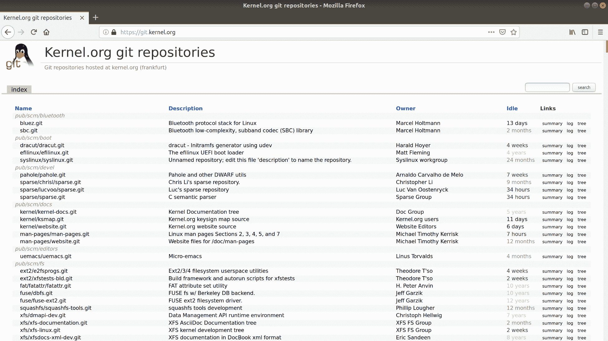
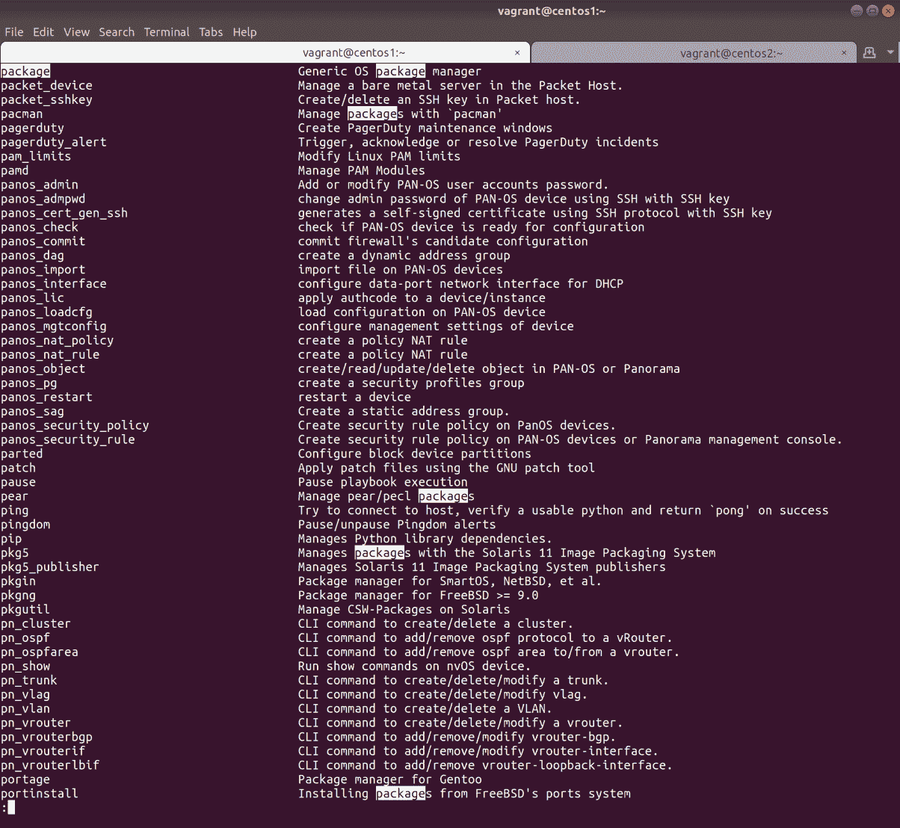
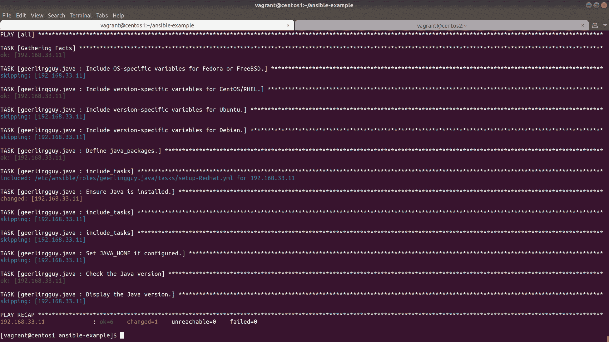

# 第十章：Git、配置管理和基础设施即代码

在这一章中，我们将研究以下主题：

+   什么是 Git？

+   设置 Git 服务器

+   提交到我们的 Git 仓库

+   分支我们的 Git 仓库并提交更改

+   安装 Ansible

+   使用 Ansible 从一个角色安装 Java

+   将我们的 Ansible 配置存储在 Git 中

+   探索 IaC 的选项

# 介绍

曾经有一段时间，系统管理员对他们的服务器了如指掌。他们可以告诉你每个风扇的噪音，每个蜂鸣的含义，以及服务器变热时金属膨胀的声音。

与硬件一样，软件几乎是以超自然的方式索引在系统管理员的头脑中，他们可以在一瞬间告诉你他们正在运行的 OpenSSL、Apache 或 Midnight Commander 的版本。

这显然存在一个问题：*被公交车撞倒*的效应。

如果一名系统管理员不幸在一个早晨被撞倒，他的随身听被扔到了路边，与他的 Game Boy Color 的残骸一起，那么服务器的所有知识将在瞬间丧失。服务器设置的奇怪方式，意味着必须在恰到好处的时刻拔掉键盘，这样的知识将永远消失。

你不希望一个人对服务器的所有事情了如指掌——你希望有多个人，并且更进一步，你希望它以一种不仅易于复制和修改的格式书写，而且最好是如此简单，以至于连计算机都能理解。

在这一章中，我们将看一下软件世界中相对接近的三件事——一个版本控制系统，叫做 Git；配置管理的概念，主要是 Ansible；以及基础设施即代码，以及每个人都喜欢的 Terraform 和 Packer。

实际上，我们已经通过使用 Vagrant 来完成了很多工作。Vagrant 实际上是一种基础设施即代码的方法，尽管规模很小。我们在一些 Vagrantfiles 中放入的小脚本可以很容易地被视为配置管理，尽管在基本层面上。

这些工具是你在旅途中遇到的最好的工具之一，特别是 Git 几乎被普遍使用，所以了解它是很好的。

# 技术要求

在这一章中，我们将需要一些虚拟机（VMs）。

随意使用以下的`Vagrantfile`。我们将主要在虚拟机之间的私有网络上工作：

```
# -*- mode: ruby -*-
# vi: set ft=ruby :

$provisionScript = <<-SCRIPT
sed -i 's#PasswordAuthentication no#PasswordAuthentication yes#g' /etc/ssh/sshd_config
systemctl restart sshd
SCRIPT

Vagrant.configure("2") do |config|

  config.vm.provision "shell",
    inline: $provisionScript

  config.vm.define "centos1" do |centos1|
    centos1.vm.box = "centos/7"
    centos1.vm.network "private_network", ip: "192.168.33.10"
    centos1.vm.hostname = "centos1"
    centos1.vm.box_version = "1804.02"
  end

  config.vm.define "centos2" do |centos2|
    centos2.vm.box = "centos/7"
    centos2.vm.network "private_network", ip: "192.168.33.11"
    centos2.vm.hostname = "centos2"
    centos2.vm.box_version = "1804.02"
  end

end
```

# 什么是 Git？

在这一部分，我们将看一下**版本控制系统**（VCSs）的至高无上者。还有其他的，将来还会有更多，但现在有 Git，它是目前使用最广泛、最受欢迎的（尽管不是没有批评）。

Git 最初是由 Linus Torvalds 开发的——是的，就是那个开启 Linux 内核开发的 Linus Torvalds，尽管如今它主要由 Junio C Hamano 和许多其他才华横溢的黑客开发。它主要用于软件开发，但越来越多地用于存储诸如 Ansible、Terraform 和任何其他基础设施即代码工具的配置，从而实现对基础设施的历史和版本化的描述。

# 准备工作

为了理解 Git，我们将安装它，启动你的虚拟机，并跳到你的第一个 CentOS 盒子上：

```
$ vagrant up
$ vagrant ssh centos1
```

# 如何做...

安装 Git 很简单，因为它在大多数默认仓库中（事实上，我还没有遇到过一个 Linux 发行版，它不在默认仓库中）：

```
$ sudo yum install git -y
```

警告：你很可能会得到 Perl，虽然这本质上并不是一件坏事，但提到 perl 这个词会让开发人员和系统管理员感到不适。

我们现在应该有 Git 了，所以让我们来了解一些基础知识。

# 克隆

从根本上说，Git 是一个主要用于源代码版本控制的版本控制系统（尽管它还有其他用途）。

为了演示它是如何工作的，让我们克隆一个较小的存储库（在这种情况下是 Ansible）：

```
$ git clone https://github.com/ansible/ansible.git
Cloning into 'ansible'...
```

这可能需要几分钟，根据您的连接，但完成后，您将得到一个`ansible`文件夹：

```
$ ls -l
total 4
drwxrwxr-x. 14 vagrant vagrant 4096 Nov 19 18:10 ansible
```

# 探索和进行更改

我们现在有了一个与`devel`Ansible 代码分支相似的副本。它是`devel`，因为这是存储库所有者希望默认分支的名称，尽管通常它将是`master`或`develop`。

打开文件夹，我们会看到很多文件，里面有很多代码：

```
$ cd ansible/
$ ls -l
total 100
drwxrwxr-x. 2 vagrant vagrant 243 Nov 19 18:10 bin
drwxrwxr-x. 3 vagrant vagrant 141 Nov 19 18:10 changelogs
-rw-rw-r--. 1 vagrant vagrant 645 Nov 19 18:10 CODING_GUIDELINES.md
drwxrwxr-x. 4 vagrant vagrant 53 Nov 19 18:10 contrib
-rw-rw-r--. 1 vagrant vagrant 35148 Nov 19 18:10 COPYING
drwxrwxr-x. 6 vagrant vagrant 60 Nov 19 18:10 docs
drwxrwxr-x. 4 vagrant vagrant 192 Nov 19 18:10 examples
drwxrwxr-x. 5 vagrant vagrant 4096 Nov 19 18:10 hacking
drwxrwxr-x. 3 vagrant vagrant 21 Nov 19 18:10 lib
drwxrwxr-x. 2 vagrant vagrant 78 Nov 19 18:10 licenses
-rw-rw-r--. 1 vagrant vagrant 13512 Nov 19 18:10 Makefile
-rw-rw-r--. 1 vagrant vagrant 852 Nov 19 18:10 MANIFEST.in
-rw-rw-r--. 1 vagrant vagrant 286 Nov 19 18:10 MODULE_GUIDELINES.md
drwxrwxr-x. 11 vagrant vagrant 133 Nov 19 18:10 packaging
-rw-rw-r--. 1 vagrant vagrant 5370 Nov 19 18:10 README.rst
-rw-rw-r--. 1 vagrant vagrant 360 Nov 19 18:10 requirements.txt
-rw-rw-r--. 1 vagrant vagrant 11028 Nov 19 18:10 setup.py
-rw-rw-r--. 1 vagrant vagrant 3389 Nov 19 18:10 shippable.yml
drwxrwxr-x. 10 vagrant vagrant 121 Nov 19 18:10 test
-rw-rw-r--. 1 vagrant vagrant 1129 Nov 19 18:10 tox.ini
```

与任何良好的源代码一样，应该有一个`README`文件，这通常是一个很好的起点，但我们现在不是为了 Ansible 而在这里，我们是为了 Git。

运行`git status`：

```
$ git status
# On branch devel
nothing to commit, working directory clean
```

这告诉我们，我们没有进行任何更改，因此我们的工作目录是干净的，因为我们还没有做任何事情。

对`README`文件进行以下更改：

```
$ sed -i 's/^/The big brain am winning again. /g' README.rst 
```

现在，如果我们再次应用`git status`，我们将看到我们的更改：

```
$ git status
# On branch devel
# Changes not staged for commit:
# (use "git add <file>..." to update what will be committed)
# (use "git checkout -- <file>..." to discard changes in working directory)
#
# modified: README.rst
#
no changes added to commit (use "git add" and/or "git commit -a")
```

正如消息所暗示的，我们可以添加和提交我们的更改，然后尝试将它们合并到上游（不要这样做），但现在，我们只是简单地恢复我们刚刚对`README`文件所做的更改。

首先，让我们看看我们做了什么：

```
$ cat README.rst 
The big brain am winning again. |PyPI version| |Docs badge| |Chat badge| |Build Status| |Code Of Conduct| |Mailing Lists| |License|
The big brain am winning again. 
The big brain am winning again. *******
The big brain am winning again. Ansible
The big brain am winning again. *******
The big brain am winning again. 
The big brain am winning again. Ansible is a radically simple IT automation system. It handles
<SNIP>
```

哦，亲爱的，让我们修复一下：

```
$ git checkout README.rst 
$ git status
# On branch devel
nothing to commit, working directory clean
```

请注意，当我们检出`README`文件时，我们基本上将文件重置为其默认状态，这意味着 git 认为我们没有任何要提交的内容，文件恢复正常。

检出是用 Git 存储库的版本覆盖我们未提交的本地更改的行为。

我们可以看到这些变化已经被再次猫的文件所撤销：

```
$ head -5 README.rst
|PyPI version| |Docs badge| |Chat badge| |Build Status| |Code Of Conduct| |Mailing Lists| |License|

*******
Ansible
*******
```

不错，是吧？

值得记住的是，覆盖文件之前所做的任何更改都将丢失（因为它们没有被暂存，存储库也没有意识到它们）。

# 它是如何工作的...

从根本上说，Git 是一个版本控制系统，这意味着它控制着其管理的文件的版本。

大多数文件夹理论上都可以成为 Git 存储库，尽管通常是代码或配置才能获得这种特权。

当您检出存储库时，您会获得该分支上代码的快照。然后，如果您进行更改，这些更改需要被暂存，并且要么保留在一个单独的分支中，要么合并到您更改的分支中。

现在不要太担心这个——第一次有人告诉我 Git 的时候，我也感到非常困惑。

在现实世界中，人们倾向于使用 Git 的几种不同方式，以及一些相对流行的工具和实践。例如，使用 Git 的内核方法与 GitFlow 方法极为不同。

我们将在本章的其余部分介绍更改的示例，但现在，您只需要了解，如果您将某些内容提交并推送到 Git 存储库中，它将记录该更改，这意味着您可以在存储库的生命周期的任何时候返回到代码的早期版本，并将旧的修复或更改回移植到稳定分支中。

遗憾的是，Git 无法从一些奇怪的未来文件中导入您尚未编写的代码，但我仍然对此功能抱有希望。

每个存储库的配置都存储在创建存储库时创建的`.git`文件夹中：

```
$ pwd
/home/vagrant/ansible
$ ls -hla .git
total 1.5M
drwxrwxr-x. 8 vagrant vagrant 163 Nov 19 18:17 .
drwxrwxr-x. 14 vagrant vagrant 4.0K Nov 19 18:17 ..
drwxrwxr-x. 2 vagrant vagrant 6 Nov 19 18:09 branches
-rw-rw-r--. 1 vagrant vagrant 261 Nov 19 18:10 config
-rw-rw-r--. 1 vagrant vagrant 73 Nov 19 18:09 description
-rw-rw-r--. 1 vagrant vagrant 22 Nov 19 18:10 HEAD
drwxrwxr-x. 2 vagrant vagrant 242 Nov 19 18:09 hooks
-rw-rw-r--. 1 vagrant vagrant 1.4M Nov 19 18:17 index
drwxrwxr-x. 2 vagrant vagrant 21 Nov 19 18:09 info
drwxrwxr-x. 3 vagrant vagrant 30 Nov 19 18:10 logs
drwxrwxr-x. 4 vagrant vagrant 30 Nov 19 18:09 objects
-rw-rw-r--. 1 vagrant vagrant 28K Nov 19 18:10 packed-refs
drwxrwxr-x. 5 vagrant vagrant 46 Nov 19 18:10 refs
```

该文件夹还包含您存储库的历史记录（以二进制格式）。当您尝试查找不在您检出的分支中的文件的更改和差异时，它是搜索的地方。因此，它也可能相当大。

查看配置文件，我们可以看到克隆存储库时绘制的默认值：

```
$ cat .git/config 
[core]
 repositoryformatversion = 0
 filemode = true
 bare = false
 logallrefupdates = true
[remote "origin"]
 url = https://github.com/ansible/ansible.git
 fetch = +refs/heads/*:refs/remotes/origin/*
[branch "devel"]
 remote = origin
 merge = refs/heads/devel
```

注意远程部分，详细说明我们的`origin`所在的位置。

还有一个“全局”配置文件和一个“系统”文件，可以用来进行更改，影响用户与系统上任何用户交互的每个存储库。

这应该让您对 Git 为何如此出色有一个很好的了解——它允许轻松协作，因为人们可以在不同的分支上甚至相同的分支上工作，并且有一些功能可以阻止您覆盖彼此的工作。您还可以放心地进行更改，因为文件的历史记录在那里，这意味着当您不可避免地出现问题时，您可以用几个按键来解决它。

# 还有更多...

Git 非常强大，但它也具有一些非常好的功能。

例如，`log`对于阅读提交消息很有用：

```
$ git log --pretty=short 
```

输出应该如下截图所示：



例如，`tag`对于列出人们已添加到代码不同时间点的标签很有用：

```
$ git tag | head -n5
0.0.1
0.0.2
0.01
0.3
0.3.1
```

`branch`可用于查看 Git 知道的所有不同分支：

```
$ git branch -a
* devel
 remotes/origin/HEAD -> origin/devel
 remotes/origin/acozine-patch-1
 remotes/origin/devel
 remotes/origin/mazer_role_loader
 remotes/origin/release1.5.0
 remotes/origin/release1.5.1
 remotes/origin/release1.5.2
<SNIP>
```

在这里，我们使用了`-a`，因此远程分支和您的单个本地分支（`devel`）都包括在内。

# 设置 Git 服务器

在本节中，我们将看看如何设置一个小型的 Git 服务器，实际上就是使用我们从 CentOS 存储库安装`git`时得到的内容。

我们将在 centos2 上创建一个基本存储库，并从 centos1 上使用它。

# 准备工作

在本节中，我们将使用我们的两台机器，使用 centos2 作为服务器，centos1 作为客户端。

在这种情况下，请确保您的两台机器上都安装了`git`：

```
$ sudo yum install git -y
```

# 如何做...

在`centos2`上，让我们创建我们的空存储库：

```
$ mkdir example.git
$ cd example.git/
$ git init --bare
Initialized empty Git repository in /home/vagrant/example.git/
```

现在，在我们的`centos1`机器上，我们可以克隆存储库：

```
$ git clone 192.168.33.11:example.git
Cloning into 'example'...
The authenticity of host '192.168.33.11 (192.168.33.11)' can't be established.
ECDSA key fingerprint is SHA256:s5NfsrM/XRuH5rXaZSaNmaUxXe3MlN2wRoJ3Q43oviU.
ECDSA key fingerprint is MD5:ea:24:ef:b3:cf:d9:03:3d:06:da:1f:2f:d2:6b:1d:67.
Are you sure you want to continue connecting (yes/no)? yes
Warning: Permanently added '192.168.33.11' (ECDSA) to the list of known hosts.
vagrant@192.168.33.11's password: 
warning: You appear to have cloned an empty repository.
```

您将被提示输入`vagrant`用户密码（默认为`vagrant`），然后您将看到一条消息，通知您已经克隆了一个空存储库。

这很好，因为现在您应该看到一个新的`example`目录：

```
$ ls
example
$ cd example/
$ git status
# On branch master
#
# Initial commit
#
nothing to commit (create/copy files and use "git add" to track)
```

# 工作原理...

当您在 centos2 上初始化存储库时，您正在创建一个可以存在于任意数量的设备上的存储库，不一定需要从您的中央位置（centos2）克隆。

如果由于某种原因，您无法从初始服务器（centos2）克隆，您还可以从已经检出存储库的另一台机器克隆存储库（尽管您可能面临存储库与第一个节点不同步的风险）。

当您克隆存储库时，实际上是通过 SSH 与`centos2`进行通信，并且 Git 发送特定命令，这些命令被另一侧的存储库理解并回答。

同样，如果我们在`centos1`上检出`.git`存储库，在克隆的存储库中，我们可以看到以下内容：

```
$ cat .git/config 
[core]
 repositoryformatversion = 0
 filemode = true
 bare = false
 logallrefupdates = true
[remote "origin"]
 url = 192.168.33.11:example.git
 fetch = +refs/heads/*:refs/remotes/origin/*
[branch "master"]
 remote = origin
 merge = refs/heads/master
```

请注意打印为远程`origin`的 URL。还要注意这不是一个`bare`存储库。

让我们看看服务器（`centos2`）上的`config`文件：

```
$ cat config 
[core]
 repositoryformatversion = 0
 filemode = true
 bare = true
```

这里设置为`true`的`bare`要小得多。

# 还有更多...

这是最简单的 Git 存储库，如果您想使其更有趣，还有更多事情可以做。

首先，您可能考虑在系统上创建一个专用的`git`用户，并使用此用户来管理和拥有 Git 存储库。这通常是一个非常标准的方法，也是 GitLab 和 GitHub 等现成的 Git 解决方案所共享的方法。

其次，您可以考虑设置一个`cgit`服务器，这是一个小型服务器，可用于可视化 Git 存储库。

最著名的`cgit`实例可能是[git.kernel.org](https://git.kernel.org/)：



# 提交到我们的 Git 存储库

在本节中，我们将编写一个小文件，将其添加到 Git 正在跟踪的文件中，提交我们的更改，并将其推送到原始服务器。

# 准备工作

如果尚未这样做，请根据上一节设置基于 Git 的服务器。

确保您已在`centos1`上检出您的存储库。

# 如何做...

让我们为我们的新存储库添加一些信息并将其推送到服务器（证明它有效）：

```
$ cd example/
```

让我们首先运行`git status`来查看我们的进度：

```
$ git status
# On branch master
nothing to commit, working directory clean
```

好的-它是空的。

现在，让我们回显一些文本到一个文件中，将文件放入暂存区，并提交带有消息的文件：

```
$ echo "Warcraft III was the best Warcraft game." > README
$ git add README
$ git commit -m "Adding README to repository." 

*** Please tell me who you are.

Run

 git config --global user.email "you@example.com"
 git config --global user.name "Your Name"

to set your account's default identity.
Omit --global to set the identity only in this repository.

fatal: unable to auto-detect email address (got 'vagrant@centos1.(none)')
```

啊！现在，因为这是一个新的安装，Git 提示我们设置一些默认值：

```
$ git config --global user.email "you@example.com"
$ git config --global user.name "Your Name... good film."
```

让我们再试一次提交：

```
$ git commit -m "Adding README to repository." 
[master (root-commit) 65bf49a] Adding README to repository.
 1 file changed, 1 insertion(+)
 create mode 100644 README
```

好了，我们已经提交了我们的文件，这意味着本地版本的`master`是最新的。

然而，这意味着我们现在与我们的源存储库不同步，所以我们也需要将我们的更改`push`到那里：

```
$ git push
warning: push.default is unset; its implicit value is changing in
Git 2.0 from 'matching' to 'simple'. To squelch this message
and maintain the current behavior after the default changes, use:

 git config --global push.default matching

To squelch this message and adopt the new behavior now, use:

 git config --global push.default simple

See 'git help config' and search for 'push.default' for further information.
(the 'simple' mode was introduced in Git 1.7.11\. Use the similar mode
'current' instead of 'simple' if you sometimes use older versions of Git)
```

哇！又一个提示-我们应该设置它。就我个人而言，我选择了新行为，因为虽然 CentOS 7 附带了一个旧版本的 Git，但进步的步伐仍在继续：

```
$ git config --global push.default simple
```

呼！好吧，让我们再试一次推送：

```
$ git push
vagrant@192.168.33.11's password: 
Counting objects: 3, done.
Writing objects: 100% (3/3), 268 bytes | 0 bytes/s, done.
Total 3 (delta 0), reused 0 (delta 0)
To 192.168.33.11:example.git
 * [new branch] master -> master
```

在这里，您可以看到我们被提示输入密码，但一旦输入密码，更改就会被写入原始服务器。

这意味着当我们再次从原始克隆存储库克隆存储库时，我们的更改将随之而来。

尝试从您的主目录运行以下命令以证明这一点：

```
$ cd ~
$ git clone 192.168.33.11:example.git example2
Cloning into 'example2'...
vagrant@192.168.33.11's password: 
remote: Counting objects: 3, done.
remote: Total 3 (delta 0), reused 0 (delta 0)
Receiving objects: 100% (3/3), done.
$ ls example2
README
```

卓越！

# 它是如何工作的...

在这里，我们正在做一些事情。

首先，在我们创建了带有一些文本的 foo 文件后，我们`add`了该文件：

```
$ git add README
```

在这个小命令中，我们实际上是将`README`文件添加到 Git 的索引中。

我们以这种方式暂存的任何东西都将在下一次提交中添加：

```
$ git commit -m "Adding README to repository." 
```

在这里，我们正在提交（正如名称所示）我们对存储库的添加更改。我们还在命令中包括消息（使用`-m`）作为命令的一部分，而不是让`git commit`将我们放入默认编辑器中（因为每次提交都应该有一个消息，因为它提示您写一个）。

最后，我们推送了我们的更改：

```
$ git push
```

在技术术语上，我们正在通知远程存储库（在`192.168.33.11`上）一些引用已经改变，并告诉它哪些引用已经改变。我们还推送了与这些引用更改相关的任何对象。

# 匹配与简单

关于这一点，我们在本节中设置了我们的默认值。

如果我们将选项设置为匹配，那么在运行`git push`命令时，我们将一次推送所有分支。这意味着不仅您当前的分支，而且`master`，`develop`和您可能拥有的任何其他分支也将被推送。

另一方面，简单只会推送你当前正在工作的分支。从逻辑上讲，简单会成为默认行为是可以理解的，因为它假设大多数人一次只会在一个分支上工作。

# 分支我们的 Git 存储库并提交更改

在本节中，我们将看看如何分支我们的克隆存储库并将这些更改推送到我们的服务器。

# 做好准备

确保您至少已经完成了*设置*部分，但最好是您也提交了第一个文件的部分。

所有工作将在`centos1`的`example`存储库中完成。

# 如何做到这一点...

切换到`example`存储库：

```
$ cd ~/example
```

现在，检查一下你是否在`master`上开始：

```
$ git branch
* master
```

您当前的分支用星号表示。

好了！现在，我们要从`master`上`branch`出去，并做一些更改：

```
$ git branch develop
```

再次运行`git branch`：

```
$ git branch
 develop
* master
```

请注意，现在我们有两个分支，但我们仍然在`master`分支上。我们需要运行不同的命令来切换到我们的新分支：

```
$ git checkout develop
Switched to branch 'develop'
```

现在，列出这个分支中有什么：

```
$ ls
README
```

我们实际上已经复制了`master`分支，这意味着提交到该分支的所有文件都可以在我们的新分支中使用。

让我们创建一个新文件并给它一些内容：

```
$ echo "Keep your keys happy." > RULESFORRULERS
```

再次运行`git status`会告诉我们我们的未跟踪更改：

```
$ git status
# On branch develop
# Untracked files:
# (use "git add <file>..." to include in what will be committed)
#
# RULESFORRULERS
nothing added to commit but untracked files present (use "git add" to track)
```

正如它所说，让我们`add`和`commit`这个文件：

```
$ git add *
$ git commit -m "Adding an extremely important file\!"
[develop 7f91f4d] Adding an extremely important file\!
 1 file changed, 1 insertion(+)
 create mode 100644 RULESFORRULERS
```

现在，我们在本地有一个分支，有一个提交的文件，在原始服务器上根本不存在。

让我们尝试将我们的分支`push`到`192.168.33.11`：

```
$ git push
fatal: The current branch develop has no upstream branch.
To push the current branch and set the remote as upstream, use

 git push --set-upstream origin develop
```

哦不！

因为我们的本地`develop`分支没有配置上游对应项，所以`push`失败了。

然而，您已经知道这一点，因为您是一个勤奋的系统管理员，实际上阅读了错误消息，以及它给我们提供的有用命令来纠正这个问题：

```
$ git push --set-upstream origin develop
vagrant@192.168.33.11's password: 
Counting objects: 4, done.
Compressing objects: 100% (2/2), done.
Writing objects: 100% (3/3), 326 bytes | 0 bytes/s, done.
Total 3 (delta 0), reused 0 (delta 0)
To 192.168.33.11:example.git
 * [new branch] develop -> develop
Branch develop set up to track remote branch develop from origin. 
```

好吧，现在我们在本地有一个`develop`和`master`分支，以及一个在上游服务器上的副本。

让我们检出`master`看看现在是什么样子：

```
$ git checkout master
Switched to branch 'master'
$ ls
README
```

什么？我们的文件在哪里？它就在这个目录里！

啊，但不，这是同一个目录的不同分支，在这个黑暗的时间线中，我们的工作并不存在。

让我们只检查一下我们两个分支之间的差异：

```
$ git diff develop
diff --git a/RULESFORRULERS b/RULESFORRULERS
deleted file mode 100644
index c895005..0000000
--- a/RULESFORRULERS
+++ /dev/null
@@ -1 +0,0 @@
-Keep your keys happy.
```

我们的工作在这里！

好吧，那么如果我们想要从`develop`合并我们的更改怎么办？

Git 就是这样的：

```
$ git merge develop
Updating 65bf49a..7f91f4d
Fast-forward
 RULESFORRULERS | 1 +
 1 file changed, 1 insertion(+)
 create mode 100644 RULESFORRULERS
$ ls
README RULESFORRULERS
```

砰！我们仍然在我们的`master`分支上，但文件又回来了。

令人困惑的是，如果我们现在运行`git status`，我们会看到一个新消息：

```
$ git status
# On branch master
# Your branch is ahead of 'origin/master' by 1 commit.
# (use "git push" to publish your local commits)
#
nothing to commit, working directory clean
```

幸运的是，再次，这条消息很好地解释了。我们的本地`master`分支很好，但`upstream`还不知道我们的更改。

我们可以用另一个`diff`来证明这一点：

```
$ git diff origin/master
diff --git a/RULESFORRULERS b/RULESFORRULERS
new file mode 100644
index 0000000..c895005
--- /dev/null
+++ b/RULESFORRULERS
@@ -0,0 +1 @@
+Keep your keys happy.
```

让我们把我们的更改上传：

```
$ git push
vagrant@192.168.33.11's password: 
Total 0 (delta 0), reused 0 (delta 0)
To 192.168.33.11:example.git
 65bf49a..7f91f4d master -> master
```

魔术。

# 它是如何工作的...

好吧，这并不是真正的魔术，只是一些极其出色的编码的产物。

当我们从`master`（或者任何分支）分支出来时，我们在新分支中创建了一个时间点的克隆。然后我们对分支进行了更改，做了一些像测试配置更改或者故意破坏东西的事情，而不会影响`master`分支（和我们已知的良好配置）。

这一点很容易理解（我认为），但当我们想要确保我们的更改被推送到服务器时，问题就开始了。

我们运行了`git push`，但它抱怨了。这是因为我们的.git/config 文件中没有一个告诉 git 在哪里推送我们的本地分支的部分。

在我们运行建议的命令之后，我们的`.git/config`现在看起来是这样的：

```
$ cat .git/config 
[core]
 repositoryformatversion = 0
 filemode = true
 bare = false
 logallrefupdates = true
[remote "origin"]
 url = 192.168.33.11:example.git
 fetch = +refs/heads/*:refs/remotes/origin/*
[branch "master"]
 remote = origin
 merge = refs/heads/master
[branch "develop"]
 remote = origin
 merge = refs/heads/develop
```

注意包含一个新分支定义。

所以，推送完成了，远程看起来很好。

然后我们切换回`master`并执行我们的`git diff`命令：

```
$ git diff develop
diff --git a/RULESFORRULERS b/RULESFORRULERS
deleted file mode 100644
index c895005..0000000
--- a/RULESFORRULERS
+++ /dev/null
@@ -1 +0,0 @@
-Keep your keys happy.
```

这应该是相当容易理解的，但我们正在执行一个`diff`，对比我们现在所在的分支以及指定的分支。

你可以使用以下更明确的语法来实现相同的事情：

```
$ git diff master..develop
```

或者，你甚至可以检查你不在的两个分支：

```
$ git diff origin/master..origin/develop
```

通过这种方式，我们开始看到 Git 作为开发工具的强大之处。

它也很好地引出了我谈论`origin`分支。

在这一部分，我们将我们的本地主分支与`origin/master`进行了比较，如下所示：

```
$ git diff origin/master
diff --git a/RULESFORRULERS b/RULESFORRULERS
new file mode 100644
index 0000000..c895005
--- /dev/null
+++ b/RULESFORRULERS
@@ -0,0 +1 @@
+Keep your keys happy.
```

从我们的`.git/config`中，我们了解到`origin`是远程仓库的名称，就 Git 而言：

```
[remote "origin"]
  url = 192.168.33.11:example.git
  fetch = +refs/heads/*:refs/remotes/origin/*
```

因此，`origin/master`是`remote`服务器上的`master`分支。

我们推送到`origin/master`（以`git push`的形式）保持我们的代码是最新的。

# 还有更多...

你可能会想知道，如果你只是要在本地将你的分支合并到`master`，为什么还要推送到一个`remote`分支。

答案很简单：在大多数环境中，你最终会与许多其他人一起工作，能够展示你的改动和你正在处理的内容是一个很好的开发工具。它还允许诸如合并之前的分支协作之类的事情，因为任何其他人都可以检出你的分支进行查看。

大多数人并不只是在他们的基础设施中使用 Git 服务器，而是寻找诸如 Gogs 和 GitLab 之类的解决方案，这些是具有附加功能的 Git 服务器（如用户管理）。

你可能也在考虑服务器，并且欣赏到在这一部分，它有点拖沓，实际上并不是真正需要的。

让我们快速查看一下服务器的更改，首先创建并切换到一个新的分支：

```
$ git checkout -b super-fixes
Switched to a new branch 'super-fixes'
```

我在这里使用了创建和检出分支的简写，将`-b`添加到`git checkout`命令中。Git 有数百种小技巧，人们倾向于有自己的喜好。

在这个分支中，让我们创建一个新文件并将其`push`到`upstream`：

```
$ echo "Never look tired." > RULESFORRULERS
$ git commit -am "Another git trick, adding and committing in one line." 
[super-fixes a9b53e8] Another git trick, adding and committing in one line.
 1 file changed, 1 insertion(+), 1 deletion(-)
$ git push --set-upstream origin super-fixes
vagrant@192.168.33.11's password: 
Counting objects: 5, done.
Compressing objects: 100% (2/2), done.
Writing objects: 100% (3/3), 329 bytes | 0 bytes/s, done.
Total 3 (delta 0), reused 0 (delta 0)
To 192.168.33.11:example.git
 * [new branch] super-fixes -> super-fixes
Branch super-fixes set up to track remote branch super-fixes from origin.
```

接下来，切换到`centos2`并进入仓库：

```
$ cd ~/example.git/
```

通过运行`ls`，你看不到你的实际文件：

```
$ ls
branches config description gitweb HEAD hooks info objects pid refs
```

相反，你的文件在`objects`目录中，以它们当前的格式是无法阅读的：

```
$ ls objects/
1c 29 65 7f 84 a5 a9 b0 c8 info pack
```

我们可以通过它们的`ref`看到我们的分支：

```
$ ls refs/heads/
develop master super-fixes
```

您不会在服务器上的裸仓库中工作-您会在另一台机器上克隆并调整您的仓库，但偶尔查看内部工作情况也是很好的。

# 另请参阅

您可能想要安装 GitLab、Gogs 或其他 GUI-Git 实现，以便您可以尝试它们。就我个人而言，我发现它们相当直观，当团队有一个共同厌恶的 GUI 而不是一系列控制台命令时，他们往往能更好地工作。

# 安装 Ansible

在本节中，我们将介绍一种最受欢迎的配置管理工具，即 Ansible。与其他工具（如 Chef、Puppet 和 Salt）一样，Ansible 是一种将服务器配置编码的方式，也就是说，您想要进行的任何更改都可以写入文件并以程序方式应用于服务器或一组服务器。

您组合在一起的配置文件可以保存到一个中央存储库，最常见的是 Git，您可以构建诸如自动管道之类的东西，围绕您的配置，以便对该配置的更改会自动应用。

在默认情况下，您的 Ansible 是从基础架构中的指定框中运行的（通常是 GitLab、Jenkins 或 Ansible Tower 安装），或者在较小的环境中。工程师们经常在自己的机器上进行更改并不是不寻常的。

Ansible 不仅适用于具有涵盖各种场景的模块的服务器，例如云提供商配置、交换机配置，甚至证书管理。

我们将在 centos1 上运行一些小的 Ansible 命令，对 centos2 进行更改。

# 准备工作

打开到您的`centos1`机器的连接，同时安装 Ansible：

```
$ vagrant ssh centos1 $ sudo yum install ansible ansible-doc -y
```

# 如何做...

首先，我们将检查我们安装的 Ansible 的版本：

```
$ ansible --version
ansible 2.4.2.0
 config file = /etc/ansible/ansible.cfg
 configured module search path = [u'/home/vagrant/.ansible/plugins/modules', u'/usr/share/ansible/plugins/modules']
 ansible python module location = /usr/lib/python2.7/site-packages/ansible
 executable location = /usr/bin/ansible
 python version = 2.7.5 (default, Apr 11 2018, 07:36:10) [GCC 4.8.5 20150623 (Red Hat 4.8.5-28)]
```

这是版本`2.4.2.0`。

与标准存储库中的许多软件包一样，它们往往是稳定的（较旧的）版本。如果您愿意，也可以安装`pip`（在第十一章中介绍了 Web 服务器、数据库和邮件服务器），并使用它安装更近期的 Ansible 版本。现在，我们将坚持使用`2.4.2.0`。

为了测试我们的连接是否存在，我们可以使用一个名为`ping`的默认 Ansible 模块（尽管这不是 ICMP）。您将被提示输入`SSH 密码`（vagrant）：

```
$ ANSIBLE_HOST_KEY_CHECKING=false ansible -k -m ping -i 192.168.33.11, 192.168.33.11
SSH password: 
192.168.33.11 | SUCCESS => {
 "changed": false, 
 "ping": "pong"
}
```

我们添加了'ANSIBLE_HOST_KEY_CHECKING=false'变量，以确保在运行命令时远程机器的 SSH 主机密钥被接受。后续命令不应该需要这个。在生产场景中，您应该始终确认您信任远程机器的密钥。

太棒了！我们的`centos2`框做出了响应，更好的是，我们的命令告诉我们这并没有导致对远程机器的更改（稍后会详细介绍）。

接下来，让我们尝试使用不同的模块安装一些东西。我们想要安装一个软件包，但我们不知道如何操作。

为此，您可以访问 Ansible 网站（[`docs.ansible.com/ansible/latest/modules/list_of_all_modules.html`](https://docs.ansible.com/ansible/latest/modules/list_of_all_modules.html)）并搜索`package`，或者您可以使用`ansible-doc`：

```
$ ansible-doc -l
```

运行时，您将进入一个分页器，以及所有可用 Ansible 模块的列表。运行搜索（输入`/`字符，然后输入搜索字符串）以搜索`package`，并继续直到找到该名称的模块：



不能保证有一个模块存在于您想要的功能中，但也有很大的可能性。搜索与您尝试执行的操作相关的关键字，十有八九您可能会感到惊喜。

假设您已经发现了称为`package`的软件包模块，您可以退出此分页器。

现在，让我们看看`package`的语法是什么：

```
$ ansible-doc -s package
- name: Generic OS package manager
 package:
 name: # (required) Package name, or package specifier with version, like `name-1.0'. Be aware that packages are not always named the same and this module will not 'translate' them
 per distro.
 state: # (required) Whether to install (`present', or remove (`absent') a package. Other states depend on the underlying package module, i.e `latest'.
 use: # The required package manager module to use (yum, apt, etc). The default 'auto' will use existing facts or try to autodetect it. You should only use this field if the
 automatic selection is not working for some reason.
```

看起来不错，它告诉我们的是要`name`软件包的要求正是我们需要的，以及它应该处于什么状态。

太棒了！我们可以利用这个知识：

```
$ ansible -b -k -m package -a 'name=zip state=present' -i 192.168.33.11, 192.168.33.11
SSH password: 
192.168.33.11 | SUCCESS => {
    "changed": true, 
    "msg": "warning: /var/cache/yum/x86_64/7/base/packages/zip-3.0-11.el7.x86_64.rpm: Header V3 RSA/SHA256 Signature, key ID f4a80eb5: NOKEY\nImporting GPG key 0xF4A80EB5:\n Userid : \"CentOS-7 Key (CentOS 7 Official Signing Key) <security@centos.org>\"\n Fingerprint: 6341 ab27 53d7 8a78 a7c2 7bb1 24c6 a8a7 f4a8 0eb5\n Package : centos-release-7-5.1804.el7.centos.x86_64 (@anaconda)\n From : /etc/pki/rpm-gpg/RPM-GPG-KEY-CentOS-7\n", 
    "rc": 0, 
    "results": [
        "Loaded plugins: fastestmirror\nLoading mirror speeds from cached hostfile\n * base: mirrors.vooservers.com\n * extras: mirror.sov.uk.goscomb.net\n * updates: mirror.sov.uk.goscomb.net\nResolving Dependencies\n--> Running transaction check\n---> Package zip.x86_64 0:3.0-11.el7 will be installed\n--> Finished Dependency Resolution\n\nDependencies Resolved\n\n================================================================================\n Package Arch Version Repository Size\n================================================================================\nInstalling:\n zip x86_64 3.0-11.el7 base 260 k\n\nTransaction Summary\n================================================================================\nInstall 1 Package\n\nTotal download size: 260 k\nInstalled size: 796 k\nDownloading packages:\nPublic key for zip-3.0-11.el7.x86_64.rpm is not installed\nRetrieving key from file:///etc/pki/rpm-gpg/RPM-GPG-KEY-CentOS-7\nRunning transaction check\nRunning transaction test\nTransaction test succeeded\nRunning transaction\n Installing : zip-3.0-11.el7.x86_64 1/1 \n Verifying : zip-3.0-11.el7.x86_64 1/1 \n\nInstalled:\n zip.x86_64 0:3.0-11.el7 \n\nComplete!\n"
    ]
}
```

如果远程机器上的 sudo 操作需要密码，我们也可以包括`-K`，我们的没有。

太棒了！所以我们成功使用 Ansible 在我们的远程机器上安装了`zip`软件包（我会让读者猜测这个软件包的作用）。让我们再次运行这个命令——会发生什么？它会重新安装软件包吗？

```
$ ansible -b -k -m package -a 'name=zip state=present' -i 192.168.33.11, 192.168.33.11
SSH password: 
192.168.33.11 | SUCCESS => {
    "changed": false, 
    "msg": "", 
    "rc": 0, 
    "results": [
        "zip-3.0-11.el7.x86_64 providing zip is already installed"
    ]
} 
```

事实证明，不，Ansible 不会重新安装软件包。这是 Ansible 的一个基本理念，远程主机上运行的作业应该是幂等的，也就是说，当不需要时它们不应该做任何更改。

在编写 Ansible 时，确保你编写的代码是幂等的，而不是每次运行都进行更改，这是一个很好的实践。如果不断进行更改，代码就不会是幂等的，你无法保证系统的状态。

有时，特别是在远程系统上执行直接命令时，幂等性必须仔细考虑，有时必须手动构建到你的 Ansible 运行逻辑中，尽管这是一门更高级的学科。即使我偶尔也会在这个问题上求助于更聪明的朋友。

为了完整起见，让我们做最后一件事：

```
$ ansible -b -k -m yum -a 'name=zip state=present' -i 192.168.33.11, 192.168.33.11
SSH password: 
192.168.33.11 | SUCCESS => {
    "changed": false, 
    "msg": "", 
    "rc": 0, 
    "results": [
        "zip-3.0-11.el7.x86_64 providing zip is already installed"
    ]
} 
```

你能发现这个命令和我们上一个命令之间的区别吗？

是 yum！

具体来说，我们现在所做的是使用 Ansible 的`yum`模块代替`package`，这意味着我们已经使得我们的命令只能在基于 YUM 的系统上工作。这突显了实现相同目标的方法不止一种，我们很快会讨论为什么你可能想使用其中一个模块。

# 它是如何工作的...

现在我们已经快速看了一下 Ansible 如何用于在远程机器上运行作业，让我们来分解一下我们做了什么，从`ping`模块开始：

```
$ ANSIBLE_HOST_KEY_CHECKING=false ansible -k -m ping -i 192.168.33.11, 192.168.33.11
```

让我们按顺序讨论这些参数：

```
-k
```

在这里，`-k`表示 Ansible 将知道提示我们输入密码，我们将用它连接到远程机器（我们 Vagrant 用户的 SSH 密码）：

```
-m ping
```

在这里，我们告诉 Ansible 我们要使用`ping`模块：

```
-i 192.168.33.11,
```

在这里，我们正在构建一个清单，尽管可以承认只有一个机器的清单。

Ansible 需要知道它可以使用的主机列表——它的清单——但在这里，我们只有一个，所以我们使用它（确保以逗号结尾）：

```
192.168.33.11
```

最后，我们以我们要访问的主机的 IP 结束，有点反直觉的是，我们必须重复。

这里我们缺少的一件事是`-u`标志，如果我们想要作为一个不是`vagrant`的用户`SSH`到远程主机，我们会使用它。

既然我们在这里，我们也要看一下我们的第二个`ansible-doc`命令：

```
$ ansible-doc -s package
```

在这里，我们想要看到我们可以为`package`模块编写的代码片段。这在服务器上很有用，或者在考试情况下非常有用，你可能无法访问更广泛的互联网。

最后，让我们分解一下我们的最后一个命令（尽管相同的原则可以应用到`package`示例中）：

```
$ ansible -b -k -m yum -a 'name=zip state=present' -i 192.168.33.11, 192.168.33.11
```

在这里，有一些区别：

```
-b
```

我们在这里使用`-b`，因为我们正在进行需要我们在远程机器上“变成”（become）的更改。这意味着以特权升级（变成 root）运行命令。

```
-m yum -a 'name=zip state=present'
```

在这里，我们在我们的参数列表中添加了`-a`，具体是因为`yum`模块需要自己的参数，然后我们将这些参数放在引号内。

基于你使用的模块，这些参数可能会变得很长，但在这里它的数量相对较少。

第二次我们使用了`yum`，特别是为了突出虽然实现了相同的目标（安装`zip`软件包），我们有选择将我们的命令与特定的发行版绑定。

这样做的原因很简单，当你看一下`package`模块可用的参数列表时就明白了：

+   `name`

+   `state`

+   `use`

您还可以查看`yum`模块可用的内容，以帮助解决这个问题：

+   `allow_downgrade`

+   `conf_file`

+   `disable_gpg_check`

+   `disablerepo`

+   `enablerepo`

+   `exclude`

+   `installroot`

+   `list`

+   `name`

+   `security`

+   `skip_broken`

+   `state`

+   `update_cache`

+   `validate_certs`

希望您能看到`yum`模块如何被用来为 Ansible 制定更具体和详细的指令。

在现实世界中，我看到工程师编写代码，试图用一个角色满足所有用例，也就是说，一个角色可以在 Debian、CentOS 或 Alpine 系统上应用并完成相同的事情。这也许是一个崇高的目标，但通常会导致工程师或接下来的工程师因为不灵活而感到极度沮丧。通常情况下，我发现更容易的方法是简单地使用特定于发行版的模块，并让 Ansible 在选择要执行的命令之前检查它正在运行的发行版的类型，或者更好的是，只在您的基础设施中使用一个发行版，而不是混合使用。

# 还有更多...

还有一些小事情需要注意。

# 原始模块

在这种情况下，centos2 已经安装了 Python（Ansible 需要在远程机器上运行模块）。但是，如果没有安装，您将需要首先在机器上安装它，或者在任何其他模块之前使用 Ansible 的内置`raw`模块。

当您使用`raw`时，实际上是直接在远程机器上运行命令。这通常是通过类似以下的行来看到的：

```
$ ansible -b -k -m raw -a 'whoami' -i 192.168.33.11, 192.168.33.11
SSH password: 
192.168.33.11 | SUCCESS | rc=0 >>
root
Shared connection to 192.168.33.11 closed.
```

请注意，远程机器只是简单地回应了`SUCCESS`和结果命令。

我们将使用这个来安装`python`：

```
$ ansible -b -k -m raw -a 'yum install python -y' -i 192.168.33.11, 192.168.33.11
SSH password: 
192.168.33.11 | SUCCESS | rc=0 >>
Loaded plugins: fastestmirror
Loading mirror speeds from cached hostfile
<SNIP>
Updated:
 python.x86_64 0:2.7.5-69.el7_5 

Dependency Updated:
 python-libs.x86_64 0:2.7.5-69.el7_5 

Complete!
Shared connection to 192.168.33.11 closed.
```

它的格式不太好，但是现在我们在`remote`机器上有了`python`，我们将能够使用适当的 Ansible 模块，而不是依赖简单的`SSH`执行。

# shell 和 command 模块

与`raw`一样，您可以使用 Ansible 将本机命令传递给远程机器（实际上，您可以非常容易地将整个 bash 脚本转换为 Ansible 角色），尽管通常这种功能是为您绝对无法使用专用 Ansible 模块来实现的情况保留的。

但是这两个确实需要 Python 在远程机器上。

首先，让我们看看`shell`模块：

```
$ ansible -b -k -m shell -a 'whoami > BUTTER; cat BUTTER | rev' -i 192.168.33.11, 192.168.33.11
SSH password: 
192.168.33.11 | SUCCESS | rc=0 >>
toor
```

请注意，我基本上是在我的 Ansible 命令中运行一个小的一行命令。

接下来，让我们使用`command`模块：

```
$ ansible -b -k -m command -a 'whoami > BUTTER; cat BUTTER | rev' -i 192.168.33.11, 192.168.33.11
SSH password: 
192.168.33.11 | FAILED | rc=1 >>
whoami: extra operand '>'
Try 'whoami --help' for more information.non-zero return code
```

啊...这失败了。

这是因为`command`并没有显式地运行一个 shell（比如 Bash），所以当我们尝试使用 bashism 形式的>时，它失败了。`command`模块只对短命令真正有效：

```
$ ansible -b -k -m command -a 'whoami' -i 192.168.33.11, 192.168.33.11
SSH password: 
192.168.33.11 | SUCCESS | rc=0 >>
root
```

# 参见

在这里，我们使用了`SSH`密码来在我们的盒子上运行远程命令，但这通常不会这样做（特别是在自动化环境中）。通常情况下，使用 SSH 密钥，并且权限要得到仔细控制。

# 使用 Ansible 从角色安装 Java

Ansible 非常适合做我们刚刚做的事情，通过在远程机器上使用模块运行易于理解的命令。

但这不是它的核心。相反，当需要对远程机器运行一系列命令并在几秒钟内进行大规模配置更改时，Ansible 真正发挥作用。

在本节中，我们将编写一个小的 Ansible Playbook 来从公共存储库导入一个 Ansible 角色，并将该角色应用到我们的 centos2 机器上。

抓住你的帽子！

# 准备工作

对于本节，我们再次使用我们的`Vagrantfile`和两个 CentOS 虚拟机。

在处理这一部分之前，最好先完成上一部分。

`SSH`到您的`centos1`机器：

```
$ vagrant ssh centos1
```

# 如何做...

让我们首先创建一个目录，在这个目录中我们将要工作并进入其中：

```
$ mkdir ansible-example
$ cd ansible-example/
```

现在，我们说我们要使用一个公共的 Ansible 角色来完成这项工作，所以让我们搜索一个：

```
$ ansible-galaxy search "java for linux" --author geerlingguy

Found 7 roles matching your search:

 Name Description
 ---- -----------
 geerlingguy.ac-solr Apache Solr container for Docker.
 geerlingguy.elasticsearch Elasticsearch for Linux.
 geerlingguy.java Java for Linux
 geerlingguy.puppet Puppet for Linux.
 geerlingguy.solr Apache Solr for Linux.
 geerlingguy.sonar SonarQube for Linux
 geerlingguy.tomcat6 Tomcat 6 for RHEL/CentOS and Debian/Ubuntu.
```

您还可以使用[`galaxy.ansible.com/`](https://galaxy.ansible.com/)网站：


在 Ansible Galaxy 上搜索 java

我实际上更倾向于使用网站而不是命令行，因为它可以让您一目了然地了解角色的流行程度。我已经知道`geerlingguy`编写的角色非常受欢迎，所以我选择在搜索中明确包含他的名字。

现在我们知道我们想要使用哪个角色，让我们下载它：

```
$ sudo ansible-galaxy install geerlingguy.java
- downloading role 'java', owned by geerlingguy
- downloading role from https://github.com/geerlingguy/ansible-role-java/archive/1.9.4.tar.gz
- extracting geerlingguy.java to /etc/ansible/roles/geerlingguy.java
- geerlingguy.java (1.9.4) was installed successfully
```

太棒了！我们有了我们的角色。

现在我们如何应用它？

当然是用 Playbook！

在您的系统上运行以下命令：

```
$ cat <<HERE > playbook.yml
---
- hosts: all
 roles:
 - geerlingguy.java
HERE
```

现在，对 centos2 运行我们的`playbook`：

```
$ ansible-playbook -k -b -i 192.168.33.11, playbook.yml
```

当您的屏幕上出现一系列信息时，我们之前下载的角色将被应用到远程机器上：



请注意运行底部的`ok=6`和`changed=1`。如果您现在再次运行 playbook，您应该会得到`changed=0`，因为该角色是幂等的。

就是这样！只用三个命令（实际上），您就可以在远程机器上安装 Java。

# 它是如何工作的...

通过逐条命令运行我们在本节中所做的事情，我们将分解发生的事情。

```
$ ansible-galaxy search "java for linux" --author geerlingguy
```

最初，我们需要知道是否有人已经编写了一个在服务器上安装 Java 的 Ansible 角色。事实上，我们能够搜索到 Linux 的 Java，同时传入作者的名字，结果找到了七个角色。

我有一个朋友喜欢为工作编写自己的 Ansible，但我一直认为，如果解决方案已经存在（而且合适），采用其他人编写的工作是没有害处的，只要其许可证允许您这样做，并且您的公司也没有意见。开源社区很好，如果有人已经发明了轮子，那么尝试放下锤子和凿子。

```
$ sudo ansible-galaxy install geerlingguy.java
```

一旦我们知道我们想要的角色，我们就运行了`install`命令。具体来说，我们必须使用`sudo`，因为所涉及的角色被拉到您的服务器上，并放在共享的`/etc/ansible/roles/`目录中，我们的用户没有写入权限。

您可以在目录中看到这个角色（并复制或调整它）。

```
$ ls /etc/ansible/roles/geerlingguy.java/
defaults LICENSE meta molecule README.md tasks templates vars
```

实际的角色从`tasks/main.yml`开始，所以最好也看一下那里。

```
$ cat /etc/ansible/roles/geerlingguy.java/tasks/main.yml 
---
- name: Include OS-specific variables for Fedora or FreeBSD.
 include_vars: "{{ ansible_distribution }}.yml"
 when: ansible_distribution == 'FreeBSD' or ansible_distribution == 'Fedora'

- name: Include version-specific variables for CentOS/RHEL.
 include_vars: "RedHat-{{ ansible_distribution_version.split('.')[0] }}.yml"
<SNIP>
```

接下来，我们创建了一个小的`playbook.yml`文件，来指定我们应该在哪里安装哪个角色。

```
$ cat <<HERE > playbook.yml
---
- hosts: all
 roles:
 - geerlingguy.java
HERE
```

这里值得注意的是，我们将`hosts`列为`all`而不是特定的主机名或 IP，角色以 YAML 列表的形式存在。

通过添加不同的变量，不同的规则以及各种其他选项，您可以将 playbook 变成一个相当复杂的东西。

```
$ ansible-playbook -k -b -i 192.168.33.11, playbook.yml
```

最后，我们使用`ansible-playbook`将`playbook.yml`的内容实际应用到`centos2`。我们使用了常见的选项`-k`，`-b`和`-i`来构建我们的命令。

现在，它转到`centos2`，并执行`geerlingguy.java`角色的每一行。

# 还有更多...

也许为了一个角色而组合一个 playbook 似乎有点多余，但 playbook 的美妙之处在于它们不局限于一个角色。您可以在`playbook.yml`文件中包含尽可能多的角色，只要它们不相互冲突，您应该会有一个非常顺利的 Ansible 体验。

而不是：

```
$ cat <<HERE > playbook.yml
---
- hosts: all
 roles:
 - geerlingguy.java
 - geerlingguy.docker
 - geerlingguy.apache
HERE
```

我们还以非常特定的方式使用了`galaxy`，使用`ansible-galaxy`首先从互联网安装角色。您还可以在您的代码中包含一个`requirements.yml`文件，`ansible-galaxy`能够读取它，以便在尝试将它们应用到远程服务器之前，它可能会下载找到的任何列出的角色：

```
$ cat <<HERE > playbook-requirements.yml
---
- name: geerlingguy.java
- name: geerlingguy.docker
- name: geerlingguy.apache
HERE
```

然后，在运行`playbook`之前，您首先会运行`galaxy`：

```
$ sudo ansible-galaxy install -r playbook-requirements.yml 
 [WARNING]: - geerlingguy.java (1.9.4) is already installed - use --force to change version to unspecified

- downloading role 'docker', owned by geerlingguy
- downloading role from https://github.com/geerlingguy/ansible-role-docker/archive/2.5.2.tar.gz
- extracting geerlingguy.docker to /etc/ansible/roles/geerlingguy.docker
- geerlingguy.docker (2.5.2) was installed successfully
- downloading role 'apache', owned by geerlingguy
- downloading role from https://github.com/geerlingguy/ansible-role-apache/archive/3.0.3.tar.gz
- extracting geerlingguy.apache to /etc/ansible/roles/geerlingguy.apache
- geerlingguy.apache (3.0.3) was installed successfully
```

这意味着当您运行`ansible-playbook`时，您的角色已经准备好了：

```
$ ansible-playbook -k -b -i 192.168.33.11, playbook.yml
SSH password: 

PLAY [all] *********************************************************************************************************************************************************************

TASK [Gathering Facts] *********************************************************************************************************************************************************
ok: [192.168.33.11]

<SNIP>

RUNNING HANDLER [geerlingguy.apache : restart apache] **************************************************************************************************************************
changed: [192.168.33.11]

```

```
PLAY RECAP *********************************************************************************************************************************************************************
192.168.33.11 : ok=33 changed=14 unreachable=0 failed=0 
```

# 另请参阅

正如我在*如何做...*部分中提到的，我已经知道`geerlingguy.java`，因为作者（`geerlingguy`）在他写的 Ansible 中非常活跃。无论您最终为哪个机构工作，您都很有可能再次看到这个名字。

# 将我们的 Ansible 配置存储在 Git 中

让我们结合到目前为止学到的知识，并将我们在上一节中编写的 Ansible 配置存储在我们的 Git 服务器上。

# 准备工作

在本节中，我们将主要使用`centos1`，但我们将上传我们的配置到`centos2`。

SSH 到你的两台虚拟机：

```
$ vagrant ssh centos1
$ vagrant ssh centos2
```

在 centos2 上，从你的主目录创建另一个空的`Git 存储库`：

```
$ git init --bare ansible-example.git
Initialized empty Git repository in /home/vagrant/ansible-example.git/
```

# 操作步骤...

在`centos1`上，切换到你的`ansible-example`目录：

```
$ cd ansible-example/
```

接下来，初始化目录为`Git 存储库`：

```
$ git init
```

添加我们已经在目录中的文件，并将它们`提交`到存储库：

```
$ git add *
$ git commit -m "Adding my playbook files."
```

完成后，你的本地存储库就可以了，但我们仍然希望将它们`推送`到远程目的地。

使用别名`origin`添加你的远程：

```
$ git remote add origin vagrant@192.168.33.11:ansible-example.git
```

最后，我们可以将我们的更改`推送`到`远程`存储库：

```
$ git push --set-upstream origin master
vagrant@192.168.33.11's password: 
Counting objects: 4, done.
Compressing objects: 100% (4/4), done.
Writing objects: 100% (4/4), 388 bytes | 0 bytes/s, done.
Total 4 (delta 0), reused 0 (delta 0)
To vagrant@192.168.33.11:ansible-example.git
 * [new branch] master -> master
Branch master set up to track remote branch master from origin.
```

# 工作原理...

我们在这里所做的就是将我们在最近几节中所做的结合起来：

+   我们在 centos2 机器上创建了一个 Git 存储库

+   我们拿出了我们编写的 Ansible 配置，并在其周围初始化了一个存储库

+   我们将我们的`远程`目的地设置为 centos2

+   我们将我们的配置推送到远程机器

现在，即使 centos1 消失了，你也会在 centos2 上有一份你的配置副本，其他人可以克隆这些信息，进行更改，然后推送回来。

传统上在系统管理领域，你会看到一个叫做“构建服务器”的东西。这是因为你可以将它作为分发配置和管理基础架构的焦点。很容易看出，如果一个团队中的五个人同时在一个项目上工作，每个人都在不同的分支上进行自己的更改，你可能会变得不同步。

# 探索 IaC 的选项

在本节中，我们将从 Hashicorp 的网站下载一些二进制文件，并使用我们的`centos1`虚拟机。

完全自动化你的基础架构超出了本书的范围，但我们可以谈谈目前市场上一些最流行的工具。

Terraform 和 Packer 都是由 Hashicorp 制作的，他们以为系统管理员们简化生活而闻名，或者根据你问的人而定，从来没有发布过 1.0.0 版本的产品。

Hashicorp 也是维护 Vagrant 的人，尽管他们曾经试图用一个叫做 Otto 的程序来替换它——我们不谈论 Otto。

Terraform 是一种以声明性代码编写基础架构的方式，有多种提供商可供选择，包括 AWS、Azure、Scaleway、Digital Ocean 等。

另一方面，Packer 是一种构建你选择的提供商的基础镜像的方式，将你认为全局需要的所有软件都嵌入到默认镜像中，然后你可以用 Chef、Ansible 或 Puppet 等程序进行扩展。

如果你曾经通过提供商的在线门户为 VM、对象存储或网络进行配置，你可能已经意识到为什么 Terraform 和 Packer 听起来很棒。

这两个工具都不是第一个做它们打算做的事情的工具，但它们做得很好，并且在撰写本文时，它们在集体意识中占据了很大的份额。

# 准备工作

SSH 到`centos1`并下载 Terraform 和 Packer：

```
$ vagrant ssh centos1 $ curl -O https://releases.hashicorp.com/terraform/0.11.10/terraform_0.11.10_linux_amd64.zip
$ curl -O https://releases.hashicorp.com/packer/1.3.2/packer_1.3.2_linux_amd64.zip
```

现在，我们需要解压这些二进制文件，首先安装适当的工具。然后，解压我们的两个应用程序并将它们移动到`/usr/local/bin/`：

```
$ sudo yum install unzip -y
$ unzip packer_1.3.2_linux_amd64.zip 
$ unzip terraform_0.11.10_linux_amd64.zip
$ sudo mv terraform /usr/local/bin/
$ sudo mv packer /usr/local/bin/
```

Terraform 和 Packer 的发展速度如此之快，以至于实际上很少有存储库会有它们。这些程序还会抱怨如果你使用的版本过时，每次使用它们时都会显示一个大横幅。我遇到的唯一一个似乎一直打包 Terraform 的存储库是 FreeBSD 默认存储库（即使那个也已经过时）。

我们还将在这里使用`docker`，所以如果你的虚拟机上还没有安装它，运行以下命令（这在本书的前面部分有更详细的介绍）：

```
$ sudo yum install yum-utils -y
$ sudo yum-config-manager --add-repo https://download.docker.com/linux/centos/docker-ce.repo
$ sudo yum install docker-ce -y
$ sudo systemctl enable --now docker
```

# 操作步骤...

我们将依次介绍我们的两个程序。

# Terraform

从头开始，我们将使用 Terraform 在本地创建一个小的 Docker 部署。这是最容易展示的，因为我们在我们的 VM 上有所有我们需要的工具，这并不意味着我必须告诉您去开始某个云提供商的免费试用。

首先创建一个供我们工作的目录：

```
$ mkdir example-terraform
$ cd example-terraform
```

接下来，将以下配置放入`main.tf`文件中：

```
$ cat <<HERE > main.tf
provider "docker" {
 host = "unix:///var/run/docker.sock"
}

resource "docker_image" "example-image" {
 name = "nginx"
}

resource "docker_container" "example-container" {
 name = "nginx-example"
 image = "\${docker_image.example-image.latest}"
}
HERE
```

然后，初始化 Terraform：

```
$ sudo /usr/local/bin/terraform init

Initializing provider plugins...

The following providers do not have any version constraints in configuration,
so the latest version was installed.

To prevent automatic upgrades to new major versions that may contain breaking
changes, it is recommended to add version = "..." constraints to the
corresponding provider blocks in configuration, with the constraint strings
suggested below.

* provider.docker: version = "~> 1.1"

Terraform has been successfully initialized!

You may now begin working with Terraform. Try running "terraform plan" to see
any changes that are required for your infrastructure. All Terraform commands
should now work.

If you ever set or change modules or backend configuration for Terraform,
rerun this command to reinitialize your working directory. If you forget, other
commands will detect it and remind you to do so if necessary.
```

我们在这里使用`sudo`，因为我们的用户不在可以控制 Docker 的组中，因此当我们调用时，Terraform 也无法与 Docker 通信。

初始化后，现在应该能够应用我们的配置。

首先看一下`docker ps`：

```
$ sudo docker ps
CONTAINER ID IMAGE COMMAND CREATED STATUS PORTS NAMES
```

然后，运行`terraform apply`：

```
$ sudo /usr/local/bin/terraform apply

An execution plan has been generated and is shown below.
Resource actions are indicated with the following symbols:
 + create

Terraform will perform the following actions:

 + docker_container.example-container
 id: <computed>
 attach: "false"
 bridge: <computed>
 container_logs: <computed>
 exit_code: <computed>
 gateway: <computed>
 image: "${docker_image.example-image.latest}"
 ip_address: <computed>
 ip_prefix_length: <computed>
 log_driver: "json-file"
 logs: "false"
 must_run: "true"
 name: "nginx-example"
 network_data.#: <computed>
 restart: "no"
 rm: "false"
 start: "true"

 + docker_image.example-image
 id: <computed>
 latest: <computed>
 name: "nginx"

Plan: 2 to add, 0 to change, 0 to destroy.

Do you want to perform these actions?
 Terraform will perform the actions described above.
 Only 'yes' will be accepted to approve.

 Enter a value: 
```

您应该看到即将执行的操作的详细信息，并提示您输入`yes`。这样做并按*Enter*：

```
 Enter a value: yes

docker_image.example-image: Creating...
 latest: "" => "<computed>"
 name: "" => "nginx"
docker_image.example-image: Still creating... (10s elapsed)
docker_image.example-image: Creation complete after 18s (ID: sha256:568c4670fa800978e08e4a51132b995a54f8d5ae83ca133ef5546d092b864acfnginx)
docker_container.example-container: Creating...
 attach: "" => "false"
 bridge: "" => "<computed>"
 container_logs: "" => "<computed>"
 exit_code: "" => "<computed>"
 gateway: "" => "<computed>"
 image: "" => "sha256:568c4670fa800978e08e4a51132b995a54f8d5ae83ca133ef5546d092b864acf"
 ip_address: "" => "<computed>"
 ip_prefix_length: "" => "<computed>"
 log_driver: "" => "json-file"
 logs: "" => "false"
 must_run: "" => "true"
 name: "" => "nginx-example"
 network_data.#: "" => "<computed>"
 restart: "" => "no"
 rm: "" => "false"
 start: "" => "true"
docker_container.example-container: Creation complete after 0s (ID: 4f462e164239c65605c9106378ffb260b8bb7f5d27dc1fe0e008589a1387650e)

Apply complete! Resources: 2 added, 0 changed, 0 destroyed.
```

太棒了！

再次运行`docker ps`，找出您刚刚创建的内容：

```
$ sudo docker ps
CONTAINER ID IMAGE COMMAND CREATED STATUS PORTS NAMES
4f462e164239 568c4670fa80 "nginx -g 'daemon of..." 28 seconds ago Up 26 seconds 80/tcp nginx-example
```

现在，让我们再次使用 Terraform`destroy`我们的容器：

```
$ sudo /usr/local/bin/terraform destroy
docker_image.example-image: Refreshing state... (ID: sha256:568c4670fa800978e08e4a51132b995a54f8d5ae83ca133ef5546d092b864acfnginx)
docker_container.example-container: Refreshing state... (ID: 4f462e164239c65605c9106378ffb260b8bb7f5d27dc1fe0e008589a1387650e)

An execution plan has been generated and is shown below.
Resource actions are indicated with the following symbols:
 - destroy

Terraform will perform the following actions:

 - docker_container.example-container

 - docker_image.example-image

Plan: 0 to add, 0 to change, 2 to destroy.

Do you really want to destroy all resources?
 Terraform will destroy all your managed infrastructure, as shown above.
 There is no undo. Only 'yes' will be accepted to confirm.

 Enter a value: 
```

再次提示我们在提供的字段中输入`yes`。这样做并按*Enter*：

```
 Enter a value: yes

docker_container.example-container: Destroying... (ID: 4f462e164239c65605c9106378ffb260b8bb7f5d27dc1fe0e008589a1387650e)
docker_container.example-container: Destruction complete after 0s
docker_image.example-image: Destroying... (ID: sha256:568c4670fa800978e08e4a51132b995a54f8d5ae83ca133ef5546d092b864acfnginx)
docker_image.example-image: Destruction complete after 0s

Destroy complete! Resources: 2 destroyed.
```

哇！我们的容器消失了。

# Packer

假设我们不只是想使用 Docker Hub 上的容器。假设我们想在使用 Terraform 部署之前稍微调整一下它。

这就是 Packer 的用武之地，它是一个非常多才多艺的工具。Packer 有适用于 AWS、Scaleway、LXC、VirtualBox、QEMU 和其他平台的构建器，但我们感兴趣的是 Docker。

返回到您的主目录并创建一个`example-packer`目录：

```
$ cd ~
$ mkdir example-packer
$ cd example-packer
```

接下来，将以下内容输出到文件中：

```
$ cat <<HERE > docker.json
{ 

 "builders":[
 {
 "type": "docker",
 "image": "nginx",
 "commit": true,
 "pull": true,
 "changes": [
 "LABEL custom=true",
 "EXPOSE 443"
 ]
 }],

 "provisioners":[
 {
 "type": "shell",
 "inline": ["echo 'Bring back Black Books!'","apt remove nginx -y"]
 }]

} 
HERE
```

完成后，您应该能够运行`packer`来`build`和调整您的容器：

```
$ sudo /usr/local/bin/packer build docker.json
docker output will be in this color.

==> docker: Creating a temporary directory for sharing data...
==> docker: Pulling Docker image: nginx
 docker: Using default tag: latest
 docker: latest: Pulling from library/nginx
 docker: Digest: sha256:5d32f60db294b5deb55d078cd4feb410ad88e6fe77500c87d3970eca97f54dba
 docker: Status: Image is up to date for nginx:latest
==> docker: Starting docker container...
 docker: Run command: docker run -v /root/.packer.d/tmp/packer-docker860052889:/packer-files -d -i -t nginx /bin/bash
 docker: Container ID: 2047e58a479904968bff162d279ac42d1e162878fb6b8e2176bb3e4551669c17
==> docker: Using docker communicator to connect: 172.17.0.2
==> docker: Provisioning with shell script: /tmp/packer-shell763812364
 docker:
 docker: WARNING: apt does not have a stable CLI interface. Use with caution in scripts.
 docker: Bring back Black Books!
 docker:
 docker: Reading package lists...
 docker: Building dependency tree...
 docker: Reading state information...
 docker: The following packages were automatically installed and are no longer required:
 docker: fontconfig-config fonts-dejavu-core libbsd0 libedit2 libexpat1
 docker: libfontconfig1 libfreetype6 libgd3 libgeoip1 libicu57 libjbig0
 docker: libjpeg62-turbo libpng16-16 libssl1.1 libtiff5 libwebp6 libx11-6 libx11-data
 docker: libxau6 libxcb1 libxdmcp6 libxml2 libxpm4 libxslt1.1 ucf
 docker: Use 'apt autoremove' to remove them.
 docker: The following packages will be REMOVED:
 docker: nginx nginx-module-geoip nginx-module-image-filter nginx-module-njs
 docker: nginx-module-xslt
 docker: 0 upgraded, 0 newly installed, 5 to remove and 0 not upgraded.
 docker: After this operation, 5336 kB disk space will be freed.
 docker: (Reading database ... 7026 files and directories currently installed.)
 docker: Removing nginx-module-njs (1.15.7.0.2.6-1~stretch) ...
 docker: Removing nginx-module-xslt (1.15.7-1~stretch) ...
 docker: Removing nginx-module-geoip (1.15.7-1~stretch) ...
 docker: Removing nginx-module-image-filter (1.15.7-1~stretch) ...
 docker: Removing nginx (1.15.7-1~stretch) ...
 docker: invoke-rc.d: could not determine current runlevel
 docker: invoke-rc.d: policy-rc.d denied execution of stop.
==> docker: Committing the container
 docker: Image ID: sha256:53a34cbb093015f423de89ad874afebb3b9470f3750e858729f75ed8e3f4bce4
==> docker: Killing the container: 2047e58a479904968bff162d279ac42d1e162878fb6b8e2176bb3e4551669c17
Build 'docker' finished.

==> Builds finished. The artifacts of successful builds are:
--> docker: Imported Docker image: sha256:53a34cbb093015f423de89ad874afebb3b9470f3750e858729f75ed8e3f4bce4
```

太棒了！我们现在有了一个可以在其他地方使用的镜像：

```
$ sudo docker image ls
REPOSITORY TAG IMAGE ID CREATED SIZE
<none> <none> 53a34cbb0930 19 seconds ago 110MB
nginx latest 568c4670fa80 19 hours ago 109MB
alpine latest 196d12cf6ab1 2 months ago 4.41MB
```

# 工作原理...

让我们来详细了解一下，从 Terraform 开始。

在这一部分，我们通过编写配置到`main.tf`文件中定义了我们希望我们的基础设施看起来像什么：

```
provider "docker" {
  host = "unix:///var/run/docker.sock"
}

resource "docker_image" "example-image" {
  name = "nginx"
}

resource "docker_container" "example-container" {
  name = "nginx-example"
  image = "${docker_image.example-image.latest}"
}
```

具体来说，我们在这里做的是为 Terraform 提供其提供程序和连接所需信息（在本例中是 Unix 套接字）：

```
provider "docker" {
  host = "unix:///var/run/docker.sock"
}
```

然后，我们通知 Terraform 我们想要用作容器基础的镜像：

```
resource "docker_image" "example-image" {
  name = "nginx"
}
```

最后，我们说容器应该被称为`nginx-example`，并且应该使用我们之前定义的镜像（注意引用变量到前面的块）：

```
resource "docker_container" "example-container" {
  name = "nginx-example"
  image = "${docker_image.example-image.latest}"
}
```

保存后，我们运行了一个命令来初始化 Terraform 使用的目录：

```
$ sudo /usr/local/bin/terraform init
```

这将下载提供程序（docker）并为我们设置目录以供使用。然后我们应用了我们的配置：

```
$ sudo /usr/local/bin/terraform apply
```

Terraform 在调用它的目录中寻找任何以`.tf`结尾的文件。

之后，我们销毁了我们的设置：

```
$ sudo /usr/local/bin/terraform destroy
```

您的目录最终会看起来像这样：

```
$ ls -lha
total 16K
drwxrwxr-x. 3 vagrant vagrant 96 Nov 28 17:05 .
drwx------. 9 vagrant vagrant 4.0K Nov 28 17:07 ..
-rw-rw-r--. 1 vagrant vagrant 251 Nov 28 17:02 main.tf
drwxr-xr-x. 3 root root 21 Nov 28 17:02 .terraform
-rw-r--r--. 1 root root 318 Nov 28 17:05 terraform.tfstate
-rw-r--r--. 1 root root 2.9K Nov 28 17:05 terraform.tfstate.backup
```

注意`state`文件。这很重要，因为它包含了您已经配置的基础设施的已知状态。在里面看到一个类似 JSON 的语法，尽管这可能会改变。Terraform 状态文件不应该手动更改。

我有很多关于手动恢复基础设施状态的恐怖故事，我相信其他人也有，相信我，当我告诉你丢失状态文件既不好玩，也不会是一个快速的恢复过程。不用说，保留这个文件的备份是个好主意。

值得注意的是，您也可以将 Terraform 状态文件存储在远程位置。这可以配置为在使用时“锁定”（以避免两个用户尝试同时访问状态文件时发生冲突的更改）。这也意味着状态文件不存储在您的本地计算机或 Jenkins 从属机上，使得分布式构建更容易。

前面的`terraform`目录包含了我们在初始化存储库时下载的实际插件。

接下来是 Packer！

对于 Packer，情况有些不同。首先，我们设置了这个配置文件：

```
{ 

  "builders":[
  {
    "type": "docker",
    "image": "nginx",
    "commit": true,
    "pull": true,
    "changes": [
      "LABEL custom=true",
      "EXPOSE 443"
    ]
  }],

  "provisioners":[
  {
    "type": "shell",
    "inline": ["echo 'Bring back Black Books!'","apt remove nginx -y"]
  }]

}
```

这只是一个非常基本的例子，但它达到了它的目的。

您可能注意到的第一件事是它是 JSON 格式化的，而不是使用 HCL（Terraform 用于其配置）。其次，您可能会注意到，虽然我们配置了构建器（docker），但我们还配置了一个配置程序（shell）。

```
  "builders":[
  {
    "type": "docker",
    "image": "nginx",
    "commit": true,
    "pull": true,
    "changes": [
      "LABEL custom=true",
      "EXPOSE 443"
    ]
  }],
```

从构建器开始，您可以看到我们正在使用`docker`作为类型，以便 Packer 知道这是什么构建器，并且我们还使用了之前使用的`nginx`图像作为基础。

我们应用了一些元数据更改，以标签的形式暴露了一个不同于图像（80）中默认端口的端口。我们可以在生成的 Docker 图像中看到这些：

```
$ sudo docker inspect 53a34cbb0930 | grep "custom\|443"
 "443/tcp": {},
 "custom": "true",
```

接下来，我们继续进行 Packer 工作的核心部分，即配置步骤：

```
  "provisioners":[
  {
    "type": "shell",
    "inline": ["echo 'Bring back Black Books!'","apt remove nginx -y"]
  }]
```

这是您可以对容器进行更改的部分，比如在这里，我们使用`shell`向屏幕`echo`了一条意味深长的声明，然后激烈地删除了容器的唯一目的以示抗议。

Packer 还有其他配置程序，例如 Ansible，Chef 和 Puppet，但`shell`是最容易理解和实现的。

最后，我们构建了我们的图像：

```
$ sudo /usr/local/bin/packer build docker.json
```

Packer 从 Docker Hub 中提取了指定的图像，然后进行了我们指定的元数据和内容的更改，最后打包图像并将其存储在本地。

我们也可以引入一个后处理步骤，以各种方式标记并上传我们的新图像到某个地方进行安全保存。

# 还有更多...

这是一个小而有趣的片段。Terraform 有一个内置命令，用于确保所有语法都被良好格式化（这意味着每个人都可以遵循相同的标准，而不会陷入关于间距的愚蠢争论）：

```
$ terraform fmt
main.tf
```

老实说，我认为这是 Terraform 最伟大的地方之一，因为这意味着没有人可以有自己的意见，如果有一个世界我想生活在其中，那就是这个世界。

# 另请参阅

Hashicorp 制作了很多东西，虽然重要的是要记住在基础设施即代码方面有几个选择，但不可否认的是，如果您对他们的套件了解得很好，那么您将大大增加获得工作的机会。

Hashicorp 的其他工具包括以下内容：

+   Vagrant，正如我们所知道和喜爱的那样

+   Vault，用于秘密存储

+   Consul，用于服务发现

# 总结- Git，配置管理和基础设施即代码

这不是一本关于 Ansible 的书，虽然我很想写一本，但已经有相当多的书出版了（尽管实话实说，Ansible 发展非常迅速，最好是边学边用，我通常不提倡这样做）。也就是说，我喜欢 Ansible，以及本章中列出的其他工具（Git，Terraform，Packer），在过去几年中，它们使我的生活变得轻松了许多。

有人说管理员是懒惰的，因为我们真正想做的就是通过自动化来简化工作，消除繁琐的部分。我们曾经开玩笑说，总有一天我们会自动化自己的工作，但我们部落中一些不那么懒惰的人不喜欢这个想法，似乎决定几乎每个月都要开发一个新东西，这样我们就可以拿起这个东西，并决定我们迫切需要在我们的基础设施中使用它。

Git 是神奇的，使我们在源代码控制和分发方面的需求无缝（除非您忘记了如何从您陷入的完全混乱中恢复，并决定更容易地删除目录并重新克隆）。

Ansible 是一个救世主，这意味着我们不再需要在清晨的早些时候打电话给早已退休的老人，只是为了弄清楚他们是如何设法让那台旧的雪花服务器的一半在 RAM 中运行的，而另一半似乎是从网络驱动器中拉取的。

不要假设只因为某个地方使用 Ansible，并声称是完全自动化的，他们就没有一个服务器被搁置在那里，因为没有人想去碰它，因为它做一些愚蠢的事情，比如处理电话服务器的 IVR。在这些情况下，你可以选择两种做法。要么选择 A：提出自动化旧的、陈旧的特殊情况，使其与其他基础设施保持一致；要么选择 B：像其他人一样把头埋在沙子里，希望在你值班时它不会出问题（尽管它会……它会……）。

Terraform 在代码形式上是一个头疼的东西，尽管用户偶尔对它有所抱怨，但在一个以云为导向的世界中，拥有一个可以自动在 Azure 订阅中创建数百个箱子的工具是必不可少的，如果这意味着你不必学习 PowerShell，那就更好了。不过，值得一提的是，我有一个朋友坚持认为 Terraform 还没有准备好，因此，他将 Terraform 文件的生成包装在一个 Ansible 角色中……别问。

Packer 消除了繁琐，并确保你的 Ansible 剧本不会花费太长时间，因为你已经把所有合理的默认值都合并到了一个基础镜像中（暗示，暗示！）。

最后，让我们谈谈云的时代。

我们提到的所有工具在一个短暂的世界中都很棒，在这个世界中，服务器可以在几分钟内启动，完成它们的使命，然后被一个全能的定时任务无情地从存在中移除。然而，它们也有缺点，使用诸如 Terraform 之类的工具来管理一个庄园时要小心是很重要的。

Terraform 在让你删除基础设施之前会提示你“你真的确定吗”，这是有原因的。我总是建议在你要做某事之前，要百分之百地确定自己。你不想成为摧毁生产的责任人（确保你有良好的备份）。

在过去，当我不小心关闭了一个服务器，因为我把它和一个名字相似的服务器搞混了，而且在任何人注意到之前它已经关闭了 12 个小时，后果是最小的。我可以简单地重新打开这个箱子，同时向客户道歉。

现在，如果你不小心对生产环境运行了`terraform destroy`，并且它也带走了数据，你做的不仅仅是关闭了箱子。它们消失了，完蛋了，被阿瓦达·凯达瓦了，所以要小心。我们有这些工具是为了让我们的生活更轻松，但有时我想知道我们是否也给自己带来了更多意外的破坏的能力。

关于我关闭一个箱子的故事可能是真的，也可能不是……它是真的。
