# 第十一章：Web 服务器、数据库和邮件服务器

在本章中，我们将研究以下主题：

+   安装和理解 Web 服务器

+   基本的 Apache 配置

+   基本的 Nginx 配置

+   SSL、TLS 和 LetsEncrypt

+   基本的 MySQL 或 MariaDB 安装

+   基本的 PostgreSQL 安装

+   本地 MTA 使用和配置（Postfix）

+   本地 MTA 使用和配置（Exim）

+   NoSQL 文档（MongoDB 示例）

+   NoSQL KV（Redis 示例）

+   消息代理和队列（RabbitMQ 示例）

# 介绍

作为系统管理员或开发人员，你很有可能在职业生涯中的某个时候遇到网站。

网站是存在于互联网上的东西，人们可以在那里找到东西（技术描述）。大部分网络都在 Linux 上运行，Windows 等系统有分割和较暗的角落。

许多人开始他们的 Linux 职业生涯时在 ISP 或某种类型的网络主机工作，这意味着许多新手被立即投入到管理非常公开的网站的深水区。这并不是坏事，因为在各种问题环境中你往往会快速学习，当你周围有许多其他人每天都经历同样的挫折时，这会是一个相当有益的学习经验。

这并不意味着每个人都会成为网络主机或 ISP。我在加入一家小型电信公司时开始正式接触 Linux，这意味着我对 Web 技术的接触很少，而对**私有分支交换**（**PBX**）电话系统的接触要多得多。

毋庸置疑，如果你选择管理网站或为他人维护网站，你会有很多同行。你在各个层面遇到的大多数工程师都曾在一线工作，接听电话，全天候与全球的开发人员打交道。

我不会说和网站一起工作很有趣，但在排除故障时不断刷新一个破损的网页，最终它会像从未离开过一样突然恢复正常，这是一种非常宣泄的经历，即使是在凌晨三点。

网络有许多不同的组件，尽管静态 HTML 网站的鼎盛时期已经过去（尽管最近由于托管在亚马逊 S3 等地方的自动生成的网站的出现而出现了一些复苏），但有许多有趣的技术可以让你深入研究。

从最简单的开始，我们将研究实际的 Web 服务器（提供 Web 内容）、数据库（保存 Web 内容）和 TLS（加密 Web 内容传输）。

我们还将研究一些其他技术，你可能在某个时候会遇到（尤其是如果你在托管提供商工作）。这些是：

+   （电子）邮件传输代理（如 Postfix 和 Exim）

+   NoSQL 数据库（如 MongoDB）

+   快速**键值（KV）**存储（如 Redis）

+   消息代理（如 RabbitMQ）

不要让这些吓到你——它们只是纸上的文字。

# 技术要求

在本节中，我们将同时使用 CentOS 和 Debian。这是因为虽然 Linux 世界的软件是相当通用的，但一些发行版会为诸如他们的网络和邮件服务器等事物选择特定的默认设置。

在本章中，可以使用以下`Vagrantfile`：

```
# -*- mode: ruby -*-
# vi: set ft=ruby :

Vagrant.configure("2") do |config|

  config.vm.define "centos1" do |centos1|
    centos1.vm.box = "centos/7"
    centos1.vm.network "private_network", ip: "192.168.33.10"
    centos1.vm.hostname = "centos1"
    centos1.vm.box_version = "1804.02"
  end

  config.vm.define "debian1" do |debian1|
    debian1.vm.box = "debian/stretch64"
    debian1.vm.network "private_network", ip: "192.168.33.11" 
    debian1.vm.hostname = "debian1"
    debian1.vm.box_version = "9.5.0"
    debian1.vm.provider "virtualbox" do |debian1p|
      debian1p.cpus = 1
    end
  end

end
```

# 安装和理解 Web 服务器

当你访问网站时，Web 服务器是你直接交互的组件。它传统上监听端口`80`（用于**超文本传输协议**（**HTTP**））或`443`（用于**超文本传输安全协议**（**HTTPS**））。

当你在浏览器中输入 URL 时，这些端口通常是隐藏的，除非明确定义；例如，在 Chrome 或 Firefox 中访问[`duckduckgo.com`](https://duckduckgo.com)将加载网站，但它不会告诉你它正在连接到端口`443`。类似地，如果你去[`duckduckgo.com:443`](https://duckduckgo.com:443)，同样的页面应该加载。

此外，如果你尝试使用 HTTPS 访问端口`80`（`https://duckduckgo.com:80/`），通常会收到一个错误，表示该网站无法提供安全连接：

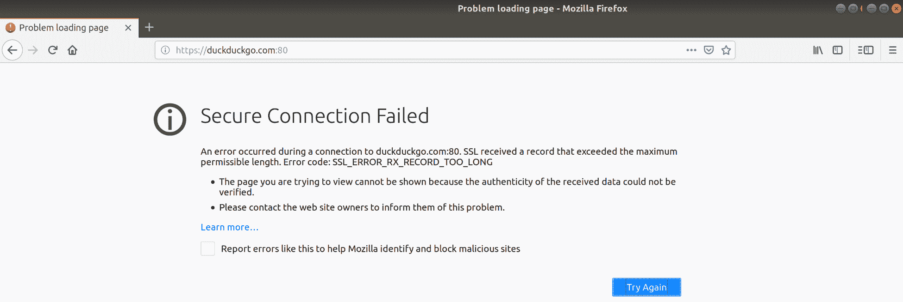

这是因为你试图使用安全协议（HTTPS）访问不安全的端口（`80`）。

Web 服务器实际上是为网络提供服务的，但它们通常只是其他技术的前端。例如，Wordpress 安装中的博客文章可能在幕后存储在数据库中，而它们通过 Web 服务器前端呈现给最终用户。

Web 服务器的工作是确定如何向请求的客户端显示页面的内容。

不同的客户端发送不同的“用户代理”，告诉 Web 服务器它将能够向你显示什么类型的页面。以桌面和手机互联网浏览器为例：如果网站编码以理解你的设备的不同用户代理，那么完全相同的网站在不同设备上可能看起来完全不同。

# 准备就绪

我们将使用我们的两个虚拟机，并在每台上设置一个 Web 服务器：

```
$ vagrant ssh centos1 -- -L 127.0.0.1:8080:127.0.0.1:80
$ vagrant ssh debian1 -- -L 127.0.0.1:8181:127.0.0.1:80
```

# 如何做...

从我们的 CentOS 系统开始，我们将安装官方存储库中提供的默认 Web 服务器。

# 在 CentOS 上安装 httpd（Apache）

正如标题所示，CentOS 将 Apache HTTP 服务器重新标记为`httpd`，我怀疑是为了便于理解而将产品通用化（尽管我遇到了不少不喜欢这种重新标记的系统管理员，包括我自己）。

像这样安装`httpd`：

```
$ sudo yum install httpd -y
```

现在让我们开始吧，因为这是 CentOS：

```
$ sudo systemctl enable --now httpd
```

由于我们在登录 Vagrant 虚拟机时转发了端口，我们现在应该能够在本地浏览器中导航到我们转发的地址和端口（`http://127.0.0.1:8080`）：

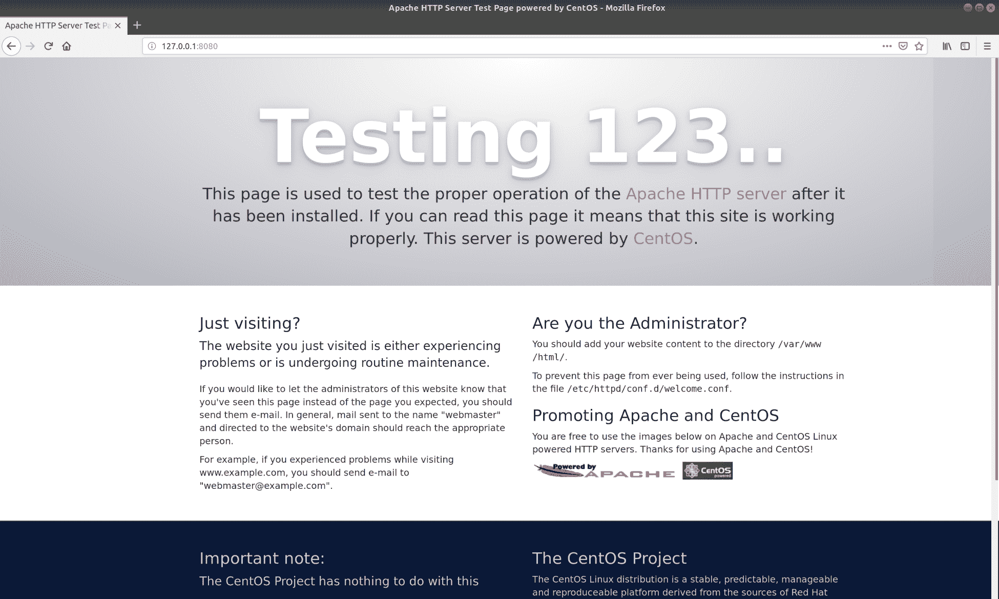

这是 CentOS 上 Apache 的默认`splash`页面，开箱即用配置。

# 在 Debian 上安装 Nginx

现在，在我们的 Debian 系统上，让我们安装 Nginx：

```
$ sudo apt install nginx -y
```

一旦安装完成，由于是 Debian，服务可能会自动启动：

```
$ systemctl status nginx --no-pager
● nginx.service - A high performance web server and a reverse proxy server
 Loaded: loaded (/lib/systemd/system/nginx.service; enabled; vendor preset: enabled)
 Active: active (running) since Sun 2018-12-02 11:54:11 GMT; 21s ago
 Docs: man:nginx(8)
 Process: 1936 ExecStart=/usr/sbin/nginx -g daemon on; master_process on; (code=exited, status=0/SUCCESS)
 Process: 1933 ExecStartPre=/usr/sbin/nginx -t -q -g daemon on; master_process on; (code=exited, status=0/SUCCESS)
 Main PID: 1938 (nginx)
 Tasks: 2 (limit: 4915)
 CGroup: /system.slice/nginx.service
 ├─1938 nginx: master process /usr/sbin/nginx -g daemon on; master_process on;
 └─1939 nginx: worker process
```

由于我们在登录 Vagrant 虚拟机时转发了不同的端口（`http://127.0.0.1:8181`）到我们的 Debian 机器，我们也应该能够在浏览器中访问这个地址：

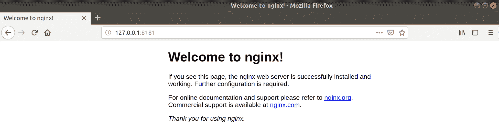

嗯，开箱即用的功能少了很多...

# 工作原理...

我们在这里做的是安装两个不同的 Web 服务器，尽管它们完成的是同样的工作。

可以说，没有比网络更适合和同时更糟糕的标准合规性的地方了，这意味着无论你选择使用哪个 Web 服务器（Apache，Nginx），你仍然应该能够以一致的方式提供内容。

标准合规性是我们用来指代计算机系统约定的标准的术语。**请求评论**（**RFC**）可能规定任何内容，从哪些 IP 范围用于私人使用，到两个系统如何在 HTTPS 上进行安全通信。**互联网工程任务组**（**IETF**）是管理 RFC 的机构之一。

我们安装的第一个服务器是 Apache，多年来一直是“首选”Web 服务器，仍然被许多传统管理员认为是“经过严格考验”的。显然，它是 CentOS 安装的默认选项，这意味着安装基数仍然非常庞大。

在撰写本文时，Apache 仍然被视为更大的主导者，但 Nginx 近年来逐渐崭露头角，并且有望在未来取代 Apache（稍后详细介绍）。

然后我们在 Debian 框上安装了 Nginx（尽管 Apache 也可用）。Debian 之所以声名显赫，是因为它还有一大堆不同的 Web 服务器可供尝试（我只选择了 Apache 和 Nginx 作为最大的两个）。

无论您安装哪一个，这两个系统现在都能够为互联网提供静态 HTTP 内容（或者至少是您网络的一小部分，因为它不是公开可访问的）。

如果我们查看 Debian 框上的`ss`输出，我们会看到以下内容：

```
$ ss -tuna
Netid State Recv-Q Send-Q Local Address:Port Peer Address:Port 
udp UNCONN 0 0 *:68 *:* 
tcp LISTEN 0 128 *:80 *:* 
tcp LISTEN 0 128 *:22 *:* 
tcp ESTAB 0 0 10.0.2.15:22 10.0.2.2:40136 
tcp ESTAB 0 0 127.0.0.1:56490 127.0.0.1:80 
tcp ESTAB 0 0 127.0.0.1:80 127.0.0.1:56490 
tcp LISTEN 0 128 :::80 :::* 
tcp LISTEN 0 128 :::22 :::* 
```

我们可以看到端口`80`，监听所有可用的 IP，并且我们可以看到已建立的通信，实际上来自我们转发的 Web 连接和 Firefox。在 CentOS 框上也是一样的情况。

所有这些都很棒，这意味着当我们的客户端（例如 Firefox）从 Web 服务器（Apache）请求内容时，该服务器能够以客户端能够理解的方式和样式提供所请求的内容。

Firefox 随后可以以用户能够理解的方式向最终用户显示内容，例如猫的图片，或者他们在互联网上搜索的其他信息（尽管应该始终是猫）。

# 还有更多...

我提到了其他 Web 服务器，事实上有相当多。

在 OpenBSD 领域，您可能会发现自己安装了`httpd`，这不是在 CentOS 上的重新命名的 Apache（如在 CentOS 上的情况），而是完全不同的软件，只是碰巧有相同的名称，并且执行类似的功能...

或者，您可能会喜欢 Tomcat 的想法，它不太像传统的 Web 服务器，而是作为 Java servlets（通常是某种 Web 应用程序）的前端。

还有`lighttpd`，它（顾名思义）应该是一个轻量级的 Web 服务器，没有 Nginx 或 Apache 提供的许多功能。

在 Windows 世界中（一个我不喜欢访问的可怕地方），您会得到 IIS，这更像是在 Windows 服务器上提供的一套互联网服务。

# 基本的 Apache 配置

我们在 CentOS 机器上安装了`httpd`，这意味着我们在端口`80`上运行了一个 Web 服务器，并且我们能够从我们主机上的 Firefox 安装中访问它。

在本节中，我们将看看我们的服务器如何知道要显示什么，以及我们可以做些什么来设置自己的站点，以便当人们访问我们的 IP 时不会被默认的 Apache 页面所欢迎。

# 准备工作

对于本节，我们将使用上一节的`Vagrantfile`。如果您尚未在 CentOS VM 上安装 Apache，请在此时进行安装。

连接到您的 CentOS 框：

```
$ vagrant ssh centos1 -- -L 127.0.0.1:8080:127.0.0.1:80
```

# 如何做...

首先，我们应该快速查看默认配置加载自何处。在默认页面上，我们可以看到以下部分：

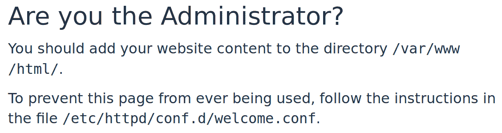

事实证明，我们实际上是管理员。考虑到这一点，让我们看看我们能做些什么。

首先，我们可以`ls`列出此消息中列出的目录，看看那里已经有什么：

```
$ ls /var/www/html/
$ 
```

没有什么...奇怪的。

让我们在这个目录中放一个基本的`index.html`页面，看看会发生什么：

```
$ cat <<HERE | sudo tee -a /var/www/html/index.html
WE APOLOGISE FOR THE INCONVENIENCE.
HERE
```

现在让我们再次访问我们的网站：

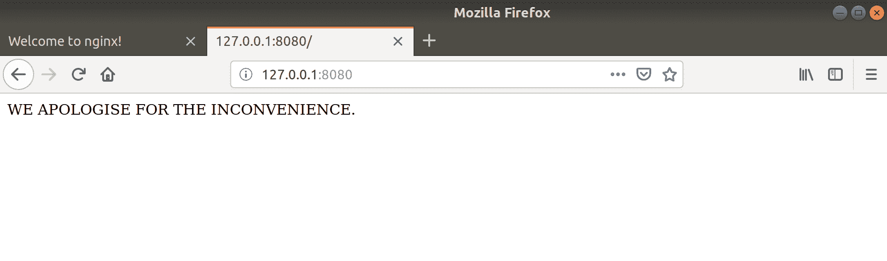

它改变了！

好的，显然这个目录正在被用于某些事情，但它没有解释显示配置位于何处。

让我们查看建议的`welcome`文件：

```
$ cat /etc/httpd/conf.d/welcome.conf 
# 
# This configuration file enables the default "Welcome" page if there
# is no default index page present for the root URL. To disable the
# Welcome page, comment out all the lines below. 
#
# NOTE: if this file is removed, it will be restored on upgrades.
#
<LocationMatch "^/+$">
 Options -Indexes
 ErrorDocument 403 /.noindex.html
</LocationMatch>

<Directory /usr/share/httpd/noindex>
 AllowOverride None
 Require all granted
</Directory>

Alias /.noindex.html /usr/share/httpd/noindex/index.html
Alias /noindex/css/bootstrap.min.css /usr/share/httpd/noindex/css/bootstrap.min.css
Alias /noindex/css/open-sans.css /usr/share/httpd/noindex/css/open-sans.css
Alias /images/apache_pb.gif /usr/share/httpd/noindex/images/apache_pb.gif
Alias /images/poweredby.png /usr/share/httpd/noindex/images/poweredby.png
```

重要的要点如下：

“此配置文件在根 URL 没有默认索引页面的情况下启用默认的“欢迎”页面。”

好的，现在让我们不要担心这个，而是专注于我们自己的文件。

首先，因为您可以在一个 Web 服务器上拥有大量不同的网站（虚拟主机），让我们在我们的文件夹结构中创建一些分隔，以便将不同的网站文件分开：

```
$ sudo mkdir /var/www/god-to-marvin
$ sudo mv /var/www/html/index.html /var/www/god-to-marvin/
```

此时，我们的 Web 服务器将重新显示默认的 Apache 页面，因为我们已经移动了唯一的`index.html`文件。

接下来，添加所需的配置，使该目录可以被读取：

```
$ cat <<HERE | sudo tee -a /etc/httpd/conf.d/god-to-marvin.conf
<VirtualHost 127.0.0.1:80>
 ServerAdmin thebestsysadmin@example.com
 DocumentRoot "/var/www/god-to-marvin/"
 ServerName 127.0.0.1
 ServerAlias 127.0.0.1
</VirtualHost>
HERE
```

然后，我们需要重新加载配置：

```
$ sudo systemctl reload httpd
```

接下来，回到我们的 Firefox 窗口，尝试访问`http://127.0.0.1:8080/`。你应该再次看到你的消息：

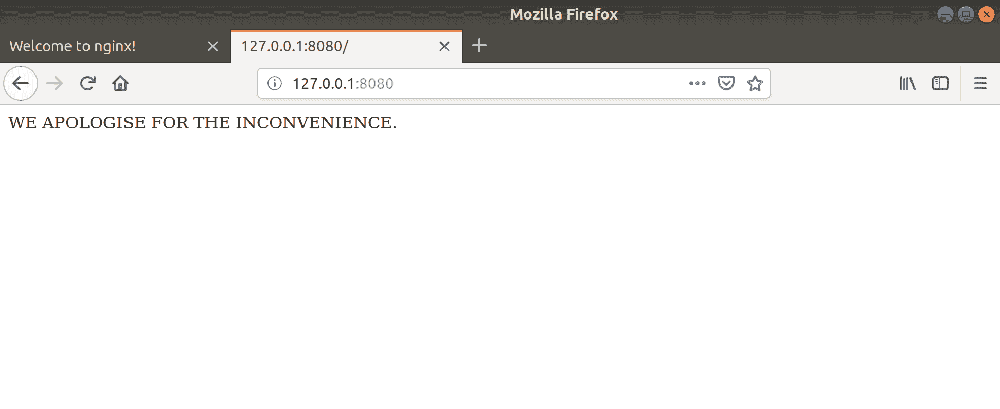

有了这个配置，虽然表面上没有改变，但这意味着你可以在将来添加更多的网站和来自受欢迎的科幻系列的更多引用。

# 工作原理...

我们能够将文件放入`/var/www/html/`并在浏览器中查看它，是因为在主 Apache 配置文件中有`DocumentRoot`设置，可以在这里看到：

```
$ cat /etc/httpd/conf/httpd.conf | grep ^DocumentRoot
DocumentRoot "/var/www/html"
```

我们之所以将`index.html`作为文件名，除了因为它是惯例，还因为以下行：

```
$ cat /etc/httpd/conf/httpd.conf | grep "^ DirectoryIndex"
 DirectoryIndex index.html
```

这决定了在请求目录时加载哪个文件。

虽然`/etc/httpd/conf/httpd.conf`文件是默认的配置文件，但我们也可以在`/etc/httpd/conf.d/`目录下为网站添加额外的配置，就像我们在这个案例中所做的那样。

我们为自己的配置使用了一个非常特定的段落，如下所示：

```
<VirtualHost 127.0.0.1:80>
 ServerAdmin thebestsysadmin@example.com
 DocumentRoot "/var/www/god-to-marvin/"
 ServerName 127.0.0.1
 ServerAlias 127.0.0.1
</VirtualHost>
```

这个段落意味着，虽然我们可以继续托管与以前一样的内容，但我们也能够托管其他内容，使用不同的`DocumentRoots`。

当我们第二次访问我们的站点时，我们不再被指向`/var/www/html`作为`DocumentRoot`，而是被指向`/var/www/god-to-marvin`，因为前面的配置规定了这样做。

我们还有一个`ServerName`和一个`ServerAlias`指令，尽管在这种情况下 Alias 没有任何作用。

`ServerName`是最终用户在浏览器中输入的域名或 IP 地址。别名可以是与该名称相关的其他名称。

例如，你可以有以下内容：

```
 ServerName example.com
 ServerAlias www.example.com fish.example.com europe.example.com
```

所有这些都将命中相同的`DocumentRoot`。

# 还有更多...

虚拟主机只有在多个域名指向一个服务器时才能真正发挥作用。实际上，你可以有数百个不同的域名指向一个服务器，但因为 Apache 知道你用来连接的域名，它只会提供你请求的确切站点。

在多租户情况下，多个客户端共存于一台服务器上并不罕见，只操作和更新他们自己的文件，对与他们与其他公司和用户共享一台服务器毫不知情。

如果一个托管公司每月花费几英镑来设置一个 Web 服务器，并且他们可以向他们的客户收费来托管网站，那么公司可以在很短的时间内收回成本。

# 另请参阅

在测试环境中，你往往会看到一台服务器上同时运行多个网站，因为它们通常是轻量级的，可以并行运行多个。然而，这给域名解析测试带来了问题，因为使用公共域名服务来测试和临时网站可能会变得昂贵和耗时。

解决这个问题的一个方法是使用`/etc/hosts`文件（在 Linux 和 Unix 系统上）。

默认的`/etc/hosts`文件可能如下所示：

```
$ cat /etc/hosts
127.0.0.1 centos1 centos1
127.0.0.1 localhost localhost.localdomain localhost4 localhost4.localdomain4
::1 localhost localhost.localdomain localhost6 localhost6.localdomain6
```

你可以按照以下方式向该文件添加一行：

```
192.168.33.11 mysupersite.com
```

现在当你在浏览器中输入`mysupersite.com`时，名称将被解析为你指定的 IP 地址，而不是向外部 DNS 服务器进行名称解析。

通过这种方式，你可以在 Apache Web 服务器上拥有多个“虚拟主机”，因为你的浏览器请求的是具名站点（即使它们都在同一个 IP 地址上），你将根据你连接的名称获得不同的内容。

人们在他们的`/etc/hosts`文件中胡乱更改的唯一问题是，当他们忘记改回去并且困惑为什么无法连接到“真正的”站点时。

# 基本的 Nginx 配置

现在前往我们的 Debian 服务器，我们将查看默认的 Nginx 页面，当我们访问`http://127.0.0.1:8181/`时可以看到，并且我们将用我们自己的消息替换这个文本。

正如我们之前所述，Nginx 越来越受欢迎。它已经成为首选的 Web 服务器，因为它在需要时易于使用和灵活性——并不是市场营销的宣传；它们都是开源和免费的。

# 准备工作

对于这一部分，我们将使用第一部分的`Vagrantfile`。如果您还没有在 Debian VM 上安装 Nginx，请在此时进行安装。

连接到您的 Debian 盒子：

```
$ vagrant ssh debian1 -- -L 127.0.0.1:8181:127.0.0.1:80
```

# 如何做...

我们的默认 Nginx 页面没有任何指针指向配置更改的位置，只是指向官方文档（这是值得一读的）和商业支持提供。

这个默认页面实际上与我们刚刚在 CentOS 上检查的位置非常相似：

```
$ cat /var/www/html/index.nginx-debian.html 
<!DOCTYPE html>
<html>
<head>
<title>Welcome to nginx!</title>
<style>
 body {
 width: 35em;
 margin: 0 auto;
 font-family: Tahoma, Verdana, Arial, sans-serif;
 }
</style>
</head>
<body>
<h1>Welcome to nginx!</h1>
<p>If you see this page, the nginx web server is successfully installed and
working. Further configuration is required.</p>

<p>For online documentation and support please refer to
<a href="http://nginx.org/">nginx.org</a>.<br/>
Commercial support is available at
<a href="http://nginx.com/">nginx.com</a>.</p>

<p><em>Thank you for using nginx.</em></p>
</body>
</html>
```

请注意，此文件称为`index.nginx-debian.html`，并且它是`/var/www/html`中的唯一文件。

与 Apache 一样，Nginx 有虚拟主机的概念，我们将在`/etc/nginx/conf.d/`中进行配置。

让我们首先创建一些内容：

```
$ sudo mkdir /var/www/fenchurch
$ cat <<HERE | sudo tee -a /var/www/fenchurch/index.html
How come I'm in one book, then I just disappear?
HERE
```

现在我们可以添加到我们选择的虚拟主机目录：

```
$ cat <<HERE | sudo tee /etc/nginx/conf.d/fenchurch.conf
server {
listen 80;
listen [::]:80;

root /var/www/fenchurch;
index index.html;

server_name 127.0.0.1;

location / {
try_files \$uri \$uri/ =404;
}
}
HERE
```

然后，我们需要加载 Nginx：

```
$ sudo systemctl reload nginx
```

现在，当指向我们设置的转发端口时，我们应该能在浏览器中看到我们的问题：

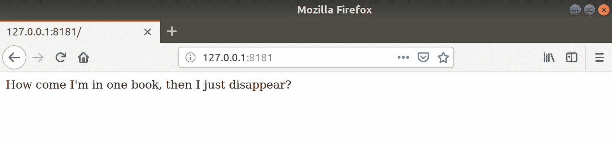

酷！

# 它是如何工作的...

我们的默认 Nginx 配置文件位于`/etc/nginx/nginx.conf`，它设置了诸如进程 ID 位置以及 Nginx 将作为哪个用户运行（这里是`www-data`）等内容，在这个 Debian 安装中：

```
$ head /etc/nginx/nginx.conf
user www-data;
worker_processes auto;
pid /run/nginx.pid;
include /etc/nginx/modules-enabled/*.conf;

events {
 worker_connections 768;
 # multi_accept on;
}
```

在这个文件中，还存在以下配置块：

```
 ##
 # Virtual Host Configs
 ##

 include /etc/nginx/conf.d/*.conf;
 include /etc/nginx/sites-enabled/*;
```

请注意，顶级目录是我们选择用于我们的配置的目录。

当我们将`fenchurch.conf`配置放在`/etc/nginx/conf.d/`目录中时，我们指示 Nginx 加载此配置，以及它在启动时加载的所有其他内容。

让我们看看我们的配置：

```
server {
listen 80;
listen [::]:80;

root /var/www/fenchurch;
index index.html;

server_name 127.0.0.1;

location / {
try_files $uri $uri/ =404;
}
}
```

`listen`指令非常简单，但如果您在一个盒子上有多个 IP 地址，它们可能会扩展到包括特定条目。

接下来，我们的`root`条目是网站文件的根位置。在这里，它设置为我们选择为我们的问题创建的位置。

`index`是 Nginx 进入目录时要加载的文件的名称。这里使用了标准的`index.html`。

而且，就像 Apache 一样，`server_name`是最终用户希望接收内容的域名或 IP 地址。它可以是一系列名称，就像其他地方看到的那样：

```
server_name example.com herring.example.com dwarf.example.com;
```

最后，在`location`块中的`try_files`行意味着将搜索给定链接的文件，如果找不到，将返回`404`。

您可以通过尝试在浏览器中访问不存在的文件来测试这一点，例如，`http://127.0.0.1:8181/prefect`：

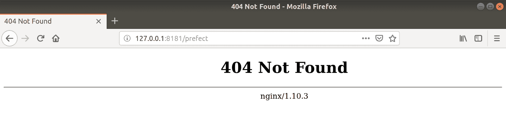

但是，我们可以将`404`更改为`403`并重新加载 Nginx 配置：

```
$ sudo sed -i 's/404/403/g' /etc/nginx/conf.d/fenchurch.conf 
$ sudo systemctl reload nginx
```

如果我们这样做，我们会得到`403 Forbidden`：

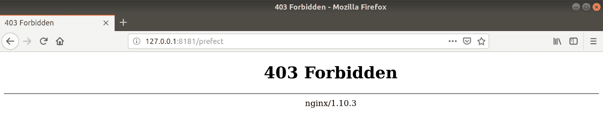

`404`可能是 Web 服务器返回的最常见代码，但您应该知道还有更多，并且它们实际上意味着不同的事情（前提是它们已经配置正确返回）。`200`是 OK，`401`表示未经授权，等等。

# 还有更多...

您可能想知道使用`systemctl reload`的原因，以及为什么我选择使用它而不是`restart`。

当我们`cat` Nginx 的 systemd 单元文件时，答案应该变得更清晰：

```
$ systemctl cat nginx | grep Reload
ExecReload=/usr/sbin/nginx -g 'daemon on; master_process on;' -s reload
```

有一行特定的`ExecReload`命令，带有`-s reload`标志。

这会向 Nginx 发送`reload`信号（SIGHUP）；也就是说，它对正在运行的进程的干扰较小。

# 另请参阅

在 Debian 和类似 Debian 的发行版中，`sites-enabled`和`sites-available`目录的概念已经变得司空见惯。

从理论上讲，您在服务器上拥有的任何网站都可以放在`sites-available`目录中，一旦您对它们满意，就可以创建到`sites-enabled`目录的符号链接。

就个人而言，我发现这种设置有点令人困惑，而且在自动化的世界中有些过时，但如果这是您的菜，那么也许 Debian 的做法适合您。我不会评判。

# SSL、TLS 和 LetsEncrypt

我们还没有讨论 HTTP 方程式中的“S”部分。具体来说，S 代表安全，与超人的 S 不同，后者显然不是 S，实际上是埃尔家族的纹章。

与超人不同，Web 服务器可能会对您撒谎。

当您访问一个网站时，您希望知道您正在访问的网站是否真正由您认为的公司拥有和运营。如果您去亚马逊、苹果或 PayPal，您希望在交出您的数字现金之前知道它们是真实的。

但是，您还希望网站能够以安全的方式接收您的信用卡信息，以便这些数字和秘密不以纯文本格式在互联网上传播供任何人阅读。

留意挂锁：


大多数浏览器（如果不是全部）在您访问安全网站时应该显示一个小挂锁，只要网站不是欺诈性的，您就不应该收到有关潜在问题的警告。

HTTPS 绝对不是完美的，正如安全研究人员之前展示的那样。有可能为您设置的公司获得合法证书，这些公司恰好与现有品牌具有相同或相似的名称。务必确保您发送信用卡信息的对象是真正的。

您可以点击这个挂锁并获取有关网站用于与您通信的`证书`的信息，详细说明证书的所有者、相关网站以及验证它的互联网机构：

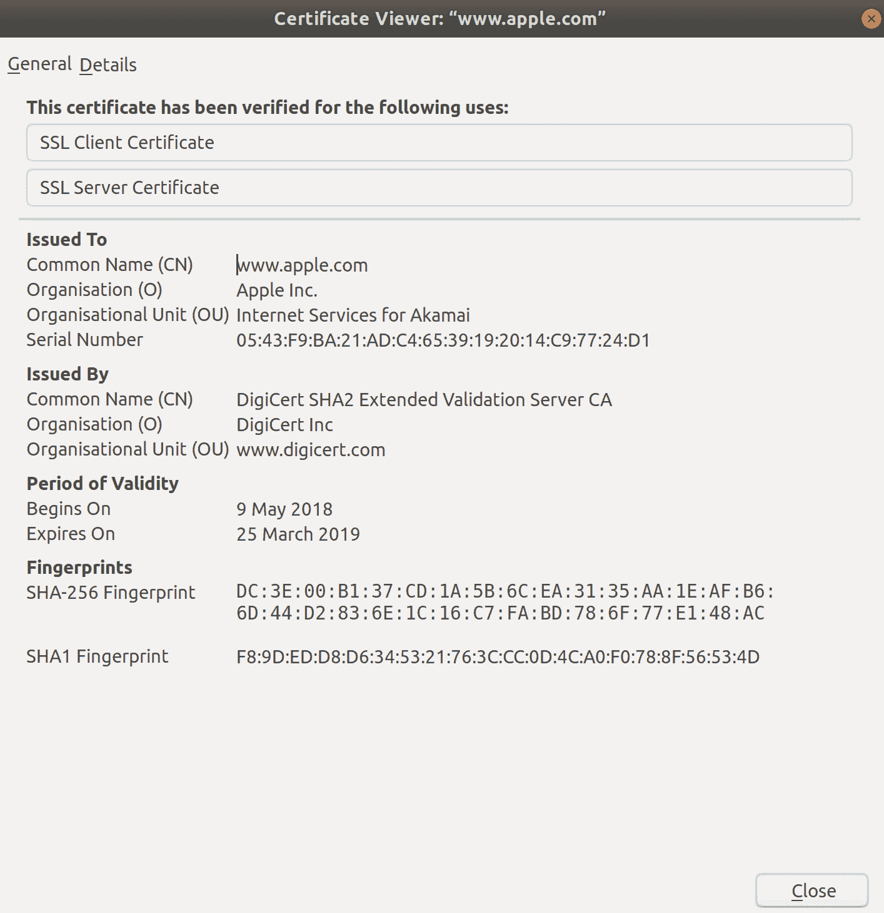

在本节中，我们将设置我们的网站以监听 HTTPS 连接，而不是 HTTP，并讨论一个名为`Let's Encrypt`的机构。

# 准备就绪

在本节中，我们将使用我们的 Debian 虚拟机。

如果您还没有，最好按照前面的部分设置 Nginx，包括您的虚拟主机条目。

如果您还没有在 Debian 虚拟机上使用 Nginx 设置虚拟主机，请立即设置。

我们在本节中所做的一切在 Apache 中也是可能的，尽管配置不同。

确保您将连接转发到您的虚拟机，这次使用一个新端口：

```
$ vagrant ssh debian1 -- -L 127.0.0.1:8484:127.0.0.1:443
```

# 如何做...

假设您的网站当前正在虚拟机上的端口`80`上运行，您应该能够对文件进行以下更改以启用 HTTPS 通信：

```
$ sudo sed -i 's/listen 80/listen 443 ssl/g' /etc/nginx/conf.d/fenchurch.conf
$ sudo sed -i '4iinclude snippets/snakeoil.conf;' /etc/nginx/conf.d/fenchurch.conf
```

通过使用`cat`确保您的文件看起来类似于以下内容：

```
$ cat /etc/nginx/conf.d/fenchurch.conf 
server {
listen 443 ssl;
listen [::]:80;
include snippets/snakeoil.conf;

root /var/www/fenchurch;
index index.html;

server_name 127.0.0.1;

location / {
try_files $uri $uri/ =404;
}
}
```

现在确保通过安装`ssl-cert`软件包可用`蛇油`证书：

```
$ sudo apt install ssl-cert -y
```

然后，重新加载我们的配置：

```
$ sudo systemctl reload nginx
```

您现在应该能够在浏览器中访问`https://127.0.0.1:8484`地址，并希望看到以下警告：

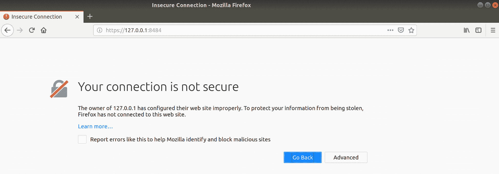

这意味着虽然服务器配置为监听 HTTPS 并且您可以连接到它，但浏览器认为证书不合法（因为它确实不合法），因此在您尝试进一步操作之前会警告您：

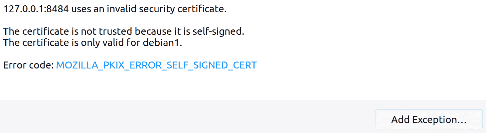

在这一点上，您可以按“添加异常...”并信任自签名证书，从而使您能够访问该网站。但是，除非您绝对确定应该看到警告，并且您对此没有问题（因为您正在测试），否则这不是一个好习惯。

# 它是如何工作的...

以下是一个非常重要的警告：

这里使用的证书仅供示例，因此被称为“蛇油”。它们**绝对不应该**在生产中使用，甚至开玩笑也不行。您应该只为您设置的任何服务器使用合法的证书（除了测试和开发，这些本来就不应该面向公众）。

既然这些都说清楚了，让我们看看我们在这里有什么：

```
server {
listen 443 ssl;
listen [::]:80;
include snippets/snakeoil.conf;

root /var/www/fenchurch;
index index.html;

server_name 127.0.0.1;

location / {
try_files $uri $uri/ =404;
}
}
```

我们使用了几个`sed`命令来更改这个文件，但如果愿意，我们也可以将内容复制到文件中。

我们将`listen`端口从`80`更改为`443`，并添加了一个`ssl`指令。我们还包括了一个片段示例文件，这里是`snakeoil.conf`：

```
$ cat /etc/nginx/snippets/snakeoil.conf 
# Self signed certificates generated by the ssl-cert package
# Don't use them in a production server!

ssl_certificate /etc/ssl/certs/ssl-cert-snakeoil.pem;
ssl_certificate_key /etc/ssl/private/ssl-cert-snakeoil.key;
```

因此，我们的小虚拟主机可以访问 SSL 证书和证书密钥。

重新加载我们的配置意味着这些设置已经生效，然后我们可以在 Firefox 中访问我们的网站`443`端口。

然后我们收到了关于证书伪造的可怕消息，但我们预料到会发生这种情况。

在这个行业中，我们经常交替使用 SSL 和 TLS 这两个术语（包括我自己），这在技术上是不正确的（最糟糕的错误）。

**安全套接字层**（**SSL**）是一个长期废弃的协议，已被**传输层安全性**（**TLS**）取代，这现在是提供数据传输安全性的标准和通常默认的协议。

这两个协议都有几个版本：

+   SSL 1.0：从未发布

+   SSL 2.0：1995

+   SSL 3.0：1996

+   TLS 1.0：1999

+   TLS 1.1：2006

+   TLS 1.2：2008

+   TLS 1.3：2018

实际上，您现在应该只使用 TLS 1.2，当 1.3 变得普遍时，我建议您也转换到那个版本。

有关一些协议可能遭受的各种攻击的整篇文章，我建议您在设置 Web 服务器时，始终阅读当天的建议。

Heartbleed 通常是了解 SSL/TLS 漏洞的好地方。

一些较旧的操作系统不支持较新的协议，这意味着有时您会看到一些网站使用已经过时且不安全的协议，只是为了迎合世界上的 XP 用户。如果您的老板要求您使用 SSL（任何版本）或 TLS 早于 1.2，我建议您坐下来喝杯茶，解释为什么这是一个坏主意。

# 还有更多...

还有一些其他事情，确保您有一个良好的起点。

# Let's Encrypt

如果您不想使用自己的 CA，您可以考虑使用 Let's Encrypt，这是一个提供免费证书的证书颁发机构。

通常，证书是要花钱的——在某些情况下是很多钱（比如扩展验证证书），所以能够使用免费的服务来保护您的网站是件好事。

证书只有效期 90 天，这有点不方便，但可以实现自动更新来解决这个问题。

部署和更新可以通过各种工具来完成，在许多发行版中都有。在 Debian 系统上，您可以考虑安装`certbot`软件包，并尝试配置自己的 Web 服务器。

# 工作环境证书

值得注意的是，使证书在传统意义上“受信任”的唯一因素是您知道是谁签发了它。一些浏览器和大多数操作系统都附带了一个“受信任”的**证书颁发机构**（**CA**）列表，用于验证证书的合法性。

对于工作场所也是如此：您通常会看到（尤其是在大公司中）内部证书颁发机构，其完整性检查证书已安装在公司拥有的每台笔记本电脑和台式电脑上。这样做的结果是公司更容易为内部使用签发证书，但如果从外部访问这些系统，仍会显示警告（因为外部设备没有安装公司 CA）。

您可能会发现您自己的雇主在您的公司笔记本电脑上安装了 CA，与美国、中国和一些政府的大人物一起安装在一起。

# 另请参阅

谈论安全性是件好事，但事实上，这是一个相当令人困惑的话题，一般公众对此并不是很熟悉。

您可能认为，当终端用户看到一个大而可怕的横幅，告诉他们他们试图访问的网站不是合法的，并且他们会尽快点击离开...但在很多情况下并不是这样。

实际上，有很多终端用户只是因为不得不点击几次警告而感到恼火，然后才能到达他们想要的网站（或者假装是他们想要的网站）。

近年来，针对用户盲目接受假证书的各种尝试都在进行损害限制，例如浏览器使为网站添加例外变得更加烦人，但仍然会发生这种情况。

这突显了您作为系统管理员会一次又一次遇到的问题，即用户教育的问题，以及确保您的用户对网站安全有基本的了解。

# 基本的 MySQL 或 MariaDB 安装

数据库非常棒——它们让**数据库管理员**（**DBA**）有了工作，并且提供了一种在不是一个随机大小的平面文件系列的系统上存储数据的便捷方式。

传统上，数据库一直是存储特定类型和大小的有序数据的好地方，这意味着您可以在各种事物中找到支持数据库，从银行交易记录到网站库存数量。

SQL 数据库是人们最熟悉的数据库（稍后会介绍更多关于 NoSQL 数据库），其中最常见的之一是 MariaDB，它是 MySQL 的一个分支。

MariaDB 是在 Oracle 收购 MySQL 后从 MySQL 分叉出来的。这可能是一个可以理解的担忧，因为开源领域的很多人认为 Oracle 是邪恶的，尽管我对此并没有强烈的感觉。

如果您运行一个 Wordpress 网站，您可能已经遇到了 MariaDB 或 MySQL，因为它们是大多数人在设置特定博客平台时的首选数据库。

# 准备就绪

在本节中，我们将使用我们的 CentOS 虚拟机。

我们现在暂时离开 Web 服务器，这意味着您无需担心必须完成前面的部分才能继续。

让我们跳到我们的 CentOS 虚拟机：

```
$ vagrant ssh centos1
```

# 如何做...

在尝试与其交互之前，安装软件被认为是一个好习惯。记住这一点，`install mariadb-server`：

```
$ sudo yum install mariadb-server -y
```

接下来，确保它已启动并配置为在启动时启动（这可能需要几秒钟）：

```
$ sudo systemctl enable --now mariadb
Created symlink from /etc/systemd/system/multi-user.target.wants/mariadb.service to /usr/lib/systemd/system/mariadb.service.
```

在继续之前，运行`mysql_secure_installation`脚本：

```
$ mysql_secure_installation
```

这将为您提供一系列提示。回答如下：

+   输入 root 的当前密码（如果没有，请按回车）：`<BLANK, HIT ENTER>`

+   设置 root 密码？ `Y`

+   新密码：`examplerootpassword`

+   删除匿名用户？ `Y`

+   禁止远程登录 root？ `Y`

+   删除测试数据库及其访问权限？ `Y`

+   现在重新加载权限表？ `Y`

记住：这些只是本书的示例。您可能有一些需要这些设置的原因，在现实世界中，您应该始终设置一个安全的 root 密码。

接下来，登录到您的数据库：

```
$ mysql -uroot -pexamplerootpassword
Welcome to the MariaDB monitor. Commands end with ; or \g.
Your MariaDB connection id is 10
Server version: 5.5.60-MariaDB MariaDB Server
Copyright (c) 2000, 2018, Oracle, MariaDB Corporation Ab and others.
Type 'help;' or '\h' for help. Type '\c' to clear the current input statement.
MariaDB [(none)]> 
```

我们在这里直接在命令行上给出了密码，仅供显示目的，但是您可以完全省略实际密码，并让 MariaDB 提示您输入密码（这样它就不会出现在您的 Bash 历史记录中）。

# 列出、创建和选择数据库和表

从您的新提示符内部，您现在可以列出`MariaDB`中的数据库（我知道这有点混乱，但是数据库服务器（`MariaDB`）可以有多个它管理的数据库）：

```
MariaDB [(none)]> show databases;
+--------------------+
| Database |
+--------------------+
| information_schema |
| mysql |
| performance_schema |
+--------------------+
3 rows in set (0.00 sec)
```

我们想要查看内置的`mysql`数据库，所以让我们切换到那里：

```
MariaDB [(none)]> use mysql;
Reading table information for completion of table and column names
You can turn off this feature to get a quicker startup with -A

Database changed
```

一旦我们使用了这个数据库，我们就可以列出其中的表：

```
MariaDB [mysql]> show tables;
+---------------------------+
| Tables_in_mysql |
+---------------------------+
| columns_priv |
| db |
| event |
| func |
| general_log |
| help_category |
| help_keyword |
| help_relation |
| help_topic |
| host |
| ndb_binlog_index |
| plugin |
| proc |
| procs_priv |
| proxies_priv |
| servers |
| slow_log |
| tables_priv |
| time_zone |
| time_zone_leap_second |
| time_zone_name |
| time_zone_transition |
| time_zone_transition_type |
| user |
+---------------------------+
24 rows in set (0.00 sec)
```

现在我们可以获取特定表的信息。在这里，我们从`user`表中获取`Host`、`User`和`Password`：

```
MariaDB [mysql]> select Host,User,Password from user;
+-----------+------+-------------------------------------------+
| Host | User | Password |
+-----------+------+-------------------------------------------+
| localhost | root | *F61E89B5042AB6D880D5BA79586B46BA93FABF09 |
| 127.0.0.1 | root | *F61E89B5042AB6D880D5BA79586B46BA93FABF09 |
| ::1 | root | *F61E89B5042AB6D880D5BA79586B46BA93FABF09 |
+-----------+------+-------------------------------------------+
3 rows in set (0.00 sec)
```

除此之外，我们也可以创建自己的数据库和表。

让我们创建`exampledb`作为一个数据库：

```
MariaDB [mysql]> create database exampledb;
Query OK, 1 row affected (0.00 sec)
```

然后我们可以`use`这个数据库并添加一个表：

```
MariaDB [mysql]> use exampledb;
Database changed
MariaDB [exampledb]> create table exampletable (food varchar(10), goodbad char(1));
Query OK, 0 rows affected (0.00 sec)
```

让我们`describe`一下我们刚刚创建的表，看看我们的字段：

```
MariaDB [exampledb]> describe exampletable;
+---------+-------------+------+-----+---------+-------+
| Field | Type | Null | Key | Default | Extra |
+---------+-------------+------+-----+---------+-------+
| food | varchar(10) | YES | | NULL | |
| goodbad | char(1) | YES | | NULL | |
+---------+-------------+------+-----+---------+-------+
2 rows in set (0.00 sec)
```

接下来，用一些数据填充它：

```
MariaDB [exampledb]> insert into exampletable values ('strawberries','b');
Query OK, 1 row affected, 1 warning (0.00 sec)
```

现在我们可以通过`select`来查看我们刚刚放入表中的内容：

```
MariaDB [exampledb]> select * from exampletable;
+------------+---------+
| food | goodbad |
+------------+---------+
| strawberri | b |
+------------+---------+
1 row in set (0.00 sec)
```

要退出你的数据库，输入`exit`（或按下*CTRL* + *D*）：

```
MariaDB [exampledb]> exit
Bye
$
```

# 它是如何工作的...

我们在系统上安装了 MariaDB 并启动了它。作为结果，我们在`/var/lib/mysql`目录中创建了几个数据库和相关数据：

```
$ ls /var/lib/mysql
aria_log.00000001 exampledb ib_logfile0 mysql performance_schema
aria_log_control ibdata1 ib_logfile1 mysql.sock
```

通过运行`secure setup`脚本，然后使用刚刚设置的密码进入我们的数据库：

```
$ mysql -uroot -pexamplerootpassword
```

这让我们进入了一个完全不同的 shell，一个在`MariaDB`程序内部的 shell，它使我们能够操纵`MariaDB`控制的数据库。

我们在四处探索后创建了一个数据库和其中的一个表：

```
MariaDB [mysql]> create database exampledb;
MariaDB [exampledb]> create table exampletable (food varchar(10), goodbad char(1));
```

我们特别创建的表名为`exampletable`。我们给它添加了两个字段：一个`food`字段和一个`goodbad`字段。

然后我们向数据库中插入了一些数据。

```
MariaDB [exampledb]> insert into exampletable values ('strawberries','b');
```

由于我们将`food`字段设置为`10`的 varchar，所以草莓条目太长，导致它被截断：

```
MariaDB [exampledb]> select * from exampletable;
+------------+---------+
| food | goodbad |
+------------+---------+
| strawberri | b |
+------------+---------+
1 row in set (0.00 sec)
```

这突显了传统 SQL 数据库的一个好处，你可以非常精细地控制每个字段中存储的数据类型以及你可以在其中存储多少数据。

这个数据库现在存在于我们的文件系统中，就像我们之前列出`mysql`目录时看到的那样：

```
$ sudo ls /var/lib/mysql/exampledb/
db.opt exampletable.frm
```

当你重新启动系统时，你对数据库所做的更改将继续存在。

# 还有更多...

正如开头所暗示的，MariaDB 是 MySQL 的一个分支，这就是为什么我们在这里安装了`MariaDB`，但我们也使用了与之交互的`mysql`系列命令。这是为了确保向后兼容。

# 另请参阅

还有数据库权限，我们还没有涉及，它们和常规文件系统权限一样重要。你不希望同一主机上的两个 Wordpress 安装能够读取彼此的数据库，所以你会为每个创建一个专用用户，并为他们分配自己的 MariaDB。

# 基本的 PostgreSQL 安装

还有另一个流行的 SQL 数据库，我不是在说 MSSQL（它还可以，在 Linux 上也可以运行！）。

PostgreSQL（无论你想怎么发音；其他人都这么做）自 1996 年以来一直存在，很多人都发誓它是比 MySQL 或 MariaDB 优秀得多的产品。

就我个人而言，我对数据库并不感到兴奋，所以这些对话通常会让我感到困惑，我会想下一杯咖啡从哪里来。

像 MySQL 和 MariaDB 一样，Postgres 在很多默认仓库中都有，很多流行的软件都会给你选择使用 Postgres 作为后端而不是 MariaDB 的选项。

# 准备工作

在本节中，我们将再次使用我们的 CentOS 机器。

进入我们的 CentOS 虚拟机（或者如果你已经在那里就留在那里）：

```
$ vagrant ssh centos1
```

# 如何做...

就像 Maria 一样，我们实际上必须先安装软件：

```
$ sudo yum install postgresql-server -y
```

与 Maria 不同，我们必须在使用 Postgres 之前设置它：

```
$ sudo postgresql-setup initdb
Initializing database ... OK
```

不过，一旦完成，你就可以启动并启用服务器了：

```
$ sudo systemctl enable --now postgresql 
```

现在，以一种略有不同的方式登录到你的数据库：

```
$ sudo -u postgres psql 
psql (9.2.24)
Type "help" for help.

postgres=# 
```

# 列出、创建和选择数据库和表

有些人发现记住 Postgres 的命令和语法比记住 MariaDB 和 MySQL 更容易。就我个人而言，我总是不得不查找它们，这导致我频繁使用`\?`，这会让你进入`help`菜单。

从基础开始，使用`\l`列出 Postgres 管理的所有数据库：

```
postgres-# \l
 List of databases
 Name | Owner | Encoding | Collate | Ctype | Access privileges 
-----------+----------+----------+-------------+-------------+-----------------------
 postgres | postgres | UTF8 | en_GB.UTF-8 | en_GB.UTF-8 | 
 template0 | postgres | UTF8 | en_GB.UTF-8 | en_GB.UTF-8 | =c/postgres +
 | | | | | postgres=CTc/postgres
 template1 | postgres | UTF8 | en_GB.UTF-8 | en_GB.UTF-8 | =c/postgres +
 | | | | | postgres=CTc/postgres
(3 rows)
```

要创建一个数据库，我们将复制我们可以使用的两个模板之一：

```
postgres=# create database exampledb template template1;
CREATE DATABASE
```

要切换到我们的新数据库，使用`\c`：

```
postgres=# \c exampledb
You are now connected to database "exampledb" as user "postgres".
```

你可能会认为要列出表，我们会使用`\t`，或者`\lt`，但你是错误的。

要列出当前数据库中的表，请使用`\dt`：

```
exampledb=# \dt
No relations found.
```

在这个数据库中没有，所以让我们创建一个：

```
exampledb=# create table prime_ministers(firstname varchar(10), lastname varchar(10));
CREATE TABLE
```

我们还需要填充它：

```
exampledb=# insert into prime_ministers (firstname, lastname) values ('Lord', 'Rosebury'), ('George', 'Canning'), ('Tony', 'Blair');
INSERT 0 3
```

然后，我们需要描述它：

```
exampledb=# \d prime_ministers
 Table "public.prime_ministers"
 Column | Type | Modifiers 
-----------+-----------------------+-----------
 firstname | character varying(10) | 
 lastname | character varying(10) |
```

最后，我们需要从中进行选择：

```
exampledb=# select * from prime_ministers;
 firstname | lastname 
-----------+----------
 Lord | Rosebury
 George | Canning
 Tony | Blair
(3 rows)
```

使用`\q`或*CTRL* + *D*退出 Postgres：

```
exampledb=# \q
$ 
```

# 它是如何工作的...

安装 Postgres 后，我们会在`/var/lib/pgsql`中得到数据，如下所示：

```
$ sudo ls /var/lib/pgsql/
backups data initdb.log
```

然后我们使用在安装过程中为我们创建的用户登录到我们的数据库中：

```
$ sudo -u postgres psql 
$ cat /etc/passwd | grep postgres
postgres:x:26:26:PostgreSQL Server:/var/lib/pgsql:/bin/bash
```

一旦进入，我们就开始创建我们自己的数据库，使用`template1`作为模板：

```
postgres=# create database exampledb template template1;
```

`template1`可以进行修改，以便您可以为新系统拥有一个一致的起点，尽管我发现这在当今更容易存储在`基础设施即代码`存储库中。

我们在我们的数据库中创建了一个表（在切换到它之后）：

```
exampledb=# create table prime_ministers(firstname varchar(10), lastname varchar(10));
```

再次注意，我们正在定义特定字段，与相关的类型（`varchar`是一种非常灵活的数据类型，但不建议将其用于所有内容。对于与字段关联的数据类型使用适当的类型对于性能更好）。

我们用内容填充了我们的表，描述了它，并从中进行了选择。

```
exampledb=# insert into prime_ministers (firstname, lastname) values ('Lord', 'Rosebury'), ('George', 'Canning'), ('Tony', 'Blair');
exampledb=# \d prime_ministers
exampledb=# select * from prime_ministers;
```

希望您已经注意到，我们在本节中使用的许多语法与 MariaDB 安装中使用的语法完全相同。这是有原因的，因为这两个数据库都带有`SQL`这个名称。

结构化查询语言是相当一致的，但并不是在一个 SQL 数据库中使用的命令可以直接复制到另一个数据库中。遗憾的是，这在大多数情况下都是一个白日梦。

除了表和数据库操作命令（`\l`，`\dt`等），您可能会因为混淆 Postgres 和 Maria 语法而受到宽恕，但有时它们之间的差异足够让人讨厌。

我们还没有将 MSSQL 加入其中。

如果你听到有人将 SQL 称为 seeqwel，而不是 S.Q.L.，那么他们很可能是从 Windows 数据库管理员那里学来的，或者是足够老以至于记得 SQL 最初是“结构化英语查询语言”。它的名字不再有“e”，但有些人坚持在发音时加上这个短暂的“e”。

圣战...

# 本地 MTA 使用和配置（Postfix）

电子邮件仍然存在，虽然这本身就是一种悲剧，但它也为我们提供了机会，让我们看看为什么您可能会在日常工作中与邮件服务器进行交互。

传统上，服务器有时会在每晚或每周进行一系列检查，然后将结果编制成文档并发送给系统管理员，然后管理员可以查看报告并发现异常或意外行为。大多数情况下，这已经是一种被遗忘的艺术，很少有人会费心去配置系统上的默认邮件位置，使其不再是`root@localhost`。

正是因为这个原因，你偶尔会看到`you have new mail`或类似的通知，当你登录控制台时。那里的邮件通常是你不太在意的东西，来自一个在五天前以不同方式通知你它出了问题的程序。

这并不是说邮件不重要——它仍然被监控系统作为第一种“警报”方法积极使用，而且，尽管听起来令人惊讶，一些人确实仍然在运行他们自己的邮件服务器（尽管如今，您更有可能发现一家公司使用 ProtonMail 等现成解决方案，并配置了他们自己的域记录）。

电子邮件存在问题，即使在监控系统中用作警报方法时也是如此。我已经失去了对我去过的许多地方的数量，他们都设置了 Nagios、Icinga2 或 Zabbix，配置为在出现问题时发送电子邮件，但也在问题消失时发送，或者在可能出现问题时应该查看时发送。警报邮件可能会迅速增加，导致工程师产生警报疲劳，他们只是将他们的电子邮件发送到`junk`文件夹中，并且从不检查它（除非它变得太满，他们偶尔清空它）。短信是一种更烦人的警报方法-尝试一下。

# 准备工作

在本节中，我们将使用我们的 CentOS 虚拟机，主要是因为 CentOS 默认安装了 Postfix。

登录到您的 CentOS 服务器，并确保 Postfix 正在运行：

```
$ vagrant ssh centos1
$ systemctl status postfix
● postfix.service - Postfix Mail Transport Agent
 Loaded: loaded (/usr/lib/systemd/system/postfix.service; enabled; vendor preset: disabled)
 Active: active (running) since Sun 2018-12-02 11:35:12 UTC; 21h ago
 Main PID: 1125 (master)
 CGroup: /system.slice/postfix.service
 ├─ 1125 /usr/libexec/postfix/master -w
 ├─ 1129 qmgr -l -t unix -u
 └─10453 pickup -l -t unix -u
```

如果它没有安装并且没有运行，您可以简单地安装`postfix`软件包：

```
$ sudo yum install postfix -y
```

# 如何做...

通常情况下，您会发现 Postfix 已经安装和配置好了，所以让我们浏览一下我们已经准备好的内容，并查看一些常见的实用程序。

首先，让我们使用`alternatives`命令检查系统配置为使用哪个 MTA：

```
$ alternatives --list | grep mta
mta auto /usr/sbin/sendmail.postfix
```

这告诉我们系统正在使用 Postfix 发送邮件。

尝试向示例地址发送一些邮件。为此，我们首先需要安装一个小的命令行，即`mailx`：

```
$ sudo yum install mailx -y
```

现在，您可以运行以下邮件命令，将您想要的内容写入新行（并在最后一行以单个`.`结束邮件）：

```
$ mail -s "Example Subject" packt@example.co
This is an example email.
We end emails written in this way, using the '.' symbol.
That way, the client knows when the email has come to a close.
.
EOT
$ 
```

如果我们现在再次输入`mail`，我们将进入邮件 shell：

```
$ mail 
Heirloom Mail version 12.5 7/5/10\. Type ? for help.
"/var/spool/mail/vagrant": 1 message 1 unread
>U 1 Mail Delivery System Mon Dec 3 09:35 76/2632 "Undelivered Mail Returned to Sender"
&
```

请注意，我们被告知我们有一条消息，其中有一条未读消息，然后我们看到了加粗的行，主题用引号括起来。

要打开消息，请输入与问题消息对应的数字：

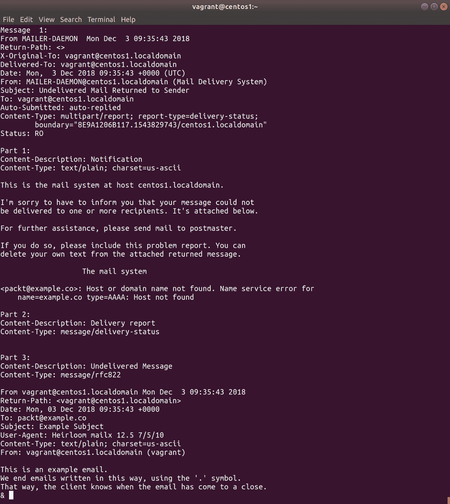

您将进入一个分页器，可以让您滚动查看消息。

在这条消息中，您可以看到一些重要的内容，首先是响应系统是`MAILER-DAEMON@centos1.localdomain`（邮件传递系统），这表明我们的消息并没有传得很远。

然后，电子邮件建议您可以采取一些措施来帮助缓解您的问题，其中首先是联系`邮件管理员`，就像同名电影中的页码大师一样，往往具有一定的超凡品质。

在底部，您会看到您的电子邮件的一部分。

这告诉我们什么？首先，它告诉我们您的邮件服务器无法发送您刚刚尝试发送的消息。

接下来，它告诉我们 Postfix 正在运行足够处理邮件，因为退信仍然是邮件。

# main.cf

Postfix 使用主配置文件`/etc/postfix/main.cf`。

这个文件包含了很多配置选项，但是默认情况下，它没有配置为执行任何操作（例如，它不会接受来自另一个系统的传入邮件）。

# /etc/aliases

这是接收某些邮件的帐户的数据库或映射。

通常，在此文件中进行的唯一配置更改是 root 邮件的目的地。在本地系统上，您可以将此映射到您的用户：

```
# Person who should get root's mail
root: vagrant
```

然后，您运行`newaliases`来应用此更改：

```
$ sudo newaliases
```

虽然不经常这样做，但有些人仍然喜欢获取发送给 root 的电子邮件，以确保没有随机程序死掉并在被收割者夺走时尖叫。

# 工作原理...

要获取有关消息发送失败时发生的情况的更详细输出，通常可以检查`/var/log/maillog`：

```
$ sudo cat /var/log/maillog 
Dec 2 11:35:12 localhost postfix/postfix-script[1120]: starting the Postfix mail system
Dec 2 11:35:12 localhost postfix/master[1125]: daemon started -- version 2.10.1, configuration /etc/postfix
Dec 3 09:35:43 localhost postfix/pickup[11157]: 8E9A1206B117: uid=1000 from=<vagrant>
Dec 3 09:35:43 localhost postfix/cleanup[11317]: 8E9A1206B117: message-id=<20181203093543.8E9A1206B117@centos1.localdomain>
Dec 3 09:35:43 localhost postfix/qmgr[1129]: 8E9A1206B117: from=<vagrant@centos1.localdomain>, size=601, nrcpt=1 (queue active)
Dec 3 09:35:43 localhost postfix/smtp[11319]: 8E9A1206B117: to=<packt@example.co>, relay=none, delay=0.12, delays=0.04/0.01/0.06/0, dsn=5.4.4, status=bounced (Host or domain name not found. Name service error for name=example.co type=AAAA: Host not found)
Dec 3 09:35:43 localhost postfix/cleanup[11317]: A88F7206B118: message-id=<20181203093543.A88F7206B118@centos1.localdomain>
Dec 3 09:35:43 localhost postfix/qmgr[1129]: A88F7206B118: from=<>, size=2545, nrcpt=1 (queue active)
Dec 3 09:35:43 localhost postfix/bounce[11320]: 8E9A1206B117: sender non-delivery notification: A88F7206B118
Dec 3 09:35:43 localhost postfix/qmgr[1129]: 8E9A1206B117: removed
Dec 3 09:35:43 localhost postfix/local[11321]: A88F7206B118: to=<vagrant@centos1.localdomain>, relay=local, delay=0.02, delays=0/0.02/0/0, dsn=2.0.0, status=sent (delivered to mailbox)
Dec 3 09:35:43 localhost postfix/qmgr[1129]: A88F7206B118: removed
```

在这里，我们可以看到发生了什么，并且如果我们找到想要的消息，我们可以通过消息的`message-id`跟踪消息的线程。

首先，我们可以看到 Postfix 正在接收消息：

```
Dec 3 09:35:43 localhost postfix/pickup[11157]: 8E9A1206B117: uid=1000 from=<vagrant>
```

接下来，守护进程在将消息传递到邮件队列之前处理消息：

```
Dec 3 09:35:43 localhost postfix/cleanup[11317]: 8E9A1206B117: message-id=<20181203093543.8E9A1206B117@centos1.localdomain>
```

我们得知消息在队列中，等待发送：

```
Dec 3 09:35:43 localhost postfix/qmgr[1129]: 8E9A1206B117: from=<vagrant@centos1.localdomain>, size=601, nrcpt=1 (queue active)
```

最后（对于这条消息），SMTP 尝试处理邮件：

```
Dec 3 09:35:43 localhost postfix/smtp[11319]: 8E9A1206B117: to=<packt@example.co>, relay=none, delay=0.12, delays=0.04/0.01/0.06/0, dsn=5.4.4, status=bounced (Host or domain name not found. Name service error for name=example.co type=AAAA: Host not found)
```

它立即失败，因为域名不真实。

创建了一个退信消息，即`A88F7206B118`，并进行处理（原始消息`8E9A1206B117`被删除）：

```
Dec 3 09:35:43 localhost postfix/cleanup[11317]: A88F7206B118: message-id=<20181203093543.A88F7206B118@centos1.localdomain>
Dec 3 09:35:43 localhost postfix/qmgr[1129]: A88F7206B118: from=<>, size=2545, nrcpt=1 (queue active)
Dec 3 09:35:43 localhost postfix/bounce[11320]: 8E9A1206B117: sender non-delivery notification: A88F7206B118
Dec 3 09:35:43 localhost postfix/qmgr[1129]: 8E9A1206B117: removed
```

在发送给本地用户之前完成此操作，该用户最初发起了邮件尝试：

```
Dec 3 09:35:43 localhost postfix/local[11321]: A88F7206B118: to=<vagrant@centos1.localdomain>, relay=local, delay=0.02, delays=0/0.02/0/0, dsn=2.0.0, status=sent (delivered to mailbox)
Dec 3 09:35:43 localhost postfix/qmgr[1129]: A88F7206B118: removed
```

它会落在`/var/spool/mail/vagrant`，如下友好的消息所示：

```
You have mail in /var/spool/mail/vagrant
```

这里的每个步骤都是由 Postfix 完成的，一个主守护进程负责许多小守护进程，每个守护进程都有一个特定的工作。

如果我们运行`ps`并查找`postfix`守护程序，你会发现类似这样的东西：

```
 1125 ? Ss 0:00 /usr/libexec/postfix/master -w
 1129 ? S 0:00 \_ qmgr -l -t unix -u
11157 ? S 0:00 \_ pickup -l -t unix -u
```

`qmgr`，顾名思义，是队列管理器，而 pickup 是用于本地邮件接收的。

要查看队列，可以使用`postqueue`命令：

```
$ postqueue -p
-Queue ID- --Size-- ----Arrival Time---- -Sender/Recipient-------
D71FD206B117 458 Mon Dec 3 10:04:18 vagrant@centos1.localdomain
 (connect to nasa.com[192.64.147.150]:25: Connection refused)
 contact@nasa.com

-- 0 Kbytes in 1 Request.
```

在这里，您可以看到我发送给`contact@nasa.com`的消息。这不起作用，因为我们的连接尝试被拒绝了。

还要注意端口`25`，这是一个传统的邮件接收端口。

如果您想清空队列，可以使用`postsuper`，如下所示：

```
$ sudo postsuper -d D71FD206B117
postsuper: D71FD206B117: removed
postsuper: Deleted: 1 message
```

您还可以`flush`邮件队列，尝试重新投递其中的邮件。不过，通常情况下，除非您已解决了导致邮件无法投递的问题，否则您只是导致邮件再次失败。更重要的是，您可能在这个过程中使您的服务器陷入停滞。

# 还有更多...

Postfix 是一个邮件传输代理（MTA）。

遗憾的是，这不是一本关于配置邮件服务器的书，因为这个主题已经有很多很多书了。你只需要知道如何与默认的 Postfix 安装进行交互，如果你在野外遇到它，那么你就需要知道。

如果您想了解更多关于 Postfix 的信息，或者想运行自己的邮件服务器，我建议您不要这样做。不过，如果您回来说您真的非常想运行自己的邮件服务器，我建议您花一个周末时间研究一下 Postfix，了解最佳实践（例如，不要创建开放中继），并尽量不要立即放弃。祝您好运。

不过，如今大多数公司要么使用某种形式的 Exchange 服务器，要么只是使用 Google、ProtonMail、FastMail 等。

# 另请参阅

值得阅读电子邮件，因为实际上有很大的机会，你会发现自己有一天要打开一封电子邮件查看标题。了解电子邮件为什么以这种方式工作（即将消息传递给链中的下一个邮件服务器，直到最终到达最终用户）在这种情况下可能非常有价值。

如果自己运行邮件服务器的想法出现了奇迹般的复苏，我可能会在将来扩展这一部分。

# 本地 MTA 使用和配置（Exim）

与 Postfix 一样，我们还有 Exim，这是另一个 MTA。

Postfix 强大之处在于其专注于安全性，而 Exim 以其极高的可定制性而闻名，其历史可以追溯到 1995 年（比 Postfix 早三年）。多年来，它一直是 Debian 项目的首选，因此很多关于设置邮件服务器的文档都引用了 Exim。

与 Postfix 一样，这不会是一个完全配置 Exim 的长篇章节，因为这需要比一个章节、一本书更长的东西。相反，我们将看一些配置、Exim 日志文件以及在尝试从本地系统发送消息时会发生什么。

# 做好准备

在本节中，我们将使用我们的 Debian 机器。

要确保 Exim 已安装在您的系统上，请运行以下命令：

```
$ sudo apt install exim4 -y
```

Exim 套件中有相当多的软件包，可能需要一些时间来运行它们。

使用`systemctl status`检查是否正在运行：

```
$ systemctl status exim4
● exim4.service - LSB: exim Mail Transport Agent
 Loaded: loaded (/etc/init.d/exim4; generated; vendor preset: enabled)
 Active: active (running) since Wed 2018-12-05 17:38:01 GMT; 1min 29s ago
 Docs: man:systemd-sysv-generator(8)
 Process: 5402 ExecStart=/etc/init.d/exim4 start (code=exited, status=0/SUCCESS)
 Tasks: 1 (limit: 4915)
 CGroup: /system.slice/exim4.service
 └─5649 /usr/sbin/exim4 -bd -q30m
```

# 如何做到这一点...

安装后，让我们快速测试一下邮件服务器的默认外观。

通过发送一个示例邮件开始：

```
$ mail -s "Example Subject" packt@example.co
Cc: 
This is another piece of example mail.
In this case we need to end with Ctrl-D.
Like so!
$ 
```

如果我们现在再次运行`mail`，我们会看到我们的退信消息：

```
$ mail
"/var/mail/vagrant": 1 message 1 new
>N 1 Mail Delivery Syst Wed Dec 5 17:46 56/1737 Mail delivery failed: returnin
? 
```

再次按下`1`和*Enter*将加载第一条消息：

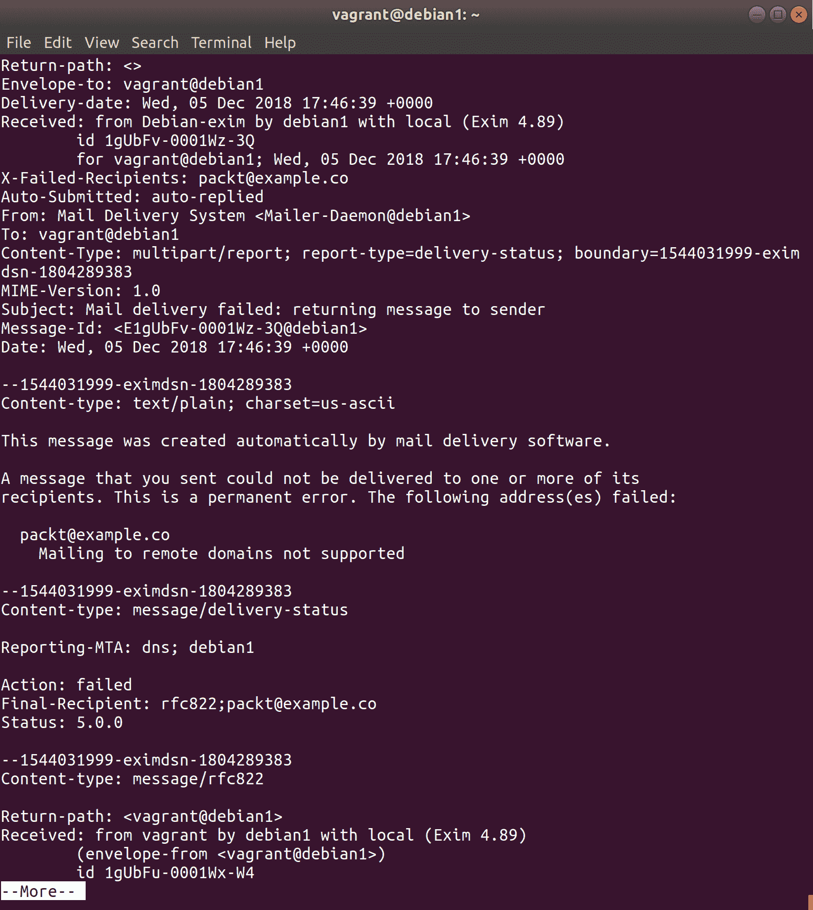

在这里，我们实际上得到了有用的消息`不支持发送到远程域`，因为所涉及的服务器无法执行此操作。

使用 Exim，您还可以测试如何将邮件路由到给定地址的`地址测试模式`。给定前面的地址时，它会打印一个熟悉的消息：

```
$ sudo exim -bt packt@example.co
R: nonlocal for packt@example.co
packt@example.co is undeliverable: Mailing to remote domains not supported
```

它甚至告诉你它是非本地的，而如果我们用相同的命令，用本地用户替换假电子邮件，我们会得到以下结果：

```
$ sudo exim -bt vagrant@localhost
R: system_aliases for vagrant@localhost
R: userforward for vagrant@localhost
R: procmail for vagrant@localhost
R: maildrop for vagrant@localhost
R: lowuid_aliases for vagrant@localhost (UID 1000)
R: local_user for vagrant@localhost
vagrant@localhost
 router = local_user, transport = mail_spool
```

使用的传输是本地`mail_spool`，没有关于邮件无法投递的消息。

我们还可以使用`ss`来确认我们的邮件服务器只在本地（`127.0.0.1 和::1`）上监听端口`25`：

```
$ ss -tna '( sport = :smtp )'
State Recv-Q Send-Q Local Address:Port Peer Address:Port 
LISTEN 0 20 127.0.0.1:25 *:* 
LISTEN 0 20 ::1:25 :::* 
```

# 它是如何工作的...

在我们的 Debian 主机上，Exim 配置位于`/etc/exim4`文件夹中。列出此文件的内容如下：

```
$ ls /etc/exim4/
conf.d exim4.conf.template passwd.client update-exim4.conf.conf
```

正在积极使用的配置文件是`update-exim4.conf.conf`文件（是的，`.conf`出现了两次）。

这个文件的原始内容如下：

```
# /etc/exim4/update-exim4.conf.conf
#
# Edit this file and /etc/mailname by hand and execute update-exim4.conf
# yourself or use 'dpkg-reconfigure exim4-config'
#
# Please note that this is _not_ a dpkg-conffile and that automatic changes
# to this file might happen. The code handling this will honor your local
# changes, so this is usually fine, but will break local schemes that mess
# around with multiple versions of the file.
#
# update-exim4.conf uses this file to determine variable values to generate
# exim configuration macros for the configuration file.
#
# Most settings found in here do have corresponding questions in the
# Debconf configuration, but not all of them.
#
# This is a Debian specific file

dc_eximconfig_configtype='local'
dc_other_hostnames='debian1'
dc_local_interfaces='127.0.0.1 ; ::1'
dc_readhost=''
dc_relay_domains=''
dc_minimaldns='false'
dc_relay_nets=''
dc_smarthost=''
CFILEMODE='644'
dc_use_split_config='false'
dc_hide_mailname=''
dc_mailname_in_oh='true'
dc_localdelivery='mail_spool'
```

但是，可以根据文件的建议使用`sudo dpkg-reconfigure exim4-config`进行修改：

```
$ sudo dpkg-reconfigure exim4-config
```

这将使您进入一个 TUI，看起来像这样：

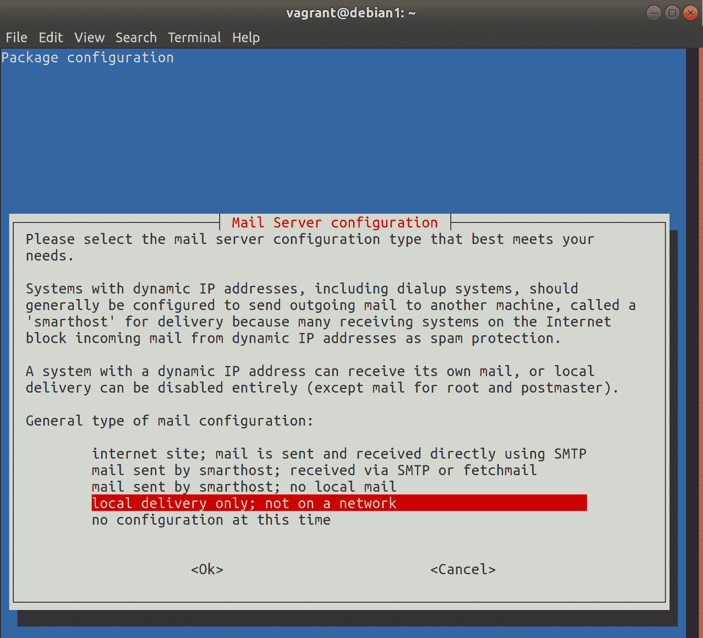

在这里，您可以根据自己的喜好重新配置邮件服务器，包括将其设置为 Internet 邮件服务器。

一旦按照您的喜好完成，您会发现配置文件已经更新以反映这些设置。

如果您想知道某些配置设置是否生效，可以使用`exiwhat`命令，如下所示：

```
$ sudo exiwhat
 3280 daemon(4.89): -q30m, listening for SMTP on [127.0.0.1]:25 [::1]:25
```

Exim，像 Postfix 一样，还提供了一个有用的`maillog`，尽管在 Exim 的情况下，它被称为`mainlog`，通常位于特定的`exim`目录中：

```
$ sudo ls /var/log/exim4/
mainlog
```

内容相对熟悉：

```
$ sudo cat /var/log/exim4/mainlog
<SNIP>
2018-12-05 19:03:15 1gUcS3-0000xe-Ps <= vagrant@debian1 U=vagrant P=local S=466
2018-12-05 19:03:15 1gUcS3-0000xe-Ps ** packt@example.co R=nonlocal: Mailing to remote domains not supported
2018-12-05 19:03:15 1gUcS3-0000xg-SC <= <> R=1gUcS3-0000xe-Ps U=Debian-exim P=local S=1645
2018-12-05 19:03:15 1gUcS3-0000xe-Ps Completed
2018-12-05 19:03:15 1gUcS3-0000xg-SC => vagrant <vagrant@debian1> R=local_user T=mail_spool
2018-12-05 19:03:15 1gUcS3-0000xg-SC Completed
```

我们还可以在这里看到一些相当明显的行，我们也可以对其进行扩展：

```
2018-12-05 19:03:15 1gUcS3-0000xe-Ps <= vagrant@debian1 U=vagrant P=local S=466
```

已经收到了以下消息`from vagrant@debian1`（`<=`）：

```
2018-12-05 19:03:15 1gUcS3-0000xe-Ps ** packt@example.co R=nonlocal: Mailing to remote domains not supported
```

邮件传递失败，因为地址被退回（`**`）：

```
2018-12-05 19:03:15 1gUcS3-0000xg-SC <= <> R=1gUcS3-0000xe-Ps U=Debian-exim P=local S=1645
```

从 Debian-exim 收到了一条新消息：

```
2018-12-05 19:03:15 1gUcS3-0000xe-Ps Completed
```

原始消息的旅程已经结束：

```
2018-12-05 19:03:15 1gUcS3-0000xg-SC => vagrant <vagrant@debian1> R=local_user T=mail_spool
```

新消息已发送给 vagrant 用户（`=>`）：

```
2018-12-05 19:03:15 1gUcS3-0000xg-SC Completed
```

新消息的旅程现在也已经结束了。

# 还有更多...

我必须在这里向 Exim 故障排除提供一个不可或缺的网站的赞扬：[`bradthemad.org/tech/notes/exim_cheatsheet.php`](http://bradthemad.org/tech/notes/exim_cheatsheet.php)。

如果您发现自己卡在 Exim 可以执行的某个操作上，或者确定有特定的查询可以获取您要获取的信息，请查看 Brad 的 Exim 备忘单-您不会是第一个。

感谢 Brad，帮助所有管理员。

# NoSQL 文档（MongoDB 示例）

我们之前已经看过**结构化查询语言**（**SQL**）服务，以 MariaDB 和 PostgreSQL 的形式。现在我们将看看以 NoSQL 方式在数据库中存储数据的“新”方式。

与传统数据库的基于表的关系不同，NoSQL 数据库以其他方式存储数据（如键值存储、元组存储或文档存储）。由于市场上突然涌入大量大数据产品，这些数据库在最近几年变得突出，这些产品大多时候依赖这些数据库进行存储。

NoSQL 数据库可以采用几种不同的形式，如先前暗示的，我们将在下一节中看一个示例（Redis）。

在考虑为什么要使用 NoSQL 数据库代替传统数据库时，您可能会考虑可伸缩性、灵活性和速度等方面，所有这些都可以是良好 NoSQL 设置的特点。

术语**数据库**可能更松散和准确地应用于 NoSQL 设置，这可能是数据的基础，但可能不需要为其包含的数据使用结构化存储。

在本节中，我们将安装 MongoDB，并查看其数据库中存储数据的方式。

大免责声明：

MongoDB 可能因为成为黑客社会不道德成员的目标而臭名昭著。这是因为 MongoDB 可以使用默认设置安装，让它在互联网上监听，开放端口，而没有启用任何形式的访问要求。这是不好的，你应该在做任何事情之前考虑安全问题。与任何应用程序一样，安全性主要是管理员安装和管理的责任。我在本书的某些部分详细讨论了安全性，但强调这一点很重要。我经常看到对部署服务器（各种类型的服务器）采取漫不经心的方法，导致网络中出现一个很大的漏洞。在有自由裁量权的情况下，我看到一些非常聪明的人在不考虑后果的情况下做了一些非常愚蠢的事情（比如在面向公众的构建服务器上保留默认的管理员凭据），汉隆剃刀定律总是适用的：

“永远不要归因于恶意，那可以充分解释为愚蠢。”

# 准备工作

在本节中，我们将使用我们的 CentOS 机器，通过 SSH 连接到它：

```
$ vagrant ssh centos1
```

安装 EPEL 存储库，然后安装 MongoDB：

```
$ sudo yum install epel-release -y
$ sudo yum install mongodb mongodb-server -y
```

我们在这里使用 EPEL 存储库是为了方便，但安装 MongoDB 还有更多的方法。具体来说，使用官方存储库是生产系统的推荐方法。

# 如何做...

安装后，你可以使用`mongod`守护进程启动和启用 MongoDB：

```
$ sudo systemctl enable --now mongod
```

默认情况下，MongoDB 将在本地主机端口 27017 上启动，但使用`ss`或其他工具进行确认：

```
$ ss -a '( sport = :27017 )'
State Recv-Q Send-Q Local Address:Port Peer Address:Port 
LISTEN 0 128 127.0.0.1:27017 *:* 
```

一旦启动，你可以使用`mongo`命令行工具连接到你的数据库：

```
$ mongo
```

上述命令的输出如下：

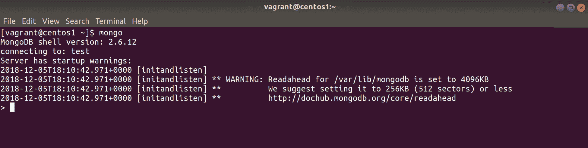

注意我们默认连接到了`test`。如果我们错过了通知，我们可以用`db`命令确认我们连接到了哪个数据库：

```
> db
test
```

我们可以通过使用`use`轻松地（并且以熟悉的方式）切换数据库：

```
> use local
switched to db local
```

在我们当前的数据库中，我们可以看到集合。因为我们切换到了`local`，所以它们看起来是这样的：

```
> show collections
startup_log
system.indexes
```

与集合一起工作的语法是`db.<collection name>.<blah>`，所以如果我们想查询`startup_log`集合中的所有内容，我们可以这样做：

```
> db.system.indexes.find()
{ "v" : 1, "key" : { "_id" : 1 }, "name" : "_id_", "ns" : "local.startup_log" }
```

显然，这有点混乱，所以我们可以使用`.pretty()`使其更易于阅读：

```
> db.system.indexes.find().pretty()
{
 "v" : 1,
 "key" : {
 "_id" : 1
 },
 "name" : "_id_",
 "ns" : "local.startup_log"
}
```

你应该已经看到与 SQL 数据库的相似之处，尽管在许多情况下语法有很大的不同。

让我们回到我们的`test`数据库，并创建一个我们自己的集合：

```
> use test
switched to db test
> db.distributions.insert( { name: "Ubuntu", developer: "Canonical Ltd.", initial_year: 2004 } )
WriteResult({ "nInserted" : 1 })
```

现在，通过对这个集合进行查找，我们应该看到我们刚刚插入的数据：

```
> db.distributions.find().pretty()
{
 "_id" : ObjectId("5c081ba9832e06b5d1b64d50"),
 "name" : "Ubuntu",
 "developer" : "Canonical Ltd.",
 "initial_year" : 2004
}
```

让我们再添加一行，这次加上更多的字段：

```
> db.distributions.insert( { name: "Alpine Linux", developer: "Alpine Linux development team", initial_year: 2010, first_version: 2.0, forked_from: "LEAF Project" } )
WriteResult({ "nInserted" : 1 })
```

让我们再次执行我们的查找：

```
> db.distributions.find().pretty()
{
 "_id" : ObjectId("5c081ba9832e06b5d1b64d50"),
 "name" : "Ubuntu",
 "developer" : "Canonical Ltd.",
 "initial_year" : 2004
}
{
 "_id" : ObjectId("5c081c31832e06b5d1b64d51"),
 "name" : "Alpine Linux",
 "developer" : "Alpine Linux development team",
 "initial_year" : 2010,
 "first_version" : 2,
 "forked_from" : "LEAF Project"
}
```

请注意，虽然我们的插入是正常的，但`first_version`字段中的`2.0`已经简化为整数。

如果我们想缩小我们的搜索范围，我们可以专门搜索`name`为 Ubuntu 的条目：

```
> db.distributions.find({"name": "Ubuntu"}).pretty()
{
 "_id" : ObjectId("5c081ba9832e06b5d1b64d50"),
 "name" : "Ubuntu",
 "developer" : "Canonical Ltd.",
 "initial_year" : 2004
}
```

或者，如果我们只想打印特定的值（这里只是名称），我们可以使用以下命令：

```
> db.distributions.find( {}, {"name": 1, "_id": 0} ).pretty()
{ "name" : "Ubuntu" }
{ "name" : "Alpine Linux" }
```

注意这个查询的奇怪结构，我们指定了`1`来包括名称，但指定了`0`来省略`_id`，这是默认包含的。

还有很多其他事情可以做，包括按特定查询搜索（在这种情况下，查找所有`initial_year`大于`2004`的条目）：

```
> db.distributions.find({"initial_year": { $gt: 2004}}).pretty()
{
 "_id" : ObjectId("5c081c31832e06b5d1b64d51"),
 "name" : "Alpine Linux",
 "developer" : "Alpine Linux development team",
 "initial_year" : 2010,
 "first_version" : 2,
 "forked_from" : "LEAF Project"
}
```

具体来说，我们对存储数据的这种方法和传统方法之间的区别感兴趣。

# 它是如何工作的...

由于我们正在处理`文档`，并且事情是即兴创建的（而不是有一个严格数据集的表），我们之前的命令似乎比传统数据库更加临时。

当我们创建我们的集合时，我们不必定义任何东西。我们只是在我们的测试数据库中写入数据：

```
> db.distributions.insert( { name: "Ubuntu", developer: "Canonical Ltd.", initial_year: 2004 } )
```

从那里，我们能够添加更多的数据，然后开始查询我们刚刚写入的数据。

随后添加的数据并不重要，虽然我们写入的文档中存在一些关联，比如名称、开发者和`initial_year`字段，但也有一些字段是唯一的。数据库并不在乎。

由于这种存储数据的方法，NoSQL 系统在输入方面可以被视为更加灵活。

这些数据现在存储在 MongoDB 中，任何想要查询它的程序都可以快速轻松地访问（通常是诸如 Node.js 应用程序之类的东西）。

我们可以使用另一个查询准确查看`dbPath`值的位置：

```
> use local
switched to db local
> db.startup_log.find( {}, {"cmdLine.storage": 1} ).pretty()
{
 "_id" : "centos1-1544033443006",
 "cmdLine" : {
 "storage" : {
 "dbPath" : "/var/lib/mongodb"
 }
 }
}
```

这意味着我们也可以在我们的主机系统上查看它：

```
$ sudo ls -l /var/lib/mongodb/
total 163844
drwxr-xr-x. 2 mongodb mongodb 29 Dec 5 18:40 journal
-rw-------. 1 mongodb mongodb 67108864 Dec 5 18:10 local.0
-rw-------. 1 mongodb mongodb 16777216 Dec 5 18:10 local.ns
-rwxr-xr-x. 1 mongodb mongodb 6 Dec 5 18:10 mongod.lock
-rw-------. 1 mongodb mongodb 67108864 Dec 5 18:42 test.0
-rw-------. 1 mongodb mongodb 16777216 Dec 5 18:42 test.ns
drwxr-xr-x. 2 mongodb mongodb 6 Dec 5 18:40 _tmp
```

# 还有更多...

我建议使用的 MongoDB 的 EPEL 版本已经过时。在撰写本文时是如此，因此，如果您想要为自己的系统使用 MongoDB，最好从上游存储库中尝试最新版本。

我再次强调，如果您计划在生产中使用它，启用某种安全性也是必须的。

此外，如果您仍在尝试考虑 NoSQL 数据库何时可能比传统的 PostgreSQL 或 MySQL 设置更有用，请考虑诸如日志记录之类的情况。

您希望日志文件是一致的，具有相同的字段和相同类型的数据。但是，日志文件可能会发生变化，它们的顺序可能会不同，类型可能会突然改变，字段的数量可能会增加。

如果您将传统数据库用作这些日志的后端（完全可能），您将不得不在最好的情况下添加新表，或者在最坏的情况下完全使用不同的数据库。

将这些相同的日志导入 NoSQL 系统，一个专门设计用于处理文档的系统，不应该对系统的运行产生影响，因为集合将简单地适应您提供的新信息。

# NoSQL KV（Redis 示例）

我们已经看过一种类型的 NoSQL 数据库，即 MongoDB（一个特定于文档的实例）。现在我们将看一看另一种类型的 NoSQL 数据库，具体来说是 Redis，它是一种**键-值**（**KV**）数据库。

它的独特卖点是它是一个完全的内存数据库（如果需要，定期写入磁盘）。这意味着 Redis 不仅是一个用于存储您正在操作或使用的数据的缓存，而且速度非常快。

由于 Redis 的设计，它常见于 Web 堆栈设置中，速度对于高效处理请求非常重要。

需要注意的是，对于 Redis 和其他 NoSQL 数据库，有一个批评是在特定情况下数据很容易丢失。因为 Redis 主要将数据存储在内存中，偶尔写入磁盘，所以即使只有几秒钟的时间，节点的灾难性故障也可能导致数据丢失。

# 准备工作

在本节中，我们将再次使用我们的 CentOS 虚拟机。

SSH 到您的 CentOS 机器：

```
$ vagrant ssh centos1
```

安装 EPEL 存储库，然后安装 MongoDB：

```
$ sudo yum install epel-release -y
$ sudo yum install redis -y
```

同样，出于方便起见，我们使用 EPEL，但是有更更新的选择，而运行 Redis 的最受欢迎的方法之一是在 Docker 容器中。

# 如何做到这一点...

默认情况下，systemd 将使用`/etc/redis.conf`配置文件启动 redis-server 二进制文件。现在让我们继续做这个：

```
$ sudo systemctl enable --now redis
Created symlink from /etc/systemd/system/multi-user.target.wants/redis.service to /usr/lib/systemd/system/redis.service.
```

默认端口是`6379`，我们可以再次使用`ss`来检查：

```
$ ss -a '( sport = :6379 )'
State Recv-Q Send-Q Local Address:Port Peer Address:Port 
LISTEN 0 128 127.0.0.1:6379 *:* 
```

在这里，我们监听 localhost，端口`6379`：

与以往一样，同样的警告适用：如果您开始打开任何已安装的服务，请确保它们是安全的，不会让不良行为者窃取您的数据。

通过命令行使用`redis-cli`连接到实例，简单地调用它应该会让您进入 Redis shell：

```
$ redis-cli
127.0.0.1:6379> 
```

Redis 建议使用`ping`来查看 Redis 是否正常响应：

```
127.0.0.1:6379> ping
PONG
```

因为 Redis 是一个 KV 存储，与其交互的语法可能非常简单。以下示例创建了一个具有字符串值的键：

```
127.0.0.1:6379> set distro centos
OK
```

为了检索数据，我们使用`get`：

```
127.0.0.1:6379> get distro
"centos"
```

如果我们想设置一个整数值，我们只需指定它：

```
> set number_of_linux_distros 20
OK
```

每当创建一个新的 Linux 发行版时，我们就可以递增它：

```
127.0.0.1:6379> incr number_of_linux_distros
(integer) 21
127.0.0.1:6379> incr number_of_linux_distros
(integer) 22
127.0.0.1:6379> incr number_of_linux_distros
(integer) 23
127.0.0.1:6379> incr number_of_linux_distros
(integer) 24
127.0.0.1:6379> incr number_of_linux_distros
(integer) 25
127.0.0.1:6379> get number_of_linux_distros
"25"
```

您也不仅限于一次获取`mget`：

```
127.0.0.1:6379> mget distro number_of_linux_distros
1) "centos"
2) "25"
```

您可能会想知道这有什么用。我的意思是，当然，它很快，但它真的很好吗，以至于成为任何体面的 Web 堆栈的不可或缺的一部分吗？

Redis 还可以做很多其他事情，包括将二进制数据（例如图像）存储为键的值；它可以创建具有短生存期的键，这意味着它可以用于临时缓存；它可以进行集群化。

它的使用通常取决于应用程序的程序员，而不是负责设置它的管理员。但是，这并不意味着如果您的开发人员都坐在一张桌子周围，试图想出一个可以用作网站数据缓存的内存键值存储，您就不能建议它。

# 它的工作原理...

我们将 Redis 作为服务启动，使用`/etc/redis.conf`作为配置文件（默认）。

在撰写本文时，EPEL 版本附带的默认设置意味着它在启动时位于本地主机地址（`127.0.0.1`）和端口`6379`上：

```
$ sudo cat /etc/redis.conf | grep "port 6379\|^bind 127.0.0.1"
bind 127.0.0.1
port 6379~
```

这里的设置还设置了模式（默认受保护），该模式规定了 Redis 在监听其他端口时如何启动：

```
# By default protected mode is enabled. You should disable it only if
# you are sure you want clients from other hosts to connect to Redis
# even if no authentication is configured, nor a specific set of interfaces
# are explicitly listed using the "bind" directive.
protected-mode yes
```

明智的选择！

我们知道 Redis 是内存中的，但也有关于它偶尔写入磁盘的事实。

此 DB 转储可以在配置文件的给定目录中查看：

```
$ sudo ls /var/lib/redis
dump.rdb
```

除非设置了`appendonly`值，否则此数据库文件会稍微滞后于运行实例，这意味着如果 Redis 或服务器崩溃，您可能会丢失几秒钟的数据。

您希望数据有多健壮通常取决于应用程序开发人员。如果他们不介意可能会丢失一两秒的数据，这意味着某个值可能不会被缓存或类似的情况，那么您可能不希望承受将所有数据尽快写入磁盘的性能影响。

# 消息代理和队列（RabbitMQ 示例）

在各种形状和大小的数据库之后，在本节中，我们将看一些非常不同的东西，即一种名为 RabbitMQ 的消息软件。

与 Redis 一样，RabbitMQ 是许多现代 Web 应用程序的重要组成部分，因为它是开源的并且有很好的文档。

“*但是什么是消息队列？*”

我知道你会问这个问题，除非你已经知道，如果是这样，那么这一节对你来说可能有点无用。

**消息队列**通常使用**高级消息队列协议**（**AMQP**），是消息代理的一部分，用于作为应用程序堆栈的发送和接收消息的软件。

这些消息通常来自可以以不同方式进行交谈和监听的不同组件。消息代理用于促进这些组件之间的对话。

您通常会发现消息代理和队列开始在“解耦”方面进行讨论，这是一种提出应用程序堆栈的不同元素不应该如此依赖彼此的花哨方式。

想象一下，一个 Web 服务器正在与处理数据的应用程序交谈。在旧世界中，Web 服务器会直接与处理应用程序交谈，来回发送消息，同时等待响应。这在扁平设计中可能很好，但您可能会面临诸如前端网站锁定，而后端处理应用程序在处理棘手的任务时被卡住等风险。

而不是直接通信，可以使用消息代理，虽然它依赖于 Web 开发人员编写的代码，不依赖于后端的直接或即时响应，但它有效地解耦了后端应用程序的硬依赖关系（或者根本不需要后端应用程序存在）。

理论上，您可以从队列中删除数据库，替换它，前端网站将一无所知。

您还会经常看到 RabbitMQ（和其他）在分布式和冗余设置的设计中，而不是一个网站与一个处理后端通信，而是几个前端和几个后端只需与队列通信，根据需要接收和处理消息。

# 准备工作

在本节中，我们将使用我们的 Debian 盒子...只是为了改变一下。

像这样连接到`debian1`：

```
$ vagrant ssh debian1 -- -L 127.0.0.1:15672:127.0.0.1:15672
```

注意后续端口以便稍后访问管理界面。

警告：在此设置中，RabbitMQ 默认在所有接口上启动，因此您应确保防火墙使这些端口无法从外部访问。如果您只是在 Vagrant 测试 VM 上工作，那么它应该只设置为本地网络。

从默认存储库安装`rabbitmq-server`：

```
$ sudo apt install rabbitmq-server -y
```

# 如何做...

安装后，Rabbit 应该会自动启动（啊，Debian）。这意味着我们可以立即用`ps`（以及它作为默认用户运行的`rabbitmq`）看到正在运行的内容：

```
$ ps -fu rabbitmq
UID PID PPID C STIME TTY TIME CMD
rabbitmq 5085 1 0 14:25 ? 00:00:00 /bin/sh /usr/sbin/rabbitmq-server
rabbitmq 5094 5085 0 14:25 ? 00:00:00 /bin/sh -e /usr/lib/rabbitmq/bin/rabbitmq-server
rabbitmq 5244 1 0 14:25 ? 00:00:00 /usr/lib/erlang/erts-8.2.1/bin/epmd -daemon
rabbitmq 5307 5094 0 14:25 ? 00:00:02 /usr/lib/erlang/erts-8.2.1/bin/beam -W w -A 64 -P 1048576 -t 5000000 -stbt db -zdbbl 32000 -K true -B i -- -root /usr/lib/erlang
rabbitmq 5417 5307 0 14:25 ? 00:00:00 erl_child_setup 65536
rabbitmq 5442 5417 0 14:25 ? 00:00:00 inet_gethost 4
rabbitmq 5443 5442 0 14:25 ? 00:00:00 inet_gethost 4
```

从这里，我们可以立即看到 RabbitMQ 使用 Erlang，并且`/usr/lib/rabbitmq/bin/rabbitmq-server`脚本用于启动服务器。

首先，让我们设置 RabbitMQ 管理界面：

```
$ sudo rabbitmq-plugins enable rabbitmq_management
The following plugins have been enabled:
 mochiweb
 webmachine
 rabbitmq_web_dispatch
 amqp_client
 rabbitmq_management_agent
 rabbitmq_management

Applying plugin configuration to rabbit@debian1... started 6 plugins.
```

现在，您应该能够在本地机器上访问此界面。

导航到`http://127.0.0.1:15672`，您应该看到类似以下的内容：

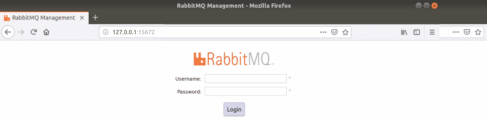

默认用户名和密码是`guest`/`guest`。

回到我之前的安全观点，这突显了在安全测试环境中设置和配置软件的必要性，绝对不要在进入实际环境之前使用任何生产数据。

登录后，您应该看到这个：

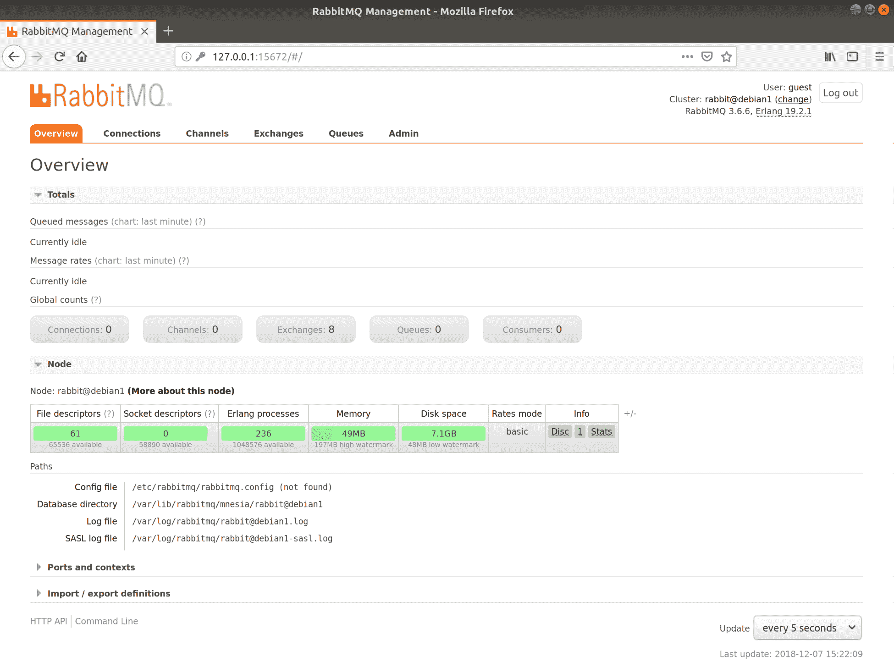

RabbitMQ 概述页面

通常，我建议从 CLI 开始，但碰巧这是一个很好的可视化 Rabbit 是什么以及它在做什么的方式。

在此屏幕顶部，我们有我们的总数，这是 Rabbit 当前知道的消息的详细信息（现在它是空闲的）。

在节点部分，我们可以立即看到我们有一个名为`rabbit@debian1`的单个节点，并且我们目前对其使用情况进行了详细说明。

我们还有一个 Rabbit 查找的相关路径列表，包括配置文件（目前不存在）和实际数据库目录。还有有关各种日志文件的信息。

在这个界面上四处点击（尽管您可能会发现它有点稀疏）。

回到命令行，让我们看看如何查询没有启用 Web 界面的远程服务器上的信息。

首先列出队列：

```
$ sudo rabbitmqctl list_queues
Listing queues ...
```

这是空的，就像我们在 GUI 上看到的一样（如果您单击了队列选项卡）。

默认情况下，我们有一个`vhost`，这是对 RabbitMQ 进行分段的一种方法（就像 Apache 和 Nginx 中的 vhost 一样）：

```
$ sudo rabbitmqctl list_vhosts
Listing vhosts ...
/
```

我们可以查看已配置的用户：

```
$ sudo rabbitmqctl list_users
Listing users ...
guest [administrator]
```

我们还可以创建用户：

```
$ sudo rabbitmqctl add_user exampleUser examplePassword
Creating user "exampleUser" ...
```

让我们创建一个`vhost`来配合：

```
$ sudo rabbitmqctl add_vhost exampleVhost
Creating vhost "exampleVhost" ...
```

现在让我们让我们的用户访问所述`vhost`：

```
$ sudo rabbitmqctl set_permissions -p exampleVhost exampleUser ".*" ".*" ".*"
Setting permissions for user "exampleUser" in vhost "exampleVhost" ...
```

# 工作原理...

我们所做的大部分内容应该是不言自明的，除了权限行：

```
$ sudo rabbitmqctl set_permissions -p exampleVhost exampleUser ".*" ".*" ".*"
```

在这里，我们特别授予`configure`、`write`和`read`权限给我们的用户`exampleUser`。这意味着在`exampleVhost vhost`中，我们的用户将完全可以按照自己的意愿进行访问。

这里通过正则表达式授予访问权限，这意味着您可以更精细地控制用户在`vhost`中可以访问和不能访问的内容。

与 Redis 一样，RabbitMQ 如果没有设置和没有应用程序与其通信，就不会做太多事情。

各种语言都有与 RabbitMQ 进行交互的方式。通常由你公司的开发人员决定他们将如何写入队列，他们将写入哪些队列，一旦完成，他们将如何从这些队列中读取，以及他们将使用什么语言。

遗憾的是，从管理员的角度来看，你很少会涉及到 RabbitMQ 的实际请求和操作。你的大部分工作将围绕着确保安全性（TLS、用户认证等）和确保集群保持一致。

我强烈建议阅读 Rabbit 文档，并尝试一些与 Rabbit 互动的快速入门指南。如果你有开发者的思维，或者你只是喜欢用 Python 脚本进行调试，这可能是深入了解这个消息代理和消息代理的一个好方法。

# 总结 - 网络服务器、数据库和邮件服务器

在本章中，我故意试图谈论一些目前市场上最流行的技术，包括我知道确实拥有大量用户和市场份额的程序。其中一些软件已经存在了很长时间，接近几十年，但更多的是最近加入的，这在很大程度上归功于 2010 年代后期云计算的爆炸。

当我们谈论网络服务器、邮件服务器和数据库时，它们有各种各样的形状和大小，这意味着很难建议适合所有用例的明智默认值。我唯一能给出的建议，也是普遍适用的，就是不要为了简单而牺牲安全性。（你可能已经读了足够多关于最近几个月和几年的泄露和安全漏洞的报道，你想确保你的名字不会与这样的灾难性事件联系在一起。）

这并不是说这些东西不能有趣。人们用 NoSQL 数据库、消息代理甚至邮件服务器做的奇怪而奇妙的事情对很多人来说都非常有趣，其中可能包括你！

我也不想让你远离自己运行任何这些东西的想法，尤其是现在大部分这些东西都可以从各种云提供商和第三方作为服务提供。这可以是一个很好的学习经验，并且在你自己安装和配置这些东西时，可以教会你某些程序的优点和缺点。

还有一件事要注意，这只是我的观点。

我不喜欢在同一基础设施中混合类似的技术。如果你需要一个 SQL 数据库，并且以前从未在你的基础设施中使用过，那么在决定使用 MariaDB 还是 PostgreSQL 之前，可以考虑一段时间。大多数现代软件只需要某种 SQL 后端，它并不在乎提供它的软件是什么。

你正在安装的 GitLab 服务器？也许你已经决定使用 PostgreSQL。

现在你有一个要设置的 WordPress 实例？再次选择 PostgreSQL。

你需要连接 Icinga2 吗？试试 PostgreSQL。

想象一下，如果你决定在某件事情上使用 MariaDB，另一件事情上使用 MySQL，第三件事情上使用 PostgreSQL，你可能会陷入多大的困境。除非有非常充分的理由选择其中一个，我非常赞成尽可能保持基础设施的简单。这样，当你不得不学习一些 SQL 来正确管理你的数据库时，你只需要担心某个 SQL 提供商的复杂性，而不是三个不同的提供商。

这也是跨领域的，如果你需要为某事设置邮件服务器，我总是更倾向于在 Debian 和 CentOS 机器上都设置 Postfix，这样我就知道在日志和配置指令方面该看哪里，无论我在哪个操作系统上。

事实上，忘掉吧！更进一步，选择一个单一的操作系统进行部署，放弃混合 Debian、CentOS 和 Ubuntu 部署的想法。

从逻辑上讲，这不仅在管理组件时节省了你的理智，而且大大减少了你需要维护的基础设施代码、你需要镜像的存储库，以及你需要订阅的安全邮件列表。

但在你自己的时间？嗯，那取决于你——疯狂地玩，学习。

# 超级个人偏好时间！

如果你把我绑在椅子上，说我一定要选择我更喜欢的软件，我会说以下的：

+   Postfix > Exim

+   Nginx > Apache

+   MariaDB > PostgreSQL

注意：这是半开玩笑的；不要太认真。
