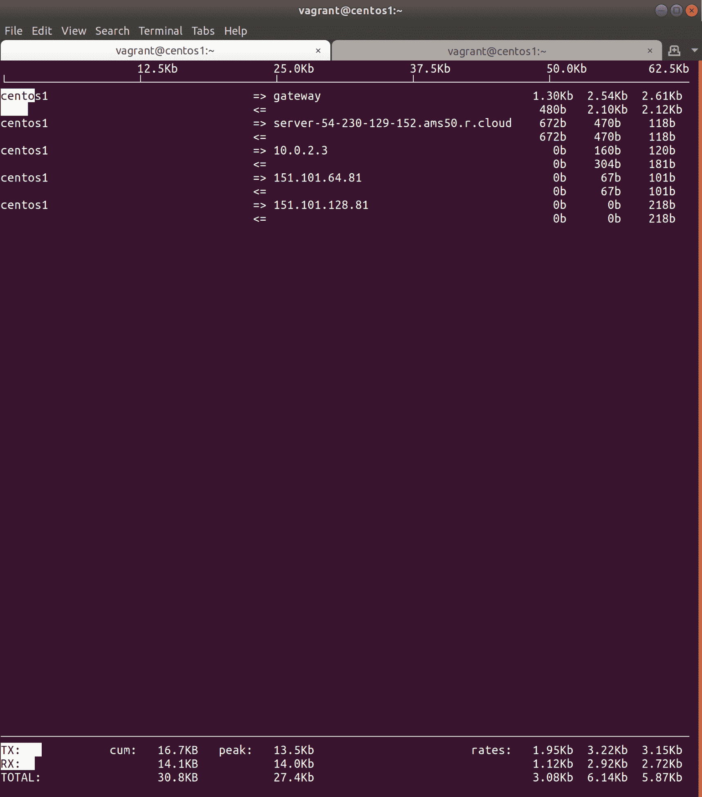
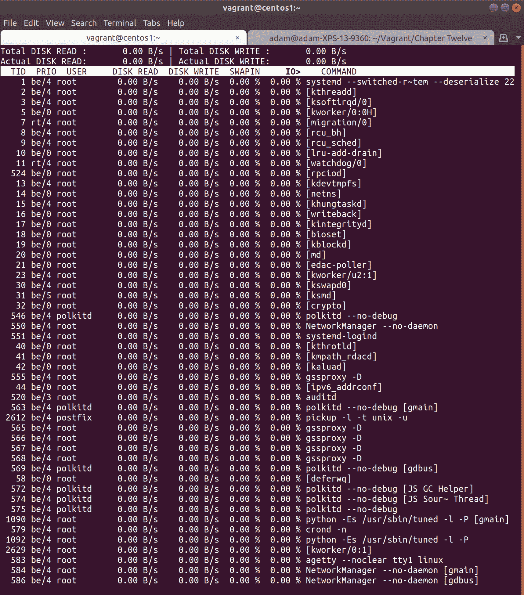
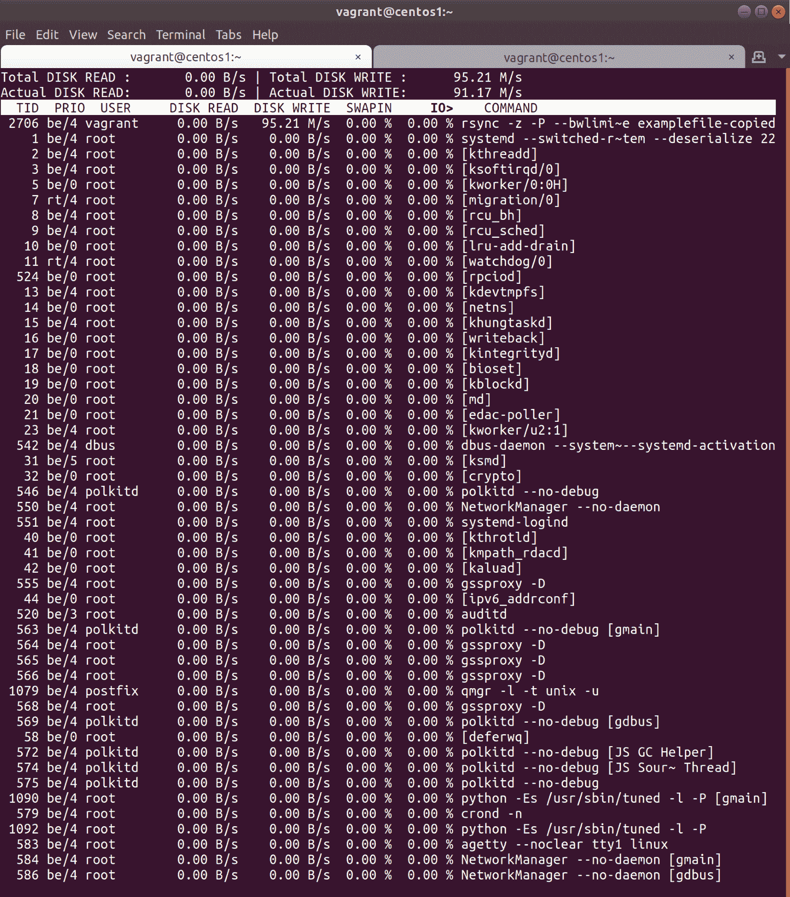
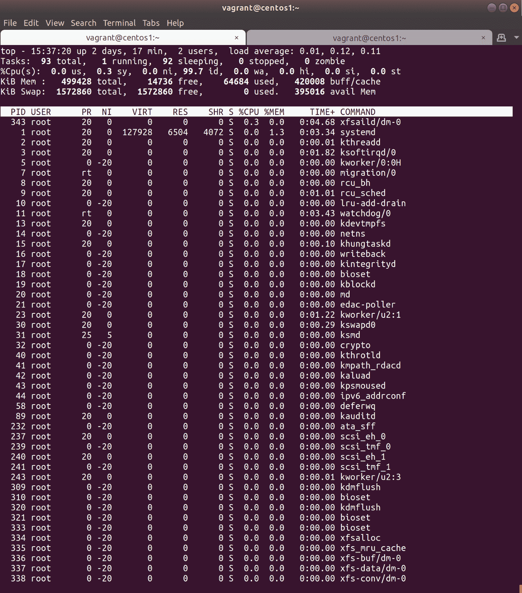

# 第十二章：故障排除和职场外交

在本章中，我们将研究以下主题：

+   什么是故障排除？

+   隔离真正的问题

+   给出估计并决定下一步

+   使用`ss`、`iftop`、`tcpdump`和其他工具解决网络问题

+   使用`curl`、`wget`和`openssl`解决远程网络问题

+   使用`itop`、`top`和`vmstat`解决本地资源问题

+   使用`ps`、`lsof`、`strace`和`/proc`解决服务问题

+   复制问题以供以后调试

+   临时解决方案及何时调用它们

+   处理愤怒的开发人员

+   处理愤怒的经理

+   处理愤怒的业主

# 介绍

在本章中，我们将开始逐渐减少我们所看到的技术方面。我们不会过多地看新的服务和软件，我们所使用的软件大多是我们已经在其他领域涵盖过的工具（只是在这里我们将讨论何时以及如何使用它们）。

本章的主要重点是故障排除，同时也非常强调故障排除的沟通方面。你可能是世界上最优秀的工程师，一个真正的代码耳语者，但如果你不能以其他人能够理解的方式传达你的发现，那么你的能力就毫无意义。

当你排除故障时，不管是在额外的时间还是在火线下，你必须确保你学到的东西得到适当的记录（即使最初只是在一张纸上，以后可以存储在 Confluence 等文档存储中），这样，如果再次发生，不是你的人能够更快地弄清楚发生了什么，并希望更快地解决问题。

在你排除故障的同时，也值得让周围的人知道发生了什么。多年来，我见过各种各样的做法，但如今让人们了解情况的一种更常见的解决方案似乎是通过 Rocket.Chat 或 Slack 频道发布公告和信息。这样，任何人都可以了解情况，即使只是出于一时的兴趣。

是的，有时你在排除故障时，有人希望每五分钟得到一个关于发生了什么的更新。这个人可以是客户、经理、开发人员或业主，但在这种情况下保持冷静，不要感到压力，确保你的回答简洁明了，不要有太多的猜测，这很重要。

# 技术要求

在本章中，我们所做的一切都可以通过单个节点完成；在这种情况下，我使用的是一个 CentOS 机器。

随时可以使用`Vagrantfile`来一起玩：

```
# -*- mode: ruby -*-
# vi: set ft=ruby :

Vagrant.configure("2") do |config|

  config.vm.define "centos1" do |centos1|
    centos1.vm.box = "centos/7"
    centos1.vm.network "private_network", ip: "192.168.33.10"
    centos1.vm.hostname = "centos1"
    centos1.vm.box_version = "1804.02"
  end

end
```

# 什么是故障排除？

**故障排除**，或者**调试**（更常用于特定软件），是试图弄清楚解决方案出了什么问题，或者在事件发生时历史上出了什么问题的行为。那个事件可以是数据中心整个网络崩溃，也可以是弄清楚为什么一个 Docker 容器突然决定像网球一样上下弹跳。

没有完美的软件。如果有的话，我们都会失业，正是因为这个简单的事实陈述，你几乎不可避免地会发现自己在生活中的某个时刻面临一个破损的系统，有人在对你大喊要你修复它。

在这一点之前，你可以尽一切努力，试图确保你永远不会遇到像生产中断这样的事情，包括使用多个环境和通过升级管道测试更改。但我可以保证你永远不可能考虑到一切，正如大多数公司会告诉你的那样，问题也可能发生在生产中。你只能希望当问题发生时，你不会在凌晨两点被叫醒去解决它们，因为你是值班工程师。

# 如何做…

在排除故障时，有一些重要的第一步要采取：

1.  喝一杯你喜欢的饮料，或者礼貌地请别人为你倒一杯（如果事件需要立即立即响应）。尽量避免饮酒。我通常选择喝茶。

1.  确保你知道是什么引起了警报。通常，这将来自监控系统，或者是电话那头慌张的值班工程师。这是下一步的好起点。

1.  了解问题的影响；例如，这是否意味着网站宕机，没有人能购物，还是系统路由了进来的支持电话宕机？这将帮助你评估问题的重要性。

人们凌晨三点无法打进支持台和一个小城市的交通路由系统宕机是有区别的。令人惊讶的是，有些人会因为问题的规模而感到同样恐慌。

1.  一旦这些事情确定下来，就开始隔离真正的问题。

# 隔离真正的问题

当你进行故障排除，或者你面临一个明显的问题，需要你弄清楚发生了什么时，重要的是不要草率下结论。很容易看到一个问题，比如网站宕机，立刻想到，“啊，我以前见过这种情况；那次是数据库行数过多，网站变得缓慢——我会从那里开始查找。”

在计算机领域，闪电确实会击中两次，特别是当根本原因没有得到解决时，但是如果立刻假设你知道问题的原因，这是一种反故障排除的技术，只是基于与过去问题的暂时相似性。

# 做好准备

在你已经从自己对症状的粗略观察（网站宕机）或者那个支持人员向你烦扰的问题中获得了关于问题的尽可能多的信息后，就是时候开始隔离问题了。

一定要为自己重新创建问题。这是一个重要的步骤，经常被忽视，任何人在调查问题时都应该采取这一步骤。如果你有能力重新创建一个问题，你应该从这里开始，即使只是简单地在浏览器中输入公司的网址并亲自检查网站是否无法加载。这很重要，因为它为你提供了一个起点，你可以在每次进行更改或认为已经解决问题时使用相同的一系列步骤。如果你能确认问题存在，就努力解决这个问题。然后，证明至少对你来说问题已经解决，然后你可以开始让其他人参与这个过程，并要求他们确认相同的问题。

在黑暗中乱刺并不仅会让你有失手的风险，而且也会让你极难确定你所做的改变何时或是否真的产生了影响。

你可能会发现，在为自己重新创建问题时，你会遇到一些尚未与你分享的相关信息。“网站宕机”是一个模糊的说法，但“网站超时”更具信息量，如果你发现网站被某人劫持用来分享猫的照片，那么它可能并没有宕机，但 URL 可能已经被篡改。

# 操作方法...

一旦问题被重新创建，你就可以开始着手解决问题的核心工作：

1.  首先，你需要知道哪些设备可能与问题直接或间接相关。例如，如果公司网站宕机，我会立即登录托管网站的系统，同时尝试查找任何为其提供服务的系统，比如消息代理或数据库。

1.  如果你不知道部署的拓扑结构是什么样子，也找不到内部系统中详细描述布局的文件，最好让其他人参与故障排除过程。

你可能不太愿意在半夜叫醒别人，或者在他们的桌子上打扰他们，但如果你需要花几个小时来逆向工程一个设置，那么绕过这种努力直接去找源头可能是绝对值得考虑的。如果对方是讲道理的，他们可能会提供他们的知识，尽管他们可能会对此感到不悦，你下次见到他们时就得道歉了。

1.  一旦你确定你已经在脑海中检查了所有可能需要检查的系统，或者更好的是，在记事本上，你应该开始隔离。这取决于你有多幸运，这可能是一个快速或缓慢的过程。

1.  使用 Web 服务器和网站宕机的例子，你可能会尝试 SSH 到你公司的网站服务器，发现你无法连接。这可能意味着两件事：

+   有一个妨碍通信的网络问题

+   服务器宕机

1.  这些问题可能看起来很广泛，但很容易隔离。下一步是尝试 SSH 到另一个服务器，最好是在同一网络中，如果你可以连接到它，你就缩小了问题可能出现的范围。这表明第一个服务器宕机，或者遇到了个人网络问题。

1.  假设你无法连接到另一个服务器，你应该尝试另外几个以确保，如果你也无法连接到它们，那么可能是时候让你的网络团队介入了（或者如果你有权利这样做，自己登录交换机或路由器）。

1.  如果你已经确定是一个或两个服务器出了问题，你可能需要让数据中心的工程师介入（或者如果这是你的工作，自己去），并直接连接到服务器。如果是云解决方案，那么现在是时候打开你可以访问的控制台，以此方式检查明显的问题。

1.  一旦你进入服务器，最好检查是否可以在服务器本身上重现相同的问题。我们稍后会讨论你可能会这样做的方法。

1.  如果你按照故障排除步骤工作，并确定本地服务器不是问题所在，那么就是时候向外部工作并测试你尚未检查或可能没有直接控制的解决方案的其他部分了。

人们在故障排除时有不同的技巧，但我喜欢先检查我可以直接访问和控制的东西。对于某些问题，很有可能是由外部因素（比如你的分布式内容交付提供商出现问题）造成的，但在这种情况下，最好尽可能证明外部因素，然后再自己打电话开始责怪别人。

1.  检查下一个最有可能成为问题源的候选项（可能是 Web 服务器前面的负载均衡器，或者后面的数据库），并继续直到找到一些行为不正常的东西。

# 给出估计并决定下一步

在你进行故障排除过程中，随时做笔记并记录事件期间的重要时间是个好主意：

+   事件首次报告时间是什么时候？

+   你准备开始故障排除的时间是什么时候？

+   你隔离问题的时间是什么时候？

+   发现相关信息的时间是什么时候？

+   等等

另一件需要注意的事情是**估计**。在很多情况下，高层领导喜欢听到估计，因为这意味着他们可以把估计传达给他们自己的上级或客户。

如果你还不清楚问题的根源，你就不能给出可靠的估计，你应该解释这一点。然而，如果你已经成功隔离了问题，并发现是由于诸如针对数据库运行的存储过程之类的东西引起的，那么在这种情况下可能可以给出一个粗略的估计。由于各种因素，决定下一步可能会很棘手，我们将在这里看到。

# 做好准备

使用上一个示例，你已经发现你正在查看的网站因为针对数据库运行的存储过程而变慢。你已经确定这个存储过程每周运行一次，并且上个星期日成功运行，花了大约一个小时才完成，然后一切恢复正常，没有触发警报。

然而，现在已经过去一个半小时了，但没有明显迹象表明存储过程已经完成了。你应该记录下你发现的问题，记录下你发现问题的时间，并通知你认为已经找到问题源头的人。

尽量避免使用诸如"肯定是这样"或"我找到问题了"之类的短语，因为这些绝对的说法只会让你看起来愚蠢，并且在它们被证明是误导时可能会让其他人生气。

# 如何做...

估计可能很容易，也可能非常困难。我不建议凭空捏造数字，因为当你自己设定的截止日期被无视时，这会让你看起来无能。然而，你可以检查历史记录：

1.  如果你的存储过程正在运行并且需要一段时间，首先要回顾日志，尝试确定最近几次运行花了多长时间。数据越多越好。

如果你有两年的日志，你可以看到存储过程在其生命周期的开始时需要几分钟才能运行，当公司规模较小，数据库规模较小时。然后你可能开始建立一个任务运行时间随着数据库规模增大而变长的情况。你可以通过检查图表中的每次运行来确认这一点，并查看所花时间的增加是否与规模相关。在这一点上，你可能能够得出一个你知道大致会完成任务的数字。

1.  然而，如果历史日志显示存储过程总是在相同的时间运行相同的时间，那么你可能会开始相信其他原因导致了处理时间的突然增加。你应该注意这一点，并决定下一步该怎么做。

不用说，但在这种情况下，检查特定的过程日志（如果存在）也是必须的，就像阅读和理解脚本或存储过程可能会做的那样。再次强调，如果需要让其他人参与，要做出判断，但不要试图自己承担所有事情，因为这只会导致更大的压力和更多的压力。

在这种情况下，你必须开始考虑影响处理时间的数据库外因素：

+   最近有没有进行过可能改变存储过程工作方式的工作（检查 Git 日志）？

+   最近有没有人登录到服务器并进行更改（检查审计日志）？

+   数据库服务器上是否还有其他正在运行可能影响性能的东西（检查进程信息）？

由你决定这些事情的优先级，并逐个解决。

1.  回到估计问题：如果你已经确定问题的原因是代码更改，并且需要回滚到早期版本，那么再次提供估计并不是不可能的。你应该知道一个软件包需要多长时间才能构建，以及在服务重新启动之前需要多长时间才能部署到服务器。

1.  然而，"需要多长时间就需要多长时间"的谚语是真实的，尽管最好不要对那些向你追问答案的人说这句话。让他们更温和地失望，并向他们保证你正在努力解决问题...向他们展示你的笔记。

# 还有更多...

很多地方都有关于事故期间应该发生什么的时间表，例如：

+   如果问题在一个小时内仍在进行中，请只通知指定的个人

+   如果问题持续时间超过一个小时或两个小时，请通知利益相关者

+   如果问题看起来可能导致系统长时间离线，安排每 30 分钟开一次会议，以便让利益相关者了解最新情况

尽管我在任何地方工作的情况并不一致，但是好的公司都有计划确保每个人都在同一页面，而更好的公司不会邀请故障排除工程师参加这些会议，而是指定一个联络人在工程师工作时获取信息。

# 使用 ss，iftop，tcpdump 和其他工具解决网络问题

在本文中，我们将列出一些可用于隔离和调试网络问题的工具，其中大多数可以在常见发行版的默认存储库中找到。

这本书中许多（如果不是全部）内容之前已经涵盖过，但是反复使用这些工具是个好主意，因为在故障排除场景中，你会发现自己要做的工作中有 20%是试图记住哪个工具适合解决特定的问题。

# 准备就绪

在本文中，随时尝试执行列出的一些或所有命令（甚至可以离开脚本并阅读相关的 man 页面）。我们将使用 CentOS 虚拟机。

SSH 到您的 CentOS 虚拟机：

```
$ vagrant ssh centos1
```

安装我们将要使用的两个工具：

```
$ sudo yum install epel-release -y
$ sudo yum install iftop tcpdump -y
```

# 如何做...

我们将依次运行我们的工具。

# Ping

如果您认为自己遇到了网络问题，`ping`命令是您可以使用的最古老的工具之一，也是您最好的朋友之一：

1.  首先确保您的网络正常运行，ping 您的环回地址和您自己的节点 IP。我们将检查本地主机是否正常工作：

```
$ ping 127.0.0.1
PING 127.0.0.1 (127.0.0.1) 56(84) bytes of data.
64 bytes from 127.0.0.1: icmp_seq=1 ttl=64 time=0.044 ms
64 bytes from 127.0.0.1: icmp_seq=2 ttl=64 time=0.081 ms
64 bytes from 127.0.0.1: icmp_seq=3 ttl=64 time=0.086 ms
--- 127.0.0.1 ping statistics ---
3 packets transmitted, 3 received, 0% packet loss, time 1999ms
rtt min/avg/max/mdev = 0.044/0.070/0.086/0.019 ms
```

1.  然后，检查您的`Eth1`地址：

```
$ ping 192.168.33.10
PING 192.168.33.10 (192.168.33.10) 56(84) bytes of data.
64 bytes from 192.168.33.10: icmp_seq=1 ttl=64 time=0.064 ms
64 bytes from 192.168.33.10: icmp_seq=2 ttl=64 time=0.069 ms
64 bytes from 192.168.33.10: icmp_seq=3 ttl=64 time=0.098 ms
--- 192.168.33.10 ping statistics ---
3 packets transmitted, 3 received, 0% packet loss, time 2008ms
rtt min/avg/max/mdev = 0.064/0.077/0.098/0.015 ms
```

1.  现在您确定您的网络堆栈正常运行，请检查您是否可以与路由器通信。如果您不知道您的路由器 IP，请先获取它：

```
$ ip route | grep default
default via 10.0.2.2 dev eth0 proto dhcp metric 102
```

1.  现在我们将 ping 该 IP：

```
$ ping 10.0.2.2
PING 10.0.2.2 (10.0.2.2) 56(84) bytes of data.
64 bytes from 10.0.2.2: icmp_seq=1 ttl=64 time=0.473 ms
64 bytes from 10.0.2.2: icmp_seq=2 ttl=64 time=0.861 ms
64 bytes from 10.0.2.2: icmp_seq=3 ttl=64 time=0.451 ms
--- 10.0.2.2 ping statistics ---
3 packets transmitted, 3 received, 0% packet loss, time 2016ms
rtt min/avg/max/mdev = 0.451/0.595/0.861/0.188 ms
```

太棒了！我们相对确定我们的实际数据包路由是正常的。

1.  接下来，使用`ping`命令检查您的 DNS 是否正常工作：

```
$ ping bbc.co.uk
PING bbc.co.uk (151.101.192.81) 56(84) bytes of data.
64 bytes from 151.101.192.81 (151.101.192.81): icmp_seq=1 ttl=63 time=43.9 ms
64 bytes from 151.101.192.81 (151.101.192.81): icmp_seq=2 ttl=63 time=31.5 ms
64 bytes from 151.101.192.81 (151.101.192.81): icmp_seq=3 ttl=63 time=38.4 ms
--- bbc.co.uk ping statistics ---
3 packets transmitted, 3 received, 0% packet loss, time 2017ms
rtt min/avg/max/mdev = 31.545/37.973/43.910/5.059 ms
```

很好，所以我们知道我们可以将域名解析为 IP。

如果由于某种原因名称解析无法工作，请尝试检查您的`/etc/resolv.conf`中是否实际有一个`nameserver`条目，并尝试 ping 该服务器，以查看您是否实际上可以与其进行通信。 DNS 解析失败可能会产生奇怪的连锁效应（例如在某些默认安装中导致 SSH 连接缓慢）。

Ping 非常好，许多遇到的问题都可以立即追踪到，这要归功于其简单性。

# ss

`ss`非常适合本地端口检查，因为我们迄今为止在本书中多次使用它：

1.  如果您的计算机上有 Web 服务器，并且您确切知道它应该在端口`80`上运行，您可能会首先使用`fish`参数：

```
$ ss -tuna
Netid State Recv-Q Send-Q Local Address:Port Peer Address:Port 
udp UNCONN 0 0 *:733 *:* 
udp UNCONN 0 0 127.0.0.1:323 *:* 
udp UNCONN 0 0 *:68 *:* 
udp UNCONN 0 0 *:111 *:* 
udp UNCONN 0 0 :::733 :::* 
udp UNCONN 0 0 ::1:323 :::* 
udp UNCONN 0 0 :::111 :::* 
tcp LISTEN 0 128 *:111 *:* 
tcp LISTEN 0 128 *:22 *:* 
tcp LISTEN 0 100 127.0.0.1:25 *:* 
tcp ESTAB 0 0 10.0.2.15:22 10.0.2.2:51224 
tcp LISTEN 0 128 :::111 :::* 
tcp LISTEN 0 128 :::22 :::* 
tcp LISTEN 0 100 ::1:25 :::*
```

在某些情况下，我们立即执行此操作，只是为了概述主机在 IP 网络方面的活动。

我们可以看到主机上活动和监听的端口，立即排除通常的嫌疑对象（如`22`和`25`），并且我们可以看到来自远程连接的已连接（ESTAB）会话，例如我的计算机。

如果您想要查看服务名称的最佳猜测，也可以在不带-n 参数的情况下运行`ss`。我称之为“最佳猜测”，因为`ss`将只是读取`/etc/services`文件并将端口与名称匹配，但不能保证 SSH 实际上是在`22`上运行，而不是在`2323`或其他端口上运行。

1.  您还可以使用`ss`来获取主机在网络方面的快照：

```
$ ss -s
Total: 194 (kernel 0)
TCP: 7 (estab 1, closed 0, orphaned 0, synrecv 0, timewait 0/0), ports 0

Transport Total IP IPv6
* 0 - - 
RAW 0 0 0 
UDP 7 4 3 
TCP 7 4 3 
INET 14 8 6 
FRAG 0 0 0 
```

# iftop

这是本文中第一个不太可能默认安装的工具；我们有时会在故障排除过程中使用`iftop`，因为它非常适合可视化。人类倾向于喜欢可视化。我们是简单的生物，有着简单的梦想，而这些梦想通常是色彩鲜艳的，并且包含令人困惑的图表（如果你是我）。

因此，当计算机更喜欢字符串和结构时，我们倾向于喜欢我们正在查看的东西的良好表示，而`iftop`给了我们这个：

```
$ sudo iftop
```

我们在这里生成了一些流量，到三个不同的位置，以展示看到不同来源和通信有多容易：



我们在本书的前面讨论了`iftop`，但请记住它确实存在！

# tcpdump

我们以前使用过的另一个工具是`tcpdump`；它打印并保存网络流量以供以后调试或即时调试：

```
$ sudo tcpdump not port 22
tcpdump: verbose output suppressed, use -v or -vv for full protocol decode
listening on eth0, link-type EN10MB (Ethernet), capture size 262144 bytes
15:26:48.864239 IP centos1 > server-54-230-129-152.ams50.r.cloudfront.net: ICMP echo request, id 3927, seq 284, length 64
15:26:48.866009 IP centos1.46283 > 10.0.2.3.domain: 32699+ PTR? 152.129.230.54.in-addr.arpa. (45)
15:26:48.899019 IP 10.0.2.3.domain > centos1.46283: 32699 1/0/0 PTR server-54-230-129-152.ams50.r.cloudfront.net. (103)
15:26:48.899678 IP centos1.44944 > 10.0.2.3.domain: 7093+ PTR? 15.2.0.10.in-addr.arpa. (40)
15:26:48.900853 IP 10.0.2.3.domain > centos1.44944: 7093 NXDomain 0/0/0 (40)
15:26:48.903765 IP centos1.37253 > 10.0.2.3.domain: 25988+ PTR? 3.2.0.10.in-addr.arpa. (39)
15:26:48.911352 IP server-54-230-129-152.ams50.r.cloudfront.net > centos1: ICMP echo reply, id 3927, seq 284, length 64
15:26:48.964402 IP 10.0.2.3.domain > centos1.37253: 25988 NXDomain 0/0/0 (39)
15:26:49.869214 IP centos1 > server-54-230-129-152.ams50.r.cloudfront.net: ICMP echo request, id 3927, seq 285, length 64
15:26:49.909387 IP server-54-230-129-152.ams50.r.cloudfront.net > centos1: ICMP echo reply, id 3927, seq 285, length 64
15:26:50.875756 IP centos1 > server-54-230-129-152.ams50.r.cloudfront.net: ICMP echo request, id 3927, seq 286, length 64
15:26:50.913753 IP server-54-230-129-152.ams50.r.cloudfront.net > centos1: ICMP echo reply, id 3927, seq 286, length 64
15:26:51.881191 IP centos1 > server-54-230-129-152.ams50.r.cloudfront.net: ICMP echo request, id 3927, seq 287, length 64
15:26:51.927357 IP server-54-230-129-152.ams50.r.cloudfront.net > centos1: ICMP echo reply, id 3927, seq 287, length 64
^C
14 packets captured
14 packets received by filter
0 packets dropped by kernel
```

请注意前面的例子，我特意运行了`tcpdump`，但排除了 SSH 流量：

```
$ sudo tcpdump not port 22
```

因此，我得到了关于来自我的第二个会话的 ping 请求的大量信息，但是关键是，我避免了 SSH 流量的噪音。（这将会非常嘈杂，因为每次有东西打印到我的会话时，那就是 SSH 流量，这意味着它会不断增长。）

尽管如果我们确实想要调试 SSH，这是可能的，并且相当容易，因为`tcpdump`可以让您将输出到文件：

```
$ sudo tcpdump port 22 -w ssh-traffic.pcap
tcpdump: listening on eth0, link-type EN10MB (Ethernet), capture size 262144 bytes
^C3 packets captured
5 packets received by filter
0 packets dropped by kernel
```

然后可以使用 Wireshark 等工具打开并阅读此文件：[`www.wireshark.org/`](https://www.wireshark.org/)。

# 使用 cURL、wget 和 OpenSSL 解决远程网络问题

如果您得出结论，在您的大量故障排除会话期间，您面临的问题是以下之一，那么这些工具中的一些可能适合您：

+   与远程站点的连接有关

+   与远程站点相关的证书问题

# 准备就绪

SSH 到您的 CentOS VM：

```
$ vagrant ssh centos1
```

此时，cURL 和 OpenSSL 应该是普遍存在的，您可以期望系统默认安装它们。

Wget 有点难以捉摸，并且很少作为默认安装的一部分，但很容易安装：

```
$ sudo yum install wget -y
```

目前，OpenSSL 随处可见，但由于一系列备受关注的漏洞，*咳咳*心脏出血*咳咳*，它已经被分叉了几次以产生近似值，尽管希望是有限数量的问题。其中最著名的是 OpenBSD 团队的`LibreSSL`，虽然它是该特定操作系统的默认选项，但在 CentOS 或 Ubuntu 中不太可能成为默认选项。

在这个示例中，我们还将打破互联网一些关键领域的信任（尽管只是在您的 VM 本地），不用担心。要做到这一点，您可以运行以下命令：

```
$ sudo mv /etc/pki/ /etc/pki-backup
```

# 如何做...

我们将运行这三个程序，包括在我们进行时如何使用它们的示例。

# cURL

如果您曾经使用过任何类型的开源操作系统，很有可能 cURL 已经与其捆绑在一起，因此您将在许可协议页面下找到其许可协议（例如游戏机、智能汽车和冰箱通常都包含 cURL 的构建）。但是，它通常总是可以在命令行中使用，因此它是许多管理员的最爱。这在一定程度上是因为 cURL 具有一个广泛（并且高度详细）的退出代码列表：

1.  例如，对 BBC 进行 cURL 操作的结果如下：

```
$ curl bbc.co.uk
$ echo $?
0
```

`curl`命令成功了，所以我们得到了`0`退出代码，这几乎普遍意味着 OK。

我们可以尝试`curl`一个非法的 URL：

```
$ curl bbc.co.uks
curl: (6) Could not resolve host: bbc.co.uks; Unknown error
$ echo $?
6
```

在这里，我们得到了一个`6`退出代码。这在 cURL 手册中定义如下：

```
 6      Couldn't resolve host. The given remote host was not resolved.
```

1.  另一个常用的标志是`-I`：

```
$ curl -I bbc.co.uk
HTTP/1.1 301 Moved Permanently
Server: Varnish
Retry-After: 0
Content-Length: 0
Accept-Ranges: bytes
Date: Sun, 09 Dec 2018 15:25:09 GMT
Via: 1.1 varnish
Connection: close
X-Served-By: cache-lcy19221-LCY
X-Cache: MISS
X-Cache-Hits: 0
X-Timer: S1544369109.457379,VS0,VE0
Location: http://www.bbc.co.uk/
cache-control: public, max-age=3600
```

你所看到的是我们试图访问的网站的标头。瞬间，这告诉我们一些事情：

+   我们实际上得到了`301`，将我们重定向到不同的地址

+   我们正在访问一个`varnish`服务器（一个流行的缓存服务器）

如果我们尝试通过 HTTPS 访问 BBC，并使用`www`子域，我们会得到以下退出代码：

```
$ curl -I https://www.bbc.co.uk
curl: (77) Problem with the SSL CA cert (path? access rights?)
```

这是至关重要的，因为 cURL 没有访问**证书颁发机构**（**CA**），因为我们已经在本章开头移动了系统上唯一的授权机构。幸运的是，它甚至会给你退出代码，并在输出中详细说明它认为问题所在。

1.  这带我们来到另一个 cURL 选项，`-k`：

```
$ curl -k -I https://www.bbc.co.uk
HTTP/1.1 200 OK
Content-Type: text/html; charset=utf-8
ETag: W/"48dfc-dDZDVBqnqFbBCKLot3DWVM1tjvM"
X-Frame-Options: SAMEORIGIN
<SNIP>
X-Cache-Hits: 513
X-Cache-Age: 90
Cache-Control: private, max-age=0, must-revalidate
Vary: Accept-Encoding, X-CDN, X-BBC-Edge-Scheme
```

在这里请注意，尽管没有访问 CA 来验证网站的合法性，我们得到了`200（OK）`的响应。`-k`用于设置不安全标志，请参阅 cURL 文档的以下部分（可在[`curl.haxx.se/docs/manpage.html`](https://curl.haxx.se/docs/manpage.html)找到）：

-k，--insecure

（TLS）默认情况下，curl 进行的每个 SSL 连接都经过验证，以确保安全。此选项允许 curl 继续运行，即使服务器连接在其他情况下被认为是不安全的。

显然，使用`-k`并不是一个明智、理想或实际的日常使用方法。相反，您应该确保您的 CA 是最新的，并且您要连接的站点不是欺诈性的。

1.  现在可以随意替换您的 CA 证书：

```
$ sudo mv /etc/pki-backup/ /etc/pki/
```

1.  您还可以使用`curl`通过使用`-o`选项下载远程文件（在替换了 CA 证书之后，否则会出现证书错误）：

```
$ curl https://www.bbc.co.uk -o index.html
 % Total % Received % Xferd Average Speed Time Time Time Current
 Dload Upload Total Spent Left Speed
100 291k 100 291k 0 0 867k 0 --:--:-- --:--:-- --:--:-- 871k
$ ls -lh
total 292K
-rw-rw-r--. 1 vagrant vagrant 292K Dec 9 15:33 index.html
```

在这里，我们只是拉取了整个页面并将其保存在本地的`index.html`中。

cURL 还经常用于故障排除和调试，以与 REST API 进行通信；这是因为，从命令行，工程师或管理员可以轻松地制作自定义请求并查看来自 Web 服务器的输出。

# Wget

与 cURL 一样，Wget 是一个与 Web 服务器通信的工具。

默认情况下，输出相当冗长，并会准确告诉您发生了什么：

```
$ wget bbc.co.uk
--2018-12-09 15:46:15-- http://bbc.co.uk/
Resolving bbc.co.uk (bbc.co.uk)... 151.101.128.81, 151.101.0.81, 151.101.64.81, ...
Connecting to bbc.co.uk (bbc.co.uk)|151.101.128.81|:80... connected.
HTTP request sent, awaiting response... 301 Moved Permanently
Location: http://www.bbc.co.uk/ [following]
--2018-12-09 15:46:15-- http://www.bbc.co.uk/
Resolving www.bbc.co.uk (www.bbc.co.uk)... 212.58.249.215, 212.58.244.27
Connecting to www.bbc.co.uk (www.bbc.co.uk)|212.58.249.215|:80... connected.
HTTP request sent, awaiting response... 301 Moved Permanently
Location: https://www.bbc.co.uk/ [following]
--2018-12-09 15:46:15-- https://www.bbc.co.uk/
Connecting to www.bbc.co.uk (www.bbc.co.uk)|212.58.249.215|:443... connected.
HTTP request sent, awaiting response... 200 OK
Length: 298285 (291K) [text/html]
Saving to: 'index.html.1'

100%[===========================================================>] 298,285 --.-K/s in 0.1s 

2018-12-09 15:46:15 (2.66 MB/s) - 'index.html.1' saved [298285/298285]
```

在这里，我们可以看到以下内容：

+   `wget`将网站解析为 IP 地址

+   连接并获得`301`告诉它网站已经移动了

+   跟随网站到`http://www.bbc.co.uk`

+   获得另一个`301`，告诉客户端使用 HTTPS

+   跟随网站到`https://www.bbc.co.uk`

+   最后，连接，获得`200`，并立即下载 index.html（保存为`index.html.1`，因为我们已经有一个来自`curl`的文件）

从中我们可以推断，如果 BBC 只是取消了其中一个重定向（直接指向 HTTPS），它可以为每个请求节省毫秒级的时间，我们还了解到 wget 的默认行为是将内容保存在本地（而不是像 cURL 那样将内容输出到 stdout）。

`wget`还具有一个“不安全”标志，即`--no-check-certificate`，尽管我不想在本书中过多地谈论跳过证书检查（因为它们很重要）。

`wget`被发现非常适合从网站下载多个文件，操纵我们正在下载的内容，并对内容运行校验和检查。就我个人而言，我认为这些标志比 cURL 更直观，而且在故障排除时，下载文件到本地的默认行为对我来说非常有用。

# OpenSSL

在进行证书检查时，没有比 OpenSSL 更好的工具（目前）。

用于创建证书和整个 CA，OpenSSL 也可以成为您解决证书问题的出色工具。

例如，如果您想快速检查网站的证书链，可以使用`s_client`：

```
$ openssl s_client -quiet -connect bbc.co.uk:443 
depth=2 C = BE, O = GlobalSign nv-sa, OU = Root CA, CN = GlobalSign Root CA
verify return:1
depth=1 C = BE, O = GlobalSign nv-sa, CN = GlobalSign Organization Validation CA - SHA256 - G2
verify return:1
depth=0 C = GB, ST = London, L = London, O = British Broadcasting Corporation, CN = www.bbc.com
verify return:1
```

在这里，我们可以看到`根 CA`（GlobalSign 根 CA），然后是`GlobalSign 组织验证 CA`，最后是`英国广播公司`的证书。它还向我们显示了站点的**通用名称**（**CN**）（`www.bbc.com`）。

这实际上很有趣，因为我们在这样做时没有跟随重定向，所以我们实际上返回的是`bbc.co.uk`而不是`www.bbc.co.uk`使用的证书，看起来是这样的：

```
$ openssl s_client -quiet -connect www.bbc.co.uk:443 
depth=2 C = BE, O = GlobalSign nv-sa, OU = Root CA, CN = GlobalSign Root CA
verify return:1
depth=1 C = BE, O = GlobalSign nv-sa, CN = GlobalSign Organization Validation CA - SHA256 - G2
verify return:1
depth=0 C = GB, ST = London, L = London, O = British Broadcasting Corporation, CN = *.bbc.co.uk
verify return:1
```

如果您想要证书链中实际的文本表示，可以打印这些：

```
$ openssl s_client -showcerts -connect www.bbc.co.uk:443 
CONNECTED(00000003)
depth=2 C = BE, O = GlobalSign nv-sa, OU = Root CA, CN = GlobalSign Root CA
verify return:1
depth=1 C = BE, O = GlobalSign nv-sa, CN = GlobalSign Organization Validation CA - SHA256 - G2
verify return:1
depth=0 C = GB, ST = London, L = London, O = British Broadcasting Corporation, CN = *.bbc.co.uk
verify return:1
---
Certificate chain
 0 s:/C=GB/ST=London/L=London/O=British Broadcasting Corporation/CN=*.bbc.co.uk
 i:/C=BE/O=GlobalSign nv-sa/CN=GlobalSign Organization Validation CA - SHA256 - G2
-----BEGIN CERTIFICATE-----
MIIHDDCCBfSgAwIBAgIMRXeRavSdIQuVZRucMA0GCSqGSIb3DQEBCwUAMGYxCzAJ
BgNVBAYTAkJFMRkwFwYDVQQKExBHbG9iYWxTaWduIG52LXNhMTwwOgYDVQQDEzNH
<SNIP>
MNHQq0dFAyAa4lcxMjGe/Lfez46BoYQUoQNn8oFv5/xsSI5U3cuxPnKy0ilj1jfc
sDEmTARcxkQrFsFlt7mnmMmCVgEU6ywlqSuR7xg6RLo=
-----END CERTIFICATE-----
 1 s:/C=BE/O=GlobalSign nv-sa/CN=GlobalSign Organization Validation CA - SHA256 - G2
 i:/C=BE/O=GlobalSign nv-sa/OU=Root CA/CN=GlobalSign Root CA
-----BEGIN CERTIFICATE-----
MIIEaTCCA1GgAwIBAgILBAAAAAABRE7wQkcwDQYJKoZIhvcNAQELBQAwVzELMAkG
A1UEBhMCQkUxGTAXBgNVBAoTEEdsb2JhbFNpZ24gbnYtc2ExEDAOBgNVBAsTB1Jv
<SNIP>
SOlCdjSXVWkkDoPWoC209fN5ikkodBpBocLTJIg1MGCUF7ThBCIxPTsvFwayuJ2G
K1pp74P1S8SqtCr4fKGxhZSM9AyHDPSsQPhZSZg=
-----END CERTIFICATE-----
---
Server certificate
subject=/C=GB/ST=London/L=London/O=British Broadcasting Corporation/CN=*.bbc.co.uk
issuer=/C=BE/O=GlobalSign nv-sa/CN=GlobalSign Organization Validation CA - SHA256 - G2
---
No client certificate CA names sent
Peer signing digest: SHA256
<SNIP>
---
```

首先，我们获得 BBC 证书的文本表示，然后是中间 CA 的文本表示。

如果我们想要测试并确保使用了安全协议，我们可以通过简单的标志来做到：

1.  首先，我们将检查不安全的`sslv3`是否已启用：

```
$ openssl s_client -showcerts -connect bbc.co.uk:443 -ssl3
CONNECTED(00000003)
140015333689232:error:14094410:SSL routines:ssl3_read_bytes:sslv3 alert handshake failure:s3_pkt.c:1493:SSL alert number 40
140015333689232:error:1409E0E5:SSL routines:ssl3_write_bytes:ssl handshake failure:s3_pkt.c:659:
---
no peer certificate available
---
No client certificate CA names sent
---
SSL handshake has read 7 bytes and written 0 bytes
---
New, (NONE), Cipher is (NONE)
Secure Renegotiation IS NOT supported
Compression: NONE
Expansion: NONE
No ALPN negotiated
SSL-Session:
 Protocol : SSLv3
 Cipher : 0000
 Session-ID: 
 Session-ID-ctx: 
 Master-Key: 
 Key-Arg : None
 Krb5 Principal: None
 PSK identity: None
 PSK identity hint: None
 Start Time: 1544372823
 Timeout : 7200 (sec)
 Verify return code: 0 (ok)
---
```

这不起作用（幸好）。

1.  现在，我们将检查`TLS1.2`支持：

```
$ openssl s_client -showcerts -connect bbc.co.uk:443 -tls1_2
CONNECTED(00000003)
depth=2 C = BE, O = GlobalSign nv-sa, OU = Root CA, CN = GlobalSign Root CA
verify return:1
depth=1 C = BE, O = GlobalSign nv-sa, CN = GlobalSign Organization Validation CA - SHA256 - G2
verify return:1
depth=0 C = GB, ST = London, L = London, O = British Broadcasting Corporation, CN = www.bbc.com
verify return:1
---
Certificate chain
 0 s:/C=GB/ST=London/L=London/O=British Broadcasting Corporation/CN=www.bbc.com
 i:/C=BE/O=GlobalSign nv-sa/CN=GlobalSign Organization Validation CA - SHA256 - G2
-----BEGIN CERTIFICATE-----
MIIGnDCCBYSgAwIBAgIMIrGYrFe1HwATfmJWMA0GCSqGSIb3DQEBCwUAMGYxCzAJ
Y2FjZXJ0L2dzb3JnYW5pemF0aW9udmFsc2hhMmcycjEuY3J0MD8GCCsGAQUFBzAB
<SNIP>
J+k3TBG221H4c3ahePIfp7IzijJhdb7jZ21HHMSbJu4LN+C7Z3QuCQDnCJIGO3lr
YT7jN6sjN7FQXGEk+P0UNg==
-----END CERTIFICATE-----
 1 s:/C=BE/O=GlobalSign nv-sa/CN=GlobalSign Organization Validation CA - SHA256 - G2
 i:/C=BE/O=GlobalSign nv-sa/OU=Root CA/CN=GlobalSign Root CA
-----BEGIN CERTIFICATE-----
MIIEaTCCA1GgAwIBAgILBAAAAAABRE7wQkcwDQYJKoZIhvcNAQELBQAwVzELMAkG
A1UEBhMCQkUxGTAXBgNVBAoTEEdsb2JhbFNpZ24gbnYtc2ExEDAOBgNVBAsTB1Jv
<SNIP>
SOlCdjSXVWkkDoPWoC209fN5ikkodBpBocLTJIg1MGCUF7ThBCIxPTsvFwayuJ2G
K1pp74P1S8SqtCr4fKGxhZSM9AyHDPSsQPhZSZg=
-----END CERTIFICATE-----
---
Server certificate
subject=/C=GB/ST=London/L=London/O=British Broadcasting Corporation/CN=www.bbc.com
issuer=/C=BE/O=GlobalSign nv-sa/CN=GlobalSign Organization Validation CA - SHA256 - G2
---
No client certificate CA names sent
Peer signing digest: SHA512
Server Temp Key: ECDH, P-256, 256 bits
---
SSL handshake has read 3486 bytes and written 415 bytes
---
New, TLSv1/SSLv3, Cipher is ECDHE-RSA-AES128-GCM-SHA256
Server public key is 2048 bit
Secure Renegotiation IS supported
Compression: NONE
<SNIP>
---
```

哦哦！所以，我们已经确定我们可以与`bbc.co.uk`通信，并且我们看到的证书是有效的。但是如果我们想要关于这些证书的信息呢？

我们知道我们正在访问`bbc.co.uk`，但证书 CN 是`www.bbc.com`；逻辑上，这应该导致浏览器中的证书错误，那为什么没有呢？

1.  让我们来检查一下！

```
$ openssl s_client -connect bbc.co.uk:443 | openssl x509 -text | grep DNS
depth=2 C = BE, O = GlobalSign nv-sa, OU = Root CA, CN = GlobalSign Root CA
verify return:1
depth=1 C = BE, O = GlobalSign nv-sa, CN = GlobalSign Organization Validation CA - SHA256 - G2
verify return:1
depth=0 C = GB, ST = London, L = London, O = British Broadcasting Corporation, CN = www.bbc.com
verify return:1
 DNS:www.bbc.com, DNS:fig.bbc.co.uk, DNS:bbc.co.uk, DNS:www.bbc.co.uk, DNS:news.bbc.co.uk, DNS:m.bbc.co.uk, DNS:m.bbc.com, DNS:bbc.com
```

在这里，我们将我们的`s_client`命令的输出再次传输到 OpenSSL。然后我们使用`x509`（证书管理工具）来输出证书的文本信息（从之前看到的那些文本中解码出来），然后我们使用 grep 来查找 DNS。

通常，DNS 位于这个标题下：

```
            X509v3 Subject Alternative Name: 
                DNS:www.bbc.com, DNS:fig.bbc.co.uk, DNS:bbc.co.uk, DNS:www.bbc.co.uk, DNS:news.bbc.co.uk, DNS:m.bbc.co.uk, DNS:m.bbc.com, DNS:bbc.com
```

**主题备用名称**（**SANs**）是此证书可以覆盖的备用名称。其中一个名称是`bbc.co.uk`，另一个是`www.bbc.co.uk`。还有一个`news`和一对**移动**（**m**）条目（可能是出于历史原因）。

OpenSSL 很酷，不是吗？

...当它没有引起大规模恐慌时。

# 使用 iotop，top 和 vmstat 解决本地资源问题

同样，这些是我们之前肯定已经涵盖过的工具，但在解决本地问题时可能会非常有用，特别是围绕资源的问题。

# 做好准备

SSH 到你的 CentOS VM：

```
$ vagrant ssh centos1
```

安装适当的软件包：

```
$ sudo yum install iotop -y
```

# 如何做...

我们将简要介绍这些工具，但希望你已经从本书的其他部分中掌握了它们的基本用法。

# iotop

使用以下命令调用，`iotop`显示系统上的 I/O 使用情况，按进程：

```
$ sudo iotop
```

在我们的系统上，这意味着我们几乎看不到任何活动（因为默认情况下 VM 并没有做太多事情）：



与`ps`一样，括号中的线程（例如`"[kthrotld]"`）表示内核线程。

如果我们想要看到 I/O 的操作，我们可以在另一个会话中执行以下操作：

```
$ fallocate -l 2G examplefile
$ rsync -z -P --bwlimit=2M examplefile examplefile-copied
```

我们正在特定地压缩和带宽，限制传输前面的文件。我们还有一个-P 在那里，但那主要是为了让你看到发生的事情。

在我们的第一个会话（`iotop`）中，我们应该看到 rsync 命令在执行：



请注意，最顶部的一行是我们的命令，并显示我们特定的`DISK WRITEs`为 95.21 M/s。

# top

你可能已经使用了 top 很多次，以至于厌倦了它，你可能已经知道它有多么有用，尽管它的调用很简单。

```
$ top
```

在 UNIX 系统中几乎是通用的，top 可以让你近乎实时地了解系统上的进程使用情况：



在故障排除方面，top 通常是不可或缺的。不仅可以轻松查看进程、内存和 CPU 信息，top 的工作占用空间极小，这意味着它可能在看似无限争用的系统上工作。

即使你更喜欢顶级替代方案，比如`htop`或者 glances，也不能保证这些程序在你接触的每个系统上都可用。因此，熟悉 top 是个好主意，然后在确保你可以正确使用它之后再使用替代方案（或者至少可以勉强使用）。

# vmstat

在非常争用的系统上，或者你可能想要输出系统信息以供以后相关和调试时，vmstat 是理想的。它可以给你更全面的系统概览，将周期性的值存储到文件中会很方便，之后你可以随后检查：

1.  当单独运行时，它也可以定期打印到屏幕上：

```
$ vmstat -t 3
procs -----------memory---------- ---swap-- -----io---- -system-- ------cpu----- -----timestamp-----
 r b swpd free buff cache si so bi bo in cs us sy id wa st UTC
 2 0 0 15072 164 419900 0 0 1 12 11 11 0 0 100 0 0 2018-12-11 15:40:46
 0 0 0 15084 164 419900 0 0 0 0 15 12 0 0 100 0 0 2018-12-11 15:40:49
 0 0 0 15084 164 419900 0 0 0 0 11 9 0 0 100 0 0 2018-12-11 15:40:52
 0 0 0 15084 164 419900 0 0 0 0 11 10 0 0 100 0 0 2018-12-11 15:40:55
 0 0 0 15084 164 419900 0 0 0 0 10 8 0 0 100 0 0 2018-12-11 15:40:58
 0 0 0 15084 164 419900 0 0 0 0 15 12 0 0 100 0 0 2018-12-11 15:41:01
...
```

1.  将输出到文件同样简单；只需重定向`stdout`：

```
$ vmstat -t 3 > vmstats
^C
$ cat vmstats 
procs -----------memory---------- ---swap-- -----io---- -system-- ------cpu----- -----timestamp-----
 r b swpd free buff cache si so bi bo in cs us sy id wa st UTC
 1 0 0 11848 164 423132 0 0 1 12 11 11 0 0 100 0 0 2018-12-11 15:43:35
 0 0 0 11856 164 423136 0 0 0 0 17 12 0 0 100 0 0 2018-12-11 15:43:38
 0 0 0 11856 164 423136 0 0 0 1 15 19 0 0 100 0 0 2018-12-11 15:43:41
 0 0 0 11856 164 423136 0 0 0 0 14 11 0 0 100 0 0 2018-12-11 15:43:44
```

# 使用 ps，lsof，Strace 和/proc 来解决服务问题

`ps`，`lsof`，`strace`和`/proc`在紧急情况下进行故障排除时都是有价值的工具。它们可以显示一些如此明显的东西，以至于你在一百万年内都不会想到去寻找它，而且它们也可以比你自己做得更快地完成某些任务。

`strace`可能是这些工具中最容易被忽视的，而且很容易学会，但它应该始终在你的脑海中用于程序调试。

就我个人而言，我经常忘记`strace`，直到有人走过来问我为什么我要以最困难的方式调试某些东西，然后提醒我`strace`是存在的。

# 准备工作

连接到你的 CentOS VM：

```
$ vagrant ssh centos1
```

为本节安装`lsof`（其他应该已经安装）：

```
$ sudo yum install lsof -y
```

# 如何做到...

依次运行我们的每个命令，让我们快速了解一下`ps`！

# ps

`ps`，用于显示系统上当前进程的`快照`，是许多管理员的首选，理由充分：

```
$ ps -ef
UID PID PPID C STIME TTY TIME CMD
root 1 0 0 Dec09 ? 00:00:03 /usr/lib/systemd/systemd --switched-root --system --d
root 2 0 0 Dec09 ? 00:00:00 [kthreadd]
root 3 2 0 Dec09 ? 00:00:01 [ksoftirqd/0]
root 5 2 0 Dec09 ? 00:00:00 [kworker/0:0H]
root 7 2 0 Dec09 ? 00:00:00 [migration/0]
root 8 2 0 Dec09 ? 00:00:00 [rcu_bh]
root 9 2 0 Dec09 ? 00:00:01 [rcu_sched]
<SNIP>
root 2690 2 0 15:28 ? 00:00:01 [kworker/0:1]
postfix 2756 1065 0 15:42 ? 00:00:00 pickup -l -t unix -u
root 2759 2 0 15:43 ? 00:00:00 [kworker/0:2]
root 2783 2 0 15:48 ? 00:00:00 [kworker/0:0]
vagrant 2800 2636 0 15:50 pts/0 00:00:00 ps -ef
```

如前所述，`ps`默认还包括内核线程（用方括号括起来的线程）。

经常比精心制作的`ps`命令更有用的是，我只看到人们通过其他命令将输出通过管道传递来完成他们需要的功能。在野外经常看到这样的命令：

```
$ ps aux | grep rsysl | grep -v grep | column -t -o, | cut -f1,9,10,11 -d","
root,Dec09,0:22,/usr/sbin/rsyslogd
```

这不一定是一件坏事，通常只是作为一个快速查询，而不是你真的会放在脚本中的东西。

大提示，没有人（嗯...几乎没有人）会像在教科书中打印的那样编写命令。往往情况下，制作命令的人会使用主要命令得到他们想要的东西的一个近似值，然后通过一系列其他命令来得到他们真正需要的输出。我们都（嗯...几乎都）这样做。

我的意思是，当你在解决问题时无法记住确切的`ps`语法时，不要担心；尽快做你能做的事情。

# lsof

`lsof`是一个非常令人困惑的工具，帮助部分很混乱。简而言之，它用于列出系统上打开的文件，但是原始运行（不带参数），会得到大量信息。

我经常看到它的最常见用法是这样的：

```
$ lsof | head -n1; sudo lsof | grep "$(pidof rsyslogd)" | grep -v "socket\|lib64\|dev\|rs:main\|in:imjour" | grep REG
COMMAND PID TID USER FD TYPE DEVICE SIZE/OFF NODE NAME
rsyslogd 861 root txt REG 253,0 663872 34070960 /usr/sbin/rsyslogd
rsyslogd 861 root mem REG 0,19 4194304 7276 /run/log/journal/deb74f074ec9471f91c6c5dd7370484f/system.journal
rsyslogd 861 root 4w REG 253,0 182727 100834552 /var/log/messages
rsyslogd 861 root 5r REG 0,19 4194304 7276 /run/log/journal/deb74f074ec9471f91c6c5dd7370484f/system.journal
rsyslogd 861 root 6w REG 253,0 12423 100834553 /var/log/secure
rsyslogd 861 root 7w REG 253,0 15083 100664480 /var/log/cron
rsyslogd 861 root 9w REG 253,0 392 100834554 /var/log/maillog
```

这很令人困惑，所以让我们来详细分析一下：

```
lsof | head -n1;
```

这是一个愚蠢的技巧，确保你的输出屏幕上有标题行；可以说这浪费了时钟周期，因为我们运行`lsof`两次（一次只是为了获取第一行），但谁在计数呢？

分号表示命令的结束：

```
sudo lsof | grep "$(pidof rsyslogd)"
```

现在，我们再次使用`lsof`，只是这次我们专门筛选出与`rsyslogd`的进程 ID 匹配的行。在这里使用`$`和括号会调用一个`子 shell`，返回运行命令的值：

```
$ pidof rsyslogd
861
```

最后，我们通过`grep -v`运行输出，返回一个字符串列表。这些通常是由运行命令的人逐渐构建的，当他们找出他们不需要的条目时。最后，我们明确地使用`grep`来删除我们不感兴趣的其他条目（比如`DIR`，表示`directory`）：

```
grep -v "socket\|lib64\|dev\|rs:main\|in:imjour" | grep REG
```

看起来很愚蠢和冗长，但它有效。

# Strace

`strace`，一个专门用于跟踪系统调用（和信号）的程序，经常被遗忘，但非常强大。如果你想实时了解程序在做什么，你可以使用`strace`。

乍一看，它可能会非常令人困惑：

```
$ sudo strace -p $(pidof NetworkManager)
strace: Process 550 attached
restart_syscall(<... resuming interrupted poll ...>) = 1
epoll_wait(14, [], 1, 0) = 0
poll([{fd=11, events=POLLIN}], 1, 0) = 1 ([{fd=11, revents=POLLIN}])
read(11, "\2\0\0\0\200\0\0\0G\10\0\0\20\0\0\00054\0\0\0\0\0\0\0\0\0\0\0\0\0\0"..., 2048) = 128
poll([{fd=11, events=POLLIN}], 1, 0) = 0 (Timeout)
poll([{fd=3, events=POLLIN}, {fd=6, events=POLLIN}, {fd=7, events=POLLIN|POLLPRI}, {fd=11, events=POLLIN}, {fd=12, events=POLLIN}, {fd=14, events=POLLIN}, {fd=15, events=POLLIN}], 7, 41395) = 1 ([{fd=11, revents=POLLIN}])
epoll_wait(14, [], 1, 0) 
...
```

我们在这里看到的是我连接到一个盒子时触发的事件（`NetworkManager`是我们正在跟踪的进程）。

我们可以看到有一些系统调用，主要是`epoll_wait`和`poll`。

这些调用的 man 页面列出了以下内容：

+   `epoll_wait`，`epoll_pwait`：等待`epoll`文件描述符上的 I/O 事件

+   `poll`，`ppoll`：等待文件描述符上的某个事件

当你不是 C 或内核黑客时，这可能不会太有帮助，但通过查阅手册页，它们可以指引你找到问题的源头。

通常情况下，当程序被锁定并且您不确定原因时（通常是在检查日志并发现其中没有有用信息后），`strace`是一个很好的工具。您可以在程序运行时连接到程序，等待（或导致）锁定，然后找到它最后尝试执行的几个操作。

`strace`的另一个有用用途是查找程序正在打开的文件：

```
$ strace cat testfile 2>&1 | grep open
open("/etc/ld.so.cache", O_RDONLY|O_CLOEXEC) = 3
open("/lib64/libc.so.6", O_RDONLY|O_CLOEXEC) = 3
open("/usr/lib/locale/locale-archive", O_RDONLY|O_CLOEXEC) = 3
open("testfile", O_RDONLY) = -1 ENOENT (No such file or directory)
open("/usr/share/locale/locale.alias", O_RDONLY|O_CLOEXEC) = 3
open("/usr/share/locale/en_GB.UTF-8/LC_MESSAGES/libc.mo", O_RDONLY) = -1 ENOENT (No such file or directory)
open("/usr/share/locale/en_GB.utf8/LC_MESSAGES/libc.mo", O_RDONLY) = -1 ENOENT (No such file or directory)
open("/usr/share/locale/en_GB/LC_MESSAGES/libc.mo", O_RDONLY) = 3
open("/usr/share/locale/en.UTF-8/LC_MESSAGES/libc.mo", O_RDONLY) = -1 ENOENT (No such file or directory)
open("/usr/share/locale/en.utf8/LC_MESSAGES/libc.mo", O_RDONLY) = -1 ENOENT (No such file or directory)
open("/usr/share/locale/en/LC_MESSAGES/libc.mo", O_RDONLY) = -1 ENOENT (No such file or directory)
```

在这里，我们运行了`cat testfile`，但是使用`strace`作为第一个命令。

然后我们可以看到（通过使用`open`进行 grep）在读取我们的文件时`cat`尝试使用的文件，我们还可以看到当它确定文件不存在时的响应。

`strace`默认会打印到`stderr`，因此我们在命令中使用`2>&1`将`stderr`重定向到`stdout`。

# /proc

再次，您可能已经厌倦了关于`/proc`的阅读，但这是一个`/proc`可以非常有用的现实例子。

VM 对于熵来说并不理想，因此通常最好确定您的系统可以生成多少随机数据。您会发现熵的缺乏会严重阻碍需要执行诸如加密文件之类的操作的进程。

使用`/proc`，我们可以确定当前可用于我们系统的熵：

```
$ cat /proc/sys/kernel/random/entropy_avail 
874
```

这是`/proc`可以非常有用的一个很好的例子。但它还有什么其他用途呢？

我们可以使用`/proc`来快速计算出我们的机器有多少个 CPU 核心：

```
$ cat /proc/cpuinfo | grep "core id"
core id : 0
```

我们的机器只有一个 CPU 核心。网络统计信息呢？

在这里，我们使用`/proc`来检查与我们系统相关的 TCP 统计信息，当前时间点上：

```
$ cat /proc/net/snmp | grep Tcp
Tcp: RtoAlgorithm RtoMin RtoMax MaxConn ActiveOpens PassiveOpens AttemptFails EstabResets CurrEstab InSegs OutSegs RetransSegs InErrs OutRsts InCsumErrors
Tcp: 1 200 120000 -1 117 5 0 5 1 19756 13690 2 0 97 0
```

是的，通常有更好更快的方法来获取这些信息，但重要的是要意识到，您通常从第一手获得的大部分信息实际上是从"进程信息伪文件系统"中获得的。

# 复制问题以供以后调试

在本节中，我们将讨论复制文件以供以后调试。经常情况下，我们发现自己在出现故障导致停机的系统上。在这些情况下，工程师们的动力可能是无论问题是什么都要让系统重新运行。

在故障排除步骤中，您可能会发现`/var/log`已经填满，并且已经占用了剩余的磁盘空间。在这些情况下，很容易简单地删除有问题的日志文件并重新启动损坏的守护程序。

您应该这样做，但不要立即这样做。首先，您需要确保将文件保存以供以后使用，以便问题不再发生。

# 做好准备

在这个例子中，我们将在`/var/log/`中玩弄一些日志文件。我们将再次使用我们的 CentOS VM。

# 如何做到...

快速查看`/var/log/`中的 messages 文件：

```
$ ls -lh /var/log/messages
-rw-------. 1 root root 179K Dec 11 16:18 /var/log/messages
```

它不是很大，但如果您的磁盘非常小，这可能是一个巨大的问题。

假设您在`/var/log`分区上完全没有空间了，会发生什么？

让我们回顾一下一个示例 VM 的分区布局，注意缺少专用的`'/var'`分区：

```
$ df -h
Filesystem Size Used Avail Use% Mounted on
/dev/mapper/VolGroup00-LogVol00 38G 4.8G 33G 13% /
devtmpfs 235M 0 235M 0% /dev
tmpfs 244M 0 244M 0% /dev/shm
tmpfs 244M 4.5M 240M 2% /run
tmpfs 244M 0 244M 0% /sys/fs/cgroup
/dev/sda2 1014M 63M 952M 7% /boot
tmpfs 49M 0 49M 0% /run/user/1000
```

前面问题的快速答案如下：

+   如果`/var/log`分区与`/`上的分区相同（就像这里一样），那么您将会遇到问题，甚至可能因为空间不足而无法重新启动系统。`/var/log`分区可能会占用所有可用的磁盘空间，甚至是关键服务所需的空间，比如 SSH。

+   如果`/var/log`分区是独立的分区（它确实应该是这样），那么您将无法再记录任何日志。虽然这可能不会导致系统崩溃，但如果您需要保留日志以进行调试或审计（并且没有将它们传送到其他地方，比如 Elastic Stack 集群），这仍然会导致问题。

在第一个问题的情况下，您基本上必须接受使用几种突然的技巧（或者让数据中心自己来看一下）重新启动该框。

在第二个问题的情况下，您需要做一些事情：

1.  确定哪个进程正在肆虐，使用我们讨论过的其他各种技术。杀死进程并停止服务，如果不能立即修复。

1.  将`/var/log/messages`的内容复制到系统的另一部分（具有更多空间的分区）或者如果需要的话复制到另一个系统（使用`rsync`或`scp`）。

1.  看看你是否可以手动触发`logrotate`来旋转和压缩你的消息日志。这可能会失败，取决于实际可用的空间。

如果你无法手动压缩或`logrotate`一个文件，也许是时候删除原始的消息文件并在其位置创建一个新的文件（具有相同的权限）。

在删除日志之前，你应该先复制日志。否则，你将不知道是什么导致了问题。

# 临时解决方案及何时调用它们

根据你发现自己所处的情况，临时解决方案可能是很好的，也是必要的。

例如，如果你发现自己在凌晨 5 点被警报唤醒，通知你磁盘只剩下大约 10%的空间，你可能决定调用一个临时解决方案：

1.  你已经排除故障并确定磁盘以每小时 1GB 的速度填满，这意味着一个半小时后磁盘就会满。

1.  你还确定了盒子上的 LVM 设置为你提供了 10GB 的可用空间，以扩展你的逻辑卷。

1.  你检查以确保问题不是由更重大的问题引起的（网站宕机），并意识到这只是因为圣诞销售而产生的嘈杂日志。

1.  你将 50%的空闲 LVM 空间应用于你的逻辑卷，并回去睡觉。

这是一个很好的临时解决方案，因为这意味着问题可以在白天安全地调查（当其他人可能会在场，你让问题变得更糟的可能性不会太大）。然而，你应该意识到这种方法的缺陷。

临时解决方案在 IT 中，就像在英国政治中一样，往往比你眨眼更快地变成永久性的修复。在我们的例子中，这将不是一个问题，因为我们只有有限的磁盘空间，但我曾见过这种解决方案成为推荐的“修复”并且工程师继续添加虚拟磁盘的时间比他们应该的时间长得多，进一步加剧了问题（还可能掩盖其他问题）。

# 如何做...

如果临时解决方案为你赢得了时间，或者意味着警报停止响起，网站恢复在线，那么尽管这样做，但也要记下你做了什么，并在你使用的任何工单系统中记录下来。

对你自己的临时解决方案负责。你需要确保你的临时 cron 作业、系统定时器或磁盘空间扩展不会成为问题的永久解决方案。

同样地，如果你编写一个 bash 脚本定期检查一个日志文件，如果超过一定大小就压缩它，确保你也编写检查以确保 bash 脚本正在工作。没有什么比来到一个应用了“修复”但最终由于无法处理超过一定大小的文件而崩溃的系统更令人恼火，而且没有人注意到。

如果你放置的临时“修复”在几个月后导致系统崩溃，你将不会受到感谢。如果你已经离开公司，发现你的名字被拖泥带水地拖着，每当出现类似你造成的问题时，情况只会变得更糟。如果有一件事你应该避免，那就是让你的名字与出现问题相关的事情成为动词。

# 处理愤怒的开发人员

如果我们从未不得不与其他人打交道，系统管理生活将会容易得多（我想那些其他人也会对我们说同样的话）。

所以，让我们谈谈开发人员。我们的开发人员朋友正在做他们的工作，开发。在计算的本质中，没有软件是完美的，即使是最美丽的代码中也会出现错误；它甚至可能通过了以前的测试，在开发和预生产环境中运行完美，只是在生产环境中出现问题。

你可能会认为自己已经找到了一个完美运行的解决方案，像梦一样运行，像猫一样轻声细语，然后开发人员提出的一个新的“功能”似乎会导致整个解决方案崩溃。在这种情况下，很容易找人来批评。然而，我更希望保持冷静和镇定，因为对某事感到恼火通常只会使情况变得更糟（而且，一半的时间，问题其实是你自己忘记了导致的...）。在噩梦般的情况下，每个人都可能开始互相指责，所以你（和你的同事）需要保持头脑冷静，共同努力找到问题的根源。

如果开发人员来向你报告问题，无论是在实时环境还是非实时环境中，并且假设他们在这样做之前已经通过适当的渠道（提交工单，与团队领导交谈等）进行了沟通，你可能会发现他们已经对正在发生的事情感到沮丧。

# 如何做到这一点...

很容易因为你正忙于其他事情，或者你认为解决问题不是你的工作，就驳回这种请求。这将是很糟糕的外交手段，通常只会导致双方对彼此感到恼火：

1.  要感激对方只是在尽力做好自己的工作，无论他们来报告的是什么问题，它可能会妨碍他们继续做自己的工作。问题可能是他们自己设计的，也可能是你在基础设施中忽略的问题，但无论原因如何，都很重要要小心处理这种情况。

1.  即使你不是问题的联系点，也不知道如何开始调试，也要微笑，礼貌地解释你在这方面是多么笨拙，并引导他们（或更好地带领他们）去找一个可能能够对他们的问题进行分类或帮助的人。

良好的沟通和外交手段会带来更加平静的工作环境，“你帮我，我帮你”的理念也会发挥作用，如果你需要一个友好的开发人员来帮助你调试你认为可能是由应用程序引起的问题。

这也适用于另一种情况；不要因为有人过来对你大喊“你糟糕的基础设施烂透了”而感到压力，最好是首先找一个问题的调解人（通常是经理），然后再去解决问题。在工作场所，任何人都不应该大声喊叫或贬低其他人，记住这一点，如果你发现自己变得焦躁不安，最好是在情况升级之前完全远离这种情况。我见过一些优秀的工程师因为脾气问题而陷入严重麻烦，甚至搭上了工作。

# 处理愤怒的经理

像开发人员这样的经理只是在做他们的工作。在某些情况下，与他们交谈可能更加困难，因为有时他们只想用简单的英语表达问题和解决方案，即使你还不知道解决方案（或问题）是什么。一些最好的经理明白并不是每个问题都能在十分钟内找到并解决，同样，一些最糟糕的经理期望你在他们从办公桌站起来走到你的位置所需的时间内就能提出完全成熟的解决方案。

如果你发现自己不得不与一个愤怒的经理交谈，也许是因为出现了生产问题，而比他们更高层的人也在追问他们，那么最好不要用他们不太可能理解的行话来激怒他们，或者给他们模糊的套话。

我在这里使用“经理”这个词比较宽泛；同样的逻辑也适用于交付负责人、团队负责人等。

# 如何做到…

并非所有的经理都具备技术背景，但很多人都具备。最好在早期就确定你的经理的技术水平，这样你就能够评估在问题发生时需要向他们传达多少信息。如果他们的技术水平与你相当或更高，你可能可以把所有信息都告诉他们，让他们向上游传递；如果他们的技术水平较低，最好总结关键点。

记住，优秀的经理要管理和保护工程师或其他人免受工作场所的日常压力，这些压力并非技术性质。当然，你可能会被邀请参加一些会议，解释解决方案，或者为技术决策辩护，但大部分时间，工程师的工作是工程师，行政人员的工作是行政管理，经理的工作是管理（同时也要参加其他人不想参加的所有会议）。

如果一个愤怒的经理开始向你提问，或者在你专心工作时每五分钟要求更新，那么也许是时候把他们引导到你记录日志的工单上，然后每隔几分钟在那里发布一条消息，更新利益相关者的进展。我也提到了 slack 频道或其他沟通媒介，这些都是在让人们了解情况的同时，让你有时间专心工作的好方法。

在以前，我曾被拉到会议电话上，而实际上出现问题时，以下人员都在场：

+   我的经理

+   我的经理的经理

+   我的经理的经理的经理

+   团队的其他成员

+   开发团队的成员

+   销售团队的代表

+   客户关系团队的代表

现在，我不知道你怎么想，但在出现持续问题时，参与电话会议的人似乎太多了。

在我看来，当你无法立刻参加如此重要的电话会议时，同时提供一下你在故障排除中的进展是可以的。

# 处理愤怒的企业主

在同事、经理甚至部门领导之上，是企业主。同样，有好的企业主，也有坏的企业主。在大公司里，你可能永远不会见到他们，但似乎有一种普遍规律，你总会在某个时刻与他们交集，有时，这会与实际的故障同时发生，就好像宇宙觉得这很有趣一样。

如果领导层出现了错误，企业主可能一下子就会失去工作和生意。这不是为资本主义辩护，我也不打算建议工人阶级起来夺取生产资料，但值得记住的是，那些因为你没有给出足够完整的答案而生气的人，可能正在失去他们的客户群，进而失去生计。

# 如何做到…

当你和对话的人有权雇佣或解雇你时，要小心行事，因为你说的话可能会让你失去工作。如果你犯了严重错误（坦白说，那必须是持续且严重的错误），你可能会失去工作，但那只是一份工作，你可能会找到另一份工作，然后把那一段生活放在身后。

希望你不会，但如果你确实发现自己在处理一个极度愤怒的有权力让你下台的人（无论是在悬崖上还是其他地方），那么通常是小心翼翼的时候。向他们保证你正在尽一切努力解决问题，指出已经取得的进展，如果有的话，并向他们保证每个有能力的人都在解决问题。

谁知道——如果你在危机时刻给他们留下深刻印象，保持头脑冷静，而周围的人都在失去理智，你可能会发现自己在不久的将来处于一个受宠的位置。

# 总结-故障排除和职场外交

这一章有点混杂，因为我试图建议在生产（甚至是小问题）期间可以采取的最佳行动。我包括了我认为在紧要关头对你有用的程序，一些关于你在停机期间应该考虑的模糊指导，然后总结了一些关于在你职业生涯中可能是最紧张的时刻与其他人打交道的建议。

尽管如此，我还有一些要说的话。

# 不要相信时间

我发现有 70%的时间（随机数字），时间是我问题的根本原因。正因为如此，当我登录到一个系统时，我运行的第一个命令之一就是`date`：

```
$ date
Tue 11 Dec 17:51:33 UTC 2018
```

如果时间不对（而不仅仅是因为时区不同），那么你看到的奇怪问题很有可能是两个或更多计算机系统争论它们各自的完全任意的时间表示哪个是正确的直接结果。

先修复时间，然后再修复其他任何东西。

不正确的时间和修复不正确的时间本身就会引起问题，所以要定期检查并备份。

# 不要忽视简单的问题

除了`date`之外，我几乎本能地运行的另一个命令是`df -h`：

```
$ df -h
Filesystem Size Used Avail Use% Mounted on
/dev/mapper/VolGroup00-LogVol00 38G 4.8G 33G 13% /
devtmpfs 235M 0 235M 0% /dev
tmpfs 244M 0 244M 0% /dev/shm
tmpfs 244M 4.5M 240M 2% /run
tmpfs 244M 0 244M 0% /sys/fs/cgroup
/dev/sda2 1014M 63M 952M 7% /boot
tmpfs 49M 0 49M 0% /run/user/1000
```

就像时间错误一样，当磁盘空间耗尽时，可能会出现宇宙级愚蠢的错误，而实际上并没有任何指示真正的问题是什么。程序很少打印“我无法写入这个文件，所以我出错了”，而通常只是停留在晦涩、令人困惑和完全令人昏昏欲睡的错误上，这在表面上是毫无意义的。

其次检查磁盘空间。

# 关于“云”部署

又到了发泄的时间！

“云”带来的最让人恼火的事情之一就是引入了“销毁和重新部署”的“解决方案”。

在临时修复的领域，我认为最严重的临时修复是“哦，只需拆除解决方案，让它重新构建；有时会出现这种错误。”

这不是一个“解决方案”，当我听到这样的话时，我感到非常恼火。是的，我们现在可以简单地销毁和重建环境，通常一下子就能搞定，但这并不能原谅最初导致你的系统首次崩溃的错误。如果他们一次这样做了，他们很可能会再次这样做，如果他们在半夜叫醒我或者打断我在埃及度假，那么某人将会收到一封严厉的电子邮件。

“销毁和重建”应该是让解决方案重新上线的手段，但正如我们在本章中所讨论的，你还应该备份可能需要用来解决问题的任何文件，并且在问题停止发生之前，你不应该认为问题已经“解决”。

如果有人告诉你解决方案是销毁和重建，告诉他们去修复他们的代码。

# 从我的错误中学习

在处理愤怒的人方面，我是一个很好的权威，因为正如我的许多前同事所证明的那样，我通常就是那个愤怒的人。

我花了好几年的时间才意识到，对某种情况或人生气并不能让情况变得更好，或者让我的工作场所更愉快；它只会让我的心情变得更糟。谢天谢地，我从错误中吸取了教训，如今我对问题采取了非常不同的态度，不再立即转向抱怨和指责模式（尽管我总是努力解决问题），而是先退后一步，评估情况，然后带着一杯好茶投入其中。

在危机中保持冷静很难；我不会否认这一点，但头脑冷静的人越多，情况就会越平静。当你情绪激动时，很容易跳到随机的思路上，走进死胡同，变得更烦恼，然后再退回来。

深呼吸。
