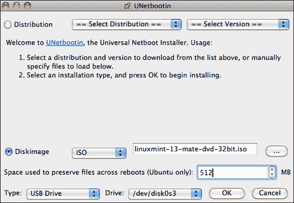
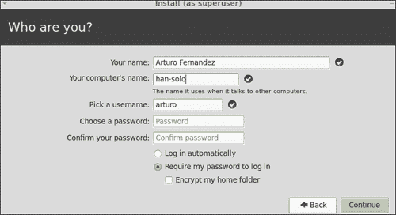
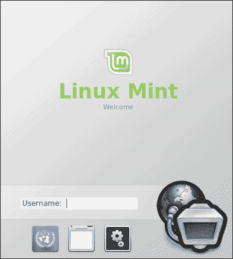

# 第二章. 安装 Linux Mint

*现在我们已经学习了 Linux Mint 项目和操作系统的理论基础，是时候开始做一些实际操作了。在我们开始在计算机上使用操作系统之前，我们需要安装它。这个说法并不完全正确；一些 Linux 发行版提供了一个现场版，允许您在不安装的情况下测试操作系统。Mint 也不例外，开发者分发 ISO 现场镜像。此外，操作系统可以通过提到的现场镜像进行安装。因此，我们将使用其中一个作为示例。在实践中，我们将了解如何在计算机上安装 Linux Mint。*

在本章中，我们将学习以下主题：

+   创建 Linux Mint 的可启动 USB 闪存驱动器

+   下载 Linux Mint MATE 13 ISO 镜像

+   从 USB 驱动器启动 Linux Mint

+   在计算机上安装 Linux Mint

+   登录系统

# 创建可启动 Linux Mint USB 闪存驱动器

我们将从 ISO 镜像安装 Linux Mint。因此，在开始安装过程之前，我们需要一个外部媒体来刻录该镜像。在第一章，*Linux Mint 简介*中，我们讨论了不同的 Linux Mint 版本或版本。用户可以根据经验、桌面和计算机架构选择自己的版本。为了简单起见，我们选择了 32 位的 MATE 版本，我们将使用该版本来学习如何安装操作系统。但是，创建可启动闪存驱动器和安装 Linux Mint 的过程与其他版本非常相似。

确保您有一个可用的 USB 闪存驱动器；您至少需要一个 2 GB 容量的。尽管有多种方法可以创建可启动 USB 设备，但我们将使用一个名为**通用网络安装程序**（**UNetbootin**）的程序。它是一个开源程序，您可以在 Mac OS X、Windows 和 GNU/Linux 版本中找到。这三个操作系统的操作过程是相同的，因此您可以选择您喜欢的操作系统。

# 行动时间——下载并刻录 ISO 镜像

为了创建我们的可启动设备，我们需要执行两个主要任务——下载 ISO 镜像，并使用 USB 闪存驱动器将其刻录：

1.  打开网络浏览器并输入网址[`mirror.umd.edu/linuxmint/images/stable/13/linuxmint-13-mate-dvd-32bit.iso`](http://mirror.umd.edu/linuxmint/images/stable/13/linuxmint-13-mate-dvd-32bit.iso)。

1.  将 ISO 镜像（`linuxmint-13-mate-dvd-32b.iso`）保存到您的硬盘上。

1.  在您的网络浏览器中打开一个新标签或页面，并输入网址[`unetbootin.sourceforge.net.`](http://unetbootin.sourceforge.net.)

1.  点击适用于您操作系统的按钮。

1.  将程序保存到您的硬盘上，然后安装并启动它。

1.  当您启动`UNetbootin`时，点击**磁盘映像**选项，并使用带有**…**标签的按钮选择下载的 ISO 镜像。

1.  在**跨重启保留文件空间（仅限 Ubuntu）：**输入框中输入一个大于`256`的数字。我们选择了**512**，这对于我们的目的来说足够了。

1.  在**类型**中选择**USB 驱动器**选项，选择您的驱动器单元，然后点击**确定**按钮。该过程将开始采取行动，如提取和复制文件，以及安装引导加载程序。当该过程完成后，您的闪存驱动器将准备好使用。

## *刚才发生了什么？*

正如您所发现的，`UNetbootin`是一个非常简单且有用的工具，用于从 ISO 映像创建可启动的 USB 驱动器。此外，它还可以用于从互联网下载特定的 GNU/Linux ISO 映像。实际上，可以通过此选项直接创建映像，而无需从系统文件中选择 ISO 文件。Debian、Ubuntu、Gentoo、Fedora 和 Mint 等都是`UNetbootin`支持的 GNU/Linux 发行版。然而，这个软件的最新版本不允许我们下载大于 10 的 Mint 版本。因此，我们选择从 Linux Mint 的官方镜像之一，通过网络浏览器下载特定版本。

填写**跨重启保留文件空间（仅限 Ubuntu）：**选项的输入框很重要，因为 Linux Mint 是基于 Ubuntu 的发行版。所选的 MB 数量取决于您的 USB 驱动器上的可用空间。这部分空间用于存储一些持久数据，如配置更改、保存的图片或数据库。得益于这种存储方式——您可以在不安装操作系统的情况下启动和使用实时操作系统。

请记住，创建可启动 USB 驱动器的过程在 Mac OS X、Windows 系列和 GNU/Linux 发行版上几乎相同。

# 从闪存驱动器安装 Linux Mint

现在我们有了可启动的 USB 驱动器，我们准备好启动和安装 Linux Mint 了。我们下载的版本是实时的。这意味着您可以在不安装的情况下在计算机上测试和使用操作系统。毫无疑问，这对于想要轻松尝试 Mint 的人来说是一个非常有趣的功能。然而，我们将学习如何在计算机上安装 Linux Mint。在继续之前，请确保您的计算机至少有 5.7 GB 的硬盘空间可用。

# 操作时间 – 启动和安装 Linux Mint

在开始之前，请确保您已准备好 USB Mint 可启动驱动器。

1.  将 USB 驱动器插入计算机。

1.  重新启动计算机并选择 USB 作为启动设备。

1.  启动后，您将看到一条消息，指示系统将在 10 秒内自动启动。在它发生之前，按*Enter*键。

1.  当启动闪屏窗口出现时，保留默认选项并按*Enter*键。

1.  在完成 Linux Mint 的启动过程后，您会看到带有几个图标的桌面。此时，Linux Mint 的实时模式已准备好使用，但我们继续点击**安装 Linux Mint**图标。

1.  在**欢迎**对话框中选择您的安装语言，然后点击**继续**按钮。

1.  现在，一个新窗口出现，它告诉我们所需的硬盘空间。点击**继续**按钮。

1.  Linux Mint 可以与其他操作系统安装在同一台计算机上。您可以选择默认选项或您自己的分区方案。为了简单起见，我们将选择默认选项擦除主硬盘。

1.  在下一个对话框中，**擦除磁盘并安装 Linux Mint**，选择默认硬盘，安装软件将询问您是否开始格式化硬盘。

1.  点击**立即安装**按钮，将显示一个新的对话框，供您选择时区。准备好后，点击**继续**按钮。

1.  选择您的键盘布局，然后点击**继续**按钮。

1.  选择您的用户名、密码和计算机名称，然后点击**继续**：

1.  现在，Linux Mint 将在您的计算机上安装所需的文件。当这个过程完成后，一个对话框会通知您。最后，拔出您的 USB 驱动器并点击**立即重启**按钮。

## *刚才发生了什么？*

Linux Mint 提供了一个完整且易于使用的向导，用于在计算机上安装操作系统。许多任务在幕后执行，对用户来说是透明的。

尽管向导会询问您一些配置系统的信息，但 Mint 会将文件复制到硬盘，检测硬件，配置`引导加载程序`并安装所有必需的软件。这个过程简单直接，因此用户不需要任何 Linux 发行版的经验来安装 Linux Mint。

然而，最复杂的步骤是在具有不同操作系统的计算机上尝试安装 Linux Mint。尽管如此，向导会为您做出决策；在开始格式化硬盘之前，确保您知道自己正在做什么可能会很有趣。此外，您可以选择自定义硬盘分区方案，这对高级用户非常有用。如果您不确定这类数据，最好将决策留给 Linux Mint 安装向导。在这种情况下，您可以选择默认选项。

通常，Linux Mint 会检测到您的所有硬件，但有时计算机使用与 Linux 不兼容的现代硬件。一些用户会遇到与此相关的问题，解决这些问题需要对 Linux 内核有高级知识。然而，在大多数情况下，Linux Mint 会正确检测和配置您的硬件。

如果您打算处理敏感数据，或者您只是希望保护您的个人数据免受其他用户的影响，您可以选择加密您的家目录。Linux 发行版使用位于`/home`目录内的特定文件夹来存储操作系统每个用户的数据。每个用户通过用户名被调用；因此对于用户名`joe`，`home`文件夹将是`/home/joe`。所有个人信息和自定义配置都将存储在该文件夹中，因此加密它可能是有价值的。请记住，在安装过程中您选择了一个用户名，Linux Mint 为您创建了该用户。该用户的名称将用于您的家目录。尽管如此，加密您的`home`文件夹被视为高级功能，这就是我们没有勾选相应复选框的原因。

# 启动 Linux Mint

安装过程完成后，是时候首次启动您的操作系统了。您不需要配置任何其他内容，但您应该学会如何启动并登录系统，然后再学习有关 Linux Mint 的更多内容和功能。

# 行动时间 – 首次启动 Linux Mint

启动并登录 Linux Mint 相当简单，您将在以下步骤中发现这一点：

1.  使用已安装 Linux Mint 的计算机启动。确保没有任何 CD、DVD 或 USB 驱动器连接。

1.  不要按任何键；Mint 将自动启动。

1.  启动 Linux Mint 后，将显示一个新的登录系统对话框。您应该输入在安装过程中选择的用户名和密码：

1.  一旦输入并接受了您的用户名和密码，Linux Mint 将登录到系统，您就可以开始使用它了！

## *刚刚发生了什么？*

启动过程始终相同，您必须在开始在计算机上使用 Linux Mint 之前进行身份验证，除非您在安装过程中选择了**自动登录**。如果您改变了对此功能的看法，不用担心；您可以在操作系统安装后选择不同的选项。

为了简化操作，Mint 开发者包含了一个自动启动过程。这个过程不显示任何菜单或按钮，但知道菜单存在是很好的，您可以选择不同的选项来执行其他操作，例如启动内存测试或进入称为**恢复**的特殊模式。

# 总结

在本章中，您已经学会了如何创建可启动的 Linux Mint USB 驱动器，以及如何安装和启动操作系统。

具体来说，我们涵盖了：

+   如何从下载的 Linux Mint ISO 镜像创建可启动 USB 驱动器

+   如何安装`Linux Mint MATE 32 位`版并如何启动它

+   如何登录系统

现在您准备好使用 Linux Mint 并发现其主要功能了。在下一章中，我们将专注于 Linux 发行版最重要的方面之一——shell。
