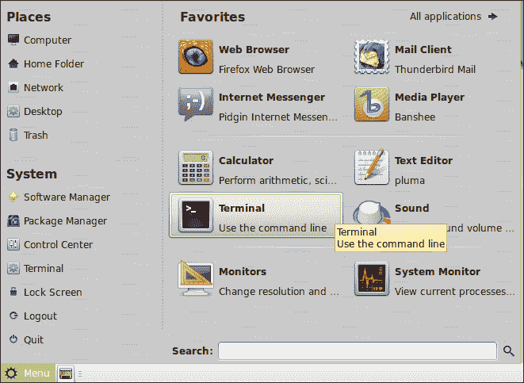
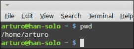
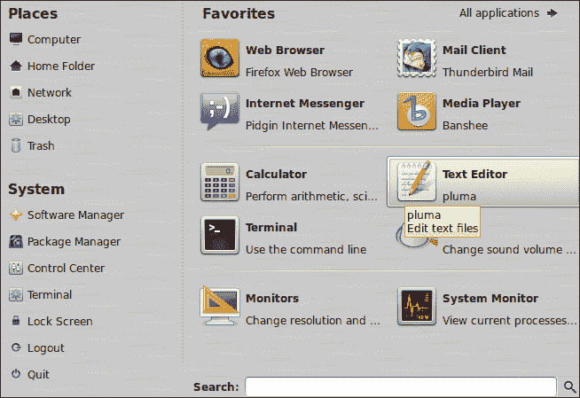
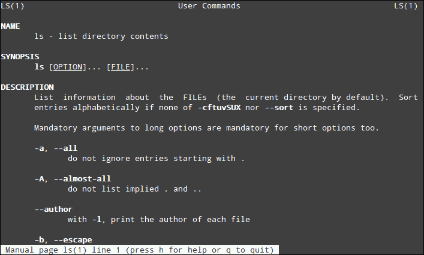
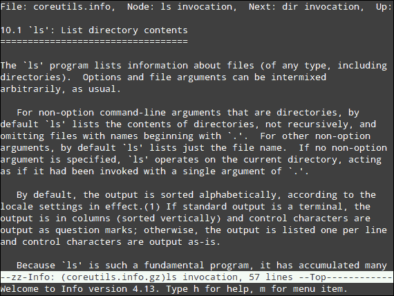

# 第三章：基本 Shell

*在上一章中，我们学习了如何安装 Linux Mint。一旦我们的操作系统安装在计算机上，我们就可以开始使用它了。首先，你需要了解什么是 shell，这是 Unix 和 GNU/Linux 操作系统中最重要的概念之一。然后，你将学习一些有趣的和基本的 shell 使用方法，包括一些执行应用程序、列出文件和在文件系统中查找文件的有用命令。此外，你还将了解一些关于 shell 编程的基本概念。*

本章将讨论以下主题：

+   Shell 基本概念

+   查找当前目录

+   如何运行命令和应用程序

+   查找 shell 命令的绝对路径

+   如何列出、检查和查找文件

+   学习重定向和管道

+   如何设置环境变量

+   查找之前执行过的命令

+   创建一个简单的 shell 脚本

+   如何获取帮助？

让我们先从学习什么是 shell 开始。

# 什么是 shell？

Shell 是 Unix 和 GNU/Linux 操作系统中最重要的组件之一。基本上，shell 是一种软件，它为用户提供了一个接口，允许与操作系统的内核进行通信。通过 shell，用户可以输入命令并执行程序。从技术角度来看，shell 只是一个可以代表用户执行其他程序的程序。通常，shell 被称为命令行界面，也称为**CLI**。

最初的 Unix 操作系统将 shell 与其他操作系统组件分开。这意味着 shell 是一个可以直接由用户启动的程序。然而，其他组件，如内存管理器、调度器和输入/输出系统，通过内核直接工作，无需用户交互。

第六版 Unix 包含了一个作为标准命令解释器的 shell。它的名字是**sh**，由 Ken Thompson 在贝尔实验室开发。后来，在 1979 年，当第七版 Unix 发布时，之前的 shell（sh）被一个新的 shell 取代，称为**Bourne shell**，由 Stephen Bourne 开发。几年后，Bill Joy 编写了一个新的 shell 并将其命名为**C shell**，也称为**csh**。Joy 在加州大学工作，他的 shell 成为了一个特定的 Unix 操作系统的一部分，称为**伯克利软件发行版**（**BSD**）。

在 20 世纪 80 年代中期，**Korn shell**（**ksh**）由 David Korn 开发，当时他在流行的 AT&T 贝尔实验室工作。尽管 ksh 与 Bourne shell 兼容，但它包含了一些对程序员和希望进行高级定制的人来说非常有用的额外功能。

大多数 GNU/Linux 发行版都包含一个作为 GNU 项目一部分编写的不同 shell，它的名字是**Bourne-Again shell**，通常被称为**bash shell**。GNU 项目开发者构建 bash 的目的是为了获得一个与 Bourne shell 兼容的 shell，这对用户和程序员都有用。

因此，bash 提供了 Bourne 功能的超集。由于 bash 目前非常流行，我们将更多地了解它。此外，Linux Mint 也不例外，它将 bash 作为其默认 shell。

Bash shell 包含可以直接输入的命令。这些命令帮助你执行有用且常见的操作，例如更改当前目录、显示文件内容或列出特定目录的内容。这些命令中的一些是内置于 bash shell 本身的；其他则是由 GNU/Linux 发行版包含的单独程序。这两类命令都被视为 bash 命令，你将在本章中学习其中的一些。

当你打开一个 shell 时，你会看到一些符号、一些文本和一个闪烁的光标，所有这些都被称为提示符，它表明 shell 已准备好，你可以开始输入命令了。提示符显示的信息类型取决于提示符的配置方式。基本上，你会发现有关你的用户名、机器名和当前目录的数据。通常，美元符号（`$`）作为数据和光标之间的分隔符，光标在你可以输入的位置闪烁。

# 你在哪里？

我们将开始使用 shell 并学习如何找出当前目录的位置以及如何从一个目录切换到另一个目录。此外，我们还将发现哪个应用程序为 Linux Mint 提供了命令行界面。

# 操作时间 – 学习 pwd 和 cd 命令

Linux Mint 使用的命令行界面由一个名为**MATE Terminal**的应用程序提供。我们将搜索它，启动它，然后我们将通过以下步骤学习和执行`pwd`和`cd`命令：

1.  点击位于桌面底部的**菜单**选项。

1.  点击后，会显示一个带有许多选项的新窗口菜单。在右手边的窗格中，你会看到一个名为**收藏夹**的区域；在那里，点击**终端**图标以启动 MATE Terminal，如下图所示：

1.  现在你通过 MATE Terminal 运行了一个 shell，你准备好输入并执行命令了。我们的第一个命令将是`pwd`，它返回当前目录的路径。直接在 MATE Terminal 窗口中输入`pwd`。

1.  当您启动 MATE Terminal 时，您的当前目录将是您的家目录；因此，**pwd**命令的输出将是该目录，如下面的截图所示：

1.  我们将更改当前目录，并通过使用以下命令将`/tmp`设置为新的当前目录：`arturo@han-solo ~ $ cd /tmp`。

1.  执行命令后，我们会发现提示符已更改，以指示我们的当前目录现在是`/tmp`，这可以通过查看`arturo@han-solo /tmp $`来看到。

## *发生了什么？*

由于我们使用的是 Linux Mint 的 MATE 版本，我们的默认命令行界面由 MATE Terminal 提供。不过，其他版本也包含类似的程序。例如，Cinnamon 提供 GNOME Terminal 作为其默认 CLI 应用程序。

MATE Terminal 为我们提供了访问 shell 的途径，我们可以通过它启动命令和程序。实际上，MATE Terminal 使用具有图形用户界面的窗口提供基于文本的命令行界面。我们已经学会了显示当前目录的第一个命令。这一操作很重要，因为某些其他命令的输出取决于该目录。

`cd`命令对于更改当前目录并在文件系统中将其他目录设置为新的当前目录非常有用。传递给`cd`命令的第一个参数是您希望设置为新当前目录的目录路径。

重要的是要知道`~`符号标识您的家目录，因此您可以使用它作为快捷方式，而不是输入完整路径。

请记住，您的提示符看起来会有所不同，因为您的用户名和机器名将与我的不同。在我们的示例中，用户名是`arturo`，机器名是`han-solo`。是的，您猜对了，我是一个星战迷！

## 动手实践 – 使用快捷方式访问您的家目录

尝试执行不带参数的`cd`命令，您会发现当前目录如何更改为您的家目录。以下是快速更改到该目录的快捷方式：

```
arturo@han-solo /tmp $ cd
arturo@han-solo ~ $

```

MATE Terminal 可以通过多种方式进行配置和定制。例如，您可以更改字体类型和大小，并设置特定的颜色方案。您可以从**编辑**选项中查看**配置文件首选项**菜单。

# 运行命令

正如您所学到的，shell 允许我们直接与计算机操作系统通信。这一操作帮助我们启动命令和应用程序。之前，您了解了如何启动`cd`和`pwd`等命令。为了做到这一点，您只需输入每个命令，然后按下*Enter*键。然而，有些命令用于使用完整路径调用程序。现在您将学习如何做到这一点。

# 行动时刻 – 从命令行启动程序

假设有一个名为`testme`的程序存在于`/tmp`目录中。我们可以通过以下步骤调用这个程序：

1.  使用 MATE Terminal 应用程序打开一个 shell。

1.  输入`/tmp/testme`并按*Enter*。

1.  程序的输出将在 shell 上显示。如果调用的程序有一个图形用户界面，将会打开一个新的窗口。

## *刚才发生了什么？*

当你输入一个命令时，它会直接执行，因为存在一个环境变量来查找所有可执行的文件。那个变量的名称是`$PATH`，它的值指示了 shell 应该在哪里查找可执行文件。命令和应用程序是可执行文件，但并非所有这些文件都位于与`$PATH`关联的目录中。这就是为什么需要使用完整路径来调用任何文件的原因。遵循这一规则，我们通过其路径名调用了`testme`文件。

操作系统如何知道哪些文件是可执行的？很简单，可执行文件使用一个特定的标志来向操作系统指示这一属性；shell 知道这一点，并且可以轻松地执行它们。

如果你的当前目录是可执行文件所在的位置，你可以使用一个点加一个斜杠（`./`），后面跟着文件名来调用它。多亏了这个技巧，你不需要使用完整路径或修改`$PATH`变量。例如，我们的示例`testme`命令可以通过以下命令调用：

```
arturo@han-solo ~ $ cd /tmp
arturo@han-solo /tmp $ ./testme

```

一些命令和程序允许我们传递额外的参数；每个参数前面必须有一个空格。我们将在后面学习这些类型的命令（至少一些命令）。

## 试试看 – 不使用完整路径执行程序

你可以尝试修改`$PATH`以添加`/tmp`目录，然后你可以直接调用`testme`命令而不使用其完整路径。关于如何设置环境变量，请参阅本章稍后的*设置环境变量*部分了解更多信息。

# 搜索命令

有时查找一个命令或可执行文件的完整路径是很重要的，这可以通过`$PATH`变量找到。执行此操作最有用的命令是`which`，因此我们将解释如何使用它。

# 行动时间 – 使用 which 命令

在继续之前，请确保你已经启动了 MATE Terminal。然后执行以下步骤：

1.  输入以下命令：

    ```
    arturo@han-solo ~ $ which find

    ```

1.  `which`命令将显示以下输出：

    ```
    /usr/bin/find

    ```

## *刚才发生了什么？*

`which` shell 命令包含在大多数 GNU/Linux 发行版中，甚至在 Linux Mint 中。多亏了这个命令，我们可以获取一个命令或可执行文件的完整路径，该路径可以通过`$PATH`变量找到。另一方面，`find`命令是一个用于查找文件的程序；你将在本章中了解更多关于它的信息。

# 列出、检查和查找文件

文件是存储信息的持久资源。图像、声音、程序和命令使用文件，这些文件可以由用户管理。因此，学习如何通过我们的 shell 列出、检查和查找文件是很重要的。

# 行动时间 – 使用 ls、locate、find 和 cat 命令

我们将使用一些命令，如`find`、`locate`、`cat`和`ls`。最后一个用于显示目录的内容，而`find`和`locate`命令用于在我们的文件系统中查找文件。`cat`命令用于获取文件内容作为输出。不要忘记确保您的 shell 正在运行。

1.  首先，我们将直接从我们的主目录执行`ls`；我们只需要在我们的命令行界面中输入`ls`。

1.  前一个命令的输出将类似于这样：

    ```
    Desktop  Documents  Downloads  Music  Pictures  Public  Templates  Videos

    ```

1.  现在，我们将继续寻找所有带有`.conf`扩展名（`*.conf`）的文件，位于`/etc/ufw`目录中，使用以下命令：

    ```
    arturo@han-solo ~ $ find /etc/ufw -name '*.conf'

    ```

1.  作为`find`命令的输出，您将找到您的主目录中所有带有`.conf`扩展名的文件：

    ```
    /etc/ufw/sysctl.conf
    /etc/ufw/ufw.conf

    ```

1.  `locate`命令在我们知道要查找的文件名时使用。想象一下，您想查找`.bash_history`文件，但不记得文件所在的目录；在这种情况下，您可以使用以下命令：

    ```
    arturo@han-solo ~ $ locate .bash_history

    ```

1.  最后执行的命令的结果将是以下行：

    ```
    /home/arturo/.bash_history

    ```

1.  最后，我们将使用`cat`命令来显示文本文件的内容。让我们列出文件系统中与您的网络接口相关的信息，使用以下命令：

    ```
    arturo@han-solo ~ $ cat /etc/network/interfaces

    ```

1.  因此，您将得到`/etc/network/interfaces`文件的内容显示为：

    ```
    auto lo
    iface lo inet loopback

    ```

## *刚刚发生了什么？*

`find`和`locate`命令在您需要查找文件或一组文件时非常有用。每个命令可以使用不同的参数，我们已经学习了它们的基本用法。重要的是要知道`find`命令从当前目录开始搜索。然而，`locate`使用特定的数据库进行搜索，而不考虑当前目录。这意味着`locate`可以找到不在当前目录中的文件。两个命令都使用基于模式的搜索算法。记住，我们使用`*.conf`模式作为`find`命令的参数。

`ls`命令是 Linux 系统中最常用的命令之一，因为它提供了关于目录内容的基本信息。通常，在通过 shell 采取行动之前，您需要这些信息。此命令支持许多不同的参数，允许您获取关于目录内容的各类信息。

作为打印文本文件内容的一部分，`cat`命令可以连接不同文件的内容，从而直接在 shell 上显示所有信息。每个文件都可以作为参数传递给`cat`命令。

## 动手实践 – 在列出文件时获取更多信息

如果您想获取目录中每个文件的更多信息，可以尝试使用带有`-l`参数的`ls`命令，如下所示：

```
arturo@han-solo ~ $ ls -l

```

此外，执行`find`命令并传递一个不同于 JPEG 的扩展名作为参数也可能会很有趣。

还有两个命令可以帮助您显示文本文件的内容——`more`和`less`。这两个命令允许您在屏幕上阅读内容，而不会意外修改。您只需将文本文件的名称作为参数传递给这些命令。

# 管道和重定向

在 Unix 和 GNU/Linux 操作系统中，将一个命令的输出用作另一个命令的输入是非常常见的。由于这一概念，我们可以在 shell 中仅用一行创建一系列命令的组合。我们将使用一个简单的示例来说明管道的使用。具体来说，我们将在文本文件中查找一个字符串。

重定向是另一种强大且常用的技术，它允许我们将命令的输出附加到机器文件系统中可用的任何其他文件。为了简化操作，我们将仅创建一个包含当前日期的文本文件。

# 行动时间 – 使用管道和重定向应用不同的命令

让我们开始了解管道是如何工作的：

1.  在您的 shell 中输入以下命令：

    ```
    $ cat mytext.txt | grep This

    ```

1.  您将得到以下输出：

    ```
    This is the content for the mytext.txt file

    ```

1.  现在，我们将使用重定向来创建一个包含一些内容的新文件：

    ```
    $ date > current_date.txt

    ```

1.  使用以下命令检查新文件以确保内容有效：

    ```
    $ cat current_date.txt
    Sat Sep 23 14:41:29 CEST 2012

    ```

## *刚刚发生了什么？*

尽管我们使用简单的示例来理解管道和重定向，但通过这些技术可以创建复杂的命令。这取决于用户的技能和经验。

正如您可能已经意识到的，我们使用`|`字符来表示我们将使用管道。我们可以多次使用该字符与不同的命令。

至于重定向，`>`字符用于将命令的输出存储在文件中。另一方面，`date`是一个简单的应用程序，用于获取当前日期。最后，`cat`命令帮助您打印名为`current_date.txt`的新文件的内容。

## 动手实践 – 使用重定向将内容追加到文件

与其创建新文件，不如将内容追加到现有文件中；您只需使用`>>`字符。例如，我们可以通过以下命令向现有文件添加更多内容：

```
$ echo 'More text' >> current_date.txt

```

# 设置环境变量

环境变量定义了可以影响操作系统中运行的程序和命令行为的一些方面。每个环境变量都有一个可以动态地通过 shell 改变的值。通常，操作系统会创建并设置一些环境变量，但用户可以更改这些变量并添加新的变量。默认应用程序（如网络浏览器、文本编辑器和音乐播放器）可以使用环境变量来定义。shell 使用这类变量来获取用户环境的信息，并将这些数据设置给命令和程序。我们将学习如何获取和设置特定环境变量的值。

# 行动时间 – 设置 PATH 环境变量

执行以下步骤来设置`PATH`环境变量：

1.  启动 MATE Terminal，准备好输入一些命令。

1.  输入以下命令：

    ```
     $ PATH=$PATH:/tmp

    ```

1.  使用以下命令获取`PATH`变量的值：

    ```
    $ echo $PATH

    ```

1.  你会得到类似这样的结果：

    ```
    /usr/local/sbin:/usr/local/bin:/usr/sbin:/usr/bin::/sbin/bin:/usr/games:/tmp

    ```

## *发生了什么？*

环境变量的值是直接设置到 shell 中的；我们只需要使用`=`字符加上变量的期望值。在我们的例子中，我们使用了`PATH`变量并添加了一个新值，即`/tmp`目录。显然，我们本可以使用一个更简单的值，但在`PATH`的情况下，我们还想保留它的原始值。

`echo`命令接受任何类型的字面量作为参数，并将该字面量输出到标准输出。如果你想获取一个环境变量的值，你应该在其前面加上`$`符号。因此，`echo $PATH`命令将输出`PATH`环境变量的值。

## 尝试一下 – 学习 export 命令

你可以获取不同的环境变量（如`HOME`、`TERM`和`EDITOR`）的值。此外，你还可以动态地改变它们的值。

如果你想让一个环境变量的值在从原始 shell 创建的新 shell 中可用，你应该使用`export`命令：

```
$ export TERM=/bin/bash

```

# 显示命令历史

通常，使用 shell 工作的人会执行很多命令，因此获取执行过的命令历史非常有用。多亏了`history`命令，我们可以找出之前执行过哪些命令。

# 行动时间 – 使用 history 命令

我非常确定你已经执行了一些 shell 命令，所以我们可以直接使用`history`命令：

1.  在 shell 中输入`history`。

1.  根据你过去输入的命令，你会得到一个类似下面的列表：

    ```
    cd /tmp
    which find

    ```

## *发生了什么？*

你在 shell 中输入的每个命令都会被存储在一个名为`.bash_history`的文件中，`history`命令会读取这个文件来向你展示之前执行过的命令的信息。操作系统为每个用户存储一个`.bash_history`文件，这个文件位于用户的家目录中。

## 尝试一下 – 检查执行过的命令历史

如果你正在寻找之前执行过的命令，你可以结合使用 `history` 和 `grep` 命令以及管道来获取这些信息。假设你想知道之前执行过哪些 `cd` 命令；在这种情况下，你可以输入以下命令：

```
$ history | grep cd

```

此外，左右光标键可以让你在最近执行的命令之间导航。

# 创建你的第一个 shell 脚本

到目前为止，我们已经通过直接在 shell 中输入命令并按下 *Enter* 来执行命令，但也可以使用文本文件来编写一组命令并通过 shell 启动该文件。这种技术允许我们创建脚本或小型应用程序来执行命令或执行不同的 shell 操作。实际上，Bash shell 为我们提供了一个特定的领域特定编程语言来实现这一目的。尽管这种特定编程语言的学习曲线并不简单，但我们将学习如何创建一个简单的 Bash 脚本来使用控制结构执行一些命令。

在我们的示例中，我们将创建一个脚本来检查文本文件是否存在。如果答案是肯定的，我们将显示一条消息告知你。否则，我们将创建一个只有一行的新文本文件。最后，无论发生什么，我们都将列出创建的文本文件。

# 操作时间 – 创建和执行 shell 脚本

我们需要使用文本编辑器；当然，你可以使用你喜欢的任何一款。Linux Mint 提供了几种文本编辑器，如 Vim、Emacs 和 Pluma。后者具有图形用户界面，并且默认安装，因此我们将使用它来完成我们的工作。以下是如何开始的方法：

1.  点击 **菜单** 按钮，然后点击 **文本编辑器** 菜单选项，如下面的截图所示：

1.  将显示一个新窗口，你就可以开始使用 Pluma 了。输入以下行，并在准备好后将文件保存为 `myscript.sh`：

    ```
    #!/bin/bash
    if [ -f "myfile.txt" ]
    then
     echo "Sorry, file already exists."
    else
     echo "Content for file" > myfile.txt
    fi
    ls -l myfile.txt

    ```

1.  给你的新 shell 脚本赋予执行权限：

    ```
    $ chmod +x myscript.txt

    ```

1.  启动你的脚本：

    ```
    $ ./myscript.sh

    ```

1.  最后一个命令的输出应该类似于这样：

    ```
    -rw-rw-r--. 1 arturo arturo 17 Oct 20 11:12 myfile.txt

    ```

1.  此外，你可以使用 `cat` 命令来检查创建的文件内容：

    ```
    $ cat myfile.txt

    ```

## *刚刚发生了什么？*

所有 shell 脚本都是纯文本文件，因此你可以使用任何文本编辑器来编写这类程序。shell 脚本的第一行应该指明将用于执行脚本的 shell 类型。Linux Mint 默认的 shell 是 Bash，因此我们将使用它来编写我们的 shell 脚本。这就是在我们的 shell 脚本第一行使用 `/bin/bash` 可执行文件的原因。你可能已经意识到，那一行中使用了两个特殊符号。

第一行表示该行是注释，第二行用于确定应该执行 shell 脚本的 shell 类型。`if`语句是条件性的，它会检查某个条件是否满足。在我们的例子中，它检查`myfile.txt`是否存在。如果答案是否定的，将执行`else`语句，在这里我们将使用`echo`命令创建一个新文件，并将输出重定向到该文件。最后，shell 脚本的最后一行将被执行，而不受条件语句的影响。为了验证这一事实，你可以两次运行该命令；你会发现输出是不同的，因为第二次文件将存在，因为它之前已经被创建了。

在第三步中，我们使用了一个名为`chmod`的命令，它对于更改文件权限非常有用。我们将在下一章中了解更多关于这个命令的信息，但在我们的 shell 脚本中，我们只为它添加了执行权限。一旦我们的 shell 脚本拥有这种权限，我们就可以直接通过命令行调用它。

## 动手实践 – 学习高级 shell 编程

尽管我们的例子非常简单，但你可以通过以下资源了解更多关于 shell 编程的知识：

+   *Bash 编程 – 入门指南*，来自[`bit.ly/x24V3`](http://bit.ly/x24V3)

+   *高级 Bash 脚本指南*，来自[`tldp.org/LDP/abs/html/`](http://tldp.org/LDP/abs/html/)

+   *Debian Bash 编程指南*，来自[`bit.ly/Qs12TQ`](http://bit.ly/Qs12TQ)

# 如何获取帮助

由于`man`和`info`这两个命令，获取关于 shell 命令和一些可执行文件的帮助变得容易。它们都包含在 Linux Mint 中；让我们来探索如何使用它们。

# 行动时间 – 使用 man 和 info 命令

按照以下步骤更好地理解如何使用`man`和`info`命令：

1.  再次确保你的 shell 正在运行。

1.  执行以下命令以获取有关`ls`命令的信息：

    ```
    arturo@han-solo ~ $ man ls

    ```

1.  以下截图展示了之前执行的命令的输出：

1.  现在，是时候测试`info`命令了：

    ```
    arturo@han-solo ~ $ info ls

    ```

1.  执行`info`命令后，你将获得以下信息：

## *刚刚发生了什么？*

`man`命令为你提供了大量关于可执行文件或 bash 命令如何工作的信息。作为参数，`man`命令接收 bash 命令或可执行文件的名称以显示信息。该命令读取一个或一组特定格式的文件，以便开发者可以使用该格式为程序包含文档。

此外，`info`命令显示了有关命令的一些有用信息。然而，`info`使用的文档格式与`man`不同。正如你可能注意到的，尽管我们为这两个命令使用了相同的参数，但它们的输出是不同的。有些用户更喜欢`man`，而其他用户则更喜欢`info`，但基本上两者都提供了类似的信息。

# 总结

在本章中，我们学习了很多关于 shell 和基本命令的知识，包括如何创建一个简单的 shell 脚本。具体来说，我们涉及了以下内容：

+   通过 MATE 终端应用程序使用 shell 的基本操作

+   查找当前 shell 指向的目录

+   运行可执行命令和文件

+   获取由`PATH`环境变量引用的命令和可执行文件的完整路径

+   如何使用`ls`命令列出文件

+   如何使用`find`和`locate`命令查找文件

+   如何通过`cat`命令显示文本文件的内容

+   使用管道和重定向技术

+   设置`PATH`环境变量

+   如何使用`history`命令查找之前执行过的命令

+   Shell 编程基础

+   如何获取有关 shell 及其命令的帮助

一旦你了解了基本的 shell 概念和命令，你就可以准备学习系统管理员最重要的任务之一——如何创建用户账户。
