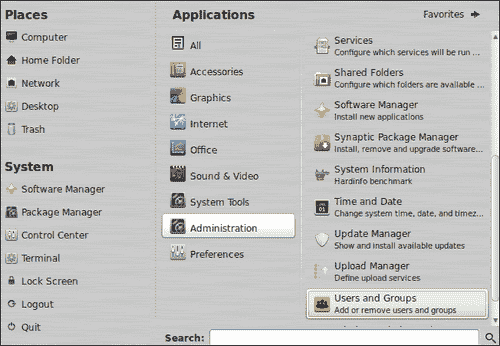
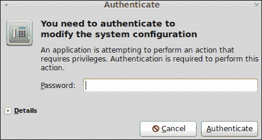
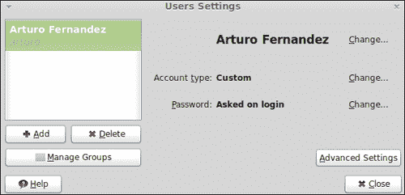
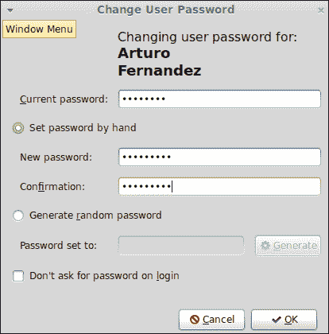
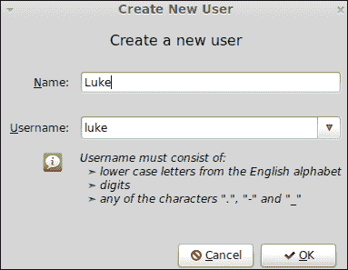
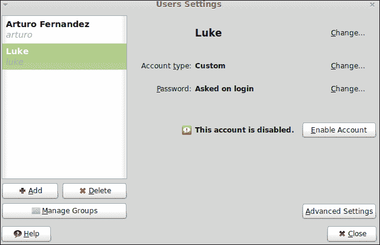
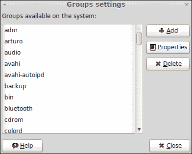
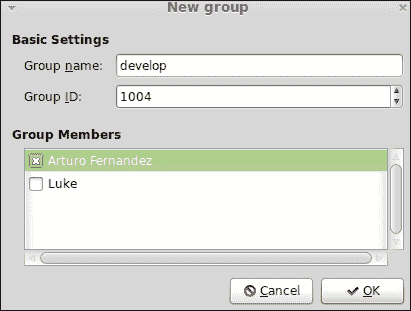
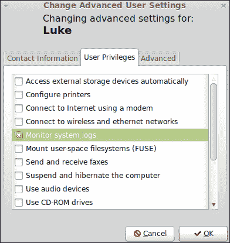

# 第四章：账户配置

*创建用户和组是系统管理员最重要的基本任务之一。在学习更高级的概念之前，了解如何处理用户账户和组是至关重要的。*

在本章中，我们将学习以下内容：

+   找出当前用户

+   成为 root 用户

+   更改用户密码

+   添加新用户

+   添加新组

+   将用户添加到特定组

+   更改用户权限

# 我是谁？

访问 Linux Mint 需要用户账户。实际上，当你安装操作系统时，你输入了有关用户的一些数据，并创建了他或她的账户。有时系统管理员需要成为系统上的另一个用户，因此了解当前使用 shell 的用户是谁很有趣。我们将解释如何做到这一点。

# 行动时间 – 找出当前用户

在继续之前，你应该启动**MATE 终端**应用程序。

1.  在 shell 中输入以下命令：

    ```
    $ whoami

    ```

1.  作为先前执行的命令的输出，你将获得当前使用 shell 的用户的名称；在我们的情况下，将是以下内容：

    ```
    arturo

    ```

## *刚才发生了什么？*

你已经学会了如何使用`whoami`命令来识别当前登录并使用 shell 的用户。这个命令非常简单，它只返回用户名而不带额外信息。

# 成为 root 用户

每个 GNU/Linux 操作系统都有一个超级用户，称为**root**。这是系统管理员使用的操作系统的一个特殊用户。root 用户对文件和程序拥有各种权限。实际上，某些特定操作只能通过此用户执行。

Linux Mint 默认不启用 root 用户。然而，Mint 使用特殊命令允许用户成为 root 用户。这意味着普通用户可以执行最初为 root 用户保留的操作。此外，Mint 配置了`sudo`命令，允许在安装过程中创建的用户成为 root 用户。

# 行动时间 – 使用 sudo 命令成为 root 用户

我们将使用`sudo`命令通过 shell 成为 root 用户：

1.  打开**MATE 终端**应用程序。

1.  输入以下命令并在准备好时按*Enter*键：

    ```
    arturo@han-solo ~ $ sudo su -

    ```

1.  将显示一个新的提示消息，询问你的密码：

    ```
    [sudo] password for arturo:

    ```

1.  输入你的密码并按*Enter*键，你将得到一个新提示，如下所示；当前用户是 root：

    ```
    @han-solo ~ #

    ```

## *刚才发生了什么？*

`sudo`命令允许您以另一个用户身份执行命令。Linux Mint 默认配置允许在安装过程中创建的用户直接成为 root 用户。您只需执行`sudo`命令，将`su -`作为参数传递。第一个参数标识 root 用户，第二个参数表示应执行`root`的 Bash 初始化文件。请记住，`sudo`命令会要求您输入执行该命令的用户的密码。

您肯定已经意识到，成为`root`后提示符是不同的。`#`符号用于表示当前用户是`root`，而不是用于系统普通用户的`$`字符。

## 动手实践 – 成为 root 用户后执行 whoami 命令

尝试在成为`root`后执行`whoami`命令以检查当前用户。该命令的输出将是`root`。

# 更改密码

在某些情况下，系统管理员需要更改用户的密码。例如，当用户忘记自己的密码时，他可以向系统管理员请求新密码。

创建用户时应该提供密码，但每个用户在首次访问系统时应该更改自己的密码。

更改自己的密码并不难；您可以通过 Linux Mint 默认安装的一个简单应用程序来完成。

# 操作时间 – 为用户更改密码

系统中的每个用户都可以使用 Linux Mint 提供的 GUI 应用程序更改自己的密码。我们将学习如何做到这一点。

1.  点击**菜单**按钮，然后在**收藏夹**窗格右侧点击**所有应用程序**按钮。

1.  点击**管理**菜单选项。

1.  将显示一组新选项，您只需点击**用户和组**菜单选项，如下面的截图所示：

1.  点击**用户和组**后，将显示一个要求您输入密码的对话框。输入您的密码并点击**认证**按钮：

1.  如果您的密码正确，将显示一个新窗口。这是 Linux Mint 处理用户和组的应用程序：

1.  点击靠近**密码：登录时询问**选项的**更改...**按钮。

1.  接下来的窗口允许您更改密码。首先，您应该输入当前密码。然后，您可以选择**手动设置密码**选项，并在**新密码**和**确认**输入框中输入您的新密码。准备好后，点击**确定**按钮：

1.  现在，将显示一个要求您确认的对话框；点击**是**，您的密码将被更改。

## *发生了什么？*

更改密码非常简单，这要归功于 Linux Mint 提供的 GUI 应用程序。在幕后，Mint 调用`passwd`命令来应用您的更改，允许您更改密码。

**用户和组**应用程序允许您执行与用户和组相关的更多操作。其中一些操作只能由`root`执行，因此在继续之前您应该验证此用户。

在更改密码的同一对话框中，您还可以选择是否希望在登录时使用/不使用密码。另一方面，应用程序可以自动生成随机密码。您只需选择**生成随机密码**选项，然后点击**生成**按钮。

## 动手实践 – 使用 passwd 命令

您可以通过在命令行直接使用`passwd`命令来更改密码。只需输入命令并按照屏幕上的指示操作即可。

此外，您还可以更改其他用户的密码。为此，您必须成为 root 用户并执行`passwd`命令，将需要更改密码的用户的用户名作为参数传递。

# 添加新用户

作为系统管理员，最常见的任务之一是为系统创建新用户。多亏了 Linux Mint 中包含的**用户和组**应用程序，这是一项简单的任务。现在您将了解如何创建新用户。

# 操作时间 – 为用户更改密码

我们需要启动**用户和组**应用程序，因此请确保该应用程序正在运行。我们的目的是创建一个名为`Luke`的新用户，其用户名为`luke`。

1.  点击主窗口左侧的**添加**按钮。

1.  将显示一个对话框；输入您的密码并点击**Authenticate**按钮。

1.  现在您可以看到一个带有两个不同输入框的新窗口，一个用于姓名，另一个用于用户名。在第一个框中输入`Luke`，在第二个框中输入`luke`。准备好后点击**OK**按钮：

1.  将显示一个新窗口，要求您为新用户选择密码。输入新密码或选择**生成随机密码**选项。点击**OK**按钮继续。

1.  因此，您将看到新用户显示在系统用户列表中：

1.  如果您查看新用户的数据，您会发现一条消息，告知您新用户的帐户已被禁用，因此我们需要通过点击**启用帐户**按钮来激活它。

1.  点击**启用账户**按钮后，将显示一个更改密码的窗口。再次更改密码并点击**确定**按钮。现在，账户已启用。

## *刚才发生了什么？*

我们刚刚通过一个简单的流程创建了一个新的用户账户。图形用户界面非常直观，允许我们为新用户选择一个名称和用户名。每个用户都应该有一个密码，因此我们需要为新用户输入一个密码。出于安全原因，新账户被禁用，您必须激活每个账户，更改密码。

## 动手试试 – 尝试删除一个用户

此外，您还可以通过**用户和组**工具中列出的每个用户的**删除**按钮删除用户账户。如果点击该按钮，将显示一个新的对话框，询问您是否确认删除指定的用户。

# 添加一个新组

在 GNU/Linux 系统中，用户可以被分类到组中。基本上，**组**是一组共享权限的用户。组允许系统管理员以有组织的方式处理用户。例如，一个特定的组可以访问某些目录。这意味着属于该组的所有用户都可以访问这些特定的目录。

Linux Mint 默认使用许多组；其中一些是**音频**、**备份**、**游戏**、**irc**和**lp**。此外，还可以创建额外的自定义组。我们将学习如何做到这一点。

# 操作时间 – 创建一个名为 develop 的新组

我们将继续使用图形用户界面应用程序来管理用户和组，因此在继续之前请确保它正在运行。我们将创建一个名为`develop`的新组。

1.  点击**管理组**按钮。

1.  将显示一个显示所有现有组的新窗口。点击**添加**按钮继续。

1.  输入您的密码并点击**认证**按钮。现在您可以看到一个名为**新组**的新窗口。

1.  在**组名**输入框中输入`develop`，然后点击**确定**按钮，如下面的截图所示：

1.  因此，您可以看到新开发的组如何在现有组的列表中显示。

## *刚才发生了什么？*

创建新组的窗口允许我们为该组选择一个组名和组 ID。这个数字标识每个组，并且必须在系统中创建的每个组中都不同。Linux Mint 将为每个新组默认选择一个组 ID，但您也可以选择一个不同的数字。

在创建新组时，也可以直接向其中添加用户。将显示一个用户列表，以便您可以选择其中一些用户，Mint 将自动将该用户添加到新组中。

## 动手试试 – 尝试删除一个组

删除一个组相当容易；只需选择一个组，然后点击**删除**按钮。在执行此操作之前，你需要确认删除操作。别忘了，你需要点击**管理组**按钮才能访问系统上的组列表。

# 将用户添加到组

如果需要将用户添加到组中，你可以轻松完成。只需访问组属性，然后选择哪些用户应该属于指定的组。

# 行动时刻 – 将用户 luke 添加到 develop 组

再次确认，**用户和组**工具正在运行。我们将把用户**luke**添加到之前创建的**develop**组中。

1.  点击**管理组**按钮。

1.  选择**develop**组，然后点击**属性**按钮。

1.  一个新窗口显示了所选组的属性，包括用户列表。从列表中选择**luke**，然后点击**确定**按钮。

1.  在模态窗口中使用密码进行身份验证，然后点击**身份验证**按钮。

1.  用户**luke**已被添加到**develop**组。

## *发生了什么？*

在访问组属性时，我们可以选择将用户添加到组中。你可以从所选组的属性窗口中显示的现有用户列表中选择一个或多个用户。

# 更改用户权限

Linux 和 Unix 操作系统使用**用户权限**的概念，这是一种执行操作的权利或授权。因此，用户需要**权限**或**许可**来创建或删除文件、访问打印机或执行命令。

操作系统提供了一组用户和组，它们对文件、目录和设备具有某些权限。然而，系统管理员可以修改此默认配置。此外，还可以为自定义用户和组分配特定权限。

Mint 提供了一个图形工具，方便管理用户权限。我们将学习如何使用它。

# 行动时刻 – 授予用户监控系统日志的权限

我们将授予用户**luke**监控系统日志的访问权限。这是一个简单的例子，用以说明如何更改用户权限。显然，你可以采取类似步骤来更改不同的权限：

1.  启动**用户和组**工具。

1.  从用户列表中选择用户**luke**，然后点击**高级设置**按钮。

1.  当对话框要求输入密码时，请输入你的密码。

1.  点击**确定**按钮后，选择**用户权限**选项卡。

1.  现在你有一份可以授予或撤销用户**luke**的权限列表。选择**监控系统日志**，然后点击**确定**按钮，如下面的截图所示：

1.  此时，用户**luke**已准备好阅读用于监控系统的特殊文件。

## *发生了什么？*

通过**用户和组**工具提供的高级设置，允许你以非常简单和高效的方式管理每个用户的权限。你有一系列权限可以应用于每个用户。使用自然语言，因此你不需要了解高级概念就能为用户分配权限。

## 动手实践 – 使用命令行更改权限

尽管 Mint 提供了图形工具来处理用户权限，但你也可以使用 shell 来实现相同的目的。最有用的命令之一是`chmod`，它允许你更改文件和目录的权限。此外，通过`chown`命令，你可以决定特定文件或目录的所有者是谁。

如果你对这两个命令都感兴趣，你应该使用`man`和`info`命令来获取更多信息关于`chmod`和`chown`命令。

对于权限和用户，Mint 提供了三种预定义的账户类型，即**自定义**、**管理员**和**桌面用户**。你可以为每个用户选择其中之一；**账户类型**选项提供了这一功能。

# 总结

在本章中，你学习了账户配置的基本操作。

具体来说，我们涵盖了：

+   发现当前用户

+   如何创建用户和组

+   将用户添加到组

+   成为 root 用户

+   更改用户密码

+   更改用户权限

至此，你已经学习了关于如何使用 shell 和如何创建用户账户的基本概念和想法。现在是时候学习系统管理员日常工作中非常重要的一项技能——如何安装和配置软件。
