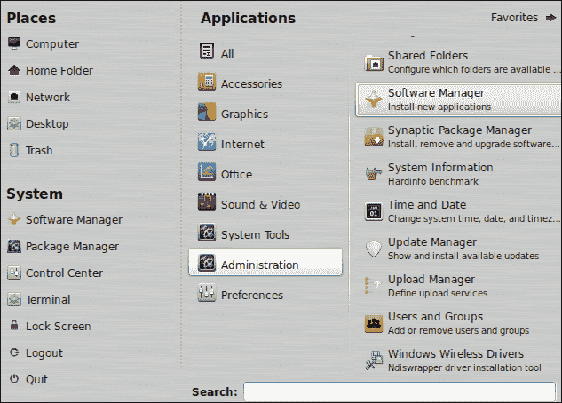
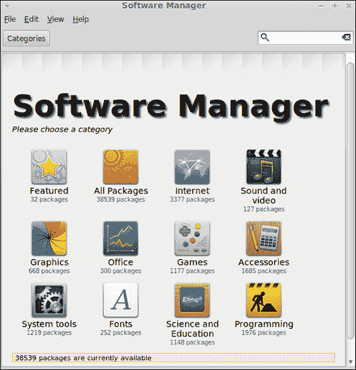
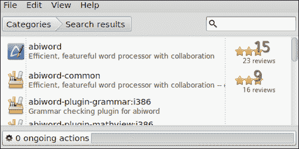
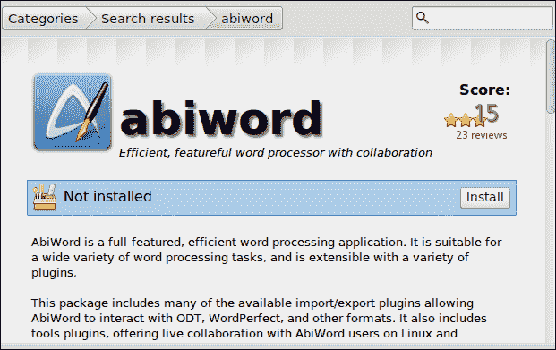
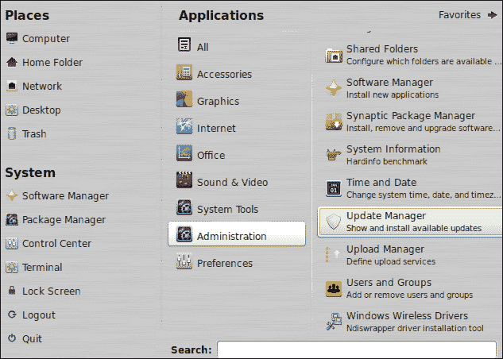
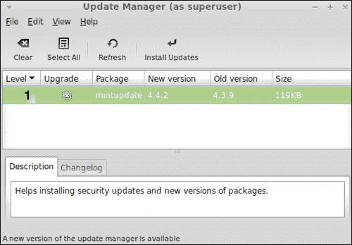

# 第五章：安装、卸载和升级软件

*在本章中，你将学习系统管理员最重要的基本任务之一。这些任务与软件相关，特别是如何安装、卸载和保持操作系统更新。*

在本章中，我们将学习：

+   安装软件

+   卸载已安装的软件

+   应用升级

# 安装软件

系统管理员迟早需要在至少一台机器上安装软件。事实上，这是这类操作系统用户最常见的任务之一。Linux Mint 包含数千个可以轻松安装的软件应用程序。请记住，当你安装操作系统时，默认会安装大量软件。此外，还可以安装 Linux Mint 提供的额外软件。为了简化在 Linux Mint 中安装软件的过程，该操作系统包含了一个名为**软件管理器**的工具。

# 行动时间 – 安装 AbiWord 文字处理器

我们将使用软件管理器应用程序安装名为**AbiWord**的文字处理器（[`www.abisource.com`](http://www.abisource.com)）。让我们看看这是如何完成的：

1.  点击**菜单**按钮，然后点击**所有应用程序**按钮，该按钮位于**收藏夹**窗格的右侧：

1.  查找**管理**菜单选项，然后点击**软件管理器**菜单选项；然后将显示一个新窗口：

1.  在**软件管理器**主窗口右侧的文本框中输入**abiword**，然后准备好后按*Enter*。

1.  现在，你可以看到一个包含许多与你搜索相关的软件的列表。实际上，列表的第一个结果就是我们想要安装的文字处理器，如本截图所示：

1.  双击一个项目将显示有关所选项目的信息：

1.  现在，你可以点击**安装**按钮。这样做将启动 AbiWord 的安装过程。你可以看到一个进度条，指示安装的进度。

1.  为了检查 AbiWord 是否已安装在你的系统中，你可以打开一个 shell 并输入`AbiWord`，然后按*Enter*。AbiWord 将被执行，你可以开始使用它。

## *发生了什么？*

通常，GNU/Linux 发行版包含大量准备以称为**包**的特定格式安装的软件。软件被组织在不同的包中，一些应用程序需要多个包；这被称为包依赖关系。Linux Mint 使用与 Ubuntu Linux 和 Debian 操作系统相同的**Debian**（**DEB**）格式的包。

软件包通常是从计算机上的一个存储位置检索和安装的。这个位置称为仓库，它包含许多准备下载并在您的机器上安装的软件包。

软件管理器是 Linux Mint 开发人员专门为 Linux Mint 开发的应用程序。该工具允许您列出、安装和删除软件。从技术上讲，软件管理器是一些命令（如`apt-get`和`apt-cache`）的前端。通过使用图形用户界面，软件管理器提供了一种简单直观的方式来列出、安装和删除软件，避免了使用命令行界面。

为了学习如何安装软件，我们安装了 AbiWord，一个简单但有用的文字处理器。如您所知，通过 Linux Mint 提供的软件包安装软件非常容易。您只需找到一个软件并点击**安装**按钮。显然，您可以通过相同的流程在机器上安装许多不同的软件。

重要的是要知道，不仅可以通过软件包在 Linux Mint 上安装软件，还可以安装以其他格式（如 tarball 和 ZIP 文件）分发的软件。然而，Mint 包含了许多以 DEB 软件包分发的软件，因此这种安装方法是可取的。实际上，使用软件管理器在 Linux Mint 操作系统上安装软件是一个良好的实践。

## 动手实践 – 探索 Linux Mint 提供的软件

当您启动软件管理器时，将显示一个窗口，其中显示了不同的图标。每个图标代表 Linux Mint 中包含的不同类别的软件。例如，您可以看到**互联网**、**声音和视频**、**图形**和**办公**类别等。通过点击每个类别，您将能够访问属于所选类别的软件包。您可以尝试点击一个类别，查看该类别的软件包列表，并尝试安装其中一个软件包。这个过程允许您发现可以在您的机器上安装的有趣软件。

# 删除软件

之前，我们学习了如何在 Linux Mint 机器上安装软件。同样，了解如何执行相反的操作也很有趣且实用。您可以通过使用软件管理器工具遵循一个简单的过程来删除机器上已安装的软件。请记住，您可以删除在操作系统安装过程中默认安装的软件，或者通过软件管理器应用程序安装的软件。

# 行动时间 – 删除 AbiWord 程序

让我们通过以下步骤从我们的系统中删除 AbiWord：

1.  点击**菜单**按钮。在**系统**标签后的左侧窗格中，您将找到一个名为**软件管理器**的选项；点击它。

1.  现在，**软件管理器**将被启动。在搜索框中输入`abiword`，然后按*Enter*键。

1.  您将看到一个显示搜索结果的列表；点击第一个，**软件管理器**将向您展示有关**AbiWord**的一些信息。

1.  要从您的系统中删除**AbiWord**，您只需点击**删除**按钮，删除过程将自动开始。

## *发生了什么？*

正如我们之前所评论的，软件管理器允许我们从系统中删除软件。我们只需要找到正确的软件包，选择它，然后点击**删除**按钮。这是一个简单而干净的过程，对系统管理员有很大帮助。同时，对于不想使用命令行界面新手用户来说，它也非常直观。

在点击**删除**按钮之前，您会看到一个标签，告诉您 AbiWord 软件已安装在您的系统上。当软件未安装时，此标签不同，并显示**未安装**消息。这是一种简单而有效的方式，可以知道特定软件是否安装在您的 Linux Mint 机器上。

到目前为止，您一定已经意识到我们通过与之前在*安装软件*部分中解释的不同菜单选项启动了软件管理器。这两种方法都是启动这个有用工具的有效方法。

# 升级软件

在发布周期之间，Linux Mint 的开发者会升级操作系统中包含的一些软件。这意味着系统管理员应该检查哪些软件已经升级，并决定应该在机器上安装哪些软件。偶尔，升级的软件只涉及较小的更改，例如简单的改进或不重要的错误修复。然而，有时升级的软件也包括重要的安全错误修复。如果我们不应用这些修复，我们的机器可能会面临严重风险。这就是我们经常检查哪些软件已经为我们的 Linux Mint 版本升级的原因。

# 操作时间 – 通过更新管理器工具升级软件

我们将要发现哪些软件已经准备好进行升级，然后我们将继续安装它。以下是操作步骤：

1.  点击底部面板上的**菜单**按钮，然后点击**收藏夹**窗格右侧的**所有应用程序**按钮。现在您可以看到一个名为**管理**的菜单选项；点击它以显示一个新菜单，您可以在其中看到**更新管理器**菜单选项，如下图所示：

1.  点击**更新管理器**菜单选项后，将启动一个同名的应用程序，如下图所示：

1.  **更新管理器**显示一个列表，其中只有一个软件包可以升级。点击**安装更新**按钮。

1.  将启动**mintupdate**软件包的升级过程；此过程完成后，您将看到一个完整的可升级软件列表。

1.  现在，您已准备好选择要升级的软件包。选择所有软件包是一个好习惯；至少应安装标记为**1**级的软件包。准备好后，点击**安装更新**按钮。

1.  升级过程完成后，您将在**Update Manager**中看到一个空列表。

## *刚刚发生了什么？*

Update Manager 是 Linux Mint 提供的一个有效应用程序，用于安装已安装软件的新版本并在您的机器上安装安全升级。当您首次启动该应用程序时，您将只看到一个用于应用升级的列表项。该项表示您需要为**mintupdate**（Update Manager 的代号）安装升级。显然，在应用其他升级之前，我们需要先升级工具本身。一旦此过程完成，**Update Manager**将再次启动以检查哪些软件可以升级。

准备升级的软件列表显示了不同的项，提供了有关软件包名称、已安装版本和新可用版本的信息。此外，每个项都显示了一个数字。这个数字范围从 1 到 5，表示基于升级重要性的级别。1 级表示 Linux Mint 开发人员认证某个软件包以及标记为此级别的软件包应尽快升级。通常，安全更新使用此级别。下一级别是 Linux Mint 开发人员推荐的升级软件包。3 级表示应用升级是安全的，但 Linux Mint 开发人员未对其进行测试。标记为 4 级的软件包是不安全的，如果您升级它，系统的稳定性可能会受到影响。最后，5 级是针对危险软件包（处于不稳定开发阶段或具有损坏的依赖关系），Linux Mint 开发人员知道它们可能会破坏操作系统。

通常情况下，经常启动软件管理器并仅升级标记为 1 级和 2 级的软件包是一个好主意。对于 3 级、4 级和 5 级的软件包，系统管理员和高级用户应自行决定是否应用升级。此外，您可以选择标记所有列出的软件包或仅标记其中几个。通常，这是系统管理员的任务；是他或她做出这类决定。默认情况下，列表中仅显示 1 级到 3 级的软件包以供升级。您可以通过转到**编辑** | **首选项**来更改此偏好设置。

## 动手实践 – 找出如何在 Update Manager 中更改首选项

更新管理器的一些偏好设置可以更改。例如，你可以更改默认显示的升级级别。此外，你可以选择点击**刷新**按钮后刷新信息的频率。另一方面，你可以决定哪些软件包将被更新管理器忽略。

更新管理器提供的另一个重要选项是选择可以安装哪种类型的软件包以及从哪个服务器获取。默认情况下，主软件包、上游软件包和导入的软件包被选中。此外，还可以添加额外的仓库，而不是使用 Mint 提供的官方仓库。对于服务器，默认选择的是 Linux Mint 的主服务器，但你可以从众多可用的镜像中选择一个。

# 总结

阅读本章后，你已经学会了如何处理计算机上的软件。基本上，我们发现了如何执行一些重要操作，如安装、卸载和升级软件。Linux Mint 为我们提供了两个出色的应用程序来执行与软件相关的上述操作，即更新管理器和软件管理器。

具体来说，我们涵盖了：

+   如何使用软件包在 Linux Mint 中分发软件

+   使用软件管理器在 Linux Mint 上添加和删除软件

+   如何通过更新管理器工具升级软件

尽管软件管理器是 Linux Mint 中安装和卸载软件的主要工具，但该操作系统还包含另一个工具，称为**新立得软件包管理器**。这个工具提供了对软件包的低级控制，因此当你寻找特定软件包而不是特定应用程序时，可以使用它。请记住，单个应用程序可以分布在多个软件包中。

在下一章中，我们将学习如何在 Linux Mint 中处理硬件。
