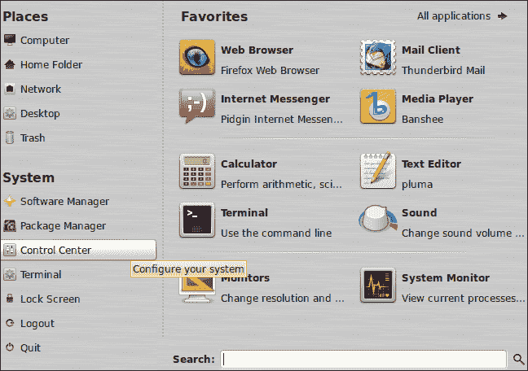
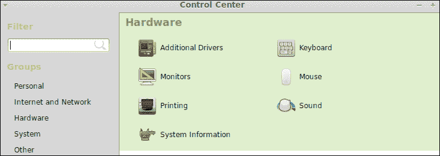
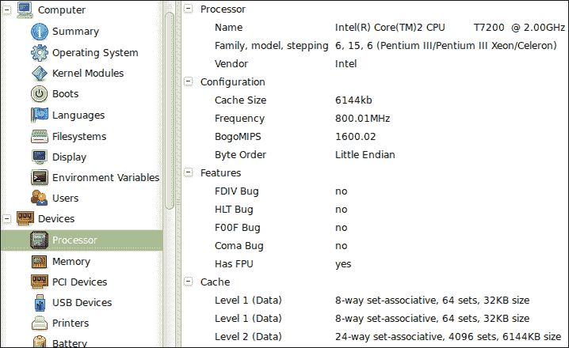
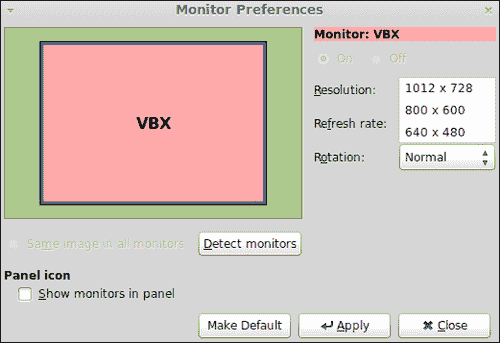
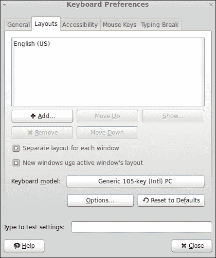
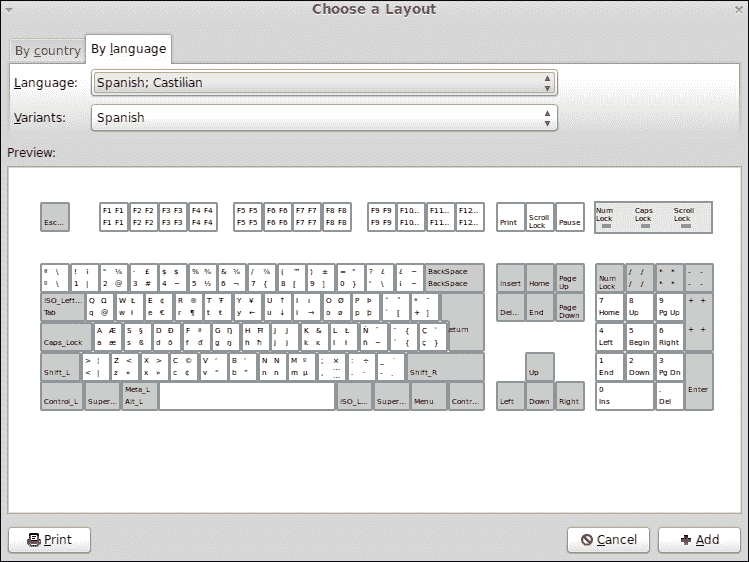
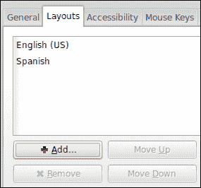

# 第六章：配置硬件

*您的计算机包含并使用不同的硬件和外设，如处理器、键盘、显示器、图形卡和声卡。当这些设备正常工作时，您的计算机不会出现任何硬件问题。在本章中，我们将学习如何配置计算机硬件。*

本章我们将涵盖以下主题：

+   如何检测硬件

+   配置您的显示器

+   如何配置您的键盘和鼠标

+   配置声音

+   如何安装附加驱动

# 检测硬件

在配置硬件之前，了解计算机内部工作的设备非常重要。Linux Mint 提供了一个图形工具，用于获取有关计算机上安装的硬件信息。此外，我们还将学习如何使用命令显示使用 USB 和 PCI 接口的设备的低级信息。

# 开始行动 – 如何显示设备信息

让我们显示计算机上运行的设备信息。为此，请按照以下步骤操作：

1.  点击底部面板上的 **菜单** 按钮，然后点击 **系统** 组中的 **控制中心** 菜单选项，如下所示：

1.  现在您可以看到一个新窗口；点击 **硬件** 菜单选项：

1.  点击 **系统信息** 链接，您将看到一个新窗口，它属于一个名为 **HardInfo** 的应用程序。

1.  在主窗口的左侧窗格中，您将找到一个树形结构，其中 **设备** 图标为您提供有关计算机上安装的硬件信息，如下所示：

## *发生了什么？*

Linux Mint 包含 HardInfo 用于显示有关计算机上安装的硬件信息。您可以查看有关许多设备的信息，如处理器、内存、打印机以及连接到计算机的 USB 设备。此外，HardInfo 还为您提供其他相关信息，如环境变量、用户或启动时加载的内核模块。

如果您需要以 HTML 或文本格式获取 HardInfo 提供的任何信息，可以通过 **生成报告** 按钮实现。该报告对于共享有关计算机上安装的硬件信息非常有用。

另一方面，HardInfo 可通过 **控制中心** 访问，这是一个提供您访问许多有用应用程序的软件工具，用于配置操作系统不同方面的设置。

## 动手实践 – 使用 dmesg、lspci 和 lsusb 命令

尽管 HardInfo 是一个非常直观且易于使用的工具，你也可以使用其他命令来获取计算机上安装的硬件信息。例如，`dmesg`是一个命令，它会在 shell 上打印由内核提供的信息。这意味着如果将 USB 设备连接到计算机，Linux 内核将产生有关此事实的信息；因此`dmesg`将获取这类信息。

为了获取连接到计算机的 USB 设备的数据，你可以执行`lsusb`命令。如果你想获取有关 PCI 设备的信息，可以使用`lspci`命令，因为它为你提供了所需信息的完整列表。

# 配置显示器

显示器是计算机最重要的外设之一。多亏了显示器，你可以看到计算机上所有信息和数据的显示。多个显示器允许你更改一些属性，如屏幕分辨率、旋转和刷新率。我们将学习如何通过 Linux Mint 提供的图形工具来更改这些属性。

# 行动时间 – 更改屏幕分辨率

尽管你可以更改显示器的许多不同属性，但我们将学习如何更改屏幕分辨率；这可以通过以下步骤完成：

1.  启动**控制中心**应用程序，然后点击**显示器**链接。

1.  转到**分辨率**选项，并选择适合你显示器的分辨率；以下是示例截图：

1.  完成操作后，点击**应用**按钮。

## *发生了什么？*

多亏了 Mint 提供的图形工具，更改显示器的一些属性非常容易。你已经学会了如何更改屏幕分辨率；此外，你还可以更改显示器的旋转和刷新率。还可以检测哪些显示器或显示器连接到计算机。基于这种检测，Mint 可以自动为那些显示器/显示器选择更好的分辨率。如果你连接了多个显示器，Mint 允许你配置每个显示器而没有任何问题。别忘了在更改属性后点击**应用**按钮，否则你的更改将不会被应用。

# 配置键盘

在前一节中，你学习了如何配置显示器，现在是时候关注另一个重要外设——你的键盘了。Linux Mint 允许你选择特定的键盘品牌和型号，它还添加了不同的布局，并为键盘配置了辅助功能。在本节中，我们将学习如何添加新布局。

# 行动时间 – 添加新布局

让我们来弄清楚如何为键盘添加西班牙语布局。以下是如何完成此操作的方法：

1.  启动**控制中心**，然后点击**键盘**按钮。

1.  点击**布局**标签，如下图所示：

1.  点击**添加…**按钮。

1.  现在，点击**按语言**标签。

1.  寻找**西班牙语；卡斯蒂利亚语**选项，并将其选中用于**语言**下拉菜单，如下图所示：

1.  完成后点击**添加**按钮。

1.  现在您的键盘上有了一个**西班牙语**布局，如下图所示：

## *刚才发生了什么？*

一些用户可能希望为他们的键盘使用不同的布局。例如，可能有一些开发人员，他们的母语不是英语，但他们更喜欢使用这种类型的布局进行编程。然而，他们需要使用另一种不同的布局来书写法语或西班牙语等语言。一次只能选择一个布局，但用户可以随时更改他们的布局。请记住，在使用之前必须添加新布局。

除了配置键盘布局外，您还可以配置诸如键盘品牌和型号或决定文本字段中光标是否应该闪烁等不同方面。多亏了 Linux Mint 提供的图形工具，更改这些属性很容易。

# 配置您的鼠标

在前面的部分中，我们学习了如何配置我们的显示器和键盘，但我们还有一个重要的外围设备，允许我们与计算机通信。我们说的是鼠标。Mint 提供了一个简单易用的工具来更改鼠标属性。

# 行动时间 – 更改鼠标方向

让我们学习如何将鼠标从右手方向更改为左手方向。这可以通过以下步骤完成：

1.  再次，我们将启动**控制中心**应用程序，并在**硬件**组中点击**键盘**按钮。

1.  在**鼠标方向**组中选择**左手**选项。

1.  完成后点击**关闭**按钮。

## *刚才发生了什么？*

尽管我们解释了一个简单的鼠标配置示例，但 Mint 允许您更改其他属性，例如指针速度、双击超时或按下*Ctrl*键时显示鼠标指针位置。此外，还可以为更好的可访问性配置鼠标。

# 配置声音

如果您的计算机包含声卡，您可以配置机器中声音的行为。Mint 为您提供了一个图形工具，用于更改和配置与声音相关的许多方面，例如输出音量、声音效果、警报声音类型以及启用或禁用窗口和按钮的声音。为了熟悉如何配置声音，我们将学习如何启用窗口和按钮的声音。

# 行动时间 – 如何启用窗口和按钮声音

让我们学习如何使用 Linux Mint 中包含的图形工具为窗口和按钮启用声音。以下是步骤：

1.  启动**控制中心**。

1.  单击**声音**按钮，之后您会看到一个上下文菜单；单击**启动声音**选项。

1.  现在，您可以访问**声音首选项**窗口；选中**启用窗口和按钮声音**复选框。

1.  单击**关闭**按钮以完成**声音首选项**应用程序。

## *发生了什么？*

**声音首选项**窗口允许您配置许多与声音相关的方面。使用此窗口，我们学习了如何为窗口和按钮启用声音。此外，您可以使用此窗口更改输出音量，使用静音功能禁用所有声音，或决定哪些应用程序将使用声音。

# 安装额外的驱动程序

在安装过程中，Linux Mint 检测您的硬件并安装所需的驱动程序。一些 GNU/Linux 发行版不安装或提供专有驱动程序，但 Mint 为我们提供了安装此类驱动程序的选项。这是一个好主意，因为它使新手用户的生活更轻松。目标是让计算机内的所有硬件都能正常工作，包括多媒体支持、显示器和图形卡。

现代 PC 包含由不同品牌制造的图形卡，这些图形卡需要专有驱动程序。如果制造商发布了源代码，则可以编译它并生成二进制包。这是 Mint 开发人员工作的一部分，他们提供软件，使我们能够开箱即用地使用 Linux Mint 计算机。

您可以检查 Mint 是否为您的硬件提供额外的驱动程序。为此，您可以访问**控制中心**，然后单击**附加驱动程序**按钮。然后，搜索过程将开始，Mint 将通知您可以安装哪些额外的驱动程序。

# 总结

在本章中，我们讨论了如何检测和配置计算机硬件。我们提供了配置示例，但得益于 Linux Mint 中包含的图形工具，配置设备（如键盘、鼠标和显示器）非常简单。

具体来说，我们涵盖了以下主题：

+   检测连接到计算机的硬件

+   配置重要的外围设备，如键盘、显示器和鼠标

+   配置声音

+   安装额外的驱动程序

Linux Mint 社区网站提供了有关哪些硬件与 GNU/Linux 的此发行版兼容的完整信息。该资源被称为*硬件数据库*，可访问于[`community.linuxmint.com/hardware`](http://community.linuxmint.com/hardware)。您可以根据兼容性级别、品牌、类型或 Mint 版本搜索硬件。

在下一章中，我们将学习如何在 Linux Mint 中处理网络。
