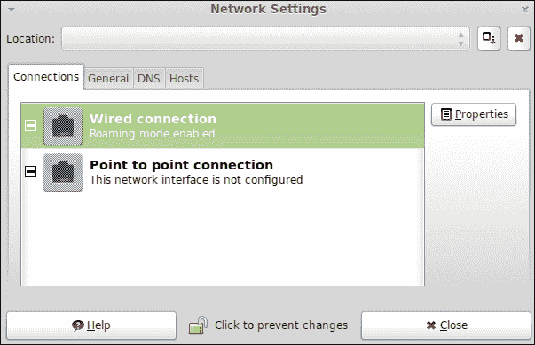
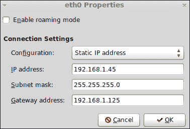
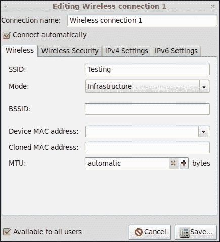
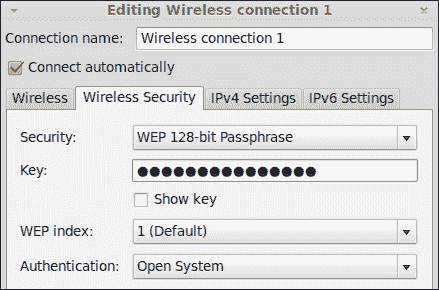
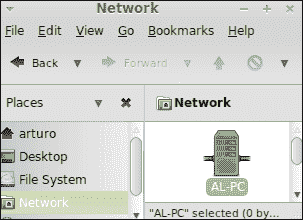
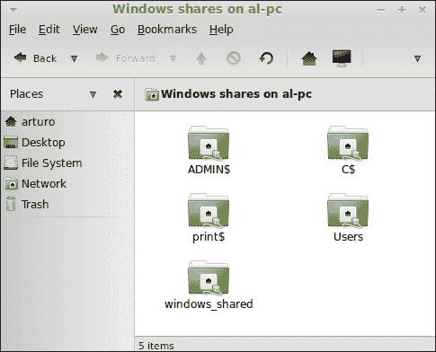
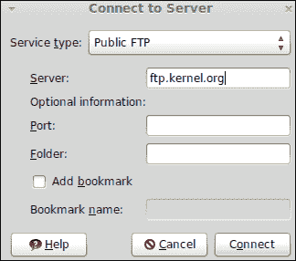
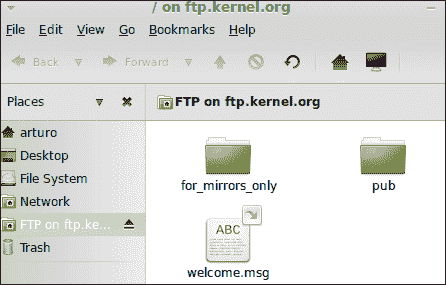

# 第七章：网络

*如今，计算机通过网络共享资源（如文件、文件夹和打印机）协同工作。实际上，互联网是一个巨大的网络，其中计算机正在工作以交换数据。在本章中，您将学习如何执行一些与网络相关的基本系统管理员任务。*

在本章中，我们将学习以下主题：

+   配置有线和无线网络

+   访问 Windows 的共享文件夹

+   通过 FTP 协议连接到服务器

# 配置有线网络

尽管无线网络非常普及，但许多公司和大学仍然使用有线计算机网络。我们将学习如何配置我们的计算机以访问本地网络，以及访问互联网。请记住，在从本地网络访问互联网之前，您需要访问网络本身。

# 行动时间 – 配置您的连接

假设我们想要使用静态 IP `192.168.1.45` 将我们的计算机连接到本地网络。我们知道 DNS 服务器使用 `8.8.8.8` 作为 IP 地址。此外，我们的网关可以在 `192.168.1.125` 处到达。执行以下步骤来配置您的连接：

1.  从主菜单启动**控制中心**工具。

1.  在**互联网和网络**组内点击**网络**按钮。

1.  现在您可以访问一个名为**网络设置**的窗口。

1.  点击**点击进行更改**按钮。

1.  在继续下一步之前，您应该已经通过身份验证。因此，您需要输入密码并在准备好后点击**认证**按钮。第一个选项卡，称为**连接**，有一个名为**有线连接**的选项；点击它，如下面的截图所示：

1.  在**网络设置**窗口中点击**属性**按钮。

1.  从**配置**下拉菜单中选择**静态 IP 地址**，并在**IP 地址**输入框中输入**192.168.1.45**。之后，输入框失去焦点，**子网掩码**输入框将自动填充。在**网关地址**输入框中输入**192.168.1.125**。所有这些设置如下面的截图所示：

1.  完成后点击**确定**按钮。

1.  点击**DNS**选项卡，然后点击**添加**按钮。现在，您可以在第一个输入框中输入 `8.8.8.8`。准备好后点击**关闭**按钮；您的网络现在已配置。

## *刚刚发生了什么？*

我们已经学会了如何通过 Linux Mint 中包含的一个简单的 GUI 应用程序连接到本地网络。尽管一些系统管理员更喜欢使用命令行界面，但使用这个图形界面既简单又直观。

在我们的示例中，我们配置了网络卡，为其分配了一个静态 IP 地址，并设置了一个网关和一个特定的服务器作为**域名服务器**（**DNS**）。这种服务器功能非常重要，因为它将域名解析为 IP 地址。

尽管**网络设置**应用程序会自动配置子网掩码，您也可以添加自己的数据。请注意，子网掩码是根据您输入的 IP 地址计算得出的。

有些网络使用基于**动态主机配置协议**（**DHCP**）的自动配置，而不是使用静态 IP 地址。在这种情况下，您可以通过从下拉菜单中选择**自动配置（DHCP）**来配置网络访问。

## 尝试一下英雄 – 更改主机名

如果您愿意，可以更改您的主机名。您需要使用配置网络时使用的同一应用程序。只需访问**常规**选项卡，并在**主机名**输入框中输入您的新主机名。

# 配置无线网络

如今，无线网络非常流行；公司、大学、机场和咖啡店都使用这种网络来建立互联网连接。我们将学习如何配置您的 Linux Mint 计算机以使用无线网络。

# 操作时间 – 如何将计算机连接到无线网络

设想我们需要将计算机连接到一个无线网络，该网络使用**测试**作为**SSID**，并使用**WEP-128**安全方法。此外，我们将使用与上一节配置网络时相同的 IP 地址、子网掩码和网关地址数据。

1.  从主菜单启动**控制中心**工具。

1.  从**其他**组中选择**网络连接**选项。

1.  点击**无线**选项卡，然后点击**添加**按钮。

1.  现在您有一个新窗口，可以在其中添加配置数据。为您的连接选择一个名称，在**SSID**输入框中添加**测试**，并在准备好时点击**保存...**按钮，如下面的截图所示：

1.  点击**无线安全**选项卡，并从**安全**下拉菜单中选择**WEP 128 位密码短语**。在**密钥**文本框中，输入`MyKey`。如果您想确保输入正确，请勾选**显示密钥**复选框：

1.  现在是设置 IP 属性的时间。点击**添加**按钮，在**IP 地址**输入框中输入`192.168.1.45`，在**子网掩码**输入框中输入`255.255.255.0`，在**网关地址**输入框中输入`192.168.1.125`。

1.  点击**保存...**按钮。您的无线网络现已配置完成。

## *发生了什么？*

Mint 为我们提供了一个简单但有效的图形工具来配置我们的无线连接。您已经学会了如何使用手动配置 IP 地址、子网掩码和网关。此外，我们的示例使用了**WEP 128 位**安全方法，这需要一个密钥，我们需要输入它。如果您尝试配置的网络使用不同的安全方法，您可以相应地选择。其他可用的安全方法包括**WEP 40/128 位**、**LEAP**、**动态 WEP**和**WPA**。

另一方面，与有线网络类似，您可以使用 DHCP 而不是手动配置。这取决于您的无线网络。

到目前为止，您一定已经注意到，在配置窗口中有一个标记的选项，允许您自动连接到无线网络。多亏了这个选项，您的计算机每次启动时都会连接到无线网络。

如果您的计算机有无线网卡，Mint 将默认尝试自动检测可用的无线网络。您可以选择任何一个来配置您的连接。

# 访问 Windows 共享文件夹

在计算机网络内部共享资源（如文件夹、文件和打印机）非常有用。通常，同一网络中的计算机可能使用不同的操作系统。由于 Windows 是最广泛使用的操作系统之一，您的网络中可能有多台计算机使用它。考虑到这一点，了解如何从 Linux 访问 Windows 共享文件夹可能会非常有趣。

# 行动时间 – 如何访问特定的共享文件夹

我们将访问名为`windows_shared`的共享文件夹，该文件夹存在于一台 Windows 7 计算机上，并且可以通过网络从您的 Linux Mint 计算机访问。以下是访问特定共享文件夹的方法：

1.  在 Linux Mint 桌面中，您会看到一个标有名称的文件夹图标，表明这个图标代表您的家目录。通过这个图标，您可以访问**Caja**，即 Linux Mint 的文件管理器。例如，如果您的用户名是**john**，那么图标标签将是**john 的家**。

1.  Caja 现在已打开，您可以看到一个标有**网络**的图标；点击它。

1.  此时，您应该看到一个代表 Windows PC 的图标。这个图标将使用 Windows 主机名计算机的名称作为标签。点击它以访问共享文件夹。例如，在下图中，它被命名为**AL-PC**：

1.  现在将显示一个新的对话框窗口，询问您的用户名、密码和域。输入您的信息，准备好后点击**连接**按钮。

1.  现在，**windows_shared**文件夹将在 Windows 管理器中可用。您现在可以双击它来访问其中的文件。

## *发生了什么？*

多亏了 Samba，现在可以从 Linux 访问 Windows 中的共享文件夹。从技术角度来看，Samba 是对**SMB/CIFS**网络协议的免费重新实现。该协议作为应用层网络运行，并被 Windows 用于共享文件、打印机和其他资源。

显然，在从 Linux 访问 Windows 共享文件夹之前，您需要了解一些重要信息，例如工作组、用户名和密码。这些数据应由 Windows 系统管理员提供。

默认情况下，Linux Mint 会探索您的网络以发现哪些计算机是可访问的。当您点击 Caja 的**网络**按钮时，就会发生这种情况。当检测到您的 Windows 计算机并点击其图标时，您可以输入数据以访问这些共享文件夹。然后，您可以像处理本地计算机内的文件一样处理该文件夹内的文件。

请记住，默认情况下，所有共享文件夹在验证后都会显示在 Caja 上。但是，只有连接到 Windows PC 的用户才能访问具有权限的那些文件夹。

# 连接到服务器

互联网上的服务器通常通过使用不同的网络协议为其他服务器和计算机提供访问。**FTP**、**SSH**和**WebDAV**是访问远程服务器的常见协议，因此了解如何使用这些协议从 Linux Mint 连接到其他计算机将非常有趣。

# 操作时间 – 连接到 FTP 服务器

我们将连接到一个公共 FTP 服务器，该服务器提供对 Linux 内核资源的访问。它可以通过[ftp.kernel.org](http://ftp.kernel.org)访问，我们不需要任何用户名或密码即可访问。

1.  通过点击**主文件夹**选项打开 Caja 文件管理器，该选项可通过主菜单在**位置**组中访问。

1.  前往**文件**菜单，点击**连接到服务器**。

1.  将显示一个新对话框。从**服务**下拉菜单中选择**公共 FTP**。在**服务器**文本框中输入**ftp.kernel.org**，如下面的截图所示：

1.  您可以在文件管理器窗口中看到通过 FTP 服务器可用的所有文件夹，如下所示：

## *发生了什么？*

Caja 文件管理器帮助我们使用不同的网络协议连接到服务器。在我们的示例中，我们学习了如何连接到公共 FTP 服务器。这种类型的服务器不需要用户名和密码组合。如果需要连接到此类服务器，可以从**服务**下拉菜单中选择**FTP（带登录）**选项。一旦建立了连接，您就可以通过 Caja 访问文件和文件夹，就像它们在您的计算机上一样。这意味着您可以直接从另一个文件管理器窗口使用拖放技术复制内容。

在连接对话框中，你可以看到一个名为**添加书签**的选项。通过选择该选项，将在你的文件管理器中创建一个快捷方式。得益于这一功能，你可以快速访问最常用的服务器连接。

## 尝试英雄 – 使用安全 WebDAV 协议连接到服务器

尝试通过安全 WebDAV 协议连接到服务器。你可以按照之前连接到公共 FTP 服务器的相同步骤进行操作。我们只需要从“安全”下拉菜单中选择**Secure WebDAV (HTTPS)**。此外，你可以输入服务器的用户名，以及连接将建立的默认文件夹名称。

# 总结

在本章中，我们学到了很多关于如何执行一些基本网络操作的知识。

具体来说，我们涵盖了以下主题：

+   连接有线和无线网络

+   使用 FTP 和 WebDAV 协议访问远程计算机

+   连接到 Windows 共享文件夹

既然你已经知道如何处理网络，现在是时候学习不同类型的可用文件系统和如何创建和恢复备份了。
