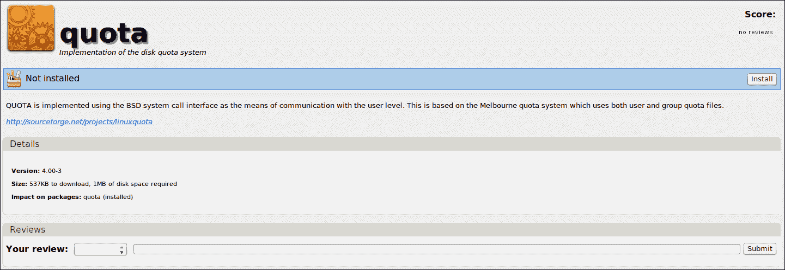
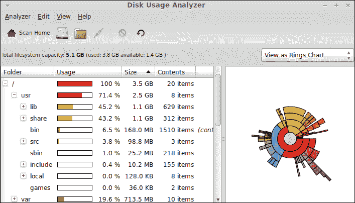
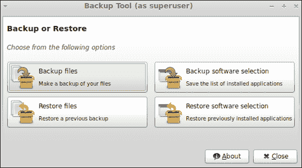
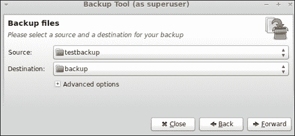
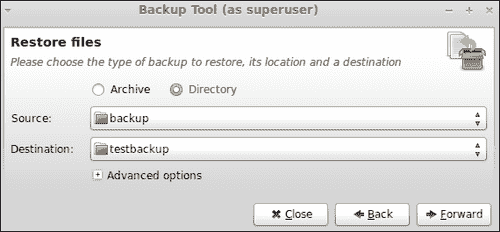

# 第八章：存储和备份

*本章涵盖了文件系统、存储类型以及如何创建和恢复备份的基本概念和信息。系统管理员应该对这些知识有清晰的了解，因为这些信息在用户、公司、大学和其他类型的组织中具有巨大的价值。*

在本章中，我们将学习以下主题：

+   找出 GNU/Linux 发行版使用的主要文件系统类型

+   如何为用户分配磁盘配额

+   如何分析磁盘使用情况

+   如何创建和恢复备份

# 文件系统类型

计算机数据存储在存储设备中，并按照特定系统进行组织。操作系统应该能够存储、组织、访问和更新这些数据。为了执行上述所有操作，使用了**文件系统**。存储设备内的所有文件和文件夹都由文件系统组织，操作系统与之交互。存储设备可以是硬盘、外部 USB 驱动器或网络上的文件和文件夹集合。

每个文件系统都为系统管理员和用户提供了一组元数据以供使用。这些元数据包括文件中包含的数据长度、文件所有者以及文件上次修改的时间等信息。目前，你可以找到许多文件系统，每个操作系统家族都能够与其中许多文件系统配合使用。Linux 内核是操作系统的主要组件，它直接与文件系统交互。此外，Linux 发行版提供了工具和技术来与不同类型的文件系统配合使用。

文件系统和存储设备使用**分区**的概念，该概念标识由文件系统使用的存储设备的一部分。通常，每个存储设备都被划分为分区，每个分区都可以使用特定的文件系统进行格式化。格式化操作提供了一种在分区内部创建文件系统的机制。请记住，Mint 在安装过程中会自动在我们的硬盘上创建一些分区。

Mint 允许我们与 Linux 操作系统家族中最流行的文件系统之一进行交互。具体来说，Linux Mint 可以与 `ext2`、`ext3`、`ext4`、`btrfs`、`xfs` 和 `reiserfs` 等分区类型配合使用。目前，`ext4` 是 Linux 分区的实际标准，Linux Mint 默认使用它。尽管 `btrfs` 是实验性的，但得益于 Mint，你可以在硬盘上进行测试。另一方面，`reiserfs` 因其日志功能和稳定性而非常受欢迎。一些系统管理员倾向于使用 `xfs`，因为它具有高性能的日志系统。

决定每台计算机和存储设备的最佳文件系统类型并非易事。通常，系统管理员倾向于为 PC 和工作站使用 `ext4`；`xfs` 和 `reiserfs` 在服务器和高可用性及高性能需求的设备上较为常见。

与文件系统相关，我们发现了另一个概念：**存储类型**。在运行 GNU/Linux 操作系统的服务器上，通常使用**独立磁盘冗余阵列**（**RAID**）和**逻辑卷管理**（**LVM**）等存储类型。第一种技术基本上是将多个磁盘组合成一个唯一的逻辑单元。可以应用不同级别的 RAID，流行的有 RAID 5 和 RAID 1。使用 RAID 的一些优点是数据冗余和高性能。

另一方面，LVM 是一种更方便和灵活地分配存储设备空间的方法，使用传统的分区。使用 LVM，可以通过拍摄快照来创建备份。除了这个重要功能外，LVM 还允许系统管理员在不中断设备存储提供的服务的情况下，对添加或更换磁盘进行热交换。在安装过程中，Mint 允许您使用 LVM 而不是分区。

# 磁盘配额

硬盘驱动器和存储设备通常有有限的存储空间，因此进行一些维护任务以防止这些设备达到最大容量是很重要的。管理存储限制的一种简单方法是使用**磁盘配额**；这是一种为操作系统中的每个用户或用户组分配特定大小空间的技术。

Linux 内核允许我们使用两种类型的磁盘配额：**软**和**硬**。使用第一种时，用户将在达到限制时收到警告。另一方面，硬配额不允许用户在达到限制后创建文件。

# 行动时间 - 为特定用户分配磁盘配额

我们将学习如何为名为`arturo`的用户的特定硬盘的`/dev/sda3`分区设置 20 MB 的限制。让我们想象一下`/home`分区挂载在`/dev/sda3`上。分配给用户的配额将是软的，因此将收到警告消息。显然，您可以选择不同的用户和分区，或者计算机可访问的其他设备。

1.  转到**菜单**并启动**软件管理器**应用程序，然后查找并安装名为**配额**的应用程序。

1.  通过修改`/etc/fstab`文件并在特定分区中添加`usrquota`和`grquota`值来启用文件系统的配额检查。只有 root 用户有权限修改提到的文件，因此您需要在更改之前以`root`身份登录。`/etc/fstab`文件中的行应该是以下内容：

    ```
    /dev/sda3  /home  ext4  defaults,usrquota,grpquota   1 2

    ```

1.  编辑并更改`/etc/fstab`文件后，您必须重新启动计算机。

1.  执行以下命令以检查已启用配额的分区：

    ```
    $ quotacheck -avug

    ```

1.  让我们为我们的用户分配一个配额。为此，您需要执行下一个命令，该命令将打开一个编辑器以修改用于分配配额的特定配置文件：

    ```
    $ edquota arturo

    ```

1.  现在，你可以通过在对应`/dev/sda3`分区的行中将值`20480`添加到**软**列来修改打开的文件。准备好了就保存文件。现在已为`arturo`用户分配了磁盘配额。

## *刚刚发生了什么？*

配额应用程序包含两个有用的命令（`quotacheck`和`edquota`），用于为用户和组在硬盘上设置和检查配额。在我们的示例中，我们配置了系统，以便在特定用户试图在`/home`分区中使用超过 20MB 时发出警告。

计算机启动时将要挂载的分区的所有信息都可以在`/etc/fstab`文件中找到，该文件已被修改以激活配额检查。你可以卸载并重新挂载特定的分区，而不是重启计算机。

我们刚刚使用了 20MB 的限制来查看警告消息是如何显示的。显然，系统管理员会根据特定目的选择不同的值，因为每个场景都是不同的。

## 动手实践 – 安排配额检查

你可以定期检查配额是否已达到存储限制。为此，你可以使用`cron`工具通过`quotacheck`命令来实现。我们只需要创建一个文件`/etc/cron.daily/quotacheck`，其中包含以下行：

```
quotacheck -avug

```

多亏了`cron`，操作系统每天都会检查每个配置用户的配额是否已达到。

# 磁盘使用分析

我们已经学会了如何为用户分配配额以及如何在硬盘上保留空间。关于这一功能，了解每个分区和目录使用了多少空间是很重要的。有了这个功能，系统管理员可以根据磁盘使用情况决定如何组织分区。

# 行动时间 – 检查磁盘使用情况

我们将查看硬盘，了解每个分区和目录使用了多少空间。

1.  转到主菜单，点击**磁盘使用分析器**菜单选项，它属于**系统工具**菜单组。

1.  现在你打开了一个新窗口，它显示了有关硬盘空间和使用情况的图形信息：

## *刚刚发生了什么？*

**Baobab**是 Linux Mint 提供的用于分析磁盘使用的工具名称。它为我们提供了有关文件系统容量以及硬盘空间分布方式的图形信息。对于`home`文件夹中的每个目录，你可以看到文件数量、百分比空间和大小。此外，还可以选择有关特定文件夹的信息，该文件夹可以通过 Baobab 主工具栏上的文件夹图标进行选择。

关于 Baobab 显示的图形信息，我们可以选择两种类型的图表：**树状图**和**环形图**。在工具栏下方，有一条简单的线告诉我们文件系统的容量以及有多少空间可用。这是一个简单但非常实用的信息。

# 创建备份

计算机上存储的一些信息非常重要且有价值，因此我们需要确保其安全。此外，建议进行备份，以便在某些信息丢失或损坏时，我们可以恢复备份，一切应该能正常工作。让我们学习如何在 Linux Mint 中创建备份。

# 行动时间 – 对特定文件夹进行备份

我们将对一个名为`testbackup`的文件夹进行备份，该文件夹位于你的`home`文件夹内，备份到`/tmp`目录下的一个名为`backup`的文件夹中。你可以在其中创建`testbackup`文件夹并添加一些文件。

1.  点击**菜单**，然后再次点击**所有应用程序**选项，并在**管理**组中选择**备份工具**。

1.  将启动**备份工具**应用程序，你可以看到一个带有几个按钮的新窗口。点击**备份文件**按钮：

1.  为**源**选项选择**testbackup**文件夹，并从**/tmp**文件夹中为**目标**下拉选项选择**备份**文件夹。准备好后，点击**前进**按钮：

1.  接下来的选项允许你排除某些文件夹和目录。我们不会排除任何内容，因此你可以点击**前进**按钮。

1.  检查你的源文件夹和目标文件夹。如果一切正常，然后点击**应用**。

1.  最终，你会看到一条消息，告知你备份操作成功。准备好后，点击**关闭**按钮。查看`备份`文件夹以确保你的文件都在那里。

## *刚才发生了什么？*

备份工具是 Linux Mint 中包含的一个应用程序，提供了一种简单有效的方法来创建和恢复文件、文件夹和应用程序的备份。我们已经解释了一个基本操作——如何备份一个文件夹。然而，备份工具还允许你创建单个文件甚至计算机上安装的一些应用程序的备份。

**高级选项**由备份工具提供，允许我们选择输出格式和执行覆盖、保留权限和时间戳、跟随符号链接或确认文件和文件夹完整性的选项。我们使用了默认选项，但你也可以选择自己的偏好。

如果你访问`/tmp/backup`文件夹，你可以找到由备份工具创建的文件。这些文件将与`testbackup`文件夹内的文件完全相同。

除了选择同一硬盘内的文件夹外，你还可以使用不同的设备进行备份，例如 USB 闪存驱动器、外部 USB 硬盘或可通过网络访问的文件夹。

请记住，备份工具是通过 root 用户执行的，因此你可以备份硬盘上的任何目录。此外，在使用此工具之前，你应该进行身份验证。

## 动手实践 – 创建和恢复备份文件

您可以尝试创建一个`tarball`（使用`tar`工具创建）文件并恢复它。作为源，您可以使用几个文件而不是整个目录。备份工具为您提供了通过几次点击实现这一目标的机会。不要忘记在**高级选项**中的**输出**下拉选项中选择**.tar.gz 文件**选项。

# 恢复备份

一旦您备份了重要文件、文件夹或应用程序，您应该将它们存储在安全的地方。如果出现问题，您可以在硬盘上选定的文件或文件夹中恢复这些备份。尽管每个公司和系统管理员都有特定的备份和恢复策略，但我们应该学会如何执行简单的文件夹恢复。

# 行动时间 – 恢复备份文件夹

创建备份后，现在是恢复它的时候了。我们将把`/tmp/backup`文件夹恢复到您`home`文件夹内的`testbackup`。

1.  从主菜单访问**备份工具**。

1.  点击**恢复文件**按钮。

1.  选中**目录**复选框，并从**tmp**目录中选择**备份**文件夹。对于**目标**菜单选项，您应该从**home**文件夹中选择**testbackup**。准备好后，点击**前进**按钮：

1.  审查您的选项，确保您将恢复到正确的备份文件夹。

1.  点击**应用**，将显示一条新消息，通知您恢复操作。您的文件应该可以在`testbackup`文件夹中找到。

## *刚刚发生了什么？*

我们在`home`文件夹内恢复了一个备份。显然，原始备份应该存在于之前创建它的地方。通过这一操作，您可以无问题地恢复您的文件和文件夹。

关于**高级选项**，在恢复备份时，您只能选择要应用的覆盖类型。一些选项包括**从不**、**按大小**、**始终**和**校验和不匹配**；其中，默认选择一个选项。

除了恢复目录外，您还可以恢复使用同一工具创建的备份文件。

## 动手实践 – 为应用程序创建备份

证明如何创建和恢复计算机上安装的一些应用程序的备份会很有趣。您可以使用备份工具提供的**备份软件**选择和**恢复软件**选择按钮来实现这一点。

# 总结

计算机存储因其包含多种设备和文件系统而显得复杂。通常，用于存储的技术很复杂，在决定使用哪种类型的存储设备和文件系统之前，对最终场景进行全面分析至关重要。

在本章中，您学习了处理存储的基本概念。此外，您还知道如何创建和恢复简单的备份。

具体来说，我们涵盖了：

+   在 Linux Mint 和其他 GNU/Linux 发行版中使用的主要文件系统

+   如何为用户分配磁盘配额

+   图形化检查磁盘使用情况

+   如何创建和进行备份

在下一章节中，你将学习到关于安全性的知识，这是系统管理员更相关的主题之一。
