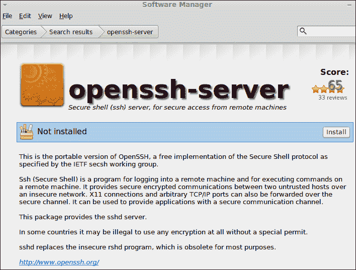
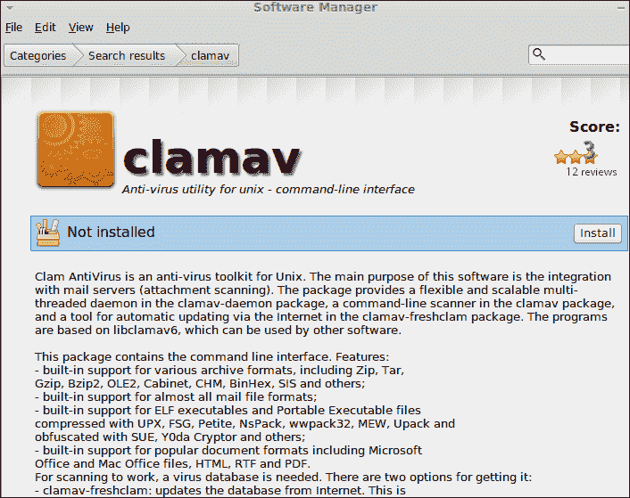
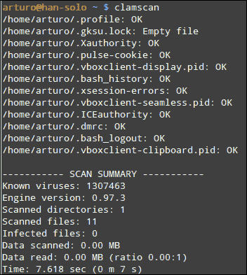
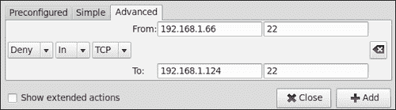
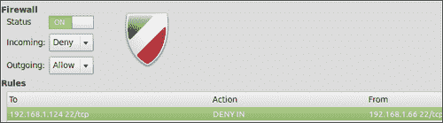
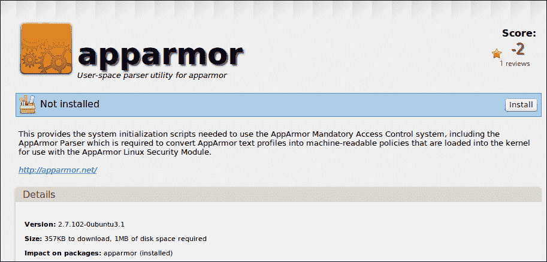
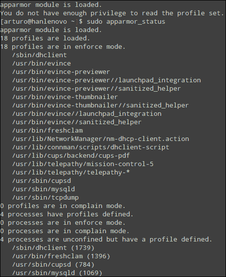
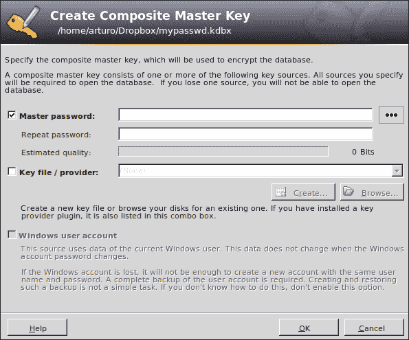
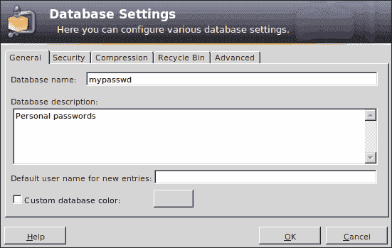
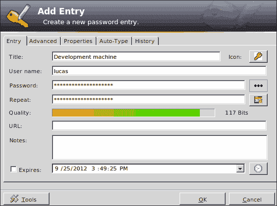

# 第九章。安全性

*安全性无疑是系统管理员最重要的方面之一。在本章中，我们将学习用于保护 Linux Mint 计算机的基本机制和工具。*

在本章中，我们将学习以下主题：

+   运行 SSH 服务器

+   安装防病毒软件

+   安装和配置防火墙

+   使用内核安全模块

+   构建安全检查清单

# 运行 SSH 服务器

有时，您需要从您的计算机远程连接到服务器。此外，用户需要访问您的服务器或服务器。远程连接允许您直接从您的计算机在服务器上执行命令。**Telnet**是用于在计算机之间建立连接的最常用协议之一。然而，Telnet 不是安全协议，因此当我们需要安全连接时，需要其他协议。这就是**安全外壳**（**SSH**）发挥作用的地方。多亏了 SSH，用户可以从他们的计算机安全地连接到服务器。从技术角度来看，SSH 在服务器和客户端之间创建了一个安全通道。通常，客户端和服务器是不同的机器，但也可以使用同一台机器扮演两个角色。

# 行动时间 – 安装和配置 SSH 服务器

我们将安装并配置**openssh-server**软件，将我们的计算机用作 SSH 服务器。关于配置，我们的服务器将拒绝 root 用户的访问，并且它将通过`5656`端口可访问。

1.  点击**菜单**按钮，然后在**系统**组中再次点击**软件管理器**按钮。

1.  在**软件管理器**应用程序的文本输入字段中输入`openssh server`。

1.  选择**openssh-server**，然后点击**安装**按钮。

1.  现在，您的计算机上已安装**openssh-server**。

1.  通过点击主菜单中的**终端**按钮启动 MATE 终端。

1.  我们将以 root 用户身份使用`vi`编辑器编辑`/etc/ssh/sshd_config`文件，因此您应该在终端中输入以下命令：

    ```
    $ sudo vi /etc/ssh/sshd_config

    ```

1.  输入`i`以在`vi`中进入编辑模式。查找包含**PermitRootLogin**的行，并将其替换为以下行：

    ```
    PermitRootLogin no

    ```

1.  让我们继续编辑同一文件，查找包含**Port**的另一行，并将其替换为以下行：

    ```
    Port 5656

    ```

1.  保存`/etc/ssh/sshd_config`文件；您可以点击*Escape*键，然后输入`:wq`。

1.  现在是重启 SSH 服务器的时候了，然后您的服务器将安装、配置并准备好使用。您可以通过执行以下命令来测试这一点：

    ```
    $ sudo restart ssh

    ```

1.  您可以通过尝试连接到它并在终端中输入以下命令来测试您的 SSH 服务器：

    ```
    $ ssh localhost –p 5656

    ```

1.  现在您可以看到一条消息，要求您授权。输入`yes`和您的密码。现在，您已通过 SSH 协议连接到我们的服务器。

## *发生了什么？*

多亏了 openssh-server 软件，我们可以创建和配置一个 SSH 服务器，允许用户通过他们的计算机连接到远程服务器。Linux Mint 默认不安装上述软件，因此你需要使用**软件管理器**或**包管理器**应用程序来安装它。

一旦在你的计算机上安装了 openssh-server，用户就可以直接使用 SSH 客户端连接到它。这种类型的客户端在主要的 GNU/Linux 发行版和 Mac OS X 计算机上默认安装。

尽管 openssh-server 包含一个默认配置，允许我们连接到服务器，但建议更改配置以满足我们的需求。这是系统管理员的任务。在我们的例子中，我们不允许通过 root 用户进行连接，并将默认的`22`端口更改为`5656`。这些更改为 SSH 连接提供了最低限度的安全性，以防止潜在的攻击者试图使用默认端口通过 SSH 协议连接到服务器。通过我们的配置更改，我们建立了一道第一级防线。另一方面，如果我们允许 root 用户连接到我们的 SSH 服务器，有人可能会破解连接并获得对我们服务器的 root 访问权限，这是不好的。

为了更改 SSH 服务器的配置文件，我们使用了默认安装在 Linux Mint 中的`vi`编辑器。这是一个**模式化**编辑器，通过输入`:wq`，我们可以保存并退出。另一方面，当你输入`i`时，`vi`进入**插入**模式。显然，你也可以使用其他编辑器，如`Pluma`来编辑配置文件。

最后，我们使用`restart`命令并传递`ssh`作为参数来重启 SSH 守护进程。我们将在下一章中更多地讨论守护进程服务。目前，我们只需要知道`restart`命令用于重启服务。

# 安装防病毒软件

众所周知，Windows 操作系统需要防病毒软件，因为病毒感染微软操作系统家族的情况非常普遍。尽管在 GNU/Linux 发行版中找到病毒更为困难，但良好的实践是在我们的服务器上安装防病毒软件。Linux 上最受欢迎的防病毒软件之一是**Clam-AV**（[www.clamav.net](http://www.clamav.net)），因此我们将学习如何在服务器上安装它。

# 行动时间 - 安装 Clam-AV 防病毒软件

我们将在我们的计算机上安装 Clam-AV 防病毒软件。

1.  点击**菜单**按钮，然后在**系统**组中再次点击**软件管理器**按钮。

1.  在**软件管理器**主窗口的输入框中输入`clamav`。

1.  点击结果列表中的第一个元素。

1.  现在你可以点击**安装**按钮，并在需要时输入你的密码。

1.  安装完成后，你可以从命令行使用`clamscan`应用程序。

1.  为了测试我们的防病毒软件，我们将打开 MATE 终端并扫描我们的`home`目录。您只需要输入以下命令：

    ```
    $ clamscan

    ```

1.  `clamscan`的输出应该类似于以下截图：

## *发生了什么？*

我们使用了**软件管理器**应用程序来安装一个应用程序。在这种情况下，我们安装了 Clam-AV 防病毒软件，它包含一个名为`clamscan`的主要可执行文件。这个命令扫描一个目录并在我们的系统中搜索病毒。扫描完成后，我们会得到一个简单的报告，其中包含有关扫描的文件和目录以及哪些文件被感染的信息。

# 配置防火墙

防火墙是计算机安全中最重要的组件之一。从技术角度来看，防火墙是一种屏障，设计用来防止未经授权访问计算机中的服务和资源。软件和硬件组件都可以用来构建防火墙。我们只关注软件方面。

防火墙的配置可以非常简单，也可以非常复杂；这取决于我们想要应用的安全级别。显然，配置一个 Web 服务器和一台计算机工作站是不同的。为了在 Linux 中使用和配置防火墙，我们可以使用一个名为`iptables`的程序，它是一个基于系统管理员定义的规则的包过滤应用程序。Linux 内核使用不同的内核模块来应用规则，并为计算机创建一个防火墙。

尽管`iptables`是一个非常优秀的应用程序，但对于初学者来说并不容易。该应用程序不使用图形界面，并且*需要*知道如何从命令行应用规则。然而，Linux Mint 包含了一个提供**简单防火墙**（`ufw`）前端的 GUI 应用程序，这是一种设计用来轻松构建防火墙的软件。我们将学习如何使用这个有用的工具来配置一个简单的防火墙。

# 操作时间 – 如何配置一个简单的防火墙

作为一个在 Linux Mint 中构建防火墙的简单示例，我们将配置我们的防火墙以拒绝特定 IP（`192.168.1.66`）访问端口`22`。请记住，我们之前配置了这个端口以运行 SSH 服务器。

1.  转到主菜单并点击属于**管理**类别的**防火墙配置**按钮。

1.  然后将显示一个新窗口；点击**解锁**按钮并输入您的密码。

1.  通过在**状态**中选择**开启**选项来激活防火墙。

1.  访问**编辑**菜单并点击**添加规则...**按钮。

1.  点击**高级**选项卡，并为第一个下拉选项选择**拒绝**。然后在**从**输入框中输入`192.168.1.66`，在端口输入框中输入`22`。

1.  在**到**输入框中，输入您的 IP，并在端口处再次输入`22`。准备好后点击**添加**按钮：

1.  然后点击 **关闭** 按钮，您将看到您的新规则已添加到规则列表中：

1.  您的防火墙已配置完成，现在正在运行。

## *刚刚发生了什么？*

Linux Mint 允许我们通过一个名为 `Gufw` 的应用程序来配置和运行防火墙。这个工具是 `ufw`（另一个用于配置防火墙的工具，比 `iptables` 更简单）的简单直观的用户界面。`Gufw` 有三个主要控件，允许我们启用或禁用防火墙，并帮助控制传入和传出流量。一个简单的列表显示了我们启用的规则，列表下方的两个按钮允许我们添加和删除规则。

请记住，`ufw` 的默认行为是阻止所有传入流量并允许传出流量。通常，系统管理员倾向于阻止所有内容，然后配置允许连接的应用程序、端口和协议。这种技术被称为 **白名单**。

基本上，您可以选择三种操作，这些操作将应用于您机器的传入和传出流量：**允许**、**拒绝** 和 **拒绝并通知**。**拒绝** 和 **拒绝并通知** 操作之间的区别在于，前者意味着每个数据包都将被丢弃。然而，**拒绝并通知** 意味着服务器将向客户端发送响应，告知计算机使用防火墙拒绝访问。

我们已经使用高级选项来选择 IP 和端口，但也可以使用 **预配置** 和 **简单** 选项卡仅允许或拒绝访问应用程序和协议。

## 动手实践 – 使用命令行禁用启动时的防火墙

您已经学会了如何使用 `Gufw` 来配置您的防火墙。除了这个工具，您还可以直接从命令行使用 `ufw` 应用程序。例如，您可以禁用启动时的防火墙。为此，启动 MATE 终端并输入以下命令：

```
$ sudo ufw disable

```

执行前面的命令后，您将收到一条消息，例如以下内容：

```
Firewall stopped and disabled on system startup

```

# 使用内核的安全模块

Linux 内核为系统管理员提供了支持访问控制策略的机制，以控制应用程序在操作系统内部可以执行的操作。目前，**安全增强型 Linux** (**SELinux**) 和 **应用程序防护** (**AppArmor**) 是实现这一目的最流行的工具。SELinux 由美国**国家安全局** (**NSA**) 开发，它提供了一组可以应用于不同 GNU/Linux 操作系统的 Linux 内核修改。SELinux 的设计和架构允许系统管理员创建将应用于操作系统上运行的用户和进程的不同策略。与 SELinux 相关，我们找到了 AppArmor，这是一个为 Linux 内核设计的安全模块。得益于这个模块，可以通过不同的配置文件建立一组策略来限制每个程序可以执行的操作。如果程序包含安全漏洞，AppArmor 可以检测到它，而不会影响其他软件。换句话说，AppArmor 限制了程序的能力，以应用预定义的安全配置文件。

AppArmor 和 SELinux 使用 **Linux 安全模块** (**LSM**)，这是一个支持 Linux 内核不同计算机安全模型的框架。基本上，LSM 提供了实现基于不同策略的强制访问控制的工具。

Linux Mint 包含 SELinux 和 AppArmor，但它们默认未安装。AppArmor 易于配置、部署和学习，因此我们将了解如何在服务器上安装它。

# 操作时间 - 安装 AppArmor

AppArmor 的学习曲线较陡峭，因此我们只学习如何安装它。

1.  启动**软件管理器**。

1.  在列表中查找**apparmor**，选中它并点击**安装**按钮。

1.  安装 AppArmor 后，您可以在 MATE 终端中执行以下命令来检查其状态：

    ```
    $ sudo apparmor_status 

    ```

1.  我们将看到类似于以下截图的内容：

## *刚刚发生了什么？*

我们只是从**软件管理器**应用程序安装了 AppArmor。Linux Mint 中的软件包提供了不同的可执行命令，如 `apparmor_status` 和 `apparmor_parser`。第一个命令为我们提供了有关已定义和启用的配置文件的信息，而 `apparmor_parser` 用于将配置文件加载到 Linux 内核中。

如果您有兴趣了解更多关于如何配置 AppArmor 的信息，可以查看官方文档：[`wiki.apparmor.net/index.php/Documentation`](http://wiki.apparmor.net/index.php/Documentation)。

# 安全管理您的密码

系统管理员每天都要处理密码。连接服务器、访问资源和管理用户等操作都需要使用密码。将密码安全地存储在一个地方非常重要，这对于系统的安全性至关重要。如果我们能够使用一个工具来存储、读取和更新密码，日常工作将会变得更加容易。最受欢迎的用于处理密码相关任务的软件之一是**KeePass**（[`keepass.info/`](http://keepass.info/)），这是一个设计用来安全管理密码的工具。基本上，KeePass 只使用一个用户应该记住的主密码。这个主密码锁定了一个存储其他密码的数据库。从技术角度来看，KeePass 使用了两种最安全的加密算法：**AES**和**Twofish**。

# 行动时间 – 安装和使用 KeePass

我们将学习如何安装和使用 KeePass 来存储一些密码。安装 KeePass 后，我们将为名为`lucas`的用户创建一个新密码，该用户可以访问一个开发服务器。

1.  前往**软件管理器**应用程序，搜索**keepass2**，选择搜索结果中的第一个项目，然后点击**安装**按钮。

1.  一旦**KeePass2**安装完成，您可以通过访问主菜单并点击属于**附件**组的**KeePass2**菜单选项来启动它。

1.  在**KeePass2**主窗口的工具栏中选择**文件**选项，然后点击**新建...**菜单选项。

1.  然后会显示一个要求输入主密码的新窗口。我们将在**主密码**和**重复密码**输入框中输入相同的密码。

1.  准备好后点击**确定**，将显示一个新的对话窗口。现在，我们需要为存储密码的数据库选择一个名称。选择一个名称和数据库描述，然后点击**确定**按钮：

1.  您的新数据库已经创建，**KeePass**显示一个树形小部件，您可以在数据库名称下找到不同的类别。

1.  现在，转到**编辑**菜单并点击**添加条目...**菜单选项。您会看到一个新的对话窗口。输入标题和用户名，密码将默认生成。

1.  点击**确定**按钮，将为您的密码创建一个新条目。

## *发生了什么？*

KeePass 是一个完整的密码管理工具。您可以使用并创建多个类别来组织您的密码。默认情况下，创建新条目时会生成密码。可以更改配置并决定默认情况下密码的生成方式。您肯定已经意识到密码是被隐藏的，您只能看到星号。为了更改这一点，请点击**密码**输入框旁边的按钮。

每次访问 KeePass 时，都需要输入主密码。但是，当你点击一个条目时，你会看到包括之前输入的密码在内的信息。

KeePass 提供的其他有用功能包括生成随机密码的能力，尽管你不希望使用此工具来存储密码。

# 构建安全检查清单

当系统管理员在配置安全服务器时，使用简单的检查清单来检查一些应该检查的问题是一个非常好的实践。我们将根据本章中学到的概念构建一个这样的检查清单。具体来说，我们的检查清单将包含以下问题：

+   仅安装和启用用户所需的服务。

+   根据特定策略构建和运行防火墙。

+   禁用通过 SSH 的 root 访问并更改此连接服务的默认端口。

+   安装并配置防病毒软件，Clam-AV 是一个不错的选择。

+   保持你的系统更新。始终为你的操作系统和应用程序安装安全更新。

+   使用 KeePass 或其他密码管理器安全地存储、读取和写入密码。

+   选择包含不同类型字符的安全密码。

+   加密你的敏感数据。**GNU 隐私卫士**（**GPG**）可以帮助你做到这一点。此外，Linux Mint 允许你在安装过程中加密你的`home`文件夹。

+   如果你的计算机需要额外的安全保障，安装和配置网络协议分析器如**Wireshark**是一个好主意。此外，你可以安装网络入侵检测工具如**Snort**。

# 总结

在本章中，我们讨论了安全问题，这是系统管理员最关心的问题之一。我们发现了一些工具，如 KeePass、Clam-AV、AppArmor 和`Gufw`。

具体来说，我们涵盖了以下主题：

+   运行 SSH 服务器

+   安装 Clam-AV 防病毒软件

+   安装和配置使用 Gufw 的简单防火墙

+   探索 AppArmor 和 SELinux

+   安装和使用 KeePass 管理密码

+   制定安全检查清单

尽管我们已经学会了一些基本的工具来保护我们的计算机，但我们还可以使用其他工具来达到同样的目的。例如，使用工具来检测网络入侵是一个好主意。在这种类型的软件中，Snort（[`www.snort.org`](http://www.snort.org)）是最受欢迎的之一。另一方面，像 Wireshark（[`www.wireshark.org`](http://www.wireshark.org)）这样的工具可以帮助你分析网络流量，这对于检测潜在的安全风险非常有用。在了解了关于安全的基本概念和工具之后，你已经准备好学习如何监控你的系统，这将在下一章中解释。
