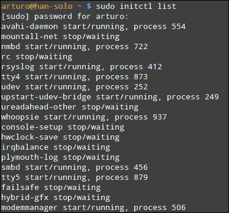
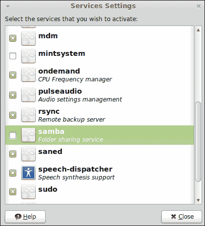
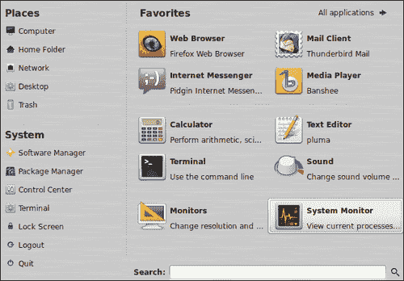
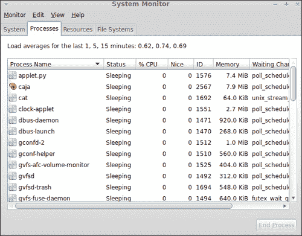
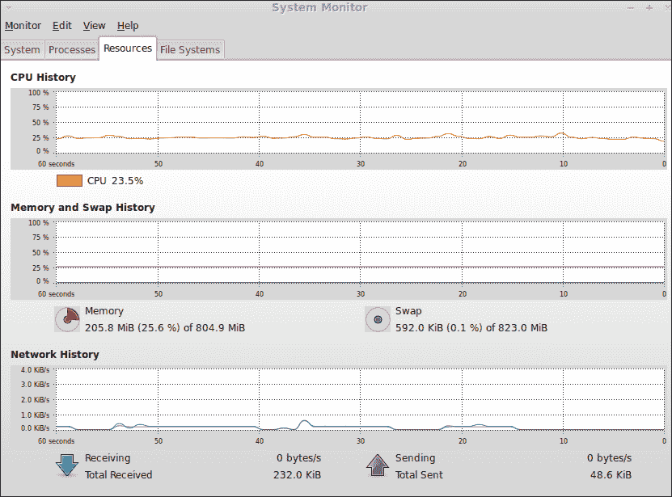

# 第十章：监控您的系统

*一旦计算机配置完成并且不同的服务正在运行，就该确保一切正常，并且事情继续按常规进行。本章将介绍如何监控负责服务和运行进程的系统，以及计算机资源（如内存、CPU 和网络）的使用情况。*

在本章中，我们将涵盖以下主题：

+   什么是进程和服务

+   启动和停止服务

+   激活服务

+   列出正在运行的进程

+   显示 CPU、内存和网络使用情况

# 进程和服务

新手 Linux 用户总是询问关于 GNU/Linux 发行版中广泛使用的两个概念：进程和服务。对于系统管理员来说，这些非常重要，因为它们描述了在我们操作系统上运行的应用程序。显然，当我们谈论如何监督计算机系统时，我们需要关注这一点。进程和服务的数量直接影响服务器的性能。系统管理员应该控制哪些应用程序正在运行，以及它们如何影响操作系统和其它资源和设备。

基本上，**进程**是正在执行的计算机程序或应用程序，包括其当前活动，它影响资源，如 CPU、打开的文件和内存。操作系统需要一组关于每个执行进程的信息。这种信息被称为**进程描述符**，包括状态、父进程、打开文件列表、内存地址和一个称为 PID 的唯一识别号码。

另一方面，我们发现与进程相关的服务。**服务**是无需操作系统用户直接干预即可运行的计算机程序。使用“后台”一词来指代这种执行方式非常常见。请记住，在后台运行的应用程序不会向终端发送任何输出，尽管通常使用文件来实现这一目的。在 UNIX 和基于 Linux 的操作系统中，通常使用**守护进程**来指代服务。我们可以认为这两个概念是等价的。Linux 内核在启动时启动一些守护进程，因此系统管理员可以对此做出决策。一个简单的约定是使用后缀“d”来识别哪些程序作为守护进程运行。例如，`sshd`是运行 SSH 服务器的守护进程的名称。

通常，操作系统包含管理进程和服务的工具。Linux Mint 也不例外，我们稍后将了解哪些工具可用于通过服务和进程管理运行的应用程序。

除了进程和服务，系统管理员还需要控制和管理资源，如 CPU、内存、网络和文件系统。所有这些都是系统监控的一部分，因为它们影响性能。在本章中，我们将学习有关如何监控我们的系统的基本知识，同时关注提到的资源，包括进程和服务。

# 启动和停止服务

系统管理员需要知道如何启动和停止特定服务。作为他们日常工作的一部分，系统管理员检查正在运行的服务并启动新的服务。有时，服务应该被停止；例如，当不再需要某个服务时，我们可以停止它。此外，可能需要重新启动。所有这些任务都可以通过一个名为 `initctl` 的应用程序来完成。让我们看看如何使用它。

# 行动时间 – 停止和启动 SSH 守护进程

我们将学习如何停止和启动我们的 SSH 服务。请记住，我们在 第九章《安全》中学习了如何安装 SSH。安装此应用程序后，我们的 SSH 服务将默认运行，因此我们将开始学习如何停止它。

1.  像往常一样启动 MATE 终端。

1.  在 shell 中输入以下命令：

    ```
    $ sudo initctl stop ssh

    ```

1.  我们的 SSH 守护进程已停止，您将收到一条输出消息，例如以下内容：

    ```
    ssh stop/waiting

    ```

1.  现在，我们将重新启动我们的 SSH 守护进程。只需输入以下命令：

    ```
    $ sudo initctl start ssh

    ```

1.  一旦 SSH 服务开始运行，您将看到一条消息，例如以下内容：

    ```
    ssh start/running, process 2436

    ```

1.  您可以通过执行以下命令来了解 SSH 服务的当前状态：

    ```
    $ sudo initctl status ssh

    ```

## *刚刚发生了什么？*

Linux Mint 包含一个名为 `initctl` 的工具，它为我们提供了对 `init` 守护进程的控制。这个守护进程是一个特殊的进程，在 Linux 内核启动过程中启动，并且它是其余服务和进程的父进程。通常，`init` 的 PID 为 `1`，而 Linux Mint 实现了一个特定的事件驱动型守护进程，称为 `Upstart`。

`initctl` 应用程序接受许多作为参数的命令；其中两个是您之前学过的 `start` 和 `stop`。作为第三个参数，我们可以传递将受操作影响的服务的名称，因此 `stop ssh` 分别表示操作和服务名称。

在我们的示例中，我们使用 `list` 操作检查了 SSH 服务的当前状态。此命令返回一个简单的消息，告诉我们服务是启动还是关闭。此外，还可以使用 `restart` 操作，它按顺序停止和启动特定的服务器。

重要的是要知道，我们需要以 root 用户身份运行 `initctl`，否则我们无法启动、停止或重新启动服务。这是因为只有 root 用户才有权访问这些类型的操作。如果任何用户都可以这样做，那就没有意义了，因为服务对系统的安全和完整性至关重要。

## 尝试一下 – 检查所有服务的当前状态

有时系统管理员需要了解操作系统中所有运行和停止的服务的当前状态。为了做到这一点，我们可以使用`initctl`工具传递一个名为`list`的参数。命令如下：

```
$ sudo initctl list

```

我们将得到如下截图所示的响应：



# 激活服务

之前我们学习了如何通过命令行启动和停止服务。然而，Linux Mint 还包括一个简单的 GUI 应用程序，允许我们通过简单的按钮点击来选择我们想要在系统启动时激活或停用的服务。让我们看看如何通过**服务设置**应用程序激活服务。

# 行动时间 - 激活 Samba

为了与 Windows 系统共享文件和目录，我们可以使用**Samba**协议。假设我们在 Linux Mint 上安装了一组工具和一个守护进程来完成这项工作。我们将学习如何激活 Samba 服务。

1.  点击**菜单**按钮，然后再次点击**所有应用程序**按钮。

1.  点击**管理**组中的**服务**菜单选项。

1.  属于**服务设置**应用程序的新窗口显示。

1.  查找**samba**选项并点击它：

1.  选择**samba**选项后，您必须输入密码。然后点击**关闭**按钮。下次启动系统时，Samba 服务将自动启动。

## *刚刚发生了什么？*

通常，将许多服务配置为在启动时自动启动非常有用。通过应用此配置，系统管理员可以节省时间，并确保服务将自动启动。

尽管可以通过命令行配置服务，但 Linux Mint 提供了一个简单直观的工具来完成这项工作。正如你所学到的，这个工具是**服务设置**，你可以轻松地从主菜单访问它。

# 列出运行的进程

系统管理员应该监督的最重要的事情之一是每台机器操作系统上当前运行的进程列表。请记住，每个运行的进程都在使用某些资源，如 CPU、内存和文件。这意味着控制进程很重要，因为它们直接影响系统的性能和安全性。

Linux Mint 为我们提供了一个特定的工具来监控进程、CPU、内存、网络和我们的机器文件系统。我们将学习如何使用这个工具来监控我们的系统，并了解如何列出运行的进程。

# 行动时间 - 列出我们机器上运行的进程

之前我们谈到了一个监控我们系统的工具。嗯，它的名字是**系统监视器**，默认安装在 Linux Mint 中。让我们学习如何访问这个工具以及如何列出运行的进程。

1.  点击**菜单**按钮，然后再次点击**系统监视器**按钮：

1.  随后会显示一个新窗口。点击**进程**标签。

1.  现在，您可以看到正在运行的进程以及有关它们的其他信息，例如 CPU 和内存使用情况：

## *刚刚发生了什么？*

多亏了**系统监视器**工具，您可以看到哪些进程正在运行，并了解它们的当前状态以及每个进程的 CPU 和内存使用情况。除了这类信息外，**系统监视器**还显示基于 CPU 使用率的计算机平均负载。如您所见，**系统监视器**显示了过去 1 分钟、5 分钟和 15 分钟的平均负载信息。这些值帮助系统管理员控制机器的当前状态，并可以应用阈值来决定何时应采取某些操作。请记住，我们的目标是帮助我们的机器运行进程而不使系统崩溃。

**系统监视器**为我们提供了菜单选项，以显示有关运行进程的不同视图。具体来说，我们可以显示所有进程（默认视图）、活动进程和我的进程（默认情况下为 root 用户）。此外，还可以更改显示信息的顺序，因此您可以显示例如按内存消耗排序的所有进程。

**编辑**菜单为我们提供了对运行进程应用不同操作的访问权限。您可以停止、杀死和更改每个进程的优先级。为了执行这些操作，首先需要从列表中选择一个特定进程。然后，您可以通过访问上述**编辑**菜单中的选项来执行每个操作。

**系统监视器**提供的另一个有趣功能是能够找出每个进程打开的文件。您只需选择一个进程，然后点击**编辑**菜单中的**打开文件**菜单选项。请记住，当窗口打开时，此信息可能会自动更改，因为每个进程在执行过程中都可能打开和关闭文件。

# 显示 CPU、内存和网络使用情况

除了进程和服务之外，照顾我们机器的资源也非常重要，因为应用程序需要使用这些资源。CPU、内存和网络是我们计算机使用的最重要的资源，因此系统管理员应始终关注它们。为了使生活更轻松，Linux Mint 通过**系统监视器**应用程序提供有关这些资源实时使用情况的信息。我们将学习如何显示这些资源的当前使用情况。

# 行动时间 – 实时显示资源信息

让我们了解如何获取实时使用的主要计算机资源的基本信息。

1.  点击**菜单**按钮，然后再次点击**系统监视器**按钮。

1.  点击**资源**选项卡，您可以访问有关 CPU、内存和网络使用情况的所有信息，如下所示：

## *发生了什么？*

当您点击**系统监视器**的**资源**选项卡时，会显示一组图表。第一个图表提供按时间划分的 CPU 使用百分比信息。此外，图表下方显示当前的 CPU 百分比。

关于内存，我们可以找到与主内存和交换内存使用相关的信息。显示了与总内存相关的百分比值。图表中的紫色线代表主内存，绿色线用于交换内存。两条线都在图表内显示，以便您可以轻松比较两者。

网络信息分为接收和发送的数据包；使用不同的颜色来表示它们。您可以看到您的计算机发送和接收的总数据包的字节数。此外，您还可以获取每秒发送或接收的数据包数量。

正如您所意识到的，所有资源信息都是基于历史记录显示的。这意味着每个图表都是基于时间的，并且在某种意义上是实时的，因为信息是实时显示的。

## 尝试一下 - 获取文件系统使用情况的信息

除了内存、进程、CPU 和网络使用情况外，您还可以获取有关文件系统使用情况的信息。为了执行此操作，您只需点击**文件系统**选项卡，**系统监视器**会为每个文件系统显示有关挂载目录、总空间、可用空间和已用空间百分比的信息。

# 总结

在本章中，我们学习了系统监控的基础知识，这对于系统管理员来说是一个重要的领域。我们介绍了进程和服务，然后学习了如何管理服务以及如何监控计算机中最有价值的资源：内存、CPU、硬盘和网络。

具体来说，我们涵盖了：

+   基本概念，如进程和服务

+   如何处理服务

+   查找正在运行的进程并能够停止它们

+   发现图表显示 CPU、内存和网络的使用情况如何影响我们的计算机

重要的是要记住，本章只是系统监控的基本介绍。这是一个广泛的领域，良好的理解和实践需要经验，并且取决于我们想要监控的系统的复杂性。

此时，我们知道如何配置和监控我们的计算机；在下一章中，我们将讨论在 Linux Mint 服务器或工作站运行时可能发生的常见问题的解决方法。
