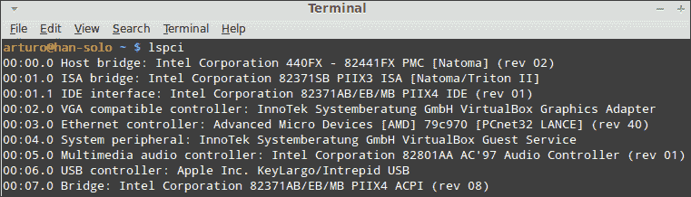

# 第十一章：故障排除

*系统管理员迟早会面临影响计算机的问题。有时这些问题与硬件有关，有时与软件有关。了解我们可以使用哪些工具来识别问题并尝试解决它们非常重要。在本章中，我们将学习可以帮助我们确定网络、硬件、内核、进程和文件系统发生了什么的基本命令和工具。*

在本章中，我们将学习以下主题：

+   硬件

+   检查日志文件

+   内核

+   网络

+   进程和文件系统

# 硬件

很多时候用户会发现与硬件相关的小问题，系统管理员可以迅速解决。然而，可能会出现难以解决或难以检测的问题。此外，许多设备或资源可能会引发不止一个问题。

内存和 CPU 是我们计算机非常重要的硬件组件。我们需要照顾它们，因为高负载可能会阻塞操作系统，因此我们的计算机会停止工作。此外，PCI 和 USB 设备可能会停止正常工作，因此当我们检测到硬件问题时应该检查它们。

# 操作时间 - 检查内存、CPU、USB 和 PCI 设备

在 Linux Mint 中，我们可以找到可以帮助我们了解硬件发生了什么的工具和命令。让我们发现一些检查内存、CPU、USB 和 PCI 设备的命令。

1.  我们的首要目标将是获取有关我们计算机上安装的所有 USB 设备的信息。像往常一样打开 MATE 终端，并输入以下命令：

    ```
    $ lsusb

    ```

1.  现在轮到 PCI 设备了，因此我们将执行下一个命令：

    ```
    $ lspci

    ```

1.  前一个命令的输出将向您显示类似于以下屏幕截图的内容：

1.  通过执行以下命令，可以获得我们硬件的完整详细列表：

    ```
    $ sudo lshw

    ```

1.  为了获取内存信息，我们将执行以下命令：

    ```
    $ cat /etc/meminfo

    ```

1.  作为输出，我们将得到类似于以下内容的几行：

    ```
    MemTotal:      824188 kB
    MemFree:       285016 kB
    Buffers:        64228 kB

    ```

1.  关于我们的 CPU，我们可以执行以下命令以获取有关我们机器上安装的处理器的信息：

    ```
    $ cat /etc/cpuinfo

    ```

## *刚刚发生了什么？*

为了获取有关我们 PCI 和 USB 设备的完整列表和大量信息，我们可以分别执行`lspci`和`lusb`命令。这些命令帮助我们了解设备是否被我们的计算机识别。请记住，有些设备可能无法被操作系统检测到，在这种情况下我们需要解决问题。

另一方面，`/proc/cpu`是一个包含计算机上安装的 CPU 信息的文件。`cat`命令已被用于显示所提及文件的内容。关于`/proc/cpu`文件，我们发现`/proc/meminfo`文件，其中包含我们计算机上使用的内存数据。所提及文件提供的一些信息包括总内存大小以及可用内存量。

`lshw`命令意味着“列出硬件”，它向我们展示了计算机上安装的所有硬件的详细列表。不要忘记以 root 用户身份执行`lshw`命令。

# 检查日志文件

Linux Mint 使用一组文件来记录操作系统中发生的不同活动。这类信息包括有关资源（如文件或网络）如何使用的数据。所有这些文件都位于`/var/log/`目录中。只有 root 用户可以更改这些文件，但其他用户可以阅读。最重要的日志文件之一是`/var/log/syslog`，这是一个通用日志，不同的应用程序在其中写入有关其活动的数据。除了这个通用日志文件，我们还可以找到许多其他文件，如`Xorg.0.log`、`dmesg`、`kern.log`和`dpkg.log`。通常，特定应用程序如 MySQL 和 Apache，会在`/var/log/`目录中使用自己的日志文件。检查提到的日志目录以了解计算机上发生的情况是一个好习惯。

# 行动时间 – 列出 syslog 文件的最后五行

我们将使用`tail`命令检查我们的`syslog`文件的最后五行。

1.  像往常一样打开 MATE 终端。

1.  执行以下命令：

    ```
    $ tail -5 /var/log/syslog

    ```

1.  作为输出，你将得到一些行，告诉你关于保存在`syslog`文件中的最后操作的信息。

## *刚刚发生了什么？*

我们使用了一个名为`tail`的命令来读取我们`syslog`文件的最后几行。这个命令以相反的顺序读取文件，并且可以接收一个数字作为参数。这个数字用于显示文件的特定行数。显然，你可以使用你喜欢的编辑器来阅读`syslog`文件，但使用`tail`更容易，因为这个命令的输出直接发送到你的终端。

# 内核

Linux 内核是我们 Linux Mint 操作系统的最重要组件，因此我们需要照顾它，并检查它是否正常工作。Linux 内核使用**模块**，这些是实现和扩展内核功能的组件，可以在不重启的情况下按需加载或卸载到内核中。

模块的使用有很多优点；其中之一是我们可以通过只加载所需的模块来节省内存。另一个明显的优点是可以在不重启计算机的情况下动态加载模块。这节省了大量时间，而且我们不需要停止服务。由于模块的重要性，系统管理员应该检查内核和模块状态。我们可以做到这一点，多亏了我们将要学习的命令。

# 行动时间 – 使用 lsmod、modprobe 和 dmesg 命令

系统管理员可以使用一些命令来获取有关内核的信息，其中一些命令是`lsmod`、`modprobe`和`dmesg`。让我们探索如何使用这些命令。

1.  启动 MATE 终端应用程序。

1.  执行以下命令：

    ```
    $ lsmod

    ```

1.  前一个命令的输出将显示有关已加载内核模块的信息。

1.  我们将执行以下命令以获取内核中可以加载的所有模块的列表：

    ```
    $ modprobe -l

    ```

1.  然后是执行`dmesg`命令的时候了，这将启动大量消息，因此我们将使用它来控制输出。在终端中输入以下命令：

    ```
    $ dmesg | more

    ```

## *刚刚发生了什么？*

为了了解 Linux 内核加载的每个模块的状态，我们可以执行`lsmod`命令。从技术角度来看，这个命令只是格式化了`/proc/modules`文件的内容。

系统管理员需要知道如何在 Linux 内核中加载和卸载模块。`modprobe`命令允许我们执行这些操作。它接收作为参数的模块名称，该模块将被加载或卸载。通过传递`-l`参数，我们可以找出哪些模块可供加载。

最后，`dmesg`命令对于获取与内核操作相关的信息非常有用。例如，如果我们将 USB 设备插入计算机，内核将创建一个日志消息，可以使用`dmesg`命令读取。通过使用`more`命令，您可以更轻松地阅读行。当然，您已经意识到我们使用了管道将`dmesg`的输出发送到`more`的输入。

# 网络

如今，网络是计算机使用的最有价值的资源之一。很难想象一个没有互联网或局域网连接的公司。有时系统管理员需要处理与网络相关的问题，因此了解可以使用哪些工具来检测和解决常见问题非常有趣。

当然，您一定听说过`ping`，这是一个向计算机和设备（如打印机）发送信息以获取响应并确保它们正常工作的命令。这个命令对于检查网络连接非常有用，如果`ping`没有得到响应，则无法建立连接，并且设备或计算机在网络通信方面存在故障。与`ping`相关，我们找到了`route`，这是一个显示我们计算机 IP 路由表的命令。此外，`route`允许我们更改该表。无法在我们路由表之外建立连接，因此当连接失败时检查它很重要。

另一个获取有关我们网络接口信息的实用命令是`ifconfig`。例如，使用`ifconfig`我们可以找出我们的服务器每个网络接口使用的 IP。此外，`ifconfig`允许我们通过命令行配置网络接口。

Linux Mint 还包括`netstat`，这是一个提供有关网络连接、路由表、接口统计、伪装连接和多播成员信息的命令。我们将在后面了解更多关于`netstat`命令的信息。

# 行动时间 – 检查谁在监听哪个端口

我们将学习如何使用`netstat`命令来找出哪些应用程序正在监听哪些端口。

1.  像往常一样打开 MATE 终端。

1.  输入并执行以下命令：

    ```
    $ netstat -tln

    ```

## *刚刚发生了什么？*

尽管执行 `netstat` 只是为了找出哪些程序正在监听哪些端口，但这个命令也可以用来获取有关网络连接和使用的更多信息。如果你不带任何参数执行 `netstat`，你将获得关于计算机上所有打开的套接字的信息。基本上，`netstat` 可以用来检查和监控计算机上的所有网络活动。你可以通过 `man` 和 `info` 命令获取更多关于 `netstat` 命令的信息。

# 进程和文件系统

进程和文件系统会导致许多计算机问题。请记住，进程是由驻留在文件系统中的程序创建的，因此它们之间有着密切的联系。如果计算机出现问题，查看正在运行的进程以及与这些进程相关的文件系统的状态是一个好主意。

`fuser` 命令非常有用，因为它提供了一个列表，显示了哪些文件被用于哪些进程。基本上，我们只需要通过传递特定进程的名称作为参数来执行这个命令。

Linux Mint 和其他 GNU/Linux 发行版包含 `strace`，这是一个可以用来发现特定进程使用的系统调用和库的工具。你可以输入 `strace` 后跟你想要跟踪的命令或应用程序。

通常，系统管理员使用 `top` 命令，该命令提供有关运行进程的完整信息，包括有关 CPU 和内存消耗的数据。另一个处理进程的有用工具是 `ps`。我们将学习如何使用该命令查找特定进程。

当系统管理员需要快速查看特定计算机上附着的文件系统时，他们使用 `df` 命令，该命令提供有关文件系统磁盘空间使用情况的信息。通过传递 `-h` 参数，我们将获得一个列表，其中包括大小、可用和已用空间、使用百分比以及每个文件系统挂载的位置。许多问题发生在文件系统没有空间或未挂载时，因此使用 `df` 来检测这类问题是一个好主意。

# 行动时间 – 查找特定进程

你将学习如何使用 `ps` 命令来查找计算机上运行的特定进程的信息。在我们的例子中，我们将查找 SSH 服务器守护进程进程。

1.  启动 MATE 终端。

1.  在你的 shell 中输入以下命令：

    ```
    $ ps -ef | fgrep -i sshd

    ```

1.  执行上一条命令后，我们将得到以下响应：

    ```
    root       768     1  0       09:06    ?            00:00:00  /usr/sbin/sshd -D
    arturo   16017 10434  0 16:07 pts/3    00:00:00   fgrep -i sshd

    ```

## *发生了什么？*

正如你所观察到的，我们通过管道连接符将 `ps` 和 `fgrep` 命令一起使用。`fgrep` 命令寻找特定的模式，在我们的例子中，`sshd` 作为那个模式。`ef` 参数表示我们正在查看所有运行的进程，使用 `ps` 命令的默认值格式化输出。使用管道，我们可以将 `ps` 命令的输出重定向到 `fgrep`。

你可能会好奇，如果我们只有一个`sshd`进程在运行，为什么会有两行输出。答案很容易解释：`sshd`字符串是管道命令`fgrep`的另一个名称，因此它的输出也会显示出来。

`ps`的每一行输出为我们提供了关于进程所有者、运行进程的路径、PID（进程 ID）、关联的终端以及启动时间的信息。请记住，我们为`sshd`进程得到一个问号，因为它是一个不与任何终端关联的守护进程。

如果你需要终止一个进程或获取更多关于它的信息，你可以使用 Linux Mint 内置的系统监视器工具。关于这个工具的更多信息可以在第十章，*监控*中找到。

# 总结

在本章中，你已经学习了哪些工具和命令可以帮助系统管理员检测和解决与硬件、网络、内核、文件系统和进程相关的常见问题。尽管每个问题都是独特的，但本章中描述的工具对于检查不同的资源和设备是否正常工作非常有用。

具体来说，我们涵盖了：

+   检查硬件组件，如内存、CPU、USB 和 PCI 设备

+   检查日志文件

+   学习如何列出内核中加载的模块

+   检查网络连接和找出哪些进程在哪些端口上监听的有用工具

+   处理运行中的进程

如果你需要寻找特定问题的帮助，以下资源可能非常有用：

+   系统管理员完整信息的维基可在[`sysadmin.wikia.com/wiki/Main_Page`](http://sysadmin.wikia.com/wiki/Main_Page)找到。

+   Linux 文档项目提供了一系列好的操作指南和手册，可在以下网址找到：

    +   [`tldp.org/docs.html#howto`](http://tldp.org/docs.html#howto)

    +   [`tldp.org/guides.html`](http://tldp.org/guides.html)

+   Linux Mint 的官方文档可在[`www.linuxmint.com/documentation.php`](http://www.linuxmint.com/documentation.php)找到。

+   Linux 内核的官方文档可在[`kernel.org/doc/`](http://kernel.org/doc/)找到。

至此，你已经学习了 Linux Mint 系统管理的基础知识。在本书中，我们解释了如何处理用户账户，如何安装和配置软件，网络和安全的基础知识，如何创建和恢复备份，以及最后一章专门介绍了系统监控。最后，我们完成了学习工具和命令的过程，这些可以帮助我们面对日常的常见问题。
