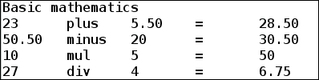

# 第一章 脚本之旅的开始

基于 Unix、类 Unix 或基于 Linux 的操作系统提供了许多强大的功能。其中，最强大和重要的功能是执行各种命令以快速轻松地执行任务；例如，`ls`、`cat`、`sort`、`grep`等。我们将在本书中了解一部分命令和用法。为了运行命令，我们需要一个被广泛称为**shell**的接口。

Shell 是一个充当用户（我们）和操作系统内核（Linux、Unix 等）之间接口的程序。就 Windows 操作系统而言，shell 的作用类似于 DOS。Unix、类 Unix 或 Linux 操作系统提供了不同的 shell。一些流行的 shell 包括 Bourne shell（sh）、C shell（csh）、Korn shell（ksh）、Bourne Again shell（bash）和 Z shell（zsh）。

在本书中，我们将使用 Linux 操作系统和 Bourne Again shell，通常简称为`bash`。基于 Linux 的系统通常已经安装了`bash`。如果没有安装`bash`，请尝试从您的发行版软件包管理器中安装 bash 软件包。要知道当前您的 Linux 控制台正在使用哪个 shell，请在终端中运行以下命令：

```
$ ps -p $$

```

输出如下：

```
 PID TTY          TIME CMD
12578 pts/4    00:00:00 bash

```

在前面的输出中，我们看到`CMD`列的值为`bash`。这意味着我们当前在当前控制台中使用`bash` shell。

如果您的控制台未使用`bash` shell，则可以运行以下命令：

```
$ bash

```

另外，您的 shell 现在将是`bash`。要将`bash`设置为默认登录 shell，请运行以下命令：

```
$ chsh -s /bin/bash

```

获得的输出如下：

```
Changing shell for user.
Password:******
Shell changed.

```

我们现在已经设置了`bash` shell，并准备详细学习 shell 脚本。Shell 脚本只是一系列按指定顺序由`bash`运行的命令的纯文本文件。当您必须通过运行各种命令执行一系列任务时，编写 shell 脚本非常有用，因为`bash`将从脚本文件中读取每一行并在没有用户干预的情况下运行它。用于 shell 脚本的一般文件扩展名是`.sh`、`.bash`、`.zsh`、`.ksh`等。与使用文件扩展名不同，最好将文件名保持无扩展名，并让解释器通过查看 shebang（`#!`）来识别类型。Shebang 用于指示脚本的解释器以进行执行。例如，它写在脚本文件的第一行中：

```
#! /bin/bash
```

这意味着使用`bash` shell 来执行给定的脚本。要运行 shell 脚本，请确保它具有执行权限。要为文件的所有者提供执行权限，请运行以下命令：

```
$ chmod u+x foo

```

在这里，`foo`是 shell 脚本文件。运行此命令后，`foo`将对文件的所有者具有执行权限。

现在，我们准备进一步学习 shell 脚本概念的细节。本书中涵盖的每个主题和子主题都将通过示例逐步引导我们成为优秀的 shell 脚本程序员。

在本章中，我们将广泛讨论以下主题：

+   Shell 中的 Hello World

+   定义所需的变量

+   内置 shell 变量

+   操作符

+   Shell 扩展

+   使用 eval 构建命令

+   使用 set 使 bash 行为

# Shell 中的 Hello World

每当我们学习一种新的编程语言时，我们首先学习如何在其中编写 Hello World 程序。这是了解和与新语言交互的最佳方式。这也有助于确认已经设置了给定语言中程序的基本环境，并且您可以深入了解这种语言。

## 与 shell 交互

我们可以以交互方式在控制台中打印命令的输出。控制台也被称为标准输入和输出流。要在`bash`控制台中打印任何内容，请使用`echo`命令，然后跟上要打印的内容：

```
$ echo Hello World
Hello World

```

或者，将要打印的文本放在双引号中：

```
$  echo "Hello World"
Hello World

```

您还可以将要打印的文本放在单引号中：

```
$ echo 'Hello World'
Hello World

```

我们还可以在 shell 编程中使用`printf`命令进行打印。`printf`命令也支持格式化打印，类似于 C 编程语言中的`printf()`函数：

```
$ printf "Hello World"
Hello World$

```

在这里，在输出之后，我们看到命令提示符（`$`），因为`printf`在执行后不会添加默认换行符，而`echo`会。因此，我们必须在`printf`语句中显式添加换行符（`\n`）以添加换行符：

```
$ printf "Hello World\n"
Hello World

```

类似于 C 中的`printf()`，我们可以在`bash`中指定格式化打印。`bash`的`printf`语法如下：

```
printf FORMAT [ARGUMENTS]

```

`FORMAT`是描述格式规范的字符串，并在双引号内指定。`ARGUMENTS`可以是与格式规范对应的值或变量。格式规范由百分号（`％`）后跟格式说明符组成。格式说明符在下表中解释：

| 格式规范 | 描述 |
| --- | --- |
| `％u` | 这将打印一个无符号整数值 |
| `％i`或`％d` | 这将打印一个关联的参数作为有符号数 |
| `％f` | 这将打印一个关联的参数作为浮点数 |
| `％o` | 这将打印一个无符号八进制值 |
| `％s` | 这将打印一个字符串值 |
| `％X` | 这将打印一个无符号十六进制值（0 到 9 和 A 到 F） |
| `％x` | 这将打印一个无符号十六进制值（0 到 9 和 a 到 f） |

以下示例演示了如何在 shell 中使用格式规范打印不同的数据类型格式：

```
$ printf "%d mul %f = %f\n" 6 6.0 36.0
6 mul 6.000000 = 36.000000
$ printf "%s Scripting\n" Shell
Shell Scripting

```

我们还可以在格式规范中可选地指定修饰符，以对齐输出以提供更好的格式。格式修饰符放置在`％`和格式说明符字符之间。以下表格解释了格式修饰符：

| 格式修饰符 | 描述 |
| --- | --- |
| N | 这是指定最小字段宽度的任何数字。 |
| 。 | 这与字段宽度一起使用。文本变长时，字段不会扩展。 |
| - | 这是字段中左边界文本打印。 |
| 0 | 这用于用零（0）而不是空格填充填充。默认情况下，使用空格填充。 |

以下示例演示了如何使用格式修饰符来改进打印格式：

```
$ printf "%d mul %.2f = %.2f\n" 6 6.0 36.0
6 mul 6.00 = 36.00

```

## 让我们把它写成脚本

如果我们需要打印一两行，交互式打印是很好的，但是对于大量打印，编写脚本文件是很好且更可取的。脚本文件将包含所有指令，我们可以运行脚本文件来执行所需的任务。

现在，我们将创建一个`bash`脚本文件，利用`echo`和`printf`命令并打印消息：

```
#!/bin/bash
#Filename: print.sh
#Description: print and echo

echo "Basic mathematics"
printf "%-7d %-7s %-7.2f =\t%-7.2f\n" 23 plus 5.5 28.5
printf "%-7.2f %-7s %-7d =\t%-7.2f\n" 50.50 minus 20 30.50 
printf "%-7d %-7s %-7d =\t%-7d\n" 10 mul 5 50
printf "%-7d %-7s %-7d =\t%-7.2f\n" 27 div 4 6.75

```

`bash`脚本中的第一行表示所使用的解释器的路径。第二行是一个注释行，告诉脚本文件的文件名。在 shell 脚本中，我们使用`#`添加注释。此外，`echo`命令将打印在双引号内写的字符串。对于其余部分，我们使用`printf`来打印格式化输出。

要运行此脚本，我们将首先为此脚本的用户/所有者提供执行权限：

```
$ chmod u+x print.sh

```

然后，在控制台中运行脚本文件如下：

```
$ ./print.sh

```

运行此脚本后的结果如下：



# 定义所需的变量

现在我们知道如何编写一个简单的 hello world shell 脚本。接下来，我们将熟悉 shell 中的变量以及如何定义和使用 shell 中的变量。

## 命名规则

变量名可以是字母数字和下划线的组合。变量的名称也不能以数字开头。shell 脚本中的变量名称是区分大小写的。特殊字符，如*，-，+，〜，。，^等，在变量名称中不使用，因为它们在 shell 中具有特殊含义。以下表格说明了命名变量的正确和不正确的方式：

| 正确的变量名 | 不正确的变量名 |
| --- | --- |
| variable | 2_variable |
| variable1 | 2variable |
| variable_2 | variable$ |
| _variable3 | variable*^ |

## 分配一个值

我们可以使用赋值（`=`）运算符为变量赋值，然后是一个值。在分配变量值时，赋值运算符前后不应有任何空格。还有，变量不能单独声明；必须跟随其初始值分配：

```
$ book="Linux Shell Scripting"  # Stores string value

$ book = "Linux Shell Scripting"  # Wrong, spaces around = operator
$ total_chapters=8    # Stores integer value
$ number_of_pages=210    # Stores integer value
$ average_pages_per_chapter=26.25    # Stores float value

```

因此，在 shell 脚本中声明和赋值变量非常容易。您不必担心左侧的变量的数据类型。无论您在右侧提供什么值，变量都会存储该值。

### 提示

**下载示例代码**

您可以从[`www.packtpub.com`](http://www.packtpub.com)的帐户中下载示例代码文件，用于您购买的所有 Packt Publishing 图书。如果您在其他地方购买了本书，可以访问[`www.packtpub.com/support`](http://www.packtpub.com/support)并注册，以便直接将文件发送到您的电子邮件。

## 访问值

要访问变量值，请使用美元符号（`$`）运算符，后跟变量名：

```
#!/bin/bash
#Filename: variables.sh
#Description: Basic variable definition and accessing them

book="Linux Shell Scripting"
total_chapters=8
number_of_pages=210
average_pages_per_chapter=26.25

echo "Book name - $book"
echo "Number of Chapters - $total_chapters"
printf "Total number of pages in book - $number_of_pages\n"
printf "Average pages in each chapter - %-.2f\n" $average_pages_per_chapter
```

此脚本的结果如下：

```
Book name - Linux Shell Scripting
Number of Chapters - 8
Total number of pages in book - 210
Average pages in each chapter – 26.25
```

我们可以使用`unset`关键字在`bash`中删除变量的值。使用`unset`将变量删除并重置为空：

```
#!/bin/bash
#Filename: unset.sh
#Description: removing value of a variable

fruit="Apple"
quantity=6
echo "Fruit = $fruit , Quantity = $quantity"
unset fruit
echo "Fruit = $fruit , Quantity = $quantity"
```

运行此脚本后的结果如下：

```
Fruit = Apple , Quantity = 6
Fruit =  , Quantity = 6
```

很明显，我们在水果变量上使用了 unset，所以当我们尝试在第 8 行取消设置变量水果后，它什么也不打印。`quantity`变量仍保留其值，因为我们没有在其上使用 unset。

## 常量变量

我们还可以在`bash`中创建`constant`变量，其值无法更改。使用`readonly`关键字声明常量变量。我们还可以使用`declare -r`后跟变量名使其成为常量：

```
#!/bin/bash
#Filename: constant.sh
#Description: constant variables in shell

readonly text="Welcome to Linux Shell Scripting"
echo $text
declare -r number=27
echo $number
text="Welcome"

```

运行此脚本后的结果如下：

```
Welcome to Linux Shell Scripting
27
constant.sh: line 9: text: readonly variable
```

从错误消息中可以明显看出，我们无法更改常量变量的值，也无法取消常量变量的值。

## 从用户输入中读取变量

我们可以使用`read` shell 内置命令要求用户提供输入。用户要提供的输入数量等于提供给`read`的参数数量。用户插入的值存储在传递给`read`的相应参数中。所有参数都充当变量，其中存储相应的用户输入值。

`read`的语法如下：

```
read [options] var1 var2  … varN
```

如果未指定参数中的变量，则用户的输入值将存储在内置变量`REPLY`中，并且可以使用`$REPLY`进一步访问。

我们可以按如下方式在其输入变量中读取用户输入：

```
$ read
    Hello World
$ echo $REPLY
    Hello World
```

我们可以按如下方式从用户输入中读取值：

```
$ read text
    Hello
$ echo $text
    Hello
```

我们可以按如下方式从用户输入中读取多个值：

```
$ read name usn marks
    Foo 345 78
$ echo $name $usn $marks
    Foo 345 78
```

我们可以仅读取`n`个字符，而不必等待用户输入完整行，如下所示：

```
$ read -n 5    # option -n number takes only 5 characters from user input
    Hello$
$ echo $REPLY
    Hello
```

我们可以在读取用户输入之前提示用户消息如下：

```
$ read -p "What is your name?"    # -p allows to prompt user a message
    What is your name?Foo
$  echo $REPLY
    Foo
```

在控制台中读取时隐藏输入字符：

```
$  read -s -p "Enter your secret key:"  # -s doesn't echo input in console
Enter your secret key:$    #Pressing enter key brings command prompt $
echo $REPLY
foo
```

以下示例显示了`read`命令的用法：

```
#!/bin/bash
#Filename: read.sh
#Description: Find a file in a path entered by user

read -p "Enter filename to be searched:"
filename=$REPLY
read -p "Enter path for search:" path
echo "File $filename search matches to"
find $path -name $filename

```

在`bash`中运行`read.sh`脚本的结果如下：

```
Enter filename to be searched:read
Enter path for search:/usr/bin
File read search matches to
/usr/bin/read

```

在这里，`find`命令已用于在指定路径中搜索文件名。命令`find`的详细讨论将在第六章中进行，*处理文件*。

# 内置 shell 变量

内置 shell 变量是预定义的全局变量，我们可以在脚本的任何时间点使用它们。这些是保留的 shell 变量，其中一些可能由`bash`分配默认值。某些变量的值将取决于当前的 shell 环境设置。不同类型的 shell 可能具有一些特定的保留变量。所有内置 shell 变量的名称都将是大写。

`bash` shell 中可用的一些保留 shell 变量如下：

| 在 bash 中可用的 shell 变量 | 描述 |
| --- | --- |
| `BASH` | 这是当前调用的`bash`的绝对路径 |
| `BASH_VERSION` | 这是`bash`的版本号 |
| `BASHPID` | 这是当前`bash`进程的进程 ID |
| `EUID` | 这是当前用户的有效用户 ID，在启动时分配 |
| `HOME` | 这是当前用户的主目录 |
| `HOSTNAME` | 这是当前主机的名称 |
| `PATH` | 这是 shell 将查找命令的以冒号分隔的目录列表 |
| `PPID` | 这是 shell 父进程的进程 ID |
| `PWD` | 这是当前工作目录 |

可以在`man bash`中找到更多的 shell 变量。

我们将通过在 shell 脚本中打印其值来查看这些 shell 变量包含的值：

```
#!/bin/bash
#Filename: builtin_shell_variables.sh
#Description: Knowing about builtin shell variables

echo "My current bash path - $BASH"
echo "Bash version I am using - $BASH_VERSION"
echo "PID of bash I am running - $BASHPID"
echo "My home directory - $HOME"
echo "Where am I currently? - $PWD"
echo "My hostname - $HOSTNAME"
```

运行此脚本后，输出可能会有所不同，具体取决于系统中这些变量的值设置为何。示例输出如下：

```
My current bash path - /bin/sh
Bash version I am using – 4.3.33(1)-release
PID of bash I am running - 4549
My home directory - /home/sinny
Where am I currently? - /home/sinny/Documents/
My hostname – localhost.localdomain
```

shell 变量，如`PWD`、`PATH`、`HOME`等，非常有用，可以通过简单地回显其中的值来快速获取信息。我们还可以添加或修改一些 shell 变量的值，如`PATH`，以便在其中添加我们希望 shell 查找命令的自定义路径。

修改`PATH`变量值的一个用例是：假设我已经编译了一个生成一些二进制文件（如`foo`和`bar`）的源代码。现在，如果我希望 shell 也在该特定目录中搜索命令，那么将该目录路径添加到`PATH`变量中即可。以下是一个小的 shell 脚本示例，显示了如何执行此操作：

```
#!/bin/bash
#Filename: path_variable.sh
#Description: Playing with PATH variable

echo "Current PATH variable content - $PATH"
echo "Current directory - $PWD"
echo "Content of current directory\n`ls`"
PATH=$PATH:$PWD
echo "New PATH variable content - $PATH"
# Now execute commands available in current working diectory
```

运行此脚本后的输出将如下所示：

```
Current PATH variable content - /usr/lib64/qt-3.3/bin:/bin:/usr/bin:/usr/local/bin:/usr/local/sbin:/usr/sbin:/home/sinny/go/source_code/go/bin:/home/sinny/.local/bin:/home/sinny/bin
Current directory - /home/sinny/test_project/bin
Content of current directory – foo bar
New PATH variable content - /usr/lib64/qt-/usr/lib64/qt-3.3/bin:/bin:/usr/bin:/usr/local/bin:/usr/local/sbin:/usr/sbin:/home/sinny/go/source_code/go/bin:/home/sinny/.local/bin:/home/sinny/bin: /home/sinny/test_project/bin
```

从输出中我们可以看到，新的`PATH`变量已经添加了我的自定义路径。从下一次开始，每当我使用设置了这个自定义`PATH`变量的`foo`或`bar`命令时，就不需要`foo`和`bar`命令/二进制文件的绝对路径了。Shell 将通过查看其`PATH`变量来找到这些变量。这仅在当前 shell 会话期间有效。我们将在第五章中看到这一点，*自定义环境*中的配方，*修改 shell 环境*。

# 操作符

与其他编程语言类似，shell 编程也支持各种类型的操作符来执行任务。操作符可以分为以下几类：

+   赋值操作符

+   算术操作符

+   逻辑操作符

+   比较操作符

## 赋值操作符

等于操作符（`=`）是用于初始化或更改变量值的赋值操作符。此操作符适用于任何数据，如字符串、整数、浮点数、数组等。例如：

```
$ var=40           # Initializing variable var to integer value
$ var="Hello"    # Changing value of var to string value
$ var=8.9        # Changing value of var to float value

```

## 算术操作符

算术操作符用于对整数执行算术运算。它们如下：

+   +（加）

+   -（减）

+   *（乘法）

+   /（除法）

+   **（指数）

+   %（取模）

+   +=（加等于）

+   -=（减等于）

+   *=（乘等于）

+   /=（斜杠等于）

+   %=（模等于）

要执行任何算术操作，在实际算术表达式之前，我们需要在`bash`中加上`expr`和`let`关键字。以下示例显示了如何在`bash`中执行算术操作：

```
#!/bin/bash
#Filename: arithmetic.sh
#Description: Arithmetic evaluation

num1=10 num2=5
echo "Numbers are num1 = $num1 and num2 = $num2"
echo "Addition = `expr $num1 + $num2`"`"
echo "Subtraction = `expr $num1 - $num2`"
echo "Multiplication = `expr $num1 \* $num2`"
echo "Division = `expr $num1 / $num2`"
let "exponent = $num1 ** num2"
echo "Exponentiation = $exponent" 
echo "Modulo = `expr $num1 % $num2`"
let "num1 += $num2"
echo "New num1 = $num1"
let "num1 -= $num1"
echo "New num2 = $num2"
```

运行此脚本后的结果如下：

```
Numbers are num1 = 10 and num2 = 5
Addition = 15
Subtraction = 5
Multiplication = 50
Division = 2
Exponentiation = 100000
Modulo = 0
New num1 = 15
New num2 = 5
```

## 逻辑操作符

逻辑操作符也被称为布尔操作符。它们是：

**!**（**非**）、**&&**（**与**）和**||**（**或**）

执行逻辑操作返回一个布尔值，如`true（1）`或`false（0）`，具体取决于操作所涉及的变量的值。

一个有用的用例是：假设我们希望在第一个命令或操作成功返回时执行一个命令。在这种情况下，我们可以使用`&&`操作符。同样，如果我们想要执行另一个命令，无论第一个命令是否执行，我们都可以在两个命令之间使用`||`操作符。我们可以使用!操作符来否定真值。例如：

```
$ cd ~/Documents/ && ls

```

`cd`命令用于将当前路径更改为指定的参数。在这里，`cd ~/Documents/`命令将更改目录到`Documents`（如果存在）。如果失败，则`ls`不会被执行，但如果`cd`到`Documents`成功，则`ls`命令将显示`Documents 目录`的内容：

```
$ cat ~/file.txt  || echo "Current Working directory $PWD"
cat: /home/skumari/file.txt: No such file or directory
Current Working directory /tmp/

```

`cat`命令显示`file.txt`的内容（如果存在）。无论`cat ~/file.txt`命令是否执行，稍后将执行的命令是`echo "当前工作目录 $PWD"`：

```
$  ! cd /tmp/foo && mkdir /tmp/foo
bash: cd: /tmp/foo: No such file or directory

```

通过运行上述命令，首先会尝试更改目录到`/tmp/foo`。在这里，`! cd /tmp/foo`表示如果更改目录到`/tmp/foo`不成功，则运行第二个命令，即`mkdir /tmp/foo`。`mkdir`命令用于创建一个新目录。由于进行命令执行，如果目录`/tmp/foo`不存在，它将被创建。

```
$ cd /tmp/foo

```

自从`/tmp/foo`目录被创建后，目录的成功更改将发生。

## 比较运算符

比较运算符比较两个变量，并检查条件是否满足。它们对整数和字符串有所不同。

对整数变量有效的比较运算符（将`a`和`b`视为两个整数变量；例如，`a=20, b=35`）如下：

+   -eq（等于）- `[ $a -eq $b ]`

+   -ne（不等于）- [ $a -ne $b ]

+   -gt（大于）- [ $a -gt $b ]

+   -ge 或>=（大于或等于）- [ $a -ge $b ]

+   -lt（小于）- [ $a -lt $b ]

+   -le（小于或等于）- [ $a -le $b ]

+   <（小于）- (($a < $b))

+   <=（小于或等于）- (($a <= $b))

+   > (is greater than) - (($a > $b))

+   >=（大于或等于）- (($a >= $b))

对字符串变量有效的比较运算符（将 a 和 b 视为两个字符串变量；例如，a="Hello" b="World"）如下：

+   =（等于）；例如，`[ $a = $b ]`

+   !=（不等于）；例如，[ $a != $b ]

+   <（小于）；例如，[ $a \< $b ]或[[ $a \< $b ]]或(( $a \< $b ))

+   > （大于）；例如，[ $a \> $b ]或[[ $a > $b ]]或(( $a \> $b ))

+   -n（字符串非空）；例如，[ -n $a ]

+   -z（字符串长度为零或为空）；例如，[ -z $a ]

Shell 使用`<`和`>`操作符进行重定向，因此如果在[ … ]下使用，应该使用转义（`\`）。双括号，(( ... ))或[[ … ]]，不需要转义序列。使用[[ … ]]还支持模式匹配。

我们将在第三章中更详细地看到操作符的用法和示例，*有效脚本编写*。

# Shell 扩展

在使用 shell 时，我们执行了许多类似和重复的任务。例如，在当前目录中，有 100 个文件，但我们只对文件扩展名为`.sh`的 shell 脚本感兴趣。我们可以执行以下命令来查看当前目录中的 shell 脚本文件：

```
$ ls *.sh

```

这将显示所有以`.sh`结尾的文件。从这里可以得到一个有趣的启示是`*`通配符。它表示文件名可以是任何东西，并以`.sh`结尾的文件列表。

Shell 扩展所有通配符模式。最新通配符模式列表如下：

+   ~（波浪号）

+   *（星号）

+   ?（问号）

+   [ ]（方括号）

+   { }（花括号）

为了解释不同通配符的 shell 扩展，我们将在我们的`home`目录中使用`mkdir`命令创建一个测试文件夹，其中包含如下所述的不同文件：

```
$ mkdir  ~/test && cd ~/test
$ touch a ab foo bar hello moo foo.c bar.c moo.c hello.txt foo.txt bar.sh hello.sh moo.sh

```

`touch`命令如果文件不存在则创建一个空文件。如果文件存在，则文件时间戳会更改：

```
$ ls
a  ab  bar  bar.c  bar.sh  foo  foo.c  foo.txt  hello  hello.sh  hello.txt  moo  moo.c  moo.sh

```

运行上述命令将创建一个测试目录，并在测试目录中创建作为`touch`命令参数给出的文件。 

## ~（波浪号）

当`~`出现在未引用字符串的开头时，`~`会被`bash`扩展。扩展取决于使用了什么`tilde-prefix`。`tilde-prefix`是直到第一个未引用的（/）斜杠的字符。一些`bash`扩展如下：

+   `~`：这是用户的主目录；该值设置在`$HOME`变量中

+   `~user_name`：这是用户`user_name`的主目录

+   `~user_name`/`file_name`：这是用户`user_name`主目录中的文件/目录`file_name`

+   `~/file_name`：这是`$HOME`/`file_name`中的文件/目录

+   `~+`：这是当前工作目录；该值设置在`$PWD`变量中

+   `~-`：这是旧的或上一个工作目录；该值设置在`$OLDPWD`变量中

+   `~+/file_name`：这是当前目录中的文件/目录`file_name`，即`$PWD/file_name`

+   `~-/file_name`：这是旧/上一个工作目录中的文件/目录`file_name`，即`$OLDPWD/file_name`

## *（星号）

它匹配零个或多个字符。以测试目录为例：

+   按如下方式显示所有文件：

```
$ ls *
a  ab  bar  bar.c  bar.sh  foo  foo.c  foo.txt  hello  hello.sh  hello.txt  moo  moo.c  moo.sh

```

+   按如下方式显示 C 源文件：

```
$ ls *.c
bar.c  foo.c  moo.c

```

+   按如下方式显示具有`a`的文件：

```
$ ls *a*
a  ab  bar  bar.c  bar.sh

```

+   按如下方式删除具有扩展名.txt 的文件：

```
$ rm *.txt
$ ls
a  ab  bar  bar.c  bar.sh  foo  foo.c  hello  hello.sh  moo  moo.c  moo.sh

```

## ？（问号）

它匹配任何单个字符：？（单个问号将匹配一个字符），??（双问号匹配任何两个字符），依此类推。以测试目录为例：

```
$ touch a ab foo bar hello moo foo.c bar.c moo.c hello.txt foo.txt bar.sh hello.sh moo.sh

```

这将重新创建在上一个示例中删除的文件，并更新现有文件的访问和修改时间：

+   获取文件名长度与扩展文件无关：

```
$ ls ??
ab

```

+   获取文件名长度为 2 或 5 的文件：

```
$ ls ?? ?????
ab  bar.c  foo.c  hello  moo.c

```

+   删除文件名为四个字符长的文件：

```
$ rm ????
rm: cannot remove '????': No such file or directory
This error is because there is no file name with 4 character

```

+   将文件移动到`/tmp`目录，文件名至少为三个字符长：

```
$ mv ???* /tmp
$ ls
a ab

```

我们只在测试目录中看到两个文件，因为其余的文件长度为 3 或更长。

## [ ]（方括号）

方括号匹配方括号内提到的字符集中的任何字符。字符可以指定为单词或范围。

使用 -（连字符）可以指定一系列字符。例如：

+   `[a-c]`：这匹配 a、b 或 c

+   `[a-z]`：这匹配从 a 到 z 的任何字符

+   `[A-Z]`：这匹配从 A 到 Z 的任何字符

+   `[0-9]`：这匹配 0 到 9 之间的任何字符

以测试目录为例，在测试目录中重新创建文件：

```
$ touch a ab foo bar hello moo foo.c bar.c moo.c hello.txt foo.txt bar.sh hello.sh moo.sh

```

获取文件名以`a`、`b`、`c`或`d`开头的文件，使用以下命令：

```
$ ls [a-d]*
a  ab  bar  bar.c  bar.sh

```

获取文件名以任何字母开头并以字母`o`或`h`结尾的文件，使用以下命令：

```
$  ls [a-zA-Z]*[oh]
foo  hello  hello.sh  moo  moo.sh

```

获取文件名中至少包含两个字母`o`的文件，使用以下命令：

```
$ ls *[o]*[o]*
foo  foo.c  foo.txt  moo  moo.c  moo.sh

```

`[!characters]`（感叹号）用于匹配不在方括号内提到的字符集中的字符。

获取文件名中不包含数字的文件，使用以下命令：

```
$  ls [!0-9]*
a  ab  bar  bar.c  bar.sh  foo  foo.c  foo.txt  hello  hello.sh  hello.txt  moo  moo.c  moo.sh

```

## { }（花括号）

它创建多个通配符模式进行匹配。花括号表达式可以包含逗号分隔的字符串列表、范围或单个字符。

可以使用以下方式指定范围：

+   `{a..z}`：这匹配从 a 到 z 的所有字符

+   `{0..6}`：这匹配数字 0、1、2、3、4、5 和 6

以测试目录为例，重新创建测试目录中的文件：

```
$ touch a ab foo bar hello moo foo.c bar.c moo.c hello.txt foo.txt bar.sh hello.sh moo.sh

```

获取具有文件扩展名`.sh`或`.c`的文件，使用以下命令：

```
$ ls {*.sh,*.c}
bar.c  bar.sh  foo.c  hello.sh  moo.c  moo.sh

```

使用以下命令将`bar.c`复制到`bar.html`：

```
$ cp bar{.c,.cpp}  # Expands to cp bar.c bar.cpp
$ ls bar.*
bar.c  bar.cpp  bar.sh

```

使用以下命令打印从`1`到`50`的数字：

```
$ echo {1..50}
1 2 3 4 5 6 7 8 9 10 11 12 13 14 15 16 17 18 19 20 21 22 23 24 25 26 27 28 29 30 31 32 33 34 35 36 37 38 39 40 41 42 43 44 45 46 47 48 49 50

```

创建以`hello`开头并具有扩展名`.cpp`的 10 个文件：

```
$ touch hello{0..9}.cpp
$ ls *.cpp
hello0.cpp  hello1.cpp  hello2.cpp  hello3.cpp  hello4.cpp  hello5.cpp  hello6.cpp  hello7.cpp  hello8.cpp  hello9.cpp

```

为了避免通配符的 shell 扩展，使用反斜杠（\）或在单引号（' '）中写入字符串。

# 使用 eval 构建命令

`eval`命令是一个 shell 内置命令，用于通过连接传递给`eval`的参数来构造一个命令。连接的命令进一步由 shell 执行并返回结果。如果没有给`eval`传递参数，则返回`0`。

`eval`命令的语法如下：

```
eval [arg …]

```

以下示例显示了使用`eval`将变量扩展为另一个变量的名称：

```
$ name=foo
$ foo="Welcome to foo world"
$ echo $name
foo
$ new_name='$'$name    #new_name just stores string value $foo
$ echo $new_name
$foo
$ eval new_name='$'$name  # eval processes $foo string into variable and  prints                 # foo variable value
Welcome to foo world
```

`eval`有用的另一个示例如下：

```
$ pipe="|"
$  df $pipe wc  # Will give error because 
df: '|': No such file or directory
df: 'wc': No such file or directory
$ eval df $pipe wc  # eval executes it as shell command
12      73     705
```

在这里，`df`命令显示了系统磁盘的使用情况：

```
A shell script showing the use of eval is as follows:
#!/bin/bash
#Filename: eval.sh
#Description: Evaluating string as a command using eval

cmd="ls /usr"
echo "Output of command $cmd -"
eval $cmd   #eval will treat content of cmd as shell command and execute it
cmd1="ls /usr | wc -l"
echo "Line count of /usr -"
eval $cmd1

expression="expr 2 + 4 \* 6"
echo "Value of $expression"
eval $expression
```

运行脚本将给出以下结果：

```
Output of command ls /usr -
avr  bin  games  include  lib  lib64  libexec  local  sbin  share  src  tmp
Line count of /usr -
12
Value of expr 2 + 4 \* 6
26
```

# 使用 set 使 bash 行为

`set`命令是一个 shell 内置命令，用于在 shell 中设置和取消设置本地变量的值。

使用 set 的语法如下：

```
 set [--abBCefhHkmnpPtuvx] [-o option] [arg …]

```

一些选项值是`allexport`、`braceexpand`、`history`、`keyword`、`verbose`和`xtrace`。

使用不带任何选项的`set`命令以一种格式显示所有 shell 变量和函数的名称和值，该格式可以作为设置和取消当前设置变量的输入重用。

## 在第一次失败时退出

在 shell 脚本中，默认情况下，如果当前行发生错误，则会执行下一行。有时，我们可能希望在遇到错误后停止运行脚本。`set`的`-e`选项确保一旦管道中的任何命令失败，脚本就会退出。

在以下 shell 脚本中，`do_not_exit_on_failure.sh`不使用带有`-e`选项的`set`：

```
$ cat do_not_exit_on_failure.sh

```

```
#!/bin/bash
# Filename: do_not_exit_on_failure.sh
# Description: Resume script after an error

echo "Before error"
cd /root/       # Will give error
echo "After error"
```

运行此脚本后，输出如下：

```
Before error
do_not_exit_on_failure.sh: line 6: cd: /root/: Permission denied
After error
```

我们看到错误后的命令也被执行了。为了在遇到错误后停止执行，请在脚本中使用`set -e`。以下脚本演示了相同的情况：

```
$ cat exit_on_failure.sh

```

```
#!/bin/bash
# Filename: exit_on_failure.sh
# Description: Exits script after an error

set -e
echo "Before error"
cd /root/       # Will give error
echo "After error"
```

运行上述脚本后的输出如下：

```
Before error
exit_on_failure.sh: line 7: cd: /root/: Permission denied
```

我们可以看到，在第 7 行遇到错误后，脚本已经终止。

## 启用/禁用符号链接的解析路径

使用带有`-P`选项的`set`不解析符号链接。以下示例演示了如何启用或禁用`/bin`目录的符号链接解析，该目录是`/usr/bin/`目录的符号链接：

```
$ ls -l /bin
lrwxrwxrwx. 1 root root 7 Nov 18 18:03 /bin -> usr/bin
$ set –P    # -P enable symbolic link resolution
$ cd /bin
$ pwd
/usr/bin
$ set +P   # Disable symbolic link resolution
$ pwd
/bin

```

## 设置/取消设置变量

我们可以使用`set`命令查看当前进程可访问的所有本地变量。本地变量在子进程中不可访问。

我们可以创建自己的变量并将其设置为本地，如下所示：

```
$ MYVAR="Linux Shell Scripting"
$ echo $MYVAR
 Linux Shell Scripting
$ set | grep MYVAR  # MYVAR local variable is created
MYVAR='Linux Shell Scripting'
$ bash    # Creating a new bash sub-process in current bash
$ set | grep MYVAR
$    # Blank because MYVAR is local variable

```

要使变量对其子进程也可访问，请使用`export`命令，后跟要导出的变量：

```
$ MYVARIABLE="Hello World"
$ export  MYVARIABLE
$ bash    # Creating a new bash sub-process under bash
$ echo $MYVARIABLE
Hello World

```

这将把`MYVARIABLE`变量导出到从该进程运行的任何子进程。要检查`MYVARIABLE`是否已导出，请运行以下命令：

```
$ export |grep MYVARIABLE
declare -x MYVARIABLE="Hello World"
$ export | grep MYVAR
$MYVAR variable is not present in sub-process but variable MYVARIABLE is present in sub-process.

```

要取消本地或导出的变量，请使用`unset`命令，它将将变量的值重置为 null：

```
$ unset MYVAR        # Unsets local variable MYVAR
$ unset  MYVARIABLE    # Unsets exported variable MYVARIABLE

```

# 总结

阅读完本章后，您了解了如何通过打印、回显和询问用户输入来在 bash 中编写简单的 shell 脚本。您现在应该对在 shell 中定义和使用变量以及存在哪些内置 shell 变量有了很好的理解。您现在熟悉 shell 中有哪些操作符，以及它们如何创建和评估自己的表达式。有关通配符的信息在本章中可用，这使得在处理类似类型的数据或模式时，工作变得更加容易。shell 内置命令`set`可以轻松修改 shell 变量。

本章为即将到来的章节奠定了基础。现在，在下一章中，您将了解有关标准输入、输出和错误的信息。此外，将详细介绍如何使用命令的输出，然后过滤/转换它们以根据您的需要显示数据。
