# 第二章：开始使用 I/O、重定向管道和过滤器

在日常工作中，我们会遇到不同类型的文件，比如文本文件、来自不同编程语言的源代码文件（例如`file.sh`、`file.c`和`file.cpp`）等。在工作时，我们经常对文件或目录执行各种操作，比如搜索给定的字符串或模式、替换字符串、打印文件的几行等。如果我们必须手动执行这些操作，那是很困难的。在一个包含成千上万个文件的目录中手动搜索字符串或模式可能需要几个月的时间，并且很容易出错。

Shell 提供了许多强大的命令，可以使我们的工作更轻松、更快速、更无误。Shell 命令有能力从不同的流（如标准输入、文件等）中操作和过滤文本。其中一些命令是`grep`、`sed`、`head`、`tr`、`sort`等。Shell 还具有将一个命令的输出重定向到另一个命令的功能，使用管道（`|`）。使用管道有助于避免创建不必要的临时文件。

这些命令中最好的一个特点是它们都有`man`页面。我们可以直接转到`man`页面，并通过运行`man`命令查看它们提供的所有功能。大多数命令都有选项，比如`--help`来查找帮助用法，以及`--version`来了解命令的版本号。

本章将详细介绍以下主题：

+   标准 I/O 和错误流

+   重定向标准 I/O 和错误流

+   管道和管道——连接命令

+   正则表达式

+   使用`grep`过滤输出

+   使用`sed`编辑输出

+   使用`tee`复制流

+   排序和查找唯一文本

+   使用`tr`进行基于字符的翻译

+   基于行的过滤——`head`和`tail`

+   基于切割的选择

# 标准 I/O 和错误流

在 shell 编程中，有不同的方式来提供输入（例如，通过键盘和终端）和显示输出（例如，终端和文件）以及执行命令或程序时的错误（例如，终端）。

以下示例显示了运行命令时的输入、输出和错误：

+   通过键盘由用户输入和通过标准输入流（即终端）由程序获取的输入如下：

```
$ read -p "Enter your name:"
Enter your name:Foo
```

+   打印在标准输出流（即终端）上的输出如下：

```
$ echo "Linux Shell Scripting"
Linux Shell Scripting
```

+   打印在标准错误流（即终端）上的错误消息如下：

```
$  cat hello.txt
cat: hello.txt: No such file or directory
```

当程序执行时，默认情况下会打开三个文件，它们是`stdin`、`stdout`和`stderr`。以下表格提供了这三个文件的简要描述：

| 文件描述符编号 | 文件名 | 描述 |
| --- | --- | --- |
| `0` | `stdin` | 这是从终端读取的标准输入 |
| `1` | `stdout` | 这是标准输出到终端 |
| `2` | `stderr` | 这是标准错误输出到终端 |

## 文件描述符

文件描述符是表示操作系统中打开文件的整数编号。每个打开的文件都有唯一的文件描述符编号。文件描述符的编号从`0`开始递增。

在 Linux 中创建新进程时，会为其提供标准输入、输出和错误文件，以及其他所需的打开文件。

要知道与进程相关联的所有打开文件描述符，我们将考虑以下示例：

首先运行一个应用程序并获取其进程 ID。考虑运行`bash`作为一个例子来获取 bash 的 PID：

```
$ pidof bash
2508 2480 2464 2431 1281
```

我们看到有多个 bash 进程正在运行。以 bash PID 示例`2508`为例，运行以下命令：

```
$  ls -l /proc/2508/fd

```

```
total 0
lrwx------. 1 sinny sinny 64 May 20 00:03 0 -> /dev/pts/5
lrwx------. 1 sinny sinny 64 May 20 00:03 1 -> /dev/pts/5
lrwx------. 1 sinny sinny 64 May 19 23:22 2 -> /dev/pts/5
lrwx------. 1 sinny sinny 64 May 20 00:03 255 -> /dev/pts/5
```

我们看到 0、1 和 2 这三个打开的文件描述符与 bash 进程相关联。目前，它们都指向`/dev/pts/5`。`pts`是伪终端从属。

因此，无论我们在这个 bash 中做什么，与此 PID 相关的输入、输出和错误都将被写入`/dev/pts/5`文件。但是，`pts`文件是伪文件，内容在内存中，因此当您打开文件时，您看不到任何内容。

# 重定向标准 I/O 和错误流

我们有选项可以重定向标准输入、输出和错误，例如到文件、另一个命令、预期的流等。重定向在不同方面非常有用。例如，我有一个 bash 脚本，其输出和错误显示在标准输出上，也就是终端上。我们可以通过将其中一个或两者重定向到文件来避免混合错误和输出。用于重定向的不同运算符。以下表格显示了一些用于重定向的运算符及其描述：

| 运算符 | 描述 |
| --- | --- |
| `>` | 这将标准输出重定向到文件中 |
| `>>` | 这将标准输出附加到文件中 |
| `<` | 这将标准输入从文件中重定向 |
| `>&` | 这将标准输出和错误重定向到文件中 |
| `>>&` | 这将标准输出和错误附加到文件中 |
| `&#124;` | 这将输出重定向到另一个命令 |

## 重定向标准输出

程序或命令的输出可以重定向到文件。将输出保存到文件中在将来查看输出时非常有用。对于使用不同输入运行的程序的大量输出文件，可以用于研究程序输出行为。

例如，将 echo 输出重定向到`output.txt`的示例如下：

```
$ echo "I am redirecting output to a file" > output.txt
$

```

我们可以看到终端上没有显示任何输出。这是因为输出被重定向到`output.txt`。运算符'>'（大于）告诉 shell 将输出重定向到运算符后面提到的任何文件名。在我们的情况下，它是`output.txt`：

```
$ cat output.txt
I am redirecting output to a file

```

现在，让我们向`output.txt`文件添加一些更多的输出：

```
$ echo "I am adding another line to file" > output.txt
$ cat output.txt
I am adding another line to file

```

我们注意到`output.txt`文件的先前内容被擦除了，现在只有最新重定向的内容。要保留先前的内容并将最新的重定向输出附加到文件中，使用运算符'>>'：

```
$ echo "Adding one more line" >> output.txt
$ cat output.txt 
I am adding another line to file
Adding one more line

```

我们还可以在 bash 中使用运算符' | '（管道）将程序/命令的输出重定向到另一个命令：

```
 $ ls /usr/lib64/ | grep libc.so
libc.so
libc.so.6

```

在这个例子中，我们使用' | '（管道）运算符将`ls`的输出传递给`grep`命令，`grep`给出了`libc.so`库的匹配搜索结果：

## 重定向标准输入

不是从标准输入获取输入到命令，而是使用<（小于）运算符从文件中重定向输入。例如，我们想要计算从*重定向标准输出*部分创建的`output.txt`文件中的单词数：

```
$ cat  output.txt
I am adding another line to file
Adding one more line
$  wc -w < output.txt 
11

```

我们可以对`output.txt`的内容进行排序：

```
$ sort < output.txt    # Sorting output.txt on stdout
Adding one more line
I am adding another line to file

```

我们还可以将`patch`文件作为`patch`命令的输入，以便在源代码中应用`patch.diff`。`patch`命令用于应用对文件进行的额外更改。额外的更改以`diff`文件的形式提供。`diff`文件包含通过运行`diff`命令对原始文件和修改后文件之间的更改。例如，我有一个要应用在`output.txt`上的补丁文件：

```
$ cat patch.diff    # Content of patch.diff file

```

```
2a3
> Testing patch command
$ patch output.txt < patch.diff   # Applying patch.diff to output.txt
$ cat output.txt    # Checking output.txt content after applying patch
I am adding another line to file
Adding one more line
Testing patch command
```

## 重定向标准错误

在 bash 中执行命令/程序时可能会出现错误，原因可能是无效输入、参数不足、文件未找到、程序中的错误等：

```
$ cd /root  # Doing cd to root directory from a normal user
bash: cd: /root/: Permission denied
Bash prints the error on a terminal saying, permission denied.

```

通常，错误会打印在终端上，这样我们就可以很容易地知道错误的原因。在终端上打印错误和输出可能会很烦人，因为我们必须手动查看每一行，并检查程序是否遇到任何错误：

```
$ cd / ; ls; cat hello.txt; cd /bin/; ls *.{py,sh}

```

我们在前面的部分运行了一系列命令。首先`cd`到`/`，`ls`查看`/`的内容，cat 文件`hello.txt`，`cd`到`/bin`并查看`/bin`中匹配`*.py`和`*.sh`的文件。输出如下：

```
bin  boot  dev  etc  home  lib  lib64  lost+found  media  mnt  opt  proc  root  run  sbin  srv  sys  tmp  usr  var
cat: hello.txt: No such file or directory 
alsa-info.sh        kmail_clamav.sh    sb_bnfilter.py  sb_mailsort.py      setup-nsssysinit.sh    amuFormat.sh      kmail_fprot.sh   sb_bnserver.py    sb_mboxtrain.py    struct2osd.sh      core_server.py  kmail_sav.sh     sb_chkopts.py      sb_notesfilter.py  
```

我们看到`hello.txt`在`/`目录中不存在，因此终端上打印了一个错误，以及其他输出。我们可以按如下方式重定向错误：

```
$ (cd / ; ls; cat hello.txt; cd /bin/; ls *.{py,sh}) 2> error.txt

```

```
bin  boot  dev  etc  home  lib  lib64  lost+found  media  mnt  opt  proc  root  run  sbin  srv  sys  tmp  usr  var
alsa-info.sh        kmail_clamav.sh    sb_bnfilter.py  sb_mailsort.py      setup-nsssysinit.sh    amuFormat.sh      kmail_fprot.sh   sb_bnserver.py    sb_mboxtrain.py    struct2osd.sh      core_server.py  kmail_sav.sh     sb_chkopts.py      sb_notesfilter.py  
```

我们可以看到错误已重定向到`error.txt`文件。要验证，请检查`error.txt`的内容：

```
$ cat error.txt
cat: hello.txt: No such file or directory

```

## 多重重定向

我们可以在命令或脚本中重定向`stdin`，`stdout`和`stderr`，或者它们的一些组合。

以下命令重定向了`stdout`和`stder`：

```
$ (ls /home/ ;cat hello.txt;) > log.txt 2>&1

```

在这里，`stdout`被重定向到`log.txt`，错误消息也被重定向到`log.txt`。在`2>&1`中，`2>`表示重定向错误，`&1`表示重定向到`stdout`。在我们的情况下，我们已经将`stdout`重定向到`log.txt`文件。因此，现在`stdout`和`stderr`的输出都将写入`log.txt`，并且不会打印在终端上。要验证，我们将检查`log.txt`的内容：

```
$ cat log.txt
lost+found
sinny
cat: hello.txt: No such file or directory

```

以下示例显示了`stdin`，`stdout`和`stderr`的重定向：

```
$  cat < ~/.bashrc > out.txt 2> err.txt

```

在这里，`home`目录中的`.bashrc`文件作为`cat`命令的输入，并且其输出被重定向到`out.txt`文件。在中间遇到的任何错误都被重定向到`err.txt`文件。

以下`bash`脚本将更清楚地解释`stdin`，`stdout`，`stderr`及其重定向：

```
#!/bin/bash
# Filename: redirection.sh
# Description: Illustrating standard input, output, error
# and redirecting them

ps -A -o pid -o command > p_snapshot1.txt
echo -n "Running process count at snapshot1: "
wc -l < p_snapshot1.txt
echo -n "Create a new process with pid = "
tail -f /dev/null &  echo $!    # Creating a new process
echo -n "Running process count at snapshot2: "
ps -A -o pid -o command > p_snapshot2.txt
wc -l < p_snapshot2.txt
echo
echo "Diff bewteen two snapshot:"
diff p_snapshot1.txt p_snapshot2.txt
```

此脚本保存系统中所有运行进程的两个快照，并生成`diff`。运行进程后的输出将如下所示：

```
$ sh redirection.sh

```

```
Running process count at snapshot1: 246
Create a new process with pid = 23874
Running process count at snapshot2: 247

Diff bewteen two snapshot:
246c246,247
< 23872 ps -A -o pid -o command
---
> 23874 tail -f /dev/null
> 23875 ps -A -o pid -o command
```

# 管道和管道 - 连接命令

程序的输出通常保存在文件中以供进一步使用。有时，为了将一个程序的输出用作另一个程序的输入，会创建临时文件。我们可以使用 bash 管道和管道来避免创建临时文件，并将一个程序的输出作为另一个程序的输入。

## 管道

由运算符`|`表示的管道将左侧进程的标准输出连接到右侧进程的标准输入，通过进程间通信机制。换句话说，`|`（管道）通过将一个命令的输出作为另一个命令的输入来连接命令。

考虑以下示例：

```
$ cat /proc/cpuinfo | less

```

在这里，`cat`命令不是在`stdout`上显示`/proc/cpuinfo`文件的内容，而是将其输出作为`less`命令的输入。`less`命令从`cat`获取输入，并在每页上显示在`stdout`上。

另一个使用管道的示例如下：

```
$ ps -aux | wc -l    # Showing number of currently running processes in system
254

```

## 管道

管道是由运算符'`|`'分隔的程序/命令序列，每个命令的执行输出都作为下一个命令的输入。管道中的每个命令都在一个新的子 shell 中执行。语法如下：

`command1 | command2 | command3 …`

以下是显示管道的示例：

```
$ ls /usr/lib64/*.so | grep libc | wc -l
13

```

在这里，我们首先从`/usr/lib64`目录中获取具有`.so`扩展名的文件列表。获得的输出被传递给下一个`grep`命令，以查找`libc`字符串。输出进一步传递给`wc`命令以计算行数。

# 正则表达式

正则表达式（也称为 regex 或 regexp）提供了一种指定要在给定的大块文本数据中匹配的模式的方法。它支持一组字符来指定模式。它被广泛用于文本搜索和字符串操作。许多 shell 命令提供了指定正则表达式的选项，如`grep`，`sed`，`find`等。

正则表达式概念也用于其他编程语言，如 C++，Python，Java，Perl 等。不同语言中都有库来支持正则表达式的特性。

## 正则表达式元字符

正则表达式中使用的元字符在下表中解释：

| 元字符 | 描述 |
| --- | --- |
| *（星号） | 这匹配前一个字符的零个或多个出现 |
| +（加号） | 这匹配前一个字符的一个或多个出现 |
| ? | 这匹配前一个元素的零次或一次出现 |
| . (Dot) | 这匹配任何一个字符 |
| ^ | 这匹配行的开头 |
| $ | 这匹配行尾 |
| [... ] | 这匹配方括号内的任何一个字符 |
| [^... ] | 这匹配不在方括号内的任何一个字符 |
| &#124; (Bar) | 这匹配&#124;的左侧或右侧元素 |
| \{X\} | 这匹配前一个元素的确切 X 次出现 |
| \{X,\} | 这匹配前一个元素的 X 次或更多出现 |
| \{X,Y\} | 这匹配前一个元素的 X 到 Y 次出现 |
| \(...\) | 这将所有元素分组 |
| \< | 这匹配单词的开头的空字符串 |
| \> | 这匹配单词的末尾的空字符串 |
| \ | 这禁用下一个字符的特殊含义 |

## 字符范围和类

当我们查看人类可读的文件或数据时，其主要内容包含字母（a 到 z）和数字（0 到 9）。在编写用于匹配由字母或数字组成的模式的正则表达式时，我们可以使用字符范围或类。

### 字符范围

我们也可以在正则表达式中使用字符范围。我们可以通过一个连字符分隔的一对字符来指定范围。匹配介于该范围内的任何字符，包括在内。字符范围被包含在方括号内。

以下表格显示了一些字符范围：

| 字符范围 | 描述 |
| --- | --- |
| `[a-z]` | 这匹配 a 到 z 的任何单个小写字母 |
| `[A-Z]` | 这匹配从 A 到 Z 的任何单个大写字母 |
| `[0-9]` | 这匹配 0 到 9 的任何单个数字 |
| `[a-zA-Z0-9]` | 这匹配任何单个字母或数字字符 |
| `[h-k]` | 这匹配从 h 到 k 的任何单个字母 |
| `[2-46-8j-lB-M]` | 这匹配从 2 到 4 或 6 到 8 的任何单个数字，或从 j 到 l 或从 B 到 M 的任何字母 |

**字符类**：指定一系列字符匹配的另一种方法是使用字符类。它在方括号[:class:]内指定。可能的类值在下表中提到：

| 字符类 | 描述 |
| --- | --- |
| `[:alnum:]` | 这匹配任何单个字母或数字字符；例如，[a-zA-Z0-9] |
| `[:alpha:]` | 这匹配任何单个字母字符；例如，[a-zA-Z] |
| `[:digit:]` | 这匹配任何单个数字；例如，[0-9] |
| `[:lower:]` | 这匹配任何单个小写字母；例如，[a-z] |
| `[:upper:]` | 这匹配任何单个大写字母；例如，[A-Z] |
| `[:blank:]` | 这匹配空格或制表符 |
| `[:graph:]` | 这匹配 ASCII 范围内的字符—例如 33-126—不包括空格字符 |
| `[:print:]` | 这匹配 ASCII 范围内的字符—例如 32-126—包括空格字符 |
| `[:punct:]` | 这匹配任何标点符号，如'?'、'!'、'.'、','等 |
| `[:xdigit:]` | 这匹配任何十六进制字符；例如，[a-fA-F0-9] |
| `[:cntrl:]` | 这匹配任何控制字符 |

**创建您自己的正则表达式**：在正则表达式的前几节中，我们讨论了元字符、字符范围、字符类及其用法。使用这些概念，我们可以创建强大的正则表达式，用于根据我们的需要过滤文本数据。现在，我们将使用我们学到的概念创建一些正则表达式。

### 匹配 mm-dd-yyyy 格式的日期

我们将考虑从 UNIX 纪元开始的有效日期—即 1970 年 1 月 1 日。在这个例子中，我们将考虑从 UNIX 纪元到 2099 年 12 月 30 日之间的所有日期都是有效日期。形成其正则表达式的解释在以下小节中给出：

#### 匹配有效的月份

+   0[1-9] 匹配 01 到 09 月

+   1[0-2] 匹配第 10、11 和 12 个月

+   '|' 匹配左侧或右侧表达式

将所有内容放在一起，匹配日期的有效月份的正则表达式将是**0[1-9]|1[0-2]**。

#### 匹配有效的日期

+   0[1-9] 匹配 01 到 09 日

+   [12][0-9] 匹配 10 到 29 日

+   3[0-1] 匹配 30 到 31 日

+   '|' 匹配左侧或右侧表达式

+   **0[1-9]|[12][0-9]|3[0-1]** 匹配日期中的所有有效日期

#### 匹配日期中的有效年份

+   19[7-9][[0-9] 匹配从 1970 年到 1999 年的年份

+   20[0-9]{2} 匹配从 2000 年到 2099 年的年份

+   '|' 匹配左侧或右侧表达式

+   **19[7-9][0-9]|20[0-9]{2}** 匹配 1970 年到 2099 年之间的所有有效年份

#### 将有效的月份、日期和年份正则表达式组合成有效日期

我们的日期将以 mm-dd-yyyy 格式。通过将前面部分形成的月份、日期和年份的正则表达式放在一起，我们将得到有效日期的正则表达式：

（0[1-9]|1[0-2])-(0[1-9]|[12][0-9]|3[0-1])-(19[7-9][0-9]|20[0-9]{2）

有一个很好的网站，[`regexr.com/`](http://regexr.com/)，您也可以验证正则表达式。以下屏幕截图显示了在给定输入中匹配有效日期：

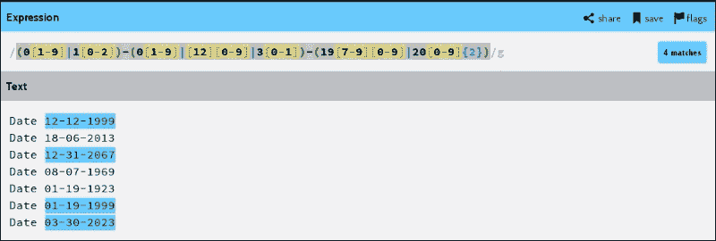

### 有效 shell 变量的正则表达式

在第一章中，*脚本之旅的开始*，我们学习了 shell 中变量的命名规则。有效的变量名可以包含来自字母数字和下划线的字符，并且变量的第一个字母不能是数字。

牢记这些规则，可以编写有效的 shell 变量正则表达式如下：

^[_a-zA-Z][_a-zA-Z0-9]*$

这里，^（插入符号）匹配行的开头。

正则表达式[_a-zA-Z]匹配 _ 或任何大写或小写字母[_a-zA-Z0-9]*匹配 _、任何数字或大写和小写字母的零次或多次出现$（美元符号）匹配行的结尾。

在字符类格式中，我们可以将正则表达式写成**^[_[:alpha:]][_[:alnum:]]*$**。

以下屏幕截图显示了使用正则表达式形成的有效 shell 变量：

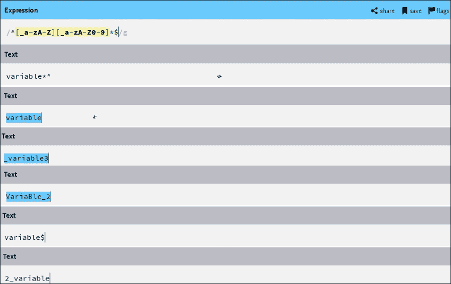

### 注意

+   将正则表达式放在单引号（'）中，以避免预先 shell 扩展。

+   在字符前使用反斜杠（\）来转义元字符的特殊含义。

+   元字符，如？、+、{、|、（和）被认为是扩展的正则表达式。当在基本正则表达式中使用时，它们失去了特殊含义。为了避免这种情况，使用反斜杠'\?'、'\+'、'\{'、'\|'、'\('和'\)'。

# 使用 grep 过滤输出

shell 中一个强大且广泛使用的命令是`grep`。它在输入文件中搜索并匹配包含给定模式的行。默认情况下，所有匹配的模式都打印在通常是终端的`stdout`上。我们还可以将匹配的输出重定向到其他流，例如文件。`grep`也可以从左侧执行的命令的重定向输出中获取输入，而不是从文件中获取输入。

## 语法

使用`grep`命令的语法如下：

`grep [OPTIONS] PATTERN [FILE...]`

这里，`FILE`可以是搜索的多个文件。如果没有给定文件作为搜索的输入，它将搜索标准输入。

`PATTERN`可以是任何有效的正则表达式。根据需要将`PATTERN`放在单引号（'）或双引号（"）中。例如，使用单引号（'）避免任何 bash 扩展，使用双引号（"）进行扩展。

`grep`中有很多`OPTIONS`。以下表格讨论了一些重要和广泛使用的选项：

| 选项 | 用法 |
| --- | --- |
| -i | 这强制在模式和输入文件中进行不区分大小写的匹配 |
| `-v` | 显示不匹配的行 |
| `-o` | 仅显示匹配行中的匹配部分 |
| `-f FILE` | 从文件中获取一个模式，每行一个 |
| `-e PATTERN` | 指定多个搜索模式 |
| `-E` | 将模式视为扩展的正则表达式（egrp） |
| `-r` | 这会递归读取目录中的所有文件，不包括解析符号链接，除非显式指定为输入文件 |
| `-R` | 这会递归读取目录中的所有文件，并解析任何符号链接 |
| `-a` | 这会将二进制文件处理为文本文件 |
| `-n` | 这会在每个匹配行前加上行号 |
| `-q` | 不要在 stdout 上打印任何内容 |
| `-s` | 不要打印错误消息 |
| `-c` | 这会打印每个输入文件的匹配行数 |
| `-A NUM` | 这会打印实际字符串匹配后的 NUM 行。（与`-o`选项无效） |
| `-B NUM` | 这会打印实际字符串匹配之前的 NUM 行。（与`-o`选项无效） |
| `-C NUM` | 这会打印实际字符串匹配前后的 NUM 行。（与`-o`选项无效） |

## 在文件中查找模式

很多时候，我们必须在文件中搜索给定的字符串或模式。`grep`命令为我们提供了在一行中执行此操作的能力。让我们看下面的例子：

我们的示例的输入文件将是`input1.txt`：

```
$ cat input1.txt  # Input file for our example

```

```
This file is a text file to show demonstration
of grep command. grep is a very important and
powerful command in shell.
This file has been used in chapter 2
```

我们将尝试使用`grep`命令从`input1.txt`文件中获取以下信息：

+   行数

+   以大写字母开头的行

+   以句点（.）结尾的行

+   句子的数量

+   搜索子字符串`sent lines`，不包含`periodNumber`次使用字符串`file`的行

以下 shell 脚本演示了如何执行上述任务：

```
#!/bin/bash
#Filename: pattern_search.sh
#Description: Searching for a pattern using input1.txt file

echo "Number of lines = `grep -c '.*' input1.txt`"
echo "Line starting with capital letter:"
grep -c ^[A-Z].* input1.txt
echo
echo "Line ending with full stop (.):"
grep '.*\.$' input1.txt
echo
echo -n "Number of sentence = "
grep -c '\.' input1.txt
echo "Strings matching sub-string sent:"
grep -o "sent" input1.txt
echo
echo "Lines not having full stop are:"
grep -v '\.' input1.txt
echo
echo -n "Number of times string file used: = "
grep -o "file" input1.txt | wc -w
```

运行`pattern_search.sh` shell 脚本后的输出如下：

```
Number of lines = 4
Line starting with capital letter:
2

Line ending with full stop (.):
powerful command in shell.

Number of sentence = 2
Strings matching sub-string sent:

Lines not having full stop are:
This file is a text file to show demonstration
This file has been used in chapter 2

Number of times string file used: = 3
```

## 在多个文件中查找模式

`grep`命令还允许我们在多个文件中搜索模式作为输入。为了详细解释这一点，我们将直接看以下示例：

在我们的例子中，输入文件将是`input1.txt`和`input2.txt`。

我们将重用先前示例中`input1.txt`文件的内容：

`input2.txt`的内容如下：

```
$ cat input2.txt

```

```
Another file for demonstrating grep CommaNd usage.
It allows us to do CASE Insensitive string test
as well.
We can also do recursive SEARCH in a directory
using -R and -r Options.
grep allows to give a regular expression to
search for a PATTERN.
Some special characters like . * ( ) { } $ ^ ?
are used to form regexp.
Range of digit can be given to regexp e.g. [3-6],
[7-9], [0-9]
```

我们将尝试使用`grep`命令从`input1.txt`和`input2.txt`文件中获取以下信息：

+   搜索字符串`command`

+   不区分大小写地搜索字符串`command`

+   打印字符串`grep`匹配的行号

+   搜索标点符号

+   打印一个匹配行后面的一行，同时搜索字符串`important`

以下 shell 脚本演示了如何执行前面的步骤：

```
#!/bin/bash
# Filename: multiple_file_search.sh
# Description: Demonstrating search in multiple input files

echo "This program searches in files input1.txt and input2.txt"
echo "Search result for string \"command\":"
grep "command" input1.txt input2.txt
echo
echo "Case insensitive search of string \"command\":"
# input{1,2}.txt will be expanded by bash to input1.txt input2.txt
grep -i "command" input{1,2}.txt
echo
echo "Search for string \"grep\" and print matching line too:"
grep -n "grep" input{1,2}.txt
echo
echo "Punctuation marks in files:"
grep -n [[:punct:]] input{1,2}.txt
echo
echo "Next line content whose previous line has string \"important\":"
grep -A 1 'important' input1.txt input2.txt
```

运行 shell 脚本`pattern_search.sh`后的输出如下截图。匹配的模式字符串已被突出显示：

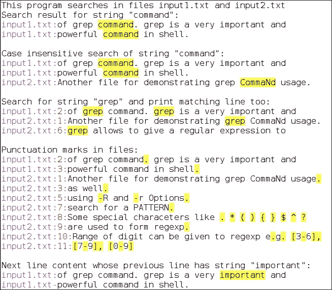

## 一些更多的`grep`用法

以下小节将涵盖`grep`命令的一些更多用法。

### 在二进制文件中搜索

到目前为止，我们已经看到所有`grep`示例在文本文件上运行。我们也可以使用`grep`在二进制文件中搜索模式。为此，我们必须告诉`grep`命令将二进制文件也视为文本文件。选项`-a`或`-text`告诉`grep`将二进制文件视为文本文件。

我们知道`grep`命令本身是一个二进制文件，执行并给出搜索结果。

`grep`中的一个选项是`--text`。字符串`--text`应该在`grep`二进制文件中的某个地方可用。让我们按照以下方式搜索它：

```
$ grep --text '\-\-text' /usr/bin/grep 
 -a, --text                equivalent to –binary-files=text

```

我们看到字符串`--text`在搜索路径`/usr/bin/grep`中找到了。反斜杠（'`\`'）字符用于转义其特殊含义。

现在，让我们在`wc`二进制文件中搜索`-w`字符串。我们知道`wc`命令有一个`-w`选项，用于计算输入文本中的单词数。

```
$ grep -a '\-w' /usr/bin/wc
 -w, --words            print the word counts

```

### 在目录中搜索

我们还可以告诉`grep`使用选项`-R`递归地搜索目录中的所有文件/目录，而无需指定每个文件作为`grep`的输入文本文件。

例如，我们有兴趣知道标准`include`目录中`#include <stdio.h>`被使用了多少次：

```
$ grep -R '\#include <stdio\.h>' /usr/include/ | wc -l
77

```

这意味着`#include <stdio.h>`字符串在`/usr/include`目录中有`77`个匹配位置。

在另一个例子中，我们想知道`/usr/lib64/python2.7/`目录中有多少个 Python 文件（扩展名为`.py`）包含`"import os"`。我们可以这样检查：

```
$ grep -R "import os" /usr/lib64/python2.7/*.py | wc -l
93

```

### 从搜索中排除文件/目录

我们还可以指定`grep`命令来排除特定的目录或文件进行搜索。当我们不希望`grep`查找包含一些机密信息的文件或目录时，这是很有用的。这在我们确定搜索某个目录毫无用处的情况下也很有用。因此，排除它们将减少搜索时间。

假设有一个名为`s0`的源代码目录，它使用`git`版本控制。现在，我们有兴趣在源文件中搜索文本或模式。在这种情况下，在`.git`子目录中搜索将毫无用处。我们可以通过以下方式排除`.git`进行搜索：

```
$  grep -R  --exclude-dir=.git "search_string" s0

```

在这里，我们正在在`s0`目录中搜索`search_string`字符串，并告诉`grep`不要在`.git`目录中搜索。

不要排除一个目录，要排除一个文件，使用`--exclude-from=FILE`选项。

### 显示具有匹配模式的文件名

在某些用例中，我们不关心搜索匹配的位置以及在文件中匹配了多少个位置。相反，我们只关心至少有一个搜索匹配的文件名。

例如，我想保存包含特定搜索模式的文件名，或者重定向到其他命令进行进一步处理。我们可以使用`-l`选项来实现这一点：

```
$ grep -Rl "import os" /usr/lib64/python2.7/*.py > search_result.txt
$ wc -l search_result.txt

```

```
79
```

这个例子获取了写有`import os`的文件的文件名，并将结果保存在文件`search_result.txt`中。

### 匹配精确单词

也可以使用单词边界`\b`来实现单词的精确匹配。

在这里，我们将重用`input1.txt`文件及其内容：

```
$ grep -i --color "\ba\b" input1.txt

```

`--color`选项允许匹配搜索结果进行彩色打印。

`"\ba\b"`选项告诉`grep`只查找独立的字符**a**。在搜索结果中，它不会匹配作为子字符串出现的字符`a`。

以下截图显示了输出：


# 使用 sed 编辑输出

`sed`命令是一个非交互式流编辑器，允许您修改标准输入或文件的内容。它在管道中对每一行执行一个操作。语法将是：

`sed [OPTIONS]... {script} [input-file …]`

默认情况下，输出显示在`stdout`上，但如果指定了，可以将其重定向到文件。

`input-file`是需要运行`sed`的文件。如果没有指定文件，它将从`stdin`读取。

`script`可以是一个命令，也可以是一个包含多个命令的文件，要传递给`sed`，`sed`的`OPTIONS`在下表中描述：

| 选项 | 描述 |
| --- | --- |
| -n | 这会抑制模式空间的自动打印 |
| -e script | 这允许执行多个脚本 |
| -r | 这在脚本中使用扩展的正则表达式 |
| -l N | 这指定换行长度 |
| --posix | 这将禁用所有 GNU 扩展 |
| -u | 这从输入中加载最小量的数据并频繁刷新输出缓冲区 |

## 使用`s`进行字符串替换

`sed`命令广泛用于文本文件中的字符串替换。程序员经常在重命名大型源代码中的变量时使用此功能。它通过避免手动重命名节省了许多程序员的时间。

替换命令`s`具有以下字段：

`s/regex/replacement/`

在这里，`s`表示执行替换，`/`充当分隔符，`regex`是需要替换的正则表达式。这里也可以指定一个简单的字符串。最后一个字段`replacement`是匹配结果应该被替换成什么。

默认情况下，`sed`只会替换行中匹配模式的第一次出现。要替换所有出现，可以在`/—`的末尾使用`g`标志，即`s/regex/replacement/g`。

以下表格中提到了一些可以使用的标志：

| 标志 | 描述 |
| --- | --- |
| `g` | 这将在一行中应用替换到所有匹配项 |
| `p` | 如果发生替换，这将打印一个新的模式空间 |
| `w filename` | 这将替换的模式空间写入文件名 |
| `N` | 这只替换匹配行中的第 N 个匹配结果 |

我们有一个名为`sed.sh`的文件作为示例。该文件的内容如下：

```
$ cat sed.sh

```

```
#!/bin/bash

var1="sed "
var1+="command "
var1+="usage"

echo $var1
```

这是一个 shell 脚本，其中变量`var1`已经在四个地方使用了。现在，我们想要将变量`var1`重命名为`variable`。我们可以使用`sed`命令很容易地做到这一点：

```
$ sed -i 's/var1/variable/g' sed.sh
$ cat sed.sh

```

```
#!/bin/bash

variable="sed "
variable+="command "
variable+="usage"

echo $variable
```

这里，`-i`选项用于替换输入文件。

## 多个替换

我们还可以使用`-e`后跟一个命令来指定要执行的多个替换命令。

例如，考虑`sed.txt`文件。该文件的内容如下：

```
$ cat sed.txt
The sed command is widely used for string
substitution in text file. Programmers frequently
use this feature while renaming a variable in huge source code.
It saves lot of programmers time by avoiding manual renaming.
```

现在，我们想要将'`.`'替换为'`,`'并删除包含字符串`manual`的行：

```
$ sed -e 's/\./,/g' -e '/manual/d' sed.txt
The sed command is widely used for string
substitution in text file, Programmers frequently
use this feature while renaming a variable in huge source code,

```

在`sed.txt`文件中，`s/\./,/g`命令首先将'`.`'替换为'`,`'，`/manual/d`删除了包含字符串`manual`的行。

# 使用 tee 复制流

在某些情况下，有必要在`stdout`上打印输出并将输出保存在文件中。一般来说，命令输出可以打印，也可以保存在文件中。为了解决这个问题，使用`tee`命令。该命令从标准输入读取，并同时写入标准输出和文件。`tee`的语法如下：

`tee [OPTION] [FILE …]`

`tee`命令将输出复制到每个`FILE`，并且也复制到`stdout`。`OPTIONS`可以如下：

| 选项 | 描述 |
| --- | --- |
| `-a, --append` | 这将附加到`FILE`而不是覆盖 |
| `-i, --ignore-interrupts` | 如果有的话，这将忽略中断信号 |

将输出写入`stdout`和文件：一般来说，要将输出写入`stdout`和文件，我们将调用相同的命令两次，一次进行重定向，一次不进行重定向。例如，以下命令显示了如何在`stdout`上打印输出并将其保存到文件中：

```
$  ls /usr/bin/*.pl  # Prints output on stdout
/usr/bin/rsyslog-recover-qi.pl  /usr/bin/syncqt.pl
$  ls /usr/bin/*.pl> out.txt    # Saves output in file out.txt

```

我们可以通过使用`tee`命令一次运行`ls`命令来完成这两个任务，如下所示：

```
$  ls /usr/bin/*.pl| tee  out.txt    # Output gets printed to stdout and saved in out.txt
/usr/bin/rsyslog-recover-qi.pl
/usr/bin/syncqt.pl
$ cat out.txt      #Checking content of out.txt
/usr/bin/rsyslog-recover-qi.pl
/usr/bin/syncqt.pl

```

我们还可以为`tee`指定多个文件名，以便将输出写入每个文件。这将复制输出到所有文件：

```
$ ls /usr/bin/*.pl| tee  out1.txt out2.txt
/usr/bin/rsyslog-recover-qi.pl
/usr/bin/syncqt.pl

```

通过运行上述命令，输出也将写入`out1.txt`和`out2.txt`文件：

```
$ cat out1.txt
/usr/bin/rsyslog-recover-qi.pl
/usr/bin/syncqt.pl
$ cat out2.txt
/usr/bin/rsyslog-recover-qi.pl
/usr/bin/syncqt.pl

```

## 将输出写入 stdout 并附加到文件

`tee`命令还允许您将输出附加到文件而不是覆盖文件。这可以使用`tee`的`-a`选项来实现。将输出附加到文件在我们想要将各种命令的输出或不同命令执行的错误日志写入单个文件时非常有用。

例如，如果我们想要将运行`ls`和`echo`命令的输出保留在`out3.txt`文件中，并且还在`stdout`上显示结果，我们可以这样做：

```
$ echo "List of perl file in /usr/bin/ directory" | tee out3.txt
List of perl file in /usr/bin/ directory

$ ls /usr/bin/*.pl| tee  -a out3.txt
/usr/bin/rsyslog-recover-qi.pl
/usr/bin/syncqt.pl

$ cat out3.txt    # Content of file
List of perl file in /usr/bin/ directory
/usr/bin/rsyslog-recover-qi.pl
/usr/bin/syncqt.pl

```

## 将输出发送到多个命令

我们还可以使用`tee`命令将命令的输出作为多个命令的输入。这是通过将`tee`输出发送到管道来完成的。

```
$ df -h | tee out4.txt | grep tmpfs | wc -l
7

```

在这里，`df -h`命令的输出保存到`out4.txt`文件中，`stdout`输出被重定向到`grep`命令，并且来自`grep`的搜索结果的输出进一步被重定向到`wc`命令。最后，`wc`的结果被打印到`stdout`上。

# 排序和查找唯一文本

Shell 提供了不同的方法来使用`sort`命令对输入文本进行排序。还可以使用`uniq`命令从排序/未排序的输入文本中删除重复的行。可以从文件中给出要排序和`uniq`命令的输入文本，或者从另一个命令重定向。

## 对输入文本进行排序

输入文本中的行按以下顺序排序：

+   从 0 到 9 的数字

+   从 A 到 Z 的大写字母

+   从 a 到 z 的小写字母

语法如下：

`sort [OPTION] [FILE …]`

可以提供单个或多个输入文件进行排序。

`sort`命令采用多个选项以提供排序的灵活性。在以下表中讨论了排序的流行和重要的`OPTION`：

| 选项 | 描述 |
| --- | --- |
| `-b` | 这忽略前导空格 |
| `-d` | 这仅考虑空格和字母数字字符 |
| `-f` | 这忽略了大小写 |
| `-i` | 这忽略了不可打印的字符 |
| `-M` | 这比较未知的月份（例如，< JAN < FEB… < DEC） |
| `-n` | 这根据数值进行排序 |
| `-r` | 这以相反的顺序排序 |
| `-h` | 这根据可读性强的数字进行排序；例如，9K，5M，1G 等。 |
| `-u` | 这获取唯一行 |
| `-o file` | 这将输出写入文件而不是 stdout |
| `-m` | 这合并已排序的文件而不重新排序 |
| `-k n` | 这根据给定的列 n 对数据进行排序 |

现在，我们将通过示例看看如何对输入文本数据进行不同的排序。

### 对单个文件进行排序

在我们的示例中，我们将考虑`sort1.txt`文件进行排序。该文件的内容如下：

```
$ cat sort1.txt
Japan
Singapore
Germany
Italy
France
Sri Lanka

```

要按字母顺序对内容进行排序，可以使用没有任何选项的`sort`命令：

```
$ sort sort1.txt
France
Germany
Italy
Japan
Singapore
Sri Lanka

```

要以相反的顺序对内容进行排序，我们可以使用`-r`选项：

```
$ sort -r sort1.txt
Sri Lanka
Singapore
Japan
Italy
Germany
France

```

**排序多个文件**：我们还可以集体对多个文件进行排序，并且排序后的输出可以用于进一步的查询。

例如，考虑`sort1.txt`和`sort2.txt`文件。我们将重用先前示例中的`sort1.txt`文件的内容。`sort2.txt`的内容如下：

```
$ cat sort2.txt
India
USA
Canada
China
Australia

```

我们可以按字母顺序对两个文件一起进行排序，如下所示：

```
$ sort sort1.txt sort2.txt
Australia
Canada
China
France
Germany
India
Italy
Japan
Singapore
Sri Lanka
USA

```

我们还可以使用`-o`选项将文件的排序输出保存到文件中，而不是在`stdout`上显示它：

```
$ sort sort1.txt sort2.txt -o sorted.txt
$ cat sorted.txt
Australia
Canada
China
France
Germany
India
Italy
Japan
Singapore
Sri Lanka
USA

```

### 将输出重定向到 sort

我们可以对从另一个命令重定向的输出进行排序。以下示例显示了对`df -h`命令输出进行排序：

```
$ df -h    #  Disk space usage in human readable format

```

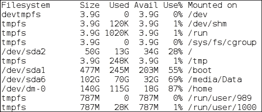

以下命令按其第二列内容对`df`的输出进行排序：

```
$ df -h | sort -hb -k2  #. Sorts by 2nd column according to size available:

```

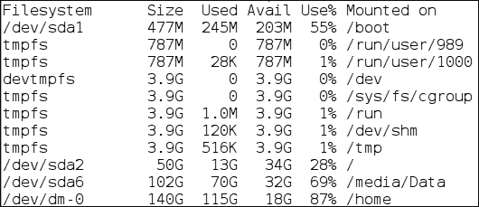

我们可以根据最后修改的日期和月份对`ls -l`的输出进行排序：

```
$ ls -l /var/cache/    # Long listing content of /var/cache

```

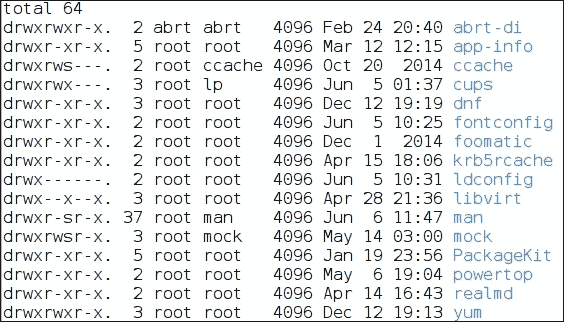

要对`ls -l`的输出进行排序，首先按照第 6 个字段的月份使用`-M`选项进行排序，如果两个或更多行的月份相同，则按照第 7 个字段的日期使用`-n`进行排序：

```
$ ls -l /var/cache/ | sort -bk 6M -nk7

```

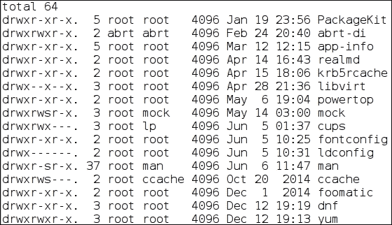

## 过滤唯一元素

在许多用例中，我们需要删除重复的项目并仅保留项目的一次出现。当命令或输入文件的输出太大并且包含大量重复行时，这非常有用。要从文件或重定向的输出中获取唯一行，使用 shell 命令`uniq`。一个重要的要点是，为了获得`uniq`输出，输入应该是排序的，或者首先运行 sort 命令使其排序。语法如下：

`sort [OPTION] [INPUT [OUTPUT]]`

`uniq`的输入可以来自文件或另一个命令的输出。

如果提供了输入文件，则还可以在命令行上指定可选的输出文件。如果未指定输出文件，则输出将打印在`stdout`上。

在以下表中讨论了`uniq`支持的选项：

| 选项 | 描述 |
| --- | --- |
| `-c` | 这在行前加上出现次数 |
| `-d` | 这仅打印重复行一次 |
| `-f N` | 这跳过了前 N 个字段的比较 |
| `-i` | 这是项目的不区分大小写比较 |
| `-u` | 仅打印唯一行 |
| `-s N` | 这避免比较行中的前 N 个字符 |
| `-w N` | 仅比较行中的 N 个字符 |

## 文件中的唯一元素

以`unique.txt`文件为例，我们将使用`uniq`命令及其选项运行。`unique.txt`的内容如下：

```
$ cat unique.txt
Welcome to Linux shell scripting
1
Welcome to LINUX shell sCripting
2
Welcome To Linux Shell Scripting
4
2
4
Welcome to Linux shell scripting
2
3
Welcome to Linux shell scripting
2
Welcome to Linux shell scripting
Welcome to LINUX shell sCripting

```

要从`unique.txt`文件中删除重复行，我们可以执行以下操作：

+   首先对文件进行排序，然后将排序后的文本重定向到`uniq`命令：

```
$ sort unique.txt | uniq

```

+   使用`-u`选项与`sort`命令：

```
$ sort  -u unique.txt

```

运行任何一个命令的输出将是相同的，如下所示：

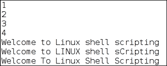

我们可以使用`-c`选项来打印输入文件中每行的出现次数：

```
$ sort unique.txt | uniq -c

```

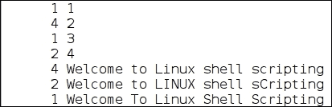

使用`-c`和`-i`选项将打印`uniq`行以及出现次数。将进行不区分大小写的唯一行比较：

```
$ sort unique.txt | uniq -ci

```


要仅获取文件中仅出现一次的行，使用`-u`选项：

```
$ sort unique.txt | uniq -u
1
3
Welcome To Linux Shell Scripting

```

类似地，要获取文件中出现多次的行，使用`-d`：

```
$  sort unique.txt | uniq -d
2
4
Welcome to Linux shell scripting
Welcome to LINUX shell sCripting

```

我们还可以告诉`uniq`命令根据仅比较行的前 N 个字符来查找唯一行：

```
$ sort unique.txt | uniq -w 10
1
2
3
4
Welcome to Linux shell scripting
Welcome To Linux Shell Scripting

```

### 注意

+   `uniq`命令不会检测重复的行，除非它们是相邻的。

+   要查找唯一行，首先使用`sort`命令对输入进行排序，然后应用`uniq`命令

# 使用`tr`进行基于字符的翻译

另一个有趣的 shell 命令是`tr`。它可以从标准输入中翻译、挤压或删除字符。语法如下：

`tr [OPTION]... SET1 [SET2]`

`tr`命令的选项在下表中解释：

| 选项 | 描述 |
| --- | --- |
| `-c, -C` | 使用 SET1 的补集 |
| `-d` | 这将删除 SET1 中指定的字符范围。 |
| `-s` | 这将用 SET1 中字符的单个出现替换连续多次出现的字符。 |
| `-t` | 这将 SET1 截断为 SET2 的长度。SET1 中的任何额外字符都不会被考虑进行翻译。 |

SET 是一串可以使用以下方式指定的字符：

+   字符类：`[:alnum:]`、`[:digit:]`、`[:alpha:]`等等

+   字符范围：`'a-z'`、`'A-Z'`和`'0-9'`

+   转义字符：`\\`、`\b`、`\r`、`\n`、`\f`、`\v`和`\t`

要从文件提供输入文本并将输出重定向到文件，我们可以使用文件重定向运算符：`<`（输入的小于）和`>`（输出的大于）。

## 删除输入字符

有时，从输入文本中删除一些不必要的字符是很重要的。例如，我们的输入文本在`tr.txt`文件中：

```
$ cat tr.txt
This is a text file for demonstrating
tr command.
This input file contains digit 2 3 4 and 5
as well.
THIS IS CAPS LINE
this a lowercase line

```

假设我们想要从这个文件中删除所有大写字母。我们可以使用`SET1`为`'A-Z'`的`-d`选项：

```
$ tr -d 'A-Z' < tr.txt
This is a text file for demonstrating
tr command.
This input file contains digit 2 3 4 and 5
as well.

this a lowercase line

```

我们看到输出没有任何大写字母。我们还可以从文件中删除换行符和空格如下：

```
$ tr -d ' \n' < tr.txt > tr_out1.txt

```

在这里，我们已将输出重定向到`tr_out1.txt`：

```
$ cat tr_out1.txt
Thisisatextfilefordemonstratingtrcommand.Thisinputfileconatainsdigit234and5aswell.THISISCAPSLINEthisalowercaseline

```

## 挤压到单个出现

当我们不想在输入文本中删除字符时，而是想要将给定字符的连续多次出现挤压到单个出现时，`-s`选项就很有用。

其中一个用例是当我们在两个单词之间有多个空格时，我们希望将其减少到输入文本中任意两个单词/字符串之间的单个空格。以`tr1.txt`文件为例：

```
$ cat tr1.txt
India            China              Canada
USA    Japan               Russia
Germany        France               Italy
Australia   Nepal

```

通过查看这个文件，很明显文本没有对齐。两个单词之间有多个空格。我们可以使用`tr`选项和`-s`将多个空格挤压为一个空格：

```
$ tr -s ' ' < tr1.txt 
India China Canada
USA Japan Russia
Germany France Italy
Australia Nepal

```

## 反转要翻译的字符集

`tr`命令还提供了`-c`或`-C`选项来反转要翻译的字符集。当我们知道不需要翻译什么时，这是很有用的。

例如，我们只想在文本字符串中保留字母数字、换行符和空格。输入文本中的所有内容都应该被删除。在这里，指定不删除而不是删除会更容易。

例如，考虑`tr2.txt`文件，其内容如下：

```
$ cat tr2.txt
This is an input file.
It conatins special character like ?, ! etc
&^var is an invalid shll variable.
_var1_ is a valid shell variable

```

除了字母数字、换行和空格之外的字符，我们可以运行以下命令来删除：

```
tr -cd '[:alnum:] \n' < tr2.txt
This is an input file
It conatins special character like   etc
var is an invalid shll variable
var1 is a valid shell variable

```

# 基于行的过滤-头和尾

要显示文件的内容，我们将使用`cat`命令。`cat`命令将整个文件内容显示在`stdout`上。但是，有时我们只对查看文件的几行感兴趣。在这种情况下，使用`cat`将很麻烦，因为我们必须滚动到我们感兴趣的特定行。

Shell 为我们提供了`head`和`tail`命令，以仅打印我们感兴趣的行。两个命令之间的主要区别是，`head`从文件开头打印行，而`tail`从文件末尾打印行。

## 使用 head 打印行

语法如下：

`head [OPTION] [FILE …]`

默认情况下，`head`将每个文件的前 10 行打印到`stdout`。如果没有提到文件或指定了'`-`'，则输入来自`stdin`。

头部中可用的选项可用于更改要打印的内容量。可用选项在以下表中描述：

| 选项 | 描述 |
| --- | --- |
| `-c [-] K` | 这将打印文件的前 K 个字节。如果使用了-K，则可以输出除最后 K 个字节之外的所有内容。 |
| `-n [-]K` | 这将打印每个文件的前 K 行。如果使用了-K，则可以输出除最后 n 行之外的所有行。 |
| `-q` | 这将阻止打印输入文件的名称。 |
| `-v` | 这总是输出每个文件的文件名标题。 |

## 打印前几行

让我们看看`/usr/lib64/`目录包含多少个文件`-`：

```
$ ls /usr/lib64 | wc
3954

```

我们看到`/usr/lib64`有 3954 个文件。假设我们不想要所有的库名称，而只想要前五个库名称。我们可以使用以下命令进行头部操作：

```
$ ls /usr/lib64 | head -n 5
akonadi
alsa-lib
ao
apper
apr-util-1

```

### 打印前几个字节

我们使用`-c`选项来打印文件的前几个字节，如下所示：

```
$  head -c50 /usr/share/dict/linux.words /usr/share/dict/words
==> /usr/share/dict/linux.words <==
1080
10-point
10th
11-point
12-point
16-point
18-p
==> /usr/share/dict/words <==
1080
10-point
10th
11-point
12-point
16-point
18-p

```

这首先打印`/usr/share/dict/linux.words`和`/usr/share/dict/words`文件的前 50 个字节。

我们可以使用`–q`来消除具有文件名的标题的打印：

```
$ head -c50 -q  /usr/share/dict/linux.words /usr/share/dict/words
1080
10-point
10th
11-point
12-point
16-point
18-p1080
10-point
10th
11-point
12-point
16-point
18-p

```

对于单个文件，`head`命令不会在输出中打印文件名。要查看它，请使用`–v`选项：

```
$ head -c50 -v  /usr/share/dict/linux.words
==> /usr/share/dict/linux.words <==
1080
10-point
10th
11-point
12-point
16-point
18-p

```

## 使用 tail 打印行

`tail`的语法如下：

`tail [OPTION] [FILE …]`

默认情况下，`tail`将每个`FILE`的最后 10 行打印到`stdout`。如果没有提到文件或指定了'`-`'，则输入来自`stdin`。

`tail`中的可用选项可用于更改要打印的内容量。可用选项在以下表中描述：

| 选项 | 描述 |
| --- | --- |
| `-c [+]K` | 这将打印每个文件的最后`K`字节。如果使用了`+K`，则从每个文件的第`K`字节开始打印。 |
| `-n [+]K` | 这将打印每个文件的最后`K`行。如果使用+K，则从每个文件的第`K`行开始输出。 |
| `-f [{name&#124;descriptor}]` | 输出随着文件增长而追加的数据。 |
| `--retry` | 如果文件无法访问，将继续尝试打开文件。 |
| `--max-unchanged-stats=N` | 使用`-f`名称，重新打开未打开的文件。这显示`N`次迭代后的更改大小（默认为 5）。 |
| `--pid=PID` | 使用`-f`，如果`PID`死亡，则终止。 |
| `-q` | 不要输出每个文件的文件名的标题。 |
| `-F` | 这与`-f`名称`--retry`选项相同。 |
| `-s N` | 在迭代之间休眠`N`秒。使用`–pid`=`PID`，每隔`N`秒至少检查一次进程。 |
| `-v` | 这总是输出每个文件的文件名标题。 |

### 检查日志条目

`tail`命令经常用于检查最近几次命令的错误或消息日志。每次新运行时，日志都会追加到行的末尾。

我们将在以下示例中看到，当添加新的 USB 驱动器和移除它时，内核日志条目被创建：

```
$ dmesg | tail -n7    # Log when USB was attached

```

```
[120060.536856] sd 10:0:0:0: Attached scsi generic sg1 type 0
[120060.540848] sd 10:0:0:0: [sdb] 1976320 512-byte logical blocks: (1.01 GB/965 MiB)
[120060.541989] sd 10:0:0:0: [sdb] Write Protect is off
[120060.541991] sd 10:0:0:0: [sdb] Mode Sense: 23 00 00 00
[120060.543125] sd 10:0:0:0: [sdb] Write cache: disabled, read cache: enabled, doesn't support DPO or FUA
[120060.550464]  sdb: sdb1
[120060.555682] sd 10:0:0:0: [sdb] Attached SCSI removable disk
```

```
$ dmesg | tail -n7  # USB unmounted

```

```
[120060.540848] sd 10:0:0:0: [sdb] 1976320 512-byte logical blocks: (1.01 GB/965 MiB)
[120060.541989] sd 10:0:0:0: [sdb] Write Protect is off
[120060.541991] sd 10:0:0:0: [sdb] Mode Sense: 23 00 00 00
[120060.543125] sd 10:0:0:0: [sdb] Write cache: disabled, read cache: enabled, doesn't support DPO or FUA
[120060.550464]  sdb: sdb1
[120060.555682] sd 10:0:0:0: [sdb] Attached SCSI removable disk
[120110.466498] sdb: detected capacity change from 1011875840 to 0
```

我们看到当 USB 卸载时，会添加一个新的日志条目：`[120110.466498] sdb:`检测到容量从`1011875840`变为`0`。要在基于 RPM 的系统中检查最后 10 个 yum 日志，我们可以这样做：

```
#  sudo tail -n4 -v /var/log/yum.log

```

```
==> /var/log/yum.log-20150320 <==
Mar 19 15:40:19 Updated: libgpg-error-1.17-2.fc21.i686
Mar 19 15:40:19 Updated: libgcrypt-1.6.3-1.fc21.i686
Mar 19 15:40:20 Updated: systemd-libs-216-21.fc21.i686
Mar 19 15:40:21 Updated: krb5-libs-1.12.2-14.fc21.i686
```

要查看实时日志，我们可以使用`-f`选项。例如，`/var/log/messages`文件显示一般系统活动。使用`tail -f`，`/var/log/messages`中追加的日志消息也将打印在`stdout`上：

```
$ tail -f /var/log/messages

```

```
Jun  7 18:21:14 localhost dbus[667]: [system] Rejected send message, 10 matched rules; type="method_return", sender=":1.23" (uid=0 pid=1423 comm="/usr/lib/udisks2/udisksd --no-debug ") interface="(unset)" member="(unset)" error name="(unset)" requested_reply="0" destination=":1.355" (uid=1000 pid=25554 comm="kdeinit4: dolphin [kdeinit] --icon system-fil   ")
Jun  7 18:21:14 localhost systemd-udevd: error: /dev/sdb: No medium found
Jun  7 18:21:14 localhost systemd-udevd: error: /dev/sdb: No medium found
Jun  7 18:27:10 localhost kernel: [135288.809319] usb 3-1.2: USB disconnect, device number 14
Jun  7 18:27:10 localhost kernel: usb 3-1.2: USB disconnect, device number 14
Jun  7 18:27:10 localhost systemd-udevd: error opening USB device 'descriptors' file
```

命令提示符不会返回。相反，每当`/var/log/messages`中有新内容时，输出将持续更新。

## 在文件中查找任何行

我们可以使用 head 和 tail 来查找文件的任何行。

我们将考虑`/usr/share/dict/words`文件作为示例。

现在，要找到这个文件的第 10 行，我们可以这样做：

```
$ head -10 /usr/share/dict/words | tail -n1  # 10th line
20-point

$ head -200000 /usr/share/dict/words | tail -n1  #  200000th line
intracartilaginous

```

# 基于 Cut 的选择

我们还可以使用`cut`命令从单个/多个文件的每一行中选择文本。`cut`命令允许我们基于分隔符选择列。默认情况下，使用 TAB 作为分隔符。我们还可以通过指定字符或范围来选择行中的一部分文本。语法如下：

`cut OPTION [FILE …]`

`cut`命令适用于单个和多个文件。默认情况下，输出打印在`stdout`上。

`cut`命令的选项在下表中解释：

| 选项 | 描述 |
| --- | --- |
| `-b LIST` | 这会选择列表中指定的字节。 |
| `-c LIST` | 这会选择列表中指定的字符。 |
| `-d DELIM` | 这使用 DELIM 作为分隔符，而不是 TAB。它还打印没有分隔符的行。 |
| `-f LIST` | 这只选择列表中指定的字段。 |
| `--complement` | 这是对所选字节、字符或字段集的补集。 |
| `-s` | 不打印没有分隔符的行。 |
| `--output-delimiter=STRING` | 这使用 STRING 作为输出分隔符。默认情况下，使用输入分隔符。 |

LIST 由一个范围或多个由逗号分隔的范围组成。范围的指定方式如下：

| 范围 | 含义 |
| --- | --- |
| `N` | 这是第 N 个字节、字符或字段，从 1 开始计数 |
| `N-` | 这是从第 N 个字节、字符或字段到行尾 |
| `N-M` | 这是从第 N 到第 M 个字节（包括 M 和 N）、字符或字段。 |
| `-M` | 这是从第一个到第 M 个（包括）字节、字符或字段。 |

## 跨列切割

许多 Linux 命令的输出格式都是这样的，结果有多个字段，每个字段由空格或制表符分隔。可以通过查看特定字段列来查看每个字段的输出。

执行`ls -l ~`命令并观察以下输出：

```
$ ls -l ~

```

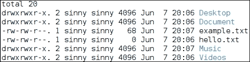

现在，我们只对修改时间和文件名感兴趣。为了实现这一点，我们将需要列`6`到`9`：

```
$ ls -l ~ | tr -s ' ' |cut -f 6-9 -d ' '

```

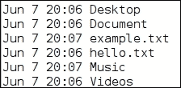

默认情况下，使用 TAB 作为分隔符。在`ls -l`输出中，任何两列之间有多个空格。因此，首先使用`tr -s`，我们将多个空格压缩为单个空格，然后我们将使用空格作为分隔符切割列字段范围`6-9`。

## 文件中的文本选择

以`cut1.txt`文件为例。文件的内容如下：

```
$ cat cut1.txt

```

输出将是：

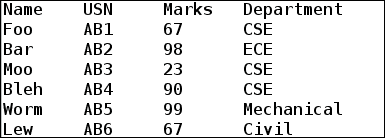

现在，我们对学生的姓名感兴趣。我们可以通过获取第一列来获得这个。在这里，每一列都是由*Tab*分隔的。因此，在我们的命令中，我们不必指定分隔符：

```
$ cut -f1 cut1.txt
Name
Foo
Bar
Moo
Bleh
Worm
Lew

```

另一件有趣的事情是获取唯一的部门名称。我们可以通过在`cut1.txt`文件上使用以下一组命令来实现这一点：

```
$ cut -f4 cut1.txt | tail -n +2 | sort -u
Civil
CSE
ECE
Mechanical

```

我们可以看到在`cut1.txt`文件中提到了四个唯一的部门。

我们还可以做的另一件有趣的事情是找出谁获得了最高分，如下所示：

```
$ cut -f1,3 cut1.txt | tail -n +2 | sort -k2 -nr | head -n1
Worm    99

```

要找出谁得分最高，我们首先从`cut1.txt`文件中选择第一列和第三列。然后，我们使用`tail -n +2`排除第一行，这告诉我们这个文件是关于什么的，因为我们不需要这个。之后，我们对第二列进行数字排序，以逆序排列，其中包含所有学生的分数。现在，我们知道第一列包含得分最高的人的详细信息。

了解系统处理器的速度是有趣的，以便了解系统的各种细节。其中之一就是了解处理器的速度。首先要知道的是，所有处理器的详细信息都在`/proc/cpuinfo`文件中。你可以打开这个文件，看看都有哪些详细信息。例如，我们知道处理器的速度在`"model name"`字段中提到。

以下 shell 脚本将显示处理器的速度：

```
#!/bin/bash
#Filename: process_speed.sh
#Description: Demonstrating how to find processor speed ofrunning system

grep -R "model name" /proc/cpuinfo | sort -u > /tmp/tmp1.txt
tr -d ' ' </tmp/tmp1.txt > /tmp/tmp2.txt
cut -d '@' -f2 /tmp/tmp2.txt
```

运行这个脚本将输出你系统的处理器速度：

```
$ sh processor_speed.sh
2.80GHz

```

我们也可以不使用临时文件：

```
$ grep -R "model name" /proc/cpuinfo | sort -u | cut -d '@' -f2
2.80GHz

```

# 总结

阅读完本章后，你应该知道如何向命令提供输入并打印或保存其结果。你还应该熟悉将一个命令的输出和输入重定向到另一个命令。现在，你可以轻松地在文件中搜索、替换字符串或模式，并根据需要过滤数据。

从这一章中，我们现在可以很好地控制文本数据的转换/过滤。在下一章中，我们将学习如何通过学习循环、条件、开关和 shell 中最重要的函数来编写更强大和有用的 shell 脚本。我们还将了解知道命令的退出状态有多重要。在下一章中，我们还将看到本章中学到的命令的更高级的例子。
