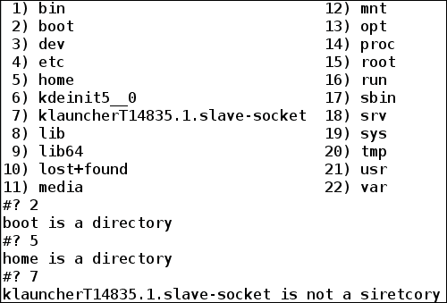
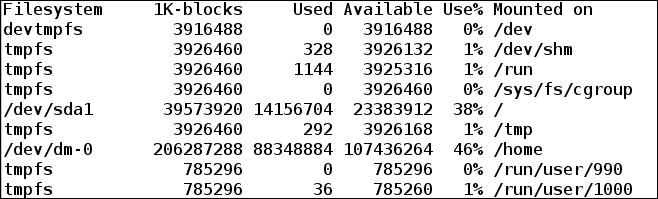
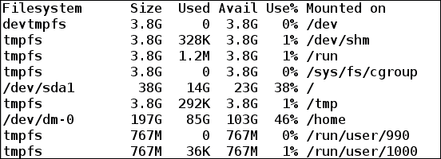

# 第三章：有效的脚本编写

要在 shell 中编写有效的脚本，非常重要的是要了解 shell 提供的不同实用工具。与其他编程语言类似，shell 编程也需要一种在特定条件下指定跳过或运行某些命令的方法。在 shell 中也需要循环结构来执行元素列表上的某些任务。

在本章中，我们将涵盖诸如`if`、`else`、`case`和`select`之类的主题，这些主题可根据条件运行一定的命令块。我们将看到`for`、`while`和`until`结构，用于在脚本中循环执行一定的命令块。我们将看到在命令或脚本执行后，退出代码如何在了解命令是否成功执行方面发挥重要作用。我们还将看到如何在 shell 中定义函数，从而使我们能够从现在开始编写模块化和可重用的代码。

本章将详细介绍以下主题：

+   退出脚本和退出代码

+   使用测试测试表达式

+   使用`if`和`else`的条件语句

+   索引数组和关联数组

+   使用`for`循环

+   `select`、`while`和`until`循环

+   切换到您的选择

+   使用函数和位置参数

+   使用`xargs`将`stdout`作为参数传递

+   别名

+   `pushd`和`popd`

# 退出脚本和退出代码

我们现在对 shell 脚本文件、命令以及在`bash`中运行它们以获得所需的输出非常熟悉。到目前为止，我们所见过的 shell 脚本示例都是按行运行直到文件末尾。在编写真实世界的 shell 脚本时，情况可能并非总是如此。例如，当发生错误时，不满足某些条件时等等，我们可能需要在脚本中间退出。要退出脚本，使用带有可选返回值的`exit` shell 内置命令。返回值告诉退出代码，也称为返回状态或退出状态。

## 退出代码

每个命令在执行时都会返回一个退出代码。退出代码是了解命令是否成功执行或是否发生了错误的一种方式。根据**POSIX**（**可移植操作系统接口**）标准约定，成功执行的命令或程序返回`0`，而失败执行返回`1`或更高的值。

在 bash 中，要查看上一个命令的退出状态，可以使用“`$?`”。

以下示例显示了成功执行命令的退出代码：

```
$ ls /home  # viewing Content of directory /home
foo

```

现在，要查看上一个执行的命令的退出代码，即`ls /home`，我们将运行以下命令：

```
$ echo $?
0

```

我们看到`ls`命令执行的退出状态为`0`，这意味着它已成功执行。

另一个示例显示了不成功执行命令的退出代码如下：

```
$  ls /root/
ls: cannot open directory /root/: Permission deniedWe see that the ls command execution was unsuccessful with the Permission denied error. To see the exit status, run the following command:

```

```
$ echo $?
2

```

退出状态代码为`2`，高于`0`，表示执行不成功。

## 具有特殊含义的退出代码

在不同的情况下，脚本或命令返回不同的退出代码。在调试脚本或命令时，了解退出代码的含义是有用的。以下表格解释了在命令或脚本执行的不同条件下惯例返回哪个退出代码：

| 退出代码 | 描述 |
| --- | --- |
| 0 | 成功执行 |
| 1 | 一般错误 |
| 2 | 使用 shell 内置命令时出错 |
| 126 | 在执行命令时出现权限问题；我们无法调用请求的命令 |
| 127 | 无法调用请求的命令 |
| 128 | 在脚本中指定无效参数退出。只有 0 到 255 之间的值是有效的退出代码 |
| 128+n | 信号'n'的致命错误 |
| 130 | 使用 Ctl + C 终止脚本 |
| 255* | 超出范围的退出代码 |

保留退出代码 0、1、126-165 和 255，我们在脚本文件中返回退出代码时应使用除这些数字之外的其他数字。

以下示例显示命令返回的不同退出代码：

+   **退出代码 0**：以下是`echo`命令的成功执行：

```
$ echo "Successful Exit code check"
Successful Exit code check
$ echo $?
0

```

+   **退出代码 1**：从`/root`复制文件没有权限，如下所示：

```
$  cp -r /root/ .
cp: cannot access '/root/': Permission denied
$ echo $?
1

```

+   **退出代码 2**：使用无效参数读取 shell 内置如下：

```
$ echo ;;
bash: syntax error near unexpected token ';;'
$ echo $?
2

```

+   **退出代码 126**：将`/usr/bin`目录作为实际上不是命令的命令运行：

```
$ /usr/bin
bash: /usr/bin: Is a directory
$ echo $?
126

```

+   **退出代码 127**：运行一个名为`foo`的命令，实际上并不存在于系统中：

```
$ foo
bash: foo: command not found
$ echo $?
127

```

+   **退出代码 128+n**：通过按*Ctrl* + *C*终止脚本：

```
$ read

^C
$ echo $?
130

```

在这里，*Ctrl* + *C*发送`SIGQUIT`信号，其值为`2`。因此，退出代码为`130`（128 + 2）。

## 具有退出代码的脚本

我们还可以退出 shell 内置命令，并附带退出代码，以了解脚本是否成功运行或遇到任何错误。在调试自己的脚本时，可以使用不同的错误代码来了解错误的实际原因。

当我们在脚本中不提供任何退出代码时，脚本的退出代码由最后执行的命令决定：

```
#!/bin/bash                                                                                                                                                               
# Filename: without_exit_code.sh                                                                                                                                          
# Description: Exit code of script when no exit code is mentioned in script                                                                                                

var="Without exit code in script"
echo $var

cd /root
```

上述脚本没有指定任何退出代码；运行此脚本将得到以下输出：

```
$ sh without_exit_code.sh
Without exit code in script
without_exit_code.sh: line 8: cd: /root: Permission denied
$ echo $?  # checking exit code of script
1

```

此脚本的退出代码为`1`，因为我们没有指定任何退出代码，最后执行的命令是`cd /root`，由于权限问题而失败。

接下来的示例返回退出代码`0`，无论发生任何错误，即脚本成功运行：

```
#!/bin/bash                                                                                                                                                               
# Filename: with_exit_code.sh                                                                                                                                          
# Description: Exit code of script when exit code is mentioned in scr# ipt                                                                                                

var="Without exit code in script"
echo $var

cd /root

exit 0
```

运行此脚本将得到以下结果：

```
$ sh with_exit_code.sh 
Without exit code in script
with_exit_code.sh: line 8: cd: /root: Permission denied
echo $?
0
```

现在，脚本文件返回退出代码为`0`。我们现在知道在脚本中添加退出代码会有什么不同。

另一个具有退出状态代码的示例如下：

```
#!/bin/bash
# Filename: exit_code.sh                                                                                                                                          
# Description: Exit code of script                                                                                            

cmd_foo # running command not installed in system
echo $?

cd /root # Permission problem
echo $?

echo "Hello World!" # Successful echo print
echo $?

exit 200 # Returning script's exit code as 200
```

运行此脚本后的输出如下：

```
$ sh exit_status.sh
exit_code.sh: line 5: cmd_foo: command not found
127
exit_code.sh: line 8: cd: /root: Permission denied
1
Hello World!
0
$ echo $?  # Exit code of script
200

```

如果在脚本中未指定退出代码，则退出代码将是脚本中运行的最后一个命令的退出状态。

# 使用测试检查测试表达式

shell 内置命令`test`可用于检查文件类型和比较表达式的值。语法为`test EXPRESSION`或`test`命令也等同于**[ EXPRESSION ]**。

如果`EXPRESSION`结果为`0`，则返回退出代码`1`（`false`），对于非零的`EXPRESSION`结果，返回`0`（`true`）。

如果未提供`EXPRESSION`，则退出状态设置为`1`（false）。

## 文件检查

可以使用`test`命令对文件进行不同类型的检查；例如，文件存在性检查，目录检查，常规文件检查，符号链接检查等。

可以使用以下表格中的选项对文件进行各种检查：

| 选项 | 描述 |
| --- | --- |
| -e | fileChecks 文件是否存在 |
| -f file | 文件是常规文件 |
| -d file | 文件存在且为目录 |
| -h，-L file | 文件是符号链接 |
| -b file | 文件是块特殊文件 |
| -c file | 文件是字符特殊文件 |
| -S file | 文件是套接字 |
| -p file | 文件是命名管道 |
| -k file | 文件的粘着位已设置 |
| -g file | 文件的设置组 ID（sgid）位已设置 |
| -u file | 文件的设置用户 ID（suid）位已设置 |
| -r file | 文件具有读权限 |
| -w file | 文件具有写权限 |
| -x file | 文件具有执行权限 |
| -t fd | 文件描述符 fd 在终端上打开 |
| file1 -ef file2 | file1 是 file2 的硬链接 |
| file1 -nt file2 | file1 比 file2 更近 |
| file1 -ot file2 | file1 的修改时间早于 file2 |

Shell 脚本对文件执行不同的检查，如下所示：

```
#!/bin/bash
# Filename: file_checks.sh
# Description: Performing different check on and between files

# Checking existence of /tmp/file1
echo -n "Does File /tmp/file1 exist? "
test -e /tmp/file1
echo $?

# Create /tmp/file1
touch /tmp/file1 /tmp/file2
echo -n "Does file /tmp/file1 exist now? "
test -e /tmp/file1
echo $?

# Check whether /tmp is a directory or not
echo -n "Is /tmp a directory? "
test -d /tmp
echo $?

# Checking if sticky bit set on /tmp"
echo -n "Is sticky bit set on /tmp ? "
test -k /tmp
echo $?

# Checking if /tmp has execute permission
echo -n "Does /tmp/ has execute permission ? "
test -x /tmp
echo $?

# Creating another file /tmp/file2
touch /tmp/file2

# Check modification time of /tmp/file1 and /tmp/file2
echo -n "Does /tmp/file1 modified more recently than /tmp/file2 ? "
test /tmp/file1 -nt /tmp/file2
echo $?
```

运行此脚本的输出如下：

```
Does File /tmp/file1 exist? 1
Does file /tmp/file1 exist now? 0
Is /tmp a directory? 0
Is sticky bit set on /tmp ? 0
Does /tmp/ has execute permission? 0
Does /tmp/file1 modified more recently than /tmp/file2 ? 1
```

在我们的输出中，`0`和`1`是在文件上运行测试命令后的`存在`状态。输出`1`表示测试失败，`0`表示测试成功通过。

## 算术检查

我们还可以在整数之间执行算术检查。可以在整数上进行的比较在以下表中解释：

| 比较 | 描述 |
| --- | --- |
| `INTEGER1 -eq INTEGER2` | INTEGER1 等于 INTEGER2 |
| `INTEGER1 -ne INTEGER2` | INTEGER1 不等于 INTEGER2 |
| `INTEGER1 -gt INTEGER2` | INTEGER1 大于 INTEGER2 |
| `INTEGER1 -ge INTEGER2` | INTEGER1 大于或等于 INTEGER2 |
| `INTEGER1 -lt INTEGER2` | INTEGER1 小于 INTEGER2 |
| `INTEGER1 -le INTEGER2` | INTEGER1 小于或等于 INTEGER2 |

Shell 脚本显示了两个整数之间的各种算术检查，如下所示：

```
#!/bin/bash
# Filename: integer_checks.sh
# Description: Performing different arithmetic checks between integers

a=12 b=24 c=78 d=24
echo "a = $a , b = $b , c = $c , d = $d"

echo -n "Is a greater than b ? "
test $a -gt $b
echo $?

echo -n "Is b equal to d ? "
test $b -eq $d
echo $?

echo -n "Is c not equal to d ? "
test $c -ne $d
echo $?
```

运行脚本后的输出如下：

```
a = 12 , b = 24 , c = 78 , d = 24
Is a greater than b ? 1
Is b equal to d ? 0
Is c not equal to d ? 0
```

此外，此处的测试在整数之间运行比较测试后返回退出状态，并在成功时返回`0`（true），在测试失败时返回`1`（false）。

## 字符串检查

命令测试还允许您对字符串进行检查。可能的检查在下表中描述：

| 比较 | 描述 |
| --- | --- |
| `-z STRING` | 字符串的长度为零 |
| `-n STRING` | 字符串的长度不为零 |
| `STRING1 = STRING2` | STRING1 和 STRING2 相等 |
| `SRING1 != STRING2` | STRING1 和 STRING2 不相等 |

Shell 脚本显示了字符串之间的各种字符串检查，如下所示：

```
#!/bin/bash
# Filename: string_checks.sh
# Description: Performing checks on and between strings

str1="Hello" str2="Hell" str3="" str4="Hello"
echo "str1 = $str1 , str2 = $str2 , str3 = $str3 , str4 = $str4"

echo -n "Is str3 empty ? "
test -z $str3
echo $?

echo -n "Is str2 not empty? "
test -n $str2
echo $?

echo -n "Are str1 and str4 equal? "
test $str1 = $str4
echo $?

echo -n "Are str1 and str2 different? "
test $str1 != $str2
echo $?
```

运行脚本后的输出如下：

```
str1 = Hello , str2 = Hell , str3 =  , str4 = Hello
Is str3 empty ? 0
Is str2 not empty? 0
Are str1 and str4 equal? 0
Are str1 and str2 different? 0
```

在这里，如果字符串检查为真，则测试返回`0`退出状态，否则返回`1`。

## 表达式检查

`test`命令还允许您对表达式进行检查。表达式本身也可以包含多个要评估的表达式。可能的检查如下表所示：

| 比较 | 描述 |
| --- | --- |
| `( EXPRESSION )` | 此表达式为真 |
| `! EXPRESSION` | 此表达式为假 |
| `EXPRESSION1 -a EXPRESSION2` | 两个表达式都为真（AND 操作） |
| `EXPRESSION1 -o EXPRESSION2` | 两个表达式中的一个为真（OR 操作） |

Shell 脚本显示了字符串之间的各种字符串检查，如下所示：

```
#!/bin/bash
# Filename: expression_checks.sh
# Description: Performing checks on and between expressions

a=5 b=56
str1="Hello" str2="Hello"

echo "a = $a , b = $b , str1 = $str1 , str2 = $str2"
echo -n "Is a and b are not equal, and str1 and str2 are equal? "
test ! $a -eq $b -a  $str1 = $str2
echo $?

echo -n "Is a and b are equal, and str1 and str2 are equal? "
test $a -eq $b -a  $str1 = $str2
echo $?

echo -n "Does /tmp is a sirectory and execute permission exists? "
test -d /tmp -a  -x /tmp
echo $?

echo -n "Is /tmp file is a block file or write permission exists? "
test -b /tmp -o -w /tmp
echo $?
```

运行此脚本的输出如下：

```
a = 5 , b = 56 , str1 = Hello , str2 = Hello
Is a and b are not equal, and str1 and str2 are equal? 0
Is a and b are equal, and str1 and str2 are equal? 1
Does /tmp is a sirectory and execute permission exists? 0
Is /tmp file is a block file or write permission exists? 0
```

与`test`命令的其他检查类似，`0`退出代码表示表达式评估为真，`1`表示评估为假。

# 使用 if 和 else 的条件语句

Shell 提供了`if`和`else`，根据评估是`true`还是`false`来运行条件语句。如果我们只想在某个条件为`true`时执行某些任务，这将非常有用。

if 的测试条件可以使用测试条件或[条件]给出。我们已经在上一节*使用测试测试表达式*中学习了多个用例和示例。

## 简单的 if 和 else

`if`条件的语法如下：

```
if [ conditional_expression ]
then
  statements
fi
```

如果`conditional_expression`为`true`——也就是说，退出状态为`0`——那么其中的语句将被执行。如果不是，则它将被忽略，`fi`后的下一行将被执行。

`if`和`else`的语法如下：

```
if [ conditional_expression ]
then
  statements
else
  statements
fi
```

有时，当条件不成立时，我们可能希望执行一些语句。在这种情况下，使用`if`和`else`。在这里，如果`conditional_statement`为真，则 if 内的语句将被执行。否则，else 内的语句将被执行。

以下 shell 脚本在文件存在时打印消息：

```
#!/bin/bash
# Filename: file_exist.sh
# Description: Print message if file exists

if [ -e /usr/bin/ls ]
then
        echo "File /usr/bin/ls exists"
fi
```

运行脚本后的输出如下：

```
File /usr/bin/ls exists
```

另一个示例显示了两个整数中的较大者，如下所示：

```
#!/bin/bash
# Filename: greater_integer.sh
# Description: Determining greater among two integers

echo "Enter two integers a and b"
read a b        # Reading input from stdin
echo "a = $a , b = $b"
# Finding greater integer
if test $a -gt $b
then
        echo "a is greater than b"
else
        echo "b is greater than a"
fi
```

运行脚本后的输出如下：

```
$ sh greater_integer.sh
Enter two integers a and b
56 8
a = 56 , b = 8
a is greater than b
```

## if、elif 和 else 语句

在某些情况下，存在超过两个选择，其中只有一个需要执行。`elif`允许您在条件不成立时使用另一个`if`条件，而不是使用`else`。语法如下：

```
if [ conditional_expression1 ]
then
  statements
elif [ conditional_expression2 ]
then
  statements
elif [ conditional_expression3 ]
then
  statements
  # More elif conditions
else
  statements
```

以下 shell 脚本将使`elif`的用法更清晰。此脚本要求用户输入带有绝对路径的有效文件或目录名称。对于有效的常规文件或目录，它显示以下内容：

```
#!/bin/bash
# Filename: elif_usage.sh
# Description: Display content if user input is a regular file or a directoy

echo "Enter a valid file or directory path"
read path
echo "Entered path is $path"

if [ -f $path ]
then
   echo "File is a regular file and its content is:"
   cat $path
elif [ -d $path ]
then
   echo "File is a directory and its content is:"
   ls $path
else
   echo "Not a valid regular file or directory"
fi
```

运行脚本后的输出如下：

```
Enter a valid file or directory path
/home/
Entered path is /home/
File is a directory and its content is:
lost+found  sinny
```

## 嵌套 if

在许多情况下，需要多个`if`条件，因为条件的执行取决于另一个条件的结果。 语法如下：

```
if [ conditional_expression1 ]
then
  if [ conditional_expression2 ]
  then
     statements
     if [conditional_expression3 ]
     then
       statements
     fi
  fi
fi
```

以下脚本示例更详细地解释了嵌套的`if`。 在此脚本中，我们将看到如何找到三个整数值中的最大值：

```
#!/bin/bash
# Filename: nested_if.sh
# Description: Finding greatest integer among 3 by making use of nested if

echo "Enter three integer value"
read a b c
echo "a = $a , b = $b, c = $c"

if [ $a -gt $b ]
then
   if [ $a -gt $c ]
   then
      echo "a is the greatest integer"
   else
     echo "c is the greatest integer"
   fi
else
  if [ $b -gt $c ]
  then
    echo "b is the greatest integer"
  else
    echo "c is the greatest integer"
  fi
fi
```

运行脚本后的输出如下：

```
Enter three integer value
78 110 7
a = 78 , b = 110, c = 7
b is the greatest integer
```

# 索引数组和关联数组

Bash 提供了一个声明变量列表（或数组）的功能，可以是索引数组或关联数组的一维数组。 数组的大小可以是`0`或更多。

## 索引数组

索引数组包含可能已初始化或未初始化的变量。 索引数组的索引从`0`开始。 这意味着数组的第一个元素将从索引`0`开始。

### 数组声明和赋值

可以通过初始化任何索引来声明索引数组，如下所示：

`array_name[index]=value`

在这里，索引可以是任何正整数，或者表达式必须评估为正整数。

另一种声明方式是使用内置的`declare` shell，如下所示：

`declare -a array_name`

我们还可以在声明时使用值初始化数组。 值用括号括起来，每个值用空格分隔，如下所示：

`declare -a array_name=(value1 value2 value3 …)`

### 数组的操作

初始化和声明变量的值是不够的。 当我们对其执行不同的操作以获得所需的结果时，数组的实际用法才体现出来。

可以对索引数组执行以下操作：

+   通过索引访问数组元素：可以通过引用其索引值来访问数组的元素：

```
echo ${array_name[index]}

```

+   打印数组的内容：如果给出数组的索引为`@`或`*`，则可以打印数组的内容：

```
echo ${array_name[*]}
echo ${array_name[@]}

```

+   获取数组的长度：可以使用带有数组变量的`$#`获取数组的长度：

```
echo ${#array_name[@]}
echo ${#array_name[*]}

```

+   获取数组元素的长度：可以使用`$#`获取第 n 个索引的数组元素的长度：

```
echo ${#array_name[n]}

```

+   删除元素或整个数组：可以使用`unset`关键字从数组中删除元素：

```
unset array_name[index]  # Removes value at index
unset array_name  # Deletes entire array

```

以下 shell 脚本演示了对索引数组的不同操作：

```
#!/bin/bash
# Filename: indexed_array.sh
# Description: Demonstrating different operations on indexed array

#Declaring an array conutries and intializing it
declare -a countries=(India Japan Indonesia 'Sri Lanka' USA Canada)

# Printing Length and elements of countries array
echo "Length of array countries = ${#countries[@]}"
echo ${countries[@]}

# Deleting 2nd element of array
unset countries[1]
echo "Updated length and content of countries array"
echo "Length = ${#countries[@]}"
echo ${countries[@]}

# Adding two more countries to array
countries=("${countries[@]}" "Indonesia" "England")
echo "Updated length and content of countries array"
echo "Length = ${#countries[@]}"
echo ${countries[@]}
```

执行此脚本后的输出如下：

```
Length of array countries = 6
India Japan Indonesia Sri Lanka USA Canada
Updated length and content of countries array
Length = 5
India Indonesia Sri Lanka USA Canada
Updated length and content of countries array
Length = 7
India Indonesia Sri Lanka USA Canada Indonesia England
```

## 关联数组

关联数组包含一个元素列表，其中每个元素都有一个键值对。 关联数组的元素不是通过使用整数值`0`到`N`来引用的。 它是通过提供包含相应值的键名来引用的。 每个键名都应该是唯一的。

### 声明和赋值

使用`declare` shell 内置的`-A`选项进行关联数组的声明如下：

```
declare -A array_name

```

关联数组使用键而不是索引在方括号中初始化值，如下所示：

```
array_name[key]=value

```

可以以以下方式初始化多个值：

```
array_name=([key1]=value1 [key2]=value2 ...)

```

### 数组的操作

关联数组的一些操作与索引数组类似，例如打印数组的长度和内容。 操作如下：

+   通过键名访问数组元素；要访问关联数组的元素，请使用唯一键，如下所示：

```
echo ${array_name[key]}
```

+   打印关联数组内容：使用以下语法打印关联数组：

```
echo ${array_name[*]}
echo ${array_name[@]}
Obtaining the length of an array:
echo ${#array_name[@]}
echo ${#array_name[*]}
```

+   获取给定键的值和长度：

```
echo ${array_name[k]}  # Value of key k
echo ${#array_name[k]}  # Length of value of key k
```

+   添加新元素；要在关联数组中添加新元素，请使用`+=`运算符，如下所示：

```
array_name+=([key]=value)
```

+   使用`k`键删除关联数组的元素如下：

```
unset array_name[k]
```

+   删除关联数组`array_name`如下：

```
unset array_name
```

以下 shell 脚本演示了关联数组的不同操作：

```
#!/bin/bash
# Filename: associative_array.sh
# Description: Demonstrating different operations on associative array

# Declaring a new associative array
declare -A student

# Assigning different fields in student array
student=([name]=Foo [usn]=2D [subject]=maths [marks]=67)

# Printing length and content of array student
echo "Length of student array = ${#student[@]}"
echo ${student[@]}

# deleting element with key marks
unset student[marks]
echo "Updated array content:"
echo ${student[@]}

# Adding department in student array
student+=([department]=Electronics)
echo "Updated array content:"
echo ${student[@]}
```

执行此脚本后的输出如下：

```
Length of student array = 4
Foo 67 maths 2D
Updated array content:
Foo maths 2D
Updated array content:
Foo maths Electronics 2D
```

# 使用 for 循环

`for`循环可用于遍历列表中的项目或直到条件为真。

在 bash 中使用`for`循环的语法如下：

```
for item in [list]
do
   #Tasks
done
```

另一种编写`for`循环的方式是 C 的方式，如下所示：

```
for (( expr1; expr2; expr3 ))
  # Tasks
done
```

在这里，`expr1`是初始化，`expr2`是条件，`expr3`是增量。

## 简单迭代

以下 shell 脚本解释了如何使用`for`循环打印列表的值：

```
#!/bin/bash
# Filename: for_loop.sh
# Description: Basic for loop in bash

declare -a names=(Foo Bar Tom Jerry)
echo "Content of names array is:"
for name in ${names[@]}
do
   echo -n "$name "
done
echo
```

脚本的输出如下：

```
Content of names array is:
Foo Bar Tom Jerry
```

## 迭代命令输出

我们知道很多命令会给出多行输出，比如`ls`、`cat`、`grep`等。在许多情况下，循环遍历每行输出并对其进行进一步处理是有意义的。

以下示例循环遍历'`/`'的内容并打印目录：

```
#!/bin/bash
# Filename: finding_directories.sh
# Description: Print which all files in / are directories

echo "Directories in / :"
for file in 'ls /'
do
  if [ -d "/"$file ]
  then
     echo -n  "/$file "
  fi
done
echo
```

运行此脚本后的输出如下：

```
Directories in / :
/bin /boot /dev /etc /home /lib /lib64 /lost+found /media /mnt /opt /proc /root /run /sbin /srv /sys /tmp /usr /var
```

## 为 for 循环指定范围

我们还可以在`for`循环中指定整数范围，并为其指定可选的增量值：

```
#!/bin/bash
# Filename: range_in_for.sh
# Description: Specifying range of numbers to for loop

echo "Numbers between 5 to 10 -"
for num in {5..10}
do
  echo -n "$num "
done

echo
echo "Odd numbers between 1 to 10 -"
for num in {1..10..2}
do
  echo -n "$num "
done
echo
```

运行此脚本后的输出如下：

```
Numbers between 5 to 10 -
5 6 7 8 9 10 
Odd numbers between 1 to 10 -
1 3 5 7 9
```

## 小巧的 for 循环

在某些情况下，我们不想编写脚本然后执行它；相反，我们更喜欢在 shell 中完成工作。在这种情况下，将完整的 for 循环写在一行中非常有用和方便，而不是将其变成多行。

例如，打印 3 到 20 之间 3 的倍数可以使用以下代码完成：

```
$ for num in {3..20..3}; do echo -n "$num " ; done
3 6 9 12 15 18 
```

# 选择、while 和 until 循环

`select`、`while`和`until`循环也用于循环和迭代列表中的每个项目，或者在条件为真时进行轻微变化的语法。

## 使用 select 循环

选择循环有助于以简单格式创建带编号的菜单，用户可以从中选择一个或多个选项。

`select`循环的语法如下：

```
select var in list
do
   # Tasks to perform
done
```

`list`可以在使用`select`循环时预先生成或指定为`[item1 item2 item3 …]`的形式。

例如，考虑一个简单的菜单，列出'`/`'的内容，并要求用户输入一个选项，以便知道它是否是一个目录：

```
#!/bin/bash
# Filename: select.sh
# Description: Giving user choice using select to choose

select file in 'ls /'
do
   if [ -d "/"$file ]
   then
     echo "$file is a directory"
   else
     echo "$file is not a directory"
  fi
done
```

运行脚本后的输出如下：



要退出脚本，请按*Ctrl* + *C*。

## while 循环

`while`循环允许您重复任务，直到条件为真。语法与 C 和 C++编程语言中的语法非常相似，如下所示：

```
while [ condition ]
do
   # Task to perform
done
```

例如，读取应用程序的名称并显示该应用程序所有运行实例的 pids，如下所示：

```
#!/bin/bash
# Filename: while_loop.sh
# Description: Using while loop to read user input

echo "Enter application name"
while read line
do
  echo -n "Running PID of application $line :"
  pidof $line
done
```

运行此脚本后的输出如下：

```
Enter application name
firefox
Running PID of application firefox : 1771
bash
Running PID of application bash : 9876 9646 5333 4388 3970 2090 2079 2012 1683 1336
ls
Running PID of application ls: 
systemd
Running PID of application systemd : 1330 1026 1
```

要退出脚本，请按*Ctrl* + *C*。

## 直到循环

`until`循环与`while`循环非常相似，但唯一的区别是它执行代码块，直到条件执行为 false。`until`的语法如下：

```
until condition
do
     # Task to be executed
 done
```

例如，假设我们有兴趣知道应用程序的`pid`，每当它的任何实例正在运行时。为此，我们可以使用`until`并使用`sleep`在一定间隔内检查应用程序的`pidof`。当我们找到`pid`时，我们可以退出`until`循环并打印应用程序运行实例的`pid`。

以下 shell 脚本演示了相同的内容：

```
#!/bin/bash
# Filename: until_loop.sh
# Description: Using until loop to read user input

echo "Enter application name"
read app
until  pidof $app
do
  sleep 5
done
echo "$app is running now with pid 'pidof $app'"
```

执行此脚本后的输出如下：

```
Enter application name
firefox
1867
firefox is running now with pid 1867
```

# 切换到我的选择

Switch 用于根据条件或表达式的结果跳转和运行特定的 case。它作为在 bash 中使用多个**if**的替代方案，并使 bash 脚本更清晰和可读。

`switch`的语法如下：

```
case $variable in
  pattern1)
  # Tasks to be executed
  ;;
  pattern2)
  # Tasks to be executed
  ;;
  …
  pattern n)
  # Tasks to be executed
  ;;
  *)
esac
```

在语法中，`$variable`是需要在提供的选择列表中匹配的表达式或值。

在每个选择中，可以指定一个模式或模式的组合。`;;`告诉 bash 给定选择块的结束。`esac`关键字指定 case 块的结束。

以下是一个示例，用于计算给定路径中文件和目录的数量：

```
#!/bin/bash
# Filename: switch_case.sh
# Description: Using case to find count of directories and files in a # path

echo "Enter target path"
read path
files_count=0
dirs_count=0

for file in 'ls -l $path | cut -d ' ' -f1'
do
  case "$file" in

        d*)
        dirs_count='expr $dirs_count + 1 '
        ;;
        -*)
        files_count='expr $files_count + 1'
        ;;
        *)
  esac
done

echo "Directories count = $dirs_count"
echo "Regular file count = $files_count"
```

运行此脚本后的输出如下：

```
Enter target path
/usr/lib64
Directories count = 134
Regular file count = 1563
```

在这个例子中，我们首先使用`read` shell 内置命令从用户那里读取输入路径。然后，我们将文件和目录计数的计数变量初始化为`0`。此外，我们使用`ls -l $path | cut -d ' ' -f1`来获取路径内容的文件属性的长列表，然后检索其第一列。我们知道`ls -l`的第一列的第一个字符表示文件的类型。如果是`d`，那么它是一个目录，`-`表示一个常规文件。`dirs_count`或`files_count`变量相应地递增。

# 使用 xargs 传递 stdout 作为参数

`xargs`命令用于从标准输入构建和执行命令行。诸如`cp`、`echo`、`rm`、`wc`等命令不从标准输入获取输入，也不从另一个命令的重定向输出获取输入。在这样的命令中，我们可以使用`xargs`将输入作为另一个命令的输出。语法如下：

`xargs [option]`

以下表格解释了一些选项：

| 选项 | 描述 |
| --- | --- |
| -`a` file | 这从文件中读取项目，而不是从 stdin 中读取 |
| `-0`, `--null` | 输入以空字符而不是空格终止 |
| `-t`, `--verbose` | 在执行之前在标准输出上打印命令行 |
| `--show-limits` | 这显示操作系统强加的命令行长度限制 |
| `-P max-procs` | 一次运行最多 max-procs 个进程 |
| `-n max-args` | 最多使用每个命令行的 max-args 参数 |

## 使用 xargs 的基本操作

`xargs`命令可以不带任何选项。它允许您从 stdin 输入，并在调用`ctrl + d`时打印输入的任何内容：

```
$ xargs
Linux shell
scripting 
ctrl + d
Linux shell scripting

```

`--show-limits`选项可用于了解命令行长度的限制：

```
$ xargs --show-limits
Your environment variables take up 4017 bytes
POSIX upper limit on argument length (this system): 2091087
POSIX smallest allowable upper limit on argument length (all systems): 4096
Maximum length of command we could actually use: 2087070
Size of command buffer we are actually using: 131072

```

## 使用 xargs 查找具有最大大小的文件

以下 shell 脚本将解释如何使用`xargs`递归地获取给定目录中具有最大大小的文件：

```
#!/bin/bash
# Filename: max_file_size.sh
# Description: File with maximum size in a directory recursively

echo "Enter path of directory"
read path
echo "File with maximum size:"

find $path -type f | xargs du -h | sort -h | tail -1
```

运行此脚本后的输出如下：

```
Enter path of directory
/usr/bin
File with maximum size:
12M     /usr/bin/doxygen
```

在这个例子中，我们使用`xargs`将从`find`命令获取的每个常规文件传递给大小计算。此外，`du`的输出被重定向到`sort`命令进行人类数字排序，然后我们可以打印最后一行或排序以获得具有最大大小的文件。

## 使用给定模式归档文件

使用`xargs`的另一个有用的例子是归档我们感兴趣的所有文件，并将这些文件作为备份文件保留。

以下 shell 脚本在指定目录中查找所有的 shell 脚本，并为进一步参考创建`tar`文件：

```
#!/bin/bash
# Filename: tar_creation.sh
# Description: Create tar of all shell scripts in a directory

echo "Specify directory path"
read path

find $path -name "*.sh" | xargs tar cvf scripts.tar
```

运行脚本后的输出如下：

```
Specify directory path
/usr/lib64
/usr/lib64/nspluginwrapper/npviewer.sh
/usr/lib64/xml2Conf.sh
/usr/lib64/firefox/run-mozilla.sh
/usr/lib64/libreoffice/ure/bin/startup.sh
```

在这个例子中，搜索所有扩展名为`.sh`的文件，并将其作为参数传递给`tar`命令以创建一个归档。文件`scripts.tar`被创建在调用脚本的目录中。

# 使用函数和位置参数

与其他编程语言类似，函数是一种编写一组操作一次并多次使用的方法。它使代码模块化和可重用。

编写函数的语法如下：

```
function function_name
 {
 # Common set of action to be done
 }

```

这里，`function`是一个关键字，用于指定一个函数，`function_name`是函数的名称；我们也可以以下列方式定义一个函数：

```
function_name()
{
 # Common set of action to be done
}

```

在花括号内编写的操作在调用特定函数时执行。

## 在 bash 中调用函数

考虑以下定义`my_func()`函数的 shell 脚本：

```
#!/bin/bash
# Filename: function_call.sh
# Description: Shows how function is defined and called in bash

# Defining my_func function
my_func()
{
  echo "Function my_func is called"
  return 3
}

my_func # Calling my_func function
return_value=$?
echo "Return value of function = $return_value"
```

要在 shell 脚本中调用`my_func()`，我们只需写出函数的名称：

```
my_func
```

`my_func`函数的返回值为 3。函数的返回值是函数的退出状态。在前面的例子中，`my_func`函数的退出状态被赋给`return_value`变量。

运行上述脚本的结果如下：

```
Function my_func is called
Return value of function = 3
```

函数的返回值是其参数中指定的返回 shell 内置命令。如果没有使用`return`，则函数中执行最后一个命令的退出代码。在这个例子中，退出代码将是`echo`命令的退出代码。

## 向函数传递参数

通过指定函数的第一个名称，后跟以空格分隔的参数，可以为函数提供参数。shell 中的函数不是通过名称而是通过位置来使用参数；我们也可以说 shell 函数使用位置参数。在函数内部，通过变量名`$1`、`$2`、`$3`、`$n`等访问位置参数。

可以使用`$#`获取参数的长度，使用`$@`或`$*`一起获取传递的参数列表。

以下 shell 脚本解释了如何在 bash 中传递参数给函数：

```
#!/bin/bash
# Filename: func_param.sh
# Description: How parameters to function is passed and accessed in bash

upper_case()
{
   if [ $# -eq 1 ]
   then
     echo $1 | tr '[a-z]' '[A-Z]'
   fi
}

upper_case hello
upper_case "Linux shell scripting"
```

上述脚本的输出如下：

```
HELLO
LINUX SHELL SCRIPTING
```

在上面的 shell 脚本示例中，我们两次使用`upper_case()`方法，参数分别为`hello`和`Linux shell scripting`。它们都被转换为大写。类似地，其他函数也可以编写，以避免重复编写工作。

# 别名

shell 中的别名指的是给命令或一组命令取另一个名称。当命令的名称很长时，它非常有用。借助别名，我们可以避免输入更长的名称，并根据自己的方便性来调用命令。

要创建别名，使用别名 shell 内置命令。语法如下：

`alias alias_name="要别名的命令"`

## 创建别名

要以人类可读的格式打印磁盘空间，我们使用带有`-h`选项的`df`命令。通过将`df -h`的别名设置为`df`，我们可以避免反复输入`df -h`。

在将其别名设置为`df -h`之前，`df`命令的输出如下所示：

```
$ df

```



现在，要将`df -h`的别名设置为`df`，我们将执行以下命令：

```
$ alias df="df -h"	# Creating alias
$ df

```

获得的输出如下：



我们看到，在将`df -h`的别名设置为`df`后，以人类可读的格式打印了默认磁盘空间。

另一个有用的例子是将`rm`命令别名设置为`rm -i`。使用带有`-i`选项的`rm`会在删除文件之前要求用户确认：

```
#!/bin/bash
# Filename: alias.sh
# Description: Creating alias of rm -i

touch /tmp/file.txt
rm /tmp/file.txt        # File gets deleted silently
touch /tmp/file.txt     # Creating again a file
alias rm="rm -i" # Creating alias of rm -i
rm /tmp/file.txt
```

执行上述脚本后的输出如下：

```
rm: remove regular empty file '/tmp/file.txt'? Y
```

我们可以看到，在创建别名后，`rm`在删除`/tmp/file.txt`文件之前要求确认。

## 列出所有别名

要查看当前 shell 已设置的别名，可以使用不带任何参数或带`-p`选项的别名：

```
$ alias
alias df='df -h'
alias egrep='egrep --color=auto'
alias fgrep='fgrep --color=auto'
alias grep='grep --color=auto'
alias l.='ls -d .* --color=auto'
alias ll='ls -l --color=auto'
alias ls='ls --color=auto'
alias vi='vim'
```

我们可以看到，我们创建的`df`别名仍然存在，并且还有其他已存在的别名。

## 删除别名

要删除已经存在的别名，可以使用`unalias` shell 内置命令：

```
$ unalias df  # Deletes df alias
$ alias -p  # Printing existing aliases
alias egrep='egrep --color=auto'
alias fgrep='fgrep --color=auto'
alias grep='grep --color=auto'
alias l.='ls -d .* --color=auto'
alias ll='ls -l --color=auto'
alias ls='ls --color=auto'
alias vi='vim'
```

我们看到`df`别名已被移除。要删除所有别名，请使用`unalias`和`a`选项：

```
$ unalias -a  # Delets all aliases for current shell
$ alias -p

```

我们可以看到所有的别名现在都已经被删除。

# pushd 和 popd

`pushd`和`popd`都是 shell 内置命令。`pushd`命令用于将当前目录保存到堆栈中并移动到新目录。此外，`popd`可用于返回到堆栈顶部的上一个目录。

当我们需要频繁在两个目录之间切换时，它非常有用。

使用`pushd`的语法如下：

`pushd [目录]`

如果未指定目录，`pushd`会将目录更改为堆栈顶部的目录。

使用`popd`的语法如下：

`popd`

使用`popd`开关，我们可以返回到堆栈顶部的上一个目录并弹出该目录。

以下示例计算指定目录中文件或目录的数量，直到一个级别为止：

```
#!/bin/bash
# Filename: pushd_popd.sh
# Description: Count number of files and directories

echo "Enter a directory path"
read path

if [ -d $path ]
then
   pushd $path > /dev/null
   echo "File count in $path directory = 'ls | wc -l'"
   for f in 'ls'
   do
      if [ -d $f ]
      then
         pushd $f > /dev/null
         echo "File count in sub-directory $f = 'ls | wc -l'"
         popd > /dev/null
      fi
   done
   popd > /dev/null
else
  echo "$path is not a directory"
fi
```

运行上述脚本后的输出如下：

```
Enter a directory path
/usr/local   
File count in /usr/local directory = 10
File count in sub-directory bin = 0
File count in sub-directory etc = 0
File count in sub-directory games = 0
File count in sub-directory include = 0
File count in sub-directory lib = 0
File count in sub-directory lib64 = 0
File count in sub-directory libexec = 0
File count in sub-directory sbin = 0
File count in sub-directory share = 3
File count in sub-directory src = 0
```

# 总结

阅读完本章后，你现在应该有足够的信心来使用条件语句、循环等编写有效的 shell 脚本。现在，你也可以使用 shell 中的函数来编写模块化和可重用的代码。了解退出代码的知识将有助于知道命令是否成功执行。你还应该了解一些更有用的 shell 内建命令，比如`alias`、`pushd`和`popd`。

在下一章中，我们将通过了解如何编写可重用的 shell 脚本本身来学习如何模块化我们的脚本，这些脚本可以在 shell 脚本中使用。我们还将看到如何调试我们的 shell 脚本以解决问题。
