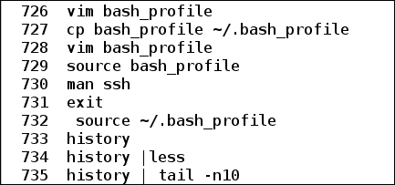

# 第五章：自定义环境

在默认系统中，我们会得到预配置的某些设置。随着时间的推移，我们经常感到需要修改一些默认设置。当我们在 shell 中工作以完成任务时，例如根据应用程序的需求修改环境时，会出现类似的需求。有些功能是如此令人难以抗拒，以至于我们可能每次都需要它们，例如应用程序使用的我们选择的编辑器。在处理重要任务时，可能会忘记几天前使用的命令。在这种情况下，我们会尽快回忆起该命令，以完成工作。如果我们记不起来，就会花费时间和精力在互联网或教科书中搜索确切的命令和语法。

在本章中，我们将看到如何通过添加或更改现有环境变量来修改环境，以满足我们的应用需求。我们还将看到用户如何修改`.bashrc`、`.bash_profile`和`.bash_logout`文件，以使设置更改永久生效。我们将看到如何搜索和修改先前执行的命令的历史记录。我们还将看到如何从单个 shell 运行多个任务并一起管理它们。

本章将详细介绍以下主题：

+   了解默认环境

+   修改 shell 环境

+   使用 bash 启动文件

+   了解你的历史

+   管理任务

# 了解默认环境

设置适当的环境对于运行进程非常重要。环境由环境变量组成，这些变量可能具有默认值或未设置默认值。通过修改现有环境变量或创建新的环境变量来设置所需的环境。环境变量是导出的变量，可用于当前进程及其子进程。在第一章, *脚本之旅的开始*中，我们了解了一些内置 shell 变量，可以将其用作环境变量来设置环境。

## 查看 shell 环境

要查看 shell 中的当前环境，可以使用`printenv`或`env`命令。环境变量可能没有值，有单个值，或者有多个值设置。如果存在多个值，每个值都用冒号(:)分隔。

### printenv

我们可以使用`printenv`来打印与给定环境变量相关联的值。语法如下：

`$ printenv [VARIABLE]`

考虑以下示例：

```
$ printenv SHELL    # Prints which shell is being used
/bin/bash
$ printenv PWD    # Present working directory
/home/foo/Documents
$ printenv HOME    # Prints user's home directory
/home/foo
$ printenv PATH    # Path where command to be executed is searched
/usr/lib64/qt-3.3/bin:/usr/lib64/ccache:/bin:/usr/bin:/usr/local/bin:/usr/local/sbin:/usr/sbin:/home/foo
$ printenv USER HOSTNAME  # Prints value of both environment variables
foo
localhost

```

如果未指定`VARIABLE`，`printenv`将打印所有环境变量，如下所示：

```
$ printenv  # Prints all environment variables available to current shell

```

### 环境

我们也可以使用`env`命令来查看环境变量，如下所示：

```
$ env

```

这将显示为给定 shell 定义的所有环境变量。

### 注意

要查看特定环境变量的值，也可以使用`echo`命令，后跟以美元符号(`$`)为前缀的环境变量名称。例如，`echo $SHELL`。

## shell 和环境变量之间的区别

shell 变量和环境变量都是可访问和设置的变量，用于给定的 shell，可能被在该 shell 中运行的应用程序或命令使用。但是，它们之间有一些区别，如下表所示：

| Shell 变量 | 环境变量 |
| --- | --- |
| 本地和导出的变量都是 shell 变量 | 导出的 shell 变量是环境变量 |
| 使用`set builtin`命令可查看 shell 变量的名称和相应值 | 使用`env`或`printenv`命令可查看环境变量的名称和相应值 |
| 本地 shell 变量不可供子 shell 使用 | 子 shell 继承父 shell 中存在的所有环境变量 |
| 通过在等号（=）的右侧用冒号（:）分隔的值在左侧指定变量名称来创建 shell 变量 | 可以通过在现有 shell 变量前加上 export shell 内置命令的前缀，或者在创建新的 shell 变量时创建环境变量 |

# 修改 shell 环境

当启动新的 shell 时，它具有初始环境设置，将被任何在给定 shell 中执行的应用程序或命令使用。我们现在知道，`env`或`setenv` shell 内置命令可用于查看为该 shell 设置了哪些环境变量。shell 还提供了修改当前环境的功能。我们还可以通过创建、修改或删除环境变量来修改当前的 bash 环境。

## 创建环境变量

要在 shell 中创建一个新的环境变量，使用`export` shell 内置命令。

例如，我们将创建一个新的环境变量`ENV_VAR1`：

```
$ env | grep ENV_VAR1  # Verifying that ENV_VAR1 doesn't exist
$ export ENV_VAR1='New environment variable'

```

创建了一个名为`ENV_VAR1`的新环境变量。要查看新环境变量，可以调用`printenv`或`env`命令：

```
$ env | grep ENV_VAR1
ENV_VAR1=New environment variable
$ printenv ENV_VAR1    # Viewing value of ENV_VAR1 environment variable
New environment variable

```

我们还可以使用`echo`命令来打印环境变量的值：

```
$ echo $ENV_VAR1  # Printing value of ENV_VAR1 environment variable
New environment variable

```

本地 shell 变量也可以进一步导出为环境变量。例如，我们将创建`ENV_VAR2`和`LOCAL_VAR1`变量：

```
$ ENV_VAR2='Another environment variable'
$ LOCAL_VAR1='Local variable'
$ env | grep ENV_VAR2  # Verifying if ENV_VAR2 is an environment variable

```

找不到名为`ENV_VAR2`的环境变量。这是因为在创建`ENV_VAR2`时，它没有被导出。因此，它将被创建为 shell 的本地变量：

```
$ set | grep ENV_VAR2
ENV_VAR2='Another environment variable'
$ set | grep  LOCAL_VAR1
LOCAL_VAR1='Local variable'

```

现在，要将`ENV_VAR2` shell 变量作为环境变量，可以使用 export 命令：

```
$ export ENV_VAR2    # Becomes environment variable
$ printenv ENV_VAR2    # Checking of  ENV_VAR2 is an environment variable
Another environment variable
$ printenv LOCAL_VAR1

```

变量`LOCAL_VAR1`不是环境变量。

环境变量的一个重要特点是它对所有子 shell 都可用。我们可以在以下示例中看到这一点：

```
$ bash  # creating a new bash shell
$ env | grep ENV_VAR2  # Checking if  ENV_VAR2 is available in child shell
ENV_VAR2=Another environment variable
$ env | grep ENV_VAR1
ENV_VAR1=New environment variable
$ env | grep LOCAL_VAR1

```

我们可以看到，从父 shell 继承的环境变量被子 shell 继承，例如`ENV_VAR1`，`ENV_VAR2`，而本地变量，如`LOCAL_VAR1`，仅对创建变量的 shell 可用。

## 修改环境变量

Shell 提供了灵活性，可以修改任何现有的环境变量。例如，考虑`HOME`环境变量。默认情况下，`HOME`环境变量包含当前登录用户的主目录的路径：

```
$ printenv HOME
/home/foo
$ pwd    # Checking current working directory
/tmp
$ cd $HOME    # Should change directory to /home/foo
$ pwd    # Check now current working directory
/home/foo

```

现在，我们将修改`HOME`环境变量的值为`/tmp`：

```
$ HOME=/tmp    # Modifying HOME environment variable
$ printenv HOME    # Checking value of HOME environment variable
/tmp
$ cd $HOME    # Changing directory to what $HOME contains
$ pwd    # Checking current working directory
/tmp

```

我们还可以向环境变量附加一个值。为此，请确保新值用冒号（:）分隔。例如，考虑`PATH`环境变量：

```
$ printenv PATH
usr/lib64/ccache:/bin:/usr/bin:/usr/local/bin:/usr/local/sbin:/usr/sbin:/home/foo/.local/bin:/home/foo/bin

```

现在，我们想要将一个新路径添加到`PATH`变量中，例如`/home/foo/projects/bin`，这样，在查找程序或命令时，shell 也可以搜索指定的路径。要将路径追加到`PATH`环境变量中，使用冒号（:）后跟新路径名称：

```
$ PATH=$PATH:/home/foo/projects/bin  # Appends new path
$ printenv PATH
usr/lib64/ccache:/bin:/usr/bin:/usr/local/bin:/usr/local/sbin:/usr/sbin:/home/foo/.local/bin:/home/foo/bin:/home/foo/projects/bin

```

我们可以看到新路径已附加到`PATH`变量的现有值上。

我们还可以将多个值附加到环境变量；为此，每个值应该用冒号（:）分隔。

例如，我们将向`PATH`变量添加两个应用程序路径：

```
$ PATH=$PATH:/home/foo/project1/bin:PATH:/home/foo/project2/bin
$ printenv PATH
usr/lib64/ccache:/bin:/usr/bin:/usr/local/bin:/usr/local/sbin:/usr/sbin:/home/foo/.local/bin:/home/foo/bin:/home/foo/projects/bin:/home/foo/project1/bin:PATH:/home/foo/project2/bin

```

两个新路径`/home/foo/project1/bin`和`/home/foo/project2/bin`已添加到`PATH`变量中。

## 删除环境变量

我们可以使用`unset` shell 内置命令删除或重置环境变量的值。

例如，我们将创建一个名为`ENV1`的环境变量：

```
$ export ENV1='My environment variable'
$ env | grep ENV1  # Checking if ENV1 environment variable exist
ENV1=My environment variable
$ unset ENV1    # Deleting ENV1 environment variable
$ env | grep ENV1

```

环境变量`ENV1`被`unset`命令删除。现在，要重置环境变量，将其赋予空值：

```
$ export ENV2='Another environment variable'
$ env | grep ENV2
ENV2=Another environment variable
$ ENV2=''	# Reset ENV2 to blank
$ env | grep ENV2
ENV2=

```

# 使用 bash 启动文件

到目前为止，要执行任务或为给定的 shell 设置任何内容，我们必须在 shell 中执行所需的命令。这种方法的主要局限性之一是相同的配置不会在新的 shell 中可用。在许多情况下，用户可能希望每当启动新的 shell 时，而不是使用新的自定义配置，而是使用默认配置之上的新的自定义配置。对于自定义 bash，用户的主目录中默认执行的三个文件是`bashrc`、`.bash_profile`和`.bash_logout`。

## .bashrc

在图形系统中，用户主要使用非登录 shell。要运行非登录 shell，我们不需要登录凭据。在图形系统中启动 shell 提供了一个非登录 shell。当 bash 以非登录模式调用时，会调用`~/.bashrc`文件，并执行其中可用的配置，并将其应用于任何启动的 bash shell。需要在登录和非登录 shell 中都需要的设置保存在`~/.bashrc`文件中。

例如，在 Fedora 22 系统上，默认的`~/.bashrc`文件如下：

```
# .bashrc

# Source global definitions
if [ -f /etc/bashrc ]; then
        . /etc/bashrc
fi

# Uncomment the following line if you don't like systemctl's auto-paging feature:
# export SYSTEMD_PAGER=

# User specific aliases and functions
```

在`~/.bashrc`中进行的任何添加只会反映到当前用户的 bash shell。我们可以看到`.bashrc`文件还检查`etc/bashrc`文件是否可用。如果可用，也会执行该文件。`/etc/bashrc`文件包含应用于所有用户的 bash shell 的系统范围配置。如果需要应用到所有用户的 bash shell 的任何配置，系统管理员可以修改`/etc/bashrc`文件。

`/etc/bashrc`文件还查看了`/etc/profile.d`中可用的脚本文件，可以通过`/etc/bashrc`文件中的以下代码片段确认：

```
 for i in /etc/profile.d/*.sh; do
        if [ -r "$i" ]; then
            if [ "$PS1" ]; then
                . "$i"
```

以下示例显示了修改后的`.bashrc`文件。将此文件命名为`custom_bashrc`：

```
# custom_bashrc

# Source global definitions
if [ -f /etc/bashrc ]; then
        . /etc/bashrc
fi

# Uncomment the following line if you don't like systemctl's auto-paging feature:
# export SYSTEMD_PAGER=

# User added settings
# Adding aliases
alias rm='rm -i'  # Prompt before every removal
alias cp='cp -i'  # Prompts before overwrite
alias df='df -h'  # Prints size in human readable format
alias ll='ls -l'  # Long listing of file

# Exporting environment variables
# Setting and exporting LD_LIBRARY_PATH variable
export LD_LIBRARY_PATH=$LD_LIBRARY_PATH:~/libs
# Setting number of commands saved in history file to 10000
export HISTFILESIZE=10000

# Defining functions
# Function to calculate size of current directory
function current_directory_size()
{
echo -n "Current directory is $PWD with total used space "
du -chs $PWD 2> /dev/null | grep total | cut -f1
}
```

`LD_LIBRARY_PATH`环境变量用于为运行时共享库加载器（`ld.so`）提供额外的目录，以便在搜索共享库时查找。您可以在[`tldp.org/HOWTO/Program-Library-HOWTO/shared-libraries.html`](http://tldp.org/HOWTO/Program-Library-HOWTO/shared-libraries.html)了解更多关于共享库的信息。

在修改之前，请备份您的原始`~/.bashrc`文件：

```
$ cp ~/.bashrc ~/.bashrc.bak

```

现在，将`custom_bashrc`文件复制到`~/.bashrc`中：

```
$ cp custom_bashrc ~/.bashrc

```

要应用修改后的设置，请打开一个新的 bash shell。要在相同的 bash shell 中应用新的`.bashrc`，您可以将其源到新的`~/.bashrc`文件中：

```
$ source ~/.bashrc

```

我们可以检查新的设置是否可用：

```
$ ll /home  # Using alias ll which we created

```

```
total 24
drwx------.  2 root    root    16384 Jun 11 00:46 lost+found
drwx--x---+ 41 foo  foo      4096  Aug  3 12:57 foo
```

```
$ alias  # To view aliases

```

```
alias cp='cp -i'
alias df='df -h'
alias ll='ls -l'
alias ls='ls --color=auto'
alias rm='rm -i'
alias vi='vim'
```

`alias`命令显示我们在`.bashrc`中添加的别名，即`rm`、`cp`、`df`和`ll`。

现在，调用我们在`.bashrc`中添加的`current_directory_size()`函数：

```
$ cd ~	# cd to user's home directory
$ current_directory_size
Current directory is /home/foo with total used space 97G
$ cd /tmp
$  current_directory_size
Current directory is /tmp with total used space 48K

```

确保将我们在本示例开始时创建的原始`.bashrc`文件移回去，并将其源到其中，以便在当前 shell 会话中反映设置。如果您不希望在执行前面示例时进行的任何配置更改，则需要这样做：

```
$ mv ~/.bashrc.bak ~/.bashrc
$ source ~/.bashrc

```

### 注意

当 bash 作为非登录 shell 调用时，它会加载`~/.bashrc`、`/etc/bashrc`和`/etc/profile.d/*.sh`文件中可用的配置。

## .bash_profile

在非图形系统中，成功登录后，用户会获得一个 shell。这样的 shell 称为登录 shell。当 bash 作为登录 shell 调用时，首先执行`/etc/profile`文件；这会运行`/etc/profile.d/`中可用的脚本。`/etc/profile`中的以下代码片段也提到了这一点：

```
for i in /etc/profile.d/*.sh ; do
    if [ -r "$i" ]; then
        if [ "${-#*i}" != "$-" ]; then 
            . "$i"
        else
```

这些是应用于任何用户登录 shell 的全局设置。此外，`~/.bash_profile`会为登录 shell 执行。在 Fedora 22 系统上，默认的`~/.bash_profile`文件内容如下：

```
# .bash_profile

# Get the aliases and functions
if [ -f ~/.bashrc ]; then
        . ~/.bashrc
fi

# User specific environment and startup programs

PATH=$PATH:$HOME/.local/bin:$HOME/bin

export PATH
```

从内容中，我们可以看到它在用户的主目录中查找`.bashrc`文件。如果主目录中有`.bashrc`文件，则会执行它。我们还知道`~/.bashrc`文件也会执行`/etc/bashrc`文件。接下来，我们看到`.bash_profile`将`PATH`变量附加到`$HOME/.local/bin`和`$HOME/bin`值。此外，修改后的`PATH`变量被导出为环境变量。

用户可以根据自己的定制配置需求修改`~/.bash_profile`文件，例如默认 shell、登录 shell 的编辑器等。

以下示例包含了`.bash_profile`中的修改配置。我们将使用`bash_profile`作为文件名：

```
# .bash_profile

# Get the aliases and functions
if [ -f ~/.bashrc ]; then
        . ~/.bashrc
fi

# User specific environment and startup programs

PATH=$PATH:$HOME/.local/bin:$HOME/bin

export PATH

# Added configuration by us
# Setting user's default editor
EDITOR=/usr/bin/vim
# Show a welcome message to user with some useful information
echo "Welcome 'whoami'"
echo "You are using $SHELL as your shell"
echo "You are running 'uname ' release 'uname -r'"
echo "The machine architecture is 'uname -m'"
echo "$EDITOR will be used as default editor"
echo "Have a great time here!"
```

在**我们添加的配置**注释之后进行更改。在应用新配置到`~/.bash_profile`之前，我们将首先备份原始文件。这将帮助我们恢复`.bash_profile`文件的原始内容：

```
$ cp ~/.bash_profile ~/.bash_profile.bak

```

在`home`目录中将创建一个新文件`.bash_profile.bak`。现在，我们将复制我们的新配置到`~/.bash_profile`：

```
$ cp bash_profile ~/.bash_profile

```

要在登录 shell 中看到反映的更改，我们可以以非图形界面登录，或者只需执行`ssh`到同一台机器上运行登录 shell。SSH（Secure Shell）是一种加密网络协议，用于以安全方式在远程计算机上启动基于文本的 shell 会话。在 UNIX 和基于 Linux 的系统中，可以使用`ssh`命令进行对本地或远程机器的 SSH。`ssh`的`man`页面（`man ssh`）显示了它提供的所有功能。要在同一台机器上进行远程登录，我们可以运行`ssh username@localhost`：

```
$ ssh foo@localhost    #  foo is the username of user

```

```
Last login: Sun Aug  2 20:47:46 2015 from 127.0.0.1
Welcome foo
You are using /bin/bash as your shell
You are running Linux release 4.1.3-200.fc22.x86_64
The machine architecture is x86_64
/usr/bin/vim will be used as default editor
Have a great time here!
```

我们可以看到我们添加的所有细节都打印在登录 shell 中。快速测试我们的新`.bash_profile`的另一种方法是通过对其进行源操作：

```
$ source ~/.bash_profile

```

```
Welcome foo
You are using /bin/bash as your shell
You are running Linux release 4.1.3-200.fc22.x86_64
The machine architecture is x86_64
/usr/bin/vim will be used as default editor
Have a great time here!
```

要重置`~/.bash_profile`文件中的更改，从我们在本示例开始时创建的`~/.bash_profile.bak`文件中复制，并对其进行源操作，以便在当前 shell 中反映更改：

```
$ mv ~/.bash_profile.bak ~/.bash_profile
$ source ~/.bash_profile

```

### 注意

当 bash 作为登录 shell 调用时，它会加载`/etc/profile`、`/etc/profile.d/*.sh`、`~/.bash_profile`、`.~/.bashrc`和`~/etc/bashrc`文件中可用的配置。

## .bash_logout

在用户的主目录中存在的`.bash_logout`文件在每次登录 shell 退出时都会执行。当用户远程登录或使用非图形界面时，这很有用。用户可以添加在从系统注销之前执行的清理任务。清理任务可能包括删除创建的临时文件、清除环境变量、注销重要数据、存档或加密某些任务、上传到 Web 等。

# 了解您的历史记录

Shell 提供了一个有趣的功能，允许您查看以前在 shell 中执行的所有命令的历史记录。经常发生我们忘记了前一天键入的命令来执行任务。我们可能能够回忆起确切的语法，也可能不行，但很方便的是我们可以参考 shell 保存的历史记录。

## 控制历史记录的 shell 变量

有一些 shell 变量可以更改用户可以看到的历史记录的内容和数量。这些 shell 变量在下表中提到：

| 名称 | 值 |
| --- | --- |
| HISTFILE | 默认情况下历史记录将保存在的文件名 |
| HISTFILESIZE | 历史文件中要保留的命令数 |
| HISTSIZE | 当前会话中要存储的历史记录数量 |
| HISTCONTROL | 以冒号分隔的值列表，控制如何保存命令在历史列表中 |

`HISTCONTROL` shell 变量的值可以是：

| 值 | 描述 |
| --- | --- |
| ignorespace | 以空格开头的行，不保存在历史记录列表中 |
| ignoredups | 不保存与先前保存的历史记录列表匹配的行 |
| ignoreboth | 应用 ignorespace 和 ignoredups |
| erasedups | 在将其保存到历史文件之前，删除与当前行匹配的历史中的所有先前行 |

让我们看看这些 shell 变量可能包含什么值：

```
$  echo $HISTFILE
/home/foo/.bash_history
$ echo $HISTFILESIZE
1000
$ echo $HISTSIZE
1000
$ echo $HISTCONTROL
ignoredups

```

从获得的值中，我们可以看到默认历史记录保存在用户`home`目录的`.bash_history`文件中，最大历史命令行保存为 1000。此外，已经存在于先前历史行中的任何重复历史都不会保存。

## history 内置命令

Shell 提供了`history`内置命令，以便用户了解到目前为止执行的命令历史。

在没有任何选项的情况下运行历史记录，会将所有先前输入的命令打印到`stdout`。命令序列按从顶部到底部的顺序提供，从最旧到最新：

```
$ history  # Prints all commands typed previously on stdout
$ history | tail -n10    # Prints last 10 commands executed

```



以下表格解释了`history` shell 内置命令的可用选项：

| 选项 | 描述 |
| --- | --- |
| -a | 立即将新的历史行追加到历史记录中 |
| -c | 清除当前列表中的历史记录 |
| -d offset | 从指定的偏移量删除历史记录 |
| -r | 将保存的历史内容追加到当前列表 |
| -w | 在覆盖现有保存的历史内容后，将当前历史列表写入历史文件 |

要查看最后执行的五个命令，我们还可以执行以下命令：

```
$ history 5
 769  cd /tmp/
 770  vi hello
 771  cd ~
 772  vi .bashrc 
 773  history 5

```

我们将发现，所有执行的命令都与历史文件中的给定字符串匹配。例如，搜索其中包含`set`字符串的命令：

```
$ history | grep set 
 555  man setenv
 600  set | grep ENV_VAR2
 601  unset ENV_VAR2
 602  set | grep ENV_VAR2
 603  unset -u  ENV_VAR2 
 604  set -u  ENV_VAR2
 605  set | grep ENV_VAR2
 737  set |grep HIST
 778  history | grep set

```

要清除所有保存的命令历史记录并将当前列表中的历史追加到历史中，我们可以执行以下操作（如果不想丢失保存的命令历史，请不要运行以下命令）：

```
$ history -c  # Clears history from current list
$ history -w  # Overwrite history file and writes current list which is empty

```

## 修改默认历史记录行为

默认情况下，shell 为管理历史记录设置了一些值。在前一节中，我们看到历史文件中将存储最多 1000 行历史记录。如果用户大部分时间都在 shell 中工作，他可能在一两天内使用了 1000 条或更多命令。在这种情况下，如果他十天前输入了一个命令，他将无法查看历史记录。根据个人用例，用户可以修改要存储在历史文件中的行数。

执行以下命令将将历史文件的最大行数设置为`100000`：

```
$ HISTFILESIZE=100000

```

同样，我们可以更改历史文件应保存的位置。我们看到，默认情况下，它保存在`home`目录中的`.bash_history`文件中。我们可以修改`HISTFILE` shell 变量，并将其设置为我们想要保存命令历史的任何位置：

```
$  HISTFILE=~/customized_history_path

```

现在，执行的命令历史将保存在`home`目录中的`customized_history_path`文件中，而不是`~/.bash_history`文件中。

要使这些更改反映到用户启动的所有 shell 和所有会话中，将这些修改添加到`~/.bashrc`文件中。

## 查看历史记录的便捷快捷键

根据用户的历史记录大小设置，历史记录中可用的命令数量可能很大。如果用户想要查找特定命令，他或她将不得不查看整个历史记录，这有时可能会很麻烦。Shell 提供了一些快捷方式，以帮助我们在历史记录中找到先前执行的特定命令。了解这些快捷方式可以节省在历史记录中查找先前执行的命令的时间。

### [Ctrl + r]

在 shell 中工作时，[*Ctrl* + *r*]快捷键允许您在历史记录中搜索命令。按下[*Ctrl* + *r*]后开始输入命令；shell 会显示与输入的命令子字符串匹配的完整命令。要向前移动到下一个匹配项，再次在键盘上输入[*Ctrl* + *r*]，依此类推：

```
$ [ctrl + r]
(reverse-i-search)'his': man history

```

我们可以看到，从历史记录`man history`中建议输入`his`。

### 上下箭头键

键盘上的上下箭头键可用于在用户先前执行的命令历史记录中后退和前进。例如，要获取上一个命令，请按一次上箭头键。要进一步后退，请再次按上箭头键，依此类推。此外，要在历史记录中前进，请使用下箭头键。

### !!

快捷方式`!!`可用于重新执行 shell 中执行的最后一个命令：

```
$ ls /home/
lost+found  foo
$ !!
ls /home/
lost+found  foo

```

### !(search_string)

这个快捷方式执行最后一个以`search_string`开头的命令：

```
$ !l
ls /home/
lost+found  skumari
$ !his
history 12

```

### !?(search_string)

这个快捷方式执行最后一个包含子字符串`search_string`的命令：

```
$ !?h
ls /home/
lost+found  skumari

```

# 任务管理

当应用程序运行时，可能会长时间运行，或者一直运行直到计算机关闭。在 shell 中运行应用程序时，我们知道只有当在 shell 中运行的程序成功完成或由于某些错误终止时，shell 提示符才会返回。除非我们得到 shell 提示符返回，否则我们无法在同一个 shell 中运行另一个命令。我们甚至不能关闭该 shell，因为这将关闭正在运行的进程。

此外，要运行另一个应用程序，我们将不得不在新的终端中打开另一个 shell，然后运行它。如果我们必须运行很多任务，管理起来可能会变得困难和繁琐。Shell 提供了在后台运行、挂起、终止或移回前台的方法。

## 在后台运行任务

可以通过在命令末尾添加&来在 shell 中将任务作为后台启动。

例如，我们想在整个文件系统中搜索一个字符串。根据文件系统的大小和文件数量，可能需要很长时间。我们可以调用`grep`命令来搜索字符串并将结果保存在文件中。Linux 中的文件系统层次结构从根目录('/')开始。

```
$ grep -R "search Text" / 2>/dev/null >  out1.txt &
[1] 8871
$

```

在这里，`grep`在整个文件系统中搜索字符串，将任何错误消息发送到`/dev/null`，并将搜索结果保存到`out1.txt`文件中。在末尾的&将整个作业发送到后台，打印启动任务的 PID，并返回 shell 提示符。

现在，我们可以在同一个打开的 shell 中做其他工作并执行其他任务。

## 将正在运行的任务发送到后台

通常我们在 shell 中正常运行任务，即作为前台任务，但后来我们想将其移至后台。首先通过[*Ctrl* + *z*]暂停当前任务，然后使用`bg`将任务移至后台。

考虑最后一次文本搜索作为一个例子。我们正常地开始搜索如下：

```
$  grep -R "search Text" / 2>/dev/null >  out2.txt

```

我们不会看到 shell 上发生任何事情，我们只会等待 shell 提示符返回。或者，我们可以使用[Ctrl + z]暂停运行的作业：

```
[ctrl + z]
[2]+  Stopped            grep -R "search Text"  / 2> /dev/null > out2.txt

```

然后，要将挂起的任务发送到后台继续运行，请使用`bg`命令：

```
$ bg
[2]+ grep -R "search Text"  / 2> /dev/null > out2.txt

```

## 列出后台任务

要查看当前 shell 中正在后台运行或挂起的任务，使用内置`jobs` shell 如下：

```
$ jobs
```

```
[1]-  Running        grep -R "search Text" / 2> /dev/null > out1.txt &
[2]+ Running         grep -R "search Text" / 2> /dev/null > out2.txt &
```

这里，索引[1]和[2]是作业编号。

字符'+'标识将由`fg`或`bg`命令用作默认值的作业，字符'-'标识当前默认作业退出或终止后将成为默认作业的作业。

创建另一个任务并使用以下命令将其挂起：

```
$ grep -R "search Text" / 2>/dev/null >  out3.txt 
[ctrl + z]
[3]+  Stopped        grep -R "search Text"  / 2> /dev/null > out3.txt
$ jobs
[1]   Running        grep -R "search Text" / 2> /dev/null > out1.txt &
[2]-  Running        grep -R "search Text" / 2> /dev/null > out2.txt &
[3]+ Stopped         grep-R "search Text" / 2> /dev/null > out3.txt
```

要查看所有后台和挂起任务的 PID，我们可以使用`-p`选项：

```
$ jobs -p

```

```
8871
8873
8874
```

作业的 PID 是按顺序排列的。要查看只在后台运行的任务，使用`-r`选项如下：

```
$ jobs -r

```

```
[1]   Running                 grep -R "search Text" / 2> /dev/null > out1.txt &
[2]-  Running                 grep -R "search Text" / 2> /dev/null > out2.txt &
```

要查看只挂起的任务，使用`-s`选项如下：

```
$ jobs -s

```

```
[3]+ Stopped                grep-R "search Text" / 2> /dev/null > out3.txt
```

要查看特定索引作业，请使用带有`jobs`命令的索引号：

```
$ jobs 2

```

```
[2]-  Running                 grep -R "search Text" / 2> /dev/null > out2.txt &
```

## 将任务移动到前台

我们可以使用 shell 内置命令`fg`将后台或挂起的任务移动到前台：

```
$ jobs  # Listing background and suspended tasks

```

```
[1]   Running                 grep -R "search Text" / 2> /dev/null > out1.txt &
[2]-  Running                 grep -R "search Text" / 2> /dev/null > out2.txt &
[3]+ Stopped                grep-R "search Text" / 2> /dev/null > out3.txt
```

字符'+'在作业索引`3`中被提到。这意味着运行`fg`命令将在前台运行第三个作业：

```
$ fg
$ grep -R "search Text" / 2> /dev/null > out3.txt

[ctrl + z]
[3]+  Stopped                 grep -R "search Text" / 2> /dev/null > out3.txt

```

以下命令暂停第三个任务：

```
$ jobs
[1]   Running                 grep -R "search Text" / 2> /dev/null > out1.txt &
[2]-  Running                 grep -R "search Text" / 2> /dev/null > out2.txt &
[3]+ Stopped                grep-R "search Text" / 2> /dev/null > out3.txt

```

要将特定作业移到前台，请使用带有任务索引号的`fg`：

```
$  fg 1  # Moving first tasks to foreground
$ grep -R "search Text" / 2> /dev/null > out1.txt
[ctrl + z]
[1]+  Stopped            grep -R "search Text" / 2> /dev/null > out1.txt

```

## 终止任务

如果不再需要，我们也可以删除运行中或挂起的任务。这可以通过使用`disown` shell 内置命令来完成：

```
$ jobs  # List running or suspended tasks in current shell

```

```
[1]+  Stopped        grep -R "search Text" / 2> /dev/null > out1.txt
[2]   Running        grep -R "search Text" / 2> /dev/null > out2.txt &
[3]-  Stopped        grep -R "search Text" / 2> /dev/null > out3.txt
```

使用`disown`而不带任何选项，会删除具有字符'`+`'的任务：

```
$ disown
bash: warning: deleting stopped job 1 with process group 8871
```

```
$ jobs  # Listing available jobs
[2]-   Running       grep -R "search Text" / 2> /dev/null > out2.txt &
[3]+  Stopped        grep -R "search Text" / 2> /dev/null > out3.txt
```

要删除运行中的任务，使用`-r`选项：

```
$ disown -r
jobs
[3]-  Stopped                 grep -R "search Text" / 2> /dev/null > out3.txt
```

要删除所有任务，使用`-a`选项如下：

```
$ disown -a  # Gives warning for deleting a suspended task
bash: warning: deleting stopped job 3 with process group 8874
$ jobs

```

`jobs`的输出什么也不显示，因为所有挂起和运行中的任务都被`-a`选项删除了。

# 总结

阅读完本章后，您现在知道如何在 shell 中创建和修改环境变量。您还知道`.bashrc`和`.bash_profile`如何帮助永久地为用户的所有会话进行更改。您学会了如何搜索我们先前执行的命令的历史记录，以及如何使用`fg`和`bg` shell 内置命令在 shell 中运行和管理不同的任务。

在下一章中，我们将看到在基于 Linux 的系统上有哪些重要类型的文件，以及可以对它们执行哪些操作以获得有意义的结果。
