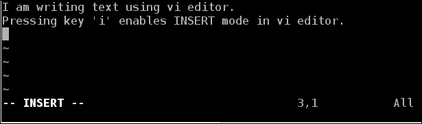
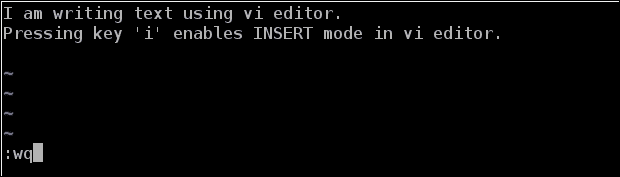
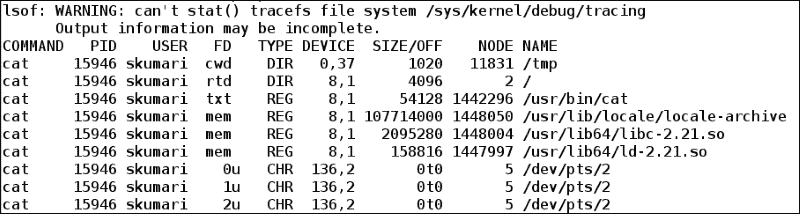
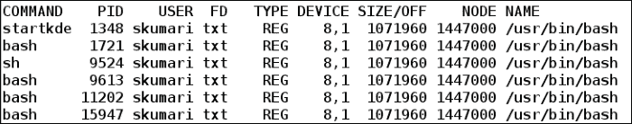

# 第六章：处理文件

为了简单起见，UNIX 和基于 Linux 的操作系统中的所有内容都被视为文件。文件系统中的文件以分层树状结构排列，树的根由'/'（斜杠）表示。树的节点可以是目录或文件，其中目录也是一种特殊类型的文件，其中包含 inode 号和相应的文件名条目列表。inode 号是 inode 表中的条目，包含与文件相关的元数据信息。

在本章中，我们将更详细地了解重要和常用的文件类型。我们将看到如何创建、修改和执行文件的其他有用操作。我们还将看到如何监视进程或用户打开的文件列表。

本章将详细介绍以下主题：

+   执行基本文件操作

+   移动和复制文件

+   比较文件

+   查找文件

+   文件的链接

+   特殊文件

+   临时文件

+   权限和所有权

+   获取打开文件的列表

+   配置文件

# 执行基本文件操作

最常用的文件是常规文件和目录。在以下子节中，我们将看到基本文件操作。

## 创建文件

我们可以使用不同的 shell 命令在 shell 中创建常规文件和目录。

### 目录文件

目录是一种特殊类型的文件，其中包含文件名列表和相应的 inode 号。它充当容器或文件夹，用于保存文件和目录。

要通过 shell 创建新目录，我们可以使用`mkdir`命令：

```
$ mkdir dir1

```

我们还可以将多个目录名称作为参数提供给`mkdir`命令，如下所示：

```
$ mkdir dir2 dir3 dir4  # Creates multiple directories

```

如果指定的路径名不存在，我们可以使用`mkdir`中的`-p`选项创建父目录。这是通过`mkdir`中的`-p`选项完成的：

```
$ mkdir -p /tmp/dir1/dir2/dir3

```

在这里，如果`dir1`和`dir2`是`dir3`的父目录且尚不存在，则`-p`选项将首先创建`dir1`目录，然后在`dir1`内创建`dir2`子目录，最后在`dir2`内创建`dir3`子目录。

### 常规文件

一般来说，文本和二进制文件被称为常规文件。在 shell 中，可以通过多种方式创建常规文件。以下部分提到了其中一些。

#### Touch 命令

也可以使用`touch`命令创建新的常规文件。它主要用于修改现有文件的时间戳，但如果文件不存在，将创建一个新文件：

```
$ touch newfile.txt  # A new empty file newfile.txt gets created
$ test -f newfile.txt && echo File exists  # Check if file exists
File exists

```

#### 使用命令行编辑器

我们可以打开任何命令行编辑器；例如，在 shell 中使用`vi/vim`、emacs、nano，编写内容，并将内容保存在文件中。

现在，我们将使用`vi`编辑器创建并编写文本：

```
$ vi foo.txt  # Opens vi editor to write content

```

按下*I*键进入 vi 的`INSERT`模式，然后按照以下截图中显示的文本输入：



在写完文本后，按下*Esc*键，然后输入`:wq`命令保存并退出 vi 编辑器。要详细了解`vi/vim`，请参考其`man`页面或在线文档([`www.vim.org/docs.php`](http://www.vim.org/docs.php))：



#### 使用 cat 命令

我们甚至可以使用`cat`命令将内容写入现有或新的常规文件，如下所示：

```
$ cat > newfile1.txt
We are using cat command
to create a new file and write into 
it
[Ctrl + d]    # Press Ctrl + d to save and exit
$ cat newfile1.txt  # See content of file
We are using cat command
to create a new file and write into
it

```

通过使用`>>`运算符而不是`>`，我们可以追加而不是覆盖文件的内容。

#### 重定向命令的输出

在 bash 或脚本中执行命令时，我们可以将结果重定向到现有文件或新文件中：

```
$ ls -l /home > newfile2.txt  #File gets created containing command output
$ cat newfile2.txt
total 24
drwx------.     2    root    root   16384  Jun  11  00:46   lost+found
drwx—x---+  41  foo     foo    4096   Aug  22  12:19   foo

```

## 修改文件

要在 shell 中修改常规文件的内容，打开编辑器中的文件，进行所需的更改，然后保存并退出。我们还可以使用`>>`运算符将命令的输出追加到指定的文件中：

```
Command >> file.txt

```

例如，我们将保存`/home`的`ls`输出到`ls_output.txt`文件中：

```
$ ls /home/ >> ls_output.txt
$ cat ls_output.txt  # Viewing content of file
lost+found
foo

```

现在，我们将追加另一个目录`/home/foo/`的`ls`输出如下：

```
$ ls /home/foo >> ls_output.txt
lost+found
foo
Desktop
Documents
Downloads
Pictures

```

我们看到`ls_output.txt`文件通过追加`ls`命令的内容而被修改。

## 查看文件

要查看常规文件的内容，我们可以简单地在编辑器中打开文件，如 vi/vim，emacs 和 nano。我们还可以使用`cat`，`less`和`more`命令来查看文件的内容。

要查看目录的内容，我们使用`ls`命令：

```
$ ls /home/
lost+found  foo

```

要递归查看目录的内容，请使用带有`-R`或`--recursive`选项的`ls`。

### 使用 cat 查看内容

我们可以使用`cat`命令查看文件的内容如下：

```
$ cat newfile1.txt
We are using cat command
to create a new file and write into
it
$ cat -n newfile1.txt    # Display line number as well
 1  We are using cat command
 2  to create a new file and write into
 3  it

```

### more 和 less

`more`和`less`命令非常有用，方便查看当前终端上无法容纳的大文件。

`more`命令以页面格式显示文件的内容，我们可以向上和向下滚动以查看文件的其余内容：

```
$ more /usr/share/dict/words

```

将文件路径作为参数传递给`more`命令。在上面的示例中，它将显示`/usr/share/dict/`目录中可用的文件单词的内容。

键*s*用于向前跳过`k`行文本。键*f*用于向前跳过 k 屏幕文本。键*b*用于向后跳过 k 屏幕文本。

`less`命令更受欢迎，被广泛用于查看大文件的内容。使用`less`命令的优点之一是它不会在开始时加载整个文件，因此查看大文件的内容更快。

使用`less`的用法与`more`命令非常相似：

```
$ less  /usr/share/dict/words

```

导航使用`less`命令要容易得多。它还有更多选项来自定义文件内容的过滤视图。

如果没有提供输入文件，`more`和`less`命令可以从`stdin`接收输入。使用管道（'`|`'）从`stdin`提供输入：

```
$ cat /usr/share/dict/words | more    #  cat output redirected to more
$ grep ^.{3}$ /usr/share/dict/words | less  # Matches all 3 character words

```

查看`more`和`less`的`man`页面以获取详细用法。

### 注意

由于不同的实现，`more`命令的行为可能因不同系统而异。

## 删除文件

如果不再需要，我们也可以删除常规文件和目录。

### 删除常规文件

要删除常规文件，我们在 shell 中使用`rm`命令。

如果文件存在，则`rm`命令删除文件，否则会在`stdout`上打印错误：

```
$ rm newfile1.txt    # Deletes if file exists
$ rm newfile1.txt    # Prints error message if file doesn't exist
rm: cannot remove 'newfile1.txt': No such file or directory

```

要忽略错误消息，可以使用`rm`与`-f`选项：

```
$ rm -f newfile1.txt
$ rm -i  newfile.txt   # Interactive deletion of file
rm: remove regular empty file 'newfile.txt'? 

```

输入键*y*删除文件，*n*跳过删除文件。

### 删除目录

要删除目录，我们可以使用`rmdir`和`rm`命令。我们将考虑在`文件`创建子主题下创建的`目录`文件中创建的目录：

```
$ rmdir dir2/  # Deletes directory dir2
$ rmdir dir1/  #  Fails to delete because of non-empty directory
rmdir: failed to remove 'dir1/': Directory not empty

```

要删除非空目录，首先删除内容，然后删除目录。我们还可以使用`rm`来删除空目录或非空目录。

`-d`选项如下删除空目录：

```
$ ls dir3/  # Directory dir3 is empty
$ rm -d dir3/  # Empty diretcory dir3 gets deleted
$ ls dir1/  # Diretcory dir1 is not empty
dir2
$ rm -d dir1/  # Fails to delete non-empty directory dir1
rm: cannot remove 'dir1': Directory not empty

```

选项`-r`，`-R`或`--recursive`递归地删除目录及其内容：

```
$ rm -ri dir1/  # Asks to remove directory dir1 recursively
rm: descend into directory 'dir1'?  Y

```

输入*y*确认应删除`dir1`。

### 注意

小心使用`rm`选项`-r`。如果可能的话，使用`-i`选项以避免意外删除整个目录的内容。

# 移动和复制文件

我们经常需要复制或移动文件到另一个位置，以便根据需要整理文件。我们还可以将计算机数据复制到本地或远程可用的外部驱动器或另一台计算机，以便备份重要数据。

## 移动文件

移动常规文件和目录在我们想要在新位置保留数据的确切副本时非常有用。`mv`命令用于将文件从一个位置移动到另一个位置。

使用`mv`命令的语法如下：

```
mv [option] source... destination

```

这里，`source`是要移动的文件或目录。可以指定多个源文件，`destination`是应将文件和目录移动到的位置。

`mv`命令的一些重要选项在下表中解释：

| 选项 | 描述 |
| --- | --- |
| `-n` | 不覆盖现有文件 |
| `-i` | 在覆盖现有文件之前提示 |
| `-f` | 在覆盖现有文件时不提示 |
| `-u` | 仅在源文件较新或目标文件丢失时才移动源文件 |
| `-v` | 打印正在移动的文件的名称 |

### 将目录移动到新位置

要将目录从一个位置移动到另一个位置，请执行以下命令：

```
$ mkdir ~/test_dir1  # Directory test_dir1 created in home directory
$ mv ~/test_dir1/ /tmp # moving directory to /tmp

```

`test_dir1`目录已经移动到了`/tmp`，现在主目录中没有`test_dir1`的副本了。

现在，我们将在用户的主目录中再次创建一个名为`test_dir1`的目录：

```
$ mkdir ~/test_dir1  # Directory test_dir1 created in home directory

```

尝试使用`-i`选项再次将`test_dir1`移动到`/tmp`：

```
$ mv -i ~/test_dir1/ /tmp
mv: overwrite '/tmp/test_dir1'?

```

我们可以看到`-i`选项明确询问用户是否要用新目录覆盖现有目录。

### 注意

使用`mv`命令和`-i`选项来避免意外覆盖文件。

### 重命名文件

我们也可以使用`mv`命令来重命名文件。例如，我们在`/tmp`目录中有`test_dir1`目录。现在，我们想将其重命名为`test_dir`。我们可以执行以下命令：

```
$ mv  /tmp/test_dir1/  /tmp/test_dir  # directory got renamed to test_dir

```

## 复制文件

创建文件的副本是一个非常常见的操作，可以在本地或远程系统上执行。

### 在本地复制文件

要在本地机器上复制文件，使用`cp`命令。

使用`cp`命令的语法如下：

```
cp [option] source … destination

```

在这里，`source`可以是单个文件、多个文件或目录，而`destination`如果`source`是单个文件，则可以是文件。否则，`destination`将是一个目录。

`cp`命令的一些重要选项如下：

| 选项 | 描述 |
| --- | --- |
| `-f` | 在覆盖现有文件时不提示 |
| `-i` | 在覆盖现有文件之前提示 |
| `-R` | 递归复制目录 |
| `-u` | 仅在源文件较新或目标文件丢失时才复制源文件 |
| `-p` | 保留原始文件的属性 |
| `-v` | 显示正在复制的文件的详细信息 |

#### 将文件复制到另一个位置

要将文件复制到另一个位置，请执行以下命令：

```
$ touch ~/copy_file.txt    # Creating a file
$ cp ~/copy_file.txt /tmp/  # Copying file to /tmp

```

现在，`copy_file.txt`文件有两个副本，一个在用户的主目录，一个在`/tmp`目录。

要复制目录，我们使用带有`-R`选项的`cp`：

```
$ mkdir ~/test_dir2  # Creating a test diretcory
$ 
cp -R ~/test_dir2 /tmp/

```

`test_dir2`目录以及目录中的所有内容都被复制到了`/tmp`。

### 远程复制文件

要在远程机器上复制文件，使用`scp`命令。它在网络上的主机之间复制文件。`scp`命令使用`ssh`来验证目标主机并传输数据。

`scp`的简单语法如下：

```
scp [option] user1@host1:source user2@host2:destination

```

在`user1@host1:source`中，`user1`是要复制文件的源用户名，`host1`是主机名或 IP 地址；`source`可以是要复制的文件或目录。

在`user2@host2:destination`中，`user2`是目标主机的用户名，文件应该被复制到该主机，`host2`是主机名或 IP 地址；`destination`可以是要复制到的文件或目录。如果没有指定目的地，将在目标主机的主目录中进行复制。

如果没有提供远程源和目的地，将在本地进行复制。

讨论了`scp`的一些重要选项如下表所示：

| 选项 | 描述 |
| --- | --- |
| `-C` | 在网络上传输数据时启用压缩 |
| `-l limit` | 限制以 Kbit/s 指定的带宽使用 |
| `-p` | 保留原始文件的属性 |
| `-q` | 不在`stdout`上打印任何进度输出 |
| `-r` | 递归复制目录 |
| `-v` | 复制过程中显示详细信息 |

#### 将文件复制到远程服务器

要将文件复制到远程服务器，非常重要的是服务器上已经运行了`ssh`服务器。如果没有，请确保启动`ssh`服务器。要复制文件，请使用以下`scp`命令：

```
$ scp -r ~/test_dir2/ foo@localhost:/tmp/test_dir2/

```

在这里，我们已经将一个副本复制到了本地机器。所以使用的主机名是`localhost`。现在，在`/tmp/test_dir2/`内有另一个目录`test_dir2`：

```
$ ls -l /tmp/test_dir2
total 0
drwxrwxr-x. 2 foo foo 40 Aug 25 00:44 test_dir2

```

# 比较文件

比较两个相似文件之间的差异是有意义的，以了解这两个文件之间存在哪些差异。例如，比较在两组数据上运行的命令获得的结果。另一个例子可以是比较脚本文件的旧版本和新版本，以了解脚本中进行了哪些修改。Shell 提供了用于文件比较的`diff`命令。

## 使用 diff 进行文件比较

`diff`命令用于逐行比较文件。使用`diff`命令的语法如下：

```
diff [option] file1 file2

```

其中，`file1`和`file2`是要比较的文件。

`diff`命令的选项在下表中解释：

| 选项 | 描述 |
| --- | --- |
| `-q` | 仅在文件不同时打印 |
| `-s` | 如果两个文件相同，则在`stdout`上打印消息 |
| `-y` | 侧边显示`diff`结果 |
| `-i` | 对文件内容进行不区分大小写的比较 |
| `-b` | 忽略空格数的更改 |
| `-u NUM` | 输出`NUM`（默认 3）行统一上下文 |
| `-a` | 在比较时将文件视为文本文件 |

### 例子

`diff`命令显示了两个文件之间添加、删除和修改行的比较结果。

我们将以`comparison_file1.txt`和`comparison_file2.txt`文本文件为例：

```
$ cat comparison_file1.txt	# Viewing content of file
This is a comparison example.

This line should be removed.
We have added multiple consecutive blank spaces.
THIS line CONTAINS both CAPITAL and small letters
```

```
$ cat comparison_file2.txt	# Viewing content of file
This is a comparison example.
We have added       multiple consecutive blank spaces.
this line contains both CAPITAL and small letters
Addition of a line
```

现在，我们将比较`comparison_file1.txt`和`comparison_file2.txt`文件：

```
$ diff  comparison_file1.txt  comparison_file2.txt
2,5c2,4
< 
< This line should be removed.
< We have added multiple consecutive blank spaces.
< THIS line CONTAINS both CAPITAL and small letters
---
> We have added       multiple consecutive blank spaces.
> this line contains both CAPITAL and small letters
> Addition of a line
```

在这里，`<`（小于）表示删除的行，`>`（大于）表示添加的行。

使用`-u`选项使`diff`输出更易读，如下所示：

```
$ diff -u comparison_file1.txt comparison_file2.txt 
--- comparison_file1.txt        2015-08-23 16:47:28.360766660 +0530
+++ comparison_file2.txt        2015-08-23 16:40:01.629441762 +0530
@@ -1,6 +1,5 @@
 This is a comparison example.
-
-This line should be removed.
-We have added multiple consecutive blank spaces.
-THIS line CONTAINS both CAPITAL and small letters
+We have added       multiple consecutive blank spaces.
+this line contains both CAPITAL and small letters
+Addition of a line
```

在这里，'`-`'告诉旧文件（`comparison_file1.txt`）中可用的行，但在新文件（`comparison_file2.txt`）中不再存在。

'`+`'表示在新文件（`comparison_file2.txt`）中添加的行。

我们甚至可以使用`–i`选项对内容进行不区分大小写的比较：

```
$ diff -i comparison_file1.txt comparison_file2.txt 
2,4c2
< 
< This line should be removed.
< We have added multiple consecutive blank spaces.
---
> We have added       multiple consecutive blank spaces.
5a4
> Addition of a line
```

要忽略多个空格，请使用`diff`并使用`-b`选项：

```
$ diff -bi  comparison_file1.txt  comparison_file2.txt
2,3d1
< 
< This line should be removed.
5a4
> Addition of a line
```

# 查找文件

在文件系统中，有大量的文件可用。有时，还会连接外部设备，这些设备可能也包含大量的文件。想象一下系统中有数百万甚至数十亿个文件，我们需要在其中搜索特定的文件或文件模式。如果文件数量在 10 到 100 之间，手动搜索文件是可能的，但在数百万个文件中几乎是不可能的。为了解决这个问题，UNIX 和 Linux 提供了`find`命令。这是一个非常有用的用于在计算机中搜索文件的命令。

使用`find`命令的语法如下：

`find search_path [option]`

在`search_path`中，指定`find`应搜索`file_search_pattern`的路径。

以下表中提到了一些重要的选项：

| 选项 | 描述 |
| --- | --- |
| -P | 不要遵循符号链接。这是默认行为 |
| -L | 在搜索时遵循符号链接 |
| -exec cmd ; | 执行作为-exec 参数传递的命令 cmd |
| -mount | 不在其他文件系统中搜索 |
| -可执行 | 匹配可执行文件 |
| -group gname | 文件属于组 gname |
| -user uname | 属于用户 uname 的文件 |
| -名称模式 | 搜索文件以获取给定模式 |
| -iname 模式 | 对给定模式的文件进行不区分大小写的搜索 |
| -inum N | 搜索具有索引号 N 的文件 |
| -samefile name | 具有与名称相同的索引号的文件 |
| -regex 模式 | 匹配给定正则表达式模式的文件。匹配整个路径。 |
| -iregex 模式 | 对给定正则表达式模式的文件进行不区分大小写的匹配。匹配整个路径。 |

## 根据用例搜索文件

以下 shell 脚本显示了如何使用`find`命令的一些用例：

```
#!/bin/bash
# Filename: finding_files.sh
# Description: Searching different types of file in system

echo -n "Number of C/C++ header files in system: "
find / -name "*.h" 2>/dev/null |wc -l
echo -n "Number of shell script files in system: "
find / -name "*.sh" 2>/dev/null |wc -l
echo "Files owned by user who is running the script ..."
echo -n "Number of files owned by user $USER :"
find / -user $USER 2>/dev/null |wc -l
echo -n "Number of executable files in system: "
find / -executable 2>/dev/null | wc -l
```

在执行上述`finding_files.sh`脚本后，以下是示例输出：

```
Number of C/C++ header files in system: 73950
Number of shell script files in system: 2023
Files owned by user who is running the script ...
Number of files owned by user foo :341726
Number of executable files in system: 127602
```

## 根据索引号查找并删除文件

`find`命令可用于根据其索引号查找文件。

```
$ find ~/ -inum 8142358
/home/foo/Documents

```

`-inum`选项可以与`exec`一起使用，用于删除无法通过文件名删除的文件。例如，名为`-test.txt`的文件无法使用`rm`命令删除：

```
$  ls -i ~ |grep  test  # Viewing file with its inode number
8159146 -test.txt

```

要删除`-test.txt`文件，执行以下命令：

```
$ find ~/ -inum 8159146 -exec rm -i {} \;  # Interactive deletion
rm: remove regular file '/home/skumari/-test.txt?' y

```

# 链接到一个文件

文件的链接意味着用不同的文件名引用相同的文件。在 Linux 和基于 Unix 的系统中，存在以下两种类型的链接：

+   软链接或符号链接

+   硬链接

要创建文件之间的链接，可以使用`ln`命令。语法如下：

```
ln [option] target link_name

```

在这里，`target`是要创建链接的文件名，`link_name`是要创建链接的名称。

## 软链接

软链接是一种特殊类型的文件，它只是指向另一个文件。这使得更容易创建文件的快捷方式，并且可以更容易地在文件系统中的不同位置访问文件。

要创建文件的符号链接，使用`ln`命令带有`-s`选项。例如，我们将在我们的主目录中创建`/tmp`目录的符号链接：

```
$ ln -s /tmp ~/local_tmp

```

现在，我们在我们的主目录中有一个对`/tmp`目录的符号链接，名为`local_tmp`。要访问`/tmp`数据，我们也可以`cd`到`~/local_tmp`目录。要知道一个文件是否是符号链接，运行`ls -l`命令：

```
$ ls -l ~/local_tmp
lrwxrwxrwx. 1 foo foo 5 Aug 23 23:31 /home/foo/local_tmp -> /tmp/

```

如果第一列的第一个字符是`l`，那么它意味着它是一个符号链接。同时，最后一列显示`/home/foo/local_tmp -> /tmp/`，这意味着`local_tmp`指向`/tmp`。

## 硬链接

硬链接是一种用不同名称引用文件的方式。所有这些文件都将具有相同的索引节点号。索引节点号是索引表中的索引号，包含有关文件的元数据。

要创建文件的硬链接，使用`ln`命令而不带任何选项。在我们的情况下，我们将首先创建一个名为`file.txt`的常规文件：

```
$ touch file.txt
$ ls -l file.txt
-rw-rw-r--. 1 foo foo 0 Aug 24 00:13 file.txt

```

`ls`的第二列显示链接计数。我们可以看到当前是`1`。

现在，要创建`file.txt`的硬链接，我们将使用`ln`命令：

```
$ ln file.txt hard_link_file.txt

```

要检查是否为`file.txt`创建了硬链接，我们将查看其链接计数：

```
$ ls -l file.txt
-rw-rw-r--. 2 foo foo 0 Aug 24 00:13 file.txt

```

现在，链接计数为`2`，因为使用名称`hard_link_file.txt`创建了一个硬链接。

我们还可以看到`file.txt`和`hard_link_file.txt`文件的索引节点号是相同的：

```
$ ls -i file.txt hard_link_file.txt
96844   file.txt
96844   hard_link_file.txt

```

## 硬链接和软链接之间的区别

以下表格显示了硬链接和软链接之间的一些重要区别：

| 软链接 | 硬链接 |
| --- | --- |
| 实际文件和软链接文件的索引节点号是不同的。 | 实际文件和硬链接文件的索引节点号是相同的。 |
| 可以在不同的文件系统之间创建软链接。 | 只能在相同的文件系统中创建硬链接。 |
| 软链接可以链接到常规文件和目录。 | 硬链接不能链接到目录。 |
| 如果实际文件被删除，软链接不会更新。它将继续指向一个不存在的文件。 | 如果实际文件被移动或删除，硬链接总是会更新。 |

# 特殊文件

除了常规文件、目录和链接文件之外的文件都是特殊文件。它们如下：

+   块设备文件

+   字符设备文件

+   命名管道文件

+   套接字文件

## 块设备文件

块设备文件是以块形式读写数据的文件。这种文件在需要大量写入数据时非常有用。诸如硬盘驱动器、USB 驱动器和 CD-ROM 之类的设备被视为块设备文件。数据是异步写入的，因此其他用户不会被阻止执行写操作。

要创建块设备文件，使用`mknod`命令，带有`b`选项以及提供主要和次要编号。主要编号选择调用哪个设备驱动程序执行输入和输出操作。次要编号用于识别子设备：

```
$ sudo mknod  block_device b 0X7 0X6

```

在这里，`0X7`是十六进制格式的主要编号，`0X6`是次要编号：

```
$ ls -l block_device
brw-r--r--. 1 root root 7, 6 Aug 24 12:21 block_device

```

第一列的第一个字符是`b`，这意味着它是一个块设备文件。

`ls`输出的第五列是`7`和`6`。这里，`7`是一个主要号，`6`是一个次要号，以十进制格式表示。

字符设备文件是以逐个字符的方式读取和写入数据的文件。这些设备是同步的，一次只能有一个用户进行写操作。键盘、打印机和鼠标等设备被称为字符设备文件。

以下命令将创建一个字符特殊文件：

```
$ sudo  mknod  character_device  c 0X78 0X60

```

这里，`0X78`是一个主要号，`0X60`是一个次要号，以十六进制格式表示。

```
$ ls -l character_device  # viewing attribute of  character_device file
crw-r--r--. 1 root root 120, 96 Aug 24 12:21 character_device

```

第一列的第一个字符是`c`，表示它是一个字符设备文件。`ls`输出的第五列是`120`和`96`。这里，`120`是一个主要号，`96`是一个次要号，以十进制格式表示。

## 命名管道文件

命名管道文件被不同的系统进程用于相互通信。这种通信也被称为进程间通信。

要创建这样一个文件，我们使用`mkfifo`命令：

```
$ mkfifo pipe_file    # Pipe file created
$ ls pipe_file      # Viewing file content
prw-rw-r--. 1 foo foo 0 Aug 24 01:41 pipe_file

```

这里，第一列的第一个字符是`p`，表示它是一个管道文件。`/dev`目录中有很多管道文件。

我们还可以使用`mknod`命令的`p`选项创建一个命名管道：

```
$ mknod   named_pipe_file p
$ ls -l  named_pipe_file
prw-rw-r--. 1 foo foo 0 Aug 24 12:33 named_pipe_file

```

以下 shell 脚本演示了从命名管道中读取消息。`send.sh`脚本创建一个名为`named_pipe`的命名管道，如果它不存在的话，然后在其中发送一条消息：

```
#!/bin/bash

# Filename: send.sh
# Description: Script which sends message over pipe

pipe=/tmp/named_pipe

if [[ ! -p $pipe ]]
then
 mkfifo $pipe
fi

echo "Hello message from Sender">$pipe

```

`receive.sh`脚本检查名为`named_pipe`的命名管道是否存在，从管道中读取消息，并显示在`stdout`上：

```
#!/bin/bash
#Filename: receive.sh
# Description: Script receiving message from sender from pipe file

pipe=/tmp/named_pipe

if [[ ! -p $pipe ]]
then
  echo "Reader is not running"
fi

while read line
do
  echo "Message from Sender:"
  echo $line
done < $pipe
```

要执行它，在一个终端中运行`send.sh`，在另一个终端中运行`receive.sh`：

```
$ sh send.sh  # In first terminal
$ sh receive.sh  # In second terminal
Message from Sender:
Hello message from Sender

```

## 套接字文件

套接字文件用于从一个应用程序传递信息到另一个应用程序。例如，如果**通用 UNIX 打印系统**（**CUPS**）守护程序正在运行，我的打印应用程序想要与它通信，那么我的打印应用程序将向套接字文件写入一个请求，CUPS 守护程序会监听即将到来的请求。一旦请求被写入套接字文件，守护程序将处理请求：

```
$ ls -l /run/cups/cups.sock  # Viewing socket file attributes
srw-rw-rw-. 1 root root 0 Aug 23 15:39 /run/cups/cups.sock

```

第一列中的第一个字符是`s`，表示它是一个套接字文件。

# 临时文件

临时文件是在应用程序运行时需要的一段时间内的文件。这些文件被用来保存运行程序的中间结果，在程序执行完成后就不再需要了。在 shell 中，我们可以使用`mktemp`命令创建临时文件。

## 使用`mktemp`创建临时文件

`mktemp`命令创建一个临时文件，并在`stdout`上打印其名称。临时文件默认创建在`/tmp`目录中。

创建临时文件的语法如下：

```
$ mktmp
/tmp/tmp.xEXXxYeRcF

```

一个名为`tmp.xEXXxYeRcF`的文件被创建到`/tmp`目录中。我们可以在应用程序中进一步读写这个文件以供临时使用。使用`mktemp`命令而不是使用一个随机名称来创建临时文件名，可以避免意外覆盖现有的临时文件。

要创建临时目录，我们可以使用`mktemp`的`-d`选项：

```
$ temp_dir=mktemp -d
$ echo $temp_dir
/tmp/tmp.Y6WMZrkcj4

```

此外，我们也可以明确地删除它：

```
$ rm -r /tmp/tmp.Y6WMZrkcj4

```

我们甚至可以通过提供一个参数作为`name.XXXX`来指定一个模板用于临时文件。这里，`name`可以是临时文件应该以哪个名称开头，`XXXX`表示在点（.）后使用随机字符的长度。通常，在编写应用程序时，如果需要临时文件，应用程序名称将作为临时文件名。

例如，一个测试应用程序需要创建一个临时文件。为了创建一个临时文件，我们将使用以下命令：

```
$ mktemp test.XXXXX
test.q2GEI

```

我们可以看到临时文件名以`test`开头，后面正好包含五个随机字母。

### 注意

临时文件将被清理的时间是与发行版相关的。

# 权限和所有权

作为 Linux 和 UNIX 系统的用户，重要的是用户对特定文件或目录具有所需的权限。例如，作为普通用户，执行`cd`进入`/root`：

```
$ cd /root
bash: cd: /root/: Permission denied

```

由于权限被拒绝，我们无法这样做：

```
$ cd ~/

```

我们成功地能够进入用户的主目录，因为用户有权限访问自己的主目录。

UNIX 或 Linux 中的每个文件都有一个所有者和一个关联的组。它还具有相对于用户、组和其他人的一组权限（读取、写入和执行）。

## 查看文件的所有权和权限

使用`ls -l`选项的`ls`命令用于查看文件的所有权和权限：

```
$ touch permission_test_file.txt    #  Creating a file
$ ls -l  permission_test_file.txt    # Seeing files' attributes
-rw-rw-r-- 1 foo foo 0 Aug 24 16:59 permission_test_file.txt

```

在这里，`ls`的第一列包含权限信息，即`-rw-rw-r--`。

第一个字符指定文件的类型，在这个例子中是短横线（-）。短横线表示这是一个常规文件。它可以有其他字符，如下所示：

+   p：这意味着这是一个命名管道文件

+   d：这意味着这是一个目录文件

+   s：这意味着这是一个套接字文件

+   c：这意味着这是一个字符设备文件

+   b：这意味着这是一个块设备文件

接下来的三个字符属于用户或所有者的权限。它可以是`rwx`或`-`中的任何一个。权限`r`表示读权限可用，`w`表示写权限可用，`x`表示给定文件上的执行权限可用。如果存在短横线，则相应的权限缺失。在上面的例子中，所有者的权限是`rw-`，这意味着所有者对`permission_test_file.txt`文件具有读和写权限，但没有执行权限。

接下来的三个字符属于组的权限。如果相应的权限缺失，则在这些位置中可以是`rwx`或`-`。在前面的例子中，授予组的权限是`rw-`，这意味着读取和写入权限存在，但执行权限缺失。

接下来的三个字符属于其他人的权限。在前面的例子中，授予其他人的权限是`r--`，这意味着其他用户可以读取`permission_test_file.txt`文件的内容，但不能修改或执行它。

`ls -l`输出中的下一列，即第二列指定文件的所有者是谁。在我们的例子中，第二列的值是`foo`，这意味着`foo`拥有该文件。默认情况下，文件的所有权归创建该文件的人。

`ls -l`输出中的第三列指定文件所属的组。在我们的例子中，`permission_test_file.txt`文件的组是`foo`。

## 更改权限

要更改文件的权限，使用`chmod`命令。使用`chmod`的语法如下：

```
chmod [option] mode[,mode] file

```

或者，

```
chmod [option] octal-mode file

```

`chmod`的一个重要选项是`-R`，它表示递归更改文件和目录的权限。

`mode`可以是`[ugoa][-+][rwx]`。

在这里，`u`是所有者，`g`是组，`o`是其他，`a`是所有用户，即`ugo`。

指定-（减号）会移除指定的权限，指定`+`（加号）会添加指定的权限。

字母`r`（读取）、`w`（写入）和`x`（执行）指定权限。

`八进制模式`以八进制格式指定用户的`rwx`权限，可以是`0 到 7`。以下表格解释了特定用户权限的八进制表示：

| 八进制值 | 二进制表示 | 意义 |
| --- | --- | --- |
| 0 | 000 | 没有读取、写入和执行权限（---） |
| 1 | 001 | 只有执行权限（--x） |
| 2 | 010 | 只有写权限（-w-） |
| 3 | 011 | 写和执行权限（-wx） |
| 4 | 100 | 只有读权限（r--） |
| 5 | 101 | 读取和执行权限（r-x） |
| 6 | 110 | 读取和写入权限（rw-） |
| 7 | 111 | 读取、写入和执行权限（rwx） |

为了演示对文件进行权限更改，我们将创建一个文件如下：

```
$ touch test_file.txt
$ ls -l test_file.txt    # Checking permission of file
-rw-rw-r--. 1 foo foo 0 Aug 24 18:59 test_file.txt

```

对于普通文件，默认权限是所有者、组和其他人都有“读”权限。所有者和组有“写”权限。没有人被赋予执行权限。

现在，我们想以只有所有者可以拥有“写”权限的方式修改权限，并保持其他权限不变。我们可以这样做：

```
$ chmod 644 test_file.txt
$ ls -l tst_file.txt
-rw-r--r--. 1 foo foo 0 Aug 24 19:03 test_file.txt

```

现在，我们可以看到只有所有者可以修改`test_file`。在使用八进制模式时，我们必须指定我们希望进一步查看的确切权限。在`chmod`中，我们将`octal_mode`设置为`644`；这里的第一个八进制数字，即`6`表示所有者的读、写和执行权限。同样，第二个八进制数字`4`指定了组的权限，第三个数字指定了其他人的权限。

还有另一种修改权限的方法，即使用模式。模式被指定为`[ugoa][-+][rwx]`。在这里，我们只需要指定要添加或删除的权限。

例如，我们想要从所有者那里删除写权限，并向所有人添加执行权限。我们可以这样做：

```
$ chmod u-w,a+x test_file.txt
$ ls -l test_file.txt
-r-xr-xr-x. 1 foo foo 0 Aug 24 19:03 test_file.txt

```

## 更改所有者和组

我们还可以更改文件的所有者和组所有权。这允许进一步修改文件的组和所有者。

### 更改文件的所有者

要更改命令的所有者，使用`chown`。这对于系统管理员在不同情况下非常有用。例如，用户正在进行一个项目，现在用户将要停止在该项目上的工作。在这种情况下，系统管理员可以将所有权修改为负责继续该项目的新用户。系统管理员可以将文件的所有权更改为项目中所有相关文件的新用户。

在我们之前的例子中，`foo`是`test_file.txt`文件的所有者。现在，我们想把文件的所有权转移到用户`bar`。

如果系统中不存在用户`bar`，可以使用`useradd`命令创建一个名为 bar 的新用户。需要 root 访问权限。

以下命令将创建一个名为`bar`的新用户：

```
$ sudo useradd bar  # New user bar will be created

```

我们可以通过以下命令将`test_file.txt`文件的所有权更改为用户`bar`：

```
$ sudo chown bar test_file.txt  # Changing ownership of file to user bar
$ ls -l  test_file.txt
-r-xr-xr-x. 1 bar foo 0 Aug 24 19:03 test_file.txt

```

我们可以看到文件的所有权已更改为 bar。

### 更改组所有权

要修改文件的组所有权，可以使用`chown`或`chgrp`命令。要创建一个新组，使用`groupadd`命令作为`sudo`或`root`。例如，我们想创建一个名为`test_group`的新组：

```
$ sudo groupadd test_group

```

现在，我们将使用`chown`命令将示例文件`test_file.txt`的组更改为。可以通过执行以下命令来完成这个操作：

```
$ sudo chown :test_group test_file.txt  # Modifying group ownership
$ ls -l test_file.txt
-r-xr-xr-x. 1 bar test_group 0 Aug 24 19:03 test_file.txt

```

我们可以看到组已经修改为`test_group`。要使用`chgrp`命令更改组，可以执行以下命令：

```
$  sudo chgrp bar test_file.txt  # Changing group ownership to bar
$ ls -l test_file.txt
-r-xr-xr-x. 1 bar bar 0 Aug 24 19:03 test_file.txt

```

现在，我们将把`test_file.txt`文件的所有者和组还原为`foo`：

```
$ sudo chown foo:foo test_file.txt
$ ls -l test_file.txt
-r-xr-xr-x. 1 foo foo 0 Aug 24 19:03 test_file.txt

```

在使用`chown`命令修改所有者和组所有权时，新的所有者名称在`:`（冒号）之前提供，组名称在`:`之后提供。

# 获取打开文件的列表

我们知道系统中可能有数百万个文件，可以是二进制文件、文本文件、目录等。当文件没有被使用时，它们只是作为“0 和 1”存储在存储设备上。要查看或处理文件，需要打开它。正在执行的应用程序可能会打开多个文件。知道运行应用程序打开了哪些文件非常有用。要知道已打开文件的列表，使用`lsof`命令。

执行以下命令会列出所有打开的文件：

```
$ lsof

```

这会给出所有打开文件的大量输出。

## 知道特定应用程序打开的文件

要知道特定应用程序打开的文件列表，首先获取正在运行应用程序的**进程 ID**（**PID**）：

```
$ pidof application_name

```

例如，让我们不带任何参数运行`cat`：

```
$ cat

```

在另一个终端中，运行以下命令：

```
$ pidof cat
15913
$ lsof -p 15913

```

或者，我们可以直接输入以下命令：

```
$ lsof -p 'pidof cat'

```

以下是`lsof`输出的示例截图：



在输出中，我们看到了各种结果的列。第一列是`COMMAND`，即打开此文件的应用程序，PID 列指定了打开文件的 PID，USER 指示打开文件的用户，FD 是文件描述符，TYPE 指定文件类型，DEVICE 指定设备号，值用逗号分隔，SIZE/OFF 指定文件大小或字节偏移量，NAME 是带有绝对路径的文件名。

在输出中，我们可以看到应用程序已经从`/usr/bin`打开了`cat binary`。它还加载了共享库文件，如`libc-2.21.so`和`ld-2.21.so`，这些文件位于`/usr/lib64/`中。此外，还有一个字符设备`dev/pts/2`被打开。

## 列出打开文件的应用程序

我们还可以找出哪些应用程序打开了一个文件。可以通过执行以下命令来实现：

```
$ lsof /usr/bin/bash

```

以下是示例输出：



从输出中，我们可以看到`bash`文件已被六个运行的应用程序打开。

## 了解用户打开的文件

要了解特定用户打开的文件列表，请使用`lsof`命令和`-u`选项。语法如下：

```
lsof -u user_name

```

例如，考虑以下命令：

```
$ lsof -u foo | wc -l
525

```

这意味着当前有`525`个文件由用户 root 打开。

# 配置文件

配置文件是包含应用程序设置的常规文件。在 Linux 和 UNIX 的执行初始阶段，许多应用程序从配置文件中读取设置，并相应地配置应用程序。

## 查看和修改配置文件

配置文件通常位于`/etc/`目录中，可以使用`cat`命令查看。

例如，考虑查看`resolv.conf`配置文件：

```
$ cat /etc/resolv.conf

```

```
# Generated by NetworkManager
search WirelessAP
nameserver 192.168.1.1
```

`resolv.conf`文件包含联系 DNS 服务器的顺序。

我们还可以修改配置文件以满足我们的需求。例如，如果一些网络 URL 可以通过`192.168.1.1`访问，我们可以在`/etc/resolv.conf`文件中添加另一个 DNS 条目，DNS 值为`8.8.8.8`。修改后的`cat /etc/resolv.conf`将如下所示：

```
$ cat /etc/resolv.conf

```

```
# Generated by NetworkManager
search WirelessAP
nameserver 192.168.1.1
nameserver 8.8.8.8
```

系统中还有许多其他配置文件，例如`ssh`、`passwd`、`profile`、`sysconfig`、`crontab`、`inittab`等，位于`/etc/`目录中。

# 总结

阅读本章后，您现在应该知道 UNIX 和基于 Linux 的操作系统将一切视为文件，可以进一步分类为常规、目录、链接、块设备、字符设备、套接字和管道文件。您还应该知道如何对这些文件中的任何一个执行基本操作。现在，您应该对如何查看和修改文件的权限和所有权有很好的了解。您还应该知道如何使用`lsof`命令监视和管理系统中打开文件的列表。

在下一章中，您将学习系统中如何创建进程以及如何监视和管理所有运行中的进程。我们还将看到两个或更多进程如何使用**进程间通信**（**IPC**）机制相互通信。
