# 第七章：欢迎来到进程

正在执行的程序称为**进程**。当操作系统启动时，多个进程会启动，以提供各种功能和用户界面，以便用户可以轻松执行所需的任务。例如，当我们启动命令行服务器时，我们将看到一个带有 bash 或任何其他已启动的 shell 进程的终端。

在 Linux 中，我们对进程有完全控制权。它允许我们创建、停止和终止进程。在本章中，我们将看到如何使用诸如`top`、`ps`和`kill`之类的命令以及通过更改其调度优先级来创建和管理进程。我们还将看到信号如何导致进程突然终止，以及使用命令 trap 在脚本中处理信号的方法。我们还将看到进程的一个美妙特性，即进程间通信，它允许它们相互通信。

本章将详细介绍以下主题：

+   进程管理

+   列出和监视进程

+   进程替换

+   进程调度优先级

+   信号

+   陷阱

+   进程间通信

# 进程管理

管理进程非常重要，因为进程是消耗系统资源的主要因素。系统用户应该注意他们正在创建的进程，以确保进程不会影响任何其他关键进程。

## 进程创建和执行

在 bash 中，创建进程非常容易。执行程序时，会创建一个新进程。在 Linux 或基于 Unix 的系统中，创建新进程时会为其分配一个唯一的 ID，称为 PID。PID 值始终是从`1`开始的正数。根据系统是否具有`init`或`systemd`，它们始终获得 PID 值 1，因为这将是系统中的第一个进程，它是所有其他进程的祖先。

PID 的最大值在`pid_max`文件中定义，该文件应该位于`/proc/sys/kernel/`目录中。默认情况下，`pid_max`文件包含值`32768`（最大 PID + 1），这意味着系统中最多可以同时存在`32767`个进程。我们可以根据需要更改`pid_max`文件的值。

为了更好地理解进程创建，我们将从 bash 创建一个新进程`vi`：

```
$ vi hello.txt

```

在这里，我们创建了一个新进程`vi`，它打开编辑器中的`hello.txt`文件以读写文本。调用`vi`命令会导致二进制文件`/usr/bin/vi`执行并执行所需的任务。创建另一个进程的进程称为该进程的父进程。在本例中，`vi`是从 bash 创建的，因此 bash 是进程`vi`的父进程。创建子进程的方法称为 forking。在 fork 过程中，子进程继承其父进程的属性，如 GID、真实和有效的 UID 和 GID、环境变量、共享内存和资源限制。

要知道在前一节中创建的`vi`进程的 PID，我们可以使用诸如`pidof`和`ps`之类的命令。例如，在新终端中运行以下命令以了解`vi`进程的 pid：

```
$ pidof vi  # Process ID of vi process
21552
$ ps -o ppid= -p 21552	# Knowing parent PID of vi process
1785

```

任务完成后，进程终止并且 PID 可根据需要自由分配给新进程。

有关每个进程的详细信息可在`/proc/`目录中找到。对于`/proc/`中的每个进程，都会创建一个名为 PID 的目录，其中包含其详细信息。

进程在其生命周期中可以处于以下任何状态之一：

+   **运行**：在此状态下，进程正在运行或准备运行

+   **等待**：进程正在等待资源

+   **停止**：进程已停止；例如，收到信号后

+   **僵尸**：进程已成功退出，但其状态变化尚未被父进程确认

## 进程终止

在正常情况下，完成任务后，进程会终止并释放分配的资源。如果 shell 已经派生了任何子进程，那么它将等待它们完成任务（而不是后台进程）。在某些情况下，进程可能不会正常工作，可能会等待或消耗比预期更长的时间。在其他一些情况下，可能会发生进程现在不再需要的情况。在这种情况下，我们可以从终端杀死进程并释放资源。

要终止一个进程，我们可以使用`kill`命令。如果系统上有的话，也可以使用`killall`和`pkill`命令。

### 使用 kill 命令

`kill`命令向指定的进程发送指定的信号。如果没有提供信号，则发送默认的`SIGTERM`信号。我们将在本章后面更多地了解有关信号的信息。

以下是使用`kill`命令的语法：

```
kill PID

```

AND

```
kill -signal PID

```

要杀死一个进程，首先获取该进程的`PID`如下：

```
$ pidof firefox    # Getting PID of firefox process if running
1663
$ kill 1663    # Firefox will be terminated
$ vi hello.txt  # Starting a vi process
$ pidof vi
22715
$ kill -SIGSTOP 22715  # Sending signal to stop vi process
[1]+  Stopped                 vi

```

在这里，我们使用`SIGSTOP`信号来停止进程而不是杀死它。要杀死，我们可以使用`SIGKILL`信号或与此信号相关的值，即`9`。

```
$ kill -9 22715  # Killing vi process

```

OR

```
$ kill -SIGKILL 22715  # Killing vi process

```

### 使用 killall 命令

按名称而不是 PID 来记住一个进程更容易。`killall`命令使得杀死一个进程更容易，因为它将命令名称作为参数来杀死一个进程。

以下是`killall`命令的语法：

```
killall process_name

```

AND

```
killall -signal process_name

```

例如，我们可以按名称杀死`firefox`进程，如下所示：

```
$ killall firefox  # Firefox application gets terminated

```

## 使用 pkill 命令

`pkill`命令也可以用来按名称杀死一个进程。与`killall`命令不同，默认情况下，`pkill`命令会找到所有以其参数中指定的名称开头的进程。

例如，以下命令演示了`pkill`如何根据参数中指定的部分名称杀死`firefox`进程：

```
$ pkill firef    # Kills processes beginning with name firef and hence firefox

```

`pkill`命令应该谨慎使用，因为它会杀死所有匹配的进程，这可能不是我们的意图。我们可以使用`pgrep`命令和`-l`选项来确定将要被`pkill`杀死的进程。`pgrep`命令根据其名称和属性找到进程。运行以下命令来列出所有以`firef`和`fire`字符串开头的进程名称及其 PID：

```
$ pgrep firef
 8168 firefox

```

这里，`firefox`是匹配的进程名称，其 PID 是`8168`：

```
$ pgrep fire
 747 firewalld
 8168 firefox

```

我们还可以告诉`pkill`使用`--exact`或`-x`选项来精确匹配进程名称杀死进程，如下所示：

```
$ pgrep -x -l  firef  # No match found
$ pkill -x fire  # Nothing gets killed
$ pgrep --exact -l firefox	  # Process firefox found
8168 firefox
$ pkill --exact firefox  # Process firefox will be killed

```

pkill 命令还可以使用`-signal_name`选项向所有匹配的进程发送特定信号，如下所示：

```
$  pkill -SIGKILL firef

```

上述命令向所有以`firef`开头的进程发送`SIGKILL`信号。

# 列出和监视进程

在运行中的系统中，我们经常会注意到突然系统反应缓慢。这可能是因为运行的应用程序消耗了大量内存，或者进程正在进行 CPU 密集型工作。很难预测哪个应用程序导致系统反应变慢。为了知道原因，了解正在运行的所有进程以及了解进程的监视行为（例如消耗的 CPU 或内存量）是很有帮助的。

## 列出进程

要知道系统中运行的进程列表，我们可以使用`ps`命令。

### 语法

`ps`命令的语法如下：

```
ps [option]

```

有很多选项可以使用`ps`命令。常用选项在下表中有解释。

#### 简单的进程选择

以下表格显示了可以组合在一起使用以获得更好结果选择的多个选项：

| 选项 | 描述 |
| --- | --- |
| `-A`, `-e` | 选择所有进程 |
| `-N` | 选择不满足条件的所有进程，即否定选择 |
| `T` | 选择与当前终端相关的进程 |
| `r` | 限制选择只有运行中的进程 |
| `x` | 选择没有控制终端的进程，例如在引导过程中启动的守护进程 |
| `a` | 选择终端上的进程，包括所有用户 |

#### 按列表选择进程

以下选项接受以空格分隔或逗号分隔的列表形式的单个参数；它们可以多次使用：

| 选项 | 描述 |
| --- | --- |
| `-C cmdlist` | 通过名称选择进程。提供在`cmdlist`中选择的名称列表。 |
| `-g grplist` | 通过`grplist`参数列表中提供的有效组名选择进程。 |
| `-G grplist` | 通过`grplist`参数列表中提供的真实组名选择进程。 |
| `-p pidlist` | 通过`pidlist`中提到的 PID 选择进程。 |
| `-t ttylist` | 通过`ttylist`中提到的终端选择进程。 |
| `-U userlist` | 通过`userlist`中提到的真实用户 ID 或名称选择进程。 |
| `-u userlist` | 通过`userlist`中提到的有效用户 ID 或名称选择进程。 |

#### 输出格式控制

以下选项用于选择如何显示`ps`命令的输出：

| 选项 | 描述 |
| --- | --- |
| 显示作业格式。 |
| `-f` | 用于完整格式列表。它还打印传递给命令的参数。 |
| `u` | 显示面向用户的格式。 |
| `-l` | 显示长格式。 |
| `v` | 显示虚拟内存格式。 |

### 列出所有带有详细信息的进程

要了解系统上的所有进程，可以使用`-e`选项。要获得更详细的输出，请与`u`选项一起使用：

```
$ ps -e u | wc -l    # Total number of processes in system
211
$ ps -e u | tail -n5  # Display only last 5 line of result

```

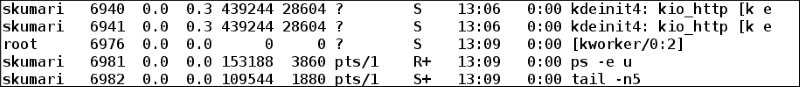

我们可以从输出中看到所有用户的进程。实际显示输出的命令——即**ps -e u | tail -n5**——也作为两个单独的运行进程在`ps`输出中提到。

在 BSD 风格中，使用`aux`选项可以获得与`-e u`相同的结果：

```
$ ps aux

```

在基于 Linux 的操作系统上，`aux`以及`-e u`选项都可以正常工作。

### 列出特定用户运行的所有进程

要了解特定用户正在运行哪些进程，可以使用`-u`选项，后面跟着用户名。也可以提供多个用户名，用逗号（,）分隔。

```
$ ps u -u root | wc -l
130
$ ps u -u root | tail -n5	# Display last 5 results

```

前面的命令显示以下结果：

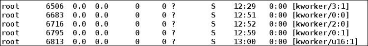

我们看到所有进程都是以 root 用户身份运行的。其他用户的进程已被过滤掉。

### 在当前终端中运行的进程

了解当前终端中运行哪些进程很有用。这有助于决定是否终止运行中的终端。我们可以使用`T`或`t`选项制作当前终端中运行的进程列表。

```
$ ps ut

```

以下命令的输出如下：


我们可以从输出中看到，`bash`和`ps uT`命令（我们刚刚执行以显示结果）是当前终端中唯一运行的进程。

### 按命令名称列出进程

我们还可以使用`-C`选项按名称了解进程的详细信息，后面跟着命令名称。多个命令名称可以用逗号（`,`）分隔：

```
$ ps u -C firefox,bash

```

获得以下输出：

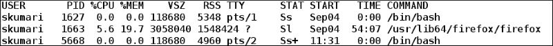

## 进程的树形格式显示

`pstree`命令以树形结构显示运行中的进程，这样很容易理解进程的父子关系。

使用`-p`选项运行`pstree`命令，以树形格式显示进程及其 PID 号，如下所示：

```
$ pstree -p

```

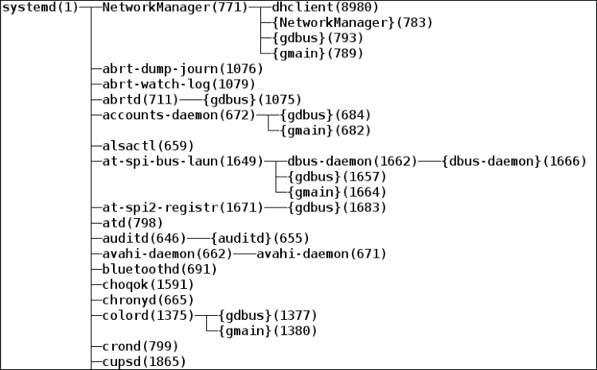

从 `pstree` 输出中，我们可以看到所有进程的父进程是 `systemd`。这是作为负责执行其余进程的第一个进程启动的。在括号中，提到了每个进程的 PID 号码。我们可以看到 `systemd` 进程得到了 PID 1，这是固定的。在基于 `init` 的操作系统上，`init` 将是所有进程的父进程，并且具有 PID 1。

要查看特定 PID 的进程树，我们可以使用 `pstree` 并将 PID 号码作为参数：

```
$ pstree -p 1627  # Displays process tree of PID 1627 with PID number

```

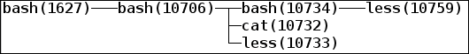

使用 `pstree` 命令并带有 `-u` 选项来查看进程的 UID 和父进程不同时：

```
$ pstree -pu 1627

```

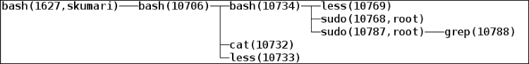

我们可以看到最初，`bash` 由用户 `skumari` 以 PID `1627` 运行。在树的下方，`sudo` 命令以 root 用户身份运行。

## 监视进程

在运行时了解进程消耗了多少内存和 CPU 是非常重要的，以确保没有内存泄漏和过度 CPU 计算的发生。有一些命令，如 `top`、`htop` 和 `vmstat`，可以用来监视每个进程消耗的内存和 CPU。在这里，我们将讨论 `top` 命令，因为它是预装在基于 Linux 的操作系统中的。

`top` 命令显示 CPU、内存、交换和当前正在运行的任务数量的动态实时使用情况。

运行 `top` 而不带任何选项会给出以下结果：

```
$ top

```

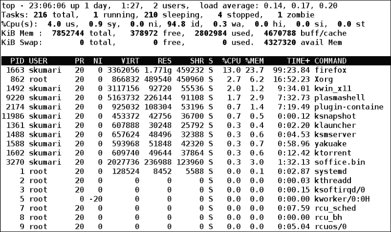

在 `top` 命令输出中，第一行告诉我们系统自上次启动以来的时间长度、用户数量和平均负载。

第二行告诉我们任务的数量及其状态 - 运行、睡眠、停止和僵尸。

第三行给出了 CPU 使用情况的详细信息。不同的 CPU 使用情况显示在下表中：

| 值 | 描述 |
| --- | --- |
| `us` | 在运行非优先用户进程中花费的 CPU 时间百分比 |
| `sy` | 在内核空间中花费的 CPU 时间百分比 - 即运行内核进程 |
| `ni` | 运行优先用户进程的 CPU 时间百分比 |
| `id` | 空闲时间百分比 |
| `wa` | 等待 I/O 完成所花费的时间百分比 |
| `hi` | 服务硬件中断所花费的时间百分比 |
| `si` | 服务软件中断所花费的时间百分比 |
| `st` | 虚拟机消耗的时间百分比 |

第四行告诉我们关于总、空闲、已使用和缓冲的 RAM 内存使用情况。

第五行告诉我们关于总交换内存、空闲和已使用的交换内存。

其余行提供了关于运行进程的详细信息。每列的含义在下表中描述：

| 列 | 描述 |
| --- | --- |
| PID | 进程 ID |
| USER | 任务所有者的有效用户名 |
| PR | 任务的优先级（值越低，优先级越高） |
| NI | 任务的优先级。负的优先级值意味着更高的优先级，正的意味着较低的优先级 |
| VIRT | 进程使用的虚拟内存大小 |
| RES | 未交换的物理内存进程 |
| SHR | 进程可用的共享内存量 |
| S | 进程状态 - D（不可中断的睡眠），R（运行），S（睡眠），T（被作业控制信号停止），t（被调试器停止），Z（僵尸） |
| %CPU | 进程当前使用的 CPU 百分比 |
| %MEM | 进程当前使用的物理内存百分比 |
| TIME+ | CPU 时间，百分之一秒 |
| COMMAND | 命令名称 |

当 top 在运行时，我们也可以重新排序和修改输出。要查看帮助，请使用 *?* 或 *h* 键，将显示帮助窗口，其中包含以下详细信息：

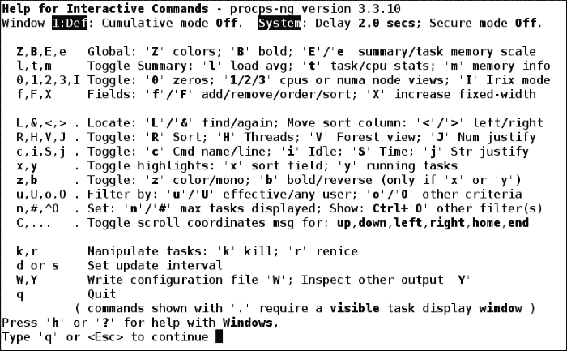

要根据特定字段进行排序，最简单的方法是在 `top` 运行时按下 *f* 键。一个新窗口会打开，显示所有列。打开的窗口如下所示：

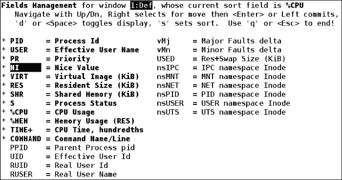

使用上下箭头导航并选择列。要根据特定字段进行排序，请按下*s*键，然后按*q*键切换回顶部输出窗口。

在这里，我们选择了 NI，然后按下了*s*键和*q*键。现在，`top`输出将按`nice`数字排序。排序后的`top`输出如下所示：

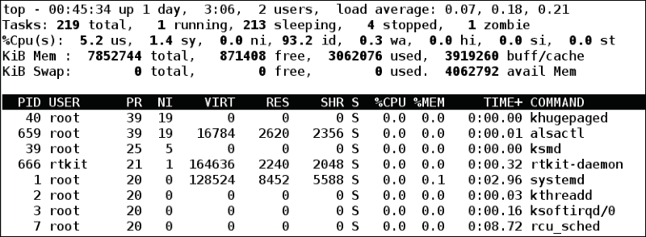

# 进程替换

我们知道可以使用管道将命令的输出作为另一个命令的输入。例如：

```
$ cat file.txt | less

```

在这里，`cat`命令的输出——即`file.txt`的内容——作为输入传递给了 less 命令。我们可以将仅一个进程的输出（在本例中为 cat 进程）重定向为另一个进程的输入。

我们可能需要将多个进程的输出作为另一个进程的输入。在这种情况下，使用进程替换。进程替换允许进程从一个或多个进程的输出中获取输入，而不是文件。

使用进程替换的语法如下：

将输入文件替换为列表

```
<(list)

```

或者

通过列表替换输出文件(s)

```
>(list)

```

在这里，`list`是一个命令或一系列命令。进程替换使列表的行为类似于文件，方法是给列表命名，然后在命令行中替换该名称。

## 比较两个进程的输出

要比较两组数据，我们使用`diff`命令。但是，我们知道`diff`命令需要两个文件作为输入来生成差异。因此，我们必须首先将两组数据保存到两个单独的文件中，然后运行`diff`。保存差异内容会增加额外的步骤，这是不好的。为了解决这个问题，我们可以在执行`diff`时使用进程替换功能。

例如，我们想要知道目录中的隐藏文件。在 Linux 和基于 Unix 的系统中，以`。`（点）开头的文件称为隐藏文件。要查看隐藏文件，可以使用`ls`命令的`-a`选项：

```
$ ls -l ~  # Long list home directory content excluding hidden files
$ ls -al ~   # Long list home directory content including hidden files

```

要仅获取目录中的隐藏文件，请对从前两个命令获得的排序输出运行`diff`命令：

```
$ diff  <(ls -l ~ | tr -s " " | sort -k9) <(ls -al ~ | tr -s " " | sort -k9)

```

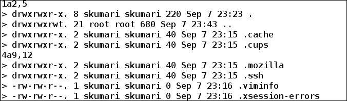

在这里，我们将`ls -l ~ | tr -s " " | sort -k9`和`ls -al ~ | tr -s " " | sort -k9`命令作为输入数据提供给`diff`命令，而不是传递两个文件。

# 进程调度优先级

在进程的生命周期中，它可能需要 CPU 和其他资源来保持正常执行。我们知道系统中同时运行多个进程，并且它们可能需要 CPU 来完成操作。为了共享可用的 CPU 和资源，进行进程调度，以便每个进程有机会利用 CPU。创建进程时，会设置初始优先级值。根据优先级值，进程获得 CPU 时间。

进程调度优先级范围是从`-20`到`19`。这个值也被称为 nice 值。nice 值越低，进程的调度优先级就越高。因此，具有`-20`的进程将具有最高的调度优先级，而具有 nice 值`19`的进程将具有最低的调度优先级。

要查看进程的 nice 值，可以使用`ps`或`top`命令。进程的相应 nice 值在 NI 列中可用：

```
$ ps -l

```

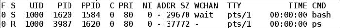

在`ps`输出中，我们可以看到 bash 和`ps`进程的`NI`列中的 nice 值为`0`。

## 更改调度优先级

系统中的每个进程都分配了一些优先级，这取决于它的 nice 值。根据优先级，进程获得 CPU 时间和其他资源来使用。有时，可能会发生进程需要快速执行，但由于较低的调度优先级而等待释放 CPU 资源很长时间。在这种情况下，我们可能希望增加其调度优先级以更快地完成任务。我们可以使用`nice`和`renice`命令来更改进程的调度优先级。

### 使用 nice

`nice`命令以用户定义的调度优先级启动进程。默认情况下，用户创建的进程的 nice 值为`0`。要验证这一点，请运行不带任何选项的`nice`命令：

```
$ nice
0

```

让我们创建一个实际消耗 CPU 和资源的新`firefox`进程：

```
$ killall firefox  # Terminate any firefox if already running
$ firefox &    # Firefox launched in background
$ top

```

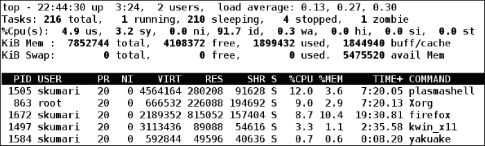

我们可以看到`firefox`的 nice 值为`0`，CPU 使用率为 8.7%。

现在，我们将终止当前的`firefox`并启动另一个`firefox`，其 nice 值为`10`。这意味着`firefox`的优先级将低于其他用户创建的进程。

要创建一个具有不同 nice 值的进程，可以使用`nice`的`-n`选项：

```
$ killall firefox
$ nice -n 10 firefox &

```

或者

```
$ nice -10 firefox &

```

要查看`firefox`现在的 nice 值，请检查`top`输出：

```
$ top

```

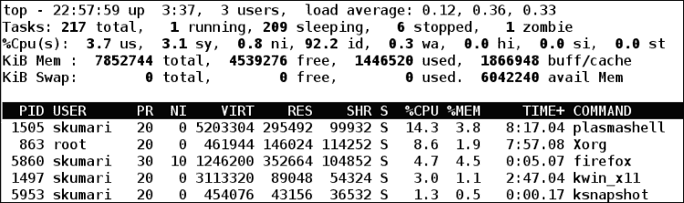

我们可以看到`firefox`进程的 nice 值为`10`。要提供更多的调度优先级——即为进程设置负的 nice 值——需要 root 权限。

以下示例将设置`firefox`进程为更高的调度优先级：

```
$  nice -n -10 firefox

```

或者

```
$ sudo  nice --10 firefox

```

### 使用 renice

`nice`命令只能在启动进程时修改 nice 值。但是，如果我们想要更改正在运行的进程的调度优先级，则应使用`renice`命令。`renice`命令改变一个或多个正在运行的进程的调度优先级。

使用`renice`的语法如下：

```
renice [-n] priority [-g|-p|-u] identifier

```

在这里，`-g`选项考虑后续参数——即 GID 作为标识符。

`-p`选项考虑后续参数——即 PID 作为标识符。

`-u`选项考虑后续参数——即用户名或 UID 作为标识符。

如果没有提供`-g`、`-p`或`-u`选项，则将标识符视为 PID。

例如，我们将更改属于某个用户的所有进程的优先级。首先，查看由用户拥有的进程的当前优先级：

```
$  top -u skumari    # User is skumari

```

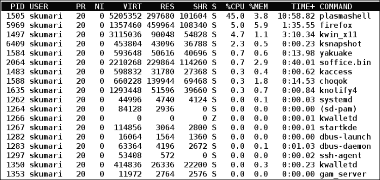

现在，我们将使用`renice`和`-u`选项修改所有进程的优先级：

```
$ sudo renice -n -5 -u skumari

```

让我们查看由用户`skumari`拥有的进程的新的 nice 值：

```
$ top -u skumari

```

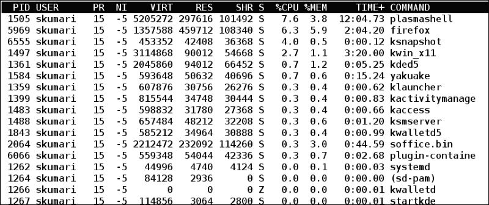

要修改几个进程的调度优先级，请使用进程的 PID 进行修改。以下示例修改了 PID 分别为`1505`和`5969`的进程 plasmashell 和 Firefox：

```
$ sudo renice -n 2 -p 1505 5969
$ top -u skumari

```

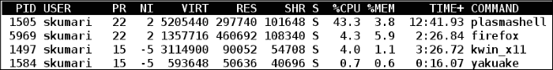

现在，我们可以看到进程 plasmashell 和 Firefox 的 nice 值为`2`。

# 信号

信号是一种软件中断，用于通知进程发生外部事件。在正常执行中，进程按预期继续运行。现在，由于某种原因，用户可能希望取消正在运行的`进程`。当进程从终端启动时，当我们按下*Ctrl* + *c*键或运行`kill`命令时，它将终止。

当我们在终端中运行进程时按下*Ctrl* + *c*键时，会生成信号`SIGINT`并发送到前台运行的进程。此外，当对进程调用`kill`命令时，会生成`SIGKILL`信号并终止进程。

## 可用信号

在所有可用的信号中，我们将在这里讨论经常使用的信号：

| 信号名称 | 值 | 默认操作 | 描述 |
| --- | --- | --- | --- |
| SIGHUP | 1 | Term | 此信号用于挂起或控制进程的死亡 |
| SIGINT | 2 | Term | 此信号用于从键盘中断，如 ctrl + c，ctrl + z |
| SIGQUIT | 3 | 核心 | 此信号用于从键盘退出 |
| SIGILL | 4 | Core | 用于非法指令 |
| SIGTRAP | 5 | Core | 此信号用于跟踪或断点陷阱 |
| SIGABRT | 6 | Core | 用于中止信号 |
| SIGFPE | 8 | Core | 浮点异常 |
| SIGKILL | 9 | Term | 进程立即终止 |
| SIGSEGV | 11 | Core | 无效内存引用 |
| SIGPIPE | 13 | Term | 管道破裂 |
| SIGALRM | 14 | Term | 警报信号 |
| SIGTERM | 15 | Term | 终止进程 |
| SIGCHLD | 17 | Ign | 子进程停止或终止 |
| SIGSTOP | 19 | Stop | 此信号用于停止进程 |
| SIGPWR | 30 | Term | 电源故障 |

在上表中，我们提到了信号名称和值。在**默认操作**部分中使用的术语的含义如下：

+   Term: 终止

+   Core: 终止进程并转储核心

+   Ign: 忽略信号

+   Stop: 停止进程

根据信号的类型，可以采取以下任何一种操作：

+   进程可以忽略信号，这意味着不会采取任何操作。除了`SIGKILL`和`SIGSTOP`之外，大多数信号都可以被忽略。`SIGKILL`和`SIGSTOP`信号无法被捕获、阻止或忽略。这允许内核在任何时间点杀死或停止任何进程。

+   可以通过编写信号处理程序代码来处理信号，指定接收到特定信号后要采取的必要操作。

+   每个信号都有一个默认操作，因此让信号执行默认操作；例如，如果发送`SIGKILL`信号，则终止进程。

要了解所有信号及其相应的值，请使用`kill`命令和`-l`选项：

```
$ kill -l

```

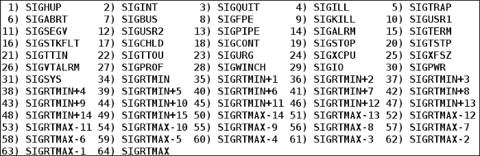

`kill`命令还提供了一种在以下方式中将信号编号转换为名称的方法：

```
kill -l signal_number

$ kill -l 9
KILL
$ kill -l 29
IO
$ kill -l 100  # invalid signal number gives error
bash: kill: 100: invalid signal specification

```

要向进程发送信号，可以使用`kill`、`pkill`和`kilall`命令：

```
$ kill -9 6758  # Sends SIGKILL process to PID 6758
$ killall -1 foo  # Sends SIGHUP signal to process foo
$ pkill -19 firef  # Sends SIGSTOP signal to processes' name beginning with firef

```

# 陷阱

当一个进程正在运行时，我们在中间杀死这个进程，进程会立即终止而不再执行任何操作。编写程序的程序员可能希望在程序实际终止之前执行一些任务；例如，清理创建的临时目录，保存应用程序状态，保存日志等。在这种情况下，程序员希望监听信号并在允许终止进程之前执行所需的任务。

考虑以下 shell 脚本示例：

```
#!/bin/bash
# Filename: my_app.sh
# Description: Reverse a file

echo "Enter file to be reversed"
read filename

tmpfile="/tmp/tmpfile.txt"
# tac command is used to print a file in reverse order
tac $filename > $tmpfile
cp $tmpfile $filename
rm $tmpfile
```

该程序从用户文件中获取输入，然后反转文件内容。此脚本创建一个临时文件来保存文件的反转内容，然后将其复制到原始文件。最后，它删除临时文件。

当我们执行此脚本时，可能正在等待用户输入文本文件名，或者在反转文件时（大文件需要更多时间来反转内容）。在此期间，如果进程被终止，那么临时文件可能不会被删除。程序员的任务是确保删除临时文件。

为了解决这样的问题，我们可以处理信号，执行必要的任务，然后终止进程。这可以通过使用`trap`命令来实现。该命令允许您在脚本接收到信号时执行命令。

使用`trap`的语法如下：

```
$ trap action signals

```

在这里，我们可以提供要执行的`trap`操作。操作可以是一个或多个执行命令。

在`trap`的上述语法中，`signals`指的是要执行操作的一个或多个信号名称。

以下 shell 脚本演示了`trap`如何在接收到信号后执行任务以防止进程突然退出：

```
#!/bin/bash
# Filename: my_app_with_trap.sh
# Description: Reverse a file and perform action on receiving signals

echo "Enter file to be reversed"
read filename

tmpfile="/tmp/tmpfile.txt"
# Delete temporary file on receiving any of signals
# SIGHUP SIGINT SIGABRT SIGTERM SIGQUIT and then exit from script
trap "rm $tmpfile; exit" SIGHUP SIGINT SIGABRT SIGTERM SIGQUIT
# tac command is used to print a file in reverse order
tac $filename > $tmpfile
cp $tmpfile $filename
rm $tmpfile
```

在这个修改后的脚本中，当接收到`SIGHUP`、`SIGINT`、`SIGABRT`、`SIGTERM`或`SIGQUIT`等信号时，将执行`rm` `$tmpfile; exit`。这意味着首先删除临时文件，然后可以退出脚本。

# 进程间通信

一个进程可以单独完成某些事情，但不是所有事情。如果两个或更多进程可以以共享结果、发送或接收消息等形式相互通信，那将是非常有用和良好的资源利用。在基于 Linux 或 Unix 的操作系统中，两个或更多进程可以使用 IPC 相互通信。

IPC 是进程之间通信并由内核管理的技术。

IPC 可以通过以下任一方式进行：

+   **命名管道**：这允许进程从中读取和写入。

+   **共享内存**：这是由一个进程创建的，并且可以被多个进程读取和写入。

+   **消息队列**：这是一个结构化和有序的内存段列表，进程可以以队列方式存储或检索数据。

+   **信号量**：这为访问相同资源的进程提供了同步机制。它具有用于控制多个进程对共享资源访问的计数器。

在讨论命名管道时，在第六章中，*处理文件*，我们学习了进程如何使用命名管道进行通信。

## 使用 ipcs 查看 IPC 的信息

`ipcs`命令提供了有关 IPC 设施的信息，对于这些设施，调用进程具有读取访问权限。它可以提供有关三种资源的信息：共享内存、消息队列和信号量。

使用`ipcs`的语法如下：

```
ipcs option

```

选项如下：

| 选项 | 描述 |
| --- | --- |
| `-a` | 显示所有资源的信息—共享内存、消息队列和信号量 |
| `-q` | 显示有关活动消息队列的信息 |
| `-m` | 显示有关活动共享内存段的信息 |
| `-s` | 显示有关活动信号量集的信息 |
| `-i ID` | 显示 ID 的详细信息。与`-q`、`-m`或`-s`选项一起使用。 |
| `-l` | 显示资源限制 |
| `-p` | 显示资源创建者和最后操作者的 PID |
| `-b` | 以字节打印大小 |
| `--human` | 以人类可读的格式打印大小 |

### IPC 提供的信息列表

我们可以使用`ipcs`命令不带选项或带`-a`：

```
$ ipcs

```

或

```
$ ipcs -a

```

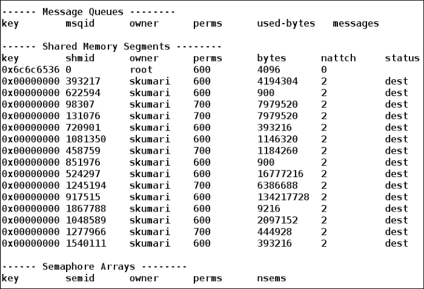

要仅查看共享内存段，我们可以使用带有`-m`选项的`ipcs`：

```
$ ipcs -m --human

```

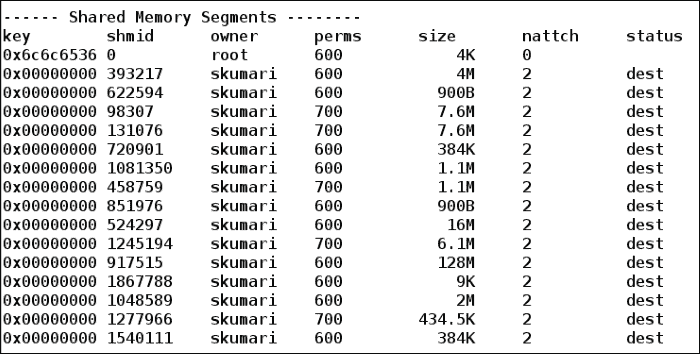

在这里，`--human`选项通过以 KB 和 MB 的大小而不是以字节的方式提供大小，使大小列以更可读的格式显示。

要查找有关资源 ID 的详细信息，请使用`ipcs`命令，后跟`-i`选项和资源 ID：

```
$ ipcs -m -i 393217

```

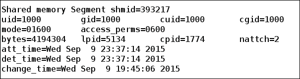

### 知道最近进行 IPC 的进程的 PID

我们可以使用`-p`选项知道最近访问特定 IPC 资源的进程的 PID：

```
$ ipcs -m -p

```

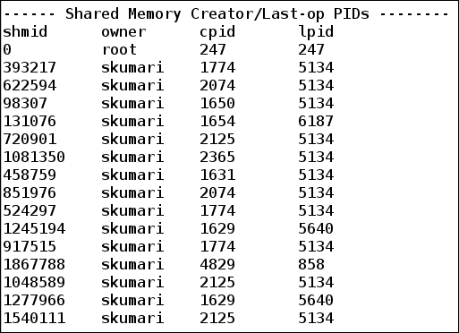

在这里，`cpid`列显示创建共享内存资源的进程的`pid`，而`lpid`指的是最后访问共享内存资源的进程的 PID。

# 摘要

阅读完本章后，您将了解 Linux 和基于 UNIX 的系统中的进程是什么。您现在应该知道如何创建、停止、终止和监视进程。您还应该知道如何向进程发送信号，并使用`trap`命令在 shell 脚本中管理接收到的信号。您还学会了不同进程如何使用 IPC 进行通信以共享资源或发送和接收消息。

在下一章中，您将了解任务可以自动化的不同方式以及它们如何在指定时间运行而无需进一步人工干预。您还将学习如何以及为什么创建启动文件，并如何在 shell 脚本中嵌入其他编程语言，如 Python。
