# 第八章：安排任务和在脚本中嵌入语言

到目前为止，我们已经了解了各种有用的 shell 实用程序以及如何将它们写入 shell 脚本，以避免一遍又一遍地编写相同的指令。通过编写脚本自动化任务可以减少任务的数量，但是我们仍然需要在需要时运行这些脚本。有时，我们希望在特定时间运行命令或脚本，例如，系统管理员必须在凌晨 12:30 对数据中心中可用的系统进行清理和维护。为了执行所需的操作，系统管理员将在凌晨 12:30 左右登录到计算机并进行必要的工作。但是如果他或她的家庭网络出现故障，数据中心又很远怎么办？在那一刻执行任务将会很不方便和困难。还有一些需要每天或每小时执行的任务，例如监视每个用户的网络使用情况，进行系统备份等。一遍又一遍地执行重复的任务将会非常无聊。

在本章中，我们将看到如何通过使用`at`和`crontab`实用程序在特定时间或时间间隔内安排任务来解决这些问题。我们还将看到 systemd（系统启动后启动的第一个进程，PID 1）如何管理系统启动后需要的进程。我们还将看到 systemd 如何管理不同的服务和系统日志。最后，我们将学习如何在 shell 脚本中嵌入其他脚本语言，以获得 shell 脚本中的额外功能。

本章将详细介绍以下主题：

+   在特定时间运行任务

+   Cron 作业

+   管理 Crontab 条目

+   systemd

+   嵌入语言

# 在特定时间运行任务

通常，当我们运行命令或脚本时，它会立即开始执行。但是，如果我们希望在特定时间后运行它呢？例如，我想从互联网上下载大量数据，但不想在工作时减慢我的互联网带宽。因此，我想在凌晨 1:00 运行我的下载脚本，因为在凌晨 1:00 之后我不会使用互联网进行任何工作。使用`at`命令可以在指定的时间后安排下载脚本或命令。我们还可以使用`atq`命令列出已安排的任务，或使用`atrm`命令删除任何已安排的任务。

## 使用`at`执行脚本

我们将使用`at`命令在指定时间运行任务。使用`at`命令的语法如下：

```
at [Option] specified_time

```

在前面的语法中，`specified_time`指的是命令或脚本应该运行的时间。时间可以采用以下格式：

| 时间格式 | 描述 |
| --- | --- |
| HH:MM | 一天中特定的时间，以小时（HH）和分钟（MM）表示。如果时间已经过去，则假定为第二天。时间以 24 小时制表示。 |
| noon | 白天 12:00。 |
| teatime | 下午 4 点或下午 4 点。 |
| midnight | 凌晨 12:00。 |
| today | 指的是同一天的当前时间。 |
| tomorrow | 指的是第二天的当前时间。 |
| AM 或 PM | 用于在时间后缀中指定 12 小时制的时间，例如 4:00PM。 |
| now + count time-units | 在一定时间后以相同时间运行脚本。计数可以是整数。时间单位可以是分钟，小时，天，周，月或年。 |
| 日期 | 日期可以以月份-日期和可选年份的形式给出。日期可以采用以下格式之一：MMDD[CC]YY，MM/DD/[CC]YY，DD.MM.[CC]YY，或[CC]YY-MM-DD。 |

`at`命令的选项在以下表中解释：

| 选项 | 描述 |
| --- | --- |
| `-f FILE` | 指定要执行的脚本文件。 |
| `-l` | `atq`命令的别名。 |
| `-m` | 在作业完成时向用户发送电子邮件。 |
| `-M` | 不向用户发送电子邮件。 |
| `-r` | `atrm`命令的别名。 |
| `-t time` | 在指定时间运行作业。时间的格式为[[CC]YY]MMDDhhmm[.ss]。 |
| `-c job_number` | 在标准输出上打印与`job_number`相关的作业。 |
| `-v` | 打印作业将被执行的时间。 |

### 安排命令

以下命令被安排在 14:00 运行，它将文件系统的使用情况存储在一个名为`file_system_usage.log`的文件中，存储在用户的主目录中：

```
$ at 14:00
warning: commands will be executed using /bin/sh
at> df > ~/file_system_usage.log
at> <EOT>
job 33 at Mon Sep 21 14:00:00 2015

```

当我们像上面那样运行`at`命令时，会打印一个警告消息**warning: commands will be executed using /bin/sh**，指定将使用哪个 shell 来执行命令。在下一行，我们将看到`at prompt`，在那里我们可以指定要在 14:00 执行的命令列表。在我们的情况下，我们输入了`df > ~/file_system_usage.log`命令，这意味着运行`df`命令并将其结果保存在`file_system_usage.log`文件中。

一旦输入要输入的命令列表完成，按下*Enter*键，然后在下一行使用*Ctrl* + *d*键从`at`提示中退出。在获得正常的 shell 提示之前，我们将看到消息，显示创建的作业编号和作业将被执行的时间戳。在我们的情况下，作业编号是`33`，时间戳是`Mon Sep 21 14:00:00 2015`。

一旦我们指定的时间戳结束，我们可以检查`file_system_usage.log`文件的内容。

当特定的预定作业运行时，我们可以在`stdout`上打印将要执行的内容：

```
$ at -c 33  # Lists content of job 33

```

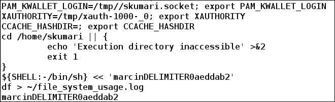

我们可以看到`df > ~/file_system_usage.log`命令将被执行。其余的行指定了任务将在什么环境中执行。

现在，考虑一个由 root 用户安排的作业：

```
# at -v 4am
Mon Sep 21 04:00:00 2015

warning: commands will be executed using /bin/sh
at> reboot
at> <EOT>
job 34 at Mon Sep 21 04:00:00 2015

```

编号为`34`的作业是由用户 root 安排的。这个作业系统将在凌晨 4 点重启。

### 安排脚本文件

我们可以使用`at`命令的`-f`选项来安排脚本文件在特定时间执行。

例如，我们想要在下周下午 4 点运行`loggedin_user_detail.sh`脚本。这个脚本列出了登录的用户以及在脚本在预定时间执行时他们正在运行的进程。脚本的内容如下：

```
$ cat  loggedin_user_detail.sh
#!/bin/bash
# Filename: loggedin_user_detail.sh
# Description: Collecting information of loggedin users

users_log_file=~/users_log_file.log
echo "List of logged in users list at time 'date'" > $users_log_file
users=('who | cut -d' ' -f1 | sort | uniq')
echo ${users[*]} >> $users_log_file

for i in ${users[*]}
do
 echo "Processes owned by user $i" >> $users_log_file
 ps u -u $i >> $users_log_file
 echo
done
$ chmod +x  loggedin_user_detail.sh  # Provide execute permission

```

现在，要在下周下午 4 点运行上述脚本，我们将运行以下命令：

```
$at -f loggedin_user_detail.sh 4pm + 1 week
warning: commands will be executed using /bin/sh
job 42 at Sun Sep 27 16:00:00 2015

```

我们可以看到这个作业已经被安排在一周后运行。

## 列出预定的任务

有时候，一个任务被安排在特定的时间运行，但我们忘记了任务应该在什么时间运行。我们可以使用`atq`或`at`命令的`-l`选项来查看已经安排的任务：

```
$ atq
33      Mon Sep 21 14:00:00 2015 a skumari
42      Sun Sep 27 16:00:00 2015 a skumari

```

`atq`命令显示了当前用户安排的作业，包括作业编号、时间和用户名：

```
$ sudo atq
34      Mon Sep 21 04:00:00 2015 a root
33      Mon Sep 21 14:00:00 2015 a skumari
42      Sun Sep 27 16:00:00 2015 a skumari

```

使用`sudo`运行`atq`命令，列出所有用户安排的作业。

## 删除预定的任务

如果不再需要执行某个预定的任务，我们也可以删除该任务。当我们想要修改任务执行的时间时，删除任务也是有用的。要修改时间，首先删除预定的任务，然后再用新的时间创建相同的任务。

例如，我们不想在凌晨 1 点而不是凌晨 4 点重启系统。为此，root 用户将首先使用`atrm`命令删除作业`34`：

```
# atrm 34
$ sudo atq    # Updated lists of tasks
 33      Mon Sep 21 14:00:00 2015 a skumari
 42      Sun Sep 27 16:00:00 2015 a skumari
# at 1am
warning: commands will be executed using /bin/sh
 at> reboot
 at> <EOT>
job 47 at Mon Sep 21 01:00:00 2015
$ sudo atq
 33      Mon Sep 21 14:00:00 2015 a skumari
 42      Sun Sep 27 16:00:00 2015 a skumari
 47      Mon Sep 21 01:00:00 2015 a root

```

我们可以看到，由 root 用户安排的任务现在将在凌晨 1 点而不是凌晨 4 点运行。

# 定时任务

Cron 作业是定期运行的任务或作业，与`at`命令不同。例如，在办公室，我的工作是保持公司员工的详细信息是保密的。为了确保信息安全和更新，而不会丢失任何信息，我将不得不在外部设备上备份最新数据，如硬盘或闪存驱动器。根据员工人数，我可能需要每分钟、每小时、每天或每周备份一次。手动备份每次都是困难、繁琐且浪费时间的。通过了解如何安排 cron 作业，可以很容易地实现。系统管理员经常创建 Cron 作业来安排定期执行的任务，例如备份系统、保存每个登录用户的日志、监视和报告每个用户的网络使用情况、执行系统清理、安排系统更新等。

Cron 由两部分组成：cron 守护进程和 cron 配置。

## Cron 守护进程

当系统启动时，cron 守护进程会自动启动并在后台持续运行。守护进程被称为 crond，并由 systemd 或 init 进程启动，这取决于您的系统。它的任务是以一分钟的间隔定期检查配置文件，并检查是否有任何任务需要完成。

## Cron 配置

Cron 配置包含 Cron 作业的文件和目录。它们位于`/etc/`目录中。与 cron 配置相关的最重要的文件是`crontab`。在 Linux 系统中，与 cron 相关的配置文件如下：

+   `/etc/cron.hourly/`：其中包含每小时运行的脚本

+   `/etc/cron.daily/`：其中包含每天运行的脚本

+   `/etc/cron.weekly/`：其中包含每周运行的脚本

+   `/etc/cron.monthly/`：其中包含每月运行的脚本

+   `/etc/crontab`：其中包含命令以及它们应该运行的间隔

+   `/etc/cron.d/`：其中包含命令以及它们应该运行的间隔的文件目录

脚本可以直接添加到`cron.hourly/`、`cron.daily/`、`cron.weekly/`或`cron.monthly/`中的任何一个目录中，以便按小时、每天、每周或每月的基础运行它们。

以下是一个简单的 shell 脚本`firefox_memcheck.sh`，它检查 Firefox 进程是否正在运行。如果 Firefox 正在运行，并且其内存使用大于 30％，则重新启动 Firefox：

```
#!/bin/sh
# Filename: firefox_memcheck.sh
# Desription: Resatrts application firefix if memory usage is more than 30%

pid='pidof firefox' # Get pid of firefox
if [ $pid -gt 1 ]
then
  # Get current memory usage of firefox
  current_mem_usage='ps -u --pid $pid| tail -n1 | tr -s ' ' | cut -d ' ' -f 4'
  # Check if firefox memory  usage is more than 30% or not
  if [ $(echo "$current_mem_usage > 30" | bc) -eq 1 ]
  then
    kill $pid   # Kill firefox if memory usage is > 30%
    firefox &   # Launch firefox
  fi
fi
```

我们可以将此脚本添加到系统的`/etc/cron.hourly/`目录中，它将持续检查我们的 Firefox 内存使用情况。此脚本可以修改为监视其他进程的内存使用情况。

## crontab 条目

通过将脚本放入`cron.{hourly, daily, weekly, monthly}`中，我们只能设置每小时、每天、每周和每月的间隔任务。如果一个任务需要以 2 天间隔、10 天间隔、90 分钟间隔等运行，该怎么办？为了实现这一点，我们可以将任务添加到`/etc/crontab`文件或`/etc/cron.d/`目录中。每个用户可能都有自己的 crontab 条目，与每个用户相关的文件位于`/var/spool/`中。

crontab 条目如下所示：


我们可以从上述截图中看到，crontab 条目有五个星号。每个星号定义了一个特定的持续时间。我们可以用建议的值替换*，或者保持不变。如果在字段中提到*，那么它意味着考虑该字段的所有实例。

时间语法也可以描述如下：

+   指定**分钟**值介于 0 到 59 之间

+   指定**小时**范围从 0 到 23

+   指定**天数**范围从 1 到 31

+   指定**月份**范围从 1 到 12，或者我们可以写 Jan，Feb，... Dec

+   指定**一周中的某一天**范围从 0 到 6，或者我们可以写 sun（0），mon（1），...，sat（6）

所有五个字段由空格分隔。然后是一个**用户名**，指定命令将由哪个用户执行。指定用户名是可选的，默认情况下会作为 root 运行。最后一个字段是计划执行的命令。

演示如何编写 crontab 条目的示例如下：

```
20 7 * * 0 foo command

```

每个字段的解释如下：

+   `20`：第 20 分钟

+   `7`：上午 7 点

+   `*`：每天

+   `*`：每个月

+   `0`：星期日

+   `foo`：此命令将作为 foo 用户运行

+   `command`：要执行的指定命令

因此，命令将在每个星期日的上午 7:20 作为 root 运行。

我们可以使用逗号（，）指定字段的多个实例：

```
30 20,22 * * * command

```

在这里，`command`将在每天的 8:30 PM 和 10:30 PM 运行。

我们还可以使用连字符（`-`）在字段中指定一段时间的范围：

```
35 7-11 * * 0-3 command

```

这意味着在星期日、星期一、星期二和星期三的 7:35、8:35、9:35、10:35 和 11:35 运行命令。

要在特定间隔运行脚本，我们可以使用正斜杠（/）指定如下：

```
20-45/4 8 9 4 * command

```

该命令将在 4 月 9 日的 8:20 AM 至 8:45 AM 之间以 4 分钟的间隔运行。

### Crontab 中的特殊字符串

Crontab 还可以指定以下字符串：

| 字符串 | 描述 |
| --- | --- |
| `@hourly` | 每小时运行一次，相当于 0 * * * * |
| `@daily`或`@midnight` | 每天运行一次，相当于 0 0 * * * |
| `@weekly` | 每周运行一次，相当于 0 0 * * 0 |
| `@monthly` | 每月运行一次，相当于 0 0 1 * * |
| `@yearly`或`@annually` | 每年运行一次，相当于 0 0 1 1 * |
| `@reboot` | 在系统启动时运行 |

# 管理 crontab 条目

我们不直接添加或修改 crontab 的条目。可以使用`crontab`命令来添加、修改和列出 crontab 的条目。每个用户都可以有自己的 crontab，可以在其中添加、删除或修改任务。默认情况下，对所有用户启用，但如果系统管理员想要限制某些用户，可以将该用户添加到`/etc/cron.deny`文件中。

使用`crontab`命令的语法如下：

```
crontab [-u user] file
crontab [-u user] [option]

```

crontab 的选项在下表中解释：

| 选项 | 描述 |
| --- | --- |
| `-u user` | 追加要修改其`crontab`的用户的名称 |
| `-l` | 在`stdout`上显示当前的 crontab |
| `-e` | 使用`EDITOR env`指定的编辑器编辑当前的`crontab` |
| `-r` | 删除当前的`crontab` |
| `-i` | 与`-r`选项一起使用时，交互式删除当前的`crontab` |

## 列出 crontab 条目

要列出`crontab`条目，我们使用当前用户的`-l`选项：

```
$ crontab -l
no crontab for foo

```

输出显示用户`foo`没有`crontab`条目。这意味着用户`foo`尚未在其`crontab`中添加任何任务。

要以 root 用户身份查看`crontab`，请输入以下命令：

```
# crontab -l
no crontab for root

```

或者，使用以下命令：

```
$ sudo crontab -l

```

## 编辑 crontab 条目

当前用户的 crontab 可以使用`-e`选项与 crontab 进行编辑或修改：

```
$ crontab -e

```

执行上述命令后，将打开一个编辑器，用户可以在其中将任务添加到`crontab`文件中。在我们的情况下，启动了`vi`编辑器。以下条目已添加到用户`foo crontab`条目中：

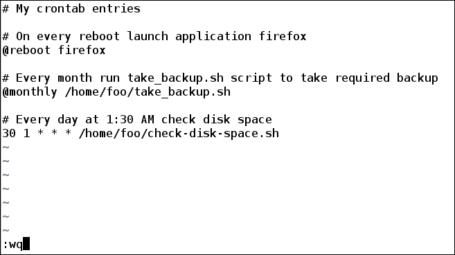

从编辑器保存并退出后，获得的输出如下：

```
no crontab for foo - using an empty one
crontab: installing new crontab
```

要查看用户`foo`的修改后的`crontab`条目，再次运行`-l`选项：

```
$ crontab -l

```


要创建用户 root 的`crontab`条目，我们可以作为 root 使用`-e`选项运行`crontab`：

```
# crontab -e

```

或者

```
$ sudo crontab -e

```

运行上述命令后，编辑器将打开以修改用户 root 的`crontab`，在添加条目后如下所示：

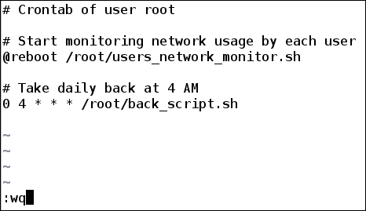

要查看 root 的`crontab`条目，我们可以使用`crontab -l`作为 root 用户：

```
# crontab -l

```

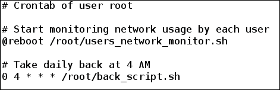

root 用户还可以查看和修改另一个用户的`crontab`条目。这是通过指定`-u`选项，后跟用户名来完成的：

```
# crontab -u foo -e  # Modifying crontab of user foo as root

```

用户`foo`的 crontab 将如下所示打开以进行修改：

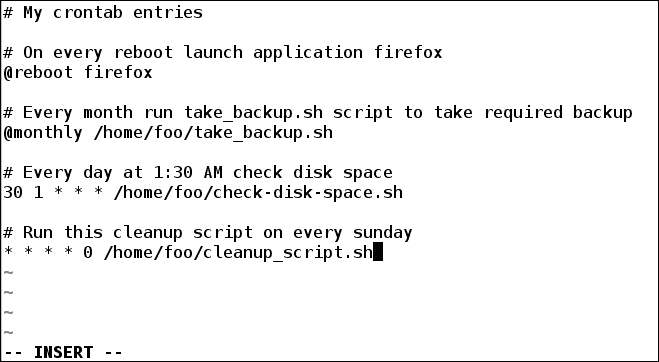

要查看另一个用户的`crontab`条目，运行以下命令：

```
# crontab -u foo -l

```

我们可以如下显示用户`foo`的`crontab`：

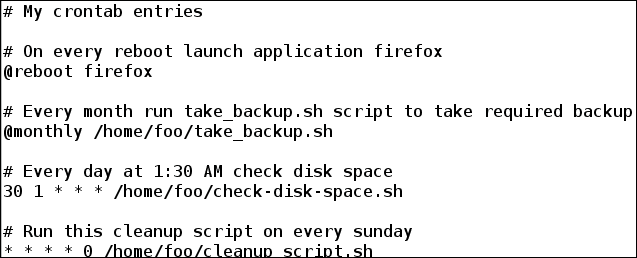

使用`crontab`命令创建 crontab 条目，并将其存储在`/var/spool/cron/`目录中。文件以用户名命名：

```
# ls /var/spool/cron
root  foo

```

我们可以看到为用户`root`和`foo`创建了一个文件。

## 删除 crontab 条目

我们还可以使用`crontab`命令的`-r`选项来删除`crontab`。默认情况下，将删除当前用户的`crontab`。使用`-i`选项允许交互式删除`crontab`：

```
# crontab -i -r
crontab: really delete root's crontab? Y

```

通过运行上述命令，已删除了用户 root 的`crontab`条目。我们可以通过运行`-l`选项来验证这一点：

```
# crontab -l
no crontab for root

#  ls /var/spool/cron
foo

```

用户 root 还可以通过在`-u`选项中指定用户来删除其他用户的`crontab`：

```
# crontab -r -i -u foo
crontab: really delete foo's crontab? n

```

我们指定了`n`（否）而不是`y`（是），因此将中止删除用户`foo crontab`。

现在让我们删除它：

```
# crontab -r -i -u foo
crontab: really delete foo's crontab? Y

```

现在，用户`foo`的`crontab`条目已被删除。要验证，请运行以下命令：

```
$  crontab -l
no crontab for foo

```

# systemd

如今，大多数 Linux 发行版系统，如 Fedora、Ubuntu、Arch Linux、Debian、openSUSE 等，已经从`init`切换到了 systemd。systemd 是系统启动后第一个启动的进程，具有 PID 1。它控制和管理其他应该在系统启动后启动的进程。它也被称为操作系统的基本构建块。要了解基于 init 的系统，请参考维基百科链接[`en.wikipedia.org/wiki/Init`](https://en.wikipedia.org/wiki/Init)。

## systemd 单元

systemd 有几个单元，每个单元包含一个关于服务、套接字、设备、挂载点、交换文件或分区、启动目标等的配置文件。

以下表格解释了一些单元文件：

| 单元类型 | 文件扩展名 | 描述 |
| --- | --- | --- |
| 服务单元 | `.service` | 系统服务 |
| 设备单元 | `.device` | 内核识别的设备文件 |
| 挂载单元 | `.mount` | 文件系统挂载点 |
| 定时器单元 | `.timer` | 一个 systemd 定时器 |
| 交换单元 | `.swap` | 交换文件 |

要列出系统中安装的所有单元文件，请使用`systemctl`命令和`list-unit-files`选项：

```
$ systemctl list-unit-files | head -n 12

```

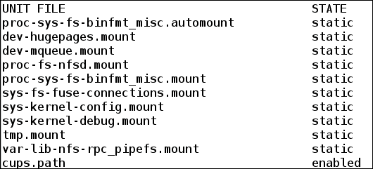

要列出单元类型的单元文件，请使用`list-unit-files`和`--type`选项。运行以下命令将只显示系统中可用的服务单元：

```
$ systemctl list-unit-files --type=service | head -n 10

```

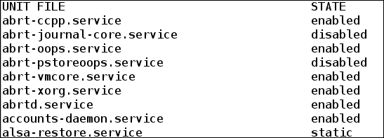

## 管理服务

systemd 管理系统中所有可用的服务，从 Linux 内核启动到系统关闭的时间。Linux 系统中的服务是在后台运行或等待使用的应用程序。服务管理文件的文件名后缀为`.service`。

在基于 systemd 的 Linux 系统中，用户或管理员可以使用`systemctl`命令管理服务。

### 服务状态

要列出当前服务的状态并检查它是否正在运行，使用`systemctl status`：

例如，要查看我的`NetworkManager`服务的状态，请运行以下命令：

```
$ systemctl status -l NetworkManager.service 

```

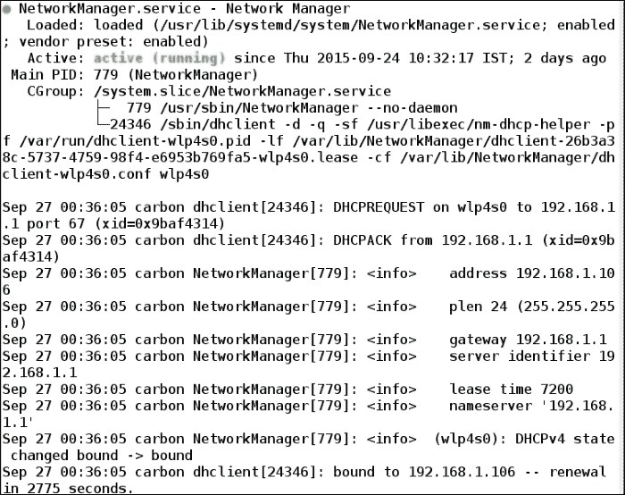

我们可以看到`NetworkManager`服务正在运行并处于活动状态。它还提供了与当前`NetworkManager`服务相关的详细信息。

让我们看看另一个名为`sshd`的服务的状态。`sshd`服务控制是否可以对系统进行`ssh`连接：

```
$ systemctl status sshd.service

```

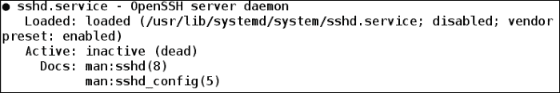

这表明服务`sshd`目前处于非活动状态。

如果不需要详细的输出，那么我们可以只使用`is-active`选项来查看服务状态：

```
$ systemctl is-active sshd.service 
unknown
$ systemctl is-active NetworkManager.service
active

```

这里，`active`表示服务正在运行，`unknown`表示服务未运行。

### 启用和禁用服务

当系统启动时，systemd 会自动启动一些服务。也可能有一些服务没有运行。要在系统启动后启用服务运行，使用`systemctl enable`，要在系统启动时停止系统运行的服务，使用`systemctl disable`。

执行以下命令将允许 systemd 在系统启动后运行`sshd`服务：

```
# systemctl enable sshd.service

```

执行以下命令将允许 systemd 在系统启动时不运行`sshd.service`：

```
# systemctl disable sshd.service

```

要检查服务是否已启用，请运行`systemctl is-enabled`命令：

```
$ systemctl is-enabled sshd.service
disabled
$ systemctl is-enabled NetworkManager.service
enabled

```

这意味着`sshd`服务当前在系统启动时被禁用，而`NetworkManager`服务在启动时由`systemd`启用。

### 启动和停止服务

当系统运行时，有时我们可能需要一些服务在运行。例如，要在我的当前系统中从另一台系统进行`ssh`，`sshd`服务必须在运行。

例如，让我们看看`sshd`服务的当前状态：

```
$ systemctl is-active sshd.service
unknown

```

`sshd`服务当前未运行。让我们尝试在系统中进行`ssh`：

```
$ ssh foo@localhost  # Doing ssh to same machine  # Doing ssh to same machine
 ssh: connect to host localhost port 22: Connection refused

```

我们可以看到`ssh`连接已被拒绝。

现在，让我们开始运行`sshd`服务。我们可以使用以下命令`systemctl start`来启动服务：

```
# systemctl start sshd.service 
$ systemctl is-active sshd.service
active

```

现在，`sshd`服务正在运行。再次尝试从另一台机器进行`ssh`：

```
$ ssh foo@localhost
Last login: Fri Sep 25 23:10:21 2015 from 192.168.1.101

```

现在，登录已成功。

我们甚至可以使用`systemctl restart`命令重新启动正在运行的服务。当服务已被修改时，这是必需的。然后，要启用修改的设置，我们只需重新启动它。

```
#  systemctl restart sshd.service

```

上述命令将重新启动`sshd`服务。

当不再需要`ssh`时，停止运行它是安全的。这可以避免对机器的匿名访问。要停止运行服务，请运行`systemctl stop`命令：

```
# systemctl stop sshd.service
$ systemctl is-active sshd.service
unknown

```

## 查看系统日志

要检查用户是在个人还是企业机器上工作，查看系统日志对于追踪问题和获取系统中发生的活动的详细信息非常重要。查看系统日志在监视和确保网络流量不易受攻击方面起着重要作用。在基于 systemd 的系统上，系统日志由其一个组件`journald`收集和管理。它的任务是收集应用程序和内核的日志。日志文件位于`/var/log/journal/`目录中。

要查看`journald`收集的日志，使用`journalctl`命令：

```
# journalctl

```

运行上述命令会显示所有收集的系统日志，从旧的开始，逐渐增加到新的日志。

### 查看最新的日志条目

要查看最新的日志条目并持续打印追加到日志中的新条目，请使用`-f`选项：

```
$ journalctl -f

```

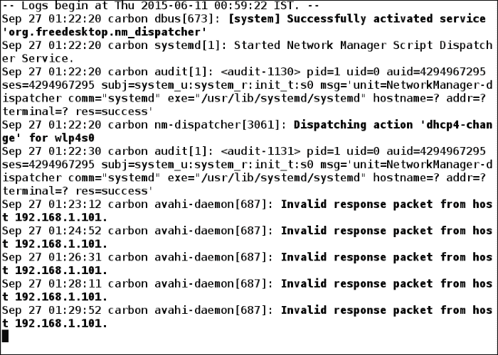

要查看自系统上次启动以来捕获的日志条目，请使用`-b`选项：

```
$ journalctl -b

```

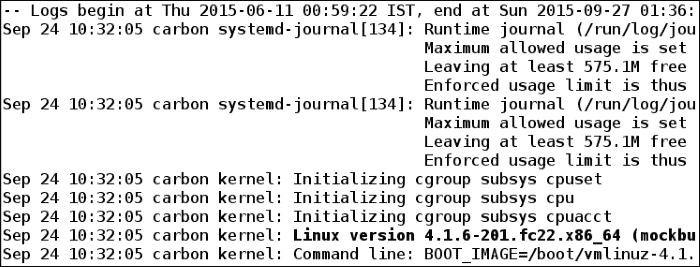

### 查看特定时间间隔的日志

我们还可以查看特定时间间隔的日志。例如，要查看最近 1 小时的日志，我们可以运行以下命令：

```
$  journalctl --since "1 hour ago" --until now

```

要查看自 2015 年 7 月 1 日至今的日志条目，我们可以运行以下命令：

```
$ journalctl --since 2015-07-01

```

要查看从 2015 年 8 月 7 日下午 7:23 到 2015 年 8 月 9 日上午 7 点的日志，我们可以运行以下命令：

```
$ journalctl --since "2015-08-07 19:23:00" --until "2015-08-09 7:00:00" 

```

# 嵌入语言

与其他脚本编程语言（如 Python、Ruby、Perl 和 AWK）相比，Shell 脚本提供了一定的功能集。这些语言提供了与 Shell 脚本语言相比的附加功能。在 Linux 和基于 UNIX 的系统上，要使用这些语言，如果它们没有预装，我们必须单独安装它们。

考虑一个简单的例子：有一个 json 或 XML 文件，我们想解析它并检索其中存储的数据。使用 shell 及其命令来做这件事非常困难且容易出错，但如果我们了解 Python 或 Ruby 语言，我们可以很容易地做到这一点，然后将其嵌入到 shell 脚本中。应该嵌入 shell 脚本中的另一种语言以减少工作量并实现更好的性能。

在 shell 脚本中嵌入其他语言的语法如下：

| 脚本语言 | 嵌入到 shell 脚本中的语法 |
| --- | --- |
| Python（Python 版本 2） | `python -c` ' '。在单引号中编写要处理的 Python 代码 |
| Python3 | `python3 -c` ' '。在单引号中编写要处理的 Python 版本 3 代码 |
| Perl | `perl -e` ' '。在单引号中编写 Perl 代码。 |
| Ruby | `ruby -e` ' '。在单引号中编写 Ruby 代码。 |
| AWK | 这可以用作命令实用程序。有关可用选项，请参阅 awk man 页面。 |

## 嵌入 Python 语言

要在 shell 脚本中嵌入 Python 语言，我们将使用`python -c " Python Code"`。要了解 Python，请参阅官方网站[`www.python.org/`](https://www.python.org/)。

一个简单的 Python 示例是在 Python 中打印`Hello World`，如下所示：

```
print "Hello World"
```

将此嵌入到 shell 脚本中，我们可以编写以下代码

```
#!/bin/bash
# Filename: python_print.sh
# Description: Embeding python in shell script

# Printing using Python
python -c 'print "Hello World"'
```

我们现在将执行`python_print.sh`脚本如下：

```
$ sh python_print.sh
Hello World

```

要在 shell 脚本中嵌入多行 Python 代码，请使用以下代码：

```
 python -  <<EOF
# Python code
EOF
```

这里，**python -**指示 python 命令从 stdin 获取输入，`EOF`是一个标签，指示获取 stdin 输入直到遇到`EOF`文本。

以下示例在 shell 脚本中嵌入 Python 语言，并从用户的 Gmail 帐户中获取未读邮件：

```
#!/bin/bash
# Filename: mail_fetch.sh
# Description: Fetching unread email from gmail by embedding python in shell script

# Enter username and password of your gmail account
echo Enter your gmail username:
read USER
echo Enter password:
read -s PASSWD

echo Running python code
python - <<CODE
# Importing required Python module

import urllib2
import getpass
import xml.etree.ElementTree as ET

# Function to get unread messages in XML format
def get_unread_msgs(user, passwd):
    auth_handler = urllib2.HTTPBasicAuthHandler()
    auth_handler.add_password(
        realm='mail.google.com',
        uri='https://mail.google.com',
        user=user,
        passwd=passwd
    )
    opener = urllib2.build_opener(auth_handler)
    urllib2.install_opener(opener)
    feed = urllib2.urlopen('https://mail.google.com/mail/feed/atom')
    return feed.read()

xml_data = get_unread_msgs("$USER", "$PASSWD")
root = ET.fromstring(xml_data)

# Getting Title of unread emails
print "Title of unread messages:"
print "........................"
count=0
for e in root.iter('{http://purl.org/atom/ns#}title'):
    print e.text

CODE

echo "Done!"
```

执行此脚本后，示例输出如下：

```
$ sh mail_fetch.sh
Enter your gmail username:
foo@gmail.com
Enter password:

Running python code
Title of unread messages:
.....................……………..
Gmail - Inbox for foo@gmail.com
Unread message1
unread message2
Unread message3
Done!
```

## 嵌入 AWK 语言

Awk 是一种用于文本处理的编程语言，主要用于获取相关数据和报告工具。要了解更多关于 AWK 编程语言的信息，请参阅其 man 页面或访问网站[`www.gnu.org/software/gawk/manual/gawk.html`](http://www.gnu.org/software/gawk/manual/gawk.html)。

Awk 语言可以很容易地在 shell 脚本中使用。例如，考虑在运行系统上执行`df`命令的输出：

```
$ df -h

```

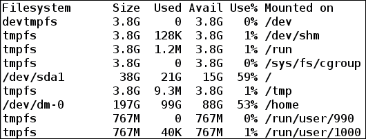

要使用`awk`获取第四列，即`Avail`字段，我们可以编写一个使用`awk`的 shell 脚本如下：

```
#!/bin/bash
# Filename: awk_embed.sh
# Description: Demonstrating using awk in shell script

# Fetching 4th column of command df output
df -h |awk '{ print $4 }'
```

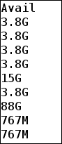

考虑另一个例子，我们将使用一个输入文件，该文件将是系统的`/etc/passwd`文件。该文件包含有关 Linux 或基于 UNIX 的系统上每个用户或帐户的基本信息。

`/etc/passwd`文件的每一行如下所示：

```
root:x:0:0:root:/root:/bin/bash

```

有七个字段，每个字段由冒号（:）分隔。要了解每个字段的详细含义，请参阅[`en.wikipedia.org/wiki/Passwd`](https://en.wikipedia.org/wiki/Passwd)上的维基百科链接。

以下 shell 脚本利用 awk 功能并从`/etc/passwd`文件中显示一些有用的信息。例如，我们将考虑以下作为`passwd`文件的内容：

```
$ cat passwd
root:x:0:0:root:/root:/bin/bash
bin:x:1:1:bin:/bin:/sbin/nologin
daemon:x:2:2:daemon:/sbin:/sbin/nologin
adm:x:3:4:adm:/var/adm:/sbin/nologin
lp:x:4:7:lp:/var/spool/lpd:/sbin/nologin
sync:x:5:0:sync:/sbin:/bin/sync
shutdown:x:6:0:shutdown:/sbin:/sbin/shutdown
halt:x:7:0:halt:/sbin:/sbin/halt

$ cat passwd_file_info.sh	   # Shell script content
#!/bin/bash
# Filename: passwd_file_info.sh
# Desciption: Fetches useful information from /etc/passwd file using awk

# Fetching 1st and 3rd field i.e. Username and UID and separate them with blank space
awk -F":" '{ print "Username: " $1 "\tUID:" $3 }' passwd

# Searching line whose user is root
echo "User root information"
awk '$1 ~ /^root/' passwd

```

运行此脚本会得到以下结果：

```
$ sh passwd_file_info.sh
Username: root  UID:0
Username: bin   UID:1
Username: daemon        UID:2
Username: adm   UID:3
Username: lp    UID:4
Username: sync  UID:5
Username: shutdown      UID:6
Username: halt  UID:7

User root information
root:x:0:0:root:/root:/bin/bash 

```

### 注意

还可以在 shell 脚本中使用编译语言，如 C、C++和 Java。为此，编写命令来编译和执行代码。

# 摘要

阅读完本章后，你现在应该知道如何使用`at`命令安排任务在特定时间执行。你还应该知道创建 Cron 作业的好处，这些作业需要多次执行。你还应该学会如何使用`crontab`命令来添加、修改、列出和删除 crontab 条目。你还应该对`systemd`有很好的理解——这是系统上创建的第一个进程，它管理其他系统进程、服务和日志。你还应该知道如何在 shell 脚本中嵌入其他脚本语言，比如 Python、AWK、Ruby 等。

阅读完所有这些章节并练习了例子后，你现在应该对 shell 脚本有信心了。作为命令行的大师，你现在能够编写自己的 shell 脚本来解决日常任务。最后，如果这本书中没有涵盖的内容，你知道应该查看任何命令的 man 页面以获取帮助。
