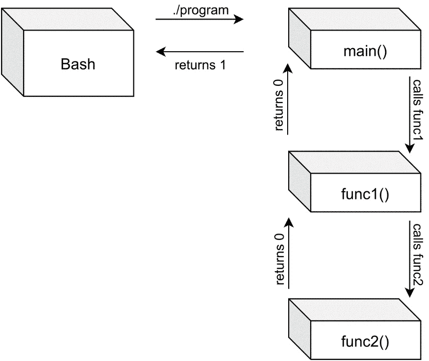
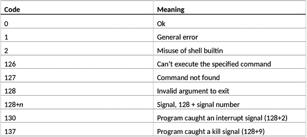
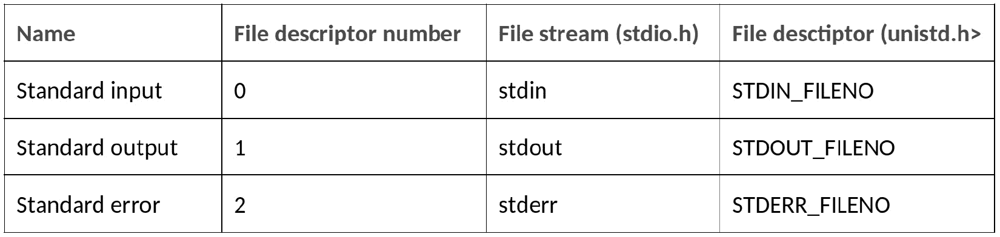

# 第二章：使您的程序易于脚本化

Linux 和其他**Unix**系统具有强大的**脚本**支持。Unix 的整个理念，从一开始就是使系统易于开发。其中一个特性是将一个程序的输出作为另一个程序的输入——因此利用现有程序构建新工具。在为 Linux 创建程序时，我们应该始终牢记这一点。Unix 哲学是制作只做一件事情的小程序——并且做得很好。通过拥有许多只做一件事情的小程序，我们可以自由选择如何组合它们。通过组合小程序，我们可以编写 shell 脚本——这是 Unix 和 Linux 中的常见任务。

本章将教会我们如何制作易于脚本化和易于与其他程序交互的程序。这样，其他人会发现它们更有用。甚至可能会发现我们甚至没有想到的使用我们的程序的新方法，使程序更受欢迎和易于使用。

在本章中，我们将涵盖以下示例：

+   返回值及其读取方法

+   使用相关的返回值退出程序

+   重定向 stdin、stdout 和 stderr

+   使用管道连接程序

+   写入 stdout 和 stderr

+   从 stdin 读取

+   编写一个友好的管道程序

+   将结果重定向到文件

+   读取环境变量

让我们开始吧！

# 技术要求

本章所需的仅为安装有 GCC 和 Make 的 Linux 计算机，最好是通过*第一章*中提到的元包或组安装之一安装。最好使用*Bash shell*以获得最佳兼容性。大多数示例也适用于其他 shell，但不能保证在所有可能的 shell 上都能正常工作。您可以通过在终端中运行`echo $SHELL`来检查您正在使用哪种 shell。如果您使用的是 Bash，它会显示`/bin/bash`。

您可以从[`github.com/PacktPublishing/Linux-System-Programming-Techniques/tree/master/ch2`](https://github.com/PacktPublishing/Linux-System-Programming-Techniques/tree/master/ch2)下载本章的所有代码。

查看以下链接，观看代码演示视频：[`bit.ly/3u5VItw`](https://bit.ly/3u5VItw)

# 返回值及其读取方法

`return`。这就是我们用来从`main()`返回值到 shell 的`return`语句。最初的 Unix 操作系统和 C 编程语言同时出现并且来自同一个地方。C 语言在 20 世纪 70 年代初完成后，Unix 就被重写成了 C。以前，它只是用汇编语言编写的。因此，C 和 Unix 紧密结合在一起。

Linux 中返回值如此重要的原因是我们可以构建 shell 脚本。这些 shell 脚本使用其他程序，希望也包括我们的程序，作为其部分。为了能够检查程序是否成功，shell 脚本会读取该程序的返回值。

在这个示例中，我们将编写一个程序，告诉用户文件或目录是否存在。

## 准备工作

建议您在此示例中使用 Bash。我不能保证与其他 shell 的兼容性。

## 如何做…

在这个示例中，我们将编写一个小的**shell 脚本**，演示返回值的目的，如何读取它们以及如何解释它们。让我们开始吧：

1.  在编写代码之前，我们必须调查程序使用的返回值，这些返回值将在我们的脚本中使用。执行以下命令，并记录我们得到的返回值。`test`命令是一个测试特定条件的小型实用程序。在这个示例中，我们将使用它来确定文件或目录是否存在。`-e`选项代表*存在*。`test`命令不会给我们任何输出；它只是以一个返回值退出：

```
$> test -e /
$> echo $?
0
$> test -e /asdfasdf
$> echo $?
1
```

1.  现在我们知道`test`程序给我们什么返回值（文件或目录存在时为 0，否则为 1），我们可以继续编写我们的脚本。在文件中写入以下代码，并将其保存为`exist.sh`。您还可以从[`github.com/PacktPublishing/Linux-System-Programming-Techniques/blob/master/ch2/exist.sh`](https://github.com/PacktPublishing/Linux-System-Programming-Techniques/blob/master/ch2/exist.sh)下载。这个 shell 脚本使用`test`命令来确定指定的文件或目录是否存在：

```
#!/bin/bash 
# Check if the user supplied exactly one argument 
if [ "$#" -ne 1 ]; then 
    echo "You must supply exactly one argument." 
    echo "Example: $0 /etc" 
    exit 1 # Return with value 1 
fi 
# Check if the file/directory exists 
test -e "$1" # Perform the actual test
if [ "$?" -eq 0 ]; then 
    echo "File or directory exists" 
elif [ "$?" -eq 1 ]; then 
    echo "File or directory does not exist" 
    exit 3 # Return with a special code so other
           # programs can use the value to see if a 
           # file dosen't exist
else 
    echo "Unknown return value from test..."
    exit 1 # Unknown error occured, so exit with 1
fi 
exit 0 # If the file or directory exists, we exit 
       # with 
```

1.  然后，您需要使用以下命令使其*可执行*：

```
$> chmod +x exist.sh
```

1.  现在，是时候尝试我们的脚本了。我们尝试存在的目录和不存在的目录。我们还在每次运行后检查退出代码：

```
$> ./exist.sh  
You must supply exactly one argument. 
Example: ./exist.sh /etc 
$> echo $?
1
$> ./exist.sh /etc 
File or directory exists 
$> echo $?
0
$> ./exist.sh /asdfasdf 
File or directory does not exist
$> echo $?
3
```

1.  现在我们知道它正在工作并且离开了正确的退出代码，我们可以编写`echo`来打印一条文本，说明文件或目录是否存在：

```
$> ./exist.sh / && echo "Nice, that one exists"
File or directory exists
Nice, that one exists
$> ./exist.sh /asdf && echo "Nice, that one exists"
File or directory does not exist
```

1.  我们还可以编写一个更复杂的一行命令，利用我们在脚本中分配给“文件未找到”的独特错误代码 3。请注意，您不应在第二行开头键入`>`。当您用反斜杠结束第一行以指示长行的继续时，shell 会自动插入此字符：

```
$> ./exist.sh /asdf &> /dev/null; \
> if [ $? -eq 3 ]; then echo "That doesn't exist"; fi
That doesn't exist
```

## 工作原理...

`test`程序是一个小型实用程序，用于测试文件和目录，比较值等。在我们的情况下，我们用它来测试指定的文件或目录是否存在（`-e`表示存在）。

`test`程序不会打印任何内容；它只是默默退出。但是，它会留下一个返回值。我们使用`$?`变量来检查该返回值。这也是我们在脚本的`if`语句中检查的相同变量。

脚本中还有一些我们使用的特殊变量。第一个是`$#`，它包含 C 中的`argc`数量。在脚本的开头，我们比较了`$#`是否*不等于*1（`-ne`表示*不等于*）。如果`$#`不等于 1，则打印错误消息，并且脚本以代码 1 中止。

将`$#`放在引号中的原因只是一种安全机制。如果在某种意外事件中，`$#`包含空格，我们仍希望内容被评估为单个值，而不是两个值。脚本中其他变量周围的引号也是同样的道理。

下一个特殊变量是`$0`。此变量包含参数 0，即程序的名称，就像我们在*第一章*中看到的 C 中的`argv[0]`一样，获取必要的工具并编写我们的第一个 Linux 程序。

程序的第一个参数存储在`$1`中，就像`test`案例中所示的那样。在我们的情况下，第一个参数是我们要测试的提供的文件名或目录。

与我们的 C 程序一样，我们希望我们的脚本以相关的返回值退出（或使用`exit`离开脚本并设置返回值）。如果用户没有提供精确的一个参数，我们以代码 1 退出，这是一个一般的错误代码。如果脚本按预期执行，并且文件或目录存在，我们以代码 0 退出。如果脚本按预期执行，但文件或目录不存在，我们以代码 3 退出，这并没有为特定用途保留，但仍然表示错误（所有*非零*代码都是错误代码）。这样，其他脚本可以获取我们的脚本的返回值并对其进行操作。

在*步骤 5*中，我们就是这样—使用以下命令对我们的脚本的退出代码进行操作：

```
$> ./exist.sh / && echo "Nice, that one exists"
```

`&&`表示“和”。我们可以将整行读作`if`语句。如果`exist.sh`为真，即退出代码为 0，则执行`echo`命令。如果退出代码不为 0，则`echo`命令永远不会被执行。

在*步骤 6*中，我们将脚本的所有输出重定向到`/dev/null`，然后使用完整的`if`语句来检查错误代码 3。如果遇到错误代码 3，我们使用`echo`打印一条消息。

## 还有更多...

我们可以用`test`程序做更多的测试和比较。它们都列在手册中；也就是说，`man 1 test`。

如果你对 Bash 和 shell 脚本不熟悉，在手册页`man 1 bash`中有很多有用的信息。

`&&`的反义是`||`，发音是“或”。因此，我们在这个示例中所做的相反操作如下：

```
$> ./exist.sh / || echo "That doesn't exist"
```

```
File or directory exists
```

```
$> ./exist.sh /asdf || echo "That doesn't exist"
```

```
File or directory does not exist
```

```
That doesn't exist
```

## 另请参阅

如果你想深入了解 Bash 和 shell 脚本的世界，在*Linux 文档项目*有一个很好的指南：https://tldp.org/LDP/Bash-Beginners-Guide/html/index.html。

# 使用相关的返回值退出程序

在这个示例中，我们将学习如何使用相关的`return`退出 C 程序，以及从更广泛的角度来看系统是如何配合的。我们还将学习一些常见的返回值的含义。

## 准备工作

对于这个示例，我们只需要 GCC 编译器和 Make 工具。

## 如何做...

我们将在这里编写两个不同版本的程序，以展示两种不同的退出方法。让我们开始吧：

1.  我们将首先编写使用`return`的第一个版本，这是我们之前见过的。但这一次，我们将用它从`main()`和最终`functions_ver1.c`中返回。以下代码中所有的返回语句都被突出显示：

```
#include <stdio.h>
int func1(void);
int func2(void);
int main(int argc, char *argv[])
{
   printf("Inside main\n");
   printf("Calling function one\n");
   if (func1())
   {
      printf("Everything ok from function one\n");
      printf("Return with 0 from main - all ok\n");
      return 0;
   }
   else
   {
      printf("Caught an error from function one\n");
      printf("Return with 1 from main - error\n");
      return 1;
   }
   return 0; /* We shouldn't reach this, but 
                just in case */
}
int func1(void)
{
   printf("Inside function one\n");
   printf("Calling function two\n");
   if (func2())
   {
      printf("Everything ok from function two\n");
      return 1;
   }
   else
   {
      printf("Caught an error from function two\n");
      return 0;
   }
}
int func2(void)
{
   printf("Inside function two\n");
   printf("Returning with 0 (error) from "
      "function two\n");
   return 0;
}
```

1.  现在，**编译**它：

```
$> gcc functions_ver1.c -o functions_ver1
```

1.  然后运行它。试着跟着看，看哪些函数调用并返回到哪些其他函数：

```
$> ./functions-ver1
Inside main 
Calling function one 
Inside function one 
Calling function two 
Inside function two 
Returning with 0 (error) from function two 
Caught an error from function two 
Caught an error from function one 
Return with 1 from main – error
```

1.  检查返回值：

```
$> echo $?
1
```

1.  现在，我们将重写前面的程序，使用`exit()`来代替函数内部的`return`。那么当`exit()`被调用时，程序将立即退出。如果`exit()`在另一个函数中被调用，那个函数将不会首先返回到`main()`。将以下程序保存在一个新文件中，命名为`functions_ver2.c`。以下代码中所有的`return`和`exit`语句都被突出显示：

```
#include <stdio.h>
#include <stdlib.h>
int func1(void);
int func2(void);
int main(int argc, char *argv[])
{
   printf("Inside main\n");
   printf("Calling function one\n");
   if (func1())
   {
      printf("Everything ok from function one\n");
      printf("Return with 0 from main - all ok\n");
      return 0;
   }
   else
   {
      printf("Caught an error from funtcion one\n");
      printf("Return with 1 from main - error\n");
      return 1;
   }
   return 0; /* We shouldn't reach this, but just 
                in case */
}
int func1(void)
{
   printf("Inside function one\n");
   printf("Calling function two\n");
   if (func2())
   {
      printf("Everything ok from function two\n");
      exit(0);
   }
   else
   {
      printf("Caught an error from function two\n");
      exit(1);
   }
}
```

1.  现在，编译这个版本：

```
$> gcc functions_ver2.c -o functions_ver2
```

1.  然后运行它，看看会发生什么（并比较前一个程序的输出）：

```
$> ./functions_ver2
Inside main
Calling function one
Inside function one
Calling function two
Inside function two
Returning with (error) from function two
```

1.  最后，检查返回值：

```
$> echo $?
1
```

## 它是如何工作的...

请注意，在 C 中，0 被视为*false*或错误，而其他任何值都被视为*true*（或正确）。这与 shell 的返回值相反。这一点起初可能有点令人困惑。然而，就 shell 而言，0 表示“一切正常”，而其他任何值表示错误。

两个版本之间的区别在于函数和整个程序的返回方式。在第一个版本中，每个函数都返回到调用函数中——按照它们被调用的顺序。在第二个版本中，每个函数都使用`exit()`函数退出。这意味着程序将直接退出并将指定的值返回给 shell。第二个版本不是一个好的做法；最好是返回到调用函数。如果其他人在另一个程序中使用你的函数，而它突然退出整个程序，那将是一个大惊喜。通常我们不是这样做的。但是，我想在这里演示`exit()`和`return`之间的区别。

我还想演示另一点。就像函数用`return`返回到它的调用函数一样，程序也以同样的方式返回到它的父进程（通常是 shell）。因此，在 Linux 中，程序就像是程序中的函数一样对待。

下图显示了 Bash 如何调用程序（上箭头），然后程序在`main()`中启动，然后调用下一个函数（右箭头），依此类推。返回到左边的箭头显示了每个函数如何返回到调用函数，最终返回到 Bash：



图 2.1 - 调用和返回

## 还有更多...

我们可以使用更多的返回代码。最常见的是我们在这里看到的`0`表示*ok*，`1`表示*error*。然而，除了`0`之外的所有其他代码都表示某种形式的错误。代码`1`是一般错误，而其他错误代码更具体。虽然没有确切的标准，但有一些常用的代码。以下是一些最常见的代码：



图 2.2 - Linux 和其他类 UNIX 系统中的常见错误代码

除了这些代码，还有一些其他代码列在`/usr/include/sysexit.h`的末尾。该文件中列出的代码范围从`64`到`78`，涉及数据格式错误、服务不可用、I/O 错误等错误。

# 重定向 stdin、stdout 和 stderr

在这个食谱中，我们将学习如何将标准输入、标准输出和标准错误重定向到文件中。将数据重定向到文件是 Linux 和其他 Unix 系统的基本原则之一。

**stdin**是**标准输入**的简写。**stdout**和**stderr**分别是**标准输出**和**标准错误**的简写。

## 准备工作

最好使用 Bash shell 进行此操作，以确保兼容性。

## 如何做…

为了熟悉重定向，我们将在这里进行一系列实验。我们将扭转重定向，看到 stdout、stderr 和 stdin 以各种方式运行。让我们开始吧：

1.  让我们从保存顶级根目录中的文件和目录列表开始。我们可以通过将`ls`命令的标准输出（stdout）重定向到一个文件中来实现这一点：

```
$> cd
$> ls / > root-directory.txt
```

1.  现在，用`cat`命令查看文件：

```
$> cat root-directory.txt
```

1.  现在，让我们尝试`wc`命令来计算行数、单词数和字符数。记得在输入消息后按下*Ctrl + D*：

```
$> wc
hello,
how are you?
*Ctrl+D*
     2       4      20
```

1.  现在我们知道了`wc`是如何工作的，我们可以重定向它的输入来自一个文件 - 我们用文件列表创建的文件：

```
$> wc < root-directory.txt
29  29 177
```

1.  标准错误呢？标准错误是它自己的输出流，与标准输出分开。如果我们重定向标准输出并生成错误，我们仍然会在屏幕上看到错误消息。让我们试一试：

```
$> ls /asdfasdf > non-existent.txt
ls: cannot access '/asdfasdf': No such file or directory
```

1.  就像标准输出一样，我们也可以重定向标准错误。请注意，这里我们没有收到任何错误消息：

```
$> ls /asdfasdf 2> errors.txt
```

1.  错误消息保存在`errors.txt`中：

```
$> cat errors.txt
ls: cannot access '/asdfasdf': No such file or directory
```

1.  我们甚至可以同时重定向标准输出和标准错误到不同的文件中：

```
$> ls /asdfasdf > root-directory.txt 2> errors.txt
```

1.  我们还可以将标准输出和错误重定向到同一个文件中，以方便操作：

```
$> ls /asdfasdf &> all-output.txt
```

1.  我们甚至可以同时重定向所有三个（stdin、stdout 和 stderr）：

```
$> wc < all-output.txt > wc-output.txt 2> \
> wc-errors.txt
```

1.  我们还可以从 shell 向标准错误写入自己的错误消息：

```
$> echo hello > /dev/stderr
hello
```

1.  从 Bash 中将消息打印到 stderr 的另一种方法是这样的：

```
$> echo hello 1>&2
hello
```

1.  然而，这并没有证明我们的 hello 消息被打印到标准错误。我们可以通过将标准输出重定向到一个文件来证明这一点。如果我们仍然看到错误消息，那么它是打印在标准错误上的。当我们这样做时，我们需要将第一个语句用括号括起来，以便与最后的重定向分开：

```
$> (echo hello > /dev/stderr) > hello.txt
hello
$> (echo hello 1>&2) > hello.txt
hello
```

1.  标准输入、标准输出和标准错误在`/dev`目录中用文件表示。这意味着我们甚至可以从文件中重定向 stdin。这个实验并没有做任何有用的事情 - 我们本可以只输入`wc`，但这证明了一个观点：

```
$> wc < /dev/stdin
hello, world!
*Ctrl+D*
     1       2      14
```

1.  所有这些意味着我们甚至可以将标准错误消息重定向回标准输出：

```
$> (ls /asdfasdf 2> /dev/stdout) > \ 
> error-msg-from-stdout.txt
$> cat error-msg-from-stdout.txt 
ls: cannot access '/asdfasdf': No such file or directory
```

## 工作原理…

标准输出，或者 stdout，是程序的正常输出打印的地方。Stdout 也被称为文件描述符 1。

标准错误，或者 stderr，是所有错误消息被打印的地方。Stderr 也被称为文件描述符 2。这就是为什么我们在将 stderr 重定向到文件时使用了`2>`。如果我们愿意，为了清晰起见，我们可以将*stdout*重定向为`1>`，而不仅仅是`>`。但是，默认的重定向是 stdout，所以没有必要这样做。

在*步骤 9*中，当我们重定向了标准输出和标准错误时，我们使用了一个`&`符号。这意味着“标准输出*和*标准错误”。

标准输入，或*stdin*，是所有输入数据被读取的地方。Stdin 也被称为文件描述符 0。Stdin 可以通过`<`重定向，但就像标准输出和标准错误一样，我们也可以写成`0<`。

分开标准输出和标准错误的原因是，当我们将程序的输出重定向到文件时，我们仍然应该能够在屏幕上看到错误消息。我们也不希望文件被错误消息淹没。

拥有单独的输出也使得可以有一个文件用于实际输出，另一个文件用作错误消息的日志文件。这在脚本中特别方便。

你可能听说过短语“*Linux 中的一切都是文件或进程*”。这句话是真的。在 Linux 中没有其他*东西*，除了文件或进程。我们对`/dev/stdout`、`/dev/stderr`和`/dev/stdin`的实验证明了这一点。文件甚至代表了程序的输入和输出。

在*步骤 11*中，我们将输出重定向到了`/dev/stderr`文件，这是标准错误。因此，消息被打印到了标准错误。

在*步骤 12*中，我们基本上做了同样的事情，但没有使用实际的设备文件。看起来有点奇怪的`1>&2`重定向的意思是“*将标准输出发送到标准错误*”。

## 还有更多...

例如，我们可以使用`/dev/fd/2`来代替使用`/dev/stderr`，其中`/dev/fd/1`和标准输入，即`/dev/fd/0`。因此，例如，以下命令将列表打印到标准错误：

```
$> ls / > /dev/fd/2
```

就像我们可以使用`1>&2`将标准输出发送到标准错误一样，我们也可以使用`2>&1`将标准错误发送到标准输出。

# 使用管道连接程序

在这个教程中，我们将学习如何使用**管道**连接程序。当我们编写 C 程序时，我们总是希望努力使它们易于与其他程序一起使用管道连接。这样，我们的程序将更加有用。有时，使用管道连接的程序被称为**过滤器**。原因是，通常当我们使用管道连接程序时，是为了过滤或转换一些数据。

## 准备工作

就像在上一个教程中一样，建议使用 Bash shell。

## 如何做...

按照以下步骤来探索 Linux 中的管道：

1.  我们已经熟悉了上一个教程中的`wc`和`ls`。在这里，我们将它们与管道一起使用，来计算系统根目录中文件和目录的数量。管道是垂直线符号：

```
$> ls / | wc -l
29
```

1.  让我们让事情变得更有趣一点。这一次，我们想要列出根目录中的**符号链接**（使用两个程序和一个管道）。结果会因系统而异：

```
$> ls -l / | grep lrwx
lrwxrwxrwx   1 root root    31 okt 21 06:53 initrd.img -> boot/initrd.img-4.19.0-12-amd64
lrwxrwxrwx   1 root root    31 okt 21 06:53 initrd.img.old -> boot/initrd.img-4.19.0-11-amd64
lrwxrwxrwx   1 root root    28 okt 21 06:53 vmlinuz -> boot/vmlinuz-4.19.0-12-amd64
lrwxrwxrwx   1 root root    28 okt 21 06:53 vmlinuz.old -> boot/vmlinuz-4.19.0-11-amd64
```

1.  现在，我们只想要实际的文件名，而不是关于它们的信息。所以，这一次，我们将在最后添加另一个名为`awk`的程序。在这个例子中，我们告诉`awk`打印第九个字段。一个或多个空格分隔每个字段：

```
$> ls -l / | grep lrwx | awk '{ print $9 }'
initrd.img
initrd.img.old
vmlinuz
vmlinuz.old
```

1.  我们可以添加另一个"`sed` - `s`意思是*替换*。然后，我们可以告诉`sed`我们想要用文本`This is a link:`替换行的开头（`^`）：

```
$> ls -l / | grep lrwx | awk '{ print $9 }' \
> | sed 's/^/This is a link: /'
This is a link: initrd.img
This is a link: initrd.img.old
This is a link: vmlinuz
This is a link: vmlinuz.old
```

## 它是如何工作的...

这里有很多事情正在进行，但如果你不明白所有的事情，不要感到沮丧。这个教程的重要性在于演示如何使用*管道*（垂直线符号，`|`）。

在第一步中，我们使用`wc`计算了文件系统根目录中的文件和目录数量。当我们交互式运行`ls`时，我们会得到一个漂亮的列表，它跨越了我们终端的宽度。输出很可能也是彩色的。但是当我们通过管道重定向`ls`的输出时，`ls`没有一个真正的终端来输出，所以它会回退到每行输出一个文件或目录的文本，而没有任何颜色。如果你愿意，你可以自己尝试一下，运行以下命令：

```
$> ls / | cat
```

由于`ls`每行输出一个文件或目录，我们可以使用`wc`（`-l`选项）来计算行数。

在下一步（*步骤 2*）中，我们使用`grep`仅列出了从`ls -l`的输出中的链接。`ls -l`的输出中的链接以行首的字母`l`开头。之后是访问权限，对于链接来说是`rwx`。这就是我们用`grep`搜索的内容。

然后，我们只想要实际的文件名，所以我们添加了一个名为`awk`的程序。`awk`工具让我们单独提取输出中的特定列或字段。我们提取了第九列（`$9`），也就是文件名。

通过将`ls`的输出通过另外两个工具，我们创建了一个仅包含根目录中链接的列表。

在*步骤 3*中，我们添加了另一个工具，或者有时称为过滤器。这个工具是`sed`，一个*流编辑器*。使用这个程序，我们可以对文本进行更改。在这种情况下，我们在每个链接前面添加了文本`This is a link:`。以下是该行的简短解释：

```
sed 's/^/This is a link: /'
```

`s`表示"替换"；也就是说，我们希望修改一些文本。在两个第一个斜杠（`/`）内是应该匹配我们想要修改的文本或表达式。这里，我们有行首`^`。然后，在第二个斜杠之后，我们有要用匹配的文本替换的文本，一直到最后一个斜杠。这里，我们有文本`This is a link:`。

## 更多内容...

小心不必要的管道处理；很容易陷入无休止的管道处理中。一个愚蠢但有教育意义的例子是：

```
$> ls / | cat | grep tmp
```

```
tmp
```

我们可以省略`cat`，仍然可以得到相同的结果：

```
$> ls / | grep tmp
```

```
tmp
```

对于这个（我自己有时也会犯的错误）也是一样的：

```
$> cat /etc/passwd | grep root
```

```
root:x:0:0:root:/root:/bin/bash
```

没有理由对前面的示例进行管道处理。`grep`实用程序可以接受文件名参数，如下所示：

```
$> grep root /etc/passwd
```

```
root:x:0:0:root:/root:/bin/bash
```

## 另请参阅

对于任何对 Unix 的历史以及管道的起源感兴趣的人，YouTube 上有一个令人兴奋的 1982 年的视频，由 AT&T 上传：[`www.youtube.com/watch?v=tc4ROCJYbm0`](https://www.youtube.com/watch?v=tc4ROCJYbm0)。

# 写入 stdout 和 stderr

在这个配方中，我们将学习如何在 C 程序中将文本打印到*stdout*和*stderr*。在前两个配方中，我们学习了 stdout 和 stderr 是什么，它们为什么存在，以及如何重定向它们。现在，轮到我们编写正确的程序，在标准错误上输出错误消息，并在标准输出上输出常规消息了。

## 如何做...

按照以下步骤学习如何在 C 程序中将输出写入 stdout 和 stderr：

1.  在名为`output.c`的文件中写入以下代码并保存。在这个程序中，我们将使用三个不同的函数来写入输出：`printf()`、`fprintf()`和`dprintf()`。使用`fprintf()`，我们可以指定文件流，如 stdout 或 stderr，而使用`dprintf()`，我们可以指定文件描述符（1 表示 stdout，2 表示 stderr，就像我们之前看到的那样）：

```
#define _POSIX_C_SOURCE 200809L
#include <stdio.h>
int main(void)
{
   printf("A regular message on stdout\n");
   /* Using streams with fprintf() */
   fprintf(stdout, "Also a regular message on " 
     	 "stdout\n");
   fprintf(stderr, "An error message on stderr\n");
   /* Using file descriptors with dprintf().
    * This requires _POSIX_C_SOURCE 200809L 
    * (man 3 dprintf)*/
   dprintf(1, "A regular message, printed to "
      	  "fd 1\n");
   dprintf(2, "An error message, printed to "
      	   "fd 2\n");
   return 0;
}
```

1.  编译程序：

```
$> gcc output.c -o output
```

1.  像通常一样运行程序：

```
$> ./output 
A regular message on stdout
Also a regular message on stdout
An error message on stderr
A regular message, printed to fd 1
An error message, printed to fd 2
```

1.  为了证明常规消息是打印到 stdout 的，我们可以将错误消息发送到`/dev/null`，这是 Linux 系统中的一个黑洞。这样做将只显示打印到 stdout 的消息：

```
$> ./output 2> /dev/null 
A regular message on stdout
Also a regular message on stdout
A regular message, printed to fd 1
```

1.  现在，我们将做相反的操作；我们将把打印到 stdout 的消息发送到`/dev/null`，只显示打印到 stderr 的错误消息：

```
$> ./output > /dev/null
An error message on stderr
An error message, printed to fd 2
```

1.  最后，让我们将所有消息，包括 stdout 和 stderr，发送到`/dev/null`。这将不显示任何内容：

```
$> ./output &> /dev/null
```

## 工作原理...

第一个示例中，我们使用`printf()`，没有包含任何新的或独特的内容。使用常规的`printf()`函数打印的所有输出都会打印到 stdout。

然后，我们看到了一些新的示例，包括我们使用`fprintf()`的两行。`fprintf()`函数允许我们指定`stdio.h`）。

然后，我们看了一些使用`dprintf()`的例子。这个函数允许我们指定要打印到的**文件描述符**。我们在本章的先前示例中涵盖了文件描述符，但我们将在本书的后面更深入地讨论它们。三个文件描述符始终是打开的——0（stdin）、1（stdout）和 2（stderr）——在我们在 Linux 上编写的每个程序中。在这里，我们将常规消息打印到文件描述符（*fd*简称）1，将错误消息打印到文件描述符 2。

为了在我们的代码中正确，我们需要包括第一行（`#define`行）以支持`dprintf()`。我们可以在手册页（`man 3 dprintf`）中找到有关它的所有信息，包括*特性测试宏要求*。`_POSIX_C_SOURCE`是用于**POSIX**标准和兼容性。我们将在本书的后面更深入地讨论这个问题。

当我们测试程序时，我们验证了常规消息通过将错误消息重定向到名为`/dev/null`的文件来打印到标准输出，仅显示打印到标准输出的消息。然后，我们进行了相反的操作，以验证错误消息是否被打印到标准错误。

特殊文件`/dev/null`在 Linux 和其他 Unix 系统中充当黑洞。我们发送到该文件的所有内容都会消失。例如，尝试使用`ls / &> /dev/null`。不会显示任何输出，因为一切都被重定向到黑洞中。

## 还有更多...

我提到程序中打开了三个文件流，假设它包括`stdio.h`，以及三个文件描述符。这三个文件描述符始终是打开的，即使没有包括`stdio.h`。如果我们包括`unistd.h`，我们还可以使用三个文件描述符的宏名称。

以下表格显示了这些文件描述符、它们的宏名称和文件流，这对以后的参考很有用：



图 2.3 – Linux 中的文件描述符和文件流

# 从标准输入读取

在这个示例中，我们将学习如何用 C 语言编写一个从标准输入读取的程序。这样做可以使您的程序通过*管道*从其他程序接收输入，使它们更容易用作过滤器，从而使它们在长期内更有用。

## 准备工作

您将需要 GCC 编译器，最好是 Bash shell 来完成这个示例，尽管它应该适用于任何 shell。

要完全理解我们即将编写的程序，您应该查看 ASCII 表，可以在以下 URL 找到示例：[`github.com/PacktPublishing/Linux-System-Programming-Techniques/blob/master/ch2/ascii-table.md`](https://github.com/PacktPublishing/Linux-System-Programming-Techniques/blob/master/ch2/ascii-table.md)。

## 如何做...

在这个示例中，我们将编写一个程序，它接受单词作为输入，将它们的大小写转换（大写转换为小写，小写转换为大写），并将结果打印到标准输出。让我们开始吧：

1.  将以下代码写入文件并保存为`case-changer.c`。在这个程序中，我们使用`fgets()`从 stdin 读取字符。然后我们使用`for`循环逐个字符地循环输入。在我们开始下一个循环之前，我们必须使用`memset()`将数组清零：

```
#include <stdio.h>
#include <string.h>
int main(void)
{
    char c[20] = { 0 };
    char newcase[20] = { 0 };
    int i;
    while(fgets(c, sizeof(c), stdin) != NULL)
    {
        for(i=0; i<=sizeof(c); i++)
        {
            /* Upper case to lower case */
            if ( (c[i] >= 65) && (c[i] <= 90) )
            {
                newcase[i] = c[i] + 32;
            }
            /* Lower case to upper case */
            if ( (c[i] >= 97 && c[i] <= 122) )
            {
                newcase[i] = c[i] - 32;
            }
        }
        printf("%s\n", newcase);
        /* zero out the arrays so there are no
           left-overs in the next run */
        memset(c, 0, sizeof(c));
        memset(newcase, 0, sizeof(newcase));
    }
    return 0;
}
```

1.  编译程序：

```
$> gcc case-changer.c -o case-changer
```

1.  通过在其中输入一些单词来尝试它。按*Ctrl + D*退出程序：

```
$> ./case-changer
hello
HELLO
AbCdEf
aBcDeF
```

1.  现在，试着将一些输入*管道*到它，例如，从`ls`中的前五行：

```
$> ls / | head -n 5 | ./case-changer
BIN
BOOT
DEV
ETC
HOME
```

1.  让我们尝试从手册页中将一些大写单词*管道*到它中：

```
$> man ls | egrep '^[A-Z]+$' | ./case-changer 
name
synopsis
description
author
copyrigh
```

## 它是如何工作的...

首先，我们创建了两个 20 字节的字符**数组**，并将它们初始化为 0。

然后，我们使用`fgets()`，包装在`while`循环中，从标准输入读取字符。`fgets()`函数读取字符，直到它达到一个*换行*字符或一个`c`数组，并且也返回。

要读取更多输入——也就是说，不止一个单词——我们继续使用`while`循环来读取输入。`while`循环直到我们按下*Ctrl + D*或输入流为空为止。

`fgets()`函数在成功时返回读取的字符，在错误或在没有读取任何字符的情况下发生 EOF 时返回`NULL`（也就是说，没有更多的输入）。让我们分解`fgets()`函数，以便更好地理解它：

```
fgets(c, sizeof(c), stdin)
```

第一个参数`c`是我们存储数据的地方。在这种情况下，它是我们的字符数组。

第二个参数`sizeof(c)`是我们想要读取的最大大小。`fgets()`函数在这里是安全的；它读取比我们指定的大小少一个。在我们的情况下，它只会读取 19 个字符，留出**空字符**的空间。

最终的第三个参数`stdin`是我们想要从中读取的流——在我们的情况下是标准输入。

在`while`循环内是发生大小写转换的地方，逐个字符在`for`循环中进行。在第一个`if`语句中，我们检查当前字符是否是大写的。如果是，我们加上 32 个字符。例如，如果字符是*A*，那么在**ASCII 表**中表示为 65。当我们加上 32 时，我们得到 97，即*a*。对于整个字母表都是这样的。大写和小写版本之间始终相差 32 个字符。

接下来的`if`语句执行相反的操作。如果字符是小写的，我们减去 32 并得到大写版本。

由于我们只检查 65 到 90 和 97 到 122 之间的字符，所有其他字符都被忽略。

一旦我们在屏幕上打印出结果，我们就用`memset()`将字符数组重置为全零。如果我们不这样做，下一次运行时会有剩余的字符。

### 使用该程序

我们通过交互式运行程序并向其输入单词来尝试该程序。每次按下*Enter*键时，单词都会被转换；大写字母将变成小写，反之亦然。

然后，我们从`ls`命令向其传递数据。该输出被转换为大写字母。

然后，我们尝试从手册页（标题）中将其管道化为大写单词。手册页中的所有标题都是大写的，并且从行的开头开始。这就是我们用`egrep`进行“grep”搜索的内容，然后将其管道化到我们的`case-changer`程序中。

## 还有更多内容...

有关`fgets()`的更多信息，请参阅手册页`man 3 fgets`。

您可以编写一个小程序来打印字母*a-z*和*A-Z*的最小 ASCII 表。这个小程序还演示了每个字符都是由一个数字表示的：

ascii-table.c

```
#include <stdio.h>
```

```
int main(void)
```

```
{
```

```
    char c;
```

```
    for (c = 65; c<=90; c++)
```

```
    {
```

```
        printf("%c = %d    ", c, c); /* upper case */
```

```
        printf("%c = %d\n", c+32, c+32); /* lower case */
```

```
    }
```

```
    return 0;
```

```
}
```

# 编写一个管道友好的程序

在这个示例中，我们将学习如何编写一个**管道友好**的程序。它将从标准输入接收输入，并将结果输出到标准输出。任何错误消息都将被打印到标准错误。

## 准备工作

对于这个示例，我们需要 GCC 编译器，GNU Make，最好是**Bash** shell。

## 如何做...

在这个示例中，我们将编写一个程序，将每小时英里转换为每小时公里。作为测试，我们将从一个包含汽车试验平均速度测量的文本文件中向其*管道*数据。文本文件是以**每小时英里**（**mph**）为单位的，但我们希望将其转换为**每小时公里**（**kph**）。让我们开始吧：

1.  首先创建以下文本文件，或者从 GitHub 下载它[`github.com/PacktPublishing/Linux-System-Programming-Techniques/blob/master/ch2/avg.txt`](https://github.com/PacktPublishing/Linux-System-Programming-Techniques/blob/master/ch2/avg.txt)。如果您自己创建，请命名为`avg.txt`。这个文本将被用作我们将要编写的程序的输入。这个文本模拟了汽车试验的测量数值：

```
10-minute average: 61 mph
30-minute average: 55 mph
45-minute average: 54 mph
60-minute average: 52 mph
90-minute average: 52 mph
99-minute average: nn mph
```

1.  现在，创建实际的程序。输入以下代码并将其保存为`mph-to-kph.c`，或者从 GitHub 上下载它：[`github.com/PacktPublishing/Linux-System-Programming-Techniques/blob/master/ch2/mph-to-kph.c`](https://github.com/PacktPublishing/Linux-System-Programming-Techniques/blob/master/ch2/mph-to-kph.c)。该程序将把每小时英里转换为每小时公里。这个转换是在`printf()`语句中执行的：

```
#include <stdio.h>
#include <stdlib.h>
#include <string.h>
int main(void)
{
    char mph[10] = { 0 };
    while(fgets(mph, sizeof(mph), stdin) != NULL)
    {
        /* Check if mph is numeric 
         * (and do conversion) */
        if( strspn(mph, "0123456789.-\n") == 
            strlen(mph) )
        {
            printf("%.1f\n", (atof(mph)*1.60934) );
        }
        /* If mph is NOT numeric, print error 
         * and return */
        else
        {
            fprintf(stderr, "Found non-numeric" 
                " value\n");
            return 1;
        }
    }
    return 0;
}
```

1.  编译程序：

```
$> gcc mph-to-kph.c -o mph-to-kph
```

1.  通过交互式运行程序来测试程序。输入一些每小时英里的值，并在每个值后按*Enter*。程序将打印出相应的每小时公里值：

```
$> ./mph-to-kph 
50
80.5
60
96.6
100
160.9
hello
Found non-numeric value
$> echo $?
1
$> ./mph-to-kph
50
80.5
*Ctrl+D*
$> echo $?
0
```

1.  现在，是时候将我们的程序作为过滤器使用，将包含每小时英里的表格转换为每小时公里。但首先，我们必须筛选出只有 mph 值。我们可以使用`awk`来实现这一点：

```
$> cat avg.txt | awk '{ print $3 }'
61
55
54
52
52
nn
```

1.  现在我们有了一个仅包含数字的列表，我们可以在最后添加我们的`mph-to-kph`程序来转换数值：

```
$> cat avg.txt | awk '{ print $3 }' | ./mph-to-kph 
98.2
88.5
86.9
83.7
83.7
Found non-numeric value
```

1.  由于最后一个值是`nn`，一个非数字值，这是测量中的错误，我们不想在输出中显示错误消息。因此，我们将 stderr 重定向到`/dev/null`。请注意，在重定向之前，表达式周围有括号：

```
$> (cat avg.txt | awk '{ print $3 }' | \ 
> ./mph-to-kph) 2> /dev/null
98.2
88.5
86.9
83.7
83.7
```

1.  这样看起来漂亮多了！但是，我们还想在每一行的末尾添加*km/h*，以便知道数值是多少。我们可以使用`sed`来实现这一点：

```
$> (cat avg.txt | awk '{ print $3 }' | \ 
> ./mph-to-kph) 2> /dev/null | sed 's/$/ km\/h/'
98.2 km/h
88.5 km/h
86.9 km/h
83.7 km/h
83.7 km/h
```

## 工作原理...

这个程序与上一个配方中的程序类似。我们在这里添加的功能检查输入数据是否是数字，如果不是，程序将中止，并打印错误消息到 stderr。正常输出仍然打印到 stdout，只要没有错误发生。

该程序只打印数值，没有其他信息。这使得它更适合作为过滤器，因为*km/h*文本可以由用户使用其他程序添加。这样，该程序可以用于我们尚未考虑到的许多其他情况。

检查数字输入的行可能需要一些解释：

```
if( strspn(mph, "0123456789.-\n") == strlen(mph) )
```

`strspn()`函数只读取我们在函数的第二个参数中指定的字符，然后返回读取的字符数。然后我们可以将`strspn()`读取的字符数与我们使用`strlen()`获得的字符串的整个长度进行比较。如果它们匹配，我们就知道每个字符都是数字、句点、减号或换行符。如果它们不匹配，这意味着在字符串中找到了非法字符。

为了使`strspn()`和`strlen()`工作，我们包含了`string.h`。为了使`atof()`工作，我们包含了`stdlib.h`。

### 将数据传送到程序

在*步骤 5*中，我们使用`awk`程序仅选择了第三个字段——mph 值。awk 的`$3`变量表示第 3 个字段。每个字段都是一个新单词，由空格分隔。

在*步骤 6*中，我们将`awk`程序的输出——mph 值——重定向到我们的`mph-to-kph`程序中。结果，我们的程序在屏幕上打印出了 km/h 值。

在*步骤 7*中，我们将错误消息重定向到`/dev/null`，以便程序的输出是干净的。

最后，在*步骤 8*中，我们在输出中添加了文本*km/h*在 kph 值之后。我们使用了`sed`程序来实现这一点。`sed`程序可能看起来有点神秘，所以让我们来分解一下：

```
sed 's/$/ km\/h/'
```

这个`sed`脚本与我们之前看到的类似。但是这一次，我们用`$`符号替换了行尾，而不是用`^`替换行首。所以，我们在这里做的是用文本"km/h"替换行尾。不过，请注意，我们需要用反斜杠*转义*“km/h”中的斜杠。

## 还有更多...

关于`strlen()`和`strspn()`有很多有用的信息在各自的手册页中。您可以使用`man 3 strlen`和`man 3 strspn`来阅读它们。

# 将结果重定向到文件

在这个食谱中，我们将学习如何将程序的输出重定向到两个不同的文件。我们还将学习一些在编写**过滤器**时的最佳实践，过滤器是专门用于与其他程序通过管道连接的程序。

在这个食谱中，我们将构建一个新版本的上一个食谱中的程序。在上一个食谱中的`mph-to-kph`程序有一个缺点：它总是在找到非数字字符时停止。通常，当我们在长输入数据上运行过滤器时，我们希望程序继续运行，即使它已经检测到一些错误的数据。这就是我们要在这个版本中修复的问题。

我们将保持默认行为与之前一样；也就是说，当遇到非数字值时，它将中止程序。然而，我们将添加一个选项（`-c`），以便即使检测到非数字值，它也可以继续运行程序。然后，由最终用户决定如何运行它。

## 准备好

本章的*技术要求*部分列出的所有要求都适用于这里（GCC 编译器、Make 工具和 Bash shell）。

## 如何做…

这个程序会有点长，但如果你愿意，你可以从 GitHub 上下载它[`github.com/PacktPublishing/Linux-System-Programming-Techniques/blob/master/ch2/mph-to-kph_v2.c`](https://github.com/PacktPublishing/Linux-System-Programming-Techniques/blob/master/ch2/mph-to-kph_v2.c)。由于代码有点长，我将把它分成几个步骤。不过，所有的代码仍然放在一个名为`mph-to-kph_v2.c`的单个文件中。让我们开始吧：

1.  让我们从特征宏和所需的头文件开始。由于我们将使用`getopt()`，我们需要`_XOPEN_SOURCE`宏，以及`unistd.h`头文件：

```
#define _XOPEN_SOURCE 500
#include <stdio.h>
#include <stdlib.h>
#include <string.h>
#include <unistd.h
```

1.  接下来，我们将为`help`函数添加函数原型。我们还将开始编写`main()`函数体：

```
void printHelp(FILE *stream, char progname[]);
int main(int argc, char *argv[])
{
   char mph[10] = { 0 };
   int opt;
   int cont = 0; 
```

1.  然后，我们将在`while`循环中添加`getopt()`函数。这类似于*第一章*中的*编写解析命令行选项的程序食谱*，获取必要的工具并编写我们的第一个 Linux 程序：

```
/* Parse command-line options */    
   while ((opt = getopt(argc, argv, "ch")) != -1)
   {
      switch(opt)
      {
         case 'h':
            printHelp(stdout, argv[0]);
            return 0;
         case 'c':
            cont = 1;
            break;
         default:
            printHelp(stderr, argv[0]);
            return 1;
      }
   }
```

1.  然后，我们必须创建另一个`while`循环，在其中我们将使用`fgets()`从 stdin 获取数据：

```
while(fgets(mph, sizeof(mph), stdin) != NULL)
   {
      /* Check if mph is numeric 
       * (and do conversion) */
      if( strspn(mph, "0123456789.-\n") == 
            strlen(mph) )
      {
         printf("%.1f\n", (atof(mph)*1.60934) );
      }
      /* If mph is NOT numeric, print error 
       * and return */
      else
      {
         fprintf(stderr, "Found non-numeric " 
            "value\n");
         if (cont == 1) /* Check if -c is set */
         {
            continue; /* Skip and continue if 
                       * -c is set */
         }
         else
         {
            return 1; /* Abort if -c is not set */
         }
      }
   }
   return 0;
}
```

1.  最后，我们必须为`help`函数编写函数体：

```
void printHelp(FILE *stream, char progname[])
{
   fprintf(stream, "%s [-c] [-h]\n", progname);
   fprintf(stream, " -c continues even though a non" 
      "-numeric value was detected in the input\n"
      " -h print help\n");
} 
```

1.  使用 Make 编译程序：

```
$> make mph-to-kph_v2
cc     mph-to-kph_v2.c   -o mph-to-kph_v2
```

1.  让我们尝试一下，不带任何选项，给它一些数字值和一个非数字值。结果应该与我们之前收到的相同：

```
$> ./mph-to-kph_v2 
60
96.6
40
64.4
hello
Found non-numeric value
```

1.  现在，让我们尝试使用`-c`选项，以便即使检测到非数字值，我们也可以继续运行程序。在程序中输入一些数字和非数字值：

```
$> ./mph-to-kph_v2 -c
50
80.5
90
144.8
hello
Found non-numeric value
10
16.1
20
32.2
```

1.  这很好！现在，让我们向`avg.txt`文件添加一些数据，并将其保存为`avg-with-garbage.txt`。这一次，将会有更多行包含非数字值。您也可以从[`github.com/PacktPublishing/Linux-System-Programming-Techniques/blob/master/ch2/avg-with-garbage.txt`](https://github.com/PacktPublishing/Linux-System-Programming-Techniques/blob/master/ch2/avg-with-garbage.txt)下载该文件：

```
10-minute average: 61 mph
30-minute average: 55 mph
45-minute average: 54 mph
60-minute average: 52 mph
90-minute average: 52 mph
99-minute average: nn mph
120-minute average: 49 mph
160-minute average: 47 mph
180-minute average: nn mph
error reading data from interface
200-minute average: 43 mph
```

1.  现在，让我们再次在该文件上运行`awk`，只看到值：

```
$> cat avg-with-garbage.txt | awk '{ print $3 }'
61
55
54
52
52
nn
49
47
nn
data
43
```

1.  现在是真相的时刻。让我们在最后添加`mph-to-kph_v2`程序，并使用`-c`选项。这应该将所有的 mph 值转换为 kph 值并继续运行，即使找到非数字值：

```
$> cat avg-with-garbage.txt | awk '{ print $3 }' \
> | ./mph-to-kph_v2 -c
98.2
88.5
86.9
83.7
83.7
Found non-numeric value
78.9
75.6
Found non-numeric value
Found non-numeric value
69.2
```

1.  成功了！程序继续运行，即使有非数字值。由于错误消息被打印到 stderr，值被打印到 stdout，我们可以将输出重定向到两个不同的文件。这样我们就得到了一个干净的输出文件和一个单独的错误文件：

```
$> (cat avg-with-garbage.txt | awk '{ print $3 }' \
> | ./mph-to-kph_v2 -c) 2> errors.txt 1> output.txt
```

1.  让我们看看这两个文件：

```
$> cat output.txt 
98.2
88.5
86.9
83.7
83.7
78.9
75.6
69.2
$> cat errors.txt 
Found non-numeric value
Found non-numeric value
Found non-numeric value
```

## 工作原理…

代码本身与我们在上一个配方中的内容类似，只是增加了`getopt()`和帮助函数。我们在*第一章*中详细介绍了`getopt()`，因此这里没有必要再次介绍它。

在使用`-c`选项时，当发现非数字值时，我们使用`continue`从 stdin 继续读取数据，以跳过循环的一次迭代。我们不会中止程序，而是向 stderr 打印错误消息，然后继续进行下一次迭代，使程序继续运行。

还要注意，我们向`printHelp()`函数传递了两个参数。第一个参数是`FILE` *指针*。我们使用这个指针将*stderr*或*stdout*传递给函数。Stdout 和 stderr 是*流*，可以通过它们的`FILE`指针访问。这样，我们可以选择帮助消息是应该打印到 stdout（如果用户要求帮助）还是打印到 stderr（如果出现错误）。

第二个参数是程序的名称，我们已经见过了。

然后我们编译并测试了程序。没有`-c`选项，它的工作方式与以前一样。

之后，我们尝试使用包含一些垃圾的文件中的数据运行程序。这通常是数据的外观；它通常不是“完美”的。这就是为什么我们即使找到非数字值，也添加了继续的选项。

就像在上一个配方中一样，我们使用`awk`从文件中选择第三个字段（`print $3`）。

令人兴奋的部分是*第 12 步*，我们重定向了*stderr*和*stdout*。我们将两个输出分开到两个不同的文件中。这样，我们就有了一个干净的输出文件，只包含 km/h 值。然后，我们可以使用该文件进行进一步处理，因为它不包含任何错误消息。

我们本可以编写程序来为我们执行所有步骤，例如从文本文件中过滤出值，进行转换，然后将结果写入新文件。但这在 Linux 和 Unix 中是一种**反模式**。相反，我们希望编写只做一件事情的小工具，并且做得很好。这样，该程序可以用于具有不同结构的其他文件，或者用于完全不同的目的。我们甚至可以直接从设备或调制解调器中获取数据并将其传输到我们的程序中。从文件（或设备）中提取正确字段的工具已经创建；没有必要重新发明轮子。

请注意，我们需要在重定向输出和错误消息之前将整个命令及其所有管道括起来。

## 还有更多...

Eric S. Raymond 在为 Linux 和 Unix 开发软件时制定了一些出色的规则。这些规则都可以在他的书《Unix 编程艺术》中找到。在本配方中适用于我们的规则包括*模块化规则*，该规则指出我们应该编写简单的部分，并使用清晰的接口连接它们。适用于我们的另一条规则是*组合规则*，该规则指出要编写将连接到其他程序的程序。

他的书可以在[`www.catb.org/~esr/writings/taoup/html/`](http://www.catb.org/~esr/writings/taoup/html/)免费在线阅读。

# 读取环境变量

与 shell 和配置程序进行通信的另一种方法是通过**环境变量**。默认情况下，已经设置了许多环境变量。这些变量包含有关用户和设置的几乎所有信息。一些示例包括用户名，您正在使用的终端类型，我们在以前的配方中讨论过的路径变量，您首选的编辑器，首选的区域设置和语言，以及其他信息。

了解如何读取这些变量将使您更容易地调整程序以适应用户的环境。

在本配方中，我们将编写一个程序，该程序读取环境变量，调整其输出，并打印有关用户和会话的一些信息。

## 准备工作

对于这个示例，我们可以使用几乎任何 shell。除了 shell，我们还需要 GCC 编译器。

## 如何做…

按照以下步骤编写一个读取环境变量的程序：

1.  将以下代码保存到名为`env-var.c`的文件中。您还可以从[`github.com/PacktPublishing/Linux-System-Programming-Techniques/blob/master/ch2/env-var.c`](https://github.com/PacktPublishing/Linux-System-Programming-Techniques/blob/master/ch2/env-var.c)下载整个程序。该程序将使用`getenv()`函数从您的 shell 中读取一些常见的环境变量。看起来奇怪的数字序列（`\033[0;31`）用于给输出着色：

```
#include <stdio.h>
#include <stdlib.h>
#include <string.h>
int main(void)
{
   /* Using getenv() to fetch env. variables */
   printf("Your username is %s\n", getenv("USER"));
   printf("Your home directory is %s\n", 
      getenv("HOME"));
   printf("Your preferred editor is %s\n", 
      getenv("EDITOR"));
   printf("Your shell is %s\n", getenv("SHELL"));
   /* Check if the current terminal support colors*/
   if ( strstr(getenv("TERM"), "256color")  )
   {
      /* Color the output with \033 + colorcode */
      printf("\033[0;31mYour \033[0;32mterminal "
         "\033[0;35msupport "
         "\033[0;33mcolors\033[0m\n");
   }
   else
   {
      printf("Your terminal doesn't support" 
         " colors\n");
   }
   return 0;
}
```

1.  使用 GCC 编译程序：

```
$> gcc env-var.c -o env-var
```

1.  运行程序。将为您打印的信息与我的不同。如果您的终端支持，最后一行也将是彩色的。如果不支持，它会告诉您您的终端不支持颜色：

```
$> ./env-var 
Your username is jake
Your home directory is /home/jake
Your preferred editor is vim
Your shell is /bin/bash
Your terminal support colors
```

1.  让我们使用`echo`来调查我们使用的环境变量。记下`$TERM`变量。美元符号（`$`）告诉 shell 我们要打印`TERM`变量，而不是单词*TERM*：

```
$> echo $USER
jake
$> echo $HOME
/home/jake
$> echo $EDITOR
vim
$> echo $SHELL
/bin/bash
$> echo $TERM
screen-256color
```

1.  如果我们将`$TERM`变量更改为普通的`xterm`，不支持颜色，我们将从程序中获得不同的输出：

```
$> export TERM=xterm
$> ./env-var 
Your username is jake
Your home directory is /home/jake
Your preferred editor is vim
Your shell is /bin/bash
Your terminal doesn't support colors
```

1.  在继续之前，我们应该将我们的终端重置为更改之前的值。这在您的计算机上可能是其他内容：

```
$> export TERM=screen-256color
```

1.  还可以在程序运行期间临时设置环境变量。我们可以通过设置变量并在同一行上执行程序来实现这一点。请注意，当程序结束时，变量仍然与以前相同。当程序执行时，我们只是覆盖变量：

```
$> echo $TERM
xterm-256color
$> TERM=xterm ./env-var
Your username is jake
Your home directory is /home/jake
Your preferred editor is vim
Your shell is /bin/bash
Your terminal doesn't support colors
$> echo $TERM
xterm-256colo
```

1.  我们还可以使用`env`命令打印所有环境变量的完整列表。列表可能会有几页长。可以使用`getenv()` C 函数访问所有这些变量：

```
$> env
```

## 工作原理…

我们使用`getenv()`函数从 shell 的环境变量中获取值。我们将这些变量打印到屏幕上。

然后，在程序结束时，我们检查当前终端是否支持颜色。这通常由诸如`xterm-256color`、`screen-256color`等表示。然后，我们使用`strstr()`函数（来自`string.h`）来检查`$TERM`变量是否包含`256color`子字符串。如果是，终端支持颜色，我们在屏幕上打印一个带颜色的消息。但是，如果不支持，我们会打印终端不支持颜色，而不使用任何颜色。

所有这些变量都是 shell 的*环境变量*，可以使用`echo`命令打印；例如，`echo $TERM`。我们还可以在 shell 中设置自己的环境变量；例如，`export FULLNAME=Jack-Benny`。同样，我们可以通过覆盖它们来更改现有的变量，就像我们用`$TERM`变量一样。我们还可以通过在运行时设置它们来覆盖它们，就像我们用`TERM=xterm ./env-var`一样。

使用`FULLNAME=Jack-Benny`语法设置的常规变量仅对当前 shell 可用，因此称为`export`命令，它们成为**全局变量**或*环境变量*，这是一个更常见的名称，可供**子 shell**和子进程使用。

还有更多…

我们还可以使用`setenv()`函数在 C 程序中更改环境变量并创建新变量。但是，当我们这样做时，这些变量将不会在启动程序的 shell 中可用。我们运行的程序是 shell 的**子进程**，因此它无法更改 shell 的变量；也就是说，它的**父进程**。但是从我们自己的程序内部启动的任何其他程序都将能够看到这些变量。我们将在本书的后面更深入地讨论父进程和子进程。

以下是如何使用`setenv()`的简短示例。`setenv()`的第三个参数中的`1`表示如果变量已经存在，我们想要覆盖它。如果我们将其改为`0`，则可以防止覆盖：

env-var-set.c

```
#define _POSIX_C_SOURCE 200112L
```

```
#include <stdio.h>
```

```
#include <stdlib.h>
```

```
int main(void)
```

```
{
```

```
    setenv("FULLNAME", "Jack-Benny", 1);
```

```
    printf("Your full name is %s\n", getenv("FULLNAME"));
```

```
    return 0;
```

```
}
```

如果我们编译并运行程序，然后尝试从 shell 中读取`$FULLNAME`，我们会注意到它不存在：

```
$> gcc env-var-set.c -o env-var-set
```

```
$> ./env-var-set 
```

```
Your full name is Jack-Benny
```

```
$> echo $FULLNAME
```
