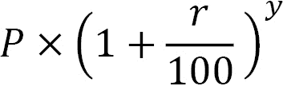
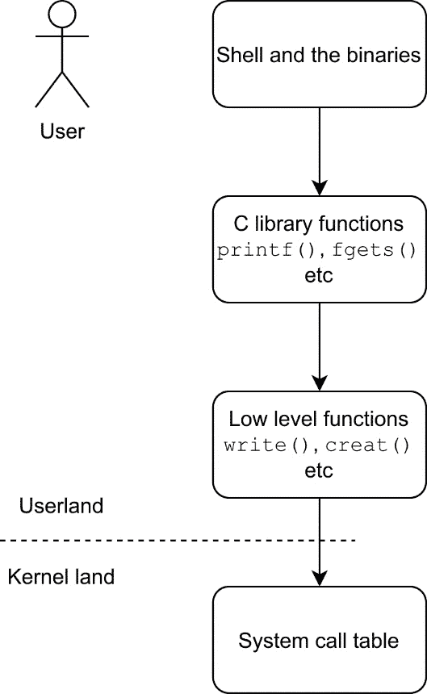

# 第三章：深入学习 Linux 中的 C

现在是时候深入了解 Linux 中的 C 编程了。在这里，我们将更多地了解编译器，从源代码到二进制程序的四个阶段，如何使用 Make 工具，以及系统调用和标准库函数之间的区别。我们还将看一些关于 Linux 的基本头文件，并查看一些 C 和便携操作系统接口（POSIX）标准。C 与 Linux 紧密集成，掌握 C 将帮助您了解 Linux。

在本章中，我们将为 Linux 开发程序和库。我们还将编写一个通用的 Makefile 和更复杂的 Makefile，用于更大的项目。在这样做的同时，我们还将了解不同的 C 标准，它们为什么重要，以及它们如何影响您的程序。

本章将涵盖以下示例：

+   使用 GNU 编译器集合（GCC）链接库

+   更改 C 标准

+   使用系统调用

+   何时使用它们，何时不使用它们

+   获取有关 Linux 和 Unix 特定头文件的信息

+   定义特性测试宏

+   查看编译的四个阶段

+   使用 Make 进行编译

+   使用 GCC 选项编写通用 Makefile

+   编写一个简单的 Makefile

+   编写一个更高级的 Makefile

# 技术要求

在本章中，您将需要 Make 工具和 GCC 编译器，最好是通过*第一章*中提到的元包或组安装来安装。

本章的所有源代码都可以在[`github.com/PacktPublishing/Linux-System-Programming-Techniques/tree/master/ch3`](https://github.com/PacktPublishing/Linux-System-Programming-Techniques/tree/master/ch3)上找到。

查看以下链接以查看“代码实战”视频：[`bit.ly/3sElIvu`](https://bit.ly/3sElIvu)

# 使用 GCC 链接库

在这个示例中，我们将学习如何将程序链接到外部库，包括系统范围内安装的库和位于我们家目录中的库。然而，在我们可以链接到库之前，我们需要创建它。这也是我们将在这个示例中涵盖的内容。了解如何链接到库将使您能够使用各种各样的现成函数。您可以使用已经可用的库，而不是自己编写所有内容。通常情况下，没有必要重新发明轮子，从而节省大量时间。

## 准备工作

对于本示例，您只需要本章的*技术要求*部分中列出的内容。

## 如何做…

在这里，我们将学习如何链接到系统上安装的共享库和家目录中的库。我们将从系统上已有的库开始：数学库。

### 链接到数学库

在这里，我们将制作一个小程序，用于计算银行账户上的复利。为此，我们需要数学库中包含的`pow()`函数。

1.  编写以下代码，并将其保存在名为`interest.c`的文件中。请注意，我们在顶部包含了`math.h`。`pow()`函数的第一个参数是底数；第二个参数是指数：

```
#include <stdio.h>
#include <math.h>
int main(void)
{
    int years = 15; /* The number of years you will 
                     * keep the money in the bank 
                     * account */
    int savings = 99000; /* The inital amount */
    float interest = 1.5; /* The interest in % */
    printf("The total savings after %d years " 
        "is %.2f\n", years, 
        savings * pow(1+(interest/100), years));
    return 0;
}
```

1.  现在，编译和`-l`，库的名称是`m`（有关更多信息，请参阅`man 3 pow`手册页）：

```
$> gcc -lm interest.c -o interest
```

1.  最后，让我们尝试一下程序：

```
$> ./interest
The total savings after 15 years is 123772.95
```

### 创建我们自己的库

在这里，我们将创建我们自己的共享库。在本示例的下一部分中，我们将将程序链接到此库。我们在这里创建的库用于查找一个数字是否是质数。

1.  让我们从创建一个简单的头文件开始。这个文件只包含一行内容——函数原型。在文件中写入以下内容，并将其命名为`prime.h`：

```
int isprime(long int number);
```

1.  现在，是时候编写实际的函数，该函数将被包含在库中。在文件中写入以下代码，并将其保存为`primc.c`：

```
int isprime(long int number)
{
   long int j;
   int prime = 1;

   /* Test if the number is divisible, starting 
    * from 2 */
   for(j=2; j<number; j++)
   {
      /* Use the modulo operator to test if the 
       * number is evenly divisible, i.e., a 
       * prime number */
      if(number%j == 0)
      {
         prime = 0;
      }
   }
   if(prime == 1)
   {
      return 1;
   }
   else
   {
      return 0;
   }
}
```

1.  我们需要以某种方式将其转换为库。第一步是将其编译为一个称为对象文件的东西。我们还需要解析一些额外的参数给编译器，使其在库中工作。更具体地说，我们需要使它成为`prime.o`，我们将在`ls -l`命令中看到。我们将在本章后面学习更多关于对象文件的知识：

```
$> gcc -Wall -Wextra -pedantic -fPIC -c prime.c
$> ls -l prime.o 
-rw-r--r-- 1 jake jake 1296 nov 28 19:18 prime.o
```

1.  现在，我们必须将对象文件打包成一个库。在下面的命令中，`-shared`选项就是它听起来的样子：它创建了一个`-Wl,-soname,libprime.so`选项是为了链接器。这告诉链接器共享库的名称（`soname`）将是`libprime.so`。`-o`选项指定输出文件名，即`libprime.so`。这是`so`结尾的标准命名约定代表*shared object*。当库要在系统范围内使用时，通常会添加一个数字来表示版本。在命令的最后，我们有`prime.o`对象文件，它包含在这个库中：

```
$> gcc -shared -Wl,-soname,libprime.so -o \
> libprime.so prime.o
```

### 链接到主目录中的库

有时，您可能有一个共享库，您希望链接到您的主目录（或其他目录）。也许它是您从互联网上下载的库，或者是您自己构建的库，就像在这种情况下一样。我们将在本书的后面章节中了解更多关于制作自己的库的知识。在这里，我们使用我们刚刚制作的小样本库，名为`libprime.so`。

1.  将以下源代码写入文件并命名为`is-it-a-prime.c`。这个程序将使用我们刚刚下载的库。我们还必须包含我们创建的头文件`prime.h`。注意包含本地头文件（而不是系统范围的头文件）的不同语法：

```
#include <stdio.h>
#include <stdlib.h>
#include <string.h>
#include "prime.h"
int main(int argc, char *argv[])
{
   long int num;
   /* Only one argument is accepted */
   if (argc != 2)
   {
      fprintf(stderr, "Usage: %s number\n", 
         argv[0]);
      return 1;
   }
   /* Only numbers 0-9 are accepted */
   if ( strspn(argv[1], "0123456789") != 
      strlen(argv[1]) )
   {
      fprintf(stderr, "Only numeric values are "
         "accepted\n");
      return 1;
   }
   num = atol(argv[1]); /* String to long */
   if (isprime(num)) /* Check if num is a prime */
   {
      printf("%ld is a prime\n", num);
   }
   else
   {
      printf("%ld is not a prime\n", num);
   }

   return 0;
}
```

1.  现在，编译并将其链接到`libprime.so`。由于库位于我们的主目录中，我们需要指定路径：

```
$> gcc -L${PWD} -lprime is-it-a-prime.c \
> -o is-it-a-prime
```

1.  在运行程序之前，我们需要将`$LD_LIBRARY_PATH` **环境变量**设置为我们当前的目录（库所在的位置）。这样做的原因是，该库是动态链接的，不在通常的系统库路径上：

```
$> export LD_LIBRARY_PATH=${PWD}:${LD_LIBRARY_PATH}
```

1.  现在，我们终于可以运行程序了。用一些不同的数字测试它，看看它们是不是质数：

```
ldd program. If we examine the is-it-a-prime program, we'll see that it depends upon our libprime.so library. There are also other dependencies, such as libc.so.6, which is the standard C library:

```

$> ldd is-it-a-prime

linux-vdso.so.1 (0x00007ffc3c9f2000)

libprime.so => /home/jake/libprime.so (0x00007fd8b1e48000)

libc.so.6 => /lib/x86_64-linux-gnu/libc.so.6 (0x00007fd8b1c4c000)

/lib64/ld-linux-x86-64.so.2 (0x00007fd8b1e54000)

```

```

## 它是如何工作的…

我们在*链接到数学库*部分中使用的`pow()`函数需要我们链接到数学库`libm.so`。您可以在系统的库位置之一找到此文件，通常在`/usr/lib`或`/usr/lib64`中。在 Debian 和 Ubuntu 上，它通常是`/usr/lib/x86_64-linux-gnu`（对于 64 位系统）。由于文件位于系统的默认库位置，我们只需使用`-l`选项即可包含它。库文件的完整名称是`libm.so`，但是当我们指定要链接的库时，我们只指定`m`部分（也就是说，我们去掉`lib`部分和`.so`扩展名）。`-l`和`m`部分之间不应该有空格，因此要链接到它，我们输入`-lm`。

我们需要链接到库以使用`pow()`函数的原因是，数学库与标准 C 库`libc.so`是分开的。我们之前使用的所有函数都是*标准库*的一部分，这是`libc.so`文件。这个库默认被链接，所以不需要指定它。如果我们真的想在编译时指定链接到`libc.so`，我们可以使用`gcc -lc some-program.c -o some-program`。

`pow()`函数接受两个参数，*x*和*y*，如`pow(x,y)`。然后函数返回*x*的*y*次方的值。例如，`pow(2,8)`将返回 256。返回的值是**双精度浮点数**，*x*和*y*都是双精度浮点数。

计算复利的公式如下所示：



在这里，*P*是您放入账户的起始资本，*r*是百分比利率，*y*是资金应该在账户中保持不变的年数。

### 链接到主目录中的库

在`is-it-a-prime.c`的 C 程序中，我们需要包含`prime.h`头文件。头文件只包含一行：`isprime()`函数的函数原型。实际的`isprime()`函数包含在我们从`prime.c`创建的`prime.o`中，我们从`prime.o`创建的`libprime.so`库中。`.so`文件是一个**共享库**或**共享对象文件**。共享库包含函数的已编译对象文件。我们将在本章后面介绍对象文件是什么。

当我们想要链接到一个我们下载或自己创建的库，而该库未安装在系统默认的库位置时，事情就会变得有点复杂。

首先，我们需要指定库的名称和库所在的路径。路径是用`-L`选项指定的。在这里，我们将路径设置为我们创建库的当前目录。`${PWD}`是一个 shell 环境变量，它包含当前目录的完整路径。您可以使用`echo ${PWD}`来尝试它。

但是，为了能够运行程序，我们需要设置一个名为`$LD_LIBRARY_PATH`的环境变量到我们的当前目录（以及它已经包含的内容）。这样做的原因是程序是`$LD_LIBRARY_PATH`。我们也不想覆盖`$LD_LIBRARY_PATH`变量中已经存在的内容；这就是为什么我们还包括了该变量的内容。如果我们没有设置这个环境变量，当执行程序时会收到一个错误消息，说“*error while loading shared libraries: libprime.so*”。当我们用`ldd`列出依赖项时，我们看到`libprime.so`位于主目录中，而不是系统的库位置。

## 还有更多…

如果您对标准 C 库感兴趣，可以阅读`man libc`。要了解有关`pow()`函数的更多信息，可以阅读`man 3 pow`。

我还鼓励您阅读`man ldd`的手册页。还可以使用`ldd`检查一些程序的依赖项，例如我们在本示例中编写的`interest`程序。在这样做时，您将看到`libm.so`及其在系统中的位置。您还可以尝试在系统二进制文件上使用`ldd`，例如`/bin/ls`。

# 更改 C 标准

在这个示例中，我们将学习和探索不同的**C 标准**，它们是什么，为什么它们很重要，以及它们如何影响我们的程序。我们还将学习如何在**编译**时设置 C 标准。

今天最常用的 C 标准是**C89**、**C99**和**C11**（C89 代表 1989 年，C11 代表 2011 年，依此类推）。许多编译器仍然默认使用 C89，因为它是最兼容、最广泛和最完整的实现。然而，C99 是一种更灵活和现代的实现。通常，在较新版本的 Linux 下，默认是**C18**，还有一些 POSIX 标准。

我们将编写两个程序，并用 C89 和 C99 编译它们，看看它们的区别。

## 准备工作

您需要的只是一台安装了 GCC 的 Linux 计算机，最好是通过*第一章*中描述的元包或软件包组来安装。

## 如何做…

跟着来探索 C 标准之间的差异。

1.  编写这里显示的小型 C 程序，并将其保存为`no-return.c`。注意缺少`return`语句：

```
#include <stdio.h>
int main(void)
{
    printf("Hello, world\n");
}
```

1.  现在，使用 C89 标准编译它：

```
$> gcc -std=c89 no-return.c -o no-return
```

1.  运行程序并检查退出代码：

```
$> ./no-return 
Hello, world
$> echo $?
13
```

1.  现在，使用相同的 C 标准重新编译程序，但启用*所有警告*、*额外警告*和*严格检查*（`-W`是警告的选项，`all`是哪些警告，因此是`-Wall`）。注意我们从 GCC 得到的错误消息：

```
$> gcc -Wall -Wextra -pedantic -std=c89 \
> no-return.c -o no-return
no-return.c: In function 'main':
no-return.c:6:1: warning: control reaches end of non-void function [-Wreturn-type]
 }
 ^
```

1.  现在，重新使用 C99 标准编译程序，并启用所有警告和严格检查。这次不应该显示错误：

```
$> gcc -Wall -Wextra -pedantic -std=c99 \
> no-return.c -o no-return
```

1.  重新运行程序并检查退出代码。注意区别：

```
$> ./no-return 
Hello, world
$> echo $?
0
```

1.  编写以下程序并将其命名为`for-test.c`。该程序在`for`循环内部创建了一个`i`整数变量。这只在 C99 中允许：

```
#include <stdio.h>
int main(void)
{
    for (int i = 10; i>0; i--)
    {
        printf("%d\n", i);
    }
    return 0;
}
```

1.  使用 C99 标准编译它：

```
$> gcc -std=c99 for-test.c -o for-test
```

1.  然后运行它。一切应该正常工作：

```
$> ./for-test 
10
9
8
7
6
5
4
3
2
1
```

1.  现在，尝试使用 C89 标准编译它。请注意，错误消息清楚地解释了这只适用于 C99 或更高版本。GCC 的错误消息很有用，所以一定要确保阅读它们。它们可以节省您很多时间：

```
$> gcc -std=c89 for-test.c -o for-test
for-test.c: In function 'main':
for-test.c:5:5: error: 'for' loop initial declarations are only allowed in C99 or C11 mode
     for (int i = 10; i>0; i--)
     ^~~
```

1.  现在，编写以下小程序并将其命名为`comments.c`。在这个程序中，我们使用 C99 注释（也称为 C++注释）：

```
#include <stdio.h>
int main(void)
{
    // A C99 comment
    printf("hello, world\n");
    return 0;
}
```

1.  使用 C99 编译它：

```
$> gcc -std=c99 comments.c -o comments
```

1.  现在，尝试使用 C89 编译它。请注意，这个错误消息也很有帮助：

```
$> gcc -std=c89 comments.c -o comments
comments.c: In function 'main':
comments.c:5:5: error: C++ style comments are not allowed in ISO C90
     // A C99 comment
     ^
comments.c:5:5: error: (this will be reported only once per input file)
```

## 工作原理…

这些是 C89 和 C99 之间一些更常见的差异。在 Linux 使用 GCC 时，还有其他一些差异是不明显的。我们将在本示例的*还有更多…*部分讨论一些看不见的差异。

我们使用 GCC 的`-std`选项来改变 C 标准。在这个示例中，我们尝试了两种标准，C89 和 C99。

在*步骤 1-6*中，我们看到了当我们忘记返回值时会发生什么的区别。在 C99 中，假定返回值为 0，因为没有指定其他值。另一方面，在 C89 中，忘记返回值是不可以的。程序仍然会编译，但程序将返回值 13（错误代码），这是错误的，因为我们的程序没有发生错误。实际返回的代码可能会有所不同，但它总是大于 0。当我们启用*所有警告*、*额外警告*和*严格*检查代码（`-Wall -Wextra -pedantic`）时，我们还看到编译器发出了警告消息，这意味着忘记返回值是不合法的。因此，在 C89 中，始终使用`return`返回一个值。

然后，在*步骤 7-10*中，我们看到在 C99 中，在`for`循环内部声明一个新变量是可以的，而在 C89 中是不可以的。

在*步骤 11-13*中，我们看到了一种使用注释的新方法，即两条斜杠`//`。这在 C89 中是不合法的。

## 还有更多…

C89 和 C99 之外还有更多的 C 标准和方言。还有*C11*、*GNU99*（GNU 的 C99 方言）、*GNU11*（GNU 的 C11 方言）等等，但今天最常用的是 C89、C99 和 C11。C18 正在成为一些编译器和发行版的默认标准。

实际上，C89 和 C99 之间的差异比我们在这里看到的要多。在 Linux 中使用 GCC，一些差异无法演示，因为 GCC 已经为这些差异实施了解决方法。其他一些编译器也是如此。但是在 C89 中，例如，`long long int`类型没有被指定；它是在 C99 中指定的。但尽管如此，一些编译器（包括 GCC）在 C89 中支持`long long int`，但在 C89 中使用它时应该小心，因为并非所有编译器都支持它。如果要使用`long long int`，最好使用 C99、C11 或 C18。

我建议您始终使用`-Wall`、`-Wextra`和`-pedantic`选项编译您的程序。这些选项将警告您各种可能被忽略的问题。

# 使用系统调用-以及何时不使用它们

`printf()`、`fgets()`、`putc()`等。在它们下面，最低级别是系统调用，比如`creat()`、`write()`等：



图 3.1-高级函数和低级函数

当我在这本书中谈论系统调用时，我指的是内核提供的 C 函数，而不是实际的系统调用表。我们在这里使用的系统调用函数驻留在**用户空间**，但函数本身在**内核空间**中执行。

许多标准的 C 库函数，比如`putc()`，在幕后使用一个或多个系统调用函数。`putc()`函数是一个很好的例子；它使用`write()`在屏幕上打印一个字符（这是一个系统调用）。还有一些标准的 C 库函数根本不使用任何系统调用，比如`atoi()`，它完全驻留在用户空间。没有必要涉及内核来将字符串转换为数字。

一般来说，如果有标准的 C 库函数可用，我们应该使用它，而不是系统调用。系统调用通常更难处理，更原始。将系统调用视为*低级*操作，将标准 C 函数视为*高级*操作。

然而，有些情况下，我们需要使用系统调用，或者它们更容易使用或更有益。学会何时以及为什么使用系统调用将使你成为一个更好的系统程序员。例如，在 Linux 上，我们可以通过系统调用执行许多文件系统操作，而这些操作在其他地方是不可用的。另一个需要使用系统调用的例子是当我们想要`fork()`一个进程时，这是我们稍后将更详细讨论的事情。换句话说，当我们需要执行某种形式的*系统操作*时，我们需要使用系统调用。

## 准备工作

在这个示例中，我们将使用一个特定于 Linux 的系统调用，所以你需要一台 Linux 计算机（你很可能已经有了，因为你正在阅读这本书）。但请注意，`sysinfo()`系统调用在 FreeBSD 或 macOS 下不起作用。

## 操作步骤：

实际上，在使用标准 C 库函数和使用系统调用函数之间并没有太大的区别。Linux 中的系统调用在`unistd.h`中声明，因此在使用系统调用时需要包含这个文件。

1.  编写以下小程序，并将其命名为`sys-write.c`。它使用`write()`系统调用。请注意，我们这里没有包含`stdio.h`。因为我们没有使用任何`printf()`函数或任何 stdin、stdout 或 stderr 文件流，所以我们这里不需要`stdio.h`。我们直接打印到文件描述符 1，这是标准输出。三个标准文件描述符总是打开的：

```
#include <unistd.h>
int main(void)
{
    write(1, "hello, world\n", 13);
    return 0;
}
```

1.  编译它。从现在开始，我们将始终包括`-Wall`，`-Wextra`和`-pedantic`来编写更清洁、更好的代码：

```
$> gcc -Wall -Wextra -pedantic -std=c99 \
> sys-write.c -o sys-write
```

1.  运行程序：

```
$> ./sys-write 
hello, world
```

1.  现在，编写相同的程序，但使用`fputs()`函数——一个更高级的函数。请注意，我们在这里包含了`stdio.h`，而不是`unistd.h`。将程序命名为`write-chars.c`：

```
#include <stdio.h>
int main(void)
{
    fputs("hello, world\n", stdout);
    return 0;
}
```

1.  编译它：

```
$> gcc -Wall -Wextra -pedantic -std=c99 \
> write-chars.c -o write-chars
```

1.  然后运行它：

```
$> ./write-chars 
hello, world
```

1.  现在是时候编写一个程序，读取一些用户和系统信息。将程序保存为`my-sys.c`。程序中的所有系统调用都已经突出显示。这个程序获取你的用户 ID、当前工作目录、机器的总和空闲的**随机存取内存**（**RAM**），以及当前的**进程 ID**（**PID**）：

```
#include <stdio.h>
#include <unistd.h>
#include <sys/types.h>
#include <sys/sysinfo.h>
int main(void)
{
   char cwd[100] = { 0 }; /* for current dir */
   struct sysinfo si; /* for system information */
   getcwd(cwd, 100); /* get current working dir */
   sysinfo(&si); /* get system information 
                  * (linux only) */

   printf("Your user ID is %d\n", getuid());
   printf("Your effective user ID is %d\n", 
      geteuid());
   printf("Your current working directory is %s\n", 
      cwd);
   printf("Your machine has %ld megabytes of " 
      "total RAM\n", si.totalram / 1024  / 1024);
   printf("Your machine has %ld megabytes of "
      "free RAM\n", si.freeram / 1024 / 1024);
   printf("Currently, there are %d processes "
      "running\n", si.procs);
   printf("This process ID is %d\n", getpid());
   printf("The parent process ID is %d\n", 
      getppid());
   return 0;
}
```

1.  编译程序：

```
$> gcc -Wall -Wextra -pedantic -std=c99 my-sys.c -o \
> my-sys
```

1.  然后运行程序。现在你应该能看到有关你的用户和你正在使用的机器的一些信息：

```
$> ./my-sys 
Your user ID is 1000
Your effective user ID is 1000
Your current working directory is /mnt/localnas_disk2/linux-sys/ch3/code
Your machine has 31033 megabytes of total RAM
Your machine has 6117 megabytes of free RAM
Currently, there are 2496 processes running
This process ID is 30421
The parent process ID is 11101
```

## 它是如何工作的…

在*步骤 1-6*中，我们探讨了`write()`和`fputs()`之间的区别。区别可能并不那么明显，但`write()`这个系统调用使用了`printf()`。

在*步骤 7-9*中，我们编写了一个获取一些系统和用户信息的程序。在这里，我们包含了三个特定于系统调用的头文件：`unistd.h`，`sys/types.h`和`sys/sysinfo.h`。

我们已经看到了`unistd.h`，这是 Unix 和 Linux 系统中系统调用的一个常见头文件。`sys/types.h`头文件是另一个常见的系统调用头文件，特别是在从系统获取值时。这个头文件包含特殊的变量类型；例如，`uid_t`和`gid_t`用于`int`。其他的是`ino_t`用于`pid_t`用于 PIDs，等等。

`sys/sysinfo.h` 头文件专门用于 `sysinfo()` 函数，这是一个专门为 Linux 设计的系统调用，因此在其他类 Unix 系统（如 macOS、Solaris 或 FreeBSD/OpenBSD/NetBSD）下不起作用。这个头文件声明了 `sysinfo` 结构，我们通过调用 `sysinfo()` 函数来填充它的信息。

我们在程序中使用的第一个系统调用是 `getcwd()`，用于获取当前工作目录。该函数有两个参数：一个缓冲区，用于保存路径，以及该缓冲区的长度。

下一个系统调用是特定于 Linux 的 `sysinfo()` 函数。这个函数给了我们很多信息。当函数执行时，所有数据都保存在结构 `sysinfo` 中。这些信息包括 `man 2 sysinfo` 中，您可以找到关于结构 `sysinfo` 中变量和它们的数据类型的信息。在代码的后面，我们使用 `printf()` 打印了其中一些值，例如 `si.totalram`，它包含了系统内存的大小。

其余的系统调用直接从 `printf()` 中调用，并返回整数值。

## 还有更多…

手册中有关 Linux 系统调用的详细信息。一个很好的起点是 `man 2 intro` 和 `man 2 syscalls`。

提示

大多数系统调用在发生错误时会返回 -1。通常最好检查这个值以检测错误。

# 获取关于 Linux 和 Unix 特定头文件的信息

有很多特定的函数和 `sysinfo()`。在前面的示例中，我们已经看到了两个 POSIX 文件：`unistd.h` 和 `sys/types.h`。由于它们是 POSIX 文件，它们在所有类 Unix 系统（如 Linux、FreeBSD、OpenBSD、macOS 和 Solaris）中都可用。

在这个示例中，我们将学习更多关于这些 POSIX 头文件的知识，它们的作用，以及何时以及如何使用它们。我们还将学习如何在手册页中查找有关这些文件的信息。

## 准备工作

在这个示例中，我们将在手册中查找头文件。如果您使用的是基于 Fedora 的系统，如 `dnf install man-pages` 作为 root 用户，或者使用 `sudo`。

另一方面，如果您使用的是基于 Debian 的系统，如 **Ubuntu** 或 **Debian**，您需要先安装这些手册页。按照这里的说明安装此示例所需的手册页。

### Debian

Debian 对不包括非自由软件更严格，因此我们需要采取一些额外的步骤。

1.  以 root 身份在编辑器中打开 `/etc/apt/sources.list`。

1.  在这些行的末尾（`main` 之后，用一个空格隔开），在它们后面加上单词 `non-free`。

1.  保存文件。

1.  以 root 身份运行 `apt update`。

1.  以 root 用户身份运行 `apt install manpages-posix-dev` 安装手册页。

### Ubuntu

基于 Ubuntu 和其他基于 Ubuntu 的发行版对非自由软件不那么严格，因此我们可以立即安装正确的软件包。

只需运行 `sudo apt install manpages-posix-dev`。

## 如何做…

有许多头文件需要涵盖，因此更重要的是学习如何知道我们应该使用哪些头文件，以及如何找到有关它们的信息，阅读它们的手册页，并知道如何列出它们。我们将在这里涵盖所有这些内容。

在前面的示例中，我们使用了 `sysinfo()` 和 `getpid()` 函数。在这里，我们将学习如何找到与这些系统调用和所需的头文件相关的每一个可能的信息。

1.  首先，我们从阅读 `sysinfo()` 的手册页开始：

```
$> man 2 sysinfo
```

在 **SYNOPSIS** 标题下，我们找到了以下两行：

```
#include <sys/sysinfo.h>
int sysinfo(struct sysinfo *info);
```

1.  这些信息意味着我们需要包含 `sys/sysinfo.h` 来使用 `sysinfo()`。它还显示该函数以一个名为 `sysinfo` 的结构作为参数。`sysinfo` 结构是什么样子呢？

1.  现在，让我们查找 `getpid()`。这是一个 POSIX 函数，因此有更多的信息可用：

```
sys/types.h and unistd.h. We also see that the function returns a value of type pid_t.
```

1.  让我们继续调查。打开 `sys/types.h` 的手册页：

```
pid_t data type is used for *process IDs* and *process group IDs*, but that doesn't tell us what kind of data type it actually is. So, let's continue to scroll down until we find a subheading saying blksize_t, pid_t, and ssize_t shall be signed integer types." Mission accomplished—now, we know that it's a signed integer type and that we can use the %d formatting operator to print it.
```

1.  但让我们进一步调查。让我们阅读 `unistd.h` 的手册页：

```
$> man unistd.h
```

1.  现在，在这个手册页中搜索`pid_t`这个词，我们会找到更多关于它的信息。

输入`/`字符，然后输入`pid_t`，按*Enter*进行搜索。在键盘上按下字母*n*以搜索单词的下一个出现位置。您会发现其他函数也返回`pid_t`类型，例如`fork()`、`getpgrp()`和`getsid()`等。

1.  当您阅读`unistd.h`的手册页时，您还可以看到在此头文件中声明的所有函数。如果找不到，请搜索`Declarations`。按下*/*，输入`Declarations`，然后按*Enter*。

## 工作原理…

手册页在*7posix*或*0p*特殊部分中，取决于您的 Linux 发行版，来自一个称为*POSIX 程序员手册*的东西。例如，如果您打开`man unistd.h`，您会看到*POSIX 程序员手册*，而不是`man 2 write`，它说*Linux 程序员手册*。*POSIX 程序员手册*来自**电气和电子工程师学会**（**IEEE**）和**开放组织**，而不是**GNU 项目**或 Linux 社区。

由于*POSIX 程序员手册*不是免费的（开源的），Debian 选择不将其包含在其主要存储库中。这就是为什么我们需要将非自由存储库添加到 Debian 中。

POSIX 是由 IEEE 指定的一组标准。标准的目的是在所有 POSIX 操作系统（大多数 Unix 和类 Unix 系统）之间具有一个共同的编程接口。如果您的程序只使用 POSIX 函数和 POSIX 头文件，它将与所有其他 Unix 和类 Unix 系统兼容。实际的实现可能因系统而异，但总体功能应该是相同的。

有时，当我们需要一些特定的信息（比如`pid_t`是哪种类型），我们需要阅读多个手册页，就像在这个示例中所做的那样。

这里的主要要点是使用函数的手册页来查找相应的头文件，然后使用头文件的手册页来查找更具体的信息。

## 还有更多…

POSIX 头文件的手册页位于手册页的特殊部分中，不在`man man`中列出。在 Fedora 和 CentOS 下，该部分称为*0p*，在 Debian 和 Ubuntu 下，称为*7posix*。

提示

可以使用`apropos`命令加上一个点（点表示匹配所有）来列出特定部分中所有可用的手册页。

例如，要列出*Section 2*中的所有手册页，输入`apropos -s 2.`（包括点号—它是命令的一部分）。要列出 Ubuntu 下*7posix*特殊部分中的所有手册页，输入`apropos -s 7posix.`。

# 定义特性测试宏

在这个示例中，我们将学习一些常见的 POSIX 标准，以及如何以及为什么使用它们，以及如何使用**特性测试宏**来指定它们。

我们已经看到了几个例子，当我们包含了 POSIX 标准或一些特定的 C 标准时。例如，当我们使用`getopt()`时，我们在源代码文件的顶部定义了`_XOPEN_SOURCE 500`（来自*第二章*，*使您的程序易于脚本化*）。

特性测试宏控制了系统头文件中暴露的定义。我们可以以两种方式利用它。一种是通过使用特性测试宏来创建可移植的应用程序，从而防止我们使用非标准定义，另一种是相反，允许我们使用非标准定义。

## 准备工作

在这个配方中，我们将编写两个小程序，`str-posix.c`和`which-c.c`。您可以从[`github.com/PacktPublishing/Linux-System-Programming-Techniques/tree/master/ch3`](https://github.com/PacktPublishing/Linux-System-Programming-Techniques/tree/master/ch3)下载它们，或者跟着编写它们。您还需要我们在*第一章*中安装的 GCC 编译器。还有一个好主意是要有访问所有手册页的权限，包括上一个配方中涵盖的*POSIX 程序员手册*中的手册页。

## 如何做…

在这里，我们将探索特性测试宏、POSIX 和 C 标准以及其他相关事物的内部工作的黑暗角落。

1.  编写以下代码并将其保存在名为`str-posix.c`的文件中。该程序将简单地使用`strdup()`复制一个字符串，然后打印它。请注意，我们在这里包括`string.h`：

```
#include <string.h>
#include <stdio.h>
int main(void)
{
    char a[] = "Hello";
    char *b;
    b = strdup(a);
    printf("b = %s\n", b);
    return 0;
}
```

1.  现在，我们开始使用 C99 标准编译它，看看会发生什么。将打印出多个错误消息：

```
$> gcc -Wall -Wextra -pedantic -std=c99 \
> str-posix.c -o str-posix
str-posix.c: In function 'main':
str-posix.c:8:9: warning: implicit declaration of function 'strdup'; did you mean 'strcmp'? [-Wimplicit-function-declaration]
     b = strdup(a);
         ^~~~~~
         strcmp
str-posix.c:8:7: warning: assignment to 'char *' from 'int' makes pointer from integer without a cast [-Wint-conversion]
     b = strdup(a);
```

1.  这产生了一个相当严重的警告。尽管编译成功了。如果我们尝试在一些发行版上运行程序，它会失败，但在其他发行版上不会。这就是所谓的**未定义行为**：

```
$> ./str-posix 
Segmentation fault
```

在另一个 Linux 发行版上，我们可能会看到以下内容：

```
$> ./str-posix
b = Hello
```

1.  现在是迷人的——有些令人困惑的——部分。这个程序有时会崩溃的原因有一个，但是有几种可能的解决方案。我们将在这里涵盖它们。但首先，它失败的原因是`strdup()`不是 C99 的一部分（我们将在*它是如何工作的…*部分解释为什么它有时会工作）。最直接的解决方案是查看手册页，手册页清楚地说明我们需要将`_XOPEN_SOURCE`特性测试宏设置为`500`或更高。为了这个实验，让我们将其设置为`700`（稍后我会解释为什么）。在`str-posix.c`的最顶部添加以下行。它需要在任何`include`语句之前的第一行；否则，它将不起作用：

```
#define _XOPEN_SOURCE 700
```

1.  现在您已经添加了前面的行，让我们尝试重新编译程序：

```
$> gcc -Wall -Wextra -pedantic -std=c99 \
> str-posix.c -o str-posix
```

1.  这次没有警告，所以让我们运行程序：

```
$> ./str-posix 
b = Hello
```

1.  所以，这是可能的解决方案之一，也是最明显的解决方案。现在，再次删除第一行（整个`#define`行）。

1.  一旦您删除了`#define`行，我们将重新编译程序，但这次我们在命令行上设置特性测试宏。我们使用 GCC 中的`-D`标志来实现这一点：

```
$> gcc -Wall -Wextra -pedantic -std=c99 \
> -D_XOPEN_SOURCE=700 str-posix.c -o str-posix
```

1.  让我们尝试运行它：

```
$> ./str-posix 
b = Hello
```

1.  这是第二种解决方案。但是，如果我们阅读特性测试宏的手册页`man feature_test_macros`，我们会发现`_XOPEN_SOURCE`的值为 700 或更高时具有与将`_POSIX_C_SOURCE`的值定义为 200809L 或更高相同的效果。因此，让我们尝试使用`_POSIX_C_SOURCE`重新编译程序：

```
$> gcc -Wall -Wextra -pedantic -std=c99 \
> -D_POSIX_C_SOURCE=200809L str-posix.c -o str-posix
```

1.  这样做得很好。现在，进行最终的——可能危险的——解决方案。这一次，我们将重新编译程序，而不设置任何 C 标准或任何特性测试宏：

```
$> gcc -Wall -Wextra -pedantic str-posix.c \ 
> -o str-posix
```

1.  没有警告，所以让我们尝试运行它：

```
$> ./str-posix 
b = Hello
```

1.  当我们刚刚定义了所有这些宏和标准时，它怎么可能会工作呢？嗯，事实证明，当我们不设置任何 C 标准或特性测试宏时，编译器会设置一些自己的标准。为了证明这一点，并了解您的编译器是如何工作的，让我们编写以下程序。将其命名为`which-c.c`。该程序将打印正在使用的 C 标准和任何常见定义的特性测试宏：

```
#include <stdio.h>
int main(void)
{
   #ifdef __STDC_VERSION__
      printf("Standard C version: %ld\n", 
         __STDC_VERSION__);
   #endif
   #ifdef _XOPEN_SOURCE
      printf("XOPEN_SOURCE: %d\n", 
         _XOPEN_SOURCE);
   #endif
   #ifdef _POSIX_C_SOURCE
      printf("POSIX_C_SOURCE: %ld\n", 
         _POSIX_C_SOURCE);
   #endif
   #ifdef _GNU_SOURCE
      printf("GNU_SOURCE: %d\n", 
         _GNU_SOURCE);
   #endif
   #ifdef _BSD_SOURCE
      printf("BSD_SOURCE: %d\n", _BSD_SOURCE);
   #endif
   #ifdef _DEFAULT_SOURCE
      printf("DEFAULT_SOURCE: %d\n", 
         _DEFAULT_SOURCE);
   #endif
   return 0;
}
```

1.  让我们编译并运行这个程序，而不设置任何 C 标准或特性测试宏：

```
$> gcc -Wall -Wextra -pedantic which-c.c -o which-c
$> ./which-c 
Standard C version: 201710
POSIX_C_SOURCE: 200809
DEFAULT_SOURCE: 1
```

1.  让我们尝试指定我们要使用 C 标准 C99，并重新编译`which.c`。这里会发生的是编译器将强制执行严格的 C 标准模式，并禁用它可能设置的默认特性测试宏：

```
$> gcc -Wall -Wextra -pedantic -std=c99 \
> which-c.c -o which-c
$> ./which-c 
Standard C version: 199901
```

1.  让我们看看当我们将`_XOPEN_SOURCE`设置为`600`时会发生什么：

```
$> gcc -Wall -Wextra -pedantic -std=c99 \
> -D_XOPEN_SOURCE=600 which-c.c -o which-c
$> ./which-c 
Standard C version: 199901
XOPEN_SOURCE: 600
POSIX_C_SOURCE: 200112
```

## 它是如何工作的…

在*步骤 1-10*中，我们看到了当我们使用不同的标准和特性测试宏时，我们的程序发生了什么。我们还注意到，即使没有指定任何 C 标准或特性测试宏，它也奇迹般地工作了。这是因为 GCC 和其他编译器会默认设置许多这些特性和标准。但我们不能依赖它。最安全的方式是自己指定；这样，我们就知道它会工作。

在*步骤 13*中，我们编写了一个程序来打印编译时使用的特性测试宏。为了防止编译器在没有设置特性测试宏时生成错误，我们将所有的`printf()`行包裹在`#ifdef`和`#endif`语句中。这些语句是编译器的`if`语句，而不是最终的程序。例如，让我们看下面这行：

```
#ifdef _XOPEN_SOURCE
```

```
    printf("XOPEN_SOURCE: %d\n", _XOPEN_SOURCE);
```

```
#endif
```

如果`_XOPEN_SOURCE`没有定义，那么`printf()`行就不会被包含；另一方面，如果定义了`_XOPEN_SOURCE`，它就会被包含。我们将在下一个步骤中介绍预处理是什么。

在*步骤 14*中，我们看到在我的系统上，编译器将`_POSIX_C_SOURCE`设置为`200809`。但手册中说我们应该将`_XOPEN_SOURCE`设置为`500`或更高。但它仍然有效——为什么呢？

如果我们阅读特性测试宏的手册页（`man feature_test_macros`），我们会发现大于`700`的`_XOPEN_SOURCE`的值具有与将`_POSIX_C_STANARD`设置为`200809`或更高相同的效果。而且由于 GCC 已经为我们设置了`_POSIX_C_STANDARD`为`200809`，这与`_XOPEN_SOURCE` `700`具有相同的影响。

在*步骤 15*中，我们了解到当我们指定一个标准时，比如`-std=c99`，编译器会强制执行严格的 C 标准。这就是为什么`str-posix.c`无法运行（并在编译过程中收到警告消息）。`strdup()`函数不是标准的 C 函数；它是一个 POSIX 函数。这就是为什么我们需要包含一些 POSIX 标准来使用它。当编译器使用严格的 C 标准时，不会启用其他特性。这使我们能够编写可在所有支持 C99 的 C 编译器的系统上运行的代码。

在*步骤 16*中，我们在编译程序时指定了`_XOPEN_SOURCE` `600`，这也将`_POSIX_C_STANDARD`设置为`200112`。我们可以在手册页（`man feature_test_macros`）中了解这一点。从手册中得知：“[当] _XOPEN_SOURCE 被定义为大于或等于 500 的值时，以下宏会被隐式定义，_POSIX_C_SOURCE[...]”。

那么特性宏到底是做什么的？它们如何修改代码？

系统的头文件中充满了`#ifdef`语句，根据设置的特性测试宏启用或禁用各种函数和特性。例如，在我们的情况下，对于`strdup()`，`string.h`头文件中将`strdup()`函数包裹在`#ifdef`语句中。这些语句检查是否定义了`_XOPEN_SOURCE`或其他一些 POSIX 标准。如果没有指定这些标准，那么`strdup()`就不可见。这就是特性测试宏的工作原理。

但是为什么在*步骤 3*中，程序在某些 Linux 发行版上以分段错误结束，而在其他发行版上却没有？如前所述，`strdup()`函数是存在的，但是没有特性测试宏，它就没有声明。那么会发生*未定义*的情况。它可能会因为某些特定的实现细节而工作，但也可能不工作。当我们编程时，应该始终避免*未定义的行为*。仅仅因为某些东西在这台特定的计算机上工作，在这个 Linux 发行版上，在这个编译器版本上，在这个特定的月夜上工作，这并不保证它会在别人的计算机上在其他的夜晚上工作。因此，我们应该始终努力编写正确的代码，遵循特定的标准。这样，我们就可以避免未定义的行为。

## 还有更多...

我们定义的所有这些特性测试宏都对应于某种 POSIX 或其他标准。这些标准背后的想法是在不同的 Unix 版本和类 Unix 系统之间创建统一的编程接口。

对于那些想深入了解标准和特性测试宏的人，有一些优秀的手册页面可供阅读。只是举几个例子：

+   `man 7 feature_test_macros`（在这里，您可以阅读有关哪些特性测试宏对应于哪些标准的所有信息，例如 POSIX、Single Unix 规范、XPG（X/Open 可移植性指南）等等。）

+   `man 7 standards`（有关标准的更多信息）

+   `man unistd.h`

+   `man 7 libc`

+   `man 7 posixoptions`

# 查看编译的四个阶段

当我们通常谈论编译时，我们指的是将代码转换为运行的二进制程序的整个过程。但实际上，在将源代码文件编译为运行的二进制程序时涉及四个步骤，而只有一个步骤被称为编译。

了解这四个步骤，以及如何提取中间文件，使我们能够从编写高效的 Makefile 到编写共享库等所有事情。

## 准备完成

对于这个示例，我们将编写三个小的 C 源代码文件。您也可以从[`github.com/PacktPublishing/Linux-System-Programming-Techniques/tree/master/ch3`](https://github.com/PacktPublishing/Linux-System-Programming-Techniques/tree/master/ch3)下载它们。您还需要我们在*第一章*中安装的 GCC 编译器，*获取必要的工具并编写我们的第一个 Linux 程序*。

## 如何做…

在这个示例中，我们将创建一个小程序，然后通过逐个执行每个步骤来手动编译它，使用编译器的标志。我们还将查看从每个步骤生成的文件。我们将编写的程序故意很小，以便我们可以在没有太多混乱的情况下查看生成的代码。我们将编写的程序将简单地返回一个立方数——在我们的例子中是 4 的立方。

1.  这个示例的第一个源代码文件是一个名为`cube-prog.c`的文件。这将是带有`main()`函数的源代码文件：

```
#include "cube.h"
#define NUMBER 4
int main(void)
{
    return cube(NUMBER);
}
```

1.  现在，我们在一个名为`cubed-func.c`的文件中编写`cube()`的函数：

```
int cube(int n)
{
    return n*n*n;
}
```

1.  最后，我们编写头文件`cube.h`。这只是函数原型：

```
int cube(int n);
```

1.  在我们逐步构建程序之前，我们首先像往常一样编译它，因为我们还没有涵盖如何编译由多个文件组成的程序。要编译由多个源文件组成的程序，我们只需在 GCC 命令行中列出它们。但是请注意，我们在这里不列出头文件。由于头文件包含了`#include`行，编译器已经知道它。

这就是我们如何编译一个由几个文件组成的程序：

```
$> gcc -Wall -Wextra -pedantic -std=c99 \
> cube-prog.c cube-func.c -o cube
```

1.  然后，让我们运行它，并检查返回值：

```
$> ./cube 
$> echo $?
64
```

1.  现在，我们开始逐步构建程序。首先，我们删除已经生成的二进制文件：

```
$> rm cube
```

1.  现在，让我们逐步开始编译程序。第一步是在程序本身中所谓的`#include`文件：

```
$> gcc -E -P cube-prog.c -o cube-prog.i
$> gcc -E -P cube-func.c -o cube-func.i
```

1.  现在，我们有两个*预处理*文件（`cube-prog.i`和`cube-func.i`）。让我们用`cat`或编辑器来看看它们。我已经在下面的代码片段中突出显示了更改。请注意`#include`语句已被替换为头文件中的代码，以及`NUMBER`宏已被替换为`4`。

首先，我们来看看`cube-prog.i`：

```
cube-func.i. Nothing has changed here:

```

int cube(int n)

{

return n*n*n;

}

```

```

1.  第二步是**编译**。在这里，我们的预处理文件被翻译成*汇编语言*。生成的汇编文件在不同的机器和架构上看起来会有所不同：

```
$> gcc -S cube-prog.i -o cube-prog.s
$> gcc -S cube-func.i -o cube-func.s
```

1.  让我们也看看这些文件，但请注意，这些文件在您的机器上可能会有所不同。

首先，我们来看看`cube-prog.s`：

```
	.file	"cube-prog.i"
	.text
	.globl	main
	.type	main, @function
main:
.LFB0:
	.cfi_startproc
	pushq	%rbp
	.cfi_def_cfa_offset 16
	.cfi_offset 6, -16
	movq	%rsp, %rbp
	.cfi_def_cfa_register 6
	movl	$4, %edi
	call	cube@PLT
	popq	%rbp
	.cfi_def_cfa 7, 8
	ret
	.cfi_endproc
.LFE0:
	.size	main, .-main
	.ident	"GCC: (Debian 8.3.0-6) 8.3.0"
	.section	.note.GNU-stack,"",@progbits
```

现在，我们来看看`cube-func.s`：

```
	.file	"cube-func.i"
	.text
	.globl	cube
	.type	cube, @function
cube:
.LFB0:
	.cfi_startproc
	pushq	%rbp
	.cfi_def_cfa_offset 16
	.cfi_offset 6, -16
	movq	%rsp, %rbp
	.cfi_def_cfa_register 6
	movl	%edi, -4(%rbp)
	movl	-4(%rbp), %eax
	imull	-4(%rbp), %eax
	imull	-4(%rbp), %eax
	popq	%rbp
	.cfi_def_cfa 7, 8
	ret
	.cfi_endproc
.LFE0:
	.size	cube, .-cube
	.ident	"GCC: (Debian 8.3.0-6) 8.3.0"
	.section	.note.GNU-stack,"",@progbits
```

1.  第三步称为**汇编**。这一步是将汇编源代码文件构建为所谓的**目标文件**的过程：

```
$> gcc -c cube-prog.s -o cube-prog.o
$> gcc -c cube-func.s -o cube-func.o
```

1.  现在，我们有两个目标文件。我们无法查看它们，因为它们是二进制文件，但我们可以使用`file`命令来查看它们是什么。这里的描述也可能因不同的架构而有所不同——例如，32 位 x86 机器，ARM64 等等：

```
$> file cube-prog.o cube-prog.o: ELF 64-bit LSB relocatable, x86-64, version 1 (SYSV), not stripped $> file cube-func.o cube-func.o: ELF 64-bit LSB relocatable, x86-64, version 1 (SYSV), not stripped
```

1.  现在，我们来到了第四个也是最后一个步骤。这是将所有目标文件合并成单个二进制文件的过程。这一步被称为**链接器**：

```
$> gcc cube-prog.o cube-func.o -o cube
```

1.  现在，我们有一个名为`cube`的准备好的二进制文件。让我们看看`file`对它的评价：

```
$> file cube
cube: ELF 64-bit LSB pie executable, x86-64, version 1 (SYSV), dynamically linked, interpreter /lib64/ld-linux-x86-64.so.2, for GNU/Linux 3.2.0, BuildID[sha1]=53054824b4a495b7941cbbc95b550e7670481943, not stripped
```

1.  最后，让我们运行它来验证它是否工作：

```
$> ./cube 
$> echo $?
64
```

## 它是如何工作的…

在*步骤 7*（过程中的第一步），我们使用了`-E`和`-P`选项来生成*预处理文件*。`-E`选项使 GCC 在预处理文件后停止——也就是说，创建预处理文件。`-P`选项是预处理器不在预处理文件中包含行标记的选项。我们需要干净的输出文件。

所有的`#include`语句都会在预处理文件中包含这些文件的内容。同样，任何宏—比如`NUMBERS`—都会被实际数字替换。预处理文件通常具有`.i`扩展名。

在*步骤 9*（过程中的第二步），我们编译了预处理文件。编译步骤创建了汇编语言文件。对于这一步，我们使用了`-S`选项，告诉 GCC 在编译过程完成后停止。汇编文件通常具有`.s`扩展名。

在*步骤 11*（过程中的第三步），我们*汇编*了文件。这一步也称为*汇编*阶段。这一步将汇编语言文件转换为*目标文件*。在本书的后面，当我们创建库时，我们将使用目标文件。`-c`选项告诉 GCC 在汇编阶段（或编译完成后）停止。目标文件通常具有`.o`扩展名。

然后，在*步骤 13*（过程中的第四个也是最后一个步骤），我们*链接*了文件，创建了一个可以执行的单个二进制文件。这一步不需要任何选项，因为 GCC 的默认操作是运行所有步骤，最后将文件链接到一个单个的二进制文件中。在我们链接文件之后，我们得到了一个名为`cube`的运行中的二进制文件：


图 3.2 - 编译的四个阶段

# 使用 Make 进行编译

我们已经看到了一些使用**Make**的示例。在这里，我们将回顾一下 Make 是什么，以及我们如何使用它来编译程序，这样我们就不必输入 GCC 命令了。

## 准备工作

对于这个步骤，你所需要的只是 GCC 编译器和 Make。如果你遵循*第一章*，*获取必要的工具并编写我们的第一个 Linux 程序*，那么你已经安装了这些工具。

## 操作步骤…

我们将编写一个小程序，用于计算给定半径的圆的周长。然后我们将使用 Make 工具来编译它。Make 工具足够智能，可以找出源代码文件的名称。

1.  编写以下代码，并将其保存为`circumference.c`。这个程序是建立在上一章的`mph-to-kph.c`代码的基础上的：

```
#include <stdio.h>
#include <stdlib.h>
#include <string.h>
#define PI 3.14159
int main(void)
{
   char radius[20] = { 0 };
   while(fgets(radius, sizeof(radius), stdin) 
      != NULL)
   {
      /* Check if radius is numeric 
       * (and do conversion) */
      if( strspn(radius,"0123456789.\n") == 
         strlen(radius) )
      {
         printf("%.5f\n", PI*(atof(radius)*2) );
      }
      /* If radius is NOT numeric, print error 
       * and return */
      else
      {
         fprintf(stderr, "Found non-numeric "
            "value\n");
         return 1;
      }
   }
   return 0;
}
```

1.  现在，让我们用 Make 来编译它：

```
$> make circumference
cc     circumference.c   -o circumference
```

1.  如果我们尝试重新编译它，它只会告诉我们程序是最新的：

```
$> make circumference
make: 'circumference' is up to date
```

1.  将`PI`宏的小数位数增加到 8 位，变为 3.14159265。代码中的第四行现在应该是这样的：

```
#define PI 3.14159265
```

在进行更改后保存文件。

1.  如果我们现在尝试重新编译程序，它会这样做，因为它注意到代码已经改变了：

```
$> make circumference
cc     circumference.c   -o circumference
```

1.  让我们试试这个程序：

```
$> ./circumference 
5
31.41593
10
62.83185
103.3
649.05304
*Ctrl*+*D*
```

## 它是如何工作的…

Make 工具是一个用于简化大型项目编译的工具，但即使对于像这样的小程序也很有用。

当我们执行`make circumference`时，它假设我们想要构建一个名为`circumference`的程序，其源代码文件是`circumference.c`。它还假设我们的编译器命令是`cc`（在大多数 Linux 系统上，`cc`是`gcc`的链接），并使用`cc circumference.c -o circumference`命令编译程序。这个命令与我们自己编译程序时运行的命令相同，只是我们使用了真实的名字—`gcc`—而不是`cc`。在下一个示例中，我们将学习如何更改这个默认命令。

Make 工具还足够智能，不会重新编译程序，除非有必要。这个功能在大型项目中非常有用，因为重新编译可能需要几个小时。只重新编译已更改的文件可以节省大量时间。

# 使用 GCC 选项编写通用的 Makefile

在上一个示例中，我们学习了 Make 使用`cc prog.c -o prog`命令编译程序。在这个示例中，我们将学习如何更改默认命令。为了控制默认命令，我们编写一个**Makefile**并将该文件放在与源文件相同的目录中。

为所有项目编写通用的 Makefile 是一个很好的主意，因为你可以为所有编译的文件启用`-Wall`、`-Wextra`和`-pedantic`。启用这三个选项后，GCC 会警告你的代码中更多的错误和不规范之处，使你的程序更加完善。这就是我们将在这个示例中做的事情。

## 准备工作

在这个示例中，我们将使用我们在上一个示例中编写的`circumference.c`源代码文件。如果你的计算机上还没有这个文件，你可以从[`github.com/PacktPublishing/Linux-System-Programming-Techniques/blob/master/ch3/circumference.c`](https://github.com/PacktPublishing/Linux-System-Programming-Techniques/blob/master/ch3/circumference.c)下载它。

## 操作步骤…

在这里，我们将编写一个通用的 Makefile，你可以用它来确保你的所有项目都遵循 C99 标准，并且不包含任何明显的错误。

1.  写下以下代码，并将其保存为一个名为`Makefile`的文件，放在与`circumference.c`相同的目录中。这个 Makefile 设置了你的默认编译器和一些常见的编译器选项：

```
CC=gcc
CFLAGS=-Wall -Wextra -pedantic -std=c99
```

1.  现在，如果你还有上一个示例中的`circumference`二进制文件，就把它删除掉。如果你没有，就跳过这一步。

1.  现在，使用 Make 编译`circumference`程序，并注意编译命令如何与上一个示例中的不同。我们刚刚在 Makefile 中指定的选项现在应该已经生效了：

```
$> make circumference
gcc -Wall -Wextra -pedantic -std=c99    circumference.c   -o circumference
```

1.  运行程序以确保它能正常工作：

```
$> ./circumference 
5
31.41590
10
62.83180
15
94.24770
*Ctrl*+*D*
```

## 工作原理…

我们创建的 Makefile 控制了 Make 的行为。由于这个 Makefile 并不是为任何特定的项目编写的，它适用于同一目录中的所有程序。

在 Makefile 的第一行，我们使用特殊的`CC`变量将编译器设置为`gcc`。在第二行，我们使用特殊的`CFLAGS`变量将标志设置给编译器。我们将这个变量设置为`-Wall -Wextra -pedantic -std=c99`。

当我们执行`make`时，它会组合`CC`变量和`CFLAGS`变量，得到一个`gcc -Wall -Wextra -pedantic -std=c99`的命令。正如我们在上一个示例中学到的，Make 假设我们希望使用的二进制文件名与我们给定的名字相同。它还假设源代码文件具有相同的名字，只是以`.c`结尾。

即使在一个只有一个文件的小项目中，Make 也可以帮我们节省每次重新编译时输入长长的 GCC 命令的时间。这就是 Make 的全部意义：节省我们的时间和精力。

## 还有更多…

如果你想了解更多关于 Make 的信息，你可以阅读`man 1 make`。在`info make`中还有更详细的信息。如果你没有`info`命令，你需要首先以 root 身份使用你的包管理器安装它。在大多数 Linux 发行版中，这个包叫做`info`。

# 编写一个简单的 Makefile

在这个示例中，我们将学习如何为一个特定项目编写 Makefile。我们在上一个示例中编写的 Makefile 是通用的，但这将只针对一个项目。了解如何为你的项目编写 Makefile 将为你节省大量时间和精力，因为你开始制作更复杂的程序。

此外，在项目中包含一个 Makefile 被认为是一种良好的习惯。下载你的项目的人通常不知道如何构建它。那个人只想使用你的程序，而不是被迫理解如何将事物组合在一起以及如何编译它。例如，在下载了一个开源项目之后，他们希望只需输入`make`和`make install`（或者可能还有一些形式的配置脚本），程序就应该准备好运行了。

## 准备工作

对于这个示例，我们将使用本章中“查看编译的四个阶段”示例中制作的`cube`程序。我们将使用的源代码文件是`cube-prog.c`、`cube-func.c`和`cube.h`。它们都可以从[`github.com/PacktPublishing/Linux-System-Programming-Techniques/tree/master/ch3`](https://github.com/PacktPublishing/Linux-System-Programming-Techniques/tree/master/ch3)下载。

将这三个文件保存在一个新的独立目录中，最好叫做`cube`。确保你在创建 Makefile 时在该目录中。

## 如何做…

在我们开始编写代码之前，请确保你在保存了`cube`程序源代码文件的目录中。

1.  让我们为`cube`程序创建 Makefile。将文件保存为`Makefile`。在这个 Makefile 中，我们只有一个*目标*，`cube`。在目标下面，我们有编译程序的命令：

```
CC=gcc
CFLAGS=-Wall -Wextra -pedantic -std=c99
cube: cube.h cube-prog.c cube-func.c
    $(CC) $(CFLAGS) -o cube cube-prog.c cube-func.c
```

1.  现在，是时候尝试使用 Make 构建程序了：

```
$> make
gcc -Wall -Wextra -pedantic -std=c99 -o cube cube-prog.c cube-func.c
```

1.  最后，我们执行程序。不要忘记也检查返回值：

```
$> ./cube 
$> echo $?
64
```

1.  如果我们现在尝试重新构建程序，它会说一切都是最新的，这是正确的。让我们试试：

```
$> make
make: 'cube' is up to date.
```

1.  但是，如果我们更改了一个源代码文件中的内容，它将重新构建程序。让我们将`NUMBER`宏更改为`2`。`cube-prog.c`文件中的第二行现在应该是这样的：

```
#define NUMBER 2
```

1.  现在，我们可以使用 Make 重新编译程序了：

```
$> make
gcc -Wall -Wextra -pedantic -std=c99 -o cube cube-prog.c cube-func.c
```

1.  然后，让我们查看对我们的程序所做的更改：

```
$> ./cube 
$> echo $?
8
```

1.  现在，删除`cube`程序，以便我们可以尝试在下一步中重新编译它：

```
$> rm cube
```

1.  将源代码文件中的一个文件重命名，例如将`cube.h`重命名为`cube.p`：

```
$> mv cube.h cube.p
```

1.  如果我们现在尝试重新编译它，Make 会抱怨缺少`cube.h`并拒绝继续进行：

```
$> make
make: *** No rule to make target 'cube.h', needed by 'cube'.  Stop.
```

## 它是如何工作的…

我们已经在 Makefile 中看到了前两行。第一行`CC`将默认的 C 编译器设置为`gcc`。第二行`CFLAGS`设置了我们想要传递给编译器的标志。

下一行——以`cube:`开头的那一行——被称为**目标**。紧接着目标，在同一行上，我们列出了这个目标所依赖的所有文件，这些文件都是源代码文件和头文件。

在目标下面，我们有一行缩进的内容：

```
$(CC) $(CFLAGS) -o cube cube-prog.c cube-func.c
```

这一行是编译程序的命令。`$(CC)`和`$(CFLAGS)`将被替换为这些变量的内容，即`gcc`和`-Wall -Wextra -pedantic -std=c99`。基本上，我们只是在 Makefile 中写了我们通常在命令行中写的内容。

在下一个示例中，我们将学习如何利用 Make 中的一些更智能的功能。

# 编写更高级的 Makefile

在上一个示例中，我们编写了一个基本的 Makefile，没有使用任何更高级的功能。然而，在这个示例中，我们将编写一个更高级的 Makefile，使用对象文件、更多的变量、依赖关系和其他花哨的东西。

在这里，我们将创建一个新的程序。该程序将计算三种不同对象的面积：圆、三角形和矩形。每个计算将在其自己的函数中执行，每个函数都将驻留在自己的文件中。此外，我们将在一个单独的文件中拥有一个帮助文本的函数。还将有一个包含所有函数原型的头文件。

## 准备工作

这个项目将包括总共七个文件。如果你愿意，你可以选择从[`github.com/PacktPublishing/Linux-System-Programming-Techniques/tree/master/ch3/area`](https://github.com/PacktPublishing/Linux-System-Programming-Techniques/tree/master/ch3/area)目录下载所有文件。

由于我们将为这个项目创建一个 Makefile，我真的建议您将所有项目文件放在一个新的独立目录中。

您还需要在*第一章*中安装 Make 工具和 GCC 编译器，*获取必要的工具并编写我们的第一个 Linux 程序*。

## 如何做…

首先，我们编写了这个程序所需的所有代码文件。然后，我们尝试使用 Make 编译程序，最后，我们尝试运行它。跟着做。

1.  让我们从编写一个名为`area.c`的主程序文件开始。这是程序的主要部分，包含`main()`函数：

```
#define _XOPEN_SOURCE 700
#include <stdio.h>
#include <unistd.h>
#include "area.h"
int main(int argc, char *argv[])
{
    int opt;
    /* Sanity check number of options */
    if (argc != 2)
    {
        printHelp(stderr, argv[0]);
        return 1;
    }
    /* Parse command-line options */    
    while ((opt = getopt(argc, argv, "crth")) != -1)
    {
        switch(opt)
        {
            case 'c':
                if (circle() == -1)
                {
                    printHelp(stderr, argv[0]);
                    return 1;
                }
                break;
            case 'r':
                if (rectangle() == -1)
                {
                    printHelp(stderr, argv[0]);
                    return 1;
                }
                break;
            case 't':
                if (triangle() == -1)
                {
                    printHelp(stderr, argv[0]);
                    return 1;
                }
                break;
           case 'h':
                printHelp(stdout, argv[0]);
                return 0;
           default:
                printHelp(stderr, argv[0]);
                return 1;
        }
```

1.  接下来，我们编写名为`area.h`的头文件。该文件包含所有函数原型：

```
void printHelp(FILE *stream, char progname[]);
int circle(void);
int rectangle(void);
int triangle(void);
```

1.  现在，在其自己的文件中添加`help`函数，名为`help.c`：（Shankar）

```
#include <stdio.h>void printHelp(FILE *stream, char progname[ ])
{
      fprintf(stream, "\nUsage: %s [-c] [-t] [-r] "
      "[-h]\n"
      "-c calculates the area of a circle\n"
      "-t calculates the area of a triangle\n"
      "-r calculates the area of a rectangle\n"
      "-h shows this help\n"
      "Example: %s -t\n"
      "Enter the height and width of the "
      "triangle: 5 9\n"
      "22.500\n", progname, progname);
}
```

1.  现在，让我们编写一个用于计算圆面积的函数。我们将其写在一个名为`circle.c`的文件中：

```
#define _XOPEN_SOURCE 700
#include <math.h>
#include <stdio.h>
int circle(void)
{
    float radius;
    printf("Enter the radius of the circle: ");
    if (scanf("%f", &radius))
    {
        printf("%.3f\n", M_PI*pow(radius, 2));
        return 1;
    }
    else
    {
        return -1;
    }  
}
```

1.  接下来是一个用于计算矩形面积的函数。我们将这个文件命名为`rectangle.c`：

```
#include <stdio.h>
int rectangle(void)
{
    float length, width;
    printf("Enter the length and width of "
        "the rectangle: ");
    if (scanf("%f %f", &length, &width))
    {
        printf("%.3f\n", length*width);
        return 1;
    }
    else
    {
        return -1;
    }
}
```

1.  最后一个函数是用于计算三角形面积的函数。我们将这个文件命名为`triangle.c`：

```
#include <stdio.h>
int triangle(void)
{
    float height, width;
    printf("Enter the height and width of "
        "the triangle: ");
    if (scanf("%f %f", &height, &width))
    {
        printf("%.3f\n", height*width/2);
        return 1;
    }
    else
    {
        return -1;
    }
}
```

1.  现在是令人兴奋的部分：`Makefile`。请注意，Makefile 中的缩进必须精确为一个制表符。请注意，`area`目标使用`OBJS`变量列出所有对象文件。此目标的命令`$(CC) -o area $(OBJS) $(LIBS)`将所有对象文件链接成一个单一的二进制文件，使用所谓的链接器。但由于链接器依赖于所有对象文件，因此在链接之前，Make 会先构建它们：

```
CC=gcc
CFLAGS=-std=c99 -Wall -Wextra -pedantic
LIBS=-lm
OBJS=area.o help.o rectangle.o triangle.o circle.o
DEPS=area.h
bindir=/usr/local/bin
area: $(OBJS)
	$(CC) -o area $(OBJS) $(LIBS)
area.o: $(DEPS)
clean:
	rm area $(OBJS)
install: area
	install -g root -o root area $(bindir)/area
uninstall: $(bindir)/area
	rm $(bindir)/area
```

1.  最后，我们可以尝试通过输入`make`来编译整个程序。请注意，您必须在与源代码文件和 Makefile 相同的目录中。请注意，所有的对象文件都会先被编译，然后它们会在最后一步被链接：

```
$> make
gcc -std=c99 -Wall -Wextra -pedantic   -c -o area.o area.c
gcc -std=c99 -Wall -Wextra -pedantic   -c -o help.o help.c
gcc -std=c99 -Wall -Wextra -pedantic   -c -o rectangle.o rectangle.c
gcc -std=c99 -Wall -Wextra -pedantic   -c -o triangle.o triangle.c
gcc -std=c99 -Wall -Wextra -pedantic   -c -o circle.o circle.c
gcc -o area area.o help.o rectangle.o triangle.o circle.o -lm
```

1.  现在，让我们尝试运行程序。测试所有不同的函数：

```
$> ./area -c
Enter the radius of the circle: 9
254.469
$> ./area -t
Enter the height and width of the triangle: 9 4
18.000
$> ./area -r
Enter the length and width of the rectangle: 5.5 4.9
26.950
$> ./area -r
Enter the length and width of the rectangle: abcde 
Usage: ./area [-c] [-t] [-r] [-h]
-c calculates the area of a circle
-t calculates the area of a triangle
-r calculates the area of a rectangle
-h shows this help
Example: ./area -t
Enter the height and width of the triangle: 5 9
22.500
```

1.  现在，让我们假设我们已经通过更新时间戳来更改了`circle.c`文件的某些部分。我们可以通过在文件上运行`touch`来更新文件的时间戳：

```
$> touch circle.c
```

1.  现在，我们重新构建程序。比较*步骤 8*的输出，那里所有的对象文件都被编译。这一次，唯一重新编译的文件是`circle.o`。在`circle.o`重新编译之后，二进制文件被重新链接成一个单一的二进制文件：

```
$> make
gcc -std=c99 -Wall -Wextra -pedantic   -c -o circle.o circle.c
gcc -o area area.o help.o rectangle.o triangle.o circle.o -lm
```

1.  现在，让我们尝试使用`install`目标将程序安装到系统上。为了成功，您需要以 root 身份运行它，可以使用`su`或`sudo`：

```
$> sudo make install
install -g root -o root area /usr/local/bin/area
```

1.  让我们从系统中卸载程序。包括一个`uninstall`目标是个好习惯，特别是如果`install`目标在系统上安装了大量文件：

```
$> sudo make uninstall
rm /usr/local/bin/area
```

1.  让我们也尝试一下名为`clean`的目标。这将删除所有对象文件和二进制文件。包括一个用于清理对象文件和其他临时文件的目标是个好习惯：

```
$> make clean
rm area area.o help.o rectangle.o triangle.o circle.o
```

## 它是如何工作的…

尽管这个配方的程序示例相当大，但它是一个非常直接的程序。然而，其中一些部分值得评论。

所有的 C 文件都会独立地编译成对象文件。这就是为什么我们需要在每个使用`printf()`或`scanf()`的文件中包含`stdio.h`的原因。

在`circle.c`文件中，我们包含了`math.h`头文件。这个头文件是为了`pow()`函数。我们还定义了`_XOPEN_SOURCE`，值为`700`。原因是`M_PI`宏，它保存了 Pi 的值，没有包含在 C 标准中，但是，另一方面，它包含在**X/Open**标准中。

### Makefile

现在，是时候更详细地讨论 Makefile 了。我们已经在之前的示例中看到了前两个变量`CC`和`CFLAGS`，但请注意，我们在代码中没有使用`CFLAGS`变量。我们不需要。在编译目标文件时，`CFLAGS`会自动应用。如果我们在`area`目标的命令中手动应用了`CC`变量后的`CFLAGS`变量，那些标志也会被用于链接过程。换句话说，我们为名为`area`的目标指定的命令只是用于链接阶段。目标文件的编译会自动发生。由于目标文件是一个依赖项，Make 会尝试自行找出如何构建它们。

当我们运行 Make 而没有指定目标时，Make 会运行 Makefile 中的第一个目标。这就是为什么我们将`area`目标放在文件中的第一位的原因，这样当我们简单地输入`make`时，程序就会被构建。

然后，我们有`LIBS=-lm`。这个变量被添加到`area`目标的末尾，以链接到数学库，但请注意，只有链接器才会使用它。看一下*步骤 8*中的输出。所有目标文件都像往常一样被编译，但在最后阶段，当链接器将所有目标文件组装成一个单一的二进制文件时，`-lm`被添加到末尾。

然后，我们有以下一行：

```
OBJS=area.o help.o rectangle.o triangle.o circle.o
```

这个变量列出了所有的目标文件。这就是 Make 变得非常智能的地方。我们第一次使用`OBJS`的地方是`area`目标的依赖项。为了组合`area`二进制程序，我们需要所有的目标文件。

我们下一个使用`OBJS`的地方是`area`二进制构建命令。请注意，我们这里没有指定 C 文件，只有目标文件（通过`OBJS`）。Make 足够智能，可以找出构建二进制文件所需的首先是目标文件，而要编译目标文件，我们需要与目标文件同名的 C 文件。因此，我们不需要详细列出包含所有源代码文件的整个命令。Make 会自行找出这一切。

下一个新变量是`DEPS`。在这个变量中，我们列出了构建`area.o`目标文件所需的头文件。我们在`area.o: $(DEPS)`行上指定了这个依赖项。这个目标不包含任何命令；我们只是用它来验证依赖项。

最后一个变量是`bindir`，它包含了二进制文件应该安装的完整路径。这个变量在`install`和`uninstall`目标中使用，接下来我们将讨论这些目标。

我们已经在关于变量的讨论中涵盖了`area`和`area.o`目标。所以，让我们继续讨论`clean`、`install`和`uninstall`目标。这些目标在大多数项目中都很常见。包含它们被认为是礼貌的。它们与编译和构建程序无关，但它们帮助最终用户在系统上安装和卸载软件。`clean`目标帮助最终用户保持源代码目录干净，不包含目标文件等临时文件。每个目标下的命令都是典型的 Linux 命令，结合了我们已经涵盖的变量。

`install`目标中使用的`install`命令将`area`文件复制到`bindir`指向的位置（在我们的例子中是`/usr/local/bin`）。它还为安装的文件设置用户和组。

请注意，我们已经为`install`和`uninstall`目标指定了依赖项（依赖项是要安装或移除的文件）。这是有道理的；如果文件不存在，就没有必要运行这些命令。但对于`clean`目标，我们没有指定任何依赖关系。用户可能已经自己删除了*一些*目标文件。当他们运行`make clean`时，他们不希望整个目标失败，而是希望继续删除任何剩余的文件。
