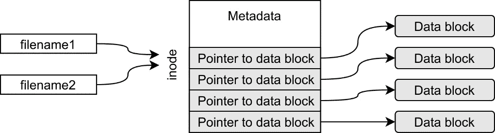

# 第五章：使用文件 I/O 和文件系统操作

文件 I/O 是系统编程的重要部分，因为大多数程序必须从文件中读取或写入数据。进行文件 I/O 还要求开发人员对文件系统有所了解。

精通文件 I/O 和文件系统操作不仅会使您成为更好的程序员，还会使您成为更好的系统管理员。

在本章中，我们将学习 Linux 文件系统和 inode。我们还将学习如何使用流和文件描述符在系统上读取和写入文件。我们还将查看系统调用以创建和删除文件，并更改文件权限和所有权。在本章末尾，我们将学习如何获取有关文件的信息。

在本章中，我们将涵盖以下内容：

+   阅读 inode 信息并学习文件系统

+   创建软链接和硬链接

+   创建文件并更新时间戳

+   删除文件

+   获取访问权限和所有权

+   设置访问权限和所有权

+   使用文件描述符写入文件

+   使用文件描述符从文件中读取

+   使用流写入文件

+   使用流从文件中读取

+   使用流读取和写入二进制数据

+   使用`lseek()`在文件内部移动

+   使用`fseek()`在文件内部移动

# 技术要求

对于本章，您将需要 GCC 编译器、Make 工具以及我们在*第三章*中的*使用 GCC 选项编写通用 Makefile*食谱中制作的通用 Makefile。*第一章*中有关安装编译器和 Make 工具的内容。

通用的 Makefile 以及本章的所有源代码示例可以从 GitHub 的以下 URL 下载：[`github.com/PacktPublishing/Linux-System-Programming-Techniques/tree/master/ch5`](https://github.com/PacktPublishing/Linux-System-Programming-Techniques/tree/master/ch5)。

我们将在 Linux 的内置手册中查找函数和头文件。如果您使用的是 Debian 或 Ubuntu，Linux 程序员手册将作为*build-essentials*元包的一部分安装，该元包在*第一章*中有所涵盖，*获取必要的工具并编写我们的第一个 Linux 程序*。您还需要安装*POSIX 程序员手册*，该手册在*第三章*中的*获取有关 Linux 和 Unix 特定头文件的信息*食谱中有所涵盖，*深入研究 Linux 中的 C 语言*。如果您使用的是 CentOS 或 Fedora，这些手册很可能已经安装。否则，请查看我提到的*第三章*中的食谱，*深入研究 Linux 中的 C 语言*。

查看以下链接以查看代码演示视频：[`bit.ly/3u4OuWz`](https://bit.ly/3u4OuWz)

# 阅读 inode 信息并学习文件系统

理解 inode 是深入了解 Linux 文件系统的关键。在 Linux 或 Unix 系统中，文件名并不是实际的文件，它只是指向 inode 的指针。inode 包含有关实际数据存储位置的信息，以及有关文件的大量元数据，例如文件模式、最后修改日期和所有者。

在这个食谱中，我们将对**文件系统**有一个一般的了解，以及 inode 如何适应其中。我们还将查看 inode 信息，并学习一些相关命令。我们还将编写一个小的 C 程序，从文件名中读取 inode 信息。

## 准备工作

在这个食谱中，我们将使用命令和 C 程序来探索 inode 的概念。您需要的一切都在本章的*技术要求*部分中有所涵盖。

## 操作方法…

在这个配方中，我们将首先探索系统上已经存在的命令，以查看 inode 信息。然后，我们将创建一个小的 C 程序来打印 inode 信息：

1.  我们将首先创建一个小的文本文件，我们将在整个配方中使用它：

```
$> echo "This is just a small file we'll use" \
> > testfile1
$> cat testfile1 
This is just a small file we'll use
```

1.  现在，让我们查看此文件的*inode 编号*，以及其大小、块计数和其他信息。每个系统和每个文件的 inode 编号都是不同的：

```
$> stat testfile1 
  File: testfile1
  Size: 36              Blocks: 8          IO Block: 262144 regular file
Device: 35h/53d Inode: 19374124    Links: 1
Access: (0644/-rw-r--r--)  Uid: ( 1000/    jake)   Gid: ( 1000/    jake)
Access: 2020-10-16 22:19:02.770945984 +0200
Modify: 2020-10-16 22:19:02.774945969 +0200
Change: 2020-10-16 22:19:02.774945969 +0200
 Birth: -
```

1.  大小以字节为单位，为 36 字节。由于文本中未使用特殊字符，因此这与文件包含的字符数相同。我们可以使用`wc`来计算字符数：

```
$> wc -c testfile1 
36 testfile1
```

1.  现在，让我们构建一个小程序，提取其中一些信息；inode 编号、文件大小和`my-stat-v1.c`的链接数。我们将用于提取信息的系统调用函数与命令行工具`stat`具有相同的名称。代码中突出显示了系统调用函数：

```
#include <stdio.h>
#include <sys/types.h>
#include <sys/stat.h>
#include <unistd.h>
#include <errno.h>
#include <string.h>
int main(int argc, char *argv[])
{
   struct stat filestat;
   if ( argc != 2 )
   {
      fprintf(stderr, "Usage: %s <file>\n", 
         argv[0]);
      return 1;
   }
   if ( stat(argv[1], &filestat) == -1 )
   {
      fprintf(stderr, "Can't read file %s: %s\n", 
         argv[1], strerror(errno));
      return errno;
   }
   printf("Inode: %lu\n", filestat.st_ino);
   printf("Size: %zd\n", filestat.st_size);
   printf("Links: %lu\n", filestat.st_nlink);
   return 0;
}
```

1.  现在使用 Make 和通用的`Makefile`编译此程序：

```
$> make my-stat-v1
gcc -Wall -Wextra -pedantic -std=c99    my-stat-v1.c   -o my-stat-v1
```

1.  让我们在`testfile1`上尝试这个程序。比较 inode 编号、大小和链接数。这些数字应该与我们使用`stat`程序时相同：

```
$> ./my-stat-v1 testfile1 
Inode: 19374124
Size: 36
Links: 1
```

1.  如果我们不输入参数，将会得到一个使用消息：

```
$> ./my-stat-v1
Usage: ./my-stat-v1 <file>
```

1.  如果我们尝试对一个不存在的文件进行操作，将会得到一个错误消息：

```
$> ./my-stat-v1 hello123
Can't read file hello123: No such file or directory
```

## 工作原理…

文件的文件名并不是数据或文件。文件名只是指向 inode 的链接。而该 inode 又包含有关实际数据存储在文件系统上的位置的信息。正如我们将在下一篇文章中看到的，一个 inode 可以有多个名称或*链接*。有时文件名也被称为链接。下图说明了指向 inode 的文件名和 inode 包含有关**数据块**存储位置的信息的概念：



图 5.1 – Inodes 和文件名

一个 inode 还包含`stat`命令。

在第 4 步中，我们创建了一个小的 C 程序，使用与命令相同名称的系统调用函数`stat()`读取此元数据。`stat()`系统调用提取的数据比我们在此处打印的要多得多。我们将在本章中打印更多此类信息。所有这些信息都存储在一个名为`stat`的结构体中。我们在`man 2 stat`手册页中找到了关于此结构体的所有所需信息。在该手册页中，我们还看到了变量的数据类型（`ino_t`、`off_t`和`nlink_t`）。然后，在`man sys_types.h`中，我们在**另外**下找到了这些类型是什么类型。

我们在这里使用的字段是`st_ino`表示 inode 编号，`st_size`表示文件大小，`st_nlink`表示文件的链接数。

在第 6 步中，我们看到我们使用 C 程序提取的信息与`stat`命令的信息相同。

我们还在程序中实现了错误处理。`stat()`函数包装在一个`if`语句中，检查其返回值是否为-1。如果发生错误，我们将使用`stderr`打印出带有文件名和`errno`的错误消息。程序还将`errno`变量返回给 shell。我们在*第四章**中学习了有关错误处理和`errno`的所有内容，处理程序中的错误*。

# 创建软链接和硬链接

在上一篇文章中，我们提到了链接的主题。在这篇文章中，我们将更多地了解链接以及它们对 inode 的影响。我们还将调查**软链接**和**硬链接**之间的区别。简而言之，硬链接是一个文件名，软链接就像是一个文件名的快捷方式。

此外，我们将编写两个程序，一个创建硬链接，一个创建软链接。然后，我们将使用前一篇文章中创建的程序来检查链接计数。

## 准备工作

除了本章开头列出的要求，您还需要我们在上一个示例中创建的程序`my-stat-v1.c`。您还需要我们在上一个示例中创建的测试文件，名为`testfile1`。如果您还没有创建这些文件，也可以从 GitHub 上下载它们[`github.com/PacktPublishing/Linux-System-Programming-Techniques/tree/master/ch5`](https://github.com/PacktPublishing/Linux-System-Programming-Techniques/tree/master/ch5)。

您还需要使用 Make 编译`my-stat-v1.c`程序，以便能够执行它，如果您还没有这样做的话。您可以使用`make my-stat-v1`来编译它。

## 如何做…

我们将创建软链接和硬链接，使用内置命令和编写简单的 C 程序来完成：

1.  我们将首先创建一个新的硬链接到我们的测试文件`testfile1`。我们将新的硬链接命名为`my-file`：

```
$> ln testfile1 my-file
```

1.  现在让我们调查这个新文件名。请注意链接已增加到`2`，但其余部分与`testfile1`相同：

```
$> cat my-file 
This is just a small file we'll use
$> ls -l my-file 
-rw-r--r-- 3 jake jake 36 okt 16 22:19 my-file
$> ./my-stat-v1 my-file 
Inode: 19374124
Size: 36
Links: 2
```

1.  现在将这些数字与`testfile1`文件进行比较。它们应该都是相同的：

```
$> ls -l testfile1 
-rw-r--r-- 3 jake jake 36 okt 16 22:19 testfile1
$> ./my-stat-v1 testfile1 
Inode: 19374124
Size: 36
Links: 2
```

1.  让我们创建另一个名为`another-name`的硬链接。我们使用名称`my-file`作为目标创建此链接：

```
$> ln my-file another-name
```

1.  我们也将调查这个文件：

```
$> ls -l another-name 
-rw-r--r-- 2 jake jake 36 okt 16 22:19 another-name
$> ./my-stat-v1 another-name 
Inode: 19374124
Size: 36
Links: 3
```

1.  现在让我们删除`testfile1`文件名：

```
$> rm testfile1
```

1.  现在我们已经删除了我们创建的第一个文件名，我们将调查另外两个名称：

```
$> cat my-file 
This is just a small file we'll use
$> ls -l my-file 
-rw-r--r-- 2 jake jake 36 okt 16 22:19 my-file
$> ./my-stat-v1 my-file 
Inode: 19374124
Size: 36
Links: 2
$> cat another-name 
This is just a small file we'll use
$> ls -l another-name 
-rw-r--r-- 2 jake jake 36 okt 16 22:19 another-name
$> ./my-stat-v1 another-name 
Inode: 19374124
Size: 36
Links: 2
```

1.  是时候创建一个软链接了。我们创建一个名为`my-soft-link`的软链接到名称`another-name`：

```
$> ln -s another-name my-soft-link
```

1.  软链接是一种特殊的文件类型，可以使用`ls`命令查看。请注意，我们在这里得到了一个新的时间戳。还要注意，它是一个特殊文件，可以通过文件模式字段中的第一个字母`l`来看到：

```
$> ls -l my-soft-link 
lrwxrwxrwx 1 jake jake 12 okt 17 01:49 my-soft-link -> another-name
```

1.  现在让我们检查`another-name`的链接计数。请注意，软链接的计数器没有增加：

```
$> ./my-stat-v1 another-name 
Inode: 19374124
Size: 36
Links: 2
```

1.  是时候编写我们自己的程序来创建硬链接了。存在一个易于使用的`link()`，我们将使用它。将以下代码写入文件并保存为`new-name.c`。代码中突出显示了`link()`系统调用：

```
#include <stdio.h>
#include <unistd.h>
#include <string.h>
#include <errno.h>
int main(int argc, char *argv[])
{
    if (argc != 3)
    {
        fprintf(stderr, "Usage: %s [target] " 
            "[new-name]\n", argv[0]);
        return 1;
    }
    if (link(argv[1], argv[2]) == -1)
    {
        perror("Can't create link");
        return 1;
    }
    return 0;
}
```

1.  编译程序：

```
$> make new-name
gcc -Wall -Wextra -pedantic -std=c99    new-name.c   -o new-name
```

1.  为我们之前的`my-file`文件创建一个新名称。将新文件命名为`third-name`。我们还尝试生成一些错误，以查看程序是否打印了正确的错误消息。请注意，`third-name`的 inode 信息与`my-file`的相同：

```
$> ./new-name 
Usage: ./new-name [target][new-name]
$> ./new-name my-file third-name
$> ./my-stat-v1 third-name
Inode: 19374124
Size: 36
Links: 3
$> ./new-name my-file /home/carl/hello
Can't create link: Permission denied
$> ./new-name my-file /mnt/localnas_disk2/
Can't create link: File exists
$> ./new-name my-file /mnt/localnas_disk2/third-name
Can't create link: Invalid cross-device link
```

1.  现在让我们创建一个创建软链接的程序。这也有一个易于使用的系统调用，称为`symlink()`，用于`new-symlink.c`。代码中突出显示了`symlink()`系统调用。注意所有这些系统调用函数有多么相似：

```
#define _XOPEN_SOURCE 700
#include <stdio.h>
#include <unistd.h>
#include <string.h>
#include <errno.h>
int main(int argc, char *argv[])
{
    if (argc != 3)
    {
        fprintf(stderr, "Usage: %s [target] " 
            "[link]\n", argv[0]);
        return 1;
    }
    if (symlink(argv[1], argv[2]) == -1)
    {
        perror("Can't create link");
        return 1;
    }
    return 0;
}
```

1.  编译它：

```
$> make new-symlink
gcc -Wall -Wextra -pedantic -std=c99    new-symlink.c   -o new-symlink
```

1.  让我们试一试，创建一个新的软链接，名为`new-soft-link`，指向`third-name`。此外，让我们尝试生成一些错误，以便我们可以验证错误处理是否正常工作：

```
$> ./new-symlink third-name new-soft-link
$> ls -l new-soft-link 
lrwxrwxrwx 1 jake jake 10 okt 18 00:31 new-soft-link -> third-name
$> ./new-symlink third-name new-soft-link
Can't create link: File exists
$> ./new-symlink third-name /etc/new-soft-link
Can't create link: Permission denied
```

## 它是如何工作的…

这里发生了很多事情，所以让我们从头开始。

在步骤 1 到 7 中，我们创建了两个新的硬链接到`testfile1`文件。但正如我们注意到的，硬链接没有什么特别之处；它只是 inode 的另一个名称。所有文件名都是硬链接。文件名只是 inode 的一个链接。当我们删除`testfile1`文件名时，我们看到了这一点。剩下的两个名称链接到相同的 inode，并且包含相同的文本。第一个文件名或链接没有什么特别之处。无法告诉哪个硬链接是首先创建的。它们是相等的；它们甚至共享相同的日期，尽管其他链接是在稍后的时间创建的。日期是为了 inode，而不是文件名。

当我们创建和删除硬链接时，我们看到链接计数增加和减少。这是 inode 保持计算它有多少链接或名称的计数。

直到最后一个名称被删除，即链接计数达到零时，inode 才会被删除。

在*步骤 8 到 10*中，我们看到软链接，另一方面，是一种特殊的文件类型。软链接不计入 inode 的链接计数。文件在`ls -l`输出的开头用`l`表示。我们还可以在`ls -l`输出中看到软链接指向的文件。把软链接想象成一个快捷方式。

在*步骤 11 到 13*中，我们编写了一个创建硬链接（现有文件的新名称）的 C 程序。在这里，我们了解到创建新名称的系统调用称为`link()`，并且接受两个参数，目标和新名称。

在*步骤 13*中，我们见证了硬链接的一个有趣特性。它们不能跨设备。当我们考虑这一点时，这是有道理的。文件名不能保留在与 inode 分开的设备上。如果设备被移除，可能就没有更多的名称指向 inode，使其无法访问。

在剩下的步骤中，我们编写了一个 C 程序，用于创建指向现有文件的软链接。这个系统调用类似于`link()`，但是被称为`symlink()`。

## 还有更多...

请查看我们在本食谱中涵盖的系统调用的手册页面；它们包含了硬链接和软链接的一些很好的解释。手册页面是`man 2 link`和`man 2 symlink`。

# 创建文件和更新时间戳

现在我们了解了文件系统、inode 和硬链接，我们将学习如何通过在 C 中编写我们自己的`touch`版本来创建文件。我们已经开始在*第四章**，处理程序中的错误*中编写`touch`的一个版本，那里我们学习了错误处理。我们将继续使用该程序的最新版本，我们将其命名为`simple-touch-v7.c`。真正的`touch`版本会在文件存在时更新文件的修改和访问时间戳。在这个食谱中，我们将在我们的新版本中添加这个功能。

## 准备工作

您在本章的*技术要求*部分中列出了此食谱所需的一切。虽然我们将添加`simple-touch`的最新版本，但我们将在本食谱中编写整个代码。但为了完全理解程序，最好先阅读*第四章**，处理程序中的错误*。

## 如何做...

在这个`simple-touch`的第八个版本中，我们将添加更新文件的访问和修改日期的功能：

1.  在文件中写入以下代码，并将其保存为`simple-touch-v8.c`。在这里，我们将使用`utime()`系统调用来更新文件的访问和修改时间戳。代码中突出显示了与上一个版本的更改（除了添加的注释）。还要注意`creat()`系统调用如何移入了一个`if`语句。只有在文件不存在时才会调用`creat()`系统调用：

```
#include <stdio.h>
#include <fcntl.h>
#include <string.h>
#include <errno.h>
#include <utime.h>
#define MAX_LENGTH 100
int main(int argc, char *argv[])
{
   char filename[MAX_LENGTH] = { 0 };
   /* Check number of arguments */
   if (argc != 2)
   {
      fprintf(stderr, "You must supply a filename "
         "as an argument\n");
      return 1;
   }
   strncat(filename, argv[1], sizeof(filename)-1);
   /* Update the access and modification time */
   if ( utime(filename, NULL) == -1 )
   {
      /* If the file doesn't exist, create it */
      if (errno == ENOENT)
      {
         if ( creat(filename, 00644) == -1 )
         {
            perror("Can't create file");
            return errno;
         }
      }
      /* If we can't update the timestamp,
         something is wrong */
      else
      {
         perror("Can't update timestamp");
         return errno;
      }
   }
   return 0;
}
```

1.  使用 Make 编译程序：

```
$> make simple-touch-v8
gcc -Wall -Wextra -pedantic -std=c99    simple-touch-v8.c   -o simple-touch-v8
```

1.  让我们尝试一下，看看它是如何工作的。我们将在上一个食谱中创建的文件名上尝试，并看看每个文件名如何获得相同的时间戳，因为它们都指向相同的 inode：

```
$> ./simple-touch-v8 a-new-file
$> ls -l a-new-file 
-rw-r--r-- 1 jake jake 0 okt 18 19:57 a-new-file
$> ls -l my-file 
-rw-r--r-- 3 jake jake 36 okt 16 22:19 my-file
$> ls -l third-name 
-rw-r--r-- 3 jake jake 36 okt 16 22:19 third-name
$> ./simple-touch-v8 third-name
$> ls -l my-file 
-rw-r--r-- 3 jake jake 36 okt 18 19:58 my-file
$> ls -l third-name 
-rw-r--r-- 3 jake jake 36 okt 18 19:58 third-name
$> ./simple-touch-v8 /etc/passwd
Can't change filename: Permission denied
$> ./simple-touch-v8 /etc/hello123
Can't create file: Permission denied
```

## 它是如何工作的...

在这个食谱中，我们添加了更新文件或 inode 的时间戳的功能。

要更新访问和修改时间，我们使用`utime()`系统调用。`utime()`系统调用接受两个参数，一个文件名和一个时间戳。但是如果我们将`NULL`作为第二个参数传递给函数，它将使用当前的时间和日期。

调用`utime()`的语句被包裹在一个`if`语句中，检查返回值是否为-1。如果是，那么出现了问题，`errno`被设置（参见*第四章**，处理程序中的错误*，对`errno`的深入解释）。然后我们使用`errno`来检查是否是*文件未找到*错误（`ENOTENT`）。如果文件不存在，我们使用`creat()`系统调用来创建它。对`creat()`的调用也被包裹在一个`if`语句中。如果在创建文件时出现问题，程序将打印错误消息并返回`errno`值。如果程序成功创建了文件，它将继续执行`return 0`。

如果`utime()`的`errno`值不是`ENOENT`，它将继续到`else`语句，打印错误消息，并返回`errno`。

当我们尝试运行程序时，我们注意到当我们更新其中一个文件时，`my-file`和`third-name`都会获得更新的时间戳。这是因为这些文件名只是指向相同 inode 的链接。时间戳是 inode 中的元数据。

## 还有更多...

在`man 2 creat`和`man 2 utime`中有很多有用的信息。如果你有兴趣了解 Linux 中的时间和日期，我建议你阅读`man 2 time`，`man 3 asctime`和`man time.h`。

# 删除文件

在这个食谱中，我们将学习如何使用`unlink()`函数。这个食谱将增强你对链接的理解，并闭合循环。这将提高你对 Linux 及其文件系统的整体知识。知道如何使用系统调用删除文件将使你能够直接从程序中删除文件。

在这里，我们将编写我们自己的版本的`rm`，我们将其称为`remove`。在这个食谱之后，我们知道如何创建和删除文件以及如何创建链接。这些是一些最常见的文件系统操作。

## 准备就绪

在这个食谱中，我们将使用我们在*读取 inode 信息和学习文件系统*食谱中编写的`my-stat-v1`程序。我们还将继续对我们在之前的食谱中创建的文件名进行实验，`my-file`，`another-name`和`third-name`。除此之外，你还需要本章列出的*技术要求*，即 GCC 编译器，Make 工具和通用 Makefile。

## 如何做...

跟着这里写一个简单版本的`rm`：

1.  将以下代码写入一个文件并保存为`remove.c`。这个程序使用`unlink()`系统调用来删除一个文件。代码中突出显示了系统调用：

```
#include <stdio.h>
#include <unistd.h>
#include <errno.h>
int main(int argc, char *argv[])
{
    if (argc != 2)
    {
        fprintf(stderr, "Usage: %s [path]\n",
            argv[0]);
        return 1;
    }
    if ( unlink(argv[1]) == -1 )
    {
        perror("Can't remove file");
        return errno;
    }
    return 0;
}
```

1.  使用**Make**工具编译它：

```
$> make remove
gcc -Wall -Wextra -pedantic -std=c99    remove.c   -o remove
```

1.  让我们试一试：

```
$> ./my-stat-v1 my-file 
Inode: 19374124
Size: 36
Links: 3
$> ./remove another-name 
$> ./my-stat-v1 my-file 
Inode: 19374124
Size: 36
Links: 2
```

## 它是如何工作的...

用于删除文件的系统调用称为`unlink()`。这个名字来自于当我们删除一个文件名时，我们只是删除了指向该 inode 的硬链接；因此我们**unlink**了一个文件名。如果它恰好是指向 inode 的最后一个文件名，那么该 inode 也将被删除。

`unlink()`系统调用只接受一个参数：我们要删除的文件名。

# 获取访问权限和所有权

在这个食谱中，我们将编写一个程序，使用我们在本章中之前看到的`stat()`系统调用来读取文件的访问权限和所有权。我们将继续构建在本章第一个食谱中构建的`my-stat-v1`程序的基础上。在这里，我们将添加显示所有权和访问权限的功能。知道如何以编程方式获取所有者和访问权限对于处理文件和目录至关重要。它将使你能够检查用户是否具有适当的权限，并在他们没有权限时打印错误消息。

我们还将学习在 Linux 中如何解释访问权限以及如何在数字表示和字母表示之间进行转换。了解 Linux 中的访问权限对于成为 Linux 系统程序员至关重要。整个系统上的每个文件和目录都有访问权限以及分配给它们的所有者和组。无论是日志文件、系统文件还是用户拥有的文本文件，都有访问权限。

## 准备工作

对于这个示例，您只需要本章*技术要求*部分中列出的内容。

## 如何做…

我们将在这个示例中编写`my-stat-v1`的新版本。我们将在这里编写整个程序，因此您不需要之前的版本：

1.  在文件中写入以下代码并将其保存为`my-stat-v2.c`。在这个版本中，我们将获取有关文件所有者和组以及文件模式的信息。要翻译`getpwuid()`。要获取`getgrgid()`的组名。更改在代码中突出显示：

```
#include <stdio.h>
#include <sys/types.h>
#include <sys/stat.h>
#include <unistd.h>
#include <errno.h>
#include <string.h>
#include <pwd.h>
#include <grp.h>
int main(int argc, char *argv[])
{
    struct stat filestat;
    struct passwd *userinfo;
    struct group *groupinfo;
    if ( argc != 2 )
    {
        fprintf(stderr, "Usage: %s <file>\n",
            argv[0]);
        return 1;
    }
    if ( stat(argv[1], &filestat) == -1 )
    {
        fprintf(stderr, "Can't read file %s: %s\n", 
            argv[1], strerror(errno));
        return errno;
    }
    if ( (userinfo = getpwuid(filestat.st_uid)) ==
        NULL )
    {
        perror("Can't get username");
        return errno;
    }
    if ( (groupinfo = getgrgid(filestat.st_gid)) ==
        NULL )
    {
        perror("Can't get groupname");
        return errno;
    }
    printf("Inode: %lu\n", filestat.st_ino);
    printf("Size: %zd\n", filestat.st_size);
    printf("Links: %lu\n", filestat.st_nlink);
printf("Owner: %d (%s)\n", filestat.st_uid, 
        userinfo->pw_name);
printf("Group: %d (%s)\n", filestat.st_gid, 
        groupinfo->gr_name);
    printf("File mode: %o\n", filestat.st_mode);
    return 0;
}
```

1.  编译程序：

```
$> make my-stat-v2
gcc -Wall -Wextra -pedantic -std=c99    my-stat-v2.c   -o my-stat-v2
```

1.  在一些不同的文件上尝试该程序：

```
$> ./my-stat-v2 third-name 
Inode: 19374124
Size: 36
Links: 2
Owner: 1000 (jake)
Group: 1000 (jake)
File mode: 100644
$> ./my-stat-v2 /etc/passwd
Inode: 4721815
Size: 2620
Links: 1
Owner: 0 (root)
Group: 0 (root)
File mode: 100644
$> ./my-stat-v2 /bin/ls
Inode: 3540019
Size: 138856
Links: 1
Owner: 0 (root)
Group: 0 (root)
File mode: 100755
```

## 工作原理…

在这个`my-stat`版本中，我们添加了检索文件访问模式或实际上是**文件模式**的功能。文件的完整文件模式由六个八进制数字组成。前两个（左侧）是文件类型。在这种情况下，它是一个常规文件（10 等于常规文件）。第四个八进制数字是**设置用户 ID 位**、**设置组 ID 位**和**粘性位**。最后三个八进制数字是**访问模式**。

在`ls -l`的输出中，所有这些位都代表为字母。但是当我们编写程序时，我们必须将其设置和读取为数字。在继续之前，让我们检查文件模式的字母版本，以便真正理解它：

！图 5.2 - 文件访问模式


图 5.2 - 文件访问模式

设置用户 ID 位是一个允许进程以二进制文件的所有者身份运行的位，即使它以不同的用户身份执行。设置用户 ID 位可能是危险的，*不*是我们应该在程序上设置的东西。使用设置用户 ID 位的一个程序是`passwd`程序。`passwd`程序必须在用户更改密码时更新`/etc/passwd`和`/etc/shadow`文件，即使这些文件是由 root 拥有的。在正常情况下，我们甚至不能以常规用户的身份读取`/etc/shadow`文件，但是通过在`passwd`程序上设置设置用户 ID 位，它甚至可以写入它。如果设置了设置用户 ID 位，则在用户的访问模式的第三个位置上用`s`表示。

设置组 ID 具有类似的效果。当程序被执行并且设置了组 ID 位时，它将作为该组执行。当设置了组 ID 时，它在组的访问模式的第三个位置上用`s`表示。

粘性位在历史上用于将程序*粘*到交换空间，以加快加载时间。现在，它的用途完全不同。现在，名称以及含义都已更改为*受限删除标志*。当目录设置了粘性位时，只有文件的所有者、目录所有者或 root 用户可以删除文件，即使目录可被任何人写入。例如，`/tmp`目录通常设置了粘性位。粘性位在最后一组的最后一个位置上用`t`表示。

### 文件访问模式

当我们在文件上运行`ls -l`时，我们总是看到两个名称。第一个名称是用户（所有者），第二个名称是拥有文件的组。例如：

```
$> ls -l Makefile 
```

```
-rw-r--r-- 1 jake devops 134 okt 27 23:39 Makefile
```

在这种情况下，`jake`是用户（所有者），`devops`是组。

文件访问模式比我们刚刚讨论的特殊标志更容易理解。看一下*图 5.2*。前三个字母是用户的访问模式（文件的所有者）。这个特定的示例有`rw-`，这意味着用户可以读取和写入文件，但不能执行它。如果用户能够执行它，那将在最后一个位置上用`x`表示。

中间的三个字母是组访问模式（拥有文件的组）。在这种情况下，由于组缺少写入和执行的`w`和`x`，组只能读取文件。

最后的三个字母是所有其他人（不是所有者，也不在所有者组中）。在这种情况下，其他人只能读取文件。

完整的权限集将是`rwxrwxrwx`。

### 在字母和数字之间转换访问模式

**八进制数**表示文件访问模式。在我们习惯之前，从字母转换为八进制的最简单方法是使用纸和笔。我们在每个设置了访问位的组中将所有数字相加。如果没有设置（破折号），那么我们就不添加那个数字。当我们完成每个组的添加时，我们就得到了访问模式：

```
rw- r-- r—
```

```
421 421 421
```

```
 6   4   4
```

因此，前面的八进制访问模式是 644。让我们再举一个例子：

```
rwx rwx r-x
```

```
421 421 421
```

```
 7   7   5
```

前面的访问模式结果是 775。让我们再举一个例子：

```
rw- --- ---
```

```
421 421 421
```

```
 6   0   0
```

这个访问模式是 600。

也可以使用纸和笔来做相反的事情。假设我们有访问模式 750，我们想把它转换成字母：

```
 7   5   0
```

```
421 401 000
```

```
rwx r-x ---
```

因此，750 变成了`rwxr-x---`。

当你做了一段时间后，你会学会最常用的访问模式，不再需要纸和笔。

### 八进制文件模式

与文件访问模式一样，这里也适用相同的原则。记住，用户 ID 由用户的执行位置上的`s`表示，组 ID 由组的执行位上的`s`表示。`t`字符表示最后一个执行位位置（“其他”）的粘性位。如果我们把它写在一行上，就会得到这样：

```
s s t
```

```
4 2 1
```

因此，如果只设置了用户 ID 位，我们得到 4。如果同时设置了用户 ID 和组 ID，我们得到*4+2=6*。如果只设置了组 ID 位，我们得到 2。如果只设置了粘性位，我们得到 1，依此类推。如果所有位都设置了，我们得到*7（4+2+1）*。

这些文件模式由文件访问模式之前的数字表示。例如，八进制文件模式`4755`设置了用户 ID 位（4）。

当我们在 Linux 下编程时，我们甚至可能会遇到另外两个数字，就像我们从`my-stat-v2`程序的输出中看到的那样。在那里，我们有这样的：

```
File mode: 100755
```

前两个数字，在这个例子中是`10`，是文件类型。这两个数字的确切含义是我们需要在`man 7 inode`手册页中查找的。那里有一个很好的表告诉我们它的含义。我在这里列出了一个简化的列表，只显示我们感兴趣的前两个数字以及它代表的文件类型：

```
14   socket
```

```
12   symbolic link
```

```
10   regular file
```

```
06   block device
```

```
04   directory
```

```
02   character device
```

```
01   FIFO
```

这意味着我们的示例文件是一个普通文件（10）。

如果我们把刚刚学到的所有东西加起来，并将前面示例输出的`my-stat-v2`中的文件模式*100755*转换成数字，我们得到这样：

```
10  = a regular file
```

```
0   = no set-user-ID, set-group-ID or sticky bit is set
```

```
755 = the user can read, write, and execute it. The group can read and execute it, and all others can also read and execute it.
```

文件类型也由第一个位置的字母表示（见*图 5.2*）。这些字母如下：

```
s   socket
```

```
l   symbolic link
```

```
-   regular file
```

```
b   block device
```

```
d   directory
```

```
c   character device
```

```
p   FIFO
```

# 设置访问权限和所有权

在上一个配方中，我们学习了如何读取`chmod`命令和`chmod()`系统调用。我们还将学习如何改变文件的所有者和组，使用`chown`命令和`chown()`系统调用。

知道如何正确设置访问权限将有助于保护您的系统和文件安全。

## 准备工作

对于这个配方，你只需要本章*技术要求*部分列出的内容。阅读上一个配方以理解 Linux 中的权限也是一个好主意。你还需要上一个配方中的`my-stat-v2`程序。

## 如何做…

这些步骤将教会我们如何更改文件和目录的访问权限和所有权。

### 访问权限

我们将首先使用`chmod`命令设置文件的访问权限。然后，我们将编写`chmod`命令的简单 C 版本，使用`chmod()`系统调用：

1.  让我们首先使用`chmod`命令从我们的`my-stat-v2`程序中删除执行权限。以下命令中的`-x`表示*删除执行*：

```
$> chmod -x my-stat-v2
```

1.  现在让我们尝试执行程序。这次应该因为权限被拒绝而失败：

```
$> ./my-stat-v2
bash: ./my-stat-v2: Permission denied
```

1.  现在我们再次改回来，但这次我们使用八进制数字设置*绝对*权限。可执行文件的适当权限是 755，对应`rwxr-xr-x`。这意味着用户有完全权限，组可以读取和执行文件。其他所有人也一样；他们可以读取和执行它：

```
$> chmod 755 my-stat-v2
```

1.  在这个命令之后，我们可以再次执行程序：

```
./my-stat-v2 
Usage: ./my-stat-v2 <file>
```

1.  现在是时候编写`chmod`命令的简单版本，使用`chmod()`系统调用。将以下代码写入文件并保存为`my-chmod.c`。`chmod()`系统调用接受两个参数，文件或目录的路径和以八进制数表示的文件权限。在进行`chmod()`系统调用之前，我们进行一些检查，以确保权限看起来合理（一个三位或四位数的八进制数）。检查后，我们使用`strtol()`将数字转换为八进制数。`strtol()`的第三个参数是基数，这里是`8`：

```
#include <stdio.h>
#include <sys/stat.h>
#include <string.h>
#include <stdlib.h>
void printUsage(FILE *stream, char progname[]);
int main(int argc, char *argv[])
{
   long int accessmode; /*To hold the access mode*/
   /* Check that the user supplied two arguments */
   if (argc != 3)
   {
      printUsage(stderr, argv[0]);
      return 1;
   }
   /* Simple check for octal numbers and 
      correct length */
   if( strspn(argv[1], "01234567\n") 
         != strlen(argv[1]) 
         || ( strlen(argv[1]) != 3 && 
              strlen(argv[1]) != 4 ) )
   {
      printUsage(stderr, argv[0]);
      return 1;
   }
   /* Convert to octal and set the permissions */
   accessmode = strtol(argv[1], NULL, 8);
   if (chmod(argv[2], accessmode) == -1)
   {
      perror("Can't change permissions");
   }
   return 0;
}
void printUsage(FILE *stream, char progname[])
{
    fprintf(stream, "Usage: %s <numerical "
        "permissions> <path>\n", progname);
}
```

1.  现在编译程序：

```
$> make my-chmod
gcc -Wall -Wextra -pedantic -std=c99    my-chmod.c   -o my-chmod
```

1.  使用不同的权限测试程序。不要忘记使用`ls -l`检查结果：

```
$> ./my-chmod 
Usage: ./my-chmod <numerical permissions> <path>
$> ./my-chmod 700 my-stat-v2
$> ls -l my-stat-v2
-rwx------ 1 jake jake 17072 Nov  1 07:29 my-stat-v2
$> ./my-chmod 750 my-stat-v2
$> ls -l my-stat-v2
-rwxr-x--- 1 jake jake 17072 Nov  1 07:29 my-stat-v2
```

1.  让我们也尝试设置设置用户 ID 位。这里的设置用户 ID 位（以及设置组 ID 位和粘性位）是访问模式前面的第四位数字。这里的`4`设置了设置用户 ID 位。请注意用户字段中的`s`（在下面的代码中突出显示）：

```
$> chmod 4755 my-stat-v2
$> ls -l my-stat-v2
-rwsr-xr-x 1 jake jake 17072 Nov  1 07:29 my-stat-v2
```

1.  让我们尝试设置所有位（设置用户 ID、设置组 ID、粘性位和所有权限）：

```
$> chmod 7777 my-stat-v2
$> ls -l my-stat-v2
-rwsrwsrwt 1 jake jake 17072 Nov  1 07:29 my-stat-v2
```

1.  最后，将其改回更合理的东西：

```
$> chmod 755 my-stat-v2
$> ls -l my-stat-v2
-rwxr-xr-x 1 jake jake 17072 Nov  1 07:29 my-stat-v2
```

### 所有权

但我们也需要知道如何改变`chown`命令或`chown()`系统调用：

1.  要改变文件的所有者，我们必须是 root。普通用户不能放弃对他们的文件的所有权。同样，他们也不能声明对别人的文件的所有权。让我们尝试使用`chown`命令将`my-stat-v2`的所有者更改为 root：

```
$> sudo chown root my-stat-v2
$> ls -l my-stat-v2
-rwxr-xr-x 1 root jake 17072 Nov  1 07:29 my-stat-v2
```

1.  如果我们想要改变所有者和组，我们使用冒号分隔用户和组。第一个字段是所有者，第二个字段是组：

```
$> sudo chown root:root my-stat-v2
$> ls -l my-stat-v2
-rwxr-xr-x 1 root root 17072 Nov  1 07:29 my-stat-v2
```

1.  现在轮到我们编写一个简化版本的`chown`，使用`chown()`系统调用。`chown()`系统调用只接受用户 ID 作为数值。为了能够使用名称，我们必须首先使用`getpwnam()`查找用户名。这将在`passwd`结构中的`pw_uid`字段中给我们数值。对于组也是一样。我们必须使用`getgrnam()`系统调用使用其名称获取数值组 ID。现在我们知道了所有的系统调用，让我们写程序。将其命名为`my-chown.c`。这个程序有点长，所以我把它分成了几个步骤。请记住，所有步骤都应该放在一个文件（`my-chown.c`）中。如果愿意，您也可以从[`github.com/PacktPublishing/Linux-System-Programming-Techniques/blob/master/ch5/my-chown.c`](https://github.com/PacktPublishing/Linux-System-Programming-Techniques/blob/master/ch5/my-chown.c)下载整个代码。让我们从所有的头文件、变量和参数检查开始：

```
#include <stdio.h>
#include <stdlib.h>
#include <unistd.h>
#include <sys/types.h>
#include <pwd.h>
#include <grp.h>
#include <string.h>
#include <errno.h>
int main(int argc, char *argv[])
{
   struct passwd *user; /* struct for getpwnam */
   struct group *grp; /* struct for getgrnam */
   char *username = { 0 }; /* extracted username */
   char *groupname = { 0 }; /*extracted groupname*/
   unsigned int uid, gid; /* extracted UID/GID */
   /* Check that the user supplied two arguments 
      (filename and user or user:group) */
   if (argc != 3)
   {
      fprintf(stderr, "Usage: %s [user][:group]" 
         " [path]\n", argv[0]);
      return 1;
   }
```

1.  由于我们将用户名和组写为`username:group`在参数中，我们需要提取用户名部分和组部分。我们使用一个名为`strtok()`的字符串函数来做到这一点。在第一次调用`strtok()`时，我们只提供第一个参数（字符串）。之后，我们得到`user`结构和`grp`结构。我们还检查用户和组是否存在：

```
 /* Extract username and groupname */
   username = strtok(argv[1], ":");
   groupname = strtok(NULL, ":");

   if ( (user = getpwnam(username)) == NULL )
   {
      fprintf(stderr, "Invalid username\n");
      return 1;
   }
   uid = user->pw_uid; /* get the UID */
   if (groupname != NULL) /* if we typed a group */
   {
      if ( (grp = getgrnam(groupname)) == NULL )
      {
         fprintf(stderr, "Invalid groupname\n");
         return 1;
      }
      gid = grp->gr_gid; /* get the GID */
   }
   else
   {
      /* if no group is specifed, -1 won't change 
         it (man 2 chown) */
      gid = -1;
   }
```

1.  最后，我们使用`chown()`系统调用来更新文件的用户和组：

```
   /* update user/group (argv[2] is the filename)*/
   if ( chown(argv[2], uid, gid) == -1 )
   {
      perror("Can't change owner/group");
      return 1;
   }
   return 0;
}
```

1.  让我们编译程序，这样我们就可以尝试它：

```
$> make my-chown
gcc -Wall -Wextra -pedantic -std=c99    my-chown.c   -o my-chown
```

1.  现在我们在一个文件上测试程序。请记住，我们需要以 root 身份更改文件的所有者和组：

```
$> ls -l my-stat-v2 
-rwxr-xr-x 1 root root 17072 nov  7 19:59 my-stat-v2
$> sudo ./my-chown jake my-stat-v2 
$> ls -l my-stat-v2 
-rwxr-xr-x 1 jake root 17072 nov  7 19:59 my-stat-v2
$> sudo ./my-chown carl:carl my-stat-v2 
$> ls -l my-stat-v2 
-rwxr-xr-x 1 carl carl 17072 nov  7 19:59 my-stat-v2
```

## 它是如何工作的...

系统上的每个文件和目录都有访问权限和一个所有者/组对。访问权限可以使用`chmod`命令或`chmod()`系统调用来更改。该名称是*更改模式位*的缩写。在上一个示例中，我们介绍了如何在更人类可读的文本格式和数字八进制格式之间转换访问权限。在这个示例中，我们编写了一个使用`chmod()`系统调用使用数字形式更改模式位的程序。

为了将数字形式转换为八进制数，我们使用`strtol()`和`8`作为第三个参数，这是数字系统的基数。基数 8 是八进制；基数 10 是我们在日常生活中使用的常规十进制系统；基数 16 是十六进制，依此类推。

我们编写了程序，以便用户可以选择他们想要设置的任何内容，无论是只有访问模式位（三位数）还是特殊位，如设置用户 ID、设置组 ID 和粘性位（四位数）。为了确定用户输入的数字位数，我们使用`strlen()`。

在下一个程序中，我们使用`chown()`来更新文件或目录的所有者和组。由于我们想要使用名称而不是数字 UID 和 GID 来更新用户和组，程序变得更加复杂。`chown()`系统调用只接受 UID 和 GID，而不是名称。这意味着我们需要在调用`chown()`之前查找 UID 和 GID。为了查找 UID 和 GID，我们使用`getpwnam()`和`getgrnam()`。这些函数中的每一个都给我们一个包含相应用户或组的所有可用信息的`struct`。从这些结构中，我们提取 UID 和 GID，然后在调用`chown()`时使用它们。

为了从命令行中分离用户名和组部分（冒号），我们使用`strtok()`函数。在对函数的第一次调用中，我们将字符串指定为第一个参数（在本例中为`argv[1]`），并指定分隔符（冒号）。在对`strtok()`的下一次调用中，我们将字符串设置为`NULL`，但仍然指定分隔符。第一次调用给我们用户名，第二次调用给我们组名。

之后，当我们调用`getpwnam()`和`getgrnam()`时，我们检查用户名和组名是否存在。如果用户名或组名不存在，函数将返回`NULL`。

## 还有更多...

有几个类似的函数可以使用`getpwnam()`和`getgrnam()`，具体取决于您拥有的信息和您拥有的信息。如果您有 UID，您可以使用`getpwuid()`。同样，如果您有 GID，您可以使用`getgrgid()`。如果您阅读`man 3 getpwnam`和`man 3 getgrnam`手册页面，将会有更多的信息和更多的函数。

# 使用文件描述符写入文件

在之前的章节中，我们已经看到了**文件描述符**的一些用法，例如 0、1 和 2（*stdin*、*stdout*和*stderr*）。但在这个示例中，我们将使用文件描述符从程序中写入文本到文件。

了解如何使用文件描述符来写入文件既可以让您更深入地了解系统，也可以让您做一些底层的事情。

## 准备工作

对于这个示例，您只需要在*技术要求*部分列出的内容。

## 如何做...

在这里，我们将编写一个小程序来向文件写入文本：

1.  在文件中写入以下代码，并将其保存为`fd-write.c`。该程序接受两个参数：一个字符串和一个文件名。要使用文件描述符写入文件，我们必须首先使用`open()`系统调用打开文件。`open()`系统调用返回一个文件描述符，这是一个整数。然后我们使用该文件描述符（整数）与`write()`系统调用。我们已经在*第三章**中看到了`write()`，在那一章中，我们使用`write()`将一个小文本写入标准输出。这一次，我们使用`write()`将文本写入文件。请注意，`open()`系统调用接受三个参数：文件的路径，文件应该以哪种模式打开（在这种情况下，如果文件不存在则创建文件，并以读写模式打开），以及`0644`）：

```
#include <stdio.h>
#include <unistd.h>
#include <fcntl.h>
#include <string.h>
#include <sys/types.h>
#include <sys/stat.h>
int main(int argc, char *argv[])
{
   int fd; /* for the file descriptor */
   if (argc != 3)
   {
      fprintf(stderr, "Usage: %s [path] [string]\n",
         argv[0]);
      return 1;
   }
   /* Open the file (argv[1]) and create it if it 
      doesn't exist and set it in read-write mode. 
      Set the access mode to 644 */
   if ( (fd = open(argv[1], O_CREAT|O_RDWR, 00644)) 
      == -1 )
   {
      perror("Can't open file for writing");
      return 1;
   }
   /* write content to file */
   if ( (write(fd, argv[2], strlen(argv[2]))) 
      == -1 )
   {
      perror("Can't write to file");
      return 1;
   }
   return 0;
}
```

1.  让我们编译这个程序：

```
$> make fd-write
gcc -Wall -Wextra -pedantic -std=c99    fd-write.c   -o fd-write
```

1.  让我们尝试向文件中写入一些文本。请记住，如果文件已经存在，内容将被覆盖！如果新文本比文件的旧内容小，那么只有开头会被覆盖。还要注意，如果文本不包含换行符，那么文件中的文本也不会包含换行符：

```
$> ./fd-write testfile1.txt "Hello! How are you doing?"
$> cat testfile1.txt 
Hello! How are you doing?$>*Enter*
$> ls -l testfile1.txt 
-rw-r--r-- 1 jake jake 2048 nov  8 16:34 testfile1.txt
$> ./fd-write testfile1.txt "A new text"
$> cat testfile1.txt 
A new text are you doing?$>
```

1.  我们甚至可以从另一个文件中输入内容，如果我们使用`xargs`，这是一个允许我们将程序的输出解析为另一个程序的命令行参数的程序。请注意，这一次，`testfile1`将在末尾有一个换行符。`xargs`的`-0`选项使其忽略换行符，而是使用空字符来表示参数的结尾：

```
$> head -n 3 /etc/passwd | xargs -0 \
> ./fd-write testfile1.txt 
$> cat testfile1.txt 
root:x:0:0:root:/root:/bin/bash
daemon:x:1:1:daemon:/usr/sbin:/usr/sbin/nologin
bin:x:2:2:bin:/bin:/usr/sbin/nologin
```

## 工作原理…

`open()`系统调用返回一个文件描述符，我们将其保存在`fd`变量中。文件描述符只是一个整数，就像 0、1 和 3 是*stdin*、*stdout*和*stderr*一样。

我们给`open()`的第二个参数是使用*按位或*组合在一起的模式位的宏。在我们的情况下，我们同时使用`O_CREAT`和`O_RDWR`。第一个`O_CREAT`表示如果文件不存在，则创建文件。第二个`O_RDWR`表示文件应该同时用于读取和写入。

要将字符串写入文件，我们将文件描述符作为第一个参数传递给`write()`。作为第二个参数，我们给它`argv[2]`，其中包含我们要写入文件描述符的字符串。最后一个参数是我们要写入的内容的大小。在我们的情况下，我们使用`strlen`来获取`argv[2]`的大小，这是`string.h`中的一个函数，用于获取字符串的长度。

就像在以前的食谱中一样，我们检查所有系统调用是否返回`-1`。如果它们返回`-1`，则表示出现了问题，我们使用`perror()`打印错误消息，然后返回`1`。

## 还有更多…

当程序正常返回时，所有打开的文件描述符都会自动关闭。但是，如果我们想显式关闭文件描述符，我们可以使用`close()`系统调用，并将文件描述符作为其参数。在我们的情况下，我们可以在返回之前添加`close(fd)`。

手册页面中有关`open()`、`close()`和`write()`的很多有用信息。我建议您阅读它们以获取更深入的信息。您可以使用以下命令阅读它们：

+   `man 2 open`

+   `man 2 close`

+   `man 2 write`

# 使用文件描述符从文件中读取

在上一个食谱中，我们学会了如何使用文件描述符写入文件。在这个食谱中，我们将学习如何使用文件描述符从文件中读取。因此，我们将编写一个类似于`cat`的小程序。它接受一个参数——文件名，并将其内容打印到标准输出。

了解如何读取和使用文件描述符使您不仅可以读取文件，还可以读取通过文件描述符传输的各种数据。文件描述符是在 Unix 和 Linux 中读取和写入数据的通用方式。

## 准备工作

这个食谱所需的唯一物品在本章的*技术要求*部分列出。

## 如何做…

使用文件描述符读取文件与写入文件类似。我们将使用`read()`系统调用，而不是使用`write()`系统调用。在我们读取内容之前，我们必须先找出文件的大小。我们可以使用`fstat()`系统调用来获取这个信息，它会给我们关于文件描述符的信息：

1.  将以下代码写入一个文件，并将其命名为`fd-read.c`。注意我们如何使用`fstat()`获取文件信息，然后使用`read()`读取数据。我们仍然使用`open()`系统调用，但这次我们已经移除了`O_CREATE`并将`O_RDRW`更改为`O_RDONLY`以只允许读取。我们将在这里使用缓冲区大小为 4,096，以便能够读取一些更大的文件。这个程序有点长，所以我把它分成了几个步骤。所有步骤中的代码都放在一个文件中。首先，我们从编写所有的`include`行、变量和参数检查开始：

```
#include <stdio.h>
#include <unistd.h>
#include <fcntl.h>
#include <sys/stat.h>
#include <sys/types.h>
#define MAXSIZE 4096
int main(int argc, char *argv[])
{
   int fd; /* for the file descriptor */
   int maxread; /* the maximum we want to read*/
   off_t filesize; /* for the file size */
   struct stat fileinfo; /* struct for fstat */
   char rbuf[MAXSIZE] = { 0 }; /* the read buffer*/

   if (argc != 2)
   {
      fprintf(stderr, "Usage: %s [path]\n",
         argv[0]);
      return 1;
   }
```

1.  现在，我们编写打开文件描述符的代码，使用`open()`系统调用。我们还添加了一些错误处理，将其包装在一个`if`语句中：

```
   /* open the file in read-only mode and get
      the file size */
   if ( (fd = open(argv[1], O_RDONLY)) == -1 )
   {
      perror("Can't open file for reading");
      return 1;
   }
```

1.  现在，我们编写代码，使用`fstat()`系统调用获取文件的大小。在这里，我们还检查文件的大小是否大于`MAXSIZE`，如果是，我们将`maxread`设置为`MAXSIZE-1`。否则，我们将其设置为文件的大小。然后，我们使用`read()`系统调用读取文件。最后，我们使用`printf()`打印内容：

```
   fstat(fd, &fileinfo);
   filesize = fileinfo.st_size;
   /* determine the max size we want to read
      so we don't overflow the read buffer */
   if ( filesize >= MAXSIZE )
      maxread = MAXSIZE-1;
   else
      maxread = filesize;

   /* read the content and print it */
   if ( (read(fd, rbuf, maxread)) == -1 )
   {
      perror("Can't read file");
      return 1;
   }
   printf("%s", rbuf);
   return 0;
}
```

1.  让我们编译程序：

```
$> make fd-read
gcc -Wall -Wextra -pedantic -std=c99    fd-read.c   -o fd-read
```

1.  让我们尝试在一些文件上运行它，看看我们是否可以读取它们：

```
$> ./fd-read testfile1.txt 
root:x:0:0:root:/root:/bin/bash
daemon:x:1:1:daemon:/usr/sbin:/usr/sbin/nologin
bin:x:2:2:bin:/bin:/usr/sbin/nologin
$> ./fd-read Makefile 
CC=gcc
CFLAGS=-Wall -Wextra -pedantic -std=c99
$> ./fd-read /etc/shadow
Can't open file for reading: Permission denied
$> ./fd-read asdfasdf
Can't open file for reading: No such file or directory
```

## 工作原理...

当我们从文件描述符中读取数据时，我们必须指定要读取多少个字符。在这里，我们必须小心不要溢出缓冲区。我们也不想读取比文件实际包含的更多内容。为了解决所有这些问题，我们首先使用`fstat()`找出文件的大小。该函数给我们提供了与我们之前在`my-stat-v2`程序中使用`stat()`看到的相同的信息。这两个函数`stat()`和`fstat()`做着相同的事情，但它们作用于不同的对象。`stat()`函数直接作用于文件，而`fstat()`作用于文件描述符。由于我们已经打开了正确文件的文件描述符，因此使用它是有意义的。这两个函数都将它们的信息保存到一个名为`stat`的结构体中。

为了不溢出缓冲区，我们检查文件大小和`MAXSIZE`哪个更大。如果文件大小大于或等于`MAXSIZE`，我们使用`MAXSIZE-1`作为要读取的最大字符数。否则，我们使用文件的大小作为最大值。

`read()`系统调用和`write()`接受相同的参数，即文件描述符、缓冲区和要读取的大小（或者在`write()`的情况下是要写入的大小）。

由于我们从文件中读取的是一堆字符，我们可以使用常规的`printf()`将整个缓冲区打印到 stdout。

## 还有更多...

如果您查阅`man 2 fstat`，您会注意到它与`man 2 stat`是同一个手册页。

# 使用文件流写入文件

在本篇中，我们将使用**文件流**而不是文件描述符来写入文件，就像我们在之前的篇章中所做的那样。

与之前我们已经看到的文件描述符 1、2 和 3 以及它们的一些系统调用一样，我们也已经看到了文件流，比如我们创建的一些`printUsage()`函数。我们创建的一些函数接受两个参数，第一个声明为`FILE *stream`。我们提供的参数是 stderr 或 stdout。

但是我们也可以使用文件流来写入文件，这就是本篇中要做的事情。

您可能已经注意到，一些东西一遍又一遍地出现，比如文件描述符和文件流。

使用文件流而不是文件描述符有一些优势。例如，使用文件流，我们可以使用`fprintf()`等函数来写入文件。这意味着有更多和更强大的函数来读写数据。

## 准备工作

对于这个示例，我们只需要本章节“技术要求”部分列出的内容。

## 如何做…

在这里，我们编写一个将文本写入文件的程序。该程序将类似于我们之前使用文件描述符编写的内容。但这次，我们将从标准输入而不是从命令行读取文本。我们还将使用文件流而不是文件描述符来写入文本：

1.  将以下代码写入文件并命名为`stream-write.c`。请注意，尽管我们已经添加了一个`while`循环来从标准输入读取所有内容，但这个程序要小得多。由于我们可以使用在流上操作的所有 C 函数，因此我们不需要使用任何特殊的系统调用来读取、写入等。我们甚至没有包含任何特殊的头文件，除了我们总是包含的`stdio.h`。我们使用`fprintf()`将文本写入文件，就像我们在写入 stdout 或 stderr 时已经看到的那样：

```
#include <stdio.h>
int main(int argc, char *argv[])
{
   FILE *fp; /* pointer to a file stream */
   char linebuf[1024] = { 0 }; /* line buffer */
   if ( argc != 2 )
   {
      fprintf(stderr, "Usage: %s [path]\n", 
         argv[0]);
      return 1;
   }
   /* open file with write mode */
   if ( (fp = fopen(argv[1], "w")) == NULL )
   {
      perror("Can't open file for writing");
      return 1;
   } 

   /*loop over each line and write it to the file*/
   while(fgets(linebuf, sizeof(linebuf), stdin) 
      != NULL)
   {
      fprintf(fp, linebuf);
   }
   fclose(fp); /* close the stream */
   return 0;
}
```

1.  让我们编译程序：

```
$> make stream-write
gcc -Wall -Wextra -pedantic -std=c99    stream-write.c   -o stream-write
```

1.  现在让我们尝试该程序，一种是通过向其输入数据，另一种是通过使用管道重定向数据。在我们使用程序将整个密码文件重定向到新文件后，我们使用`diff`检查它们是否相同，它们应该是相同的。我们还尝试向一个没有权限的目录中写入新文件。当我们按下*Ctrl* + *D*时，我们向程序发送**EOF**，表示不再接收更多数据：

```
$> ./stream-write my-test-file.txt
Hello! How are you doing?
I'm doing just fine, thank you. 
*Ctrl*+*D*
$> cat my-test-file.txt 
Hello! How are you doing?
I'm doing just fine, thank you.
$> cat /etc/passwd | ./stream-write my-test-file.txt
$> tail -n 3 my-test-file.txt 
telegraf:x:999:999::/etc/telegraf:/bin/false
_rpc:x:103:65534::/run/rpcbind:/usr/sbin/nologin
systemd-coredump:x:997:997:systemd Core Dumper:/:/usr/sbin/nologin
$> diff /etc/passwd my-test-file.txt
$> ./stream-write /a-new-file.txt
Can't open file for writing: Permission denied
```

## 工作原理…

您可能已经注意到，尽管我们在本章的前面编写的相应文件描述符版本要添加一个`while`循环来从标准输入读取所有内容，但这个程序要比那个版本简短得多。

我们首先创建一个指向文件流的指针，使用`FILE *fp`。然后我们创建一个用于每行的缓冲区。

然后，我们使用`fopen()`打开文件流。该函数需要两个参数，文件名和模式。这里的模式也更容易设置，只需使用`"w"`表示写入。

之后，我们使用`while`循环来循环处理来自标准输入的每一行输入。在每次迭代中，我们使用`fprintf()`将当前行写入文件。作为`fprintf()`的第一个参数，我们使用文件流指针，就像我们在程序顶部的`if`语句中使用 stderr 一样。

在程序返回之前，我们使用`fclose()`关闭文件流。关闭流并不是严格必要的，但以防万一做这件事是件好事。

## 另请参阅

如果您想深入了解，可以在`man 3 fopen`中找到大量信息。

有关文件描述符和文件流之间区别的更深入解释，请参阅 GNU libc 手册：[`www.gnu.org/software/libc/manual/html_node/Streams-and-File-Descriptors.html`](https://www.gnu.org/software/libc/manual/html_node/Streams-and-File-Descriptors.html)。

流的另一个重要方面是它们是有缓冲的。有关流缓冲的更多信息，请参阅 GNU libc 手册的以下网址：[`www.gnu.org/software/libc/manual/html_node/Buffering-Concepts.html`](https://www.gnu.org/software/libc/manual/html_node/Buffering-Concepts.html)。

# 使用流从文件中读取

现在我们知道如何使用流写入文件，我们将学习如何使用流读取文件。在这个示例中，我们将编写一个类似于上一个示例的程序。但这次，我们将逐行从文件中读取并将其打印到标准输出。

掌握流的写入和读取将使您能够在 Linux 中做很多事情。

## 准备工作

您只需要本章节“技术要求”部分列出的内容。

## 如何做…

在这里，我们将编写一个与上一个示例非常相似的程序，但它将从文件中读取文本。该程序的原理与上一个示例相同：

1.  在文件中写入以下代码，并将其保存为`stream-read.c`。注意这个程序是多么相似。我们已经改变了写入模式(`"w"`)为读取模式(`"r"`)，当使用`fopen()`打开流时。在`while`循环中，我们从文件指针`fp`而不是标准输入中读取。在`while`循环中，我们打印缓冲区中的内容，也就是当前行：

```
#include <stdio.h>
int main(int argc, char *argv[])
{
   FILE *fp; /* pointer to a file stream */
   char linebuf[1024] = { 0 }; /* line buffer */
   if ( argc != 2 )
   {
      fprintf(stderr, "Usage: %s [path]\n", 
         argv[0]);
      return 1;
   }
   /* open file with read mode */
   if ( (fp = fopen(argv[1], "r")) == NULL )
   {
      perror("Can't open file for reading");
      return 1;
   } 

   /* loop over each line and write it to stdout */
   while(fgets(linebuf, sizeof(linebuf), fp) 
      != NULL)
   {
      printf("%s", linebuf);
   }
   fclose(fp); /* close the stream */
   return 0;
}
```

1.  编译程序：

```
$> make stream-read
gcc -Wall -Wextra -pedantic -std=c99    stream-read.c   -o stream-read
```

1.  现在我们可以在一些文件上尝试这个程序。这里我在之前创建的测试文件和 Makefile 上尝试它：

```
$> ./stream-read testfile1.txt 
root:x:0:0:root:/root:/bin/bash
daemon:x:1:1:daemon:/usr/sbin:/usr/sbin/nologin
bin:x:2:2:bin:/bin:/usr/sbin/nologin
$> ./stream-read Makefile 
CC=gcc
CFLAGS=-Wall -Wextra -pedantic -std=c99
```

## 它是如何工作的…

正如你可能已经注意到的，这个程序与上一个配方非常相似。但是，我们不是以写入模式(`"w"`)打开文件，而是以读取模式(`"r"`)打开文件。文件指针看起来一样，以及行缓冲区和错误处理。

为了读取每一行，我们使用`fgets()`循环遍历文件流。正如你可能已经注意到的，在这个和上一个配方中，我们没有使用`sizeof(linebuf)-1`，只使用了`sizeof(linebuf)`。这是因为`fgets()`只读取比我们给它的大小*少一个*。

## 还有更多…

有很多类似的函数，比如`fgets()`。你可以通过阅读它的手册页`man 3 fgets`找到所有这些函数。

# 使用流读取和写入二进制数据

有时候我们需要将程序中的变量或数组保存到文件中。例如，如果我们为仓库制作一个库存管理程序，我们不希望每次启动程序时都重新编写整个仓库库存。这将违背程序的初衷。使用流，可以轻松地将变量保存为二进制数据文件以供以后检索。

在本章中，我们将编写两个小程序：一个要求用户输入两个浮点数，将它们保存在一个数组中，并将它们写入文件，另一个程序重新读取该数组。

## 准备工作

对于这个配方，你只需要 GCC 编译器、Make 工具和通用 Makefile。

## 如何做…

在这个配方中，我们将编写两个小程序：一个用于写入，一个用于读取二进制数据。数据是一个浮点数数组：

1.  在文件中写入以下代码，并将其保存为`binary-write.c`。注意我们以*写入*模式和*二进制*模式打开文件，这由`fopen()`的第二个参数`"wb"`表示。在二进制模式下，我们可以将变量、数组和结构写入文件。这个程序中的数组将被写入到当前工作目录中名为`my-binary-file`的文件中。当我们使用`fwrite()`写入二进制数据时，我们必须指定单个元素的大小（在这种情况下是`float`）以及我们想要写入的元素数量。`fwrite()`的第二个参数是单个元素的大小，第三个参数是元素的数量：

```
#include <stdio.h>
int main(void)
{
   FILE *fp;
   float x[2];
   if ( (fp = fopen("my-binary-file", "wb")) == 0 )
   {
      fprintf(stderr, "Can't open file for "
         "writing\n");
      return 1;
   }
   printf("Type two floating point numbers, "
      "separated by a space: ");
   scanf("%f %f", &x[0], &x[1]);
   fwrite(&x, sizeof(float), 
      sizeof(x) / sizeof(float), fp);
   fclose(fp);
   return 0;
}
```

1.  在继续之前，让我们编译这个程序：

```
$> make binary-write
gcc -Wall -Wextra -pedantic -std=c99    binary-write.c   -o binary-write
```

1.  让我们尝试运行程序，并验证它是否写入了二进制文件。由于它是一个二进制文件，我们无法使用`more`等程序来读取它。但是，我们可以使用一个名为`hexdump`的程序来查看它：

```
$> ./binary-write 
Type two floating point numbers, separated by a space: 3.14159 2.71828
$> file my-binary-file 
my-binary-file: data
$> hexdump -C my-binary-file 
00000000  d0 0f 49 40 4d f8 2d 40            |..I@M.-@|
00000008
```

1.  现在是时候编写从文件中重新读取数组的程序了。在文件中写入以下代码，并将其保存为`binary-ready.c`。请注意，我们在这里使用了`"rb"`，表示*读取*和*二进制*。`fread()`的参数与`fwrite()`相同。另外，请注意我们需要在这里创建一个相同类型和长度的数组。我们将从二进制文件中读取数据到该数组中：

```
#include <stdio.h>
int main(void)
{
   FILE *fp;
   float x[2];
   if ( (fp = fopen("my-binary-file", "rb")) == 0 )
   {
      fprintf(stderr, "Can't open file for "
         "reading\n");
      return 1;
   }
   fread(&x, sizeof(float), 
      sizeof(x) / sizeof(float), fp);
   printf("The first number was: %f\n", x[0]);
   printf("The second number was: %f\n", x[1]);
   fclose(fp);
   return 0;
}
```

1.  现在，让我们编译这个程序：

```
$> make binary-read
gcc -Wall -Wextra -pedantic -std=c99    binary-read.c   -o binary-read
```

1.  最后，让我们运行程序。请注意，这里打印的数字与我们给`binary-write`的数字相同：

```
$> ./binary-read 
The first number was: 3.141590
The second number was: 2.718280
```

## 它是如何工作的…

重要的是`fwrite()`和`fread()`，更具体地说是我们指定的大小：

```
fwrite(&x, sizeof(float), sizeof(x) / sizeof(float), fp);
```

首先，我们有`x`数组。接下来，我们指定单个元素或项目的大小。在这种情况下，我们使用`sizeof(float)`来获取大小。然后，作为第三个参数，我们指定这些元素或项目的数量。在这里，我们不只是输入一个字面上的`2`，而是通过取数组的完整大小并除以一个浮点数的大小来计算项目的数量。这是通过`sizeof(x) / sizeof(float)`完成的。在这种情况下，这给了我们 2。

更好地计算项目而不只是设置一个数字的原因是为了避免在将来更新代码时出现错误。如果我们在几个月内将数组更改为 6 个项目，很可能会忘记更新`fread()`和`fwrite()`的参数。

## 还有更多…

如果我们事先不知道数组包含多少个浮点数，我们可以用以下代码行来计算出来。我们将在本章后面学习更多关于`fseek()`的知识：

```
fseek(fp, 0, SEEK_END); /* move to the end of the file */
```

```
bytes = ftell(fp); /* the total number of bytes */
```

```
rewind(fp); /* go back to the start of the file */
```

```
items = bytes / sizeof(float); /*number of items (floats)*/
```

# 使用`lseek()`在文件内移动

在这个食谱中，我们将学习如何使用`lseek()`在文件内移动。这个函数操作`lseek()`，我们可以在文件描述符内自由移动（或**寻找**）。这样做可以很方便，如果我们只想读取文件的特定部分，或者我们想返回并读取一些数据两次等。

在这个食谱中，我们将修改我们之前的程序，名为`fd-read.c`，以指定我们想要开始阅读的位置。我们还使用户可以指定从该位置读取多少个字符。

## 准备工作

为了更容易理解这个食谱，我鼓励你在阅读这个之前，先阅读本章中名为*使用文件描述符从文件中读取*的食谱。

## 操作步骤…

我们将在这里编写的程序将使用文件描述符读取文件。用户还必顶一个读取应该从哪里开始的起始位置。用户还可以选择指定从该位置读取多少个字符：

1.  写下以下代码并保存在一个名为`fd-seek.c`的文件中。注意在我们进行`read()`之前添加了`lseek()`。我们还添加了一个额外的检查（`else if`）来检查用户是否读取的字符数超过了缓冲区的容量。当我们将文件打印到标准输出时，在`printf()`中添加了一个换行符。否则，当我们指定要读取多少个字符时，不会有新的一行，提示符会停留在同一行上。这个程序也相当长，所以我把它分成了几个步骤。请记住，所有步骤都放在同一个文件中。让我们从变量开始并检查参数的数量：

```
#include <stdio.h>
#include <unistd.h>
#include <fcntl.h>
#include <sys/stat.h>
#include <sys/types.h>
#include <stdlib.h>
#define MAXSIZE 4096
int main(int argc, char *argv[])
{
   int fd; /* for the file descriptor */
   int maxread; /* the maximum we want to read*/
   off_t filesize; /* for the file size */
   struct stat fileinfo; /* struct for fstat */
   char rbuf[MAXSIZE] = { 0 }; /* the read buffer */
   if (argc < 3 || argc > 4)
   {
      fprintf(stderr, "Usage: %s [path] [from pos] "
         "[bytes to read]\n", argv[0]);
      return 1;
   }
```

1.  现在我们使用`open()`系统调用打开文件。就像以前一样，我们通过将其包装在`if`语句中来检查系统调用是否出错：

```
   /* open the file in read-only mode and get
      the file size */
   if ( (fd = open(argv[1], O_RDONLY)) == -1 )
   {
      perror("Can't open file for reading");
      return 1;
   }
```

1.  现在，我们使用`fstat()`系统调用获取文件的大小。在这里，我们还检查文件是否大于`MAXSIZE`，如果是，我们将`maxread`设置为`MAXSIZE-1`。在`else if`中，我们检查用户是否提供了第三个参数（要读取多少），并将`maxread`设置为用户输入的值：

```
   fstat(fd, &fileinfo);
   filesize = fileinfo.st_size;
   /* determine the max size we want to read
      so we don't overflow the read buffer */
   if ( filesize >= MAXSIZE )
   {
      maxread = MAXSIZE-1;
   }
   else if ( argv[3] != NULL )
   {
      if ( atoi(argv[3]) >= MAXSIZE )
      {
         fprintf(stderr, "To big size specified\n");
         return 1;
      }
      maxread = atoi(argv[3]);
   }
   else
   {
      maxread = filesize;
   }
```

1.  最后，我们编写代码使用`lseek()`移动读取位置。然后，我们使用`read()`读取内容并用`printf()`打印出来：

```
   /* move the read position */
   lseek(fd, atoi(argv[2]), SEEK_SET);
   /* read the content and print it */
   if ( (read(fd, rbuf, maxread)) == -1 )
   {
      perror("Can't read file");
      return 1;
   }
   printf("%s\n", rbuf);
   return 0;
}
```

1.  现在编译程序：

```
$> make fd-seek
gcc -Wall -Wextra -pedantic -std=c99    fd-seek.c   -o fd-seek
```

1.  让我们尝试一下这个程序。在这里，我们读取当前目录中的密码文件和通用 Makefile：

```
$> ./fd-seek /etc/passwd 40 100
:1:1:daemon:/usr/sbin:/usr/sbin/nologin
bin:x:2:2:bin:/bin:/usr/sbin/nologin
sys:x:3:3:sys:/dev:/usr
$> ./fd-seek Makefile 10
AGS=-Wall -Wextra -pedantic -std=c99
$> ./fd-seek Makefile
Usage: ./fd-seek [path] [from pos] [bytes to read]
```

## 工作原理…

`lseek()`函数将*读取头*（有时称为*光标*）移动到我们指定的位置。然后光标保持在那个位置，直到我们开始`read()`。为了只读取我们指定的第三个参数作为字符数，我们将该参数赋值给`maxread`。由于`read()`不会读取超过`maxread`（`read()`的第三个参数）的字符，只有这些字符会被读取。如果我们没有给程序第三个参数，`maxread`将设置为文件的大小或`MAXSIZE`，以较小者为准。

`lseek()`的第三个参数`SEEK_SET`是光标应该相对于我们给出的第二个参数的位置。在这种情况下，使用`SEEK_SET`意味着位置应该设置为我们指定的第二个参数。如果我们想要相对于当前位置移动位置，我们将使用`SEEK_CUR`。如果我们想要相对于文件末尾移动光标，我们将使用`SEEK_END`。

# 使用`fseek()`在文件中移动

现在我们已经看到了如何使用`lseek()`，我们可以看看如何在文件流中使用`fseek()`。在这个示例中，我们将编写一个类似于上一个示例的程序，但现在我们将使用文件流。这里还有另一个区别，即我们如何指定要读取多长时间。在上一个示例中，我们将第三个参数指定为要读取的字符或字节数。但在这个示例中，我们将指定一个位置，即*起始位置*和*结束位置*。

## 准备工作

我建议您在阅读本章前面的*使用流从文件中读取*示例之前阅读本节。这将让您更好地理解这里发生了什么。

## 如何做…

我们将编写一个程序，从给定位置读取文件，可选地到达结束位置。如果没有给出结束位置，则读取文件直到结束：

1.  在文件中写入以下代码，并将其保存为`stream-seek.c`。这个程序类似于`stream-read.c`，但增加了指定起始位置和可选的结束位置的能力。请注意，我们已经添加了`fseek()`来设置起始位置。为了中止读取，当我们达到结束位置时，我们使用`ftell()`告诉我们当前位置。如果到达结束位置，我们就跳出`while`循环。此外，我们不再读取整行，而是读取单个字符。我们使用`fgetc()`来实现这一点。我们还打印单个字符而不是整个字符串（行）。我们使用`putchar()`来实现这一点。循环结束后，我们打印一个换行字符，这样提示就不会出现在与输出相同的行上：

```
#include <stdio.h>
#include <stdlib.h>
int main(int argc, char *argv[])
{
   int ch; /* for each character */
   FILE *fp; /* pointer to a file stream */
   if ( argc < 3 || argc > 4 )
   {
      fprintf(stderr, "Usage: %s [path] [from pos]"
         " [to pos]\n", argv[0]);
      return 1;
   }

   /* open file with read mode */
   if ( (fp = fopen(argv[1], "r")) == NULL )
   {
      perror("Can't open file for reading");
      return 1;
   } 

   fseek(fp, atoi(argv[2]), SEEK_SET);
   /* loop over each line and write it to stdout */
   while( (ch = fgetc(fp)) != EOF )
   {
      if ( argv[3] != NULL)
      {
         if ( ftell(fp) >= atoi(argv[3]) )
         {
            break;
         }
      }
      putchar(ch);
   }
   printf("\n");
   fclose(fp); /* close the stream */
   return 0;
}
```

1.  现在让我们来编译它：

```
$> make stream-seek
gcc -Wall -Wextra -pedantic -std=c99    stream-seek.c   -o stream-seek
```

1.  让我们在一些文件上试一试。我们尝试两种可能的组合：只有起始位置，以及起始和结束位置：

```
$> ./stream-seek /etc/passwd 2000 2100
24:Libvirt Qemu,,,:/var/lib/libvirt:/bin/false
Debian-exim:x:120:126::/var/spool/exim4:/bin/false
s
$> ./stream-seek Makefile 20
-Wextra -pedantic -std=c99
```

## 工作原理…

`fseek()`函数的工作方式与我们在上一个示例中看到的`lseek()`类似。我们指定`SEEK_SET`来告诉`fseek()`寻找绝对位置，并将位置指定为第二个参数。

该程序类似于`stream-read.c`，但我们已经改变了程序的读取方式。我们不再读取整行，而是读取单个字符。这样我们就可以在指定的结束位置停止读取。如果我们逐行读取，这是不可能的。因为我们改变了按字符读取文件的行为，所以我们也改变了打印文件的方式。现在我们使用`putchar()`逐个打印每个字符。

每个字符后，我们检查是否在指定的结束位置上或以上。如果是，我们就跳出循环并结束整个读取。

## 还有更多…

存在一整套与`fseek()`相关的函数。您可以通过阅读`man 3 fseek`手册页面找到它们。
