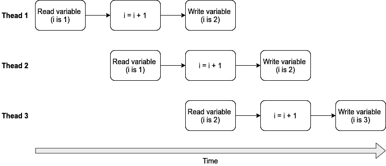

# 第十一章：在程序中使用线程

在本章中，我们将学习什么是线程以及如何在 Linux 中使用它们。 我们将使用**POSIX 线程**（也称为**pthreads**）编写几个程序。 我们还将学习什么是竞争条件，以及如何使用互斥锁来防止它们。 然后，我们将学习如何使互斥程序更高效。 最后，我们将学习什么是条件变量。

知道如何编写多线程程序将使它们更快，更高效。

在本章中，我们将涵盖以下示例：

+   编写你的第一个多线程程序

+   从线程读取返回值

+   引发竞争条件

+   使用互斥锁避免竞争条件

+   使互斥程序更高效

+   使用条件变量

让我们开始吧！

# 技术要求

对于本章，您将需要 GCC 编译器，Make 工具和通用 Makefile。 如果您尚未安装这些工具，请参考[*第一章*]（B13043_01_Final_SK_ePub.xhtml#_idTextAnchor020），*获取必要的工具并编写我们的第一个 Linux 程序*，以获取安装说明。

您还需要一个名为`htop`的程序来查看 CPU 负载。 您可以使用发行版的软件包管理器安装它。 所有发行版都称该程序为`htop`。

本章的所有代码示例都可以从 GitHub 下载，网址如下：[`github.com/PacktPublishing/Linux-System-Programming-Techniques/tree/master/ch11`](https://github.com/PacktPublishing/Linux-System-Programming-Techniques/tree/master/ch11)。

查看以下链接以查看代码演示视频：[`bit.ly/2O4dnlN`](https://bit.ly/2O4dnlN)

# 编写你的第一个多线程程序

在这个第一个示例中，我们将编写一个小程序，检查两个数字是否为质数-并行进行。 在检查这两个数字时，每个数字都在自己的**线程**中，另一个线程将在终端中写入点以指示程序仍在运行。 该程序将运行三个线程。 每个线程将打印自己的结果，因此在此程序中不需要保存和返回值。

了解线程的基础知识将为进一步学习更高级的程序打下基础。

## 做好准备

对于这个示例，您将需要`htop`程序，以便您可以看到两个 CPU 核心的**CPU**负载增加。 当然，其他类似的程序也可以工作，例如**KDE**的**K Desktop Environment**（**KDE**）的 KSysGuard。 如果您的计算机有多个 CPU **core**，那就更好了。 大多数计算机今天都有多个核心，即使是树莓派和类似的小型计算机，所以这不应该是一个问题。 即使您只有单核 CPU，该程序仍然可以工作，但是很难可视化线程。

你还需要 GCC 编译器和 Make 工具。

## 如何做…

在本章中，我们将使用`Makefile`。 注意添加的`-lpthread`，这是通用 Makefile 中没有的东西：

```
CC=gcc
```

```
CFLAGS=-Wall -Wextra -pedantic -std=c99 -lpthread
```

现在，让我们继续编写程序。 代码有点长，所以它被分成了几个步骤。 尽管所有的代码都放在一个文件中。 将代码保存为`first-threaded.c`：

1.  让我们从头文件开始，一些函数原型，`main()`函数和一些必要的变量。 注意新的头文件`pthread.h`。 我们还有一个新类型，称为`pthread_t`。 此类型用于线程 ID。 还有一个`pthread_attr_t`类型，用于线程的属性。 我们还执行检查，以查看用户是否输入了两个参数（将检查这些参数是否为质数）。 然后，我们将使用`atoll()`将第一个和第二个参数转换为`long long`整数：

```
#include <stdio.h>
#include <stdlib.h>
#include <unistd.h>
#include <pthread.h>
void *isprime(void *arg);
void *progress(void *arg);
int main(int argc, char *argv[])
{
   long long number1;
   long long number2;
   pthread_t tid_prime1;
   pthread_t tid_prime2;
   pthread_t tid_progress;
   pthread_attr_t threadattr;
   if ( argc != 3 )
   {
      fprintf(stderr, "Please supply two numbers.\n"
         "Example: %s 9 7\n", argv[0]);
      return 1;
   }
   number1 = atoll(argv[1]);
   number2 = atoll(argv[2]);
```

1.  接下来，我们将使用`pthread_attr_init()`初始化线程属性结构`threadattr`，并使用一些默认设置。

然后，我们将使用`pthread_create()`创建三个线程。`pthread_create()`函数有四个参数。第一个参数是线程 ID 变量；第二个参数是线程的属性；第三个参数是将在线程中执行的函数；第四个参数是该函数的参数。我们还将使用`pthread_detach()`将"进度条"线程标记为分离状态，这样当线程终止时，线程的资源将自动释放：

```
   pthread_attr_init(&threadattr);
   pthread_create(&tid_progress, &threadattr, 
      progress, NULL); 
   pthread_detach(tid_progress);
   pthread_create(&tid_prime1, &threadattr, 
      isprime, &number1);
   pthread_create(&tid_prime2, &threadattr, 
      isprime, &number2);
```

1.  为了使程序等待所有线程完成，我们必须为每个线程使用`pthread_join()`。请注意，我们不等待进度线程，但我们确实将其标记为分离状态。在这里，我们将在退出程序之前取消进度线程，使用`pthread_cancel()`：

```
   pthread_join(tid_prime1, NULL);
   pthread_join(tid_prime2, NULL);
   pthread_attr_destroy(&threadattr);
   if ( pthread_cancel(tid_progress) != 0 )
      fprintf(stderr, 
         "Couldn't cancel progress thread\n");
   printf("Done!\n");
   return 0;
}
```

1.  现在是时候编写将计算给定数字是否为质数的函数体了。请注意，函数的返回类型是 void 指针。参数也是 void 指针。这是`pthread_create()`要求的。由于参数是 void 指针，而我们希望它是`long long int`，因此我们必须先进行转换。我们通过将 void 指针转换为`long long int`并将其指向的内容保存在一个新变量中来实现这一点（有关更详细的选项，请参阅*参见*部分）。请注意，在这个函数中我们返回`NULL`。这是因为我们必须返回*something*，所以在这里使用`NULL`就可以了：

```
void *isprime(void *arg)
{
   long long int number = *((long long*)arg);
   long long int j;
   int prime = 1;

   /* Test if the number is divisible, starting 
    * from 2 */
   for(j=2; j<number; j++)
   {
      /* Use the modulo operator to test if the 
       * number is evenly divisible, i.e., a 
       * prime number */
      if(number%j == 0)
      {
         prime = 0;
      }
   }
   if(prime == 1)
   {
      printf("\n%lld is a prime number\n", 
         number);
      return NULL;
   }
   else
   {
      printf("\n%lld is not a prime number\n", 
         number);
      return NULL;
   }
}
```

1.  最后，我们编写进度表的函数。它并不是真正的进度表；它只是每秒打印一个点，以向用户显示程序仍在运行。在调用`printf()`后，我们必须使用`fflush()`，因为我们没有打印任何换行符（请记住 stdout 是行缓冲的）：

```
void *progress(void *arg)
{
   while(1)
   {
      sleep(1);
      printf(".");
      fflush(stdout);
   }
   return NULL;
}
```

1.  现在是时候使用我们的新 Makefile 编译程序了。请注意，我们收到了一个关于未使用的变量的警告。这是进度函数的`arg`变量。我们可以放心地忽略这个警告，因为我们知道我们没有使用它。

```
$> make first-threaded
gcc -Wall -Wextra -pedantic -std=c99 -lpthread    first-threaded.c   -o first-threaded
first-threaded.c: In function 'progress':
first-threaded.c:71:22: warning: unused parameter 'arg' [-Wunused-parameter]
 void *progress(void *arg)
```

1.  现在，在运行程序之前，打开一个新的终端并在其中启动`htop`。将它放在一个可以看到的地方。

1.  现在在第一个终端中运行程序。选择两个数字，不要太小，以至于程序会立即完成，但也不要太大，以至于程序会永远运行。对我来说，以下数字足够大，可以使程序运行大约一分半钟。这将取决于 CPU。在运行程序时，检查`htop`程序。您会注意到两个核心将使用 100%，直到计算第一个数字，然后它将只使用一个核心以 100%：

```
$> ./first-threaded 990233331 9902343047
..........
990233331 is not a prime number
...............................................................................
9902343047 is a prime number
Done!
```

## 工作原理...

两个数字分别在各自的线程中进行检查。与非线程化程序相比，这加快了进程。非线程化程序将依次检查每个数字。也就是说，第二个数字必须等到第一个数字完成后才能进行检查。但是使用线程化程序，就像我们在这里做的一样，可以同时检查两个数字。

`isprime()`函数是进行计算的地方。相同的函数用于两个线程。我们还为两个线程使用相同的默认属性。

我们通过为每个数字调用`pthread_create()`在线程中执行函数。请注意，在`pthread_create()`参数中的`isprime()`函数后面没有括号。在函数名后面加上括号会执行该函数。但是，我们希望`pthread_create()`函数执行该函数。

由于我们不会调用`pthread_cancel()`，我们将其标记为分离状态，以便在线程终止时释放其资源。我们使用`pthread_detach()`将其标记为分离状态。

默认情况下，线程具有其自己的`sleep()`函数是其中之一；因此，进度线程将在执行`sleep()`后取消。*可取消类型*可以更改为异步，这意味着它可以随时取消。

在`main()`函数的末尾，我们对两个线程 ID（执行`isprime()`的线程）调用了`pthread_join()`。这是必要的，以使进程等待线程完成；否则，它会立即结束。`pthread_join()`的第一个参数是线程 ID。第二个参数是一个变量，可以保存线程的返回值。但由于我们对返回值不感兴趣——它只返回`NULL`——我们将其设置为`NULL`，以忽略它。

## 还有更多…

要更改线程的*可取消性状态*，您可以使用`pthread_setcancelstate()`。有关更多信息，请参阅`man 3 pthread_setcancelstate`。

要更改线程的*可取消性类型*，您可以使用`pthread_setcanceltype()`。有关更多信息，请参阅`man 3 pthread_setcanceltype`。

要查看哪些函数是`man 7 pthreads`，并在该手册页面中搜索*取消点*。

从 void 指针转换为`long long int`可能看起来有点神秘。与我们在这里所做的一样，不要一行搞定：

```
long long int number = *((long long*)arg);
```

我们可以分两步写，这样会更详细一些，就像这样：

```
long long int *number_ptr = (long long*)arg;
```

```
long long int number = *number_ptr;
```

## 另请参阅

`pthread_create()`和`pthread_join()`的手册页面中有很多有用的信息。您可以使用`man 3 pthread_create`和`man 3 pthread_join`来阅读它们。

有关`pthread_detach()`的更多信息，请参阅`man 3 pthread_detach`。

有关`pthread_cancel()`的信息，请参阅`man 3 pthread_cancel`。

# 从线程中读取返回值

在这个配方中，我们将继续上一个配方。在这里，我们将从线程中获取答案作为**返回值**，而不是让它们自己打印结果。这就像从函数中返回值一样。

知道如何从线程中获取返回值使您能够用线程做更复杂的事情。

## 准备工作

为了使这个配方有意义，建议您先完成上一个配方。

您还需要我们在上一个配方中编写的 Makefile。

## 操作方法…

这个程序与上一个配方类似，但是每个线程不是打印自己的结果，而是将结果返回给`main()`。这类似于函数将值返回给`main()`，只是这里我们需要来回进行一些**转换**。这种方法的缺点是，除非我们有意将最小的数字给第一个线程，否则在两个线程都完成之前我们看不到结果。如果第一个线程有最大的数字，那么在第二个线程完成之前，即使它已经完成，我们也看不到第二个线程的结果。然而，即使我们看不到结果立即打印出来，它们仍然在两个独立的线程中进行处理，就像以前一样：

1.  代码很长，因此被分成了几个步骤。将代码写在名为`second-threaded.c`的单个文件中。和往常一样，我们从头文件、函数原型和`main()`函数的开头开始。请注意，这里有一个额外的头文件，名为`stdint.h`。这是为了`uintptr_t`类型，我们将把返回值转换为该类型。这比转换为`int`更安全，因为这保证与我们转换的指针大小相同。我们还创建了两个 void 指针（`prime1Return`和`prime2Return`），我们将保存返回值。除了这些更改，其余代码都是一样的：

```
#include <stdio.h>
#include <stdlib.h>
#include <unistd.h>
#include <pthread.h>
#include <stdint.h>
void *isprime(void *arg);
void *progress(void *arg);
int main(int argc, char *argv[])
{
   long long number1;
   long long number2;
   pthread_t tid_prime1;
   pthread_t tid_prime2;
   pthread_t tid_progress;
   pthread_attr_t threadattr;
   void *prime1Return;
   void *prime2Return;
   if ( argc != 3 )
   {
      fprintf(stderr, "Please supply two numbers.\n"
         "Example: %s 9 7\n", argv[0]);
      return 1;
   }
   number1 = atoll(argv[1]);
   number2 = atoll(argv[2]);
   pthread_attr_init(&threadattr);
   pthread_create(&tid_progress, &threadattr, 
      progress, NULL);  
   pthread_detach(tid_progress);
   pthread_create(&tid_prime1, &threadattr, 
      isprime, &number1);
   pthread_create(&tid_prime2, &threadattr, 
      isprime, &number2);
```

1.  在下一部分中，我们将之前创建的 void 指针作为`pthread_join()`的第二个参数，或者实际上是这些变量的地址。这将把线程的返回值保存在这些变量中。然后，我们检查这些返回值，看看这些数字是否是质数。但由于变量是 void 指针，我们必须首先将其转换为`unitptr_t`类型：

```
   pthread_join(tid_prime1, &prime1Return);
   if (  (uintptr_t)prime1Return == 1 )
      printf("\n%lld is a prime number\n", 
         number1);
   else
      printf("\n%lld is not a prime number\n", 
         number1);

   pthread_join(tid_prime2, &prime2Return);   
   if ( (uintptr_t)prime2Return == 1 )
      printf("\n%lld is a prime number\n", 
         number2);
   else
      printf("\n%lld is not a prime number\n", 
         number2);

   pthread_attr_destroy(&threadattr);
   if ( pthread_cancel(tid_progress) != 0 )
      fprintf(stderr, 
         "Couldn't cancel progress thread\n");
   return 0;
}
```

1.  然后我们像以前一样有函数。但是这次，我们返回 0 或 1，转换为 void 指针（因为函数声明的就是这样，我们不能违反）：

```
void *isprime(void *arg)
{
   long long int number = *((long long*)arg);
   long long int j;
   int prime = 1;

   /* Test if the number is divisible, starting 
    * from 2 */
   for(j=2; j<number; j++)
   {
      /* Use the modulo operator to test if the 
       * number is evenly divisible, i.e., a 
       * prime number */
      if(number%j == 0)
         prime = 0;
   }
   if(prime == 1)
      return (void*)1;
   else
      return (void*)0;
}
void *progress(void *arg)
{
   while(1)
   {
      sleep(1);
      printf(".");
      fflush(stdout);
   }
   return NULL;
}
```

1.  现在，让我们编译程序。我们仍然会收到关于未使用变量的相同警告，但这是安全的。我们知道我们没有用它做任何事情。

```
$> make second-threaded
gcc -Wall -Wextra -pedantic -std=c99 -lpthread    second-threaded.c   -o second-threaded
second-threaded.c: In function 'progress':
second-threaded.c:79:22: warning: unused parameter 'arg' [-Wunused-parameter]
 void *progress(void *arg)
                ~~~~~~^~~
```

1.  现在让我们尝试运行程序，首先使用更大的数字作为第一个参数，然后使用较小的数字作为第一个参数：

```
$> ./second-threaded 9902343047 99023117
......................................................................................
9902343047 is a prime number
99023117 is not a prime number
$> ./second-threaded 99023117 9902343047
.
99023117 is not a prime number
.......................................................................................
9902343047 is a prime number
```

## 工作原理…

这个程序的基本原理与上一个教程中的相同。不同之处在于，我们将计算结果从线程返回到`main()`，就像一个函数一样。但由于我们`isprime()`函数的返回值是一个 void 指针，我们还必须返回这种类型。为了保存返回值，我们将一个变量的地址作为`pthread_join()`的第二个参数传递。

由于每次调用`pthread_join()`都会阻塞，直到其线程完成，我们在两个线程都完成之前不会得到结果（除非我们首先给出最小的数字）。

我们在本教程中使用的新类型`uintptr_t`是一个特殊类型，它与无符号整数指针的大小匹配。使用常规的`int`可能也可以，但不能保证。

# 导致竞争条件

竞争条件是指多个线程（或进程）同时尝试写入同一变量的情况。由于我们不知道哪个线程会首先访问该变量，我们无法安全地预测会发生什么。两个线程都会尝试首先访问它；它们会争先访问该变量。

了解是什么导致了竞争条件将有助于避免它们，使您的程序更安全。

## 准备工作

在本教程中，您只需要本章第一个教程中编写的 Makefile，以及 GCC 编译器和 Make 工具。

## 如何做…

在本教程中，我们将编写一个导致竞争条件的程序。如果程序能正常工作，它应该在每次运行时将 1 添加到`i`变量，最终达到 5,000,000,000。有五个线程，每个线程都将 1 添加到 1,000,000,000。但由于所有线程几乎同时访问`i`变量，它永远不会达到 5,000,000,000。每次线程访问它时，它都会获取当前值并添加 1。但在此期间，另一个线程可能也读取当前值并添加 1，然后覆盖另一个线程添加的 1。换句话说，线程正在覆盖彼此的工作：

1.  代码分为几个步骤。请注意，所有代码都放在一个文件中。将文件命名为`race.c`。我们将从头文件开始，`i`的类型为`long long int`。然后编写`main()`函数，这是相当简单的。它使用`pthread_create()`创建五个线程，然后使用`pthread_join()`等待它们完成。最后，它打印出结果变量`i`：

```
#include <stdio.h>
#include <pthread.h>
void *add(void *arg);
long long int i = 0;
int main(void)
{
   pthread_attr_t threadattr;
   pthread_attr_init(&threadattr);
   pthread_t tid_add1, tid_add2, tid_add3, 
     tid_add4, tid_add5;
   pthread_create(&tid_add1, &threadattr, 
      add, NULL);
   pthread_create(&tid_add2, &threadattr, 
      add, NULL);
   pthread_create(&tid_add3, &threadattr, 
      add, NULL);
   pthread_create(&tid_add4, &threadattr, 
      add, NULL);
   pthread_create(&tid_add5, &threadattr, 
      add, NULL);
   pthread_join(tid_add1, NULL);
   pthread_join(tid_add2, NULL);
   pthread_join(tid_add3, NULL);
   pthread_join(tid_add4, NULL);
   pthread_join(tid_add5, NULL);
   printf("Sum is %lld\n", i);
   return 0;
}
```

1.  现在我们编写`add()`函数，该函数将在线程内运行：

```
void *add(void *arg)
{
   for (long long int j = 1; j <= 1000000000; j++)
   {
      i = i + 1;
   }
   return NULL;
}
```

1.  让我们编译程序。再次忽略警告是安全的：

```
$> make race
gcc -Wall -Wextra -pedantic -std=c99 -lpthread    race.c   -o race
race.c: In function 'add':
race.c:35:17: warning: unused parameter 'arg' [-Wunused-parameter]
 void *add(void *arg)
           ~~~~~~^~~
```

1.  现在，让我们尝试运行程序。我们将运行它多次。请注意，每次运行时，我们都会得到不同的值。这是因为无法预测线程的时间。但最有可能的是，它永远不会达到 5,000,000,000，这应该是正确的值。请注意，程序将需要几秒钟才能完成：

```
$> ./race 
Sum is 1207835374
$> ./race 
Sum is 1132939275
$> ./race 
Sum is 1204521570
```

1.  目前，这个程序效率相当低。在继续使用`time`命令之前，我们将对程序进行计时。完成所需的时间在不同的计算机上会有所不同。在以后的教程中，我们将使程序更加高效，使互斥程序更加高效：

```
$> time ./race
Sum is 1188433970
real    0m20,195s
user    1m31,989s
sys     0m0,020s
```

## 工作原理…

由于所有线程同时读写同一变量，它们都会撤消彼此的工作。如果它们都按顺序运行，就像非线程化程序一样，结果将是 5,000,000,000，这正是我们想要的。

为了更好地理解这里发生了什么，让我们一步一步地来。请注意，这只是一个粗略的估计；确切的值和线程会因时间而异。

第一个线程读取`i`的值；假设它是 1。第二个线程也读取`i`，仍然是 1，因为第一个线程还没有增加值。现在第一个线程将值增加到 2 并保存到`i`。第二个线程也这样做；它也将值增加到 2（1+1=2）。现在，第三个线程开始并将变量`i`读取为 2 并将其增加到 3（2+1=3）。结果现在是 3，而不是 4。这将在程序执行过程中继续进行，并且无法预测结果将会是什么。每次程序运行时，线程的**时间**都会略有不同。以下图表包含了可能出现的问题的简化示例：



图 11.1 - 竞争条件的示例

# 使用互斥锁避免竞争条件

**互斥锁**是一种**锁定机制**，它防止对**共享变量**的访问，以便不超过一个线程可以同时访问它。这可以防止竞争条件。使用互斥锁，我们只锁定代码的关键部分，例如共享变量的更新。这将确保程序的所有其他部分可以并行运行（如果这在锁定机制中是可能的）。

然而，如果我们在编写程序时不小心，互斥锁可能会大大减慢程序的速度，这将在这个食谱中看到。在下一个食谱中，我们将解决这个问题。

了解如何使用互斥锁将有助于您克服许多与竞争条件相关的问题，使您的程序更安全、更好。

## 准备工作

为了使这个食谱有意义，建议您先完成上一个食谱。您还需要我们在本章第一个食谱中编写的 Makefile，GCC 编译器和 Make 工具。

## 如何做…

这个程序建立在前一个食谱的基础上，但完整的代码在这里显示。代码分为几个步骤。但是，请记住所有的代码都放在同一个文件中。将文件命名为`locking.c`：

1.  我们将像往常一样从顶部开始。添加的代码已经高亮显示。首先，我们创建一个名为`mutex`的新变量，类型为`pthread_mutex_t`。这是用于锁定的变量。我们将这个变量放在全局区域，以便从`main()`和`add()`都可以访问到。第二个添加的部分是初始化互斥变量，使用`pthread_mutex_init()`。第二个参数使用`NULL`表示我们希望互斥锁使用默认属性：

```
#include <stdio.h>
#include <pthread.h>
void *add(void *arg);
long long int i = 0;
pthread_mutex_t i_mutex;
int main(void)
{
   pthread_attr_t threadattr;
   pthread_attr_init(&threadattr);
   pthread_t tid_add1, tid_add2, tid_add3, 
     tid_add4, tid_add5;
   if ( (pthread_mutex_init(&i_mutex, NULL)) != 0 )
   {
fprintf(stderr, 
         "Couldn't initialize mutex\n");
      return 1;
   }
   pthread_create(&tid_add1, &threadattr, 
      add, NULL);
   pthread_create(&tid_add2, &threadattr, 
      add, NULL);
   pthread_create(&tid_add3, &threadattr, 
      add, NULL);
   pthread_create(&tid_add4, &threadattr, 
      add, NULL);
   pthread_create(&tid_add5, &threadattr, 
      add, NULL);
   pthread_join(tid_add1, NULL);
   pthread_join(tid_add2, NULL);
   pthread_join(tid_add3, NULL);
   pthread_join(tid_add4, NULL);
   pthread_join(tid_add5, NULL);
```

1.  在我们完成计算后，我们使用`pthread_mutex_destroy()`销毁`mutex`变量：

```
   printf("Sum is %lld\n", i);
   if ( (pthread_mutex_destroy(&i_mutex)) != 0 )
   {
      fprintf(stderr, "Couldn't destroy mutex\n");
      return 1;
   }
   return 0;
}
```

1.  最后，我们在`add()`函数中使用锁定和解锁机制。我们锁定更新`i`变量的部分，并在更新完成后解锁。这样，变量在更新进行中被锁定，以便其他线程在更新完成之前无法访问它：

```
void *add(void *arg)
{
   for (long long int j = 1; j <= 1000000000; j++)
   {
      pthread_mutex_lock(&i_mutex);
      i = i + 1;
      pthread_mutex_unlock(&i_mutex);
   }
   return NULL;
}
```

1.  现在，让我们编译程序。像往常一样，我们可以忽略关于未使用变量的警告：

```
$> make locking
gcc -Wall -Wextra -pedantic -std=c99 -lpthread    locking.c   -o locking
locking.c: In function 'add':
locking.c:47:17: warning: unused parameter 'arg' [-Wunused-parameter]
 void *add(void *arg)
           ~~~~~~^~~
```

1.  现在是时候运行程序了。就像在上一个食谱中一样，我们将使用`time`命令计时执行。这次，计算将是正确的；最终结果将是 5,000,000,000。然而，程序将需要很长时间才能完成。在我的电脑上，需要超过 5 分钟才能完成：

```
$> time ./locking 
Sum is 5000000000
real    5m23,647s
user    8m24,596s
sys     16m11,407s
```

1.  让我们将这个结果与一个简单的非线程程序进行比较，它使用相同的基本算法实现相同的结果。让我们将这个程序命名为`non-threaded.c`：

```
#include <stdio.h>
int main(void)
{
   long long int i = 0;
   for (int x = 1; x <= 5; x++)
   {
      for (long long int j = 1; j <= 1000000000; j++)
      {
         i = i + 1;
      }
   }
   printf("Sum is %lld\n", i);
   return 0;
}
```

1.  让我们编译这个程序并计时。注意这个程序执行的速度有多快，同时又获得了相同的结果：

```
$> make non-threaded
gcc -Wall -Wextra -pedantic -std=c99 -lpthread    non-threaded.c   -o non-threaded
$> time ./non-threaded 
Sum is 5000000000
real    0m10,345s
user    0m10,341s
sys     0m0,000s
```

## 它是如何工作的…

线程化程序并不会自动比非线程化程序更快。我们在*步骤 7*中运行的非线程化程序甚至比前一个食谱中的线程化程序更快，尽管该程序甚至没有使用任何互斥锁。

那么，为什么会这样呢？

我们编写的多线程程序存在一些效率低下的问题。我们将从上一个示例中的`race.c`程序开始讨论问题。该程序比非多线程版本慢的原因是因为有许多小问题。例如，启动每个线程都需要一些时间（虽然很少，但仍然需要）。然后，每次仅更新全局的`i`变量一步也是低效的。所有线程同时访问同一个全局变量也是低效的。我们有五个线程，每个线程将其本地的`j`变量递增一次。每次这种情况发生时，线程都会更新全局的`i`变量。由于所有这些都发生了 50 亿次，所以比在单个线程中顺序运行要花费更长的时间。

然后，在本示例中的`locking.c`程序中，我们添加了一个互斥锁来锁定`i = i + 1`部分。由于这确保只有一个线程可以同时访问`i`变量，这使整个程序再次变成了顺序执行。而不是所有线程并行运行，以下情况发生：

1.  运行一个线程。

1.  锁定`i = i + 1`部分。

1.  运行`i = i + 1`以更新`i`。

1.  然后解锁`i = i + 1`。

1.  运行下一个线程。

1.  锁定`i = i + 1`部分。

1.  运行`i = i + 1`以更新`i`。

1.  然后解锁`i = i + 1`。

这些步骤将重复 5,000,000,000 次。每次线程启动都需要时间。然后需要额外的时间来锁定和解锁互斥锁，还需要时间来递增`i`变量。切换到另一个线程并重新开始整个锁定/解锁过程也需要时间。

在下一个示例中，我们将解决这些问题，使程序运行得更快。

## 另请参阅

有关互斥锁的更多信息，请参阅手册页`man 3 pthread_mutex_init`，`man 3 phtread_mutex_lock`，`man 3 phthread_mutex_unlock`和`man 3 pthread_mutex_destroy`。

# 使互斥程序更高效

在上一个示例中，我们看到多线程程序并不一定比非多线程程序快。我们还看到，当我们引入互斥锁时，程序变得非常慢。这种缓慢主要是由于来回切换、锁定和解锁数十亿次造成的。

解决所有这些锁定、解锁和来回切换的方法是尽可能少地锁定和解锁。而且，尽可能少地更新`i`变量，并在每个线程中尽可能多地完成工作。

在本示例中，我们将使我们的多线程程序运行得更快，更高效。

知道如何编写高效的多线程程序将帮助您避免许多线程问题。

## 准备工作

为了使本示例有意义，建议您完成本章中的前两个示例。除此之外，这里也有相同的要求；我们需要 Makefile、GCC 编译器和 Make 工具。

## 如何做…

这个程序是基于上一个示例中的`locking.c`程序构建的。唯一的区别是`add()`函数。因此，这里只显示`add()`函数；其余部分与`locking.c`相同。完整的程序可以从本章的 GitHub 目录中下载。文件名为`efficient.c`：

1.  复制`locking.c`并将新文件命名为`efficient.c`。

1.  重写`add()`函数，使其看起来像下面的代码。请注意，我们已经删除了`for`循环。相反，我们在`while`循环中递增一个本地的`j`变量，直到达到 10 亿。然后，我们将本地的`j`变量添加到全局的`i`变量中。这减少了我们必须锁定和解锁互斥锁的次数（从 50 亿次减少到 5 次）：

```
void *add(void *arg)
{
   long long int j = 1;
   while(j < 1000000000)
   {
      j = j + 1;
   }
   pthread_mutex_lock(&i_mutex);
   i = i + j;
   pthread_mutex_unlock(&i_mutex);
   return NULL;
}
```

1.  编译程序：

```
$> make efficient
gcc -Wall -Wextra -pedantic -std=c99 -lpthread    efficient.c   -o efficient
efficient.c: In function 'add':
efficient.c:47:17: warning: unused parameter 'arg' [-Wunused-parameter]
 void *add(void *arg)
           ~~~~~~^~~
```

1.  现在，让我们运行程序并使用`time`命令计时。请注意，这个程序运行得多快：

```
$ time ./efficient 
Sum is 5000000000
real    0m1,954s
user    0m8,858s
sys     0m0,004s
```

## 它是如何工作的…

这个程序比非线程化版本和第一个锁定版本都要快得多。作为执行时间的提醒，非线程化版本大约需要 10 秒才能完成；第一个线程化版本（`race.c`）大约需要 20 秒才能完成；第一个互斥版本（`locking.c`）需要超过 5 分钟才能完成。最终版本（`efficient.c`）只需要不到 2 秒就能完成——这是一个巨大的改进。

这个程序之所以快得多，有两个主要原因。首先，这个程序只锁定和解锁互斥锁 5 次（与上一个示例中的 5,000,000,000 次相比）。其次，每个线程现在可以在向全局变量写入任何内容之前完全完成其工作（`while`循环）。

简而言之，每个线程现在可以在没有任何中断的情况下完成其工作，使其真正成为线程化。只有当线程完成其工作后，它们才会将结果写入全局变量。

# 使用条件变量

`main()`使用一个条件变量来表示它已经完成，然后与该线程连接。

了解如何使用条件变量将有助于使您的线程程序更加灵活。

## 准备工作

为了使这个示例有意义，建议您先完成*从线程中读取返回值*示例。您还需要 GCC 编译器，我们在*编写您的第一个线程化程序*示例中编写的 Makefile 以及 Make 工具。

如何做...

在这个示例中，我们将从*从线程中读取返回值*示例中重新编写素数程序，以使用条件变量。完整的程序将在这里显示，但我们只讨论了这个示例的新增部分。

由于代码很长，它已经被分成了几个步骤。将代码保存在一个名为`cond-var.c`的文件中：

1.  我们将像往常一样从顶部开始。在这里，我们添加了三个新变量，一个我们称为`lock`的互斥锁，一个我们称为`ready`的条件变量，以及一个用于素数线程的线程 ID，我们称为`primeid`。`primeid`变量将用于从已完成的线程发送线程 ID：

```
#include <stdio.h>
#include <stdlib.h>
#include <unistd.h>
#include <pthread.h>
#include <stdint.h>
void *isprime(void *arg);
void *progress(void *arg);
pthread_mutex_t lock;
pthread_cond_t ready;
pthread_t primeid = 0;
int main(int argc, char *argv[])
{
   long long number1;
   long long number2;
   pthread_t tid_prime1;
   pthread_t tid_prime2;
   pthread_t tid_progress;
   pthread_attr_t threadattr;
   void *prime1Return;
   void *prime2Return;
```

1.  然后我们必须初始化**互斥锁**和**条件变量**：

```
   if ( (pthread_mutex_init(&lock, NULL)) != 0 )
   {
      fprintf(stderr, 
         "Couldn't initialize mutex\n");
      return 1;
   }
   if ( (pthread_cond_init(&ready, NULL)) != 0 )
   {
      fprintf(stderr, 
        "Couldn't initialize condition variable\n");
      return 1;
   }
```

1.  之后，我们检查参数的数量，就像以前一样。如果参数计数正确，我们就用`pthread_create()`启动线程，也和以前一样：

```
   if ( argc != 3 )
   {
      fprintf(stderr, "Please supply two numbers.\n"
         "Example: %s 9 7\n", argv[0]);
      return 1;
   }
   number1 = atoll(argv[1]);
   number2 = atoll(argv[2]);
   pthread_attr_init(&threadattr);
   pthread_create(&tid_progress, &threadattr, 
      progress, NULL);  
   pthread_detach(tid_progress);
   pthread_create(&tid_prime1, &threadattr, 
      isprime, &number1);
   pthread_create(&tid_prime2, &threadattr, 
      isprime, &number2);
```

1.  现在是有趣的部分。我们将从锁定互斥锁开始，以保护`primeid`变量。然后，我们使用`pthread_cond_wait()`等待条件变量的信号。这将释放互斥锁，以便线程可以写入`primeid`。请注意，我们还在`while`循环中循环`pthread_cond_wait()`调用。我们这样做是因为我们只想在`primeid`仍然为 0 时等待信号。由于`pthread_cond_wait()`将阻塞，它不会使用任何 CPU 周期。当我们收到信号时，我们移动到`if`语句。这将检查哪个线程已经完成并加入它。然后我们回去并使用`for`循环重新开始。每当`if`或`else`语句完成时——当一个线程已经加入时——`primeid`变量将被重置为 0。这将使下一次迭代再次等待`pthread_cond_wait()`：

```
   pthread_mutex_lock(&lock);
   for (int i = 0; i < 2; i++)
   {
      while (primeid == 0)
         pthread_cond_wait(&ready, &lock);
      if (primeid == tid_prime1)
      {
         pthread_join(tid_prime1, &prime1Return);
         if (  (uintptr_t)prime1Return == 1 )
            printf("\n%lld is a prime number\n", 
               number1);
         else
            printf("\n%lld is not a prime number\n", 
               number1);
         primeid = 0;
      }
      else
      {
         pthread_join(tid_prime2, &prime2Return);   
         if ( (uintptr_t)prime2Return == 1 )
            printf("\n%lld is a prime number\n", 
               number2);
         else
            printf("\n%lld is not a prime number\n", 
               number2);
         primeid = 0;
      }
   }
   pthread_mutex_unlock(&lock);
   pthread_attr_destroy(&threadattr);
   if ( pthread_cancel(tid_progress) != 0 )
      fprintf(stderr, 
         "Couldn't cancel progress thread\n");

   return 0;
}
```

1.  接下来，我们有`isprime()`函数。这里有一些新的行。一旦函数计算完数字，我们就锁定互斥锁以保护`primeid`变量。然后我们将`primeid`变量设置为线程的 ID。然后，我们发出条件变量（`ready`）的信号并释放互斥锁。这将唤醒`main()`函数，因为它现在正在等待`pthread_cond_wait()`：

```
void *isprime(void *arg)
{
   long long int number = *((long long*)arg);
   long long int j;
   int prime = 1;

   for(j=2; j<number; j++)
   {
      if(number%j == 0)
         prime = 0;
   }
   pthread_mutex_lock(&lock);
   primeid = pthread_self();
   pthread_cond_signal(&ready);
   pthread_mutex_unlock(&lock);
   if(prime == 1)
      return (void*)1;
   else
      return (void*)0;
}
```

1.  最后，我们有`progress()`函数。这里没有改变：

```
void *progress(void *arg)
{
   while(1)
   {
      sleep(1);
      printf(".");
      fflush(stdout);
   }
   return NULL;
}
```

1.  现在，让我们编译程序：

```
$> make cond-var
gcc -Wall -Wextra -pedantic -std=c99 -lpthread    cond-var.c   -o cond-var
cond-var.c: In function 'progress':
cond-var.c:114:22: warning: unused parameter 'arg' [-Wunused-parameter]
 void *progress(void *arg)
```

1.  现在让我们尝试一下这个程序。我们将用较小的数字作为第一个参数和第二个参数来测试它。无论如何，最快的计算数字都将立即显示出来，而不需要等待其他线程加入：

```
$> ./cond-var 990231117 9902343047
........
990231117 is not a prime number
................................................................................
9902343047 is a prime number
$> ./cond-var 9902343047 990231117
........
990231117 is not a prime number
...............................................................................
9902343047 is a prime number
```

## 它是如何工作的...

当我们在`while`循环中使用`pthread_cond_wait()`等待时，我们同时使用条件变量（`ready`）和互斥锁（`lock`）进行调用。这样，它就知道释放哪个互斥锁，等待哪个信号。就是在等待时释放互斥锁。

在等待期间，其他线程可以写入`primeid`变量。其他线程在写入变量之前会先用互斥锁锁定变量。一旦他们写入变量，就会发出条件变量的信号并释放互斥锁。这会唤醒`main()`函数，它目前正在使用`pthread_cond_wait()`等待。`main()`函数然后检查哪个线程完成了，并使用`pthread_join()`加入它。然后，`main()`函数将`primeid`变量重置为 0，并使用`pthread_cond_wait()`再次等待，直到下一个线程发出完成的信号。我们正在等待两个线程，所以`main()`中的`for`循环将运行两次。

每个线程都使用`pthread_self()`获得自己的线程 ID。

## 另请参阅

有关条件变量的更多信息，请参阅以下手册页面。

+   `man 3 pthread_cond_init()`

+   `man 3 pthread_cond_wait()`

+   `man 3 pthread_cond_signal()`
