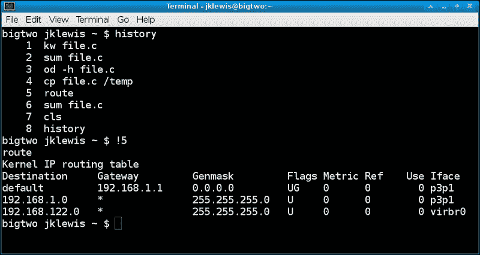
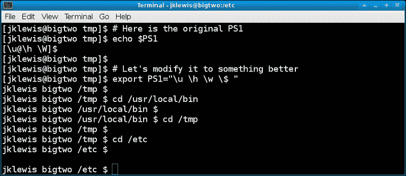
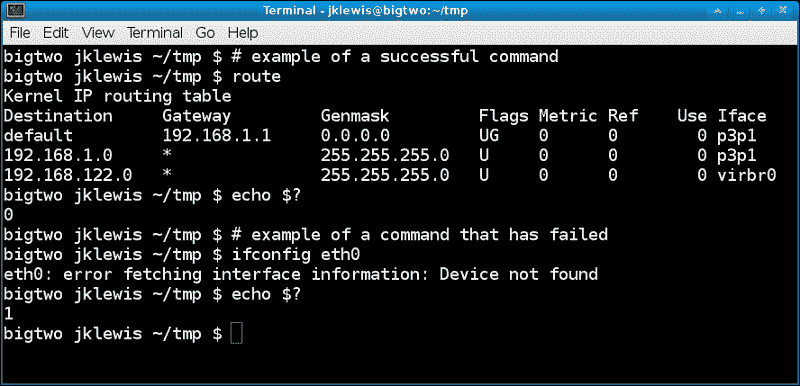

# 一、使用终端/命令行

在本章中，我们将介绍:

*   命令检索和行编辑
*   使用历史
*   文件名自动完成
*   Shell 提示
*   其他环境变量
*   使用别名
*   `.bashrc`文件
*   处理文件名中的空白和特殊字符
*   理解`$?`变量
*   重定向和管道
*   将输出从一个终端发送到另一个终端
*   使用屏幕程序

# 简介

知道如何有效地使用命令行将真正帮助您充分利用您的计算机。键入命令时，有许多方法可以节省时间和精力，您只需要知道它们是什么。

有许多不同的 Linux 环境可用。本章重点介绍流行的 **Bash** Shell。

# 命令检索和行编辑

A 标准 Bash 终端自动设置为插入模式，无需按*插入*键插入文字。使用上下箭头键调出上一个命令，然后使用其他光标键根据需要编辑该行。


## 做好准备

这个例子只需要一个运行 Bash shell 的终端。其他终端可能不具备这些能力。

## 怎么做...

我们将运行如下几个命令:

1.  键入命令`route`并按下*进入*键。
2.  对`uptime`、`ls`、`date`和`sync`进行同样的操作，每次命令后按*进入*。
3.  现在按一次向上箭头键。您应该会看到以下命令:

    ```sh
    sync

    ```

4.  现在再按两次向上箭头。你应该看到`date`和`ls`。
5.  按*进入*。`ls`命令将再次运行。按下*进入*将始终运行所示的命令。

## 它是如何工作的...

行是存储在具有完整编辑功能的缓冲区中的。当按下*进入*键时，该缓冲区被发送到操作系统。

用于检索和编辑的关键字汇总如下:

*   **向上箭头**:用于向上滚动历史缓冲区
*   **向下箭头**:用于向下滚动历史缓冲区
*   **Home** :用于将光标带到行首
*   **结束**:用于将光标带到行尾
*   **删除**:用于删除光标右侧的字符
*   **退格**:用于删除光标左侧的字符并移位行
*   **左右箭头**:这些是光标移动键

# 利用历史

标准 Bash shell 包含一个**历史**功能。它将每个命令记录在一个数据库中，通过运行`history`命令可以显示该数据库。在本节中，我们展示了如何做到这一点。

## 做好准备

您只需要一个 Bash 终端来遵循给定的步骤。

请看下面的截图:



## 怎么做...

1.  运行一些命令，如`route`、`uptime`、`date`和`sync`。
2.  运行`history`命令。
3.  寻找您想要再次运行的命令，但不要键入该命令，而是键入感叹号(`!`)，然后键入命令旁边的数字，如历史列表所示，然后按*进入*。
4.  该命令将再次运行。

## 它是如何工作的...

将命令行历史视为线性数据库。您可以上下滚动，直到看到您想要的命令。这也有助于回忆你不久前做过的事情。`HISTSIZE`环境变量控制缓冲区中将保存多少命令。

### 类型

使用此功能时要小心。在运行之前，请确保您有正确的命令。

# 文件名自动完成

运行命令时，您不必键入整个文件名。这节省了大量的时间和精力，也有助于防止错别字。

*选项卡*键用于调用文件名自动完成。请看下面的截图:


您只需键入足够的字符，使您想要的文件名唯一，然后按下*选项卡*。如果您没有键入足够的字符，您将听到控制台嘟嘟声(在大多数 Shell 中)。如果您现在再次按下*标签*，将显示所有可能性。

## 做好准备

这个例子只需要一个运行 Bash shell 的终端。

## 怎么做...

1.  换到你的主目录，我的情况是:

    ```sh
    cd /home/jklewis.

    ```

2.  使用以下命令创建目录:

    ```sh
    mkdir Linuxbook

    ```

3.  使用以下命令将其更改为【T0:

    ```sh
    cd Linuxbook
    ls > file2.txt
    ls > file3.txt
    ls > file4.txt
    ls > unique1.txt

    ```

4.  现在让我们创建一些虚拟文件；使用以下命令运行:

    ```sh
    ls > file1.txt

    ```

5.  现在输入`ls -la u`，然后按*键*。文件名的其余部分**“unique 1 . txt”**将出现。按*进入*。
6.  现在输入`ls -al file`并按下*标签*。什么都不会发生，你的控制台可能会发出哔哔声。再次按下*标签*。现在所有 4 个文件名都会出现。
7.  添加一个`4`，再次按 *Tab* ，然后*进入*。命令`ls -la file4`将运行。

这可能看起来很复杂甚至笨拙，但如果你给它一个机会，你很快就会成为专家。

# Shell 提示

一个标准终端通常有一个相当神秘的命令行提示。这应该通过修改 **PS1** 环境变量来改变。

## 怎么做...

一个例子如下截图所示:



参考**行导出 PS1="\u \h \w \$ "**

1.  `\u`命令表示显示该 shell 的当前用户。
2.  `\h`命令显示该机器的主机名。
3.  `\w`命令表示显示当前目录的完整路径。强烈建议进行此更改，因为用户不必一直键入 **pwd** ( **打印工作目录**)来了解正在使用的目录。
4.  `\$`表示根据有效 UID 显示`$`或`#`。

## 还有更多...

还有很多更多的选项，比如显示时间和日期，使用颜色等等。更多信息，运行`man bash`搜索`PS1`。

# 其他环境变量

`PS1` 变量只是字面上数百个环境变量中的一个。别担心，你不必都知道！以下是几个非常有用的例子:

*   `PS1`:显示，设置命令行提示
*   `USER`:显示当前用户
*   `HOSTNAME`:显示这台机器的当前主机名
*   `HOME`:显示当前用户的主目录
*   `SHELL`:显示该终端正在运行的当前 Shell
*   `TERM`:它显示正在使用哪个终端类型
*   `PATH`:显示，设置搜索节目的目录
*   `PWD`:显示当前工作目录
*   `EDITOR`:它可以设置为您想要的文本编辑器的完整路径，用于某些命令，如`crontab -e`
*   `TZ`:显示并设置时区变量
*   `HISTSIZE`:显示并设置历史缓冲区的大小

这些大多不言自明；然而，有几个需要更多的讨论。`PATH`环境变量是在文件系统中搜索命令的地方。

`echo`命令用于显示变量的内容:


## 怎么做...

1.  在`PATH`前面加上一个点意味着在搜索路径的其余部分之前，将首先在当前目录中查找程序。例如，这在代码开发过程中非常有用。通过运行

    ```sh
    export PATH=".:$PATH"

    ```

    来实现
2.  `EDITOR`变量可以设置为你喜欢的文本编辑器。大多数人使用`vi (or vim)`；然而，你可以把它指向你想要的那个。如果更改此选项，请确保使用完整路径。要更改`EDITOR`变量，请执行以下操作:

    ```sh
    export EDITOR=/lewis/bin64/kw

    ```

3.  一个`export`可以通过设置为无来移除:

    ```sh
    export EDITOR=

    ```

4.  按照惯例，环境变量通常用大写字母书写。查看手册页和/或在谷歌上搜索关于这些变量的更多信息。

## 它是如何工作的...

想象一下这些环境变量，就像你使用编程语言一样。在这种情况下，变量的类型由操作系统决定。例如，您可以键入`A=1`或`A="This is a string"`。

操作系统知道区别。此外，还有可变范围。注意我没有使用上面的`export`。也就是说这个`A`是这个 Shell 的本地。只有导出一个变量才能使它对其他 shells 可用(在获取文件之后)。

# 使用别名

如果你可以轻松地创建一个简单的命令，而不必用它来编写脚本，那不是很好吗？嗯，有个办法。这是使用**别名**完成的。

## 怎么做...

以下是创建别名的步骤:

1.  键入`tput clear`并按*进入*。你的屏幕应该已经清空了。
2.  现在进入`alias cls="tput clear"`。现在当你运行`cls`时，它也会做同样的事情。
3.  让我们再创造一些。要显示长目录列表，请输入`alias la="ls -la"`。输入`'la'`运行别名。
4.  要显示最近文件的长列表，请输入`'alias lt="ls -latr"'`。

如果您创建了一个别名，然后决定不再需要它，您可以使用`unalias`命令删除它，例如 `unalias cls`。

您还可以使用别名来高效地在文件系统中移动。这非常方便，将节省你难以置信的打字量。以下是一些例子:

1.  `mkdir /home/jklewis/linuxbook`
2.  `alias lbook="cd /home/jklewis/linuxbook"`
3.  `lbook`

您现在将被带到该目录。以下是我在系统中经常使用的一些东西:

1.  `export LBOOK="/home/jklewis/linuxbook"`
2.  `alias lbook="cd $LBOOK"`
3.  `lbook`

如你所见，运行`lbook`将带你进入如上所示的目录。但是，您也可以使用`LBOOK`变量将文件复制到该目录:

1.  `cd /tmp`
2.  `touch f1.txt`
3.  `cp f1.txt $LBOOK`

文件`f1.txt`现在将存在于`/home/jklewis/linuxbook`目录中。当使用超长文件名时，这变得更加方便。

### 类型

要删除`lbook`别名，请运行`unalias lbook`

只需运行`alias`不需要任何参数就可以列出你的别名。每当你发现自己不断地输入相同的命令或文件名时，考虑为其创建一个别名。

## 还有更多...

请注意，上面的示例仅在该终端中有效，并且不会在重启后持续存在。请参阅下一节，了解如何使更改永久化。

此外，在某些情况下，您想要做的事情对于别名来说可能过于复杂，例如，无法检查参数的正确数量。这是您可以创建 shell 脚本的地方，这将在[第 8 章](08.html "Chapter 8. Working with Scripts")、*使用脚本*中介绍。

# The。bashrc 文件

还有很多环境变量我们可以看一下，改变一下。然而，我们当然不希望每次开始一个新壳就进入这些。有一个特殊的文件，名为`.bashrc`，用来存储你的设置。它位于用户的主目录中。例如，根用户的`.bashrc`文件位于`/root`目录中。

这是我的一个系统中的`.bashrc`文件:


## 怎么做...

线路描述如下:

1.  要注释一行，在它前面加一个`#`符号。
2.  要创建一个变量，使用`export`标记。
3.  要创建别名，请使用`alias`标记(如本章前面所示)。
4.  允许控制语句；参见上一张截图中的`if`子句。
5.  修改完您的`.bashrc`文件后，记得使用点操作符如下来源:

    ```sh
    . .bashrc

    ```

# 处理文件名中的空白和特殊字符

Linux(和 Unix) 文件系统最初并不是为了处理文件名中的空白而设计的。这可能会导致很多问题，因为 shell 会将空白之后的每个项目视为另一个文件或参数。解决办法是使用引号、反斜杠或*标签*键。

以下部分假设用户没有修改 Bash **内部字段**分隔符( **IFS** )变量。

## 怎么做...

请看下面的截图。我特意创建了三个“坏”文件名:


1.  运行`ls -la file with blanks.txt`并注意错误。
2.  现在再次运行它，但是用引号将文件名括起来:`ls -la "file with blanks.txt"`；它现在会正常工作。
3.  进入`ls -la file`并按下*标签*。它会为你逃离空白。
4.  运行`ls -la special>.txt`。观察错误。
5.  像以前一样使用以下命令用引号括起来:

    ```sh
    ls -la "special>.txt"

    ```

6.  现在试试`ls -la -startswithdash.txt`然后试着引用一下。不管用，对吧？
7.  使用以下命令在文件名前面加上`./`操作符:

    ```sh
    ls -la ./-starWtswithdash.txt

    ```

如您所见，如果文件名中使用了特殊字符，这也可能是一个问题。稍微研究一下这个就会明白了。记住*标签*键；它对几乎所有情况都很有效。如果文件以破折号开始，使用`./`操作符。意思是指当前目录下的文件。

## 还有更多...

空白和特殊字符的问题在脚本中更是一个问题。这将在[第 8 章](08.html "Chapter 8. Working with Scripts")、*使用脚本*中详细介绍。

# 了解美元？可变的

典型地，当一个命令在 Linux 中运行时，它执行一个任务；它要么报告它所做的事情，要么指出发生了错误。还会生成一个内部返回代码，并通过运行`echo $?`命令进行显示。请注意，这一定是原始命令之后键入的下一个内容。

以下截图显示`echo $?`:



## 怎么做...

这里有一个快速的例子 **echo $？**:

1.  运行以下命令:

    ```sh
    ping -c 1 packt.com

    ```

2.  它应该会成功。运行以下命令:

    ```sh
    echo $?

    ```

3.  你应该得到一个成功的机会。
4.  Now run the following command:

    ```sh
    ping -c 1 phooey

    ```

    ### 类型

    可能需要一两秒钟才能完成。

5.  再次运行`echo $?`。它应该返回一个非零值来指示失败。

## 它是如何工作的...

总的来说，归零意味着成功。非零返回表示发生了错误，在许多情况下，返回的代码指示错误是什么。下次输入命令时请记住这一点，点击*进入*，并在没有任何事情发生的情况下返回 shell 提示符。

## 还有更多...

命令的`man`和`info`页面通常包含一个条目，显示错误的含义。如果缺少`man`页面，请查阅网页。

# 重定向和管道

假设你运行一个命令，说`route`，并且想把输出保存在一个文件中。使用**重定向** ( `>`)操作符来完成此操作，而不是将输出发送到屏幕。

## 怎么做...

让我们尝试一些重定向:

1.  进入`ifconfig > file1.txt`。你不会看到任何东西，因为输出进入了文件。
2.  运行`cat file1.txt`。现在您应该看到输出了。
3.  这也适用于另一个方向，从文件中读取运行以下命令:

    ```sh
    sort < file1.txt

    ```

4.  你甚至可以一步完成两者:

    ```sh
    sort < file1.txt > output-file.txt

    ```

5.  您也可以使用管道操作符将输出发送到另一个命令。比如跑`route | grep eth0`。上面的命令将只显示来自`route`的包含短语`eth0`的行。

## 还有更多...

这是我一直在用的东西。说我很久以前用 C 写了一个程序，有好几个版本，想找最新的。我可以跑去找到他们所有人:

```sh
locate crc.c

```

这可能会返回相当多的行。如何在每个文件上运行`ls`找到最新的一个？通过将输出输入`xargs`命令，然后输入`ls`:

```sh
locate crc.c | xargs ls -la

```

这将显示每个文件的时间和日期。

起初这可能看起来有点复杂，但如果你做一点实验，它会成为你的第二天性。

# 从一个终端向另一个终端发送输出

这是 Linux/UNIX 系统独有的非常方便的特性。它在脚本中最有用，但是也可以在命令行中使用。如果您有可用的系统，请尝试给定的步骤。

## 做好准备

你需要两个开放的终端。

## 怎么做...

我们通过以下步骤展示如何将输出从一个终端发送到另一个终端:

1.  在一个终端运行`tty`命令。输出应该类似于`/dev/pts/16`。
2.  在另一个终端运行`route`命令。您将在该终端中看到输出。
3.  现在再次运行`route`，但是现在使用命令:

    ```sh
    route > /dev/pts/16

    ```

4.  输出将到达另一个终端。

## 它是如何工作的...

Linux 系统上的终端是有自己缓冲空间的设备。通过按名称引用设备，您可以对其进行写入。

## 还有更多...

这个特性在脚本中更有用，我们将在[第 8 章](08.html "Chapter 8. Working with Scripts")、*使用脚本*中看到。

# 使用屏幕程序

**Screen** 是一个全屏窗口管理器，与其他进程(通常是其他终端/Shell)共享一个物理终端。它是通常在没有其他管理器或桌面可用时使用，例如在服务器上。它有一个回卷历史缓冲区，还允许在窗口之间复制和粘贴文本。

## 做好准备

以下是 Screen 提供的许多键绑定中的一些的简要列表:

*   *Ctrl* + *A* + *？*:显示命令及其键绑定的列表
*   *Ctrl* + *A* + *C* :弹出新窗口
*   *Ctrl* + *A* + *D* :拆窗
*   *Ctrl* + *A* + *N* :用于转到序列中下一个窗口
*   *Ctrl* + *A* + *P* :用于转到序列中的上一个窗口
*   *Ctrl* + *A* + *#* (其中#为数字):用于直接前往该窗口
*   *Ctrl*+*A*+*“*:显示窗口列表；用户可以通过数字选择任何一个

以下是常用命令列表:

*   `screen -list`:显示所有窗口
*   `screen <program>`:它会创建一个新窗口，并在其中运行该程序

## 怎么做...

运行屏幕实用程序的示例如下:

1.  在终端运行`screen -L` 命令。
2.  现在按 *Ctrl* + *A* 然后按 *C* 。这将创建另一个窗口。
3.  再做两次。
4.  试着输入 *Ctrl* + *A* + *0* 。
5.  试试 *Ctrl* + *A* + *3* 。

## 它是如何工作的...

在的上一部分，步骤 1 将创建一个新窗口`window 0`。如果您在窗口管理器中运行，您可能会注意到显示它是哪个窗口的标题变化。

步骤 2 将创建另一个窗口。在步骤 3 之后，您总共将有 4 个窗口。

当你执行步骤 4 中的动作时，你应该在`window 0`中。输入 *Ctrl* + *a* + *3* 会带你到`window 3`。

## 还有更多...

这里有一个有用的提示，如果你只运行一个没有桌面的命令行，你可能想要在你的`.bashrc`文件中将你的`PS1`变量更改为类似于下面的内容:

```sh
export PS1="screen$WINDOW \h \u \w \$ "

```

现在，提示将始终显示您所在的窗口。

这只是描述了 Screen 所能做的一小部分。更多信息请参考`man`页面。