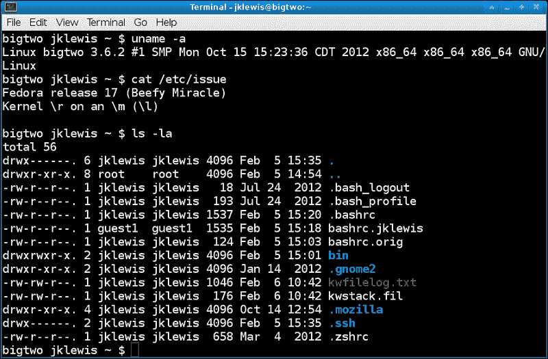
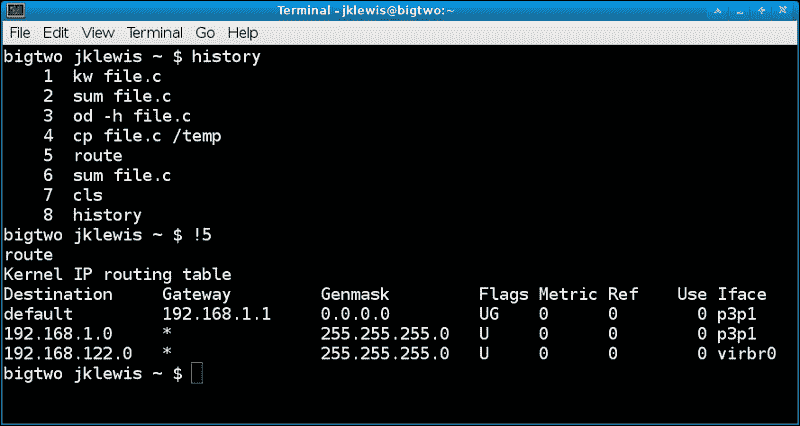
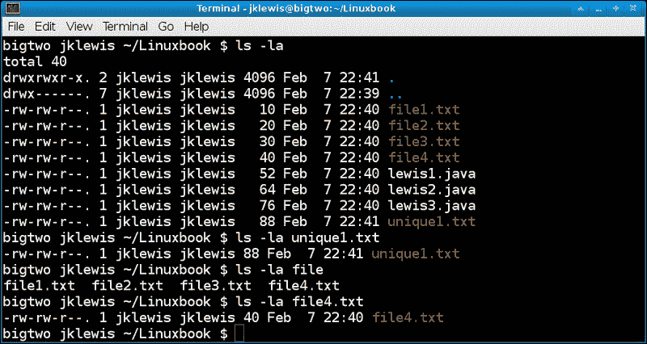
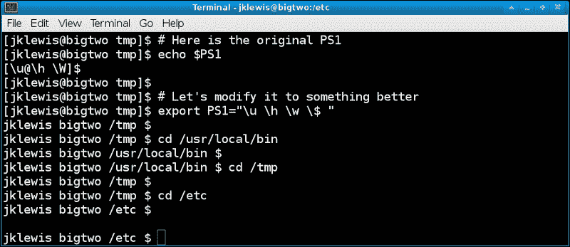
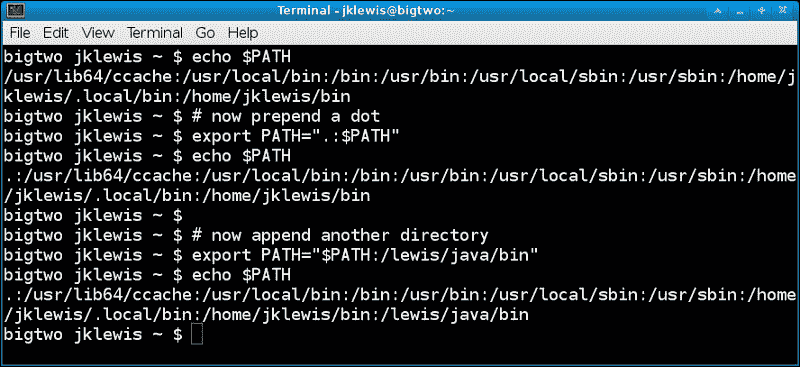
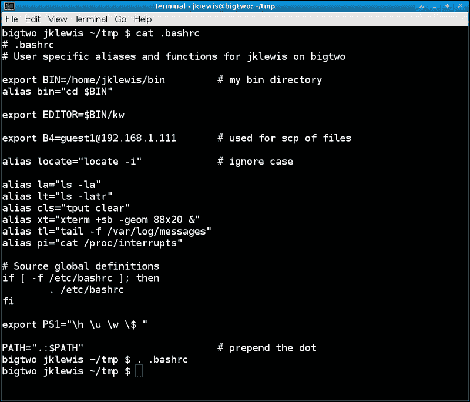
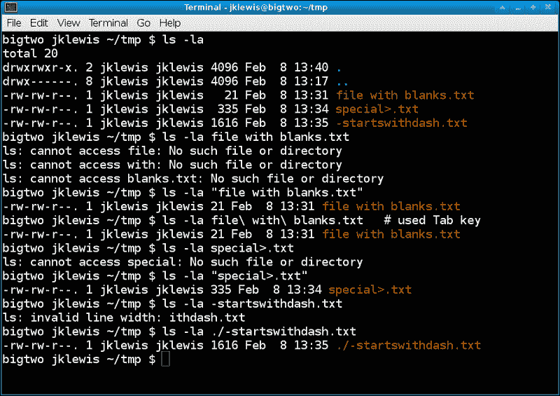

# 第一章：使用终端/命令行

在本章中，我们将涵盖：

+   命令检索和行编辑

+   使用历史记录

+   文件名自动完成

+   shell 提示

+   其他环境变量

+   使用别名

+   `.bashrc`文件

+   处理文件名中的空格和特殊字符

+   了解`$?`变量

+   重定向和管道

+   将输出从一个终端发送到另一个终端

+   使用 Screen 程序

# 介绍

了解如何有效使用命令行将真正帮助您充分利用计算机。在输入命令时，有许多节省时间和精力的方法，您只需要知道它们是什么。

有许多不同的 Linux 环境可用。本章重点介绍了流行的**Bash** shell。

# 命令检索和行编辑

标准的 Bash 终端自动设置为插入模式，因此您无需按*Insert*键来插入文本。使用上下箭头键来回忆以前的命令，然后使用其他光标键根据需要编辑该行。



## 准备工作

对于此示例，您只需要运行 Bash shell 的终端。其他终端可能没有这些功能。

## 如何做...

我们将按以下方式运行一些命令：

1.  输入命令`route`并按*Enter*键。

1.  对`uptime`、`ls`、`date`和`sync`执行相同的操作，每次输入命令后按*Enter*。

1.  现在再按一次上箭头键。您应该会看到以下命令：

```
sync

```

1.  现在再按两次上箭头键。您应该会看到`date`和`ls`。

1.  按*Enter*。`ls`命令将再次运行。按*Enter*将始终运行显示的命令。

## 它是如何工作的...

该行存储在具有完整编辑功能的缓冲区中。当按下*Enter*键时，该缓冲区将被发送到操作系统。

用于检索和编辑的键的摘要如下：

+   **上箭头**：用于向上滚动历史缓冲区

+   **下箭头**：用于向下滚动历史缓冲区

+   **Home**：用于将光标移动到行的开头

+   **End**：用于将光标移动到行的末尾

+   **删除**：用于删除光标右侧的字符

+   **退格键**：用于删除光标左侧的字符并移动行

+   **左右箭头**：这些是光标移动键

# 使用历史记录

标准的 Bash shell 包括一个**history**功能。它记录每个命令在一个数据库中，可以通过运行`history`命令来显示。在本节中，我们已经展示了如何做到这一点。

## 准备工作

您只需要一个 Bash 终端来按照给定的步骤进行操作。

请参阅以下屏幕截图：



## 如何做...

1.  运行一些命令，如`route`、`uptime`、`date`和`sync`。

1.  运行`history`命令。

1.  查找您想再次运行的命令，但是不要输入命令，而是输入感叹号（`!`），然后输入历史列表中命令旁边的数字，然后按*Enter*。

1.  该命令将再次运行。

## 它是如何工作的...

将命令行历史视为线性数据库。您可以向上或向下滚动，直到看到所需的命令。这也有助于回忆一段时间前所做的事情。`HISTSIZE`环境变量控制将在缓冲区中保存多少个命令。

### 提示

在使用此功能时要小心。确保在运行之前输入正确的命令。

# 文件名自动完成

运行命令时，您无需输入完整的文件名。这样可以节省大量时间和精力，还可以帮助防止输入错误。

*Tab*键用于调用文件名自动完成。请参阅以下屏幕截图：



您只需输入足够的字符使您想要的文件名变得唯一，然后按*Tab*。如果您没有输入足够的字符，您将听到控制台发出哔哔声（在大多数 shell 中）。如果现在再次按*Tab*，则将显示所有可能性。

## 准备工作

在此示例中，你只需要运行 Bash shell 的终端。

## 如何做...

1.  切换到你的主目录，我的情况下是：

```
cd /home/jklewis.

```

1.  使用以下命令创建一个目录：

```
mkdir Linuxbook

```

1.  使用以下命令切换到 `Linuxbook`：

```
cd Linuxbook
ls > file2.txt
ls > file3.txt
ls > file4.txt
ls > unique1.txt

```

1.  现在让我们创建一些虚拟文件；使用以下命令运行：

```
ls > file1.txt

```

1.  现在输入 `ls -la u`，然后按 *Tab*。其余的文件名 **"unique1.txt"** 将出现。按 *Enter*。

1.  现在输入 `ls -al file` 并按 *Tab*。什么也不会发生，你的控制台可能会响起。再次按 *Tab*。现在所有 4 个文件名将出现。

1.  添加一个 `4`，再次按 *Tab*，然后按 *Enter*。命令 `ls -la file4` 将运行。

这可能看起来复杂甚至笨拙，但如果你给它一个机会，你将很快成为专家。

# shell 提示符

标准终端通常具有相当晦涩的命令行提示符。这应该通过修改 **PS1** 环境变量来更改。

## 如何做...

以下是一个示例：



参考行 **export PS1="\u \h \w \$ "**

1.  `\u` 命令表示显示此 shell 的当前用户。

1.  `\h` 命令显示此计算机的主机名。

1.  `\w` 命令表示显示当前目录的完整路径。强烈建议进行此更改，因为用户不必一直输入 **pwd** (**Print Working Directory**) 来了解正在使用的目录。

1.  `$` 表示显示 `$` 或 `#` 取决于有效的 UID。

## 还有更多...

还有许多其他选项，比如显示时间和日期，使用颜色等。要获取更多信息，请运行 `man bash` 并搜索 `PS1`。

# 其他环境变量

`PS1` 变量只是成百上千个环境变量中的一个。别担心，你不必全部了解它们！以下是一些非常有用的变量：

+   `PS1`: 显示并设置命令行提示符

+   `USER`: 显示当前用户

+   `HOSTNAME`: 显示此计算机的当前主机名

+   `HOME`: 显示当前用户的主目录

+   `SHELL`: 显示此终端正在运行的当前 shell

+   `TERM`: 显示正在使用的终端类型

+   `PATH`: 显示并设置程序搜索的目录

+   `PWD`: 显示当前工作目录

+   `EDITOR`: 可以设置为所需文本编辑器的完整路径，以便与某些命令一起使用，如 `crontab -e`

+   `TZ`: 显示并设置时区变量

+   `HISTSIZE`: 显示并设置历史缓冲区的大小

其中大多数都是不言自明的；但有一些需要更多讨论。`PATH` 环境变量是在文件系统中搜索命令的地方。

`echo` 命令用于显示变量的内容：



## 如何做...

1.  在 `PATH` 前加一个点意味着程序将首先在当前目录中查找，然后再搜索其余的路径。例如，在代码开发期间，这非常有用。通过运行以下命令来实现这一点：

```
export PATH=".:$PATH"

```

1.  `EDITOR` 变量可以设置为你喜欢的文本编辑器。大多数人使用 `vi (或 vim)`；但是，你可以指向你想要的编辑器。如果更改了这个，请确保使用完整路径。要更改 `EDITOR` 变量，请执行以下操作：

```
export EDITOR=/lewis/bin64/kw

```

1.  `export` 可以通过将其设置为空来移除：

```
export EDITOR=

```

1.  按照惯例，环境变量通常以大写字母编写。查看 man 手册和/或在 Google 上搜索有关这些变量的更多信息。

## 它是如何工作的...

把这些环境变量想象成你使用编程语言时的变量一样。在这种情况下，变量的类型由操作系统确定。例如，你可以输入 `A=1` 或 `A="This is a string"`。

操作系统知道区别。此外，还有变量范围。请注意，我上面没有使用 `export`。这意味着此 `A` 局部于此 shell。只有导出变量才能使其在其他 shell 中可用（在源文件后）。

# 使用别名

如果您可以轻松创建一个简单的命令而无需将其制作成脚本，那不是很好吗？好吧，有办法。这是使用**别名**完成的。

## 如何做...

以下是创建别名的步骤：

1.  输入`tput clear`并按*Enter*。您的屏幕应该已经清空了。

1.  现在输入`alias cls="tput clear"`。现在当您运行`cls`时，它将执行相同的操作。

1.  让我们再创建一些。要显示长目录列表，请输入`alias la="ls -la"`。输入`'la'`来运行别名。

1.  要显示最新文件的长列表，请输入`'alias lt="ls -latr"'`。

如果您创建了一个别名，然后决定不再需要它，可以使用`unalias`命令将其删除，例如`unalias cls`。

您还可以使用别名有效地在文件系统中移动。这非常方便，将为您节省大量的输入。以下是一些示例：

1.  `mkdir /home/jklewis/linuxbook`

1.  `alias lbook="cd /home/jklewis/linuxbook"`

1.  `lbook`

现在您将进入该目录。这是我在我的系统上经常使用的东西：

1.  `export LBOOK="/home/jklewis/linuxbook"`

1.  `alias lbook="cd $LBOOK"`

1.  `lbook`

如您所见，运行`lbook`将带您到如上所示的目录。但是，您也可以使用`LBOOK`变量将文件复制到该目录：

1.  `cd /tmp`

1.  `touch f1.txt`

1.  `cp f1.txt $LBOOK`

文件`f1.txt`现在将存在于`/home/jklewis/linuxbook`目录中。当使用非常长的文件名时，这将变得更加方便。

### 提示

要删除`lbook`别名，请运行`unalias lbook`

您可以通过只运行`alias`而不使用任何参数来列出您的别名。每当您发现自己不断输入相同的命令或文件名时，请考虑为其创建别名。

## 还有更多...

请注意，上述示例仅在该终端中有效，并且不会在重新启动后保留。请参阅下一节，了解如何使更改永久生效。

此外，在某些情况下，您想要做的可能对于别名来说太复杂了，例如，检查正确数量的参数。这就是您可以创建一个 shell 脚本的地方，这将在第八章中介绍，*使用脚本*。

# .bashrc 文件

我们可以查看和更改许多环境变量。但是，我们肯定不想每次启动新 shell 时都输入这些内容。有一个特殊的文件，名为`.bashrc`，用于存储您的设置。它位于用户的主目录中。例如，root 用户的`.bashrc`文件位于`/root`目录中。

以下是我其中一个系统的`.bashrc`文件：



## 如何做...

行的描述如下：

1.  要注释一行，请在其前面加上`#`符号。

1.  要创建一个变量，请使用`export`标签。

1.  要创建别名，请使用`alias`标签（如本章前面所示）。

1.  允许控制语句；请参见前面屏幕截图中的`if`子句。

1.  修改您的`.bashrc`文件后，请记得使用点运算符对其进行源操作，如下所示：

```
. .bashrc

```

# 处理文件名中的空格和特殊字符

Linux（和 Unix）文件系统最初并不是为处理文件名中的空格而设计的。这可能会导致许多问题，因为 shell 会将空格后的每个项目视为另一个文件或参数。解决方案是使用引号、反斜杠或*Tab*键。

以下各节假定用户尚未修改 Bash **内部字段**分隔符（**IFS**）变量。

## 如何做...

请参阅以下屏幕截图。我故意创建了三个“坏”文件名：



1.  运行`ls -la file with blanks.txt`并注意错误。

1.  现在再次运行它，但用引号括起文件名：`ls -la "file with blanks.txt"`；现在它将正常工作。

1.  输入`ls -la file`并按*Tab*。它会为您转义空格。

1.  运行`ls -la special>.txt`。观察错误。

1.  在使用以下命令之前加上引号：

```
ls -la "special>.txt"

```

1.  现在尝试`ls -la -startswithdash.txt`，然后尝试用引号括起来。不起作用，对吧？

1.  使用以下命令在文件名之前加上`./`操作符：

```
ls -la ./-starWtswithdash.txt

```

正如你所看到的，如果文件名中使用了特殊字符，这也可能是一个问题。仔细研究一下，它会变得清晰的。记住*Tab*键；它对几乎每种情况都非常有效。如果文件以破折号开头，使用`./`操作符。它表示引用当前目录中的文件。

## 还有...

空格和特殊字符的问题在脚本中更加严重。这将在第八章*使用脚本*中更详细地介绍。

# 理解`$?`变量

通常，当在 Linux 中运行命令时，它执行一个任务；它要么报告它做了什么，要么指示发生了错误。还会生成一个内部返回代码，并通过运行`echo $?`命令显示出来。请注意，这必须是在原始命令之后输入的下一个东西。

以下截图显示了`echo $?`：


## 如何做...

这是**echo $?**的一个快速示例：

1.  运行以下命令：

```
ping -c 1 packt.com

```

1.  它应该成功。运行以下命令：

```
echo $?

```

1.  你应该得到一个`0`表示成功。

1.  现在运行以下命令：

```
ping -c 1 phooey

```

### 提示

可能需要一两秒才能完成。

1.  再次运行`echo $?`。它应该返回一个非零值表示失败。

## 它是如何工作的...

一般来说，返回值为零表示成功。非零返回表示发生了错误，在许多情况下，返回的代码表示了错误是什么。记住这一点，下次你输入一个命令，按*Enter*，并且没有任何东西发生时，就会得到 shell 提示符。

## 还有...

命令的`man`和`info`页面通常包含一个条目，显示错误的含义。如果`man`页面缺少，可以查阅网页。

# 重定向和管道

假设你运行一个命令，比如`route`，并想将输出保存在一个文件中。**重定向**(`>`)操作符用于这个目的，而不是将输出发送到屏幕上。

## 如何做...

让我们尝试一些重定向：

1.  输入`ifconfig > file1.txt`。你看不到任何东西，因为输出已经进入文件中。

1.  运行`cat file1.txt`。现在你应该看到输出。

1.  这也适用于另一个方向，要从文件中读取，运行以下命令：

```
sort < file1.txt

```

1.  你甚至可以一步完成两个操作：

```
sort < file1.txt > output-file.txt

```

1.  你还可以使用管道操作符将输出发送到另一个命令。例如，运行`route | grep eth0`。上面的命令将只显示包含短语`eth0`的`route`行。

## 还有...

这是我经常使用的一个东西。假设我很久以前用 C 语言写了一个程序，有几个版本，并且想找到最新的版本。我可以运行`locate`来找到它们：

```
locate crc.c

```

这可能会返回很多行。我怎样才能对每个文件运行`ls`来找到最新的文件？通过将输出导入`xargs`命令，然后再运行`ls`：

```
locate crc.c | xargs ls -la

```

现在将显示每个文件的时间和日期。

这一开始可能有点复杂，但如果你稍微尝试一下，它将成为你的第二天性。

# 从一个终端发送输出到另一个终端

这是 Linux/UNIX 系统独有的一个非常方便的功能。它在脚本中最有用，但也可以在命令行上使用。如果你有一个可用的系统，请尝试给定的步骤。

## 准备工作

你需要两个打开的终端。

## 如何做...

我们将在以下步骤中展示如何将一个终端的输出发送到另一个终端：

1.  在一个终端中运行`tty`命令。输出应该是类似`/dev/pts/16`的东西。

1.  在另一个终端中运行`route`命令。你将在那个终端中看到输出。

1.  现在再次运行`route`，但现在使用命令：

```
route > /dev/pts/16

```

1.  输出将进入另一个终端。

## 它是如何工作的...

Linux 系统上的终端是具有自己的缓冲空间的设备。通过名称引用设备，你可以向其写入。

## 还有...

这个功能在脚本中更有用，我们将在第八章中看到，*使用脚本*。

# 使用 Screen 程序

**Screen**是一个全屏窗口管理器，与其他进程（通常是其他终端/ shell）共享物理终端。通常在没有其他管理器或桌面可用时使用，例如在服务器上。它具有滚动回退历史缓冲区，并且还允许在窗口之间复制和粘贴文本。

## 准备就绪

以下是一些 Screen 可用的许多键绑定的简要列表：

+   *Ctrl* + *A* + *?*：它显示命令列表及其键绑定

+   *Ctrl* + *A* + *C*：它会弹出一个新窗口

+   *Ctrl* + *A* + *D*：它会分离一个窗口

+   *Ctrl* + *A* + *N*：它用于转到序列中的下一个窗口

+   *Ctrl* + *A* + *P*：它用于转到序列中的上一个窗口

+   *Ctrl* + *A* + *#*（其中#是一个数字）：它用于直接转到该窗口

+   *Ctrl* + *A* + *"*：它显示窗口列表；用户可以通过数字选择任何一个

以下是一些经常使用的命令列表：

+   `screen -list`：它显示所有窗口

+   `screen <program>`：它创建一个新窗口并在其中运行该程序

## 如何做...

运行 Screen 实用程序的示例如下：

1.  在终端中运行`screen -L`命令。

1.  现在按下*Ctrl* + *A*，然后按*C*。这将创建另一个窗口。

1.  再做两次。

1.  尝试输入*Ctrl* + *A* + *0*。

1.  尝试*Ctrl* + *A* + *3*。

## 它是如何工作的...

在上一节中，第 1 步将创建一个新窗口，“窗口 0”。如果您正在窗口管理器中运行，您可能会注意到标题更改，显示它是哪个窗口。

第 2 步将创建另一个窗口。完成第 3 步后，您将总共有 4 个窗口。

当您执行第 4 步中的操作时，您应该在`窗口 0`中。输入*Ctrl* + *a* + *3*将带您到`窗口 3`。

## 还有更多...

这是一个有用的提示，如果您只运行命令行而没有桌面，您可能希望在`.bashrc`文件中将您的`PS1`变量更改为以下内容：

```
export PS1="screen$WINDOW \h \u \w \$ "

```

现在提示将始终显示您在哪个窗口。

这仅描述了 Screen 可以做的一小部分。请参阅`man`页面以获取更多信息。
