# 第二章：桌面

在本章中，我们将涵盖这些桌面环境：

+   GNOME 2

+   KDE 桌面

+   xfce

+   LXDE

+   Unity

+   Mate

# 介绍

计算机桌面通常由窗口，图标，目录/文件夹，工具栏和一些艺术品组成。窗口管理器处理用户看到的内容和执行的任务。桌面有时也被称为**图形用户界面**（**GUI**）。

Linux 系统有许多不同的桌面可用。以下是一些较常见的桌面的概述。

# GNOME 2

**GNOME 2**是由 Red Hat 公司主要开发的桌面环境和图形用户界面。它提供了一个非常强大和传统的桌面界面。有一个启动器菜单，可以更快地访问应用程序，还有任务栏（称为**面板**）。请注意，在大多数情况下，这些可以放置在用户希望的屏幕上。

运行在 Fedora 14 上的 GNOME 2 的截图如下：

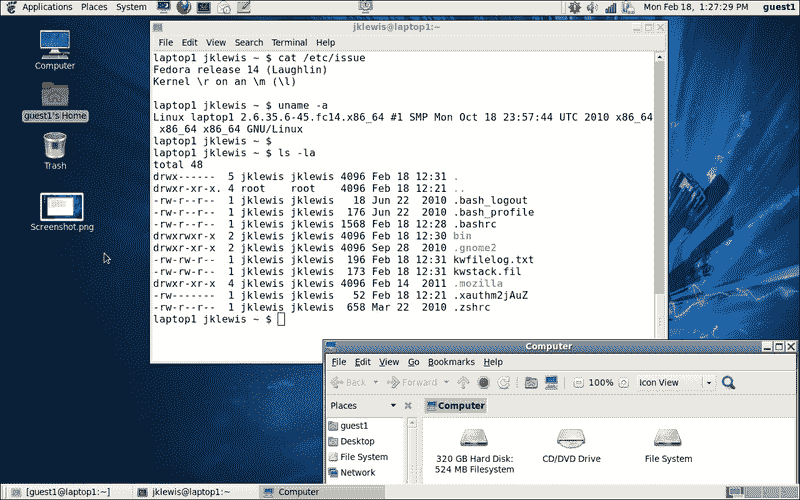

这显示了桌面，命令窗口和**计算机**文件夹。顶部和底部的“行”是面板。从顶部开始，从左到右依次是**应用程序**，**位置**和**系统**菜单。然后是一个屏幕保护程序，Firefox 浏览器，终端，**Evolution**和记事本。中间是锁屏应用程序，最右边是有关更新的通知，音量控制，Wi-Fi 强度，电池电量，日期/时间和当前用户。请注意，我已经定制了其中的一些，例如时钟。

## 准备就绪

如果您有一台运行 GNOME 2 桌面的计算机，可以在本节中跟着做。一种很好的方法是通过运行来自许多不同 Linux 发行版的 Live 镜像。

显示**添加到面板**窗口的截图如下：

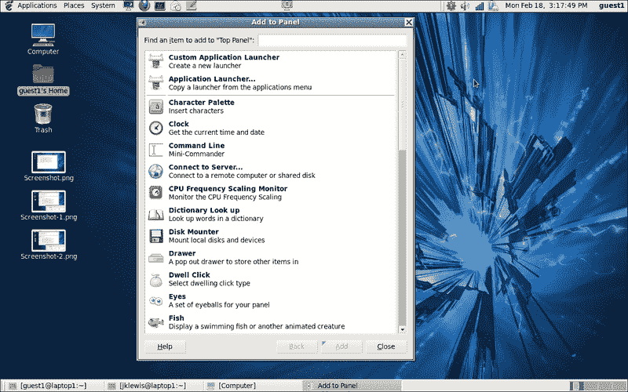

## 如何做...

让我们稍微调整一下这个桌面：

1.  通过在任务栏的空白位置上右键单击来打开此对话框。

1.  添加一些酷的东西。向下滚动，直到看到**天气报告**，点击它，然后点击底部的**添加**按钮。

1.  在面板上，您现在应该看到类似**0°F**的东西。右键单击它。

1.  这将打开一个对话框，选择**首选项**。

1.  您现在在**常规**选项卡上。随意更改您想要的任何内容，然后选择**位置**选项卡，并输入您的信息。

1.  完成后，关闭对话框。在我的系统上，正确的信息立即显示出来。

1.  现在让我们添加更酷的东西。再次打开**添加到面板**对话框，这次添加**工作区切换器**。

1.  默认的工作区数量是两个，我建议添加两个。完成后，关闭对话框。

1.  现在您会在屏幕右下角看到四个小方框。点击其中一个会带您到该工作区。这是 GNOME 2 非常方便的一个功能。

## 还有更多...

我发现 GNOME 2 非常直观和易于使用。它功能强大，可以进行广泛的定制。但是它也有一些缺点。它往往有些“沉重”，在性能较差的机器上可能表现不佳。它也不总是正确报告错误。例如，使用 Firefox 打开一个在您的系统上不存在的本地文件（即`file:///tmp/LinuxBook.doc`）。应该出现一个**文件未找到**对话框。现在尝试打开另一个本地文件，该文件存在，但您没有权限访问。它不会报告错误，实际上似乎什么也没做。如果发生这种情况，请记住这一点。

# KDE 桌面

**KDE**桌面是为台式电脑和强大的笔记本电脑设计的。它允许进行广泛的定制，并且可以在许多不同的平台上使用。以下是一些其特点的描述。

## 准备就绪

如果您有一台运行 KDE 桌面的 Linux 机器，可以跟着做。这些截图来自运行 Fedora 18 的 Live Media 镜像上的 KDE。

最右边的桌面图标允许用户访问**工具箱**：

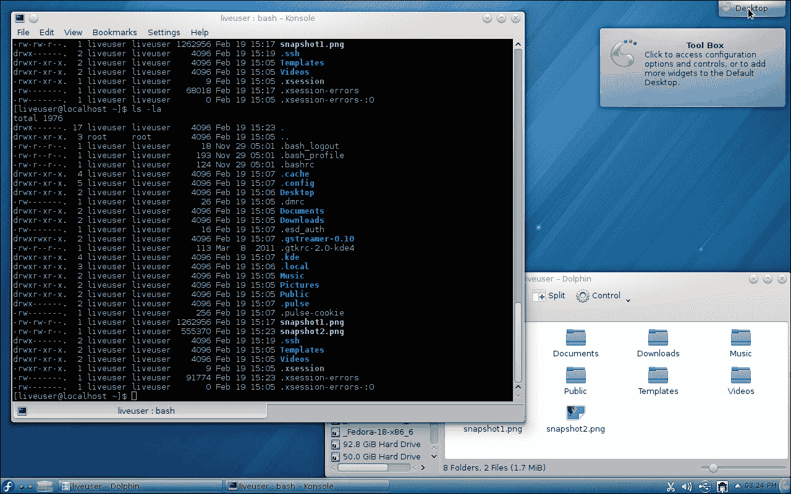

你可以使用这个对话框添加面板、小部件、活动、快捷方式、锁定屏幕，以及更多。

底部的默认面板以 Fedora 图标开始。这个图标叫做**Kickoff 应用程序启动器**，允许用户快速访问某些项目。这些包括**收藏夹**、**应用程序**、一个**计算机**文件夹、一个**最近使用**文件夹，以及一个**离开**按钮。

如果你点击下一个图标，它会带出**活动管理器**。在这里你可以创建活动并监视它们。下一个图标允许你选择当前在前台的桌面，接下来的项目是当前打开的窗口。最右边是**剪贴板**。

这是剪贴板菜单的截图：

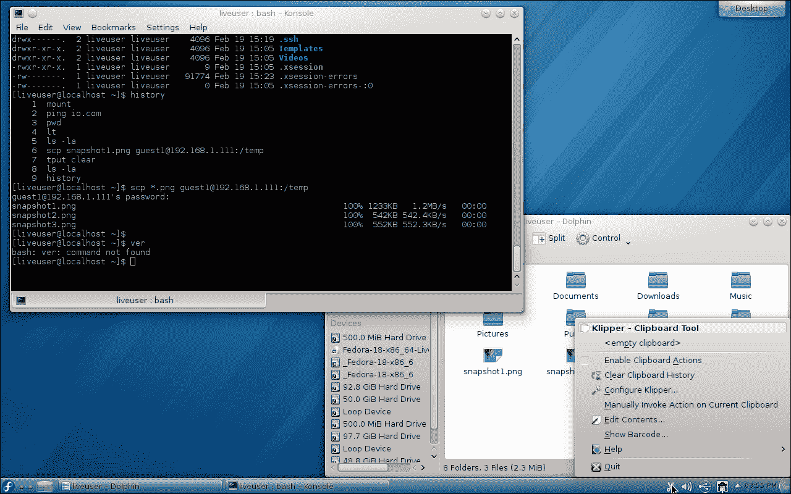

接下来是音量控制、设备通知器和网络状态。

这是**接口**和**连接**对话框的截图：

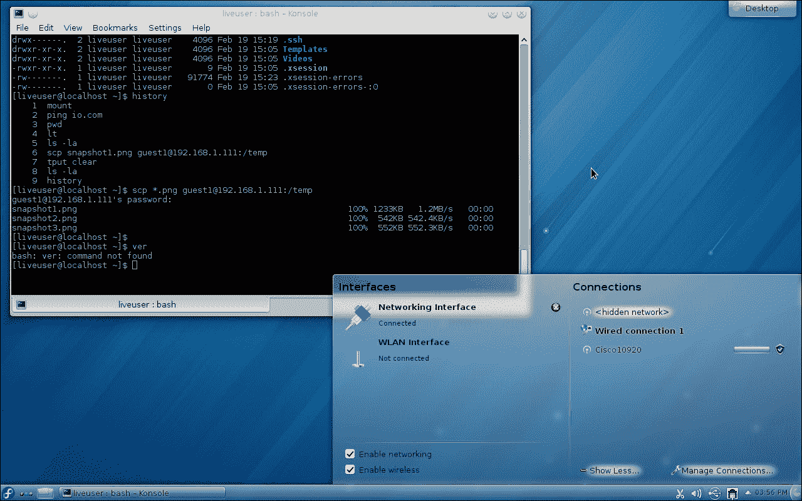

最后，有一个按钮可以显示隐藏的图标和时间。

## 如何做...

让我们向这个桌面添加一些东西：

1.  我们应该添加一个控制台。在桌面的空白处右键单击。会出现一个对话框，选择**Konsole**。现在你应该有一个终端了。

1.  通过点击空白处关闭该对话框。

1.  现在让我们添加一些更多的桌面。右键单击屏幕左下角的第三个图标。会出现一个对话框，点击**添加虚拟桌面**。我个人喜欢有四个这样的桌面。

1.  现在让我们向面板添加一些东西。在面板的空白处右键单击，将鼠标悬停在**面板选项**上；点击**添加小部件**。

1.  你会看到一些小部件。注意列表可以滚动查看更多内容。例如，滚动到**网页浏览器**，然后双击它。

1.  网页浏览器图标会出现在靠近时间的面板上。

## 还有更多...

显然你可以使用 KDE 桌面进行相当多的自定义。我建议尝试所有不同的选项，看看哪些是你最喜欢的。

KDE 实际上是一个由开源开发者组成的大社区，KDE Plasma 桌面是其中的一部分。这个桌面可能是被审查的桌面中最重的，但也是最强大的之一。我认为这是需要一个非常精心设计的桌面环境的人的一个不错选择。

# xfce

**xfce** 是 Linux 和 UNIX 系统的另一个桌面环境。它倾向于运行得非常流畅，不使用太多系统资源。它非常直观和用户友好。

## 准备工作

以下是我正在用来写这本书的 Linux 机器上运行的 xfce 的截图：

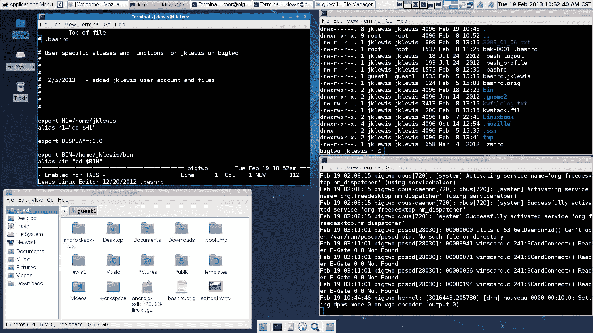

如果你有一台运行 xfce 桌面的机器，你可以执行这些操作。我建议从 Fedora 网页下载一个实时媒体镜像。

虽然与 GNOME 2 有些相似，但布局有些不同。从顶部的面板（**面板 1**）开始是**应用程序菜单**，然后是**注销**对话框。接下来是当前打开的窗口。点击其中一个将根据其当前状态将其带上或最小化。下一个项目是**工作区**，我有四个，然后是互联网状态。最后是音量和混音应用程序以及日期和时间。屏幕内容大部分都是不言自明的；我有三个终端窗口打开和**文件管理器**文件夹。

屏幕底部的较小面板称为**面板 2**。

## 如何做...

让我们稍微调整一下面板：

1.  为了改变面板 2，我们必须先解锁它。右键单击顶部面板，然后转到**面板** | **面板首选项**。

1.  使用箭头来切换到面板 2。查看下面的截图：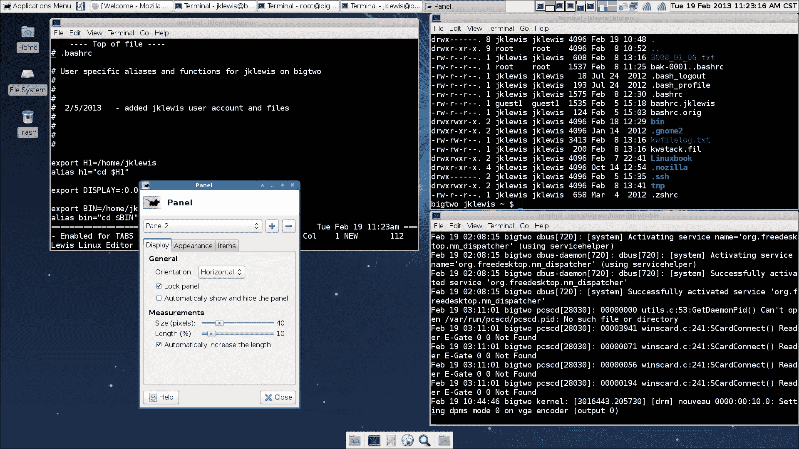

1.  你可以看到它被锁定了。点击**锁定面板**来解锁它，然后关闭这个对话框。

1.  现在转到面板 2（在底部），右键单击其中一个侧边。点击**添加新项目...**。

1.  添加你想要的应用程序。

## 还有更多...

这绝不是 xfce 可以做的详尽列表。这些功能是模块化的，可以根据需要添加。有关更多信息，请参阅[`www.xfce.org`](http://www.xfce.org)。

# LXDE

**LXDE**（**轻量级 X11 桌面环境**）旨在在资源条件较低的情况下良好运行，是一个相对较新的环境。与大多数其他桌面环境不同，LXDE 的组件没有太多依赖性，可以独立运行。

## 准备就绪

如果您有一台使用此桌面的计算机，可以按照本节进行操作。

这是 Fedora 18 Live Media 镜像上运行的 LXDE 的屏幕截图：

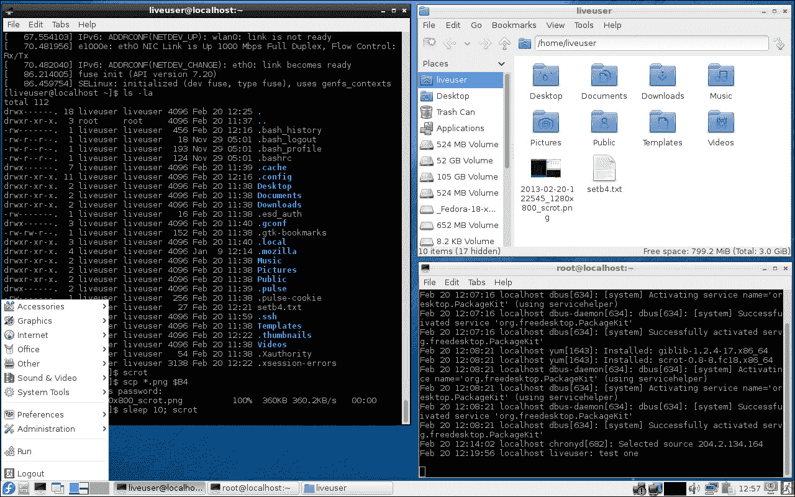

正如你所看到的，有两个终端打开和文件管理器。在面板的左侧是一个熟悉的 Fedora 图标，刚刚被点击了。它弹出了下拉菜单。接下来的图标是文件管理器，然后是一个 LXTerminal。

下一个图标上写着“左键点击图标化所有窗口。中键点击使其变暗”。我选择保持这个图标不变。

接下来是两个桌面图标，然后是事件列表。更远的右边是一个 Wi-Fi 图标（Wi-Fi 未激活），有线以太网状态，系统监视器，音量控制和网络管理器小程序。之后是剪贴板管理器，时间，锁屏图标和注销框。

## 如何做...

让我们稍微使用一下这个桌面：

1.  右键单击面板的空白处，将显示一个下拉菜单。

1.  点击**面板设置**。将弹出以下屏幕：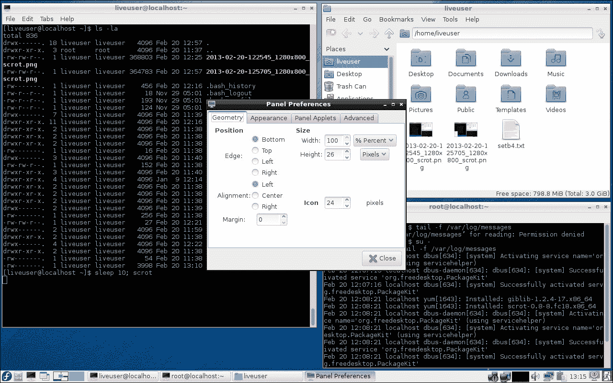

1.  让我们改变字体大小。点击**外观**，然后点击**字体**下的**大小**。

1.  使用滚动键更改值为其他内容。更改将立即显示。当看起来不错时，选择**关闭**。

1.  让我们添加一个应用程序。再次打开面板设置，然后点击**添加/删除面板项目**。

1.  点击**添加**，向下滚动并点击**桌面编号/工作区名称**。当前工作区的名称将显示在面板的最右侧。我个人非常喜欢这个功能。

## 还有更多...

我发现 LXDE 非常直观和快速。我相信它会在笔记本电脑和移动设备上表现良好，特别是在功耗有限的情况下。

# Unity

**Unity**是一个用于 Ubuntu 系统的 GNOME 环境的外壳界面。它旨在在小屏幕上表现良好，例如，它使用垂直应用切换器。与其他桌面/管理器不同，它本身不是一组可执行文件，而是使用现有的应用程序。

## 准备就绪

如果您有一台运行 Unity 桌面的计算机，可以按照本节进行操作。

以下是 Ubuntu 12.04 上运行的 Unity 的屏幕截图：

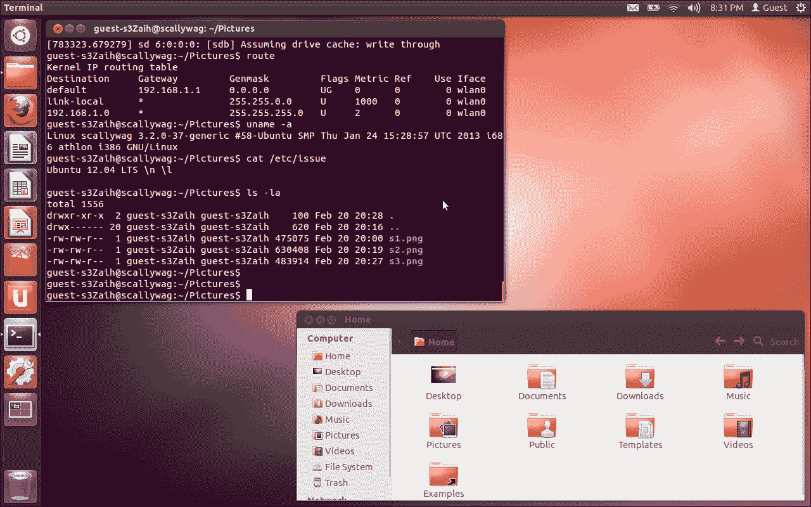

在桌面上是一个 GNOME 终端会话和**主文件夹**。从左侧的垂直面板开始，是 Dash Home 图标。它允许用户快速找到东西。在下面是**主文件夹**（已经打开），然后是 Firefox 网络浏览器。接下来是 Libre Office Writer，计算器和 Impress。接下来是 Ubuntu 软件中心，用于搜索和购买应用程序。接下来的图标是 Ubuntu One，终端，系统设置，工作区切换器和垃圾箱。

为了完成对顶部面板的讨论，最右边是 Evolution 的图标。接下来是电池状态图标，网络状态（有线和无线），以及音量控制。剩下的图标是时间，切换用户帐户图标和注销按钮。

有趣的是，默认情况下，此客户端桌面上并没有终端。

## 如何做...

让我们向这个桌面添加一个终端：

1.  打开**主文件夹**，然后点击**文件系统**。

1.  双击**usr**文件夹，然后双击**bin**文件夹。

1.  点击**搜索**打开对话框。

1.  输入`gnome-terminal`并按*Enter*。

1.  双击**gnome-terminal**图标。

1.  它将在屏幕上打开，您还会在左侧面板上看到它作为一个图标。

1.  右键单击此图标，然后选择**锁定到启动器**。现在您有一个终端图标。

Unity 上的顶部面板与其他桌面的工作方式略有不同。尝试给定的步骤：

1.  打开**主文件夹**。

1.  如果您还没有这样做，请打开终端。

1.  现在，在**主文件夹**的某个地方单击。**主文件夹**的文本将显示在面板上。

1.  现在单击**终端**。现在出现了**终端**文本。面板上列出的菜单项始终对应于具有焦点的窗口或应用程序。

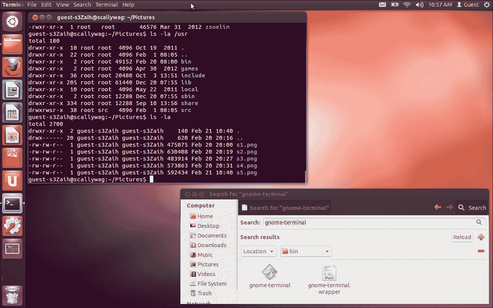

## 还有更多...

我发现 Unity 与其他桌面非常不同。起初有点困难，但像其他一切一样，随着时间的推移会变得更好。我相信这个桌面将受到那些没有太多 Linux/UNIX 系统经验的用户的欢迎。

# Mate

**Mate**桌面是为了给用户一个类似于 GNOME 2 的更具生产力的环境。我目前在我的笔记本电脑上使用 Mate 运行 Fedora 19，一切都很顺利。请注意，我下载了 F19 安装 DVD，并在安装过程中选择了 Mate。

## 入门指南

您可以使用 Fedora 网站上的 Live Image 或完整安装 DVD 来按照这些步骤进行操作，无论您喜欢哪种方式。

以下是 Fedora 19 上 Mate 的屏幕截图：

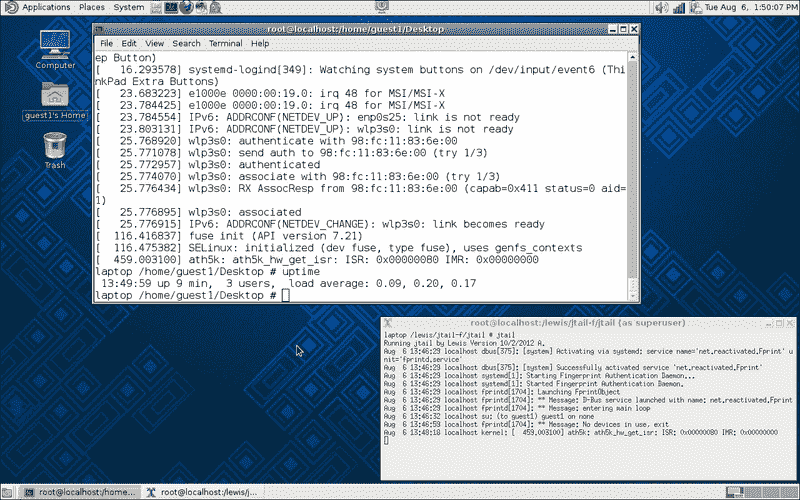

您可以看到我已经打开了两个终端。左上角是**应用程序**下拉菜单，允许您浏览和运行已安装的应用程序。接下来是**位置**，允许您访问文档、文件夹和网络位置。接下来是**系统**，您可以在这里更改桌面外观和行为，获取帮助或注销。图标是 Caja，一个文件管理器，然后是一个终端。是的，Mate 的人们足够聪明，已经默认包含了一个。接下来的图标是 Firefox，一个邮件应用程序和一个即时通讯应用程序。我添加了**锁定屏幕**图标，它在中间。右边是音量，然后是 Wi-Fi 信号，电池状态和日期（我稍微自定义了一下）。

左下角是一个图标，允许您隐藏所有窗口并显示桌面。最后，在最右边是四个工作区。

## 操作步骤...

让我们在这个桌面上做一些改变：

1.  首先让我们添加**锁定屏幕**应用程序。在顶部面板的中间右键单击。

1.  单击**添加到面板...**。

1.  单击**锁定屏幕**并按照说明操作。关闭对话框。

1.  现在让我们来处理时间和日期。单击它，您会注意到显示了一个日历。

1.  再次单击时间和日期以关闭日历，然后右键单击它。单击**首选项**选项卡。

1.  应该显示**时钟首选项**窗口。在这里，您可以更改时间和日期的显示方式。我单击了**显示秒**，因为我喜欢看到完整的时间。

1.  关闭对话框。

## 还有更多...

正如您所看到的，**Mate**的工作方式非常类似于**GNOME 2**。它非常直观和易于使用。设计师们在创建这个桌面时做得很好。
