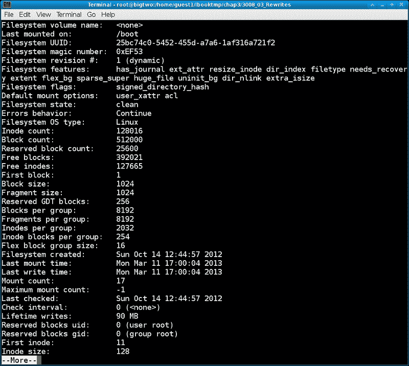
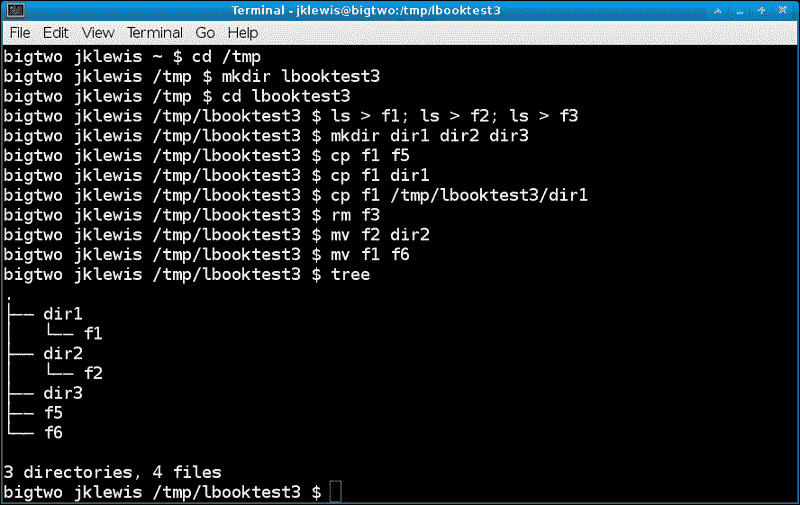
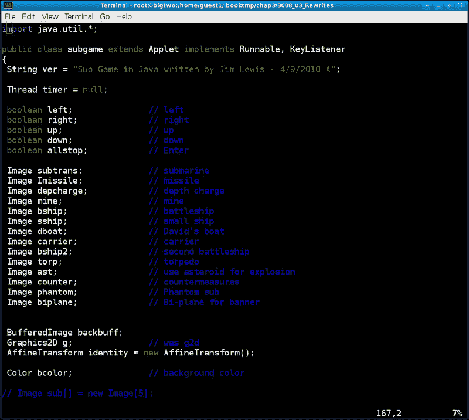
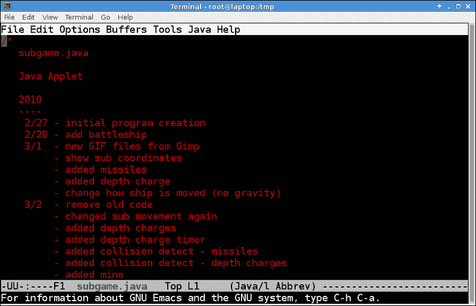
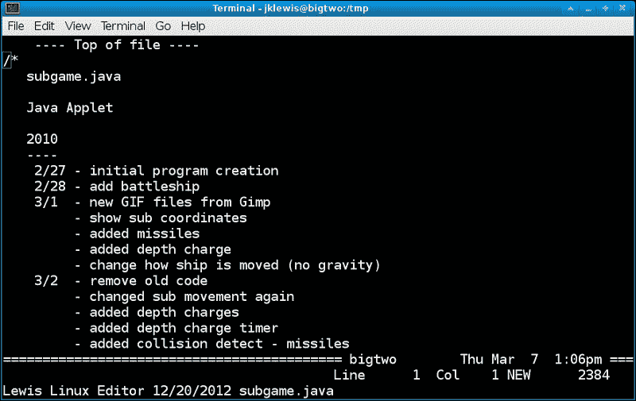
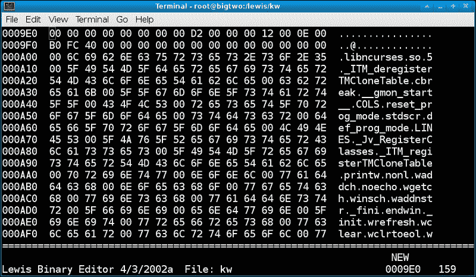
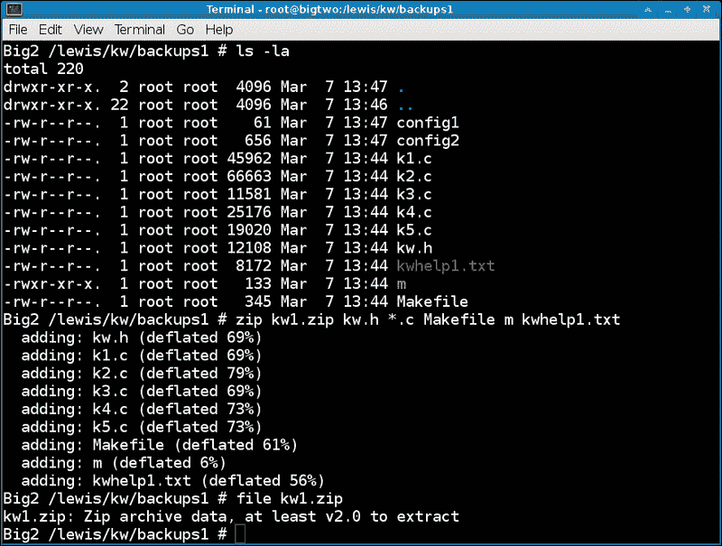

# 第三章：文件和目录

在本章中，我们将涵盖：

+   复制、删除和更新文件和目录

+   使用 find 和 locate 查找文件

+   创建文本文件 - vim、Emacs 等

+   使用文件命令

+   使用 grep 查找模式

+   使用 ZIP 和 TAR 压缩文件

+   其他有用的命令，如 stat、sum、touch 等

# 介绍

您可以将 Linux 文件系统中的所有内容视为字节流。这简单地称为文件。目录也是一个包含其他文件的文件。大多数文件位于计算机的硬盘上。但是，有些文件位于内存中，例如`/proc`和`/sys`实际上是虚拟文件系统。文件也可以存储在可移动介质上，例如 USB 设备、CD/DVD 和其他机器上（即 NFS 挂载）。

## 理解 inode 和超级块

文件系统中的每个文件都有一个称为**inode**的特殊编号。inode 是操作系统存储文件属性的地方，并包含以下信息：

+   文件类型，如常规、目录、特殊、链接、套接字、管道或块设备

+   所有者和组信息

+   文件的权限（更多信息请参见第五章，*权限、访问和安全性*）

+   文件创建的日期和时间以及最后更改或读取的时间

+   文件大小

+   inode 还包含一些其他信息

在 inode 中不可用的内容是文件本身的完整路径和名称。这些信息存储在`/proc`文件系统下的进程 ID（PID）拥有文件的进程下。

**超级块**是将文件系统上的所有 inode 联系在一起的东西。它包含管理文件所需的所有信息。对于系统非常重要，大多数 Linux 文件系统都定期备份超级块的副本，同时也保留在内存中。

`dumpe2fs`命令可用于显示超级块的内容。以下是在 Fedora 17 上使用`dumpe2fs`的屏幕截图：



这显示了这个硬盘上第一个分区的超级块信息。

# 复制、删除和更新文件和目录

在本节中，我们将简要探讨如何复制、删除和更新文件。

## 准备好

有几本关于文件系统管理的书已经出版，因此这将作为一个简要概述。如果您有一台 Linux 机器可用，可以尝试这些命令。我们将在`/tmp`文件系统中进行所有操作，因此您不必担心在系统上搞砸任何东西。

## 如何做...

以下是创建一些文件和目录的方法：

1.  转到`/tmp`目录：

```
cd /tmp

```

1.  创建一个测试目录：

```
mkdir lbooktest3

```

1.  转到目录：

```
cd lbooktest3

```

1.  让我们创建一些文件：

```
ls > f1; ls > f2; ls > f3

```

1.  还要创建一些目录：

```
mkdir dir1 dir2 dir3

```

1.  复制的语法是`cp 源文件目标文件`，现在运行`cp f1 f5`。这将创建文件`f5`，它是文件`f1`的副本。

1.  您可以复制到一个目录：

```
cp f1 dir1

```

1.  上面是相对路径，因为它从当前目录开始。要使用绝对路径，请执行以下操作：

```
cp f1 /tmp/lbooktest3/dir1

```

1.  现在让我们从当前目录中删除文件`f3`：

```
rm f3

```

1.  让我们将文件`f2`移动到`dir2`：

```
mv f2 dir2

```

1.  `mv`命令也用于重命名文件。将`f1`重命名为`f6`：

```
mv f1 f6

```

1.  要查看此目录的文本模式图形表示，请运行以下命令：

```
tree

```

1.  清理我们刚刚做的一切是可选的，`cd /tmp`然后运行：

```
rm -r lbooktest3

```

以下是上述命令的屏幕截图：



## 还有更多...

可以将文件从计算机上的另一个位置复制到当前目录。这是使用点运算符执行的：

```
 cp /tmp/somefile 

```

您不必首先`cd`到目录。您可以执行以下命令：

```
 cp /bin/bash /tmp

```

这非常方便，特别是在配置机器时。

那么如果你将一个文件复制到已经存在的文件会发生什么呢？假设你有适当的权限，被复制的文件会覆盖另一个文件。此外，在 Linux 系统上使用`rm`时要小心，因为很难恢复已删除的文件。

# 使用 find 和 locate 查找文件

`find`命令通常用于从当前目录开始搜索文件。`locate`命令使用`updatedb`数据库在整个系统（有一些例外）中查找文件或目录。

## 如何做...

让我们使用`find`和`locate`来查找一些常见的 Linux 文件：

1.  首先将目录更改为`/usr`：

```
cd /usr

```

1.  运行以下命令：

```
find -name bash

```

1.  现在尝试使用通配符：

```
find -name bash*

```

1.  它也会找到目录：

```
find -name bin

```

现在假设我们想要查找一个文件，但实际上不知道它可能在系统的哪个位置。`find`命令有时也很慢，因为它必须从当前点搜索文件系统。这就是`locate`非常方便的地方。

1.  在这个例子中，你可以在任何目录中。运行以下命令：

```
locate gnome-terminal

```

1.  现在尝试命令：

```
locate vim

```

1.  看看这有多快？现在尝试：

```
locate ifconfig

```

1.  要忽略大小写，请执行：

```
locate -i sudo

```

## 还有更多...

`find`命令有 100 多个参数；请参考 man 页面获取更多信息。

`locate`命令使用数据库来存储文件的位置。这个数据库通常会在每天晚上由一个 cron 作业自动重新创建。如果你想立即刷新数据库，请运行`updatedb`命令。请注意，在大型文件系统和/或慢速计算机上可能需要一段时间。

# 创建文本文件 - vim，Emacs 和其他编辑器

大多数用户可能熟悉基于 GUI 的文字处理程序。例如，我正在使用 LibreOffice Writer 来撰写这本书。但是，你也可以使用命令行来编辑文件。我们中的一些人甚至更喜欢这样做。

## 准备好

假设读者可以访问带有各种文本编辑器的 Linux 机器。我们将从**vim**开始，这是每个 Linux/Unix 系统上都有的文本编辑器。如果你的系统上没有**Emacs**，请尝试使用`yum install emacs`或`apt-get install emacs`进行安装。

## 如何做...

以下是使用`vi`命令创建和编辑文本文件的方法：

1.  让我们去`tmp`目录。运行以下命令：

```
cd /tmp

```

1.  现在运行：

```
vim lbookfile1.txt

```

1.  你的终端应该已经清空，vim 正在其中运行。Vim 是无模式的，所以总是必须告诉它要处于什么模式。按*A*键。

1.  现在 Vim 应该处于插入模式。你可能会在屏幕底部看到类似`-- INSERT --`的东西。现在输入一些字符。

1.  正常的光标控制键应该是有效的。编辑完成后，按*Esc*键退出插入模式。

1.  要进入命令模式，请按冒号键，然后输入任何字母。例如，要保存文件，请输入`:w`。

1.  要保存文件然后退出 vim，请按*Esc*，然后输入`:wq`。

以下是 vim 编辑 Java 文件的屏幕截图：



现在让我们来看看 Emacs 编辑器：

1.  切换到`/tmp`目录：

```
cd /tmp

```

1.  要以文本模式启动 Emacs，请按：

```
 emacs -nw lbooktest3.txt

```

1.  它将以编辑模式启动。输入几行

1.  要保存文件，请按*Ctrl* + *C*，然后按*Ctrl* + *S*。

1.  标准光标键应该可以让你在屏幕上移动；试试看。

1.  按*Ctrl*+*H*+*?*打开**帮助**窗口。

1.  要返回到原始屏幕，按*Ctrl*+*X*+*1*。

1.  要关闭 Emacs 会话，请按*Ctrl* + *X*，然后按*Ctrl* + *C*。

以下是 Emacs 编辑 Java 文件的屏幕截图：



## 还有更多...

Vim 和 Emacs 是非常强大的编辑器。它们通常被程序员用来编写代码，系统管理员用来维护 shell 脚本。要获取更多信息，请参考 man 和/或 info 页面，或者它们的网站。

作为奖励，这是我个人编写的文本编辑器的图片：



这是 20 年前在 DOS 下用 C 语言编写的。我现在已经在 20 多个不同的平台上编译和运行了它。

# 使用 file 命令

我们上面讨论了文本文件。一般来说，人类可以很容易地阅读和编辑文本文件。二进制文件是不同的，它是（宽泛地说）计算机“读取”的内容。例如，当您运行`vim filename1.txt`这样的命令时，vim 是一个二进制文件，`filename1.txt`是一个文本文件。

## 如何做...

以下是运行 Linux `file`命令的示例：

1.  将目录更改为`/tmp`，与往常一样：

```
cd /tmp

```

1.  让我们创建一个文本文件：

```
ls > temp1.txt

```

1.  它是什么类型的文件？运行以下命令：

```
file temp1.txt

```

1.  正如您所看到的，`file`命令可以告诉我们某个文件是什么类型。

1.  现在运行以下命令：

```
file /bin/bash

```

1.  所有这些信息都意味着它是一个二进制文件。它还显示了 bash 是为哪个平台编写的，以及其他一些信息。

1.  尝试在系统上运行文件以了解那里有什么。

### 提示

您必须具有适当的权限才能运行`file`命令，因为它必须对文件执行打开操作。

## 还有更多...

我们提到了编辑文本文件。如果您真的知道自己在做什么，二进制文件也可以编辑。有时在低级工作中，例如在设备驱动程序上工作时，这是必要的。二进制编辑器可能看起来像以下的截图：



### 提示

**哦不，我已经编辑了一个文件，但现在无法保存它！**

偶尔，您可能会陷入一个看似无望的文本编辑情况。您已经花了一些时间更改一个文件，但现在无法保存它。错误通常是“权限被拒绝”。通常有两件事可能会导致这种情况；您无法写入文件所在的目录，或者文件已经存在但没有适当的可写权限。如果程序允许，保存您的工作的最佳方法是将文件简单地写入其他地方，例如`/tmp`。

这是一个相当简单的例子，但它传达了这个想法。我希望第一次发生这种情况时我已经知道这个程序。

## 如何做...

以下是在出现权限错误时保存文件的方法：

1.  作为普通用户（而不是 root）转到`/usr`目录：

```
cd /usr

```

1.  现在运行以下命令：

```
vim lbookfake1.txt

```

1.  它应该像平常一样打开一个空文件。按*A*，然后输入一些文本。

1.  现在按*Esc*，然后输入`:w`。

1.  它应该显示一个写入错误，所以将文件保存到`/tmp`：

```
:w /tmp/lbookfake1.txt

```

1.  那应该成功。然后您可以采取措施来纠正真正的问题（也就是说，不要在不应该编辑文件的地方编辑文件！）。

# 使用 grep 查找模式

处理文件时，能够在文本中搜索模式是很方便的。这在代码开发中经常使用。这里我们展示如何使用**grep**。

## 准备工作

我们将使用`dmesg`程序来显示有关运行内核的信息。如果它不可用，或者如果您的计算机已经运行了很长时间，那么以下内容可能不会完全匹配您的系统。

## 如何做...

以下是使用`grep`的示例：

1.  运行以下命令：

```
cd /tmp

```

1.  使用`dmesg`创建一个文件，这样我们就可以搜索一些关于您的系统的信息：

```
dmesg > dmesg1.txt

```

1.  让我们看看能否确定正在使用哪个网络设备。运行：

```
grep network dmesg1.txt

```

1.  输出可能不是很有信息性。但如果大小写有问题怎么办？尝试以下命令：

```
grep -i network dmesg1.txt

```

1.  `-i`告诉`grep`忽略大小写。现在您应该看到您的系统正在使用哪个网络驱动程序。现在尝试以下命令：

```
grep -i cdrom dmesg1.txt

```

1.  `grep`返回一个基于搜索结果的代码。再次运行上面的命令（记住上箭头快捷键吗？）：

```
grep -i cdrom dmesg1.txt

```

1.  现在运行以下命令：

```
echo $?

```

1.  假设找到了文本，返回代码将为`0`。现在搜索一个不应该存在的字符串：

```
grep -i jimlewis dmesg1.txt

```

1.  运行以下命令：

```
echo $?

```

1.  返回代码不应为`0`。

### 提示

这可能看起来有点反常，0 表示成功，非零表示失败。这对许多 Linux 命令都是常见的，因为在许多情况下返回的数字是错误代码。

## 还有更多...

`grep`程序可以以令人难以置信的多种方式进行搜索。您还可以指定非常复杂的模式。有关更多信息，请参阅 man 页面。此外，我们将在第八章中再次讨论`grep`的返回代码，*使用脚本*。

# 使用 ZIP 和 TAR 压缩文件

毫无疑问，Linux 系统有*大量*的文件。一个典型的代码开发项目可能有 1000 多个文件，分布在几个目录中。我们如何备份所有这些东西？

答案是文件打包和压缩。这里我们将展示两个最喜欢的，**ZIP**和**TAR**。

## 准备工作

大多数 Linux 系统都有 ZIP 和 TAR，因此可以假定它们已经在您的系统上可用。

## 如何做...

在这里，我们将尝试`zip`和`unzip`命令：

1.  运行以下命令：

```
cd /tmp

```

1.  让我们创建一个临时目录：

```
mkdir lbooktemp

```

1.  运行以下命令：

```
cd lbooktemp

```

1.  现在让我们创建一些文件：

```
ls > f1.txt; route > f2.txt; dmesg > f3.txt

```

1.  然后，创建一些更多的文件：

```
ifconfig > ifconfig.dat; dmesg > dmesg.dat

```

1.  让我们将前面的文件打包和压缩成一个文件：

```
zip lbook1.zip f1.txt f2.txt f3.txt

```

1.  正如您所看到的，ZIP 的语法是“zip zipped-file files-to-zip”。我们也可以在上面使用通配符：

```
zip lbook1.zip *.txt

```

1.  现在让我们包括其他文件：

```
zip lbook1.zip *.txt *.dat

```

1.  unzip 程序用于从压缩文件（也称为存档）中提取文件。使用以下命令创建另一个目录：

```
mkdir test

```

1.  运行以下命令：

```
cp lbook1.zip test

```

1.  运行以下命令：

```
cd test

```

1.  现在解压文件：

```
unzip lbook1.zip

```

1.  执行`ls -la`命令。您应该像以前一样看到文件。

1.  您还可以查看 ZIP 文件的内容，而无需提取任何内容，只需运行以下命令：

```
unzip -l zipped-file

```

当只有少量文件时，或者当我将它们发送给运行非 Linux 操作系统的人时，我使用 ZIP。虽然 ZIP 可以用于跨目录，但通常无法很好地处理一些 Linux 文件。Tar 是一个更好的选择：

1.  我们可以使用与之前相同的文件：cd /tmp/lbooktemp

1.  运行`tar cvzf lbook1.tar.gz *.txt`。这将创建一个 gzip 压缩的存档文件。

1.  现在运行`file lbook1.tar.gz`。它应该显示类似以下的输出：

```
lbook1.tar.gz: POSIX tar archive (GNU)

```

1.  要提取，首先将其复制到测试目录：

```
cp lbook1.tar.gz test

```

1.  运行以下命令：

```
cd test

```

1.  运行以下命令：

```
tar xvzf lbook1.tar.gz

```

1.  执行`ls -la`命令。您应该再次看到文件。

1.  要查看 tar 存档，请使用`t`（用于告诉）选项：

```
tar tvzf lbook1.tar.gz

```

1.  现在让我们将整个目录打包成 TAR：

```
cd /tmp

```

1.  运行以下命令：

```
tar cvzf lbooktemp1.tar.gz lbooktemp

```

1.  这将获取整个目录，甚至包括任何隐藏文件。

以下是`zip`命令的屏幕截图：



## 还有更多...

ZIP 和 TAR 在系统管理中经常用于备份所有内容。需要注意的是，“打包”系统，将该文件复制到另一台机器，并“解包”文件是克隆一个盒子的好方法（我经常使用这个）。

稍后，当我们在第九章中讨论 crontab 时，*使用 Cron 自动化任务*，我将展示如何使用 TAR 每晚备份我的系统。

# 其他有用的命令，如 stat、sum、touch 等

Linux 中有许多处理文件的命令。在本节中，我展示了如何使用其中一些。

## 如何做...

以下是我经常使用的一些命令：

1.  运行以下命令：

```
cd /tmp

```

1.  创建一个文件：

```
dmesg > file1.txt

```

1.  现在运行`ls -la`并记住信息。我们稍后会用到这个。

1.  使用`stat`命令可以查看关于文件的几乎所有你想知道的信息：

```
stat file1.txt

```

1.  现在假设您已将该文件发送给正在运行 Linux 系统的人，并希望确保它在传输过程中没有损坏。运行以下命令：

```
sum file1.txt

```

1.  第一个数字是校验和，第二个是该文件的块数。如果其他人在他的文件副本上运行`sum`并看到相同的信息，那么这些文件是相同的。

### 提示

文件名不必匹配。

1.  我们通过使用重定向运算符创建了许多文件。您还可以使用 touch 命令：

```
touch file2.txt

```

1.  由于`file2.txt`之前不存在，touch 将创建一个空文件。事实上，让我们证明一下：

```
file file2.txt

```

1.  那么，如果我们在现有文件上运行 touch 会发生什么？它会清空它吗？不会，它会更新文件的时间和日期。运行以下命令：

```
ls -la file1.txt

```

1.  现在运行以下命令：

```
touch file1.txt

```

1.  再次运行`ls -la`。你应该注意到它现在显示了该文件的当前日期和时间。

1.  假设你只想查看一个文本文件。运行以下命令：

```
less file1.txt

```

1.  使用`less`命令时按空格键向下滚动。按*Q*退出。

1.  假设我们只想看到该文件的前几行：

```
head file1.txt

```

1.  `head`命令默认显示前 10 行。那么最后 10 行呢？运行以下命令：

```
tail file1.txt

```

## 还有更多...

正如我之前所说，有许多其他处理文件的命令。而且，我提到的命令只是它们所能做的冰山一角。如常，查阅 man 手册以获取更多信息。
