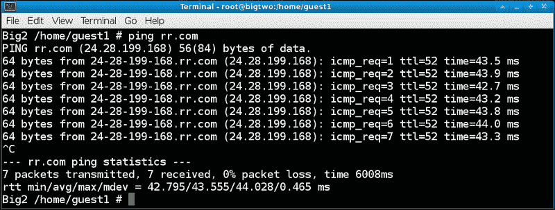
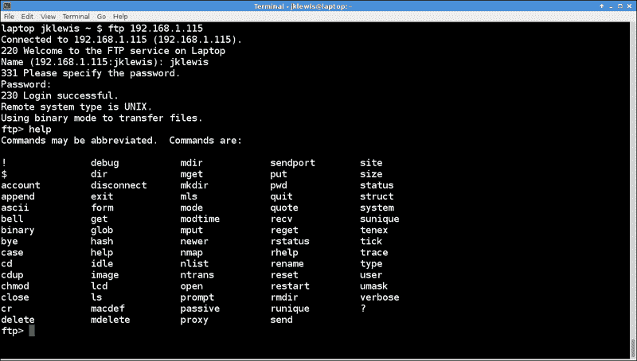
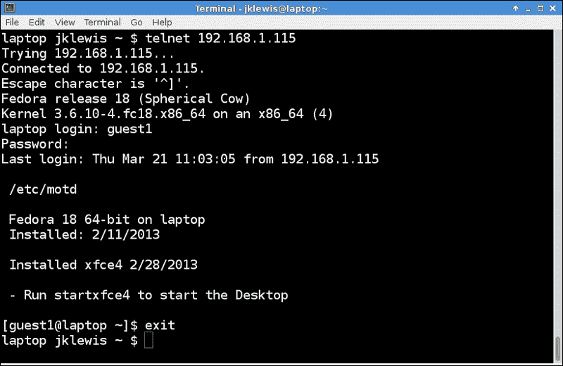
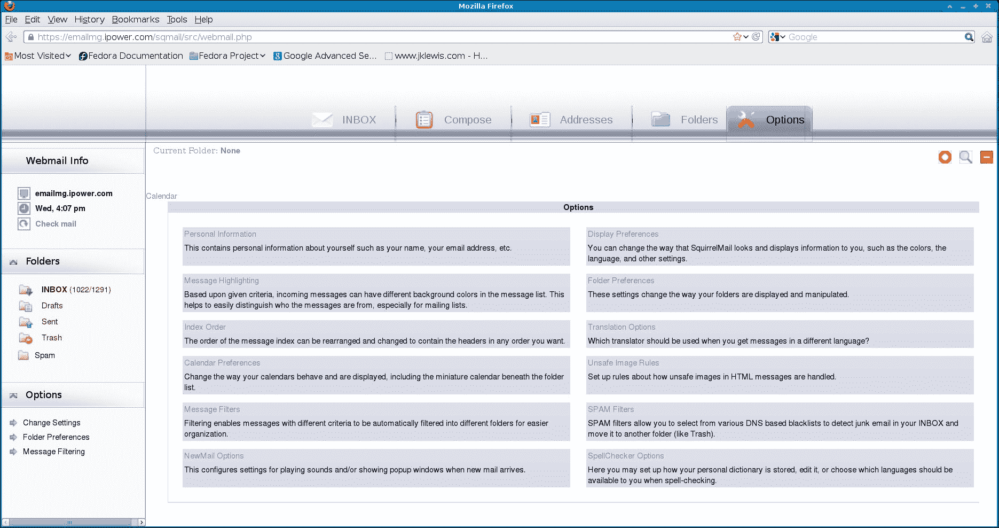
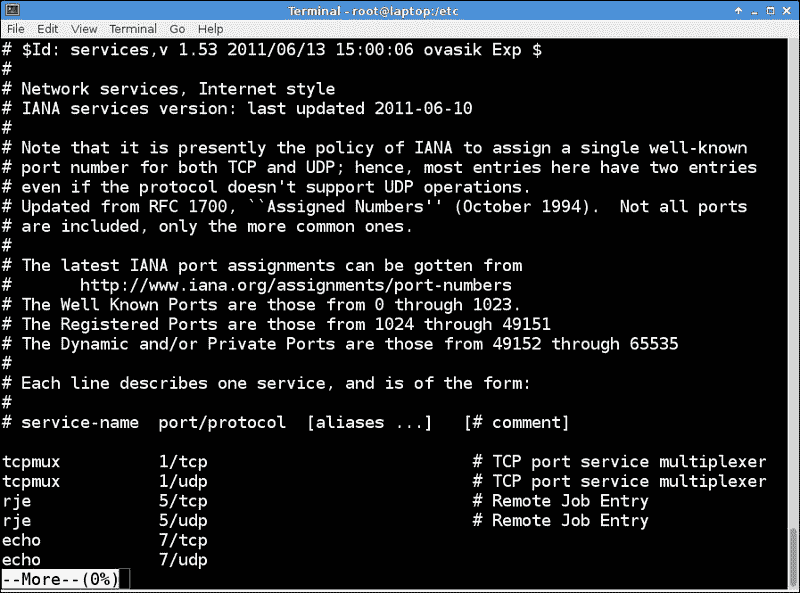

# 第四章：网络和互联网

在本章中，我们将涵盖：

+   故障排除不良连接

+   将文件复制到另一台机器-FTP 和 SCP

+   登录到另一台机器- Telnet 和安全外壳

+   获取网页而不使用浏览器-wget

+   浏览网页-Firefox

+   电子邮件-使用网络邮件程序

+   运行您自己的 Web 服务器-httpd

+   谁在使用那个端口？/etc/services 文件

+   IPv4 与 IPv6

# 介绍

在今天的世界中，“上网”至关重要。在这里，我们将解释连接性以及在它不起作用时该怎么办。但首先，我们将解释有线连接与无线连接的优缺点。

典型的有线以太网连接速度快且可靠。通常不会遭受中断或丢包。像 Cat 5E 或 Cat 6 这样的优质电线可以在数英尺范围内运行而不会丢失信号。

无线连接使您可以自由地使用，嗯，首先不需要有线。当正确配置时，它可以轻松使用并且非常可靠。

有线连接具有以下优点：

+   有线连接通常比无线连接快

+   总的来说，它更可靠

+   它不会遭受周期性的中断或丢包

+   更容易配置和故障排除

有线连接具有以下缺点：

+   我们需要使用电线；在计算机实验室环境中重新排列或更改可能非常困难

+   我们需要有人设计和物理连接网络

+   在使用具有多个以太网端口的大型服务器时可能会令人困惑

无线连接具有以下优点：

+   它很方便；我们不必处理电线

+   在某些情况下，它可以离基础路由器相当远

+   它很容易设置为访客访问

无线连接具有以下缺点：

+   它并不总是可靠的。丢包比有线连接频繁得多。

+   它可能很难设置，特别是第一次。

+   我们必须处理密码和加密以防止未经授权的访问。

# 故障排除不良连接

这似乎偶尔会发生，并且发生在最糟糕的时候。这是我通常采取的诊断和解决有线连接问题的步骤。假设连接在过去的某个时候正常工作。

## 准备就绪

对于这个例子，没有特殊的设置，除非您碰巧在某个地方有一台坏掉的机器。您可以在不担心损坏良好系统的情况下运行大多数这些命令。

## 如何做...

在诊断网络问题时，请尝试以下步骤：

1.  首先，让我们通过 ping 一个已知的外部地址来确保连接确实中断了。我使用 Road Runner 作为我的 ISP，所以对我来说，命令将是：

```
ping rr.com

```

1.  应该出现类似于这样的东西：

1.  按*Ctrl* + *C*停止输出。如果命令行显示超时，或者显示关于没有主机或错误路由的内容，则连接确实中断了。让我们尝试修复它。

1.  找到您的网关地址。运行`route`命令；您的网关应该显示在输出的顶部。请注意，`route`命令花费很长时间才能完成也是连接中断的迹象。

1.  Ping 上面`route`提供的网关。如果 ping 成功，则问题很可能出在路由器或 ISP 本身。

1.  如果不能得到良好的 ping，请尝试这个。如果您已经知道接口名称，请跳到下一步。如果不知道，请使用`ifconfig`命令找到。查找一个类似`eth0`或`p3p2`的段落。

1.  在接口上运行`ethtool`命令。在我的情况下是`ethtool eth0`。看看最后一行；它应该说：

```
Link detected:   yes

```

1.  如果不行，问题可能是电线。如果您的端口有 LED，请查看它们是否亮着。其中一个应该不时地闪烁。尝试摇动电线。当然，如果您有一根已知良好的电线，请尝试更换它。请注意，“已知良好的电线”不一定意味着刚从包装中拿出来的电线。有一次就被这样的电线坑过。

1.  如果电线看起来没问题，让我们深入一点。确保在上面的步骤中，你使用了正确的接口。在这一点上，你可能只想阅读这些步骤，而不是运行命令，因为它们会让你的网络断开。

1.  尝试运行`ifdown` `<interface>`命令。你可能看不到任何输出。

1.  现在运行`ifup` `<interface>`命令。可能需要几秒钟，然后你应该会看到一些输出。如果你正在使用 DHCP，你应该会看到连接正在建立。当你收到提示时，再试一次 ping。

1.  我会假设如果你还在阅读，`ping`失败了，连接仍然断开。你的路由器和/或调制解调器可能已经卡住了。尝试关闭它们，等大约一分钟，然后再打开它们。

1.  等待网络稳定后再次尝试`ping`。如果仍然无法连接，继续下一步。

1.  尽管我讨厌这个解决方案，但在这一点上，我建议进行冷关机。关闭除一个终端之外的所有内容，然后运行以下命令：

```
shutdown -h now

```

1.  我喜欢在重新启动之前等几分钟，只是为了确保内存实际上已经清空。好的，现在重新打开它，等待它完全启动。

1.  再试一次`ping`命令。如果现在可以工作，我会怀疑是某种瞬态错误或问题。如果它继续工作，那太好了。但是，如果再次失败，我会怀疑硬件可能出了问题。

1.  如果重新启动后`ping`命令仍然失败，我会尝试启动一个 Live Media 镜像。如果这样可以并且能上网，那么你的基本系统文件可能出了问题。如果不行，我会再次怀疑硬件。

1.  最后一件事；确保没有人对你的 DHCP 服务器进行了任何更改。配置错误的服务器可能会导致各种糟糕的事情发生，比如无法连接。

## 还有更多...

希望这一部分对你有用。这些步骤在过去无数次对我有用。我还想建议你查看你的`/var/log/messages`文件（和/或`dmesg`）。它可能会解释为什么连接失败。

### 注意

**使用 IP 地址、子网、域名等进行工作**

这将作为对 IP 地址、子网和域的简要概述。理解这些信息将有助于你阅读本书的后续部分。

IP 地址一般是在网络上区分一台计算机与另一台计算机的东西。它是一组数字，比如`66.69.172.30`。在家庭网络中，由于**NAT**（**网络地址转换**）最有可能被使用，你可能更熟悉本地地址，比如`192.168.1.115`。

以下是术语的快速列表：

+   **IP 地址**：这台机器的互联网协议地址，例如`192.168.1.115`。

+   **子网**：第三个八位组（或数字组）是子网。例如，`192.168.1.115`和`192.168.1.120`在同一个子网上。但是，`192.168.2.115`不在。

+   **域**：域通常由主机名表示，比如[rr.com](http://rr.com)。它也有一个数字 IP。使用`ping`命令来确定主机名使用的 IP。

# 将文件复制到另一台机器 - FTP 和 SCP

除了电子邮件，将文件复制到另一台机器的两种最常见的方法是**FTP**（**文件传输协议**）和**SCP**（**安全复制**）。在这里我们将讨论两者。

FTP 已经存在很多年了，今天仍然被广泛使用。然而，标准 FTP 确实有一个严重的缺点。数据是以所谓的“明文”发送的。这意味着在适当的条件下，一个有知识的人可以获取数据。我们稍后会谈论这个问题。

## 准备工作

我们假设 FTP 服务器已经设置好，并且可以用于这个练习。通常情况下，你会从一台机器（客户端）使用`ftp`命令到另一台机器（服务器）。然而，在这个例子中，我只使用了一台机器。开始 FTP 会话的命令是`ftp 服务器名称`，其中服务器名称可以是你网络上已知的主机名，或者是一个数字 IP 地址。在这个例子中，我在`/tmp`中创建了一个名为`f1.txt`的文件，以及在`/home/jklewis`中创建了一个名为`f5.txt`的文件。

大多数 Linux 发行版已经设置好允许使用`scp`命令，这非常方便。我们假设你的发行版允许这样做。请注意，有些发行版不允许 root 访问，所以我们将使用一个访客账户。

SCP 的语法包括给定的命令。

复制到一台机器：

```
scp local-filename username@hostname:/directory

```

从一台机器复制：

```
scp username@hostname:/directory/filename 

```

（不要忘记上面的冒号。）

以下是 Fedora 18 上 FTP 帮助屏幕的截图：



## 如何做…

以下是如何使用`ftp`命令：

1.  在客户端的终端会话中，运行以下命令：

```
ftp 192.168.1.115

```

1.  它应该会出现一个提示。输入用户名并按*Enter*。

1.  输入密码并按*Enter*。

1.  它应该显示类似**登录成功**的内容。如果没有，那么你没有登录，尽管仍会有一个 FTP 提示。假设它已登录，运行以下命令：

```
ls -la

```

1.  你应该会看到一个文件列表。运行`help`来显示命令列表。它们可能并不都在你的系统上可用（我认为这是一个错误）。

1.  在使用`ftp`时要记住的一件事是随时知道自己在哪里。很容易混淆。经常使用`pwd`。现在运行它：

```
pwd

```

1.  你输入的命令是在服务器上。要在本地运行命令，请在前面加上感叹号。尝试这些命令：

```
!pwd, !ls

```

1.  所以，让我们真正做点什么。通过运行以下命令将你的本地目录更改为`/tmp`：

```
lcd /tmp

```

1.  运行`!ls`命令。现在让我们将文件`f1.txt`复制到服务器上：

```
put f1.txt

```

1.  现在让我们从服务器检索文件`f5.txt`：

```
get f5.txt

```

1.  这一开始可能会有点混乱。那是因为它确实如此。然而，如果你经常使用它，它会变得更容易。记住，你把它放到服务器上，然后从服务器上取回来。

1.  当你完成 FTP 会话时，运行以下命令：

```
quit

```

1.  现在让我们运行一些`scp`命令，开始吧：

```
cd /tmp

```

1.  通过运行以下命令创建一个测试文件：

```
ls > f1.txt

```

1.  运行以下命令：

```
scp f1.txt guest1@192.168.1.115:/temp

```

1.  输入用户`guest`的密码。

1.  假设文件`f5.txt`在远程`/temp`上，要获取它运行：

```
scp guest1@192.168.1.115:/temp/f5.txt

```

1.  不要忘记上面的冒号。运行`ls -la`看看情况如何。

## 还有更多…

我提到 FTP 以明文发送其数据。安全外壳命令（在下一节中详细介绍）使用加密，因此安全性不是问题。此外，可以设置一台机器，使得不需要密码。有关更多信息，请参阅`ssh-keygen`命令。这个主题也在附录 A 中有所涉及，*Linux 最佳实践*。例如，要配置`sshd`以更改 root 登录的工作方式，请参阅`sshd_config`文件。

# 登录到另一台机器——Telnet 和安全外壳

Telnet 是一个较老的协议，但今天仍然被广泛使用。它和 FTP 一样存在安全问题，因为它以非加密格式发送文本。然而，在受到良好防火墙保护的实验室环境中仍然很有用。

## 准备就绪

我将再次使用同一台机器作为客户端和服务器。在这个例子中，我们将假设 Telnet 客户端和服务器已经安装并运行。

开始 Telnet 会话的命令是`telnet 主机名`。主机名可以是你网络上可达的名称，也可以是一个数字 IP。

**安全外壳**（**SSH**）是一个更受欢迎的协议，因为它提供了密码和文本的强加密。在我看来，它也更容易使用。

要开始一个安全外壳，命令如下：

```
ssh username@hostname

```

## 如何做…

在这里我们将运行一些 Telnet 和 SSH 命令：

1.  运行以下命令：

```
telnet 192.168.1.115

```

1.  应该会出现一个横幅和提示。输入用户名。

1.  输入密码。

1.  可能会显示每日消息（`/etc/motd`）文件。这是放置消息和其他信息供任何登录用户查看的好地方。在此终端中，您可以运行几乎任何文本模式命令。尝试`pwd`。

1.  您可以切换到另一个目录，编辑文件，以及几乎您在实际系统上通常会做的任何事情。

1.  会话结束后，运行：

```
exit

```

这是在 Fedora 18 上运行 Telnet 的屏幕截图：



1.  现在让我们尝试运行一个安全外壳会话：

```
ssh jklewis@192.168.1.115

```

1.  输入您的密码。`/etc/motd`文件应该像以前一样显示。让我们尝试一些命令。运行以下命令：

```
pwd

```

1.  运行以下命令：

```
uptime

```

1.  与 Telnet 一样，每个基于文本的命令都应该像您在实际机器上一样工作。会话结束后，运行：

```
exit

```

## 还有更多...

安全复制和安全外壳是复制文件和访问远程机器的最佳方式。要充分了解它们。我上面提到`ssh-keygen`程序允许无需密码即可复制文件。这对 SSH 也适用。我在家里的所有机器上都使用这个功能，还有我的网站，它是由一个服务提供商托管的。要获取有关这个非常酷的功能的更多信息，请运行`man ssh-keygen`。

还有一件事，我提到 Telnet 和 SSH 会话应该像您在实际机器上一样工作。但是当客户端在非 Linux 机器上运行时，情况并非总是如此。例如，一些按键可能映射不同。查看您使用的客户端程序的文档，可能有办法调整按键映射。

# 无需浏览器即可获取网页 - wget

可能每个人都收到过来自可疑来源的电子邮件。您知道不应该点击其中任何链接，但如果有一种安全的方法来确定该网站上有什么，那不是挺好的吗？实际上是有的。

`wget`程序允许您从 URL 下载文件。尽管它可以做很多事情，但最简单的命令形式是：`wget <some URL>`。假设没有错误，它将把该文件放在当前目录中。如果您没有指定文件名，默认情况下它将尝试获取`index.html`文件。

## 如何做...

以下是运行`wget`的方法：

1.  运行以下命令：

```
cd /tmp

```

1.  运行以下命令：

```
wget www.jklewis.com

```

1.  生成的文件将被命名为`index.html`。使用`more index.html`查看它。是的，这是我的个人网页。

1.  您还可以引用特定文件。尝试：

```
wget www.jklewis.com/shipfire.gif

```

1.  尝试一些其他网站。您可以在可疑的网站上进行此操作，以查看其是否安全。

1.  如果您心中有一个可疑的网站，请对文件进行`wget`。查看它并寻找到其他网站的链接。如果您看到类似`http:/DoWeCheatThemAndHow.com`的东西。我可能不会点击它。

## 还有更多...

`wget`命令可以做更多。通过正确的参数，它可以用来克隆整个网站和许多其他有趣的事情。查阅手册以获取更多信息。

# 浏览网页 - Firefox

对于 Linux 系统，有几种不同的浏览器可供选择。在这里，我们将重点放在 Mozilla 的 Firefox 上。

## 准备工作

通过单击桌面上的浏览器图标，通常可以打开 Firefox。您也可以从命令行启动它。在此示例中，我们将首次以用户`jklewis`启动 Firefox。

以下屏幕截图显示了用户`jklewis`第一次打开 Firefox 的样子：


## 如何做...

以下是从终端运行 Firefox 的方法：

1.  为访客用户打开一个终端会话。例如，我运行了`su - jklewis`并输入了我的密码

1.  运行`firefox &`（&表示在后台运行命令，这样您仍然可以访问该终端。错误消息也将显示在这里）。

1.  Firefox 应该以默认设置启动。让我们更改其中一些设置。**转到编辑 | 首选项**。

```
Click on Edit->Preferences

```

1.  **Firefox 首选项**屏幕应该出现在**常规**部分。看到**主页**的位置，将其更改为更有用的内容。我将我的更改为[`jklewis.com`](http://jklewis.com)。

1.  **常规**部分也是您可以控制**下载**窗口行为的地方。我选择为这个用户保持勾选状态。

1.  现在点击**标签**部分。我个人非常讨厌浏览器标签，所以我已经将它们关闭了。要做到这一点，请取消**在新标签中打开新窗口**和**始终显示标签栏**的复选标记。请注意，您不必在本练习中这样做。

1.  **内容**部分允许您控制显示的内容。好好看看这个页面，不过我通常保持这些设置不变。

1.  **应用程序**部分显示了可用的浏览器插件。我在这里不做任何更改。

1.  现在点击**隐私**部分。这里可以清除历史记录和处理 cookie。

1.  现在点击**安全**。我建议保持原样。

1.  **同步**部分可以让您与移动设备同步。

1.  **高级**部分有几页内容。**常规**页面可以让您控制浏览器的操作方式。现在点击**网络**页面。这是您配置缓存的地方。

1.  **更新**页面处理自动更新的内容，**加密**页面是设置协议和查看/修改证书的地方。我建议保持原样。

1.  现在关闭**首选项**对话框。

1.  现在让我们查看一个网站并将其加为书签。转到 URL 字段并双击它。按下**删除**键。现在输入`jklewis.com`。

### 提示

通常情况下不需要输入"www"。

1.  您应该看到我的网页。现在点击**书签**。

1.  点击**将此页加为书签**。会出现一个名为**已加为书签的页面**的对话框（实际上这是完全错误的，因为页面*还没有*被加为书签）。在这里，您可以更改书签的标题或放置的文件夹。现在只需点击**完成**即可。

1.  页面现在应该已经被加为书签。

## 还有更多...

如您所见，还有很多选项。根据需要进行探索。以下是浏览时的一些建议。

在给页面加书签时，好好看看给出的标题。由于某种原因，它们并不总是给出一个好的描述性名称。"账户登录"并没有告诉我太多信息。但是，如果我将其更改为"Hi-Fee 银行和信托 - 登录"，那就告诉我这是哪个账户了。

我强烈建议您从访客账户而不是 root 账户运行浏览器。请注意，如果您正在访客用户下运行桌面（也强烈建议），从图标启动 Firefox 就可以了。

在 URL 字段的右侧是一个星号。点击它会弹出**历史**。旁边是一个带箭头的半圆。这是**刷新**按钮。如果页面加载速度过慢，或者出现问题，尝试点击这个图标刷新页面。

# 电子邮件 - 使用网络邮件程序

有许多可用的网络邮件客户端，如**Evolution**和**Thunderbird**。我两者都用过，发现它们在某些方面有所不足。因此，出于这个原因和其他原因，我选择使用浏览器网络邮件应用。

## 准备工作

如果您已经使用过网络邮件程序，这可能对您来说已经很熟悉了。但是，如果您以前没有使用过，这应该非常有帮助。请注意，对于本节，我建议您不要尝试运行这些命令，只是阅读它们。

## 如何做...

以下是使用 Firefox 访问网络邮件客户端的方法：

1.  在服务提供商的网站上登录您的账户。网站上应该有一个链接可以访问您的电子邮件。您的服务提供商甚至可能会让您选择使用哪个网络邮件应用。我选择了**Squirrel Mail**。

1.  无论您选择哪一个，它都应该打开并要求您输入电子邮件账户密码。请记住，这可能与您用于登录服务提供商主账户的密码不同。

1.  一旦您进入邮件应用程序，应该会显示收件箱的内容。在这里，您可以回复邮件，转发邮件，提供附件等等。

1.  还应该有一个地址簿。找到它，打开它，并了解如何使用它。如果服务提供商有一种将地址簿文件导出到您的计算机的方法，请经常使用该功能，以便在出现损坏时可以恢复它。

1.  请记住，如果要撰写电子邮件并附加文件，请先附加文件，然后再填写其他字段并撰写文本。相信我，您的朋友、家人、潜在雇主等等都会感谢您没有忘记附件。

1.  大多数网络邮件程序不会自动刷新屏幕。因此，如果您将其保持打开（我一直这样做），并离开计算机，当您回来时，请务必刷新电子邮件会话。通常通过单击**收件箱**标题来完成此操作。您也可以单击浏览器的刷新按钮。

1.  关于网络邮件的最后一件事;邮件可能最终会填满您分配的空间，您甚至可能会收到来自服务提供商的一些关于此问题的电子邮件。我通常会等到收件箱使用了大约 80％的空间，然后直接转到最后一页（通常是第 30 页左右）并将这些邮件移到垃圾箱。我会一页一页地删除这些邮件，直到我回到第 20 页。

1.  有些人在使用邮件时会删除邮件。如果您擅长这样做，那很好。我不擅长。如果我以这种方式做，最终会删除我希望能够找回的东西。

1.  说到找回文件，通常可以通过在**垃圾箱**文件夹中查找来恢复已删除的文件。但是，一旦您清空了文件夹，这些电子邮件将永远消失。清理通常每周自动进行（某些邮件程序可配置）。

## 还有更多...

网络邮件的一个很好的功能是您应该能够从任何机器上的任何浏览器访问您的电子邮件。所有信息都存储在服务提供商的网站上。

以下是**Squirrel Mail** | **Options**的屏幕截图：



# 运行您自己的网络服务器 - httpd

也许有一天您会想要运行自己的网络服务器。在我作为软件工程师的职业生涯中，我经常被要求运行部门实验室。让我的用户了解正在发生的事情的最简单方法是将笔记和文件放在我自己控制的本地网站上。这可能听起来很难，但实际上并不是。

## 准备就绪

这假设您有一个 Linux 系统可用于尝试此操作。如果没有，您仍然可以从本节中获得很多信息。这还假设**httpd**尚未安装。这些步骤是在运行 Fedora 18 的笔记本电脑上执行的。

## 如何做...

以下是在 Fedora 上安装自己的 Apache httpd 服务器的步骤：

1.  首先安装 httpd：

```
yum install httpd

```

1.  现在切换到配置目录：

```
cd /etc/httpd/conf

```

1.  备份文件：`cp httpd.conf /tmp/httpd.conf.orig`。您可能需要选择一个更合适的备份目录。

1.  使用文本编辑器编辑文件：

```
vi httpd.conf

```

1.  该文件包含了设置 httpd 服务器所需的几乎所有信息。请仔细阅读第一页，其中介绍了 ServerRoot。

1.  简而言之，如果文件名以斜杠开头，服务器将使用所指示的路径。但是，如果使用相对路径，则将添加 ServerRoot 的值。例如，滚动到这一行：

```
Include conf.modules.d/*.conf

```

1.  由于这是相对路径，并且 ServerRoot 设置为`/etc/httpd`，因此将包含的目录实际上是`/etc/httpd/conf.modules.d`。

1.  在另一个终端中，现在切换到该目录：

```
cd /etc/httpd

```

1.  一定要记住 ServerRoot 是如何工作的！这将为您节省大量时间。现在让我们更详细地了解一下`httpd.conf`文件。`Listen`指令告诉 httpd 要使用哪个端口。现在将其保留在`80`。

1.  滚动到 ServerName。这是您可以输入您特定服务器名称的地方。现在先留空。

1.  我们将讨论的最后一个是 DocumentRoot。这是您的网页将被提供的目录。它应该设置为`/var/www/html`。

1.  实际上让我们启动 httpd 服务。运行`systemctl start httpd.service`。这应该悄悄地返回到命令行。

1.  我们还必须使用命令`systemctl enable httpd.service`来启用它。这应该显示一个成功的链接消息。

1.  现在让我们试试：

```
cd /var/www/html

```

1.  运行`ls -la`。它可能是空的。通过运行以下命令创建一个文件：

```
dmesg > dmesg1.txt

```

1.  现在要么转到要么打开浏览器会话。我们将首先在本地检查一下，所以在 URL 字段中输入`file:///var/www/html/dmesg1.txt`。

1.  文件内容应该显示。现在让我们创建另一个文件：

```
echo "This is a new file" > newfile.txt

```

1.  用您的 IP 替换我的 IP，在 URL 字段中尝试这个：`192.168.1.115:/newfile.txt`。应该显示`newfile.txt`的内容。

## 还有更多...

如果您决定进行大量的“Web 服务”，请务必阅读并了解`httpd.conf`文件。网络上也有大量的信息可用。

您可能会发现您实际上无法从网络上的另一台计算机访问您的文件。这很可能是由于防火墙（`iptables`）问题，但是您的路由器可能也需要一些配置。这将在第五章中进行介绍，*权限、访问和安全*。

# 谁在使用那个端口？/etc/services 文件

有时您可能需要知道特定端口上运行的服务是什么。/etc/services 文件包含了这些信息以及更多信息。

## 如何做...

在这里，我们将看一下 Linux 系统上一些常见的服务：

1.  查看您的/etc/services 文件：`more /etc/services`。

1.  按一次空格键向下滚动页面。看到它显示“ftp”吗？下一列中的`21`表示 FTP 正在使用的端口。`/tcp`和`/udp`表示该端口可用于两种协议。

1.  您还应该看到`telnet`（如果没有，请按*Enter*几次）。它应该显示端口`23`。

1.  现在让我们搜索一个服务。按几次 Backspace 键返回到顶部，并输入`/nameserver`。

1.  我们可以看到`nameserver`正在使用端口`42`，并且可用于 TCP 和 UDP。

1.  该文件非常长（在我的系统上超过 11,000 行），因为有许多标准端口。

## 还有更多...

按照惯例，端口编号为`0`到`1023`被认为是“众所周知的端口”。端口编号为`1024`到`49151`是“注册端口”。私有和动态端口从`49152`到`65535`。如果您正在开发应用程序或以其他方式处理端口，请务必遵循此端口使用约定。

以下是 Fedora 18 上`/etc/services`的前几行的屏幕截图：



# IPv4 与 IPv6

截至撰写本书时，**Internet Protocol Version 4**（**IPv4**）用于路由 Internet 上的大部分网络流量。它使用 32 位（4 字节）地址，允许有 232 个地址的空间。在 IPv4 下，剩余的地址不足以容纳现在使用的所有互联网设备，这就是为什么创建了**IPv6**。在本节中，我们将首先运行一些命令，然后讨论 IPv4 和 IPv6。

## 如何做...

让我们尝试使用两种协议的一些命令：

1.  让我们从 IPv4 开始。运行以下命令：

```
ping 192.168.1.115

```

1.  然后，运行以下命令：

```
ssh 192.168.1.115

```

1.  现在让我们尝试 IPv6。首先让我们看看您的计算机是否有 IPv6 地址。在您的接口上运行`ifconfig`；在我的笔记本电脑上是`ifconfig wlan0`。

1.  您应该看到类似以下输出：

```
inet 192.168.1.115  netmask 255.255.255.0  broadcast 192.168.1.255

```

1.  您还应该看到类似以下输出：`inet6 2002:244:b303:0:221:5eff:feff:f15d`。尝试 ping 它。在我的电脑上，它是`ping 2002:244:b303:0:221:5eff:feff:f15d`**。**

1.  你得到了`ping: unknown host`错误吗？那是因为我们必须使用 ping 的 IPv6 版本。再试一次，但像以下命令一样：

```
ping6 2002:244:b303:0:221:5eff:feff:f15d

```

1.  现在尝试`ssh`，它似乎已经知道 IPv6：

```
ssh 2002:244:b303:0:221:5eff:feff:f15d

```

## 还有更多...

一般来说，在 IPv4 下，数字 IP 地址写作`xxx.yyy.zzz.www`，这被称为点分十进制格式。由点分隔的 3 个数字中的每一个被称为一个八位组。高阶八位组，在这个例子中是`xxx`，指示了这是哪个类的 IP。以下是 IPv4 中可用的类的部分列表：

| 类 | 端口 |
| --- | --- |
| 私有网络 | 10.0.0.0 |
| 本地环回 | 127.0.0.1 |
| 链路本地 | 169.254.0.0 |
| 私有网络 | 192.168.0.0 |
| IP 组播 | 224.0.0.0 |
| 广播 | 255.255.255.255 |

您已经看到了我在家庭网络上使用的一些私有地址的示例。格式通常类似于以下一组命令：

```
ping 192.168.1.115
scp file1.txt guest1@192.168.1.115:/temp
telnet 192.168.1.115
ssh 192.168.1.115

```

IPv4 地址空间在 2011 年正式耗尽。因此，以及其他原因，IPv6 被创建。

IPv6 是互联网协议的最新版本。与使用 32 位地址的 IPv4 相反，IPv6 使用 128 位地址。这是 2128 个地址，足够地球上的每个人都拥有超过一百万个地址供自己使用。我们可能不会很快用完这些地址。

IPv6 地址有 8 组 4 位十六进制数字，用冒号分隔：`2002:4244:b323:0:4687:fcff:fe69:4d0f`。

是的，这看起来很可怕，但改变有几个原因：

+   更长的地址可以实现更有效的路由

+   它允许特殊的寻址技术

+   子网的大小现在是 264 个地址

+   在 IPv4 下重新编号现有网络可能非常复杂；当正确配置时，IPv6 不会出现这个问题

+   多播更有效率

+   IPv6 具有**无状态地址自动配置**（**SLAAC**）

IPv6 地址可以缩写如下：前导零可以省略。

连续的零组可以省略并用两个冒号替换。

看下面的例子：IP 地址是`2002:0244:0000:0000:0000:fcff:fe69:4d0f`。

省略前导零，我们得到`2002:244:0:0:0:fcff:fe69:4d0f`。

现在省略零组，我们得到`2002:244::fcff:fe69:4d0f`。

有关更多信息，请参阅 man 页面和互联网。IPv6 的大规模使用仍然遥遥无期，但最终会到来。
